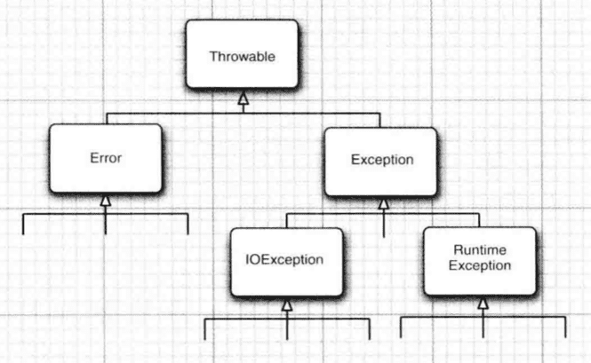

《Java核心技术卷一第10版》笔记

------

http://horstmann.com/corejava


## 1 Java程序设计概述

一旦一种语言应用于某个领域，与现存代码的相容性问题就摆在了人们的面前。


### Java的11个关键术语

1. 简单性
2. 面向对象
3. 分布式
4. 健壮性
5. 安全性
6. 体系结构中立
7. 可移植性
8. 解释型
9. 高性能
10. 多线程
11. 动态性


在网页中运行的Java程序成为**applet**（已过时）。


> “毕竟，语言只是实现目标的工具，而不是目标本身”。
>    --- James Gosling


## 2 Java程序设计环境

### 2.1 安装Java开发工具包

#### 下载JDK

Mac中JDK安装位置一般为：`/Library/Java/JavaVirtualMachines/jdk-13.0.2.jdk/Contents/Home/`

#### 设置JDK


#### 安装库源文件和文档


### 2.2 使用命令行工具


### 2.4 运行图形化应用程序


### 2.5构建并运行applet

我的系统没有 `appletviewer`

## 3.Java的基本程序设计结构


### 3.1 一个简单的Java应用程序

源代码的文件名必须与公共类的名字相同。

Java虚拟机将从指定类中的main方法开始执行。

http://bugs.java.com/bugdatabase/index.jsp   ，java bug数据库，通过bug号（例如 4252539），来查询。

### 3.2 注释

### 3.3 数据类型

8中基本类型，其中4种整型：`int`，`short`，`long`，`byte`；2种浮点类型：`float`，`double`；表示Unicode编码的`char`；`boolean`。

#### 整型

在Java中，整型的范围与运行的机器无关；没有无符号类型。


`int`      4字节；

`short`    2字节；

`long`   8字节；

`byte`    1字节；

```java
400000000000L;
0xCAFE;
010;
0b1001;   
```

建议不要使用八进制常数，易混淆。

#### 浮点数

`float`    4字节；

`double`     8字节；

`NaN`

`Double.POSITIVE_INFINITY`

`Double.NEGATIVE_INFINITY`

#### char

有些Unicode字符可以用一个char值描述，另外一些Unicode字符则需要两个char值。

char类型的字面量值要用**单引号**括起来。`'A'`   `'\u03C0'`


**Unicode转义序列会在解析代码之前得到处理。**

一定要当心注释中的\u。

强烈建议不要使用char类型。

#### Unicode 和 char

**code point**（码点）是指与一个编码表中的某个字符对应的代码值。a code value that is associated with a character in an encoding scheme.

在 Unicode 标准中， 码点采用十六进制书写，并加上前缀U+, 例如**U+0041**就是拉丁字母A的码点。

UTF 16 编码采用不同长度的编码表示所有 Unicode 码点。在基本的多语言级别中， 每个字符用16位表示，通常被称为代码单元(**code unit**)。

### 3.4 变量

`Character.isJavaIdentifierPart()` `Character.isJavaIdentifierStart()`


逐一声明每一个变量可以提高程序的可读性。

变量的声明尽可能地靠近变量第一次使用的地方。

#### 常量

关键字`final`指示**常量**。习惯上，常量名使用全大写。

使用关键字`static final`设置**类常量**。 


### 3.5 运算符


### 3.6 字符串

从概念上讲，Java字符串就是**Unicode字符序列**。

#### 子串

`substring(0, 3)`

#### 拼接

`+`

`String.join()`  

#### 不可变字符串

`String`

不可变字符串的优点：编译器可以让字符串**共享**。

Java的设计者认为共享带来的高效率远远胜过于提取、拼接字符串所带来的低效率。

#### 检测字符串是否相等

`equals()`

`equalsIgnoreCase()`

`==`只能确定两个字符串是否放置在同一个位置上。

#### 空串与Null串

检查一个字符串既不是null也不为空串：

```java
if (str != null && str.length() != 0)
```


#### Code Points and Code Units

`char()`和`length()`都是与**Code Units**相关的。

要想得到第i个Code Points，使用：

```java
int index = greeting.offsetByCodePoints(0, i);
int cp = greeting.codePointAt(index);
```


#### String API

`String`有50+有用的方法

chartAt

codePointAt


#### StringBuilder

### 3.7 IO

#### 读取输入

`Scanner`  

`console`来处理控制台输入

```java
Console cons = System.console();
String username = cons.readLine("User name: ");
char[] passwd = cons.readPassword("Password: ");
```


#### 格式化输出

`System.out.printf`

#### 文件输入与输出

`Paths`

`PrintWriter`

### 3.8 控制流程


### 3.9 大数值

`BigInteger`

`BigDecimal`

任意长度


### 3.10 数组??

```java
int[] a;

int[] a = new int[100];

int[] smallPrimes = {2, 3, 5};

new int[]{17, 19, 31};

smallPrimes = new int[]{17, 19, 31};
```


#### 命令行参数


#### 数组排序


## 4.对象与类


### 4.1 面向对象程序设计概述

#### 类

**封装**（encapsulation，也称**数据隐藏**）

**instance field**  是数据

**方法**（method）是操纵数据的过程

#### 对象

**对象的行为 (behavior )**     可以对对象施加哪些操作，或可以对对象施加哪些方法? 

**对象的状态 (state )**       当施加那些方法时， 对象如何响应?

**对象标识（identity）**   如何辨别具有相同行为与状态的不同对象?

对象状态的改变必须通过调用方法实现。

#### 识别类

识别类的简单规则是在**分析问题的过程中寻找名词，而方法对应着动词。

#### 类之间的关系

依赖（“users-a）

聚合（”has-a“）

继承（”is-a“）


### 4.2 使用预定义类


#### 对象与对象变量

一个对象变量并没有实际包含一个对象，而仅仅引用一个对象。

#### LocalDate


#### mutator method and accessor method


### 4.3 用户自定义类

在一个源文件中，只能有一个公有类，但可以有任意数目的非公有类。

构造器总是伴随着new操作符的执行被调用。


**final实例字段**


### 4.4 静态字段和静态方法

静态变量  

静态常量

静态方法

工厂方法

main方法


### 4.5 Method Parameters 

Java程序设计语言总是采用按值调用。


**方法得到的是对象引用的拷贝，对象引用以及其他的拷贝同时引用同一个对象。**


### 4.6 对象构造


#### 重载(overloading)

方法的签名（signature）

#### Default Field Initialization

#### 无参数的构造器


#### 调用另一个构造器

`this()`

#### 初始化块

首先运行初始化块， 然后才运行构造器的主体部分。

#### 对象析构与finalize方法

由于Java有自动的垃圾回收器，不需要人工回收内存，所以Java不支持析构器。


### 4.7 包


从编译器的角度来看，嵌套的包之间没有任何关系。

<font color=#FF8C00>**一个类可以使用所属包中的所有类，以及其他包中的公有类。**</font>


**静态导入**

`import static java.lang.System.*;`

不必加类名前缀，就可以使用System类的静态方法和静态字段。

将包中的文件放到与完整的包名匹配的子目录中。


### 4.8 类路径

类文件也可以存储在 JAR(Java 归档 )文件中。

JAR 文件使用 ZIP 格式组织文件和子目录。可以使用所有ZIP实用程序查看内部的rt.jar以及其他的JAR文件。

##### 设置类路径

`java -classpath /home/user/dassdir:.:/home/user/archives/archive.jar HyProg`

### 4.9 文档注释


#### 通用注释

`@see com.andyron.com.corejava.Employee#raiseSalary(double)`


#### 包与概述注释

包注释需要在每个包目录中添加一个单独的文件。


### 4.10 类设计技巧


## 5 继承


### 5.1 超类和子类

子类比超类拥有的功能更加丰富。

应该将通用的方法放在超类中，将具有特殊用途的方法放在子类中。


super不是一个对象的引用，不能将其赋给另一个对象变量，它只是一个指示编译器调用超类方法的**特殊关键字**。


#### 理解方法调用??


#### 阻止继承：final类和方法


#### 强制类型转换

`ClassCastException`

`instanceof`

#### 抽象类

#### 受保护访问

`protected`


### 5.2 Object：所有类的超类


#### 5.2.1 equals 方法？？

```java
Objects.equals
```


#### toString()


### 5.3  ArrayList


### 5.4 Object Wrappers and Autoboxing


### 5.5 参数数量可变的方法


### 5.6 枚举类


### 5.7 反射

**反射库**(reflection library，`java.lang.reflect.*`) 提供了一个非常丰富且精心设计的工具集， 以便编写能够动态操纵 Java 代码的程序。

能够分析类能力的程序称为**反射**(reflective )。 

反射主要使用人员是**工具构造者**，它的用途:

- 在运行时分析类的能力。

- 在运行时查看对象， 例如， 编写一个 toString 方法供所有类使用。

- 实现通用的数组操作代码。

- 利用 Method 对象， 这个对象很像中的函数指针。

#### Class类

Java运行时系统始终为所有的对象维护一个被称为**运行时的类型标识**。 这个信息跟踪着每个对象所属的类。 **虚拟机利用运行时类型信息选择相应的方法执行**。保存这些信息的类被称为`Class`。

三种获得Class类对象的方法：

```java
Random generator = new Random0:
Class cl = generator.getClass();
String name = cl.getName(); // name is set to "java.util .Random"


String dassName = "java.util .Random";
Class cl = Class.forName(dassName);


Class dl = Random.class; // if you import java.util
Gass cl2 = int.class;
Class cl3 = Double[].class;

```


Class类实际上是泛型类。例如，`Employee.class`的类型是`Class<Employee>`。

另外一创建Class类实例的方法：

```java
String s = "java.util.Random";
Object m = Class.forName(s).newlnstance();
```


#### 捕获异常

#### 利用反射分析类

`java.lang.reflect.*`

`Field`

`Method`

`Constructor`

`Modifier`   

`.getName()`

`.getType()`

...


#### 在运行时使用反射分析对象


#### 使用反射编写泛型数组代码


#### 调用任意方法


## 6.接口、lambda表达式与内部类


### 6.1 接口

接口中所有方法自动地属于public。

接口绝不能含有实例属性。可以将接口看成是没有实例属性的抽象类。


### 6.2 接口实例

`Comparator`

`Cloneable`   ??


### 6.3 lambda表达式


#### 函数式接口

`Predicate`

#### 方法引用

`::`

`Timer t = new Timer(1000, System.out::println);`


```java
object::instanceMethod
Class::staticMethod
Class::instnaceMethod
```

#### 构造器引用

`Person::new`

#### 变量作用域


#### 处理lambda表达式


#### 再谈Comparator

```java
Arrays.sort(people, Comparator.comparing(Person::getName))
  
Arrays.sort(people, Comparator.comparing(Person::getLastName).thenComparing(Person::getFirstName));

Array.sort(people, Comparator.comparing(Person::getName, (s, t) -> Integer.compare(s.length(), t.length())));
```


### 6.4 内部类


### 6.5 代理??


## 7.异常、断言和日志

向用户通告错误;

保存所有的工作结果; 

允许用户以妥善的形式退出程序。


### 7.1 处理错误

\1. 用户输入错误

\2. 设备错误

\3. 物理限制

\4. 代码错误

在 Java 中， 如果某个方法不能够采用正常的途径完整它的任务， 就可以通过另外一个路径**退出**方法。 在这种情况下， 方法并**不返回任何值**， 而是抛出 (throw) 一个封装了错误信息的对象。 异常处理机制开始搜索能够处理这种异常状况的**异常处理器** (exception handler )。

#### 异常分类




### 7.2 捕获异常

如果某个异常发生的时候没有在任何地方进行捕获， 那程序就会终止执行， 并在控制台上打印出异常信息， 其中包括异常的类型和堆栈的内容。

#### finally子句

不管是否有异常被捕获， finally 子句中的代码都被执行。 

#### 带资源的 try 语句

```java
try (Resource res = ...) {
  work with res
}
```


#### 分析堆栈轨迹元素

### 7.3 使用异常机制的技巧


### 7.4 使用断言


### 7.5 记录日志


### 7.6 调试技巧


## 8.泛型程序设计


### 8.1 为什么要使用泛型程序设计

泛型程序设计(Generic programming) 


### 8.9 反射和泛型？？


## 9.集合


### 9.1 Java集合框架


#### 接口与实现分离


#### Collection


#### Iterator

`Iterator`

`Iterable`   **for each**

`iterator.forEachRemaining()`


#### 泛型使用方法


`AbstractCollection`


#### 集合框架中的接口


`SortedSet`  `SortedMap`

`NavigableSet`   `NagigableMap`

### 9.2 具体的集合


#### 链表

`Linkedlist`


#### 数组列表


#### 散列集  HashSet


#### 树集  TreeSet


#### 队列与双端队列


#### 优先级队列


### 9.3 映射


### 9.6 遗留的集合


#### Hashtable


#### 枚举


#### Properties


#### Stack


#### 位集


## 13.部署Java应用程序

### 13.1 Jar文件


### 13.2 应用首选项的存储

`java.util.prefs.Preferences`


```

```


## 14.并发


### 14.1 什么是线程