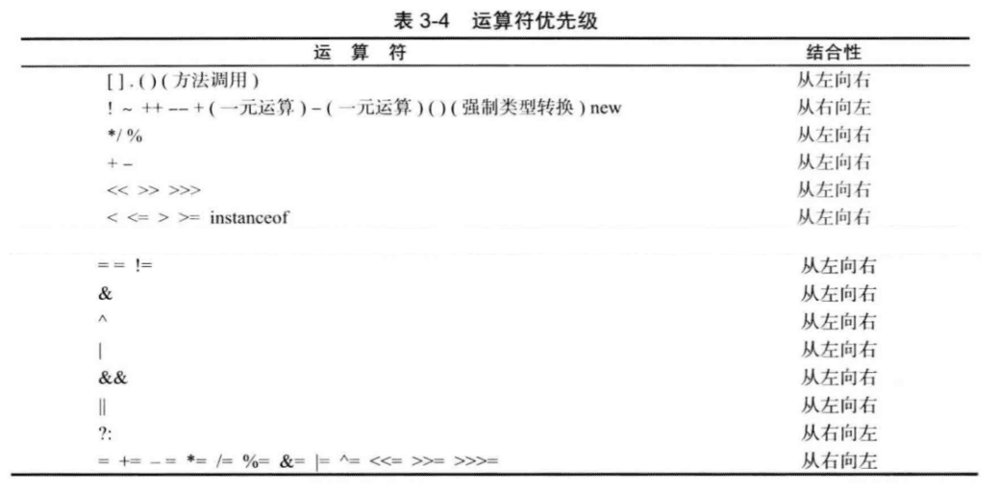
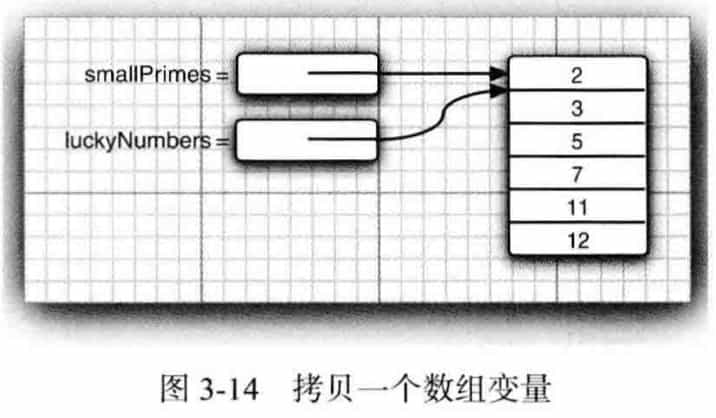
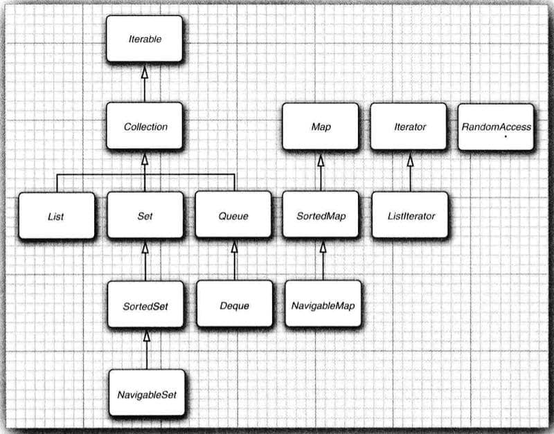
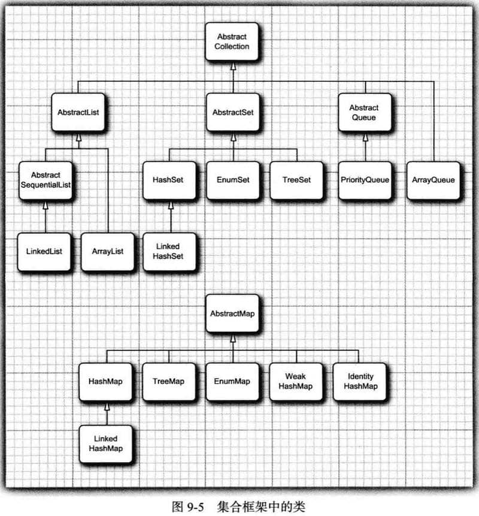

《Java核心技术卷一第10版》笔记

------

http://horstmann.com/corejava


## 1 Java程序设计概述

一旦一种语言应用于某个领域，与现存代码的相容性问题就摆在了人们的面前。


### Java的11个关键术语

1. 简单性
2. 面向对象
3. 分布式
4. 健壮性
5. 安全性
6. 体系结构中立
7. 可移植性
8. 解释型
9. 高性能
10. 多线程
11. 动态性


在网页中运行的Java程序成为**applet**（已过时）。


> “毕竟，语言只是实现目标的工具，而不是目标本身”。
>    --- James Gosling


## 2 Java程序设计环境

### 2.1 安装Java开发工具包

#### 下载JDK

Mac中JDK安装位置一般为：`/Library/Java/JavaVirtualMachines/jdk-13.0.2.jdk/Contents/Home/`

#### 设置JDK


#### 安装库源文件和文档


### 2.2 使用命令行工具

```shell
javac Welcome.java
java Welcome
```

编译器需要一个**文件名**(Welcomejava)，而运行程序时，只需要指定**类名**(Welcome)，不要带扩展名 .java 或 .class。

### 2.3 使用集成开发环境


### 2.4 运行图形化应用程序


### 2.5构建并运行applet

我的系统没有 `appletviewer`

## 3.Java的基本程序设计结构


### 3.1 一个简单的Java应用程序

源代码的文件名必须与公共类的名字相同。

Java虚拟机将从指定类中的main方法开始执行。

[java bug数据库](http://bugs.java.com/bugdatabase/index.jsp   )，通过bug号（例如 4252539），来查询。

 Sun公司在 Java 开源很久以前就把 bug 报 告及其解决方案放到网站上让所有人监督检查， 这是一种非常了不起的举动。


每个 Java 应用程序都必须有一个 main 方法：

```java
public class ClassName {
	public static void main(String[] args) {	
    program statements
	} 
}
```

>  Java 中的所有函數都属于某个类的方法。
>
>  Java 中的 main 方法必须有一个外壳类。
>
> Java 中的 main 方法必须是静态的。 void 表示这个方法没有返回值。

### 3.2 注释

```java
//

/*
*/

/**
 */

```


### 3.3 数据类型

8中基本类型，其中4种整型：`int`，`short`，`long`，`byte`；2种浮点类型：`float`，`double`；表示Unicode编码的`char`；`boolean`。

#### 整型

在Java中，整型的范围与运行的机器无关；没有无符号类型。


`int`      4字节；

`short`    2字节；

`long`   8字节；

`byte`    1字节；

```java
400000000000L;
0xCAFE;
010;
0b1001;   
```

建议不要使用八进制常数，易混淆。

#### 浮点数

`float`    4字节；

`double`     8字节；

`NaN`

`Double.POSITIVE_INFINITY`

`Double.NEGATIVE_INFINITY`

#### char

有些Unicode字符可以用一个char值描述，另外一些Unicode字符则需要两个char值。

char类型的字面量值要用**单引号**括起来。`'A'`   `'\u03C0'`


**Unicode转义序列会在解析代码之前得到处理。**

一定要当心注释中的\u。

强烈建议不要使用char类型。

#### Unicode 和 char

**code point**（码点）是指与一个编码表中的某个字符对应的代码值。a code value that is associated with a character in an encoding scheme.

在 Unicode 标准中， 码点采用十六进制书写，并加上前缀U+, 例如**U+0041**就是拉丁字母A的码点。

UTF 16 编码采用不同长度的编码表示所有 Unicode 码点。在基本的多语言级别中， 每个字符用16位表示，通常被称为代码单元(**code unit**)。

### 3.4 变量

`Character.isJavaIdentifierPart()` `Character.isJavaIdentifierStart()`


逐一声明每一个变量可以提高程序的可读性。

变量的声明尽可能地靠近变量第一次使用的地方。

#### 常量

关键字`final`指示**常量**。习惯上，常量名使用全大写。

使用关键字`static final`设置**类常量**。 


### 3.5 运算符

#### 数学函数与常量

```java


Math.sin 
Math.cos 
Math.tan
Math.atan 
Math.atan2
  
Math.exp 
Math.log 
Math.log1O
  
Math.sqrt(x)
Math.pow(x, a)
```

不必在数学方法名和常量名前添加前缀”Math“：`import static java.lang.Math.*`。

#### 数值类型之间的转换

```java
int n = 123456789;
float f = n; // f is 1.23456792E8
```


#### 强制类型转换(cast)

```java
double x * 9.997; 
int nx = (int) x;

double x z 9.997;
int nx = (int) Math.round(x);
```

> 如果试图将一个数值从一种类型强制转换为另一种类型， 而又超出了目标类型的 表示范围， 结果就会截断成一个完全不同的值。例如，(byte) 300 的实际值为 44。(10010 1100 -> 0010 1100，也就是300-256=44)

#### 结合赋值和运算符

```java
x += 4;
x *= 4;
x %= 4;
```

> 如果运算符得到一个值， 其类型与左侧操作数的类型不同， 就会发生强制类型转换。

#### 自增与自减运算符

```java
n++;
++n;
```

#### 关系和 boolean 运算符

```java
3 == 7
3 != 7

expression1 && expression2
expression1 || expression2
!expression

condition ? expression1 : expression2
```


#### 位运算符

```java
&
|
^("xor")
~

>>  	<<
>>>
```


#### 括号与运算符级别



#### 枚举类型

```java
enum Size {SMALL, MEDIUM, LARGE, EXTRA_LARCE};
Size s = Size.MEDIUM;
```


### 3.6 字符串

从概念上讲，Java字符串就是**Unicode字符序列**。

#### 子串

`substring(0, 3)`

#### 拼接

`+`

`String.join()`  

#### 不可变字符串

`String`

不可变字符串的优点：编译器可以让字符串**共享**。

Java的设计者认为共享带来的高效率远远胜过于提取、拼接字符串所带来的低效率。

#### 检测字符串是否相等

`equals()`

`equalsIgnoreCase()`

`==`只能确定两个字符串是否放置在同一个位置上。

#### 空串与Null串

检查一个字符串既不是null也不为空串：

```java
if (str != null && str.length() != 0)
```


#### Code Points(码点) and Code Units（代码单元）

`length()`是计算**Code Units**个数。(有时两个或几个代码单元组成一个码点)

要想得到第i个Code Points，使用：

```java
int index = greeting.offsetByCodePoints(0, i);
int cp = greeting.codePointAt(index);
```

也就是**String.length()**方法返回的是**代码单元(code unit)**的个数，而**String.codePointCount(0, length)**返回的是**码点(code point)**个数，即字符的个数。例子：

```java
System.out.println("---------------我是分割线-----------------");
String sentence = "\u0041 \u0042";  // 该字符串的第二个（从一开始计）字符是空格
System.out.println(sentence);
int lengthU = sentence.length();
int lengthP = sentence.codePointCount(0, lengthU);
System.out.println(lengthU);        // 3个code units
System.out.println(lengthP);        // 3个code points
```

结果：

```
---------------我是分割线-----------------
A B
3
3
```


```java
System.out.println("---------------我是分割线-----------------");
String sentence = "\u03C0 \uD835\uDD6B";    // 该字符串的第二个（从一开始计）字符是空格
System.out.println(sentence);
int lengthU = sentence.length();
int lengthP = sentence.codePointCount(0, lengthU);
System.out.println(lengthU);        // 4个code units
System.out.println(lengthP);        // 3个code points
```

结果：

```
---------------我是分割线-----------------
π 𝕫
4
3
```


#### String API

`String`有50+有用的方法

```java
//  java.lang.string 

char charAt(int index)
返回给定位置的代码单元。除非对底层的代码单元感兴趣， 否则不需要调用这个方法。
int codePointAt( int Index)
返回从给定位置开始的码点。
int offsetByCodePoints(int startlndex, int cpCount) 
返回从 startlndex 代码点开始， 位移 cpCount 后的码点索引。
int compareTo(String other)
按照字典顺序， 如果字符串位于 other 之前， 返回一个负数; 如果字符串位于 other 之后， 返回一个正数; 如果两个字符串相等， 返回 0。
IntStream codePoints()
将这个字符串的码点作为一个流返回。 调用 toArray 将它们放在一个数组中。
new String(int[] codePoints, int offset, int count) 
用数组中从 offset 开始的 count 个码点构造一个字符串。
boolean equals(Object other)
如果字符串与 other 相等， 返回 true。
  
boolean equalsIgnoreCase(String other) 
如果字符串与 other 相等 (忽略大小写，) 返回 tme。
boolean startsWith(String prefix) 
boolean endsWith(String suffix)
如果字符串以 suffix 开头或结尾， 则返回 true。 
                                                                     int indexOf(String str)
int indexOf(String str, int fromlndex)
int indexOf(int cp)
int indexOf(int cp, int fromlndex)
返回与字符串 str 或代码点 cp 匹配的第一个子串的开始位置。这个位置从索引 0 或 fromlndex 开始计算。 如果在原始串中不存在 st，r 返回 - 1。

                                                                      int 1astIndexOf(String str)
int 1astIndexOf(String str, int fromlndex) 
int lastindexOf(int cp)
int 1astindexOf(int cp, int fromlndex)
返回与字符串 str 或代码点 cp 匹配的最后一个子串的开始位置。 这个位置从原始串尾端或 fromlndex 开始计算。 

int 1ength( )
返回字符串的长度。
int codePointCount(int startlndex, int endlndex) 
返回 startlndex 和 endludex- l 之间的代码点数量。 没有配成对的代用字符将计入代码点。
String replace(CharSequence oldString,CharSequence newString) 
返回一个新字符串。 这个字符串用 newString 代替原始字符串中所有的 oldString。 可 以用 String 或 StringBuilder 对象作为 CharSequence 参数。
String substring(int beginlndex)
String substring(int beginlndex, int endlndex)
返回一个新字符串。这个字符串包含原始字符串中从 beginlndex 到串尾或 endlndex-l
的所有代码单元。
                                                                      
String toLowerCase( ) 
String toUpperCase( )
返回一个新字符串。 这个字符串将原始字符串中的大写字母改为小写， 或者将原始字符串中的所有小写字母改成了大写字母。
String trim( )
返回一个新字符串。 这个字符串将删除了原始字符串头部和尾部的空格。
String join(CharSequence delimiter, CharSequence... elements) 
返回一个新字符串， 用给定的定界符连接所有元素。
```


#### StringBuilder

每次连接字符串， 都会构建一个新的`String`对象，既耗时又浪费空间 。使用`StringBuilde`可以避免。

```java
StringBuilder builder = new StringBuilder();
builder.append(ch); // appends a single character
bui1der.append(str); // appends a string
String completedString = builder.toString();
```


```java
// java.lang.StringBuilder

StringBuilder()
构造一个空的字符串构建器。
int length()
返回构建器或缓冲器中的代码单元数量。
StringBui1der append(String str)
追加一个字符串并返回 this。
StringBui1der append(char c)
追加一个代码单元并返回 this。
StringBui1der appendCodePoint(int cp)
追加一个代码点，并将其转换为一个或两个代码单元并返回 this。
void setCharAt(int i,char c)
将第i个代码单元设置为 c。
StringBui1der insert(int offset,String str)
在 offset 位置插入一个字符串并返回 this。
StringBuilder insert(int offset,Char c)
在offset位置插入一个代码单元并返回 thi。s
StringBui1der delete(1nt startindex,int endlndex)
删除偏移量从startIndex到 endlndex-1 的代码单元并返回this。 
String toString()
返回一个与构建器或缓冲器内容相同的字符串。
```


### 3.7 IO

#### 读取输入

`Scanner`  

`console`来处理控制台输入

```java
Console cons = System.console();
String username = cons.readLine("User name: ");
char[] passwd = cons.readPassword("Password: ");
```

```java
// java.util.Scanner

Scanner (InputStream in)
用给定的输人流创建一个 Scanner 对象。 
String nextLine( )
读取输入的下一行内容。
String next( )
读取输入的下一个单词 (以空格作为分隔符)。 
int nextlnt( )
double nextDouble( )
读取并转换下一个表示整数或浮点数的字符序列。
boolean hasNext( )
检测输人中是否还有其他单词。
boolean hasNextInt( )
boolean hasNextDouble( )
检测是否还有表示整数或浮点数的下一个字符序列。

// java.lang System
static Console console( )

// java.io.Console
static char[] readPassword(String prompt, Object...args)
static String readLine(String prompt, Object...args)
显示字符串 prompt 并且读取用户输入， 直到输入行结束。 args 参数可以用来提供输人 格式。 有关这部分内容将在下一节中介绍。
```


#### 格式化输出

```java
System.out.printf("Hello, %s, Next year, you'll be %d", name, age);
```


!!

#### 文件输入与输出

`Paths`

`PrintWriter`


```java
Scanner in = new Scanner(Paths.get("niyflle.txt"), "UTF-8");
```


### 3.8 控制流程

#### 块作用域

#### 条件语句

#### 循环 while

#### 确定循环 for

#### 多重选择 switch

#### 中断

```java

break;

continue;
```


### 3.9 大数值

`BigInteger`

`BigDecimal`

任意长度

```java
BigInteger a = BigInteger.valueOf(100);
BigInteger c = a.add(b);
BigInteger d = c.multiply(b.add(BigInteger.valueOf(2)));  // d = c * (b + 2)
```


### 3.10 数组

#### for each循环


#### 数组初始化

```java
int[] a;

int[] a = new int[100];

int[] smallPrimes = {2, 3, 5};

new int[]{17, 19, 31};

smallPrimes = new int[]{17, 19, 31};
```

#### 数组拷贝

将一个数组变量拷贝给另一个数组变量：

```java
intQ luckyNumbers = smallPrimes;
1uckyNumbers[5] = 12;  // now smallPrimes[5] is also 12
```



将 一个数组的所有值拷贝到一个新的数组中去：

```java
int[] copiedLuckyNumbers = Arrays.copyOf(luckyNumbers, luckyNumbers.length);
```


`copyOf`方法通常用来增加数组的大小:

```java
luckyNumbers = Arrays.copyOf(luckyNumbers, 2 * luckyNumbers.length);
```

如果数组元素是数值型， 那么多余的元素将被赋值为 0 ;如果数组元素是布尔型， 则将赋值 为 false。 相反， 如果长度小于原始数组的长度， 则只拷贝最前面的数据元素。


#### 命令行参数

```shell
$ java Message -g cruel world 
```

args 数组内容为：

```
args[0]: "-g"
args[1]: "cruel"
args[2]: "world"
```


#### 数组排序

```java
Arrays.sort(arr);
```

!!

#### 多维数组

!!

#### 不规则数组

!!


## 4.对象与类


### 4.1 面向对象程序设计概述

#### 类

由类**构造**(construct) 对象的过程称为创建类的**实例**(instance)。

**封装**（encapsulation，也称**数据隐藏**）

对象中的数据称为**实例域（instance field）**， 操纵数据的过程 称为**方法**（method）。

通过扩展一个类来建立另外一个类的过程称为**继承 (inheritance)**。 

#### 对象

- **对象的行为 (behavior )**     可以对对象施加哪些操作，或可以对对象施加哪些方法? 

- **对象的状态 (state )**       当施加那些方法时， 对象如何响应?

- **对象标识（identity）**   如何辨别具有相同行为与状态的不同对象?

对象状态的改变必须通过调用方法实现。

#### 识别类

识别类的简单规则是在**分析问题的过程中寻找<font color=#FF8C00>名词</font>，而方法对应着<font color=#FF8C00>动词</font>**。

#### 类之间的关系

**依赖**（“users-a）

**聚合**（”has-a“）

**继承**（”is-a“）

应该尽可能地将相互依赖的类减至最少(在软件工程中，就是让类之间的耦合度最小)。

### 4.2 使用预定义类

#### 对象与对象变量

构造器的名字应该与类名相同。

一个对象变量并没有实际包含一个对象，而仅仅引用一个对象。

#### LocalDate

类库设计者决定将**保存时间**与**给时间点命名**分开。所以标准 Java 类库分别包含了两个类: 一个是用来表示时间点的 **Date** 类(表示距离一个固定时间点UTC的毫秒数); 另一个是用来表示大家熟悉的日历表示法的 **LocalDate** 类。


```java
LocalDate.now(); 		// LocalDate不使用构造器，使用静态工厂方法
LocalDate newYearsEve = LocalDate.of(1999, 12, 31);
int year = newYearEve.getYear();
int month = newYearEve.getMonthValue();
int day = newYearsEve.getDayOfMonth();

// 距离当前对象指定天数的一个日期
LocalDate aThousandDaysLater = newYearsEve.piusDays(1000): year = aThousandDaysLater.getYearO;	// 2002
month = aThousandDaysLater.getMonthValueO; 	// 09
day = aThousandDaysLater.getDayOfMonth(); 	// 26
```

> Date类也有getDay、getMonth等方法，但已经不推荐使用了。
>
> 当类库设计者意识到某个方法不应该存在时， 就把它标记为不鼓励使用（被加上@Deprecated注解）。

#### 更改器方法与访问器方法

上面的plusDays 方法会生成一个新的 LocalDate 对象。另一个日历类**GregorianCalendar**就不一样了：

```java
CregorianCalendar someDay = new CregorianCalendar(1999, 11, 31); 
someDay.add(Calendar.DAY_0F_M0NTH, 1000);

year = someDay.get(Calendar.YEAR); // 2002 
month = someDay.get(Calendar.MONTH) + 1; // 09 
day = someDay.ge(t Ca1endar.DAY_0F_M0NTH); // 26
```

 GregorianCalendar.add 方法是一个**更改器方法 ( mutator method )** 。

正因如此，将变量命名为 someDay 而不是 newYearsEve 调用这个更改 器方法之后， 它不再是新年前夜。

相 反， 只访问对象而不修改对象的方法有时称为**访 问 器 方 法** 。例 如， LocalDate.getYear 和 GregorianCalendar.get 就是访问器方法。

>  C++：带有const后缀的方法是访问器方法，默认是更改器方法 。 
>
>  Java： 访问器方法与更改器方法在语法上没有明显的区别。

```java
// 使用LocalDate来显示当前月的日历
	public static void main(String[] args) {
        LocalDate date = LocalDate.now();
        int month = date.getMonthValue();
        int today = date.getDayOfMonth();

        // 把date设置成当前月的第一天
        date = date.minusDays(today - 1);
        DayOfWeek weekday = date.getDayOfWeek();
        int value = weekday.getValue();

        System.out.println("Mon Tue Wed Thu Fri Sat Sun");
        for (int i = 1; i < value; i++) {
            // 四个空格，表示如"Mon "
            System.out.print("    ");
        }

        while (date.getMonthValue() == month) {
            System.out.printf("%3d", date.getDayOfMonth());
            if (date.getDayOfMonth() == today) {
                System.out.print("*");
            } else {
                System.out.print(" ");
            }
            date = date.plusDays(1);
            if (date.getDayOfWeek().getValue() == 1) {
                System.out.println();
            }
        }
        if (date.getDayOfWeek().getValue() != 1) {
            System.out.println();
        }
    }
```


### 4.3 用户自定义类

要想创建一个完整的程序， 应该将若干类组合在一起， 其中只有一个类有 **main 方法**。

#### Employee 类

```java
	// EmployeeTest/EmployeeTest.java
import java.time.LocalDate;

/**
 *
 */
public class EmployeeTest {
  
    public static void main(String[] args) {
        Employee[] staff = new Employee[3];

        staff[0] = new Employee("Jack Ma", 75000, 1995, 12,15);
        staff[1] = new Employee("Pony Ma", 55000, 1993, 11,2);
        staff[2] = new Employee("Robin Li", 25000, 1994, 4,12);

        for (Employee e : staff) {
            e.raiseSalary(5);
        }

        for (Employee e: staff) {
            System.out.println("name=" + e.getName() + ", salary=" + e.getSalary() + ", hireDay=" + e.getHireDay());
        }     
    }
}

class Employee {
    private String name;
    private double salary;
    private LocalDate hireDay;

    public Employee(String n, double s, int year, int month, int day) {
        name = n;
        salary = s;
        hireDay = LocalDate.of(year, month, day);
    }

    public String getName() {
        return name;
    }

    public double getSalary() {
        return salary;
    }

    public LocalDate getHireDay() {
        return hireDay;
    }

    public void raiseSalary(double byPercent) {
        double raise = salary * byPercent / 100;
        salary += raise;
    }
}  
```

文件名必须与 public 类的名字相匹配。

在一个源文件中，只能有一个public类，但可以有任意数目的非public 类。

编译器会把上面的源代码编译成两个.class文件：EmployeeTest. class 和 Employee.class。

将包含main方法的类名（此处是EmployeeTest）提供给字节码解释器，就启动程序：

```shell
$ java EmployeeTest
```


#### 多个源文件的使用

如果把Employee类单独放在Employee.java文件中，那么就有两种编译方法：

1. 通配符调用

   ```shell
   $ javac Employee*.java
   ```

2. 直接编译

   ```shell
   $ javac EmployeeTest.java
   ```

   Java编译器会自动地搜索对应java类文件（Employee.java）。


#### 构造器

- 构造器与类同名 
- 每个类可以有一个以上的构造器 
- 构造器可以有 0 个、1 个或多个参数 
- 构造器没有返回值 
- 构造器总是伴随着 new 操作一起调用

#### 隐式参数与显式参数


#### 封装的优点


#### 基于类的访问权限


#### 私有方法


#### **final实例域**

构建对象时必须初始化这样的域。也就是说， 必须确保在每 一个构造器执行之后， 这个域的值被设置， 并且在后面的操作中， 不能够再对它进行修改。


### 4.4 静态域和静态方法

#### 静态域

```java
private static int nextld = 1;
```

#### 静态常量

```java
public static final double PI = 3.14159265358979323846;
```

#### 静态方法

不能向对象实施操作的方法。

#### 工厂方法

静态方法还有另外一种常见的用途。 类似 LocalDate 和 NumberFormat 的类使用静态工 厂方法 ( factory methocd） 来构造对象。 


#### main方法


### 4.5 方法参数

Java程序设计语言总是采用**按值调用**。

**方法得到的是对象引用的拷贝，对象引用以及其他的拷贝同时引用同一个对象。**


### 4.6 对象构造


#### 重载(overloading)

方法的签名（signature）

#### 默认域初始化（Default Field Initialization）


#### 无参数的构造器


#### 显式域初始化


#### 参数名


#### 调用另一个构造器

`this()`


#### 初始化块

首先运行初始化块， 然后才运行构造器的主体部分。


#### 对象析构与finalize方法

由于Java有自动的垃圾回收器，不需要人工回收内存，所以Java不支持析构器。


### 4.7 包

使用包的主要原因是**确保类名的唯一性**。

从编译器的角度来看，嵌套的包之间没有任何关系。

#### 类的导入

<font color=#FF8C00>**一个类可以使用所属包中的所有类，以及其他包中的公有类。**</font>


#### **静态导入**

```java
import static java.lang.System.*;
```

不必加类名前缀，就可以使用System类的静态方法和静态域。

```java
out.println("Goodbye, World!"); 	// i.e., System.out
exit(0); //i.e., System.exit 
```


#### 将类放入包中

将包中的文件放到与完整的包名匹配的子目录中。


#### 包作用域


### 4.8 类路径

类文件也可以存储在 **JAR(Java 归档 )**文件中。

JAR 文件使用 **ZIP 格式组织文件和子目录**。可以使用所有ZIP实用程序查看内部的rt.jar以及其他的JAR文件。

#### 设置类路径

`java -classpath /home/user/dassdir:.:/home/user/archives/archive.jar HyProg`

### 4.9 文档注释 🔖

由于文档注释与源代码在同一个文件中， 在修改源代码的同时， 重新运 行 javadoc 就可以轻而易举地保持两者的一致性。

#### 注释的插入


#### 类注释


#### 方法注释


#### 域注释


#### 通用注释

`@see com.andyron.com.corejava.Employee#raiseSalary(double)`


#### 包与概述注释

包注释需要在每个包目录中添加一个单独的文件。


#### 注释的抽取


### 4.10 类设计技巧

1. 一定要保证数据私有
2. 一定要对数据初始化
3. 不要在类中使用过多的基本类型
4. 不是所有的域都需要独立的域访问器和域更改器
5. 将职责过多的类进行分解
6. 类名和方法名要能够体现它们的职责
7. 优先使用不可变的类


## 5 继承


### 5.1 超类和子类

#### 定义子类

子类比超类拥有的功能更加丰富。

应该将通用的方法放在超类中，将具有特殊用途的方法放在子类中。

#### 重写（override）方法


super不是一个对象的引用，不能将其赋给另一个对象变量，它只是一个指示编译器调用超类方法的**特殊关键字**。


#### 子类构造器


#### 继承层次


#### 多态


#### 理解方法调用 🔖


#### 阻止继承：final类和方法


#### 强制类型转换

`ClassCastException`

`instanceof`


#### 抽象类


#### 受保护访问

`protected`


### 5.2 Object：所有类的超类


#### equals 方法  🔖

```java
Objects.equals
```


#### 相等测试与继承


#### hashCode方法


#### toString()


### 5.3  泛型数组列表ArrayList


#### 访问数组列表元素


#### 类型化与原始数组列表的兼容性


### 5.4 对象包装器与自动装箱


### 5.5 参数数量可变的方法

```java
public class PrintStream {}
		public PrintStream printf(String format, Object ... args) {
        return format(format, args);
    }
}
```

这里的省略号 . . . 是 Java 代码的一部分， 它表明这个方法可以接收任意数量的对象 (除 fmt 参数之外 )。


### 5.6 枚举类


### 5.7 反射

**反射库**(reflection library，`java.lang.reflect.*`) 提供了一个非常丰富且精心设计的工具集， 以便编写能够动态操纵 Java 代码的程序。

能够分析类能力的程序称为**反射**(reflective )。 

反射主要使用人员是**工具构造者**，它的用途:

- 在运行时分析类的能力。

- 在运行时查看对象， 例如， 编写一个 toString 方法供所有类使用。

- 实现通用的数组操作代码。

- 利用 Method 对象， 这个对象很像中的函数指针。

#### Class类

Java运行时系统始终为所有的对象维护一个被称为**运行时的类型标识**。 这个信息跟踪着每个对象所属的类。 **虚拟机利用运行时类型信息选择相应的方法执行**。保存这些信息的类被称为`Class`。

三种获得Class类对象的方法：

```java
Random generator = new Random0:
Class cl = generator.getClass();
String name = cl.getName(); // name is set to "java.util .Random"


String dassName = "java.util .Random";
Class cl = Class.forName(dassName);


Class dl = Random.class; // if you import java.util
Gass cl2 = int.class;
Class cl3 = Double[].class;

```


Class类实际上是泛型类。例如，`Employee.class`的类型是`Class<Employee>`。

另外一创建Class类实例的方法：

```java
String s = "java.util.Random";
Object m = Class.forName(s).newlnstance();
```


#### 捕获异常


#### 利用反射分析类

`java.lang.reflect.*`

`Field`

`Method`

`Constructor`

`Modifier`   

`.getName()`

`.getType()`

...


#### 在运行时使用反射分析对象


#### 使用反射编写泛型数组代码


#### 调用任意方法


### 5.8 继承的设计技巧

1. 将公共操作和域放在超类
2. 不要使用受保护的域
3. 使用继承实现 isa 关系
4. 除非所有继承的方法都有意义， 否则不要使用继承
5. 在覆盖方法时， 不要改变预期的行为
6. 使用多态， 而非类型信息
7. 不要过多地使用反射


## 6.接口、lambda表达式与内部类


### 6.1 接口

接口不是类，而是对类的一组需求描述。

**接口中所有方法自动地属于public**。

接口绝不能含有实例属性。可以将接口看成是没有实例属性的抽象类。

#### 接口的特性

尽管不能构造接口的对象， 却能声明接口的变量；接口变量必须弓I用实现了接口的类对象:

```java
Comparable x;
x= new Employee(...) // Employee 实现了 Comparable
```

检测一个对象是否实现了某个接口：

```java
if (anObj instanceof Comparable) { ... }
```

接口可以建立像类一样的继承关系，从而**扩展**接口；接口中可以包含常量：

```java
public interface Moveable {
  void move(double x, double y);
}

public interface Powered extends Moveable {
  double milesPerGallon();
  double SPEED_LIMIT = 95;  // 省略了 public static final 
}
```

**接口中的方法和常量不需要加任何修饰符号。**

#### 接口与抽象类

接口可以提供多重继承的大多数好处， 同时还能避免多重继承的复杂性和低效性。

#### 静态方法

标准库中，成对的接口和实用工具类，如Collection/Collections、Path/Paths。

#### 默认方法

可以为接口方法提供一个默认实现。需要`default`修饰符。

#### 解决默认方法冲突


### 6.2 接口实例

#### 接口与回调

#### Comparator接口


#### 对象克隆

clone方法是 Object 的一个 protected 方法。

**浅拷贝**：没有克隆对象中引用的其他对象。默认拷贝是浅拷贝，还会共享信息。


`Cloneable`   

重写clone方法实现深拷贝。

### 6.3 lambda表达式

#### 为什么引入lambda表达式


#### lambda表达式的语法

lambda表达式就是**一个代码块， 以及必须传人 代码的变量规范**。

```java
(参数) -> { 表达式 }
```

```java
(String first, String second) -> { first.lengthO - second.lengthO }
```


#### 函数式接口

对于只有一个抽象方法的接口， 需要这种接口的对象时， 就可以提供一个 lambda 表达 式。 这种接口称为**函数式接口 (functional interface )**。

最好把 lambda 表达式看作是一 个函数， 而不是一个对象。

`Comparator `

`Predicate`  专门用来传递 lambda 表达式。

#### 方法引用
```java
Timer t = new Timer(1000, System.out::println);
```

表达式 `System.out::println` 是一个**方法引用(method reference)**, 它等价于 lambda 表达式 `x 一> System.out.println(x)`。

```java
Timer t = new Timer(1000, event -> System.out.println(event));
```

用:: 操作符分隔方法名与对象或类名有三种方式：


```java
object::instanceMethod
```

```java
Class::staticMethod
Math::pow 等价于 (x，y) -> Math.pow(x, y)
```

```java
Class::instnaceMethod
String::compareToIgnoreCase 等同于 (x, y) -> x.compareToIgnoreCase(y)
```

#### 构造器引用

`Person::new`

#### 变量作用域


#### 处理lambda表达式??


#### 再谈Comparator

```java
Arrays.sort(people, Comparator.comparing(Person::getName))
  
Arrays.sort(people, Comparator.comparing(Person::getLastName).thenComparing(Person::getFirstName));

Array.sort(people, Comparator.comparing(Person::getName, (s, t) -> Integer.compare(s.length(), t.length())));
```


### 6.4 内部类(inner class)??

使用内部类的原因：

- 内部类方法可以访问该类定义所在的作用域中的数据， 包括私有的数据。 
- 内部类可以对同一个包中的其他类隐藏起来。 
- 当想要定义一个回调函数且不想编写大量代码时，使用匿名(anonymous) 内部类比较便捷。


内部类既可以访问自身的数据域， 也 可以访问创建它的外围类对象的数据域。

#### 内部类的特殊语法规则


#### 内部类是否有用、必要和安全

#### 局部内部类

在某个代码块中。

#### 由外部方法访问变量

#### 匿名内部类


#### 静态内部类


### 6.5 代理

#### 何时使用代理

#### 创建代理对象

#### 代理类的特性


## 7.异常、断言和日志

向用户通告错误;

保存所有的工作结果; 

允许用户以妥善的形式退出程序。


### 7.1 处理错误

\1. 用户输入错误

\2. 设备错误

\3. 物理限制

\4. 代码错误

在 Java 中， 如果某个方法不能够采用正常的途径完整它的任务， 就可以通过另外一个路径**退出**方法。 在这种情况下， 方法并**不返回任何值**， 而是抛出 (throw) 一个封装了错误信息的对象。 异常处理机制开始搜索能够处理这种异常状况的**异常处理器** (exception handler )。

#### 异常分类


### 7.2 捕获异常

如果某个异常发生的时候没有在任何地方进行捕获， 那程序就会终止执行， 并在控制台上打印出异常信息， 其中包括异常的类型和堆栈的内容。

#### finally子句

不管是否有异常被捕获， finally 子句中的代码都被执行。 

#### 带资源的 try 语句

```java
try (Resource res = ...) {
  work with res
}
```


#### 分析堆栈轨迹元素

### 7.3 使用异常机制的技巧


### 7.4 使用断言


### 7.5 记录日志


### 7.6 调试技巧


## 8.泛型程序设计


### 8.1 为什么要使用泛型程序设计

泛型程序设计(Generic programming) 


### 8.9 反射和泛型？？


## 9.集合


### 9.1 Java集合框架


#### 将集合的接口与实现分离

以队列为例子看是如何分离的。

队列接口：

```java
public interface Queue<E> { // a simplified form of the interface in the standard library
void add(E element); E remove();
int size();
}  
```

队列通常有两种实现方式：循环数组；链表。

```java
public class Ci cularAr ayQueue<E> implements Queue<E> { // not an actual library class
  private int head;
  private int tail;
  CircularArrayQueue(int capacity) { . . . } 
  public void add(E element) { . . . }
  public E remove0{ . . . }
  public int size() { . . . }
  private EQ elements;
}
```

```java
public class LinkedListQueue<E> iipleients Queue<E> { // not an actual library class
  private Link head; 
  private Link tail;
  
  LinkedListQueueO { . . . } 
  public void add(Eelement) {...} 
  public E remove() { ...}
  public int size() { . . . }
}  
```

使用：

```java
Queue<Customer> expresslane = new CircularArrayQueue<>(100); 
expessLane.add(new Customer("Harry"));
```

一旦改变了想法， 可以轻松地使用另外一种不同的实现：

```java
Queue<Custoaer> expressLane = new LinkedListQueue<>(); expressLane.add(new Custonier("Harry"));
```


#### Collection接口

基本接口 `Collection`

```java
public interface Collection<E> {
	boolean add(E element); 
  Iterator<E> iterator();
  ...
}
```


#### 迭代器 Iterator

```java
public interface Iterator<E> {
  E next();
  boolean hasNext();
  void remove();
  default void forEachRemaining(Consumer<? super E> action);
}
```


`Iterator`

`Iterable`   **for each**

`iterator.forEachRemaining()`


#### 泛型使用方法

由于 Collection 与 Iterator 都是泛型接口， 可以编写操作任何集合类型的实用方法。

```java
int sizeO
boolean isEmptyO
boolean contains(Object obj)
boolean containsAl1(Col1ection<?> c)
boolean equals(Object other)
boolean addAll (Collection<? extends E> from) 
boolean remove(Object obj)
boolean removeAl1(Col1ection<?> c)
void clear()
boolean retainAl1(Col1ection<?> c)
Object口 toArray()
<T> T[] toArray(T[] arrayToFill)
...
```

`AbstractCollection`


#### 集合框架中的接口



两个基本接口 `Collection`  `Map`

`List` 是有序集合。

`SortedSet`  `SortedMap`

`NavigableSet`   `NagigableMap`

### 9.2 具体的集合


集合框架中的类：




#### 链表 Linkedlist

`Linkedlist`

在 Java 程序设计语言中， 所有链表实际上都是**双向链接**的。

```java
// 链表中删除操作
List<String> staff = new LinkedList<>(); // LinkedList implements List staff.add("Amy") ;
staff.add("Amy");
staff.add("BobH");
staff.add("Carl");
Iterator iter = staff.iterator();
String first = iter.next(); // visit first element
String second = iter.next(); // visit second element
iter.remove();  // remove last visited element "
```

`LinkedList.add`方法将对象添加到链表的尾部。

但是， 常常需要将元素添加到链表的中间。由于迭代器是描述**集合中位置**的， 所以这种依赖于位置的add方法将由迭代器负责（add方法定义在子接口ListIterator中而不是Iterator中）：

```java
interface ListIterator<E> extends Iterator<E> {
	void add(E element);
  ...
} 
```

例子：

```java
List<String> staff = new LinkedList<>(); 
staff.add("Amy");
staff.add("Bob");
staff.add("Carl") ;
ListIterator<String> iter = staff.listlterator(); iter.next();// skip past first element 
iter.add("Juliet") ;
```


#### 数组列表 ArrayList

动态数组

#### 散列集  HashSet


#### 树集  TreeSet


#### 队列与双端队列


#### 优先级队列


### 9.3 映射


### 9.6 遗留的集合


#### Hashtable


#### 枚举


#### Properties


#### Stack


#### 位集


## 13.部署Java应用程序

### 13.1 Jar文件


### 13.2 应用首选项的存储

`java.util.prefs.Preferences`


```

```


## 14.并发

**线程(thread)**

**多线程程序 (multithreaded )** ：可以同时运行一个以上线程的程序

每个进程拥有自己的一整套变量， 而线程则共享数据。 

### 14.1 什么是线程

??  程序球不动


### 14.2 中断线程


```java
// java.lang.Thread

void interrupt()
static boolean interrupted()
boolean isInterrupted()
static Thread currentThread()
```


### 14.3 线程状态

- New (新创建) 
- Runnable (可运行) 
- Blocked (被阻塞)
- Waiting( 等待) 
- Timed waiting (计时等待)
- Terminated (被终止)


#### 新创建线程

```java
new Thread(r);
```

#### 可运行线程

调用start方法后，线程处于可运行状态。此时线程不必始终保持运行（为了让其他线程获得运行机会）。

线程调度的细节依赖于操作系统提供的服务。 

**抢占式调度系统**（桌面以及服务器操作系统）给每一个可运行线程一个时间片来执行任务。

像手机这样的小型设备可能使用**协作式调度**。 

#### 被阻塞线程和等待线程

当线程处于被阻塞或等待状态时，它**不运行任何代码且消耗最少的资源**。 

#### 被终止的线程


### 14.4 线程属性

#### 线程优先级

默认情况下， 一个线程**继承它的父线程的优先级**。 

当虚拟机依赖于宿主机平台的线程实现机制时， **Java 线程的优先级被映射到宿主机平台的优先级上**， 优先级个数也许更多， 也许更少。

```java
// java.lang.Thread
void setPriority(int newPriority)
static int MIN_PRIORITY  // 1
static int N0RM_PRI0RITY  // 5
static int MAX_PRIORITY  // 10
static void yield()
```

#### 守护线程

守护线程的唯一用途是**为其他线程提供服务** 。如计时线程。

守护线程应该永远**不去访问固有资源，如文件、 数据库**， 因为它会在任何时候甚至在一个操作的中间发生中断。

```java
void setDaemon(boolean isDaemon)
```


#### 未捕获异常处理器


### 14.5 同步

#### 竞争条件的列子


#### 竞争条件详解


#### 锁对象


#### 条件对象


#### synchronized关键字


#### 同步阻塞


#### 监视器概念


#### Volatile域


#### final变量


#### 原子性


#### 死锁


#### 线程局部变量


#### 锁测试与超时


#### 读/写锁


#### 为什么弃用stop和suspend方法


### 14.6 阻塞队列


### 14.7 线程安全的集合


### 14.8 Callable与Future


### 14.9 执行器


### 14.10 同步器


