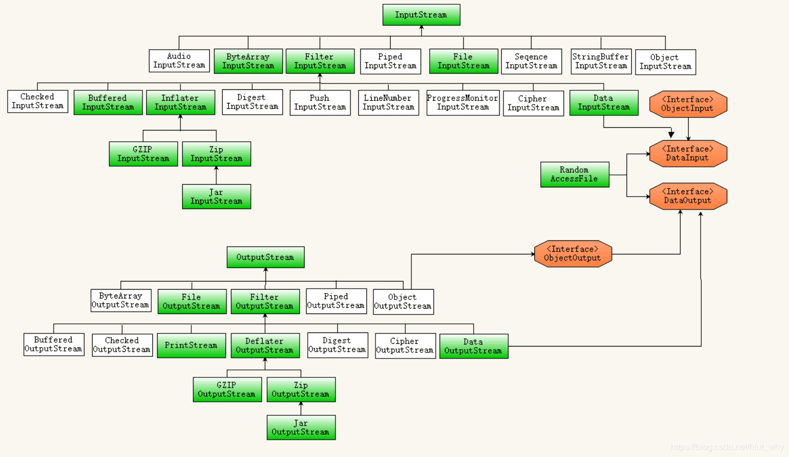
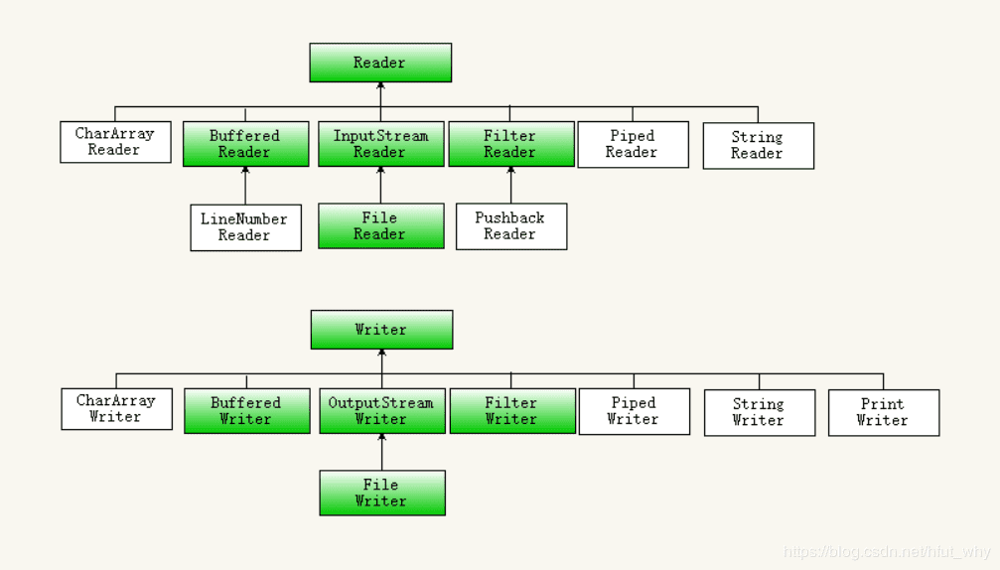
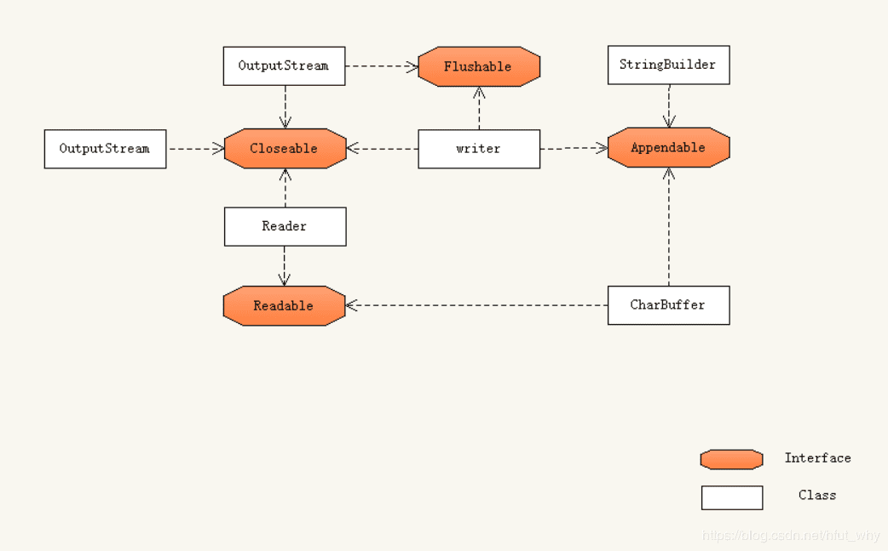

# 《Java核心技术卷二第10版》笔记


## 1 Java SE 8的流库

### 1.1 从迭代到流

`java.util.Collection`的  `stream()`，`parallelStream()`

流遵循了“**做什么而非怎么做**”的原则。

流与集合的差异：

1. 流并不存储其元素。
2. 流的操作不会修改其数据源。
3. 流的操作是尽可能**惰性执行**的。也就是需要结果时，操作才执行。

```java
			// 当前目录是项目的根目录，不是.java文件所在目录
        String contents = new String(Files.readAllBytes(Paths.get("../../gutenberg/alice30.txt")),
                StandardCharsets.UTF_8);
        // \\PL+ 表示非字母字符
        List<String> words = Arrays.asList(contents.split("\\PL+"));

        long count = 0;
        for (String w : words) {
            if (w.length() > 12) {
                count++;
            }
        }
        System.out.println(count);

        count = words.stream().filter(w -> w.length() > 12).count();
        System.out.println(count);

        count = words.parallelStream().filter(w -> w.length() > 12).count();
        System.out.println(count);
```

stream() 和 parallelStream() 分别获得顺序流和并行流，当然此处结果没有多大影响。

正则中P表示”非“，L表示字母。”\PL+“ 表示非字母字符，"\\PN+" 非数字，"\\PZ+" 非分隔符，"\\PS+" 非符号等等。

### 1.2 流的创建

```java
// 静态方法`Stream.of()`
Stream<String> words = Stream.of(contents.split("\\PL+"));
Stream<String> song = Stream.of("gently", "down", "the", "stream");

// 创建不包含任何元素的流：
Stream<String> silence = Stream.empty();

Stream<String> echos = Stream.generate(() -> "Echo");

Stream<Double> randoms = Stream.generate(Math::random);

Stream<BigInteger> integers = Stream.iterate(BigInteger.ONE, n -> n.add(BigInteger.ONE));

Stream<String> wordsAnotherWay = Pattern.compile("\\PL+").splitAsStream(contents);

try (Stream<String> lines = Files.lines(path, StandardCharsets.UTF_8)){
}
```


### 1.3 filter, map, flatMap

**流的转换会产生一个新的流，它的元素派生自另一个流中的元素。**

将一个字符串流转换为只包含长单词的另一个流：

```java
List<String> wordlist = ...;
Stream<String> longWords = wordlist.stream().filter(w -> w.length() > 12);
```

将所有单词都转换为小写：(使用方法引用)

```java
Stream<String> lowercaseWords = words.stream().map(String::toLowerCase);

```

包含所有单词首字母的流：（使用lambda表达式）

```java
Stream<String> firstLetters = words.stream().map(s -> s.substring(0, 1))
```

把字符串转换为字符流：

```java
public static Stream<String> letters(String s) {
  List<String> result = new ArrayList<>();
  for (int i = 0; i < s.length(); i++) {
    result.add(s.substring(i, i + 1));
  }
  return result.stream();
}
// letters("boat") 返回值是流["b", "o", "a", "t"]
```

包含流的流：

```java
Stream<Stream<String>> result = words.stream().map(w -> letters(w));
// [...["y","o","u","r"],["b","o","a","t"],...]
```

如果换成`flatMap`结果就变成：

```java
[..."y","o","u","r","b","o","a","t",...]
```


### 1.4 抽取子流和连接流

`stream.limit(n)`，产生一个包含100个随机数的流：

```java
Stream<Double> randoms = Stream.generate(Math::random).limit(100);
```

`stream.skip(n)`，跳过前n个元素产生流：

```java
Stream<String> words = Stream.of(contents.split("\\PL+")).skip(1);
```

`stream.concat()`，连接两个流：

```java
Stream<String> combined = Stream.concat(letters("Andy"), letters("Ron"));
```


### 1.5 其他的流转换

删除流中重复的元素：

```java
Stream<String> uniqueWords = Stream.of("apple", "orange", "apple");
```

流的排序：

```java
Stream<String> longestFirst = words.stream().sorted(Comparator.comparing(String::length).reversed());
```

peek方法会产生于原来流元素相同的流，不过每一次获取一个元素时，都会调用一个函数：

```java
Object[] powers = Stream.iterate(1.0, p -> p * 2)
                .peek(e -> System.out.println("Fetcting " + e))
                .limit(10).toArray();
```

结果为：

```
Fetcting 1.0
Fetcting 2.0
Fetcting 4.0
Fetcting 8.0
Fetcting 16.0
Fetcting 32.0
Fetcting 64.0
Fetcting 128.0
Fetcting 256.0
Fetcting 512.0
```


### 1.7 Optional类型


#### 如何使用Optional值

有效地使用Optional的关键是：**它的值不存在时会有可替代值，存在时就使用这个值。**

```java
// Optional不存在就使用默认值。orElse()
Optional<String> optionalValue = wordList.stream().filter(s -> s.contains("fred")).findFirst();
System.out.println(optionalValue.orElse("No word") + " contains fred");

Optional<String> optionalString = Optional.empty();
String result = optionalString.orElse("N/A");
System.out.println("result: " + result);

// Optional不存在，计算默认值。orElseGet
result = optionalString.orElseGet(() -> Locale.getDefault().getDisplayName());
System.out.println("result: " + result);

// Optional不存在，就抛出异常。orElseThrow
try {
    result = optionalString.orElseThrow(IllegalStateException::new);
    System.out.println("result: " + result);
} catch (Throwable t) {
    t.printStackTrace();
}

// Optional存在就把它传递给一个函数，否则不发生任何事。ifPresent()
optionalValue = wordList.stream().filter(s -> s.contains("red")).findFirst();
optionalValue.ifPresent(s -> System.out.println(s + " contains red"));
```

#### 不适合使用Optional值的方式


#### 创建Optional值

```java
Optional.of(result);

Optional.empty();
```


#### 用flatMap来创建Optional值的函数


### 1.8 收集结果

当处理完流之后，通常会想要查看其元素。


### 1.9 收集到映射表中


```java
 				Map<Integer, String> idToName = people().collect(Collectors.toMap(Person::getId, Person::getName));
        System.out.println("idToName: " + idToName);

        Map<Integer, Person> idToPerson = people().collect(Collectors.toMap(Person::getId, Function.identity()));
        System.out.println("idToPerson: " + idToPerson.getClass().getName() + idToPerson);

        idToPerson = people().collect(Collectors.toMap(Person::getId, Function.identity(),
                (existingValue, newValue) -> {throw new IllegalStateException();}, TreeMap::new));
        System.out.println("idToPerson: " + idToPerson.getClass().getName() + idToPerson);

        Stream<Locale> locales = Stream.of(Locale.getAvailableLocales());
        Map<String, String> languageNames = locales.collect(Collectors.toMap(Locale::getDisplayLanguage,
                l -> l.getDisplayLanguage(l), (existingValue, newValue) -> existingValue));
        System.out.println("languageNames: " + languageNames);

```


### 1.10 群组和分区

```java
Map<String, List<Locale>> countryToLocales = locales.collect(Collectors.groupingBy(Locale::getCountry));

List<Locale> swissLocales = countryToLocales.get("CH");
```


```java
Map<Boolean, List<Locale>> englishAndOtherLocales = locales.collect(Collectors.partitioningBy(l -> l.getLanguage().equals("en")));

List<Locale> englishLocales = englishAndOtherLocales.get(true);
```


### 1.11 下游收集器


### 1.13 基本类型流

`IntStream`  `LongStream`  `DoubleStream`


```java
				IntStream is1 = IntStream.generate(() -> (int) (Math.random() * 100));
        show("is1", is1);
        IntStream is2 = IntStream.range(5, 10);
        show("is2", is2);
        IntStream is3 = IntStream.rangeClosed(5, 10);
        show("is3", is3);

        Path path = Paths.get("../../gutenberg/alice30.txt");
        String contents = new String(Files.readAllBytes(path), StandardCharsets.UTF_8);

        Stream<String> words = Stream.of(contents.split("\\PL+"));
        IntStream is4 = words.mapToInt(String::length);
        show("is4", is4);
        
        String sentence = "\uD835\uDD46 is the set of octonions.";
        System.out.println(sentence);
        IntStream codes = sentence.codePoints();
        System.out.println(codes.mapToObj(c -> String.format("%X ", c)).collect(Collectors.joining()));

        Stream<Integer> integers = IntStream.range(0, 100).boxed();
        IntStream is5 = integers.mapToInt(Integer::intValue);
        show("is5", is5);
```


### 1.14 并行流


## 2 输入与输出










### 2.2 文本输入与输出


### 2.3 读写二进制数据

#### 

#### ZIP文档


### 2.4 序列化


### 2.5 操作文件


### 2.6 内存映射文件


### 2.7 正则表达式


## 4 网络


### 4.1 连接到服务器

`telnet time-a.nist.gov 13`


### 4.2 实现服务器


### 4.3 可中断套接字


### 4.4 获取Web数


### 4.5 发送Email


## 5 数据库编程

### 5.1 JDBC的设计


### 5.2 结构化查询语言


## 6 日期和时间API


## 8 脚本、编译与注解处理


### 8.2 编译器API


### 8.3 使用注解


### 8.4 注解语法

注解是注解接口来定义的：

```
mofiers @interface AnnotationName {
	elementDeclaration1
	elementDeclaration1
}
```

### 

### 8.5 标准注解


### 8.6 源码级注解处理


### 8.7 字节码工程