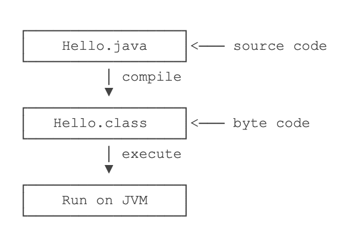
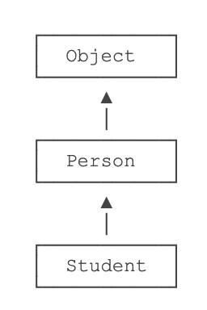
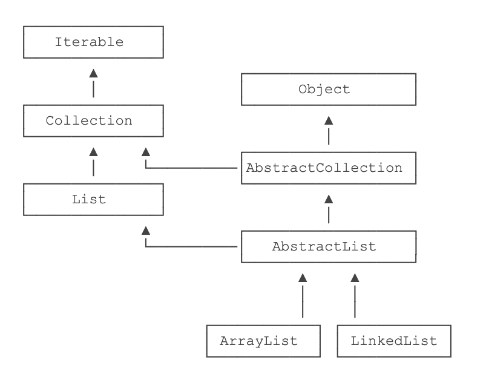

[Java教程](https://www.liaoxuefeng.com/wiki/1252599548343744)   廖雪峰
----------


**为什么Java应用最广泛？**

从互联网到企业平台，Java是应用最广泛的编程语言，原因在于：

- Java是基于JVM虚拟机的跨平台语言，一次编写，到处运行；
- Java程序易于编写，而且有内置垃圾收集，不必考虑内存管理；
- Java虚拟机拥有工业级的稳定性和高度优化的性能，且经过了长时期的考验；
- Java拥有最广泛的开源社区支持，各种高质量组件随时可用。

Java语言常年霸占着三大市场：

- 互联网和企业应用，这是Java EE的长期优势和市场地位；
- 大数据平台，主要有Hadoop、Spark、Flink等，他们都是Java或Scala（一种运行于JVM的编程语言）开发的；
- Android移动平台。


## 1.Java快速入门

### 1.1 Java简介

Java介于编译型语言和解释型语言之间。编译型语言如C、C++，代码是直接编译成**机器码**执行，但是不同的平台（x86、ARM等）CPU的**指令集**不同，因此，需要编译出每一种平台的对应机器码。解释型语言如Python、Ruby没有这个问题，可以由解释器直接加载源码然后运行，代价是运行效率太低。而Java是将代码编译成一种“字节码”，它类似于抽象的CPU指令，然后，针对不同平台编写虚拟机，不同平台的虚拟机负责加载字节码并执行，这样就实现了“一次编写，到处运行”的效果。当然，这是针对Java开发者而言。对于虚拟机，需要为每个平台分别开发。为了保证不同平台、不同公司开发的虚拟机都能正确执行Java字节码，SUN公司制定了一系列的Java虚拟机规范。从实践的角度看，JVM的兼容性做得非常好，低版本的Java字节码完全可以正常运行在高版本的JVM上。

Java的三个版本：

- **Java EE**(Enterprise Edition)     企业版，在Java SE的基础上加上了大量的API和库，以便方便开发Web应用、数据库、消息服务等，使用的虚拟机和Java SE完全相同。
- **Java SE**(Standard Edition)    标准版，包含标准的JVM和标准库。
- **Java ME**(Micro Edition)   “瘦身版”，不建议学习。


推荐的Java学习路线图如下：

1. 首先要学习Java SE，掌握Java语言本身、Java核心开发技术以及Java标准库的使用；
2. 如果继续学习Java EE，那么Spring框架、数据库开发、分布式架构就是需要学习的；
3. 如果要学习大数据开发，那么Hadoop、Spark、Flink这些大数据平台就是需要学习的，他们都基于Java或Scala开发；
4. 如果想要学习移动开发，那么就深入Android平台，掌握Android App开发。

无论怎么选择，Java SE的核心技术是基础，这个教程的目的就是让你完全精通Java SE！

#### 名字解释

- JDK：Java Development Kit
- JRE：Java Runtime Environment

JRE就是运行Java字节码的虚拟机。但是，如果只有Java源码，要编译成Java字节码，就需要JDK，因为JDK除了包含JRE，还提供了编译器、调试器等开发工具。


- SR规范：Java Specification Request
- JCP组织：Java Community Process

为了保证Java语言的规范性，SUN公司搞了一个JSR规范，凡是想给Java平台加一个功能，比如说访问数据库的功能，大家要先创建一个JSR规范，定义好接口，这样，各个数据库厂商都按照规范写出Java驱动程序，开发者就不用担心自己写的数据库代码在MySQL上能跑，却不能跑在PostgreSQL上。

所以JSR是一系列的规范，从JVM的内存模型到Web程序接口，全部都标准化了。而负责审核JSR的组织就是JCP。

- RI：Reference Implementation
- TCK：Technology Compatibility Kit


#### 安装JDK


##### 设置环境变量

安装完JDK后，需要设置一个`JAVA_HOME`的环境变量，它指向JDK的安装目录。

[Java SE 文档](https://docs.oracle.com/en/java/javase/13/index.html)


##### JDK

`JAVA_HOME`的`bin`目录下找到很多可执行文件。

- java：这个可执行程序其实就是JVM，运行Java程序，就是启动JVM，然后让JVM执行指定的编译后的代码；
- javac：这是Java的编译器，它用于把Java源码文件（以`.java`后缀结尾）编译为Java字节码文件（以`.class`后缀结尾）；
- jar：用于把一组`.class`文件打包成一个`.jar`文件，便于发布；
- javadoc：用于从Java源码中自动提取注释并生成文档；
- jdb：Java调试器，用于开发阶段的运行调试


#### 第一个Java程序

```java
public class Hello {
	public static void main(String[] args) {
		System.out.println("Hello, world!");
	}
}
```

Java规定，某个类定义的`public static void main(String[] args)`是Java程序的**固定入口方法**。

一个Java源码只能定义一个`public`类型的class，并且class名称和文件名要完全一致。

##### 如何运行Java程序

首先命令`javac`先把文本文件`Hello.java`编译成字节码文件`Hello.class`，然后命令`java`执行这个字节码文件：



```shell
$ javac Hello.java

$ ls
Hello.class	Hello.java

$ java Hello
Hello, world!
```

给虚拟机传递的参数`Hello`是我们定义的类名，虚拟机自动查找对应的class文件并执行。也可以直接运行`java Hello.java`文件。

在实际项目中，<u>单个不依赖第三方库的Java源码是非常罕见的，所以，绝大多数情况下，我们无法直接运行一个Java源码文件，原因是它需要依赖其他的库。</u>


#### 使用IDE

Eclipse  免费，本身使用Java开发，[下载地址](https://www.eclipse.org/downloads/packages/)

IntelliJ Idea

NetBeans

#### 使用Eclipse IDE练习插件


### 1.2 Java程序基础

#### Java程序基本结构

```java
/**
 * 可以用来自动创建文档的注释
 */
public class Hello {  // 类名是Hello
    public static void main(String[] args) { // 返回值是void，表示没有任何返回值。String[]表示参数类型是String数组
        // 向屏幕输出文本:
        System.out.println("Hello, world!");
        /* 多行注释开始
        注释内容
        注释结束 */
    }
} // class定义结束
```

**类名要求**：以英文字母开头，后接字母，数字和下划线的组合；习惯以大写字母开头。

`public`是访问修饰符，不写`public`，也能正确编译，但是这个类将无法从命令行执行。

**方法名要求**：与类名类似，但以小写字母开头。

特殊的多行注释`/**   ...   */`，写在类和方法的定义处，可以用于自动创建文档。

`Ctrl+Shift+F`（macOS是`⌘+⇧+F`）


#### 变量和数据类型

##### 变量

在Java中，变量分为两种：**基本类型**的变量和**引用类型**的变量。

在Java中，变量必须先定义后使用。不定义初始值时，就相当于给它指定了默认值`0`。

##### 基本数据类型

**基本数据类型**是CPU可以直接进行运算的类型。Java定义了以下几种基本数据类型：

- 整数类型：byte，short，int，long
- 浮点数类型：float，double
- 字符类型：char
- 布尔类型：boolean

Java基本数据类型占用的字节数：

```ascii
       ┌───┐
  byte │   │
       └───┘
       ┌───┬───┐
 short │   │   │
       └───┴───┘
       ┌───┬───┬───┬───┐
   int │   │   │   │   │
       └───┴───┴───┴───┘
       ┌───┬───┬───┬───┬───┬───┬───┬───┐
  long │   │   │   │   │   │   │   │   │
       └───┴───┴───┴───┴───┴───┴───┴───┘
       ┌───┬───┬───┬───┐
 float │   │   │   │   │
       └───┴───┴───┴───┘
       ┌───┬───┬───┬───┬───┬───┬───┬───┐
double │   │   │   │   │   │   │   │   │
       └───┴───┴───┴───┴───┴───┴───┴───┘
       ┌───┬───┐
  char │   │   │
       └───┴───┘
```

##### 整型

##### 浮点型

##### 布尔类型

##### 字符类型

##### 常量

```java
final double PI = 3.14; // PI是一个常量
```

##### var关键字

`var`只是为了少写了变量类型

```java
StringBuilder sb = new StringBuilder();


var sb = new StringBuilder();
```

##### 变量的作用范围


#### 整数运算

##### 溢出

##### 自增/自减

##### 移位运算

对`byte`和`short`类型进行移位时，会首先转换为`int`再进行位移。左移实际上就是不断地×2，右移实际上就是不断地÷2。

##### 位运算

以快速判断一个IP是否在给定的网段内。

##### 运算优先级

##### 类型自动提升与强制转型


#### 浮点数运算

浮点数只能进行加减乘除这些数值计算，不能做位运算和移位运算。

比较两个浮点数是否相等的方法是，判断两个浮点数之差的绝对值是否小于一个很小的数。

##### 类型提升

##### 溢出

- `NaN`表示Not a Number
- `Infinity`表示无穷大
- `-Infinity`表示负无穷大

##### 强制转型


#### 布尔运算

布尔运算的一个重要特点是**短路运算**。如果一个布尔运算的表达式能提前确定结果，则后续的计算不再执行，直接返回结果。


#### 字符和字符串

##### 字符类型

因为Java在内存中总是使用Unicode表示字符，所以，一个英文字符和一个中文字符都用一个`char`类型表示，它们都占用两个字节。要显示一个字符的Unicode编码，只需将`char`类型直接赋值给`int`类型即可：

```java
int n1 = 'A'; // 字母“A”的Unicodde编码是65
int n2 = '中'; // 汉字“中”的Unicode编码是20013
```

还可以直接用转义字符`\u`+Unicode编码来表示一个字符：

```java
// 注意是十六进制:
char c3 = '\u0041'; // 'A'，因为十六进制0041 = 十进制65
char c4 = '\u4e2d'; // '中'，因为十六进制4e2d = 十进制20013
```

##### 字符串类型


##### 字符串连接


##### 多行字符串

```java
String s = """
          SELECT * FROM
          users
          WHERE id > 100
          ORDER BY name DESC
          """;
```

##### 空值null


```java
public class Main {
    public static void main(String[] args) {
        // 请将下面一组int值视为字符的Unicode码，把它们拼成一个字符串：
        int a = 72;
        int b = 105;
        int c = 65281;
      
        String s = "" + (char)a + (char)b + (char)c;
        System.out.println(s);
    }
}
```


#### 数组类型

Java的数组有几个特点：

- 数组所有元素初始化为默认值，整型都是`0`，浮点型是`0.0`，布尔型是`false`；
- 数组一旦创建后，大小就不可改变。


##### 字符串数组

```java
String[] names = {
    "ABC", "XYZ", "zoo"
};
```


### 1.3 流程控制

#### 输入和输出

```java
System.out.print("A,");			// 输出不换行

System.out.println("END");   // 输出并换行

System.out.printf("%.2f\n", d); // 格式化输出
```

从控制台读取一个字符串和一个整数:

```java
import java.util.Scanner;

public class Main {
    public static void main(String[] args) {
        Scanner scanner = new Scanner(System.in); // 创建Scanner对象
        System.out.print("Input your name: "); // 打印提示
        String name = scanner.nextLine(); // 读取一行输入并获取字符串
        System.out.print("Input your age: "); // 打印提示
        int age = scanner.nextInt(); // 读取一行输入并获取整数
        System.out.printf("Hi, %s, you are %d\n", name, age); // 格式化输出
    }
}
```

`System.out`代表标准输出流，而`System.in`代表标准输入流。

Java提供Scanner对象来方便输入。


#### if

要判断引用类型的变量内容是否相等，必须使用`equals()`方法。


#### Switch多重选择

对于多个`==`判断的情况，使用`switch`结构更加清晰。

任何时候都不要忘记写`break`。


#### while循环


#### do while循环

#### for循环

`for each`

#### break和continue


### 1.4 数组操作

#### 遍历数组

`for`

`for each`

`Arrays.toString()`

#### 数组排序

`Arrays.sort()`

#### 多维数组

`Arrays.deepToString()`

```java
import java.util.Arrays;

public class Main {
    public static void main(String[] args) {
        int[][] ns = {
            { 1, 2, 3, 4 },
            { 5, 6, 7, 8 },
            { 9, 10, 11, 12 }
        };
        System.out.println(Arrays.deepToString(ns));
      // [[1, 2, 3, 4], [5, 6, 7, 8], [9, 10, 11, 12]]
    }
}

```


#### 命令行参数


## 2.面向对象编程

### 2.1 面向对象基础

#### 2.1.1 方法

直接操作`field`，容易造成逻辑混乱。为了避免外部代码直接去访问`field`，我们可以用`private`修饰`field`，拒绝外部访问。使用方法（`method`）来让外部代码可以间接修改`field`。

在方法内部，我们就有机会检查参数对不对。比如，`setAge()`就会检查传入的参数，参数超出了范围，直接报错。这样，外部代码就没有任何机会把`age`设置成不合理的值。

<u>所以，一个类通过定义方法，就可以给外部代码暴露一些操作的接口，同时，内部自己保证逻辑一致性。</u>

##### private方法

##### this变量

终指向当前实例

##### 方法参数

##### 可变参数

##### 参数绑定

基本类型参数的传递，是调用方值的复制。双方各自的后续修改，互不影响。

引用类型参数的传递，调用方的变量，和接收方的参数变量，指向的是同一个对象。双方任意一方对这个对象的修改，都会影响对方（因为指向同一个对象嘛）。

#### 2.1.2 构造方法

实例实际上是通过构造方法来初始化的。

```java
public class Main {
    public static void main(String[] args) {
        Person p = new Person("Xiao Ming", 15);
        System.out.println(p.getName());
        System.out.println(p.getAge());
    }
}

class Person {
    private String name;
    private int age;

    public Person(String name, int age) {
        this.name = name;
        this.age = age;
    }
    
    public String getName() {
        return this.name;
    }

    public int getAge() {
        return this.age;
    }
}
```

构造方法的名称就是类名。构造方法的参数没有限制，在方法内部，也可以编写任意语句。但是，和普通方法相比，构造方法没有返回值（也没有`void`），调用构造方法，必须用`new`操作符。

##### 默认构造方法

如果一个类没有定义构造方法，编译器会自动为我们生成一个默认构造方法，它没有参数，也没有执行语句。如果自定义了一个构造方法，那么，编译器就不再自动创建默认构造方法。

没有在构造方法中初始化字段时，引用类型的字段默认是`null`，数值类型的字段用默认值，`int`类型默认值是`0`，布尔类型默认值是`false`：

```
class Person {
    private String name; // 默认初始化为null
    private int age; // 默认初始化为0

    public Person() {
    }
}
```

也可以对字段直接进行初始化。

##### 多构造方法

#### 2.1.3 方法重载

方法名相同，但各自的参数不同，称为方法重载（`Overload`）。

方法重载的目的是，**功能类似的方法使用同一名字，更容易记住**，因此，调用起来更简单。

#### 2.1.4 继承

```java
class Person {
    private String name;
    private int age;

    public String getName() {...}
    public void setName(String name) {...}
    public int getAge() {...}
    public void setAge(int age) {...}
}

class Student extends Person {
    // 不要重复name和age字段/方法,
    // 只需要定义新增score字段/方法:
    private int score;

    public int getScore() { … }
    public void setScore(int score) { … }
}
```

在OOP的术语中，把`Person`称为超类（super class），父类（parent class），基类（base class），把`Student`称为子类（subclass），扩展类（extended class）。

##### 继承树



Java只允许一个class继承自一个类，因此，一个类有且仅有一个父类。只有`Object`特殊，它没有父类。

##### protected

子类无法访问父类的`private`字段或者`private`方法。用`protected`修饰的字段可以被子类访问。`protected`关键字可以把字段和方法的访问权限控制在继承树内部。

##### super

任何`class`的构造方法，第一行语句必须是调用父类的构造方法。如果没有明确地调用父类的构造方法，编译器会帮我们自动加一句`super();`。

即子类*不会继承*任何父类的构造方法。子类默认的构造方法是编译器自动生成的，不是继承的。

##### 向上转型

这种把一个子类类型安全地变为父类类型的赋值，被称为**向上转型（upcasting）**。

##### 向下转型

向下转型很可能会失败。失败的时候，Java虚拟机会报`ClassCastException`。

`instanceof`

##### 区分继承和组合

#### 2.1.4 多态*

在继承关系中，子类如果定义了一个与父类方法签名完全相同的方法，被称为**覆写（Override）**。

```java
class Person {
    public void run() {
        System.out.println("Person.run");
    }
}

class Student extends Person {
    @Override
    public void run() {
        System.out.println("Student.run");
    }
}
```

Override和Overload不同的是，如果方法签名如果不同，就是Overload，Overload方法是一个新方法；如果方法签名相同，并且返回值也相同，就是`Override`。

**多态**是指，针对某个类型的方法调用，其真正执行的方法取决于运行时期实际类型的方法。

##### 覆写Object方法

因为所有的`class`最终都继承自`Object`，而`Object`定义了几个重要的方法：

- `toString()`：把instance输出为`String`；
- `equals()`：判断两个instance是否逻辑相等；
- `hashCode()`：计算一个instance的哈希值。

```java
class Person {
    ...
    // 显示更有意义的字符串:
    @Override
    public String toString() {
        return "Person:name=" + name;
    }

    // 比较是否相等:
    @Override
    public boolean equals(Object o) {
        // 当且仅当o为Person类型:
        if (o instanceof Person) {
            Person p = (Person) o;
            // 并且name字段相同时，返回true:
            return this.name.equals(p.name);
        }
        return false;
    }

    // 计算hash:
    @Override
    public int hashCode() {
        return this.name.hashCode();
    }
}
```

##### 调用super

在子类的覆写方法中，如果要调用父类的被覆写的方法，可以通过`super`来调用。

##### final

如果一个父类不允许子类对它的某个方法进行覆写，可以把该方法标记为`final`。

#### 2.1.5 抽象类

如果父类的方法本身不需要实现任何功能，仅仅是为了定义方法签名，目的是让子类去覆写它，那么，可以把父类的方法声明为抽象方法：

```
class Person {
    public abstract void run();
}
```

因为无法执行抽象方法，因此这个类也必须申明为**抽象类（abstract class）**。

无法实例化一个抽象类，抽象类本身被设计成只能用于被继承，因此，抽象类可以强迫子类实现其定义的抽象方法，否则编译会报错。因此，抽象方法实际上相当于定义了**“规范”**。

##### 面向抽象编程

这种尽量引用高层类型，避免引用实际子类型的方式，称之为**面向抽象编程**。

#### 2.1.6 接口

如果一个抽象类没有字段，所有方法全部都是抽象方法：

```java
abstract class Person {
    public abstract void run();
    public abstract String getName();
}
```

就可以把该抽象类改写为接口：`interface`。

```java
interface Person {
    void run();
    String getName();
}
```


在Java中，一个类不能从多个类继承，但是，可以实现多个`interface`：

```java
class Student implements Person, Hello { // 实现了两个interface
    ...
}
```

##### 术语

**Java的接口**特指`interface`的定义，表示一个接口类型和一组方法签名，而**编程接口**泛指接口规范，如方法签名，数据格式，网络协议等。

##### 接口继承

一个`interface`可以继承自另一个`interface`。

```java
interface Hello {
    void hello();
}

interface Person extends Hello {
    void run();
    String getName();
}
```

##### 继承关系

合理设计`interface`和`abstract class`的继承关系，可以充分复用代码。一般来说，**公共逻辑**适合放在`abstract class`中，**具体逻辑**放到各个子类，而接口层次代表**抽象程度**。可以参考Java的集合类定义的一组接口、抽象类以及具体子类的继承关系：



在使用的时候，实例化的对象永远只能是某个具体的子类，但总是通过接口去引用它，因为接口比抽象类更抽象：

```java
List list = new ArrayList(); // 用List接口引用具体子类的实例
Collection coll = list; // 向上转型为Collection接口
Iterable it = coll; // 向上转型为Iterable接口
```

##### default方法*

#### 2.1.7 静态字段和静态方法

**实例字段**

**静态字段**  `static`

静态字段并不属于实例


不推荐用`实例变量.静态字段`去访问静态字段，推荐用类名来访问静态字段。在代码中，实例对象能访问静态字段只是因为编译器可以根据实例类型自动转换为`类名.静态字段`来访问静态对象。

##### 静态方法

静态方法内部，无法访问`this`变量，也无法访问实例字段，它只能访问静态字段。

静态方法经常用于工具类。例如：

- Arrays.sort()
- Math.random()

静态方法也经常用于辅助方法。注意到Java程序的入口`main()`也是静态方法。

##### 接口的静态字段

因为`interface`是一个纯抽象类，所以它不能定义实例字段，但可以有静态字段，并且只能是`public static final`类型。

```java
public interface Person {
    // 编译器会自动加上public statc final:
    int MALE = 1;
    int FEMALE = 2;
}
```

#### 2.1.8 包

`package`

完整类名是`包名.类名`

> 注意：包没有父子关系。java.util和java.util.zip是不同的包，两者没有任何继承关系。


我们还需要按照包结构把上面的Java文件组织起来。假设以`package_sample`作为根目录，`src`作为源码目录，那么所有文件结构就是：

```
package_sample
└─ src
    ├─ hong
    │  └─ Person.java
    │  ming
    │  └─ Person.java
    └─ mr
       └─ jun
          └─ Arrays.java
```

即所有Java文件对应的目录层次要和包的层次一致。

编译后的`.class`文件也需要按照包结构存放。如果使用IDE，把编译后的`.class`文件放到`bin`目录下，那么，编译的文件结构就是：

```ascii
package_sample
└─ bin
   ├─ hong
   │  └─ Person.class
   │  ming
   │  └─ Person.class
   └─ mr
      └─ jun
         └─ Arrays.class
```

##### 包作用域


##### import

`import static`的语法，它可以导入一个类的静态字段和静态方法：

```java
// 导入System类的所有静态字段和静态方法:
import static java.lang.System.*;
```


Java编译器最终编译出的`.class`文件只使用**完整类名**，当编译器遇到类时：

- 如果是完整类名，就直接根据完整类名查找这个`class`；
- 如果是简单类名，按下面的顺序依次查找：
  - 查找当前`package`是否存在这个`class`；
  - 查找`import`的包是否包含这个`class`；
  - 查找`java.lang`包是否包含这个`class`。


> 注意：自动导入的是java.lang包，但类似java.lang.reflect这些包仍需要手动导入。


##### 最佳实践

包名推荐使用倒置的域名来确保唯一性。如：`org.apache.commons.log`，`com.andyron.sample`。

不要和`java.lang`包的类重名，不适用如：String，System，Runtime...

也不要和JDK常用类重名：`java.util.List`，`java.text.Format`，`java.math.BigInteger`...


#### 2.1.9 作用域

`public`

`protected`   可以被子类访问

`private`


阅读代码的时候，应该先关注`public`方法，因为`public`方法定义了类对外提供的功能。


##### 局部变量

##### final

用`final`修饰`class`可以阻止被继承

用`final`修饰`method`可以阻止被子类覆写

用`final`修饰`field`可以阻止被重新赋值

用`final`修饰局部变量可以阻止被重新赋值


##### 小结

如果不确定是否需要`public`，就不声明为`public`，即尽可能少地暴露对外的字段和方法。

一个`.java`文件只能包含一个`public`类，但可以包含多个非`public`类。如果有`public`类，文件名必须和`public`类的名字相同。


#### 2.1.10 classpath和jar*

`classpath`是JVM用到的一个环境变量，它用来指示JVM如何搜索`class`。

因为Java是编译型语言，源码文件是`.java`，而编译后的`.class`文件才是真正可以被JVM执行的字节码。因此，JVM需要知道，如果要加载一个`abc.xyz.Hello`的类，应该去哪搜索对应的`Hello.class`文件。

所以，`classpath`就是一组目录的集合，它设置的搜索路径与操作系统相关。例如，在Windows系统上，用`;`分隔，带空格的目录用`""`括起来，可能长这样：

```
C:\work\project1\bin;C:\shared;"D:\My Documents\project1\bin"
```

在Linux系统上，用`:`分隔，可能长这样：

```
/usr/shared:/usr/local/bin:/home/liaoxuefeng/bin
```

现在我们假设`classpath`是`.;C:\work\project1\bin;C:\shared`，当JVM在加载`abc.xyz.Hello`这个类时，会依次查找：

- <当前目录>\abc\xyz\Hello.class
- C:\work\project1\bin\abc\xyz\Hello.class
- C:\shared\abc\xyz\Hello.class

##### jar包

如果有很多`.class`文件，散落在各层目录中，肯定不便于管理。如果能把目录打一个包，变成一个文件，就方便多了。

jar包就是用来干这个事的，它可以把`package`组织的目录层级，以及各个目录下的所有文件（包括`.class`文件和其他文件）都打成一个jar文件，这样一来，无论是备份，还是发给客户，就简单多了。

#### 2.1.11 模块*

从Java 9开始，JDK又引入了模块（Module）。

`.class`文件是JVM看到的最小可执行文件，而一个大型程序需要编写很多Class，并生成一堆`.class`文件，很不便于管理，所以，<u>`jar`文件就是`class`文件的容器</u>。

在Java 9之前，一个大型Java程序会生成自己的jar文件，同时引用依赖的第三方jar文件，而JVM自带的Java标准库，实际上也是以jar文件形式存放的，这个文件叫`rt.jar`，一共有60多M。

如果是自己开发的程序，除了一个自己的`app.jar`以外，还需要一堆第三方的jar包，运行一个Java程序，一般来说，命令行写这样：

```bash
java -cp app.jar:a.jar:b.jar:c.jar com.liaoxuefeng.sample.Main
```

> 注意：JVM自带的标准库rt.jar不要写到classpath中，写了反而会干扰JVM的正常运行。

如果漏写了某个运行时需要用到的jar，那么在运行期极有可能抛出`ClassNotFoundException`。

所以，jar只是用于存放class的容器，它并不关心class之间的依赖。

##### 编写模块

##### 运行模块

##### 打包JRE

##### 访问权限

### 2.2 Java核心类

#### 2.2.1 字符串和编码 *

##### 字符串比较

实际上是比较字符串的内容是否相同。必须使用`equals()`方法而不能用`==`。

##### 去除首尾空白字符

`trim()`并没有改变字符串的内容，而是返回了一个新字符串。它移除字符串首尾空白字符。空白字符包括空格，`\t`，`\r`，`\n`。

`strip()`和`trim()`不同的是，类似中文的空格字符`\u3000`也会被移除。

`String`还提供了`isEmpty()`和`isBlank()`。

##### 替换子串

`replace()`

`replaceAll()`  正则替换

##### 分割字符串

`split()`

##### 拼接字符串

静态方法`join()`

##### 类型转换

要把任意基本类型或引用类型转换为字符串，可以使用静态方法`valueOf()`。这是一个重载方法，编译器会根据参数自动选择合适的方法：

```java
String.valueOf(123); // "123"
String.valueOf(45.67); // "45.67"
String.valueOf(true); // "true"
String.valueOf(new Object()); // 类似java.lang.Object@636be97c
```

要把字符串转换为其他类型，就需要根据情况。例如，把字符串转换为`int`类型：

```
int n1 = Integer.parseInt("123"); // 123
int n2 = Integer.parseInt("ff", 16); // 按十六进制转换，255
```

把字符串转换为`boolean`类型：

```
boolean b1 = Boolean.parseBoolean("true"); // true
boolean b2 = Boolean.parseBoolean("FALSE"); // false
```

要特别注意，`Integer`有个`getInteger(String)`方法，它不是将字符串转换为`int`，而是把该字符串对应的系统变量转换为`Integer`：

```
Integer.getInteger("java.version"); // 版本号，11
```

##### 转换为char[]


##### 字符编码