《Java核心技术第10版卷一》
------

http://horstmann.com/corejava


## 1 Java程序设计概述

一旦一种语言应用于某个领域，与现存代码的相容性问题就摆在了人们的面前。


### Java的11个关键术语

1. 简单性。C++语法的简洁版，没有头文件、指针、结构、联合、操作符重载、虚基类等。

2. 面向对象。将重点放在数据（即对象）和对象的接口上。

3. 分布式

4. 健壮性。早期的问题检测、后期动态的（运行时）检测。

5. 安全性

6. 体系结构中立

7. 可移植性。

   数据类型固定大小，消除了代码移植时的主要问题；

   二进制数据以固定的格式进行存储和传输，消除了字节顺序的困扰；

   字符串用标准的Unicode格式存储；

   除了与用户界面有关的部分外，所有其他Java库都能很好地支持平台独立性。

8. 解释型。

   Java解释器可以在任何移植了解释器的机器上执行**Java字节码**。

9. 高性能

10. 多线程。

    多线程可以带来更好的交互响应和实时行为。

11. 动态性


在网页中运行的Java程序成为**applet**（已过时）。


> “毕竟，语言只是实现目标的工具，而不是目标本身”。
>    --- James Gosling


## 2 Java程序设计环境

### 2.1 安装Java开发工具包

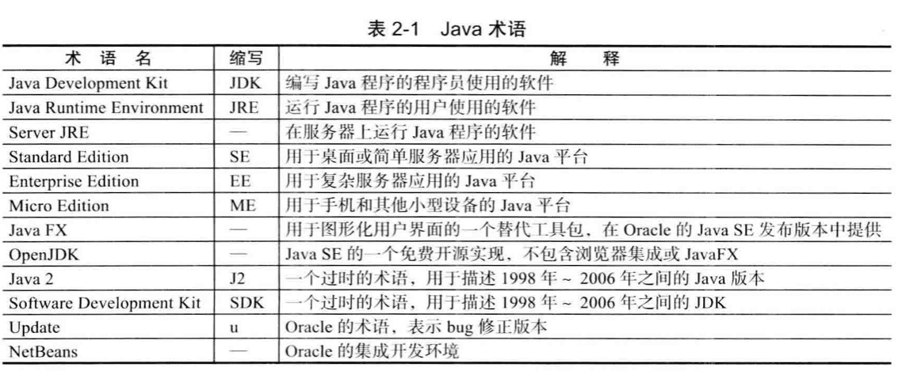

#### 下载JDK

Mac中JDK安装位置一般为：`/Library/Java/JavaVirtualMachines/jdk-13.0.2.jdk/Contents/Home/`

它包一些目录：

`bin/`

`include/`，Java本身是C++编写，这个目录包含了一些C语言文件

`jre/`，Java运行环境，包含各种jar包。`jre/lib/rt.jar`是java的核心jar包，可以解压查看到标准库编译后的各种`.class`文件，`src.zip`是与其对应的`.java`文件。


#### 设置JDK


#### 安装库源文件和文档


### 2.2 使用命令行工具

```shell
javac Welcome.java
java Welcome
```

编译器需要一个**文件名**(Welcomejava)，而运行程序时，只需要指定**类名**(Welcome)，不要带扩展名 .java 或 .class。

`System.out.print()`与`System.out.println()`的区别是前者不换行，后者换行。

### 2.3 使用集成开发环境


### 2.4 运行图形化应用程序


### 2.5构建并运行applet

我的系统没有 `appletviewer`


## 3.Java的基本程序设计结构


### 3.1 一个简单的Java应用程序

```java
public class FirstSample
{
  public static void main(String[] args)
  {
    System.out.println("We will not use 'Hello World!'");
  }
}

public class ClassName {
	public static void main(String[] args) 
  {	
    program statements
	} 
}
```

关键字`public`称为**访问修饰符（access modifier）**，用于控制程序的其它部分对这段代码的访问级别；

关键字`class`表明Java程序中的全部内容包含在类中，可以将类作为一个加载**程序逻辑**（应用程序的行为）的容器；

`class`后紧跟**类名**，类名以大写字母开头，长度没有限制，不能使用Java保留字，采用骆驼命名法；源代码的文件名必须与公共类的名字相同，用`.java`作为扩展名（如`FirstSample.java`），编译后在同目录下生成一个包含这个类字节码以`.class`为扩展名的文件（`FirstSample.class`）。


运行已编译的程序时，Java虚拟机将从指定类中的main方法开始执行，也就是说，每个Jav 应用程序都必须有一个 main 方法：

>  Java 中的所有函數都属于某个类的方法。
>
>  Java 中的 main 方法必须有一个外壳类。
>
>  Java 中的 main 方法必须是静态的。 void 表示这个方法没有返回值。
>
>  根据[Java语言规范](https://docs.oracle.com/javase/specs/)，main方法必须声明为public。


> [Java bug数据库](http://bugs.java.com/bugdatabase/index.jsp   )，通过bug号（例如 4252539），来查询。
>
> Sun公司在 Java 开源很久以前就把 bug 报 告及其解决方案放到网站上让所有人监督检查， 这是一种非常了不起的举动。


### 3.2 注释

```java
//

/*
*/

/**
 */
```

第三种注释可用来自动生成文档。


### 3.3 数据类型

Java是**强类型语言**，必须为每一个变量声明一种类型。

Java共有8中基本类型，其中4种整型：`int`，`short`，`long`，`byte`；2种浮点类型：`float`，`double`；表示Unicode编码的`char`；`boolean`。


#### 整型

在Java中，整型的范围与运行的机器无关；没有无符号类型。

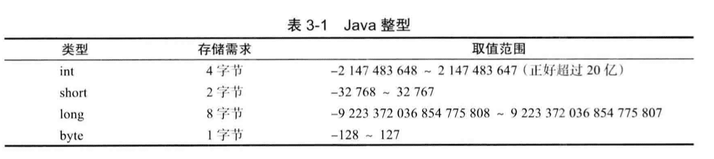

```java
400000000000L;
0xCAFE;
010;
0b1001;   
```

建议不要使用八进制常数，易混淆。


#### 浮点数

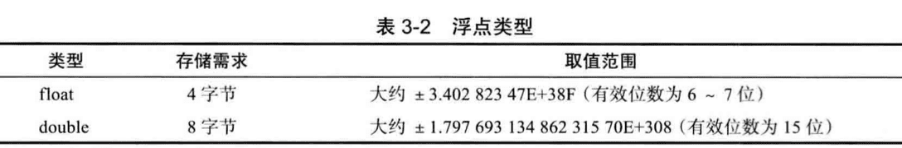

大部分情况都是用double。

三个特殊浮点数（实际应用中很少遇到）：

`Double.NaN`

`Double.POSITIVE_INFINITY`

`Double.NEGATIVE_INFINITY`


#### char

有些Unicode字符可以用一个char值描述，另外一些Unicode字符则需要两个char值。

char类型的字面量值要用**单引号**括起来，如`'A'` ，  `'\u03C0'`。

所有转义序列都可以出现在家引号的字符字面量或字符串中，如`'\u2122'`，`"Hello\n"`；转义序列`\u`还可以出现在加引号的字符常量或字符串外，如：

```java
// \u005B， \u005D分别表示[， ]
public static void mian(String\u005B \u005D args)
```

特殊字符的转义序列：

| 转义序列 | 名称   | Unicode值 |
| -------- | ------ | --------- |
| `\b`     | 退格   | \u0008    |
| `\t`     | 制表   | \u0009    |
| `\n`     | 换行   | \u000a    |
| `\r`     | 回车   | \u000d    |
| `\"`     | 双引号 | \u0022    |
| `\'`     | 单引号 | \u0027    |
| `\\`     | 反斜杠 | \u005c    |


**Unicode转义序列会在解析代码之前得到处理。**

一定要当心注释中的\u。

强烈建议不要使用char类型。


#### 默认值和取值范围

|         | 默认值   | 存储需求（字节） | 取值范围     | 示例               |
| ------- | -------- | ---------------- | ------------ | ------------------ |
| byte    | 0        | 1                | -2^7—2^7-1   | byte b=10;         |
| char    | '\u0000' | 2                | 0 — 2^16-1   | char c=’c’;        |
| short   | 0        | 2                | -2^15—2^15-1 | short s=10;        |
| int     | 0        | 4                | -2^31—2^31-1 | int i=10;          |
| long    | 0        | 8                | -2^63—2^63-1 | long o=10L;        |
| float   | 0.0f     | 4                | -2^31—2^31-1 | float f=10.0F      |
| double  | 0.0d     | 8                | -2^63—2^63-1 | double d=10.0;     |
| boolean | false    | 1                | true\false   | boolean flag=true; |


#### Unicode 和 char 

**code point**（**码点**）是指与一个编码表中的某个字符对应的代码值。a code value that is associated with a character in an encoding scheme.

在 Unicode 标准中， 码点采用十六进制书写，并加上前缀U+, 例如**U+0041**就是拉丁字母A的码点。

UTF 16 编码采用不同长度的编码表示所有 Unicode 码点。在基本的多语言级别中， 每个字符用16位表示，通常被称为**代码单元**(**code unit**)。

> 强烈建议不要在程序中使用char类型。

#### boolean类型

false

true


### 3.4 变量

Java中**字母**和**数字**范围很大，字母包括`'A'` ~ `'Z'`、`'a'` ~ `'z'`、`_`、`'$'`及其在某种语言中表示字母的任何Unicode字符，数字包括'0' ~ '9'及其在某种语言中表示数字的任何Unicode字符。下面两个方法可用力啊判断哪些Unicode字符属于Java中的字母：`Character.isJavaIdentifierPart()`、 `Character.isJavaIdentifierStart()`。

逐一声明每一个变量可以提高程序的可读性。


#### 变量初始化

声明一个变量之后，必须用赋值语句对变量进行显示初始化，不能使用未初始化的变量。

变量的声明尽可能地靠近变量第一次使用的地方。

> 在Java中，不区分变量的声明和定义。


#### 常量

关键字`final`指示**常量**（只能被赋值一次）。习惯上，常量名使用全大写。

使用关键字`static final`设置**类常量**。 

常量定义在方法内；类常量定义在方法外，给一个类中的多个方法使用。

`const`是Java保留关键字，还未使用。


### 3.5 运算符

#### 数学函数与常量

```java
Math.sin 
Math.cos 
Math.tan
Math.atan 
Math.atan2
  
Math.exp 
Math.log 
Math.log1O
  
Math.sqrt(x)
Math.pow(x, a)

// 
Math.floorMod()
  
Math.PI
Math.E
```

不必在数学方法名和常量名前添加前缀`Math`：`import static java.lang.Math.*`。

> 注：在Math类中，为了达到最快的性能，所有方法都使用计算机浮点单元中的例程。如果得到一个完全可预测的结果比运行速度更重要的话，那么就应该使用`StrictMath`类。


#### 数值类型之间的转换

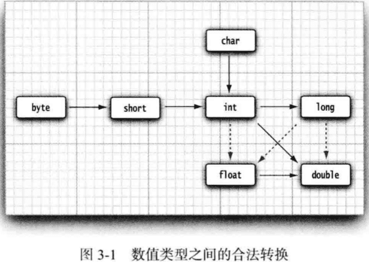

实心箭头表示无信息丢失，虚箭头表示可能有精度损失。如int包含的位数就比float多：

```java
int n = 123456789;
float f = n; // f is 1.23456792E8
```

自动类型转换总结：

1. 若参与运算的数据类型不同，则先转换成同一类型，然后进行运算。

2. 转换按数据长度增加的方向进行，以保证精度不降低。例如int型和long型运算时，先把int量转成long型后再进行运算。

3. 所有的浮点运算都是以双精度进行的，即使仅含float单精度量运算的表达式，也要先转换成double型，再作运算。

4. char型和short型参与运算时，必须先转换成int型。 

5. 在赋值运算中，赋值号两边的数据类型不同时，需要把右边表达式的类型将转换为左边变量的类型。如果右边表达式的数据类型长度比左边长时，将丢失一部分数据，这样会降低精度。

#### 强制类型转换(cast)

```java
double x = 9.997; 
int nx = (int) x;

double x = 9.997;
int nx = (int) Math.round(x);
```

> 如果试图将一个数值从一种类型强制转换为另一种类型， 而又超出了目标类型的 表示范围， 结果就会截断成一个完全不同的值。例如，(byte) 300 的实际值为 44。(10010 1100 -> 0010 1100，也就是300-256=44)

#### 结合赋值和运算符

```java
x += 4;
x *= 4;
x %= 4;
```

> 如果运算符得到一个值， 其类型与左侧操作数的类型不同， 就会发生强制类型转换。

#### 自增与自减运算符

```java
n++;
++n;
n--;
--n;
```

#### 关系和 boolean 运算符

```java
3 == 7
3 != 7

expression1 && expression2
expression1 || expression2
!expression

condition ? expression1 : expression2
```


#### 位运算符

处理整型类型时，可以直接对组成整型数值的各个位完成操作。

```java
&
|
^("xor")
~

>>  	<<
>>>
```


#### 括号与运算符级别

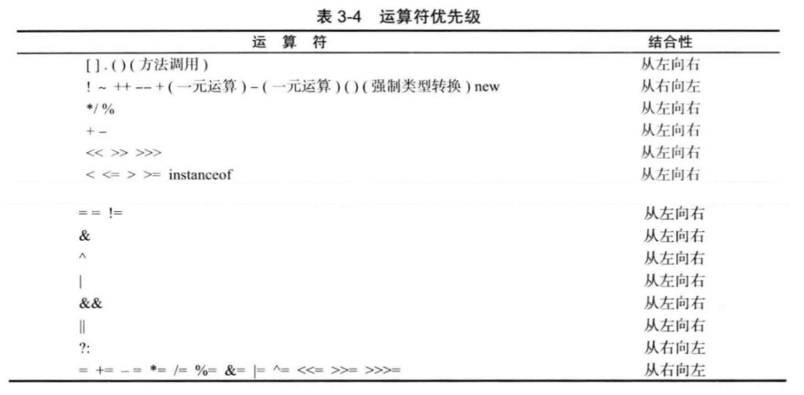

#### 枚举类型

有时候，变量的取值只在一个有限的集合内。

```java
enum Size {SMALL, MEDIUM, LARGE, EXTRA_LARCE};
Size s = Size.MEDIUM;
```


### 3.6 字符串

从概念上讲，Java字符串就是**Unicode字符序列**。

Java没有内置的字符串类型，而是在标准Java类库中提供了一个预定义类（`String`）。

#### 子串

`substring(0, 3)`


#### 拼接

`+`

`String.join()`  


#### 不可变字符串

`String`是不可变字符串。

不可变字符串的优点：编译器可以让字符串**共享**。

**Java的设计者认为共享带来的高效率远远胜过于提取、拼接字符串所带来的低效率。**


#### 检测字符串是否相等

```java
s.equals(t);
s.equalsIgnoreCase(t);
```

`==`不能检测两个字符串是否相等，只能确定两个字符串是否放置在同一个位置上：

```java
String greeting = "Hello";
if (greeting == "Hello")
  // 可能为 true
if (greeting.substring(0, 3) == "Hel")
  // 可能为 false
```

实际中虚拟机可能只有字符串常量是共享的，而+或substring等操作产生的结果并不是共享的。


#### 空串与Null串

检查一个字符串既不是null也不为空串：

```java
if (str != null && str.length() != 0)
```


#### Code Units（代码单元）和Code Points(码点) 🔖

char类型时一个采用UTF-16编码表示Unicode码点的代码单元。

`length()`是计算**Code Units**个数。(有时两个或几个代码单元组成一个码点)

要想得到第i个Code Points，使用：

```java
int index = greeting.offsetByCodePoints(0, i);
int cp = greeting.codePointAt(index);
```

也就是**String.length()**方法返回的是**代码单元(code unit)**的个数，而**String.codePointCount(0, length)**返回的是**码点(code point)**个数，即字符的个数。例子：

```java
System.out.println("---------------我是分割线-----------------");
String sentence = "\u0041 \u0042";  // 该字符串的第二个（从一开始计）字符是空格
System.out.println(sentence);
int lengthU = sentence.length();
int lengthP = sentence.codePointCount(0, lengthU);
System.out.println(lengthU);        // 3个code units
System.out.println(lengthP);        // 3个code points
```

结果：

```
---------------我是分割线-----------------
A B
3
3
```


```java
System.out.println("---------------我是分割线-----------------");
String sentence = "\u03C0 \uD835\uDD6B";    // 该字符串的第二个（从一开始计）字符是空格
System.out.println(sentence);
int lengthU = sentence.length();
int lengthP = sentence.codePointCount(0, lengthU);
System.out.println(lengthU);        // 4个code units
System.out.println(lengthP);        // 3个code points
```

结果：

```
---------------我是分割线-----------------
π 𝕫
4
3
```


#### String API

`String`有50+有用的方法

```java
//  java.lang.String 

char charAt(int index)
返回给定位置的代码单元。除非对底层的代码单元感兴趣， 否则不需要调用这个方法。
int codePointAt( int Index)
返回从给定位置开始的码点。
int offsetByCodePoints(int startlndex, int cpCount) 
返回从 startlndex 代码点开始， 位移 cpCount 后的码点索引。
int compareTo(String other)
按照字典顺序， 如果字符串位于 other 之前， 返回一个负数; 如果字符串位于 other 之后， 返回一个正数; 如果两个字符串相等， 返回 0。
IntStream codePoints()
将这个字符串的码点作为一个流返回。 调用 toArray 将它们放在一个数组中。
new String(int[] codePoints, int offset, int count) 
用数组中从 offset 开始的 count 个码点构造一个字符串。
boolean equals(Object other)
如果字符串与 other 相等， 返回 true。
  
boolean equalsIgnoreCase(String other) 
如果字符串与 other 相等 (忽略大小写，) 返回 tme。
boolean startsWith(String prefix) 
boolean endsWith(String suffix)
如果字符串以 suffix 开头或结尾， 则返回 true。 
                                                                     int indexOf(String str)
int indexOf(String str, int fromlndex)
int indexOf(int cp)
int indexOf(int cp, int fromlndex)
返回与字符串 str 或代码点 cp 匹配的第一个子串的开始位置。这个位置从索引 0 或 fromlndex 开始计算。 如果在原始串中不存在 st，r 返回 - 1。

                                                                      int 1astIndexOf(String str)
int 1astIndexOf(String str, int fromlndex) 
int lastindexOf(int cp)
int 1astindexOf(int cp, int fromlndex)
返回与字符串 str 或代码点 cp 匹配的最后一个子串的开始位置。 这个位置从原始串尾端或 fromlndex 开始计算。 

int 1ength( )
返回字符串的长度。
int codePointCount(int startlndex, int endlndex) 
返回 startlndex 和 endludex- l 之间的代码点数量。 没有配成对的代用字符将计入代码点。
String replace(CharSequence oldString,CharSequence newString) 
返回一个新字符串。 这个字符串用 newString 代替原始字符串中所有的 oldString。 可 以用 String 或 StringBuilder 对象作为 CharSequence 参数。
String substring(int beginlndex)
String substring(int beginlndex, int endlndex)
返回一个新字符串。这个字符串包含原始字符串中从 beginlndex 到串尾或 endlndex-l
的所有代码单元。
                                                                      
String toLowerCase( ) 
String toUpperCase( )
返回一个新字符串。 这个字符串将原始字符串中的大写字母改为小写， 或者将原始字符串中的所有小写字母改成了大写字母。
String trim( )
返回一个新字符串。 这个字符串将删除了原始字符串头部和尾部的空格。
String join(CharSequence delimiter, CharSequence... elements) 
返回一个新字符串， 用给定的定界符连接所有元素。
```


#### 构建字符串（StringBuilder）

每次连接字符串， 都会构建一个新的`String`对象，既耗时又浪费空间 ，使用`StringBuilde`可以避免。

```java
StringBuilder builder = new StringBuilder();
builder.append(ch); // appends a single character
bui1der.append(str); // appends a string
String completedString = builder.toString();
```


```java
// java.lang.StringBuilder

StringBuilder()
构造一个空的字符串构建器。
int length()
返回构建器或缓冲器中的代码单元数量。
StringBui1der append(String str)
追加一个字符串并返回 this。
StringBui1der append(char c)
追加一个代码单元并返回 this。
StringBui1der appendCodePoint(int cp)
追加一个代码点，并将其转换为一个或两个代码单元并返回 this。
void setCharAt(int i,char c)
将第i个代码单元设置为 c。
StringBui1der insert(int offset,String str)
在 offset 位置插入一个字符串并返回 this。
StringBuilder insert(int offset,Char c)
在offset位置插入一个代码单元并返回 thi。s
StringBui1der delete(1nt startindex,int endlndex)
删除偏移量从startIndex到 endlndex-1 的代码单元并返回this。 
String toString()
返回一个与构建器或缓冲器内容相同的字符串。
```


### 3.7 输入输出（IO）

#### 读取输入

打印输出到”标准输出流“（即控制台窗口）是容易的事，只要调用`System.out.println`即可；然而，读取”标准输入流“`System.in`就不容易了。

`java.util.Scanner`  

```java
Scanner in = new Scanner(System.in);

// 第一个输出
System.out.println("What is your name?");
String name = in.nextLine();

// 第二个输出
System.out.println("How old are you?");
int age = in.nextInt();

System.out.println("Hello, " + name + ". Next year, you'll be " + (age + 1));
```


``java.io.Console`用来从控制台读取密码：

```java
Console cons = System.console();
String username = cons.readLine("User name: ");
char[] passwd = cons.readPassword("Password: ");
```

```java
// java.util.Scanner

Scanner (InputStream in)
用给定的输人流创建一个 Scanner 对象。 
String nextLine( )
读取输入的下一行内容。
String next( )
读取输入的下一个单词 (以空格作为分隔符)。 
int nextlnt( )
double nextDouble( )
读取并转换下一个表示整数或浮点数的字符序列。
boolean hasNext( )
检测输人中是否还有其他单词。
boolean hasNextInt( )
boolean hasNextDouble( )
检测是否还有表示整数或浮点数的下一个字符序列。

// java.lang System
static Console console( )

// java.io.Console
static char[] readPassword(String prompt, Object...args)
static String readLine(String prompt, Object...args)
显示字符串 prompt 并且读取用户输入， 直到输入行结束。 args 参数可以用来提供输人 格式。 有关这部分内容将在下一节中介绍。
```


#### 格式化输出

Java沿用C语言库函数printf方法。

```java
System.out.printf("Hello, %s, Next year, you'll be %d", name, age);

// 用8个字符的宽度和小数点后两个字符的精度打印，下面结果也就是输出一个空格和7个字符。
System.out.printf("%8.2f", 10000.0 / 3.0);
// 3333.33
```

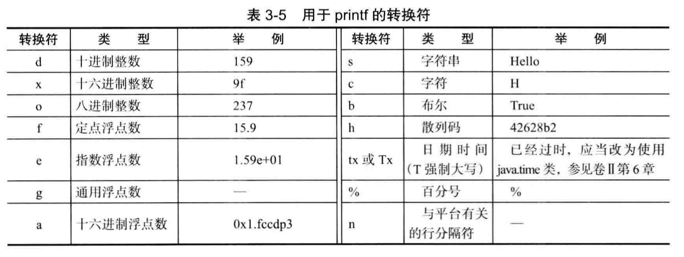

```java
System.out.printf("%,.2f", 10000.0 / 3.0);
// 3,333.33

// 可以使用多个标志
System.out.printf("%,(.2f", 10000.0 / -3.0);
// (3,333.33)
```

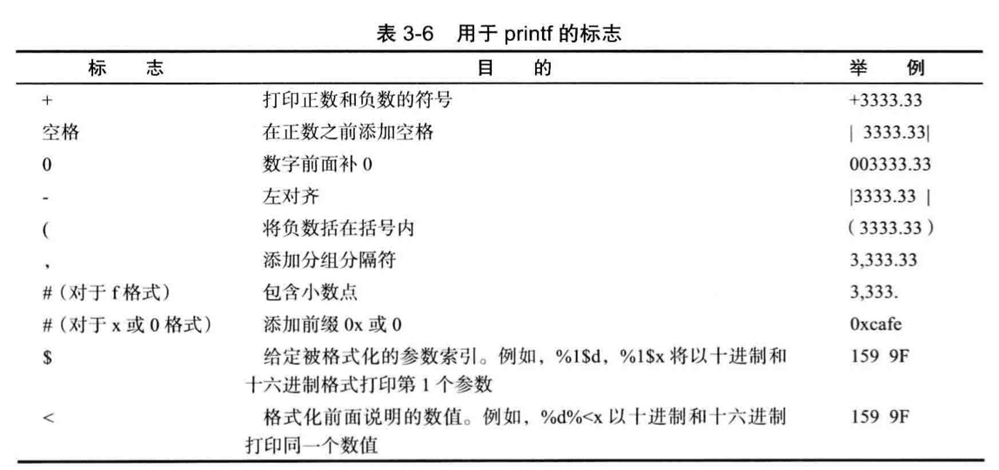


可以使用静态的`String.format`方法可以创建一个格式化的字符串，而不打印输出：

```java
String message = String.format("Hello, %s. Next year, you'll be %d", name, age);
```


printf方法也有日期与时间的格式化选项，不过Date类已经被`java.time`包取代了。


#### 文件输入与输出 🔖

`Paths`

`PrintWriter`


```java
Scanner in = new Scanner(Paths.get("niyflle.txt"), "UTF-8");
```


### 3.8 控制流程

#### 块作用域

块（即复合语句）是指由一对大括号括起来的若干条简单的Java语句。

块确定了变量的作用域。

一个块可以嵌套在另一个块中，但不能再嵌套的两个块中声明同名的变量。


#### 条件语句


#### 循环 while

```java
while (condition) statement
  
do statement while (condition);
```


#### 确定循环 for

`for`语句的第1部分通常用于对**计数器初始化**；第2部分给出每次新一轮循环执行前要检测的**循环条件**；第3部分指示如何**更新计数器**。

> 程序 LotteryOdds/LotteryOdds.java

#### 多重选择 switch

switch()的参数类型int，char， short， byte，long，String， Enum，不能是float，double和boolean类型。

#### 中断控制流程语句

```java
break;

continue;
```


### 3.9 大数值

java.math中提供了两个可以处理任意长度数字序列的数值的类：

`BigInteger`，`BigDecimal`， 它们不能使用常规的算术运算符（如：+、*等）。

```java
// 返回值等于x的大整数
BigInteger a = BigInteger.valueOf(100);
BigInteger c = a.add(b);
BigInteger d = c.multiply(b.add(BigInteger.valueOf(2)));  // d = c * (b + 2)
```


### 3.10 数组 

数组用来存储**同一类型**值的集合。

在声明数组变量时，需要指出数组类型（数据元素类型后紧跟[]）和数组变量的名字。如声明整型数组a：

```java
int[] a;
```

也可以：

```java
int a[];
```

数组变量声明并初始化：

```java
// 创建了一个可以存储100个整数的数组
int[] a = new int[100];
```

可通过循环为给数组元素赋值：

```java
for (int i = 0; i < 100; i++) {
  a[i] = i;
}
```

默认数字数组所有元素初始化0，boolean数组为false，对象数组为null。

数组创建后，就不能再改变它的大小。如果需要扩展数组大小，可以使用数组列表。


#### for each循环

**for each循环**可以依次数组（或者实现了Iterable接口的类对象如ArrayList）中的每个元素而不必指定下标：

```java
for (variable: collcection) {
  statement
}
```


#### 数组初始化以及匿名数组

创建数组对象并同时赋予初始值的简化书写形式：

```java
int[] smallPrimes = {2, 3, 5};
```

还可以初始化一个匿名数组：

```java
new int[]{17, 19, 31};

smallPrimes = new int[]{17, 19, 31};
```

> 数组长度为0与null不同


#### 数组拷贝

将一个数组变量拷贝给另一个数组变量（引用同一个数组，hashCode()相同）：

```java
int[] luckyNumbers = smallPrimes;
luckyNumbers[5] = 12;  // now smallPrimes[5] is also 12
```

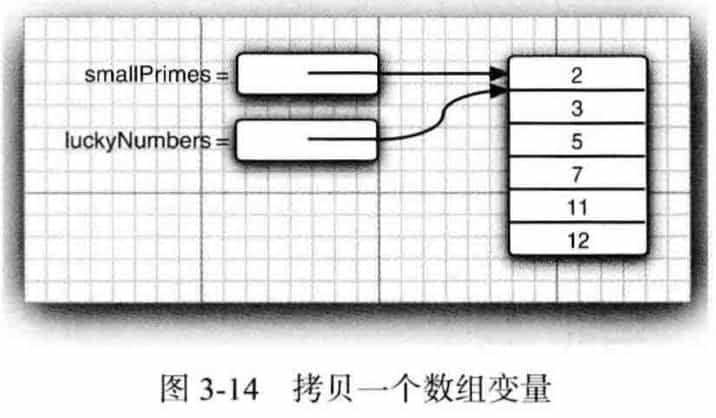

通过`Arrays.copyOf`可以将一个数组的所有值拷贝到一个新的数组中去（引用不同）：

```java
int[] copiedLuckyNumbers = Arrays.copyOf(luckyNumbers, luckyNumbers.length);
```


`copyOf`方法通常用来增加数组的大小:

```java
luckyNumbers = Arrays.copyOf(luckyNumbers, 2 * luckyNumbers.length);
```

如果数组元素是数值型， 那么多余的元素将被赋值为 0 ;如果数组元素是布尔型， 则将赋值 为 false。 相反， 如果长度小于原始数组的长度， 则只拷贝最前面的数据元素。


#### 命令行参数

```shell
$ java Message -g cruel world 
```

args 数组内容为：

```
args[0]: "-g"
args[1]: "cruel"
args[2]: "world"
```

Message是对应的类名，没有存储在args数组中。


#### 数组排序

```java
Arrays.sort(arr);
```

> code: LotteryDrawing


#### 多维数组

声明二维数组：

```java
double[][] balances;
```

初始化：

```java
balances = new double[NYEARS][NRATES];
```

数组元素初始化：

```java
int[][] magicSquare = {
  {16, 3, 2, 13},
  {5, 10, 11, 8},
  ...
}
```

访问：

```java
balances[i][j];
```

也可通过两个for each嵌套来处理二维数组：

```java
for (double[] row: a) {
  for (double value: row) {
    ...
  }
}
```

快速打印二维数组：

```java
System.out.println(Arrays.deepToString(a));
```

> Code: CompoundInterest


#### 不规则数组

“不规则”数组，即数组的每一行有不同的长度。

Java实际上没有多维数组，只有一维数组。多维数组被解释为“数组的数组。”前面的balances数组实际上是一个包含10个元素的数组，而每个元素又是一个由6个浮点数组成的数组：

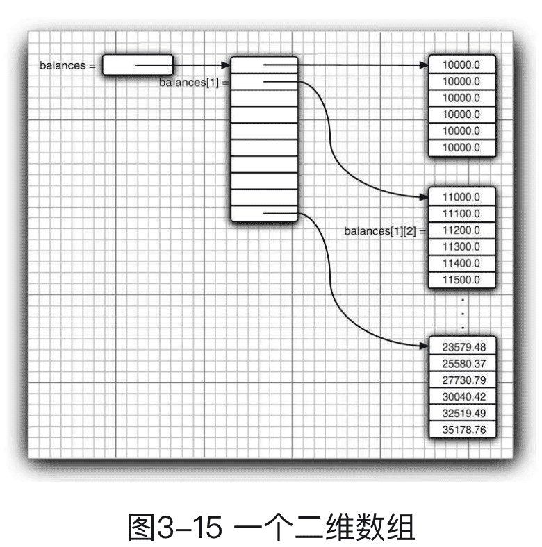


> Code: LotteryArray

#### 数组总结

java中,数组是一个对象, 不是一种**原生类**（8种基础类型）；

数组大小不可变且连续存储在堆中

## 4.对象与类

### 4.1 面向对象程序设计概述

面向对象的程序是由对象组成的，每个对象包含用户**公开的特定功能部分和隐藏的实现部分**。

传统的结构化程序设计，算法第一，数据结构第二；而OOP将数据放第一，然后在考虑操作数据的算法。

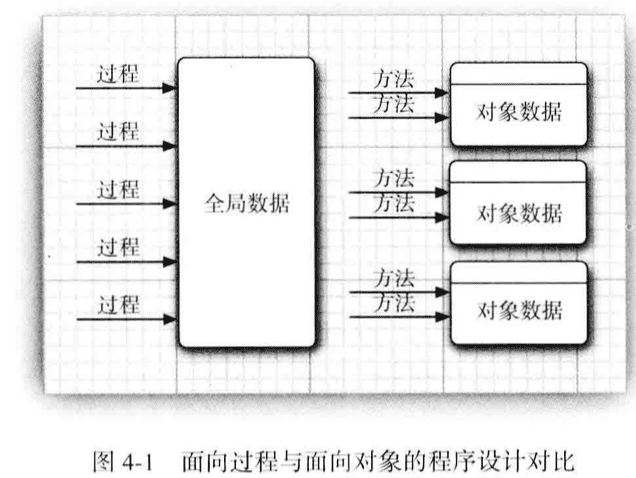

#### 类

类（class）是构造对象的**模板或蓝图**。由类**构造**(construct) 对象的过程称为创建类的**实例**(instance)。

**封装**（encapsulation，也称**数据隐藏**），形式上封装将数据和行为组合在一个包中，并对对象的使用者隐藏了数据的实现方式。

对象中的数据称为**实例域（instance field）**， 操纵数据的过程称为**方法**（method）。

对于每个特定的**类实例（对象）**都有一组特定的实例域值，这些值的集合就是这个对象的当前**状态（state）**。

通过扩展一个类来建立另外一个类的过程称为**继承 (inheritance)**。 


#### 对象

对象的三个特征：

- **对象的行为 (behavior )**     可以对对象施加哪些操作，或可以对对象施加哪些方法? 

- **对象的状态 (state )**       当施加那些方法时， 对象如何响应?

- **对象标识（identity）**   如何辨别具有相同行为与状态的不同对象?

对象状态的改变必须通过调用方法实现。

对象的状态并不能完全描述一个对象，每个对象都有一个唯一的身份（identity）。


#### 识别类

学习OOP从设计类开始，然后再往每个类中添加方法。

识别类的简单规则是在**分析问题的过程中寻找<font color=#FF8C00>名词</font>，而方法对应着<font color=#FF8C00>动词</font>**。

> 例如：订单处理系统中，有一些名词：商品（Item）、订单（Order）、送货地址（Shipping address）、付款（Payment）、账户（Account）。


#### 类之间的关系

1. **依赖**（“users-a“，dependence）

如果一个类的方法操作另一个类的对象，就说一个类依赖于另一个类。

应该尽可能地将相互依赖的类减至最少（耦合度最小）。


2. **聚合**（”has-a“，aggregation）

聚合关系意味着类A的对象包含类B的对象。


3. **继承**（”is-a“，inheritance）

表示特殊与一般关系。

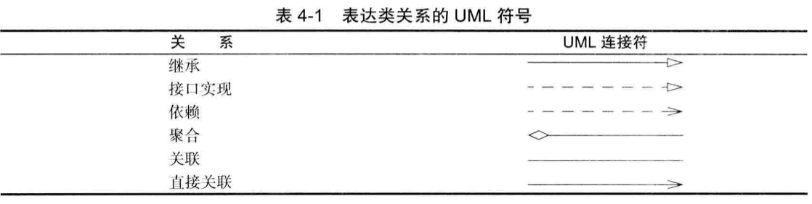


### 4.2 使用预定义类

#### 对象与对象变量

**构造器（constructor）**是一种特殊的方法，用来构造并初始化对象。构造器的名字应该与类名相同。在构造器前面加上new操作符就可以构造一个对象：

```java
new Date();
// 此处是Date类的特殊方法Date的实现，所以要加上括号
```

一个对象变量并没有实际包含一个对象，而仅仅引用一个对象。

在Java中，任何对象变量的值都是对存储在另外一个地方的一个对象的引用。new操作符的返回值也是一个引用。

可以显式地将对象变量设置为null，表明这个对象变量目前没有引用任何对象。


#### LocalDate

类库设计者决定将**保存时间**与**给时间点命名**分开。所以标准 Java 类库分别包含了两个类: 

一个是用来表示时间点的 **Date** 类(表示距离一个固定时间点UTC的毫秒数); 

另一个是用来表示大家熟悉的日历表示法的 **LocalDate** 类。

```java
// LocalDate不使用构造器，使用静态工厂方法
LocalDate.now(); 		
LocalDate newYearsEve = LocalDate.of(1999, 12, 31);

int year = newYearEve.getYear();
int month = newYearEve.getMonthValue();
int day = newYearsEve.getDayOfMonth();

// 距离当前对象指定天数的一个日期
LocalDate aThousandDaysLater = newYearsEve.piusDays(1000): 
year = aThousandDaysLater.getYearO;	// 2002
month = aThousandDaysLater.getMonthValueO; 	// 09
day = aThousandDaysLater.getDayOfMonth(); 	// 26
```

> Date类也有getDay、getMonth等方法，但已经不推荐使用了。
>
> 当类库设计者意识到某个方法不应该存在时， 就把它标记为不鼓励使用（被加上**@Deprecated**注解）。


#### 更改器方法与访问器方法

上面的plusDays 方法会生成一个新的LocalDate对象。另一个日历类**GregorianCalendar**就不一样了：

```java
CregorianCalendar someDay = new CregorianCalendar(1999, 11, 31); 
someDay.add(Calendar.DAY_0F_M0NTH, 1000);

year = someDay.get(Calendar.YEAR); // 2002 
month = someDay.get(Calendar.MONTH) + 1; // 09 
day = someDay.ge(t Ca1endar.DAY_0F_M0NTH); // 26
```

 GregorianCalendar.add 方法是一个**更改器方法 ( mutator method )** ，调用这个方法后，对象状态会改变。

正因如此，将变量命名为 someDay 而不是 newYearsEve 调用这个更改 器方法之后， 它不再是新年前夜。

相 反， 只访问对象而不修改对象的方法有时称为**访问器方法（accessor method）** 。例 如， LocalDate.getYear 和 GregorianCalendar.get 就是访问器方法。

>  C++：带有const后缀的方法是访问器方法，默认是更改器方法 。 
>
>  Java： 访问器方法与更改器方法在语法上**没有明显的区别**。

```java
// 使用LocalDate来显示当前月的日历
	public static void main(String[] args) {
        LocalDate date = LocalDate.now();
        int month = date.getMonthValue();
        int today = date.getDayOfMonth();

        // 把date设置成当前月的第一天
        date = date.minusDays(today - 1);
        DayOfWeek weekday = date.getDayOfWeek();
        int value = weekday.getValue();

        System.out.println("Mon Tue Wed Thu Fri Sat Sun");
        for (int i = 1; i < value; i++) {
            // 四个空格，表示如"Mon "
            System.out.print("    ");
        }

        while (date.getMonthValue() == month) {
            System.out.printf("%3d", date.getDayOfMonth());
            if (date.getDayOfMonth() == today) {
                System.out.print("*");
            } else {
                System.out.print(" ");
            }
            date = date.plusDays(1);
            if (date.getDayOfWeek().getValue() == 1) {
                System.out.println();
            }
        }
        if (date.getDayOfWeek().getValue() != 1) {
            System.out.println();
        }
    }
```

```java
// java.time.LocalDate

```


### 4.3 用户自定义类

要想创建一个完整的程序， 应该将若干类组合在一起， 其中只有一个类有 **main 方法**。

#### Employee 类

```java
	// EmployeeTest/EmployeeTest.java
import java.time.LocalDate;

/**
 *
 */
public class EmployeeTest {
  
    public static void main(String[] args) {
        Employee[] staff = new Employee[3];

        staff[0] = new Employee("Jack Ma", 75000, 1995, 12,15);
        staff[1] = new Employee("Pony Ma", 55000, 1993, 11,2);
        staff[2] = new Employee("Robin Li", 25000, 1994, 4,12);

        for (Employee e : staff) {
            e.raiseSalary(5);
        }

        for (Employee e: staff) {
            System.out.println("name=" + e.getName() + ", salary=" + e.getSalary() + ", hireDay=" + e.getHireDay());
        }     
    }
}

class Employee {
    private String name;
    private double salary;
    private LocalDate hireDay;

    public Employee(String n, double s, int year, int month, int day) {
        name = n;
        salary = s;
        hireDay = LocalDate.of(year, month, day);
    }

    public String getName() {
        return name;
    }

    public double getSalary() {
        return salary;
    }

    public LocalDate getHireDay() {
        return hireDay;
    }

    public void raiseSalary(double byPercent) {
        double raise = salary * byPercent / 100;
        salary += raise;
    }
}  
```

文件名必须与 public 类的名字相匹配。

在一个源文件中，只能有一个public类，但可以有任意数目的非public 类。

编译器会把上面的源代码编译成两个.class文件：EmployeeTest. class 和 Employee.class。

将包含main方法的类名（此处是EmployeeTest）提供给字节码解释器，就启动程序：

```shell
$ java EmployeeTest
```


#### 多个源文件的使用

如果把Employee类单独放在Employee.java文件中，那么就有两种编译方法：

1. 通配符调用

   ```shell
   $ javac Employee*.java
   ```

2. 直接编译

   ```shell
   $ javac EmployeeTest.java
   ```

   Java编译器会自动地搜索对应java类文件（Employee.java）。

强烈建议将实例域都标记为private。

#### 构造器

- 构造器与类同名 
- 每个类可以有一个以上的构造器 
- 构造器可以有 0 个、1 个或多个参数 
- 构造器没有返回值 
- 构造器总是伴随着 new 操作一起调用
- 不要在构造器中定义与实例域重名的局部变量


#### 隐式参数与显式参数

```java
number007.raiseSalary(5);
```

`number007`这个类对象就是raiseSalary方法的隐式参数，5就是显式参数。


#### 封装的优点

不要编写返回引用可变对象的访问器方法。如果需要返回一个可变对象的引用，应该首先对它进行克隆。

```java
class Employee {
  private Date hireDay;
  public Date getHireDay() {
    return hireday;
  }
}
```

更改为：

```java
class Employee {
  private Date hireDay;
  public Date getHireDay() {
    return (Date)hireday.clone();
  }
}
```


#### 基于类的访问权限


#### 私有方法

在实现一个类时，由于公有数据非常危险，所以应该所有的数据域都设置为私有的。


#### **final实例域**（常量）

构建对象时必须初始化这样的域。也就是说，必须确保在每 一个构造器执行之后， 这个域的值被设置，并且在后面的操作中，不能够再对它进行修改。


> final修饰的方法，不允许被子类覆盖（重写）。
>
> final修饰的类，不能被继承。
>
> final修饰的变量，不能改变值，等同于常量。
>
> final修饰的引用类型，不能再指向别的东西，但是可以改变其中的内容。
>
>  final 不能修饰抽象类。
>
> final修饰的成员变量在赋值时可以有三种方式：
>
> 1、在声明时直接赋值。
>
> 2、在构造器中赋值。
>
> 3、在初始代码块中进行赋值。


### 4.4 静态域和静态方法

#### 静态域（静态变量）

```java
private static int nextld = 1;
```

> 大多数OOP语言中，静态域也成为类域，”static“只是沿用了C++的叫法，并无实际意义。

#### 静态常量

```java
public static final double PI = 3.14159265358979323846;
```

#### 静态方法

不能向对象实施操作的方法。

👇两种情况下使用静态方法：

- 一个方法不需要访问对象状态，其所需参数都是通过显式参数提供（如：Math.pow）
- 一个方法只需要访问类的静态域


#### 工厂方法

静态方法还有另外一种常见的用途。 类似 LocalDate 和 NumberFormat 的类使用静态工 厂方法 ( factory methocd） 来构造对象。 

🔖


#### main方法

main方法也是一个静态方法，它不对任何对象进行操作。事实上，在启动程序是还没有任何一个对象。

> 每一个类可以有一个main方法，常用于对类进行单元测试。


### 4.5 方法参数

Java程序设计语言总是采用**按值调用**（call by value），方法得到的是参数值的一个拷贝，方法不能修改传递给它的任何参数变量的内容。

按**引用调用**（call by reference）表示方法接收的是调用者提供的变量地址。

**方法得到的是对象引用的拷贝，对象引用以及其他的拷贝同时引用同一个对象。**

🔖


### 4.6 对象构造


#### 重载(overloading)

一个类有多个构造器的特征叫做**重载**。Java中是可以重载任何方法。

重载函数方法名必须相同，看参数列表即可，无关返回值。

**方法的签名（signature）**：指出方法名和参数类型，能完整地描述一个方法。


#### 默认域初始化（Default Field Initialization）

如果在构造器中没有显示地给域赋予初始值，它们就会被自动赋予默认值：数值为0、布尔值为false、对象引用为null。（建议我们设计类是不要出现）

> 域和局部变量的主要区别就是**局部变量必须明确初始化**。


#### 无参数的构造器

一个类没有编写构造器，系统会默认提供一个无参数构造器。

如果类中至少有一个构造器，但是没有提供无参数的构造器，则在构造对象时如果没有提供参数就会被视为不合法。


#### 显式域初始化

<u>确保不管怎样调用构造器，每个实例域都可以被设置为一个有意义的初始值</u>，这是一个很好的设计习惯。

可以在类定义中个，直接将一个值赋给任何域：

```java
class Employee
{
  private String name = "";
}

```

当一个类的所有构造器都希望把相同的值赋予某个特定的实例域，可以像上面那样在执行构造器之前，先执行赋值操作。

初始值不一定是常量值，也可以调用方法：

```java
class Employee
{
  private int id = assignId();
  
  private static int assignId()
  {
    
  }
}
```


#### 参数名


#### 调用另一个构造器

`this()`


#### 初始化块(intialization block)

三种初始化数据域的方法：

1. 在构造器中设置
2. 在声明中赋值
3. 初始化块

首先运行初始化块， 然后才运行构造器的主体部分。


#### 对象析构与finalize方法

由于Java有自动的垃圾回收器，不需要人工回收内存，所以Java不支持析构器。


### 4.7 包

所有标准的Java包都处于java和javax包层次中。

使用包的主要原因是**确保类名的唯一性**。

从编译器的角度来看，嵌套的包之间没有任何关系。

#### 类的导入

<font color=#FF8C00>**一个类可以使用所属包中的所有类，以及其他包中的公有类。**</font>

`import`

#### **静态导入**

```java
import static java.lang.System.*;
```

不必加类名前缀，就可以使用System类的静态方法和静态域。

```java
out.println("Goodbye, World!"); 	// i.e., System.out
exit(0); //i.e., System.exit 
```


#### 将类放入包中

`package`

将包中的文件放到与完整的包名匹配的子目录中。

> 🔖 PackageTest/

#### 包作用域


### 4.8 类路径

类文件也可以存储在 **JAR(Java 归档 )**文件中。

JAR 文件使用 **ZIP 格式组织文件和子目录**。可以使用所有ZIP实用程序查看内部的rt.jar以及其他的JAR文件。

#### 设置类路径

```shell
java -classpath /home/user/dassdir:.:/home/user/archives/archive.jar HyProg
```


### 4.9 文档注释 

由于文档注释与源代码在同一个文件中， 在修改源代码的同时， 重新运行`javadoc`就可以轻而易举地保持两者的一致性。

#### 注释的插入

*自由格式文本（free-form text）*：第一句是概要性的句子；可以用使用HTML；等宽代码使用`{@code ...}`

*@ *


#### 类注释

没有必要每一行开始用星号。


#### 方法注释

@param

@return

@throws


#### 域注释


#### 通用注释

@author

@version

@since

@deprecated

@see


`@see com.andyron.com.corejava.Employee#raiseSalary(double)`


#### 包与概述注释

包注释需要在每个包目录中添加一个单独的文件（`package.html`或`package-info.java`）。


#### 注释的抽取


### 4.10 类设计技巧

1. 一定要保证数据私有
2. 一定要对数据初始化
3. 不要在类中使用过多的基本类型
4. 不是所有的域都需要独立的域访问器和域更改器
5. 将职责过多的类进行分解
6. 类名和方法名要能够体现它们的职责
7. 优先使用不可变的类


## 5 继承

面向对象三个基本特征：封装、继承、多态。

继承已存在的类是复用（继承）这些类的方法和域。

**反射（reflection）**是指在程序运行期间发现更多的类及其属性的能力，在开发软件工具时应用较多。


### 5.1 超类和子类

#### 定义子类

超类（superclass）也叫基类（base class）、父类（parent class）；

子类（subclass）也叫派生类（derived class）、孩子类（child class）。

子类比超类拥有的功能更加丰富。

设计类时，应该将通用的方法放在超类中，将具有特殊用途的方法放在子类中。


#### 重写（override）方法

```java
@Override
public double getSalary() {
  return super.geSalary() + bonus;
}
```

`super`不是一个对象的引用（与`this`不是类似的概念），不能将其赋给另一个对象变量，它只是一个指示编译器调用超类方法的**特殊关键字**。


#### 子类构造器

```java
public Manager(String name, double salary, int year, int month, int day) {
  super(name, salary, year, month, day);
  bonus = 0;
}
```

由于Manager类的构造器不能访问Employee类的私有域，所以必须利用Employee类的构造器对这部分私有域进行初始化；通过`super`实现对超类构造器的调用，而且它必须是子类构造器的第一条语句。

如果子类构造器没有显式调用超类构造器，则将自动地调用超类默认（没有参数）的构造器；如果超类没有默认构造器，编译器就会报错。

> `this`用途：
>
> 1. 引用隐式参数
> 2. 调用该类其他的构造器
>
> `super`用途：
>
> 1. 调用超类的方法
> 2. 调用超类的构造器

```java
Manager boss = new Manager("Jack Ma", 100000000, 1965, 8,18);
boss.setBonus(50000);

Employee[] staff = new Employee[3];

staff[0] = boss;
staff[1] = new Employee("Pony Ma", 55000, 1993, 11,2);
staff[2] = new Employee("Robin Li", 25000, 1994, 4,12);

for (Employee e: staff) {
  System.out.println("name=" + e.getName() + ", salary=" + e.getSalary());
}
```

一个对象变量（如，上面的e）可以指示多种实际类型的现象称为**多态（polymorphism）**；在运行时能够自动选择调用哪个方法的现象称为**动态绑定（dynamic binding）**。


#### 继承层次

由一个公共超类派生出来的所有类的集合被称为**继承层次（inheritance hierarchy）**；从某个特定的类到期祖先的路径被称为**继承链（inheritance chain）**。


#### 多态

```java
Employee e;
e = new Employee(...);
e = new Manager(...);
```

在Java中，对象变量是多态的；一个Employee变量既可以引用一个Employee类对象，也可以引用一个Employee类的任何一个子类对象。

`ArrayStoreException`🔖


#### 理解方法调用 🔖


#### 阻止继承：final类和方法

**final类**：不允许扩展的类。final类中的方法自动地成为final方法，但不包括域。

**final方法**：子类不能覆盖的方法。

**final域**：构造对象之后就不允许改变。

方法和类声明为final的主要目的：确保它们不会在子类中改变语义。


#### 强制类型转换

基本类型转换：

```java
double x = 3.405;
int nx = (int) x;
```

对象引用转换：

```java
Manager boss = (Manager) staff[0];
```

将一个子类的引用赋给一个超类变量，编译器是允许的；但讲一个超类的引用赋给一个子类变量，必须进行类型转换，这样才能通过运行时的检查。如果转换失败，就会产生`ClassCastException` 异常。

为了避免出现上面的异常，转换前通过`instanceof`操作符进行判断一下：

```java
if (staff[1] instanceof Manager) {
  ...
}
```


#### 抽象类

在继承层次结构中，位于上层的类更具有通用性、更加抽象。

为了提高程序的清晰度，包含一个或多个抽象方法的类本身必须被声明为抽象的：

```java
public abstract class Person {
  public abstract String getDescription();
}
```

除了抽象方法之外，抽象类还可以包含具体数据和具体方法。

抽象类不能被实例化。

类即使不含抽象方法，也可以将类声明为抽象类。

注意，可以定义一个抽象类的对象变量，但是它只能引用非抽象子类的对象：

```java
Person p = new Student("Andy Ron", "Programmer");
```

##### 抽象类和普通类的区别

1. 抽象方法必须为public或者protected（因为如果为private，则不能被子类继承，子类便无法实现该方法），缺省情况下默认为public。

2. 抽象类不能用来创建对象；

3. 如果一个类继承于一个抽象类，则子类必须实现父类的抽象方法。如果子类没有实现父类的抽象方法，则必须将子类也定义为为abstract类。


#### 受保护访问

`private`，仅对本类可见。

没有修饰符（默认情况），对本包可见。

`protected`，对本包和所有子类可见。

`public`，对所有类可见。


public>protected>默认(包访问权限)>private。protected除了可以被同一包访问，还可以被包外的子类所访问。


### 5.2 Object：所有类的超类

在Java中每个类都是由Object扩展来的。Java中只有基本数据类型不是对象。所有数组类型，不管是对象数组还是基本类型的数组都扩展了Object类。


#### equals 方法  

检测一个对象是否等于另外一个对象（判断两个对象是否具有相同的引用）。

多数情况下，判断引用是否相等没有什么意义。如果两个对象的状态相等，就认为这两个对象时相等。

```java
public class Employee {
  public boolean equals(Object otherObject) {
    if (this == otherObject) return ture;
    
    if (otherObject == null) return false;
    
    if (getClass() != otherObject.getClass()) return flase;
    
    Employee other = (Employee) otherObject;
    
    // return name.equals(other.name) && salary == other.salary && hireDay.equals(other.hireDay);
    return Objects.equals(name, other.name) && salary == other.salary && Objects.equals(hireDay, other.hireDay);
  }
}
```

为了防止name、hireDay为null的情况，改用`Objects.equals`方法，如果两个参数都为null，结果为true；如果一个为null，结果为false；如果两个参数都不为null，则调用a.equals(b)。

##### equals vs ==

1. 基础类型比较只能使用`==`；

2. 对于引用类型

   如果重写了equals方法的，比如基本类型的包装类型（Boolean、Character、Byte、Shot、Integer等）、String等，==比较地址，equals比较内容；

   没有重写equals方法的，两者是相同的，都是比较地址；

#### 相等测试与继承

Java语言规范要求equals方法具有的特性：

1. 自反性
2. 对称性
3. 传递性
4. 一致性
5. 对于任意非空引用x，x.equals(null)应该返回false。


`AbstractSet.equals`并没有被声明为final，这样可以让子类选择更加有效的算法对集合进行是否相等的检查。

🔖


#### hashCode方法

散列码（hash code）是由对象导出的一个整型值。

```java
String s = "Ok";
        StringBuilder sb = new StringBuilder(s);
        System.out.println(s.hashCode() + " " + sb.hashCode());
        String t = new String("Ok");
        StringBuilder tb = new StringBuilder(t);
        System.out.println(t.hashCode() + " " + tb.hashCode());
```

结果是s和t的散列码相同，因为字符串的散列码是由内容导出的；

sb和tb的散列码不同，因为StringBuilder类中没有定义hashCode方法，它的的散列码是有Object类的默认hashCode方法导出的**对象存储地址**。

可以重新定义hashCode方法。🔖


#### toString()方法

用于返回表示对象值的字符串。一般格式都是：类的名字，随后是一对方括号括起来的域值。如Point类的toString方法返回字符串：

```java
java.awt.Point[x=10,y=20]
```

自定义类中的实现如：

```java
public String toString() {
  return getClass().getName()
    + "[name=]" + name
    + ",salary=]" + salary
    + ",hireDay=" + hireDay
    + "]";
}
```

子类中只需要先调用一下`super.toString()`即可。

下面情况都会直接调用toString()方法：

```java
Point p = new Point(10, 20);
String message = "The current position is " + p;

System.out.println(p);
```


`Object`定义了toString方法，返回的是对象所属类名和散列码，如

```java
System.out.println(System.out);
```

结果为：

```java
java.io.PrintStream@38af3868
```

这是因为`PrintStream`类的设计者没有覆盖toString方法。


数组也继承了Object类的toString方法，因此要使用静态方法`Arrays.toString()`，如果要打印多维数组，就要`Arrays.deepToString()`：

```java
int[] luckyNumbers = {2, 3, 5, 9, 11};
System.out.println(luckyNumbers);
System.out.println(Arrays.toString(luckyNumbers));
```

```
[I@38af3868
[2, 3, 5, 9, 11]
```

`[I`表示整型数组。


toString方法是一种非常有用的调试工具。在标准类库中，许多类都定义了。**强烈建议为自定义的每个类添加toString方法**。


> Code: equals 🔖


### 5.3  泛型数组列表ArrayList🔖


#### 访问数组列表元素


#### 类型化与原始数组列表的兼容性


### 5.4 对象包装器与自动装箱

有时需要将基本类型转换对象。所有基本类型都有一个与之对应的类，如Integer、Long、Float、Double、Short、Byte、Character、Void、BOOlean，这些类称为**包装器（wrapper）**。

🔖


### 5.5 参数数量可变的方法

```java
public class PrintStream {}
		public PrintStream printf(String format, Object ... args) {
        return format(format, args);
    }
}
```

这里的省略号 `. . .` 是 Java 代码的一部分， 它表明这个方法可以接收任意数量的对象 (除 fmt 参数之外 )。


### 5.6 枚举类

定义枚举类型：

```java
public enum Size { SMALL, MEDIUM, LARGE, EXTRA_LARGE };
```

实际上，此处就是定义了一个类`Size`，然后还有其四个实例。（**所有的枚举类型都是Enum类的子类**）

> 在比较两个枚举类型的值时，永远不需要调用equals，而直接使用“==”就可以了。

可以在枚举类型中添加一些构造器、方法和域。

Enum类中有一些方法：

toString能够返回枚举常量名。例`Size.SMALL.toString()`将返回字符串“SMALL”`。

toString的逆方法是静态方法valueOf。例如`Size s = Enum.valueOf(Size.class, "SMALL")`将s设置成Size.SMALL。

静态方法values返回一个包含全部枚举值的数组。

ordinal方法返回enum声明中枚举常量的位置，位置从0开始计数。例如：`Size.MEDIUM.ordinal()`返回1。

例子:下面代码输出是？

```java
enum AccountType {
    SAVING, FIXED, CURRENT;
    private AccountType() {
        System.out.println(“It is a account type”);
    }
}
class EnumOne {
    public static void main(String[]args) {
  System.out.println(AccountType.FIXED);
    }
}
```

枚举类有三个实例，故调用三次构造方法，打印三次It is a account type，然后是"FIXED"


### 5.7 反射 

**反射库**(reflection library，`java.lang.reflect.*`) 提供了一个非常丰富且精心设计的工具集， 以便编写能够动态操纵 Java 代码的程序。

能够分析类能力的程序称为**反射**(reflective )。 

反射主要使用人员是**工具构造者**，而不是应用程序员。它的用途:

- 在运行时分析类的能力。

- 在运行时查看对象， 例如， 编写一个 toString 方法供所有类使用。

- 实现通用的数组操作代码。

- 利用 Method 对象， 这个对象很像中的函数指针。

#### Class类

Java运行时系统始终为所有的对象维护一个被称为**运行时的类型标识**。 这个信息跟踪着每个对象所属的类。 **虚拟机利用运行时类型信息选择相应的方法执行**。保存这些信息的类被称为`Class`。

三种获得Class类对象的方法：

1. Object类中的getClass方法

```java
Random generator = new Random():
Class cl = generator.getClass();
String name = cl.getName(); // 结果为"java.util.Random"，包名也在其中
```

2. Class的静态方法forName。它的参数必须是类名或接口名，否者会抛出受查异常。

```java
String dassName = "java.util.Random";
Class cl = Class.forName(dassName);
```

3. `T.class`

```java

Class dl = Random.class; // if you import java.util
Gass cl2 = int.class;
Class cl3 = Double[].class;
```

一个Class对象实际上表示的是一个类型，而这个类型未必一定是一种类，例如上面`int`就不是类。

> Class类实际上是泛型类。例如，`Employee.class`的类型是`Class<Employee>`。

虚拟机为每个类型管理一个Class对象。因此，可以利用==运算符实现两个类对象比较的操作。

```java
if (e.getClass() == Employee.class) ...
```

> Class类是Object的派生类。
>
> Class类中的forName()方法返回与带有给定字符串名的类或接口相关联的Class对象（**装载**其他类）。
>
> ```java
> public static Class<?> forName​(String className)
>                         throws ClassNotFoundException
> ```
>
> 


##### newInstance方法

newInstance方法可以用来动态地创建一个类的实例，例如：

```java
e.getClass().newInstance();
```

创建了一个与e具有相同类类型的实例。newInstance方法调用默认的构造器（没有参数的构造器）初始化新创建的对象。如果这个类没有默认的构造器，就会抛出一个异常。

将forName与newInstance配合起来使用，可以根据存储在字符串中的类名创建一个对象：

```java
String s = "java.util.Random";
Object m = Class.forName(s).newlnstance();
```


#### 捕获异常

抛出异常比终止程序要灵活得多，这是因为可以提供一个“捕获”异常的**处理器（handler）**对异常情况进行处理。


#### 利用反射分析类

在`java.lang.refect`包中有三个类Field、Method和Constructor分别用于描述类的域、方法和构造器。

- 它们都有getName的方法，用来返回名称；
- Field类有一个getType方法，用来返回描述域所属类型的Class对象；
- Method和Constructor类有能够报告参数类型的方法，Method类还有一个可以报告返回类型的方法；
- 它们都有getModifiers的方法，返回一个整型数值，用不同的位开关描述public和static这样的修饰符使用状况。

`java.lang.refect`包中的Modifier类的静态方法isPublic、isPrivate或isFinal判断方法或构造器是否是public、private或final；Modifier.toString方法可将修饰符打印出来。

Class类中的getFields、getMethods和getConstructors方法将分别返回类提供的public域、方法和构造器数组，其中包括超类的公有成员；

Class类的getDeclareFields、getDeclareMethods和getDeclaredConstructors方法将分别返回类中声明的全部域、方法和构造器，其中包括私有和受保护成员，但不包括超类的成员。

```java
package reflection;

import java.io.ObjectInputStream;
import java.lang.reflect.*;
import java.util.*;

/**
 * 5.7 用反射打印出一个类的容貌
 * @author Andy Ron
 */
public class ReflectionTest {
    public static void main(String[] args) {

        // 类完整名称，包括包名
        String name;
        if (args.length > 0) {
            name = args[0];
        } else {
            Scanner in = new Scanner(System.in);
            System.out.println("Enter class name (e.g. java.util.Date): ");
            name = in.nextLine();
        }

        try {
            Class cl = Class.forName(name);
            Class supercl = cl.getSuperclass();
            String modifiers = Modifier.toString(cl.getModifiers());
            if (modifiers.length() > 0) {
                System.out.print(modifiers + " ");
            }
            System.out.print("class " + name);
            if (supercl != null && supercl != Object.class) {
                System.out.print(" extends " + supercl.getName());
            }
            System.out.print(" {\n");

            printConstructors(cl);
            System.out.println();
            printMethods(cl);
            System.out.println();
            printFields(cl);
            System.out.println("}");

        } catch (ClassNotFoundException e) {
            e.printStackTrace();
        }
        System.exit(0);
    }

    /**
     * 打印类的所有构造器
     * @param cl
     */
    public static void printConstructors(Class cl) {
        Constructor[] constructors = cl.getDeclaredConstructors();

        for (Constructor c : constructors) {
            String name = c.getName();
            System.out.print("    ");
            String modifiers = Modifier.toString(c.getModifiers());
            if (modifiers.length() > 0) {
                System.out.print(modifiers + " ");
            }
            System.out.print(name + "(");

            Class[] paramTypes = c.getParameterTypes();
            for (int j = 0; j < paramTypes.length; j++) {
                if (j > 0) {
                    System.out.print(", ");
                }
                System.out.print(paramTypes[j].getName());
            }
            System.out.println(");");
        }
    }

    public static void printMethods(Class cl) {
        Method[] methods = cl.getDeclaredMethods();

        for (Method m : methods) {
            Class retType = m.getReturnType();
            String name = m.getName();

            System.out.print("    ");

            String modifiers = Modifier.toString(m.getModifiers());
            if (modifiers.length() > 0) {
                System.out.print(modifiers + " ");
            }
            System.out.print(retType.getName() + " " + name + "(");

            Class[] paramTypes = m.getParameterTypes();
            for (int j = 0; j < paramTypes.length; j++) {
                if (j > 0) {
                    System.out.print(", ");
                }
                System.out.print(paramTypes[j].getName());
            }
            System.out.println(");");
        }
    }

    public static void printFields(Class cl) {
        Field[] fields = cl.getDeclaredFields();

        for (Field f : fields) {
            Class type = f.getType();
            String name = f.getName();
            System.out.print("    ");
            String modifiers = Modifier.toString(f.getModifiers());
            if (modifiers.length() > 0) {
                System.out.print(modifiers + " ");
            }
            System.out.println(type.getName() + " " + name + ";");
        }
    }
}
```

结果("java.util.Date")：

```

public class java.util.Date {
    public java.util.Date(java.lang.String);
    public java.util.Date(int, int, int, int, int, int);
    public java.util.Date(int, int, int, int, int);
    public java.util.Date();
    public java.util.Date(long);
    public java.util.Date(int, int, int);

    public boolean equals(java.lang.Object);
    public java.lang.String toString();
    public int hashCode();
    public java.lang.Object clone();
    public int compareTo(java.util.Date);
    public volatile int compareTo(java.lang.Object);
    public static java.util.Date from(java.time.Instant);
    private void readObject(java.io.ObjectInputStream);
    private void writeObject(java.io.ObjectOutputStream);
    private final sun.util.calendar.BaseCalendar$Date normalize();
    private final sun.util.calendar.BaseCalendar$Date normalize(sun.util.calendar.BaseCalendar$Date);
    public boolean before(java.util.Date);
    public boolean after(java.util.Date);
    public static long parse(java.lang.String);
    public int getMonth();
    public int getSeconds();
    public java.time.Instant toInstant();
    public static long UTC(int, int, int, int, int, int);
    public int getYear();
    public long getTime();
    public void setTime(long);
    private static final sun.util.calendar.BaseCalendar getCalendarSystem(sun.util.calendar.BaseCalendar$Date);
    private static final sun.util.calendar.BaseCalendar getCalendarSystem(long);
    private static final sun.util.calendar.BaseCalendar getCalendarSystem(int);
    private final long getTimeImpl();
    private static final java.lang.StringBuilder convertToAbbr(java.lang.StringBuilder, java.lang.String);
    private static final synchronized sun.util.calendar.BaseCalendar getJulianCalendar();
    public int getDate();
    public int getDay();
    public java.lang.String toLocaleString();
    public java.lang.String toGMTString();
    public int getTimezoneOffset();
    static final long getMillisOf(java.util.Date);
    public void setDate(int);
    private final sun.util.calendar.BaseCalendar$Date getCalendarDate();
    public void setHours(int);
    public int getHours();
    public int getMinutes();
    public void setMonth(int);
    public void setMinutes(int);
    public void setSeconds(int);
    public void setYear(int);

    private static final sun.util.calendar.BaseCalendar gcal;
    private static sun.util.calendar.BaseCalendar jcal;
    private transient long fastTime;
    private transient sun.util.calendar.BaseCalendar$Date cdate;
    private static int defaultCenturyStart;
    private static final long serialVersionUID;
    private static final [Ljava.lang.String; wtb;
    private static final [I ttb;
}

Process finished with exit code 0

```


#### 在运行时使用反射分析对象


> Code: objectAnalyzer

#### 使用反射编写泛型数组代码


> Code: arrays


#### 调用任意方法

> Code: methods


### 5.8 继承的设计技巧

1. 将公共操作和域放在超类
2. 不要使用受保护的域
3. 使用继承实现 isa 关系
4. 除非所有继承的方法都有意义， 否则不要使用继承
5. 在覆盖方法时， 不要改变预期的行为
6. 使用多态， 而非类型信息
7. 不要过多地使用反射


## 6.接口、lambda表达式与内部类

接口是用来描述类**具有**什么功能，并不给出每个功能的具体实现。

lambda表达式是一种表示可以在将来某个时间点执行的代码块的简洁方法。


### 6.1 接口

接口（interface）不是类，而是对类的一组需求描述。

```java
public interface Comparable<T> {
  int compareTo(T other);
}
```

**接口中所有方法自动地属于public**。在实现接口时，必须把方法声明为public。

接口绝不能含有实例域。可以将接口看成是没有实例域的抽象类。<u>接口可以定义常量。</u>

类实现接口的步骤：

1. 将类声明为实现接口
2. 将接口中的所有方法进行定义

```java
class Employee implements Comparable {
  public int compareTo(Object other) {
    Employee other = (Employee)otherObject;
    return Double.compare(salary, other.salary);
  }
}
```


#### 接口的特性

尽管不能构造接口的对象， 却能声明接口的变量；接口变量必须弓I用实现了接口的类对象:

```java
Comparable x;
x= new Employee(...) // Employee 实现了 Comparable
```

检测一个对象是否实现了某个接口：

```java
if (anObj instanceof Comparable) { 
  ... 
}
```

接口可以建立像类一样的继承关系，从而**扩展**接口；接口中可以包含常量：

```java
public interface Moveable {
  void move(double x, double y);  // 省略了public
}

public interface Powered extends Moveable {
  double milesPerGallon();
  double SPEED_LIMIT = 95;  // 省略了 public static final 
}
```

**接口中的方法和常量不需要加任何修饰符号。**


#### 接口与抽象类

接口可以提供多重继承的大多数好处， 同时还能避免多重继承的复杂性和低效性。

**抽象类**特点:

1. 抽象类中可以构造方法。自己不能直接调用，只能供其子类调用

2. 抽象类中可以存在普通属性，方法，静态属性和方法。

3. 抽象类中可以存在抽象方法。

4. 如果一个类中有一个抽象方法，那么当前类一定是抽象类；抽象类中不一定有抽象方法。

5. 抽象类中的抽象方法，需要有子类实现，如果子类不实现，则子类也需要定义为抽象的。

**接口**特点：

1. 在接口中只有方法的声明，没有方法体。

2. 在接口中只有常量，因为定义的变量，在编译的时候都会默认加上`public static final`

3. 在接口中的方法，永远都被public来修饰。

4. 接口中没有构造方法，也不能实例化接口的对象。

5. 接口可以实现多继承

6. 接口中定义的方法都需要有实现类来实现，如果实现类不能实现接口中的所有方法则实现类定义为抽象类。


#### 静态方法

接口中增加静态方法理论上是可以，但这有违于将接口作为抽象规范的初衷。通常的做法都是将静态方法放在伴随类中，列如，标准库中，成对的接口和实用工具类，如Collection/Collections、Path/Paths。


#### 默认方法

可以为接口方法提供一个默认实现。需要`default`修饰符。

```java
public interface Comparable<T> {
  default int compareTo(T other) { return 0; }
}
```

大部分时候这种默认实现没有多大用，因为每个具体实现时都会覆盖这个方法。

#### 解决默认方法冲突

### 6.2 接口实例 🔖

#### 接口与回调

**回调（callback）**


#### Comparator接口


#### 对象克隆

clone方法是 Object 的一个 protected 方法。

拷贝原变量和副本都是同一个对象的引用


**浅拷贝**：没有克隆对象中引用的其他对象。默认拷贝是浅拷贝，还会共享信息。

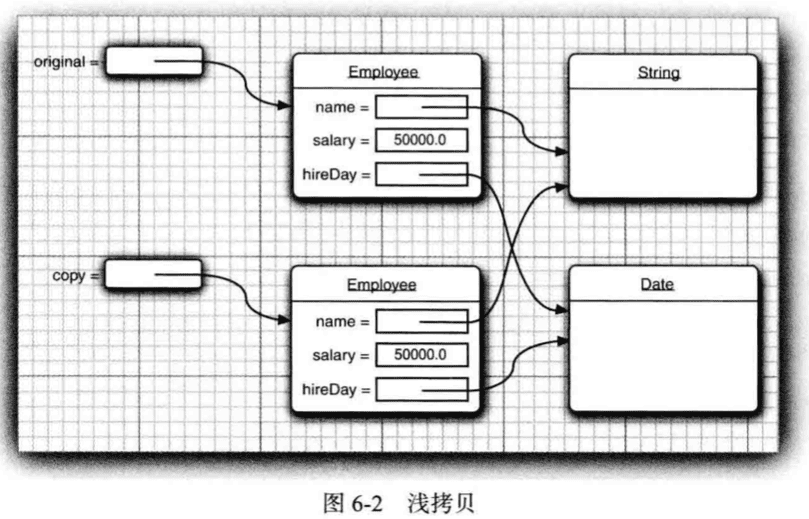

`Cloneable`   

重写clone方法实现深拷贝。

> Code: clone


### 6.3 lambda表达式

#### 为什么引入lambda表达式


#### lambda表达式的语法

lambda表达式就是**一个代码块， 以及必须传人 代码的变量规范**。

```java
(参数) -> { 表达式 }
```

```java
(String first, String second) -> { first.lengthO - second.lengthO }
```


#### 函数式接口

对于只有一个抽象方法的接口， 需要这种接口的对象时， 就可以提供一个 lambda 表达 式。 这种接口称为**函数式接口 (functional interface )**。

最好把 lambda 表达式看作是一 个函数， 而不是一个对象。

`Comparator `

`Predicate`  专门用来传递 lambda 表达式。


#### 方法引用
```java
Timer t = new Timer(1000, System.out::println);
```

表达式 `System.out::println` 是一个**方法引用(method reference)**, 它等价于 lambda 表达式 `x 一> System.out.println(x)`。

```java
Timer t = new Timer(1000, event -> System.out.println(event));
```

用:: 操作符分隔方法名与对象或类名有三种方式：


```java
object::instanceMethod
```

```java
Class::staticMethod
Math::pow 等价于 (x，y) -> Math.pow(x, y)
```

```java
Class::instnaceMethod
String::compareToIgnoreCase 等同于 (x, y) -> x.compareToIgnoreCase(y)
```


#### 构造器引用

`Person::new`


#### 变量作用域


#### 处理lambda表达式🔖


#### 再谈Comparator

```java
Arrays.sort(people, Comparator.comparing(Person::getName))
  
Arrays.sort(people, Comparator.comparing(Person::getLastName).thenComparing(Person::getFirstName));

Array.sort(people, Comparator.comparing(Person::getName, (s, t) -> Integer.compare(s.length(), t.length())));
```


### 6.4 内部类(inner class)

**内部类（inner class）**是定义在另一个类中的类。

使用内部类的原因：

- 内部类方法可以访问该类定义所在的作用域中的数据， 包括私有的数据。 
- 内部类可以对同一个包中的其他类隐藏起来。 
- 当想要定义一个回调函数且不想编写大量代码时，使用匿名(anonymous) 内部类比较便捷。


内部类既可以访问自身的数据域， 也可以访问创建它的外围类对象的数据域。

> 《Think in java》:
>
> 使用内部类最吸引人的原因是：每个内部类都能独立地继承一个（接口的）实现，所以无论外围类是否已经继承了某个（接口的）实现，对于内部类都没有影响。

使用内部类最大的优点就在于它能够非常好的解决多重继承的问题，使用内部类还能够为我们带来如下特性（摘自《Think in java》）：

1、内部类可以用多个实例，每个实例都有自己的状态信息，并且与其他外围对象的信息相互独立。

2、在单个外围类中，可以让多个内部类以不同的方式实现同一个接口，或者继承同一个类。

3、创建内部类对象的时刻并不依赖于外围类对象的创建。

4、内部类并没有令人迷惑的“is-a”关系，他就是一个独立的实体。

5、内部类提供了更好的封装，除了该外围类，其他类都不能访问。


#### 使用内部类访问对象状态


#### 内部类的特殊语法规则


#### 内部类是否有用、必要和安全


#### 局部内部类

局部类不能用public或private访问说明符进行声明，它的作用域限定在声明这个局部类的块中。


#### 由外部方法访问变量


#### 匿名内部类


#### 静态内部类


### 6.5 代理


#### 何时使用代理


#### 创建代理对象


#### 代理类的特性


## 7.异常、断言和日志

如果用户在运行程序期间，由于程序的错误或一些外部环境的影响造成用户数据的丢失，可能就不再使用这个程序了。为了避免这种情况，至少应该做到：

- 向用户通告错误;

- 保存所有的工作结果; 

- 允许用户以妥善的形式退出程序。


### 7.1 处理错误

如果由于出现错误而使得某些操作没有完成，程序应该：

- 返回到一种安全状态，并能够让用户执行一些其他命令；
- 或者允许用户保存所有操作的结果，并以妥善的方式终止程序。

要做到这些并不容易。原因是检<u>测（或引发）错误条件的代码通常离那些能够让数据恢复到安全状态，或者能够保存用户的操作结果，并正常地退出程序的代码很远。</u>

异常处理的任务就是**将控制权从错误产生的地方转移给能够处理这种情况的错误处理器**。

有哪些错误和问题：

1. 用户输入错误
2. 设备错误
3. 物理限制
4. 代码错误


在 Java 中， 如果某个方法不能够采用正常的途径完整它的任务， 就可以通过另外一个路径**退出**方法。 在这种情况下， 方法并**不返回任何值**， 而是抛出 (throw) 一个封装了错误信息的对象。 异常处理机制开始搜索能够处理这种异常状况的**异常处理器** (exception handler )。


#### 异常分类

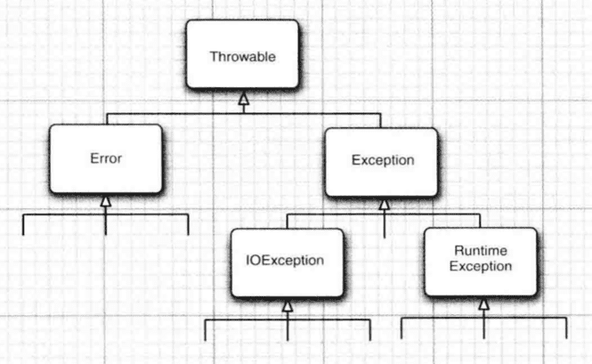


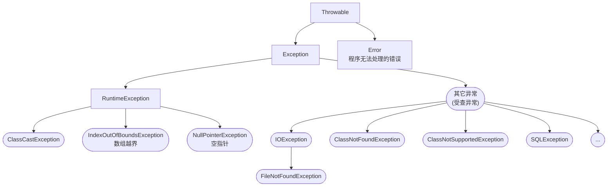


**Exception（异常）** :是程序本身可以处理的异常。

**Error（错误）:** 是程序无法处理的错误。描述Java运行时系统的内部错误和资源耗尽错误。一般不需要程序处理。

**受查（checked）异常（编译器要求必须处置的异常）** ： 除了Error，RuntimeException及其子类以外，其他的Exception类及其子类都属于可查异常。这种异常的特点是Java编译器会检查它，也就是说，当程序中可能出现这类异常，<u>要么用try-catch语句捕获它，要么用throws子句声明抛出它，否则编译不会通过</u>。

**非受查（unchecked）异常(编译器不要求处置的异常):** 包括运行时异常（RuntimeException与其子类）和错误（Error）。

> 运行时异常不需要程序员去处理，当异常出现时，JVM会帮助处理（编译时发现不了了，运行时才被发现）。非运行异常需要程序员手动去捕获或者抛出异常进行显示的处理（编译时发现）。

`Exception`包含两个分支：`RuntimeException`，其它异常。

由程序错误导致的异常属于`RuntimeException`；而程序本身没问题，由于像I/O错误这类问题导致的异常属于其它异常。

`RuntimeException`包含：

1. 错误的类型转换
2. 数组访问越界
3. 访问null指针

其它异常包含：

1. 试图在文件尾部后面读取数据
2. 试图打开一个不存在的文件
3. 试图根据给定的字符串查找Class对象，而这个字符串表示的类并不存在

> "如果出现RuntimeException异常，那么一定是你的问题了。"

> RuntimeException这个名字容易让人混淆。实际上，现在讨论的所有错误都发生在运行时。


#### 声明受查异常

一个方法不仅需要告诉编译器将要返回什么值，还要告诉编译器可能发生的错误。

方法应该在其首部声明所有可能抛出的受查异常（多个异常类之前用逗号隔开），而非受查异常要么不可控制（Error），要么就应该避免发生（RuntimeException）。

```java
public FileInputStream(String name) throws FileNotFoundException
```


#### 如何抛出异常

`EOFException`异常描述的是“在输入过程中，遇到了一个未预期的EOF后的信号”。

对于一个已经存在的异常类，抛出步骤：

1. 找到一个合适的异常类
2. 创建这个类的一个对象
3. 将对象抛出


#### 创建异常类

遇到任何标准异常类都没有能够充分地描述清楚的问题，就要创建自己的异常类，只需要定义一个派生于Exception及其子类的类即可。


#### throws和throw

1. throws出现在方法头，throw出现在方法体 
2. throws表示出现异常的一种可能性，并不一定会发生异常；throw则是抛出了异常，执行throw则一定抛出了某种异常。


### 7.2 捕获异常

#### 捕获异常

如果某个异常发生的时候没有在任何地方进行捕获， 那程序就会终止执行， 并在控制台上打印出异常信息， 其中包括**异常的类型和堆栈的内容**。

```java
try {
  ....
} catch (ExceptionType e) {
  handler for this type
}
```

如果try中任何代码抛出一个在catch子句中说明的异常类；那么程序将跳过try的其余代码，将执行catch中的处理球代码。

如果try中没有抛出任何异常，那么程序跳过catch子句。

如果方法中的任何代码抛出了一个在catch子句中没有声明的异常，那么这个方法就会立刻退出。

```java
public void read(String filename) {
  try {
    InputSteam in = new FileInputStream(filename);
    int b;
    while ((b = in.read()) != -1) {
      process input
    }
  } catch (IOException exception) {
    exception.printStackTrace();
  }
}
```

```java
public void read(String filename) throws IOException {
  InputStream in = new FileInputStream(filename);
  int b ;
  while ((b = in.read()) != -1) {
    process input
  }
}
```


#### 捕获多个异常

e.getMessage()

e.getClass().getName()


#### 再次抛出异常与异常链

在catch子句中可以抛出一个异常，这样可以改变异常的类型。

```java
try {
  
} catch (SQLException e) {
  throw new ServletException("database error: " + e.getMessage());
}
```

得到原始异常：

```java
Throwable e = se.getCause();
```

有时只想记录一个异常，然后再重新抛出：

```java
try {
  
} catch (Exception e) {
  logger.log(level, message, e);
  throw e;
}
```


#### finally子句

不管是否有异常被捕获， finally 子句中的代码都被执行。 

> 一旦在finally块中使用了return或throw语句，将会导致try块，catch块中的return，throw语句失效。
>

#### 带资源的 try 语句

```java
try (Resource res = ...) {
  work with res
}
```


#### 分析堆栈轨迹元素

**堆栈轨迹（stack trace）**是一个方法调用过程的列表，它包含了程序执行过程中方法调用的特定位置。

```java
		public static void main(String[] args) {
        Scanner in = new Scanner(System.in);
        System.out.print("Enter n: ");
        int n = in.nextInt();
        factorial(n);
    }

    public static int factorial(int n) {
        System.out.println("factorial(" + n + "):");
        Throwable t = new Throwable();
        StackTraceElement[] frames = t.getStackTrace();
        for (StackTraceElement f : frames) {
            System.out.println(f);
        }

        int r;
        if (n <= 1) {
            r = 1;
        } else {
            r = n * factorial(n - 1);
        }
        System.out.println("return " + r);
        return r;
     }
```

结果：

```java
Enter n: 3
factorial(3):
stackTrace.StackTraceTest.factorial(StackTraceTest.java:20)
stackTrace.StackTraceTest.main(StackTraceTest.java:15)
factorial(2):
stackTrace.StackTraceTest.factorial(StackTraceTest.java:20)
stackTrace.StackTraceTest.factorial(StackTraceTest.java:30)
stackTrace.StackTraceTest.main(StackTraceTest.java:15)
factorial(1):
stackTrace.StackTraceTest.factorial(StackTraceTest.java:20)
stackTrace.StackTraceTest.factorial(StackTraceTest.java:30)
stackTrace.StackTraceTest.factorial(StackTraceTest.java:30)
stackTrace.StackTraceTest.main(StackTraceTest.java:15)
return 1
return 2
return 6
```


### 7.3 使用异常机制的技巧


1. 异常处理不能代替简单的测试
2. 不要过分地细化异常
3. 利用异常层次结构
4. 不要压制异常
5. 在检测错误时，“苛刻”要比放任更好
6. 不要羞于传递异常


### 7.4 使用断言


#### 断言的概念


```java
assert 条件;

assert 条件 : 表达式;
```

```java
AssertionError
```


#### 启用和禁用断言


#### 使用断言完成参数检查

Java中的3中处理系统错误的机制：

1. 抛出异常
2. 日志
3. 使用断言

什么时候使用断言：

- 断言失败是致命的、不可恢复的错误
- 断言检查只用于开发和测试阶段


#### 为文档假设使用断言


### 7.5 记录日志

记录日志API的有点：

- 可以很容易地取消全部日志记录，或者仅仅取消某个级别的日志，而且打开和关闭这个操作也很容易。
- 可以很简单地禁止日志记录的输出
- 日志记录可以被定向到不同的处理器，用于在控制台中显示，用于存储在文件中等。
- 日志记录器和处理器都可以对记录进行过滤。过滤器可以根据过滤实现器制定的标准丢弃那些无用的记录项。
- 日志记录可以采用不同的方式格式化，例如，纯文本或XML。
- 应用程序可以使用多个日志记录器，它们使用类似包名的这种具有层次结构的名字，例如，com.mycompany.myapp。
- 在默认情况下，日志系统的配置由配置文件控制。如果需要的话，应用程序可以替换这个配置。

#### 基本日志

全局日志**记录器**（global logger）：

```java
Logger.getGloal().info("File->Open menu item selected");
```


#### 高级日志

不要将所有的日志都记录到一个全局日志记录器中，而是自定义日志记录器，调用getLogger方法创建或获取记录器：

```java
private static final Logger myLogger = Logger.getLogger("com.mycompany.myapp");
```

7个日志记录器级别：

- SEVERE
- WARNING
- INFO
- CONFIG
- FINE
- FINER
- FINEST

默认只记录前三个级别。


#### 修改日志管理器配置

可以通过编辑配置文件来修改日志系统的各种属性，默认配置文件位于：

```
jre/lib/logging.propertis
```


#### 本地化


#### 处理器

默认情况，日志记录器将记录发送到`ConsoleHandler`中，并由它输出到`System.err`流中。


#### 过滤器

在默认情况下，过滤器根据日志记录的级别进行过滤。每个日志记录器和处理器都可以有一个可选的过滤器来完成附加的过滤。另外，可以通过实现Filter接口并定义下列方法来自定义过滤器。


#### 格式化器


#### 日志记录说明


> code: logging

### 7.6 调试技巧🔖


## 8.泛型程序设计

使用泛型机制编写的程序代码要比那些杂乱地使用Object变量，然后再进行强制类型转换的代码具有更好的**安全性和可读性**。

泛型对于集合类尤其有用。


### 8.1 为什么要使用泛型程序设计

**泛型程序设计**(Generic programming) 意味着<u>编写的代码可以被很多不同类型的对象所重用</u>。

#### 类型参数的好处

之前，泛型程序设计是用继承实现的。ArrayList类只维护一个Object引用的数组：

```java
public class ArrayList {
  private Object[] elementData;
  ...
  
  public Object get(int i) { ... }
  public void add(Object o) { ... }
}
```

这种实现有两个问题：

1. 当获取一个值时必须进行强制类型转换。

   ```java
   ArrayList files = new ArrayList();
   ...
   String filename = (String)files.get(0);
   ```

2. 没有错误检查。可以添加任何类的对象，之后如果再强制类型转换就可能出错。

   ```java
   files.add(new File("..."));
   ```

**类型参数（type parameters）**解决上面问题，增加了程序**可读性和安全性**：

```java
ArrayList<String> files = new ArrayList<String>();

// 也可省略形式
ArrayList<String> files = new ArrayList<>();
```


#### 谁想成为泛型程序员

一个泛型程序员的任务就是**预测出所有类的未来可能有的所有用途**。

**通配符类型（wildcard type）**


### 8.2 定义简单泛型类

一个泛型类（generic class）就是具有一个或多个类型变量的类。

```java
public class Pair<T> {
  private T first;
  private T second;
  
  public Pair() { first = null; second = null }
  public Pair(T first, T second) { this.first = first; this.second = second; }
  
  public T getFirst() { return first; }
  public T getSecond() { return second; }
  
  public void setFirst(T newValue) { first = newValue; }
  public void setSecond(T newValue) { second = newValue; }
}
```

泛型类也可以有多个类型变量：

```java
public class Pair<T, U> { ... }
```
类定义中的类型变量指定方法的返回类型以及域和局部变量的类型。

> 类型变量的命名，一般大写单个字母。在Java库中，
>
> E：集合的元素类型，
>
> K，V：表的关键字和值，
>
> T（或U，S）：任意类型。

用具体的类型替换类型变量就可以实例化泛型类型：

```java
Pair<String>
```

```java
public class PairTest1 {

    public static void main(String[] args) {
        String[] words = {"Mary", "had", "a", "little", "lamb"};
        Pair<String> mm = ArrayAlg.minmax(words);
        System.out.println("min = " + mm.getFirst());
        System.out.println("max = " + mm.getSecond());
    }
}

class ArrayAlg {

    // 遍历数组并同时计算出最大值和最小值
    public static Pair<String> minmax(String[] a) {
        if (a == null || a.length == 0) {
            return null;
        }
        String min = a[0];
        String max = a[0];
        for (int i = 1; i < a.length; i++) {
            if (min.compareTo(a[i]) > 0) {
                min = a[i];
            }
            if (max.compareTo(a[i]) < 0) {
                max = a[i];
            }
        }
        return new Pair<>(min, max);
    }
}

```


### 8.3 泛型方法

```java
class ArrayAlg {
  public static <T> T getMiddle(T...a) {
    ...
  }
}
```

类型变量放在修饰符（这里是public static）的后面，返回类型的前面。

泛型方法可以定义在普通类中，也可以定义在泛型类中。

当调用一个泛型方法时，在方法名前的尖括号中放入具体的类型：

```java
String middle = ArrayAlg.<String>getMiddle("John", "Q.", "Public");

// 也可省略
String middle = ArrayAlg.getMiddle("John", "Q.", "Public");
```


### 8.4 类型变量的限定

有时，类或方法需要对类型变量加以约束。

```java
public static <T extends Comparable> T min(T[] a) {
  if (a == null || a.length == 0) {
    return null;
  }
  T smallest = a[0];
  for (int i = 0; i < a.length; i++) {
    if (smallest.compareTo(a[i]) > 0) {
      smallest = a[i];
    }
  }
  return smallest;
}
```

变量smallest类型为T，如果没有`<T extends Comparable>`，就不知道是否有`compareTo`方法。

> `<T extends BoundingType>`，T和绑定类型可以是类，也可以是接口。
>
> 而关键字不管是类还是接口都使用`extends`。
>
> 可以有多个限定，如`<T extends Comparable & Serializable`

```java
public class PairTest2 {
    public static void main(String[] args) {

        LocalDate[] birthDays = {
                LocalDate.of(1921, 8, 1),
                LocalDate.of(1949, 10, 1),
                LocalDate.of(1978, 5, 1),
                LocalDate.of(1911, 1, 1),

        };
        Pair<LocalDate> minmax = ArrayAlg.minmax(birthDays);
        System.out.println("min:" + minmax.getFirst());
        System.out.println("max:" + minmax.getSecond());
    }

}
class ArrayAlg {
    public static <T extends Comparable> Pair<T> minmax(T[] a) {
        if (a == null || a.length == 0) {
            return null;
        }
        T min = a[0];
        T max = a[0];
        for (int i = 0; i < a.length; i++) {
            if (min.compareTo(a[i]) > 0) {
                min = a[i];
            }
            if (max.compareTo(a[i]) < 0) {
                max = a[i];
            }
        }
        return new Pair<>(min, max);
    }
}
```


### 8.5 泛型代码和虚拟机

虚拟机没有泛型类型对象——所有对象都属于普通类。

#### 类型擦除

无论何时定义一个泛型类型，都自动提供了一个相应的**原始类型**（raw type）。原始类型的名字就是删去类型参数后的泛型类型名。类中的类型变量，替换为限定类型（如果没有限定就用Object替代）：

```java
public class Pair {
    private Object first;
    private Object second;

    public Pair(Object first, Object second) {
        this.first = first;
        this.second = second;
    }

    public Pair() {
    }

    public Object getFirst() {
        return first;
    }

    public void setFirst(Object first) {
        this.first = first;
    }

    public Object getSecond() {
        return second;
    }

    public void setSecond(Object second) {
        this.second = second;
    }
}
```

多个限定类型使用第一个来替换：

```java
public class Interval<T extends Comparable & Seriable> implements Serializable {
  private T lower;
  private T uppper;
  ....
}
```

原始类型为：

```java
public class Interval implements Serializable {
  private Comparable lower;
  private Comparable uppper;
  ....
}
```

在程序中可以包含不同类型的Pair，例如，`Pair<String>`或`Pair<LocalDate>`。而擦除类型后就变成原始的Pair类型了。


#### 翻译泛型表达式

当程序调用泛型方法时，如果擦除返回类型，编译器插入强制类型转换。

#### 翻译泛型方法

类型擦除也会出现在泛型方法中。

#### 调用遗留代码

设计Java泛型类型时，主要目标是**允许泛型代码和遗留代码之间能够互操作**。


🔖 8.6 - 8.9

### 8.6 约束与局限性

#### 不能用基本类型实例化类型参数


#### 运行时类型查询只适用于原始类型


#### 不能创建参数化类型的数组


#### Varargs警告


#### 不能实例化类型变量


#### 不能构造泛型数组


#### 泛型类的静态上下文中类型变量无效


#### 不能抛出或捕获泛型类的实例


#### 可以消除对受查异常的检查


#### 注意擦除后的冲突


### 8.7 泛型类型的继承规则


### 8.8 通配符类型

```java
Pair<? extends Employee>
```


### 8.9 反射和泛型

#### 泛型Class类


#### 使用`Class<T>`参数进行类型匹配


#### 虚拟机中的泛型类型信息


## 9.集合


### 9.1 Java集合框架


#### 将集合的接口与实现分离

以队列为例子看是如何分离的。

队列接口简单形式：

```java
public interface Queue<E> { 
  // a simplified form of the interface in the standard library
	void add(E element); 
  E remove();
	int size();
}  
```

队列通常有两种实现方式：**循环数组**，**链表**。


两种实现都可以通过一个实现了Queue接口的类表示：

```java
public class CicularArayQueue<E> implements Queue<E> { // not an actual library class
  private int head;
  private int tail;
  
  CircularArrayQueue(int capacity) { . . . } 
  public void add(E element) { . . . }
  public E remove() { . . . }
  public int size() { . . . }
  private EQ elements;
}
```

```java
public class LinkedListQueue<E> iipleients Queue<E> { // not an actual library class
  private Link head; 
  private Link tail;
  
  LinkedListQueue() { . . . } 
  public void add(Eelement) {...} 
  public E remove() { ...}
  public int size() { . . . }
}  
```

> 上面两个类只是例子，Java类库中没有。如果需要一个循环数组队列，可用`ArrayDeque`类；如果需要一个链表队列，可用`LinkedList`类，它们都实现了`Queue`接口。

使用：

```java
Queue<Customer> expresslane = new CircularArrayQueue<>(100); 
expessLane.add(new Customer("Harry"));
```

一旦改变了想法， 可以轻松地使用另外一种不同的实现：

```java
Queue<Custoaer> expressLane = new LinkedListQueue<>(); 
expressLane.add(new Custonier("Harry"));
```

接口本身并不能说明哪种实现的效率究竟如何。

类库中还有些以Abstract开头的类，例如，`AbstractQueue`等，这些类是为类库实现者而设计的。如果想要实现自己的队列类（也许不太可能），会发现扩展AbstractQueue类要比实现Queue接口中的所有方法轻松得多。


#### Collection接口

Java中集合类的基本接口是 `Collection`，它有两个基本方法：

```java
public interface Collection<E> {
	boolean add(E element); 
  Iterator<E> iterator();
  ...
}
```

iterator方法返回一个实现了`Iterator`接口的对象，可以使用这个迭代器对象依次访问集合中的元素。


#### 迭代器 Iterator

Iterator接口包含4个方法：

```java
public interface Iterator<E> {
  E next();
  boolean hasNext();
  void remove();
  default void forEachRemaining(Consumer<? super E> action);
}
```

通过反复调用next方法，可以依次访问集合中的每个元素，到达末尾，将抛出`NoSuchElementException`。

```java
Collection<String> c= ...;
Iterator<String> iter = c.iterator();
while (iter.hasNext()) {
	String element = iter.next();
  ....
}
```

“for each”也可以：

```java
for (String element: c) {
  ....
}
```

“for each”循环可以和任何实现了Iterable接口的对象一起工作。Collection接口扩展了Iterable接口，因此标准类库中的任何集合都可以使用“for each”。

forEachRemaining方法提供一个lambda表达式：

```java
iterator.forEachRemaining(element -> ...);
```

元素被访问的顺序取决于集合类型。


#### 泛型使用方法

由于 Collection 与 Iterator 都是泛型接口， 可以编写操作任何集合类型的实用方法。

```java
int sizeO
boolean isEmptyO
boolean contains(Object obj)
boolean containsAl1(Col1ection<?> c)
boolean equals(Object other)
boolean addAll (Collection<? extends E> from) 
boolean remove(Object obj)
boolean removeAl1(Col1ection<?> c)
void clear()
boolean retainAl1(Col1ection<?> c)
Object口 toArray()
<T> T[] toArray(T[] arrayToFill)
...
```

`AbstractCollection`


#### 集合框架中的接口

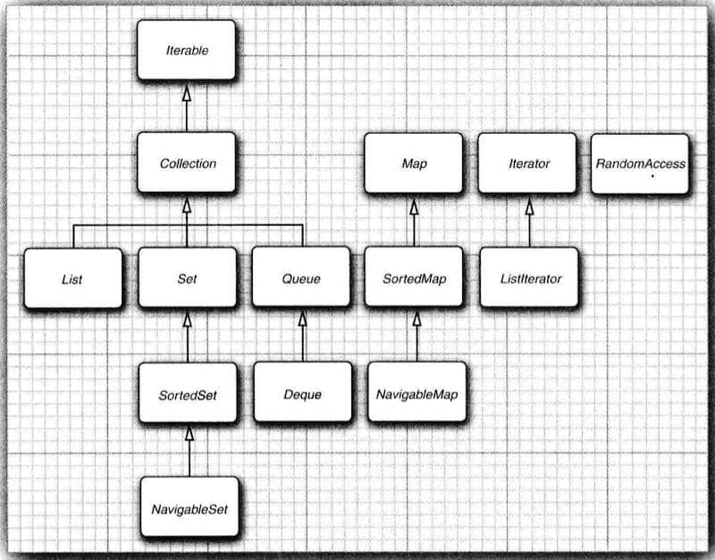

集合有两个基本接口 `Collection` 和 `Map`。

集合中插入元素的方法：

```java
boolean add(E element)
```

映射（Map）包含键/值对，所以用put方法插入：

```java
V put(K key, V value)
```

可以用迭代器从集合中读取元素，不过，映射用get方法：

```java
V get(K key)
```


`List` 是有序集合。元素会增加到容器中的特定位置。可以使用两种方式访问元素：

1. 迭代器访问或整数索引
2. 随机访问（可以任意顺序访问，而迭代器必须顺序访问）

List接口定义多个用于随机访问的方法：

```java
void add(int index, E element)
void remove(int index)
E get(int index)
E set(int index, E element)
```


`SortedSet`  `SortedMap`

`NavigableSet`   `NagigableMap`

#### List、Set、Map 

1. List 是一个有序集合，可以存放重复的数据 (有序：存进是什么顺序，取出时还是什么顺序)
   (1).ArrayList 底层是数组适合查询，不适合增删元素。
   (2).LiskedList 底层是双向链表适合增删元素，不适合查询操作。
   (3).Vector 底层和ArrayList相同，但是Vector是线程安全的，效率较低很少使用
2. Set 是一个无序集合，不允许放重复的数据 (无序不可重复，存进和取出的顺序不一样)
   (1).HashSet 底层是哈希表/散列表
   (2).TreeSet 继承sartedSet接口（无需不可重复，但存进去的元素可以按照元素的大小自动排序）

3. Map 是一个无序集合，以键值对的方式存放数据，键对象不允许重复，值对象可以重复。

   (1).HashMap实现不同步，线程不安全。 HashTable线程安全

   (2).HashMap中的key-value都是存储在Entry中的。

   (3).HashMap可以存null键和null值，不保证元素的顺序恒久不变，它的底层使用的是数组和链表，通过hashCode()方法和equals方法保证键的唯一性

### 9.2 具体的集合

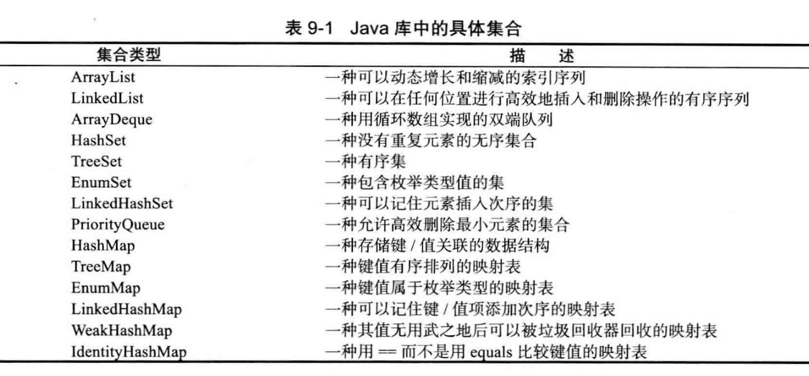

集合框架中的类：


#### 链表（Linkedlist）

`Linkedlist`

从数组的中间位置删除一个元素要付出很大的代价。

在 Java 程序设计语言中， 所有链表实际上都是**双向链接**的。

```java
// 链表中删除操作
List<String> staff = new LinkedList<>(); // LinkedList implements List staff.add("Amy") ;
staff.add("Amy");
staff.add("BobH");
staff.add("Carl");
Iterator iter = staff.iterator();
String first = iter.next(); // visit first element
String second = iter.next(); // visit second element
iter.remove();  // remove last visited element "
```

`LinkedList.add`方法将对象添加到链表的尾部。

但是， 常常需要将元素添加到链表的中间。由于迭代器是描述**集合中位置**的， 所以这种依赖于位置的add方法将由迭代器负责（add方法定义在子接口ListIterator中而不是Iterator中）：

```java
interface ListIterator<E> extends Iterator<E> {
	void add(E element);
  ...
} 
```

例子：

```java
List<String> staff = new LinkedList<>(); 
staff.add("Amy");
staff.add("Bob");
staff.add("Carl") ;
ListIterator<String> iter = staff.listlterator(); iter.next();// skip past first element 
iter.add("Juliet") ;
```

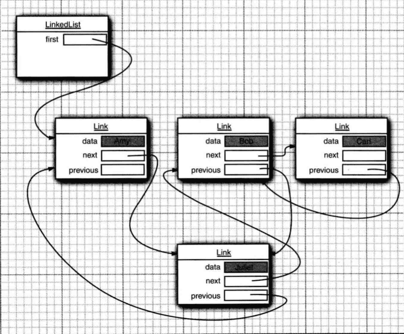


> Code: linkedList 🔖


#### 数组列表（ArrayList）

动态数组

> Vector类的所有方法都是同步的。可以由两个线程安全地访问一个Vector对象。不需要同步时使用ArrayList，需要同步时使用Vector。


#### 散列集（HashSet）

**散列表（hash table）**可以快速地查找所需要的对象。散列表为每个对象计算一个整数，称为**散列码（hash code）**(通过hashCode方法获得)。

自定义hasCode时，要与equals方法兼容，即如果a.equals（b）为true，a与b必须具有相同的散列码。

Java中，散列表用链表数组实现。

**散列集（HashSet）**是基于散列表的集。


#### 树集（TreeSet）

树集（TreeSet）与散列集类似，并有所改进，它是一个有序集合（sorted collection）。可以以任意顺序插入元素。在对集合进行遍历时，每个值将自动地按照排序后的顺序呈现。


#### 队列与双端队列

`Deque`接口。`ArrayDeque` 和 `LinkedList`都实现了这个接口，都可以用做双端队列。


#### 优先级队列（priority queue）

`PriorityQueue`中的元素可以按照任意的顺序插入，却总是按照排序的顺序进行检索。

也就是说，无论何时调用remove方法，总会获得当前优先级队列中最小的元素。


### 9.3 映射（map）

#### 基本映射操作

两个通用的实现：`HashMap`和`TreeMap`。它们都实现了接口Map。

线程安全的类有hashtable concurrentHashMap synchronizedMap

#### `Hashtable` vs `Hashmap`

Hashtable 线程安全，不支持key和value为空，key不能重复，但value可以重复，不支持key和value为null。

Hashmap 非线程安全，支持key和value为空，key不能重复，但value可以重复，支持key和value为null。


#### 更新映射项


#### 映射视图


#### 弱散列映射

`WeakHashMap`


#### 链接散列集与映射

`LinkedHashSet` 和 `LinkedHashMap`


#### 枚举集与映射

`EmimSet`

`EnumMap`


#### 标识散列映射

`IdentityHashMap`


### 9.4 视图与包装器


#### 轻量级集合包装器


#### 子范围（subrange）


#### 不可修改的视图


#### 同步视图


#### 受查视图


#### 关于可选操作的说明


### 9.5 算法


#### 排序和混排


#### 二分查找


#### 简单算法


#### 批操作


#### 集合与数组的转换


#### 编写自己的算法


### 9.6 遗留的集合

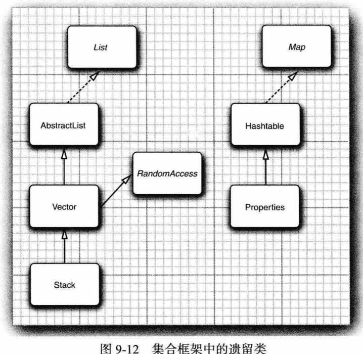

#### Hashtable类


#### 枚举


#### 属性映射（property map）


#### 栈（Stack）


#### 位集（BitSet）


------

## 13.部署Java应用程序

### 13.1 Jar文件

#### 创建JAR文件

jar命令格式：

```shell
jar options File1 File2 ...
```

```shell
jar cvf CalculatorClasses.jar *.class icon.gif
```

jar命令可选项，类似于Unix的tar命令选项：

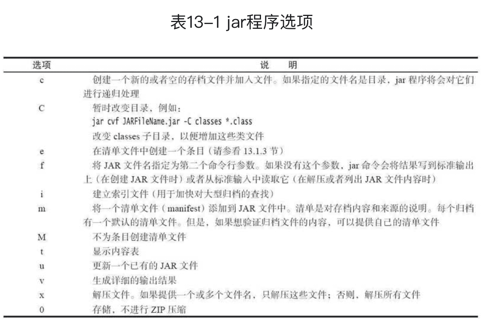


#### 清单文件

除了类文件、图像和其他资源外，每个JAR文件还包含一个用于描述归档特征的**清单文件（manifest）**，它被命名为**MANIFEST.MF**，一般位于**META-INF**下。


### 13.2 应用首选项的存储

`java.util.prefs.Preferences`


```

```


### 13.3 服务加载器


## 14.并发

**线程(thread)**

**多线程程序 (multithreaded )** ：可以同时运行一个以上线程的程序

每个进程拥有自己的一整套变量， 而线程则共享数据。 

### 14.1 什么是线程

??  程序球不动


### 14.2 中断线程


```java
// java.lang.Thread

void interrupt()
static boolean interrupted()
boolean isInterrupted()
static Thread currentThread()
```


### 14.3 线程状态

- New (新创建) 
- Runnable (可运行) 
- Blocked (被阻塞)
- Waiting( 等待) 
- Timed waiting (计时等待)
- Terminated (被终止)

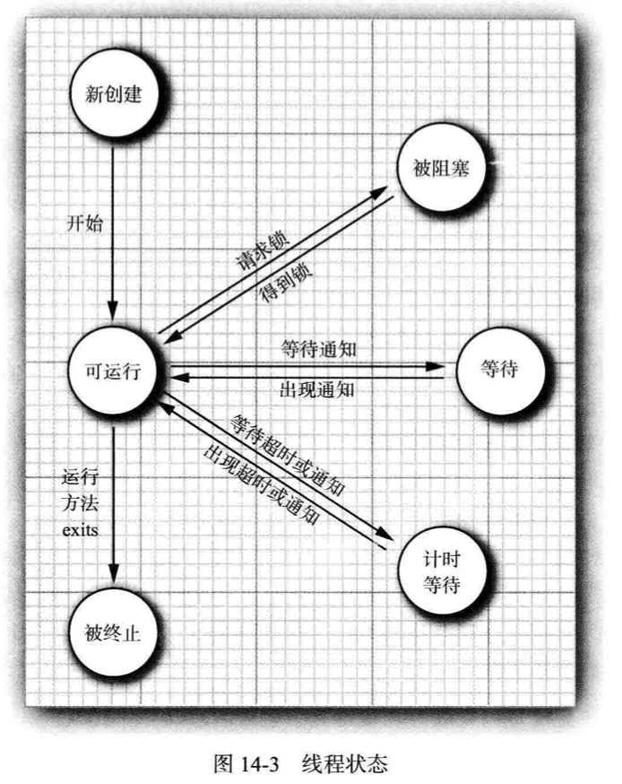

#### 新创建线程

```java
new Thread(r);
```

#### 可运行线程

调用start方法后，线程处于可运行状态。此时线程不必始终保持运行（为了让其他线程获得运行机会）。

线程调度的细节依赖于操作系统提供的服务。 

**抢占式调度系统**（桌面以及服务器操作系统）给每一个可运行线程一个时间片来执行任务。

像手机这样的小型设备可能使用**协作式调度**。 

#### 被阻塞线程和等待线程

当线程处于被阻塞或等待状态时，它**不运行任何代码且消耗最少的资源**。 

#### 被终止的线程


### 14.4 线程属性

#### 线程优先级

默认情况下， 一个线程**继承它的父线程的优先级**。 

当虚拟机依赖于宿主机平台的线程实现机制时， **Java 线程的优先级被映射到宿主机平台的优先级上**， 优先级个数也许更多， 也许更少。

```java
// java.lang.Thread
void setPriority(int newPriority)
static int MIN_PRIORITY  // 1
static int N0RM_PRI0RITY  // 5
static int MAX_PRIORITY  // 10
static void yield()
```

#### 守护线程

守护线程的唯一用途是**为其他线程提供服务** 。如计时线程。

守护线程应该永远**不去访问固有资源，如文件、 数据库**， 因为它会在任何时候甚至在一个操作的中间发生中断。

```java
void setDaemon(boolean isDaemon)
```


#### 未捕获异常处理器


### 14.5 同步

#### 竞争条件的列子


#### 竞争条件详解


#### 锁对象


#### 条件对象


#### synchronized关键字


#### 同步阻塞


#### 监视器概念


#### Volatile域


#### final变量


#### 原子性


#### 死锁


#### 线程局部变量


#### 锁测试与超时


#### 读/写锁


#### 为什么弃用stop和suspend方法


### 14.6 阻塞队列


### 14.7 线程安全的集合


### 14.8 Callable与Future


### 14.9 执行器


### 14.10 同步器


