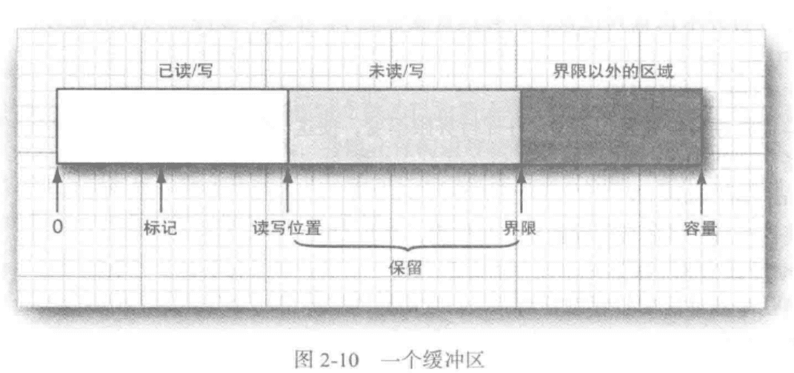
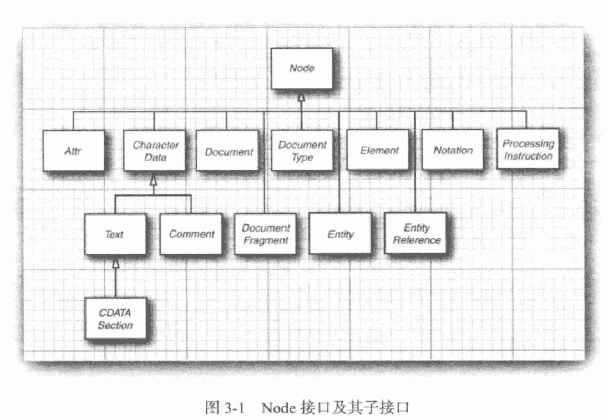
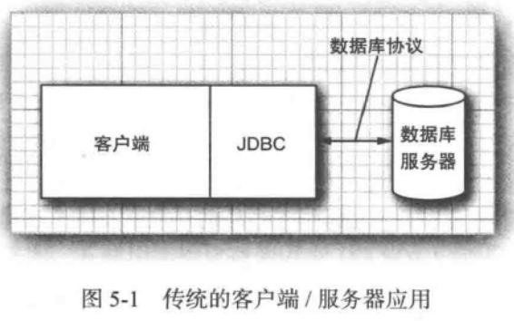
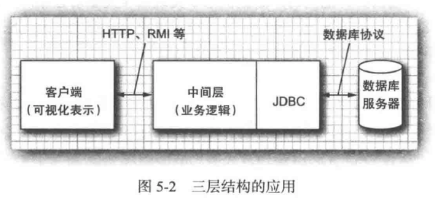
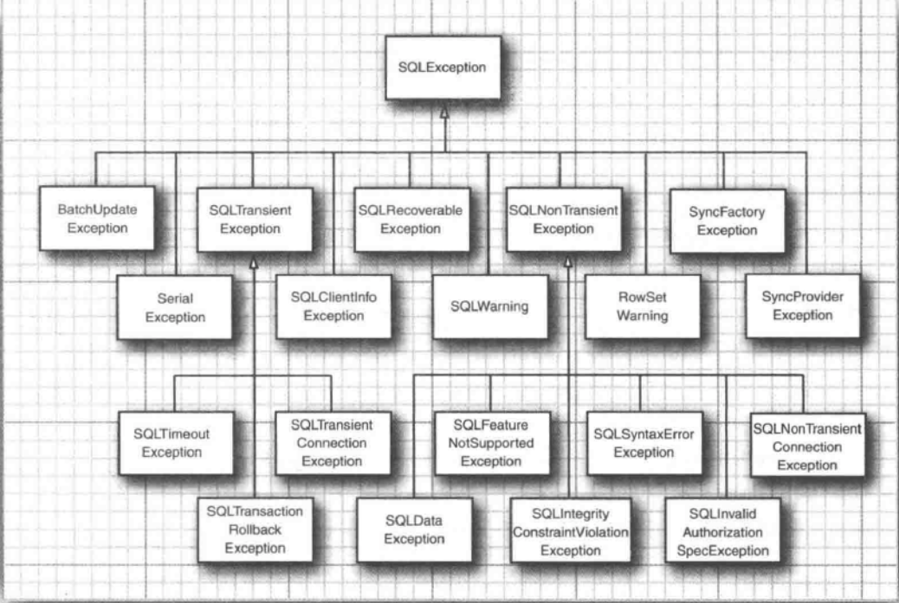
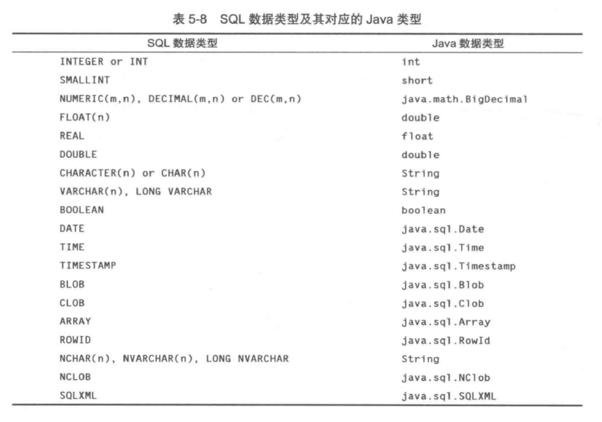
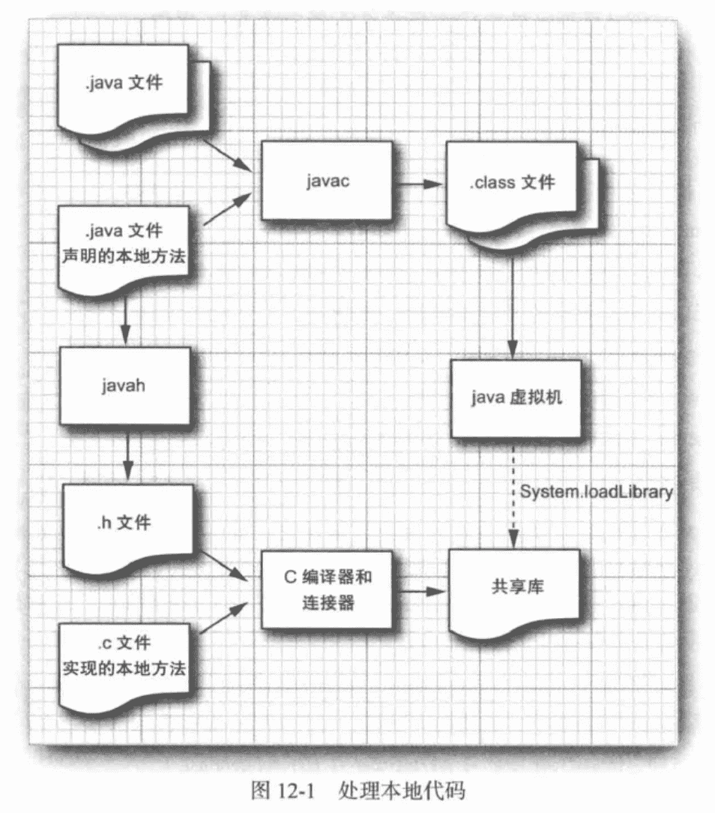
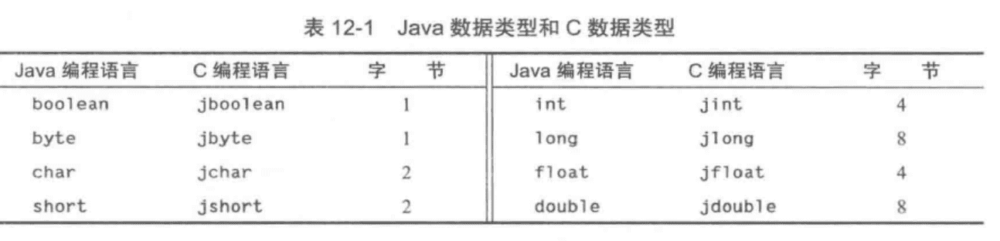
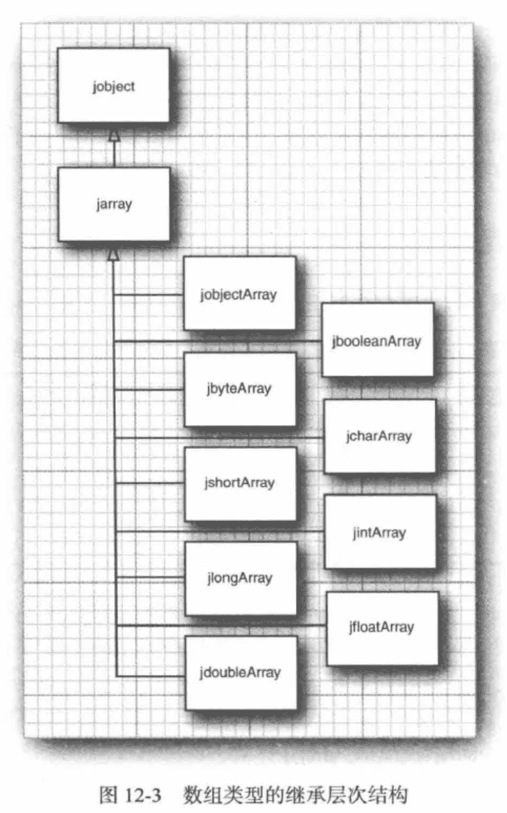

《Java核心技术卷二第10版》笔记
-------------------


## 1 Java SE 8的流库

### 1.1 从迭代到流

`java.util.Collection`的  `stream()`，`parallelStream()`

流遵循了“**做什么而非怎么做**”的原则。

流与集合的差异：

1. 流并不存储其元素。
2. 流的操作不会修改其数据源。
3. 流的操作是尽可能**惰性执行**的。也就是需要结果时，操作才执行。

```java
			// 当前目录是项目的根目录，不是.java文件所在目录
        String contents = new String(Files.readAllBytes(Paths.get("../../gutenberg/alice30.txt")),
                StandardCharsets.UTF_8);
        // \\PL+ 表示非字母字符
        List<String> words = Arrays.asList(contents.split("\\PL+"));

        long count = 0;
        for (String w : words) {
            if (w.length() > 12) {
                count++;
            }
        }
        System.out.println(count);

        count = words.stream().filter(w -> w.length() > 12).count();
        System.out.println(count);

        count = words.parallelStream().filter(w -> w.length() > 12).count();
        System.out.println(count);
```

stream() 和 parallelStream() 分别获得顺序流和并行流，当然此处结果没有多大影响。

正则中P表示”非“，L表示字母。”\PL+“ 表示非字母字符，"\\PN+" 非数字，"\\PZ+" 非分隔符，"\\PS+" 非符号等等。

### 1.2 流的创建

```java
// 静态方法`Stream.of()`
Stream<String> words = Stream.of(contents.split("\\PL+"));
Stream<String> song = Stream.of("gently", "down", "the", "stream");

// 创建不包含任何元素的流：
Stream<String> silence = Stream.empty();

Stream<String> echos = Stream.generate(() -> "Echo");

Stream<Double> randoms = Stream.generate(Math::random);

Stream<BigInteger> integers = Stream.iterate(BigInteger.ONE, n -> n.add(BigInteger.ONE));

Stream<String> wordsAnotherWay = Pattern.compile("\\PL+").splitAsStream(contents);

try (Stream<String> lines = Files.lines(path, StandardCharsets.UTF_8)){
}
```


### 1.3 filter, map, flatMap

**流的转换会产生一个新的流，它的元素派生自另一个流中的元素。**

将一个字符串流转换为只包含长单词的另一个流：

```java
List<String> wordlist = ...;
Stream<String> longWords = wordlist.stream().filter(w -> w.length() > 12);
```

将所有单词都转换为小写：(使用方法引用)

```java
Stream<String> lowercaseWords = words.stream().map(String::toLowerCase);

```

包含所有单词首字母的流：（使用lambda表达式）

```java
Stream<String> firstLetters = words.stream().map(s -> s.substring(0, 1))
```

把字符串转换为字符流：

```java
public static Stream<String> letters(String s) {
  List<String> result = new ArrayList<>();
  for (int i = 0; i < s.length(); i++) {
    result.add(s.substring(i, i + 1));
  }
  return result.stream();
}
// letters("boat") 返回值是流["b", "o", "a", "t"]
```

包含流的流：

```java
Stream<Stream<String>> result = words.stream().map(w -> letters(w));
// [...["y","o","u","r"],["b","o","a","t"],...]
```

如果换成`flatMap`结果就变成：

```java
[..."y","o","u","r","b","o","a","t",...]
```


### 1.4 抽取子流和连接流

`stream.limit(n)`，产生一个包含100个随机数的流：

```java
Stream<Double> randoms = Stream.generate(Math::random).limit(100);
```

`stream.skip(n)`，跳过前n个元素产生流：

```java
Stream<String> words = Stream.of(contents.split("\\PL+")).skip(1);
```

`stream.concat()`，连接两个流：

```java
Stream<String> combined = Stream.concat(letters("Andy"), letters("Ron"));
```


### 1.5 其他的流转换

删除流中重复的元素：

```java
Stream<String> uniqueWords = Stream.of("apple", "orange", "apple");
```

流的排序：

```java
Stream<String> longestFirst = words.stream().sorted(Comparator.comparing(String::length).reversed());
```

peek方法会产生于原来流元素相同的流，不过每一次获取一个元素时，都会调用一个函数：

```java
Object[] powers = Stream.iterate(1.0, p -> p * 2)
                .peek(e -> System.out.println("Fetcting " + e))
                .limit(10).toArray();
```

结果为：

```
Fetcting 1.0
Fetcting 2.0
Fetcting 4.0
Fetcting 8.0
Fetcting 16.0
Fetcting 32.0
Fetcting 64.0
Fetcting 128.0
Fetcting 256.0
Fetcting 512.0
```


### 1.6 简单约简🔖


### 1.7 Optional类型


#### 如何使用Optional值

有效地使用Optional的关键是：**它的值不存在时会有可替代值，存在时就使用这个值。**

```java
// Optional不存在就使用默认值。orElse()
Optional<String> optionalValue = wordList.stream().filter(s -> s.contains("fred")).findFirst();
System.out.println(optionalValue.orElse("No word") + " contains fred");

Optional<String> optionalString = Optional.empty();
String result = optionalString.orElse("N/A");
System.out.println("result: " + result);

// Optional不存在，计算默认值。orElseGet
result = optionalString.orElseGet(() -> Locale.getDefault().getDisplayName());
System.out.println("result: " + result);

// Optional不存在，就抛出异常。orElseThrow
try {
    result = optionalString.orElseThrow(IllegalStateException::new);
    System.out.println("result: " + result);
} catch (Throwable t) {
    t.printStackTrace();
}

// Optional存在就把它传递给一个函数，否则不发生任何事。ifPresent()
optionalValue = wordList.stream().filter(s -> s.contains("red")).findFirst();
optionalValue.ifPresent(s -> System.out.println(s + " contains red"));
```

#### 不适合使用Optional值的方式


#### 创建Optional值

```java
Optional.of(result);

Optional.empty();
```


#### 用flatMap来创建Optional值的函数


### 1.8 收集结果

当处理完流之后，通常会想要查看其元素。


### 1.9 收集到映射表中


```java
 				Map<Integer, String> idToName = people().collect(Collectors.toMap(Person::getId, Person::getName));
        System.out.println("idToName: " + idToName);

        Map<Integer, Person> idToPerson = people().collect(Collectors.toMap(Person::getId, Function.identity()));
        System.out.println("idToPerson: " + idToPerson.getClass().getName() + idToPerson);

        idToPerson = people().collect(Collectors.toMap(Person::getId, Function.identity(),
                (existingValue, newValue) -> {throw new IllegalStateException();}, TreeMap::new));
        System.out.println("idToPerson: " + idToPerson.getClass().getName() + idToPerson);

        Stream<Locale> locales = Stream.of(Locale.getAvailableLocales());
        Map<String, String> languageNames = locales.collect(Collectors.toMap(Locale::getDisplayLanguage,
                l -> l.getDisplayLanguage(l), (existingValue, newValue) -> existingValue));
        System.out.println("languageNames: " + languageNames);

```


### 1.10 群组和分区

```java
Map<String, List<Locale>> countryToLocales = locales.collect(Collectors.groupingBy(Locale::getCountry));

List<Locale> swissLocales = countryToLocales.get("CH");
```


```java
Map<Boolean, List<Locale>> englishAndOtherLocales = locales.collect(Collectors.partitioningBy(l -> l.getLanguage().equals("en")));

List<Locale> englishLocales = englishAndOtherLocales.get(true);
```


### 1.11 下游收集器


### 1.12 约简操作


### 1.13 基本类型流

`IntStream`  `LongStream`  `DoubleStream`


```java
				IntStream is1 = IntStream.generate(() -> (int) (Math.random() * 100));
        show("is1", is1);
        IntStream is2 = IntStream.range(5, 10);
        show("is2", is2);
        IntStream is3 = IntStream.rangeClosed(5, 10);
        show("is3", is3);

        Path path = Paths.get("../../gutenberg/alice30.txt");
        String contents = new String(Files.readAllBytes(path), StandardCharsets.UTF_8);

        Stream<String> words = Stream.of(contents.split("\\PL+"));
        IntStream is4 = words.mapToInt(String::length);
        show("is4", is4);
        
        String sentence = "\uD835\uDD46 is the set of octonions.";
        System.out.println(sentence);
        IntStream codes = sentence.codePoints();
        System.out.println(codes.mapToObj(c -> String.format("%X ", c)).collect(Collectors.joining()));

        Stream<Integer> integers = IntStream.range(0, 100).boxed();
        IntStream is5 = integers.mapToInt(Integer::intValue);
        show("is5", is5);
```


### 1.14 并行流

流使得并行处理块操作变得容易。可以用`Collection.paralleStream()`方法从任何集合获取一个并行流：

```java
Stream<String> paralleWords = words.parallelStream();
```

`parallel`方法可以将任意的顺序流转换为并行流：

```java
Stream<String> paralleWords = Stream.of(wordArray).parallel();
```


## 2 输入/输出（I/O）

> - 如何访问文件与目录
> - 如何以二进制格式和文本格式来读写数据
> - 对象序列化
> - 正则表达式


### 2.1 输入/输出流

> 与上一章中的流没有任何关系。

**输入流**：可以读入一个字节序列的对象；

**输出流**：可以写入一个字节序列的对象。

这些字节序列的来源地和目的地可以是**文件**，**网络连接**，**内存块**。

抽象类**InputStream**和**OutputStream**构成I/O类层次结构的基础。


🔖 Reader Writer  Unicode字符，Char（2个字节）


#### 读写字节

`InputStream`的唯一抽象方法：

```java
abstract int read()
```

这个方法将读入一个字节，并返回读入的字节，或者在遇到输入源结尾时返回-1。

子类必须覆盖这个方法以提供适用的功能。

`OutputStream`的唯一抽象方法：

```java
abstract int read()
```

表示向某个输出位置写出一个字节。子类也必须覆盖。

read和write方法在执行时都将**阻塞**，直至字节确实被读入或写出。

**available**方法可检测当前可读入的字节数量，那么下面的额代码就不会产生阻塞：

```java
int bytesAvailable = in.available();
if (bytesAvailable > 0) {
  byte[] data = new byte[bytesAvailable];
  in.read(data);
}
```


```java
// java.io.InputStream
abstract int read()
  
int read(byte[] b)
读入一个字节数组，并返回实际读入的字节数，或者在碰到输入流的结尾时返回-1。这个read方法最多读入b.length个字节。
int read(byte[] b, int off, int len)
读入一个字节数组。这个read方法返回实际读入的字节数，或者在碰到输入流的结尾时返回-1。  
long skip(long n)
在输入流中跳过n个字节，返回实际跳过的字节数（如果碰到输入流的结尾，则可能小于n）。  
int available()
返回在不阻塞的情况下可获取的字节数。  
void close()
  
void mark(int readlimit)
在输入流的当前位置打一个标记（并非所有的流都支持这个特性）。  
void reset()
  
boolean markSupported()
```


```java
// java.io.OutputStream
abstract void wirte(int n)
  
void write(byte[] b)
  
void write(byte[] b, int off, int len)
  
void close()
  
void flush()
冲刷输出流，也就是将所有缓冲的数据发送到目的地。
```


#### 完整的流家族

输入流与输出流的层次结构：


`InputStream`和`OutputStream`用于读写单个字节或字节数组。

`DataInputStream`和 `DataOutputStream`可用于读写字符串和数字，它们可以以二进制格式读写所有的基本Java类型。

`ZipInputStream`和`ZipOutputStream`可以以常见的ZIP压缩格式读写文件。

抽象类`Reader`和`Writer`的子类，用于Unicode文本和Char（2个字节）。

Reader和Writer的层次结构：


Reader和Writer类的基本方法与InputStream和OutputStream中的方法类似。

`Closeable`， `Flushable`， `Readable`， `Appendable`接口：


```java
// java.io.Closeable
void close();

// java.io.Flushable
void flush();

// java.lang.Readable
int read(java.nio.CharBuffer cb);
  
// java.lang.Appendable
Appendable append(char c);
Appendable append(CharSequence cs);
向这个Appendable中追加给定的码元或者给定的序列中的所有码元，返回this。
  
// java.lang.CharSequence
char charAt(int index);
返回给定索引处的码元。
int length();
码元的数量。
CharSequence subSequence(int start, int end);
返回由存储在start到end-1处的所有码元构成的CharSequence。
String toString();
default IntStream codePoints(){}
```


#### 组合输入/输入流过滤器

`FileInputStream`和`FileOutputStream`

```java
FileInputStream fin = new FileIputStream("employee.dat");
```

> 所有在java.io中的类都将相对路径名解释为以用户工作目录开始，你可以通过调用`System.getProperty("user.dir")`来获得这个信息，如在idea中就是项目的根目录。

> 常量字符串`java.io.File.separator`是当前系统的**文件分隔符**。

🔖

### 2.2 文本I/O

`OutputStreamWriter`类将使用选定的字符编码方式，把Unicode码元的输出流转换为字节流。而`InputStreamReader`类将包含字节（用某种字符编码方式表示的字符）的输入流转换为可以产生Unicode码元的读入器。

如何让一个输入读入器可以从控制台读入键盘敲击信息，并将其转换为Unicode：

```java
Reader in = new InputStreamReader(System.in);
```

```java
Reader in = new InputStreamReader(new FileInputStream("data.txt"), StandardCharsets.UTF_8);
```


#### 如何写出文本输出

`PrintWriter`


#### 如何读入文本输入

`Scanner`

`BufferedReader`

#### 以文本格式存储对象


#### 字符编码方式 🔖


### 2.3 二进制I/O

#### DataInput和DataOutput接口

```java
// java.io.DataInput
boolean readBoolean()
byte readByte()
char readChar()
double readDouble()
float readFloat()
int readInt()
long readLong()
short readShort()
void readFully(byte[] b)
void readFully(byte[] b, int off, int len)
String readUTF()
int skipBytes(int n)
```

```java
void writeBoolean(boolean b)
void writeByte(int b)
void writeChar(int c)
void writeDouble(double d)
void writeFloat(float f)
void writeInt(int i)
void writeLong(long l)
void writeShort(int s)
void writeUTF(String s)
```

#### 随机访问文件

`java.io.RandomAccessFile`类可以在文件中的任何位置查找或写入数据。


#### ZIP文档

ZIP文档（通常）以压缩格式存储了一个或多个文件，每个ZIP文档都有一个头，包含诸如**每个文件名字和所使用的压缩方法**等信息。

`java.util.zip.ZipInputStream`

`java.util.zip.ZipOutputStream`


### 2.4 对象输入/输出流与序列化

**对象序列化（object serialization）**可以将任何对象写出到输出流中，并在之后将其读回。


#### 保存和加载序列化对象

`ObjectOutputStream`

`ObjectIputStream`


#### 理解对象序列化的文件格式🔖

对象序列化是以特殊的文件格式存储对象数据的。

存储一个对象时，它所属类也必须存储，这个类的猫叔包含：

- 类名。
- 序列化的版本唯一的ID，它是数据域类型和方法签名的指纹。
- 描述序列化方法的标志集。
- 对数据域的描述。

**指纹**是通过对类、超类、接口、域类型和方法签名按照规范方式排序，然后将安全散列算法（SHA）应用于这些数据而获得的。


- 对象流输出中包含所有对象的类型和数据域。
- 每个对象都被赋予一个序列号。
- 相同对象的重复出现将被存储为对这个对象的序列号的引用。

#### 修改默认的序列化机制

某些数据域是不可以序列化的

`transient`

#### 序列化单例和类型安全的枚举


#### 版本管理


#### 为克隆使用序列化


### 2.5 操作文件

**Path**和**Files**类封装了在用户机器上处理文件系统所需的所有功能。

#### Path

```java
Path absolute = Paths.get("/home", "andy");
Path relative = Paths.get("myprog", "conf", "user.properties");
```

Paths.get方法接受一个或多个字符串，并将它们用默认文件系统的路径分隔符（类Unix文件系统是`/`，Windows是`\`）连接起来。然后它解析连接起来的结果，如果其表示的不是给定文件系统中的合法路径，那么就抛出`InvalidPathException`异常。这个连接起来的结果就是一个Path对象。


#### 读写文件

读取文件所有内容：

```java
byte[] bytes = Files.readAllBytes(path);
```

然后想将文件当作字符串读入：

```java
String content = new String(bytes, charset);
```

将文件当作行序列读入：

```java
List<String> lines = Files.readAllLines(path, charset);
```

写一个字符串到文件中：

```java
Files.write(path, content.getBytes(charset));
```

向指定文件追加内容：

```java
Files.write(path, content.getBytes(charset), StandardOpenOption.APPEND);
```

果要处理的文件长度比较大，或者是二进制文件，那么还是应该使用所熟知的输入/输出流或者读入器/写出器：

```java
InputStream in = Files.newInputStream(path);
OutputStream in = Files.newOutputStream(path);
Reader in = Files.newBufferedReader(path, charset);
Write out = Files.newBufferedWrite(path, charset);
```


```java
// java.nio.file.Files

static byte[] readAllBytes(Path path) 
static List<String> readAllLines(Path path, Charset cs) 

static Path write(Path path, byte[] bytes, OpenOption... options)
static Path write(Path path, Iterable<? extends CharSequence> lines, OpenOption... options)

static InputStream newInputStream(Path path, OpenOption... options)
static OutputStream newOutputStream(Path path, OpenOption... options)

static BufferedReader newBufferedReader(Path path, Charset cs)
static BufferedWriter newBufferedWriter(Path path, Charset cs, OpenOption... options)
```


#### 创建文件和目录

```java
Files.createDirectory(path);
Files.createDirectories(path);
Files.createFile(path);
```


#### 复制、移动和删除文件

```java
Files.copy(fromPath, toPath);
Files.move(fromPath, toPath);
Files.delete(path);
boolean deleted = Files.deleteIfExists(path);
```


#### 获取文件信息

```java
// java.nio.file.Files
static boolean exists（Path path）
static boolean isHidden（Path path）
static boolean isReadable（Path path）
static boolean isWritable（Path path）
static boolean isExecutable（Path path）
static boolean isRegularFile（Path path）
static boolean isDirectory（Path path）
static boolean isSymbolicLink（Path path）
检查由路径指定的文件的给定属性。
static long size（Path path）
获取文件按字节数度量的尺寸。
  
public static <A extends BasicFileAttributes> A readAttributes(Path path, Class<A> type, LinkOption... options)
读取类型为A的文件属性。
```

`BasicFileAttributes`接口中定义了各种文件属性：

```java
FileTime creationTime（）
FileTime lastAccessTime（）
FileTime lastModifiedTime（）
boolean isRegularFile（）
boolean isDirectory（）
boolean isSymbolicLink（）
long size（）
Object fileKey（）
```


#### 访问目录中的项

`Files.list`方法会返回一个可以读取（惰性）目录中各个项的`Stream<Path>`对象。

list方法不会进入子目录，为了处理所有子目录需要`Files.walk`


#### 使用目录流


#### ZIP文件系统

```java
java.nio.file.FileSystems
  
java.nio.file.FileSystem
```


### 2.6 内存映射文件🔖

大多数操作系统都可以利用虚拟内存实现来将一个文件或者文件的一部分”映射“到内存中。然后这个文件就可以当作是内存数组一样地访问。

#### 内存映射文件的性能

```java
java.nio.channels.FileChannel
  
java.nio.Buffer
  
java.nio.ByteBuffer
  
java.ni.CharBuffer
```


#### 缓存区数据结构

**缓冲区**是由具有相同类型的数值构成的数组，**Buffer**是一个抽象类，它有很多子类：**ByteBuffer**、**CharBuffer**、**DoubleBuffer**等。




#### 文件加锁机制

```java
java.nio.channels.FileLock
```


### 2.7 正则表达式


```java
java.util.regex.Pattern

java.util.regex.Matcher
```


## 3 XML 

### 3.1 XML概述

https://www.xml.com/axml/axml.html


### 3.2 解析XML文档

**DocumentBuilder**

**Document**




### 3.3 验证XML文档


#### 文档类型定义


#### XML Schema


### 3.4 使用XPath来定位信息


### 3.5 使用命名空间


### 3.6 流机制解析器

#### SAX解析器


#### StAX解析器


### 3.7 生成XML文档


### 3.8 XSL转换

XSL转换（XSLT）机制可以将XML文档转换为其它格式。


## 4 网络


### 4.1 连接到服务器

#### 使用Telnet

```shell
$ telnet time-a.nist.gov 13
```

获得铯原子钟的计量时间：

```
58929 20-03-21 08:26:12 50 0 0 351.8 UTC(NIST) *
```


```shell
$ telnet horstmann.com 80
Trying 204.44.192.29...
Connected to horstmann.com.
Escape character is '^]'.
GET / HTTP/1.1
Host: horstmann.com


```


#### 用Java连接到服务器

```java
public static void main(String[] args) throws IOException {
  try (Socket s = new Socket("time-a.nist.gov", 13);
       Scanner in = new Scanner(s.getInputStream(), "UTF-8")) {
    while (in.hasNextLine()) {
      String line = in.nextLine();
      System.out.println(line);
    }
  }
}
```

将远程地址和端口号传递给套接字的构造器，如果连接失败，将抛出`UnknownHostException`异常，它是`IOException`的子类，此处就没有另外捕获异常处理。

`java.net.Socket`类的`getInputStream`返回一个流对象`InputStream`。

java.net包提供的编程接口与操作文件时所使用的接口基本相同。


#### socket超时

对于不同的应用，应该确定合理的超时值。

```java
Socket s = new Socket(...);
s.setSoTimeout(10000); // 单位是毫秒  
```

超时会抛出`SocketTimeoutException`异常。

另一种创建方式：

```java
Socket s = new Socket();
s.connect(new InetSocketAddress(host, port), timeout);
```


#### IP地址

可通过`InetAddress`类把域名和IP地址相互转换。

获得单个主机IP地址：

```java
InetAddress address = InetAddress.getByName("www.baidu.com");
```

获取所有主机IP地址: 

```java
InetAddress[] addresses = InetAddress.getAllByName(host);
for (InetAddress a : addresses) {
  System.out.println(a);
}
```

获得本机IP地址：

```java
InetAddress localHostAddress = InetAddress.getLocalHost();
```


### 4.2 实现服务器

#### 服务器套接字

客服端程序的输出是服务器输入流，同样服务器的输出流就成为客服端的输入。

每一个服务器程序（比如这边的socket或HTTP Web服务器等），都会不间断地执行下面这个循环：

1. 通过输入数据流从客户端接收一个命令
2. 解码这个客户端命令
3. 收集客户端所请求的信息
4. 通过输出数据流发送信息给客户端


```java
// server/EchoServer.java

		public static void main(String[] args) throws IOException {

        // ServerSocket用于创建服务器套接字
        try (ServerSocket s = new ServerSocket(8189)){
            // 创建监控端口8189的等待程序Socket对象
            try (Socket incoming = s.accept()){
                // 通过Socket对象获得输入流和输出流
                InputStream inStream = incoming.getInputStream();
                OutputStream outStream = incoming.getOutputStream();

                try (Scanner in = new Scanner(inStream, "UTF-8")){
                    // 服务器的输出流就成为客服端的输入
                    PrintWriter out = new PrintWriter(
                            new OutputStreamWriter(outStream, "UTF-8"), true);
                    // 向客服端打印...（也就是客服端的输入）
                    out.println("Hello! Enter BYE to exit.");
                    boolean done = false;
                    while (!done && in.hasNextLine()) {
                        String line = in.nextLine();
                        out.println("Echo: " + line);
                        if (line.trim().equals("BYE")) {
                            done = true;
                        }
                    }
                }
            }
        }
    }

```

启动上面的服务器程序，用Telnet访问：

```shell
$ telnet localhost 8189
Trying ::1...
Connected to localhost.
Escape character is '^]'.
Hello! Enter BYE to exit.
hello!
Echo: hello!
bye
Echo: bye
BYE
Echo: BYE
Connection closed by foreign host.
$ 
```


#### 为多个客户端服务

```java
public class ThreadedEchoServer {

    public static void main(String[] args) {
        try (ServerSocket s = new ServerSocket(8189)) {
            int i = 1;
            // 为什么没有进入死循环
            while (true) {  
                Socket incoming = s.accept();
                System.out.println("Spawning " + i);
                Runnable r = new ThreadEchoHandler(incoming);
                Thread t = new Thread(r);
                t.start();
                i++;
            }
        } catch (IOException e) {
            e.printStackTrace();
        }
    }
}

class ThreadEchoHandler implements Runnable {
    private Socket incoming;

    public ThreadEchoHandler(Socket incomingSocket) {
        incoming = incomingSocket;
    }

    @Override
    public void run() {
        try (InputStream inStream = incoming.getInputStream();
             OutputStream outStream = incoming.getOutputStream()) {
            Scanner in = new Scanner(inStream, "UTF-8");
            PrintWriter out = new PrintWriter(
                    new OutputStreamWriter(outStream, "UTF-8"), true);

            out.println("Hello! Enter BYE to exit.");

            boolean done = false;
            while (!done && in.hasNextLine()) {
                String line = in.nextLine();
                out.println("Echo: " + line);
                if (line.trim().equals("BYE")) {
                    done = true;
                }
            }
        } catch (IOException e) {
            e.printStackTrace();
        }
    }
}
```


每个客户端请求都生成单独的线程，这种方法不能实现高的吞吐量，需要使用`java.nio`的一些特性。

#### 半关闭


### 4.3 可中断套接字

`java.nio`包的`SocketChannel`类


### 4.4 获取Web数

#### URL 和 URI


#### 使用URLConnection获取信息

```java
java.net.URL

java.net.URLConnection
```


#### 提交表单数据


```
java.net.HttpURLConnection
java.net.URLEncoder
java.net.URLDecoder
```


### 4.5 发送Email


## 5 数据库编程

The Java Database Connectivity (JDBC) API可以连接到数据库，并使用SQL完成对数据库的查找与更新。


### 5.1 JDBC的设计

ODBC模式是微软为C语言访问数据库提供了一套编程接口。

JDBC

#### JDBC驱动程序类型


#### JDBC的典型用法

传统模式：



三层模式：客户端不直接调用数据库，而是调用服务器上的**中间体层**，由中间体层完成查询数据库查询操作。

优点：将可视化表示（位于客户端）从**业务逻辑**（位于中间层）和**原始数据**（位于数据库）中分离出来。

达到的效果：可以从不同的客户端（Java桌面应用、浏览器或移动APP等）来访问相同的数据和相同的业务规则。




### 5.2 结构化查询语言

JDBC包可以看作是一个用于**将SQL语句传递给数据库的应用编程接口**（API ）。

在关系模型中，将数据分步到多个表中，是为了使得所有信息都不会出现不必要的重复。


### 5.3 JDBC配置🔖

#### 连接数据库URL

一般语法：

```
jdbc:subprotocol:other stuff
```

**subprotocol**是连接到数据库的具体驱动程序。

**other stuff**不同的驱动程序有不动的格式。

举例：

```properties
jdbc:derby://localhost:1527/COREJAVA;crete=tre

jdbc:postgresql:COREJAVA
  
jdbc:mysql://localhost:3030/COREJAVA
```

https://www.runoob.com/java/java-mysql-connect.html

#### 驱动程序JAR文件


#### 启动数据库


#### 注册驱动器类


#### 连接到数据库


### 5.4 使用JDBC语句

#### 执行SQL语句

`Statement`

`Connection`

`ResultSet`


#### 管理连接、语句和结果集


#### 分析SQL异常





#### 组装数据库


### 5.5 执行查询操作

#### 预备语句（prepared statement）


#### 读写LOB

在SQL中，二进制大对象称为**BLOB**，字符型大对象称为**CLOB**。


#### SQL转义


#### 多结果集


#### 获取自动生成的键


### 5.6 可滚动和可更新的结果集


### 5.7 行集（RowSet）

**RowSet**接口扩展自**ResultSet**接口，它无需始终保持与数据库的连接。

#### 构建行集


#### 被缓存的行集


### 5.8 元数据

在SQL中，描述数据库或其组成部分的数据称为**元数据**。

`DatabaseMetaData`


### 5.9 事物


### 5.10 高级SQL类型




## 6 日期和时间API


### 6.1 时间线


### 6.2 本地时间


### 6.3 日期调整器


### 6.4 本地时间


### 6.5 时区时间


### 6.6 格式化和解析


## 7 国际化


### 7.1 Locale对象


### 7.2 数字格式


### 7.3 货币


### 7.4 日期和时间


### 7.5 排序和范化


### 7.6 消息格式化


### 7.7 文本文件和字符集


### 7.8 资源包


## 8 脚本、编译与注解处理


### 8.1 Java平台的脚本


### 8.2 编译器API


### 8.3 使用注解


### 8.4 注解语法

注解是注解接口来定义的：

```
mofiers @interface AnnotationName {
	elementDeclaration1
	elementDeclaration1
}
```


### 8.5 标准注解


### 8.6 源码级注解处理


### 8.7 字节码工程


## 9 安全

Java提供三种安全机制：

1. 语言设计特性（对数组的边界进行检查，无不受检查的类型转换，无指针算法等）。
2. 访问控制机制，用于控制代码能够执行的操作（比如文件访问，网络访问等）。
3. 代码签名，利用该特性，代码的作者就能够用标准的加密算法来认证Java代码。


### 9.1 类加载器

#### Java代码执行流程


#### 类的生命周期

类的生命周期包括：加载、链接、初始化、使用和卸载，其中加载、链接、初始化，属于类加载的过程。


#### 类加载系统架构图


#### 类加载的过程

##### 第一步：加载（Loading）

通过类的全限定名（包名 + 类名），获取到该类的.class文件的二进制字节流；
将二进制字节流所代表的静态存储结构，转化为方法区运行时的数据结构；

在内存中生成一个代表该类的java.lang.Class对象，作为方法区这个类的各种数据的访问入口；

> 总结：加载二进制数据到内存 —> 映射成jvm能识别的结构 —> 在内存中生成class文件。
>
> JVM结构图：
>
> 


##### 第二步：链接（Linking）

###### ① 验证（Verify）

确保class文件中的字节流包含的信息，符合当前虚拟机的要求，保证这个被加载的class类的正确性，不会危害到虚拟机的安全。


###### ② 准备（Prepare）

为类中的**静态字段**分配内存，并设置默认的初始值，比如int类型初始值是0。被final修饰的static字段不会设置，因为final在编译的时候就分配了。


###### ③ 解析（Resolve）

解析阶段的目的，是将常量池内的符号引用转换为直接引用的过程（将常量池内的符号引用解析成为实际引用）。如果符号引用指向一个未被加载的类，或者未被加载类的字段或方法，那么解析将触发这个类的加载（但未必触发这个类的链接以及初始化。）
事实上，解析器操作往往会伴随着 JVM 在执行完初始化之后再执行。 符号引用就是一组符号来描述所引用的目标。符号引用的字面量形式明确定义在《Java 虚拟机规范》的Class文件格式中。直接引用就是直接指向目标的指针、相对偏移量或一个间接定位到目标的句柄。

解析动作主要针对类、接口、字段、类方法、接口方法、方法类型等。对应常量池中的 CONSTANT_Class_info、CONSTANT_Fieldref_info、CONSTANT_Methodref_info等。


##### 第三步：初始化（initialization）

初始化就是执行类的构造器方法init()的过程。
这个方法不需要定义，是javac编译器自动收集类中所有类变量的赋值动作和静态代码块中的语句合并来的。

若该类具有父类，jvm会保证父类的init先执行，然后在执行子类的init。


#### 类加载器的分类


##### 启动类/引导类（Bootstrap ClassLoader）

这个类加载器使用C/C++语言实现的，嵌套在JVM内部，java程序无法直接操作这个类。它用来加载Java核心类库，如：`JAVA_HOME/jre/lib/rt.jar`、`resources.jar`、`sun.boot.class.path`路径下的包，用于提供jvm运行所需的包。

并不是继承自`java.lang.ClassLoader`，它没有父类加载器；

它加载扩展类加载器和应用程序类加载器，并成为他们的父类加载器。

出于安全考虑，启动类只加载包名为：`java`、`javax`、`sun`开头的类。


##### 扩展类加载器（Extension ClassLoader）

Java语言编写，由`sun.misc.Launcher$ExtClassLoader`实现，我们可以用Java程序操作这个加载器。
派生继承自`java.lang.ClassLoader`，父类加载器为启动类加载器。

从系统属性`java.ext.dirs`目录中加载类库，或者从JDK安装目录`jre/lib/ext`目录下加载类库。我们就可以将我们自己的包放在以上目录下，就会自动加载进来了。


##### 应用程序类加载器（Application Classloader）

Java语言编写，由`sun.misc.Launcher$AppClassLoader`实现。
派生继承自`java.lang.ClassLoader`，父类加载器为启动类加载器

它负责加载环境变量`CLASSPATH`或者系统属性`java.class.path`指定路径下的类库。

它是程序中默认的类加载器，我们Java程序中的类，都是由它加载完成的。

我们可以通过`ClassLoader#getSystemClassLoader()`获取并操作这个加载器。


##### 自定义加载器（User Classloader）

一般情况下，以上3种加载器能满足我们日常的开发工作，不满足时，我们还可以自定义加载器。
比如用网络加载Java类，为了保证传输中的安全性，采用了加密操作，那么以上3种加载器就无法加载这个类，这时候就需要自定义加载器。


###### 自定义加载器实现步骤

继承`java.lang.ClassLoader`类，重写`findClass()`方法。

·如果没有太复杂的需求，可以直接继承`URLClassLoader`类，重写`loadClass`方法，具体可参考`AppClassLoader`和`ExtClassLoader`。


###### 获取ClassLoader几种方式

它是一个抽象类，其后所有的类加载器继承自 ClassLoader（不包括启动类加载器）

```java
// 方式一：获取当前类的 ClassLoader
clazz.getClassLoader()
// 方式二：获取当前线程上下文的 ClassLoader
Thread.currentThread().getContextClassLoader()
// 方式三：获取系统的 ClassLoader
ClassLoader.getSystemClassLoader()
// 方式四：获取调用者的 ClassLoader
DriverManager.getCallerClassLoader()
```


#### 类加载机制—双亲委派机制

jvm对class文件采用的是按需加载的方式，当需要使用该类时，jvm才会将它的class文件加载到内存中产生class对象。

在加载类的时候，是采用的<font color=#FF8C00>双亲委派机制</font>，即把请求交给父类处理的一种任务委派模式。


##### 原理

1. 如果一个类加载器接收到了类加载的请求，它自己不会先去加载，会把这个请求委托给父类加载器去执行；

2. 如果父类还存在父类加载器，则继续向上委托，一直委托到启动类加载器；

3. 如果父类加载器可以完成加载任务，就返回成功结果，如果父类加载失败，就由子类自己去尝试加载，如果子类加载失败就会抛出`ClassNotFoundException`异常。


##### 第三方包加载方式：反向委派机制

在Java应用中存在着很多**服务提供者接口（Service Provider Interface，SPI）**，这些接口允许第三方为它们提供实现，如常见的 SPI 有 JDBC、JNDI等，这些 SPI 的接口属于 Java 核心库，一般存在`rt.jar`包中，由Bootstrap类加载器加载。而Bootstrap类加载器无法直接加载SPI的实现类，同时由于双亲委派模式的存在，Bootstrap类加载器也无法反向委托AppClassLoader加载器SPI的实现类。在这种情况下，我们就需要一种特殊的类加载器来加载第三方的类库，而**线程上下文类加载器**（双亲委派模型的破坏者）就是很好的选择。


> https://segmentfault.com/a/1190000037574626


### 9.2 安全管理器与访问权限


### 9.3 用户认证


### 9.4 数字签名


### 9.5 加密


## 12 本地方法

**java方法：**是由java语言编写，编译成字节码，存储在class文件中的。java方法是与平台无关的。

**本地方法：**本地方法是由其他语言（如C、C++ 或其他汇编语言）编写，编译成和处理器相关的代码。本地方法保存在动态连接库中，格式是各个平台专用的，运行中的java程序调用本地方法时，虚拟机装载包含这个本地方法的动态库，并调用这个方法。

三种情况可以使用本地代码：

- 应用需要访问的系统特性和设备通过Java平台是无法实现的
- 已经有了大量的测试过河调试过的用另一种语言编写的代码，并且知道如何将其导出到所有的目标平台上。
- 通过基准测试，发现所编写的Java代码比用其它语言编写的等价代码要慢得多。

Java本地接口（Java Native Interface，**JNI**）：Java和本地C代码进行互操作的API。


### 12.1 从Java程序中调用C函数

```java
class HelloNative {
  public static native void greeting();
}
```

`native`提醒编译器该方法将在外部定义。看上去和抽象方法声明类似。

`UnsatisfiedLinkError`

`javah`   用于生成C的头文件



将一个本地方法链接到Java程序的步骤：

1. 在Java类中声明一个本地方法
2. 运行`javah`获得包含该方法的C声明的头文件
3. 用C实现该本地方法
4. 将代码置于共享类库中
5. 在Java程序中加载该类库


### 12.2 数值参数与返回值

当在C和Java之间传递数字时，应该知道它们彼此之间的对应类型。




### 12.3 字符串参数

Jav中的字符串是UTF-16编码的序列，而C的字符串是以null结尾的字节序列。


### 12.4 访问域


### 12.5 编码签名


### 12.6 调用Java方法


### 12.7 访问数组元素





### 12.8 错误处理


### 12.9 使用调用API

调用API（invocation API）能够把Java虚拟机嵌入到C/C++程序中。


### 12.10 完整的示例：访问Windows注册表