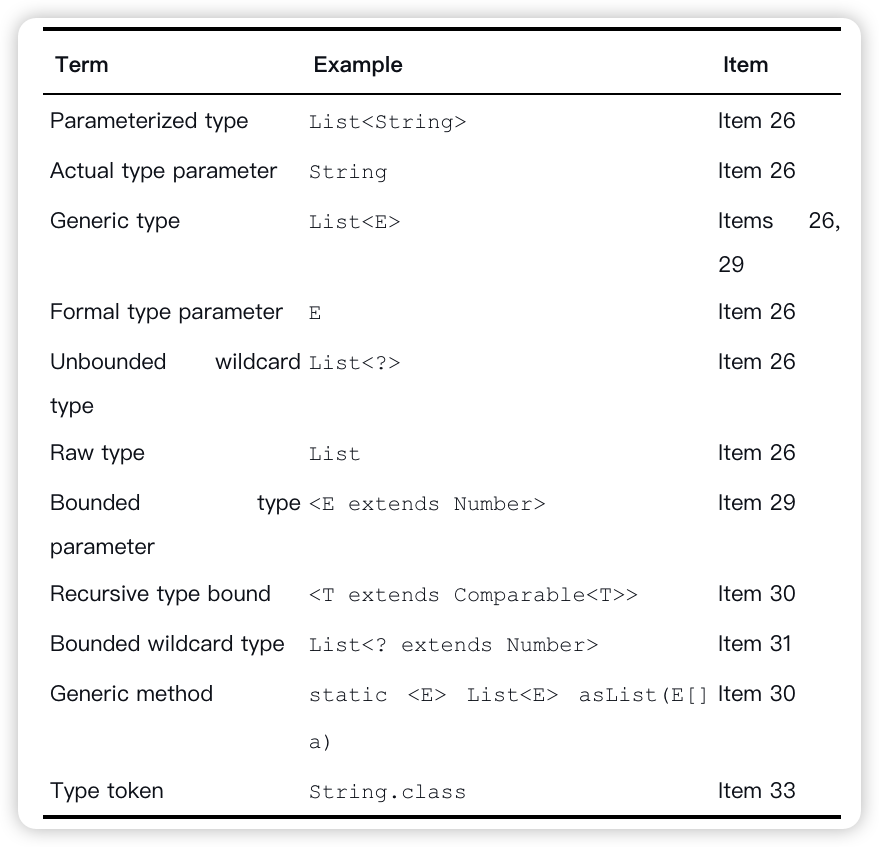

Effective Java
-----

## 一、介绍

## 二、创建和销毁对象

### 1

## 三、 对于所有对象都通用的方法

### 10 Obey the general contract when overriding equals

### 11 重写 equals 方法时同时也要重写 hashcode 方法

### 12 始终重写 toString 方法

### 13 谨慎地重写 clone 方法

### 14 考虑实现 Comparable 接口

## 四、类和接口

### 15 考虑实现 Comparable 接口

### 16. 在公共类中使用访问方法而不是公共属性

### 17. 最小化可变性

### 18 组合优于继承

### 19 Design and document for inheritance or else prohibit it

### 20 接口优于抽象类

### 21 Design interfaces for posterity

### 22 接口仅用来定义类型

### 23 优先使用类层次而不是标签类

### 24 优先考虑静态成员类

### 25 将源文件限制为单个顶级类

## 五、泛型

### 26 不要使用原始类型

### 27 Eliminate unchecked warnings

### 28 列表优于数组

### 29 优先考虑泛型

### 30 Favor generic methods

### 31 使用限定通配符来增加 API 的灵活性

### 32 合理地结合泛型和可变参数

### 33 Consider typesafe heterogeneous containers

## 六、枚举和注解

JAVA supports two special-purpose families of reference types: a kind of class called an enum type, and a kind of interface called an annotation type.

### 34 使用枚举类型替代整型常量

### 35 使用实例属性替代序数

 ordinals

### 36 使用 EnumSet 替代位属性

### 37 使用 EnumMap 替代序数索引

### 38 使用接口模拟可扩展的枚举

### 39 注解优于命名模式

### 40 始终使用 Override 注解

### 42 使用标记接口定义类型

标记接口（marker interface）

## 七、Lambda和Stream

### 42 lambda表达式优于匿名类

### 43 方法引用优于 lambda 表达式

### 44 优先使用标准的函数式接口

### 48 谨慎使用流并行

## 八、方法

### 49 检查参数有效性

### 51 Design method signatures carefully

### 52 明智审慎地使用重载

### 53 明智审慎地使用可变参数

### 54 返回空的数组或集合，不要返回 null

### 55 明智审慎地返回 Optional

### 56 为所有已公开的 API 元素编写文档注释

## 九、通用编程

### 57 最小化局部变量的作用域

### 58 for-each 循环优于传统 for 循环

### 60 若需要精确答案就应避免使用 float 和 double 类型

### 61 基本数据类型优于包装类

### 62 当使用其他类型更合适时应避免使用字符串

### 63 当心字符串连接引起的性能问题

### 64. 通过接口引用对象

### 65. 接口优于反射

### 66. 明智审慎地本地方法

本地语言比 Java 更依赖于平台

### 68 遵守被广泛认可的命名约定

### 

## 十、异常

### 69

### 70 对可恢复的情况使用受检异常，对编程错误使用运行时异常

### 71 避免不必要的使用受检异常

### 72 优先使用标准的异常

### 74. 每个方法抛出的异常都需要创建文档

### 75 Include failure-capture information in detail messages

### 76 保持失败原子性

## 十一、并发

### 78 同步访问共享的可变数据

### 79. 避免过度同步

## 十二、序列化

### 85 优先选择 Java 序列化的替代方案

### 86. 非常谨慎地实现 Serializable

### 87. 考虑使用自定义的序列化形式

### 88. 保护性的编写 readObject 方法

### For instance control, prefer enum types toreadResolve

### 考虑用序列化代理代替序列化实例