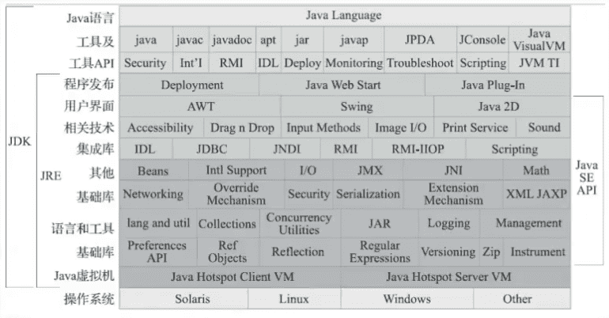

# 深入拆解一线大厂JVM

https://www.bilibili.com/video/BV1nt4y1U7XP

尚硅谷：宋红康

本课程目标：整体了解JVM

性能优化

性能监控（命令行、可视化工具）

内存的分配和回收

内存的结构

类的加载器		class文件结构 		执行引擎   

## 0概述

### 大厂面试题

#### 什么是JVM，为什么要使用？

虚拟机:指以软件的方式模拟具有完整硬件系统功能、运行在一个完全隔离环境中的完整计算机系统，是物理机的软件实现。常用的虚拟机有VMWare，Visual Box，Java Virtual Machine

#### 说说Java虚拟机的生命周期以及体系结构。

### 作为Java工程师，曾被JVM伤害过吗？

### 开发人员如何看待上层框架？

### 架构师每天都在思考什么？

应该如何让我的系统更快？

如何避免系统出现瓶颈？

### Java语言及Java生态圈

Java：跨平台语言

JVM：跨语言的平台

Java虚拟机根本不关心运行在其内部的程序到底是使用何种编程语言编写的，**它只关心”字节码“文件**。

Java可能不是最强大的语言，但是JVM是最强大的虚拟机（应用层面）。

### Java发展的重大事件

#### OpenJDK  和 OracleJDK的关系？

开源  和 商业

#### JDK与JVM的关系

#### Java vs C++

### JVM整体结构

HotSpot JVM结构简图：

详图：

主要优化堆区

#### 为什么Java是半编译半解释语言？

JVM早期版本是只有解释器，后期版本加入了即时编译器，即时编译器会对代码进行缓存。

上面的编译器是前端编译器

JIT（Just-In-Time Compiler），即时编译器。

### 各种JVM

## 1 类的加载器篇

### 大厂面试题

### 类加载子系统作用

### 类的加载过程

#### 细节

验证，在文件编辑器用16进制打开.class文件，发现前面几个都是相同。验证就是验证前面几个，确认为.class文件

show Bytecode with jclasslib  jclasslib插件

### 类的加载器

#### 加载器的分类

- JVM支持两种类型的类加载器，分别为**引导类加载器（Bootstrap ClassLoader）**（是C/C++编写的，是JVM的一部分）和自定义类加载器（User-Defined ClassLoader）（Java编写，直接或间接继承于ClassLoader）

  

### 双亲委派机制

### 破坏双亲委派机制

### 沙箱安全机制

## 2 内存结构篇

### 大厂面试题

### 程序计数器

### 虚拟机栈

如何理解栈管运行，堆管存储？

做法步骤看作栈，其中1、2、3...可以看作是程序计数器。

食材明细可看作局部变量表。

做菜的器皿可看作堆。

### 本地方法栈

### 堆

#### 堆的内存结构

堆对于不同线程是共享的，线程同时使用堆中数据就需要加锁，为了更方便地使用堆，加把堆分成若干TLAB

#### 对象分配过程

#### 内存分配策略

#### JVisualVM的使用

#### 堆的各种参数

#### 堆，是分配对象的唯一选择吗？

### 方法区

#### 方法区在哪里？

#### 栈、堆、方法区的关系

#### 方法区都存什么？

运行时常量池

#### 永久代与元空间

#### 内存结构小结

#### VM参数小结

### 直接内存

### StringTable

## 3 执行引擎篇

### 执行引擎工作过程

### 为什么说Java是半编译半解释型语言？

### 解释器

### 编译器

### 指令

java -version

java -Xint -version

java -Xcomp -version

## 4 垃圾回收篇

栈是不存在垃圾回收的。 SOF  OOM

### 大厂面试题

### 垃圾回收算法

引用计数算法 不用了

循环引用的问题

### 相关概念

### 垃圾回收器

### 相关VM参数

## 5 字节码指令篇

### 大厂面试题

### Class文件结构

### 字节码指令集

见《JVM指令手册》

## 6 JVM监控及诊断工具篇

### 大厂面试题

支付宝：

支付宝三面：JVM性能调优都做了什么？

小米：

有做过JVM内存优化吗？

从SQL、JVM、架构、数据库四个方面讲讲优化思路

蚂蚁金服：

JVM的编译优化

jvm性能调优都做了什么

JVM诊断调优工具用过哪些？

二面：jvm怎样调优，堆内存栈空间设置多少合适..

三面：JVM相关的分析工具使用过的有哪些？具体的性能调优步骤如何

阿里：

如何进行JVM调优？有哪些方法？

如何理解内存泄漏问题？有哪些情况会导致内存泄露？如何解决？

字节跳动：

三面：JVM如何调优、参数怎么调？

拼多多：

从SQL、JVM、架构、数据库四个方面讲讲优化思路

京东：

JVM诊断调优工具用过哪些？

每秒几十万并发的秒杀系统为什么会频繁发生GC？

日均百万级交易系统如何优化JVM？

线上生产系统OOM如何监控及定位与解决？

高并发系统如何基于G1垃圾回收器优化性能？

### 命令行篇

概述

 jps

 jstat

jinfo

jmap

jhat

 jstack

 jutil

jcmd

### **GUI篇**

jconsole

VisualVM

JProfiler

Eclipse MAT

JMC

## 性能调优篇

### GC调优

### 代码层调优