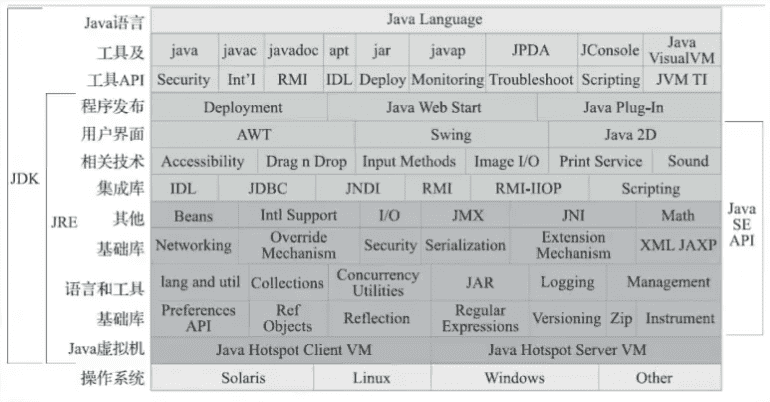

《深入理解Java虚拟机（第3版）： JVM高级特性与最佳实践》笔记

------------------

[勘误](https://github.com/fenixsoft/jvm_book)

## 前言

Java的技术体系主要由支撑Java程序运行的**虚拟机**、提供各开发领域接口支持的**Java类库**、**Java编程语言**及许许多多的**第三方Java框架**（如Spring、MyBatis等）构成。

虚拟机层面隐藏了底层技术的复杂性以及机器与操作系统的差异性。

程序员可以把主要精力放在具体业务逻辑，而不是放在保障物理硬件的兼容性上。

绝大多数情况下，提升硬件性能无法等比例提升程序的运行性能和并发能力，甚至有可能对程序运行状况没有任何改善。两个原因：

- 一是JVM为了达到“所有硬件提供一致的虚拟平台”的目的，牺牲了一些硬件相关的性能特性。
- 二是人为原因，如果开发人员不了解虚拟机诸多技术特性的运行原理，就无法写出最适合虚拟机运行和自优化的代码。

商用的高性能JVM都提供了相当多的**优化参数和调节手段**，用于满足应用程序在实际生产环境中对性能和稳定性的要求。

## 一、走近Java

### 1 走近Java

> 世界上并没有完美的程序，但我们并不因此而沮丧，因为写程序本来就是一个不断追求完美的过程。

Java不可忽视的有点：它**摆脱了硬件平台的束缚**，实现了“一次编写，到处运行”的理想；它提供了一种**相对安全的内存管理和访问机制**，避免了绝大部分**内存泄漏和指针越界**问题；它实现了**热点代码检测和运行时编译及优化**，这使得Java应用能随着运行时间的增长而获得更高的性能；它有一套**完善的应用程序接口**，还有无数来自商业机构和开源社区的**第三方类库**来帮助用户实现各种各样的功能……

#### Java技术体系

JCP（Java Community Process，也就是“Java社区”) 官方定义的Java技术体系：

- Java程序设计语言
- 各种硬件平台上的**Java虚拟机**实现
- Class文件格式
- Java类库API
- 来自商业机构和开源社区的**第三方Java类库**

**JDK**（Java Development Kit）：Java程序设计语言、Java虚拟机、Java类库。JDK是支持Java程序开发的最小环境，有时JDK就代指Java技术体系。

**JRE**（Java Runtime Environment）：类库API中的**Java SE API**子集和Java虚拟机。JRE是支持Java程序运行的标准环境。

#### Java发展史

- 1991年4月，Oak。

- 1995年5月23日，Oak语言改名为Java，提出“Write Once，Run Anywhere”。

- 1996年1月23日，JDK 1.0发布，提供了一个纯解释执行的Java虚拟机实现（**Sun Classic VM**）。

- 1997年2月19日，Sun公司发布了JDK 1.1，JAR文件格式、JDBC、JavaBeans、RMI，内部类（Inner Class）和反射（Reflection）等。

- 1998年12月4日，JDK 1.2，拆分为三个方向，内置了**JIT（Just In Time）**即时编译器。

- 1999年4月27日，**HotSpot**虚拟机诞生。

- 2000年5月8日，JDK 1.3，改进Java类库上（如数学运算和新的Timer API等），JNDI。

- 2002年2月13日，JDK 1.4，标志着Java真正**走向成熟**，正则表达式、异常链、NIO、日志类、XML解析器和XSLT转换器等。

- 2004年9月30日，JDK 5，在Java语法易用性上做出了非常大的改进如：自动装箱、泛型、动态注解、枚举、可变长参数、遍历循环（foreach循环）等。

  JDK5改进了Java的内存模型（Java Memory Model，JMM）、提供了java.util.concurrent并发包等。

- 2006年12月11日，JDK 6，启用Java EE 6、Java SE 6、Java ME 6的新命名，提供初步的动态语言支持（通过内置Mozilla JavaScript Rhino引擎实现）、提供编译期注解处理器和微型HTTP服务器API，等。

  对Java虚拟机内部做了大量改进，包括锁与同步、垃圾收集、类加载等方面的实现都有相当多的改动。

- 2006年11月13日，Java开源，建立了OpenJDK组织

- 2009年4月20日，Oracle收购Sun。

  Java商标正式划归Oracle所有（Java语言本身并不属于哪间公司所有，它由**JCP**组织进行管理，尽管在JCP中Sun及后来的Oracle的话语权很大）。

- 2014年3月18日，JDK 8，Oracle启用**JEP（JDK Enhancement Proposals）**来定义和管理纳入新版JDK发布范围的功能特性。

  JEP 126：对Lambda表达式的支持，这让Java语言拥有了流畅的函数式表达能力。

  JEP 104：内置Nashorn JavaScript引擎的支持。

  JEP 150：新的时间、日期API。

  JEP 122：彻底移除HotSpot的永久代。

  ...

- 2017年9月21日，JDK 9，**Jigsaw**模块化功能。

  Java确实有模块化的刚需，不论是JDK自身（例如拆分出Java SE Embedded这样规模较小的产品）抑或是Java应用都需要用到模块化。

  JDK 9发布后，Oracle随即宣布Java将会以持续交付的形式和更加敏捷的研发节奏向前推进，以后JDK将会在每年的3月和9月各发布一个大版本，目的就是为**避免众多功能特性被集中捆绑到一个JDK版本上而引发交付风险**。

- 2018年3月20日，JDK 10，内部重构，诸如统一源仓库、统一垃圾收集器接口、统一即时编译器接口（JVMCI在JDK 9已经有了，这里是引入新的**Graal即时编译器**）等。

- 2018年9月25日，JDK 11，Oracle同时调整了JDK的授权许可证。

  首先，Oracle从JDK 11起把以前的商业特性全部开源给OpenJDK，这样OpenJDK 11和OracleJDK 11的代码和功能，在**本质上就是完全相同的**（官方原文是Essentially Identical）。

  然后，Oracle宣布以后将会同时发行两个JDK：一个是以GPLv2+CE协议下由Oracle发行的OpenJDK（本书后面章节称其为Oracle OpenJDK），另一个是在新的OTN协议下发行的传统的OracleJDK，这两个JDK共享绝大部分源码，在功能上是几乎一样的，核心差异是前者可以免费在开发、测试或生产环境中使用，但是只有半年时间的更新支持；后者个人依然可以免费使用，但若在生产环境中商用就必须付费，可以有三年时间的更新支持。

  如果说由此能得出“Java要收费”的结论，那是纯属标题党，最多只能说Oracle在迫使商业用户要么不断升级JDK的版本，要么就去购买商业支持。

- 2019年3月20日，JDK 12，Switch表达式、Java微测试套件（JMH）等。

在Sun掌舵的前十几年里，Java获得巨大成功，同时也渐渐显露出来语言演进的缓慢与社区决策的老朽；而在Oracle主导Java后，引起竞争的同时也带来新的活力，Java发展的速度要显著高于Sun时代。

#### Java虚拟机家族

##### 1 虚拟机始祖：Sun Classic/Exact VM

##### 2 武林盟主：HotSpot VM

##### 3 小家碧玉：Mobile/Embedded VM

##### 4 天下第二：BEA JRockit/IBM J9 VM

##### 5 软硬合璧：BEA Liquid VM/Azul VM

##### 6 挑战者：Apache Harmony/Google Android Dalvik VM

##### 7 没有成功，但并非失败：Microsoft JVM及其他

##### 8 百家争鸣

KVM

Java Card VM

Squawk VM

JavaInJava

...

#### 展望Java技术的未来

