尚硅谷JVM
----

[尚硅谷宋红康JVM全套教程（详解java虚拟机）](https://www.bilibili.com/video/BV1PJ411n7xZ)

《内存与垃圾回收篇》p1-p203

《字节码与类的加载篇》p204-p301

《性能监控与调优篇》三个篇章 p302-p381

[JVM从入门到精通 · 语雀 ](https://www.yuque.com/u21195183/jvm)

Java8 本课程基于

Java11 LTS


# 一、内存与垃圾回收篇

## 1 JVM与Java体系结构

**你是否也遇到过这些问题？**

- 运行着的线上系统突然卡死，系统无法访问，甚至直接OOM!
- 想解决线 上JVM GC问题，但却无从下于。
- 新项目上线，对各种JVM参数设置一脸茫然，直接默认吧，然后就GG了
- 每次面试之前都要重新背一遍JVM的一些原理概念性的东西，然而面试官却经常问你在实际项目中如何调优JVM参数I 如何解决GC、OON等问题，一脸懵逼。

**架构师每天都在思考什么？**

- 应该如何让我的系统更快？
- 如何避免系统出现瓶颈？

### 参考书籍

[The Java Virtual Machine Specification, Java SE 8 Edition](https://docs.oracle.com/javase/specs/jvms/se8/html/index.html)

[The Java Virtual Machine Specification, Java SE 11 Edition](https://docs.oracle.com/javase/specs/jvms/se11/html/index.html)

《深入理解Java虚拟机》第三版

### Java与JVM简介

世界上没有最好的编程语言，只有最适用于具体应用场景的编程语言。

JS

人工智能 Python

微服务 GO

Java生态圈

####  Java虚拟机规范

The Java Virtual Machine is the cornerstone of the Java platform. It is the component of the technology responsible for its hardware- and operating system- independence, the small size of its compiled code, and its ability to protect users from malicious programs.

The Java Virtual Machine is an abstract computing machine. Like a real computing machine, it has an instruction set and manipulates various memory areas at run time. It is reasonably common to implement a programming language using a virtual machine; the best-known virtual machine may be the P-Code machine of UCSD Pascal.

#### JVM：跨语言的平台

Java：跨平台的语言

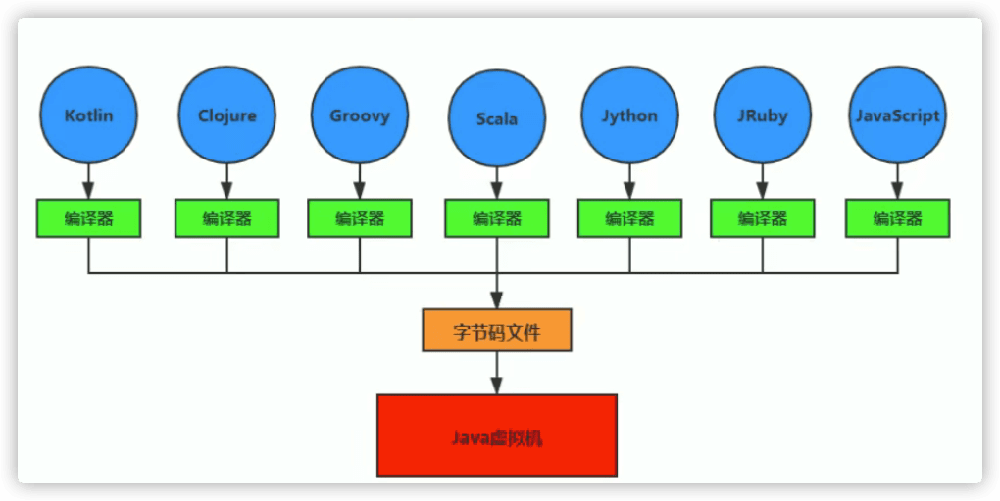

（上面的编译器可以称为编译器的前端，Java虚拟机中的解释器、JIT等可称为编译器的后端）

Java虚拟机根本不关心运行在其内部的程序到底是使用何种编程语言编写的，**它只关心 “字节码”文件**。也就是说Java虚拟机拥有语言无关性，并不会单纯地与Java语言 “终身綁定”，只要其他编程语言的编译结果满足并包含Java虚拟机的内部指令集、符号表以及其他的铺助信息，它就是一个有效的字节码文件，就能够被虚拟机所识别并装载运行。

<font color=#FF263D>Java不是最强大的语言，但是JVM是最强大的虚拟机。</font>

> IT领域三大难题：CPU、操作系统、编译器

#### 字节码

- 我们平时说的java字节码，指的是用iava语言编译成的字节码。准确的说任何能在ivm平台上执行的字节码格式都是一样的。所以应该统称为：**jvm字节码**。
- 不同的编译器，可以编译出相同的字节码文件，字节码文件也可以在不同的JVM上运行。
- Java 虚拟机与 Java 语言并没有必然的联系，它只与特定的二进制文件格式—Class文件格式所关联，Class 文件中包含了 Java 虚拟机指令集（或者称为字节码、Bytecodes）和符号表，还有一些其他辅助信息。

####  多语言混合编程

**Java平台上的多语言混合编程正成为主流，通过特定领域的语言去解决特定领域的问题是当前钟件开发应对日趋复杂的项目需求的一个方向。**

试想一下，在一个项目之中，并行处理用Clojure语言编写，展示层使用JRuby/Rails，中间层则是Java，每个应用层都将使用不同的编程语言来完成，而且，接口对每一层的开发者都是透明的，**各种语言之间的交互不存在任何困难，就像使用自己语言的原生API一样方便，因为它们最终都运行在一个虛拟机之上。**

对这些运行于Java虛拟机之上、Java之外的语言，来自系统级的、底层的支持正在迅速增强，以JSR-292为核心的一系列项目和功能改进（如DaVinci Machine 项目、Nashorn引擎、InvokeDynamic指令、java. lang .invoke包等），**推动Java虛拟机从“ Java语言的虚拟机”向“多语言虚拟机”的方向发展**。

#### 如何真正搞懂JVM？

自己动手写Java虚拟机

天下事有难易乎？

为之，则难者亦易矣；不为，则易者亦难矣。


### Java发展的重大事件

- 1990年，在Sun 计算机公司中，由 Patrick Naughton、Mikesheridan 及James Gosling 领导的小组Green ream，开发出的新的程序语言，命名为oak,后期命名为Java
- 1995年，Sun正式发布Java和HotJava产品，Java首次公开完相。
- 1996年1月23日Sun Microsystems发布了JDK 1.0。
- 1998年，JDK 1.2版本发布。同时，sun发布了 JSP/Servlet、EJB规范，以及将Java分成了
  J2EE、J2SE和J2ME。这表明了 Java开始向企业、桌面应用和移动设备应用3大领域挺进。
- 2000年.，JDR 1.3发后.，**Java HotSote virtuaI machin**e正式发布，成为Java的默认虚拟机。
- 2002年，JDK 1.4发布，古老的classic虚拟机退出历史舞台。
- 2003年年底，Java平台的Scala正式发布，同年Groovy也加入了 Java阵营。
- 2004年，JDK 1.5发布。同时JDK 1.5改名为JavaSE 5.0（命名方式的修改，5.0里程碑版本，很多新特性）。
- 2006年，JDK 6发布。同年，Java开源并建立了 **OpenJDK**。顺理成章，Hotspot虚拟机也成为了 OpenJDK中的默认虚拟机。

- 2007年，Java平台迎来了新伙伴**Clojure**。
- 2008 年，oracle 收购了 BEA，得到了 **JRockit** 虚拟机。
- 2009年，Twitter宣布把后台大部分程序从Ruiby迁移到Scala，这是Java平台的又一次
  大规模应用。
- 2010年，Oracle收购了sun，**获得Java商标和最具价值的Hotspot虚拟机**。此时，oracle拥有市场占用率最高的两款虚拟机HotSpot和JRockit，并计划在术来对它们进行整合：HotRockit
- 2011年，JDR7发布。在JDK 1.7u4中，正式启用了**新的垃圾回收器G1**。
- 2017年，JDK9发布。将G1设置为默认GC，替代**CMS**
- 同年，IBM的**J9虚拟机**开源，形成了现在的Open J9社区
- 2018年，Android的Java侵权案判决，Google赔偿oracle计88亿美元
- 同年，oracle宣告JavaEE成为历史名词，JDBC、JMS、Servlet赠了Eclipse基金会
- 同年，JDK11发布，LTS版本的JDK，发布革命性的**ZGC**，调整JDK授权许可
- 2019年，JDK12发布，加入RedHat领导开发的**Shenandoah GC**

###  虚拟机与Java虚拟机

#### 虛拟机

所谓虛拟机 (Virtual Machine)，就是一台虚拟的计算机。它是一款软件，用来执行一系列虚拟计算机指令。大体上，虛拟机可以分为**系统虚拟机**和**程序虚拟机。**

- 大名鼎鼎的Visual Box， VMware就属于系统虚拟机，它们**完全是对****物理计算机的仿真**，提供了一个可运行完整操作系统的软件平台。
- 程序虚拟机的典型代表就是Java虛拟机，它**专门为执行单个计算机程****序而设计**，在Java虚拟机中执行的指令我们称为Java字节码指令。

无论是系统虚拟机还是程序虛拟机，在上面运行的软件都被限制于虚拟机提供的资源中。

#### JVM的位置

JVM是运行在操作系统之上的，它与硬件没有直接的交互。

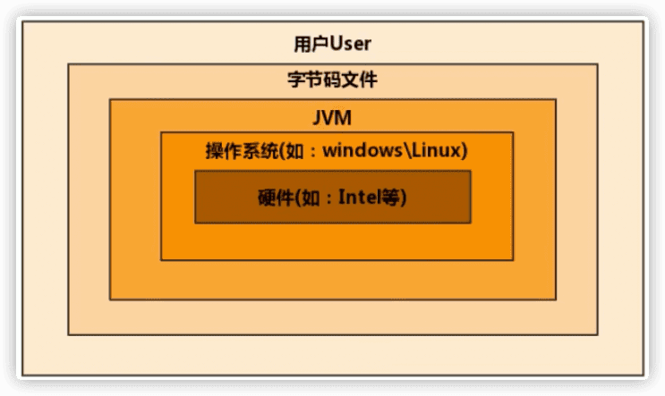

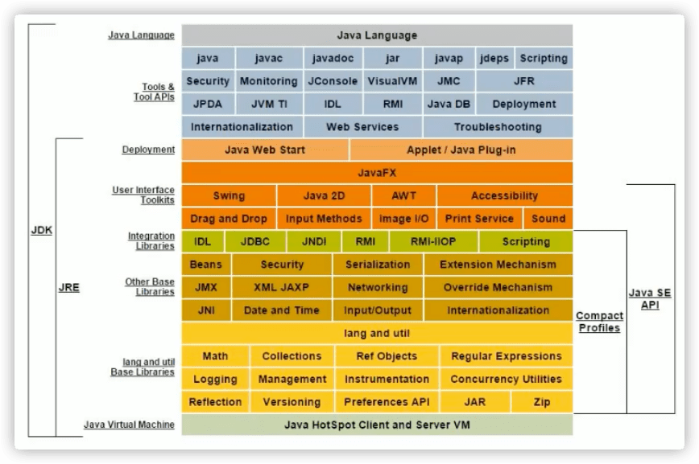

`.java` 通过javac（前端编译器）生成`.class`。

#### Google的Android系统结构

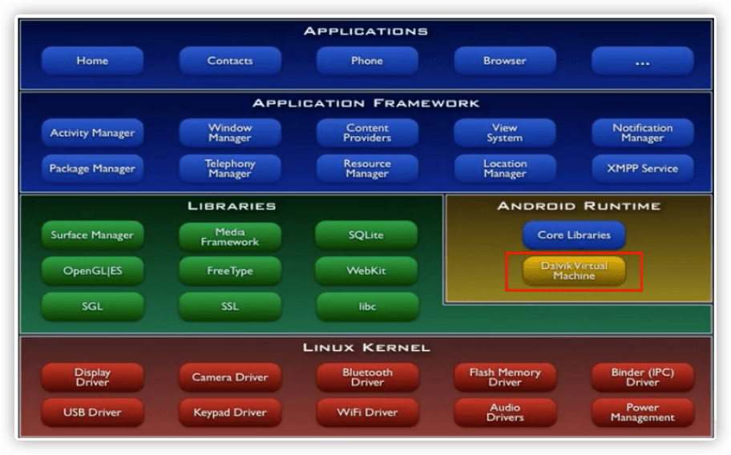

### JVM的整体结构

P11🔖，整体讲解

JVM结构简图：

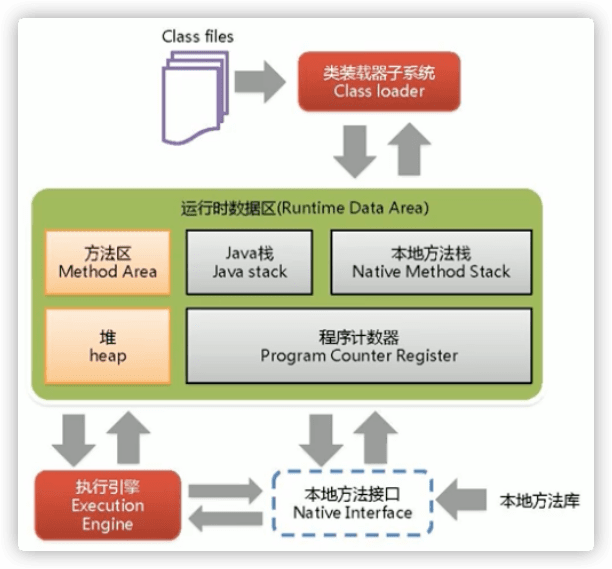


### Java代码执行流程

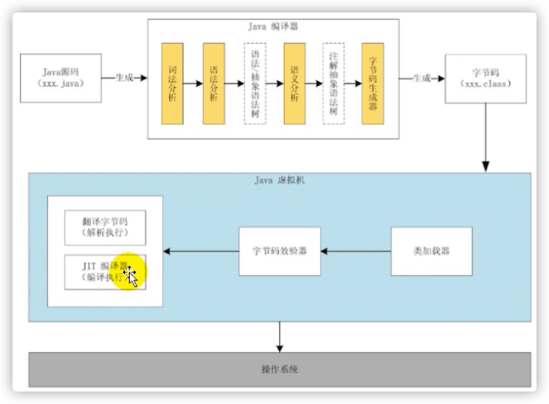

热点代码（可以缓存起来，JIT）

### JVM的架构模型

Java编译器输入的指令流基木上是一种**==基于栈的指令集架构==**（HotSpot），另外一种指令集架构则是**==基于寄存器的指令集架构==**。

具体来说，这两种架构之间的区别：
基于栈式架构的特点

- 设计和实现更简单，适用于资源受限的系统；(每执行一个方法就可以理解为一个入栈操作)
- 避开了寄存器的分配难题：使用**零地址指令**方式分配。
- 指令流中的指令大部分是零地址指令，其执行过程依赖于操作栈。**指令集更小**（指令多），编译器容易实现。
- 不需要硬件支持，可移植性更好，更好实现跨平台

基于寄存器架构的特点

- 典型的应用是x86的二进制指令集：比如传统的x86PC以及Android的Davlik虚拟机。
- 指令集架构则完全依赖硬件，可移植性差
- 性能优秀和执行更高效：
- 花费更少的指令去完成一项操作。
- 在大部分情况下，基于寄存器架构的指令集往往都以**一地址指令、二地址指令和三地址指令**为主，而基于栈式架构的指令集却是以零地址指令为主。

#### 举例

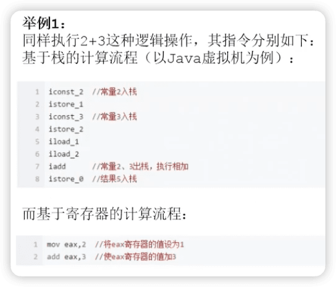

```java
public class StatckStruTest {
    public static void main(String[] args) {
        int i = 2 + 3;
    }
}
```

反编译命令`javap -v StatckStruTest`

上面的结果编译直接得到结果：

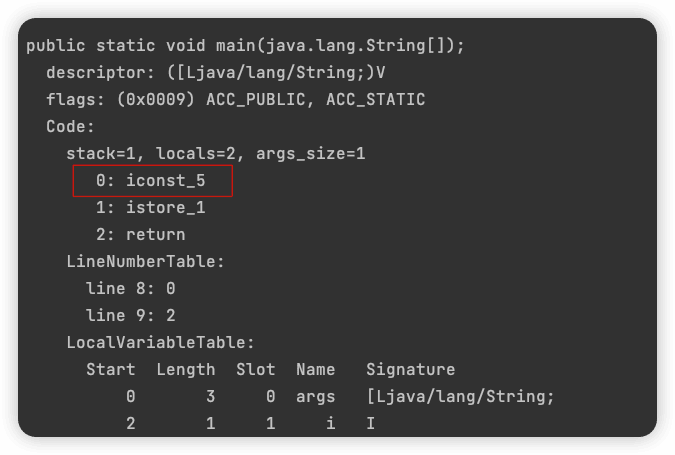

如果代码是：

```java
        int i = 2;
        int j = 3;
        int k = i + j;
```

反编译结果：

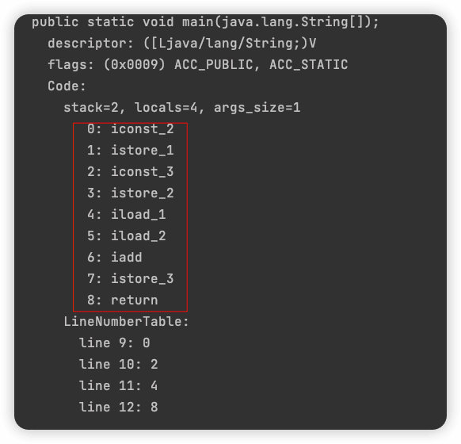

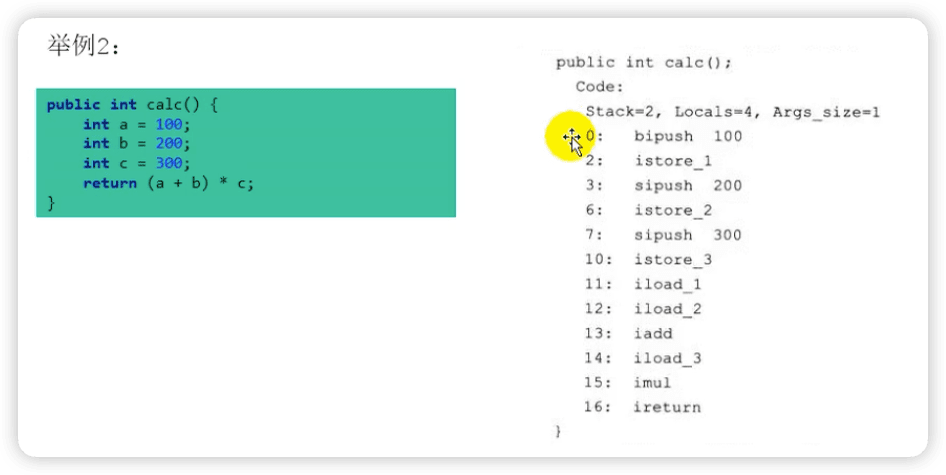

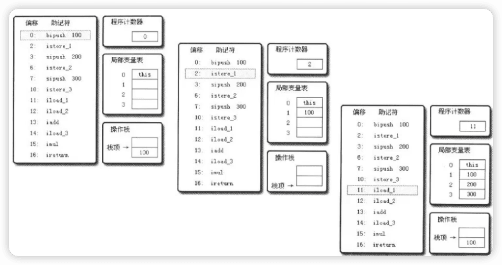


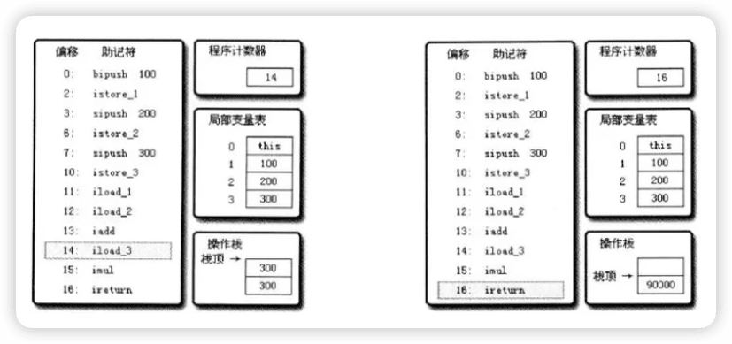

#### 总结

由于跨平台性的设计，Java的指令都是根据栈来设计的。不同平台CPU架构不同，所以不能设计为基于寄存器的。优点是跨平台，指令集小，编译器容易实现，缺点是性能下降，实现同样的功能需要更多的指令。

**栈：==跨平台性、指令集小、指令多；执行性能比寄存器差==。**

时至今日，尽管嵌入式平台已经不是Java程序的主流运行平台了（准确来说应该是HotSpotvM 的宿主环境己经不局限于嵌入式平台了），那么为什么不将架构更换为基于寄存器的架构呢？

<u>基于栈的架构设计和实现上都比较==简单==；其次是在非资源受限的场景中也是可以用的，也就没有必要更换了。</u>


### JVM的生命周期

#### 虛拟机的启动

Java虛拟机的启动是通过==引导类加载器== (bootstrap class loader)创建个==初始类== (initial class）来完成的，这个类是由虛拟机的具体实现指定的。

#### 虛拟机的执行

- 一个运行中的Java虛拟机有着一个清晰的任务：**==执行Java程序==**。
- 程序开始执行时他才运行，程序结束时他就停止。
- 执行一个所谓的Java程序的时候，真真正正在执行的是一个叫做**==Java虚拟机的进程==**。

#### 虚拟机的退出

有如下的几种情顶：

- 程序正常执行结束
- 程序在执行过程中遇到了异常或错误而异常终止
- 由于操作系统出现错误而导致Java虛拟机进程终止
- 某线程调用Runtime类或System类的exit方法，或 Runtime类的halt方法，并且Java安全管理器也允许这次exit或halt操作。
- 除此之外，==JNI==(Java Native Interface)规范描述了用JNI Invocation API来加载或卸载 Java虚拟机时，Java虚拟机的退出情况。

### JVM的发展历程

#### Sun Classic VM

- 早在1996年Java1.0版本的时候，sun公司发布了一款名为sun classic VM的Java虚拟机，它同时也是**==世界上第一款商用Java虚拟机==**，JDK1.4时完全被淘汰。
- 这款虚拟机内部**只提供解释器**。（解释器逐行解释，效率比较低下）
- 如果使用JIT编译器，就需要进行外挂。但是一旦使用了JIT编译器，JIT就会接管虛拟机的执行系统。解释器就不再工作。解释器和编译器不能配合工作。
- 现在hotspot内置了此虚拟机。

比喻：

步行   解释器

公交车  编译器

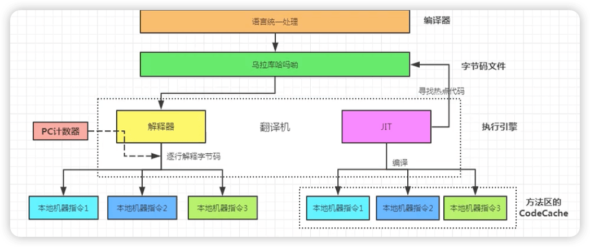

#### Exact VM

- 为了解决上一个虚拟机问题，jak1.2时，sun提供了此虚拟机。

- Exact Memory Management：**准确式内存管理**，也可以叫Non-Conservative/Accurate Memory Management，虛拟机可以知道内存中某个位置的数据具体是什么类型
  
- 具备现代高性能虛拟机的雏形
  热点探测

  编译器与解释器混合工作模式

- 只在Solaris平台短暂使用，其他平台上还是classic vm
  英雄气短，终被Hotspot虚拟机替换

#### SUN公司的Hotspot VM

- Hotspot历史
  + 最初由一家名为“Longview Technologies"的小公司设计
  + 1997年，此公司被sun收购;2009年，sun公司被甲骨文收购。
  + JDK1 .3时，Hotspot V成为默认虚拟机
  
- **目前Hotspot占有绝对的市场地位，称霸武林。**
  + 不管是现在仍在广泛使用的JDK6，还是使用比例较多的JDK8中，默认的虚拟机都是HotSpot
  + Sun/oracle JDK 和openJDK的默认虚拟机
  + 因此本课程中默认介绍的虛拟机都是Hotspot，相关机制也主要是指Hotspot的GC机制。(比如其他两个商用虚拟机都没有**方法区**的概念）
  
- 从服务器、桌面到移动端、嵌入式都有应用。

- 名称中的HotSpot指的就是它的**热点代码探测技术**。
  + 通过计数器找到最具编译价值代码，触发即时编译或栈上替换
  
  + 通过编译器与解释器协同工作，在最优化的最佳执行性能与程序响应时间中取得平衡
  
    编译器 - 最佳执行性能
  
    解释器 - 响应时间

#### BEA的JRockit

- **专注于==服务器端==应用**
  它可以不太关注程序启动速度，因此JRockit内部**不包含解析器实现**，全部代码都靠即时编译器编译后执行。
  
- 大量的行业基准测试显示，**JRockit JVM是世界上最快的JVM**。
  使用JRockit产品，客户己经体验到了显著的性能提高（一些超过了70%）和硬件成木的减少（达50%）
  
- 优势：全面的Java运行时解决方案组合
  JRockit面向延迟敏感型应用的解决方案JRockit Real Time提供以毫秒或微秒级的JVM响应时间，适合财务、军事指挥、电信网络的需要
  
  **Mission Control**服多套件，它是一组以极低的开销来监控、管理和分析生产环境中的应用程序的工具。[JDK Mission Control（JMC）](https://www.oracle.com/java/technologies/downloads/tools/#JMC)
  
- 2008年，BEA被oracle收购。

- Oracle表达了整合两大优秀虚拟机的工作，大致在JDK 8中完成。整合的方式是在Hotspot的基础上，移植JRockit的优秀特性。

- 高斯林：目前就职于谷歌，研究人工智能和水下机器人

#### IBM 的 J9

- 全称：IBM Technology for Java Virtual Machine， 简称IT4J，内部代号：J9
- 市场定位与Hotspot接近，服务器端、桌面应用、嵌入式等多用途VM
- 广泛用于IBM的各种Java产品。
- 目前，有影响力的==三大商用虚拟机==（J9、JRockit、Hotspot）之一，也号称是世界上最快的Java虛拟机。
- 2017年左右，IBM发布了开源J9 VM，命名为OpenJ9，交给EClipse基金会管理，也称为 [Eclipse OpenJ9](https://github.com/eclipse-openj9/openj9)

#### KVM和CDC/CLDC Hotspot

- oracle在Java ME产品线上的两款虛拟机为： CDC/CLDC Hotspot Implementation VM
- KVM (Kilobyte）是CLDC-HI早期产品
- 日前移动领域地位尴尬，智能于机被Android和ios二分天下。
- KVM简单、轻量、高度可移植，而向更低端的设各上还维持自己的一片市场智能控制器、传感器，老人手机、经济欠发达地区的功能手机
- 所有的虚拟机的原则：一次编译，到处运行。

#### Azul VM

- 前面三大 “高性能Java虛拟机”使用在通用硬件平台上
- 这里AZuI VN和BEA Liguid VM是**与特定硬件平台鄉定、软硬件配合的专有虚拟机**，高性能Java虚拟机中的战斗机。
- Azul VM是Azul systems公司在Hotspot基础上进行大量改进，运行于Azul systems公司的专有硬件Vega系统上的Java虛拟机。
- **每个AzuL VM实例都可以管理至少数十个CPU和数百GB内存的硬件资源，并提供在巨大内存范围内实现可控的GC时间的坟圾收集器、专有硬件优化的线程调度等优秀特性**
- 2010年，Azul systems公司开始从硬件转向软件，发布了自己的**Zing JVM**（==低延迟==、快速预热），可以在通用x86平台上提供接近于Vega系统的特性。

#### Liquid VM

- 高性能Java虛拟机中的战斗机。
- BEA公司开发的，直接运行在自家Hypervisor系统上
- Liquid VM即是现在的JRockit VE (Virtual Edition) ，**Liguid VM不需要操作系统的支持，或者说它自己本身实现了一个专用操作系统的必要功能，如线程调度、文件系统、网络支持等**。
- 随着JRockit虚拟机终止开发，Liquid VM项目也停止了。

#### Apache Harmony

- Apache也曾经推出过与JDK 1.5和JDR 1.6兼容的Java运行平台Apache Harmony。
- 它是IBM和Intel联合开发的开源JVM，受到同样开源的openJDK的压制，Sun坚决不让Harmony获得==JCP==认证，最终于2011年退役，IBN转而参与openJDK
- 虽然目前并没有Apache Harmony被大规模商用的案例，但是**它的Java类库代码吸纳进了==Android SDK==**。

#### Microsoft JVM

- 微软为了在IE3浏览器中支持Java Applets， 开发了Microsoft JVM。
- 只能在window平台下运行。但确是当时windows下性能最好的Java VM。
- 1997年，sun以侵犯商标、不正当竞争罪名指控微软成功，赔了sun很多钱。微软在WindowsXP SP3中抹掉了其VM。现在windows上安装的jdk都是HotSpot。

#### TaobaoJVM

- 由AliJVM团队发布。阿里，国内使用Java最强大的公司，覆盖云计算、金融、物流、电商等众多领域，需要解决高并发、高可用、分布式的复合问题。有大量的开源产品。
- **基于openJDK 开发了自己的定制版本AlibabaJDK**，简称==AJDK==。是整个阿里Java体系的基石。
- 基于OpenJDK Hotspot VM 发布的国内第一个优化、**深度定制且开源的高性能服务器版Java虚拟机**。
  + 创新的GCIH (GC invisible heap）技术实现了==off-heap==，即**将生命周期较长的Java对象从heap中移到heap之外，并且GC不能管理GCIH内部的Java对象，以此达到降低GC的回收频率和提升GC的回收效率的目的。**
  + GCIH 中的**对象还能够在多个Java虚拟机进程中实现共享**
  + 使用crc32指令实现 JVM intrinsic 降低JNI 的调用开销
  + PMU hardware 的Java profiling tool 和诊断协助功能
  + 针对大数据场景的ZenGC
- taobao vm应用在阿里产品上性能高，硬件严重依赖intel的cpu，损失了兼容性，但提高了性能
  目前己经在淘宝、天猫上线，把oracle 官方JVM 版本全部替换了。

#### Dalvik VM

- 谷歌开发的，应用于Android系统，并在Android2.2中提供了JIT，发展迅猛。

- **Dalvik VM 只能称作虚拟机，而不能称作 “Java 虚拟机”**，它没有遵循 Java虛拟机规范

- 不能直接执行 Java 的 class文件

- 基于==寄存器架构==，不是jvm的栈架构。

- 执行的是编译以后的**==dex== (Dalvik Executable）**（类似class文件，由其转化过来的）文件。执行效率比较高。
  它执行的dex (Dalvik Executable）文件可以通过class文件转化市来，使用Java语法编写应用程序，可以直接使用大部分的Java AFI等。
  
- Android 5.0 使用支持**提前编译** (Ahead Of Time compilation, ==AOT==)的==ART VM==替换Dalvik VM

  AOT的意思是java源代码不经过字节码文件，直接编译成机器指令。

> 具体JVM的内存结构，其实取决于其实现，不同厂商的JVM，或者同一厂商发布的不同版本，都有可能存在一定差异。**本套课程主要以Oracle Hotspot VM为默认虚拟机。**

#### Graal VM

- 2018年4月，Oracle Labs公开了Graal VM, 号称"**Run Programs Faster Anywhere**"，勃勃野心。与1995年java的”write once, run anywhere"遥相呼应。
- Graal VM在Hotspot VM基础上增强而成的**跨语言全栈虚拟机，可以作为“任何语言”的运行平台使用**。语言包括：Java、scala、 Groovy、Kotlin；C、 C++、Javascript、 Raby、 Python、 R等。
- 支持不向语言中混用对方的校口和对象，支持这些语言使用已经编写好的本地库文件
- 工作原理是将这些语言的源代码或源代码编译后的中间格式，通过解释器转换为能被Graal VM接受的中间表示。Graal VM 提供Truffle工具集快速构建面问一种新语言的解释器。在运行时还能进行即时编译优化，获得比原生编译器更优秀的执行效率。
- **如果说Hotspot有一天真的被取代，Graal VM希望最大**。但是Java的软件生态没有丝毫变化。

https://github.com/oracle/graal

https://www.graalvm.org/

## 2 类加载子系统

🔖P26 整体讲解过程

字节码文件之后虚拟机负责

方法区是HopSpot特有的

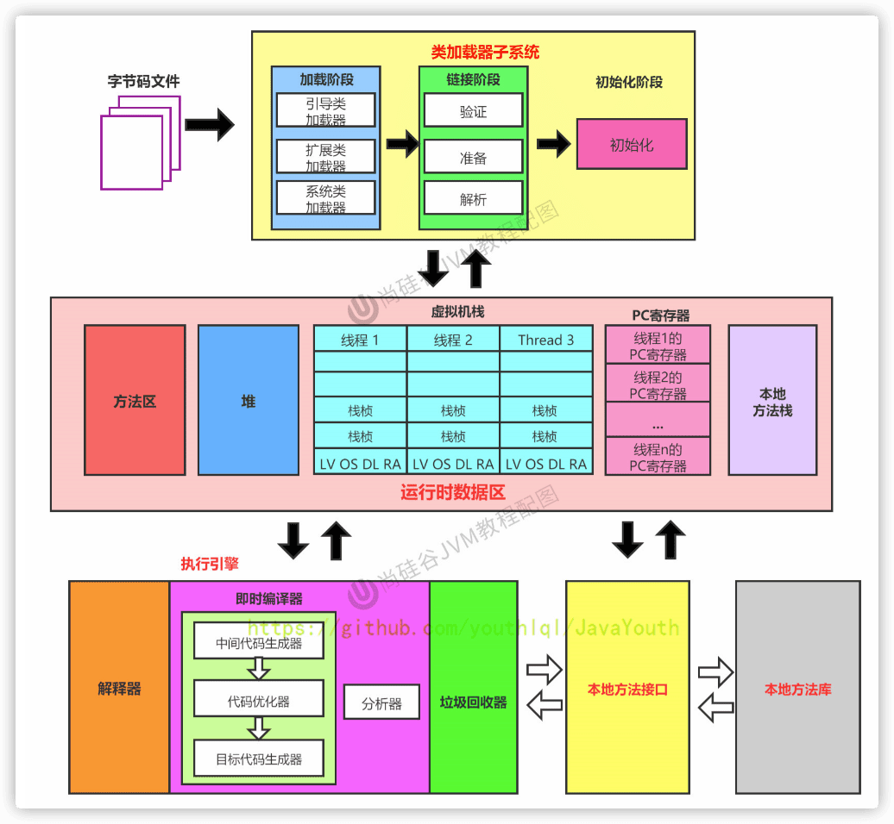

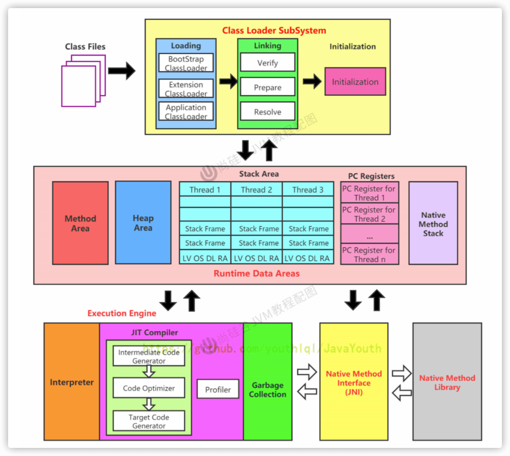

如果手写一个Java虚拟机，主要考虑哪些结构呢？

**类加载器和执行引擎**

> 章节内容
>
> 2 类加载子系统
>
> 3-10 运行时数据区

### 类加载器子系统作用

- 类加载器子系统负责从文件系统或网络中加载Class文件，class文件在文件开头有**特定的文件标识**。
- ClassLoader只负责class文件的加载，至于它是否可以运行，则有**Execution Engine**决定。
- 加载的类信息存放于一块称为方法区的内存空间。除了类信息外，方法区中还会存放**运行时常量池**信息，可能还包括字符串面量和数字常量（Class文件中常量池部分的内存映射）。

举例说明：

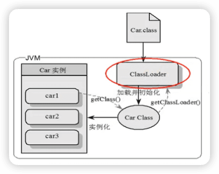

1. class file存在于本地硬盘上，可以理解为设计师在纸上的模板，而最终这个模板在执行的时候是要加载到JVM当中来根据这个文件实例化n个一模一样的实例。
2. class file 加载到JVM中，被称为**DNA元数据模板**，放在方法区。
3. 在.class文件 -> JVM -> 最终成为元数据模板，此过程就要一个运输工具（类装载器Class Loader），扮演一个快递员的角色。

```java
public class HelloLoader {
    public static void main(String[] args) {
        System.out.println("Hello World!");
    }
}
```

用流程图表示上述示例代码：

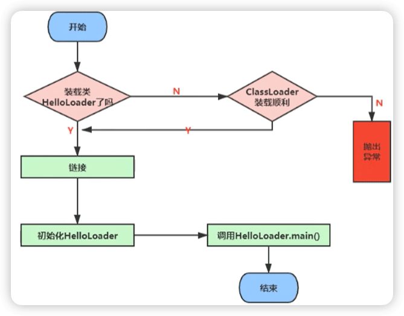

**类的加载过程**分为三个环节：加载 -> 链接 -> 初始化

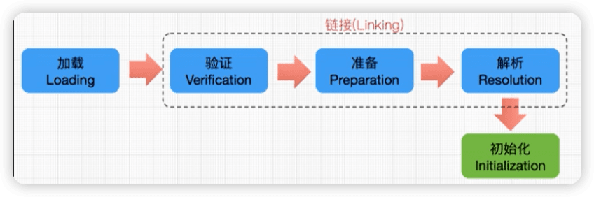

#### 类的加载过程一：加载

1. 通过一个类的全限定名获取定义此类的二进制字节流
2. 将这个字节流所代表的静态存储结构转化为方法区的运行时数据结构
3. **在内存中生成一个代表这个类的java.lang.Class对象**，作为方法区这个类的各种数据的访问入口

补充：加载.class文件的方式

- 从本地系统中直接加载
- 通过网络获取，典型场景：Web Applet
- 从zip压缩包中读取，成为日后jar、war格式的基础
- 运行时计算生成，使用最多的是：动态代理技术
- 由其它文件生成，典型场景：JSP应用
- 从专有数据库中提取.class文件，比较少见
- 从加密文件中获取，典型的防Class文件被反编译的保护措施

#### 类的加载过程二：链接

**jclasslib bytecode viewer**，查看.class文件的工具

主要优点：

1 不需要使用javap指令，使用简单

2 点击字节码指令可以跳转到 java虚拟机规范对应的章节

**Binary Viewer**   **UltraEdit**

魔术，所有能够被Java虚拟机识别字节码文件的有效开头都是（“咖啡宝贝”）：

```
CA FE BA BE
```


1. 验证（Verify）

   目的在于确保Class文件的字节流中包含信息符合当前虚拟机要求，保证被加载类的正确性，不会危害虚拟机自身安全。

   主要包括四种验证：文件格式验证，元数据验证，字节码验证，符号引用验证。

2. 准备（Prepare）：

   为类变量分配内存并且设置该类变量的默认初始值，即零值。

   **这里不包含用final修饰的static，因为final在编译的时候就会分配了，准备阶段会显示初始化**；

   **这里不会为实例便利分配初始化**，类变量会分配在方法区，而实例变量是会随着对象一起分配到Java堆中。

3. 解析（Resolve）：

   将常量池内的符号引用转换为**直接引用**的过程。

   事实上，解析操作往往会伴随着JVM在执行完初始化之后再执行。

   **符号引用**就是一组符号来描述所引用的目标。符号引用的字面量形式明确定义在《java虚拟机规范》的Class文件格式中。

   直接引用就是直接指向目标的指针、相对偏移量或一个间接定位到目标的句柄。

   解析动作主要针对类或接口、字段、类方法、接口方法、方法类型等。对应常量池中的CONSTANT_Class_info、CONSTANT_Fieldref_info、CONSTANT_Methodref_info等。


#### 类的加载过程三：初始化

🔖p30


## 3 运行时数据区概述及线程


P40

## 4 程序计数器   


## 5 虚拟机栈

p44


## 6 本地方法接口

P63

## 7 本地方法栈


## 8 堆

P66


## 9 方法区

P87


## 10 对象的实例化内存布局与访问定位

P102

## 11 直接内存

P107

## 12 执行引擎

p110


## 13 StringTable

P118


## 14 垃圾回收概述

p134


## 15 垃圾回收相关算法

P138

## 16 垃圾回收相关概念

P154


## 17 垃圾回收器

P169


# 二、字节码与类的加载篇

p204

## 1.class文件结构


## 2.字节码指令集与解析举例

P238

## 3.类的加载过程（类的生命周期）

P266

## 4.再谈类的加载器


# 三、性能监控与调优篇

P302 - p381

1 概述


2 JVM监控及诊断工具-命令行


3 JVM监控及诊断工具-GUI


4 JVM运行时参数


5 分析GC日志


6 OOM常见各种场景及解决方案


7 性能优化案例


8 Java代码层及其它层面调优


# 四、大厂面试篇

未更新
