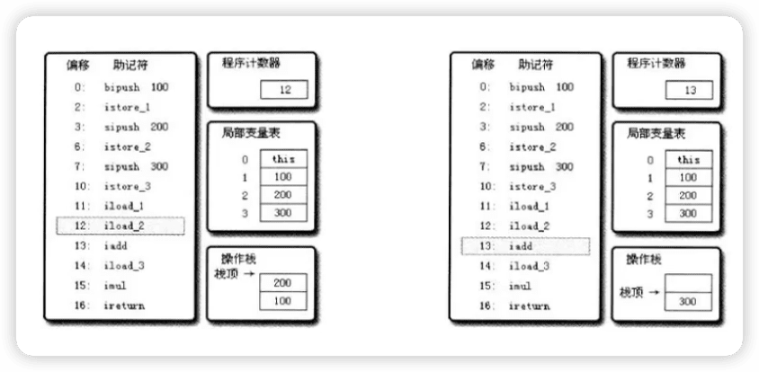
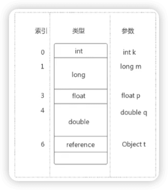
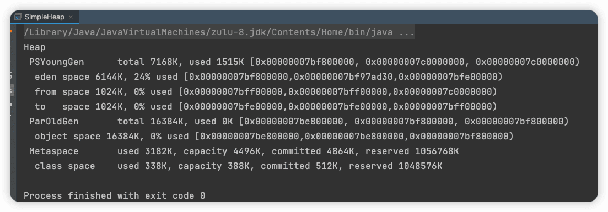
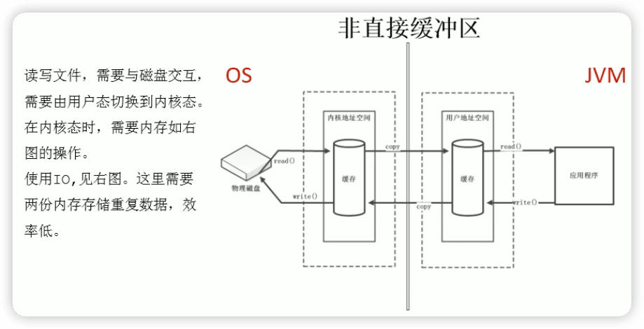
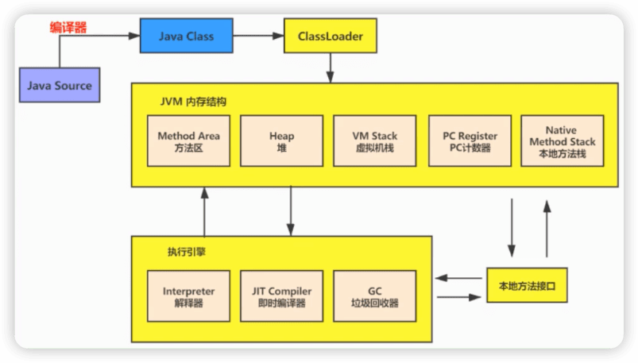
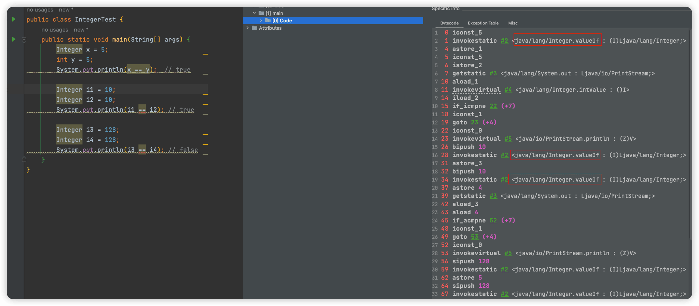
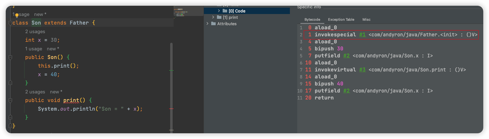

 尚硅谷JVM
----

[尚硅谷宋红康JVM全套教程（详解java虚拟机）](https://www.bilibili.com/video/BV1PJ411n7xZ)

《内存与垃圾回收篇》p1-p203

《字节码与类的加载篇》p204-p301

《性能监控与调优篇》三个篇章 p302-p381

[JVM从入门到精通 · 语雀 ](https://www.yuque.com/u21195183/jvm)

Java8 本课程基于

Java11 LTS


# 一、内存与垃圾回收篇

## 1 JVM与Java体系结构

**你是否也遇到过这些问题？**

- 运行着的线上系统突然卡死，系统无法访问，甚至直接OOM!
- 想解决线 上JVM GC问题，但却无从下于。
- 新项目上线，对各种JVM参数设置一脸茫然，直接默认吧，然后就GG了
- 每次面试之前都要重新背一遍JVM的一些原理概念性的东西，然而面试官却经常问你在实际项目中如何调优JVM参数I 如何解决GC、OON等问题，一脸懵逼。

**架构师每天都在思考什么？**

- 应该如何让我的系统更快？
- 如何避免系统出现瓶颈？

### 参考书籍

[The Java Virtual Machine Specification, Java SE 8 Edition](https://docs.oracle.com/javase/specs/jvms/se8/html/index.html)

[The Java Virtual Machine Specification, Java SE 11 Edition](https://docs.oracle.com/javase/specs/jvms/se11/html/index.html)

《深入理解Java虚拟机》第三版

### Java与JVM简介

世界上没有最好的编程语言，只有最适用于具体应用场景的编程语言。

JS

人工智能 Python

微服务 GO

Java生态圈

####  Java虚拟机规范

The Java Virtual Machine is the cornerstone of the Java platform. It is the component of the technology responsible for its hardware- and operating system- independence, the small size of its compiled code, and its ability to protect users from malicious programs.

The Java Virtual Machine is an abstract computing machine. Like a real computing machine, it has an instruction set and manipulates various memory areas at run time. It is reasonably common to implement a programming language using a virtual machine; the best-known virtual machine may be the P-Code machine of UCSD Pascal.

#### JVM：跨语言的平台

Java：跨平台的语言


（上面的编译器可以称为编译器的前端，Java虚拟机中的解释器、JIT等可称为编译器的后端）

Java虚拟机根本不关心运行在其内部的程序到底是使用何种编程语言编写的，**它只关心 “字节码”文件**。也就是说Java虚拟机拥有语言无关性，并不会单纯地与Java语言 “终身綁定”，只要其他编程语言的编译结果满足并包含Java虚拟机的内部指令集、符号表以及其他的铺助信息，它就是一个有效的字节码文件，就能够被虚拟机所识别并装载运行。

<font color=#FF263D>Java不是最强大的语言，但是JVM是最强大的虚拟机。</font>

> IT领域三大难题：CPU、操作系统、编译器

#### 字节码

- 我们平时说的java字节码，指的是用iava语言编译成的字节码。准确的说任何能在ivm平台上执行的字节码格式都是一样的。所以应该统称为：**jvm字节码**。
- 不同的编译器，可以编译出相同的字节码文件，字节码文件也可以在不同的JVM上运行。
- Java 虚拟机与 Java 语言并没有必然的联系，它只与特定的二进制文件格式—Class文件格式所关联，Class 文件中包含了 Java 虚拟机指令集（或者称为字节码、Bytecodes）和符号表，还有一些其他辅助信息。

####  多语言混合编程

**Java平台上的多语言混合编程正成为主流，通过特定领域的语言去解决特定领域的问题是当前钟件开发应对日趋复杂的项目需求的一个方向。**

试想一下，在一个项目之中，并行处理用Clojure语言编写，展示层使用JRuby/Rails，中间层则是Java，每个应用层都将使用不同的编程语言来完成，而且，接口对每一层的开发者都是透明的，**各种语言之间的交互不存在任何困难，就像使用自己语言的原生API一样方便，因为它们最终都运行在一个虛拟机之上。**

对这些运行于Java虛拟机之上、Java之外的语言，来自系统级的、底层的支持正在迅速增强，以JSR-292为核心的一系列项目和功能改进（如DaVinci Machine 项目、Nashorn引擎、InvokeDynamic指令、java. lang .invoke包等），**推动Java虛拟机从“ Java语言的虚拟机”向“多语言虚拟机”的方向发展**。

#### 如何真正搞懂JVM？

自己动手写Java虚拟机

天下事有难易乎？

为之，则难者亦易矣；不为，则易者亦难矣。


### Java发展的重大事件

- 1990年，在Sun 计算机公司中，由 Patrick Naughton、Mikesheridan 及James Gosling 领导的小组Green ream，开发出的新的程序语言，命名为oak,后期命名为Java
- 1995年，Sun正式发布Java和HotJava产品，Java首次公开完相。
- 1996年1月23日Sun Microsystems发布了JDK 1.0。
- 1998年，JDK 1.2版本发布。同时，sun发布了 JSP/Servlet、EJB规范，以及将Java分成了
  J2EE、J2SE和J2ME。这表明了 Java开始向企业、桌面应用和移动设备应用3大领域挺进。
- 2000年.，JDR 1.3发后.，**Java HotSote virtuaI machin**e正式发布，成为Java的默认虚拟机。
- 2002年，JDK 1.4发布，古老的classic虚拟机退出历史舞台。
- 2003年年底，Java平台的Scala正式发布，同年Groovy也加入了 Java阵营。
- 2004年，JDK 1.5发布。同时JDK 1.5改名为JavaSE 5.0（命名方式的修改，5.0里程碑版本，很多新特性）。
- 2006年，JDK 6发布。同年，Java开源并建立了 **OpenJDK**。顺理成章，Hotspot虚拟机也成为了 OpenJDK中的默认虚拟机。

- 2007年，Java平台迎来了新伙伴**Clojure**。
- 2008 年，oracle 收购了 BEA，得到了 **JRockit** 虚拟机。
- 2009年，Twitter宣布把后台大部分程序从Ruiby迁移到Scala，这是Java平台的又一次
  大规模应用。
- 2010年，Oracle收购了sun，**获得Java商标和最具价值的Hotspot虚拟机**。此时，oracle拥有市场占用率最高的两款虚拟机HotSpot和JRockit，并计划在术来对它们进行整合：HotRockit
- 2011年，JDR7发布。在JDK 1.7u4中，正式启用了**新的垃圾回收器G1**。
- 2017年，JDK9发布。将G1设置为默认GC，替代**CMS**
- 同年，IBM的**J9虚拟机**开源，形成了现在的Open J9社区
- 2018年，Android的Java侵权案判决，Google赔偿oracle计88亿美元
- 同年，oracle宣告JavaEE成为历史名词，JDBC、JMS、Servlet赠了Eclipse基金会
- 同年，JDK11发布，LTS版本的JDK，发布革命性的**ZGC**，调整JDK授权许可
- 2019年，JDK12发布，加入RedHat领导开发的**Shenandoah GC**

###  虚拟机与Java虚拟机

#### 虛拟机

所谓虛拟机 (Virtual Machine)，就是一台虚拟的计算机。它是一款软件，用来执行一系列虚拟计算机指令。大体上，虛拟机可以分为**系统虚拟机**和**程序虚拟机。**

- 大名鼎鼎的Visual Box， VMware就属于系统虚拟机，它们**完全是对****物理计算机的仿真**，提供了一个可运行完整操作系统的软件平台。
- 程序虚拟机的典型代表就是Java虛拟机，它**专门为执行单个计算机程****序而设计**，在Java虚拟机中执行的指令我们称为Java字节码指令。

无论是系统虚拟机还是程序虛拟机，在上面运行的软件都被限制于虚拟机提供的资源中。

#### JVM的位置

JVM是运行在操作系统之上的，它与硬件没有直接的交互。


`.java` 通过javac（前端编译器）生成`.class`。

#### Google的Android系统结构


### JVM的整体结构

P11🔖，整体讲解

JVM结构简图：


### Java代码执行流程


热点代码（可以缓存起来，JIT）

### JVM的架构模型

Java编译器输入的指令流基木上是一种**==基于栈的指令集架构==**（HotSpot），另外一种指令集架构则是**==基于寄存器的指令集架构==**。

具体来说，这两种架构之间的区别：
基于栈式架构的特点

- 设计和实现更简单，适用于资源受限的系统；(每执行一个方法就可以理解为一个入栈操作)
- 避开了寄存器的分配难题：使用**零地址指令**方式分配。
- 指令流中的指令大部分是零地址指令，其执行过程依赖于操作栈。**指令集更小**（指令多），编译器容易实现。
- 不需要硬件支持，可移植性更好，更好实现跨平台

基于寄存器架构的特点

- 典型的应用是x86的二进制指令集：比如传统的x86PC以及Android的Davlik虚拟机。
- 指令集架构则完全依赖硬件，可移植性差
- 性能优秀和执行更高效：
- 花费更少的指令去完成一项操作。
- 在大部分情况下，基于寄存器架构的指令集往往都以**一地址指令、二地址指令和三地址指令**为主，而基于栈式架构的指令集却是以零地址指令为主。

#### 举例


```java
public class StatckStruTest {
    public static void main(String[] args) {
        int i = 2 + 3;
    }
}
```

反编译命令`javap -v StatckStruTest`

上面的结果编译直接得到结果：


如果代码是：

```java
        int i = 2;
        int j = 3;
        int k = i + j;
```

反编译结果：





#### 总结

由于跨平台性的设计，Java的指令都是根据栈来设计的。不同平台CPU架构不同，所以不能设计为基于寄存器的。优点是跨平台，指令集小，编译器容易实现，缺点是性能下降，实现同样的功能需要更多的指令。

**栈：==跨平台性、指令集小、指令多；执行性能比寄存器差==。**

时至今日，尽管嵌入式平台已经不是Java程序的主流运行平台了（准确来说应该是HotSpotvM 的宿主环境己经不局限于嵌入式平台了），那么为什么不将架构更换为基于寄存器的架构呢？

<u>基于栈的架构设计和实现上都比较==简单==；其次是在非资源受限的场景中也是可以用的，也就没有必要更换了。</u>


### JVM的生命周期

#### 虛拟机的启动

Java虛拟机的启动是通过==引导类加载器== (bootstrap class loader)创建个==初始类== (initial class）来完成的，这个类是由虛拟机的具体实现指定的。

#### 虛拟机的执行

- 一个运行中的Java虛拟机有着一个清晰的任务：**==执行Java程序==**。
- 程序开始执行时他才运行，程序结束时他就停止。
- 执行一个所谓的Java程序的时候，真真正正在执行的是一个叫做**==Java虚拟机的进程==**。

#### 虚拟机的退出

有如下的几种情顶：

- 程序正常执行结束
- 程序在执行过程中遇到了异常或错误而异常终止
- 由于操作系统出现错误而导致Java虛拟机进程终止
- 某线程调用Runtime类或System类的exit方法，或 Runtime类的halt方法，并且Java安全管理器也允许这次exit或halt操作。
- 除此之外，==JNI==(Java Native Interface)规范描述了用JNI Invocation API来加载或卸载 Java虚拟机时，Java虚拟机的退出情况。

### JVM的发展历程

#### Sun Classic VM

- 早在1996年Java1.0版本的时候，sun公司发布了一款名为sun classic VM的Java虚拟机，它同时也是**==世界上第一款商用Java虚拟机==**，JDK1.4时完全被淘汰。
- 这款虚拟机内部**只提供解释器**。（解释器逐行解释，效率比较低下）
- 如果使用JIT编译器，就需要进行外挂。但是一旦使用了JIT编译器，JIT就会接管虛拟机的执行系统。解释器就不再工作。解释器和编译器不能配合工作。
- 现在hotspot内置了此虚拟机。

比喻：

步行   解释器

公交车  编译器


#### Exact VM

- 为了解决上一个虚拟机问题，jak1.2时，sun提供了此虚拟机。

- Exact Memory Management：**准确式内存管理**，也可以叫Non-Conservative/Accurate Memory Management，虛拟机可以知道内存中某个位置的数据具体是什么类型
  
- 具备现代高性能虛拟机的雏形
  热点探测

  编译器与解释器混合工作模式

- 只在Solaris平台短暂使用，其他平台上还是classic vm
  英雄气短，终被Hotspot虚拟机替换

#### SUN公司的Hotspot VM

- Hotspot历史
  + 最初由一家名为“Longview Technologies"的小公司设计
  + 1997年，此公司被sun收购;2009年，sun公司被甲骨文收购。
  + JDK1 .3时，Hotspot V成为默认虚拟机
  
- **目前Hotspot占有绝对的市场地位，称霸武林。**
  + 不管是现在仍在广泛使用的JDK6，还是使用比例较多的JDK8中，默认的虚拟机都是HotSpot
  + Sun/oracle JDK 和openJDK的默认虚拟机
  + 因此本课程中默认介绍的虛拟机都是Hotspot，相关机制也主要是指Hotspot的GC机制。(比如其他两个商用虚拟机都没有**方法区**的概念）
  
- 从服务器、桌面到移动端、嵌入式都有应用。

- 名称中的HotSpot指的就是它的**热点代码探测技术**。
  + 通过计数器找到最具编译价值代码，触发即时编译或栈上替换
  
  + 通过编译器与解释器协同工作，在最优化的最佳执行性能与程序响应时间中取得平衡
  
    编译器 - 最佳执行性能
  
    解释器 - 响应时间

#### BEA的JRockit

- **专注于==服务器端==应用**
  它可以不太关注程序启动速度，因此JRockit内部**不包含解析器实现**，全部代码都靠即时编译器编译后执行。
  
- 大量的行业基准测试显示，**JRockit JVM是世界上最快的JVM**。
  使用JRockit产品，客户己经体验到了显著的性能提高（一些超过了70%）和硬件成木的减少（达50%）
  
- 优势：全面的Java运行时解决方案组合
  JRockit面向延迟敏感型应用的解决方案JRockit Real Time提供以毫秒或微秒级的JVM响应时间，适合财务、军事指挥、电信网络的需要
  
  **Mission Control**服多套件，它是一组以极低的开销来监控、管理和分析生产环境中的应用程序的工具。[JDK Mission Control（JMC）](https://www.oracle.com/java/technologies/downloads/tools/#JMC)
  
- 2008年，BEA被oracle收购。

- Oracle表达了整合两大优秀虚拟机的工作，大致在JDK 8中完成。整合的方式是在Hotspot的基础上，移植JRockit的优秀特性。

- 高斯林：目前就职于谷歌，研究人工智能和水下机器人

#### IBM 的 J9

- 全称：IBM Technology for Java Virtual Machine， 简称IT4J，内部代号：J9
- 市场定位与Hotspot接近，服务器端、桌面应用、嵌入式等多用途VM
- 广泛用于IBM的各种Java产品。
- 目前，有影响力的==三大商用虚拟机==（J9、JRockit、Hotspot）之一，也号称是世界上最快的Java虛拟机。
- 2017年左右，IBM发布了开源J9 VM，命名为OpenJ9，交给EClipse基金会管理，也称为 [Eclipse OpenJ9](https://github.com/eclipse-openj9/openj9)

#### KVM和CDC/CLDC Hotspot

- oracle在Java ME产品线上的两款虛拟机为： CDC/CLDC Hotspot Implementation VM
- KVM (Kilobyte）是CLDC-HI早期产品
- 日前移动领域地位尴尬，智能于机被Android和ios二分天下。
- KVM简单、轻量、高度可移植，而向更低端的设各上还维持自己的一片市场智能控制器、传感器，老人手机、经济欠发达地区的功能手机
- 所有的虚拟机的原则：一次编译，到处运行。

#### Azul VM

- 前面三大 “高性能Java虛拟机”使用在通用硬件平台上
- 这里AZuI VN和BEA Liguid VM是**与特定硬件平台鄉定、软硬件配合的专有虚拟机**，高性能Java虚拟机中的战斗机。
- Azul VM是Azul systems公司在Hotspot基础上进行大量改进，运行于Azul systems公司的专有硬件Vega系统上的Java虛拟机。
- **每个AzuL VM实例都可以管理至少数十个CPU和数百GB内存的硬件资源，并提供在巨大内存范围内实现可控的GC时间的坟圾收集器、专有硬件优化的线程调度等优秀特性**
- 2010年，Azul systems公司开始从硬件转向软件，发布了自己的**Zing JVM**（==低延迟==、快速预热），可以在通用x86平台上提供接近于Vega系统的特性。

#### Liquid VM

- 高性能Java虛拟机中的战斗机。
- BEA公司开发的，直接运行在自家Hypervisor系统上
- Liquid VM即是现在的JRockit VE (Virtual Edition) ，**Liguid VM不需要操作系统的支持，或者说它自己本身实现了一个专用操作系统的必要功能，如线程调度、文件系统、网络支持等**。
- 随着JRockit虚拟机终止开发，Liquid VM项目也停止了。

#### Apache Harmony

- Apache也曾经推出过与JDK 1.5和JDR 1.6兼容的Java运行平台Apache Harmony。
- 它是IBM和Intel联合开发的开源JVM，受到同样开源的openJDK的压制，Sun坚决不让Harmony获得==JCP==认证，最终于2011年退役，IBN转而参与openJDK
- 虽然目前并没有Apache Harmony被大规模商用的案例，但是**它的Java类库代码吸纳进了==Android SDK==**。

#### Microsoft JVM

- 微软为了在IE3浏览器中支持Java Applets， 开发了Microsoft JVM。
- 只能在window平台下运行。但确是当时windows下性能最好的Java VM。
- 1997年，sun以侵犯商标、不正当竞争罪名指控微软成功，赔了sun很多钱。微软在WindowsXP SP3中抹掉了其VM。现在windows上安装的jdk都是HotSpot。

#### TaobaoJVM

- 由AliJVM团队发布。阿里，国内使用Java最强大的公司，覆盖云计算、金融、物流、电商等众多领域，需要解决高并发、高可用、分布式的复合问题。有大量的开源产品。
- **基于openJDK 开发了自己的定制版本AlibabaJDK**，简称==AJDK==。是整个阿里Java体系的基石。
- 基于OpenJDK Hotspot VM 发布的国内第一个优化、**深度定制且开源的高性能服务器版Java虚拟机**。
  + 创新的GCIH (GC invisible heap）技术实现了==off-heap==，即**将生命周期较长的Java对象从heap中移到heap之外，并且GC不能管理GCIH内部的Java对象，以此达到降低GC的回收频率和提升GC的回收效率的目的。**
  + GCIH 中的**对象还能够在多个Java虚拟机进程中实现共享**
  + 使用crc32指令实现 JVM intrinsic 降低JNI 的调用开销
  + PMU hardware 的Java profiling tool 和诊断协助功能
  + 针对大数据场景的ZenGC
- taobao vm应用在阿里产品上性能高，硬件严重依赖intel的cpu，损失了兼容性，但提高了性能
  目前己经在淘宝、天猫上线，把oracle 官方JVM 版本全部替换了。

#### Dalvik VM

- 谷歌开发的，应用于Android系统，并在Android2.2中提供了JIT，发展迅猛。

- **Dalvik VM 只能称作虚拟机，而不能称作 “Java 虚拟机”**，它没有遵循 Java虛拟机规范

- 不能直接执行 Java 的 class文件

- 基于==寄存器架构==，不是jvm的栈架构。

- 执行的是编译以后的**==dex== (Dalvik Executable）**（类似class文件，由其转化过来的）文件。执行效率比较高。
  它执行的dex (Dalvik Executable）文件可以通过class文件转化市来，使用Java语法编写应用程序，可以直接使用大部分的Java AFI等。
  
- Android 5.0 使用支持**提前编译** (Ahead Of Time compilation, ==AOT==)的==ART VM==替换Dalvik VM

  AOT的意思是java源代码不经过字节码文件，直接编译成机器指令。

> 具体JVM的内存结构，其实取决于其实现，不同厂商的JVM，或者同一厂商发布的不同版本，都有可能存在一定差异。**本套课程主要以Oracle Hotspot VM为默认虚拟机。**

#### Graal VM

- 2018年4月，Oracle Labs公开了Graal VM, 号称"**Run Programs Faster Anywhere**"，勃勃野心。与1995年java的”write once, run anywhere"遥相呼应。
- Graal VM在Hotspot VM基础上增强而成的**跨语言全栈虚拟机，可以作为“任何语言”的运行平台使用**。语言包括：Java、scala、 Groovy、Kotlin；C、 C++、Javascript、 Raby、 Python、 R等。
- 支持不向语言中混用对方的校口和对象，支持这些语言使用已经编写好的本地库文件
- 工作原理是将这些语言的源代码或源代码编译后的中间格式，通过解释器转换为能被Graal VM接受的中间表示。Graal VM 提供Truffle工具集快速构建面问一种新语言的解释器。在运行时还能进行即时编译优化，获得比原生编译器更优秀的执行效率。
- **如果说Hotspot有一天真的被取代，Graal VM希望最大**。但是Java的软件生态没有丝毫变化。

https://github.com/oracle/graal

https://www.graalvm.org/

## 2 类加载子系统

🔖P26 整体讲解过程

字节码文件之后虚拟机负责

方法区是HopSpot特有的


如果手写一个Java虚拟机，主要考虑哪些结构呢？

**类加载器和执行引擎**

> 章节内容
>
> 2 类加载子系统
>
> 3-10 运行时数据区

### 类加载器子系统作用

- 类加载器子系统负责从文件系统或网络中加载Class文件，class文件在文件开头有**==特定的文件标识==**。
- ClassLoader只负责class文件的加载，至于它是否可以运行，则有**Execution Engine**决定。
- 加载的类信息存放于一块称为方法区的内存空间。除了类信息外，方法区中还会存放**运行时常量池**信息，可能还包括<u>字符串面量和数字常量</u>（Class文件中常量池部分的内存映射，也就是<u>class文件中常量池加载到内存中就是运行时常量池</u>）。

举例说明：

 

1. class file存在于本地硬盘上，可以理解为设计师在纸上的模板，而最终这个模板在执行的时候是要加载到JVM当中来根据这个文件实例化n个一模一样的实例。
2. class file 加载到JVM中，被称为**DNA元数据模板**，放在方法区。
3. 在.class文件 -> JVM -> 最终成为元数据模板，此过程就要一个运输工具（类装载器Class Loader），扮演一个快递员的角色。

```java
public class HelloLoader {
    public static void main(String[] args) {
        System.out.println("Hello World!");
    }
}
```

用流程图表示上述示例代码：


**类的加载过程**分为三个环节：加载 -> 链接 -> 初始化


#### 类的加载过程一：加载（loading）

> 【类的加载过程】是一个大的概览，其中第一步也叫加载。

1. 通过一个类的**全限定名**获取定义此类的**二进制字节流**
2. 将这个字节流所代表的静态存储结构转化为方法区的运行时数据结构（7及其之前叫**永久代**，之后叫**元空间**）
3. **在内存中生成一个代表这个类的java.lang.Class对象**，作为方法区这个类的各种数据的访问入口

补充：加载.class文件的方式

- 从本地系统中直接加载
- 通过网络获取，典型场景：Web Applet
- 从zip压缩包中读取，成为日后jar、war格式的基础
- 运行时计算生成，使用最多的是：动态代理技术
- 由其它文件生成，典型场景：JSP应用
- 从专有数据库中提取.class文件，比较少见
- 从加密文件中获取，典型的防Class文件被反编译的保护措施

#### 类的加载过程二：链接（Linking）

**jclasslib bytecode viewer**，查看.class文件的工具

**Binary Viewer**   **UltraEdit**

都有IDEA插件

主要优点：

1 不需要使用`javap`指令，使用简单

2 点击字节码指令可以跳转到 java虚拟机规范对应的章节


魔术，所有能够被Java虚拟机识别字节码文件的有效开头都是（“咖啡宝贝”）：

```
CA FE BA BE
```


1. 验证（Verify）

   目的在于确保Class文件的字节流中包含信息符合当前虚拟机**要求**，保证被加载类的**正确性**，不会危害虚拟机自身安全。

   主要包括四种验证：**文件格式验证，元数据验证，字节码验证，符号引用验证**。

2. 准备（Prepare）：

   为类变量分配内存并且设置该==类变量==的默认初始值，即零值。

   ```JAVA
   private static int a = 1;  // prepare: a = 0  --> initial: a = 1
   ```

   **这里不包含用final修饰的static，因为final在编译的时候就会分配了（常量），准备阶段会显示初始化**；

   **这里不会为实例变量分配初始化**，类变量会分配在方法区，而实例变量是会随着对象一起分配到Java堆中。

3. 解析（Resolve）：

   将常量池内的**==符号引用==**转换为**==直接引用==**的过程。

   事实上，解析操作往往会伴随着JVM在执行完<u>初始化之后再执行</u>。

   **符号引用**就是一组符号来描述所引用的目标。符号引用的字面量形式明确定义在《java虚拟机规范》的Class文件格式中。（理解为字符串，能根据这个字符串定位到指定的数据，比如java/lang/StringBuilder）

   

   直接引用就是直接指向目标的指针、相对偏移量或一个间接定位到目标的句柄。（内存地址）
   
   解析动作主要针对<u>类或接口、字段、类方法、接口方法、方法类型</u>等。对应常量池中的CONSTANT_Class_info（类符号）、CONSTANT_Fieldref_info（属性符号）、CONSTANT_Methodref_info（方法符号）等。

​	

#### 类的加载过程三：初始化（initialization）

- 初始化阶段就是执行**==类构造器方法==**`<clinit>()`的过程。（注意**==实例构造器==**`＜init＞()`区分）

- 此方法不需定义，是javac编译器自动收集类中的所有类变量的赋值动作和静态代码块中的语句合并而来。（如果没有类变量和静态块，就没有类构造器方法）

  

- 构造器方法中指令按语句在<u>源文件中出现的顺序执行</u>。

- `<clinit>()`不同于类的构造器。（关联：构造器是虛拟机视角下的`<init>()`)

- 若该类具有父类，JVM会保证子类的`<clinit>()`执行前，父类的`<clinit>()`己经执行完毕。

​	

- 虚拟机必须保证一个类的`<clinit>()`方法在多线程下被同步加锁。

  ```java
  /**
   * 只有一个线程执行DeadThread的类构造器<clinit>()
   * @author andyron
   **/
  public class DeadThreadTest {
      public static void main(String[] args) {
          Runnable r = () -> {
              System.out.println(Thread.currentThread().getName() + "开始");
              DeadThread dead = new DeadThread();
              System.out.println(Thread.currentThread().getName() + "结束");
          };
          Thread t1 = new Thread(r, "线程1");
          Thread t2 = new Thread(r, "线程2");
          t1.start();
          t2.start();
      }
  }
  class DeadThread {
      static {
          if (true) {
              System.out.println(Thread.currentThread().getName() + "初始化当前类");
              while (true) {
              }
          }
      }
  }
  ```

  


### 类加载器的分类

- JVM支持两种类型的类加载器，分别为**引导类加载器 (Bootstrap ClassLoader）**和**自定义类加载器 (User-Defined classLoader)**。

- 从概念上来讲，自定义类加载器一般指的是程序中由开发人员自定义的一类类加载器，但是Java虚拟机规范却没有这么定义，而是将所有派生于抽象类`Classloader`的类加载器都划分为自定义加载器。

- 无论类加载器的类型如何划分，在程序中我们最常见的类加载器始终只有3个，如下所示：


```java
sun.misc.Launcher$ExtClassLoader
sun.misc.Launcher$AppClassLoader
```

```java
public class ClassLoaderTest {
    public static void main(String[] args) {
        // 获取启动类加载器
        ClassLoader systemClassLoader = ClassLoader.getSystemClassLoader();
        System.out.println(systemClassLoader);  // sun.misc.Launcher$AppClassLoader@18b4aac2

        // 获取其上层：扩展类加载器
        ClassLoader extClassLoader = systemClassLoader.getParent();
        System.out.println(extClassLoader);  // sun.misc.Launcher$ExtClassLoader@6bc7c054

        // 获取其上层：获取不到引导类加载器
        ClassLoader bootstrapClassLoader = extClassLoader.getParent();
        System.out.println(bootstrapClassLoader);  // null

        // 对于用户自定义来说：默认使用系统类加载器进行加载
        ClassLoader classLoader = ClassLoaderTest.class.getClassLoader();
        System.out.println(classLoader);  // sun.misc.Launcher$AppClassLoader@18b4aac2

        // String类使用引导类加载器进行加载的  ---> Java的核心类库是使用引导类加载器进行加载的
        ClassLoader classLoader1 = String.class.getClassLoader();
        System.out.println(classLoader1);   // null
    }
}
```


#### 启动类加载器（引导类加载器，Bootstrap ClassIoader)

- 这个类加载使用C/C++语言实现的，嵌套在JVM内部。

- 它用来加载Java的校心库 (JAVA HOME/jre/lib/rt.jar、resources.jar或sun.boot.ciass.path路径下的内容)，用于提供JVM自身需要的类

- 并不继承自java.lang.classLoader，没有父加载器。

- 加载扩展类和应用程序类加载器，并指定为他们的父类加载器。

- 出于交全考虑，Bootstrap启动类加载器只加载包名为java、javax、sun等开头的类

#### 扩展类加载器 (Extension ClassLoader)

- Java语言编写，由`sun.misc.Launcher$ExtclassLoader`实现。

- 派生于ClassLoader类

- 父类加载器为启动类加载器

- 从`java.ext.dirs`系统属性所指定的目录中加载类库，或从JDK的安装目录的`jre/lib/ext`子目录（扩展目录）下加载类库。<u>如果用户创建的JAR放在此目录下，也会自动由扩展类加载器加载</u>。

#### 应用程序类加载器（系统类加载器，AppClassLoader）

- Java语言编写，由`sun.misc.Launcher$AppclassLoader`实现

- 派生于ClassLoader头

- 父类加载器为扩展类加载器

- 它负责加载环境变量classpath或系统属性`java.class.path`指定路径下的类库

- 该类加载是==程序中默认的类加载器==，一般来说，Java应用的类都是由它来完成加载

- 通过`ClassLoader#getsystemclassLoader()`方法可以获取到该类加载器

#### 用户自定义类加载器

- 在Java的日常应用程序开发中，类的加载几乎是由上述3种类加载器相互配合执行的，在必要时，我们还可以自定义类加载器，来定制类的加载方式。
- 为什么要自定义类加裁器？
  + 隔离加载类
  + 修改类加载的方式
  + 扩展加载源
  + 防止源码泄露。加密后再自定义加载器中实现解密

用户自定义类加载器实现步骤：

1. 开发人员可以通过继承抽象类`java.lang.ClassLoader`类的方式，实现自己的类加载器，以满足一些特殊的需求；

2. 在JDK1.2之前，在自定义类加载器时，总会去继承CLassLoader类并重写loadClass()方法，从而实现自定义的类加载类，但是在JDK1.2之后己不再建议用户去覆盖loadClass()方法，而是建议把自定义的类加载逻辑写在`findclass()`方法中；

3. 在编写自定义类加载器时，如果没有太过于复杂的需求，可以直接继承`URLClassLoader`类，这样就可以避免自己去编写findClass()方法及其获取字节码流的方式，使自定义类加载器编写更加简洁。

### 关于ClassLoader

ClassLoader，抽象类，除了启动类加载器的所有类加载器都是继承自它。


`sun.misc.Laucher`是一个Java虚拟机的入口应用。

### 获取ClassLoader的途径


### 双亲委派机制

Java虛拟机对class文件采用的是按需加载的方式，也就是说当需要使用该类时才会将它的class文件加载到内存生成class对象。而且加载某个类的class文件时，Java虚拟机来用的是双亲委派模式，即把请求交由父类处理，它是一种任务委派模式。

工作原理：

1. 如果一个类加载器收到了类加载请求，它并不会自己先去加载，而是把这个请求委托给父类的加载器去执行；

2. 如果父类加载器还存在其父类加载器，则进一步向上委托，依次递归，请求最终将到达顶层的启动类加载器；

3. 如果父类加载器可以完成类加载任务，就成功返回，倘若父类加载器无法完成此加载任务，子加载器才会尝试自己去加载，这就是==双亲委派模式==（parents delegation model）。


虽然自定了`java.lang.String`，但最终还是由引导类加载器加载jdk中的。


```java
 				/*
        默认你系统类加载器询问上一级扩展类加载器：你需要加载StringTest；
        扩展类加载器询问上一级启动类加载器：你需要加载StringTest；
        启动类加载器说不需要 -> 扩展类加载器也说不需要 -> 系统类加载器说那还是我来吧
         */
        StringTest test = new StringTest();
        System.out.println(test.getClass().getClassLoader());
```


spi相关接口有引导类加载器加载，实现类有系统类加载器加载。

#### 优势

- 避免类的重复加载
- 保护程序安全，防止核心API被随意篡改

```
java.lang.SecurityException: Prohibited package name: java.lang
```


### 沙箱安全机制

自定义String类，但是在加载自定义String类的时候会率先使用引导类加载器加载，而引导类加载器在加载的过程中会先加载jdk自带的文件(rt.jar包中`java\lang\String.class`)，报错信息说没有main方法，就是因为加载的是rt.jar包中的String类。这样可以保证对java核心源代码的保护，这就是==沙箱安全机制==。

### 其它

- 在JVM中表示两个class对象是否为同一个类存在两个必要条件：
  - 类的完整类名必须一致，包括包名。
  - 加载这个类的ClassLoader (指CLassLoader实例对象）必须相同。
- 换句话说，在JVM中，即使这两个类对象(class对象)来源同一个Class文件，被同一个虚拟机所加载，但只要加载它们的ClassLoader实例对象不同，那么这两个类对象也是不相等的。


JVM必须知道一个类型是由启动加载器加载的还是由用户类加载器加载的。如果一个类型是由用户类加载器加载的，那么JVM会**将这个类加载器的一个引用作为类型信息的一部分保存在方法区中**。<u>当解析一个类型到另一个类型的引用的时候，JVM需要保证这两个类型的类加载器是相同的。</u>


Java程序对类的使用方式分为：主动使用和被动使用。

主动使用（就是进行初始化了，类变量和静态类块运行了），又分为七种情况：

- 创建类的实例
- 访问某个类或接口的静态变量，或者对该静态变量赋值
- 调用类的静态方法
- 反射（比如： `Class.forName ("com.andyron.Test")`)
- 初始化一个类的子类
- Java虚拟机启动时被标明为启动类的类
- JDK 7开始提供的动态语言支持：
   `java.lang.invoke.MethodHandle`实例的解析结果
   REF_getstatic、 REF_putstatic、 REE_invokestatic句柄对应的类没有初始化，则初始化

除了以上七种情况，其他使用Java类的方式都被看作是对类的被动使用，都不会导致类的初始化。

## 3 运行时数据区概述及线程

内存是非常重要的系统资源，是硬盘和CPU的中间仓库及桥梁，承载着操作系统和应用程序的实时运行。JVM内存布局规定了Java在运行过程中内存申请、分配、管理的策略，保证了JVM的高效稳定运行。不同的JVM对于内存的划分方式和管理机制存在着部分差异。结合JVM虚拟机规范，来探讨下经典的JVM内存布局。


Java虚拟机定义了若干种程序运行期间会使用到的运行时数据区，其中有一些会随者虛拟机启动而创建，随着虛拟机退出而销毁。另外一些则是与线程一一对应的，这些与线程对应的数据区域会随着线程开始和结束而创建和销毀。

灰色的为单独线程私有的，红色的为多个线程共享的。即：

- 每个线程：独立包括程序计数器、栈、本地栈。
- 线程间共享：堆、堆外内存（永久代或元空间、代码缓存）


垃圾回收95%在堆区，5%在方法区。

一个JVM实例就对应一个`java.lang.Runtime`实例。

### 线程

- 线程是一个程序里的运行单元。JVM允许一个应用有多个线程并行的执行。

- 在Hotspot JVM里，<u>每个线程都与操作系统的本地线程直接映射</u>。

  当一个Java线程准备好执行以后，此时一个操作系统的本地线程也同时创建。Java线程执行终止后，本地线程也会回收。

- 操作系统负责所有线程的安排调度到任何一个可用的CPU上。一旦本地线程初始化成功，它就会调用Java线程中的run()方法。

守护线程、普通线程


- 如果你使用jconsole或者是任何一个调试工具，都能看到在后台有许多线程在运行。这些后台线程不包括调用`public static void main (string [])`的main线程以及所有这个main线程自己创建的线程。

- 这些主要的后台系统线程在Hotspot JVM里主要是以下儿个：
  + 虚拟机线程：这种线程的操作是需要JVM达到安全点才会出现。这些操作必须在不同的线程中发生的原因是他们都需要JVM达到安全点，这样堆才不会变化。这种线程的执行类型包括“stop-the-world的垃圾收集，线程栈收集，线程挂起以及偏向锁撒销。
  + 周期任务线程：这种线程是时间周期事件的体现（比如中断），他们一般用于周期性操作的调度执行。
  + GC线程：这种线程对在JVM里不同种类的垃圾收集行为提供了支持。
  + 编译线程：这种线程在运行时会将字节码编译成到本地代码。
  + 信号调度线程：这种线程接收信号并发送给JVM，在它内部通过调用适当的方法进行处理。

## 4 程序计数器（PC寄存器）

>  GC、OOM都没有  

### 4.1 介绍

[The pc Register](https://docs.oracle.com/javase/specs/jvms/se8/html/jvms-2.html#jvms-2.5.1)

JVM中的程序计数寄存器 (Program counter Register）中， Register的命名源于CPU的寄存器，寄存器存储指令相关的现场信息。CPU只有把数据装载到寄存器才能够运行。

这里，并非是广义上所指的物理奇存器，或许将其翻译为**PC计数器**(或指令计数器）会更加贴切(也称为**程序钩子**），并且也不容易引起一些不必要的误会。JVM中的PC寄存器是对物理PC寄存器的一种抽象模拟。


作用：PC寄存器用于存储指向下一条指令的地址，也即将要执行的指令代码。由执行引擎读取下一条指令。


- 它是一块很小的内存空间，几乎可以忽略不记。也是运行速度最快的存储区域。

- 在JVM规范中，每个线程都有它自己的程序计数器，是线程私有的，生命周期与线程的生命周期保持一致。

- 任何时间一个线程都只有一个方法在执行，也就是所谓的**当前方法**。程序计数器会存储当前线程正在执行的Java方法的JVM指令地址；或者，如果是在执行native方法，则是未指定值 (undefined)。
- 它是程序控制流的指示器。分支、循环、跳转、异常处理、线程恢复等基础功能都需要依赖这个计数器来完成。
- 字节码解释器工作时就是通过改变这个计数器的值来选取下一条需要执行的字节码指令。
- 它是唯一一个在Java虚拟机规范中没有规定任何OutOfMemoryError情况的区域。

```java
    public static void main(String[] args) {
        int i = 10;
        int j = 20;
        int k = i + j;

        String s = "abc";
        System.out.println(i);
        System.out.println(k);
    }
```


### 两个常见问题

1. 使用PC寄存器存储字节码指令地址有什么用呢？

   为什么使用PC寄存器记录当前线程的执行地址呢？

因为CPU需要不停的切换各个线程，这时候切换回来以后，就得知道接着从哪开始继续

执行。

JVM的字节码解释器就需要通过改变PC奇存器的值来明确下一条应该执行什么样的字节

码指令。

2. PC寄存器为什么会被设定为线程私有？

我们都知道所谓的多线程在一个特定的时间段内只会执行其中某一个线程的方法，CPU会不停地做任务切换，这样必然导致经常中断或恢复，如何保证分毫无差呢？<u>为了能够准确地记录各个线程正在执行的当前字节码指令地址，最好的办法自然是为每一个线程都分配一个PC奇存器</u>，这样一来各个线程之间便可以进行独立计算，从而不会出现相互干扰的情況。

由于CPU时间片轮限制，众多线程在并发执行过程中，任何一个确定的时刻，一个处理器或者多校处理器中的一个内核，只会执行某个线程中的一条指令。

这样必然导致经常中断或恢复，如何保证分毫无差呢？每个线程在创建后，都会产生自己的程序计数器和栈帧，程序计数器在各个线程之间互不影响。


并行：vs串行

并发：

> CPU时间片
>
> CPU 时间片即 CPU 分配给各个程序的时间，每个线程被分配一个时间段，称作它的时间片。
>
> 在宏观上：我们可以同时打开多个应用程序，每个程序并行不悖，同时运行。
>
> 但在微观上：由于只有一个CPU，一次只能处理程序要求的一部分，如何处理公平，一种方法就是引入时间片，每个程序轮流执行。
>
> 


## 5 虚拟机栈❤️

### 5.1 概述

虚拟机栈出现的背景：

由于跨平台性的设计，Java的指令都是根据栈来设计的。不同平台CPU架构不同，所以不能设计为基于寄存器的。**优点是跨半台，指令集小，编译器容易实现，缺点是性能下降，实现同样的功能需要更多的指令。**


内存中的栈与堆：

**栈是运行时的单位，而堆是存储的单位。**

即：栈解决程序的运行问题，即程序如何执行，或者说如何处理数据。堆解决的是数据存储的问题，即数据怎么放、放在哪儿。


虚拟机栈基本内容

- Java虚拟机栈是什么？

  Java虚拟机栈 (Java Virtual Machine stack)，早期也叫Java栈。每个线程在创建时都会创建一个虛拟机栈，其内部保存一个个的**栈帧(stack Frame）**，对应着一次次的Java方法调用。

  是线程私有的

- 生命周期
  生命周期和线程一致。

- 作用
  主管Java程序的运行，它保存方法的局部变量（8种基本数据类型、对象的引用地址）、部分结果，并参与方法的调用和返回。

  局部变量 vs 成员变量（或属性）

  基本数据类型 vs 引用类型变量（类、数组、接口）


- 栈的特点（优点）
  + 栈是一种快速有效的分配存储方式，访问速度仅次于程序计数器
  + JVM直接堆Java栈的操作只有两个：每个方法执行，伴随着进栈（入栈、压栈）；执行结束后的出栈工作
  + 不存在垃圾回收问题


栈中可能出现的异常

Java 虚拟机规范允许Java栈的大小是动态的或者是固定不变的。

- 如果采用固定大小的Java虚拟机栈，那每一个线程的Java虚拟机栈容量可以在线程创建的时候独立选定。如果线程请求分配的栈容量超过Java虚拟机栈允许的最大容量，Java虚拟机将会抛出一个`StackoverflowError` 异常。

- 如果Java虚拟机栈可以动念扩展，并且在尝试扩展的时候无法申请到足够的内存，或者在创建新的线程时没有足够的内存去创建对应的虚拟机栈，那Java虛拟机将会抛出一个`OutOfMemoryError` 异常。

- 通过参数`-Xss`选项来设置线程的最大栈空间，栈的大小直接决定了函数调用的最大可达深度

```java
/**
 * 演示栈中的异常：StackOverflowError
 * @author andyron
 *
 * 默认情况下：count 19600
 * 设置栈的大小：-Xss640k ，count缩小为为3221
 **/
public class StatckErrorTest2 {
    private static int count = 1;
    public static void main(String[] args) {
        System.out.println(count);
        count++;
        main(args);
    }
}
```

> - 在单个线程下，栈帧太大，或者虚拟机栈容量太小，当内存无法分配的时候，虚拟机抛出StackOverflowError 异常。
> - 不断地建立线程的方式会导致OOM。
> - 如果是StackOverflowError，检查代码是否递归调用方法等
> - 如果是OutOfMemoryError，检查是否有死循环创建线程等

### 5.2 栈的存储单位

#### 栈中存储什么？

每个线程都有自己的栈，栈中的数据都是以栈帧(Stack Frame）的格式存在。在这个线程上正在执行的每个方法都各自对应一个栈帧 (stack Frame）。

栈帧是一个内存区块，是一个数据集，维系着方法执行过程中的各种数据信息。

#### 栈运行原理

- JVM直按对Java栈的操作只有两个，就是对栈帧的压栈和出栈，遵循“先进后出”，“后进先出” 原则。

- 在一条活动线程中，一个时间点上，只会有一个活动的栈帧。即只有当前正在执行的方法的栈帧（栈顶栈帧）是有效的，这个栈帧被称为==当前栈帧(current Frame）==，与当前栈帧相对应的方法就是==当前方法 (Current Method）==，定义这个方法的类就是==当前类(Current Class)==。

- 执行引擎运行的所有字节码指令只针对当前栈帧进行操作。

- 如果在该方法中调用了其他方法，对应的新的栈帧会被创建出来，放在栈的顶端，成为新的当前帧。


- 不同线程中所包含的栈帧是不允许存在相互引用的，即不可能在一个栈帧之中引用另外一个线程的栈帧。
- 如果当前方法调用了其他方法，方法返回之际，兰前栈帧会传口此方法的技行結果给前一个栈帧，接着，虛拟机会丢弃当前栈帧，使得前一个栈帧重新成为当前栈帧。
- Java方法有两种返回函数的方式，==一种是正常的函数返回，使用return指令；另外一种是抛出异常。不管使用哪种方式，都会导致栈帧被弹出。==


> 返回不同的类型在字节码有不同的返回指令：
>
> ```
> 46: return
> 28: ireturn
> 21: dreturn
> ```

#### 栈帧的内部结构

每个栈帧中存储着：

- ==局部变量表 (Local Variables, LV)==
- ==操作数栈 (operand stack, OS）（或表达式栈）==
- 动态链接 (Dynamic Linking, DL）（或指向运行时常量池的方法引用）
- 方法返回地址(Return Address, RA）（或方法正常退出或异常退出的定义)
- 一些附加信息


栈帧的大小决定了，栈中可以存放多少栈帧。

> 有的地方把后三个统称为**帧数据区**。

### 5.3 局部变量表

- 局部变量表(Local Variables)也被称之为局部变量数组或本地变量表

- 定义为一个==数字数组==，主要用于存储方法参数和定义在方法体内的局部变量，这些数据类型包括各类基本数据类型、对象引用(reference），以及returnAddress类型。

- 由于局部变量表是建立在线程的栈上，是线程的私有数据，因此**不存在数据安全问题**

- 局部变量表所需的容量大小是在**编译期确定**下来的，并保存在方法的Code属性的maximum local variables数据项中。**在方法运行期间是不会改变**局部变量表的大小的。

```java
    public static void main(String[] args) {
        LocalVariablesTest test = new LocalVariablesTest();
        int num = 10;
        test.test1();
    }
```

`javap -v `


jclasslib插件查看


- 方法嵌套调用的次数由栈的大小决定。一般来说，==栈越大，方法嵌套调用次数越多==。对一个函数而言，它的参数和局部变量越多，使得局部变量表膨胀，它的栈帧就越大，以满足方法调用所需传递的信息增大的需求。进而函数调用就会占用更多的栈空间，导致其嵌套调用次数就会减少。

- ==局部变量表中的变量只在当前方法调用中有效==。在方法执行时，虚拟机通过使用局部变量表完成参数值到参数变量列表的传递过程。==当方法调用结束后，随着方法栈帧的销毁，局部变量表也会随之销毁==。


字节码指令的行号与Java代码行号的对应关系


#### 关于slot的理解

- 参数值的存放总是在局部变量数组的index0开始，到数组长度-1的索引结束。

- 局部变量表，最基本的存储单元是==Slot（变量槽）==

- 局部变最表中存放编译期可知的各种基本数据类型（8种），引用类型(reference)，returnAddress类型的变量。

- 在局部变量表里，32位以内的类型只占用一个slot（包括returnAddress类型），64位的类型（long和double）占用两个slot。

  byte、short、char 在存储前被转换为int，boolean也被转换为int， 0表示false，非0表示true。

  long 和double 则占据两个slot。



- JVM会为局部变量表中的每一个Slot都分配一个访问素引，通过这个素引即可成功访问到局部变量表中指定的局部变量值。

- 当一个实例方法被调用的时候，它的方法参数和方法体内部定义的局部变量将会按照顺序被复制到局部变量表中的每一个Slot上。
- 如果需要访问局部变量表中一个64bit的局部变量值时，只需要使用前一个索引即可。（比如：访问long或double类型变量）
- 如果当前帧是由构造方法或者实例方法创建的，那么该对象引用this将会存放在index为0的slot处（静态方法不会），其余的参数按照参数表顺序继续排列。


##### Slot的重复使用

栈帧中的局部变量表中的槽位是可以重用的，如果一个局部变量过了其作用域，那么在其作用域之后申明的新的局部变量就很有可能会复用过期局部变量的槽位，从而达到节省资源的目的。


> java中变量的分类
>
> 按照数据类型分： 
>
> 1. 基本数据类型 
> 2. 引用类型数据
>
> 按照在类中声明的位置分：
>
> 1. 成员变量（在使用前，都经历过**==默认初始化赋值==**）
>
>    - 类变量（静态变量）：linking的prepare阶段：给类变量默认赋值  -->  inital阶段：给类变量显示赋值及静态代码块赋值
>
>    - 实例变量：随着对象的创建，会在堆空间中分配实例变量空间，并进行默认赋值
>
> 2. 局部变量：在使用前，必须进行显示赋值！否则编译不通过。


补充说明

- 在栈帧中，与性能调优关系最为密切的部分就是前面提到的局部变量表。在方法执行时，虚拟机使用局部变量表完成方法的传递。
- <u>局部变量表中的变量也是重要的**垃圾回收根节点**，只要被局部变量表中直接或间接引用的对象都不会被回收。</u>

### 5.4 操作数栈（Operand stack）

> 栈：可以使用数组或链表来实现。
>
> 操作数栈是用数组实现的。

- 每一个独立的栈帧中除了包含局部变量表以外，还包含一个==后进先出==(Last-In-First-out）的操作数栈，也可以称之为==表达式栈==(Expression stack)。

- 操作数栈，在方法执行过程中，根据字节码指令，往栈中写入数据或提取数据，即入栈 (push)/出栈 (pop)。

  某些字节码指令将值压入操作数栈，其余的字节码指令将操作数取出栈。使用它们后再把结果压入栈

  比如：执行复制、交换、求和等操作


> 执行引擎会将字节码指令翻译成机器指令。

- 操作数栈主要用于保存计算过程的==中间结果==，同时作为计算过程中变量临时的存储空间。

- 操作数栈就是JVM执行引擎的一个工作区，当一个方法刚开始执行的时候，一个新的栈帧也会随之被创建出来，**这个方法的操作数栈是空的**。

- 每一个操作数栈都会拥有一个明确的**栈深度**（数组的长度）用于存储数值，其所需的最大深度在编译期就定义好了，保存在方法的code属性中，为max_stack的值。

- 栈中的任何一个元素都是可以任意的Java数据类型。
  - 32bit的类型占用一个栈单位深度
  - 64bit的类型占用两个栈单位深度

- 操作数栈==并非采用访问索引的方式来进行数据访问的==，而是只能通过标准的入栈（push）和出栈(pop）操作来完成一次数据访问。

- <u>如果被调用的方法带有返回值的话，其返回值将会被压入当前栈帧的操作数栈中</u>，并更新PC寄存器中下一条需要执行的字节码指令。

- 操作数栈中元素的数据类型必须与字节码指令的序列严格匹配，这由编译器在编译器期间进行验证，同时在类加载过程中的类检验阶段的数据流分析阶段要再次验证。

- 另外，我们说Java虚拟机的==解释引擎是基于栈的执行引擎==，其中的栈指的就是操作数栈。

### 5.5 代码追踪

```java
public class OperandStackTest {
    public void testAddOperation() {
        // byte, short, char, boolean 都是以int存储的
        byte i = 15;
        int j = 8;
        int k = i + j;
    }
}
```


`istore_1`表示局部变量表1的位置，0的位置是自带this（非静态方法）。


`iload_1`和`iload_2`是从局部变量表中1和2位置的数据依次取出放入操作数栈。


`iadd`操作经过执行引擎把字节码指令翻译成机器指令，经过CPU运算，得到结果23再放入操作数栈顶；然后`istore_3`把23存储到局部变量表23的位置。


`bipush`和`sipush`分别表示以byte和short压入，但之后的存储都是以int（`istore`）存储的。


### 5.6 栈顶缓存技术

前而提过，基于栈式架构的虚拟机所使用的零地址指令更加紧湊，但完成一项操作的时候必然需要使用更多的入栈和出栈指令，这同时也就意味者将需要更多的指令分派 (instruction dispatch）次数和内存读/写次数。

由于操作数是存储在内存中的，因此频繁地执行内存读/写操作必然会影响执行速度。为了解决这个问题，Hotspot JVM的设计者们提出了==栈顶缓存(ToS, Top-of-Stack cashing）技术==，**将栈顶元素全部级存在物理CPU的寄存器中，以此降低对内存的谢/写次数，提升执行引擎的执行效率。**

### 5.7 动态连接（或指向运行时常量池的方法引用）

- 每一个栈帧内部都包含一个指向**运行时常量池**中==该栈帧所属方法的引用==。包含这个引用的目的就是为了支持当前方法的代码能够实现动态链接(Dynamic Linking）。比如：invokedynamic指令。

- 在Java源文件被编译到字节码文件中时，所有的变量和方法引用都作为符号引用 (Symbolic Reference）保存在class文件的常量池里。

  比如：描述一个方法调用了另外的其他方法时，就是通过常量池中指向方法的符号引用来表示的，那么动念链接的作用就是==为了将这些符号引用转换为调用方法的直接引用==。

```java
public class DynamicLinkingTest {
    int num = 10;
    public void methodA() {
        System.out.println("methodA().....");
    }
    public void methodB() {
        System.out.println("methodB().....");
        methodA();
        num++;
    }
}
```


> 为什么需要常量池呢？
>
> 为了提供一些符号和常量，便于指令的识别。

🔖p55 字节码文件中需要很多数据支持（父类、int类型、System类型等等），但不能在字节码文件中都写出来，通过符号引用的方式去引用相关结构。

### 5.8 方法的调用

在JVM中，将符号引用转换为调用方法的直接引用与方法的绑定机制相关。

- ==静态链接==：

当一个字节码文件被装载进JVM内部时，如果被调用的==目标方法在编译期可知==，且运行期保持不变时。这种情况下将调用方法的符号引用转换为直接引用的过程称之为静态链接。

- ==动态链接==：

如果被调用的方法==在编译期无法被确定下来==，也就是说，只能够在程序运行期将调用方法的符号引用转换为直接引用，由于这种引用转换过程具备动态性，因此也就被称之为动念链接。


对应的方法的鄉定机制为：早期绑定(Early Binding）和晚期绑定(Late Binding）。==绑定是一个字段、方法或者类在符号引用被替换为直接引用的过程，这仅仅发生一次。==

- ==早期绑定==：

早期绑定就是指被调用的目标方法如果在编译期可知，且运行期保持不变时，即可将这个方法与所属的类型进行绑定，这样一来，由于明确了被调用的目标方法究竞是哪一个，因此也就可以使用静念链接的方式将符号引用转换为直接引用。

- ==晚期绑定==：

如果被调用的方法在编译期无法被确定下来，只能够在程序运行期根据实际的类型绑定相关的方法，这种绑定方式也就被称之为晚期绑定。


> jclsslib  一个文件中有多个类时，光标放到哪个类上，跳出对应的字节码文件解析。 

invokevirtual

invokeinterface

invokespecial


随着高级语言的横空出世，罗似于Java一样的基于面向对象的编程语言如今越来越多，尽管这类编程语言在语法风格上存在一定的差别，但是它们彼此之间始終保持着一个共性，那就是都支持封装、继承和多态等面向对象特性，既然==这一类的编程语言具备多态特性，那么自然也就具备早期绑定和晚期绑定两种绑定定方式。==

Java中任何一个普通的方法其实都具备虚函数的特征，它们相当于C++语言中的虚函数（C++中则需要使用关键字`virtual`来品式定义）。如果在Java程序中不希望某个方法拥有虚函数的特征时，则可以使用关键字`final`来标记这个方法（也就是不能被重写了）。


#### 方法的调用：虚方法与非虚方法

非虚方法：

- 如果方法在编译期就确定了具体的调用版木，这个版本在运行时是不可变的。这样的方法称为==非虚方法==。
- <u>静态方法、私有方法、final方法、实例构造器、父类方法</u>都是非虚方法。

- 其他方法称为==虚方法==。

> 子类对象的多态性的使用前提：1️⃣ 类的继承关系， 2️⃣ 方法的重写。

虛拟机中提供了以下几条方法调用指令：

- 普通调用指令：

​	<u>1. `invokestatic`：调用静态方法，解析阶段确定唯一方法版本</u>

	<u>2. `invokespecial`：调用`<init>`方法、私有及父类方法，解析阶段确定唯一方法版本</u>

​	3. `invokevirtual`：调用所有虛方法(final修饰的除外）

​	4. `invokeinterface`：调用接口方法

- 动态调用指令：

​	5. `invokedynamic`：动态解析出需要调用的方法，然后执行

前四条指令固化在虛拟机内部，方法的调用执行不可人为干预，而`invokedynamic`指令则支持由用户确定方法版本。<u>其中`invokestatic`指令和`invokespecial`指令调用的方法称为非虚方法，其余的(final修饰的除外）称为虛方法。</u>

##### 关于invokedynamic指令

- JVM字节码指令集一直比较稳定，一直到Java7中才增加了一个invokedynamic指令，这是<u>Java为了实现「动态类型语言」支持而做的一种改进。</u>

- 但是在Java7中并没有提供直接生成invokedynamic指令的方法，需要借助ASM这种底层字节码工具水产生invokedynamic指令。<u>直到Java8的Lambda表达式的出现，invokedynamic指令的生成，在Java中才有了直按的生成方式。</u>

- Java7中增加的动态语言类型支持的本质是**对Java虚拟机规范的修改，而不是对Java语言规则的修改**，这一块相对来讲比较复杂，增加了虚拟机中的方法调用，最直接的受益者就是运行在Java平台的动态语言的编译器。

> 动态光型语言和静态类型语言
>
> 动态类型语言和静态类型语言两者的区别就在于对类型的检查是在编译期还是在运行期，满足前者就是静态类型语言，反之是动态类型语言。
>
> 说的再直白一点就是，==静态类型语言是判断变量自身的类型信息；动态类型语言是判断变量值的类型信息，变量没有类型信息，变量值才有类型信息==，这是动态语言的一个重要特征。
>
> ```
> Java: Strign info = "andyron";
> JS: var name = "andy"; var name = 10;
> Python: info = 135.5;
> ```
>
> 


#### 方法重写的本质

Java语言中方法重写的本质：

1. 找到操作数栈顶的第一个元素所执行的对象的实际类型，记作C。
2. 如果在类型C中找到与常量中的描述符合简单名称都相符的方法，则进行访问权限校验，如果通过则返回这个方法的直接引用，查找过程结束；如果不通过，则返回`java.lang.IllegalAccessError`异常。

3. 否则，按照继承关系从下往上依次对C的各个父类进行第2步的搜索和验证过程。

4. 如果始终没有找到合适的方法，则拋出`java.lang.AbstractMethodError`异常（实现了接口的方法，没有子类重写）。

IllegalAccessError介绍：

程序试图访问或修改一个属性或调用一个方法，这个属性或方法，你没有权限访问。一般的，这个会引起编译器异常。这个错误如果发生在运行时，就说明一个类发生了不兼容的改变。

#### 虚方法表

- 在面向对象的编程中，会很频繁的使用到动态分派，如果在每次动态分派的过程中都要重新在类的方法元数据中搜索合适的目标的话就可能影响到执行效率。因此，为了提高性能，JVM采用在类的方法区建立一个==虚方法表(virtual method table）==（非虚方法不会出现在表中）来实现。使用索引表来代替查找。

- 每个类中都有一个虚方法表，表中存放着各个方法的实际入口。

- 那么虚方法表什么时候被创建？

  虚方法表会在类加载的链接阶段被创建并开始初始化，类的变量初始值淮备完成之后，JVM会把该类的方法表也初始化完毕。


例子2：


 

### 5.9 方法返回地址（return address）

- 存放调用该方法的**pc寄存器的值**。🔖p60

- 一个方法的结束，有两种方式：
  - 正常执行完成
  - 出现未处理的异常，非正常退出

- 无论通过哪种方式退出，在方法退出后都返回到该方法被调用的位置。方法正常退出时，<u>调用者的pc计数器的值作为返回地址，即调用该方法的指令的下一条指令的地址</u>。而通过异常退出的，返回地址是要通过异常表来确定，栈帧中一般不会保存这部分信息。

  本质上，方法的退出就是**当前栈帧出栈的过程**。此时，需要恢复上层方法的局部变量表、操作数栈、将返回值压入调用者栈帧的操作数栈、设置PC寄存器值等，让调用者方法继续执行下去。

  正常完成出口和异常完成出口的区别在于：==通过异常完成出口退出的不会给他的上层调用者产生任何的返回值。==

当一个方法开始执行后，只有两种方式可以退出这个方法：

1. 执行引擎遇到任意一个方法返回的字节码指令(`return`），会有返回值传递给上层的方法调用者，简称==正常完成出口==；

一个方法在正常调用完成之后究竟需要使用哪一个返回指令还需要根据方法返回值的实际数据类型而定。

在字节码指令中，返回指令包含`ireturn`（当返回值是boolean、byte、char、short和int类型时使用）、`lreturn`、`freturn`、`dreturn`以及`areturn`，另外还有一个`return`指令供声明为void的方法、实例初始化方法、类和接口的初始化方法使用。

2. 在方法执行的过程中遇到了异常(Exception），并且这个异常没有在方法内进行处理，也就是只要在本方法的异常表中没有搜索到匹配的异常处理器，就会导致方法退出。简称==异常完成出口==。

   方法执行过程中拋出异常时的异常处理，存储在一个==异常处理表==，方便在发生异常的时候找到处理异常的代码。

查看异常处理表：


### 5.10 一些附加信息

不确定有的

栈帧中还允许携带与Java虚拟机实现相关的一些附加信息。例如，对程序调试提供支持的信息。

### 5.11 栈的相关面试题

🔖

举例栈溢出的情况？

调整栈大小，就能保证不出现溢出吗？

分配的栈内存越大越好吗？

垃圾回收是否会涉及到處拟机栈？

方法中定义的局部变量是否线程安全？

## 6 本地方法接口

### 什么是本地方法？

简单地讲，**一个Native Method就是一个Java调用非Java代码的接口**。一个Native Method是这样一个Java方法：该方法的实现由**非Java语言实现**，比如C。这个特征并非Java所特有，很多其它的编程语言都有这一机制，比如在C+＋中，你可以用extern "C"告知C++编译器去调用一个C的函数。

"A native method is a Java method whose implementation isprovided by non-java code."

在定义一个native method时，并不提供实现体（有些像定义一个Java interface），因为其**实现体**是由非java语言在外面实现的。

本地接口的作用是融合不同的编程语言为Java所用，它的初衷是融合 C/C++程序。


标识符native可以与所有其他的java标识符连用，但是`abstract`除外。

### 为什么要使用Native Method?

Java使用起来非常方便，然而有些层次的任务用Java实现起来不容易，或者我们对程序的**效率**很在意时，问题就来了。

- 与Java环境外交互：

**有时Java应用需要与Java外面的环境交互，这是本地方法存在的主要原因。**

你可以想想Java需要与一些底层系统，如操作系统或某些硬件交换信息时的情况。本地方法正是这样一种交流机制：它为我们提供了一个非常简洁的接口，而且我们无需去了解Java应用之外的繁琐的细节。

- 与操作系统交互：

JVM支持着Java语言本身和运行时库，它是Java程序赖以生存的平台，它由一个解释器（解释字节码）和一些连接到本地代码的库组成。然而不管怎样，它毕竟不是一个完整的系统，它经常依赖于一些底层系统的支持。这些底层系统常常是强大的操作系统。**通过使用本地方法，我们得以用Java实现了jre的与底层系统的交互，甚至JVM的一些部分就是用c写的。**还有，如果我们要使用一些Java语言本身没有提供封装的操作系统的特性时，我们也需要使用本地方法。

- Sun's Java

sun的解释器是用C实现的，这使得它能像一些普通的C一样与外部交互。jre大部分是用Java实现的，它也通过一些本地方法与外界交互。例如：类java.lang.Thread的 `setPriority()`方法是用Java实现的，但是它实现调用的是该类里的本地方法`setPriority0()`。这个本地方法是用C实现的，并被植入JVM内部，在windows 95的平台上，这个本地方法最终将调用Win32 setPriority() API。这是一个本地方法的具体实现由JVM直接提供，更多的情況是本地方法由外部的动态链接库(external dynamic link 1ibrary)提供，然后被JVM调用。

### 现 状

**目前该方法使用的越来越少了，除非是与硬件有关的应用**，比如通过Java程序驱动打印机或者Java系统管理生产设备，在企业级应用中己经比较少见。因为现在的异构领域间的通信很发达，比如可以使用socket

通信，也可以使用web service等等，不多做介绍。

## 7 本地方法栈

- ==Java虚拟机栈用于管理Java方法的调用，而本地方法栈用于管理本地方法的调用。==

- 本地方法栈，也是线程私有的。

- 允许被实现成固定或者是可动态扩展的内存大小。(在内存溢出方面是相同的）
  + 如果线程请求分配的栈容量超过本地方法栈允许的最大容量，Java虛拟机将会拋出一个 StackOverflowError异常。
  + 如果本地方法栈可以动态扩展，并且在尝试扩展的时候无法申请到足够的内存，或者在创建新的线程时没有足够的内存去创建对应的本地方法栈，那么Java虛拟机将会抛出一个 OutOfMemoryError 异常。

- 本地方法是使用C语言实现的。

- 它的具体做法是Native Method stack中登记native方法，在Execution Engine 执行时加载本地方法库。


- ==当某个线程调用一个本地方法时，它就进入了一个全新的并且不再受虚拟机限制的世界。它和虚拟机拥有同样的权限。==
  + 本地方法可以通过本地方法接口来<u>访问虛拟机内部的运行时数据区</u>。
  + 它甚至可以直接使用本地处理器中的寄存器
  + 直接从本地内存的堆中分配任意数量的内存。

- 并不是所有的JVN都支持本地方法。因为Java虛拟机规范并没有明确要求本地方法栈的使用语言、具体实现方式、数据结构等。如果JVM产品不打算支持native方法，也可以无需实现本地方法栈。

- 在Hotspot JVM中，直接将**本地方法栈和虚拟机栈合二为一**。

> P65 🔖 JVM学习路线
>
> 

## 8 堆❤️

> 一个进程对应一个JVM实例，一个JVM实例就对应一个方法区和堆。

### 8.1 堆的核心概述

- 一个JVM实例只存在一个堆内存，堆也是Java内存管理的核心区域。

通过对同样的程序设置不同vm参数来验证，`-Xms10m -Xmx10m`,`-Xms20m -Xmx20m`

工具 Java VisualVM https://visualvm.github.io/


- Java堆区在JVM启动的时候即被创建，其空间大小也就确定了。是JVM管理的最大一块内存空间。

  堆内存的大小是可以调节的。I

- 《Java虚拟机规范》规定，堆可以处于==物理上不连续==的内存空间中，但在==逻辑上==它应该被视为==连续==的。

- 所有的线程共享Java堆，在这里还可以划分==线程私有的缓冲区== (ThreadLocal Allocation Buffer, TLAB)。

- 《Java虛拟机规范》中对Java堆的描述是：所有的对象实例以及数组都应当在运行时分配在堆上。 (The heap is the run-time data area fromwhich memory for all class instances and arrays is allocated )

  我要说的是：==“几乎”==所有的对象实例都在这里分配内存。一从实际使用角度看的。

  ==逃逸分析==（可能分配到栈上）

- 数组和对象可能永远不会存储在栈上，因为栈帧中保存引用，这个引用指向对象或者数组在堆中的位置。

  

- 在方法结束后，堆中的对象不会马上被移除，仅仅在垃圾收集的时候才会被移除。

  垃圾收集线程一般在不忙时才开启，频繁的GC会影响用户进程

- 堆，是GC (Garbace collection，垃圾收集器）执行垃圾回收的重点区域。


#### 堆内存细分

现代垃圾收集器大部分都基于分代收集理论设计，堆空间细分为：


`-XX:+PrintGCDetails` 打印gc细节




### 8.2 设置堆内存大小与OOM

#### 堆空间大小的设置

- Java堆区用于存储Java对象实例，那么堆的大小在了VM启动时就已经设定好了，大家可以通过选项”-Xmx“和”-Xms〞来进行设置。
  + “`-Xms`“用于表示堆区的起始内存，等价于`-XX:InitialHeapSize`
  + “`-Xmx`”则用于表示堆区的最大内存，等价于`-XX:MaxHeapSize`

- 一旦堆区中的内存大小超过“-Xmx “所指定的最大内存时，将会拋出OutOfMemoryError异常。

- 通常会将-Xms 和 -Xmx两个参数配置**==相同==**的值，其目的是为了能够在java垃圾回收机制清理完堆区后不需要重新分隔计算堆区的大小，从而提高性能。

  如果起迟内存小，堆内存在使用过程就可能会不停的扩容，使用完了还需要归还，频繁这些操作（GC）影响性能。

- 默认情况下，初始内存大小：物理电脑内存大小 / 64，最大内存大小：物理电脑内存大小 / 4

```java
public class HeapSpaceInitial {
    public static void main(String[] args) {
        // 返回Java虚拟机中的堆内存总量
        long initalMemory = Runtime.getRuntime().totalMemory() / 1024 / 1024;
        // 返回Java虚拟机试图使用的最大堆内存量
        long maxMemory = Runtime.getRuntime().maxMemory() / 1024 / 1024;

        System.out.println("-Xms: " + initalMemory + "M");
        System.out.println("-Xmx: " + maxMemory + "M");
        System.out.println("系统内存大小：" + initalMemory * 64.0 / 1024 + "G");
        System.out.println("系统内存大小：" + maxMemory * 4.0 / 1024 + "G");
    }
}
```

如果手动设置 `-Xms600m -Xmx600m`

> `jstat -gc` 查看对应进程内存使用情况


这年轻代和老年代都加起来是600m，但上面代码算出的结构是575m，这是s1和s0值使用一个（GC的复制算法）。

- 查看设置的堆空间信息

  方式一： jps + jstat

  方式二：-XX:+PrintGCDetails


> `Error` 错误，`Exception` 异常
>
> 平常所说的“异常”可以理解为广义上的，包括上面的两个，只要程序错都说为“异常”

#### OutOfMemory举例

`java.lang.OutOfMemoryError: Java heap space`


可通过VisualVM查看堆空间变化


### 8.3 年轻代与老年代

- 存储在JVM中的Java对象可以被划分为两类：

  一类是生命周期较短的瞬时对象，这类对象的创建和消亡都非常迅速

  另外一类对象的生命周期却非常长，在某些极端的情况下还能够与JVM的生命周期保持一致。

- Java堆区进一步细分的话，可以划分为==年轻代（YoungGen）==和==老年代(OldGen)==（也叫Tenured）

- 其中年轻代又可以划分为==Eden空间==、==Survivor0空间==和==Survivor1空间==（有时也叫做from区、to区）。


下面这参数开发中一般不会调：


配置新生代与老年代在堆结构的占比。

- 默认`-XX:NewRatio=2`，表示新生代占1，老年代占2，新生代占整个堆的1/3

- 可以修改`-XX:NewRatio=4`，表示新生代古1，老年代占4，新生代占整个堆的1/5

如果知道生命周期比较长的对象比较多，可以把老年代调大一些。

- 在Hotspot中，Eden空间和另外两个Survivor空间缺省所占的比例是8:1:1

- 当然开发人员可以通过选项“`-XX:SurvivorRatio`”调整这个空间比例。比如`-XX:SurvivorRatio=8`

- <u>几乎所有</u>（如果一个对象大于Eden区）的Java对象都是在Eden区被new出来的。

- 绝大部分的Java对象的销毁都在新生代进行了。

  IBM 公司的专门研究表明，新生代中 80% 的对象都是“朝生夕死”的。

- 可以使用选项`-Xmn`设置新生代最大内存大小。

  这个参数一般使用默认值就可以了。


```shell
➜  bin jps
75442 nacos-server.jar
2358 Main
3212 Launcher
3213 EdenSurvivorTest
3214 Jps
99630
➜  bin jinfo -flag NewRatio 3213
-XX:NewRatio=2
➜  bin jinfo -flag SurvivorRatio 3213
-XX:SurvivorRatio=8
```


### 8.4 图解对象分配过程

为新对象分配内存是一件非常严谨和复杂的任务，JVM的设计者们不仅需要考虑内存如何分配、在哪里分配等问题，并且由于内存分配算法与内存回收算法密切相关，所以还需要考虑GC执行完内存回收后是否会在内存空间中产生内存碎片。

1. new的对象先放伊甸园区。此区有大小限制。

2. 当伊甸园的空间填满时，程序又需要创建对象，JVM的垃圾回收器将对伊甸园区进行垃圾回收(Minor GC)，将伊甸园区中的不再被其他对象所引用的对象进行销毀。再加载新的对象放到伊甸园区。

3. 然后将伊甸园中的剩余对象移动到幸存者0区。

4. 如果再次触发垃圾回收，此时上次幸存下来的放到幸存者0区的，如果没有回收，就会放到幸存者1区。

5. 如果再次经历垃圾回收，此时会重新放回幸存者0区，接着再去幸存者1区。

6. 啥时候能去养老区呢？可以设置次数。默认是15次。

   可以设置参数：`-XX:MaxTenuringThreshold=<N>`进行设置。

> s0和s1也叫，from和to区，它们之间是互相转变的。每次执行完GC后，谁是空谁是to区，下次eden区对象过来时，就放入to区。


当Eden对象放满后，经过垃圾回收器Minor GC（也叫YGC）处理，部分对象回收（红色），绿色的还占用就移动到Survivor区，并为每个对象分配一个**年龄计数器**（age:1）；


之后，再有对象进入Eden区，放满后，Minor GC再次清理；


年龄计数器达到阈值（默认15）后，就把对象晋升（Promotion）到老年代。

> 当Eden区满主动会触发gc（会把eden全部清理），而Survivor区满时不会触发gc，gc在清理时会同时清理Survivor区（被动清理）。
>
> 关于垃圾回收：频繁在新生代收集，很少在养老区收集，几乎不在永久区/元空间收集。

#### 对象分配的特殊情况


 

代码举例，再通过VisualVM观察内存变化过程

```java
/**
 * -Xms600m -Xmx600m
 * @author andyron
 **/
public class HeapInstanceTest {
    byte[] buffer = new byte[new Random().nextInt(1024 * 1024)];

    public static void main(String[] args) {
        ArrayList<HeapInstanceTest> list = new ArrayList<>();
        while (true) {
            list.add(new HeapInstanceTest());
            try {
                Thread.sleep(10);
            } catch (InterruptedException e) {
                e.printStackTrace();
            }
        }
    }
}
```


最终老年代满了，进行Major GC，发现老年代对象都不能进行回收后就OOM。


#### 常用调优工具

- JDK命令行
- Eclipse:Memory Analyzer Tool

- Jconsole

- VisualVM

- [Jprofiler](https://www.ej-technologies.com/products/jprofiler/overview.html)  安装完后可以再安装idea对应插件

- Java Flight Recorder

- GCViewer

- GC Easy

### 8.5 Minor GC、Major GC、Full GC

> GC过程中可能会导致用户线程暂停，Major GC、Full GC导致的暂停时间是Minor GC的十倍以上，所以

针对它们调优。

JVM在进行GC时，并非每次都对上面<u>三个内存（新生代、老年代；方法区）</u>区域一起回收的，大部分时候回收的都是指新生代。

针对Hotspot VM的实现，它里面的GC按照回收区域又分为两大种类型：一种是==部分收集（Partial GC)==，一种是==整堆收集 (Full GC)==。

- 部分收集：不是完整收集整个Java堆的垃圾收集。其中又分为：

  + 新生代收集 (Minor GC / Young GC)：只是新生代的垃圾收集

  + 老年代收集(Major GC / Old GC)：只是老年代的垃圾收集。

    目前，只有==CMS GC==会有单独收集老年代的行为。

    注意，很多时候<u>Major GC会和Full GC混淆使用</u>，需要具体分辦是老年代回收还是整堆回收。

  + 混合收集 (Mixed GC)：收集整个新生代以及部分老年代的垃圾收集。

    目前，只有==G1 GC==会有这种行为

- 整堆收集（Full GC)：收集整个java堆和方法区的垃圾收集。

 

#### 最简单的分代式GC策略的触发条件

- 年轻代GC(Minor Gc)触发机制：
  + 当年轻代空间不足时，就会触发Minor GC，这里的年轻代满指的是Eden代满，Survivor满不会引发GC。（每次 Minor GC 会清理年轻代的内存。）
  + 因为 Java 对象大多都具备朝生夕灭的特性，所以 Minor GC 非常频繁，一般回收速度也比较快。这一定义既清晰又易于理解。
  + Minor GC会引发==STW==，暂停其它用户的线程，等垃圾回收结束，用户线程才恢复运行。

> STW: Stop-The-World: 是在垃圾回收算法执⾏过程当中，将JVM内存冻结丶应用程序停顿的⼀种状态。


- 老年代GC (Major GC/Full GC） 触发机制：

  + 指发生在老年代的GC，对象从老年代消失时，我们说“Major Gc” 或“Full GC”发生了。

  + 出现了Major GC，经常会伴随至少一次的Minor Gc（但非绝对的，在Parallel Scavenge收集器的收集策略里就有直接进行Major Gc的策略选择过程）。

    也就是在老年代空间不足时，会先尝试触发Minor Gc。如果之后空间还不足，则触发Major GC。

  + Major GC的速度一般会比Minor GC慢1日倍以上，STW的时间更长。
  + 如果Major GC 后，内存还不足，就报OOM了。

- Full GC触发机制：（后面细讲）

触发Full GC 执行的情况有如下五种：

1. 调用system.gc()时，系统建议执行Full GC，但是不必然执行

2. 老年代空间不足

3. 方法区空间不足

4. 通过Minor GC后进入老年代的平均大小大于老年代的可用内存

5. 由Eden、 survivor spacea (From space）区向survivor space1 (Tospace）区复制时，对象大小大于To space可用内存，则把该对象转存到老年代，且老年代的可用内存小于该对象大小

说明：<u>full gc是开发或调优中尽量要避免的。这样暂时时间会短一些。</u>


```java
/**
 * 测试Minor GC、Major GC、Full GC
 * -Xms9m -Xmx9m -XX:+PrintGCDetails
 *
 * @author andyron
 **/
public class GCTest {
    public static void main(String[] args) {
        int i = 0;
        try {
            List<String> list = new ArrayList<>();
            String a = "andyron.com";  // 字符串存储在堆空间
            while (true) {
                list.add(a);
                a = a + a;
                i++;
            }
        } catch (Throwable t) {
            t.printStackTrace();
            System.out.println("遍历次数为： " + i);
        }
    }
}

```


### 8.6 对空间分代思想

> 为什么需要把Java堆分代？不分代就不能正常工作了吗？

- 经研究，不同对象的生命周期不同。70%-99%的对象是临时对象。

  新生代：有Eden、两块大小相同的Survivor（又称为from/to，s0/s1）构成，to总为空。

  老年代：存放新生代中经历多次GC仍然存活的对象。

- 其实不分代完全可以，分代的唯一理由就是==优化GC性能==。如果没有分代，那所有的对象都在一块，就如同把一个学校的人都关在一个教室。GC的时候要找到哪些对象没用，这样就会对堆的所有区域进行扫描。而很多对象都是朝生夕死的，如果分代的话，把新创建的对象放到某一地方，当GC的时候先把这块存储“朝生夕死“对象的区域进行回收，这样就会腾出很大的空间出来。


### 8.7 内存分配策略

内存分配策略（或对象提升(Promotion)规则）

一般规则：

如果对象在Eden出生并经过第一次Minor GC 后仍然存活，并且能被Survivor容纳的话，将被移动到Survivor 空间中，并将对象年龄设为1。对象在Survivor区中每熬过一次Minor Gc，年龄就增加1岁，当它的年龄增加到一定程度（默认为15 岁，其实每个JVM、每个GC都有所不同）时，就会被晋升到老年代

中。

对象晋升老年代的年龄國值，可以通过选项`-xx:MaxTenuringThreshold`来设置。


针对不同年龄段的对象分配原则如下所示：

- 优先分配到Eden

- 大对象直接分配到老年代

  尽量避免程序中出现过多的大对象（占用连续大的内存空间）

- 长期存活的对象分配到老年代

- ==动态对象年龄判断==

  如果survivor区中相同年龄的所有对象大小的总和大于Survivor空间的一半，年龄大于或等于该年龄的对象可以直接进入老年代，无须等到`MaxTenuringThreshold` 中要求的年龄。

- 空间分配担保

    `-XX:HandlePromotionFailure`


### 8.8 为对象分配内存：TLAB

#### 为什么有TLAB ( Thread Local Allocation Buffer)?

- 堆区是线程共享区域，任何线程都可以访问到堆区中的共享数据

- 由于对象实例的创建在JVM中非常频繁，因此在并发环境下从堆区中划分内存空间是线程不安全的

- 为避纪多个线程操作同一地址，需要使用加锁等机制，进而影响分配速度。

#### 什么是TLAB？

- 从内存模型而不是垃圾收集的角度，对Eden区域继续进行划分，JVM为每个线程分配了一个私有缓存区域，它包含在Eden空间内。
- 多线程同时分配内存时，使用TLAB可以避免一系列的非线程安全问题，同时还能够提升内存分配的吞吐量，因此我们可以将这种内存分配方式称之为==快速分配策略==。
- 据我所知所有OpenJDK衍生出来的JVM都提供了TLAB的设计。


**TLAB的再说明**：

- 尽管不是所有的对象实例都能够在TLAB中成功分配内存，但<u>JVM确实是将TLAB作为内存分配的首选</u>。

- 在程序中，开发人员可以通过选项“`-XX:UseTLAB`”设置是否开启卫IAB空间。

  ```shell
  ➜  ~ jinfo -flag UseTLAB 18307
  -XX:+UseTLAB
  ```

- 默认情况下，TLAB空间的内存非常小，==仅占有整个Eden空间的1%==，当然我们可以通过选项 `-XX:TLABWasteTargetPercent`，设置TLAB空间所占用Eden空间的百分比大小。

- 一旦对象在TLAB空间分配内存失败时，JVM就会尝试着通过==使用加锁机制==确保数据操作的原子性，从而直按在Eden空间中分配内存。


### 8.9 小结堆空间的参数设置

🔖p81

官网：https://docs.oracle.com/javase/8/docs/technotes/tools/unix/java.html

- `-XX:+PrintFlagsInitial`：查看所有的参数的默认初始值

- `-XX:+PrintFlagsFinal`：查看所有的参数的最终值（<u>可能会存在修改，不再是初始值</u>）

  可用命令行工具查看某个参数的值： jps， `jinfo -flag SurvivorRatio 进程id`

  

- `-Xms`：初始堆空间内存 （默认为物理内存的1/64）

- `-Xmx`：最大堆空问内存（默认为物理内存的1/4）

- `-Xmn`：设置新生代的大小。（初始值及最大值）

- `-XX:NewRatio`：配置新生代与老年代在堆结构的占比

- `-XX:SurvivorRatio`：设置新生代中Eden和so/S1空间的比例

- `-XX:MaxTenuringThreshold`：设置新生代垃圾的最大年龄

- `-XX:+PrintccDetails`：输出详细的GC处理日志

  打印gc简要信息：①`-XX:+PrintGC` ②`-verbose:gc`

- `-XX:HandlePromotionFailure`：是否设罝空间分配担保

在发生Minor GC之前，虚拟机会==检查老年代最大可用的连续空间是否大于新生代所有对象的总空间。==

- 如果大于，则此次Minor GC是安全的

- 如果小于，则虚拟机会查看`-XX:HandlePromotionFailure`设置值是否允许担保失败。

  + 如果HandlePromotionFailure=true，那么会继续==检查老年代最大可用连续空间是否大于历次晋升到老年代的对象的平均大小。==

    如果大于，则尝试进行一次Minor GC，但这次Minor GC依然是有风险的；

    如果小于，则改为进行一次Full GC。

  + 如果HandlePromotionFailure=false，则改为进行一次Full GC。

在JDK6 Update24之后 (JDK7)，HandlePromotionFailure参数不会再影响到虛拟机的空间分配担保策略，观察OpenJDK中的源码变化，虽然源码中还定义了HandlePromotionFailure参数，但是在代码中已经不会再使用它。JDK6 Update24之后的规则变为==只要老年代的连续空间大于新生代对象总大小或者历次晋升的平均大小就会进行Minor CC==， 否则将进行Full GC。


### 8.10 堆是分配对象的唯一选择吗

🔖🔖p82 // TODO


## 9 方法区❤️

P87

### 9.1 栈、堆、方法区的交互关系

#### 运行时数据区结构图

从线程共享与否的角度来看：


### 9.2 方法区的理解 

https://docs.oracle.com/javase/specs/jvms/se8/html/jvms-2.html#jvms-2.5.4

> The Java Virtual Machine has a *method area* that is shared among all Java Virtual Machine threads. The method area is analogous to the storage area for compiled code of a conventional language or analogous to the "text" segment in an operating system process. It stores per-class structures such as the run-time constant pool, field and method data, and the code for methods and constructors, including the special methods ([§2.9](https://docs.oracle.com/javase/specs/jvms/se8/html/jvms-2.html#jvms-2.9)) used in class and instance initialization and interface initialization.
>
> The method area is created on virtual machine start-up. Although the method area is logically part of the heap, simple implementations may choose not to either garbage collect or compact it. This specification does not mandate the location of the method area or the policies used to manage compiled code. The method area may be of a fixed size or may be expanded as required by the computation and may be contracted if a larger method area becomes unnecessary. The memory for the method area does not need to be contiguous.
>
> A Java Virtual Machine implementation may provide the programmer or the user control over the initial size of the method area, as well as, in the case of a varying-size method area, control over the maximum and minimum method area size.
>
> The following exceptional condition is associated with the method area:
>
> - If memory in the method area cannot be made available to satisfy an allocation request, the Java Virtual Machine throws an `OutOfMemoryError`.

《Java虚拟机规范》中明确说明：〝尽管所有的方法区在逻辑上是属于堆的一部分，但一些简单的实现可能不会选择去进行垃圾收集或者进行压缩。”但对于HotSpotJVM而言，方法区还有一个别名叫做Non-Heap（非堆），目的就是要和堆分开。

所以，==方法区看作是一块独立于Java堆的内存空间==。


- 方法区 （Method Area）与Java堆一样，是各个线程共享的内存区域。
- 方法区在JVM启动的时候被创建，并且它的实际的物理内存空间中和Java堆区一样都可以是不连续的。
- 方法区的大小，跟堆空间一样，可以选择固定大小或者可扩展。
- 方法区的大小决定了系统可以保存多少个类，如果系统定义了太多的类，导致方法区溢出，虚拟机同样会抛出内存溢出错误：`java.lang.OutOfMemoryError:PermGen space` 或者`java.lang.OutOfMemoryError:Metaspace`。
  + 加载大量的第三方jar包；
  + Tomcat部署的工程过多（30-50个）；
  + 大量动态的生成反射类。
- 关闭JVM就会释放这个区域的内存。

#### Hotspot方法区的演进

- 在jdk7及以前，习惯上把方法区，称为永久代。jdk8开始，使用元空间取代了永久代。

- 本质上，方法区和永久代并不等价。仅是对hotspot而言的。《Java虚拟机规范》对如何实现方法区，不做统一要求。例如：BEA JRockit/ IBM J9中不存在永久代的概念。
  + 现在来看，当年使用永久代，不是好的idea。导致Java程序更容易OOM（超过`-XX:MaxPermsize`上限）

- 而到了JDK 8，终于完全废弃了水久代的概念，改用与JRockit、J9一样在本地内存中实现的元空间 (Metaspace）来代替.
- 元空间的本质和永久代类似，都是对JVM规范中方法区的实现。不过元空间与永久代最大的区别在于：==元空间不在虚拟机设置的内存中，而是使用本地物理内存。==
- 永久代、元空间二者并不只是名字变了，内部结构也调整了。
- 根据 《Java虚拟机规范》的规定，如果方法区无法满足新的内存分配需求时，将抛出OOM异常。


### 9.3 设置方法区大小与OOM

- 方法区的大小不必是固定的，jvm可以根据应用的需要动态调整。

- jdk7及以前：
  + 通过`-XX:Permsize`来设置永久代初始分配空间。默认值是20.75M
  +  `-XX:MaxPermsize`来设定永久代最大可分配空间。32位机器默认是64M，64位机器模式是82M
  + 当JVM加载的类信息容量超过了这个值，会报异常`OutOfMemoryError:PermGen space` 
- jak8及以后：
  + 元数据区大小可以使用参数`-XX:MetaspaceSize`和`-XX:MaxMetaspaceSize`指定，替代上述原有的两个参数。
  + 默认值依赖于平台。windows下，`-XX:Metaspacesize`是21M，`-XX:MaxMetaspaceSize`的值是-1，即没有限制。
  + 
  + `-XX:Metaspacesize`设置初始的元空间大小。对于一个64位的服务器端JVM来说，其默认的`-XX:Metaspacesize`值为21MB。这就是初始的高水位线，一旦触及这个水位线，Full GC将会被触发并卸载没用的类(即这些类对应的类加载器不再存活），然后这个高水位线将会**重置**。新的高水位线的值取决于GC后释放了多少元空间。如果释放的空间不足，那么在不超过MaxMetaspacesize时，适当提高该值。如果释放空间过多，则适当降低该值。
  + 如果初始化的高水位线设置过低，上述高水位线调整情况会发生很多次。通过垃圾回收器的日志可以观祭到Full GC多次调用。为了避免频緊地GC，建议将`-XX:MetaspaceSize`设置为一个相对较高的值。


```shell
~ jinfo -flag MetaspaceSize 45094
-XX:MetaspaceSize=21807104
```

#### 如何解决这些OOM？

1. 要解决OOM异常或heap space的异常，一般的手段是首先通过**内存映像分析工具**（如Eclipse Memory Analyzer）对dump出来的堆转储快照进行分析，重点是确认内存中的对象是否是必要的，也就是要先分清楚到底是出现了**内存泄漏** (Memory Leak🔖p91）还是内存溢出 (Memory Overflow)。
2. 如果是内存泄漏，可进一步通过工具查看泄漏对象到GC Roots 的引用链。于是就能找到泄漏对象是通过怎样的路径与GC Roots 相关联并导致垃圾收集器无法自动回收它们的。掌握了泄漏对象的类型信息，以及GC Roots 引用链的信息，就可以比较准确地定位出泄漏代码的位置。
3. 如果不存在内存泄漏，换句话说就是内存中的对象确实都还必须存活着，那就应当检查虚拟机的堆参数（-Xmx 与-Xms），与机器物理内存对比看是否还可以调大，从代码上检查是否存在某些对象生命周期过长、持有状态时间过长的情况，尝试减少程序运行期的内存消耗。


### 9.4 方法区的内部结构


《深入理解Java 虛拟机》书中对方法区 （Method Area）存储内容描述如下：

它用于存储己被虚拟机加载的==类型信息、常量、静态变量、即时编译器编详后的代码缓存==等。（经典版本是这样存储的，有时会有些变化）


> 方法区中记录了，class文件经过类加载器子系统后，被哪个ClassLoader加载。

` javap -v -p MethodInnerStructTest.class `

#### 类型信息

对每个加载的类型（类class、接口interface、枚举enum、注解annotation），JVM必须在方法区中存储以下类型信息：

1. 这个类型的完整有效名称（全名=包名.类名）
2. 这个类型直接父类的完整有效名(对于interface或是java.lang.object，都没有父类）
3. 这个类型的修饰符 (public，abstract，final的某个子集）

4. 这个类型直接接口的一个有序列表

#### 域(Field)信息

- JVM必须在方法区中保存类型的所有域的相关信息以及域的声明顺序。

- 域的相关信息包括：域名称、域类型、域修饰符 (public, private, protected, static, final, volatile, transient的某个子集）

#### 方法(Method)信息

JVM必须保存所有方法的以下信息，同域信息一样包括声明顺序：

- 方法名称

- 方法的返回类型（或 void)

- 方法参数的数量和类型（按顺序）

- 方法的修饰符 (public, private, protected, static, final,synchronized, native, abstract的一个子集）

- 方法的字节码(bytecodes)、操作数栈、局部变量表及大小 (abstract和native方法除外）

- 异常表（abstract和native方法除外）

  每个异常处理的开始位置、结束位置、代码处理在程序计数器中的偏移地址、被捕获的异常类的常量池索引

#### non-final的类常量

- 静态变量和类关联在一起，随着类的加载而加载，它们成为类数据在逻辑上的一部分。

- 类变量被类的所有实例共享，即使没有类实例时你也可以访问它。

```java
/**
 * 静态变量被类的所有实例共享，即使没有类实例时你也可以访问它。
 * @author andyron
 **/
public class MethodAreaTest {
    public static void main(String[] args) {
      Order order = null;
      order.hello();
        System.out.println(order.count);
    }
}
class Order {
    public static int count = 1;
  	public static final int number = 2;
		public static void hello() {
        System.out.println("hello!");
    }
}
```

`javap -v -p Order.class`


> 补充：全局常量：static final
>
> 被声明位final的类变量的处理方法则不痛，每个全局常量在编译的时候就被分配了。
>
> 

#### 运行时常量池 vs 常量池

- 方法区，内部包含了运行时常量池。
- 字节码文件，内部包含了常量池。
- 要弄清楚方法区，需要理解清楚ClassFile，因为加载类的信息都在方法区。
- 要弄清楚方法区的运行时常量池，需要理解清楚CLassFile中的常量池。

https://docs.oracle.com/javase/specs/jvms/se8/html/jvms-4.html


一个有效的字节码文件中除了包含类的版本信息、字段、方法以及接口等描述信息外，还包含一项信息那就是常量池表 (Constant Pool Table），包括各种==字面量==和对类型、域和方法的==符号引用==。

##### 为什么需要常量池？

一个java源文件中的类、接口，编译后产生一个字节码文件。而Java中的字节码需要数据支持，通常这种数据会很大以至于不能直接存到字节码里，换另一种方式，可以存到常量池，这个字节码包含了指向常量池的引用。在动态链接的时候会用到运行时常量池，之前有介绍。

比如：如下的代码：

```java
public class Simpleclass {
  public void sayHello() {
  	System.out.println("hello");
  }
}
```

虽然只有194字节，但是里面却使用了String、System、 Printstream及Object等结构。这里代码量其实己经很小了。如果代码多，引用到的结构会更多！这里就需要常量池了！

##### 常量池中有什么？

几种在常量池内存储的数据类型包括：

- 数量值
- 字符串值
- 类引用
- 字段引用
- 方法引用


> 小结：
>
> 常量池，可以看做是一张表，虚拟机指令根据这张常量表找到要执行的类名、方法名、参数类型、字面量等类型。

#### 运行时常量池

- 运行时常量池 (Runtime constant Pool）是方法区的一部分。

- 常量池表(Constant Poo1 Table）是Class文件的一部分，用于存放编泽期生成的各种字面量与符号引用，这部分内容将在类加载后存放到方法区的运行时常量池中。

- 运行时常量池，在加载类和接口到虚拟机后，就会创建对应的运行时常量池。

- JVM为每个己加载的类型（类或接口）都维护一个常量池。池中的数据项像数组项一样，是通过==索引访问==的。

- 运行时常量池中包含名种不同的常量，包括编译期就己经明确的数值字面量，也包括到运行期解析后才能够获得的方法或者字段引用。此时不再是常量池中的符号地址了，这里换为==真实地址==。

  运行时常量池，相对于Class文件常量池的另一重要特征是：具备**==动态性==**。

- 运行时常量池类似于传统编程语言中的**符号表**(synbol table），但是它所包含的数据却比符号表要更加丰富一些。

- 当创建类或接口的运行时常量池时，如果构造运行时常量池所需的内存空间超过了方法区所能提供的最大值，则JVM会抛`OutOfMemoryError`异常。

### 9.5 方法区使用举例

```java
package com.andyron.java1;

/**
 * @author andyron
 **/
public class MethodAreaDemo {
    public static void main(String[] args) {
        int x = 500;
        int y = 100;
        int a = x / y;
        int b = 50;
        System.out.println(a + b);
    }
}
```


过程：


    


> 备注：
>
> 栈是**抽象数据类型**（**A**bstract **D**ata **T**ype，**ADT**）。

  


 

### 9.6 方法区的演进细节

1. 首先明确：只有Hotspot才有永久代。BEA JRockit、IBM J9等来说，是不存在永久代的概念的。原则上如何实现方法区属于虚拟机实现细节，不受《Java虛拟机规范》管束，并不要求统一。

2. Hotspot中方法区的变化：


jdk8后，方法区不再使用虚拟机内存，而是使用本地内存独立叫作元空间。

#### 永久代为什么要被元空间替换？

https://openjdk.org/jeps/122

JEP 122: Remove the Permanent Generation

> ## Motivation
>
> This is part of the JRockit and Hotspot convergence effort. JRockit customers do not need to configure the permanent generation (since JRockit does not have a permanent generation) and are accustomed to not configuring the permanent generation.
>
> ## Description
>
> Move part of the contents of the permanent generation in Hotspot to the Java heap and the remainder to native memory.
>
> Hotspot's representation of Java classes (referred to here as class meta-data) is currently stored in a portion of the Java heap referred to as the permanent generation. In addition, interned Strings and class static variables are stored in the permanent generation. The permanent generation is managed by Hotspot and must have enough room for all the class meta-data, interned Strings and class statics used by the Java application. Class metadata and statics are allocated in the permanent generation when a class is loaded and are garbage collected from the permanent generation when the class is unloaded. Interned Strings are also garbage collected when the permanent generation is GC'ed.
>
> <u>The proposed implementation will allocate class meta-data in native memory and move **interned Strings**（字符串字面量） and class statics to the Java heap.</u> Hotspot will explicitly allocate and free the native memory for the class meta-data. Allocation of new class meta-data would be limited by the amount of available native memory rather than fixed by the value of -XX:MaxPermSize, whether the default or specified on the command line.
>
> Allocation of native memory for class meta-data will be done in blocks of a size large enough to fit multiple pieces of class meta-data. Each block will be associated with a class loader and all class meta-data loaded by that class loader will be allocated by Hotspot from the block for that class loader. Additional blocks will be allocated for a class loader as needed. The block sizes will vary depending on the behavior of the application. The sizes will be chosen so as to limit internal and external fragmentation. Freeing the space for the class meta-data would be done when the class loader dies by freeing all the blocks associated with the class loader. Class meta-data will not be moved during the life of the class.

- 随着Java8 的到来，Hotspot VM中再也见不到永久代了。但是这并不意味着类的元数据信息也消失了。这些数据被移到了一个与堆不相连的本地内存区域，这个区域叫做元空间(Metaspace )。

- 由于类的元数据分配在本地内存中，元空间的最大可分配空间就是系统可用内存空间。

- 这项改动是很有必要的，原因有：

  1. <u>为永久代设置空间大小是很难确定的。</u>

     在某些场景下，如果动态加载类过多，容易产生Perm 区的OOM。比如某个实际web工程中，因为功能点比较多，在运行过程中，要不断动态加载很多类，经常出现致命错误。

     

     而元空间和永久代之间最大的区别在于：元空间并不在虚拟机中，而是使用本地内存。因此，默认情况下，元空间的大小仅受本地内存限制。

  2. 对永久代进行调优是很困难的。

> 技术提升，不断问为什么！！
>
> 今日头条 python -> GO
>
> 技术深度体现了学习能力

#### StringTable（字符串常量池）为什么要调整（永久代 -> 堆）？

Jdk7中将stringrable放到了堆空间中。因为永久代的回收效率很低，在full gc的时候才会触发。而full gc是老年代的空间不足、永久代不足时才会触发。这就导致stringrable回收效率不高。而我们开发中会有大量的字符串被创建，回收效率低，导致永久代内存不足。放到堆里，能及时回收内存。

#### 静态变量放在哪里

```
/**
 * 结论：静态引用对应的对象实体始终都存在堆空间
 *
 * jdk 8:
 * -Xms200m -Xmx200m -XX:MetaspaceSize=300m -XX:MaxMetaspaceSize=300m -XX:+PrintGCDetails
 * @author andyron
 **/
public class StaticFieldTest {
    private static byte[] arr = new byte[1024 * 1024 * 100]; // 100MB

    public static void main(String[] args) {
        System.out.println(StaticFieldTest.arr);
    }
}
```

jdk7


jdk8


```java
/**
 * 《深入理解Java虚拟机》中的案例：
 * staticObj、instanceObj、localObj三个变量本身存放在哪里？它们的对象放在哪里？
 * @author andyron
 **/
public class StaticObjTest {
    static class Test {
        static ObjectHolder staticObj = new ObjectHolder();
        ObjectHolder instanceObj = new ObjectHolder();

        void foo() {
            ObjectHolder localObj = new ObjectHolder();
            System.out.println("done");
        }
    }
    private static class ObjectHolder {
    }
    public static void main(String[] args) {
        Test test = new StaticObjTest.Test();
        test.foo();
    }
}
```

staticObj随着Test的类型信息存放在方法区，instanceObj随着Test的对象实例存放在Java堆，localObj则是存放在foo()方法栈帧的局部变量表中。

> jdk9引入的工具**jhsdb**。


测试发现：三个对象的数据在内存中的地址都落在Eden区范围内，所以结论：只要是对象实例必然会在Java堆中分配。

🔖p99


### 9.7 方法区的垃圾回收

有些人认为方法区（如Hotspot虚拟机中的元空间或者永久代）是没有垃圾收集行为的，其实不然。《Java虛拟机规范》对方法区的约束是非常宽松的，提到过可以不要求虚拟机在方法区中实现垃圾收集。事实上也确实有未实现或未能完整实现方法区类型卸载的收集器存在（如JDK 11时期的ZGC收集器就不支持类卸载）。

一般来说<u>这个区域的回收效果比较难令人满意，尤其是类型的卸载，条件相当苛刻</u>。但是这部分区域的回收**有时又确实是必要的**。以前sun公司的Bug列表中，曾出现过的若干个严重的Bug就是由于低版本的Hotspot虚拟机对此区域未完全回收而导致内存泄漏。

方法区的垃圾收集主要回收两部分内容：==常量池中废弃的常量和不再使用的类型==。

- 先来说说方法区内常量池之中主要存放的两大类常量：字面量和符号引用。字面量比较接近Java语言层次的常量概念，如文本字符串、被声明为final的常量值等。而符号引用则属于编译原理方面的概念，包括下面三类常量：
  1. 类和接口的全限定名
  2. 字段的名称和描述符
  3. 方法的名称和描述符

- Hotspot虚拟机对常量池的回收策略是很明确的，只==要常量池中的常量没有被任何地方引用，就可以被回收。==

- 回收废弃常量与回收Java堆中的对象非常类似。
- 判定一个常量是否 “废弃” 还是相对简单，而要判定一个类型是否属于 “不再被使用的类”的条件就比较苛刻了。需要同时满足下面三个条件：
  + 该类所有的实例都己经被回收，也就是Java堆中不存在该类及其任何派生子类的实例。
  + 加载该类的类加载器己经被回收，这个条件除非是经过精心设计的可替换类加载器的场景，如OSGi、 JSP的重加载等，否则通常是很难达成的。
  + 该类对应的java.lang.Class对象没有在任何地方被引用，无法在任何地方通过反射访问该类的方法。
- Java虚拟机被允许对满足上述三个条件的无用类进行回收，这里说的仅仅是“被允许”，而并不是和对象一样，没有引用了就必然会回收。关于是否要对类型进行回收，Hotspot虚拟机提供了`-Xnoclassgc`参数进行控制，还可以使用`-verbose:class`以及`-XX:+TraceClassLoading`、`-XX:+TraceclassUnLoading`查看类加载和卸载信息。
- 在大量使用反射、动态代理、CGLib等字节码框架，动态生成JSP以及OSGi这类频繁自定义类加载器的场景中，**通常都需要Java虚拟机具备类型卸载的能力，以保证不会对方法区造成过大的内在压力**。


> Major GC是针对老年代，Full GC是相对整个堆（有时也包括方法区），这个两个概念有时被通用。

### 场景面试题

百度

三面：说一下JVM内存模型吧，有哪些区？分别干什么的？


蚂蚁金服：

Javag的内存分代改进

JVM 内存分哪几个区，每个区的作用是什么？

一面：JVM内存分布/内存结构？栈和堆的区别？堆的结构？为什么两个survivor区？

二面：Eden和survior的比例分配


小米：

jvM内存分区，为什么要有新生代和老年代


字节跳动：

二面：Java的内存分区

二面：讲讲jvm运行时数据库区

什么时候对象会进入老年代？


京东：

JVM的内存结构，Eden和Survivor比例。

JVM内存为什么要分成新生代，老年代，持久代。新生代中为什么要分为Eden和survivor。


天猫：

一面：Jvm内存模型以及分区，需要详细到每个区放什么。

一面：JVM的内存模型，Java8做了什么修改


拼多多：

JvM 内存分哪几个区，每个区的作用是什么？


美团：

java内存分配

jvm的永久代中会发生垃圾回收吗？

一面：jvm内存分区，为什么要有新生代和老年代？

## 10 对象的实例化内存布局与访问定位

> 对象在JVM中是怎么存储的？
>
> 对象头信息里面有哪些东西？

### 10.1 对象的实例化

#### 创建对象的方式

##### 1 new

最常见的方式

变形1：Xxx的静态方法

变形2：XxxBuilder/XxxFactory的静态方法

##### 2 Class的newInstance()

反射，只能调用空参的构造器，权限必须是public。

jdk9之后废弃，不建议使用。

##### 3 Constructor的newInstance(Xxx)

反射，可以调用空参、带参的构造器，权限没有要求。

##### 4 使用clone()

不用调用任何构造器，需要当前类实现Cloneable接口和clone()方法。

##### 5 第三方库Objenesis

https://github.com/easymock/objenesis


#### 创建对象的步骤

##### 1 判断对象对应的类是否加载、链接、初始化

虚拟机遇到一条new指令，首先去检查这个指令的参数能否在Metaspace的常量池中定位到一个类的符参引引用，并且检查这个符号引用代表的类是否已经被加载、解析和初始化。（即判断类元信息是否存在）。如果没有，那么在双亲委派模式下，使用当前类加载器以ClassLoader+包名+类名为key进行查找对应的.class 文件。如果没有我到文件，则抛出`ClassNotFoundException` 异常，如果找到，则进行类加载，并生成对应的Class类对象。

##### 2 为对象分配内存

首先计算对象占用空间大小，接着在堆中划分一块内存给新对象。如果实例成员变量是引用变量，仅分配引用变量空间即可，即4个字节大小。

- 如果内存是规整的，那么虛拟机将采用的是==指针碰撞法==(Bump The Pointer）来为对象分配内

存。

意思是所有用过的内存在一边，空闲的内存在另外一边，中间放着一个指针作为分界点的指示器，分配内存就仅仅是把指针向空闲那边挪动一段与对象大小相等的距离罢了。如果垃圾收集器选择的是Serial、ParNew这种基于压缩算法的，虛拟机采用这种分配方式。一股使用带有compact（整理）过程的收集器时，使用指针碰撞。

**标记压缩算法**，Serial、ParNew

- 如果内存不规整，虚拟机需要维护一个列表，==空闲列表分配==。

如果内存不是规整的，已使用的内存和未使用的内存相互交错（也就是会有大量碎片化），那么虛拟机将采用的是空闲列表法来为对象分配内存。

意思是应拟机维护了一个列表，记录上哪些内存块是可用的，再分配的时候从列表中找到一块足够大的空间划分给对象实例，并更新列表上的内容。这种分配方式成为“空闲列表 ( Free List )。

**标记清除算法**，CMS

> 选择哪种分配方式有Java堆是否规整决定，而java堆是否规整又由所采用的垃圾收集器是否带有压缩整理功能决定。

##### 3 处理并发安全问题

- 采用CAS失败重试、区域加锁保证更新的原子性
- 每个线程预先分配一块TLAB（通过`-XX:+/-UseTLAB）参数来设定

##### 4 初始化分配到的空间 1️⃣

所有属性设置默认值，保证对象实例字段在不赋值时可以直接使用。

> 给对象的属性赋值的操作：
>
> 1️⃣ 属性的默认初始化（零值初始阿虎）； 2️⃣显示初始化/3️⃣代码块中初始化； 4️⃣构造器中初始化

##### 5 设置对象的对象头 

将对象的所属类（即类的元数据信息）、对象的Hashcode和对象的GC信息、锁信息等数据存储

在对象的对象头中。这个过程的具体设置方式取决于JVM实现。

##### 6 执行init方法进行初始化 2️⃣ 3️⃣ 4️⃣

在Java程序的视角看来，初始化才正就开始。初始化成员变量，执行实例化代码块，调用类的构造方法，并把堆内对象的首地址赋值给引用变量。

因此一般来说（由字节码中是否跟随有`invokespecial`指令所决定），new指令之后会接着就是执行方法，把对象按照程序员的意愿进行初始化，这样一个真正可用的对象才算完全创建出来。


### 10.2 对象的内存布局

#### 1 对象头（Header）

##### 运行时元数据（Mark Word）

- 哈希值（HashCode）
- GC分代年龄
- 锁状态标志
- 线程持有的锁
- 偏向线程ID
- 偏向时间戳

##### 类型指针

指向类元数据InstanceKlass，确定该对象所属的类型。（元空间，obj.getClass）

> 说明：如果是数组，还需要记录数组的长度

#### 2 实例数据（Instance Data）

说明：它是对象真正存储的有效信息，包括程序代码中定义的各种类型的字段（包括从父类继承下来和本身拥有的字段）。

规则：

- 相同宽度的字段总是被分配在一起
- 父类中定义的变量会出现在子类之前
- 如果CompactField是参数为true（默认为true）：子类的窄变量可能插入父类变量的空隙

#### 3 对齐填充（Padding）

不是必须的额，也没特别含义，仅仅启动占位符的作用。


```java
public class Customer {
    int id = 1001;  //  2️⃣显示初始化
    String name;
    Account acct;

    {
        name = "匿名客户";  // 3️⃣代码块中初始化
    }
    public Customer() {
        acct = new Account();  // 4️⃣构造器中初始化
    }
}
class Account {
}
```

```java
public class CustomerTest {
    public static void main(String[] args) {
        Customer cust = new Customer();
    }
}
```


### 10.3 对象的访问定位

> JVM是如何通过栈帧中的对象引用访问到其内部的对象实例的呢？
>
> 


对象访问方式主要有两种：

#### 句柄访问


缺点：浪费空间，效率低。

好处：reference中存储稳定句柄地址，对象被移动（垃圾收集移动对象很普遍）时只会改变句柄中实例数据指针即可，reference本身不需要修改。

#### 直接指针（HotSpot采用）


## 11 直接内存

P107

> jdk8之后 元空间，而元空间就是使用的直接内存。

### 概述

- 不是虚拟机运行时数据区的一部分，也不是《Java虚拟机规范》中定义的内存区域。
- 直接内存是在Java堆外的、直接向系统申请的内存区间。
- 来源于NIO，通过存在堆中的DirectByteBuffer操作Native内存
- 通常，访问直接内存的速度会优于Java堆。即读写性能高。
  + 因此出于性能考虑，读写频繁的场合可能会考虑使用直接内存。
  + Java的NIO库允许Java程序使用直接内存，用于数据缓冲区




> IO  				NIO(New IO / Non-Blocking(非阻塞) IO)
>
> byte[]/ char[]  	Buffer
>
> Stream 			 Channel


测试BufferTest1

```
ByteBuffer.allocateDirect()
```


- 也可能导致OutofMemoryError异常
- 由于直接内存在Java堆外，因此它的大小不会直接受限于`-Xmx`指定的最大堆大小，但是系统内存是有限的，Java堆和直接内存的总和依然受限于操作系统能给出的最大内存。

- 缺点
  + 分配回收成本较高
  + 不受JVM内存回收管理
- 直接内存大小可以通过`MaxDirectMemorySize`设置
- 如果不指定，默认与堆的最大值`-Xmx`参数值一致

 


> OOM的种类：
>
> java.lang.OutOfMemoryError：Java heap space
> java.lang.OutOfMemoryError：GC overhead limit exceeded
> java.lang.OutOfMemoryError：Direct buffer memory
> java.lang.OutOfMemoryError：unable to create new native thread
> java.lang.OutOfMemoryError：Metaspace


## 12 执行引擎

p110

### 12.1 执行引擎概述


- 执行引擎是Java虛拟机核心的组成部分之一。
- “虚拟机”是一个相对于“物理机”的概念，这两种机器都有**代码执行能力**，其区别是物理机的执行引擎是直接建立在处理器、缓存、指令集和操作系统层面上的，而==虚拟机的执行引擎则是由软件自行实现的==，因此可以不受物理条件制约地定制指令集与执行引擎的结构体系，==能够执行那些不被硬件直接支持的指令集格式==。

- JVM的主要任务是负责==装载字节码到其内部==，但字节码并不能够直接运行在操作系统之上，因为字节码指令并非等价于本地机器指令，它内部包含的仅仅只是一些能够被JVM所识别的字节码指令、符号表，以及其他辅助信息。

- 那么，如果想要让一个Java程序运行起来，执行引擎 (Execution Engine)的任务就是==将字节码指令解释/编译为对应平台上的本地机器指令才可以==。简单来说，JVM中的执行引擎充当了将高级语言翻译为机器语言的译者。

> 注意执行引擎中的编译与java代码到字节码文件之间的编译不一样，为区分后者一般叫作前端编译，前者叫后端编译。


#### 执行引擎的工作过程


1. 执行引擎在执行的过程中究竟需要执行什么样的字节码指令完全依赖于PC寄存器。

2. 每当执行完一项指令操作后，PC奇存器就会更新下一条需要被执行的指令地址。

3. 当然方法在执行的过程中，执行引擎有可能会通过存储在局部变量表中的对象引用准确定位到存储在Java堆区中的对象实例信息，以及通过对象头中的元数据指针定位到目标对象的类型信息。 

从外观上来看，所有的Java虚拟机的执行引擎输入、输出都是一致的：**输入的是字节码二进制流，处理过程是字节码解析执行的等效过程，输出的是执行结果**。

### 12.2 Java代码编译和执行过程


大部分的程序代码转换成物理机的目标代码或虚拟机能执行的指令集之前，都需要经过上图中的各个步骤。

从程序源码 -> 抽象语法树，就是javac进行前端编译的过程；

抽象语法树 -> 解释执行，对应java半解释型；

抽象语法树 -> 目标代码，对应java半编译型。

javac详细过程：


JVM执行引擎进行Java字节码的执行过程：


#### 何题：什么是解释器(Interpreter），什么是JIT编译器？

解释器：当Java虚拟机启动时会根据预定义的规范==对字节码采用逐行解释的方式执行==，将每条字节码文件中的内容“翻译〞为对应平台的本地机器指令执行。

JIT (Just In Time Compiler)编译器：就是虚拟机将源代码直接编译成和本地机器平台相关的机器语言。

#### 问题：为什么说Java是半编译半解释型语言？

JOK1.0时代，将了Java语言定位为 “解释执行，还是比较准确的。再后来，Java也发展出可以直接生成本地代码的编译器。

现在JVM在执行Java代码的时候，通常都会将解释执行与编译执行二者结合起来进行。

> 注：即时编译器把字节码指令翻译机器指令，部分热点指令可以进行缓存，这个缓存在方法区。


### 12.3 机器码、指令、汇编语言

#### 机器码

- 各种用二进制编码方式表示的指令，叫做==机器指令码==。开始，人们就用它采编写程序，这就是机器语言。

- 机器语言虽然能够被计算机理解和接受，但和人们的语言差别太大，不易被人们理解和记忆，并且用它编程容易出差错。

- 用它编写的程序一经输入计算机，CPU直接读取运行，因此和其他语言编的程序相比，执行速度最快。
- 机器指令与CPU紧密相关，所以不同种类的CPU 所对应的机器指令也就不同。

#### 指令

- 由于机器码是有0和1组成的二进制序列，可读性实在太差，于是人们发明了指令。
- 指令就是把机器码中特定的0和1序列，简化成对应的指令（一般为英文简写，如mov，inc等），可读性稍好。
- 由于不同的硬件平台，执行同一个操作，对应的机器码可能不同，所以不同的硬件平台的同一种指令（比如mov)，对应的机器码也可能不同。

#### 指令集

指令的集合

- 不同的硬件平台，各自支持的指令，是有差别的。因此每个平台所支持的指令，称之为对应平台的指令集。

- 如常见的

  x86指令集，对应的是x86架构的平台

  ARM指令集，对应的是ARM架构的平台

#### 汇编语言

- 由于指令的可读性还是太差，于是人们又发明了汇编语言。

- 在汇编语言中，用==助记符==（Mnemonics）代替机器指令的操作码，用==地址符号（Symbo1）或标号 （Label）==代替指令或操作数的地址。

- 在不同的硬件平台，汇编语言对应着不同的机器语言指令集，通过汇编过程转换成机器指令。

  由于计算机只认识指令码，所以用==汇编语言编写的程序还必须翻译成机器指令码==，计算机才能识别和执行。

#### 高级语言

- 为了使计算机用户编程序更容易些，后来就出现了各种高级计算机语言。高级语言比机器语言、汇编语言==更接近人的语言==。
- 当计算机执行高级语言编写的程序时，==仍然需要把程序解释和编译成机器的指令码==。完成这个过程的程序就叫做解释程序或编译程序。


#### 字节码

- 字节码是一种中间状态（中间码）的二进制代码（文件），它比机器码更抽象，需要直译器转译后才能成为机器码。

- 字节码主要为了实现特定软件运行和软件环境、**与硬件环境无关**。

- 字节码的实现方式是通过编译器和虚拟机器。编译器将源码编译成字节码，特定平台上的虚拟机器将字节码转译为可以直接执行的指令。

  字节码的典型应用为Java bytecode。


### 12.4 解释器

JVM设计者们的初衷仅仅只是单纯地==为了满足Java程序实现跨平台特性==，因此避免采用静态编译的方式直接生成本地机器指令，从而诞生了实现解释器在运行时采用逐行解释字节码执行程序的想法。


#### 解释器工作机制（或工作任务）

- 解释器真正意义上所承担的角色就是一个运行时 “翻译者”，将字节码文件中的内容 “翻译〞 为对应平台的本地机器指令执行。
- 当一条字节码指令被解释执行完成后，接着再根据PC寄存器中记录的下一条需要被执行的字节码指令执行解释操作。

#### 解释器分类

在Java的发展历史里，一共有两套解释执行器，即古老的==字节码解释器==、现在普遍使用的==模板解释器==。

- 字节码解释器在执行时通过**纯软件代码**模拟宇节码的执行，效率非常低下。

- 而模板解释器==将每一条字节码和一个模板函数相关联==，模板函数中直按产生这条字节码执行时的机器码，从而很大程度上提高了解释器的性能。

  在Hotspot VM中，解释器主要由Interpreter模块和Code模块构成。

  ==Interpreter模块==：实现了解释器的核心功能。

  Code模块：用于管理Hotspot VM在运行时生成的本地机器指令。

#### 现状

- 由于解释器在设计和实现上非常简单，因此除了Java语言之外，还有许多高级语言同样也是基于解释器执行的，比如Python、Perl、Ruby等。但是在今天，==基于解释器执行已经论落为低效的代名词==，并且时常被一些C/C++程序员所调侃。
- 为了解决这个问题，JM平台支持一种叫作即时编译的技术。即时编译的目的是避免函数被解释执行，而是==将整个函数体编译成为机器码，每次函数执行时，只执行编译后的机器码即可==，这种方式可以使执行效率大幅度提升。
- 不过无论如何，基于解释器的执行模式仍然为中间语言的发展做出了不可磨灭的贡献。

### 12.5 JIT编译器

Java代码的执行分类:

- 第一种是将源代码编译成字节码文件，然后在运行时通过解释器将字节码文件转为机器码执行。
- 第二种是编译执行（直接编译成机器码）。现代虚拟机为了提高执行效率，会使用即时编译技术(JIT,Just In Time）将方法编译成机器码后再执行。


- Hotspot VM是目前市面上高性能虚拟机的代表作之一。它采用解释器与即时编译器并存的架构。在Java虚拟机运行时，解释器和即时编译器能够相互协作，各自取长补短，尽力去选择最合适的方式来权衡编译本地代码的时间和直接解释执行代码的时间。
- 在今天，Java程序的运行性能早己脱胎换骨，己经达到了可以和C/C++程序一较高下的地步。


#### 为什么还要保留解释器？

有些开发人员会感觉到诧异，<u>既然Hotspot VM中已经内置JIT编译器了，那么为什么还需要再使用解释器来 “拖累”程序的执行性能呢？</u>比如JRockit VM内部就不包含解释器，字节码全部都依靠即时编译器编译后执行。（==响应速度==）

首先明确：

当程序启动后，解释器可以马上发挥作用，省去编译的时间，立即执行。编译器要想发挥作用，把代码编译成本地代码，需要一定的执行时问。但编译为本地代码后，执行效率高。

所以：

尽管JRockit VM中程序的执行性能会非常高效，但程序在启动时必然需要花费更长的时间来进行编译。对于==服务端==应用来说，启动时间并非是关注重点，但对于那些看中启动时间的应用场景市言，或许就需要采用解释器与即时编译器并存的架构来换取一个==平衡点==。

在此模式下，<u>当Java虚拟器启动时，解释器可以首先发挥作用，而不必等待即时编译器全部编译完成后再执行，这样可以省去许多不必要的编译时间。随着时间的推移，编译器发挥作用，把越来越多的代码编译成本地代码，获得更高的执行效率。</u>

同时，解释执行在编译器进行激进优化不成立的时候，作为编译器的 “逃生门”。

#### Hotspot JVM的执行方式

当虚拟机启动的时候，==解释器可以首先发挥作用==，而不必等待即时编译器全部编译完成再执行，这样可以==省去许多不必要的编译时间==。并且随着程序运行时间的推移，即时编译器逐渐发挥作用，根据==热点探测功能==，**将有价值的字节码编译为本地机器指令**，以换取更高的程序执行效率。

#### 案例

注意解释执行与编译执行在线上环境微妙的辩证关系。==机器在热机状态可以承受的负载要大于冷机状态==。如果以热机状态时的流量进行切流，可能使处于冷机状态的服务器因无法承载流量而假死。

在生产环境发布过程中，以分批的方式进行发布，根据机器数量划分成多个批次，每个批次的机器数至多占到整个集群的1/8。曾经有这样的故障案例：某程序员在发布平台进行分批发布，在输入发布,总批数时，误填写成分为两批发布。如果是热机状态，在正常情况下一半的机器可以勉强承载流量，但由于刚启动的JVM均是解释执行，还没有进行热点代码统计和JIT动态编译，导致机器启动之后，当前1/2发布成功的服务器马上全部宕机，此故障说明了JIT 的存在。—— 阿里团队


#### JIT编译器

概念解释：

- Java语言的“编译期” 其实是一段“不确定”的操作过程，因为它可能是指一个==前端编译器==（其实叫 “编译器的前端” 更准确一些）把.java文件转变成.class文件的过程；

- 也可能是指虚拟机的==后端运行期编译器==（JIT编译器，Just In Time compiler)把字节码转变成机器码的过程。
- 还可能是指使用==静态提前编译器==（AOT编译器，Ahead of Time Compiler）直接把.java文件编译成本地机器代码的过程。

> 前端编译器：sun的Javac、 Eclipse JDT中的增量式编译器（ECJ)。
>
> JIT编译器：Hotspot VM的 **C1、C2**编译器。
>
> AOT 编译器：GNU Compiler for the Java (GCJ) 、Excelsior JET。

##### 如何选择？(何种情况下触发JIT编译器)

**热点代码及探测方式**

当然是否需要启动了JIT编译器将字节码直接编译为对应平台的本地机器指令，则需要根据代码被调用**==执行的频率==**而定。关于那些需要被编译为本地代码的字节码，也被称之为 “==热点代码==”，JIT编译器在运行时会针对那些频繁被调用的“热点代码”做出==深度优化==，将其直接编译为对应平台的本地机器指令，以此提升 Java程序的执行性能。

- **一个被多次调用的方法，或者是一个方法体内部循环次数较多的循环体**都可以被称之为“热点代码”，因此都可以通过JII编译器编译为本地机器指令。由于这种编译方式发生在方法的执行过程中，因此也被称之为**==栈上替换==**，或简称为==OSR== (On Stack Replacement）编译。

- 一个方法充竟要<u>被调用多少次</u>，或者一个循环体充竟需要执行多少次循环才可以达到这个标准？必然需要一不明确的阈值，JIT编译器才会将这些“热点代码”编译为本地机器指令执行。这里主要依算==热点探测功能==。

- 目前Hotspot VM所采用的热点探测方式是==基于计数器的热点探测==。

- 采用基于计数器的热点探测，Hotspot VM将会为每一个方法都建立2个不同类型的计数器，分别为==方法调用计数器(Invocation counter）==和====回边计数器(Back==
   Edge Counter)== 。

  方法调用计数器用于统计方法的调用次数

  回边计数器则用于统计循环体执行的循环次数

##### 方法调用计数器

- 这个计数器就用于==统计方法被调用的次数==，它的默认阈值在 Client 模式下是 1500次，在 Server 模式下是 10000 次。超过这个阈值，就会触发JIT编译。

  默认server模式：

  

- 这个网值可以通过虛拟机参数`-XX:CompileThreshold`来人为设定。

- 当一个方法被调用时，会先检查该方法是否存在被JIT编译过的版本，如果存在，则优先使用编译后的本地代码来执行。如果不存在己被编译过的版本，则将此方法的调用计数器值加1，然后判断**方法调用计数器与回边计数器值之和**是否超过方法调用计数器的网值。如果己超过阈值，那么将会向即时编译器提交一个该方法的代码编译请求。

  

时间久了，任何代码都有可能超过阈值，都进行编译缓存，这是不行的。

==热度衰减==

- 如果不做任何设置，方法调用计数器统计的并不是方法被调用的<u>绝对次数</u>，而是一个相对的执行频率，即==一段时间之内方法被调用的次数==。当超过一定的时间限度，如果方法的调用次数仍然不足以让它提交给即时编译器编译，那这个方法的调用计数器就会被减少一半，这个过程称为方法调用计数器热度的==衰减==(Counter Decay)，而这段时间就称为此方法统计的==半衰周期== (Counter Half Life Time)。
- 进行热度衰滅的动作是在虚拟机进行垃圾收集时顺便进行的，可以使用虚拟机参数`-XX:-UseCounterDecay`来关闭热度衰减，让方法计数器统计方法调用的绝对次数，这样，只要系统运行时间足够长，绝大部分方法都会被编译成本地代码。

- 另外，可以使用`-XXCcounterHalfLifeTime` 参数设置半衰周期的时间，单位是秒。

##### 回边计数器

它的作用是统计一个方法中循环体代码执行的次数，在字节码中遇到控制流向后跳转的指令称为 “回边”（Back Edge）。显然，建立回边计数器统计的目的就是为了触发 OSR 编译。


#### Hotspot VM可以设置程序执行方式

缺省情况下HotSpot VM是采用解释器与即时编译器并存的架构，当然开发人员可以根据具体的应用场景，通过命令显式地为Java虚拟机指定在运行时到底是完全采用解释器执行，还是完全采用即时编译器执行。如下所示：

- `-Xint`：完全采用解释器模式执行程序；

- `-Xcomp`：完全采用即时编译器模式执行程序。如果即时编译出现问题，解释器会介入执行。

- `-Xmixed`：采用解释器＋即时编译器的混合模式共同执行程序。


```java
/**
 * 测试解释器模式和JIT模式
 * -Xint    : 4174ms
 * -Xcomp   : 209ms
 * -Xmixed  : 246ms
 * @author andyron
 **/
public class IntCompTest {
    public static void main(String[] args) {
        long start = System.currentTimeMillis();

        testPrimeNumber(1000000);

        long end = System.currentTimeMillis();

        System.out.println("花费的时间为：" + (end - start));
    }
    private static void testPrimeNumber(int count) {
        for (int i = 0; i < count; i++) {
            // 计算100以内的质数 // TODO label
            label:
            for (int j = 2; j <= 100; j++) {
                for (int k = 2; k <= Math.sqrt(j); k++) {
                    if (j % k == 0) {
                        continue label;
                    }
                }
            }
        }
    }
}

```


#### Hotspot VM中JT分类

在Hotspot VM中内嵌有两个JIT编译器，分别为Client Compiler和Server Compiler，但大多数情况下我们简称为==C1编译器==和==C2编译器==。开发人员可以通过如下命令显式指定Java虛拟机在运行时到底使用哪一种即时编译器，如下所示：

- `-client`：指定Java虛拟机运行在Client模式下，并使用C1编译器；

  C1编译器会对字节码进行==简单和可靠的优化，耗时短==。以达到更快的编译速度。

- `-server`：指定Java虚拟机运行在server模式下，并使用C2编译器。

  C2进行==耗时较长的优化，以及激进优化==。但优化的代码执行效率更高。

64位机器仅支持Server模式


**C1和C2编译器不同的优化策略**：

- 在不同的编译器上有不同的优化策略，C1编译器上主要有方法内联，去虛拟化、冗余消除。

  方法内联：将引用的函数代码编译到引用点处，这样可以减少栈帧的生成，减少参数传递以及跳转过程。

  去虛拟化：对唯一的实现类进行内联

  冗余消除：在运行期间把一些不会执行的代码折叠掉

- C2的优化主要是在**全局层面**，逃逸分析是优化的基础。基于逃逸分析在C2上有如下几种优化：

  标量替换：用标量值代替聚合对象的属性值

  栈上分配：对于末逃逸的对象分配对象在栈而不是堆

  同步消除：清除同步操作，通常指svnchronized


**分层编译 (Tiered Compilation） 策略**：程序解释执行 （不开启性能监控）可以触发C1编译，将字节码编译成机器码，可以进行简单优化，也可以加上性能监控，C2编译会根据性能监控信息进行激进优化。

不过在Java7版本之后，一旦开发人员在程序中显式指定命令“-server"时，默认将会开启分层编译策略，由C1编译器和c2编译器相互协作共同来执行编译任务。


总结：

- 一般来讲，JIT编译出来的机器码性能比解释器高。

- C2编译器启动时长比C1编译器慢，系统稳定执行以后，C2编译器执行速度远远快于C1编译器。


### 12.6 Graal 和AOT编译器

写在最后1：

- 自JDK10起，Hotspot又加入一个全新的即时编译器：Graal编译器。
- 编译效果短短几年时间就追评了C2编译器。末来可期。
- 目前，带着“实验状态"标签，需要使用开关参数`-XX:+UnlockExperimentalVMoptions` `-XX:+UseJVMCICompiler`去激活，才可以使用。

> Graal是和C1、C2类似概览，AOT编译器与JIT编译类似概念。

写在最后2：关于AOT编译器。

- jdk9引入了AOT编译器（静态提前编译器，Ahead of Time compiler)

- Java 9 引入了实验性AOT编译工具jaotc。它借助了 Graal 编译器，将所输入的Java类文件转换为机器码，并存放至生成的动态共享库（.so）之中。

  > 把字节码文件在运行之前通过jaotc转换为.so

- 所谓AOT编译，是与即时编译相对立的一个概念。我们知道，即时编译指的是在程序的运行过程中，将字节码转换为可在硬件上直接运行的机器码，并部署至托管环境中的过程。而 AOT 编译指的则是，在程序运行之前，便将字节码转换为机器码的过程。

- 最大好处：Java虚拟机加载已经预编译成二进制库，可以直接执行。不必等待即时编译器的预热，减少Java应用给人带来 “第一次运行慢” 的不良体验。

- 缺点：

  + 破坏了java“一次编译，到处运行”，必须为每个不同硬件、os编译对应的发行包。

  + ==降低了Java链接过程的动态性==，加载的代码在编译期就必须全部己知。
  + 还需要继续优化中，最初只支持Linux x64 java base

## 13 StringTable

P118

String table又称为String pool，字符串常量池。

### 13.1 String的基本特性

- String:字符串，使用一对""引起来表示。
  - `String s1 = "hello";	//字面量的定义方式`
  - `String s2 = new String ("hello");`

String声明为final的，不可被继承

- String实现了`Serializable`接口：表示字符串是支持序列化的。

  实现了`Comparable`接口：表示String可以比较大小

- String在jak8及以前内部定义了`final char[] value`用于存储字符串数据。jak9时改为`byte[]`

> https://openjdk.org/jeps/254
>
> JEP 254: Compact Strings
>
> ### Motivation
>
> The current implementation of the String class stores characters in a char array, using two bytes (sixteen bits) for each character. Data gathered from many different applications indicates that strings are a major component of heap usage and, moreover, ==that most String objects contain only Latin-1 characters. Such characters require only one byte of storage, hence half of the space in the internal char arrays of such String objects is going unused.==
>
> 大部分Latin-1字符一个byte就能存储，使用char数组浪费空间。
>
> ### Description
>
> We propose to ==change the internal representation of the String class from a UTF-16 char array to a byte array plus **an encoding-flag field**==. The new String class will store characters encoded either as ISO-8859-1/Latin-1 (one byte per character), or as UTF-16 (two bytes per character), based upon the contents of the string. The encoding flag will indicate which encoding is used.
>
> 但有的字符（比如中文）一个byte是不够，那就添加一个编码标记，ISO-8859-1/Latin-1 就用一个byte，其它用两个。


 


- ==字符串常量池中是不会存储相同内容的字符串的。==

- String的String Pool是一个固定大小的`Hashtable`（底层是数组加链表的结构），默认值大小长度是1009。如果放进String Pool的string非常多，就会造成Hash冲突严重，从而导致链表会很长，而链表长了后直接会造成的影响就是当调用`String.intern`时性能会大幅下降。

  > intern表示如果字符串常量中没有对应的data字符串的话，就在生成

- 使用`-XX:StringTableSize`可设置StringTable的长度

- 在jdk6中stringrable是固定的，就是1009的长度，所以如果常量池中的字符串过多就会导致效率下降很快。StringTableSize设置没有要求
- 在jdk7中，stringrable的长度默认值是60013，
- JDK8，1009是可设置的最小值。


`jinfo -flag StringTableSize pid`

### 13.2 String的内存分配

- 在Java语言中有8种基本数据类型和一种比较特殊的类型String。这些类型为了使它们在运行过程中速度更快、更节省内存，都提供了一种常量池的概念。

- 常量池就类似一个**Java系统级别提供的缓存**。8种基本数据类型的常量池都是系统协调的，String类型的常量池比较特殊。它的主要使用方法有两种。

  + 直接使用双引号声明出来的String对象会直接存储在常量池中。

    比如： string info = "atguigu .com";

  + 如果不是用双引号声明的string对象，可以使用string提供的intern()方法。这个后面重点谈

- Java 6及以前，字符串常量池存放在永久代。

- Java 7 中oracle的工程师对字符串池的逻辑做了很大的改变，即==将字符串常量池的位置调整到Java堆内==。

  + 所有的字符串都保存在堆（Heap）中，和其他普通对象一样，这样可以让你在进行调优应用时仅需要调整堆大小就可以了。
  + 字符串常量池概念原本使用得比较多，但是这个改动使得我们有足够的理由让我们重新考虑在Java7中使用`String.intern()`。

- Java8元空间，字符串常量在堆。


#### StringTable为什么要调整？

1. permSize默认比较小

2. 永久代垃圾回收频率低

>https://www.oracle.com/java/technologies/javase/jdk7-relnotes.html
>
>**Area:** HotSpot
>
>**Synopsis:** In JDK 7, interned strings are no longer allocated in the permanent generation of the Java heap, but are instead allocated in the main part of the Java heap (known as the young and old generations), along with the other objects created by the application. This change will result in more data residing in the main Java heap, and less data in the permanent generation, and thus may require heap sizes to be adjusted. Most applications will see only relatively small differences in heap usage due to this change, but larger applications that load many classes or make heavy use of the `String.intern()` method will see more significant differences.
>
>**RFE:** [6962931](https://bugs.java.com/bugdatabase/view_bug.do?bug_id=6962931)


### 13.3 String的基本操作

例子1：


Java语言规范里要求完全相同的字符串字面量，应该包含同样的Unicode字符序列(包含同一份码点序列的常量），并且必须是指向同一个string类实例。

https://docs.oracle.com/javase/specs/jls/se8/html/jls-3.html#jls-3.10.5


例子2

```java
public class Memory {
    public static void main(String[] args) {
        int i = 1;
        Object obj = new Object();
        Memory mem = new Memory();
        mem.foo(obj);
    }

    private void foo(Object param) {
        String str = param.toString();  // line 7
        System.out.println(str);
    }
}
```


toString方法返回的是字符串字面量，所以放到字符串常量池里。

🔖?

### 13.4 字符串拼接操作

1. 常量与常量的拼接结果在常量池，原理是编译期优化
2. 常量池中不会存在相同内容的常量。
3. 只要其中有一个是变量，结果就在堆中(常量池之外的堆)。变量拼接的原理是`StringBuilder`。
4. 如果拼接的结果调用intern()方法，则主动将常量池中还没有的字符串对象放入池中，并返回此对象地址。


```java
    @Test
    public void test2() {
        String s1 = "javaEE";
        String s2 = "hadoop";

        String s3 = "javaEEhadoop";
        String s4 = "javaEE" + "hadoop";  // 编译器优化
        // 如果拼接符号的前后出现了变量，则相当月在堆空间中new String()
        String s5 = s1 + "hadoop";
        String s6 = "javaEE" + s2;
        String s7 = s1 + s2;

        System.out.println(s3 == s4);  // true
        System.out.println(s3 == s5);  // false
        System.out.println(s3 == s6);  // false
        System.out.println(s3 == s7);  // false
        System.out.println(s5 == s6);  // false
        System.out.println(s5 == s7);  // false
        System.out.println(s6 == s7);  // false

        // intern()的作用，是判断字符串常量池中是否存在javaEEhadoop，不存在就建一个并返回地址，存在返回对应地址
        String s8 = s6.intern();
        System.out.println(s3 == s8);  // true
    }
```


### 13.5 intern()的使用

如果不是用双引号声明的String对象，可以使用String提供的intern方法：intern。

方法会从字符串常量池中查询当前字符串是否存在，若不存在就会将当前字符串放入常量池中。

比如：`String myInfo = new String ("I love andy").intern();`

也就是说，如果在任意字符串上调用String.intern方法，那么其返回结果所指向的那个类实例，必须和直接以常量形式出现的字符串实例完全相同。因此，下列表达式的值必定是true:

`("a" + "b" + "c") .intern() == "abc"`

通俗点讲，Interned String就是确保字符串在内存里只有一份拷贝，这样可以节约内存空间，加快字符串操作任务的执行速度。注意，这个值会被存放在字符串内部池(String Intern Pool)


> 题目：new String("ab")会创建几个对象？
>
> 看字节码文件

两个。

- 一个对象是new关键字在堆空间创建的

 *      另一个对象是：字符串常量池中的对象。字节码指令：`ldc`

```java
 0 new #2 <java/lang/String>
 3 dup
 4 ldc #3 <ab>
 6 invokespecial #4 <java/lang/String.<init> : (Ljava/lang/String;)V>
 9 astore_1
10 return
```

> 拓展：new String("a") + new String("b")呢？
>
> - 对象1：new StringBuilder()
>
>  * 对象2：new String("a")
>
>  * 对象3：常量池中的"a"
>
>  * 对象4：new String("b")
>
>  * 对象5：常量池中的"d"
>
>  * 深入剖析：StringBuilder的toString()：
>
>    对象6：new String("ab")
>
>    强调一下，toString()的调用，在字符串常量池中，没有生成"ab"


#### intern的使用：jdk6 vs jdk7/8


// TODO 🔖 p127 不同jdk 结果不一样？


### 13.6 StringTable的垃圾回收


### 13.7 G1中的String去重操作

https://openjdk.org/jeps/192


## 14 垃圾回收概述

p134


> 之前的内存结构等jdk8之后变化很少，而GC每个版本都有一定的更新

### 14.1 什么是垃圾


Java = (C++)--


- 垃圾收集，不是Java语言的伴生产物。早在1960年，第一门开始使用内存动态分配和垃圾收集技术的Lisp语言诞生。

- 关于垃圾收集有三个经典问题：

  哪些内存需要回收？

  什么时候回收？

  如何回收？

- 垃圾收集机制是Java的招牌能力，极大地提高了开发效率。如今，垃圾收集几乎成为现代语言的标配，即使经过如此长时间的发展，Java的垃圾收集机制仍然在不断的演进中，不同大小的设备、不同特征的应用场景，对垃圾收集提出了新的挑战，这当然也是面试的热点。

> 面试题
>
> 蚂蚁金服：
>
> 你知道哪几种垃圾回收器，各自的优缺点，重点讲一下cms 和g1
>
> 一面：JVM GC算法有哪些，目前的JDK版本采用什么回收算法
>
> 一面：G1回收器讲下回收过程
>
> GC是什么？为什么要有GC?
>
> 一面：GC 的两种判定方法？CMS 收集器与 G1 收集器的特点。
>
> 百度：
>
> 说一下GC算法，分代回收说下
>
> 垃圾收集策略和算法
>
> 天猫：
>
> 一面：jvm GC原理，JVM怎么回收内存
>
> 一面：CMS特点，垃圾回收算法有哪些？各自的优缺点，他们共同的缺点是什么？
>
> 滴滴：
>
> 一面：java的垃圾回收器都有哪些，说下g1的应用场景，平时你是如何搭配使用垃圾回收器的
>
> 京东：
>
> 你知道哪几种垃圾收集器，各自的优缺点，重点讲下cms和G1，包括原理，流程，优缺点。
>
> 垃圾回收算法的实现原理。
>
> 阿里：
>
> 讲一讲垃圾回收算法。
>
> 什么情况下触发垃圾回收？
>
> 如何选择合适的垃圾收集算法？
>
> JVM有哪三种垃圾回收器？
>
> 字节跳动：
>
> 常见的垃圾回收器算法有哪些，各有什么优劣？
>
> system.gc()和runtime.gc()会做什么事情？
>
> 一面：Java GC机制？GC Roots有哪些？
>
> 二面：Java对象的回收方式，回收算法。
>
> CMS和G1了解么，CMS解决什么问题，说一下回收的过程。
>
> CMS回收停顿了几次，为什么要停顿两次。

- 什么是垃圾(Garbage）呢？

  垃圾是指在==运行程序中没有任何指针指向的对象==，这个对象就是需要被回收的垃圾。

  外文：An object is considered garbage when it can no longer be reached from any pointer in the running program.

- 如果不及时对内存中的垃圾进行清理，那么，这些垃圾对象所占的内存空间会一直保留到应用程序结束，被保留的空间无法被其他对象使用。甚至可能==导致内存溢出==。

> 🔖 内存溢出  内存泄漏 

### 14.2 为什么需要GC

- 对于高级语言来说，一个基本认知是如果不进行垃圾回收，==内存迟早都会被消耗完==，因为不断地分配内存空间而不进行回收，就好像不停地生产生活垃圾而从来不打扫一样。
- 除了释放没用的对象，垃圾回收也可以清除内存里的记录碎片。碎片整理将所占用的堆内存移到堆的一端，以便==JVM将整理出的内存分配给新的对象==。
- 随着应用程序所应付的业务越来越庞大、复杂，用户越来越多，==没有GC就不能保证应用程序的正常进行==。而经常造成STW的GC又跟不上实际的需求，所以才会不断地尝试对GC进行优化。

### 14.3 早期来及回收

- 在早期的C/C++时代，垃圾回收基本上是手工进行的。开发人员可以使用new关键字进行内存申请，并使用delete关键字进行内存释放。比如以下代码：

  ```c
   MibBridge *pBridge = new cmBaseGroupBridge();
   // 如果注册失败，使用Delete释放该对象所占内存区域
   if (pBridge->Register(kDestroy) != NO ERROR)
   		delete pBridge;
  ```

- 这种方式可以灵活控制内存释放的时间，但是会给开发人员带来==频繁申请和释放内存的管理负担==。倘若有一处内存区间由于程序员编码的问题忘记被回收，那么就会产生==内存泄漏==，垃圾对象永远无法被清除，随着系统运行时间的不断增长，垃圾对象所耗内存可能持续上升，直到出现内存溢出并造成**应用程序崩溃**。

> 内存泄漏：从Java的角度看，一个数据不需要用了，试图回收时，但这个对象还没办法进行回收，因为它还有相关的引用指向。

- 在有了垃圾回收机制后，上述代码块极有可能变成这样：

```c
 MibBridge *pBridge = new cmBaseGroupBridge();
 pBridge->Register(kDestroy);
```

现在，除了Java以外，C#、python、Ruby等语言都使用了自动垃圾回收的思想，也是未来发展趋势。可以说，这种**自动化的内存分配和垃圾回收**的方式己经成为现代开发语言必备的标准。

### 14.4 Java垃圾回收机制

- 自动内存管理（分配和回收），无需开发人员手动参与内存的分配与回收，这样==降低内存泄漏和内存溢出的风险==

  没有垃圾回收器，java也会和cpp一样，各种悬垂指针，野指针，泄露问题让你头疼不己。

- 自动内存管理机制，将程序员从繁重的内存管理中释放出来，可以更==专心地专注于业务开发==

- oracle宫网关于垃圾回收的介绍

  https://docs.oracle.com/javase/8/docs/technotes/guides/vm/gctuning/toc.html

#### 担忧

- 对于Java开发人员而言，自动内存管理就像是一个黑匣子，如果过度依赖于“自动”，那么这将会是一场灾难，最正重的就会==弱化Java开发人员在程序出现内存溢出时定位问题和解决问题的能力==。
- 此时，了解JVM的自动内存分配和内存回收原理就显得非常重要，只有在真正了解JVM是如何管理内存后，我们才能够在遇见OutOfMemoryError时，快速地==根据错误异常日志定位问题和解决问题==。
- 当需要排查各种内存溢出、内存泄漏问题时，当垃圾收集成为系统达到更高并发量的瓶颈时，我们就必须对这些“自动化”，的技术实施==必要的监控和调节==。

#### 应该关心哪些区域的回收？


- 垃圾回收器可以对年轻代回收，也可以对老年代回收，甚至是全堆和方法区的回收。

  其中，==Java堆==是垃圾收集器的工作重点。

- 从次数上讲：

  ==频繁收集Young区==

  ==较少收集old区==

  ==基本不动Perm区（或元空间）==

## 15 垃圾回收相关算法

P138

原理、背景、应用场景

GC Garbage Collection（垃圾回收）/ Garbage Collector（垃圾回收器）

> 不相关联想
>
> final finalize finally   没有多少相关性、只是因为长得像
>
> 异常==处理==的两种行为：throws  try...catch...finally
>
> 异常如何==生成==的：自动创建，手动抛出（throw）

🔖p139-p153

### 15.1 标记阶段：引用计数算法


### 15.2 标记阶段：可达性分析算法


### 15.3 对象的finalization机制


### 15.4 MAT与JProfiler的GC Roots溯源


### 15.5 清除阶段：标记-清除算法


### 15.6 清除阶段：复制算法


### 15.7 清除阶段：标记-压缩算法


### 15.8 小结


### 15.9 分代手机算法


### 15.10 增量手机算法、分区算法


## 16 垃圾回收相关概念

P154

🔖

### 1 System.gc()的理解


### 2 内存溢出与内存泄漏


### 3 Stop The World


### 4 垃圾回收的并行与并发


### 5 安全点与安全区域


### 6 再谈引用

#### 强引用


#### 软引用


#### 弱引用


#### 虚引用


#### 终结器引用


## 17 垃圾回收器

P169

### 1 GC分类与性能指标


### 2 不同的垃圾回收器概述


### 3 Serial回收器：串行回收


### 4 ParNew回收器：并行回收


### 5 Parallel回收器：吞吐量优先


### 6 CMS回收器：低延迟


### 7 G1回收器：区域化分代式


### 8 垃圾回收器总结


### 9 GC日志分析


### 10 垃圾回收器的新发展


> 
>
> 如何超越既聪明且勤奋的，提前起步（选择合适的方向，提交开始等）

# 二、字节码与类的加载篇

p204


## 1 class文件结构

### 1.1 概述

#### 字节码文件的跨平台性

1. Java语言：跨平台的语言

- 当Java源代码成功编译成字节码后，如果想在不同的平台上面运行，则无须再次编译
- 这个优势不再那么吸引人了。Python、PHP、Perl、Ruby、Lisp等有强大的解释器。
- 跨平台似乎己经快成为一门语言必选的特性。

2. Java虚拟机：跨语言的平台

Java虚拟机不和包括 Java 在内的任何语言绑定，它只与“Class文件”这种特定的二进制文件格式所关联。无论使用何种语言进行软件开发，只要能将源文件编译为正确的Class文件，那么这种语言就可以在Java虚拟机上执行。可以说，统一而强大的Class文件结构，就是Java虛拟机的基石、桥梁。


https://docs.oracle.com/javase/specs/index.html

所有的JVM全部遵守了java虚拟机规范，也就是说所有的JVM环境都是一样的，这样一来字节码文件可以在各种JVM上运行。

3. 想要让一个Java程序 正确地运行在JVM中，Java源码就必领要被编译为符合JVM规范的字节码。

- ==前端编译器==的主要任务就是负责将符合Java语法规范的Java代码转换为符合JVM规范的字节码文件。
- javac是一种能够将Java源码编译为字节码的前端编译器。
- javac编译器在将java源码编译为一个有效的字节码文件过程中经历了4个步骤，分别是==词法解析、语法解析、语义解析以及生成字节码==。



oracle的JDK软件包括两部分内容：

- 一部分是将Java源代码编译成Java虚拟机的指令集的编译器。

- 另一部分是用于实现java虛拟机的运行时环境。

#### Java的前端编译器

前端编译器 vs 后端编译器

Java源代码的编译结果是字节码，那么肯定需要有一种编译器能够将Java源码编译为字节码，承担这个重要责任的就是配罝在path环境变量中的==javac编译器==。javac是一种能够将Java源码编译为字节码的前端编译器。

Hotspot VM并没有强制要求前端编译器只能使用 javac来编译字节码，其实只要编译结果符合JVM规范都可以被了VM所识别即可。

在Java的前端编译器领域，除了javac之外，还有一种被大家经常用到的前端编译器，那就是内置在Eclipse中的==ECJ (Eclipse compiler for java)编译器==。和Javac的==全量式==编译不同，ECJ是一种==增量式==编译器。

- 在Eclipse中，当开发人员编写完代码后，使用“ctrl+S” 快捷键时，ECJ编译器所采取的编译方案是把未编译部分的源码逐行进行编译，而非每次都全量编译。因此ECJ的编译效率会比javac更加迅速和高效，当然编译质量和javac相比大致还是一样的。
- ECJ不仅是Eclipse的默认内置前端编泽器，在Tomcat中同样也是使用ECJ编译器来编译jsp文件。由于ECJ编译器是釆用GPLv2的开源协议进行源代码公开，所以，大家可以登eclipse官网下载ECJ编译器的源码进行二次开发。
- 默认情況下，IntelliJ IDEA 使用 javac编译器。（还可以自己设置为Aspect了编译器 ajc)

前端编译器并不会直接涉及编译优化等方面的技术，而是将这些具体优化细节移交给HotSpot的了JIT编译器负责。

复习：AOT(静态提前编译器， Ahead Of Time compiler)：在程序运行之前直接将字节码翻译成机器指令。


#### 透过字节码看代码执行细节

举例1:



Integer有个内部类IntegerCache，它有个范围[-128, 127]，当valueof的值在这个范围之类，就直接返回，而不需要new Integer对象，因此`i1 == i2`是true，而`i3 == i4`是false

```java
public static Integer valueOf(int i) {
    if (i >= IntegerCache.low && i <= IntegerCache.high)
        return IntegerCache.cache[i + (-IntegerCache.low)];
    return new Integer(i);
}
```


举例2：

```java
    public static void main(String[] args) {
        String str = new String("hello") + new String("world");
        String str1 = "helloworld";
        System.out.println(str == str1);  // false
        String str2 = new String("helloworld");
        System.out.println(str == str2); // false
    }
```

```java
 0 new #2 <java/lang/StringBuilder>
 3 dup
 4 invokespecial #3 <java/lang/StringBuilder.<init> : ()V>
 7 new #4 <java/lang/String>
10 dup
11 ldc #5 <hello>
13 invokespecial #6 <java/lang/String.<init> : (Ljava/lang/String;)V>
16 invokevirtual #7 <java/lang/StringBuilder.append : (Ljava/lang/String;)Ljava/lang/StringBuilder;>
19 new #4 <java/lang/String>
22 dup
23 ldc #8 <world>
25 invokespecial #6 <java/lang/String.<init> : (Ljava/lang/String;)V>
28 invokevirtual #7 <java/lang/StringBuilder.append : (Ljava/lang/String;)Ljava/lang/StringBuilder;>
31 invokevirtual #9 <java/lang/StringBuilder.toString : ()Ljava/lang/String;>
34 astore_1
35 ldc #10 <helloworld>
37 astore_2
38 getstatic #11 <java/lang/System.out : Ljava/io/PrintStream;>
41 aload_1
42 aload_2
43 if_acmpne 50 (+7)
46 iconst_1
47 goto 51 (+4)
50 iconst_0
51 invokevirtual #12 <java/io/PrintStream.println : (Z)V>
54 new #4 <java/lang/String>
57 dup
58 ldc #10 <helloworld>
60 invokespecial #6 <java/lang/String.<init> : (Ljava/lang/String;)V>
63 astore_3
64 getstatic #11 <java/lang/System.out : Ljava/io/PrintStream;>
67 aload_1
68 aload_3
69 if_acmpne 76 (+7)
72 iconst_1
73 goto 77 (+4)
76 iconst_0
77 invokevirtual #12 <java/io/PrintStream.println : (Z)V>
80 return

```


举例3:🔖回看过程

```java
class Father {
    int x = 10;

    public Father() {
        this.print();
        x = 20;
    }
    public void print() {
        System.out.println("Father.x = " + x);
    }
}
class Son extends Father {
    int x = 30;
    public Son() {
        this.print();
        x = 40;
    }
    public void print() {
        System.out.println("Son = " + x);
    }
}
public class SonTest {
    public static void main(String[] args) {
//        Father f = new Father();
        Father f = new Son();
        System.out.println(f.x);
    }
}

```

运行结果：

```java
Son = 0
Son = 30
20
```


`aload_0`表示调用局部变量表0位置值，这里也就是this；

然后调用Father父类的`<init>`（调用构造器时会有一个super操作）；



`new Son()`时，会先调用`Father.<init>`，print()方法被重写，`this.print()`调用的是Son的，而且此时还没有`bipush 30`，Son的x还没有显示赋值，是默认初始化的值0，所以会打印出`Son = 0`；

之后Father的x在`Father.<init>`中被赋值20，但回到Son的`<init>`，首先Son的x被现实赋值为30，接着调用`this.print()`，也就打印出`Son = 30`；

之后Son的x倍赋值40，但**==<u>属性不存在多态性</u>==**，`f.x`调用的是Father的x，因此打印出`20`。


举例3


### 1.2 虚拟机的基石：Class文件


### 1.3 Class文件结构

#### 魔数：Class文件的标志


#### Class文件版本号


### 常量池：存放所有常量


#### 访问标识


#### 类索引、父类索引、接口索引集合


#### 字段表集合


#### 方法表集合


#### 属性表集合


### 1.4 使用javap指令解析Class文件


## 2 字节码指令集与解析举例

P238

## 3 类的加载过程（类的生命周期）

P266

## 4 再谈类的加载器

P283

# 三、性能监控与调优篇

P302 - p381

1 概述


2 JVM监控及诊断工具-命令行


3 JVM监控及诊断工具-GUI

P320

4 JVM运行时参数

P363

5 分析GC日志


6 OOM常见各种场景及解决方案

P381

7 性能优化案例


8 Java代码层及其它层面调优


