 尚硅谷JVM
----

[尚硅谷宋红康JVM全套教程（详解java虚拟机）](https://www.bilibili.com/video/BV1PJ411n7xZ)

《内存与垃圾回收篇》p1-p203

《字节码与类的加载篇》p204-p301

《性能监控与调优篇》三个篇章 p302-p381

Java8 本课程基于

Java11 LTS

> JVMDemo  第一部分示列代码
>
> JVMDemo2 第二、三部分示列代码

# 一、内存与垃圾回收篇

## 1 JVM与Java体系结构

**你是否也遇到过这些问题？**

- 运行着的线上系统突然卡死，系统无法访问，甚至直接OOM!
- 想解决线 上JVM GC问题，但却无从下于。
- 新项目上线，对各种JVM参数设置一脸茫然，直接默认吧，然后就GG了
- 每次面试之前都要重新背一遍JVM的一些原理概念性的东西，然而面试官却经常问你在实际项目中如何调优JVM参数I 如何解决GC、OON等问题，一脸懵逼。

**架构师每天都在思考什么？**

- 应该如何让我的系统更快？
- 如何避免系统出现瓶颈？

### 参考书籍

[The Java Virtual Machine Specification, Java SE 8 Edition](https://docs.oracle.com/javase/specs/jvms/se8/html/index.html)

[The Java Virtual Machine Specification, Java SE 11 Edition](https://docs.oracle.com/javase/specs/jvms/se11/html/index.html)

《深入理解Java虚拟机》第三版

### Java与JVM简介

世界上没有最好的编程语言，只有最适用于具体应用场景的编程语言。

JS

人工智能 Python

微服务 GO

Java生态圈

####  Java虚拟机规范

The Java Virtual Machine is the cornerstone of the Java platform. It is the component of the technology responsible for its hardware- and operating system- independence, the small size of its compiled code, and its ability to protect users from malicious programs.

The Java Virtual Machine is an abstract computing machine. Like a real computing machine, it has an instruction set and manipulates various memory areas at run time. It is reasonably common to implement a programming language using a virtual machine; the best-known virtual machine may be the P-Code machine of UCSD Pascal.

#### JVM：跨语言的平台

Java：跨平台的语言


（上面的编译器可以称为编译器的前端，Java虚拟机中的解释器、JIT等可称为编译器的后端）

Java虚拟机根本不关心运行在其内部的程序到底是使用何种编程语言编写的，**它只关心 “字节码”文件**。也就是说Java虚拟机拥有语言无关性，并不会单纯地与Java语言 “终身綁定”，只要其他编程语言的编译结果满足并包含Java虚拟机的内部指令集、符号表以及其他的铺助信息，它就是一个有效的字节码文件，就能够被虚拟机所识别并装载运行。

<font color=#FF263D>Java不是最强大的语言，但是JVM是最强大的虚拟机。</font>

> IT领域三大难题：CPU、操作系统、编译器

#### 字节码

- 我们平时说的java字节码，指的是用iava语言编译成的字节码。准确的说任何能在ivm平台上执行的字节码格式都是一样的。所以应该统称为：**jvm字节码**。
- 不同的编译器，可以编译出相同的字节码文件，字节码文件也可以在不同的JVM上运行。
- Java 虚拟机与 Java 语言并没有必然的联系，它只与特定的二进制文件格式—Class文件格式所关联，Class 文件中包含了 Java 虚拟机指令集（或者称为字节码、Bytecodes）和符号表，还有一些其他辅助信息。

####  多语言混合编程

**Java平台上的多语言混合编程正成为主流，通过特定领域的语言去解决特定领域的问题是当前钟件开发应对日趋复杂的项目需求的一个方向。**

试想一下，在一个项目之中，并行处理用Clojure语言编写，展示层使用JRuby/Rails，中间层则是Java，每个应用层都将使用不同的编程语言来完成，而且，接口对每一层的开发者都是透明的，**各种语言之间的交互不存在任何困难，就像使用自己语言的原生API一样方便，因为它们最终都运行在一个虛拟机之上。**

对这些运行于Java虛拟机之上、Java之外的语言，来自系统级的、底层的支持正在迅速增强，以JSR-292为核心的一系列项目和功能改进（如DaVinci Machine 项目、Nashorn引擎、InvokeDynamic指令、java. lang .invoke包等），**推动Java虛拟机从“ Java语言的虚拟机”向“多语言虚拟机”的方向发展**。

#### 如何真正搞懂JVM？

自己动手写Java虚拟机

天下事有难易乎？

为之，则难者亦易矣；不为，则易者亦难矣。


### Java发展的重大事件

- 1990年，在Sun 计算机公司中，由 Patrick Naughton、Mikesheridan 及James Gosling 领导的小组Green ream，开发出的新的程序语言，命名为oak,后期命名为Java
- 1995年，Sun正式发布Java和HotJava产品，Java首次公开完相。
- 1996年1月23日Sun Microsystems发布了JDK 1.0。
- 1998年，JDK 1.2版本发布。同时，sun发布了 JSP/Servlet、EJB规范，以及将Java分成了
  J2EE、J2SE和J2ME。这表明了 Java开始向企业、桌面应用和移动设备应用3大领域挺进。
- 2000年.，JDR 1.3发后.，**Java HotSote virtuaI machin**e正式发布，成为Java的默认虚拟机。
- 2002年，JDK 1.4发布，古老的classic虚拟机退出历史舞台。
- 2003年年底，Java平台的Scala正式发布，同年Groovy也加入了 Java阵营。
- 2004年，JDK 1.5发布。同时JDK 1.5改名为JavaSE 5.0（命名方式的修改，5.0里程碑版本，很多新特性）。
- 2006年，JDK 6发布。同年，Java开源并建立了 **OpenJDK**。顺理成章，Hotspot虚拟机也成为了 OpenJDK中的默认虚拟机。

- 2007年，Java平台迎来了新伙伴**Clojure**。
- 2008 年，oracle 收购了 BEA，得到了 **JRockit** 虚拟机。
- 2009年，Twitter宣布把后台大部分程序从Ruiby迁移到Scala，这是Java平台的又一次
  大规模应用。
- 2010年，Oracle收购了sun，**获得Java商标和最具价值的Hotspot虚拟机**。此时，oracle拥有市场占用率最高的两款虚拟机HotSpot和JRockit，并计划在术来对它们进行整合：HotRockit
- 2011年，JDR7发布。在JDK 1.7u4中，正式启用了**新的垃圾回收器G1**。
- 2017年，JDK9发布。将G1设置为默认GC，替代**CMS**
- 同年，IBM的**J9虚拟机**开源，形成了现在的Open J9社区
- 2018年，Android的Java侵权案判决，Google赔偿oracle计88亿美元
- 同年，oracle宣告JavaEE成为历史名词，JDBC、JMS、Servlet赠了Eclipse基金会
- 同年，JDK11发布，LTS版本的JDK，发布革命性的**ZGC**，调整JDK授权许可
- 2019年，JDK12发布，加入RedHat领导开发的**Shenandoah GC**

###  虚拟机与Java虚拟机

#### 虛拟机

所谓虛拟机 (Virtual Machine)，就是一台虚拟的计算机。它是一款软件，用来执行一系列虚拟计算机指令。大体上，虛拟机可以分为**系统虚拟机**和**程序虚拟机。**

- 大名鼎鼎的Visual Box， VMware就属于系统虚拟机，它们**完全是对****物理计算机的仿真**，提供了一个可运行完整操作系统的软件平台。
- 程序虚拟机的典型代表就是Java虛拟机，它**专门为执行单个计算机程****序而设计**，在Java虚拟机中执行的指令我们称为Java字节码指令。

无论是系统虚拟机还是程序虛拟机，在上面运行的软件都被限制于虚拟机提供的资源中。

#### JVM的位置

JVM是运行在操作系统之上的，它与硬件没有直接的交互。


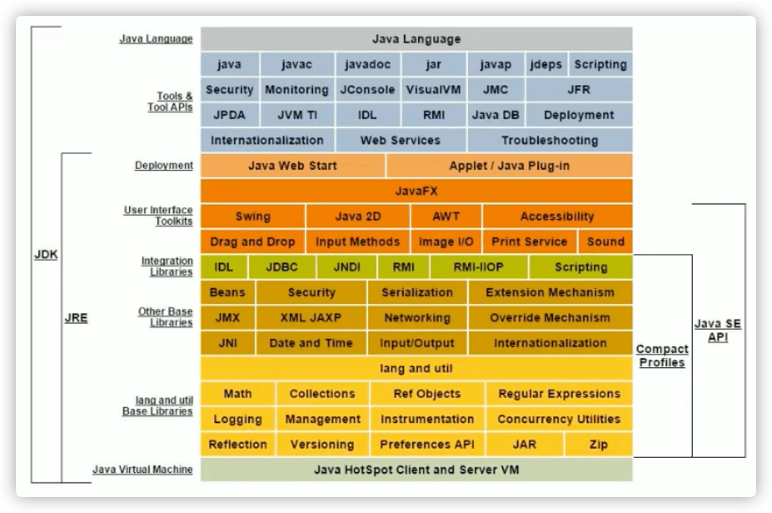

`.java` 通过javac（前端编译器）生成`.class`。

#### Google的Android系统结构

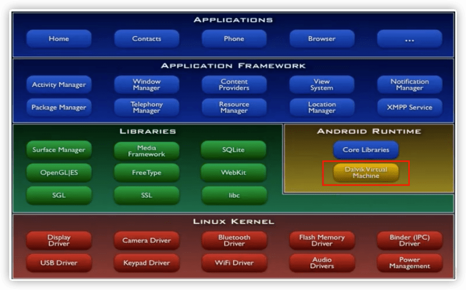

### JVM的整体结构

P11🔖，整体讲解

JVM结构简图：

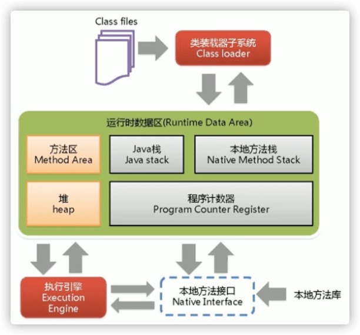


### Java代码执行流程

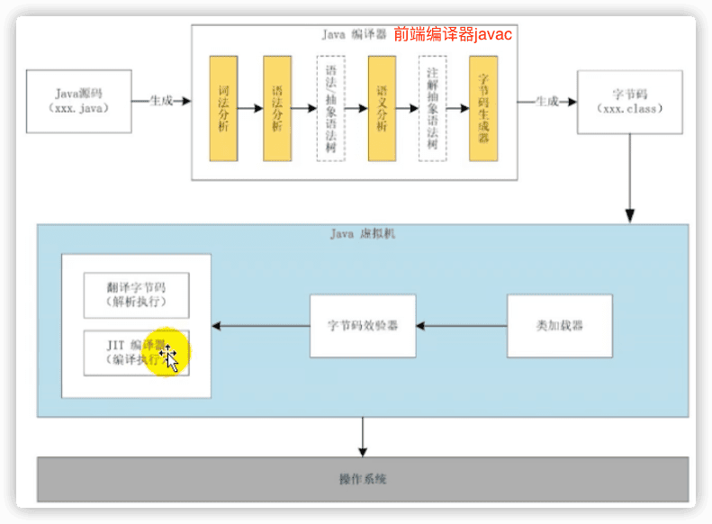

热点代码（可以缓存起来，JIT）

### JVM的架构模型

Java编译器输入的指令流基木上是一种**==基于栈的指令集架构==**（HotSpot），另外一种指令集架构则是**==基于寄存器的指令集架构==**。

具体来说，这两种架构之间的区别：
基于栈式架构的特点

- 设计和实现更简单，适用于资源受限的系统；(每执行一个方法就可以理解为一个入栈操作)
- 避开了寄存器的分配难题：使用**零地址指令**方式分配。
- 指令流中的指令大部分是零地址指令，其执行过程依赖于操作栈。**指令集更小**（指令多），编译器容易实现。
- 不需要硬件支持，可移植性更好，更好实现跨平台

基于寄存器架构的特点

- 典型的应用是x86的二进制指令集：比如传统的x86PC以及Android的Davlik虚拟机。
- 指令集架构则完全依赖硬件，可移植性差
- 性能优秀和执行更高效：
- 花费更少的指令去完成一项操作。
- 在大部分情况下，基于寄存器架构的指令集往往都以**一地址指令、二地址指令和三地址指令**为主，而基于栈式架构的指令集却是以零地址指令为主。

#### 举例


```java
public class StatckStruTest {
    public static void main(String[] args) {
        int i = 2 + 3;
    }
}
```

反编译命令`javap -v StatckStruTest`

上面的结果编译直接得到结果：

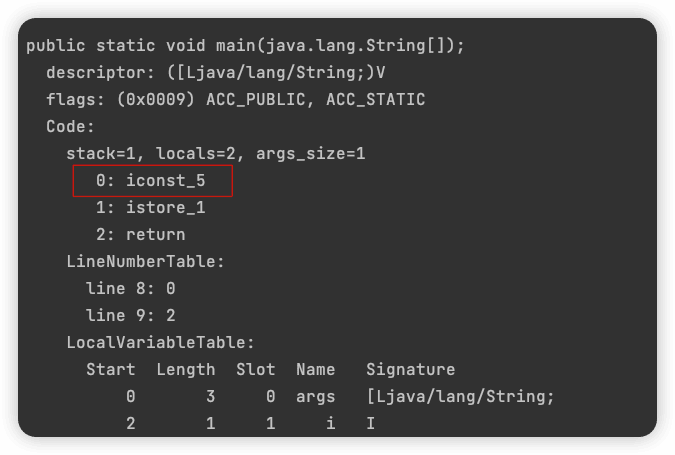

如果代码是：

```java
        int i = 2;
        int j = 3;
        int k = i + j;
```

反编译结果：


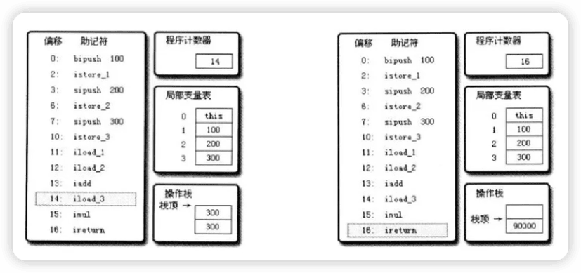

#### 总结

由于跨平台性的设计，Java的指令都是根据栈来设计的。不同平台CPU架构不同，所以不能设计为基于寄存器的。优点是跨平台，指令集小，编译器容易实现，缺点是性能下降，实现同样的功能需要更多的指令。

**栈：==跨平台性、指令集小、指令多；执行性能比寄存器差==。**

时至今日，尽管嵌入式平台已经不是Java程序的主流运行平台了（准确来说应该是HotSpotvM 的宿主环境己经不局限于嵌入式平台了），那么为什么不将架构更换为基于寄存器的架构呢？

<u>基于栈的架构设计和实现上都比较==简单==；其次是在非资源受限的场景中也是可以用的，也就没有必要更换了。</u>


### JVM的生命周期

#### 虛拟机的启动

Java虛拟机的启动是通过==引导类加载器== (bootstrap class loader)创建个==初始类== (initial class）来完成的，这个类是由虛拟机的具体实现指定的。

#### 虛拟机的执行

- 一个运行中的Java虛拟机有着一个清晰的任务：**==执行Java程序==**。
- 程序开始执行时他才运行，程序结束时他就停止。
- 执行一个所谓的Java程序的时候，真真正正在执行的是一个叫做**==Java虚拟机的进程==**。

#### 虚拟机的退出

有如下的几种情顶：

- 程序正常执行结束
- 程序在执行过程中遇到了异常或错误而异常终止
- 由于操作系统出现错误而导致Java虛拟机进程终止
- 某线程调用Runtime类或System类的exit方法，或 Runtime类的halt方法，并且Java安全管理器也允许这次exit或halt操作。
- 除此之外，==JNI==(Java Native Interface)规范描述了用JNI Invocation API来加载或卸载 Java虚拟机时，Java虚拟机的退出情况。

### JVM的发展历程

#### Sun Classic VM

- 早在1996年Java1.0版本的时候，sun公司发布了一款名为sun classic VM的Java虚拟机，它同时也是**==世界上第一款商用Java虚拟机==**，JDK1.4时完全被淘汰。
- 这款虚拟机内部**只提供解释器**。（解释器逐行解释，效率比较低下）
- 如果使用JIT编译器，就需要进行外挂。但是一旦使用了JIT编译器，JIT就会接管虛拟机的执行系统。解释器就不再工作。解释器和编译器不能配合工作。
- 现在hotspot内置了此虚拟机。

比喻：

步行   解释器

公交车  编译器

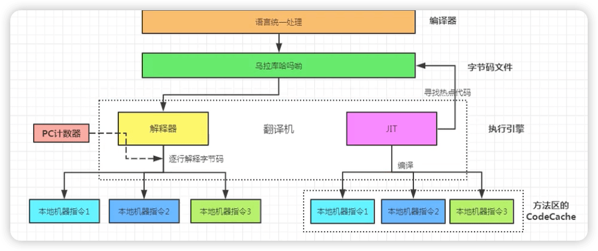

#### Exact VM

- 为了解决上一个虚拟机问题，jak1.2时，sun提供了此虚拟机。

- Exact Memory Management：**准确式内存管理**，也可以叫Non-Conservative/Accurate Memory Management，虛拟机可以知道内存中某个位置的数据具体是什么类型
  
- 具备现代高性能虛拟机的雏形
  热点探测

  编译器与解释器混合工作模式

- 只在Solaris平台短暂使用，其他平台上还是classic vm
  英雄气短，终被Hotspot虚拟机替换

#### SUN公司的Hotspot VM

- Hotspot历史
  + 最初由一家名为“Longview Technologies"的小公司设计
  + 1997年，此公司被sun收购;2009年，sun公司被甲骨文收购。
  + JDK1 .3时，Hotspot V成为默认虚拟机
  
- **目前Hotspot占有绝对的市场地位，称霸武林。**
  + 不管是现在仍在广泛使用的JDK6，还是使用比例较多的JDK8中，默认的虚拟机都是HotSpot
  + Sun/oracle JDK 和openJDK的默认虚拟机
  + 因此本课程中默认介绍的虛拟机都是Hotspot，相关机制也主要是指Hotspot的GC机制。(比如其他两个商用虚拟机都没有**方法区**的概念）
  
- 从服务器、桌面到移动端、嵌入式都有应用。

- 名称中的HotSpot指的就是它的**热点代码探测技术**。
  + 通过计数器找到最具编译价值代码，触发即时编译或栈上替换
  
  + 通过编译器与解释器协同工作，在最优化的最佳执行性能与程序响应时间中取得平衡
  
    编译器 - 最佳执行性能
  
    解释器 - 响应时间

#### BEA的JRockit

- **专注于==服务器端==应用**
  它可以不太关注程序启动速度，因此JRockit内部**不包含解析器实现**，全部代码都靠即时编译器编译后执行。
  
- 大量的行业基准测试显示，**JRockit JVM是世界上最快的JVM**。
  使用JRockit产品，客户己经体验到了显著的性能提高（一些超过了70%）和硬件成木的减少（达50%）
  
- 优势：全面的Java运行时解决方案组合
  JRockit面向延迟敏感型应用的解决方案JRockit Real Time提供以毫秒或微秒级的JVM响应时间，适合财务、军事指挥、电信网络的需要
  
  **Mission Control**服多套件，它是一组以极低的开销来监控、管理和分析生产环境中的应用程序的工具。[JDK Mission Control（JMC）](https://www.oracle.com/java/technologies/downloads/tools/#JMC)
  
- 2008年，BEA被oracle收购。

- Oracle表达了整合两大优秀虚拟机的工作，大致在JDK 8中完成。整合的方式是在Hotspot的基础上，移植JRockit的优秀特性。

- 高斯林：目前就职于谷歌，研究人工智能和水下机器人

#### IBM 的 J9

- 全称：IBM Technology for Java Virtual Machine， 简称IT4J，内部代号：J9
- 市场定位与Hotspot接近，服务器端、桌面应用、嵌入式等多用途VM
- 广泛用于IBM的各种Java产品。
- 目前，有影响力的==三大商用虚拟机==（J9、JRockit、Hotspot）之一，也号称是世界上最快的Java虛拟机。
- 2017年左右，IBM发布了开源J9 VM，命名为OpenJ9，交给EClipse基金会管理，也称为 [Eclipse OpenJ9](https://github.com/eclipse-openj9/openj9)

#### KVM和CDC/CLDC Hotspot

- oracle在Java ME产品线上的两款虛拟机为： CDC/CLDC Hotspot Implementation VM
- KVM (Kilobyte）是CLDC-HI早期产品
- 日前移动领域地位尴尬，智能于机被Android和ios二分天下。
- KVM简单、轻量、高度可移植，而向更低端的设各上还维持自己的一片市场智能控制器、传感器，老人手机、经济欠发达地区的功能手机
- 所有的虚拟机的原则：一次编译，到处运行。

#### Azul VM

- 前面三大 “高性能Java虛拟机”使用在通用硬件平台上
- 这里AZuI VN和BEA Liguid VM是**与特定硬件平台鄉定、软硬件配合的专有虚拟机**，高性能Java虚拟机中的战斗机。
- Azul VM是Azul systems公司在Hotspot基础上进行大量改进，运行于Azul systems公司的专有硬件Vega系统上的Java虛拟机。
- **每个AzuL VM实例都可以管理至少数十个CPU和数百GB内存的硬件资源，并提供在巨大内存范围内实现可控的GC时间的坟圾收集器、专有硬件优化的线程调度等优秀特性**
- 2010年，Azul systems公司开始从硬件转向软件，发布了自己的**Zing JVM**（==低延迟==、快速预热），可以在通用x86平台上提供接近于Vega系统的特性。

#### Liquid VM

- 高性能Java虛拟机中的战斗机。
- BEA公司开发的，直接运行在自家Hypervisor系统上
- Liquid VM即是现在的JRockit VE (Virtual Edition) ，**Liguid VM不需要操作系统的支持，或者说它自己本身实现了一个专用操作系统的必要功能，如线程调度、文件系统、网络支持等**。
- 随着JRockit虚拟机终止开发，Liquid VM项目也停止了。

#### Apache Harmony

- Apache也曾经推出过与JDK 1.5和JDR 1.6兼容的Java运行平台Apache Harmony。
- 它是IBM和Intel联合开发的开源JVM，受到同样开源的openJDK的压制，Sun坚决不让Harmony获得==JCP==认证，最终于2011年退役，IBN转而参与openJDK
- 虽然目前并没有Apache Harmony被大规模商用的案例，但是**它的Java类库代码吸纳进了==Android SDK==**。

#### Microsoft JVM

- 微软为了在IE3浏览器中支持Java Applets， 开发了Microsoft JVM。
- 只能在window平台下运行。但确是当时windows下性能最好的Java VM。
- 1997年，sun以侵犯商标、不正当竞争罪名指控微软成功，赔了sun很多钱。微软在WindowsXP SP3中抹掉了其VM。现在windows上安装的jdk都是HotSpot。

#### TaobaoJVM

- 由AliJVM团队发布。阿里，国内使用Java最强大的公司，覆盖云计算、金融、物流、电商等众多领域，需要解决高并发、高可用、分布式的复合问题。有大量的开源产品。
- **基于openJDK 开发了自己的定制版本AlibabaJDK**，简称==AJDK==。是整个阿里Java体系的基石。
- 基于OpenJDK Hotspot VM 发布的国内第一个优化、**深度定制且开源的高性能服务器版Java虚拟机**。
  + 创新的GCIH (GC invisible heap）技术实现了==off-heap==，即**将生命周期较长的Java对象从heap中移到heap之外，并且GC不能管理GCIH内部的Java对象，以此达到降低GC的回收频率和提升GC的回收效率的目的。**
  + GCIH 中的**对象还能够在多个Java虚拟机进程中实现共享**
  + 使用crc32指令实现 JVM intrinsic 降低JNI 的调用开销
  + PMU hardware 的Java profiling tool 和诊断协助功能
  + 针对大数据场景的ZenGC
- taobao vm应用在阿里产品上性能高，硬件严重依赖intel的cpu，损失了兼容性，但提高了性能
  目前己经在淘宝、天猫上线，把oracle 官方JVM 版本全部替换了。

#### Dalvik VM

- 谷歌开发的，应用于Android系统，并在Android2.2中提供了JIT，发展迅猛。

- **Dalvik VM 只能称作虚拟机，而不能称作 “Java 虚拟机”**，它没有遵循 Java虛拟机规范

- 不能直接执行 Java 的 class文件

- 基于==寄存器架构==，不是jvm的栈架构。

- 执行的是编译以后的**==dex== (Dalvik Executable）**（类似class文件，由其转化过来的）文件。执行效率比较高。
  它执行的dex (Dalvik Executable）文件可以通过class文件转化市来，使用Java语法编写应用程序，可以直接使用大部分的Java AFI等。
  
- Android 5.0 使用支持**提前编译** (Ahead Of Time compilation, ==AOT==)的==ART VM==替换Dalvik VM

  AOT的意思是java源代码不经过字节码文件，直接编译成机器指令。

> 具体JVM的内存结构，其实取决于其实现，不同厂商的JVM，或者同一厂商发布的不同版本，都有可能存在一定差异。**本套课程主要以Oracle Hotspot VM为默认虚拟机。**

#### Graal VM

- 2018年4月，Oracle Labs公开了Graal VM, 号称"**Run Programs Faster Anywhere**"，勃勃野心。与1995年java的”write once, run anywhere"遥相呼应。
- Graal VM在Hotspot VM基础上增强而成的**跨语言全栈虚拟机，可以作为“任何语言”的运行平台使用**。语言包括：Java、scala、 Groovy、Kotlin；C、 C++、Javascript、 Raby、 Python、 R等。
- 支持不向语言中混用对方的校口和对象，支持这些语言使用已经编写好的本地库文件
- 工作原理是将这些语言的源代码或源代码编译后的中间格式，通过解释器转换为能被Graal VM接受的中间表示。Graal VM 提供Truffle工具集快速构建面问一种新语言的解释器。在运行时还能进行即时编译优化，获得比原生编译器更优秀的执行效率。
- **如果说Hotspot有一天真的被取代，Graal VM希望最大**。但是Java的软件生态没有丝毫变化。

https://github.com/oracle/graal

https://www.graalvm.org/

## 2 类加载子系统

🔖P26 整体讲解过程

字节码文件之后虚拟机负责

方法区是HopSpot特有的


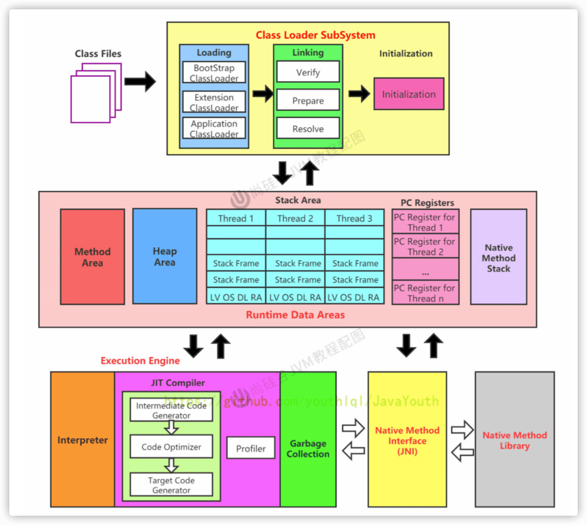

如果手写一个Java虚拟机，主要考虑哪些结构呢？

**类加载器和执行引擎**

> 章节内容
>
> 2 类加载子系统
>
> 3-10 运行时数据区

### 类加载器子系统作用

- 类加载器子系统负责从文件系统或网络中加载Class文件，class文件在文件开头有**==特定的文件标识==**。
- ClassLoader只负责class文件的加载，至于它是否可以运行，则有**Execution Engine**决定。
- 加载的类信息存放于一块称为方法区的内存空间。除了类信息外，方法区中还会存放**运行时常量池**信息，可能还包括<u>字符串面量和数字常量</u>（Class文件中常量池部分的内存映射，也就是<u>class文件中常量池加载到内存中就是运行时常量池</u>）。

举例说明：

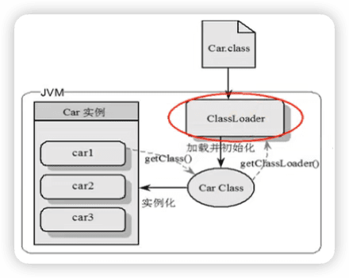 

1. class file存在于本地硬盘上，可以理解为设计师在纸上的模板，而最终这个模板在执行的时候是要加载到JVM当中来根据这个文件实例化n个一模一样的实例。
2. class file 加载到JVM中，被称为**DNA元数据模板**，放在方法区。
3. 在.class文件 -> JVM -> 最终成为元数据模板，此过程就要一个运输工具（类装载器Class Loader），扮演一个快递员的角色。

```java
public class HelloLoader {
    public static void main(String[] args) {
        System.out.println("Hello World!");
    }
}
```

用流程图表示上述示例代码：


**类的加载过程**分为三个环节：加载 -> 链接 -> 初始化


#### 类的加载过程一：加载（loading）

> 【类的加载过程】是一个大的概览，其中第一步也叫加载。

1. 通过一个类的**全限定名**获取定义此类的**二进制字节流**
2. 将这个字节流所代表的静态存储结构转化为方法区的运行时数据结构（7及其之前叫**永久代**，之后叫**元空间**）
3. **在内存中生成一个代表这个类的java.lang.Class对象**，作为方法区这个类的各种数据的访问入口

补充：加载.class文件的方式

- 从本地系统中直接加载
- 通过网络获取，典型场景：Web Applet
- 从zip压缩包中读取，成为日后jar、war格式的基础
- 运行时计算生成，使用最多的是：动态代理技术
- 由其它文件生成，典型场景：JSP应用
- 从专有数据库中提取.class文件，比较少见
- 从加密文件中获取，典型的防Class文件被反编译的保护措施

#### 类的加载过程二：链接（Linking）

**jclasslib bytecode viewer**，查看.class文件的工具

**Binary Viewer**   **UltraEdit**

都有IDEA插件

主要优点：

1 不需要使用`javap`指令，使用简单

2 点击字节码指令可以跳转到 java虚拟机规范对应的章节


魔术，所有能够被Java虚拟机识别字节码文件的有效开头都是（“咖啡宝贝”）：

```
CA FE BA BE
```


1. 验证（Verify）

   目的在于确保Class文件的字节流中包含信息符合当前虚拟机**要求**，保证被加载类的**正确性**，不会危害虚拟机自身安全。

   主要包括四种验证：**文件格式验证，元数据验证，字节码验证，符号引用验证**。

2. 准备（Prepare）：

   为类变量分配内存并且设置该==类变量==的默认初始值，即零值。

   ```JAVA
   private static int a = 1;  // prepare: a = 0  --> initial: a = 1
   ```

   **这里不包含用final修饰的static，因为final在编译的时候就会分配了（常量），准备阶段会显示初始化**；

   **这里不会为实例变量分配初始化**，类变量会分配在方法区，而实例变量是会随着对象一起分配到Java堆中。

3. 解析（Resolve）：

   将常量池内的**==符号引用==**转换为**==直接引用==**的过程。

   事实上，解析操作往往会伴随着JVM在执行完<u>初始化之后再执行</u>。

   **符号引用**就是一组符号来描述所引用的目标。符号引用的字面量形式明确定义在《java虚拟机规范》的Class文件格式中。（理解为字符串，能根据这个字符串定位到指定的数据，比如java/lang/StringBuilder）

   

   直接引用就是直接指向目标的指针、相对偏移量或一个间接定位到目标的句柄。（内存地址）
   
   解析动作主要针对<u>类或接口、字段、类方法、接口方法、方法类型</u>等。对应常量池中的CONSTANT_Class_info（类符号）、CONSTANT_Fieldref_info（属性符号）、CONSTANT_Methodref_info（方法符号）等。

​	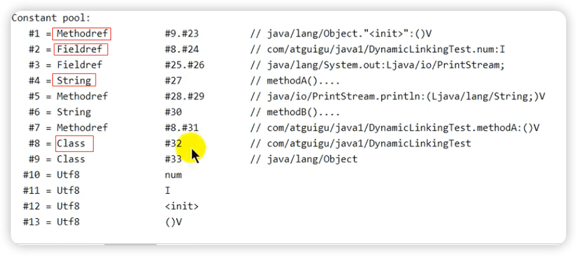

#### 类的加载过程三：初始化（initialization）

- 初始化阶段就是执行**==类构造器方法==**`<clinit>()`的过程。（注意与**==实例构造器==**`＜init＞()`区分）

- 此方法不需定义，是javac编译器自动收集类中的<u>所有类变量的赋值动作和静态代码块中的语句合并</u>而来。（如果没有类变量和静态块，就没有类构造器方法）

  

- 构造器方法中指令按语句在<u>源文件中出现的顺序执行</u>。

- `<clinit>()`不同于类的构造器。（关联：构造器是虛拟机视角下的`<init>()`)

- 若该类具有父类，JVM会保证子类的`<clinit>()`执行前，父类的`<clinit>()`己经执行完毕。

​	

- 虚拟机必须保证一个类的`<clinit>()`方法在多线程下被同步加锁。

  ```java
  /**
   * 只有一个线程执行DeadThread的类构造器<clinit>()
   * @author andyron
   **/
  public class DeadThreadTest {
      public static void main(String[] args) {
          Runnable r = () -> {
              System.out.println(Thread.currentThread().getName() + "开始");
              DeadThread dead = new DeadThread();
              System.out.println(Thread.currentThread().getName() + "结束");
          };
          Thread t1 = new Thread(r, "线程1");
          Thread t2 = new Thread(r, "线程2");
          t1.start();
          t2.start();
      }
  }
  class DeadThread {
      static {
          if (true) {
              System.out.println(Thread.currentThread().getName() + "初始化当前类");
              while (true) {
              }
          }
      }
  }
  ```

  


### 类加载器的分类

- JVM支持两种类型的类加载器，分别为**引导类加载器 (Bootstrap ClassLoader）**和**自定义类加载器 (User-Defined classLoader)**。

- 从概念上来讲，自定义类加载器一般指的是程序中由开发人员自定义的一类类加载器，但是Java虚拟机规范却没有这么定义，而是将所有派生于抽象类`Classloader`的类加载器都划分为自定义加载器。

- 无论类加载器的类型如何划分，在程序中我们最常见的类加载器始终只有3个，如下所示：


```java
sun.misc.Launcher$ExtClassLoader
sun.misc.Launcher$AppClassLoader
```

```java
public class ClassLoaderTest {
    public static void main(String[] args) {
        // 获取启动类加载器
        ClassLoader systemClassLoader = ClassLoader.getSystemClassLoader();
        System.out.println(systemClassLoader);  // sun.misc.Launcher$AppClassLoader@18b4aac2

        // 获取其上层：扩展类加载器
        ClassLoader extClassLoader = systemClassLoader.getParent();
        System.out.println(extClassLoader);  // sun.misc.Launcher$ExtClassLoader@6bc7c054

        // 获取其上层：获取不到引导类加载器
        ClassLoader bootstrapClassLoader = extClassLoader.getParent();
        System.out.println(bootstrapClassLoader);  // null

        // 对于用户自定义来说：默认使用系统类加载器进行加载
        ClassLoader classLoader = ClassLoaderTest.class.getClassLoader();
        System.out.println(classLoader);  // sun.misc.Launcher$AppClassLoader@18b4aac2

        // String类使用引导类加载器进行加载的  ---> Java的核心类库是使用引导类加载器进行加载的
        ClassLoader classLoader1 = String.class.getClassLoader();
        System.out.println(classLoader1);   // null
    }
}
```


#### 启动类加载器（引导类加载器，Bootstrap ClassIoader)

- 这个类加载使用C/C++语言实现的，嵌套在JVM内部。

- 它用来加载Java的校心库 (JAVA HOME/jre/lib/rt.jar、resources.jar或sun.boot.ciass.path路径下的内容)，用于提供JVM自身需要的类

- 并不继承自java.lang.classLoader，没有父加载器。

- 加载扩展类和应用程序类加载器，并指定为他们的父类加载器。

- 出于交全考虑，Bootstrap启动类加载器只加载包名为java、javax、sun等开头的类

#### 扩展类加载器 (Extension ClassLoader)

- Java语言编写，由`sun.misc.Launcher$ExtclassLoader`实现。

- 派生于ClassLoader类

- 父类加载器为启动类加载器

- 从`java.ext.dirs`系统属性所指定的目录中加载类库，或从JDK的安装目录的`jre/lib/ext`子目录（扩展目录）下加载类库。<u>如果用户创建的JAR放在此目录下，也会自动由扩展类加载器加载</u>。

#### 应用程序类加载器（系统类加载器，AppClassLoader）

- Java语言编写，由`sun.misc.Launcher$AppclassLoader`实现

- 派生于ClassLoader头

- 父类加载器为扩展类加载器

- 它负责加载环境变量classpath或系统属性`java.class.path`指定路径下的类库

- 该类加载是==程序中默认的类加载器==，一般来说，Java应用的类都是由它来完成加载

- 通过`ClassLoader#getsystemclassLoader()`方法可以获取到该类加载器

#### 用户自定义类加载器

- 在Java的日常应用程序开发中，类的加载几乎是由上述3种类加载器相互配合执行的，在必要时，我们还可以自定义类加载器，来定制类的加载方式。
- 为什么要自定义类加裁器？
  + 隔离加载类
  + 修改类加载的方式
  + 扩展加载源
  + 防止源码泄露。加密后再自定义加载器中实现解密

用户自定义类加载器实现步骤：

1. 开发人员可以通过继承抽象类`java.lang.ClassLoader`类的方式，实现自己的类加载器，以满足一些特殊的需求；

2. 在JDK1.2之前，在自定义类加载器时，总会去继承CLassLoader类并重写loadClass()方法，从而实现自定义的类加载类，但是在JDK1.2之后己不再建议用户去覆盖loadClass()方法，而是建议把自定义的类加载逻辑写在`findclass()`方法中；

3. 在编写自定义类加载器时，如果没有太过于复杂的需求，可以直接继承`URLClassLoader`类，这样就可以避免自己去编写findClass()方法及其获取字节码流的方式，使自定义类加载器编写更加简洁。

### 关于ClassLoader

ClassLoader，抽象类，除了启动类加载器的所有类加载器都是继承自它。

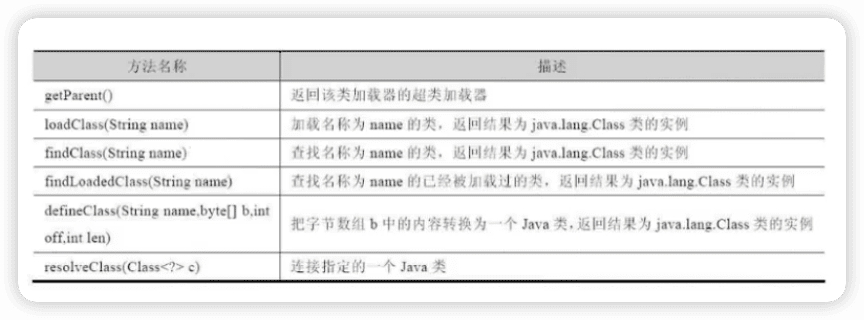


`sun.misc.Laucher`是一个Java虚拟机的入口应用。

### 获取ClassLoader的途径

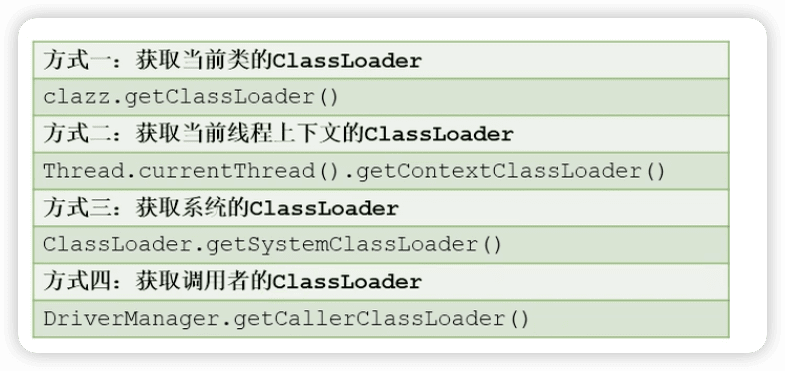

### 双亲委派机制

Java虛拟机对class文件采用的是按需加载的方式，也就是说当需要使用该类时才会将它的class文件加载到内存生成class对象。而且加载某个类的class文件时，Java虚拟机来用的是双亲委派模式，即把请求交由父类处理，它是一种任务委派模式。

工作原理：

1. 如果一个类加载器收到了类加载请求，它并不会自己先去加载，而是把这个请求委托给父类的加载器去执行；

2. 如果父类加载器还存在其父类加载器，则进一步向上委托，依次递归，请求最终将到达顶层的启动类加载器；

3. 如果父类加载器可以完成类加载任务，就成功返回，倘若父类加载器无法完成此加载任务，子加载器才会尝试自己去加载，这就是==双亲委派模式==（parents delegation model）。


虽然自定了`java.lang.String`，但最终还是由引导类加载器加载jdk中的。


```java
 				/*
        默认你系统类加载器询问上一级扩展类加载器：你需要加载StringTest；
        扩展类加载器询问上一级启动类加载器：你需要加载StringTest；
        启动类加载器说不需要 -> 扩展类加载器也说不需要 -> 系统类加载器说那还是我来吧
         */
        StringTest test = new StringTest();
        System.out.println(test.getClass().getClassLoader());
```


spi相关接口有引导类加载器加载，实现类有系统类加载器加载。

#### 优势

- 避免类的重复加载
- 保护程序安全，防止核心API被随意篡改

```
java.lang.SecurityException: Prohibited package name: java.lang
```


### 沙箱安全机制

自定义String类，但是在加载自定义String类的时候会率先使用引导类加载器加载，而引导类加载器在加载的过程中会先加载jdk自带的文件(rt.jar包中`java\lang\String.class`)，报错信息说没有main方法，就是因为加载的是rt.jar包中的String类。这样可以保证对java核心源代码的保护，这就是==沙箱安全机制==。

### 其它

- 在JVM中表示两个class对象是否为同一个类存在两个必要条件：
  - 类的完整类名必须一致，包括包名。
  - 加载这个类的ClassLoader (指CLassLoader实例对象）必须相同。
- 换句话说，在JVM中，即使这两个类对象(class对象)来源同一个Class文件，被同一个虚拟机所加载，但只要加载它们的ClassLoader实例对象不同，那么这两个类对象也是不相等的。


JVM必须知道一个类型是由启动加载器加载的还是由用户类加载器加载的。如果一个类型是由用户类加载器加载的，那么JVM会**将这个类加载器的一个引用作为类型信息的一部分保存在方法区中**。<u>当解析一个类型到另一个类型的引用的时候，JVM需要保证这两个类型的类加载器是相同的。</u>


Java程序对类的使用方式分为：主动使用和被动使用。

主动使用（就是进行初始化了，类变量和静态类块运行了），又分为七种情况：

- 创建类的实例
- 访问某个类或接口的静态变量，或者对该静态变量赋值
- 调用类的静态方法
- 反射（比如： `Class.forName ("com.andyron.Test")`)
- 初始化一个类的子类
- Java虚拟机启动时被标明为启动类的类
- JDK 7开始提供的动态语言支持：
   `java.lang.invoke.MethodHandle`实例的解析结果
   REF_getstatic、 REF_putstatic、 REE_invokestatic句柄对应的类没有初始化，则初始化

除了以上七种情况，其他使用Java类的方式都被看作是对类的被动使用，都不会导致类的初始化。

## 3 运行时数据区概述及线程

内存是非常重要的系统资源，是硬盘和CPU的中间仓库及桥梁，承载着操作系统和应用程序的实时运行。JVM内存布局规定了Java在运行过程中内存申请、分配、管理的策略，保证了JVM的高效稳定运行。不同的JVM对于内存的划分方式和管理机制存在着部分差异。结合JVM虚拟机规范，来探讨下经典的JVM内存布局。

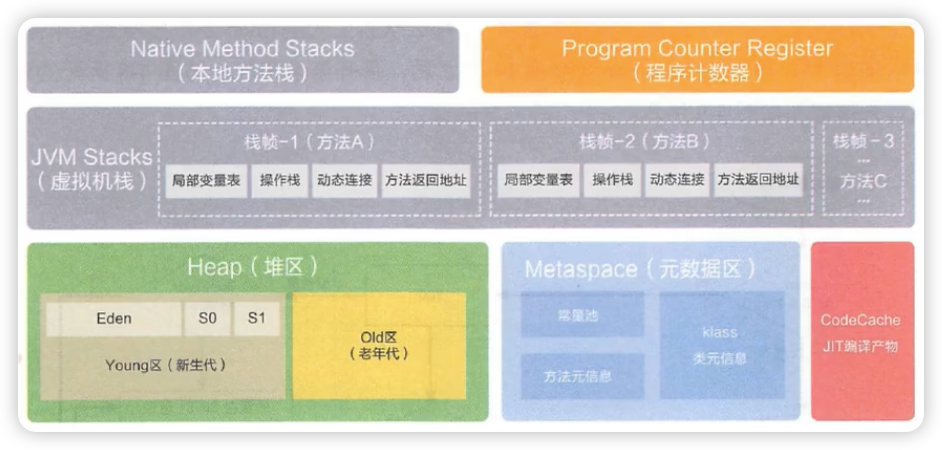

Java虚拟机定义了若干种程序运行期间会使用到的运行时数据区，其中有一些会随者虛拟机启动而创建，随着虛拟机退出而销毁。另外一些则是与线程一一对应的，这些与线程对应的数据区域会随着线程开始和结束而创建和销毀。

灰色的为单独线程私有的，红色的为多个线程共享的。即：

- 每个线程：独立包括程序计数器、栈、本地栈。
- 线程间共享：堆、堆外内存（永久代或元空间、代码缓存）

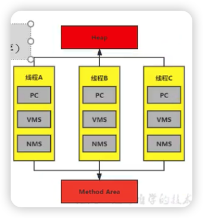

垃圾回收95%在堆区，5%在方法区。

一个JVM实例就对应一个`java.lang.Runtime`实例。

### 线程

- 线程是一个程序里的运行单元。JVM允许一个应用有多个线程并行的执行。

- 在Hotspot JVM里，<u>每个线程都与操作系统的本地线程直接映射</u>。

  当一个Java线程准备好执行以后，此时一个操作系统的本地线程也同时创建。Java线程执行终止后，本地线程也会回收。

- 操作系统负责所有线程的安排调度到任何一个可用的CPU上。一旦本地线程初始化成功，它就会调用Java线程中的run()方法。

守护线程、普通线程


- 如果你使用jconsole或者是任何一个调试工具，都能看到在后台有许多线程在运行。这些后台线程不包括调用`public static void main (string [])`的main线程以及所有这个main线程自己创建的线程。

- 这些主要的后台系统线程在Hotspot JVM里主要是以下儿个：
  + 虚拟机线程：这种线程的操作是需要JVM达到安全点才会出现。这些操作必须在不同的线程中发生的原因是他们都需要JVM达到安全点，这样堆才不会变化。这种线程的执行类型包括“stop-the-world的垃圾收集，线程栈收集，线程挂起以及偏向锁撒销。
  + 周期任务线程：这种线程是时间周期事件的体现（比如中断），他们一般用于周期性操作的调度执行。
  + GC线程：这种线程对在JVM里不同种类的垃圾收集行为提供了支持。
  + 编译线程：这种线程在运行时会将字节码编译成到本地代码。
  + 信号调度线程：这种线程接收信号并发送给JVM，在它内部通过调用适当的方法进行处理。

## 4 程序计数器（PC寄存器）

>  GC、OOM都没有  

### 4.1 介绍

[The pc Register](https://docs.oracle.com/javase/specs/jvms/se8/html/jvms-2.html#jvms-2.5.1)

JVM中的程序计数寄存器 (Program counter Register）中， Register的命名源于CPU的寄存器，寄存器存储指令相关的现场信息。CPU只有把数据装载到寄存器才能够运行。

这里，并非是广义上所指的物理奇存器，或许将其翻译为**PC计数器**(或指令计数器）会更加贴切(也称为**程序钩子**），并且也不容易引起一些不必要的误会。JVM中的PC寄存器是对物理PC寄存器的一种抽象模拟。


作用：PC寄存器用于存储指向下一条指令的地址，也即将要执行的指令代码。由执行引擎读取下一条指令。


- 它是一块很小的内存空间，几乎可以忽略不记。也是运行速度最快的存储区域。

- 在JVM规范中，每个线程都有它自己的程序计数器，是线程私有的，生命周期与线程的生命周期保持一致。

- 任何时间一个线程都只有一个方法在执行，也就是所谓的**当前方法**。程序计数器会存储当前线程正在执行的Java方法的JVM指令地址；或者，如果是在执行native方法，则是未指定值 (undefined)。
- 它是程序控制流的指示器。分支、循环、跳转、异常处理、线程恢复等基础功能都需要依赖这个计数器来完成。
- 字节码解释器工作时就是通过改变这个计数器的值来选取下一条需要执行的字节码指令。
- 它是唯一一个在Java虚拟机规范中没有规定任何OutOfMemoryError情况的区域。

```java
    public static void main(String[] args) {
        int i = 10;
        int j = 20;
        int k = i + j;

        String s = "abc";
        System.out.println(i);
        System.out.println(k);
    }
```


### 两个常见问题

1. 使用PC寄存器存储字节码指令地址有什么用呢？

   为什么使用PC寄存器记录当前线程的执行地址呢？

因为CPU需要不停的切换各个线程，这时候切换回来以后，就得知道接着从哪开始继续

执行。

JVM的字节码解释器就需要通过改变PC奇存器的值来明确下一条应该执行什么样的字节

码指令。

2. PC寄存器为什么会被设定为线程私有？

我们都知道所谓的多线程在一个特定的时间段内只会执行其中某一个线程的方法，CPU会不停地做任务切换，这样必然导致经常中断或恢复，如何保证分毫无差呢？<u>为了能够准确地记录各个线程正在执行的当前字节码指令地址，最好的办法自然是为每一个线程都分配一个PC奇存器</u>，这样一来各个线程之间便可以进行独立计算，从而不会出现相互干扰的情況。

由于CPU时间片轮限制，众多线程在并发执行过程中，任何一个确定的时刻，一个处理器或者多校处理器中的一个内核，只会执行某个线程中的一条指令。

这样必然导致经常中断或恢复，如何保证分毫无差呢？每个线程在创建后，都会产生自己的程序计数器和栈帧，程序计数器在各个线程之间互不影响。


并行：vs串行

并发：

> CPU时间片
>
> CPU 时间片即 CPU 分配给各个程序的时间，每个线程被分配一个时间段，称作它的时间片。
>
> 在宏观上：我们可以同时打开多个应用程序，每个程序并行不悖，同时运行。
>
> 但在微观上：由于只有一个CPU，一次只能处理程序要求的一部分，如何处理公平，一种方法就是引入时间片，每个程序轮流执行。
>
> 


## 5 虚拟机栈❤️

### 5.1 概述

虚拟机栈出现的背景：

由于跨平台性的设计，Java的指令都是根据栈来设计的。不同平台CPU架构不同，所以不能设计为基于寄存器的。**优点是跨半台，指令集小，编译器容易实现，缺点是性能下降，实现同样的功能需要更多的指令。**


内存中的栈与堆：

**栈是运行时的单位，而堆是存储的单位。**

即：栈解决程序的运行问题，即程序如何执行，或者说如何处理数据。堆解决的是数据存储的问题，即数据怎么放、放在哪儿。


虚拟机栈基本内容

- Java虚拟机栈是什么？

  Java虚拟机栈 (Java Virtual Machine stack)，早期也叫Java栈。每个线程在创建时都会创建一个虛拟机栈，其内部保存一个个的**栈帧(stack Frame）**，对应着一次次的Java方法调用。

  是线程私有的

- 生命周期
  生命周期和线程一致。

- 作用
  主管Java程序的运行，它保存方法的局部变量（8种基本数据类型、对象的引用地址）、部分结果，并参与方法的调用和返回。

  局部变量 vs 成员变量（或属性）

  基本数据类型 vs 引用类型变量（类、数组、接口）


- 栈的特点（优点）
  + 栈是一种快速有效的分配存储方式，访问速度仅次于程序计数器
  + JVM直接堆Java栈的操作只有两个：每个方法执行，伴随着进栈（入栈、压栈）；执行结束后的出栈工作
  + 不存在垃圾回收问题


栈中可能出现的异常

Java 虚拟机规范允许Java栈的大小是动态的或者是固定不变的。

- 如果采用固定大小的Java虚拟机栈，那每一个线程的Java虚拟机栈容量可以在线程创建的时候独立选定。如果线程请求分配的栈容量超过Java虚拟机栈允许的最大容量，Java虚拟机将会抛出一个`StackoverflowError` 异常。

- 如果Java虚拟机栈可以动念扩展，并且在尝试扩展的时候无法申请到足够的内存，或者在创建新的线程时没有足够的内存去创建对应的虚拟机栈，那Java虛拟机将会抛出一个`OutOfMemoryError` 异常。

- 通过参数`-Xss`选项来设置线程的最大栈空间，栈的大小直接决定了函数调用的最大可达深度

```java
/**
 * 演示栈中的异常：StackOverflowError
 * @author andyron
 *
 * 默认情况下：count 19600
 * 设置栈的大小：-Xss640k ，count缩小为为3221
 **/
public class StatckErrorTest2 {
    private static int count = 1;
    public static void main(String[] args) {
        System.out.println(count);
        count++;
        main(args);
    }
}
```

> - 在单个线程下，栈帧太大，或者虚拟机栈容量太小，当内存无法分配的时候，虚拟机抛出StackOverflowError 异常。
> - 不断地建立线程的方式会导致OOM。
> - 如果是StackOverflowError，检查代码是否递归调用方法等
> - 如果是OutOfMemoryError，检查是否有死循环创建线程等

### 5.2 栈的存储单位

#### 栈中存储什么？

每个线程都有自己的栈，栈中的数据都是以栈帧(Stack Frame）的格式存在。在这个线程上正在执行的每个方法都各自对应一个栈帧 (stack Frame）。

栈帧是一个内存区块，是一个数据集，维系着方法执行过程中的各种数据信息。

#### 栈运行原理

- JVM直按对Java栈的操作只有两个，就是对栈帧的压栈和出栈，遵循“先进后出”，“后进先出” 原则。

- 在一条活动线程中，一个时间点上，只会有一个活动的栈帧。即只有当前正在执行的方法的栈帧（栈顶栈帧）是有效的，这个栈帧被称为==当前栈帧(current Frame）==，与当前栈帧相对应的方法就是==当前方法 (Current Method）==，定义这个方法的类就是==当前类(Current Class)==。

- 执行引擎运行的所有字节码指令只针对当前栈帧进行操作。

- 如果在该方法中调用了其他方法，对应的新的栈帧会被创建出来，放在栈的顶端，成为新的当前帧。

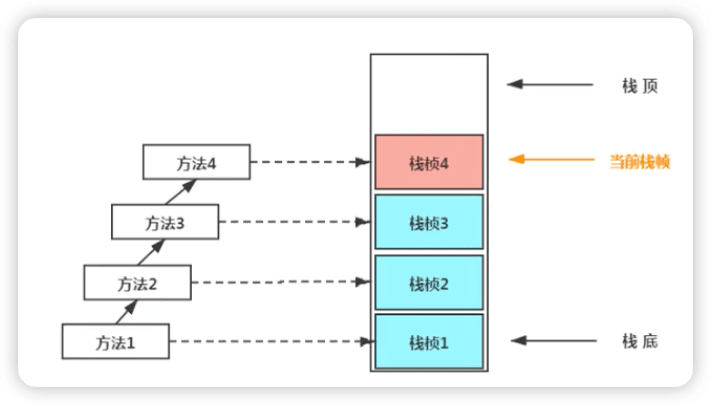

- 不同线程中所包含的栈帧是不允许存在相互引用的，即不可能在一个栈帧之中引用另外一个线程的栈帧。
- 如果当前方法调用了其他方法，方法返回之际，兰前栈帧会传口此方法的技行結果给前一个栈帧，接着，虛拟机会丢弃当前栈帧，使得前一个栈帧重新成为当前栈帧。
- Java方法有两种返回函数的方式，==一种是正常的函数返回，使用return指令；另外一种是抛出异常。不管使用哪种方式，都会导致栈帧被弹出。==


> 返回不同的类型在字节码有不同的返回指令：
>
> ```
> 46: return
> 28: ireturn
> 21: dreturn
> ```

#### 栈帧的内部结构

每个栈帧中存储着：

- ==局部变量表 (Local Variables, LV)==
- ==操作数栈 (operand stack, OS）（或表达式栈）==
- 动态链接 (Dynamic Linking, DL）（或指向运行时常量池的方法引用）
- 方法返回地址(Return Address, RA）（或方法正常退出或异常退出的定义)
- 一些附加信息


栈帧的大小决定了，栈中可以存放多少栈帧。

> 有的地方把后三个统称为**帧数据区**。

### 5.3 局部变量表

- 局部变量表(Local Variables)也被称之为局部变量数组或本地变量表

- 定义为一个==数字数组==，主要用于存储方法参数和定义在方法体内的局部变量，这些数据类型包括各类基本数据类型、对象引用(reference），以及returnAddress类型。

- 由于局部变量表是建立在线程的栈上，是线程的私有数据，因此**不存在数据安全问题**

- 局部变量表所需的容量大小是在**编译期确定**下来的，并保存在方法的Code属性的maximum local variables数据项中。**在方法运行期间是不会改变**局部变量表的大小的。

```java
    public static void main(String[] args) {
        LocalVariablesTest test = new LocalVariablesTest();
        int num = 10;
        test.test1();
    }
```

`javap -v `

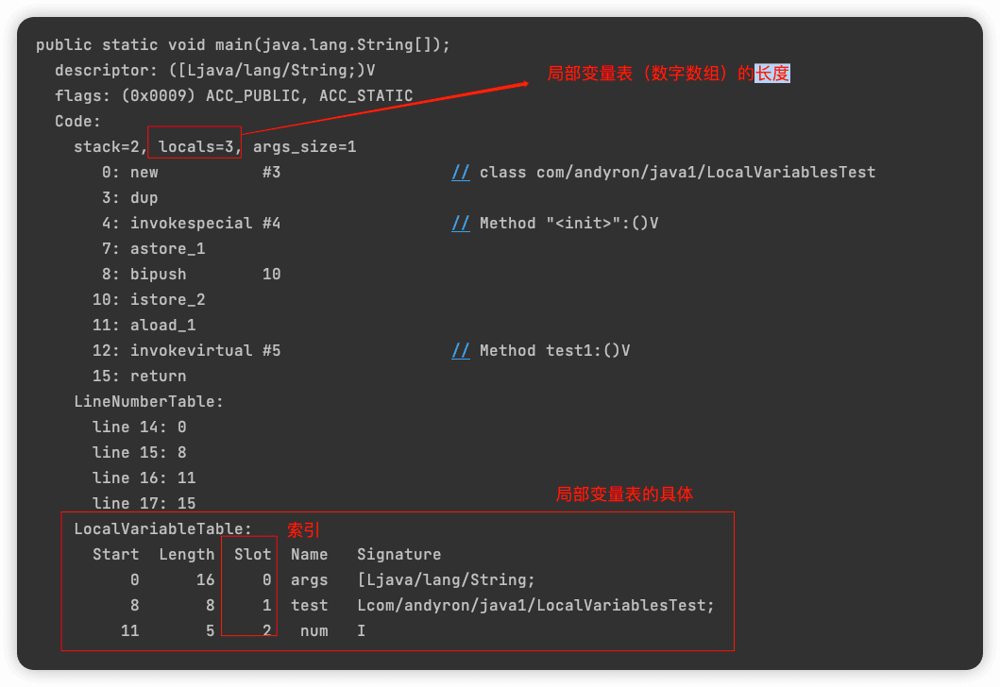

jclasslib插件查看


- 方法嵌套调用的次数由栈的大小决定。一般来说，==栈越大，方法嵌套调用次数越多==。对一个函数而言，它的参数和局部变量越多，使得局部变量表膨胀，它的栈帧就越大，以满足方法调用所需传递的信息增大的需求。进而函数调用就会占用更多的栈空间，导致其嵌套调用次数就会减少。

- ==局部变量表中的变量只在当前方法调用中有效==。在方法执行时，虚拟机通过使用局部变量表完成参数值到参数变量列表的传递过程。==当方法调用结束后，随着方法栈帧的销毁，局部变量表也会随之销毁==。


字节码指令的行号与Java代码行号的对应关系

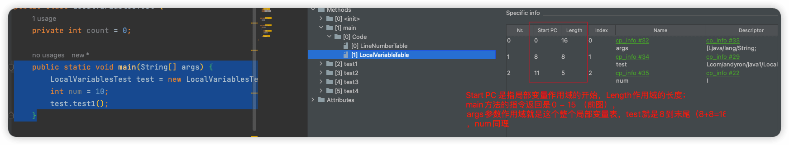

#### 关于slot的理解

- 参数值的存放总是在局部变量数组的index0开始，到数组长度-1的索引结束。

- 局部变量表，最基本的存储单元是==Slot（变量槽）==

- 局部变最表中存放编译期可知的各种基本数据类型（8种），引用类型(reference)，returnAddress类型的变量。

- 在局部变量表里，32位以内的类型只占用一个slot（包括returnAddress类型），64位的类型（long和double）占用两个slot。

  byte、short、char 在存储前被转换为int，boolean也被转换为int， 0表示false，非0表示true。

  long 和double 则占据两个slot。


- JVM会为局部变量表中的每一个Slot都分配一个访问素引，通过这个素引即可成功访问到局部变量表中指定的局部变量值。

- 当一个实例方法被调用的时候，它的方法参数和方法体内部定义的局部变量将会按照顺序被复制到局部变量表中的每一个Slot上。
- 如果需要访问局部变量表中一个64bit的局部变量值时，只需要使用前一个索引即可。（比如：访问long或double类型变量）
- 如果当前帧是由构造方法或者实例方法创建的，那么该对象引用this将会存放在index为0的slot处（静态方法不会），其余的参数按照参数表顺序继续排列。

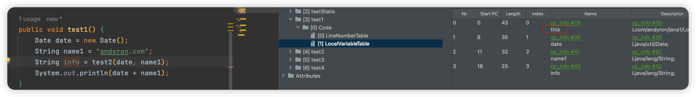

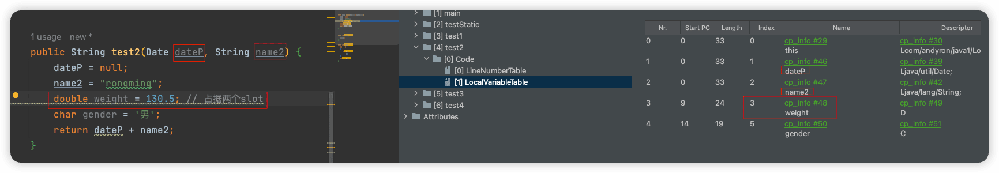

##### Slot的重复使用

栈帧中的局部变量表中的槽位是可以重用的，如果一个局部变量过了其作用域，那么在其作用域之后申明的新的局部变量就很有可能会复用过期局部变量的槽位，从而达到节省资源的目的。

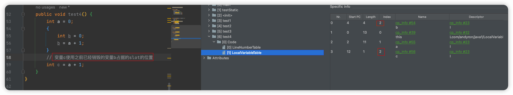


> java中变量的分类
>
> 按照数据类型分： 
>
> 1. 基本数据类型 
> 2. 引用类型数据
>
> 按照在类中声明的位置分：
>
> 1. 成员变量（在使用前，都经历过**==默认初始化赋值==**）
>
>    - 类变量（静态变量）：linking的prepare阶段：给类变量默认赋值  -->  inital阶段：给类变量显示赋值及静态代码块赋值
>
>    - 实例变量：随着对象的创建，会在堆空间中分配实例变量空间，并进行默认赋值
>
> 2. 局部变量：在使用前，必须进行显示赋值！否则编译不通过。


补充说明

- 在栈帧中，与性能调优关系最为密切的部分就是前面提到的局部变量表。在方法执行时，虚拟机使用局部变量表完成方法的传递。
- <u>局部变量表中的变量也是重要的**垃圾回收根节点**，只要被局部变量表中直接或间接引用的对象都不会被回收。</u>

### 5.4 操作数栈（Operand stack）

> 栈：可以使用数组或链表来实现。
>
> 操作数栈是用数组实现的。

- 每一个独立的栈帧中除了包含局部变量表以外，还包含一个==后进先出==(Last-In-First-out）的操作数栈，也可以称之为==表达式栈==(Expression stack)。

- 操作数栈，在方法执行过程中，根据字节码指令，往栈中写入数据或提取数据，即入栈 (push)/出栈 (pop)。

  某些字节码指令将值压入操作数栈，其余的字节码指令将操作数取出栈。使用它们后再把结果压入栈

  比如：执行复制、交换、求和等操作

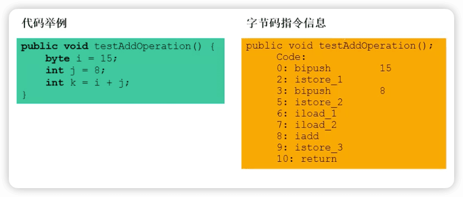

> 执行引擎会将字节码指令翻译成机器指令。

- 操作数栈主要用于保存计算过程的==中间结果==，同时作为计算过程中变量临时的存储空间。

- 操作数栈就是JVM执行引擎的一个工作区，当一个方法刚开始执行的时候，一个新的栈帧也会随之被创建出来，**这个方法的操作数栈是空的**。

- 每一个操作数栈都会拥有一个明确的**栈深度**（数组的长度）用于存储数值，其所需的最大深度在编译期就定义好了，保存在方法的code属性中，为max_stack的值。

- 栈中的任何一个元素都是可以任意的Java数据类型。
  - 32bit的类型占用一个栈单位深度
  - 64bit的类型占用两个栈单位深度

- 操作数栈==并非采用访问索引的方式来进行数据访问的==，而是只能通过标准的入栈（push）和出栈(pop）操作来完成一次数据访问。

- <u>如果被调用的方法带有返回值的话，其返回值将会被压入当前栈帧的操作数栈中</u>，并更新PC寄存器中下一条需要执行的字节码指令。

- 操作数栈中元素的数据类型必须与字节码指令的序列严格匹配，这由编译器在编译器期间进行验证，同时在类加载过程中的类检验阶段的数据流分析阶段要再次验证。

- 另外，我们说Java虚拟机的==解释引擎是基于栈的执行引擎==，其中的栈指的就是操作数栈。

### 5.5 代码追踪

```java
public class OperandStackTest {
    public void testAddOperation() {
        // byte, short, char, boolean 都是以int存储的
        byte i = 15;
        int j = 8;
        int k = i + j;
    }
}
```


`istore_1`表示局部变量表1的位置，0的位置是自带this（非静态方法）。


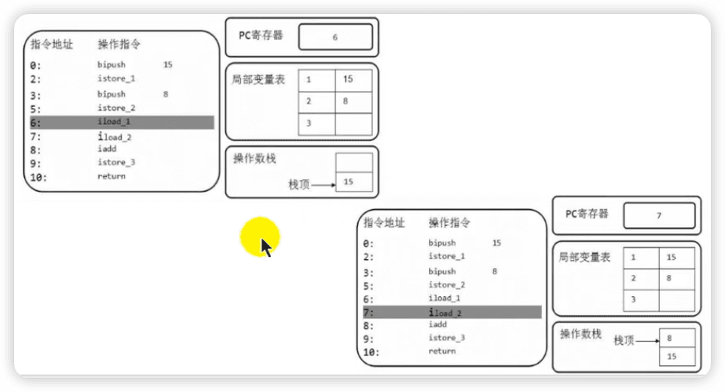

`iload_1`和`iload_2`是从局部变量表中1和2位置的数据依次取出放入操作数栈。


`iadd`操作经过执行引擎把字节码指令翻译成机器指令，经过CPU运算，得到结果23再放入操作数栈顶；然后`istore_3`把23存储到局部变量表23的位置。


`bipush`和`sipush`分别表示以byte和short压入，但之后的存储都是以int（`istore`）存储的。


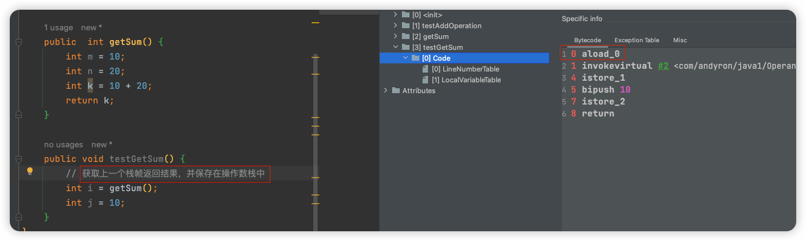

### 5.6 栈顶缓存技术

前而提过，基于栈式架构的虚拟机所使用的零地址指令更加紧湊，但完成一项操作的时候必然需要使用更多的入栈和出栈指令，这同时也就意味者将需要更多的指令分派 (instruction dispatch）次数和内存读/写次数。

由于操作数是存储在内存中的，因此频繁地执行内存读/写操作必然会影响执行速度。为了解决这个问题，Hotspot JVM的设计者们提出了==栈顶缓存(ToS, Top-of-Stack cashing）技术==，**将栈顶元素全部级存在物理CPU的寄存器中，以此降低对内存的谢/写次数，提升执行引擎的执行效率。**

### 5.7 动态连接（或指向运行时常量池的方法引用）

- 每一个栈帧内部都包含一个指向**运行时常量池**中==该栈帧所属方法的引用==。包含这个引用的目的就是为了支持当前方法的代码能够实现动态链接(Dynamic Linking）。比如：invokedynamic指令。

- 在Java源文件被编译到字节码文件中时，所有的变量和方法引用都作为符号引用 (Symbolic Reference）保存在class文件的常量池里。

  比如：描述一个方法调用了另外的其他方法时，就是通过常量池中指向方法的符号引用来表示的，那么动念链接的作用就是==为了将这些符号引用转换为调用方法的直接引用==。

```java
public class DynamicLinkingTest {
    int num = 10;
    public void methodA() {
        System.out.println("methodA().....");
    }
    public void methodB() {
        System.out.println("methodB().....");
        methodA();
        num++;
    }
}
```


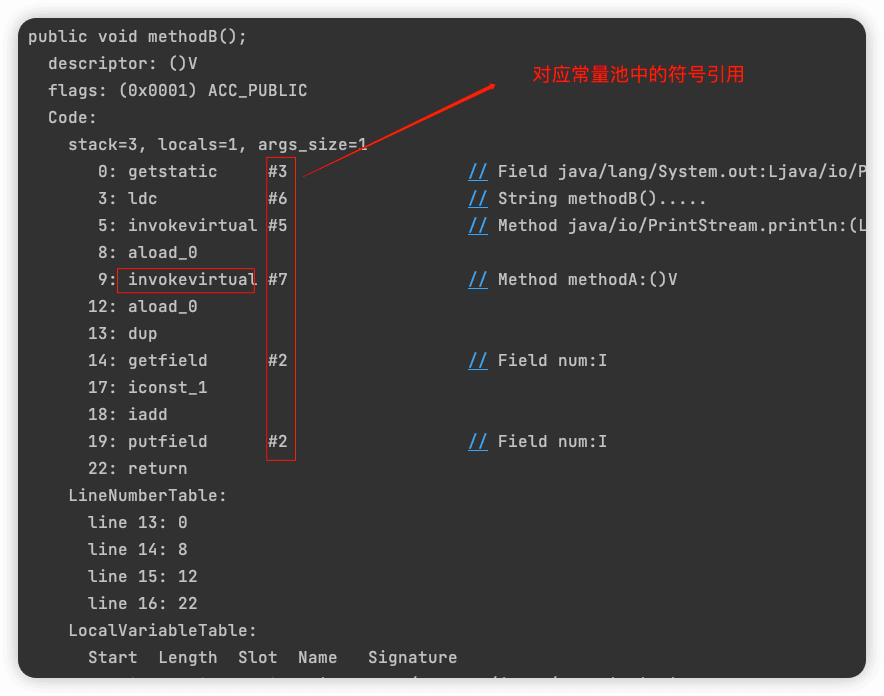


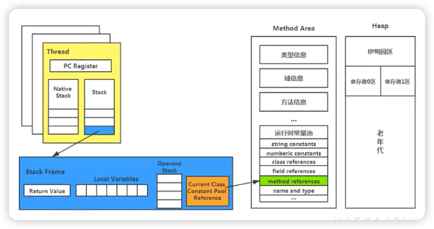

> 为什么需要常量池呢？
>
> 为了提供一些符号和常量，便于指令的识别。

🔖p55 字节码文件中需要很多数据支持（父类、int类型、System类型等等），但不能在字节码文件中都写出来，通过符号引用的方式去引用相关结构。

### 5.8 方法的调用

在JVM中，将符号引用转换为调用方法的直接引用与方法的绑定机制相关。

- ==静态链接==：

当一个字节码文件被装载进JVM内部时，如果被调用的==目标方法在编译期可知==，且运行期保持不变时。这种情况下将调用方法的符号引用转换为直接引用的过程称之为静态链接。

- ==动态链接==：

如果被调用的方法==在编译期无法被确定下来==，也就是说，只能够在程序运行期将调用方法的符号引用转换为直接引用，由于这种引用转换过程具备动态性，因此也就被称之为动念链接。


对应的方法的鄉定机制为：早期绑定(Early Binding）和晚期绑定(Late Binding）。==绑定是一个字段、方法或者类在符号引用被替换为直接引用的过程，这仅仅发生一次。==

- ==早期绑定==：

早期绑定就是指被调用的目标方法如果在编译期可知，且运行期保持不变时，即可将这个方法与所属的类型进行绑定，这样一来，由于明确了被调用的目标方法究竞是哪一个，因此也就可以使用静念链接的方式将符号引用转换为直接引用。

- ==晚期绑定==：

如果被调用的方法在编译期无法被确定下来，只能够在程序运行期根据实际的类型绑定相关的方法，这种绑定方式也就被称之为晚期绑定。


> jclsslib  一个文件中有多个类时，光标放到哪个类上，跳出对应的字节码文件解析。 

invokevirtual

invokeinterface

invokespecial


随着高级语言的横空出世，罗似于Java一样的基于面向对象的编程语言如今越来越多，尽管这类编程语言在语法风格上存在一定的差别，但是它们彼此之间始終保持着一个共性，那就是都支持封装、继承和多态等面向对象特性，既然==这一类的编程语言具备多态特性，那么自然也就具备早期绑定和晚期绑定两种绑定定方式。==

Java中任何一个普通的方法其实都具备虚函数的特征，它们相当于C++语言中的虚函数（C++中则需要使用关键字`virtual`来品式定义）。如果在Java程序中不希望某个方法拥有虚函数的特征时，则可以使用关键字`final`来标记这个方法（也就是不能被重写了）。


#### 方法的调用：虚方法与非虚方法

非虚方法：

- 如果方法在编译期就确定了具体的调用版木，这个版本在运行时是不可变的。这样的方法称为==非虚方法==。
- <u>静态方法、私有方法、final方法、实例构造器、父类方法</u>都是非虚方法。

- 其他方法称为==虚方法==。

> 子类对象的多态性的使用前提：1️⃣ 类的继承关系， 2️⃣ 方法的重写。

虛拟机中提供了以下几条方法调用指令：

- 普通调用指令：

​	<u>1. `invokestatic`：调用静态方法，解析阶段确定唯一方法版本</u>

	<u>2. `invokespecial`：调用`<init>`方法、私有及父类方法，解析阶段确定唯一方法版本</u>

​	3. `invokevirtual`：调用所有虛方法(final修饰的除外）

​	4. `invokeinterface`：调用接口方法

- 动态调用指令：

​	5. `invokedynamic`：动态解析出需要调用的方法，然后执行

前四条指令固化在虛拟机内部，方法的调用执行不可人为干预，而`invokedynamic`指令则支持由用户确定方法版本。<u>其中`invokestatic`指令和`invokespecial`指令调用的方法称为非虚方法，其余的(final修饰的除外）称为虛方法。</u>

##### 关于invokedynamic指令

- JVM字节码指令集一直比较稳定，一直到Java7中才增加了一个invokedynamic指令，这是<u>Java为了实现「动态类型语言」支持而做的一种改进。</u>

- 但是在Java7中并没有提供直接生成invokedynamic指令的方法，需要借助ASM这种底层字节码工具水产生invokedynamic指令。<u>直到Java8的Lambda表达式的出现，invokedynamic指令的生成，在Java中才有了直按的生成方式。</u>

- Java7中增加的动态语言类型支持的本质是**对Java虚拟机规范的修改，而不是对Java语言规则的修改**，这一块相对来讲比较复杂，增加了虚拟机中的方法调用，最直接的受益者就是运行在Java平台的动态语言的编译器。

> 动态光型语言和静态类型语言
>
> 动态类型语言和静态类型语言两者的区别就在于对类型的检查是在编译期还是在运行期，满足前者就是静态类型语言，反之是动态类型语言。
>
> 说的再直白一点就是，==静态类型语言是判断变量自身的类型信息；动态类型语言是判断变量值的类型信息，变量没有类型信息，变量值才有类型信息==，这是动态语言的一个重要特征。
>
> ```
> Java: Strign info = "andyron";
> JS: var name = "andy"; var name = 10;
> Python: info = 135.5;
> ```
>
> 

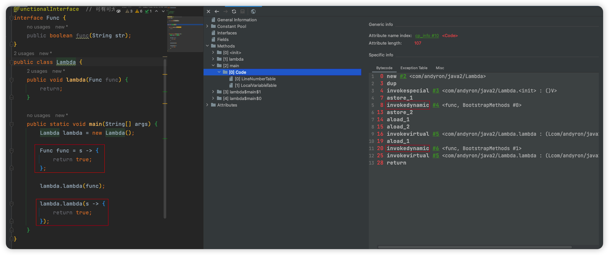

#### 方法重写的本质

Java语言中方法重写的本质：

1. 找到操作数栈顶的第一个元素所执行的对象的实际类型，记作C。
2. 如果在类型C中找到与常量中的描述符合简单名称都相符的方法，则进行访问权限校验，如果通过则返回这个方法的直接引用，查找过程结束；如果不通过，则返回`java.lang.IllegalAccessError`异常。

3. 否则，按照继承关系从下往上依次对C的各个父类进行第2步的搜索和验证过程。

4. 如果始终没有找到合适的方法，则拋出`java.lang.AbstractMethodError`异常（实现了接口的方法，没有子类重写）。

IllegalAccessError介绍：

程序试图访问或修改一个属性或调用一个方法，这个属性或方法，你没有权限访问。一般的，这个会引起编译器异常。这个错误如果发生在运行时，就说明一个类发生了不兼容的改变。

#### 虚方法表

- 在面向对象的编程中，会很频繁的使用到动态分派，如果在每次动态分派的过程中都要重新在类的方法元数据中搜索合适的目标的话就可能影响到执行效率。因此，为了提高性能，JVM采用在类的方法区建立一个==虚方法表(virtual method table）==（非虚方法不会出现在表中）来实现。使用索引表来代替查找。

- 每个类中都有一个虚方法表，表中存放着各个方法的实际入口。

- 那么虚方法表什么时候被创建？

  虚方法表会在类加载的链接阶段被创建并开始初始化，类的变量初始值淮备完成之后，JVM会把该类的方法表也初始化完毕。


例子2：


 

### 5.9 方法返回地址（return address）

- 存放调用该方法的**pc寄存器的值**。🔖p60

- 一个方法的结束，有两种方式：
  - 正常执行完成
  - 出现未处理的异常，非正常退出

- 无论通过哪种方式退出，在方法退出后都返回到该方法被调用的位置。方法正常退出时，<u>调用者的pc计数器的值作为返回地址，即调用该方法的指令的下一条指令的地址</u>。而通过异常退出的，返回地址是要通过异常表来确定，栈帧中一般不会保存这部分信息。

  本质上，方法的退出就是**当前栈帧出栈的过程**。此时，需要恢复上层方法的局部变量表、操作数栈、将返回值压入调用者栈帧的操作数栈、设置PC寄存器值等，让调用者方法继续执行下去。

  正常完成出口和异常完成出口的区别在于：==通过异常完成出口退出的不会给他的上层调用者产生任何的返回值。==

当一个方法开始执行后，只有两种方式可以退出这个方法：

1. 执行引擎遇到任意一个方法返回的字节码指令(`return`），会有返回值传递给上层的方法调用者，简称==正常完成出口==；

一个方法在正常调用完成之后究竟需要使用哪一个返回指令还需要根据方法返回值的实际数据类型而定。

在字节码指令中，返回指令包含`ireturn`（当返回值是boolean、byte、char、short和int类型时使用）、`lreturn`、`freturn`、`dreturn`以及`areturn`，另外还有一个`return`指令供声明为void的方法、实例初始化方法、类和接口的初始化方法使用。

2. 在方法执行的过程中遇到了异常(Exception），并且这个异常没有在方法内进行处理，也就是只要在本方法的异常表中没有搜索到匹配的异常处理器，就会导致方法退出。简称==异常完成出口==。

   方法执行过程中拋出异常时的异常处理，存储在一个==异常处理表==，方便在发生异常的时候找到处理异常的代码。

查看异常处理表：


### 5.10 一些附加信息

不确定有的

栈帧中还允许携带与Java虚拟机实现相关的一些附加信息。例如，对程序调试提供支持的信息。

### 5.11 栈的相关面试题

🔖

举例栈溢出的情况？

调整栈大小，就能保证不出现溢出吗？

分配的栈内存越大越好吗？

垃圾回收是否会涉及到處拟机栈？

方法中定义的局部变量是否线程安全？

## 6 本地方法接口

### 什么是本地方法？

简单地讲，**一个Native Method就是一个Java调用非Java代码的接口**。一个Native Method是这样一个Java方法：该方法的实现由**非Java语言实现**，比如C。这个特征并非Java所特有，很多其它的编程语言都有这一机制，比如在C+＋中，你可以用extern "C"告知C++编译器去调用一个C的函数。

"A native method is a Java method whose implementation isprovided by non-java code."

在定义一个native method时，并不提供实现体（有些像定义一个Java interface），因为其**实现体**是由非java语言在外面实现的。

本地接口的作用是融合不同的编程语言为Java所用，它的初衷是融合 C/C++程序。


标识符native可以与所有其他的java标识符连用，但是`abstract`除外。

### 为什么要使用Native Method?

Java使用起来非常方便，然而有些层次的任务用Java实现起来不容易，或者我们对程序的**效率**很在意时，问题就来了。

- 与Java环境外交互：

**有时Java应用需要与Java外面的环境交互，这是本地方法存在的主要原因。**

你可以想想Java需要与一些底层系统，如操作系统或某些硬件交换信息时的情况。本地方法正是这样一种交流机制：它为我们提供了一个非常简洁的接口，而且我们无需去了解Java应用之外的繁琐的细节。

- 与操作系统交互：

JVM支持着Java语言本身和运行时库，它是Java程序赖以生存的平台，它由一个解释器（解释字节码）和一些连接到本地代码的库组成。然而不管怎样，它毕竟不是一个完整的系统，它经常依赖于一些底层系统的支持。这些底层系统常常是强大的操作系统。**通过使用本地方法，我们得以用Java实现了jre的与底层系统的交互，甚至JVM的一些部分就是用c写的。**还有，如果我们要使用一些Java语言本身没有提供封装的操作系统的特性时，我们也需要使用本地方法。

- Sun's Java

sun的解释器是用C实现的，这使得它能像一些普通的C一样与外部交互。jre大部分是用Java实现的，它也通过一些本地方法与外界交互。例如：类java.lang.Thread的 `setPriority()`方法是用Java实现的，但是它实现调用的是该类里的本地方法`setPriority0()`。这个本地方法是用C实现的，并被植入JVM内部，在windows 95的平台上，这个本地方法最终将调用Win32 setPriority() API。这是一个本地方法的具体实现由JVM直接提供，更多的情況是本地方法由外部的动态链接库(external dynamic link 1ibrary)提供，然后被JVM调用。

### 现 状

**目前该方法使用的越来越少了，除非是与硬件有关的应用**，比如通过Java程序驱动打印机或者Java系统管理生产设备，在企业级应用中己经比较少见。因为现在的异构领域间的通信很发达，比如可以使用socket

通信，也可以使用web service等等，不多做介绍。

## 7 本地方法栈

- ==Java虚拟机栈用于管理Java方法的调用，而本地方法栈用于管理本地方法的调用。==

- 本地方法栈，也是线程私有的。

- 允许被实现成固定或者是可动态扩展的内存大小。(在内存溢出方面是相同的）
  + 如果线程请求分配的栈容量超过本地方法栈允许的最大容量，Java虛拟机将会拋出一个 StackOverflowError异常。
  + 如果本地方法栈可以动态扩展，并且在尝试扩展的时候无法申请到足够的内存，或者在创建新的线程时没有足够的内存去创建对应的本地方法栈，那么Java虛拟机将会抛出一个 OutOfMemoryError 异常。

- 本地方法是使用C语言实现的。

- 它的具体做法是Native Method stack中登记native方法，在Execution Engine 执行时加载本地方法库。

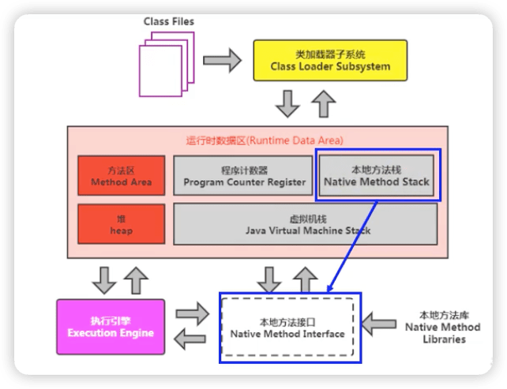

- ==当某个线程调用一个本地方法时，它就进入了一个全新的并且不再受虚拟机限制的世界。它和虚拟机拥有同样的权限。==
  + 本地方法可以通过本地方法接口来<u>访问虛拟机内部的运行时数据区</u>。
  + 它甚至可以直接使用本地处理器中的寄存器
  + 直接从本地内存的堆中分配任意数量的内存。

- 并不是所有的JVN都支持本地方法。因为Java虛拟机规范并没有明确要求本地方法栈的使用语言、具体实现方式、数据结构等。如果JVM产品不打算支持native方法，也可以无需实现本地方法栈。

- 在Hotspot JVM中，直接将**本地方法栈和虚拟机栈合二为一**。

> P65 🔖 JVM学习路线
>
> 

## 8 堆❤️

> 一个进程对应一个JVM实例，一个JVM实例就对应一个方法区和堆。

### 8.1 堆的核心概述

- 一个JVM实例只存在一个堆内存，堆也是Java内存管理的核心区域。

通过对同样的程序设置不同vm参数来验证，`-Xms10m -Xmx10m`,`-Xms20m -Xmx20m`

工具 Java VisualVM https://visualvm.github.io/


- Java堆区在JVM启动的时候即被创建，其空间大小也就确定了。是JVM管理的最大一块内存空间。

  堆内存的大小是可以调节的。I

- 《Java虚拟机规范》规定，堆可以处于==物理上不连续==的内存空间中，但在==逻辑上==它应该被视为==连续==的。

- 所有的线程共享Java堆，在这里还可以划分==线程私有的缓冲区== (ThreadLocal Allocation Buffer, TLAB)。

- 《Java虛拟机规范》中对Java堆的描述是：所有的对象实例以及数组都应当在运行时分配在堆上。 (The heap is the run-time data area fromwhich memory for all class instances and arrays is allocated )

  我要说的是：==“几乎”==所有的对象实例都在这里分配内存。一从实际使用角度看的。

  ==逃逸分析==（可能分配到栈上）

- 数组和对象可能永远不会存储在栈上，因为栈帧中保存引用，这个引用指向对象或者数组在堆中的位置。

  

- 在方法结束后，堆中的对象不会马上被移除，仅仅在垃圾收集的时候才会被移除。

  垃圾收集线程一般在不忙时才开启，频繁的GC会影响用户进程

- 堆，是GC (Garbace collection，垃圾收集器）执行垃圾回收的重点区域。


#### 堆内存细分

现代垃圾收集器大部分都基于分代收集理论设计，堆空间细分为：


`-XX:+PrintGCDetails` 打印gc细节


### 8.2 设置堆内存大小与OOM

#### 堆空间大小的设置

- Java堆区用于存储Java对象实例，那么堆的大小在了VM启动时就已经设定好了，大家可以通过选项”-Xmx“和”-Xms〞来进行设置。
  + “`-Xms`“用于表示堆区的起始内存，等价于`-XX:InitialHeapSize`
  + “`-Xmx`”则用于表示堆区的最大内存，等价于`-XX:MaxHeapSize`

- 一旦堆区中的内存大小超过“-Xmx “所指定的最大内存时，将会拋出OutOfMemoryError异常。

- 通常会将-Xms 和 -Xmx两个参数配置**==相同==**的值，其目的是为了能够在java垃圾回收机制清理完堆区后不需要重新分隔计算堆区的大小，从而提高性能。

  如果起迟内存小，堆内存在使用过程就可能会不停的扩容，使用完了还需要归还，频繁这些操作（GC）影响性能。

- 默认情况下，初始内存大小：物理电脑内存大小 / 64，最大内存大小：物理电脑内存大小 / 4

```java
public class HeapSpaceInitial {
    public static void main(String[] args) {
        // 返回Java虚拟机中的堆内存总量
        long initalMemory = Runtime.getRuntime().totalMemory() / 1024 / 1024;
        // 返回Java虚拟机试图使用的最大堆内存量
        long maxMemory = Runtime.getRuntime().maxMemory() / 1024 / 1024;

        System.out.println("-Xms: " + initalMemory + "M");
        System.out.println("-Xmx: " + maxMemory + "M");
        System.out.println("系统内存大小：" + initalMemory * 64.0 / 1024 + "G");
        System.out.println("系统内存大小：" + maxMemory * 4.0 / 1024 + "G");
    }
}
```

如果手动设置 `-Xms600m -Xmx600m`

> `jstat -gc` 查看对应进程内存使用情况

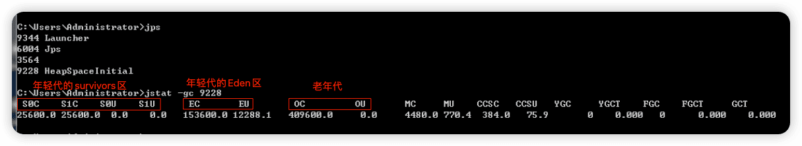

这年轻代和老年代都加起来是600m，但上面代码算出的结构是575m，这是s1和s0值使用一个（GC的复制算法）。

- 查看设置的堆空间信息

  方式一： jps + jstat

  方式二：-XX:+PrintGCDetails


> `Error` 错误，`Exception` 异常
>
> 平常所说的“异常”可以理解为广义上的，包括上面的两个，只要程序错都说为“异常”

#### OutOfMemory举例

`java.lang.OutOfMemoryError: Java heap space`


可通过VisualVM查看堆空间变化

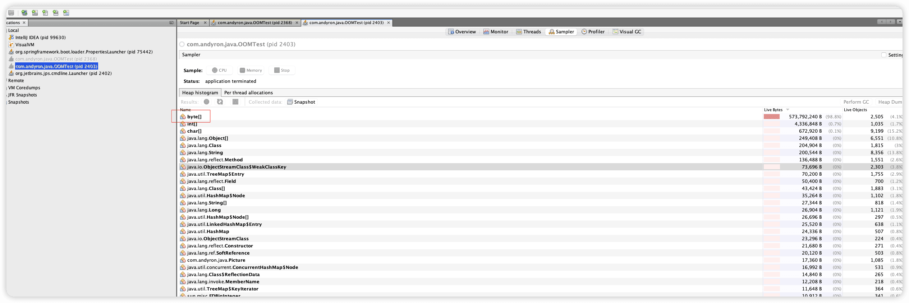


### 8.3 年轻代与老年代

- 存储在JVM中的Java对象可以被划分为两类：

  一类是生命周期较短的瞬时对象，这类对象的创建和消亡都非常迅速

  另外一类对象的生命周期却非常长，在某些极端的情况下还能够与JVM的生命周期保持一致。

- Java堆区进一步细分的话，可以划分为==年轻代（YoungGen）==和==老年代(OldGen)==（也叫Tenured）

- 其中年轻代又可以划分为==Eden空间==、==Survivor0空间==和==Survivor1空间==（有时也叫做from区、to区）。

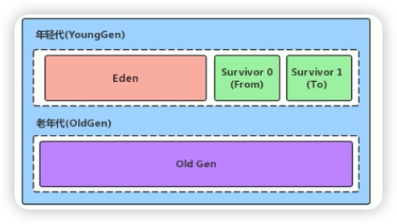

下面这参数开发中一般不会调：


配置新生代与老年代在堆结构的占比。

- 默认`-XX:NewRatio=2`，表示新生代占1，老年代占2，新生代占整个堆的1/3

- 可以修改`-XX:NewRatio=4`，表示新生代古1，老年代占4，新生代占整个堆的1/5

如果知道生命周期比较长的对象比较多，可以把老年代调大一些。

- 在Hotspot中，Eden空间和另外两个Survivor空间缺省所占的比例是8:1:1

- 当然开发人员可以通过选项“`-XX:SurvivorRatio`”调整这个空间比例。比如`-XX:SurvivorRatio=8`

- <u>几乎所有</u>（如果一个对象大于Eden区）的Java对象都是在Eden区被new出来的。

- 绝大部分的Java对象的销毁都在新生代进行了。

  IBM 公司的专门研究表明，新生代中 80% 的对象都是“朝生夕死”的。

- 可以使用选项`-Xmn`设置新生代最大内存大小。

  这个参数一般使用默认值就可以了。


```shell
➜  bin jps
75442 nacos-server.jar
2358 Main
3212 Launcher
3213 EdenSurvivorTest
3214 Jps
99630
➜  bin jinfo -flag NewRatio 3213
-XX:NewRatio=2
➜  bin jinfo -flag SurvivorRatio 3213
-XX:SurvivorRatio=8
```


### 8.4 图解对象分配过程

为新对象分配内存是一件非常严谨和复杂的任务，JVM的设计者们不仅需要考虑内存如何分配、在哪里分配等问题，并且由于内存分配算法与内存回收算法密切相关，所以还需要考虑GC执行完内存回收后是否会在内存空间中产生内存碎片。

1. new的对象先放伊甸园区。此区有大小限制。

2. 当伊甸园的空间填满时，程序又需要创建对象，JVM的垃圾回收器将对伊甸园区进行垃圾回收(Minor GC)，将伊甸园区中的不再被其他对象所引用的对象进行销毀。再加载新的对象放到伊甸园区。

3. 然后将伊甸园中的剩余对象移动到幸存者0区。

4. 如果再次触发垃圾回收，此时上次幸存下来的放到幸存者0区的，如果没有回收，就会放到幸存者1区。

5. 如果再次经历垃圾回收，此时会重新放回幸存者0区，接着再去幸存者1区。

6. 啥时候能去养老区呢？可以设置次数。默认是15次。

   可以设置参数：`-XX:MaxTenuringThreshold=<N>`进行设置。

> s0和s1也叫，from和to区，它们之间是互相转变的。每次执行完GC后，谁是空谁是to区，下次eden区对象过来时，就放入to区。

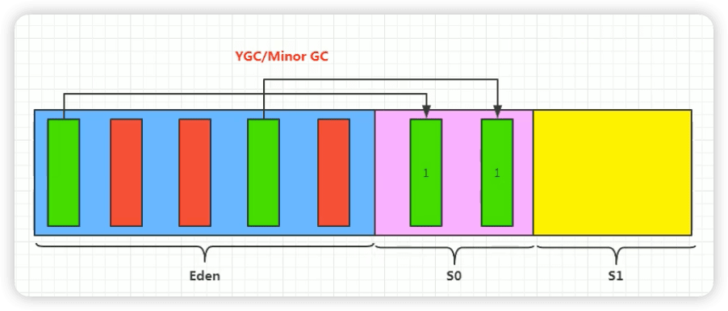

当Eden对象放满后，经过垃圾回收器Minor GC（也叫YGC）处理，部分对象回收（红色），绿色的还占用就移动到Survivor区，并为每个对象分配一个**年龄计数器**（age:1）；


之后，再有对象进入Eden区，放满后，Minor GC再次清理；

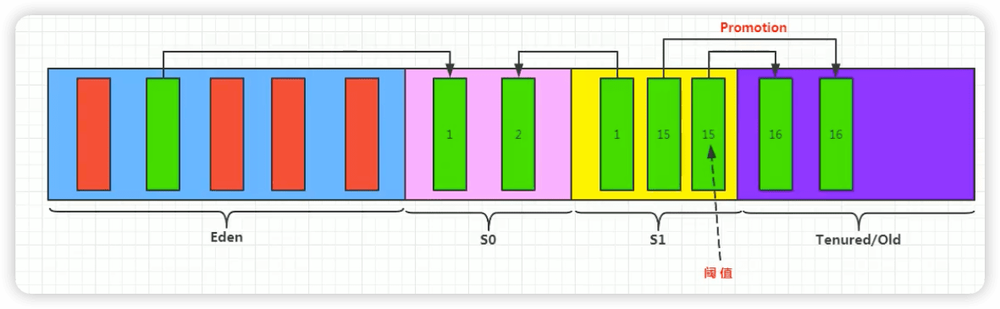

年龄计数器达到阈值（默认15）后，就把对象晋升（Promotion）到老年代。

> 当Eden区满主动会触发gc（会把eden全部清理），而Survivor区满时不会触发gc，gc在清理时会同时清理Survivor区（被动清理）。
>
> 关于垃圾回收：频繁在新生代收集，很少在养老区收集，几乎不在永久区/元空间收集。

#### 对象分配的特殊情况


 

代码举例，再通过VisualVM观察内存变化过程

```java
/**
 * -Xms600m -Xmx600m
 * @author andyron
 **/
public class HeapInstanceTest {
    byte[] buffer = new byte[new Random().nextInt(1024 * 1024)];

    public static void main(String[] args) {
        ArrayList<HeapInstanceTest> list = new ArrayList<>();
        while (true) {
            list.add(new HeapInstanceTest());
            try {
                Thread.sleep(10);
            } catch (InterruptedException e) {
                e.printStackTrace();
            }
        }
    }
}
```


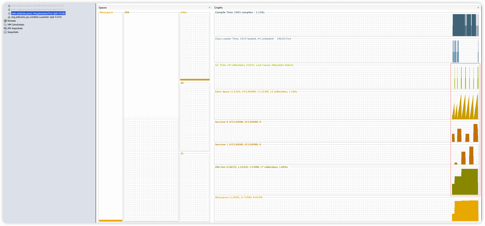

最终老年代满了，进行Major GC，发现老年代对象都不能进行回收后就OOM。


#### 常用调优工具

- JDK命令行
- Eclipse:Memory Analyzer Tool

- Jconsole

- VisualVM

- [Jprofiler](https://www.ej-technologies.com/products/jprofiler/overview.html)  安装完后可以再安装idea对应插件

- Java Flight Recorder

- GCViewer

- GC Easy

### 8.5 Minor GC、Major GC、Full GC

> GC过程中可能会导致用户线程暂停，Major GC、Full GC导致的暂停时间是Minor GC的十倍以上，所以

针对它们调优。

JVM在进行GC时，并非每次都对上面<u>三个内存（新生代、老年代；方法区）</u>区域一起回收的，大部分时候回收的都是指新生代。

针对Hotspot VM的实现，它里面的GC按照回收区域又分为两大种类型：一种是==部分收集（Partial GC)==，一种是==整堆收集 (Full GC)==。

- 部分收集：不是完整收集整个Java堆的垃圾收集。其中又分为：

  + 新生代收集 (Minor GC / Young GC)：只是新生代的垃圾收集

  + 老年代收集(Major GC / Old GC)：只是老年代的垃圾收集。

    目前，只有==CMS GC==会有单独收集老年代的行为。

    注意，很多时候<u>Major GC会和Full GC混淆使用</u>，需要具体分辦是老年代回收还是整堆回收。

  + 混合收集 (Mixed GC)：收集整个新生代以及部分老年代的垃圾收集。

    目前，只有==G1 GC==会有这种行为

- 整堆收集（Full GC)：收集整个java堆和方法区的垃圾收集。

 

#### 最简单的分代式GC策略的触发条件

- 年轻代GC(Minor Gc)触发机制：
  + 当年轻代空间不足时，就会触发Minor GC，这里的年轻代满指的是Eden代满，Survivor满不会引发GC。（每次 Minor GC 会清理年轻代的内存。）
  + 因为 Java 对象大多都具备朝生夕灭的特性，所以 Minor GC 非常频繁，一般回收速度也比较快。这一定义既清晰又易于理解。
  + Minor GC会引发==STW==，暂停其它用户的线程，等垃圾回收结束，用户线程才恢复运行。

> STW: Stop-The-World: 是在垃圾回收算法执⾏过程当中，将JVM内存冻结丶应用程序停顿的⼀种状态。


- 老年代GC (Major GC/Full GC） 触发机制：

  + 指发生在老年代的GC，对象从老年代消失时，我们说“Major Gc” 或“Full GC”发生了。

  + 出现了Major GC，经常会伴随至少一次的Minor Gc（但非绝对的，在Parallel Scavenge收集器的收集策略里就有直接进行Major Gc的策略选择过程）。

    也就是在老年代空间不足时，会先尝试触发Minor Gc。如果之后空间还不足，则触发Major GC。

  + Major GC的速度一般会比Minor GC慢1日倍以上，STW的时间更长。
  + 如果Major GC 后，内存还不足，就报OOM了。

- Full GC触发机制：（后面细讲）

触发Full GC 执行的情况有如下五种：

1. 调用system.gc()时，系统建议执行Full GC，但是不必然执行

2. 老年代空间不足

3. 方法区空间不足

4. 通过Minor GC后进入老年代的平均大小大于老年代的可用内存

5. 由Eden、 survivor spacea (From space）区向survivor space1 (Tospace）区复制时，对象大小大于To space可用内存，则把该对象转存到老年代，且老年代的可用内存小于该对象大小

说明：<u>full gc是开发或调优中尽量要避免的。这样暂时时间会短一些。</u>


```java
/**
 * 测试Minor GC、Major GC、Full GC
 * -Xms9m -Xmx9m -XX:+PrintGCDetails
 *
 * @author andyron
 **/
public class GCTest {
    public static void main(String[] args) {
        int i = 0;
        try {
            List<String> list = new ArrayList<>();
            String a = "andyron.com";  // 字符串存储在堆空间
            while (true) {
                list.add(a);
                a = a + a;
                i++;
            }
        } catch (Throwable t) {
            t.printStackTrace();
            System.out.println("遍历次数为： " + i);
        }
    }
}

```

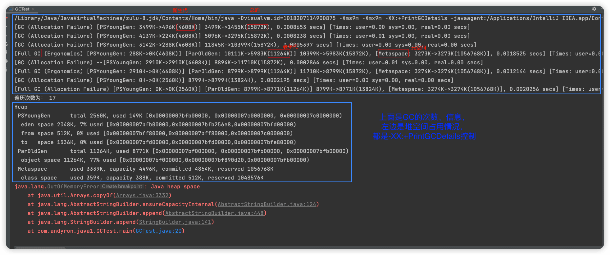

### 8.6 对空间分代思想

> 为什么需要把Java堆分代？不分代就不能正常工作了吗？

- 经研究，不同对象的生命周期不同。70%-99%的对象是临时对象。

  新生代：有Eden、两块大小相同的Survivor（又称为from/to，s0/s1）构成，to总为空。

  老年代：存放新生代中经历多次GC仍然存活的对象。

- 其实不分代完全可以，分代的唯一理由就是==优化GC性能==。如果没有分代，那所有的对象都在一块，就如同把一个学校的人都关在一个教室。GC的时候要找到哪些对象没用，这样就会对堆的所有区域进行扫描。而很多对象都是朝生夕死的，如果分代的话，把新创建的对象放到某一地方，当GC的时候先把这块存储“朝生夕死“对象的区域进行回收，这样就会腾出很大的空间出来。

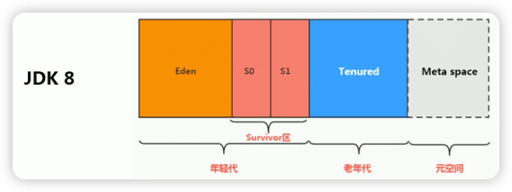

### 8.7 内存分配策略

内存分配策略（或对象提升(Promotion)规则）

一般规则：

如果对象在Eden出生并经过第一次Minor GC 后仍然存活，并且能被Survivor容纳的话，将被移动到Survivor 空间中，并将对象年龄设为1。对象在Survivor区中每熬过一次Minor Gc，年龄就增加1岁，当它的年龄增加到一定程度（默认为15 岁，其实每个JVM、每个GC都有所不同）时，就会被晋升到老年代

中。

对象晋升老年代的年龄國值，可以通过选项`-xx:MaxTenuringThreshold`来设置。


针对不同年龄段的对象分配原则如下所示：

- 优先分配到Eden

- 大对象直接分配到老年代

  尽量避免程序中出现过多的大对象（占用连续大的内存空间）

- 长期存活的对象分配到老年代

- ==动态对象年龄判断==

  如果survivor区中相同年龄的所有对象大小的总和大于Survivor空间的一半，年龄大于或等于该年龄的对象可以直接进入老年代，无须等到`MaxTenuringThreshold` 中要求的年龄。

- 空间分配担保

    `-XX:HandlePromotionFailure`

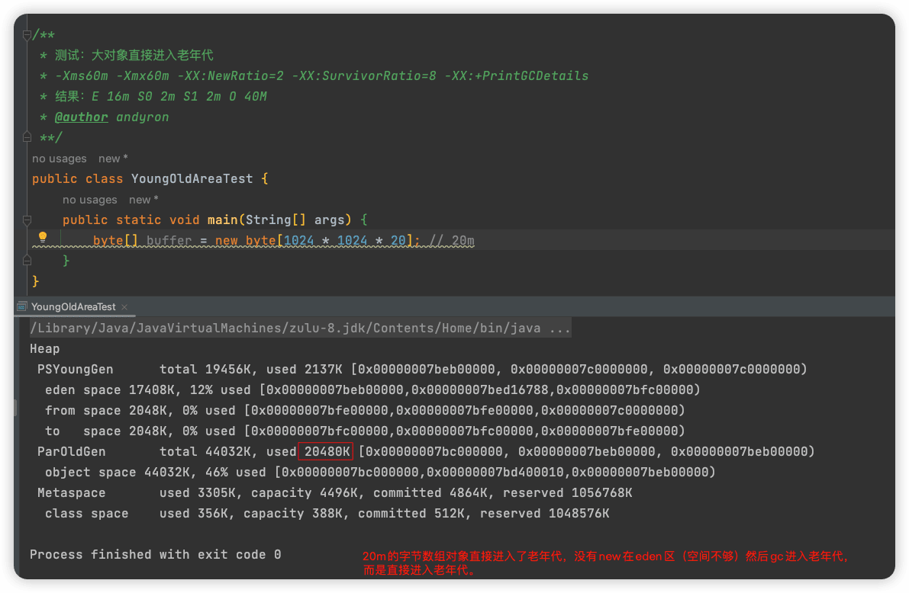


### 8.8 为对象分配内存：TLAB

#### 为什么有TLAB ( Thread Local Allocation Buffer)?

- 堆区是线程共享区域，任何线程都可以访问到堆区中的共享数据

- 由于对象实例的创建在JVM中非常频繁，因此在并发环境下从堆区中划分内存空间是线程不安全的

- 为避纪多个线程操作同一地址，需要使用加锁等机制，进而影响分配速度。

#### 什么是TLAB？

- 从内存模型而不是垃圾收集的角度，对Eden区域继续进行划分，JVM为每个线程分配了一个私有缓存区域，它包含在Eden空间内。
- 多线程同时分配内存时，使用TLAB可以避免一系列的非线程安全问题，同时还能够提升内存分配的吞吐量，因此我们可以将这种内存分配方式称之为==快速分配策略==。
- 据我所知所有OpenJDK衍生出来的JVM都提供了TLAB的设计。


**TLAB的再说明**：

- 尽管不是所有的对象实例都能够在TLAB中成功分配内存，但<u>JVM确实是将TLAB作为内存分配的首选</u>。

- 在程序中，开发人员可以通过选项“`-XX:UseTLAB`”设置是否开启卫IAB空间。

  ```shell
  ➜  ~ jinfo -flag UseTLAB 18307
  -XX:+UseTLAB
  ```

- 默认情况下，TLAB空间的内存非常小，==仅占有整个Eden空间的1%==，当然我们可以通过选项 `-XX:TLABWasteTargetPercent`，设置TLAB空间所占用Eden空间的百分比大小。

- 一旦对象在TLAB空间分配内存失败时，JVM就会尝试着通过==使用加锁机制==确保数据操作的原子性，从而直按在Eden空间中分配内存。


### 8.9 小结堆空间的参数设置

🔖p81

官网：https://docs.oracle.com/javase/8/docs/technotes/tools/unix/java.html

- `-XX:+PrintFlagsInitial`：查看所有的参数的默认初始值

- `-XX:+PrintFlagsFinal`：查看所有的参数的最终值（<u>可能会存在修改，不再是初始值</u>）

  可用命令行工具查看某个参数的值： jps， `jinfo -flag SurvivorRatio 进程id`

  

- `-Xms`：初始堆空间内存 （默认为物理内存的1/64）

- `-Xmx`：最大堆空问内存（默认为物理内存的1/4）

- `-Xmn`：设置新生代的大小。（初始值及最大值）

- `-XX:NewRatio`：配置新生代与老年代在堆结构的占比

- `-XX:SurvivorRatio`：设置新生代中Eden和so/S1空间的比例

- `-XX:MaxTenuringThreshold`：设置新生代垃圾的最大年龄

- `-XX:+PrintccDetails`：输出详细的GC处理日志

  打印gc简要信息：①`-XX:+PrintGC` ②`-verbose:gc`

- `-XX:HandlePromotionFailure`：是否设罝空间分配担保

在发生Minor GC之前，虚拟机会==检查老年代最大可用的连续空间是否大于新生代所有对象的总空间。==

- 如果大于，则此次Minor GC是安全的

- 如果小于，则虚拟机会查看`-XX:HandlePromotionFailure`设置值是否允许担保失败。

  + 如果HandlePromotionFailure=true，那么会继续==检查老年代最大可用连续空间是否大于历次晋升到老年代的对象的平均大小。==

    如果大于，则尝试进行一次Minor GC，但这次Minor GC依然是有风险的；

    如果小于，则改为进行一次Full GC。

  + 如果HandlePromotionFailure=false，则改为进行一次Full GC。

在JDK6 Update24之后 (JDK7)，HandlePromotionFailure参数不会再影响到虛拟机的空间分配担保策略，观察OpenJDK中的源码变化，虽然源码中还定义了HandlePromotionFailure参数，但是在代码中已经不会再使用它。JDK6 Update24之后的规则变为==只要老年代的连续空间大于新生代对象总大小或者历次晋升的平均大小就会进行Minor CC==， 否则将进行Full GC。


### 8.10 堆是分配对象的唯一选择吗

🔖🔖p82 // TODO


## 9 方法区❤️

P87

### 9.1 栈、堆、方法区的交互关系

#### 运行时数据区结构图

从线程共享与否的角度来看：


### 9.2 方法区的理解 

https://docs.oracle.com/javase/specs/jvms/se8/html/jvms-2.html#jvms-2.5.4

> The Java Virtual Machine has a *method area* that is shared among all Java Virtual Machine threads. The method area is analogous to the storage area for compiled code of a conventional language or analogous to the "text" segment in an operating system process. It stores per-class structures such as the run-time constant pool, field and method data, and the code for methods and constructors, including the special methods ([§2.9](https://docs.oracle.com/javase/specs/jvms/se8/html/jvms-2.html#jvms-2.9)) used in class and instance initialization and interface initialization.
>
> The method area is created on virtual machine start-up. Although the method area is logically part of the heap, simple implementations may choose not to either garbage collect or compact it. This specification does not mandate the location of the method area or the policies used to manage compiled code. The method area may be of a fixed size or may be expanded as required by the computation and may be contracted if a larger method area becomes unnecessary. The memory for the method area does not need to be contiguous.
>
> A Java Virtual Machine implementation may provide the programmer or the user control over the initial size of the method area, as well as, in the case of a varying-size method area, control over the maximum and minimum method area size.
>
> The following exceptional condition is associated with the method area:
>
> - If memory in the method area cannot be made available to satisfy an allocation request, the Java Virtual Machine throws an `OutOfMemoryError`.

《Java虚拟机规范》中明确说明：〝尽管所有的方法区在逻辑上是属于堆的一部分，但一些简单的实现可能不会选择去进行垃圾收集或者进行压缩。”但对于HotSpotJVM而言，方法区还有一个别名叫做Non-Heap（非堆），目的就是要和堆分开。

所以，==方法区看作是一块独立于Java堆的内存空间==。


- 方法区 （Method Area）与Java堆一样，是各个线程共享的内存区域。
- 方法区在JVM启动的时候被创建，并且它的实际的物理内存空间中和Java堆区一样都可以是不连续的。
- 方法区的大小，跟堆空间一样，可以选择固定大小或者可扩展。
- 方法区的大小决定了系统可以保存多少个类，如果系统定义了太多的类，导致方法区溢出，虚拟机同样会抛出内存溢出错误：`java.lang.OutOfMemoryError:PermGen space` 或者`java.lang.OutOfMemoryError:Metaspace`。
  + 加载大量的第三方jar包；
  + Tomcat部署的工程过多（30-50个）；
  + 大量动态的生成反射类。
- 关闭JVM就会释放这个区域的内存。

#### Hotspot方法区的演进

- 在jdk7及以前，习惯上把方法区，称为永久代。jdk8开始，使用元空间取代了永久代。

- 本质上，方法区和永久代并不等价。仅是对hotspot而言的。《Java虚拟机规范》对如何实现方法区，不做统一要求。例如：BEA JRockit/ IBM J9中不存在永久代的概念。
  + 现在来看，当年使用永久代，不是好的idea。导致Java程序更容易OOM（超过`-XX:MaxPermsize`上限）

- 而到了JDK 8，终于完全废弃了水久代的概念，改用与JRockit、J9一样在本地内存中实现的元空间 (Metaspace）来代替.
- 元空间的本质和永久代类似，都是对JVM规范中方法区的实现。不过元空间与永久代最大的区别在于：==元空间不在虚拟机设置的内存中，而是使用本地物理内存。==
- 永久代、元空间二者并不只是名字变了，内部结构也调整了。
- 根据 《Java虚拟机规范》的规定，如果方法区无法满足新的内存分配需求时，将抛出OOM异常。


### 9.3 设置方法区大小与OOM

- 方法区的大小不必是固定的，jvm可以根据应用的需要动态调整。

- jdk7及以前：
  + 通过`-XX:Permsize`来设置永久代初始分配空间。默认值是20.75M
  +  `-XX:MaxPermsize`来设定永久代最大可分配空间。32位机器默认是64M，64位机器模式是82M
  + 当JVM加载的类信息容量超过了这个值，会报异常`OutOfMemoryError:PermGen space` 
- jak8及以后：
  + 元数据区大小可以使用参数`-XX:MetaspaceSize`和`-XX:MaxMetaspaceSize`指定，替代上述原有的两个参数。
  + 默认值依赖于平台。windows下，`-XX:Metaspacesize`是21M，`-XX:MaxMetaspaceSize`的值是-1，即没有限制。
  + 
  + `-XX:Metaspacesize`设置初始的元空间大小。对于一个64位的服务器端JVM来说，其默认的`-XX:Metaspacesize`值为21MB。这就是初始的高水位线，一旦触及这个水位线，Full GC将会被触发并卸载没用的类(即这些类对应的类加载器不再存活），然后这个高水位线将会**重置**。新的高水位线的值取决于GC后释放了多少元空间。如果释放的空间不足，那么在不超过MaxMetaspacesize时，适当提高该值。如果释放空间过多，则适当降低该值。
  + 如果初始化的高水位线设置过低，上述高水位线调整情况会发生很多次。通过垃圾回收器的日志可以观祭到Full GC多次调用。为了避免频緊地GC，建议将`-XX:MetaspaceSize`设置为一个相对较高的值。


```shell
~ jinfo -flag MetaspaceSize 45094
-XX:MetaspaceSize=21807104
```

#### 如何解决这些OOM？

1. 要解决OOM异常或heap space的异常，一般的手段是首先通过**内存映像分析工具**（如Eclipse Memory Analyzer）对dump出来的堆转储快照进行分析，重点是确认内存中的对象是否是必要的，也就是要先分清楚到底是出现了**内存泄漏** (Memory Leak🔖p91）还是内存溢出 (Memory Overflow)。
2. 如果是内存泄漏，可进一步通过工具查看泄漏对象到GC Roots 的引用链。于是就能找到泄漏对象是通过怎样的路径与GC Roots 相关联并导致垃圾收集器无法自动回收它们的。掌握了泄漏对象的类型信息，以及GC Roots 引用链的信息，就可以比较准确地定位出泄漏代码的位置。
3. 如果不存在内存泄漏，换句话说就是内存中的对象确实都还必须存活着，那就应当检查虚拟机的堆参数（-Xmx 与-Xms），与机器物理内存对比看是否还可以调大，从代码上检查是否存在某些对象生命周期过长、持有状态时间过长的情况，尝试减少程序运行期的内存消耗。


### 9.4 方法区的内部结构

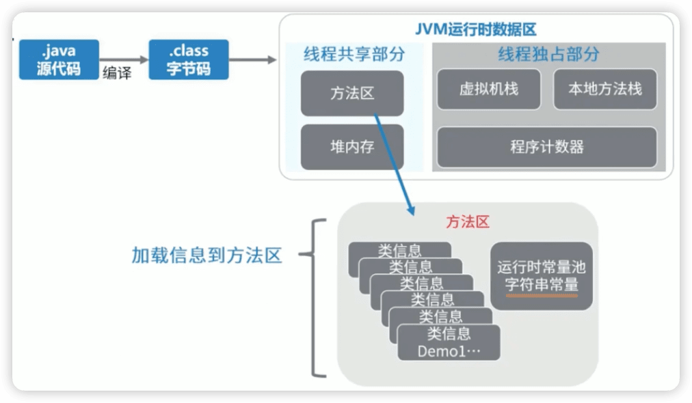

《深入理解Java 虛拟机》书中对方法区 （Method Area）存储内容描述如下：

它用于存储己被虚拟机加载的==类型信息、常量、静态变量、即时编译器编详后的代码缓存==等。（经典版本是这样存储的，有时会有些变化）

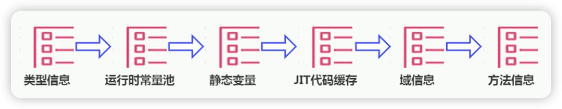

> 方法区中记录了，class文件经过类加载器子系统后，被哪个ClassLoader加载。

` javap -v -p MethodInnerStructTest.class `

#### 类型信息

对每个加载的类型（类class、接口interface、枚举enum、注解annotation），JVM必须在方法区中存储以下类型信息：

1. 这个类型的完整有效名称（全名=包名.类名）
2. 这个类型直接父类的完整有效名(对于interface或是java.lang.object，都没有父类）
3. 这个类型的修饰符 (public，abstract，final的某个子集）

4. 这个类型直接接口的一个有序列表

#### 域(Field)信息

- JVM必须在方法区中保存类型的所有域的相关信息以及域的声明顺序。

- 域的相关信息包括：域名称、域类型、域修饰符 (public, private, protected, static, final, volatile, transient的某个子集）

#### 方法(Method)信息

JVM必须保存所有方法的以下信息，同域信息一样包括声明顺序：

- 方法名称

- 方法的返回类型（或 void)

- 方法参数的数量和类型（按顺序）

- 方法的修饰符 (public, private, protected, static, final,synchronized, native, abstract的一个子集）

- 方法的字节码(bytecodes)、操作数栈、局部变量表及大小 (abstract和native方法除外）

- 异常表（abstract和native方法除外）

  每个异常处理的开始位置、结束位置、代码处理在程序计数器中的偏移地址、被捕获的异常类的常量池索引

#### non-final的类常量

- 静态变量和类关联在一起，随着类的加载而加载，它们成为类数据在逻辑上的一部分。

- 类变量被类的所有实例共享，即使没有类实例时你也可以访问它。

```java
/**
 * 静态变量被类的所有实例共享，即使没有类实例时你也可以访问它。
 * @author andyron
 **/
public class MethodAreaTest {
    public static void main(String[] args) {
      Order order = null;
      order.hello();
        System.out.println(order.count);
    }
}
class Order {
    public static int count = 1;
  	public static final int number = 2;
		public static void hello() {
        System.out.println("hello!");
    }
}
```

`javap -v -p Order.class`


> 补充：全局常量：static final
>
> 被声明位final的类变量的处理方法则不痛，每个全局常量在编译的时候就被分配了。
>
> 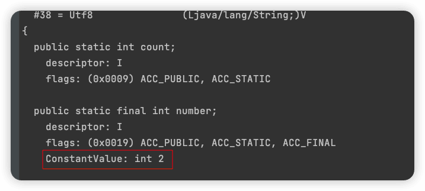

#### 运行时常量池 vs 常量池

- 方法区，内部包含了运行时常量池。
- 字节码文件，内部包含了常量池。
- 要弄清楚方法区，需要理解清楚ClassFile，因为加载类的信息都在方法区。
- 要弄清楚方法区的运行时常量池，需要理解清楚CLassFile中的常量池。

https://docs.oracle.com/javase/specs/jvms/se8/html/jvms-4.html


一个有效的字节码文件中除了包含类的版本信息、字段、方法以及接口等描述信息外，还包含一项信息那就是常量池表 (Constant Pool Table），包括各种==字面量==和对类型、域和方法的==符号引用==。

##### 为什么需要常量池？

一个java源文件中的类、接口，编译后产生一个字节码文件。而Java中的字节码需要数据支持，通常这种数据会很大以至于不能直接存到字节码里，换另一种方式，可以存到常量池，这个字节码包含了指向常量池的引用。在动态链接的时候会用到运行时常量池，之前有介绍。

比如：如下的代码：

```java
public class Simpleclass {
  public void sayHello() {
  	System.out.println("hello");
  }
}
```

虽然只有194字节，但是里面却使用了String、System、 Printstream及Object等结构。这里代码量其实己经很小了。如果代码多，引用到的结构会更多！这里就需要常量池了！

##### 常量池中有什么？

几种在常量池内存储的数据类型包括：

- 数量值
- 字符串值
- 类引用
- 字段引用
- 方法引用

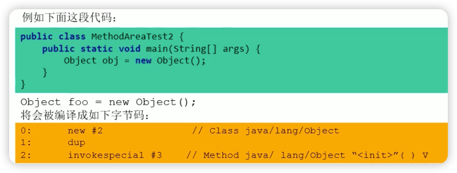

> 小结：
>
> 常量池，可以看做是一张表，虚拟机指令根据这张常量表找到要执行的类名、方法名、参数类型、字面量等类型。

#### 运行时常量池

- 运行时常量池 (Runtime constant Pool）是方法区的一部分。

- 常量池表(Constant Poo1 Table）是Class文件的一部分，用于存放编泽期生成的各种字面量与符号引用，这部分内容将在类加载后存放到方法区的运行时常量池中。

- 运行时常量池，在加载类和接口到虚拟机后，就会创建对应的运行时常量池。

- JVM为每个己加载的类型（类或接口）都维护一个常量池。池中的数据项像数组项一样，是通过==索引访问==的。

- 运行时常量池中包含名种不同的常量，包括编译期就己经明确的数值字面量，也包括到运行期解析后才能够获得的方法或者字段引用。此时不再是常量池中的符号地址了，这里换为==真实地址==。

  运行时常量池，相对于Class文件常量池的另一重要特征是：具备**==动态性==**。

- 运行时常量池类似于传统编程语言中的**符号表**(synbol table），但是它所包含的数据却比符号表要更加丰富一些。

- 当创建类或接口的运行时常量池时，如果构造运行时常量池所需的内存空间超过了方法区所能提供的最大值，则JVM会抛`OutOfMemoryError`异常。

### 9.5 方法区使用举例

```java
package com.andyron.java1;

/**
 * @author andyron
 **/
public class MethodAreaDemo {
    public static void main(String[] args) {
        int x = 500;
        int y = 100;
        int a = x / y;
        int b = 50;
        System.out.println(a + b);
    }
}
```


过程：


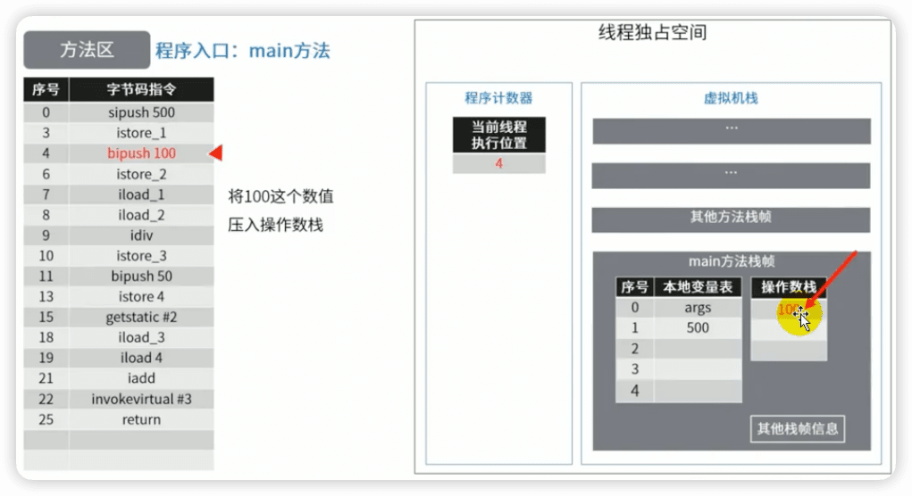    


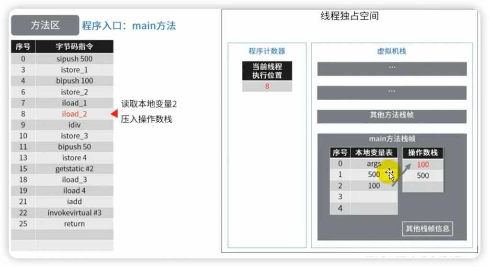

> 备注：
>
> 栈是**抽象数据类型**（**A**bstract **D**ata **T**ype，**ADT**）。

  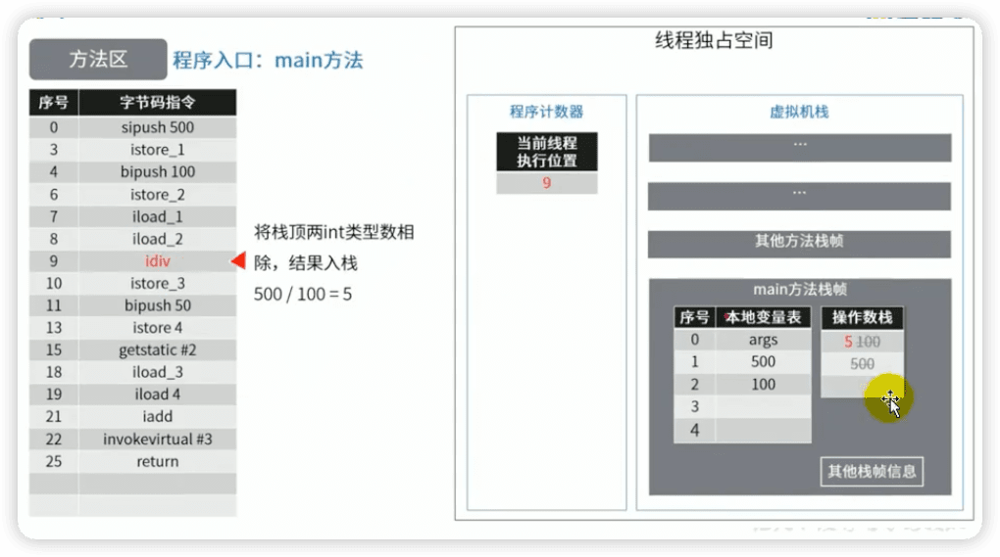

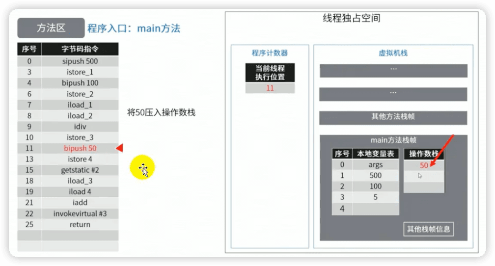


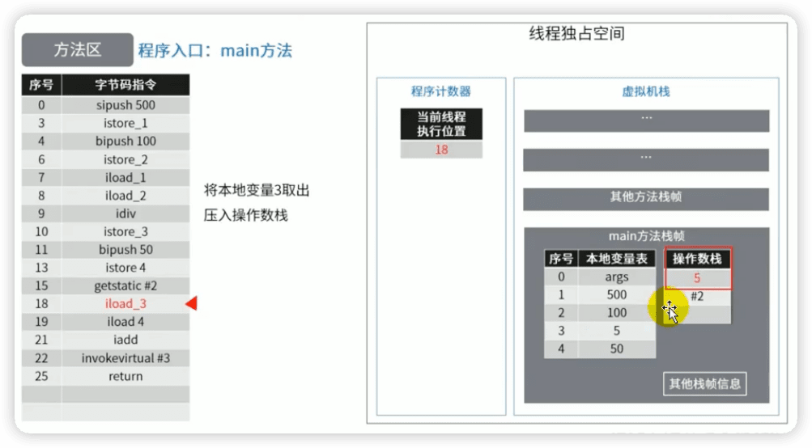


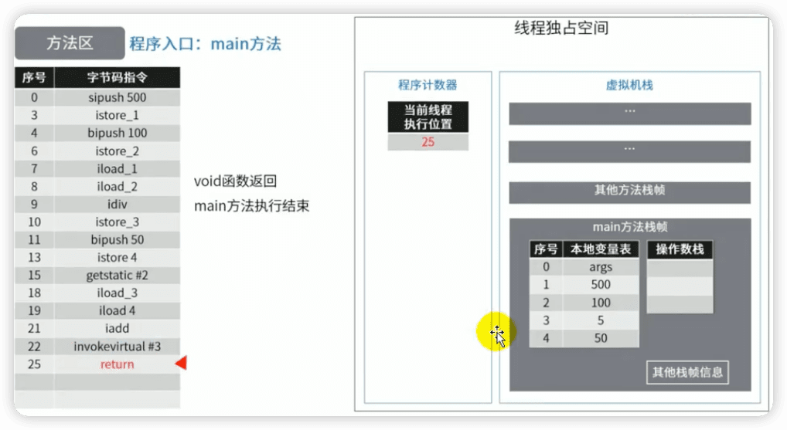 

### 9.6 方法区的演进细节

1. 首先明确：只有Hotspot才有永久代。BEA JRockit、IBM J9等来说，是不存在永久代的概念的。原则上如何实现方法区属于虚拟机实现细节，不受《Java虛拟机规范》管束，并不要求统一。

2. Hotspot中方法区的变化：

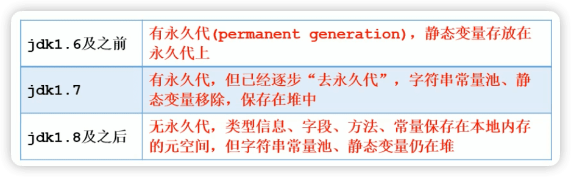


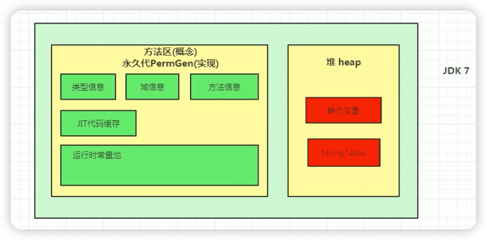


jdk8后，方法区不再使用虚拟机内存，而是使用本地内存独立叫作元空间。

#### 永久代为什么要被元空间替换？

https://openjdk.org/jeps/122

JEP 122: Remove the Permanent Generation

> ## Motivation
>
> This is part of the JRockit and Hotspot convergence effort. JRockit customers do not need to configure the permanent generation (since JRockit does not have a permanent generation) and are accustomed to not configuring the permanent generation.
>
> ## Description
>
> Move part of the contents of the permanent generation in Hotspot to the Java heap and the remainder to native memory.
>
> Hotspot's representation of Java classes (referred to here as class meta-data) is currently stored in a portion of the Java heap referred to as the permanent generation. In addition, interned Strings and class static variables are stored in the permanent generation. The permanent generation is managed by Hotspot and must have enough room for all the class meta-data, interned Strings and class statics used by the Java application. Class metadata and statics are allocated in the permanent generation when a class is loaded and are garbage collected from the permanent generation when the class is unloaded. Interned Strings are also garbage collected when the permanent generation is GC'ed.
>
> <u>The proposed implementation will allocate class meta-data in native memory and move **interned Strings**（字符串字面量） and class statics to the Java heap.</u> Hotspot will explicitly allocate and free the native memory for the class meta-data. Allocation of new class meta-data would be limited by the amount of available native memory rather than fixed by the value of -XX:MaxPermSize, whether the default or specified on the command line.
>
> Allocation of native memory for class meta-data will be done in blocks of a size large enough to fit multiple pieces of class meta-data. Each block will be associated with a class loader and all class meta-data loaded by that class loader will be allocated by Hotspot from the block for that class loader. Additional blocks will be allocated for a class loader as needed. The block sizes will vary depending on the behavior of the application. The sizes will be chosen so as to limit internal and external fragmentation. Freeing the space for the class meta-data would be done when the class loader dies by freeing all the blocks associated with the class loader. Class meta-data will not be moved during the life of the class.

- 随着Java8 的到来，Hotspot VM中再也见不到永久代了。但是这并不意味着类的元数据信息也消失了。这些数据被移到了一个与堆不相连的本地内存区域，这个区域叫做元空间(Metaspace )。

- 由于类的元数据分配在本地内存中，元空间的最大可分配空间就是系统可用内存空间。

- 这项改动是很有必要的，原因有：

  1. <u>为永久代设置空间大小是很难确定的。</u>

     在某些场景下，如果动态加载类过多，容易产生Perm 区的OOM。比如某个实际web工程中，因为功能点比较多，在运行过程中，要不断动态加载很多类，经常出现致命错误。

     

     而元空间和永久代之间最大的区别在于：元空间并不在虚拟机中，而是使用本地内存。因此，默认情况下，元空间的大小仅受本地内存限制。

  2. 对永久代进行调优是很困难的。

> 技术提升，不断问为什么！！
>
> 今日头条 python -> GO
>
> 技术深度体现了学习能力

#### StringTable（字符串常量池）为什么要调整（永久代 -> 堆）？

Jdk7中将stringrable放到了堆空间中。因为永久代的回收效率很低，在full gc的时候才会触发。而full gc是老年代的空间不足、永久代不足时才会触发。这就导致stringrable回收效率不高。而我们开发中会有大量的字符串被创建，回收效率低，导致永久代内存不足。放到堆里，能及时回收内存。

#### 静态变量放在哪里

```
/**
 * 结论：静态引用对应的对象实体始终都存在堆空间
 *
 * jdk 8:
 * -Xms200m -Xmx200m -XX:MetaspaceSize=300m -XX:MaxMetaspaceSize=300m -XX:+PrintGCDetails
 * @author andyron
 **/
public class StaticFieldTest {
    private static byte[] arr = new byte[1024 * 1024 * 100]; // 100MB

    public static void main(String[] args) {
        System.out.println(StaticFieldTest.arr);
    }
}
```

jdk7

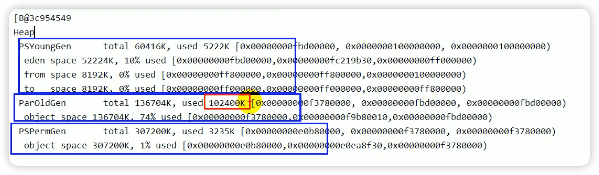

jdk8


```java
/**
 * 《深入理解Java虚拟机》中的案例：
 * staticObj、instanceObj、localObj三个变量本身存放在哪里？它们的对象放在哪里？
 * @author andyron
 **/
public class StaticObjTest {
    static class Test {
        static ObjectHolder staticObj = new ObjectHolder();
        ObjectHolder instanceObj = new ObjectHolder();

        void foo() {
            ObjectHolder localObj = new ObjectHolder();
            System.out.println("done");
        }
    }
    private static class ObjectHolder {
    }
    public static void main(String[] args) {
        Test test = new StaticObjTest.Test();
        test.foo();
    }
}
```

staticObj随着Test的类型信息存放在方法区，instanceObj随着Test的对象实例存放在Java堆，localObj则是存放在foo()方法栈帧的局部变量表中。

> jdk9引入的工具**jhsdb**。


测试发现：三个对象的数据在内存中的地址都落在Eden区范围内，所以结论：只要是对象实例必然会在Java堆中分配。

🔖p99

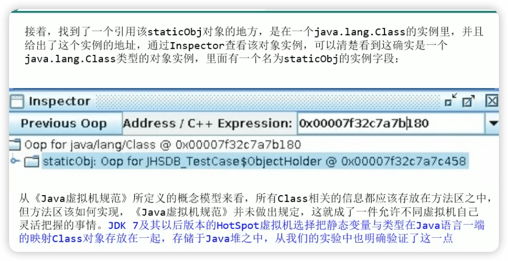

### 9.7 方法区的垃圾回收

有些人认为方法区（如Hotspot虚拟机中的元空间或者永久代）是没有垃圾收集行为的，其实不然。《Java虛拟机规范》对方法区的约束是非常宽松的，提到过可以不要求虚拟机在方法区中实现垃圾收集。事实上也确实有未实现或未能完整实现方法区类型卸载的收集器存在（如JDK 11时期的ZGC收集器就不支持类卸载）。

一般来说<u>这个区域的回收效果比较难令人满意，尤其是类型的卸载，条件相当苛刻</u>。但是这部分区域的回收**有时又确实是必要的**。以前sun公司的Bug列表中，曾出现过的若干个严重的Bug就是由于低版本的Hotspot虚拟机对此区域未完全回收而导致内存泄漏。

方法区的垃圾收集主要回收两部分内容：==常量池中废弃的常量和不再使用的类型==。

- 先来说说方法区内常量池之中主要存放的两大类常量：字面量和符号引用。字面量比较接近Java语言层次的常量概念，如文本字符串、被声明为final的常量值等。而符号引用则属于编译原理方面的概念，包括下面三类常量：
  1. 类和接口的全限定名
  2. 字段的名称和描述符
  3. 方法的名称和描述符

- Hotspot虚拟机对常量池的回收策略是很明确的，只==要常量池中的常量没有被任何地方引用，就可以被回收。==

- 回收废弃常量与回收Java堆中的对象非常类似。
- 判定一个常量是否 “废弃” 还是相对简单，而要判定一个类型是否属于 “不再被使用的类”的条件就比较苛刻了。需要同时满足下面三个条件：
  + 该类所有的实例都己经被回收，也就是Java堆中不存在该类及其任何派生子类的实例。
  + 加载该类的类加载器己经被回收，这个条件除非是经过精心设计的可替换类加载器的场景，如OSGi、 JSP的重加载等，否则通常是很难达成的。
  + 该类对应的java.lang.Class对象没有在任何地方被引用，无法在任何地方通过反射访问该类的方法。
- Java虚拟机被允许对满足上述三个条件的无用类进行回收，这里说的仅仅是“被允许”，而并不是和对象一样，没有引用了就必然会回收。关于是否要对类型进行回收，Hotspot虚拟机提供了`-Xnoclassgc`参数进行控制，还可以使用`-verbose:class`以及`-XX:+TraceClassLoading`、`-XX:+TraceclassUnLoading`查看类加载和卸载信息。
- 在大量使用反射、动态代理、CGLib等字节码框架，动态生成JSP以及OSGi这类频繁自定义类加载器的场景中，**通常都需要Java虚拟机具备类型卸载的能力，以保证不会对方法区造成过大的内在压力**。

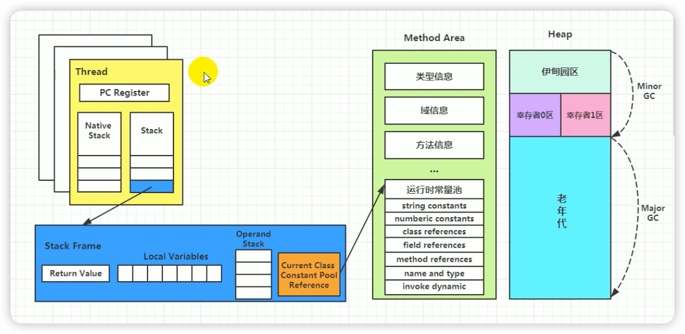

> Major GC是针对老年代，Full GC是相对整个堆（有时也包括方法区），这个两个概念有时被通用。

### 场景面试题

百度

三面：说一下JVM内存模型吧，有哪些区？分别干什么的？


蚂蚁金服：

Javag的内存分代改进

JVM 内存分哪几个区，每个区的作用是什么？

一面：JVM内存分布/内存结构？栈和堆的区别？堆的结构？为什么两个survivor区？

二面：Eden和survior的比例分配


小米：

jvM内存分区，为什么要有新生代和老年代


字节跳动：

二面：Java的内存分区

二面：讲讲jvm运行时数据库区

什么时候对象会进入老年代？


京东：

JVM的内存结构，Eden和Survivor比例。

JVM内存为什么要分成新生代，老年代，持久代。新生代中为什么要分为Eden和survivor。


天猫：

一面：Jvm内存模型以及分区，需要详细到每个区放什么。

一面：JVM的内存模型，Java8做了什么修改


拼多多：

JvM 内存分哪几个区，每个区的作用是什么？


美团：

java内存分配

jvm的永久代中会发生垃圾回收吗？

一面：jvm内存分区，为什么要有新生代和老年代？

## 10 对象的实例化内存布局与访问定位

> 对象在JVM中是怎么存储的？
>
> 对象头信息里面有哪些东西？

### 10.1 对象的实例化

#### 创建对象的方式

##### 1 new

最常见的方式

变形1：Xxx的静态方法

变形2：XxxBuilder/XxxFactory的静态方法

##### 2 Class的newInstance()

反射，只能调用空参的构造器，权限必须是public。

jdk9之后废弃，不建议使用。

##### 3 Constructor的newInstance(Xxx)

反射，可以调用空参、带参的构造器，权限没有要求。

##### 4 使用clone()

不用调用任何构造器，需要当前类实现Cloneable接口和clone()方法。

##### 5 第三方库Objenesis

https://github.com/easymock/objenesis


#### 创建对象的步骤

##### 1 判断对象对应的类是否加载、链接、初始化

虚拟机遇到一条new指令，首先去检查这个指令的参数能否在Metaspace的常量池中定位到一个类的符参引引用，并且检查这个符号引用代表的类是否已经被加载、解析和初始化。（即判断类元信息是否存在）。如果没有，那么在双亲委派模式下，使用当前类加载器以ClassLoader+包名+类名为key进行查找对应的.class 文件。如果没有我到文件，则抛出`ClassNotFoundException` 异常，如果找到，则进行类加载，并生成对应的Class类对象。

##### 2 为对象分配内存

首先计算对象占用空间大小，接着在堆中划分一块内存给新对象。如果实例成员变量是引用变量，仅分配引用变量空间即可，即4个字节大小。

- 如果内存是规整的，那么虛拟机将采用的是==指针碰撞法==(Bump The Pointer）来为对象分配内存。

  意思是所有用过的内存在一边，空闲的内存在另外一边，中间放着一个指针作为分界点的指示器，分配内存就仅仅是把指针向空闲那边挪动一段与对象大小相等的距离罢了。如果垃圾收集器选择的是Serial、ParNew这种基于压缩算法的，虛拟机采用这种分配方式。一股使用带有compact（整理）过程的收集器时，使用指针碰撞。

  **标记压缩算法**，Serial、ParNew

- 如果内存不规整，虚拟机需要维护一个列表，==空闲列表分配==。

  如果内存不是规整的，已使用的内存和未使用的内存相互交错（也就是会有大量碎片化），那么虛拟机将采用的是空闲列表法来为对象分配内存。

  意思是应拟机维护了一个列表，记录上哪些内存块是可用的，再分配的时候从列表中找到一块足够大的空间划分给对象实例，并更新列表上的内容。这种分配方式成为“空闲列表 ( Free List )。

  **标记清除算法**，CMS

> 选择哪种分配方式有Java堆是否规整决定，而java堆是否规整又由所采用的垃圾收集器是否带有压缩整理功能决定。

##### 3 处理并发安全问题

- 采用CAS失败重试、区域加锁保证更新的原子性
- 每个线程预先分配一块TLAB（通过`-XX:+/-UseTLAB）参数来设定

##### 4 初始化分配到的空间 1️⃣

所有属性设置默认值，保证对象实例字段在不赋值时可以直接使用。

> 给对象的属性赋值的操作：
>
> 1️⃣ 属性的默认初始化（零值初始阿虎）； 2️⃣显示初始化/3️⃣代码块中初始化； 4️⃣构造器中初始化

##### 5 设置对象的对象头 

将对象的所属类（即类的元数据信息）、对象的Hashcode和对象的GC信息、锁信息等数据存储

在对象的对象头中。这个过程的具体设置方式取决于JVM实现。

##### 6 执行init方法进行初始化 2️⃣ 3️⃣ 4️⃣

在Java程序的视角看来，初始化才正就开始。初始化成员变量，执行实例化代码块，调用类的构造方法，并把堆内对象的首地址赋值给引用变量。

因此一般来说（由字节码中是否跟随有`invokespecial`指令所决定），new指令之后会接着就是执行方法，把对象按照程序员的意愿进行初始化，这样一个真正可用的对象才算完全创建出来。


### 10.2 对象的内存布局🔖

> OpenJDK官方提供的[JOL(Java Object Layout)](https://github.com/openjdk/jol)工具，我可很方便分析、了解一个Java对象在内存当中的具体布局情况。

#### 1 对象头（Header）

##### 运行时元数据（Mark Word）

- 哈希值（HashCode）
- GC分代年龄：表示对象被GC的次数，当该次数到达阈值的时候，对象就会转移到老年代。
- 锁状态标志
- 线程持有的锁
- 偏向线程ID
- 偏向时间戳

##### 类型指针

指向类元数据InstanceKlass，确定该对象所属的类型。（元空间，obj.getClass）

> 说明：如果是数组，还需要记录数组的长度

#### 2 实例数据（Instance Data）

说明：它是对象真正存储的有效信息，包括程序代码中定义的各种类型的字段（包括从父类继承下来和本身拥有的字段）。

规则：

- 相同宽度的字段总是被分配在一起
- 父类中定义的变量会出现在子类之前
- 如果CompactField是参数为true（默认为true）：子类的窄变量可能插入父类变量的空隙

#### 3 对齐填充（Padding）

不是必须的额，也没特别含义，仅仅启动占位符的作用。


```java
public class Customer {
    int id = 1001;  //  2️⃣显示初始化
    String name;
    Account acct;

    {
        name = "匿名客户";  // 3️⃣代码块中初始化
    }
    public Customer() {
        acct = new Account();  // 4️⃣构造器中初始化
    }
}
class Account {
}
```

```java
public class CustomerTest {
    public static void main(String[] args) {
        Customer cust = new Customer();
    }
}
```


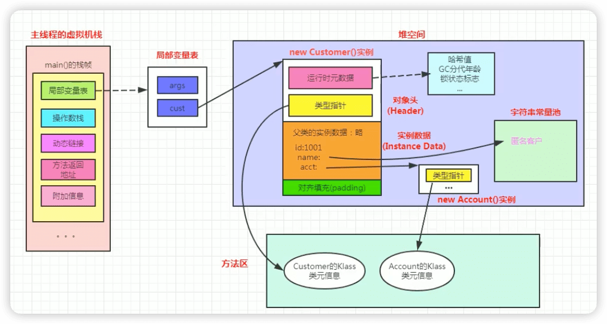


### 10.3 对象的访问定位

> JVM是如何通过栈帧中的对象引用访问到其内部的对象实例的呢？
>
> 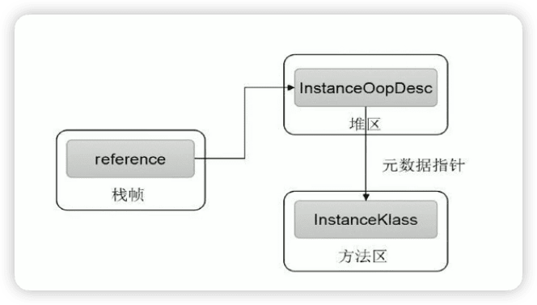


对象访问方式主要有两种：

#### 句柄访问

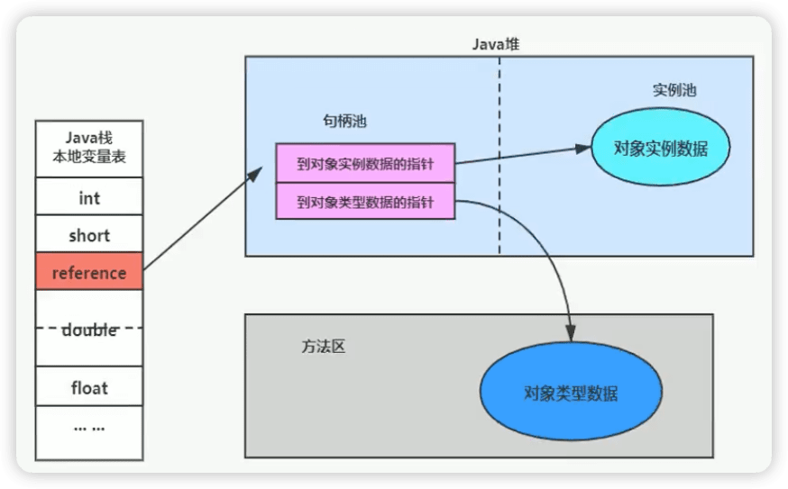

缺点：浪费空间，效率低。

好处：reference中存储稳定句柄地址，对象被移动（垃圾收集移动对象很普遍）时只会改变句柄中实例数据指针即可，reference本身不需要修改。

#### 直接指针（HotSpot采用）


## 11 直接内存

P107

> jdk8之后 元空间，而元空间就是使用的直接内存。

### 概述

- 不是虚拟机运行时数据区的一部分，也不是《Java虚拟机规范》中定义的内存区域。
- 直接内存是在Java堆外的、直接向系统申请的内存区间。
- 来源于NIO，通过存在堆中的DirectByteBuffer操作Native内存
- 通常，访问直接内存的速度会优于Java堆。即读写性能高。
  + 因此出于性能考虑，读写频繁的场合可能会考虑使用直接内存。
  + Java的NIO库允许Java程序使用直接内存，用于数据缓冲区


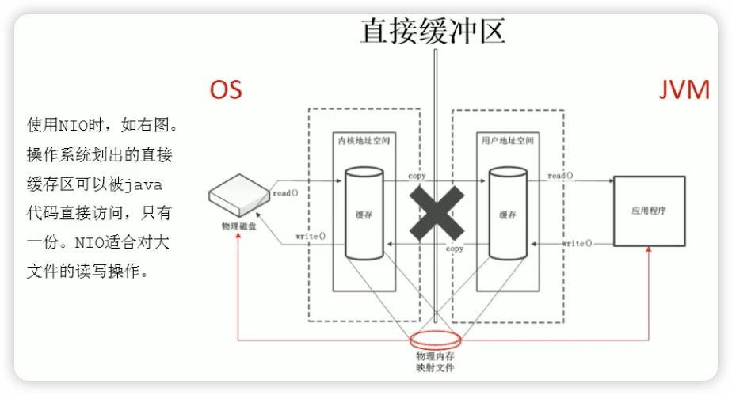

> IO  				NIO(New IO / Non-Blocking(非阻塞) IO)
>
> byte[]/ char[]  	Buffer
>
> Stream 			 Channel


测试BufferTest1

```
ByteBuffer.allocateDirect()
```


- 也可能导致OutofMemoryError异常
- 由于直接内存在Java堆外，因此它的大小不会直接受限于`-Xmx`指定的最大堆大小，但是系统内存是有限的，Java堆和直接内存的总和依然受限于操作系统能给出的最大内存。

- 缺点
  + 分配回收成本较高
  + 不受JVM内存回收管理
- 直接内存大小可以通过`MaxDirectMemorySize`设置
- 如果不指定，默认与堆的最大值`-Xmx`参数值一致

 

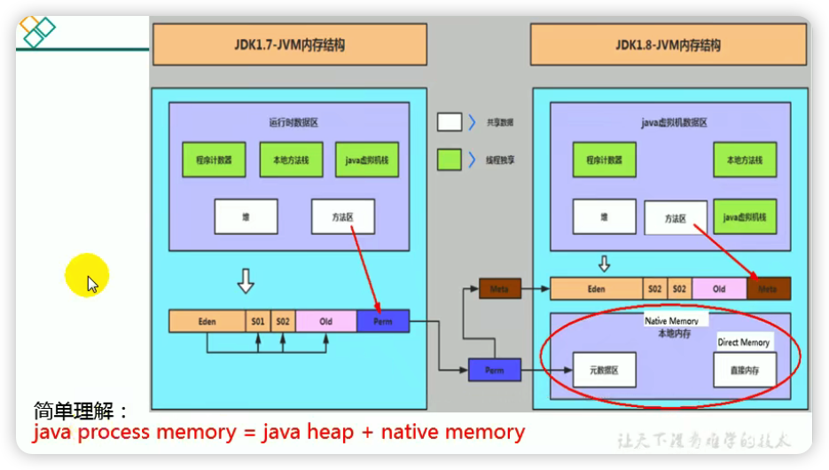

> OOM的种类：
>
> java.lang.OutOfMemoryError：Java heap space
> java.lang.OutOfMemoryError：GC overhead limit exceeded
> java.lang.OutOfMemoryError：Direct buffer memory
> java.lang.OutOfMemoryError：unable to create new native thread
> java.lang.OutOfMemoryError：Metaspace


## 12 执行引擎

p110

### 12.1 执行引擎概述


- 执行引擎是Java虛拟机核心的组成部分之一。
- “虚拟机”是一个相对于“物理机”的概念，这两种机器都有**代码执行能力**，其区别是物理机的执行引擎是直接建立在处理器、缓存、指令集和操作系统层面上的，而==虚拟机的执行引擎则是由软件自行实现的==，因此可以不受物理条件制约地定制指令集与执行引擎的结构体系，==能够执行那些不被硬件直接支持的指令集格式==。

- JVM的主要任务是负责==装载字节码到其内部==，但字节码并不能够直接运行在操作系统之上，因为字节码指令并非等价于本地机器指令，它内部包含的仅仅只是一些能够被JVM所识别的字节码指令、符号表，以及其他辅助信息。

- 那么，如果想要让一个Java程序运行起来，执行引擎 (Execution Engine)的任务就是==将字节码指令解释/编译为对应平台上的本地机器指令才可以==。简单来说，JVM中的执行引擎充当了将高级语言翻译为机器语言的译者。

> 注意执行引擎中的编译与java代码到字节码文件之间的编译不一样，为区分后者一般叫作前端编译，前者叫后端编译。


#### 执行引擎的工作过程

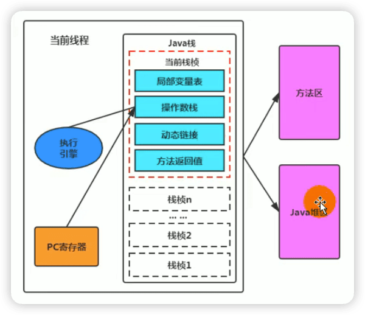

1. 执行引擎在执行的过程中究竟需要执行什么样的字节码指令完全依赖于PC寄存器。

2. 每当执行完一项指令操作后，PC奇存器就会更新下一条需要被执行的指令地址。

3. 当然方法在执行的过程中，执行引擎有可能会通过存储在局部变量表中的对象引用准确定位到存储在Java堆区中的对象实例信息，以及通过对象头中的元数据指针定位到目标对象的类型信息。 

从外观上来看，所有的Java虚拟机的执行引擎输入、输出都是一致的：**输入的是字节码二进制流，处理过程是字节码解析执行的等效过程，输出的是执行结果**。

### 12.2 Java代码编译和执行过程

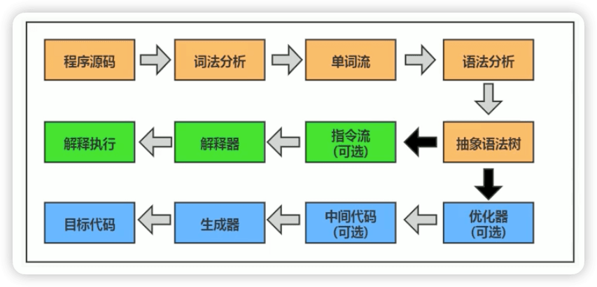

大部分的程序代码转换成物理机的目标代码或虚拟机能执行的指令集之前，都需要经过上图中的各个步骤。

从程序源码 -> 抽象语法树，就是javac进行前端编译的过程；

抽象语法树 -> 解释执行，对应java半解释型；

抽象语法树 -> 目标代码，对应java半编译型。

javac详细过程：


JVM执行引擎进行Java字节码的执行过程：


#### 何题：什么是解释器(Interpreter），什么是JIT编译器？

解释器：当Java虚拟机启动时会根据预定义的规范==对字节码采用逐行解释的方式执行==，将每条字节码文件中的内容“翻译〞为对应平台的本地机器指令执行。

JIT (Just In Time Compiler)编译器：就是虚拟机将源代码直接编译成和本地机器平台相关的机器语言。

#### 问题：为什么说Java是半编译半解释型语言？

JOK1.0时代，将了Java语言定位为 “解释执行，还是比较准确的。再后来，Java也发展出可以直接生成本地代码的编译器。

现在JVM在执行Java代码的时候，通常都会将解释执行与编译执行二者结合起来进行。

> 注：即时编译器把字节码指令翻译机器指令，部分热点指令可以进行缓存，这个缓存在方法区。


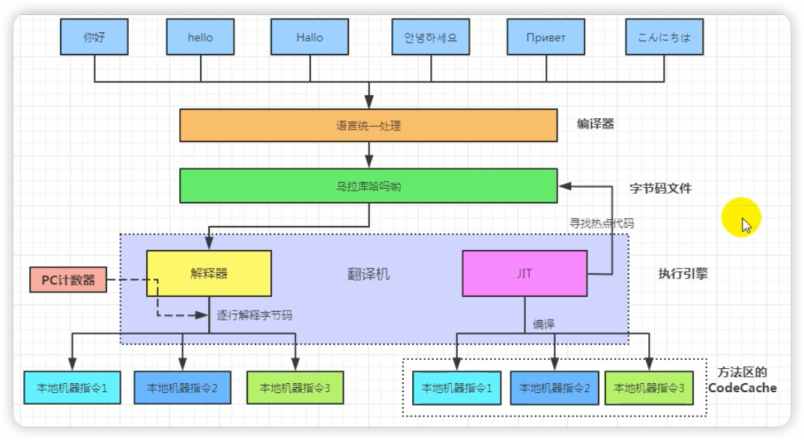

### 12.3 机器码、指令、汇编语言

#### 机器码

- 各种用二进制编码方式表示的指令，叫做==机器指令码==。开始，人们就用它采编写程序，这就是机器语言。

- 机器语言虽然能够被计算机理解和接受，但和人们的语言差别太大，不易被人们理解和记忆，并且用它编程容易出差错。

- 用它编写的程序一经输入计算机，CPU直接读取运行，因此和其他语言编的程序相比，执行速度最快。
- 机器指令与CPU紧密相关，所以不同种类的CPU 所对应的机器指令也就不同。

#### 指令

- 由于机器码是有0和1组成的二进制序列，可读性实在太差，于是人们发明了指令。
- 指令就是把机器码中特定的0和1序列，简化成对应的指令（一般为英文简写，如mov，inc等），可读性稍好。
- 由于不同的硬件平台，执行同一个操作，对应的机器码可能不同，所以不同的硬件平台的同一种指令（比如mov)，对应的机器码也可能不同。

#### 指令集

指令的集合

- 不同的硬件平台，各自支持的指令，是有差别的。因此每个平台所支持的指令，称之为对应平台的指令集。

- 如常见的

  x86指令集，对应的是x86架构的平台

  ARM指令集，对应的是ARM架构的平台

#### 汇编语言

- 由于指令的可读性还是太差，于是人们又发明了汇编语言。

- 在汇编语言中，用==助记符==（Mnemonics）代替机器指令的操作码，用==地址符号（Symbo1）或标号 （Label）==代替指令或操作数的地址。

- 在不同的硬件平台，汇编语言对应着不同的机器语言指令集，通过汇编过程转换成机器指令。

  由于计算机只认识指令码，所以用==汇编语言编写的程序还必须翻译成机器指令码==，计算机才能识别和执行。

#### 高级语言

- 为了使计算机用户编程序更容易些，后来就出现了各种高级计算机语言。高级语言比机器语言、汇编语言==更接近人的语言==。
- 当计算机执行高级语言编写的程序时，==仍然需要把程序解释和编译成机器的指令码==。完成这个过程的程序就叫做解释程序或编译程序。


#### 字节码

- 字节码是一种中间状态（中间码）的二进制代码（文件），它比机器码更抽象，需要直译器转译后才能成为机器码。

- 字节码主要为了实现特定软件运行和软件环境、**与硬件环境无关**。

- 字节码的实现方式是通过编译器和虚拟机器。编译器将源码编译成字节码，特定平台上的虚拟机器将字节码转译为可以直接执行的指令。

  字节码的典型应用为Java bytecode。


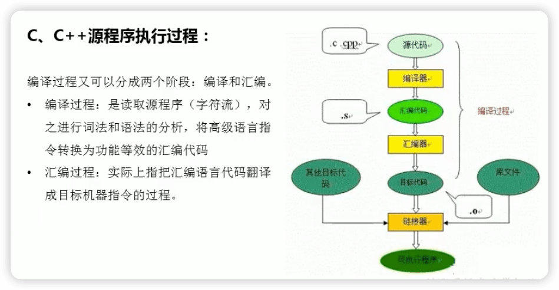


### 12.4 解释器

JVM设计者们的初衷仅仅只是单纯地==为了满足Java程序实现跨平台特性==，因此避免采用静态编译的方式直接生成本地机器指令，从而诞生了实现解释器在运行时采用逐行解释字节码执行程序的想法。


#### 解释器工作机制（或工作任务）

- 解释器真正意义上所承担的角色就是一个运行时 “翻译者”，将字节码文件中的内容 “翻译〞 为对应平台的本地机器指令执行。
- 当一条字节码指令被解释执行完成后，接着再根据PC寄存器中记录的下一条需要被执行的字节码指令执行解释操作。

#### 解释器分类

在Java的发展历史里，一共有两套解释执行器，即古老的==字节码解释器==、现在普遍使用的==模板解释器==。

- 字节码解释器在执行时通过**纯软件代码**模拟宇节码的执行，效率非常低下。

- 而模板解释器==将每一条字节码和一个模板函数相关联==，模板函数中直按产生这条字节码执行时的机器码，从而很大程度上提高了解释器的性能。

  在Hotspot VM中，解释器主要由Interpreter模块和Code模块构成。

  ==Interpreter模块==：实现了解释器的核心功能。

  Code模块：用于管理Hotspot VM在运行时生成的本地机器指令。

#### 现状

- 由于解释器在设计和实现上非常简单，因此除了Java语言之外，还有许多高级语言同样也是基于解释器执行的，比如Python、Perl、Ruby等。但是在今天，==基于解释器执行已经论落为低效的代名词==，并且时常被一些C/C++程序员所调侃。
- 为了解决这个问题，JM平台支持一种叫作即时编译的技术。即时编译的目的是避免函数被解释执行，而是==将整个函数体编译成为机器码，每次函数执行时，只执行编译后的机器码即可==，这种方式可以使执行效率大幅度提升。
- 不过无论如何，基于解释器的执行模式仍然为中间语言的发展做出了不可磨灭的贡献。

### 12.5 JIT编译器

Java代码的执行分类:

- 第一种是将源代码编译成字节码文件，然后在运行时通过解释器将字节码文件转为机器码执行。
- 第二种是编译执行（直接编译成机器码）。现代虚拟机为了提高执行效率，会使用即时编译技术(JIT,Just In Time）将方法编译成机器码后再执行。


- Hotspot VM是目前市面上高性能虚拟机的代表作之一。它采用解释器与即时编译器并存的架构。在Java虚拟机运行时，解释器和即时编译器能够相互协作，各自取长补短，尽力去选择最合适的方式来权衡编译本地代码的时间和直接解释执行代码的时间。
- 在今天，Java程序的运行性能早己脱胎换骨，己经达到了可以和C/C++程序一较高下的地步。


#### 为什么还要保留解释器？

有些开发人员会感觉到诧异，<u>既然Hotspot VM中已经内置JIT编译器了，那么为什么还需要再使用解释器来 “拖累”程序的执行性能呢？</u>比如JRockit VM内部就不包含解释器，字节码全部都依靠即时编译器编译后执行。（==响应速度==）

首先明确：

当程序启动后，解释器可以马上发挥作用，省去编译的时间，立即执行。编译器要想发挥作用，把代码编译成本地代码，需要一定的执行时问。但编译为本地代码后，执行效率高。

所以：

尽管JRockit VM中程序的执行性能会非常高效，但程序在启动时必然需要花费更长的时间来进行编译。对于==服务端==应用来说，启动时间并非是关注重点，但对于那些看中启动时间的应用场景市言，或许就需要采用解释器与即时编译器并存的架构来换取一个==平衡点==。

在此模式下，<u>当Java虚拟器启动时，解释器可以首先发挥作用，而不必等待即时编译器全部编译完成后再执行，这样可以省去许多不必要的编译时间。随着时间的推移，编译器发挥作用，把越来越多的代码编译成本地代码，获得更高的执行效率。</u>

同时，解释执行在编译器进行激进优化不成立的时候，作为编译器的 “逃生门”。

#### Hotspot JVM的执行方式

当虚拟机启动的时候，==解释器可以首先发挥作用==，而不必等待即时编译器全部编译完成再执行，这样可以==省去许多不必要的编译时间==。并且随着程序运行时间的推移，即时编译器逐渐发挥作用，根据==热点探测功能==，**将有价值的字节码编译为本地机器指令**，以换取更高的程序执行效率。

#### 案例

注意解释执行与编译执行在线上环境微妙的辩证关系。==机器在热机状态可以承受的负载要大于冷机状态==。如果以热机状态时的流量进行切流，可能使处于冷机状态的服务器因无法承载流量而假死。

在生产环境发布过程中，以分批的方式进行发布，根据机器数量划分成多个批次，每个批次的机器数至多占到整个集群的1/8。曾经有这样的故障案例：某程序员在发布平台进行分批发布，在输入发布,总批数时，误填写成分为两批发布。如果是热机状态，在正常情况下一半的机器可以勉强承载流量，但由于刚启动的JVM均是解释执行，还没有进行热点代码统计和JIT动态编译，导致机器启动之后，当前1/2发布成功的服务器马上全部宕机，此故障说明了JIT 的存在。—— 阿里团队

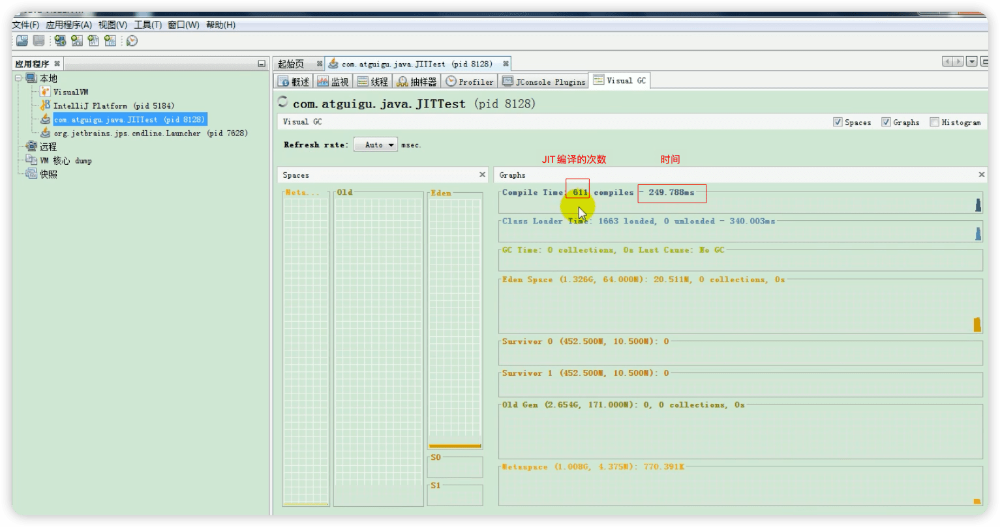

#### JIT编译器

概念解释：

- Java语言的“编译期” 其实是一段“不确定”的操作过程，因为它可能是指一个==前端编译器==（其实叫 “编译器的前端” 更准确一些）把.java文件转变成.class文件的过程；

- 也可能是指虚拟机的==后端运行期编译器==（JIT编译器，Just In Time compiler)把字节码转变成机器码的过程。
- 还可能是指使用==静态提前编译器==（AOT编译器，Ahead of Time Compiler）直接把.java文件编译成本地机器代码的过程。

> 前端编译器：sun的Javac、 Eclipse JDT中的增量式编译器（ECJ)。
>
> JIT编译器：Hotspot VM的 **C1、C2**编译器。
>
> AOT 编译器：GNU Compiler for the Java (GCJ) 、Excelsior JET。

##### 如何选择？(何种情况下触发JIT编译器)

**热点代码及探测方式**

当然是否需要启动了JIT编译器将字节码直接编译为对应平台的本地机器指令，则需要根据代码被调用**==执行的频率==**而定。关于那些需要被编译为本地代码的字节码，也被称之为 “==热点代码==”，JIT编译器在运行时会针对那些频繁被调用的“热点代码”做出==深度优化==，将其直接编译为对应平台的本地机器指令，以此提升 Java程序的执行性能。

- **一个被多次调用的方法，或者是一个方法体内部循环次数较多的循环体**都可以被称之为“热点代码”，因此都可以通过JII编译器编译为本地机器指令。由于这种编译方式发生在方法的执行过程中，因此也被称之为**==栈上替换==**，或简称为==OSR== (On Stack Replacement）编译。

- 一个方法充竟要<u>被调用多少次</u>，或者一个循环体充竟需要执行多少次循环才可以达到这个标准？必然需要一不明确的阈值，JIT编译器才会将这些“热点代码”编译为本地机器指令执行。这里主要依算==热点探测功能==。

- 目前Hotspot VM所采用的热点探测方式是==基于计数器的热点探测==。

- 采用基于计数器的热点探测，Hotspot VM将会为每一个方法都建立2个不同类型的计数器，分别为==方法调用计数器(Invocation counter）==和====回边计数器(Back==
   Edge Counter)== 。

  方法调用计数器用于统计方法的调用次数

  回边计数器则用于统计循环体执行的循环次数

##### 方法调用计数器

- 这个计数器就用于==统计方法被调用的次数==，它的默认阈值在 Client 模式下是 1500次，在 Server 模式下是 10000 次。超过这个阈值，就会触发JIT编译。

  默认server模式：

  

- 这个网值可以通过虛拟机参数`-XX:CompileThreshold`来人为设定。

- 当一个方法被调用时，会先检查该方法是否存在被JIT编译过的版本，如果存在，则优先使用编译后的本地代码来执行。如果不存在己被编译过的版本，则将此方法的调用计数器值加1，然后判断**方法调用计数器与回边计数器值之和**是否超过方法调用计数器的网值。如果己超过阈值，那么将会向即时编译器提交一个该方法的代码编译请求。

  

时间久了，任何代码都有可能超过阈值，都进行编译缓存，这是不行的。

==热度衰减==

- 如果不做任何设置，方法调用计数器统计的并不是方法被调用的<u>绝对次数</u>，而是一个相对的执行频率，即==一段时间之内方法被调用的次数==。当超过一定的时间限度，如果方法的调用次数仍然不足以让它提交给即时编译器编译，那这个方法的调用计数器就会被减少一半，这个过程称为方法调用计数器热度的==衰减==(Counter Decay)，而这段时间就称为此方法统计的==半衰周期== (Counter Half Life Time)。
- 进行热度衰滅的动作是在虚拟机进行垃圾收集时顺便进行的，可以使用虚拟机参数`-XX:-UseCounterDecay`来关闭热度衰减，让方法计数器统计方法调用的绝对次数，这样，只要系统运行时间足够长，绝大部分方法都会被编译成本地代码。

- 另外，可以使用`-XXCcounterHalfLifeTime` 参数设置半衰周期的时间，单位是秒。

##### 回边计数器

它的作用是统计一个方法中循环体代码执行的次数，在字节码中遇到控制流向后跳转的指令称为 “回边”（Back Edge）。显然，建立回边计数器统计的目的就是为了触发 OSR 编译。


#### Hotspot VM可以设置程序执行方式

缺省情况下HotSpot VM是采用解释器与即时编译器并存的架构，当然开发人员可以根据具体的应用场景，通过命令显式地为Java虚拟机指定在运行时到底是完全采用解释器执行，还是完全采用即时编译器执行。如下所示：

- `-Xint`：完全采用解释器模式执行程序；

- `-Xcomp`：完全采用即时编译器模式执行程序。如果即时编译出现问题，解释器会介入执行。

- `-Xmixed`：采用解释器＋即时编译器的混合模式共同执行程序。


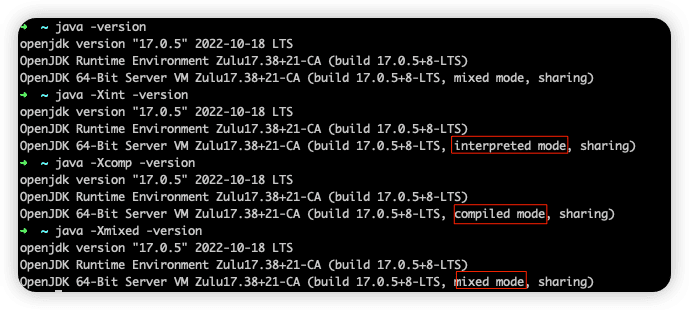

```java
/**
 * 测试解释器模式和JIT模式
 * -Xint    : 4174ms
 * -Xcomp   : 209ms
 * -Xmixed  : 246ms
 * @author andyron
 **/
public class IntCompTest {
    public static void main(String[] args) {
        long start = System.currentTimeMillis();

        testPrimeNumber(1000000);

        long end = System.currentTimeMillis();

        System.out.println("花费的时间为：" + (end - start));
    }
    private static void testPrimeNumber(int count) {
        for (int i = 0; i < count; i++) {
            // 计算100以内的质数 // TODO label
            label:
            for (int j = 2; j <= 100; j++) {
                for (int k = 2; k <= Math.sqrt(j); k++) {
                    if (j % k == 0) {
                        continue label;
                    }
                }
            }
        }
    }
}

```


#### Hotspot VM中JT分类

在Hotspot VM中内嵌有两个JIT编译器，分别为Client Compiler和Server Compiler，但大多数情况下我们简称为==C1编译器==和==C2编译器==。开发人员可以通过如下命令显式指定Java虛拟机在运行时到底使用哪一种即时编译器，如下所示：

- `-client`：指定Java虛拟机运行在Client模式下，并使用C1编译器；

  C1编译器会对字节码进行==简单和可靠的优化，耗时短==。以达到更快的编译速度。

- `-server`：指定Java虚拟机运行在server模式下，并使用C2编译器。

  C2进行==耗时较长的优化，以及激进优化==。但优化的代码执行效率更高。

64位机器仅支持Server模式


**C1和C2编译器不同的优化策略**：

- 在不同的编译器上有不同的优化策略，C1编译器上主要有方法内联，去虛拟化、冗余消除。

  方法内联：将引用的函数代码编译到引用点处，这样可以减少栈帧的生成，减少参数传递以及跳转过程。

  去虛拟化：对唯一的实现类进行内联

  冗余消除：在运行期间把一些不会执行的代码折叠掉

- C2的优化主要是在**全局层面**，逃逸分析是优化的基础。基于逃逸分析在C2上有如下几种优化：

  标量替换：用标量值代替聚合对象的属性值

  栈上分配：对于末逃逸的对象分配对象在栈而不是堆

  同步消除：清除同步操作，通常指svnchronized


**分层编译 (Tiered Compilation） 策略**：程序解释执行 （不开启性能监控）可以触发C1编译，将字节码编译成机器码，可以进行简单优化，也可以加上性能监控，C2编译会根据性能监控信息进行激进优化。

不过在Java7版本之后，一旦开发人员在程序中显式指定命令“-server"时，默认将会开启分层编译策略，由C1编译器和c2编译器相互协作共同来执行编译任务。


总结：

- 一般来讲，JIT编译出来的机器码性能比解释器高。

- C2编译器启动时长比C1编译器慢，系统稳定执行以后，C2编译器执行速度远远快于C1编译器。


### 12.6 Graal 和AOT编译器

写在最后1：

- 自JDK10起，Hotspot又加入一个全新的即时编译器：Graal编译器。
- 编译效果短短几年时间就追评了C2编译器。末来可期。
- 目前，带着“实验状态"标签，需要使用开关参数`-XX:+UnlockExperimentalVMoptions` `-XX:+UseJVMCICompiler`去激活，才可以使用。

> Graal是和C1、C2类似概览，AOT编译器与JIT编译类似概念。

写在最后2：关于AOT编译器。

- jdk9引入了AOT编译器（静态提前编译器，Ahead of Time compiler)

- Java 9 引入了实验性AOT编译工具jaotc。它借助了 Graal 编译器，将所输入的Java类文件转换为机器码，并存放至生成的动态共享库（.so）之中。

  > 把字节码文件在运行之前通过jaotc转换为.so

- 所谓AOT编译，是与即时编译相对立的一个概念。我们知道，即时编译指的是在程序的运行过程中，将字节码转换为可在硬件上直接运行的机器码，并部署至托管环境中的过程。而 AOT 编译指的则是，在程序运行之前，便将字节码转换为机器码的过程。

- 最大好处：Java虚拟机加载已经预编译成二进制库，可以直接执行。不必等待即时编译器的预热，减少Java应用给人带来 “第一次运行慢” 的不良体验。

- 缺点：

  + 破坏了java“一次编译，到处运行”，必须为每个不同硬件、os编译对应的发行包。

  + ==降低了Java链接过程的动态性==，加载的代码在编译期就必须全部己知。
  + 还需要继续优化中，最初只支持Linux x64 java base

## 13 StringTable

P118

String table又称为String pool，字符串常量池。

### 13.1 String的基本特性

- String:字符串，使用一对""引起来表示。
  - `String s1 = "hello";	//字面量的定义方式`
  - `String s2 = new String ("hello");`

String声明为final的，不可被继承

- String实现了`Serializable`接口：表示字符串是支持序列化的。

  实现了`Comparable`接口：表示String可以比较大小

- String在jak8及以前内部定义了`final char[] value`用于存储字符串数据。jak9时改为`byte[]`

> https://openjdk.org/jeps/254
>
> JEP 254: Compact Strings
>
> ### Motivation
>
> The current implementation of the String class stores characters in a char array, using two bytes (sixteen bits) for each character. Data gathered from many different applications indicates that strings are a major component of heap usage and, moreover, ==that most String objects contain only Latin-1 characters. Such characters require only one byte of storage, hence half of the space in the internal char arrays of such String objects is going unused.==
>
> 大部分Latin-1字符一个byte就能存储，使用char数组浪费空间。
>
> ### Description
>
> We propose to ==change the internal representation of the String class from a UTF-16 char array to a byte array plus **an encoding-flag field**==. The new String class will store characters encoded either as ISO-8859-1/Latin-1 (one byte per character), or as UTF-16 (two bytes per character), based upon the contents of the string. The encoding flag will indicate which encoding is used.
>
> 但有的字符（比如中文）一个byte是不够，那就添加一个编码标记，ISO-8859-1/Latin-1 就用一个byte，其它用两个。


 


- ==字符串常量池中是不会存储相同内容的字符串的。==

- String的String Pool是一个固定大小的`Hashtable`（底层是数组加链表的结构），默认值大小长度是1009。如果放进String Pool的string非常多，就会造成Hash冲突严重，从而导致链表会很长，而链表长了后直接会造成的影响就是当调用`String.intern`时性能会大幅下降。

  > intern表示如果字符串常量中没有对应的data字符串的话，就在生成

- 使用`-XX:StringTableSize`可设置StringTable的长度

- 在jdk6中stringrable是固定的，就是1009的长度，所以如果常量池中的字符串过多就会导致效率下降很快。StringTableSize设置没有要求
- 在jdk7中，stringrable的长度默认值是60013，
- JDK8，1009是可设置的最小值。


`jinfo -flag StringTableSize pid`

### 13.2 String的内存分配

- 在Java语言中有8种基本数据类型和一种比较特殊的类型String。这些类型为了使它们在运行过程中速度更快、更节省内存，都提供了一种常量池的概念。

- 常量池就类似一个**Java系统级别提供的缓存**。8种基本数据类型的常量池都是系统协调的，String类型的常量池比较特殊。它的主要使用方法有两种。

  + 直接使用双引号声明出来的String对象会直接存储在常量池中。

    比如： string info = "andyron.com";

  + 如果不是用双引号声明的string对象，可以使用string提供的intern()方法。这个后面重点谈

- Java 6及以前，字符串常量池存放在永久代。

- Java 7 中oracle的工程师对字符串池的逻辑做了很大的改变，即==将字符串常量池的位置调整到Java堆内==。

  + 所有的字符串都保存在堆（Heap）中，和其他普通对象一样，这样可以让你在进行调优应用时仅需要调整堆大小就可以了。
  + 字符串常量池概念原本使用得比较多，但是这个改动使得我们有足够的理由让我们重新考虑在Java7中使用`String.intern()`。

- Java8元空间，字符串常量在堆。


#### StringTable为什么要调整？

1. permSize默认比较小

2. 永久代垃圾回收频率低

>https://www.oracle.com/java/technologies/javase/jdk7-relnotes.html
>
>**Area:** HotSpot
>
>**Synopsis:** In JDK 7, interned strings are no longer allocated in the permanent generation of the Java heap, but are instead allocated in the main part of the Java heap (known as the young and old generations), along with the other objects created by the application. This change will result in more data residing in the main Java heap, and less data in the permanent generation, and thus may require heap sizes to be adjusted. Most applications will see only relatively small differences in heap usage due to this change, but larger applications that load many classes or make heavy use of the `String.intern()` method will see more significant differences.
>
>**RFE:** [6962931](https://bugs.java.com/bugdatabase/view_bug.do?bug_id=6962931)


### 13.3 String的基本操作

例子1：


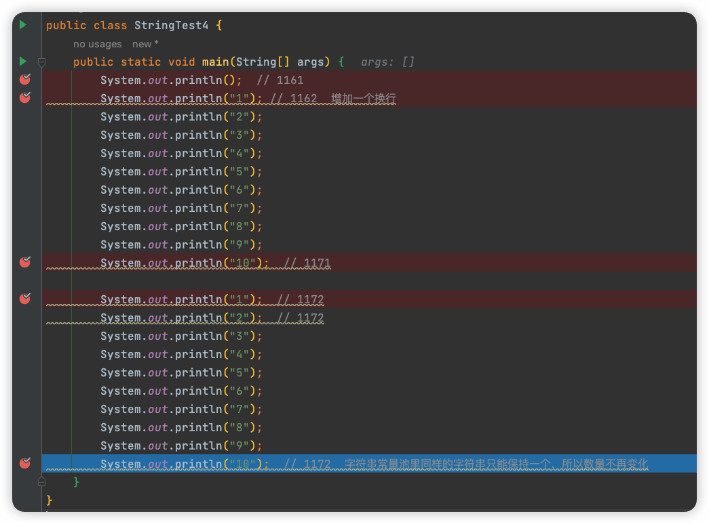

Java语言规范里要求完全相同的字符串字面量，应该包含同样的Unicode字符序列(包含同一份码点序列的常量），并且必须是指向同一个string类实例。

https://docs.oracle.com/javase/specs/jls/se8/html/jls-3.html#jls-3.10.5


例子2

```java
public class Memory {
    public static void main(String[] args) {
        int i = 1;
        Object obj = new Object();
        Memory mem = new Memory();
        mem.foo(obj);
    }

    private void foo(Object param) {
        String str = param.toString();  // line 7
        System.out.println(str);
    }
}
```

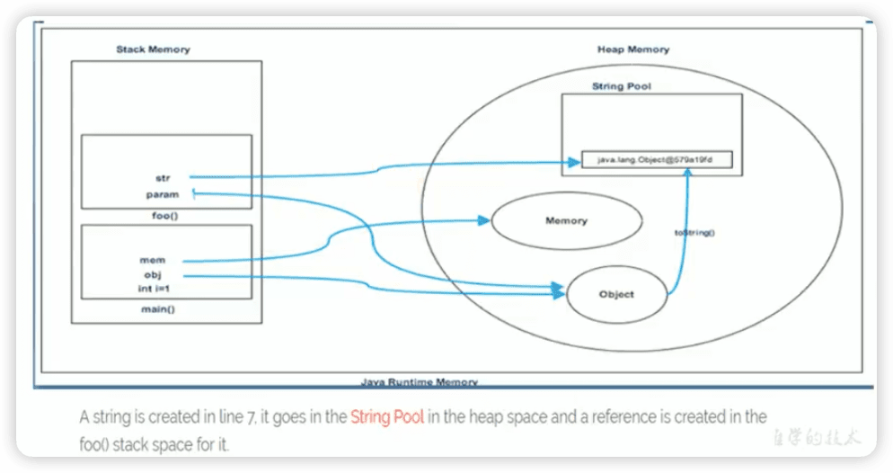

toString方法返回的是字符串字面量，所以放到字符串常量池里。

🔖?

### 13.4 字符串拼接操作

1. 常量与常量的拼接结果在常量池，原理是编译期优化
2. 常量池中不会存在相同内容的常量。
3. 只要其中有一个是变量，结果就在堆中(常量池之外的堆)。变量拼接的原理是`StringBuilder`。
4. 如果拼接的结果调用intern()方法，则主动将常量池中还没有的字符串对象放入池中，并返回此对象地址。


```java
    @Test
    public void test2() {
        String s1 = "javaEE";
        String s2 = "hadoop";

        String s3 = "javaEEhadoop";
        String s4 = "javaEE" + "hadoop";  // 编译器优化
        // 如果拼接符号的前后出现了变量，则相当月在堆空间中new String()
        String s5 = s1 + "hadoop";
        String s6 = "javaEE" + s2;
        String s7 = s1 + s2;

        System.out.println(s3 == s4);  // true
        System.out.println(s3 == s5);  // false
        System.out.println(s3 == s6);  // false
        System.out.println(s3 == s7);  // false
        System.out.println(s5 == s6);  // false
        System.out.println(s5 == s7);  // false
        System.out.println(s6 == s7);  // false

        // intern()的作用，是判断字符串常量池中是否存在javaEEhadoop，不存在就建一个并返回地址，存在返回对应地址
        String s8 = s6.intern();
        System.out.println(s3 == s8);  // true
    }
```


### 13.5 intern()的使用

如果不是用双引号声明的String对象，可以使用String提供的intern方法：intern。

方法会从字符串常量池中查询当前字符串是否存在，若不存在就会将当前字符串放入常量池中。

比如：`String myInfo = new String ("I love andy").intern();`

也就是说，如果在任意字符串上调用String.intern方法，那么其返回结果所指向的那个类实例，必须和直接以常量形式出现的字符串实例完全相同。因此，下列表达式的值必定是true:

`("a" + "b" + "c") .intern() == "abc"`

通俗点讲，Interned String就是确保字符串在内存里只有一份拷贝，这样可以节约内存空间，加快字符串操作任务的执行速度。注意，这个值会被存放在字符串内部池(String Intern Pool)


> 题目：new String("ab")会创建几个对象？
>
> 看字节码文件

两个。

- 一个对象是new关键字在堆空间创建的

 *      另一个对象是：字符串常量池中的对象。字节码指令：`ldc`

```java
 0 new #2 <java/lang/String>
 3 dup
 4 ldc #3 <ab>
 6 invokespecial #4 <java/lang/String.<init> : (Ljava/lang/String;)V>
 9 astore_1
10 return
```

> 拓展：new String("a") + new String("b")呢？
>
> - 对象1：new StringBuilder()
>
>  * 对象2：new String("a")
>
>  * 对象3：常量池中的"a"
>
>  * 对象4：new String("b")
>
>  * 对象5：常量池中的"d"
>
>  * 深入剖析：StringBuilder的toString()：
>
>    对象6：new String("ab")
>
>    强调一下，toString()的调用，在字符串常量池中，没有生成"ab"


#### intern的使用：jdk6 vs jdk7/8


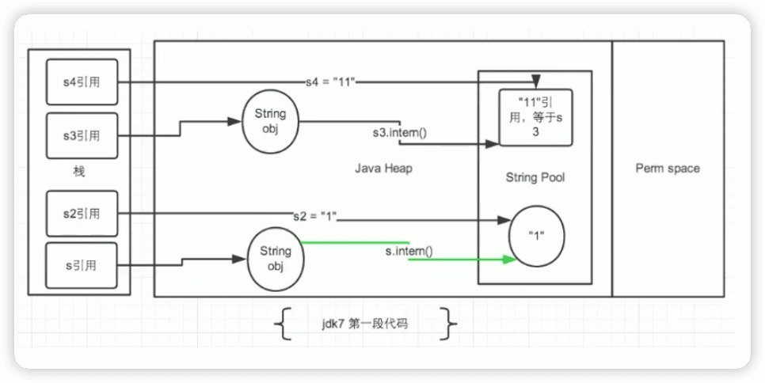

// TODO 🔖 p127 不同jdk 结果不一样？


### 13.6 StringTable的垃圾回收


### 13.7 G1中的String去重操作

https://openjdk.org/jeps/192


## 14 垃圾回收概述

p134


> 之前的内存结构等jdk8之后变化很少，而GC每个版本都有一定的更新

### 14.1 什么是垃圾

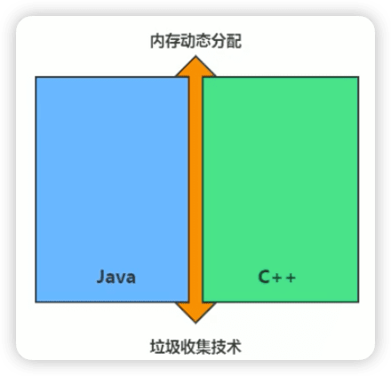

Java = (C++)--

- 垃圾收集，不是Java语言的伴生产物。早在1960年，第一门开始使用内存动态分配和垃圾收集技术的Lisp语言诞生。

- 关于垃圾收集有三个经典问题：

  哪些内存需要回收？

  什么时候回收？

  如何回收？

- 垃圾收集机制是Java的招牌能力，极大地提高了开发效率。如今，垃圾收集几乎成为现代语言的标配，即使经过如此长时间的发展，Java的垃圾收集机制仍然在不断的演进中，不同大小的设备、不同特征的应用场景，对垃圾收集提出了新的挑战，这当然也是面试的热点。

> 面试题
>
> 蚂蚁金服：
>
> 你知道哪几种垃圾回收器，各自的优缺点，重点讲一下cms 和g1
>
> 一面：JVM GC算法有哪些，目前的JDK版本采用什么回收算法
>
> 一面：G1回收器讲下回收过程
>
> GC是什么？为什么要有GC?
>
> 一面：GC 的两种判定方法？CMS 收集器与 G1 收集器的特点。
>
> 百度：
>
> 说一下GC算法，分代回收说下
>
> 垃圾收集策略和算法
>
> 天猫：
>
> 一面：jvm GC原理，JVM怎么回收内存
>
> 一面：CMS特点，垃圾回收算法有哪些？各自的优缺点，他们共同的缺点是什么？
>
> 滴滴：
>
> 一面：java的垃圾回收器都有哪些，说下g1的应用场景，平时你是如何搭配使用垃圾回收器的
>
> 京东：
>
> 你知道哪几种垃圾收集器，各自的优缺点，重点讲下cms和G1，包括原理，流程，优缺点。
>
> 垃圾回收算法的实现原理。
>
> 阿里：
>
> 讲一讲垃圾回收算法。
>
> 什么情况下触发垃圾回收？
>
> 如何选择合适的垃圾收集算法？
>
> JVM有哪三种垃圾回收器？
>
> 字节跳动：
>
> 常见的垃圾回收器算法有哪些，各有什么优劣？
>
> system.gc()和runtime.gc()会做什么事情？
>
> 一面：Java GC机制？GC Roots有哪些？
>
> 二面：Java对象的回收方式，回收算法。
>
> CMS和G1了解么，CMS解决什么问题，说一下回收的过程。
>
> CMS回收停顿了几次，为什么要停顿两次。

- 什么是垃圾(Garbage）呢？

  垃圾是指在==运行程序中没有任何指针指向的对象==，这个对象就是需要被回收的垃圾。

  外文：An object is considered garbage when it can no longer be reached from any pointer in the running program.

- 如果不及时对内存中的垃圾进行清理，那么，这些垃圾对象所占的内存空间会一直保留到应用程序结束，被保留的空间无法被其他对象使用。甚至可能==导致内存溢出==。

> 🔖 内存溢出  内存泄漏 

### 14.2 为什么需要GC

- 对于高级语言来说，一个基本认知是如果不进行垃圾回收，==内存迟早都会被消耗完==，因为不断地分配内存空间而不进行回收，就好像不停地生产生活垃圾而从来不打扫一样。
- 除了释放没用的对象，垃圾回收也可以清除内存里的记录碎片。碎片整理将所占用的堆内存移到堆的一端，以便==JVM将整理出的内存分配给新的对象==。
- 随着应用程序所应付的业务越来越庞大、复杂，用户越来越多，==没有GC就不能保证应用程序的正常进行==。而经常造成STW的GC又跟不上实际的需求，所以才会不断地尝试对GC进行优化。

### 14.3 早期来及回收

- 在早期的C/C++时代，垃圾回收基本上是手工进行的。开发人员可以使用new关键字进行内存申请，并使用delete关键字进行内存释放。比如以下代码：

  ```c
   MibBridge *pBridge = new cmBaseGroupBridge();
   // 如果注册失败，使用Delete释放该对象所占内存区域
   if (pBridge->Register(kDestroy) != NO ERROR)
   		delete pBridge;
  ```

- 这种方式可以灵活控制内存释放的时间，但是会给开发人员带来==频繁申请和释放内存的管理负担==。倘若有一处内存区间由于程序员编码的问题忘记被回收，那么就会产生==内存泄漏==，垃圾对象永远无法被清除，随着系统运行时间的不断增长，垃圾对象所耗内存可能持续上升，直到出现内存溢出并造成**应用程序崩溃**。

> 内存泄漏：从Java的角度看，一个数据不需要用了，试图回收时，但这个对象还没办法进行回收，因为它还有相关的引用指向。

- 在有了垃圾回收机制后，上述代码块极有可能变成这样：

```c
 MibBridge *pBridge = new cmBaseGroupBridge();
 pBridge->Register(kDestroy);
```

现在，除了Java以外，C#、python、Ruby等语言都使用了自动垃圾回收的思想，也是未来发展趋势。可以说，这种**自动化的内存分配和垃圾回收**的方式己经成为现代开发语言必备的标准。

### 14.4 Java垃圾回收机制

- 自动内存管理（分配和回收），无需开发人员手动参与内存的分配与回收，这样==降低内存泄漏和内存溢出的风险==

  没有垃圾回收器，java也会和cpp一样，各种悬垂指针，野指针，泄露问题让你头疼不己。

- 自动内存管理机制，将程序员从繁重的内存管理中释放出来，可以更==专心地专注于业务开发==

- oracle宫网关于垃圾回收的介绍

  https://docs.oracle.com/javase/8/docs/technotes/guides/vm/gctuning/toc.html

#### 担忧

- 对于Java开发人员而言，自动内存管理就像是一个黑匣子，如果过度依赖于“自动”，那么这将会是一场灾难，最正重的就会==弱化Java开发人员在程序出现内存溢出时定位问题和解决问题的能力==。
- 此时，了解JVM的自动内存分配和内存回收原理就显得非常重要，只有在真正了解JVM是如何管理内存后，我们才能够在遇见OutOfMemoryError时，快速地==根据错误异常日志定位问题和解决问题==。
- 当需要排查各种内存溢出、内存泄漏问题时，当垃圾收集成为系统达到更高并发量的瓶颈时，我们就必须对这些“自动化”，的技术实施==必要的监控和调节==。

#### 应该关心哪些区域的回收？


- 垃圾回收器可以对年轻代回收，也可以对老年代回收，甚至是全堆和方法区的回收。

  其中，==Java堆==是垃圾收集器的工作重点。

- 从次数上讲：

  ==频繁收集Young区==

  ==较少收集old区==

  ==基本不动Perm区（或元空间）==

## 15 垃圾回收相关算法

P138

原理、背景、应用场景

GC Garbage Collection（垃圾回收）/ Garbage Collector（垃圾回收器）

> 不相关联想
>
> final finalize finally   没有多少相关性、只是因为长得像
>
> 异常==处理==的两种行为：throws  try...catch...finally
>
> 异常如何==生成==的：自动创建；手动抛出（throw）

哪些是垃圾？ 标记阶段

怎么回收？  清除阶段


> 注：JVM规范中没有强制要求对方法区进行GC。
>
> 频繁GC新生代，较少老年代，基本不回收永久代（方法区）。

### 15.1 标记阶段：引用计数算法

#### 垃圾标记阶段：对象存活判断

- 在堆里存放着几乎所有的Java对象实例，在GC执行垃圾回收之前，首先**需要区分出内存中哪些是存活对象，哪些是已经死亡的对象**。只有被标记为己经死亡的对象，GC才会在执行垃圾回收时，释放掉其所占用的内存空间，因此这个过程我们可以称为==垃圾标记阶段==。
- 那么在JVM中究竞是如何标记一个死亡对象呢？简单来说，<u>当一个对象己经不再被任何的存活对象继续引用时，就可以宣判为已经死亡。</u>
- 判断对象存活一般有两种方式：==引用计数算法==和==可达性分析算法==。

#### 方式一：引用计数算法

- 引用计数算法 (Reference Counting) 比较简单，对每个对象保存一个整型的==引用计数器属性。用于记录对象被引用的情况。==
- 对于一个对象A，只要有任何一个对象引用了A，则A的引用计数器就加1；当引用失效时，引用计数器就减1。只要对象A的引用计数器的值为0，即表示对象A不可能再被使用，可进行回收。
- 优点：**实现简单，垃圾对象便于辨识：判定效率高，回收没有延迟性**。
- 缺点：
  + 它需要单独的字段存储计数器，这样的做法增加了**存储空间的开销**。
  + 每次赋值都需要更新计数器，伴随着加法和减法操作，这增加了**时间开销**。
  + 引用计数器有一个严重的问题，即==无法处理循环引用==的情况。这是一条致命缺陷，导致在Java的坊圾回收器中没有使用这类算法。

循环引用

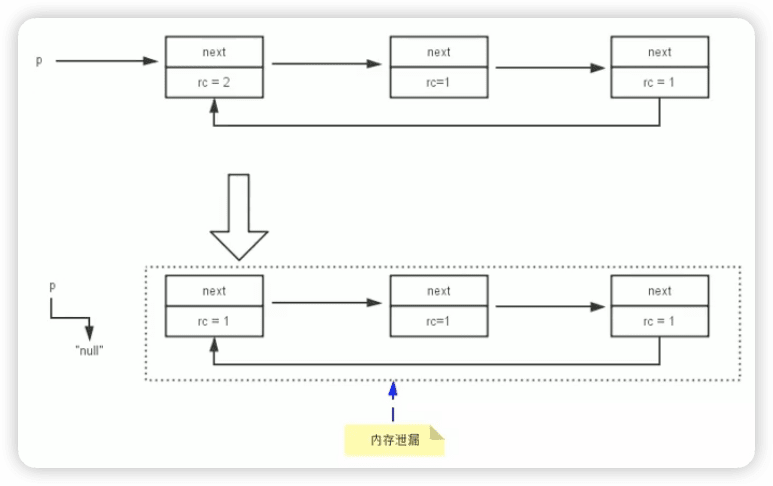

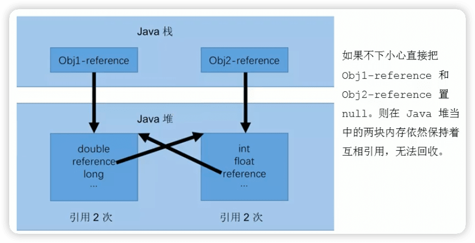

小结：

- 引用计数算法，是很多语言的资源回收选择，例如因人工智能而更加火热的Python，它更是同时支持引用计数和垃圾收集机制。
- 具体哪种最优是要看场景的，业界有大规模实践中仅保留引用计数机制，以提高吞吐量的尝试。
- Java并没有选择引用计数，是因为其存在一个基本的难题，也就是很难处理循环引用关系。

- python如何解决循环引用？
  + 手动解除：很好理解，就是在合适的时机，解除引用关系。
  + 使用弱引用weakref， weakref是Python提供的标淮库，旨在解決循环引用。

### 15.2 标记阶段：可达性分析算法

也叫根搜索算法、追踪性垃圾收集

- 相对于引用计数算法而言，可达性分析算法不仅同样具备实现简单和执行高效等特点，更重要的是该算法可以有效地==解决在引用计数算法中循环引用的问题，防止内存泄漏的发生==。

- 相较于引用计数算法，这里的可达性分析就是==Java、C#选择的==。这种类型的垃圾收集通常也叫作==追踪性垃圾收集 (Tracing GarbageCollection）==。

- 所谓"GC Roots"根集合就是**一组必须活跃的引用**。
- 基本思路：
  + 可达性分析算法是以根对象集合 (GC Roots) 为起始点，按照从上至下的方式**搜索被根对象集合所连接的目标对象是否可达**。
  + 使用可达性分析算法后，内存中的存活对象都会被根对象集合直接或间接连接着，搜索所走过的路径称为==引用链 (Reference Chain)==。
  + 如果目标对象没有任何引用链相连，则是不可达的，就意味着该对象己经死亡，可以标记为垃圾对象。
  + 在可达性分析算法中，只有能够被根对象集合直接或者间接连接的对象才是存活对象。

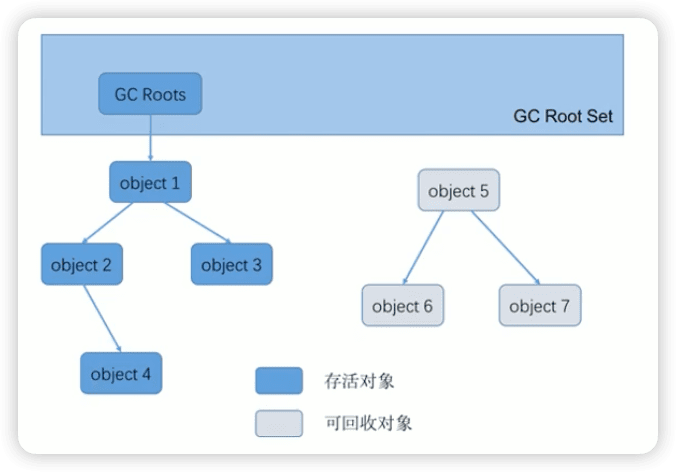


> 
>
> 

#### GC Roots❤️

在Java 语言中，GC Roots 包括以下几类元素：

- 虚拟机栈中引用的对象

 比如：各个线程被调用的方法中使用到的参数、局部变量等。

- 本地方法栈内JNI(通常说的本地方法）引用的对象

- 方法区中类静态属性引用的对象

  比如：Java类的引用类型静态变量

- 方法区中常量引用的对象

  比如：字符串常量池(String rable）里的引用

- 所有被同步锁synchronized持有的对象

- Java虚拟机内部的引用。

  基木数据类型对应的Class对象，一些常驻的异常对象（如：`NullPointerException`、`OutOfMemoryError`），系统类加载器。

- 反映java虚拟机内部情况的JMxBean、JVMTI中注册的回调、 本地代码缓存等。

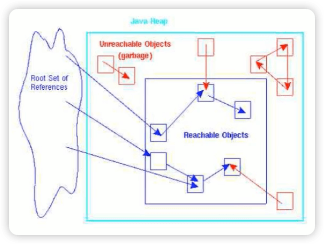

- 除了这些固定的GC Roots集合以外，根据用戶所选用的垃圾收集器以及当前回收的内存区域不同，还可以有其他对象**“临时性”地加入**，共同构成完整GC Roots集合。比如：分代收集和局部回收 (Partial GC)。

  如果只针对Java堆中的某一块区域进行垃圾回收（比如：典型的只针对新生代），必须考虑到内存区域是虚拟机自己的实现细节，更不是孤立封闭的，这个区域的对象完全有可能被其他区域的对象所引用，这时候就需要一并将关联的区域对象也加入GC Roots集合中去考虑，才能保证可达性分析的准确性。

- 小技巧：

  由于Root 采用栈方式存放变量和指针，所以如果一个指针，它保存了堆内存里面的对象，但是自己又不存放在堆内存里面，那它就是一个Root。

> 注意：
>
> - 如果要使用可达性分析算法来判断内存是否可回收，那么分析工作必须在一个能保障一致性的**快照**中进行。这点不满足的话分析结果的准确性就无法保证。
>
> - 这点也是导致GC进行时必须〝Stop The world”的一个重要原因。
>
>   即使是号称（几乎）不会发生停顿的CMS收集器中，**枚举根节点时也是必须要停顿的**。


### 15.3 对象的finalization机制

- Java语言提供了对象终止 (finalization）机制来允许开发人员提供==对象被销毁之前的自定义处理逻辑==。
- 当垃圾回收器发现没有引用指向一个对象，即：垃圾回收此对象之前，总会先调用这个对象的`finalize()`方法。
- finalize()方法允许在子类中被重写，用于在对象被回收时进行资源释放。通常在这个方法中进行一些资源释放和清理的工作，比如关闭文件、套接宇和数据库连接等。

> 类比：
>
> Servlet生命周期中的`destroy()`方法；
>
> Android组件Activity中`onDestroy()`；

- <u>永远不要主动调用某个对象的`finalize()`方法</u>，应该交给垃圾回收机制调用。理由包括下面三点：
  + 在`finalize()`时可能会导致对象复活。
  + `finalize()`方法的执行时间是没有保障的，它完全由GC线程决定，极端情况下，若不发生GC，则`finalize()`方法将没有执行机会。
  + 一个糟糕的`finalize()`会严重影响GC的性能。

- 从功能上来说，`finalize()`方法与C++中的析构函数比较相似，但是Java采用的是基于垃圾回收器的自动内存管理机制，所以`finalize()`方法在本质上不同于C++中的析构函数。

- 由于`finalize()`方法的存在，==虚拟机中的对象一般处于三种可能的状态==。


#### 生存还是死亡？

- 如果从所有的根结点点都无法访问到某个对象，说明对象已经不再使用了。一般来说，此对象需要被回收。但事实上，也并非是“非死不可”的，这时候它们暂时处于**“缓刑”阶段**。==一个无法触及的对象有可能在某一个条件下“复活” 自己==，如果这样，那么对它的回收就是不合理的，为此，定义虚拟机中的对象可能的三种状态。如下：
  + ==可触及的==：从根节点开始，可以到达这个对象。
  + ==可复活的==：对象的所有引用都被释放，但是对象有可能在finalize()中复活。
  + ==不可触及的==：对象的finalize()被调用，并且没有复活，那么就会进入不可触及状态。 不可触及的对象不可能被复活，因为**==finalize()只会被调用一次==**。

- 以上3种状态中，是由于finalize()方法的存在，进行的区分。<u>只有在对象不可触及时才可以被回收。</u>

#### 具体过程

判定一个对象objA是否可回收，至少要经历两次标记过程：

1. 如果对象objA到 GC Roots没有引用链，则进行**第一次标记**。

2. 进行筛选，判断此对象是否有必要执行finalize()方法

   1️⃣ 如果对象objA没有重写finalize()方法，或者finalize()方法已经被虛拟机调用过，则虛拟机视为“没有必要执行”，objA被判定为不可触及的。

   2️⃣ 如果对象objA重写了finalize()方法，且还未执行过，那么objA会被插入到F-Queue队列中，由一个虚拟机自动创建的、<u>低优先级的Finalizer线程</u>触发其finalize()方法执行。

   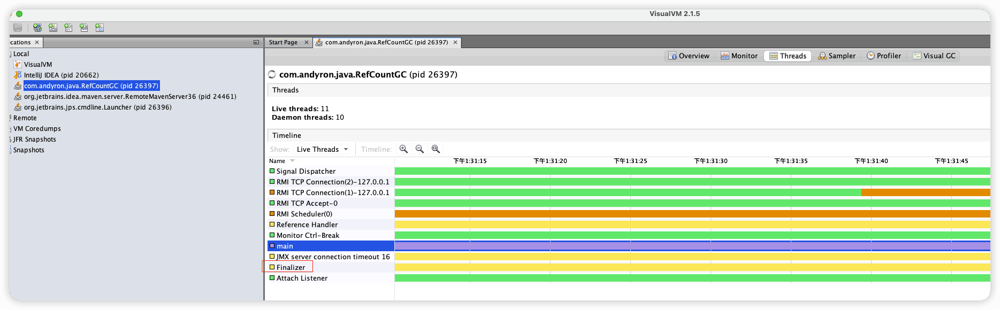

   3️⃣ ==finalize()方法是对象逃脱死亡的最后机会==，稍后GC会对F-Queue队列中的对象进行第二次标记。**如果objA在finalize()方法中与引用链上的任何一个对象建立了联系**，那么在**第二次标记**时，objA会被移出 “即将回收”集合。之后，对象会再次出现没有引用存在的情况。在这个情况下，finalize方法不会被再次调用，对象会直接变成不可触及的状态，也就是说，一个对象的finalize方法只会被调用一次。

```java
package com.andyron.java;

/**
 * 测试Object类中finalize()方法，即对象的finalization机制
 * @author andyron
 **/
public class CanReliveObj {
    public static CanReliveObj obj; // 类变量，属于GC Root

        // 只能被调用一次
//    @Override
//    protected void finalize() throws Throwable {
//        super.finalize();
//        System.out.println("调用当前类重写的finalize()方法");
//        obj = this;  // 把要回收的当前对象与GC Root建立了联系
//    }

    public static void main(String[] args) {
        try {
            obj = new CanReliveObj();
            // 对象第一次成功拯救自己
            obj = null;
            System.gc();  // 调用垃圾回收器
            System.out.println("第1次 gc");
            // 因为Finalizer线程优先级很低，暂停2秒，以等待它
            Thread.sleep(2000);
            if (obj == null) {
                System.out.println("obj is dead");
            } else {
                System.out.println("obj is still alive");
            }
            System.out.println("第2次 gc");
            // 下面代码与上面完全相同，但是这次自救失败了
            obj = null;
            System.gc();
            Thread.sleep(2000);
            if (obj == null) {
                System.out.println("obj is dead");
            } else {
                System.out.println("obj is still alive");
            }
        } catch (InterruptedException e) {
            e.printStackTrace();
        }
    }
}
```


### 15.4 MAT与JProfiler的GC Roots溯源

#### MAT工具使用

MAT是Memory Analyzer的简称，它是一款功能强大的Java堆内存分析器。用于查找内存油漏以及查看内存消耗情况。

MAT是基于Eclipse开发的，是一款免费的性能分析工具。

大家可以在http://www.eclipse.org/mat/下载并使用MAT。用户MAT打开dump文件做GC Roots分析：

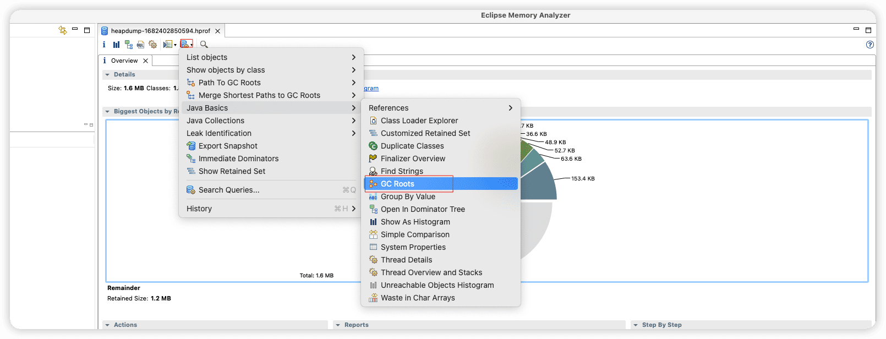

```java
/**
 * 用于生成两个dump
 * 是分析Memory Analyzer分析
 * @author andyron
 **/
public class GCRootsTest {
    public static void main(String[] args) {
        ArrayList<Object> numList = new ArrayList<>();
        Date birth = new Date();

        for (int i = 0; i < 100; i++) {
            numList.add(String.valueOf(i));
            try {
                Thread.sleep(10);
            } catch (InterruptedException e) {
                e.printStackTrace();
            }
        }

        System.out.println("数据添加完毕，请操作：");
        new Scanner(System.in).next();
        numList = null;
        birth = null;

        System.out.println("numList、birth已置空，请操作：");
        new Scanner(System.in).next();

        System.out.println("结束");
    }
}
```


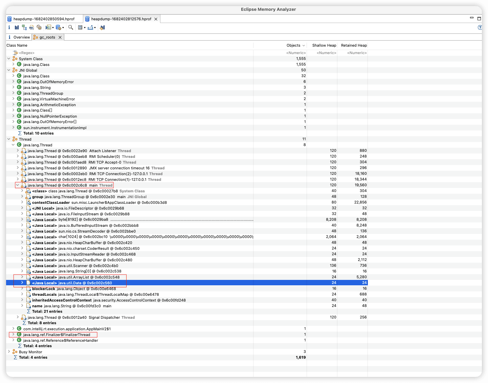

其中刚选项的意思：https://help.eclipse.org/latest/index.jsp?topic=/org.eclipse.mat.ui.help/welcome.html


> 通常不会看所有GC Roots，回看某个对象的，也就需要RC Roots溯源。

#### 获取dump文件

方式1：命令行使用 jmap


方式2：使用JVisualVM导面

- 捕获的heap dump文件是一个临时文件，关闭JVisualVM后自动删除，若要保留，需要将其另存为文件。

- 可通过以下方法捕获heap dump:

  在左侧“Application〞(应用程序）子窗口中右击相应的应用程序，选择Heap Dump（堆Dump）。

  在Monitor（监视）子标签页中点击Heap Dump（堆Dump）按钮。

  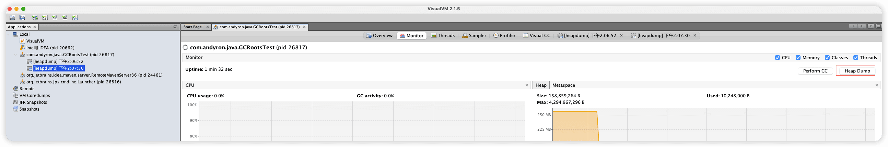

- 本地应用程序的Heap dump:作为应用程序标签页的一个子标签页打开。同时，heap dump在左侧的App1ication(应用程序）栏中对应一个含有时间戰的节点。右击这个节点选择save as（另存为）即可将heap dump保存到本地。


#### 使用JProfiler进行GC Roots溯源

🔖p145


#### 使用JProfilerf分析OOM

🔖p146

### 15.5 清除阶段：标记-清除算法

当成功区分出内存中存活对象和死亡对象后，GC接下来的任务就是执行垃圾回收，释放掉无用对象所占用的内存空间，以便有足够的可用内存空问为新对象分配内存。

目前在JVM中比较常见的三种垃圾收集算法是**标记-清除算法(MarK-Sweep）、复制算法（ Copying）、标记-压缩算法(Mark-Compact）**。


**背景：**

标记-清除算法（Mark-Sweep）是一种非常基础和常见的垃圾收集算法，该算法被J.McCarthy等人在1960年提出并并应用于Lisp语言。

**执行过程：**

当堆中的有效内存空间 (available memory）被耗尽的时候，就会停止整个程序（也被称为stop the world），然后进行两项工作，第一项则是标记，第二项则是清除。

- ==标记==：Collector<u>从引用根节点开始遍历</u>，标记<u>所有被引用的对象</u>（也就是非垃圾对象）。一般是在对象的Header中记录为可达对象。
- ==清除==：Collector<u>对堆内存从头到尾进行线性的遍历</u>，如果发现某个对象在其Header中没有标记为可达对象，则将其回收。

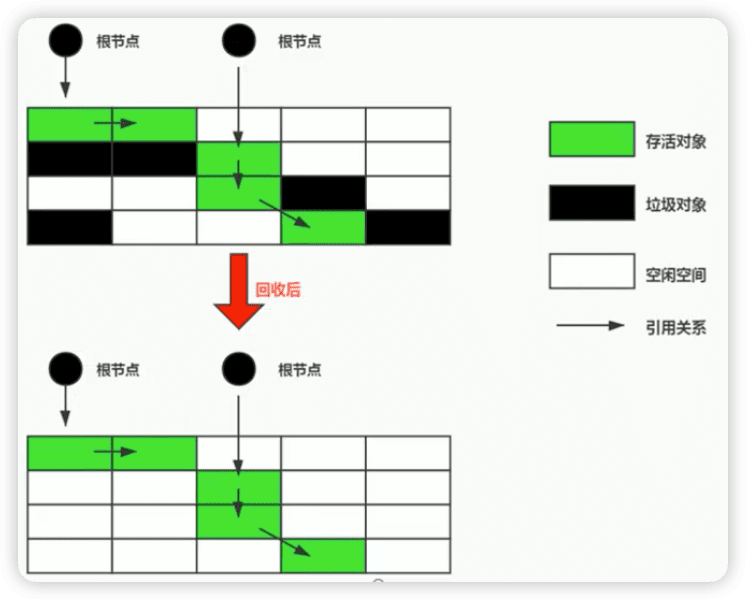

**缺点：**

- 效率不算高

- 在进行GC的时候，需要停止整个应用程序，导致用户体验差

- 这种方式清理出来的空闲内存是不连续的，产生内存碎片。需要维护一个空闲列表

**注意：何为清除？**

这里所谓的清除并不是真的置空，而是**把需要清除的对象地址保存在空闲的地址列表里**。下次有新对象需要加载时，判断垃圾的位置空问是否够，如果够，就存放，进行覆盖。

### 15.6 清除阶段：复制算法

复制(Copying）算法

**背景：**

为了解决标记-清除算法在垃圾收集效率方面的缺陷，M.L.Minsky于1963年发表了著名的论文，“使用双存储区的Lisp语言垃圾收集器CA LISP Garbage Collector Algorithm Using Serial secondary storage）”。M.L.Minsky 在该论文中描述的算法被人们称为==复制 (copying）算法==，它也被M.L.Minsky 本人成功地引入到了Lisp语言的一个实现版本中。

**核心思想：**

将活着的内存空间分为两块，每次只使用其中一块，在垃圾回收时将正在使用的内存中的存活对象复制到未被使用的内存块中，之后清除正在使用的内存块中的所有对象，交换两个内存的角色，最后完成垃圾回收。

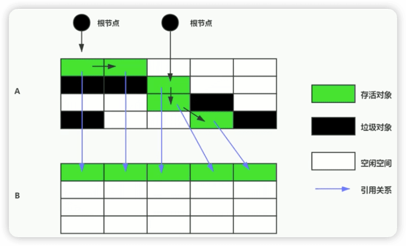

**优点：**

- 没有标记和清除过程，实现简单，运行高效
- 复制过去以后保证空间的连续性，不会出现“碎片” 问题。

**缺点：**

- 此算法的缺点也是很明显的，就是需要两倍的内存空问。
- 对于G1这种分拆成为大量region的GC，复制而不是移动，意味着GC需要维护region之间对象引用关系，不管是内存占用或者时间开销也不小。（联系[10.3 对象的访问定位](#10.3 对象的访问定位)）

**特别的：**

如果系统中的垃圾对象很多，复制算法不会很理想。因为复制算法需要复制的存活对象数量并不会太大，或者说非常低才行。（复制太多对象，还要修改地址不划算）

即特别适合垃圾对象很多，存活对象很少的场景，例如：Young区的SurvivorO和Survivor1区


**应用场景：**

在新生代，对常规应用的垃圾回收，一次通常可以回收70%-99%的内存空间。回收性价比很高。所以现在的商业虚拟机都是用这种收集算法回收新生代。

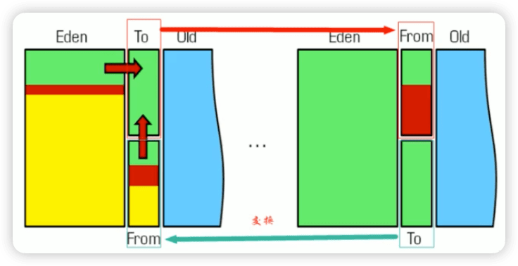


### 15.7 清除阶段：标记-压缩算法

标记-压缩（或标记-整理、Mark-Compact）算法

**背景：**

复制算法的高效性是建立在存活对象少、垃圾对象多的前提下的。这种情况在新生代经常发生，但是在老年代，更常见的情况是大部分对象都是存活对象。如果依然使用复制算法，由于存活对象较多，复制的成本也将很高。因此，**基于老年代垃圾回收的特性，需要使用其他的算法。**

标记-清除算法的确可以应用在老年代中，但是该算法不仅执行效率低下，而且在执行完内存回收后还会产生内存碎片，所以JVM的设计者需要在此基础之上进行改进。标记-压缩（Mark-compact）算法由此诞生。

1970年前后，G.L.steele、C.J.Chene和D.S.Wise等研究者发布标记-压缩算法。在许多现代的垃圾收集器中，人们都使用了标记-压缩算法或其改进版本。


**执行过程：**

- 第一阶段和标记清除算法一样，从根节点开始标记所有被引用对象

- 第二阶段将所有的存活对象压缩到内存的一端，按顺序排放。

- 之后，清理边界外所有的空间。

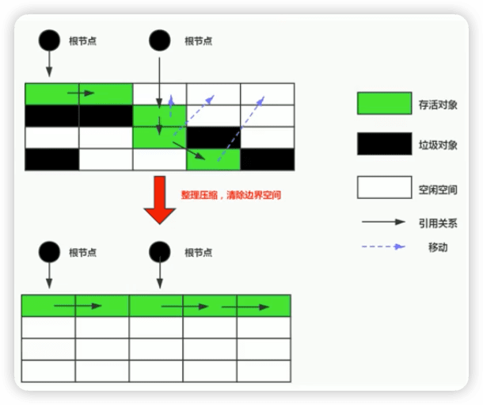

标记-压缩算法的最终效果等同子标记-消除算法执行完成后，再进行一次内存碎片整理，因此，也可以把它称为**==标记-清除-压缩 (Mark-Sweep-compact)算法==**。

二者的本质差异在于标记-清除算法是一种**非移动式的回收算法**，标记-压缩是**移动式的**。是否移动回收后的存活对象是一项**优缺点并存的风险決策**。

可以看到，标记的存活对象将会被整理，按照内存地址依次排列，而未被标记的内存会被清理掉。如此一来，当我们需要给新对象分配内存时，JVM只需要持有一个内存的起始地址即可，这比维护一个空闲列表显然少了许多开销。

> 指针磁撞 (Bump the rointer)
>
> 如果内存空间以规整和有序的方式分布，即已用和未用的内存都各自一边，彼此之问维系着一个记录下一次分配起始点的标记指针，当为新对象分配内存时，只需要通过修改指针的偏移量将新对象分配在第一个空闲内存位置上，这种分配方式就叫做指针碰撞 (Bump the Pointer)。

**优点：**

- 消除了标记-清除算法当中，内存区域分散的缺点，我们需要给新对象分配内存时，JVM只需要持有一个内存的起始地址即可。
- 消除了复制算法当中，内存减半的高额代价。

**缺点：**

- 从效率上来说，标记-整理算法要低于复制算法。
- 移动对象的同时，如果对象被其他对象引用，则还需要调整引用的地址。
- 移动过程中，需要全程暂停用户应用程序。即：STW

### 15.8 小结

#### 对比三种算法


效率上来说，复制算法是当之无愧的老大，但是却浪费了太多内存。

而为了尽量兼顾上面提到的三个指标，标记-整理算法相对来说更平滑一些，但是效率上不尽如人意，它比复制算法多了一个标记的阶段，比标记-清除多了一个整理内存的阶段。

### 15.9 分代收集算法

难道就没有一种最优算法吗

回答：无，==没有最好的算法，只有最合适的算法。==


前面所有这些算法中，并没有一种算法可以完全替代其他算法，它们都具有自己独特的优势和特点。分代收集算法应运而生。

分代收集算法，是基于这样一个事实：不同的对象的生命周期是不一样的。因此，==不同生命周期的对象可以采取不同的收集方式，以便提高回收效率==。一般是把Java堆分为新生代和老年代，这样就可以根据各个年代的特点使用不同的回收算法，以提高垃圾回收的效率。

在Java程序运行的过程中，会产生大量的对象，其中有些对象是与业务信息相关，比如**Http请求中的session对象、线程、socket连接**，这类对象跟业务直接挂钩，因此生命周期比较长。但是还有一些对象，主要是程序运行过程中生成的临时变量，这些对象生命周期会比较短，比如：**String对象**，由于其不变类的特性，系统会产生大量的这些对象，有些对象甚至只用一次即可回收。


**目前几乎所有的GC都是采用分代收集 (Generational collecting）算法执行垃圾回收的。**

在Hotspot中，基于分代的概念，GC所使用的内存回收算法必须结合年轻代和老年代各自的特点。

- 年轻代 (Young Gen)

  年轻代特点：区域相对老年代较小，对象生命周期短、存活率低，回收频繁。

  这种情况复制算法的回收整理，速度是最快的。复制算法的效率只和当前存活对象大小有关，因此很适用于年轻代的回收。而复制算法内存利用率不高的问题，通过hotspot中的两个survivor的设计得到缓解。

- 老年代 (Tenured Gen)

  老年代特点：区域较大，对象生命周期长、存活率高，回收不及年轻代频繁。

  这种情况存在大量存活率高的对象，复制算法明显变得不合适。一般是由标记-清除或者是标记-清除与标记-整理的混合实现。

  + Mark阶段的开销与存活对象的数量成正比。
  + Sweep阶段的开销与所管理区域的大小成正相关。
  + Compact阶段的开销与存活对象的数据成正比。


以Hot Spot中的**CMS回收器**为例，CMS是基于Mark-Sweep实现的，对于对象的回收效率很高。而对于碎片问题，CMS采用基于Mark-compact算法的**Serial Old回收器**作为补偿措施：当内存回收不佳（碎片导致的Concurrent Mode Failure时），将采用Serial Old执行Full GC以达到对老年代内存的整理。

分代的思想被现有的虛拟机广泛使用。几乎所有的垃圾回收器都区分新生代和老年代。

### 15.10 增量收集算法、分区算法

#### 增量收集算法

上述现有的算法，在坛圾回收过程中，应用软件将处于一种stop the morld的状态。在stop the world 状态下，应用程序所有的线程都会挂起，暂停一切正常的工作，等待垃圾回收的完成。如果垃圾回收时间过长，应用程序会被挂起很久，将==严重影响用户体验或者系统的稳定性==。为了解决这个问题，即对实时垃圾收集算法的研究直接导致了==增量收集 (Incremental Collecting）算法==的诞生。

**基本思想**

如果一次性将所有的垃圾进行处理，需要造成系统长时问的停顿，那么就可以让垃圾收集线程和应用程序线程**交替执行**。每次，==垃圾收集线程只收集一小片区域的内存空间，接着切换到应用程序线程。依次反复，直到垃圾收集完成==。

总的来说，增量收集算法的基础仍是传统的标记-清除和复制算法。增量收集算法通过==对线程间冲突的妥善处理，允许垃圾收集线程以分阶段的方式完成标记、清理或复制工作==。

**缺点：**

使用这种方式，由于在垃圾回收过程中，问断性地还执行了应用程序代码，所以能减少系统的停顿时间。但是，因为线程切换和上下文转换的消耗，会使得垃圾回收的总体成本上升，==造成系统吞吐量的下降==。

#### 分区算法

一般来说，在相同条件下，堆空间越大，一次GC时所需要的时间就越长，有关GC产生的停顿也越长。为了**更好地控制GC产生的停顿时间**，将一块大的内存区域分割成多个小块，根据目标的停顿时间，每次合理地回收若干个小区间，而不是整个堆空间，从而减少一次GC所产生的停顿。

分代算法将按照对象的生命周期长短划分成两个部分，分区算法将整个堆空间划分成连续的不同小区间region。（G1回收器）

每一个小区间都独立使用，独立回收。这种算法的好处是**可以控制一次回收多少个小区间**。

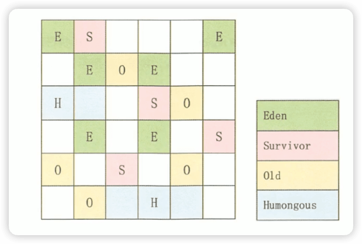

写在最后：

注意，这些只是基木的算法思路，实际GC实现过程要复杂的多，目前还在发展中的前沿GC都是==复合算法，并且并行和并发兼备==。


## 16 垃圾回收相关概念

P154

### 16.1 System.gc()的理解

- 在默以情况下，通过`System.gc()`或者`Runtime.getRuntime().gc()`的调用，会==显式触发Full GC==，同时对老年代和新生代进行回收，尝试释放被丢弃对象占用的内存。

- 然而System.gc()调用附带一个免责声明，==无法保证对垃圾收集器的调用==（仅仅是告诉虚拟机希望进行一次GC）。

- JVM实现者可以通过system.gc()调用来决定JVM的GC行为。而一般情况下，垃圾回收应该是自动进行的，**无须手动触发**，否则就太过于麻烦了。在一些特殊情况下，如我们正在编写一个性能基准，我们可以在运行之间调用System.gc()。


### 16.2 内存溢出与内存泄漏

#### 内存溢出 (OOM）

- 内存溢出相对于内存泄漏来说，尽管更容易被理解，但是同样的，内存溢出也是引发程序崩溃的罪魁祸首之一。
- 由于GC一直在发展，所有一般情况下，除非<u>应用程序占用的内存增长速度非常快，造成垃圾回收已经跟不上内存消耗的速度</u>，否则不太容易出现OOM的情况。
- 大多数情况下，GC会进行各种年龄段的垃圾回收，实在不行了就放大招，来一次独占式的Full GC操作，这时候会回收大量的内存，供应用程序继续使用。
- javadoc中对OutOfMemoryError的解释是，==没有空闲内存，并且垃圾收集器也无法提供更多内存==。

- 首先说没有空闲内存的情况：说明Java虚拟机的堆内存不够。原因有二：

  1. Java虚拟机的堆内存设置不够。

     比如：可能存在内存泄漏问题；也很有可能就是堆的大小不合理，比如我们要处理比较可观的数据量，但是没有显示指定JVM堆大小或者指定数值偏小。我们可以通过参数-Xms、-Xmx来调整。

  2. **代码中创建了大量大对象，并且长时间不能被垃圾收集器收果（存在被引用）**

     对于老版本的Oracle JDK，因为永久代的大小是有限的，并且JVM对永久代垃级回收（如，常量池回收、卸载不再需要的类型），非常不积极：所以当我们不断添加新类型的时候，永久代出现OutOfMemoryError也非常多见，尤其是在运行时存在大量动态类型生成的场合；类似intern字符串缓存占用太多空间，也会导致OOM问题。对应的异常信息，会标记出来和永久代相关：“java.lang.outofMemoryError: PermGen space" 。

     随着元数据区的引入，方法区内存已经不再那么窘迫，所以相应的OOM有所改观，出现00M，异常信息则变成了：“java.lang.OutOfMemoryError：Metaspace"。直接内存不足，也会导致OOM。


- 这里面隐含者一层意思是，在拋出outofmemoryError之前，通常垃圾收集器会被触发，尽其所能去清理出空间。

  例如：在引用机制分析中，涉及到JVM会去尝试回收**软引用指向的对象等**。

  在java.nio.BIts.reserveMemory(）方法中，我们能清楚的看到，System.gc()会被调用，以清理空间。

- 当然，也不是在任何情况下垃圾收集器都会被触发的

  比如，我们去分配一个超大对象，类似一个超大数组超过堆的最大值，JVM可以判断出垃圾收集并不能解决这个问题，所以直接抛出OutofMemoryError。

#### 内存泄漏(Memory Leak)

也称作 “存储渗漏”。**严格来说，==只有对象不会再被程序用到了，但是GC又不能回收他们的情况，才叫内存泄漏==。**

但实际情况很多时候一些不太好的实践（或疏忽）会导致对象的生命周期变得很长甚至导致OOM，也可以叫做==宽泛意义上的“内存泄漏”==。（如，把局部变量定义全局变量，甚至是static的；web程序中，把一些没有必要的应用对象定义成会话级别的）

尽管内存泄漏并不会立刻引起程序崩溃，但是一旦发生内存泄漏，程序中的可用内存就会被逐步蚕食，直至耗尽所有内存，最终出现OutofMemory异常，导致程序崩溃。

注意，这里的存储空间并不是指物理内存，而是指虚拟内存大小，这个虚拟内存大小取决于磁盘交换区设定的大小。

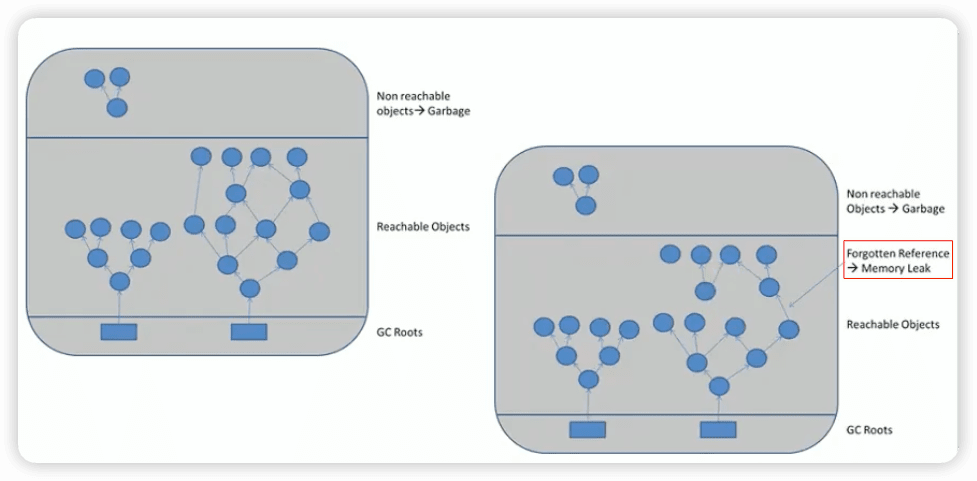

**举例：**

1. 单例模式

单例的生命周期和应用程序是一样长的，所以单例程序中，如果持有对外部对象的引用的话，那么这个外部对象是不能被回收的，则会导致内存泄漏的产生。（比如Runtime对象是单例的，如果写了一写代码对象引用了它没有及时断开，这些对象本来用来之后就不用了，然后一直存在了）

2. 一些提供close的资源未关闭导致内存泏漏

数据库连接 (datasourse. getconnection()），网络连接(socket)和io连接必须于动close，否则是不能被回收的。（凡是和外部资源进行交互时都需要进行关闭，这样GC才能回收这些资源）

### 16.3 Stop The World

- stop-the-World，简称STW，指的是GC事件发生过程中，会产生应用程序（用户线程）的停顿。==停顿产生时整个应用程序线程都会被暂停，没有任何响应==，有点像卡死的感觉，这个停顿称为==STW==。

  可达性分析算法中枚举根节点(GC Roots）会导致所有Java执行线程停顿。

  + 分析工作必须在一个能确保一致性的快照中进行
  + 一致性指整个分析期间整个执行系统看起来像被冻结在某个时间点上
  + ==如果出现分析过程中对象引用关系还在不断变化，则分析结果的准确性无法保证==

- 被STW中断的应用程序线程会在完成GC之后恢复，频繁中断会让用户感觉像是网速不快造成电影卡带一样，所以我们需要减少STW的发生。

- STW事件和采用哪款GC无关，所有的GC都有这个事件。
- 哪怕是G1也不能完全避免stop-the-world 情况发生，只能说垃圾回收器越来越优秀，回收效率越来越高，尽可能地缩短了暂停时问。
- STW是JVM在==后台自动发起和自动完成的==。在用户不可见的情况下，把用户正常的工作线程全部停掉。
- 开发中不要用System.gc()；会导致stop-the-world的发生。

### 16.4 垃圾回收的并行与并发

#### 并发(Concurrent)

- 在操作系统中，是指一个==时间段==中有几个程序都处于已启动运行到运行完毕之间，且这几个程序都是在==同一个处理器==上运行。
- 并发不是真正意义上的“同时进行”，只是CPU把一个时间段划分成几个时间片段（时间区间)，然后在这几个时间区间之间来回切换，由于CPU处理的速度非常快，只要时间间隔处理得当，即可让用户感觉是多个应用程序同时在进行。

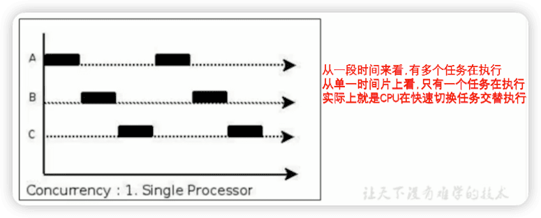

#### 并行(Parallel)

- 当系统有一个以上CPU时，当一个CPU执行一个进程时，另一个CPU可以执行另一个进程，两个进程互不抢占CPU资源，可以同时进行，我们称之为**==并行(Parallel)==**。
- 其实决定并行的因素不是CPU的数量，而是**CPU的核心**数量，比如一个CPU多个核也可以并行。
- 适合科学计算，后台处理等弱交互场景


#### 并发vs并行

**二者对比：**

并发，指的是多个事情，在==同一时间段内同时发生了==。

并行，指的是多个事情，在==同一时间点上同时发生了==。

并发的多个任务之间是**互相抢占**资源的。

并行的多个任务之间是**不互相抢占**资源的。

只有在多CPU或者一个CPU多核的情况中，才会发生并行。

否则，看似同时发生的事情，其实都是并发执行的。

#### 垃圾回收的井发与井行

并发和并行，在谈论垃圾收集器的上下文语境中，它们可以解释如下：

- 并行 (Parallel）：指多条垃圾收集线程并行工作，但此时用户线程仍处于等待状态。

  如ParNew、 Parallel Scavenge、 Parallel Old;

- 串行 (Serial)

  相较于并行的概念，单线程执行。

  如果内存不够，则程序暂停，启动JVM垃圾回收器进行垃圾回收。回收完，再启动程序的线程。

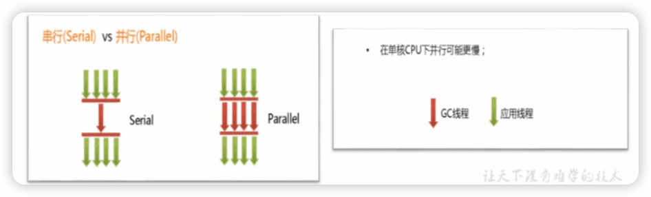

- 并发（Concurrent)：指==用户线程与垃圾收集线程同时执行==（但不一定是并行的，可能会交替执行），垃圾回收线程在执行时 不会停顿用户程序的运行。

  用户程序在继续运行，而垃圾收集程序线程运行于另一个CPU上；

  如：CMS、G1

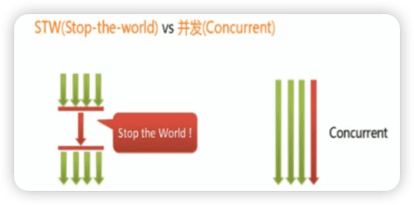

### 16.5 安全点与安全区域

#### 安全点(Safepoint)

程序执行时并非在所有地方都能停顿下来开始GC，只有在特定的位置才能停顿下来开始GC，这些位置称为 “**安全点(Satepoint）**”。

Safe point的选择很重要，**如果太少可能导致GC等待的时间太长，如果太频繁可能导致运行时的性能问题**。大部分指令的执行时间都非常短暂，通常会根据 <u>“是否具有让程序长时间执行的特征”为标准</u>。比如：选择一些执行时间较长的指令作为safe point，如**方法调用、循环跳转和异常跳转**等。


**如何在GC发生时，检查所有线程都跑到最近的安全点停顿下来呢？**

- 抢先式中断：（目前没有虚拟机采用了）

  首先中断所有线程。如果还有线程不在安全点，就恢复线程，让线程跑到安全点。

- 主动式中断：

  设置一个中断标志，各个线程运行到Safe Point的时候主动轮询这个标志，如果中断标志为真，则将自己进行中断挂起。


#### 安全区域(Safe Region)

Safepoint 机制保证了程序执行时，在不太长的时间内就会遇到可进入GC的 safepoint。但是，程序 “不执行” 的时候呢？例如线程处于 Sleep 状态或 Blocked 状态，这时候线程无法响应JVM 的中断请求，“走”到安全点去中断挂起，JVM 也不太可能等待线程被唤醒。对于这种情况，就需要安全区域(Safe Region）来解决。

==安全区域是指在一段代码片段中，对象的引用关系不会发生变化，在这个区域中的任何位置开始GC都是安全的==。我们也可以把 Safe Region 看做是被扩展了的 Safepoint。


实际执行时：

1. 当线程运行到Safe Region的代码时，首先标识己经进入了Safe Region,如果这段时间内发生GC，JVM会忽略标识为Safe Region状态的线程；
2. 当线程即将离开Safe Region时，会检查JVM是否己经完成GC，如果完成了，则继续运行，否则线程必须等待直到收到可以安全离开Safe Region的信号为止；

### 16.6 再谈引用❤️

我们希望能描述这样一类对象：当内存空间还足够时，则能保留在内存中；如果内存空间在进行垃圾收集后还是很紧张，则可以拋弃这些对象。

【既**偏门**又非常**高频**的面试题】强引用、软引用、弱引用、虚引用有什么区别？具体使用场景是什么？

在JDK 1.2版之后，Java对引用的概念进行了扩充，将引用分为强引用(Strong Reference）、软引用（Soft Reference）、弱引用(Weak Reference）和虚引用(Phantom Reference）4种，这4种引用==强度依次逐渐减弱==。

除强引用外，其他了种引用均可以在java.lang.ref包中找到它们的身影。如下图，显示了这3种引用类型对应的类，开发人员可以在应用程序中直接使用它们。

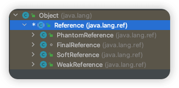

Reference子类中只有终结器引用是包内可见的，其他3种引用类型均public，可以在应用程序中直接使用。

- ==强引用 (StrongReference）==：最传统的“引用”的定义，是指在程序代码之中普遍存在的引用赋值，即类似“`object obj = new object()`”这种引用关系。**无论任何情况下，只要强引用关系还存在，垃圾收集器就永远不会回收掉被引用的对象**。（只要强引用关系存在，就永不回收）
- ==软引用(SoftReference）==：在系统将要发生内存溢出之前，将会把这些对象列入回收。范围之中进行第二次回收。如果这次回收后还没有足够的内存，才会拋出内存溢出异常。（内存不足就回收）
- ==弱引用 (WeakReference）==：被弱引用关联的对象只能生存到下一次垃圾收集之前。**当垃圾收果器工作时，无论内存空间是否足够，都会回收掉被弱引用关联的对象**。（发现就回收）
- ==虚引用(PhantomReference）==：一个对象是否有虛引用的存在，完全不会对其生存时间构成影响，也无法通过虛引用来获得一个对象的实例。为一个对象设置虚引用关联的唯一目的就是==能在这个对象被收集器回收时收到一个系统通知==。

#### 强引用

强引用(Strong Reference) - ==不回收==

在Java程序中，最常见的引用类型是强引用（**普通系统99%以上都是强引用**），也就是我们最常见的普通对象引用，也是**默认的引用类型**。

当在Java语言中使用new操作符创建一个新的对象，并将其赋值给一个变量的时候，这个变量就成为指向该对象的一个强引用。

强引用的对象是==可触及的==，==垃圾收集器就永远不会回收掉被引用的对象==。

对于一个普通的对象，如果没有其他的引用关系，只要超过了引用的作用域或者显示地将相应（强）引用赋值为null，就是可以当做垃圾被收集了，当然具体回收时机还是要看垃圾收集策略。

相对的，软引用、弱引用和虛引用的对象是**软可触及、弱可触及和虛可触及的**，在一定条件下，都是可以被回收的。所以，==强引用是造成Java内存泄漏的主要原因之一==。


本例中的两不引用，都是强引用，强多用具各以下特点：

- 强引用可以直接访问目标对象。
- 强引用所指向的对象在任何时候都不会被系统回收，虛拟机宁愿抛出
- 0OM异常，也不会回收强引用所指向对象。
- 强引用可能导致内存泄漏。

#### 软引用

软引用 （Soft Reference）- ==内存不足即回收==

软引用是用来描述一些还有用，但非必需的对象。==只被软引用关联着的对象，在系统将要发生内存溢出异常前，会把这些对象列进回收花围之中进行第二次回收==，如果这次回收还没有足够的内存，才会抛出内存溢出异常。

软引用通常用来实现内存敏感的**缓存**。比如：**高速缓存**就有用到软引用。如果还有空闲内存，就可以暂时保留缓存，当内存不足时清理掉，这样就保证了使用缓存的同时，不会耗尽内存。(🔖mybatis)

垃圾回收器在某个时刻决定回收软可达的对象的时候，会清理软引用，并可选地把引用存放到一个引用队列 (Reference Queue)。

类似弱引用，只不过Java虚拟机会尽量让软引用的存活时间长一些，迫不得己才清理。


在JDK 1.2版之后提供了java.lang.ref.SoftReference类来实现软引用。

```java
object obj = new object()； // 声明强引用
SoftReference<Object> sf = new SoftReferences<Object>(obj);
obj =null; // 销毁强引用
```

等同于：

```java
oftReference<Object> sf = new SoftReference<Object>(new Object());
```

🔖p165 软引用测试

#### 弱引用

弱引用(Weak Reference）-（GC）发现即回收

弱引用也是用来描述那些非必需对象，==**只**被弱引用关联的对象只能生存到下一次垃圾收集发生为止==。在系统GC时，只要发现弱引用，不管系统堆空间使用是否充足，都会回收掉只被弱引用关联的对象。

但是，由于垃圾回收器的线程通常优先级很低，因此，并不一定能很快地发现持有弱引用的对象。在这种情况下，==弱引用对象可以存在较长的时间==。

弱引用和软引用一样，在构造弱引用时，也可以指定一个引用队列，当弱引用对象被回收时，就会加入指定的引用队列，通过这个队列可以跟踪对象的回收情况。

==软引用、弱引用都非常适合来保存那些可有可无的缓存数据==。如果这么做，当系统内存不足时，这些缓存数据会被回收，不会导致内存溢出。而当内存资源充足时，这些缓存数据又可以存在相当长的时问，从而起到加速系统的作用。


在JDK 1.2版之后提供了java. 1ang. 19f. WeakReference类水实现弱引用。

```java
Object obj = new object(); // 声明强引用
WeakReference<Object> wr = new WeakReference<Object>(obj);
obj = null; // 销毁强引用
```

弱引用对象与软引用对象的最大不同就在于，当GC在进行回收时，需要通过算法检查是否回收软引用对象，而对于弱引用对象，GC总是进行回收。==弱引用对象更容易、更快被GC回收==。

> 面试题：你开发中使用过WeakHashMap吗？

#### 虚引用

虚引用(Phantom Reference) - **对象回收跟踪**

也称为“幽灵引用” 或者“幻影引用”，是所有引用类型中最弱的一个。

一个对象是否有虚引用的存在，完全不会决定对象的生命周期。如果一个对象仅持有虚引用，那么它和没有引用几乎是一样的，随时都可能被垃圾回收器回收。

它不能单独使用，也**无法通过虚引用来获取被引用的对象**。当试图通过虚引用的get()方法取得对象时，总是null。

为一个对象设置虚引用关联的唯一目的在于==跟踪垃圾回收过程==。比如：能在这个对象被收集器回收时收到一个系统通知。 

- 虛引用必须和引用队列一起使用。虚引用在创建时必须提供一个引用队列作为参数。当垃圾回收器准备回收一个对象时，如果发现它还有虛引用，就会在回收对象后，将这个虛引用加入引用队列，以通知应用程序对象的回收情况。
- ==由于虚引用可以跟踪对象的回收时间，因此，也可以将一些资源释放操作放置在虚引用中执行和记录。==
- 在JDK 1.2版之后提供了 `PhantomReference`类来实现虛引用。

```java
Object obj = new Object();
ReferenceQueue phantomQueue = new ReferenceQueue();
PhantomReference<Object› pf = new PhantomReference<Object>(obj, phantomQueue);
obj = null;
```


#### 终结器引用

终结器引用 (Final reference)

- 它用以实现对象的`finalize()`方法，也可以称为终结器引用。
- 无需手动编码，其内部配合引用队列使用。
- 在GC时，终结器引用入队。由Finalizer线程通过终结器引用找到被引用对象并调用它的finalize()方法，第二次GC时才能回收被引用对象。

## 17 垃圾回收器

P169

### 17.1 GC分类与性能指标

#### 垃圾回收器概述

- 垃圾回收器没有在规范中进行过参的规定，可以由不同的厂商、不同版本的JVM来实现。
- 由于JDK的版本处于高速迭代过程中，因此Java发展至今已经行生了众多的GC版本。
- 从不同角度分析垃圾收集器，可以将GC分为不同的类型。

> Java不同版本的新特性：（关注的方面）
>
> 1. 语法层面：Lambda表达式、Switch、自动装箱、自动拆箱、enum...
> 2. API层面：Stream API、Optional、新的日期时间、Stirng、集合框架...
> 3. 底层优化：JVM优化，GC的变化、元空间、静态域、字符串常量池等

#### 垃圾回收器分类

按==线程数==分，可以分为==串行垃圾回收器==和==并行垃圾回收器==。

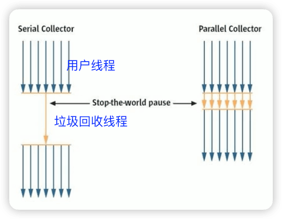

- 串行回收指的是在同一时间段内只允许有一个CPU用于执行垃圾回收操作，此时工作线程被暂停，直至垃圾收集工作结束。
  + 在诸如单CPU处理器或者较小的应用内存等硬件平台不是特别优越的场合，串行回收器的性能表现可以超过并行回收器和并发回收器。所以，串行回收默认被应用在客户端的Client模式下的JVM中
  + 在在并发能力比较强的CPU上，并行回收器产生的俘顿时间要短于串行回收器。

- 和串行回收相反，并行收集可以运用多个CPU同时执行垃圾回收，因此提升了应用的吞吐量，不过并行回收仍然与串行回收一样，采用独占式，使用了“stop-the-worla”机制。

按照==工作模式==分，可以分为==并发式垃圾回收器==和==独占式垃圾回收器==。

- 并发式垃圾回收器与应用程序线程交替工作，以尽可能减少应用程序的停顿时间。

- 独占式垃圾回收器(stop the world)一旦运行，就停止应用程序中的所有用户线程，直到垃圾回收过程完全结束。

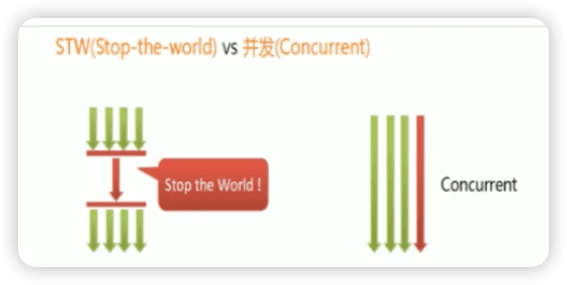


按==碎片处理方式==分，可分为==压缩式垃圾回收器==和==非压缩式垃圾回收器==。

- 压缩式垃数回收器会在回收完成后，对存话对象进行压缩整理，消除回收后的碎片。

  再分配对象空间使用：指针碰撞

- 非压缩式的垃圾回收器不进行这步操作。

  再分配对象空间使用：空闲列表

按==工作的内存区间==分，又可分为==年轻代垃圾回收器==和==老年代垃圾回收器==。

#### 评估GC的性能指标

- ==吞吐量：运行用户代码的时间占总运行时间的比例==

  （总运行时间：程序的运行时间十内存回收的时间）

- 垃圾收集开销：吞吐量的补数，垃圾收集所用时间与总运行时间的比例。【与吞吐量是互补的概念】

- **==暂停时间：执行垃圾收集时，程序的工作线程被暂停的时间。==**❤️

- 收集频率：相对于应用程序的执行，收集操作发生的频率。

- ==内存占用：Java堆区所占的内存大小。==

- 快速：一个对象从诞生到被回收所经历的时间。

吞吐量、暂停时间、内存占用，这三者共同构成一个“不可能三角”。三者总体的来现会随着技木进步

而越来越好。**一款优秀的收集器通常最多同时满足其中的两项。**

这三项里，暂停时间的重要性日益凸显。因为随着硬件发展，内存占用多些越来越能容忍，硬件性能的提升也有助于降低收集器运行时对应用程序的影响，即提高了吞吐量。而内存的扩大，对延迟反而带来负面效果。

简单来说，主要抓住两点：吞吐量，暂停时间。

##### 吞吐量(throughput)

- 吞吐量就是CPU用于运行用户代码的时间与CPU总消耗时间的比值，即吞吐量 = 运行用户代码时间 /（运行用户代码时间 ＋ 垃圾收集时问）。

  比如：虚拟机总共运行了100分钟，其中垃圾收集花掉1分钟，那吞吐量就是99%。

- 这种情况下，应用程序能容忍较高的暂停时间，因此，高吞吐量的应用程序有更长的时间基准，快速响应是不必考虑的。

- 吞吐量优先，意味着在单位时间内，STW的时问最短：0.2 + 0.2= 0.4

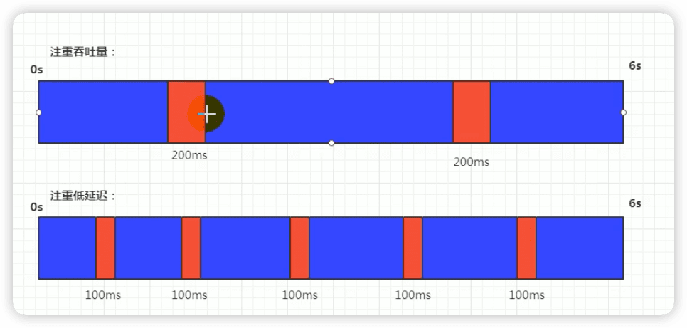

##### 暂停时间(pause time)

- “暂停时间” 是指一个时间段内应用程序线程暂停，让GC线程执行的状态
   例如，GC期间100毫秒的暂停时间意味着在这100亳秒期间内没有应用程序线程是活动的。
- 暂停时间优先，意味着尽可能让单次STW的时间最短：0.1+ 0.1+0.1+0.1+0.1=0.5


##### 评估GC的性能指标：吞吐量vs暫停时间

- 高吞吐量较好因为这会让应用程序的最终用户感觉只有应用程序线程在做“生产性” 工作。直觉上，吞吐量越高程序运行越快。
- 低暂停时间（低延迟）较好因为从最终用户的角度来看不管是GC还是其他原因导致一个应用被挂起始终是不好的。这取决于应用程序的类型，==有时候甚至短暂的200毫秒暂停都可能打断终端用户体验==。因此，具有低的较大暂停时间是非常重要的，特别是对于一个==交互式应用程序==。
- 不幸的是”高吞吐量”和”低暂停时间”是一对相互竞争的目标（矛盾）。
  + 因为如果选择以吞吐量优先，那么必然需要降低内存回收的执行频率，但是这样会导致GC需要更长的暂停时间来执行内存回收。
  + 相反的，如果选择以低延迟优先为原则，那么为了降低每次执行内存回收时的暂停时间，也只能频繁地执行内存回收，但这又引起了年轻代内存的缩减和导致程序吞吐量的下降。

在设计（或使用）GC算法时，我们必须确定我们的目标：一个GC算法只可能针对两个目标之一（即只专注于较大吞吐量或最小暂停时间），或尝试找到一个二者的折衷。

现在标淮：==在最大吞吐量优先的情况下，降低停顿时间==。

### 17.2 不同的垃圾回收器概述

垃圾收集机制是Java的招牌能分，极大地提高了开发效料。这当然也是面试的热点。

<u>那么，Java常见的垃圾收集器有哪些？</u>

#### 垃圾收集器发展史

有了虛拟机，就一定需要收集垃圾的机制，这就是Garbage Collection，对应的产品我们称为Garbage Collector。

- 1999年随JDK1.3.1一起来的是串行方式的==Serial GC==，它是第一款GC。 ==ParNew==垃圾收集器是Serial收集器的多线程版本
- 2002年2月26日，==Parallel GC== 和==Concurrent Mark Sweep GC==（CMS，第一款真正意义上的并发回收器）跟随JDK1.4.2一起发布
- ==Parallel GC==在JDK6之后成为Hotspot默认GC。
- 2012年，在JDK1.7u4版本中，==G1==可用。
- 2017年，JDK9中G1变成默认的拉圾收集器，以替代CMS。

- 2018年3月，JDK10中G1垃圾回收器的并行完整垃圾回收，实现**并行性**来改善最坏情况下的延迟。（限定一个停顿时间，尽可能提高吞吐量）
- 【分水岭】2018年9月，JDK11发布。引入==Epsilon== 垃圾回收器，又被称为"==NO-OP==（无操作）〞回收器。同时，引入**==ZGC==**：可伸缩的低延迟垃圾回收器 (Experimental)。
- 2019年3月，JDK12发布。增强G1，自动返回未用堆内存给操作系统。同时，引入==Shenandoah GC==（红帽）： 低停顿时间的GC (Experimental)。
- 2019年9月，JDK13发布。增强==ZGC==，自动返回未用堆内存给操作系统。
- 2020年3月，JDK14发布。**删除CMS垃圾回收器**。扩展ZGC在macos和Windows上的应用。

> 在 JDK 15 中 ZGC 不再是实验功能，可以正式投入生产使用了，使用 –XX:+UseZGC 可以启用 ZGC。

#### 7款==经典==的垃圾收集器。

- 串行回收器：Serial、Serial old
- 并行回收器：ParNew、 Parallel Scavenge、Parallel Old
- 并发回收器：CMS、G1

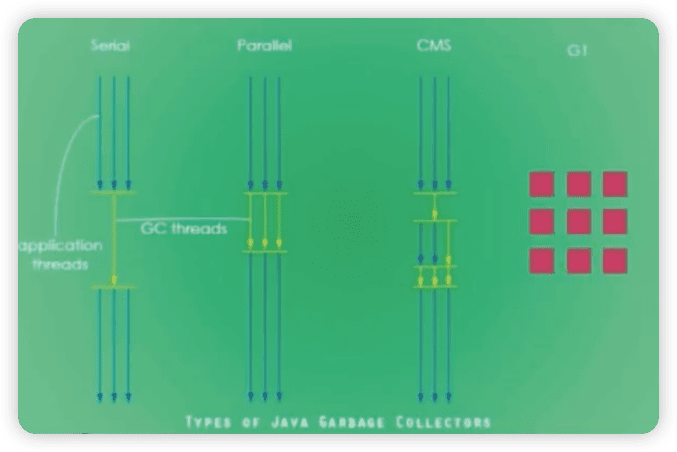

#### 7款经典收集器与垃圾分代之间的关系

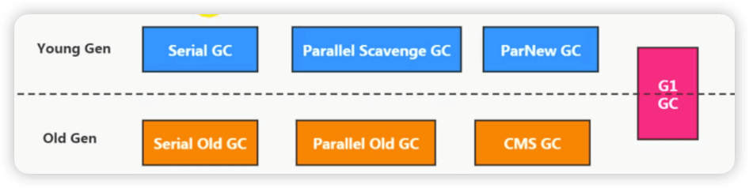

- 新生代收集器：Serial、 ParNew、Parallel Scavenge;
- 老年代收集器：Serial Old、 Parallel Old、CMS;
- 整堆收集器：G1;

#### 垃圾收集器的组合关系❤️

一个新生代收集器和一个老年代收集器组合使用

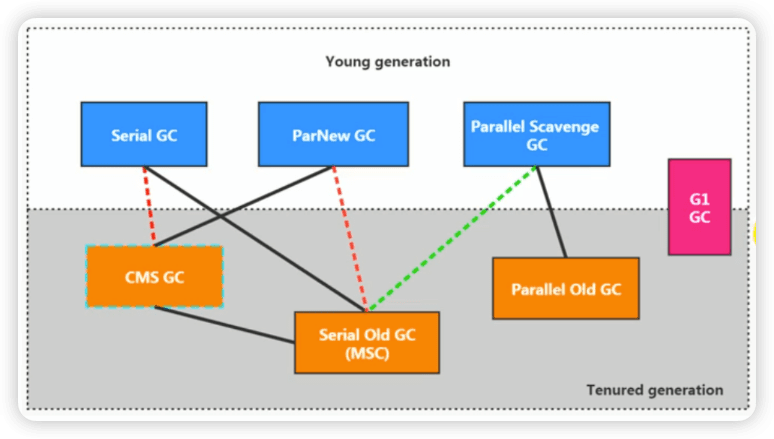

1. 两个收集器间有连线，表明它们可以搭配使用：

Serial/Serial Old、Serial/CMS、ParNew/Serial Old、ParNew/CMS, Parallel Scavenge/Serial Old、 Parallel Scavenge/Parallel Old、G1;

2. 其中serial o1d作为CMS出现"Concurrent Mode Failure"失败的后备预案。

3.（红色虚线）由于维护和兼容性测试的成本，在JDK 8时将Serial+CMS、ParNew + Serial old这两个组合声明为废弃（JEP 173），并在JDK 9中完全取消了这些组合的支持（JEP214），即：移除。

4.（绿色虚线）JDK 14中：弃用Parallel Scavenge 和Serial Old GC组合（JEP 366)

5.（青色虛线）JDK 14中：删除CMS垃圾回收器(JEP 363)

#### 不同的垃圾回收器概述

- **为什么要有很多收集器**，一个不够码？因为Java的使用场景很多，移动端，服务器等。所以就需要针对不同的场景，提供不同的垃圾收集器，提高垃圾收集的性能。

- 虽然我们会对各个收集器进行比我，但并非为了挑选一个最好的收集器出来。没有一种放之四海皆准、任何场景下都适用的完美收集器存在，更加没有万能的收集器。所以==我们选择的只是对具体应用最合适的收集器==。

#### 如何查看默认的垃圾收集器

- `-XX:+PrintCommandLineFlags`：查看命令行相关参数（包含使用的垃圾收集器）

  ```java
  -XX:InitialHeapSize=268435456 -XX:MaxHeapSize=4294967296 -XX:+PrintCommandLineFlags -XX:+UseCompressedClassPointers -XX:+UseCompressedOops -XX:+UseParallelGC
  ```

  

- 使用命令行指令：`jinfo -flag 相关垃圾回收器参数 进程ID`

```shell
➜  jinfo -flag UseParallelGC 38334 
-XX:+UseParallelGC
➜  jinfo -flag UseParallelOldGC 38334
-XX:+UseParallelOldGC
➜  jinfo -flag UseG1GC 38334         
-XX:-UseG1GC
```


### 17.3 Serial回收器：串行回收

- Serial收集器是最基本、历史最悠久的垃圾收集器了。JDR1.3之前回收新生代唯一的选择。

- Serial收集器作为Hotspot中Client模式下的默认新生代垃圾收集器。

- Serial收集器采用**==复制算法==**、==串行回收==和”stop-the-world"机制的方式执行内存回收。

- 除了年轻代之外，serial收集器还提供用于执行老年代垃圾收集的Serial Old收集器。Serial old 收集器同样也采用了串行回收和"stop the world”机制，只不过内存回收算法使用的是**标记-压缩算法**。

  Serial Old是运行在Client模式下默认的老年代的垃圾回收器

  Serial Old在Server模式下主要有两个用途：1️⃣与新生代的Parallel Scavenge配合使用 2️⃣作为老年代CMS收集器的后备垃圾收集方案

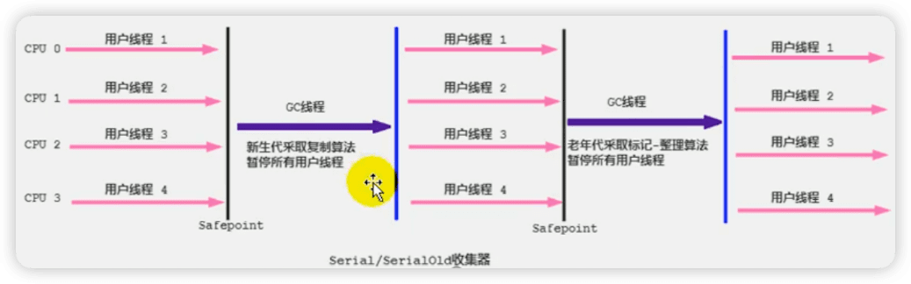

这个收集器是一个单线程的收集器，但它的“单线程”的意义并不仅仅说明它==只会使用一个CPU或一条收集线程去完成垃圾收集工作==，更重要的是在它进行垃圾收集时，必须==暂停其他所有的工作线程==，直到它收集结束 (stop The world)。

- 优势：**简单而高效**（与其他收集器的单线程比），对于限定单个CPU的环境来说，serial收集器由于没有线程交互的开销，专心做垃圾收集自然可以获得最高的单线程收集效率。

  运行在Client模式下的虚拟机是个不错的选择。

- 在用户的桌面应用场景中，可用内存一般不大（几十M至一两百MB）可以在较短时间内完成垃圾收集（几十ms至一百多ms），只要不频繁发生，使用串行回收器是可以接受的。

- 在Hotspot虚拟机中，使用`-XX:+UseSerialGC` 参数可以指定年轻代和老年代都使用串行收集器。

  等价于新生代用Serial GC，且老年代用Serial old Gc

**总结**

这种拉圾收集器大家了解，现在已经不用串行的了。而且在限定单核cpu才可以用。现在都不是单核的了。

对于交互较强的应用而言，这种垃圾收集器是不能接受的。一般在Javaweb应用程序中是不会采用串行垃圾收集器的。

### 17.4 ParNew回收器：并行回收

- 如果说Serial GC是年轻代中的单线程城圾收集器，那么ParNew回收器则是Serial收集器的**多线程版本**。

  Par是Parallel的缩写，New：只能处理的是新生代

- ParNew收集器除了采用==并行回收==的方式执行内存回收外，两款垃圾回收器之间几乎没有任何区别。ParNew收集器在年轻代中同样也是采用==复制算法、"stop-the-Norld"==机制。

- ParNew 是很多JVM运行在Server模式下新生代的默认垃圾收集器。

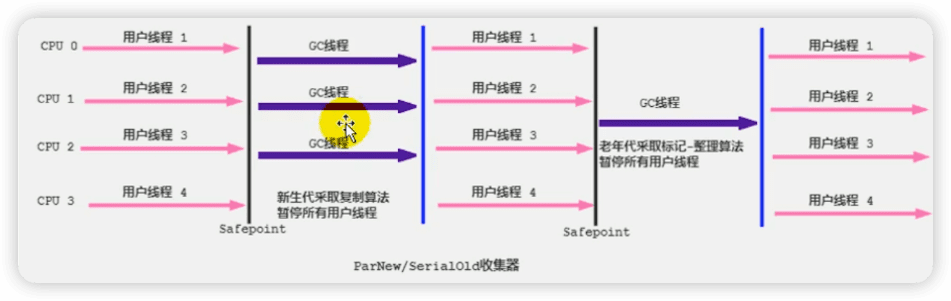

- <u>对于新生代，回收次数频繁，使用并行方式高效。</u>
- <u>对于老年代，回收次数少，使用串行方式节省资源</u>。(CPU并行需要切换线程，串行可以省去切换线程的资源）

- 由于ParNew收集器是基于并行回收，那么是否可以断定ParNew收集器的回收效率在任何场景下都会比Serial收集器更高效？
  + ParNew 收集器运行在多CPU的环境下，由于可以充分利用多CPU、多核心等物理硬件资源优势，可以更快速地完成垃圾收集，提升程序的吞吐量。
  + 但是==在单个CPU的环境下，ParNew收集器不比Serial 收集器更高效==。虽然serial收集器是基于串行回收，但是由于CPU不需要频繁地做任务切换，因此可以有效避免多线程交互过程中产生的一些额外开销。

- 因为除Serial外，目前只有ParNew GC能与CMS收集器配合工作

- 在程序中，开发人员可以通过选项”`-XX:+UseParNewGC`"手动指定使用ParNew收集器执行内存回收任务。它表示年轻代使用并行收集器，不影响老年代。
- `-XX:ParallelGCThreads` 限制线程数量，<u>默认开启和CPU数据相同的线程数</u>。

> jdk9之后不在推荐使用ParNew了。

### 17.5 Parallel回收器：吞吐量优先

Parallel Scavenge回收器：吞吐量优先

- Hotspot的年轻代中除了拥有ParNew集器是基于并行回收的以外，Parallel scavenge收集器同样也采用了==复制算法、并行回收和”Stop the world"机制==。
- 那么Parallel收集器的出现是否多此一举？
  + 和ParNew收集器不同，Parallel scavenge收集器的目标则是达到一个==可控制的吞吐量== (Throughput），它也被称为**吞吐量优先的垃圾收集器**。
  + **自适应调节策略**（动态调整内存分配情况）也是Parallel scavenge与ParNew一个重要区别。

- 高吞吐量则可以高效率地利用 CPU 时间，尽快完成程序的运算任务，主要==适合在后台运算而不需要太多交互的任务==。因此，常见在**服务器环境**中使用。例如，那些==执行批量处理、订单处理、工资支付、科学计算==的应用程序。【高吞吐量 <=> 后台运算，低延迟 <=> 多交互】

- Parallel 收集器在JDK1.6时提供了用于执行老年代垃圾收集的Parallel Old收集器，用来代替老年代的serial Old收集器。【Parallel + Parallel Old 成为JDK8的默认组合】
- Parallel Old收集器采用了==标记-压缩算法==，但同样也是基于==并行回收和“stop-the-qorld“机制==。

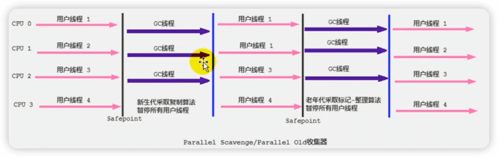

- 在程序吞吐量优先的应用场景中， Parallel 收集器和Parallel old收集器的组合，在Server模式下的内存回收性能很不错。
- 在Java8中，默认是此垃圾收集器。【9默认改为G1】

参数配置：

- `-XX:+UseParallelGC` 手动指定年轻代使用Parallel并行收集器执行内存回收任务。

- `-XX:+UseParallelOldGC` 手动指定老年代都是使用并行回收收集器。

  分别适用天新生代和老年代。默认jdk8是开启的。

  上面两个参数，默认开启一个，另一个也会被开启。（==互相激活==）

- `-XX:ParallelGCThreads` 设置年轻代并行收集器的线程数。一般地，最好与CPU数量相等，以避免过多的线程数影响垃圾收集性能。

  在默认情況下，当CPU 数量小于8个， ParallelGCThreads 的值等于CPU 数量。

  当CPU数量大于8个，ParallelGcThreads 的值等于 `3 + [5*CPU_Count]/8]` 

- `-XX:MaxGCPauseMillis` 设置垃圾收集器最大停顿时间（即STW的时间）。单位是毫秒。
  
  + 为了尽可能地把停顿时间控制在MaxGCPauseMills以内，收集器在工作时会调整Java堆大小或者其他一些参数。
  + 对于用户来讲，停顿时间越短体验越好。但是在服务器端，我们注重高并发，整体的吞吐量。所以服务器端适合Parallel，进行控制。
  + ==该参数使用需谨慎。==
- `-XX:GCTimeRatio`垃圾收集时间占总时间的比例（= 1/（N +1)）。用于衡量吞吐量的大小。
  
  + 取值范围（0,100）。默认值99，也就是垃圾回收时间不超过1%。
  + 与前一个`-XX:MaxGCPauseMillis`参数有一定矛盾性。暂停时间越长，Radio参数就容易超过设定的比例。
  
- `-XX:+UseAdaptiveSizePolicy` 设置Parallel scavenge收集器具有**自适应调节策略**
  + 在这种模式下，年轻代的大小、Eden和Survivor的比例、晋升老年代的对象年龄等参数会被自动调整，已达到在堆大小、吞吐量和停顿时间之间的平衡点。【之前要保证8:1:1时，就要关闭这个参数】
  + 在手动调优比较困难的场合，可以直接使用这种自适应的方式，仅指定虛拟机的最大堆、目标的吞吐量(GCTimeRatio）和停顿时间(MaxGCPauseMills)，让虚拟机自己完成调优工作。

### 17.6 CMS回收器：低延迟

- 在JDK 1.5 的期。Hotspot推出了一款在==强交互应用==中几乎可认为有划时代意义的垃圾收集器：CMS (Concurrent-Mark-Sweep)收集器，这款收集器是Hotspot虚拟机中==第一款真正意义上的并发收集器==，它第一次实现了让垃圾收集线程与用户线程同时工作。

- CMS收集器的关注点是尽可能缩短垃圾收集时用户线程的停顿时间。停顿时间越短（低延迟）就越适合与用户交互的程序，良好的响应速度能提升用户体验。

  <u>目前很大一部分的Java应用集中在互联网站或者B/S系统的服务端上，这类应用尤其重视服务的响应速度，希望系统停顿时间最短</u>，以给用户带来较好的体验。CMS收集器就非常符合这类应用的需求。

- CMs的垃圾收集算法采用==标记-清除==算法，并且也会”stop-the-world

不幸的是，CMS作为老年代的收集器，却无法与 DK 1.4.0 中己经存在的新生代收集器Parallel scavenge 配合工作，所以在JDK 1.5中使用CMS来收集老年代的时候，新生代只能选择ParNew或者Serial收集器中的一个。

在G1出现之前，CMS使用还是非常广泛的。一直到今天，仍然有很多系统使用CMS GC。

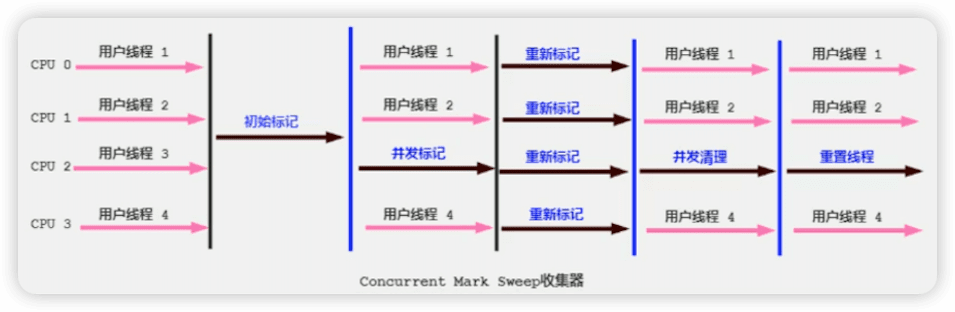

#### CMS的工作原理

CMS整个过程比之前的收集器要复杂，整个过程分为4个主要阶段，即初始标记阶段、并发标记阶段、重新标记阶段和并发清除阶段。

- ==初始标记==（Initial-Mark）阶段：在这个阶段中，程序中所有的工作线程都将会因为“stop-the-wor1d”机制而出现短暂的暂停，这个阶段的主要任务==仅仅只是标记出GC Roots能直接关联到的对象==。一旦标记完成之后就会恢复之前被暂停的所有应用线程。由于直接关联对象比较小，所以这里的速==度非常快==。【STW】
- ==并发标记== （Concurrent-Mark）阶段：从GC Roots的==直接关联对象开始遍历整个对象图的过程==，这个过程==耗时较长==但是==不需要停顿用户线程==，可以与垃圾收集线程一起并发运行。

- ==重新标记==（Remark）阶段：由于在并发标记阶段中，程序的工作线程会和垃圾收集线程同时运行或者交叉运行，因此为了==修正并发标记期间，因用户程序继续运作而导致标记产生变动的那一部分对象的标记记录==，这个阶段的停顿时间通常会比初始标记阶段稍长一些，但也远比并发标记阶段的时间短。【STW】
- ==并发清除==(Concurrent-Sweep）阶段：此阶段==清理删除掉标记阶段判断的己经死亡的对象，释放内存空间==。由于不需要移动存活对象，所以这个阶段也是可以与用户线程同时并发的。

尽管CMS收集器采用的是并发回收（非独占式），但是在其==初始化标记和再次标记这两个阶段中仍然需要执行 “stop-the-world”机制==暂停程序中的工作线程，不过暂停时间并不会太长，因此可以说明目前所有的垃圾收集器都做不到完全不需要 “stop-the-world”，只是尽可能地缩短暂停时间。

由于最耗费时间的并发标记与并发清除阶段都不需要暂停工作，所以整体的回收是==低停顿==的。

另外，由于在垃圾收集阶段用户线程没有中断，所以在==CMS回收过程中，还应该确保应用程序用户线程有足够的内存可用==。因此，CMS收集器不能像其他收集器那样等到老年代几乎完全被填满了再进行收集，而是==当堆内存使用率达到某一阈值时，便开始进行回收==，以确保应用程序在CMS工作过程中依然有足够的空间支持应用程序运行。要是CMS运行期间预留的内存无法满足程序需要，就会出现一次“==Concurrent Mode Failure==”失败，这时虚拟机将启动后备预案：临时启用Serial old 收集器来重新进行老年代的垃圾收集，这样停顿时间就很长了。

CMS收集器的垃圾收集算法采用的是**标记-清除算法**，这意味着每次执行完内存回收后，由于被执行内存回收的无用对象所占用的内存空间极有可能是不连续的一些内存块，不可避免地将==会产生一些内存碎片==。那么CMS在为新对象分配内存空间时，将无法使用指针碰撞(Bump the Pointer）技术，而只能够选择空闲列表(Free List）执行内存分配。

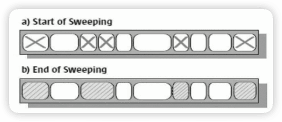

<u>有人会觉得既然Mark sweep会造成内存碎片，那么为什么不把算法换成Mark compact呢?</u>

答案其实很简答，因为当并发清除的时候，用Compact整理内存的话，原来的用户线程使用的内存还怎么用呢？要保证用户线程能然续执行，前提的它运行的资源不受影响嘛。Mark Compact更适合“stop the world”这种场景下使用。

**CMS的优点：**

- 并发收集
- 低延迟

**CMS的弊端：**

1. ==会产生内存碎片==，导致并发清除后，用户线程可用的空间不足。在无法分配大对象的情況下，不得不提前触发Ful1 GCo

2. ==CMS收集器对CPU资源非常敏感==。在并发阶段，它虽然不会导致用户停顿，但是会因为占用了一部分线程而导致应用程序交慢，总吞吐量会降低。

3. CMS收集器==无法处理浮动垃圾==。可能出现“**Concurrent Mode Failure**“失败而导致另一次 Full GC 的产生。在并发标记阶段由于程序的工作线程和垃圾收集线程是同时运行或者交叉运行的，那么==在并发标记阶段如果产生新的垃圾对象，CMS将无法对这些垃圾对象进行标记，最终会导致这些新产生的垃圾对象没有被及时回收==，从而只能在下一次执行GC时释放这些之前未被回收的内存空间。

#### CMS收集器可以设置的参数

- `-XX:+UseConcMarkSweepGC` 手动指定使用CMS 收集器执行内存回收任务。

  开启该参数后会自动将`-XX:+UseParNewGC`打开。即：ParNew (Young区用）+CMS (Old区用）+Serial Old的组合。

- `-XX:CMSInitiatingOccupanyFraction` 设置堆内存使用率的阈值，一旦达到该阈值，便开始进行回收。

  JDK5及以前版本的默认值为68，即当老年代的空间使用率达到68%时，会执行一次CMS 回收。JDK6及以上版本默认值为92%

  如果内存增长缓慢，则可以设置一个稍大的值，大的阈值可以有效降低CMS的触发频率，减少老年代回收的次数可以较为明显地改善应用程序性能。反之，如果应用程序内存使用率增长很快，则应该降低这个阈值，以避免频繁触发老年代串行收集器。因此<u>通过该选项便可以有效降低Full GC 的执行次数</u>。

- `-XX:+UseCMSCompactAtFullCollection` 用于指定在执行完Full GC后对内存空间进行压缩整理，以此避免内存碎片的产生。不过由于内存压缩整理过程无法并发执行，所带来的问题就是停顿时间变得更长了。

- `-XX:CMSFullGCsBeforeCompaction`设置在执行多少次Full GC后对内存空间进行压缩整理。

- `-XX:ParallelCMSThreads`设置CMS的线程数量。【就是并发标记阶段的的GC线程】

  CMS 默认启动的线程数是 (ParallelGCThreads + 3）/4，ParallelGCThreads 是年轻代并行收集器的线程数。当CPU 资源比较紧张时，受到CMS收集器线程的影响，应用程序的性能在垃圾回收阶段可能会非常糟糕。

**小结：**

Hotspot有这么多的垃圾回收器，那么如果有人问，serial GC、Parallel GC、Concurrent Mark Sweep GC这三个GC有什么不同呢？

请记住以下口令：

如果你想要最小化地使用内存和并行开销，请选Serial GC;【+ Serial Old】

如果你想要最大化应用程序的吞吐量，请选Paral1el GC；【+ Parallel Old】

如果你想要最小化GC的中断或停顿时间，请选CMS GC。【+ ParNew GC】

#### JDK后续版本中CMS的变化

- JDK9新特性：CMS被标记为Deprecate了 (JEP291)
   
   如果对JDK 9及以上版本的Hotspot虚拟机使用参数`-XX:+UseConcMarkSweepGc`来开启CMS收集器的话，用户会收到一个警告信息，提示CMS未来将会被废弃。
   
- JDK14新特性：删除CMS垃圾回收器(JEP363）
   
   移除了CMS垃圾收集器，如果在JDK14中使用`-XX:+UseConcMarkSweepGC`的话，JVM不会报错，只是给出一个warning信息，但是不会exit。JVM会自动回退以默认GC方式启动JVM

```
OpenJDK 64-Bit Server VM warning: Ignoring option UseConcMarkSweepGC;
support was removed in 14.0
and the VM will continue execution using the default collector.
```

### 17.7 G1回收器：区域化分代式❤️

既然我们己经有了前面儿个强大的GC，为什么还要发布Garbage First (G1) GC?

原因就在于应用程序所应对的==业务越来越庞大、复杂，用户越来越多==，没有GC就不能保证应用程序正常进行，而经常造成STW的GC又跟不上实际的需求，所以才会不断地尝试对GC进行优化。G1 (Garbage-First）垃圾回收器是在Java7 update 4之后引入的一个新的垃圾回收器，是当今收集器技术发展的最前沿成果之一。

与此同时，为了适应现在==不断扩大的内存和不断增加的处理器数量==，进一步降低暂停时间 (pause time），同时兼顾良好的吞吐量。

**官方给G1设定的目标是==在延迟可控的情况下获得尽可能高的吞吐量==**，所以才担当起“全功能收集器”的重任与期望。

> 新生代主要是标记复制算法，老年代主要是标记整理算法。G1可以叫分区算法。

**为什么名字叫做Garbage First (G1）呢？**

- 因为G1是一个并行回收器，它把堆内存分割为很多不相关的==区域 (Region）==（物理上不连续的）。使用不同的Region来表示Eden、幸存者0区，幸存者1区，老年代等。
- G1 GC有计划地避免在整个Java 堆中进行全区域的垃圾收集。G1 跟踪各个 Region里面的垃圾堆积的价值大小（回收所获得的空间大小以及回收所需时间的经验值），在后台维护一个优先列表，==每次根据允许的收集时间，优先回收价值最大的Region。==
- 由于这种方式的侧重点在于回收垃圾最大量的区间(Region），所以我们给G1一个名宇：==垃圾优先 (Garbage First)==。

G1 (Garbage-First）是一款**面向服务端**应用的垃圾收集器，==主要针对配备多核CPU及大容量内存的机器==，以极高概率满足GC停顿时间的同时，还兼具高吞吐量的性能特征。

在JDK1.7版本正式启用，移除了Experimental的标识，是JDK 9以后的默认垃圾回收器，取代了CMS 回收器【低延迟】以及Paral1el + Parallel Old组合【高吞吐量】。被oracle官方称为 **“全功能的垃圾收集器”**。

与此同时，CMS已经在JDK 9中被标记为废弃 (deprecated）。在jak8中还不是默认的垃圾回收器，需要使用`-XX:+UseG1GC`来启用。

#### G1回收器的特点（优势）

与其他GC 收集器相比，G1使用了全新的==分区算法==，其特点如下所示：

- **并行与并发**
  + 并行性：G1在回收期间，可以有多个GC线程同时工作，有效利用多核计算能力。此时用户线程STW
  + 并发性：G1拥有与应用程序交替执行的能力，部分工作可以和应用程序同时执行，因此，一般来说，不会在整个回收阶段发生完全阻塞应用程序的情况
- **分代收集**
  + 从分代上看，==G1依然属于分代型垃圾回收器==，它会区分年轻代和老年代，年轻代依然有Eden区和Survivor区。但从堆的结构上看，<u>它不要求整个Eden区、年轻代或者老年代都是连续的，也不再坚持固定大小和固定数量</u>。
  + 将堆空间分为若干个==区域（Region）==，这些区域中包含了**逻辑上的年轻代和老年代**。
  + 和之前的各类回收器不同，它同时==兼顾年轻代和老年代==。对比其他回收器，或者工作在年轻代，或者工作在老年代。

G1不是这样了：


而是这样了：

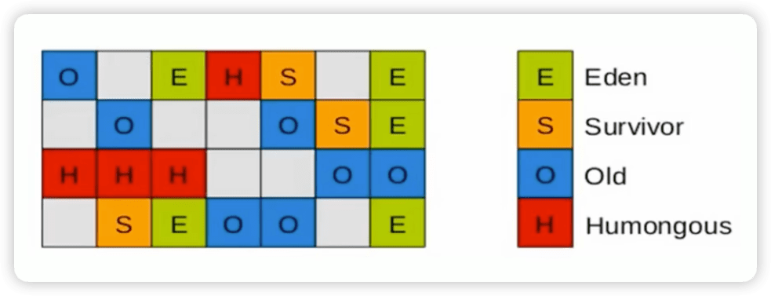

- **空间整合**
  
  + CMS：“标记-清除” 算法、内存碎片、若干次GC后进行一次碎片整理
  + G1将内存划分为一个个的region。内存的回收是**以region作为基本单位**的。==Region之问是复制算法==，但整体上实际可看作是==标记-压缩 (Mark-Compact)算法==，两种算法都可以避免内存碎片。这种特性有利于程序长时间运行，分配大对象时不会因为无法找到连续内存空间而提前触发下一次GC。尤其是当Java堆非常大的时候，G1的优势更加明显。
  
- **可预测的停顿时间模型**（即：软实时soft real-time，就是尽可能在指定时间内完成GC）

  这是 G1 相对于 CMS 的另一大优势，G1除了追求低停顿外，还能建立可预测的停顿时间模型，能让使用者明确指定在一个长度为 M 毫秒的时间片段内，消耗在垃圾收集上的时间不得超过N毫秒。

  + 由于分区的原因，G1可以只选取部分区域进行内存回收，这样缩小了回收的范围，因此对于全局停顿情况的发生也能得到较好的控制。
  + G1 跟踪各个 Region 里面的垃圾堆积的价值大小（回收所获得的空间大小以及回收所需时间的经验值），在后台维护一个优先列表，==每次根据允许的收集时间，优先回收价值最大的Region==。保证了 G1 收集器在有限的时间内可以==获取尽可能高的收集效率==。
  + 相比于CMS GC， G1未必能做到CMS在最好情况下的延时停顿，但是最差情况要好很多。

#### G1回收器的缺点

相较于CMS，G1还不具备全方位、压倒性优势。比如在用户程序运行过程中，G1无论是为了垃圾收集产生的内存占用 (Footprint）还是程序运行时的**额外执行负载(overload）**都要比CMS要高。

从经验上来说，在小内存应用上CMS的表现大概率会优于G1，而G1在大内存应用上则发挥其优势。平衡点在6-8GB之间。

#### G1回收器的参数设置

前三个是最常用的

- `-XX:+UseG1GC` 手动指定使用G1收集器执行内存回收任务。
- `-XX:G1HeapRegionSize` 设置每个Region的大小。值是2的军，范围是 1MB到32MB之间，目标是根据最小的Java堆大小划分出约==2048==个区域。默认是堆内存的1/2000。
- `-XX:MaxGCPauseMillis` 设置期望达到的最大GC停顿时间指标(JVM会尽力实现，但不保证达到）。默认值是200ms。<u>【不要太短，太短GC发挥时间短，每次回收的Region比较少，如果此时用户线程占用或使用的Region速度远大于回收的，就会出现Full GC】</u>
- `-XX:ParallelGCThread` 设置STW时GC线程数的值。最多设置为8
- `-XX: ConcGCThreads` 设置并发标记的线程数。将口设置为并行垃圾回收线程数 (ParallelGcThreads) 的1/4左右。
- `-XX:InitiatingHeapOccupancyPercent` 设置触发并发GC周期的Java堆占用率阙值。超过此值，就触发GC。默认值是45。堆空问已用占比达到45%，老年代才会并发标记
- ...

#### G1回收器的常见操作步骤

G1的设计原则就是简化JVM能调优，。开发人员只需要简单的三步即可完成调优：

- 第一步：开启G1垃圾收集器

- 第二步：设置堆的最大内存  `-Xms` `-Xmx`

- 第三步：设置最大的停顿时间  `-XX:MaxGCPauseMillis`

G1中提供了三种垃圾回收模式：==YoungGC、Mixed GC和Full GC==， 在不同的条件下被触发。

#### G1回收器的适用场景

- 面向服务端应用，针对具有大内存、多处理器的机器。（在普通大小的堆里表现并不惊喜）
- 最主要的应用是需要低GC延迟，并具有大堆的应用程序提供解决方案；
- 如：在堆大小约6GB或更大时，可预测的暂停时间可以低于0.5秒;（G1通过每次只清理一部分而不是全部的Region的增量式清理来保证每次GC停顿时间不会过长）。
- 用来替换掉JDK1.5中的CMS收集器；在下面的情況时，使用G1可能比CMS好：
   1. 超过50％的Java堆被活动数据占用；
   2. 对象分配频率或年代提升频率变化很大；
   3. GC停顿时间过长（长于0.5至1秒）。

- Hotspot 垃圾收集器里，除了G1以外，其他的垃圾收集器使用内置的JVM线程执行GC的多线程操作，而G1 GC可以<u>采用应用线程承担后台运行的GC工作</u>，即当JVM的GC线程处理速度慢时，系统会调用应用程序线程帮助加速垃圾回收过程。

#### 分区Region：化整为零

使用 G1 收集器时，它将整个Java堆划分成约2048个大小相同的独立Region块，每个Region块大小根据堆空间的实际大小而定，整体被控制在1MB到32MB

之间，且为2的N次界，即1MB,2MB,4MB,8MB,16MB,32MB。 可以通过`-XX:G1HeapRegionSize`设定。==所有的Region大小相同，且在JVM生命周期内==

==不会被改变。==

虽然还保留有新生代和老年代的概念，但新生代和老年代不再是物理隔离的了，它们都是一部分Region（不需要连续）的集合。通过Region的动态分配方式实现逻辑上的连续。

如果设置了Region数量，那么Region大小就不是固定的，但是大小肯定是2的幂次方，并且在1-32M之间，如果设置了Region大小，那么Region数量就不是固定的，但是肯定是2048附近：

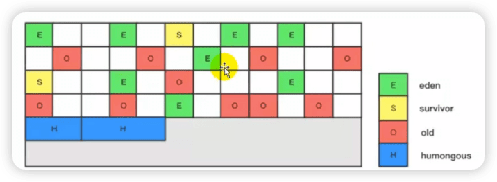

> Region只能是Eden、Survivor、Humongous中的一种，但是它的身份不是固定的，谁来占用那么这个Region就是谁的。

- 一个 region 有可能属于 Eden, survivor 或者 Old/Tenured 内存区域。但是一个region只可能属于一个角色。图中的E表示该region属于Eden内存区域，S表示属于survivor内存区域，O表示属于Old内存区域。图中空白的表示未使用的内存空间。
- G1 垃圾收集器还增加了一种新的内存区域，叫做**Humongous** 内存区域，如图中的H块。主要用于存储大对象，如果超过**1.5个region**，就放到H。

设置H的原因：

对于推中的大对象，默认直接会被分能到老年代。但是如果它是一个短期存在的大对象，就会对玩圾收集器造成饮面北响。为了解決这个问题，G1划分了一个Htumongous区，它用来专门存放大对象。==如果一个H区装不下一个大对象，那么G1会寻找连续的H区来存储==。为了能找到连续的H区，有时候不得不启动Full GC。 G1的大多数行为都把H区作为老年代的一部分来看待。


#### G1回收器垃圾回收过程

G1 GC的垃圾回收过程主要包括如下三个环节：

- 年轻代GC (Young GC)
- 老年代并发标记过程 (Concurrent Marking）
- 混合回收 (Mixed GC)（年轻代和老年代一起回收）
- （如果需要，单线程、独占式、高强度的Fu11 GC还是继续存在的。它针对GC的评估失败提供了一种失败保护机制，即强力回收。）

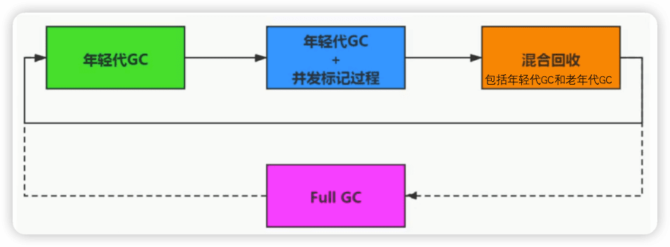

顺时针，young gC -> young gC + concurrent mark->Mixed ac顺序，进行垃圾回收。


应用程序分配内存，==当年轻代的Eden区用尽时开始年轻代回收过程==；G1的年轻代收集阶段是一个==并行的独占==式收集器。在年轻代回收期，G1 Gc暂停所有应用程序线程，启动多线程执行年轻代回收。然后==从年轻代区间移动存活对象到survivor区间或者老年区间，也有可能是两个区间都会涉及==。

当堆内存使用达到一定值（默认45%）时，开始老年代**并发标记过程**。

标记完成马上开始**混合回收过程**。对于一个混合回收期，G1 GC从老年区间移动存活对象到全闲区间，这些空闲区间世就成为了老年代的一部分。利年轻代不同，老年代的G1回收器和其他GC不同，==G1的老年代回收器不需要整个老年代被回收，一次只需要扫描/回收一小部分老年代的Region就可以了==。同时，这个老年代Region是和年轻代一起被回收的。

> 举个例子：一个web服务器，Java进程最大堆内存为4G，每分钟响应1500个请求，每45秒钟会新分配大约2G的内存。G1会每45秒钟进行一次年轻代回收，每31个小时整个堆的使用率会达到45%，会开始老年代并发标记过程，标记完成后开始四到五次的混合回收。


#### G1回收器垃圾回收过程：Remembered Set（RS，记忆集） 

> G1相对于CMS需要额外的10%-20%内存空间，用来存放记忆集。

- 一个对象被不同区域引用的问题

- 一个Region不可能是孤立的，一个Region中的对象可能被其他任意Region中对象引用，判断对象存活时，是否需要扫描整个Java堆才能保证准确？

- 在其他的分代收集器，也存在这样的问题（而G1更突出）

- 回收新生代也不得不同时扫描老年代？新生代对象可能引用老年代里的对象

  > 注：要回收某个区域时，其它非这个区域部分里的对象（比如要回收Eden时，要考虑old区里对象对其的引用），也有可能成为GC Roots，这种情况G1这种区域化的GC，GC Roots可概念能会被放大。

- 这样的话会降低Minor GC的效率；

- 解决方法：
   + 无论G1还是其他分代收集器，JVM都是使用Remembered set来**避免全局扫描**：
   + ==每个Region都有一个对应的Remembered set==;
   + 每次Reference类型数据写操作时，都会产生一个**Write Barrier（写屏障）**暂时中断操作；
   + 然后检查将要写入的引用指向的对象是否和该Reference类型数据在不同的Region（其他收集器：检查老年代对象是否引用了新生代对象）；
   + 如果不同，通过CardTable把相关引用信息记录到引用指向对象的所在Region对应的Remembered Set;
   + 当进行垃圾收集时，在Gc根节点的枚举范围加入Remembered set：就可以保证不进行全局扫描，也不会有遗漏。

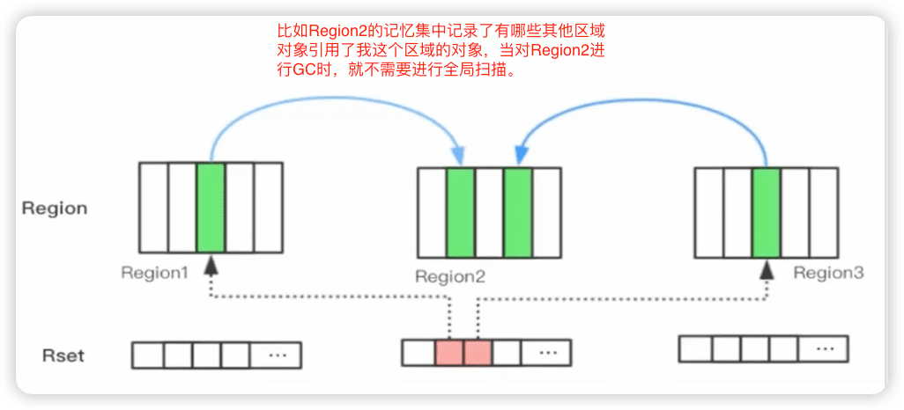

上页提到的Remebered Set就是上述Rset， 上页提到的Reference类型就是引用类型，其中Rset的作用是记录当前Region中哪些对象被外部引用指向，比如Old区中的对象会指向Eden区的对象，然后当我们要回收某个Region的时候，直接遍历遍历当前Region中的所有对象就可以了，然后针对性的去找到那些指向当前对象的其他对象，最终发现当前对象是否是根可达的，如果不是，那就应该被删除，其实之前的拉圾回收器都沙及到这个问题，当进行Minor GC的时候，通过GCRoots查找的时候还需要遍历Old区的对象，毕竟Old区对象也可能会指向Eden区对象，但是G1通过Rset避免了全堆的扫描，当引用类型数据写操作时，先暂时中断，然后判断当前引用类型数据是否被其他对象所指向，如果不被指向，那就直接放在Region中就可以了；如果被其他对象指向，那么还要判断这个对象是在当前要插人的Region中，还是在其他Region中；如果在其他Region中，那就需要使 用CardTable把当前引用类型数据的指向信息放在Rset中，也就是形成上面的虛线连线，如果在当前Region中，那就不需要指向了，毕竟到时候我们会进行遍历查找根可达对象，那肯定会找到的，所以这种情况也是直接放在Region中就可以了；

#### G1回收过程一：年轻代GC

JVM启动时，G1先准备好Eden区，程序在运行过程中不断创建对象到Eden区，当Eden空问耗尽时，G1会启动一次年轻代垃圾回收过程。（S区不会触发YGC，只会被动的跟着年轻代被回收）

**年轻代垃圾回收只会回收Eden区和survivor区。**

YGC时，首先G1停止应用程序的执行 (stop-The-World），G1创建回收集(collection set） ，回收集是指需要被回收的内存分段的集合，年轻代回收过程的回收集包含年轻代Eden区 和Survivor区所有的内存分段。

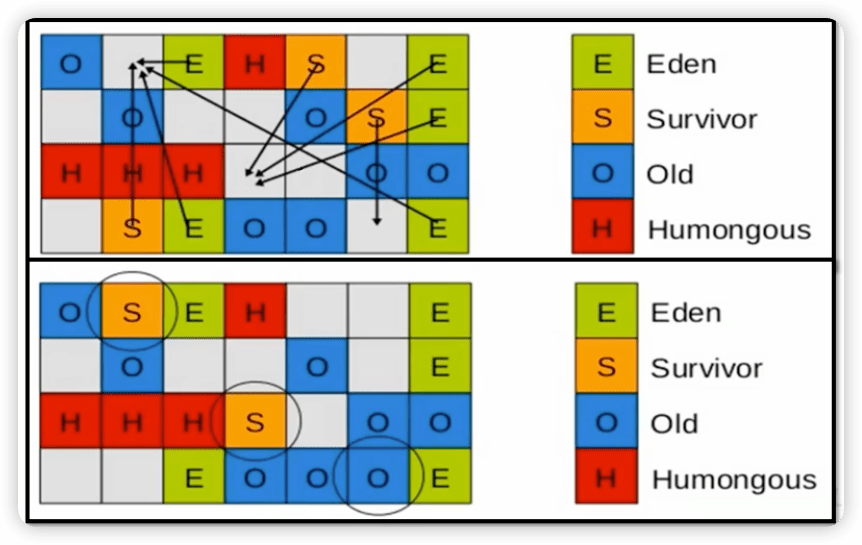

然后开始如下回收过程：

1. ==第一阶段，扫描根==。可以体现Rst作乍用：避免全堆扫描

根是指static变量指向的对象，正在执行的方法调用链条上的局部变量等。根引用连同Rset记录的外部引用作为扫描存活对象的入口。

2. ==第二阶段，更新RSet==。作用：保证Rset中的数据淮确性

处理dirty card queue(见备注)中的card，更新Rset。此阶段完成后，**Rset可以准确的反映老年代对所在的内存分段中对象的引用**。

> 对于应用程序的引用赋值语句oject.field=object，JVM会在之前和之后执行特殊的操作以在dirty card queue中入队一个保存了对象引用信息的card。在年轻代回收的时候，G1会对Dirty Card Queue中所有的card进行处理，以更新RSet，保证RSet实时准确的反映引用关系。
>
> 那为什么不在引用赋值语句处直接更新RSet呢？这是为了性能的需要，RSet的处理需要线程同步，开销会很大，使用队列性能会好很多。

3. ==第三阶段，处理RSet==。作用：根可达性遍历的一部分

识别被老年代对象指向的Eden中的对象，这些被指向的Eden中的对象被认为是存活的对象。

4. ==第四阶段，复制对象==。说明：新生代使用复制算法

此阶段，对象树被遍历，Eden区内存段中存活的对象会被复制到Survivor区中空的内存分段，survivor区内存段中存活的对象如果年龄未达阈值，年龄会加1，达到阀值会被会被复制到0ld区中空的内存分段。如果survivor空间不够，Eden空间的部分数据会直接晋升到老年代空间。

5. ==第五阶段，处理引用==。（空Eden：Eden交成空的，那它就变成了无主Region，因此会被记录到空链表中，等待不一次被分配）

处理Soft,weak, Phantom， Final， JNI weak 等引用。最终Eden空间的数据为空，GC停止工作，而目标内存中的对象都是连续存储的，没有碎片，所以复制过程可以达到内存整理的效果，减少碎片。

6. 第五阶段补充：以上回收的都是强引1用对象，不面回收软引1用对象（不足回收)、弱引1用对象（发现回收)．虚引用对象


脏卡表队列作用：

RSet更新需要线程同步，所以开销会很大，因此不能实时更新，因此我们需要把引用对象被其他对象引用的关系放在一个脏卡表队列中，当年轻代回收的时候会进行STW，所以我们也正好把脏卡 表队列中的值更新到Rset中。这样不仅没有涉及到开销问题，还可以保证Rset中的数据是准确的。

#### G1回收过程二：并发标记过程

1．==初始标记阶段==：标记从根节点直接可达的对象。这个阶段是STW的，并且会触发一次年轻代GC。

2. ==根区域扫描 (Root Region Scanning)==：G1 GC扫描survivor区直接可达的老年代区域对象，并标记被引用的对象。这一过程必须在young GC之前完成。

   主要扫描哪些老年代对象是可达的。毕竟我们进行young GC的时候会移动Survivor区，移动之后就找不到哪些老年代对象是可达的了。

3. ==并发标记(Concurrent Marking)==：在整个堆中进行并发标记(和应用程序并发执行)，此过程可能被young Gc中断。在并发标记阶段，==若发现区域对象中的所有对象都是垃圾，那这个区域会被立即回收==。同时，并发标记过程中，会计算每个区域的对象活性(区域中存活对象的比例）。

4. ==再次标记(Remark)==：由于应用程序持续进行，需要修正上一次的标记结果。是STW的。G1中采用了比CMS更快的初始快照算法：snapshot-at-the-beginning (SATB)。

​	原因：并发标记不准确

5. ==独占清理(cleanup,STW)==：计算各个区域的存活对象和GC回收比例，并进行排序，识别可以混合回收的区域。为下阶段做铺垫。是STW的。其实是一个统计计算过程，不会涉及垃圾清理

   这个阶段并不会实际上去做垃圾的收集

6. ==并发清理阶段==：识别并清理完全空闲的区域。

   并发清理阶段任务：如果发现区域对象中的所有对象都是垃圾，那么这个区域会被立即回收

#### G1回收过程三：混合回收

当越来越多的对象晋升到老年代old region时，为了避免堆内存被耗尽，虚拟机会触发一个混合的垃圾收集器，即Mixed GC，该算法并不是一个Old GC，除了回收整个Young Region,还会回收一部分的0ld Region。这里需要注意：==是一部分老年代，而不是全部老年代==（在设置的时间内，回收最有回收价值的老年代Region）。可以选择哪些Old Region进行收集，从而可以对垃圾回收的耗时时间进行控制。也要注意的是Mixed GC并不是Full GC。

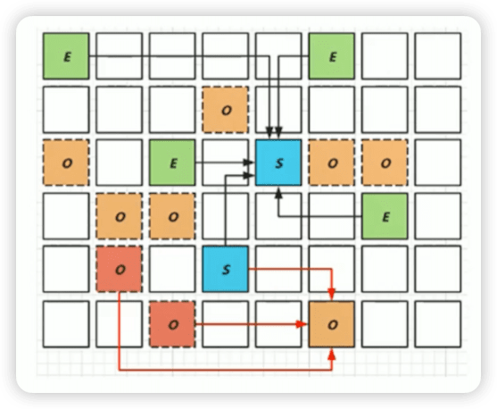

- 并发标记结束以后，老年代中百分百为垃圾的内存分段被回收了，部分为垃圾的内存分段被计算了出来。默认情况下，这些老年代的内存分段会分8次（可以通过`-XX:G1MixedGCCountTarget`设置）被回收。
- 混合回收的回收集(Collection set）包括八分之一的老年代内存分段，Eden区内存分段，Survivor区内存分段。混合回收的算法和年轻代回收的算法完全一样，只是回收集多了老年代的内存分段。具体过程请参考上面的年轻代回收过程。
- 由于老年代中的内存分段默认分8次回收，G1会优先回收垃圾多的内存分段。==垃圾占内存分段比例越高的，越会被先回收==。并且有一个國值会决定内存分段是否被回收，`-XX:G1MixedGCLiveThresholdpercent`，默认为65%，意思是垃圾占内存分段比例要达到65%才会被回收。如果垃圾占比太低，意味着存活的对象占比高，在复制的时候会花费更多的时间。垃圾占比越多，回收优先级越高：如果垃圾不足Region空问的65%，那么将不会进行回收
- 混合回收并不一定要进行8次。有一个國值`-XX:G1HeapWastePercent`，默认值为10%，意思是允许整个堆内存中有10%的空问被浪费，意味着如果发现可以回收的垃圾占堆内存的比例低于10%，则不再进行混合回收。因为GC会花费很多的时间但是回收到的内存却很少。

#### G1回收可选的过程四：Full GC

G1的初衷就是要避免Full GC的出现。但是如果上述方式不能正常工作，G1停止应用程序的执行(stop-The-Norld），使用==单线程==的内存回收算法进行垃圾回收，性能会非常差，应用程序停顿时间会很长。

要避免Fu11 Gc的发生，一旦发生需要进行调整。什么时候会发生Fu11 GC呢？比如**堆内存太小**，当G1在复制存活对象的时候没有空的内存分段可用，则会回退到fu11 gC，这种情況可以通过增大内存解决。

导致G1Full Gc的原因可能有两个：

1. Evacuation的时候没有足够的to-space来存放晋升的对象;解决：加大堆空间
2. 并发处理过程完成之前空间耗尽。解决：调小触发并发sC周期的Jlard在古用阔值（默以是45%。在前面参数页有）

3. 最大GC停顿时间太短，导致在规定的时间间隔内无法完成垃圾回收，也会导致Full G解决：加大最大GC停顿时间


#### G1回收过程：补充

从oracle官方透露出来的信息可获知，回收阶段(Evacuation）其实本也有想过设计成与用户程序一起并发执行，但这件事情做起来比较复杂，考虑到G1只是回收一部分Region，停顿时间是用户可控制的，所以并不迫切去实现，而==选择把这个特性放到了G1之后出现的低延迟垃圾收集器（即ZGC）中==。另外，还考虑到G1不是仅仅面向低延迟，停顿用户线程能够最大幅度提高垃圾收集效率，为了保证吞吐量所以才选择了完全暂停用户线程的实现方案。

#### G1回收器优化建议

- 年轻代大小
   
   + 避免使用`-Xmn`或`-XX:NewRatio`等相关选项显式设置年轻代大小
   
   + 固定年轻代的大小会覆盖暂停时间目标（原因：年轻代GC是并行独占式的，所以最好让垃圾回收器自己去调节）
   
- 暂停时间目标不要太过严苛
   
   + G1 GC的吞吐量目标是90%的应用程序时间和10%的垃圾回收时间
   
   + 评估G1 GC的吞吐量时，暂停时间目标不要太严苛。目标太过严苛表示你愿意承受更多的垃圾回收开销，而这些会直接影响到吞吐量。
   
     说明：暂停时问和吞吐量是此消彼长的，所以不要把暂停时间设置的太严格，不然因为这个原因引起Full GC也不太好

### 17.8 垃圾回收器总结

#### 7种经典垃圾回收器总结

截止JDK 1.8，一共有7款不同的垃圾收集器。每一款不同的垃圾收集器都有不同的特点，在具体使用的时候，需要根据具体的情况选用不同的垃圾收集器。

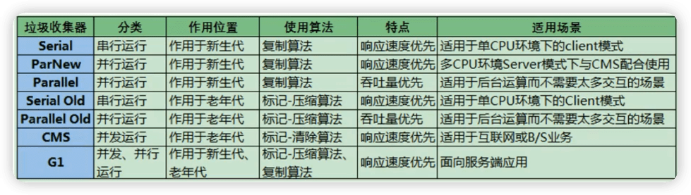

GC发展阶段：

`Serial => Parallel（并行）=> CMS（并发）=> G1 => ZGC`

#### 垃圾回收器组合

不同厂商、不同版本的虚拟机实现差别很大。Hotspot虚拟机在JDK7/8后所有收集器及组合（连线），如下图：

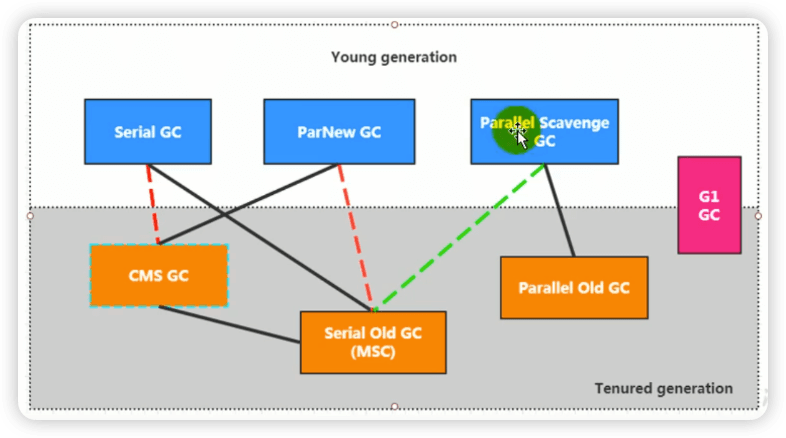

#### 怎么选择垃圾回收器？

- Java垃圾收集器的配置对于JVM优化来说是一个很重要的选择，选择合适的垃圾收集器可以让了VM的性能有一个很大的提升。
   
- 怎么选择垃圾收集器？

  1. 优先调整堆的大小让JVM自适应完成。

  2. 如果内存小于100M，使用串行收集器

  3. 如果是单核、单机程序，并日没有停顿时间的要求，串行收集器

  4. 如果是多CPU、需要高吞吐量、允许停顿时间超过1秒，选择并行或者JvM自己选择

  5. 如果是多CPU、追求低停顿时间，需快速响应（比如延迟不能超过1秒，如互联网应用），使用并发收集器

     官方推荐G1，性能高。==现在互联网的项目，基本都是使用G1==。


最后需要明确一个观点：

1. 没有最好的收集器，更没有万能的收集：
2. 调优永远是针对特定场景、特定需求，不存在一劳永逸的收集器

#### 面试

- 对于垃圾收集，面试官可以循序渐进从理论、实践各种角度深入，也未必是要求面试者什么都懂。但如果你懂得原理，一定会成为面试中的加分项。这里较通用、基础性的部分如下：
   <u>垃圾收集的算法有哪些？如何判断一个对象是否可以回收？</u>
   <u>垃圾收集器工作的基本流程。</u>
   
- 另外，大家需要多关注垃圾回收器这一章的各种常用的参数。

  两类：设置内存，GC

### 17.9 GC日志分析

通过阅读GC日志，我们可以了解Java虚拟机内存分配与回收策略。

#### **内存分配与垃圾回收的参数列表**

- `-XX:+PrintGC`  输出GC日志。类似：`-verbose:gc` （没有堆空间使用情况）

- `-XX:+PrintGCDetails`  输出GC的详细日志 （GC + 堆空间使用情况）

- `-XX:+PrintGCTimeStamps` 输出GC的时间戳（以基淮时间的形式）

- `-XX:+PrintGCDateStamps` 输出GC的时间戳（以日期的形式，如2013-05-04T21:53:59.234+0800)

- `-XX:+PrintHeapAtGC`  在进行GC的前后打印出堆的信息

- `-Xloggc:./logs/gc.log` 日志文件的输出路径


- 打开GC日志：`-verbose:gc`

这个只会显示总的GC堆的变化，如下：

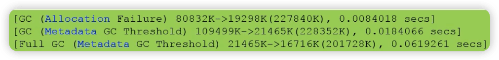

参数解析：

GC、Full GC: GC的类型，GC只在新生代上进行，Full GC包括永生代，新生代，老年代。

Allocation Failure（分配失败）：GC发生的原因。

80832K->19298k：堆在GC前的大小和GC后的大小。

228840k：现在的堆大小。

0.0084018 secs: GC持续的时间。

- `-Xms60m -Xmx60m -verbose:gc -XX:+PrintGCDetails `

```
[GC (Allocation Failure) [PSYoungGen: 16348K->2528K(18944K)] 16348K->15362K(62976K), 0.0023419 secs] [Times: user=0.00 sys=0.00, real=0.00 secs] 
[GC (Allocation Failure) [PSYoungGen: 18815K->2532K(18944K)] 31649K->31416K(62976K), 0.0023428 secs] [Times: user=0.01 sys=0.01, real=0.00 secs] 
[Full GC (Ergonomics) [PSYoungGen: 2532K->0K(18944K)] [ParOldGen: 28884K->31267K(44032K)] 31416K->31267K(62976K), [Metaspace: 3300K->3300K(1056768K)], 0.0058159 secs] [Times: user=0.00 sys=0.00, real=0.01 secs] 
[Full GC (Ergonomics) [PSYoungGen: 16331K->3500K(18944K)] [ParOldGen: 31267K->43980K(44032K)] 47599K->47481K(62976K), [Metaspace: 3303K->3303K(1056768K)], 0.0034156 secs] [Times: user=0.01 sys=0.00, real=0.00 secs] 
Heap
 PSYoungGen      total 18944K, used 6655K [0x00000007beb00000, 0x00000007c0000000, 0x00000007c0000000)
  eden space 16384K, 40% used [0x00000007beb00000,0x00000007bf17fcb8,0x00000007bfb00000)
  from space 2560K, 0% used [0x00000007bfd80000,0x00000007bfd80000,0x00000007c0000000)
  to   space 2560K, 0% used [0x00000007bfb00000,0x00000007bfb00000,0x00000007bfd80000)
 ParOldGen       total 44032K, used 43980K [0x00000007bc000000, 0x00000007beb00000, 0x00000007beb00000)
  object space 44032K, 99% used [0x00000007bc000000,0x00000007beaf32d8,0x00000007beb00000)
 Metaspace       used 3311K, capacity 4496K, committed 4864K, reserved 1056768K
  class space    used 356K, capacity 388K, committed 512K, reserved 1048576K
```

参数解析：

GC，Ful1 FC: 同样是GC的类型

A11ocation Failure: Gc原因

PSYoungGen：使用了 Parallel scavenge并行拉圾收集器的新生代gc前后大小的变化

ParOldGen：使用了Parallel o1a并行垃圾收集器的老年代GC前后大小的变化

Metaspace： 元数据区gc前后大小的变化， JDK1.8中引入了元数据区以替代永久代

xxx secs：指GC花费的时间

Times： user：指的是垃圾收集器花费的所有CPU时间， sys：花费在等待系统调用或系统事件的时间， real：GC从开始到结束的时间，包括其他进程占用时间片的实际时间。

- `-Xms60m -Xmx60m -verbose:gc -XX:+PrintGCDetails -XX:+PrintGCTimeStamps`

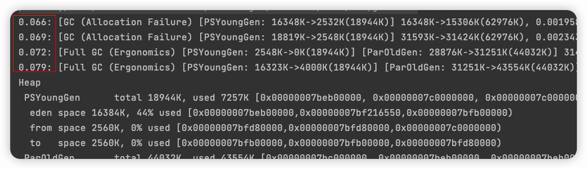


#### **日志补充说明：**

- "[GC"和"[Fu11 Gc"说明了这次垃圾收集的停顿类型，如果有"Full"则说明GC发生了"stop
   The World"
- 使用Serial收集器在新生代的名字是Default New Generation，因此显示的是"[DefNew"
- 使用ParNew收集器在新生代的名字会变成"[ParNew"，意思是"Parallel New Generation"
- 使用Parallel Scavenge收集器在新生代的名字是"[PSYoungGen"
- 老年代的收集和新生代道理一样，名字也是收集器決定的
- 使用G1收集器的话，会显示为"==garbage-first heap=="

- Allocation Failure
   表明本次引起Gc的原因是因为在年轻代中没有足够的空间能够存储新的数据了。
- [PSYoungGen : 5986K->696K(8704K)15986K->704K(9216K)
   中括号内：GC回收前年轻代大小->回收后大小（年轻代总大小）
   括号外：GC回收前年轻代和老年代大小->回收后大小（年轻代和老年代总大小）
- user代表用户态回收耗时（用户使用cpu时间），sys内核态回收耗时，real实际垃圾回收耗时。由于多核的原因，时间总和可能会超过real时间

堆空间说明：  

```java
Heap（堆）
PsYoungGen (Parallel scavenge收集器新生代)total 9216K, used 6234K[0x00000000f£600000, 0x0000000100000000, 0x0000000100000000）
eden space（堆中的Eden区默认占比是8）8192区，76% used
[Ox00000000f£600000,0x00000000ffc16b08,0x00000000ffe0o0o0）
from space (堆中的survivor，这里是From survivor区默认占比是1） 1024K,0g used
[0x00000000f00000, 0x00000000fff00000, 0x0000000100000000)
to space(堆中的survivor，这里是tosurvivor区默认占比是1，需要先了解一下堆的分配策略）
1024区,
0号 used 1Ox00000000ffeooo00, 0x00000000ffe00000, 0x00000000fff00000)
Pazo1dGen(老年代总大小和使用大小)total 10240R, used 7001x Loxo000o00ofecoo000,0×00000000££600000,0x00000000££600000）
object space(显示个使用百分比）10240玉，68号 used
〔Ox00000000feco0000, 0x00000000ff2d6630,0x00000000ff600000）
PSPezmGen（永久代总大小和使用大小)total 21504K, used 49498 [0x00000000f9a00000,0x00000000fafoooo0, 0x00000000fecoooo0)
object space(显示个使用百分比，自己能算出来） 21504区，23号 used
[0x00000000f9a00000, 0x00000000f9ed55e0, 0x00000000faf00000)
```


详细说明：

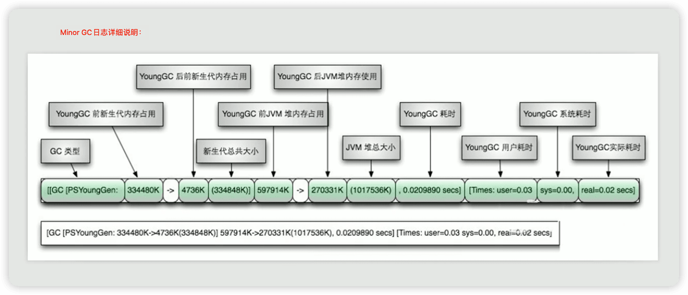


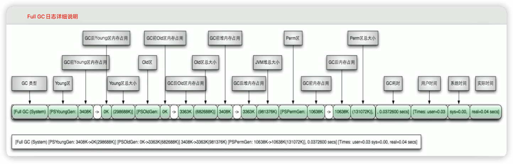


#### 案列

🔖p198

```java
package com.andyron.java;

/**
 * 分别使用jdk7、jdk8
 * -Xms20M -Xmx20M -Xmn10M -XX:+PrintGCDetails -XX:SurvivorRatio=8 -XX:+UseSerialGC
 * @author andyron
 **/
public class GCLogTest1 {
    private static final int _1MB = 1024 * 1024;
    public static void testAllocation() {
        byte[] allocation1, allocation2, allocation3, allocation4;
        allocation1 = new byte[2 * _1MB];
        allocation2 = new byte[2 * _1MB];
        allocation3 = new byte[2 * _1MB];
        allocation4 = new byte[4 * _1MB];
    }
    public static void main(String[] args) {
        testAllocation();
    }
}
```

jdk7和jkd8分配allocation4（4MB）时有区别。

- jdk7


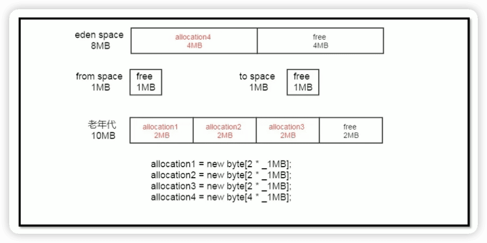

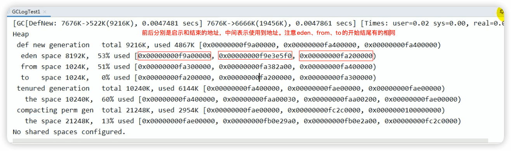

- jdk8

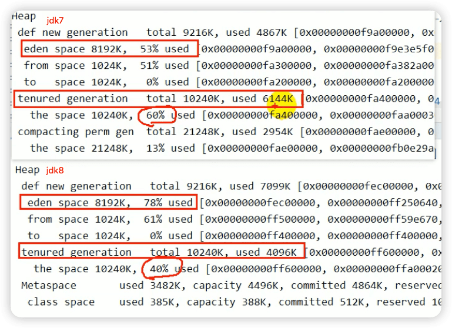

#### GC日志分析工貝

使用`-Xloggc:./logs/gc.log`生成日志文件，然后分析

可以用一些工具去分析这些gc日志。

常用的日志分析工具有：GCviewer、[GCEasy](https://gceasy.io/)、GCHisto、GCLogViever、Hpjmeter、garbagecat等。

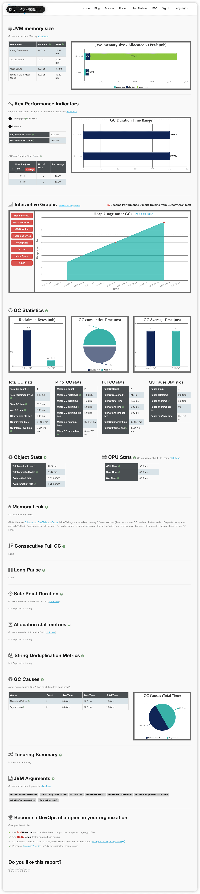

### 17.10 垃圾回收器的新发展

GC仍然处于飞速发展之中，目前的默认选项==G1 GC在不断的进行改进==，很多我们原来认为的缺点，例如串行的Full GC、Card Table扫描的低效等，都己经被大幅改进，例如，JDK 10以后，Full GC已经是并行运行，在很多场景下，其表现还略优于Parallel Gc的并行Full GC实现。

即使是serial Gc， 虽然比较古老，但是简单的设计和实现未必就是过时的，它本身的开销，不管是GC相关数据结构的开销，还是线程的开销，都是非常小的，所以随着云计算的兴起，==在Serverless等新的应用场景下，Serial Gc找到了新的舞台。==

比较不幸的是CMS GC，因为其算法的理论缺陷等原因，虽然现在还有非常大的用户群体，但在JDK9中己经被标记为废弃，并在JDK14版本中移除。

#### JDK11新特性

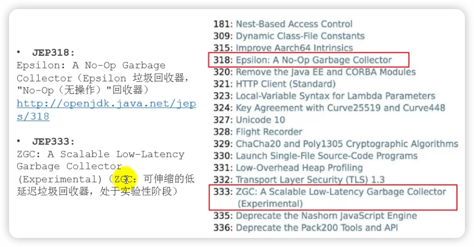

#### Open JDK12的Shenandoah GC

- 现在G1回收器己成为默认回收器好几年了。
- 我们还看到了引入了两个新的收集器：ZGC (JDK11出现）和Shenandoah(Open JDK12) 。
   主打特点：低停顿时间


open JDKI2的Shenandoab cc： 低停顿时问的GC（实验性）

<u>Shenandoah，无疑是众多GC中最孤独的一个</u>。是第一款不由Oracle公司团队领导开发的Hotspot垃圾收集器。不可避免的受到官方的排挤。比如号称OpenJDK和oracleJDK没有区别的Oracle公司仍拒绝在Oracle JDK12中支持Shenandoah。

Shenandoah垃圾回收器最初由RedHat进行的一项垃圾收集器研究项月pauseless GC的实现，==旨在针对JVW上的内存回收实现低停顿的需求==。在2014年贡献给OpenJDK。

Red Hat研发Shenandoah团队对外宣称，==Shenandoah垃圾回收器的暂停时间与堆大小无关，这意味着无论将堆设置为200 MB还是200GB， 99.9%的目标都可以把垃圾收集的停顿时问限制在十毫秒以内==。不过实际使用性能将取决于实际工作堆的大小和工作负载。

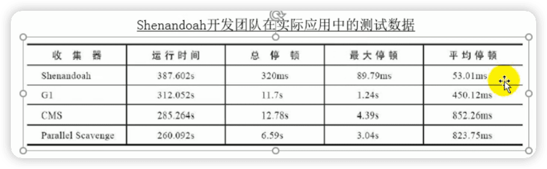

这是RedHat在2016年发表的论文数据，测试内容是使用ES对200GB的维基百科数据进行索引。从结果看：

- 停顿时间比其他几款收集器确实有了质的飞跃，但也未实现最大停顿时问控制在十毫秒以内的目标。

- 而吞吐量方面出现了明显的下降，总运行时间是所有测试收集器里最长的。

总结：

shenandoah GC的弱项：高运行负担下的吞吐量下降西

shenandoah GC的强项：低延迟时间。

shenandoah GC的工作过程大致分为九个阶段，这里就不再赘述。在之前Java12新特性视频里有过介绍。

#### 令人震惊、革命性的ZGC

https://docs.oracle.com/en/java/javase/12/gctuning/

ZGC与Shenandoah目标高度相似，==在尽可能对吞吐量影响不大的前提下，实现在任意堆内存大小下都可以把垃圾收集的停顿时间限制在十毫秒以内的低延迟==。

《深入理解Java虛拟机》一书中这样定义ZGC： ZGC收集器是一款基于Region内存布局的，（暂时）不设分代的，使用了读屏障、染色指针和内存多重映射等技术来实现==可并发的标记-压缩算法==的，==以低延迟为首要目标==的一款垃圾收集器。

ZGC的工作过程可以分为4个阶段：==并发标记-并发预备重分配-并发重分配-并发重映射==等。

ZGC几乎在所有地方并发执行的，除了初始标记的是STW的。所以停顿时间几乎就耗费在初始标记上，这部分的实际时间是非常少的。

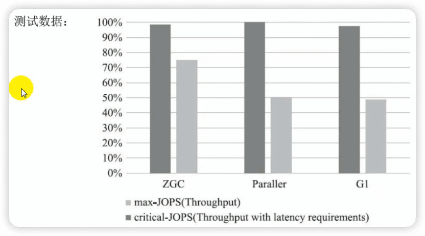

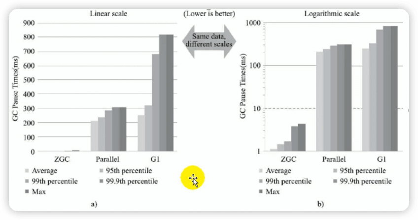

在ZGC的强项停顿时问测试上，它毫不留情的将Parallel、G1拉开了两个数量级的差距。无论平均停顿、95%停顿、99%停顿、99.9%停顿，还是最大停顿时间，ZGC都能毫不费劲控制在10毫秒以内。


[《新一代垃圾回收器：ZGC设计与实现》](https://book.douban.com/subject/34812818/)

虽然zGC还在试验状态，没有完成所有特性，但此时性能已经相当亮眼，用“令人震惊、革命性”来形容，不为过。

==未来将在服务端、大内存、低延迟应用的首选垃圾收集器。==


#### JDK14新特性

JEE 364： ZGC应用在macos上

JEP 365： ZGC应用在Windows上

- JDK14之前，ZGC仅Linux才支持。
- 尽管许多使用zGC的用户都使用类工inux的环境，但在Windows和macos上，人们也需要zGC进行开发部署和测试。许多桌面应用也可以从zGC中受益。因此，zGC特性被移植到了Windows和macos上。
- 现在mac或Nindows上也能使用zGC了，示例如下：`XX:+UnlockExperimentalVMoptions` `-XX:+UseZGC`


#### 其垃圾回收器：AliGC

Alicc是阿里巴巴JVM因队基于G1算法， 面向大堆 (LargeHleap）应用场景。

指定场景下的对比：


当然，其他厂商也提供了各种独具一格的GC实现，例如比较有名的低延迟GC，Zing （https://www.infoq.com/articles/azul_gC_in_detail），有兴。趣可以参考提供的链接。


> 
>
> 如何超越既聪明且勤奋的，提前起步（选择合适的方向，提交开始等）

# 二、字节码与类的加载篇

p204

## 1 class文件结构

### 1.1 概述

#### 字节码文件的跨平台性

1. Java语言：跨平台的语言

- 当Java源代码成功编译成字节码后，如果想在不同的平台上面运行，则无须再次编译
- 这个优势不再那么吸引人了。Python、PHP、Perl、Ruby、Lisp等有强大的解释器。
- 跨平台似乎己经快成为一门语言必选的特性。

2. Java虚拟机：跨语言的平台

Java虚拟机不和包括 Java 在内的任何语言绑定，它只与“Class文件”这种特定的二进制文件格式所关联。无论使用何种语言进行软件开发，只要能将源文件编译为正确的Class文件，那么这种语言就可以在Java虚拟机上执行。可以说，统一而强大的Class文件结构，就是Java虛拟机的基石、桥梁。


https://docs.oracle.com/javase/specs/index.html

所有的JVM全部遵守了java虚拟机规范，也就是说所有的JVM环境都是一样的，这样一来字节码文件可以在各种JVM上运行。

3. 想要让一个Java程序 正确地运行在JVM中，Java源码就必领要被编译为符合JVM规范的字节码。

- ==前端编译器==的主要任务就是负责将符合Java语法规范的Java代码转换为符合JVM规范的字节码文件。
- javac是一种能够将Java源码编译为字节码的前端编译器。
- javac编译器在将java源码编译为一个有效的字节码文件过程中经历了4个步骤，分别是==词法解析、语法解析、语义解析以及生成字节码==。


oracle的JDK软件包括两部分内容：

- 一部分是将Java源代码编译成Java虚拟机的指令集的编译器。

- 另一部分是用于实现java虛拟机的运行时环境。

#### Java的前端编译器

前端编译器 vs 后端编译器

Java源代码的编译结果是字节码，那么肯定需要有一种编译器能够将Java源码编译为字节码，承担这个重要责任的就是配罝在path环境变量中的==javac编译器==。javac是一种能够将Java源码编译为字节码的前端编译器。

Hotspot VM并没有强制要求前端编译器只能使用 javac来编译字节码，其实只要编译结果符合JVM规范都可以被了VM所识别即可。

在Java的前端编译器领域，除了javac之外，还有一种被大家经常用到的前端编译器，那就是内置在Eclipse中的==ECJ (Eclipse compiler for java)编译器==。和Javac的==全量式==编译不同，ECJ是一种==增量式==编译器。

- 在Eclipse中，当开发人员编写完代码后，使用“ctrl+S” 快捷键时，ECJ编译器所采取的编译方案是把未编译部分的源码逐行进行编译，而非每次都全量编译。因此ECJ的编译效率会比javac更加迅速和高效，当然编译质量和javac相比大致还是一样的。
- ECJ不仅是Eclipse的默认内置前端编泽器，在Tomcat中同样也是使用ECJ编译器来编译jsp文件。由于ECJ编译器是釆用GPLv2的开源协议进行源代码公开，所以，大家可以登eclipse官网下载ECJ编译器的源码进行二次开发。
- 默认情況下，IntelliJ IDEA 使用 javac编译器。（还可以自己设置为Aspect了编译器 ajc)

前端编译器并不会直接涉及编译优化等方面的技术，而是将这些具体优化细节移交给HotSpot的了JIT编译器负责。

复习：AOT(静态提前编译器， Ahead Of Time compiler)：在程序运行之前直接将字节码翻译成机器指令。想像C/C++一样，提高效率。


#### 透过字节码看代码执行细节

举例1:


Integer有个内部类IntegerCache，它有个范围[-128, 127]，当valueof的值在这个范围之类，就直接返回，而不需要new Integer对象，因此`i1 == i2`是true，而`i3 == i4`是false

```java
public static Integer valueOf(int i) {
    if (i >= IntegerCache.low && i <= IntegerCache.high)
        return IntegerCache.cache[i + (-IntegerCache.low)];
    return new Integer(i);
}
```


举例2：

```java
    public static void main(String[] args) {
        String str = new String("hello") + new String("world");
        String str1 = "helloworld";
        System.out.println(str == str1);  // false
        String str2 = new String("helloworld");
        System.out.println(str == str2); // false
    }
```

```java
 0 new #2 <java/lang/StringBuilder>
 3 dup
 4 invokespecial #3 <java/lang/StringBuilder.<init> : ()V>
 7 new #4 <java/lang/String>
10 dup
11 ldc #5 <hello>
13 invokespecial #6 <java/lang/String.<init> : (Ljava/lang/String;)V>
16 invokevirtual #7 <java/lang/StringBuilder.append : (Ljava/lang/String;)Ljava/lang/StringBuilder;>
19 new #4 <java/lang/String>
22 dup
23 ldc #8 <world>
25 invokespecial #6 <java/lang/String.<init> : (Ljava/lang/String;)V>
28 invokevirtual #7 <java/lang/StringBuilder.append : (Ljava/lang/String;)Ljava/lang/StringBuilder;>
31 invokevirtual #9 <java/lang/StringBuilder.toString : ()Ljava/lang/String;>
34 astore_1
35 ldc #10 <helloworld>
37 astore_2
38 getstatic #11 <java/lang/System.out : Ljava/io/PrintStream;>
41 aload_1
42 aload_2
43 if_acmpne 50 (+7)
46 iconst_1
47 goto 51 (+4)
50 iconst_0
51 invokevirtual #12 <java/io/PrintStream.println : (Z)V>
54 new #4 <java/lang/String>
57 dup
58 ldc #10 <helloworld>
60 invokespecial #6 <java/lang/String.<init> : (Ljava/lang/String;)V>
63 astore_3
64 getstatic #11 <java/lang/System.out : Ljava/io/PrintStream;>
67 aload_1
68 aload_3
69 if_acmpne 76 (+7)
72 iconst_1
73 goto 77 (+4)
76 iconst_0
77 invokevirtual #12 <java/io/PrintStream.println : (Z)V>
80 return

```


举例3:🔖回看过程

```java
class Father {
    int x = 10;

    public Father() {
        this.print();
        x = 20;
    }
    public void print() {
        System.out.println("Father.x = " + x);
    }
}
class Son extends Father {
    int x = 30;
    public Son() {
        this.print();
        x = 40;
    }
    public void print() {
        System.out.println("Son = " + x);
    }
}
public class SonTest {
    public static void main(String[] args) {
//        Father f = new Father();
        Father f = new Son();
        System.out.println(f.x);
    }
}

```

运行结果：

```java
Son = 0
Son = 30
20
```


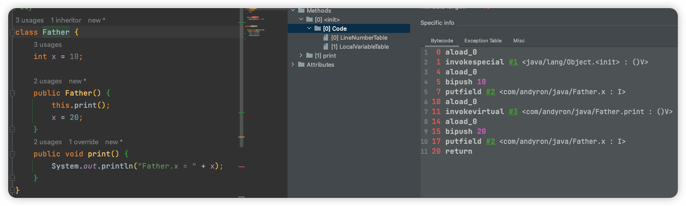

`aload_0`表示调用局部变量表0位置值，这里也就是this；

然后调用Father父类的`<init>`（调用构造器时会有一个super操作）；


`new Son()`时，会先调用`Father.<init>`，print()方法被重写，`this.print()`调用的是Son的，而且此时还没有`bipush 30`，Son的x还没有显示赋值，是默认初始化的值0，所以会打印出`Son = 0`；

之后Father的x在`Father.<init>`中被赋值20，但回到Son的`<init>`，首先Son的x被现实赋值为30，接着调用`this.print()`，也就打印出`Son = 30`；

之后Son的x倍赋值40，但**==<u>属性不存在多态性</u>==**，`f.x`调用的是Father的x，因此打印出`20`。

### 1.2 虚拟机的基石：Class文件

- 字节码文件里是什么？

源代码经过编译器编译之后便会生成一个字节码文件，字节码是一种二进制的类文件，它的内容是JVM的指令，而不像C、C++经由编译器直接生成==机器码==。

- 什么是字节码指令(byte code)？

Java虚拟机的指令由一个字节长度的，代表着某种特定操作含义的==操作码==（opcode）以及跟随其后的零至多个代表此操作所需參数的==操作数==（operand）所构成。虛拟机中许多指令并不包含操作数，只有一个操作码。`操作码 (操作数)`

比如：

- 如何解读供虚拟机解释执行的二进制字节码？

方式一：一个一个二进制卡。用Binary Viewer等

方式二：javap：jdk自带的反解析工具

方式三：IDEA插件：jclasslib，或者其客户端工具


### 1.3 Class文件结构

https://docs.oracle.com/javase/specs/jvms/se8/html/jvms-4.html

**Class类的本质**

任何一个Class文件都对应着唯一一个类或接口的定义信息，但反过来说，Class文件实际上它并不一定以磁盘文件的形式存在。Class文件是一组以8位字节为基础单位的==二进制流==。

**Class文件格式**

Class 的结构不像XML等描述语言，由于它没有任何分隔符号。所以在其中的数据项，无论是字节顺序还是数量，都是被严格限定的，哪个字节代表什么含义，长度是多少，先后顺序如何，都不允许改变。

```
“下雨天留客天留我不留”
"下丽天，留客天，留我不留？”
“下雨天，留客天，留我不？留！”
“下雨，天留客？天留，我不留！”
```


Class 文件格式采用一种类似于C语言结构体的方式进行数据存储，这种结构中只有两种数据类型：==无符号数==和==表==。

- 无符号数属于基本的数据类型，以 u1、u2、u4、u8 来分别代表 1个字节、2个字节、4个字节和8个字节的无符号数，无符号数可以用来描述数字、 索引引用、数量值或者按照UTF-8编码构成字符串值。
- 表是由多个无符号数或者其他表作为数据项构成的复合数据类型，所有表都习惯性地以“`_info`”结尾。表用于描述有层次关系的复合结构的数据，整个 Class 文件本质上就是一张表。由于表没有固定长度，所以通常会在其前面加上个数说明。


> 换句话说，充分理解了每一个字节码文件的细节，自己也可以反编译出Java源文件。


**class文件结构概述**

class文件的结构并不是一成不变的，随着Java虚拟机的不断发展，总是不可避免地会对Class文件结构做出一些调整，但是其基本结构和框架是非常稳定的。

Class文件的总体结构如下：

- 魔数
- Class文件版本
- 常量池
- 访问标志
- 类索引，父类索引，接口索引集合
- 字段表集合
- 方法表集合
- 属性表集合（注意和类中的field区分，field应该翻译成字段，但习惯上也叫属性）


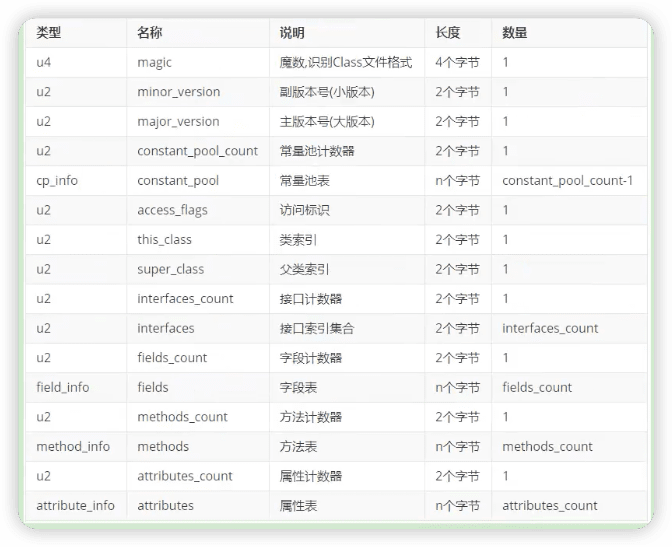

> P213 把字节码数据保存到excel中，方便分析

#### 魔数：Class文件的标志

- 每个Class 文件开头的4个字节的无符号整数称为魔数 ( Magic Number)
- 它的唯一作用是确定这个文件是否为一个能被虛拟机接受的有效合法的Class文件。即：魔数是Class文件的标识符。

- 魔数值固定为`OxCAFEBABE`。不会改变。
- 如果一个Class文件不以`0xCAFEBABE`开头，虚拟机在进行文件校验的时候就会直接抛出以下错误：

```
Error: A JNI error has occurred, please check your installation and try again
Exception in thread "main" java.lang. ClassFormatError: Incompatible magic value 1885430635 in class file StringTest
```

- 使用魔数而不是扩展名来进行识别主要是基于==安全==方面的考虑，因为文件扩展名可以随意地改动。

#### Class文件版本号

- 紧接着魔数的4个字节存储的是 Class 文件的版本号。同样也是4个字节。第5个和第6个字节所代表的含义就是编译的副版本号minor_version，而第7个和第8个字节就是编译的主版本号major_version。
- 它们共同构成了class文件的格式版本号。譬如某个Class文件的主版本号为M，副版本号为 m，那么这个Class 文件的格式版本号就确定为M.m。
- 版本号和Java编译器的对应关系如下表：


- Java 的版本号是从45开始的，JDK 1.1之后的每个JDK大版本发布主版本号向上加1。

- <u>不同版本的Java编译器编译的Class文件对应的版本是不一样的。目前，高版本的Java虚拟机可以执行由低版本编译器生成的Class文件，但是低版本的了ava虚拟机不能执行由高版本编译器生成的C1ass文件。否则JVM会抛出`java.lang.UnsupportedClassVersionError`异常。（向下兼容）</u>

- 在实际应用中，由于开发环境和生产环境的不同，可能会导致该问题的发生。因此，需要我们在开发时，特别注意开发编译的JDK版本和生产环境中的JDK版本是否一致。

  虛拟机JDK版本为1.k（k>=2）时，对应的class文件格式版本号的范国为45.0 - 44+k.0（含两端）。

#### 常量池：存放所有常量

The Constant Pool

- 常量池是Class文件中内容最为丰富的区域之一。常量池对于Class文件中的字段和方法解析也有着至关重要的作用。【资源仓库】

- 随着Java虚拟机的不断发展，常量池的内容也日渐丰富。可以说，常量池是整个Class文件的==基石==。

```java
cp_info {
    u1 tag;
    u1 info[];
}
```


- 在版本号之后，紧跟着的是常量池的数量，以及若干个常量池表项。
- 常量池中常量的数量是不固定的，所以在常量池的入口需要放置一项u2类型的无符号数，代表常量池容量计数值（constant_pool_count）。与Java中语言习惯不一样的是，这个容量计数是从1而不是0开始的。

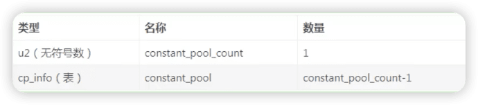

- 由上表可见，Class文件使用了一个前置的容量计数器 (constant_pool_count）加若干个连续的数据项 (constant_pool）的形式来描述常量池内容。我们把这一系列连续常量池数据称为**常量池集合**。

- 常量池表项中，用于存放编译时期生成的各种==字面量==和==符号引用==，这部分内容将在类加载后进入方法区的运行时常量池中存放。

  > ps：jdk8之后，把字符串常量池移到了堆空间。

##### 常量池计数器 (constant_pool_count）

- 由于常量池的数量不固定，时长时短，所以需要放置两个字节来表示常量池容量计数值。
- 常量池容量计数值（u2类型）：从1开始，表示常量池中有多少项常量。即constant_pool_count=1表示常量池中有0个常量项.

- Demo中的值为：


其值为`0x0016`，掐指一算，也就是22。

需要注意的是，这实际上只有21项常量。素引为范国是1-21。为什么呢？

通常我们写代码时都是从0开始的，但是这里的常量池却是从1开始，因为它把第0项常量空出来了。这是为了满足后面某些指向常量池的索引值的数据在特定情况下需要表达**“不引用任何一个常量池项目”**的含义，这种情况可用索引值0来表示。

##### 常量池表（constant_pool）

###### 字面量和符号引用

- constant_pool是一种表结构，以 1 ~ constant_pool_count-1为索引。表明了后面有多少个常量项。
- 常量池主要存放两大类常量：==字面量 （Literal）==和==符号引用 (Symbolic References)==


> + 全类名
>
> `com.andyron.test.Demo`
>
> + 全限定名
>
> `com/andyron/test/Demo`这个就是类的全限定名，仅仅是把包名的”“替换成”/“，为了使连续的多个全限定名之间不产生混淆，在使用时最后一般会加入一个“;” 表示全限定名结束。
>
> + 简单名称
>
> 简单名称是指没有类型和参数修饰的方法或者字段名称，上面例子中的类的add()方法和num字段的简单名称分别是add和num。
>
> + 描述符
>
> 描述符的作用是==用来描述字段的数据类型、方法的参数列表（包括数量、类型以及顺序）和返回值==。根据描述符规则，基本数据类型(byte、char、double、float、int、long、short、boolean）以及代表无返回值的void类型都用一个大写字符来表示，而对象类型则用宇符L加对象的全限定名来表示，详见下表：
>
> 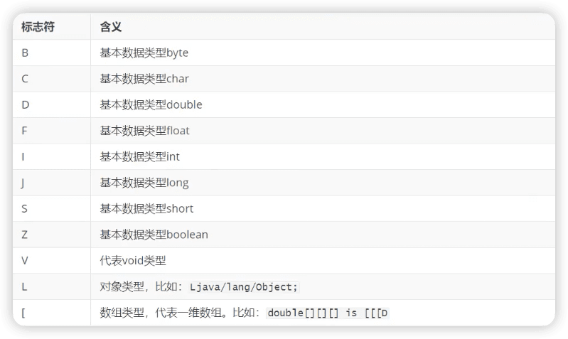
>
> 用描述符来描述方法时，按照先参数列表，后返回值的顺序描述，参数列表按照参数的严格顺序放在一组小括号“()” 之内。如方法`java.lang.String.tostring()`的描述符为`()Ljava/lang/String;`，方法`int abc(int[] x，int y)`的描述符为`([II)I`。🔖


- 它包含了class文件结构及其子结构中引用的所有字符串常量、类或接口名、字段名和其他常量。常量池中的每一项都具备相同的特征。第1个字节作为==类型标记==，用于确定该项的格式，这个字节称为tag byte（标记字节、标签字节）。

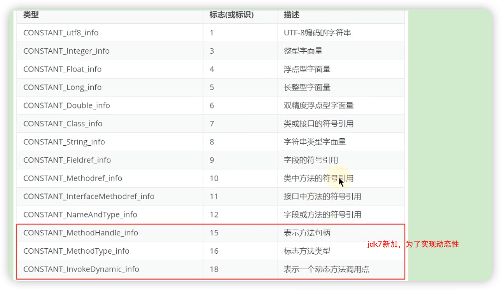


> 补充说明：
>
> 虚拟机在加载Class文件时才会进行动态链接，也就是说，Class 文件中不会保存各个方法和字段的最終内存布局信息，因此，这些字段和方法的符号引用不经过转换是无法直接被虚拟机使用的。==当虚拟机运行时，需要从常量池中获得对应的符号引用，再在类加载过程中的解析阶段将其替换为直接引用，并翻译到具体的内存地址中==。
>
> 这里说明下符号引用和直接引用的区别与关联：
>
> - 符号引用：符号引用以==一组符号==来描述所引用的目标，符号可以是任何形式的字面量，只要使用时能无歧义地定位到目标即可。==符号引用与虚拟机实现的内存布局无关==，引用的目标并不一定已经加载到了内存中。
> - 直按引用：直接号用可以是直接==指向目标的指针、相对偏移量或是一个能问接定位到目标的句柄。直按引用是与虚拟机实现的内存布属相关的==，同一个符号引用在不同虚拟机实例上翻译出来的直按引用一般不会相同。如果有了直接引用，那说明引用的目标必定已经存在于内存之中了。

###### 常量类型和结构

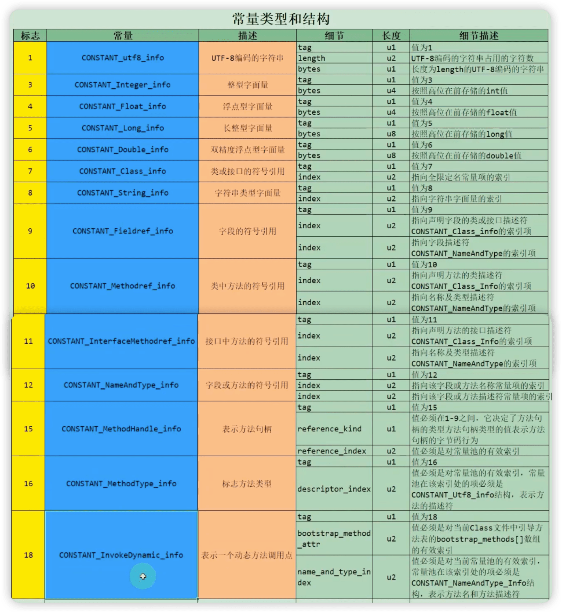

🔖p220 常量池解读过程

```java
package com.andyron.java1;

public class Demo {
    private int num = 1;

    public int add() {
        num = num + 2;
        return num;
    }
}
```

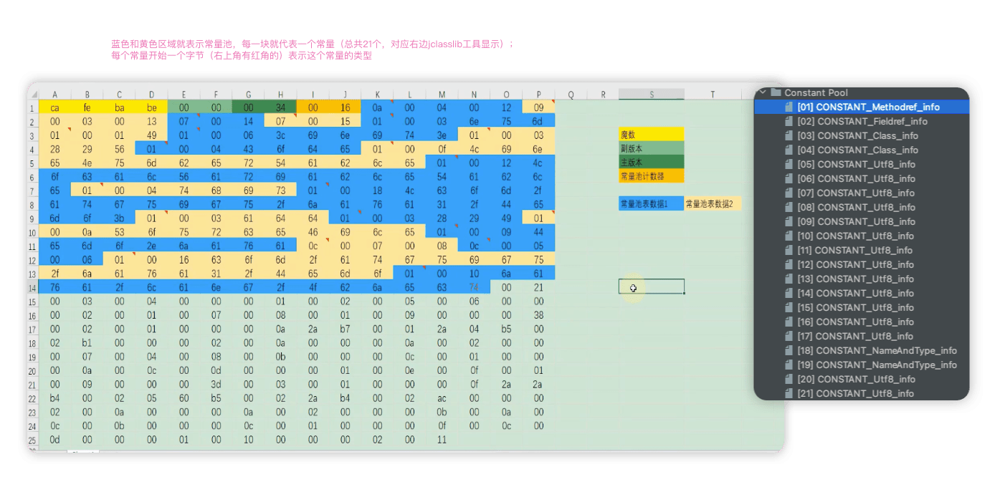

总结1:

- 这14种表（或者常量项结构）的共同点是：表开始的第一位是一个u1类型的标志位（tag），代表当前这个常量项使用的是哪种表结构，即哪种常量类型。
- 在常量池列表中，`CONSTANT_Utf8_info`常量项是一种使用改进过的UTF-8编码格式来存储诸如**文字字符串、类或者接口的全限定名、字段或者方法的简单名称以及描述符**等常量字符串信息。
- 这14种常量项结构还有一个特点是，其中13个常量项占用的字节固定，只有`CONSTANT_Utf8_info`占用字节不固定，其大小由length决定。为什么呢？==因为从常量池存放的内容可知，其存放的是字面量和符号引用，最终这些内容都会是一个字符串，这些字符串的大小是在编写程序时才确定==，比如你定义一个类，类名可以取长取短，所以在没编译前，大小不固定，编译后，通过utf-8编码，就可以知道其长度。

总结2：

- 常量池：可以理解为Class文件之中的资源仓库，它是Class文件结构中与其他项目关联最多的数据类型 （后面的很多数据类型都会指向此处），也是占用Class文件空间最大的数据项目之一。
- 常量池中为什么要包含这些内容

Java代码在进行Javac编译的时候，并不像C和C++那样有 “连接” 这一步骤，而是在虚拟机加载Class文件的时候进行动态链接。也就是说，==在Class文件中不会保存各个方法、字段的最终内存布局信息，因此这些字段、方法的符号引用不经过运行期转换的话无法得到真正的内存入口地址，也就无法直接被虛拟机使用==。当虛拟机运行时，需要从常量池获得对应的符号引用，再在类创建时或运行时解析、翻译到具体的内存地址之中。关于类的创建和动态链接的内容，在虚拟机类加载过程时再进行详细讲解。

#### 访问标识（access_flags）

- 在常量池后，紧跟着访问标记。该标记使用两个字节表示，用于识别一些类或者接口层次的访问信息，包括：这个Class是类还是接口；是否定义为 public 类型：是否定义为 abstract 类型；如果是类的话，是否被声明为 final 等。各种访问标记如下所示：


> 正常类（不是内部类）除了public修饰，就是没有，不能是private或protected。


- 类的访问权限通常为 `ACC_` 开头的常量。

- 每一种类型的表示都是通过设置访问标记的32位中的特定位来实现的。比如，若是public final的类，则该标记为 `ACC_PUBLIC | ACC_FINAL`.

- 使用ACC_SUPER可以让类更准确地定位到父类的方法super.method(），现代编译器都会设置并且使用这个标记。

补充说明：

1. 带有`ACC_INTERFACE`标志的class文件表示的是接口而不是类，反之则表示的是类而不是接口。
   - 如果一个class文件被设置了 `ACC_INTERFACE` 标志，那么同时也得设置`ACC_ABSTRACT` 标志。同时它不能再设置 `ACC_FINAL`、`ACC_SUPER` 或`ACC_ENUM` 标志。
   - 如果没有设置`ACC_INTERFACE`标志。那么这个class文件可以具有上表中除 `ACC_ANNOTATION`外的其他所有标志。当然。`ACC_FINAL`和`ACC_ABSTRACT`这类互斥的标志除外。这两个标志不得同时改置。

2. `ACC_SUPER`标志用于确定类或接口里面的`invokespecial`指令使用的是哪一种执行语义。**针对Java虚拟机指令集的编译器都应当设置这个标志**。对于Java SE 8及后续版本来说，无论class文件中这个标志的实际值是什么，也不管class文件的版本号是多少，Java虛拟机都认为每个Class文件均设置了ACC_SUPER标志。

   ACC_SUPER标志是为了向后兼容由旧Java编译器所编译的代码而设计的。目前的 ACC_SUPER标志在由JDK 1.0.2之前的编译器所生成的access_flags中是没有确定含义的，如果设置了该标志，那么Oracle的Java虚拟机实现会将其忽略。

3. `ACC_SYNTHETIC`标志意味着该类或接口是由编译器生成的，而不是由源代码生成的。
4. 注解类型必须设置`ACC_ANNOTATION`标志。如果设置了 ACC_ANNOTATION标志， 那么也必须设置`ACC_INTERFACE`标志。
5. ACC_ENUN标志表明该类或其父类为枚举类型。

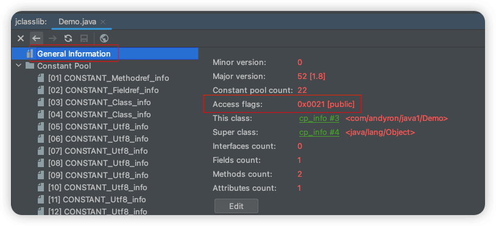

#### 类索引、父类索引、接口索引集合

- 在访问标记后，会指定该类的类别、父类类别以及实现的接口，格式如下：


- 这三项数据来确定这个类的继承关系。
  + 类索引用于确定这个类的全限定名
  + 父类索引用于确定这个类的父类的全限定名。由于Java语言不允许多重继承，所以父类索引只有一个，除了`java.lang.object` 之外，所有的Java类都有父类，因此除了java.lang.object 外，所有Java类的父类索引都不为0。
  + 接口索引集合 就用来描达这个类实现了哪些接口，这些被实现的接口将按 implements 语句（如果这个类本身是一个接口，则应当是 extends 语句〉后的接口顺序从左到右排列在接口素引集合中。


##### this_class （类索引)

2字节无符号整数，指向常量池的索引。它提供了类的全限定名，如`com/andyron/java1/Demo`。 `this_class`的值必须是对常量池表中某项的一个有效索引值。常量池在这个索引处的成员必须为CONSTANT_Class_info类型结构体，该结构体表示这个class文件所定义的类或接口。


##### super_class（父类索引）

- 2字节无符号整数，指向常量池的索引。它提供了当前类的父类的全限定名。如果我们没有继承任何类，其默认继承的是java/lang/Object类。同时，由于java不支持多继承，所以其父类只有一个。
- superclass指向的父类不能是final。

##### interfaces

- 指向常量池索引集合，它提供了一个符号引用到所有己实现的接口
- 由于一个类可以实现多个接口，因此需要以数组形式保存多个接口的素引，表示接口的每个索引也是一个指向常量池的CONSTANT_Class（当然这里就必须是接口，而不是类）。

**==interfaces_count（接口计数器）==**项的值表示当前类或接口的直接超接口数量。

**==interfaces [](接口索引集合）==**（如果接口计数器为0，那就没有这个集合）中每个成员的值必须是对常量池表中某项的有效索引值，它的长度为 interfaces_count。 每个成员interfaces[i]必领为 CONSTANT_Class_info结构，其中`0 <= i < interfaces_count`。在interfaces[]中，各成员所表示的接口顺序和对应的源代码中给定的接口顺序 （从左至右）一样，即interfaces[0]对应的是源代码中最左边的接口。

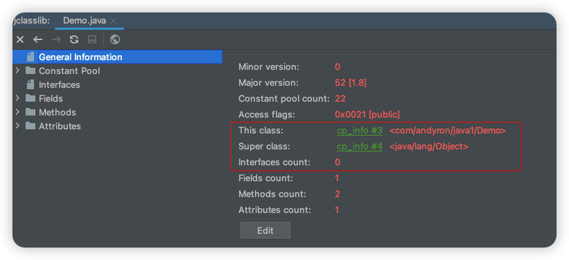

#### 字段表集合

fields

- 用于描述接口或类中声明的变量。字段（field）包括==类级变量以及实例级变量==，但是不包括方法内部、代码块内部声明的局部变量(local variables)。 
- 宇段叫什么名宇、宇段被定义为什么数据类型，这些都是无法固定的，只能引用常量池中的常量来描述。
- 它指向常量池索引集合，它描述了每个字段的完整信息。比如**字段的标识符、访问修饰符 (public、private或protected）、是类变量还是实例变量(static修饰符）、是否是常量（final修饰符）**等。

注意事项：

- 字段表集合中不会列出从父类或者实现的接口中继承而来的字段，但有可能列出原本Java代码之中不存在的字段。譬如<u>在内部类中为了保持对外部类的访问性，会自动添加指向外部类实例的字段</u>。
- 在Java语言中字段是无法重载的，两个字段的数据类型、修饰符不管是否相同，都必须使用不一样的名称，但是对于字节码来讲，如果两个字段的描述符不一致，那字段重名就是合法的。

##### fields_count （字段计数器）

fields_count的值表示当前class文件fields表的成员个数。使用两个字节来表示。

fields 表中每个成员都是一个field_info结构，用于表示该类或接口所声明的所有类字段或者实例字段，不包括方法内部声明的变量，也不包括从父类或父接口继承的那些字段。

##### fields[]（字段表）

- fields表中的每个成员都必须是一个fields_info结构的数据项，用于表示当前类或接口中某个字段的完整描述。

- 一个字段的信息包括如下这些信息。这些信息中，==各个修饰符都是布尔值，要么有，要么没有==。

  - 作用域(public、private、protected修饰符）

  - 是实例变量还是类变量 （static修饰符）

  - 可变性 (final)
  - 并发可见性(volatile修饰符，是否强制从主内存读写）
  - 可否序列化(transient修饰符）
  - 字段数据类型（基本数据类型、对象、数组）
  - 字段名称

- 字段表结构

字段表作为一个表，同样有他自己的结构：


###### 1️⃣字段表访问标识

我们知道，一个字段可以被各种关键字去修饰，比如：==作用域修饰符== (public. private、protected)、==static修饰符==、==final修饰符==、==volatile修饰符==等等。因此，其可像类的访问标志那样，使用一些标志来标记字段。字段的访问标志有如下这些：

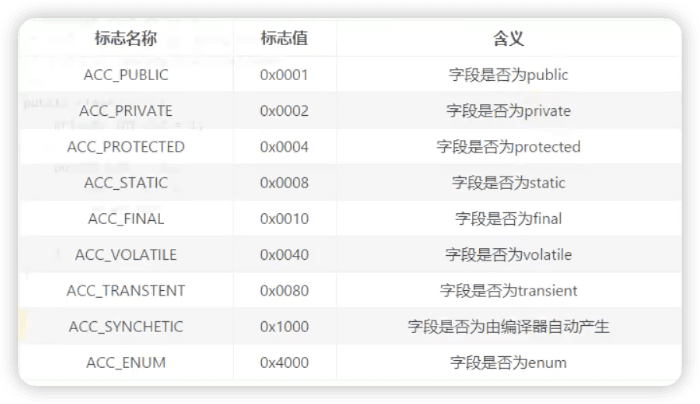

###### 2️⃣字段名索引

根据字段名索引的值，查询常量池中的指定索引项即可。

###### 3️⃣描述符索引

描述符的作用是用来描述字段的**==数据类型、方法的参数列表（包括数量、类型以及顺序）和返回值==**。根据描述符规则，基本数据类型 (byte,char,double,float,int,1ong,short,boolean）及代表无返回值的void类型都用一个大写字符来表示，而对象则用字符L加对象的全限定名来表示，如下所示：


###### 4️⃣属性表集合

一个字段还可能拥有一些属性，用于存储更多的额外信息。比如**初始化值（针对常量）、一些注释信息**等。属性个数存放在`attribute_count`中，属性具体内容存放在`attributes`数组中。


#### 方法表集合

methods：指向常量池索引集合，它完整描述了每个方法的签名。

- 在字节码文件中，==每一个method_info项都对应着一个类或者接口中的方法信息==。比如<u>方法的访问修饰符(public、private或protected)，方法的返回值类型以及方法的参数信息</u>等。
- 如果这个方法不是抽象的或者不是native的，那么字节码中会体现出来。
- 一方面，methods表只描述当前类或接口中声明的方法，**不包括从父类或父接口继承的方法**。另一方面，methods表有可能会出现**由编译器自动添加的方法**，最典型的便是编译器产生的方法信息(比如：类(接口)初始化方法`<clinit>()`和实例初始化方法`<init>()`）。

**使用注意事项：**

在Java语言中，要重载(Overload)一个方法，除了要与原方法具有相同的简单名称之外，还要求必领拥有一个与原方法不同的特征签名，==特征签名==就是一个方法中<u>各个参数在常量池中的字段符号引用的集合</u>，也就是因为返回值不会包含在特征签名之中，因此Java语言里无法仅仅依靠返回值的不同来对一个已有方法进行重载。但在Class文件格式中，特征签名的范围更大一些，只要描述符不是完全一致的两个方法就可以共存。也就是说，如果两个方法有相同的名称和特征签名，但返回值不同，那么也是可以合法共存于同一个class文件中。

也就是说，尽管java语法规范并不元许在一个类或者接口中声明多个方法签名相同的方法，但是和Java语法规范相反，字节码文件中却恰怡允许存放多个方法签名相同的方法，唯一的条件就是这些方法之间的返回值不能相同。

> 🔖 字段和方法，字节码文件的这种设计是不是为了兼容其他编程语言？

##### methods_count（方法计数器）

methods_count的值表示当前Class文件methods表的成员个数。使用两个字节来表示。

methods 表中每个成员都是一个method_info结构。

##### methods[]（方法表）

- methods表中的每个成员都必须是一个method_info结构，用于表示当前类或接口中某个方法的完整描述。如果某个method_ info结构的access_flags项既没有设置 ACC_ NATIVE 标志也没有设置ACC_ABSTRACT标志，那么该结构中也应包含实现这个方法所用的Java虚拟机指令。
- method_info结构可以表示类和接口中定义的所有方法，包括**实例方法、类方法、实例初始化方法和类或接口初始化方法**。
- 方法表的结构实际跟字段表是一样的，方法表结构如下：

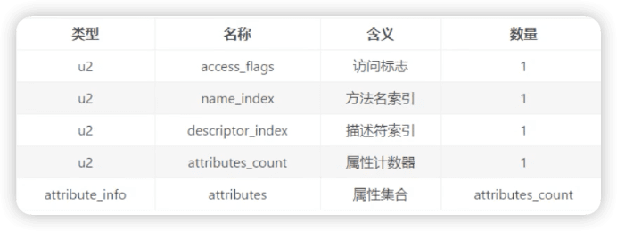

###### 1️⃣方法表访问标志

跟字段表一样，方法表也有访问标志，而且他们的标志有部分相同，部分则不同，方法表的具体访问标志如下：


🔖

#### 属性表集合


上图中1、2分别是字段表和方法表中的属性，3是class文件的属性表集合。


方法表集合之后的==属性表集合(attributes）==，指的是class文件所携带的辅助信息，比如该class 文件的源文件的名称。以及任何带有`RetentionPolicy.CLASS` 或者`RetentionPolicy.RUNTIME`的注解。这类信息通常被用于Java虚拟机的验证和运行，以及

Java程序的调试，一般无须深入了解。

此外，字段表、方法表都可以有自己的属性表。用于描述某些场景专有的信息。

属性表集合的限制没有那么严格，不再要求各个属性表具有严格的顺序，并且只要不与已有的属性名重复，任何人实现的编译器都可以向属性表中写入自己定义的属性信息，但Java虚拟机运行时会忽略掉它不认识的属性。

##### attributes_count（属性计数器）

attributes_count的值表示当前class文件属性表的成员个数。属性表中每一项都是一个attribute_info结构。

##### attributes []（属性表）

https://docs.oracle.com/javase/specs/jvms/se8/html/jvms-4.html#jvms-4.7

属性表的每个项的值必须是attribute_info结构。属性表的结构比较灵活，各种不同的属性只要满足以下结构即可。

###### 1️⃣属性的通用格式


即只需说明属性的名称以及占用位数的长度即可，属性表具体的结构可以去自定义。

###### 2️⃣属性类型

属性表实际上可以有很多类型，上面看到的code属性只是其中一种，Java8里面定义了23种属性。

下面这些是虛拟机中预定义的属性：

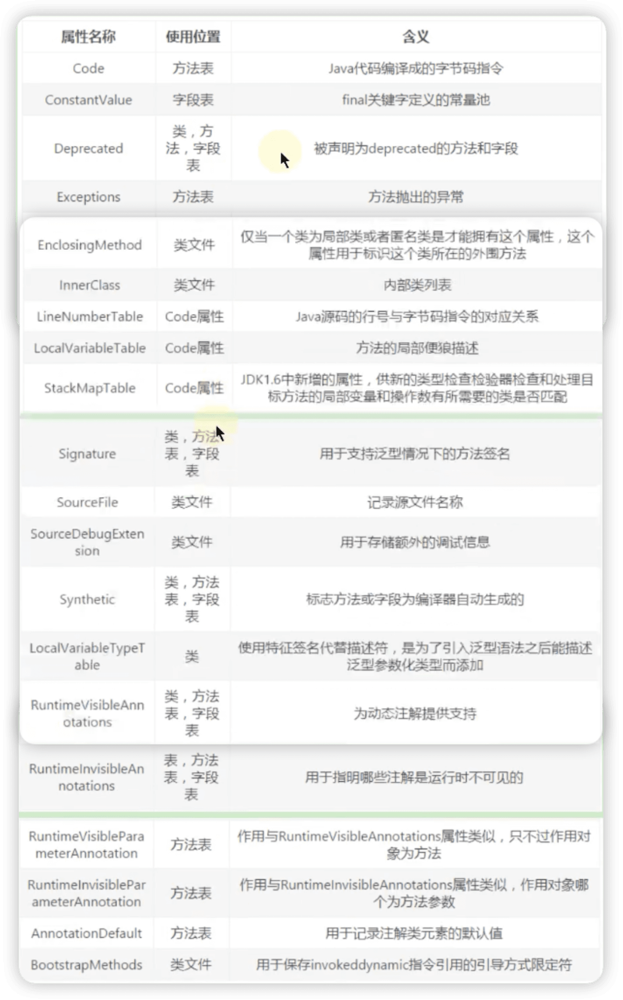

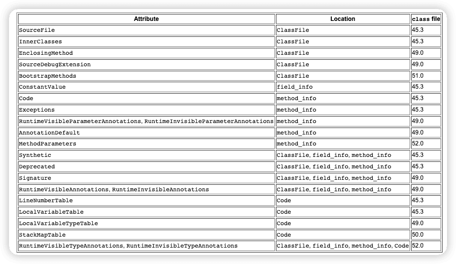

不分属性详解：

1. Constantvalue属性

Constantvalue属性表示一个常量字段的值。位于field_info结构的属性表中。

```java
ConstantValue_attribute {
    u2 attribute_name_index;
    u4 attribute_length;
    u2 constantvalue_index; // 字段值在常量池中的索引， 常量池在该索引处的项给出该属性表示的常量值。〔例如，值是long型的，在常量池中便是CONSTANT_Long）
}
```


2. Deprecated属性

Deprecated 属性是在 JDK 1.1 为了支持注释中的关键词@deprecated 而引入的。

```java
Deprecated_attribute {
	u2 attribute_name_index;
	u4 attribute_length;
}
```


3. Code属性

code属性就是存放方法体里面的代码。但是，并非所有方法表都有code属性。像接口或者抽象方法，他们没有具体的方法体，因此也就不会有code 属性了。

code属性表的结构：


code属性中可以有属性

可以看到：code属性表的前两项跟属性表是一致的，即code属性表遵循属性表的结构，后面那些则是他自定义的结构。

4. InnerClasses 属性

为了方便说明特别定义一个表示类或接口的 Class 格式为C。如果C的常量池中包含某个CONSTANT_Class_info成员。且这个成员所表示的类或接口不属于任何一个包，那么C的ClassFile结构的属性表中就必须含有对应的 InnerClasses 属性。InnerClasses 属性是在 JDK 1.1 中为了支持内部类和内部接口而引入的，位于 ClassFile结构的属性表。

5. LineNumberTable 属性

LineNumberTable属性是可选变长属性，位于code结构的属性表。

LineNumberTable属性是用来==描述Java源码行号与字节码行号之间的对应关系==。这个属性可以用来在调试的时候定位代码执行的行数。

==start_pc,即字节码行号;line_number，即Java源代码行号。==

在code 属性的属性表中，LineNumberTable 属性可以按照任意顺序出现，此外，多个LineNumberTable属性可以共同表示一个行号在源文件中表示的内容，即 LineNumberTable 属性不需要与源文件的行一一对应。

LineNumberTable属性表结构：

```java
LineNumberTable_attribute {
    u2 attribute_name_index;
    u4 attribute_length;
    u2 line_number_table_length;
    {   u2 start_pc;
        u2 line_number;	
    } line_number_table[line_number_table_length];
}
```

6. LocalVariableTable 属性

LocalVariableTable 是可选变长属性，位于Code属性的属性表中。它被调试器用==于确定方法在执行过程中局部变量的信息==。

在code属性的属性表中，LocalVariableTable 属性可以按照任意顺序出现。code 属性中的每个局部变量最多只能有一个 LocalVariableTable 属性。

- start pc + length表示这个变量在字节码中的生命周期起始和结束的偏移位置 (this生命周期从头日到结尼10）

- index就是这个变量在局部交量表中的槽位（槽位可复用）
- name就是变量名称

- Descriptor表示局部变量类型描述

LocalVariableTable 属性表结构：

```java
LocalVariableTable_attribute {
    u2 attribute_name_index;
    u4 attribute_length;
    u2 local_variable_table_length;
    {   u2 start_pc;
        u2 length;
        u2 name_index;
        u2 descriptor_index;
        u2 index;
    } local_variable_table[local_variable_table_length];
}
```

7. Signature 属性

signature属性是可选的定长属性，位于 ClassFile, field_info或method_info结构的属性表中。在java 语言中，任何类、接口、初始化方法或成员的泛型签名如果包含了类型变量（Type Variables） 或参数化类型（ Parameterized Types)，则 Signature 属性会为它记录泛型签名信息。

8. SourceFile属性

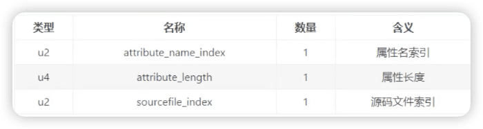

长度固定式8个字节

9. 其它属性


> 🔖自我感慨：感觉class文件就像一个有多层对象、数组等等的JSON文件，去除掉各种括号、引号、冒号，数组（表）就在前面加一个长度。。。

本小节主要介绍了Class文件的基本格式。

随着Java平台的不断发展，在将来，Class文件的内容也一定会做进一步的扩充，但是其基本的格式和结构不会做重大调整。

从Java虚拟机的角度看，通过Class文件，可以让更多的计算机语言支持Java虚拟机平台。因此，Class文件结构不仅仅是Java虚拟机的执行入口，更是Java生态圈的基础和核心。


### 1.4 使用javap指令解析Class文件

#### 解析字节码的作用

通过反编译生成的字节码文件，我们可以深入的了解java代码的工作机制。但是，自己分析类文件结构太麻烦了！除了使用第三方的jclasslib工具之外，oracle官方也提供了工具：javap。

javap是jdk自带的反解析工具。它的作用就是根据class字节码文件，反解析出当前类对应的<u>code区《字节码指令）局部变量表、异常表和代码行偏移量映射表、常量池</u>等信息。

通过局部变量表，我们可以查看局部变量的作用域范围、所在槽位等信息，甚至可以看到槽位复用等信息。

> 有问题在源代码中不易发现。

#### javac-g操作

解析字节码文件得到的信息中，有些信息（如局部变量表、指令和代码行偏移量映射表、常量池中方法的參数名称等等）需要在使用javac编译成class文件时，指定参数才能输出。

比如，你直按`javac xx.java`，就不会在生成对应的局部变量表等信息，如果你使用`javac -g xx.java`就可以生成所有相关信息了。如果你使用的eclipse或IDEA，则默认情況下，eclipse、IDEA在编译时会帮你生成局部变量表、指令和代码行偏移量映射表等信息的。


#### javap的用法

`javap <options> <classes>`


最全的

```
javap -v -p
```

#### 小结

1. 通过javap命令可以查看一个java类反汇编得到的Class交件版本号、常量迟、访问标识、变量表、指令代码行号表等等信息。不显示类索引、父类索引、接口索引集合、`<clinit>()`、`init()`等结构

2. 通过对前面例子代码反汇编文件的简单分析，可以发现，一个方法的执行通常会涉及下面几块内存的操作：
   - java栈中：局部变量表、操作数栈。
   - java堆。通过对象的地址引用去操作。
   - 常量池。
   - 其他如帧数据区、方法区的剩余部分等情况，测试中没有显示出来，这里说明一下。

3. 平常，我们比较关注的是java类中每个方法的反汇编中的指令操作过程，这些指令都是顺序执行的，可以参考官方文档查看每个指令的含义：

https://docs.oracle.com/javase/specs/jvms/se8/html/jvms-6.html

## 2 字节码指令集与解析举例

P238

### 2.1 概述

- java字节码对于虚拟机，就好像汇编语言对于计算机，属于基本执行指令。
- java虚拟机的指令由==一个字节长度==的、代表着某种特定操作含义的数字（称为==操作码，Opcode==，有一个**助记符**表示、方便记忆）以及跟随其后的零至多个代表此操作所需参数（称为==操作数，Operands==）而构成。由于 Java 虚拟机采用面向操作数栈而不是寄存器的结构，所以大多数的指令都不包含操作数，只有一个操作码。


- 由于限制了 Java 虚拟机操作码的长度为一个字节（即0~255） ，这意味著指令集的操作码总数不可能超过256条。
- 官方文档：https://docs.oracle.com/javase/specs/jvms/se8/html/jvms-6.html
- 熟悉虛拟机的指令对于动态字节码生成、反编译Class文件、Class文件修补都有着非常重要的价值。因此，阅读字节码作为了解java虛拟机的基础技能，需要熟练掌握常见指令。

#### 执行模型

如果不考虑异常处理的话，那么Java虚拟机的解释器可以使用下面这个伪代码当做最基本的执行模型来理解：

```java
do {
	自动计算PC寄存器的值加1；
	根据PC寄存器的指示位罝，从字节码流中取出操作码；
	if(字节码存在操作数）从字节码流中取出操作数；
	执行操作码所定义的操作；
} while(字节码长度>0);
```

#### 字节码与数据类型

在Java虚拟机的指令集中，大多数的指令都包含了其操作所对应的数据类型信息。例如，`iload`指令用于从局部变量表中加载int型的数据到操作数栈中，而`fload`指令加载的则是float类型的数据。

对于大部分与数据类型相关的字节码指令，==它们的操作码助记符中都有特殊的字符来表明专门为哪种数据类型服务==：

- i代表对int类型的数据操作，
- l代表long
- s代表short
- b代表byte
- c代表char
- f代表float
- d代表double

也有一些指令的助记符中**没有明确地指明操作类型的字母**，如`arraylength`指令，它没有代表数据类型的特殊字待，但操作数永远只能是一个数组类型的对象。

> 数组也继承至Object

还有另外一些指今，如无条件跳转指令`goto`则是与==数据类型无关的==。


大部分的指令都没有支持整数类型byte、char和short，甚至没有任何指令支持boolean类型。编译器会在编译期或运行期将byte和short类型的数据带符号扩展（Sign-Extend）为相应的int类型数据，将boolean和char类型数据零位扩展（Zero-Extend）（就是无符号的）为相应的int类型数据。与之类似，在处理boolean、 byte、 short和char类型的数组时，也会转换为使用对应的int类型的字节码指令来处理。因此，大多数对于boolean、byte、short和char类型数据的操作，实际上都是使用相应的int类型作为运算类型。

#### 指令分类

由于完全介绍和学习这些指令需要花费大量时间。为了让大家能够更快地熟悉和了解这些基本指令，这里将JVM中的字节码指令集按用途大致分成9类。

- 加载与存储指令
- 算术指令
- 类型转换指令
- 对象的创建与访问指令
- 方法调用与返回指令
- 操作数栈管理指令
- 比较控制指令
- 异常处理指令
- 同步控制指令

（说在前面）在做值相关操作时：

- 一个指令，可以从局部交量表、常量池、堆中对象、方法调用、系统调用中等取得数据，这些数据（可能是值，可能是对象的引用）被压入操作数栈。

- 一个指令，也可以从操作数栈中取出一到多个值（pop多次），完成赋值、加减乘除、方法传参、系统调用等等操作。


### 2.2 加载与存储指令

P240

使用频率最高的

- 作用

加载和存储指令用于将数据**从栈帧的局部变量表和操作数栈之间==来回==传递**。

> 加载： 主要指把数据（来源于局部变量表或常量池）压到操作数栈中。 1️⃣2️⃣ （load、ldc、push）
>
> 存储：把数据保存到局部变量表中。 3️⃣ （store）

- 常用指令
  + 1️⃣【局部变量压栈指令】将一个局部变量加载到操作数栈：`xload`、`xload_<n>`（其中x为i、l、f、d、a，n为0到3）；`xaload`、`xaload_<n>`（其中x为i、l、f、d、a、b、c、s，n为0到3）。
  + 2️⃣【常量入栈指令】将一个常量加载到操作数栈： `bipush`、 `sipush`、 `ldc`、 `ldc_w` `ldc2_w`、`aconst_null`、`iconst_m1`、 `iconst_<i>`、 `lconst<l>`、`fconst_<f>`、`dconst_＜d>`。
  + 3️⃣【出栈装入局部变量表指令】将个数值从操作数栈存储到局部变量表：`xstore`、`xstore_<n>`（其中x为i、l、f、d、a，n为0到3）；`xastore`（其中x为i、l、f、d、a、b、c、s）。
  + 4️⃣扩充局部变量表的访问索引的指令：`wide`。

上面所列举的指令助记符中，有一部分是以尖括号结尾的（例如`iload_<n>`）。这些指令助记符实际上代表了一组指令（例如`iload_<n>`代表了iload_0、 iload_1、iload_2和iload_3这几个指令）。这几组指令都是某个带有一个操作数的通用指令（例如iload）的特殊形式，**对于这若干组特殊指令来说，它们表面上没有操作数，不需要进行取操作数的动作，但操作数都隐含在指令中**。

> `iload_0`和`iload 0`相同，都表示将局部变量表中索引为0位置上的数据压入操作数栈中，只不过前者只有操作码没有操作数，这样能节省空间。

除此之外，它们的语义与原生的通用指令完全一致(例如iload_0的语义与操作数为0时的iload 指令语义完全一致）。在尖括号之间的字母指定了指令隐含操作数的数据类型，`<n>`代表非负的整数，`＜i＞`代表是int类型数据，`＜l>`代表long类型，`<f>`代表float类型，`<d>`代表double类型。

操作byte、char、short和boolean类型数据时，经常用int类型的指令来表示。

#### 复习：再谈操作数栈与局部变量表

1. 操作数栈(Operand Stacks)【存放**操作数**的地方】

我们知道，Java字节码是Java虚拟机所使用的指令集。因此，它与java虚拟机基于栈的计算模型是密不可分的。

在解释执行过程中，每当为java方法分配栈帧时，java虚拟机往往需要开辟一块额外的空间作为==操作数栈，来存放计算的操作数些及返回结果。==

具体来说便是：<u>执行每一条指令之前，java 虚拟机要求该指令的操作数己被压入操作数栈中。在执行指令时，Java虚拟机会将该指令所需的操作数弹出，并且将指令的结果重新压入栈中。</u>


以加法指令 iadd 为例。假设在执行该指令前，栈顶的两个元素分别为 int 值1和int值2，那么iadd 指令将弹出这两个 int，并将求得的和 int 值3压入栈中。


由于 iadd 指令只消耗栈顶的两个元素，因此，对于离栈顶距离为 2 的元素，即图中的问号，iadd 指令并不关心它是否存在，更加不会对其进行修改。

2. 局部变量表(Local Variables )

Java 方法栈桢的另外一个重要组成部分则是局部变量区，==字节码程序可以将计算的结果级存在局部变量区之中==。

实际上，Java 虚拟机将局部变量区当成一个==数组==，依次存放 this指针（仅非静态方法），所传入的参数，以及字节码中的局部变量。

和操作数栈一样，long 类型以及 double 类型的值将占据两个单元，其余类型仅占据一个单元。

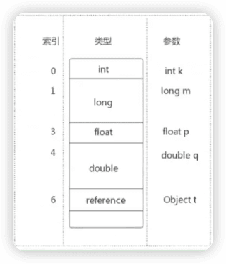

举例：

```java
public void foo(long l, float f) {
  {
    int i = 0;
  }
  {
    String s = "Hello,world";
  }
}
```


不同作用域i和s槽位复用。

在栈帧中，与性能调优关系最为密切的部分就是局部变量表。<u>局部变量表中的变量也是重要的垃圾回收根节点，只要被局部变量表中直接或间接引用的对象都不会被回收。</u>


在方法执行时，虚拟机使用局部变量表完成方法的传递。


#### 1 局部变量压栈指令

局部变量压栈指令**将给定的局部变量表中的数据压入操作数栈**。

这类指令大体可以分为：

- `xload_<n>`(x为i、l、f、d、a，n为0到3）

- `xload` (x为i、l、f、d、a）

说明：在这里，x的取值表示数据类型。

指令xload_n表示将第n个局部变量压入操作数栈，比如iload_1、fload_0、aload_0等指令。其中aload_n表示将一个对象引用压栈。

指令xload通过指定参数的形式，把局部变量压入操作数栈，当使用这个命令时，表示局部变量的数量可能超过了4个，比如指令iload、fload等。

```java
    // 1.局部变量压栈指令
    public void load(int num, Object obj, long count, boolean flag, short[] arr) {
        System.out.println(num);
        System.out.println(obj);
        System.out.println(count);
        System.out.println(flag);
        System.out.println(arr);
    }
```


#### 2 常量入栈指令

常量入栈指令的功能是将常数压入操作数栈，根据数据类型和入栈内容的不同，又可以分为const系列、push系列和ldc指令。

- **指令const系列**：用于对**特定**的常量入栈，入栈的常量隐含在指令本身里。指令有：`iconst_<i＞`（之从-1到5，不是索引是具体数值）、`lconst_<1>`（l从0到1）、`fconst_<f>`（f从0到2）、`dconst_<d>`（d从0到1)、`aconst_null`。比如，
  + iconst_m1将-1压入操作数栈：
  + iconst_x（x为0到5） 将x压入栈；
  + lconst_e、lconst_1分别将长整数0和1压入栈；
  + fconst_0、fconst_1、fconst_2分别将浮点数0、1、2压入栈；
  + dconst_0和dconst_1分别将double型e和1压入栈；
  + aconst_null将null压入操作数栈；

从指令的命名上不难找出规律，指令助记符的第一个字符总是喜欢表示数据类型，i表示整数，l表示长整数，f表示浮点数，d表示双精度浮点，习惯上用a表示对象引用。如果指令隐含操作的参数，会以下划线形式给出。

```java
int i = 3;   iconst_3
int j = 6; 	 bipush 6
```

- **指令push系列**：主要包括`bipush`和`sipush`。它们的区别在于按收数据类型的不同，bipush按收8位整数作为参数，sipush接收16位整数，它们都将参数压入栈。

- **指令ldc系列**：如果以上指令都不能满足需求，那么可以使用万能的ldc指令，它可以接收一个8位的参数，该参数指向常量池中的int、float或者String的索引．将指定的内容压入堆栈。类似的还有`ldc_w`，它接收两个8位参数，能支持的素引范围大于ldc。如果要压入的元素是1ong或者double类型的，则使用`ldc2_w`指令，使用方式都是类似的。

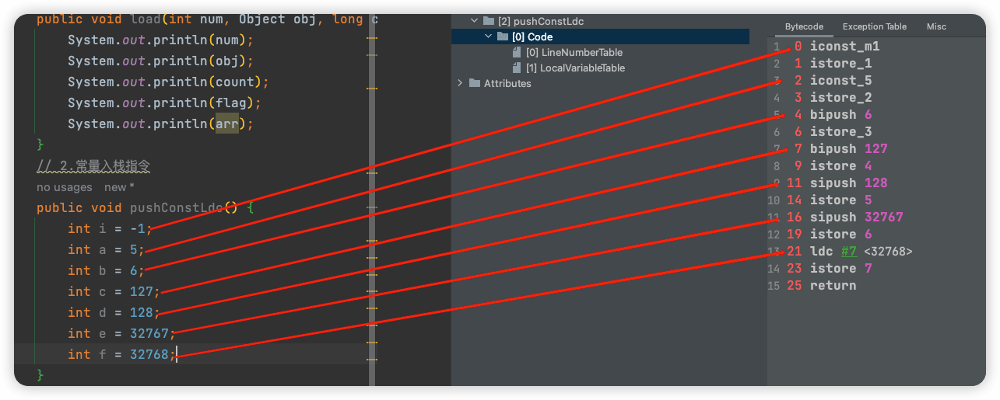

总结如下：


#### 3 出栈装入局部变量表指令

出栈装入局部变量表指令用于将操作数栈中栈顶元素弹出后，装入局部变量表的指定位置，用于给局部变量赋值。

这类指令主要以store的形式存在，比如xstore (x为i、l、f、d、a）、xstore_n(x为i、1，f、d、a，n为0至3）。

- 其中，指令istore_n将从操作数栈中弹出一个整数，并把它赋值给局部变量索引n位置。
- 指令xstore由于没有隐含参数信息，故需要提供一个byte类型的参数类指定目标局部变量表的位置。

说明：

==一般说来，类似像store这样的命令需要带一个参数，用来指明将弹出的元素放在局部变量表的第几个位置==。但是，为了尽可能压缩指令大小，使用专门的istore_1指令表示将弹出的元素放置在局部变量表第1个位置。类似的还有istore_0、istore_2、istore_3，它们分别表示从操作数栈顶弹出一个元素，存放在局部变量表第0、2、3个位置。

由于局部交量表前几个位置总是非常常用，因此==这种做法虽然增加了指令数量，但是可以大大压缩生成的字节码的体积==。如果局部变量表很大，需要存储的档位大于3，那么可以使用istore指令，外加一个参数，用来表示需要存放的槽位位置。


### 2.3 算术指令

🔖 // TODO p245

### 2.4 类型转换指令


#### 1 宽化类型转换


#### 2 窄化类型转换


### 2.5 对象的创建与访问指令


#### 1 创建指令


#### 2 字段访问指令


#### 3 数组操作指令


#### 4 类型检查指令


### 2.6 方法调用与返回指令


#### 1 方法调用指令


#### 2 方法返回指令

### 2.7 操作数栈管理指令


### 2.8 控制转移指令

#### 1 条件跳转指令


#### 2 比较条件跳转指令


#### 3 多条件分支跳转


#### 4 无条件跳转

### 2.9 异常处理指令


#### 1 抛出异常指令


#### 2 异常处理与异常表


### 2.10 同步控制指令

#### 1 方法级的同步


#### 2 方法内指定指令序列的同步

## 3 类的加载过程（类的生命周期）

P266

### 3.1 概述

在Java中数据类型分为基本数据类型和引用数据类型。==基本数据类型由處拟机预先定义，引用数据类型则需要进行类的加载。==

按照Java虚拟机规范，从class文件到加载到内存中的类，到类卸载出内存为止，它的整个生命周期包括如下7个阶段：


其中，验证、淮备、解析 3个部分统称为链接 (Linking）。

从程序中类的使用过程看：

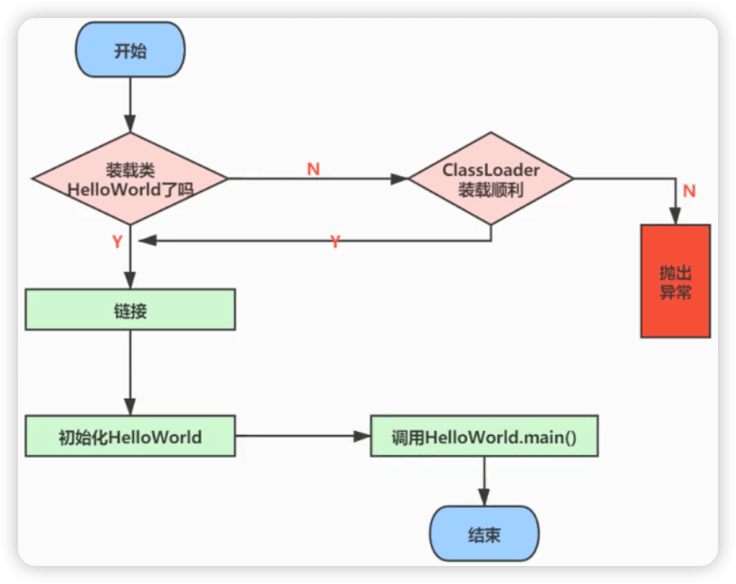

> 链接：默认赋值，符号应用改为直接引用
>
> 初始化：静态字段显示赋值

> 大厂面试题
>
> 蚂蚁金服：
>
> 描述一下 JVM 加载 Class 文件的原理机制？
>
> 一面：类加载过程
>
> 
>
> 百度：
>
> 类加载的时机
>
> java 类加载过程？
>
> 简述 java 类加载机制？
>
> 
>
> 勝讯：
>
> JvM中类加载机制，类加载过程？
>
> 
>
> 滴滴：
>
> JVM类加载机制
>
> 
>
> 美团：
>
> Java类加载过程
>
> 描述一下jvm加载class文件的原理机制
>
> 
>
> 京东：
>
> 什么是类的加载？
>
> 哪些情况会触发类的加载？
>
> 讲一下JVM加载一个类的过程
>
> JVM的类加载机制是什么？

### 3.2 过程一：Loading（加载）阶段

#### 1 加载完成的操作

**加载的理解**

所谓加载，简而言之就是**将Java类的字节码文件加载到机器内存中，并在内存中构建出Java类的原型 —— ==类模板对象==**。所谓类模板对象，其实就是Java类在JVM内存中的一个快照，JVM将从字节码文件中解析出的常量池、类字段、类方法等信息存储到类模板中，这样JVM在运行期便能通过类模板而获取Java类中的任意信息，能够对Java类的成员变量进行遍历，也能进行Java方法的调用。

反射的机制即基于这一基础。如果JVM没有将Java类的声明信息存储起来，则JVM在运行期也无法反射。

**加载完成的操作**

加载阶段，简言之，查找并加载类的二进制数据，生成Class的实例。

在加载类时，Java虚拟机必须完成以下3件事情：

- 通过类的全名，获取类的二进制数据流。
- 解析类的二进制数据流为方法区内的数据结构（Java类模型）
- 创建java.lang.Class类的实例，表示该类型。作为方法区这个类的各种数据的**访问入口**

#### 2 二进制流的获取方式

对于类的二进制数据流，虚拟机可以通过多种途径产生或获得。（只要所读取的字节码符合JVM规范即可）

- 虛拟机可能通过文件系统读入一个class后缀的文件**（最常见）**
- 读入jar、zip等归档数据包，提取类文件。
- 事先存放在数据库中的类的二进制数据
- 使用类似于HTTP之类的协议通过网络进行加载
- 在运行时生成一段Class的二进制信息等

在获取到类的二进制信息后，Java虚拟机就会处理这些数据，在方法区生成类结构(类模板对象)，在堆区生成一个java.lang.Class的实例指向类模板。

如果输入数据不是ClassFile的结构，则会拋出`ClassFormatError`。

#### 3 类模型与Class实例的位置

- 类模型的位置

加载的类在JVM中创建相应的类结构，类结构会存储在方法区(JDK1.8之前：永久代：JDK1.8及之后：元空间)。

- Class实例的位罝

类将.class文件加载至元空间后，会在堆中创建一个Java.lang.Class对象，用来封装类位于方法区内的数据结构，Class对象是在加载类的过程中创建的，每个类都对应有一个Class类型的对象。（instanceKlass --> mirror：Class的实例）

- 图示


外部可以通过访问代表order类的Class对象来获取Order的类数据结构。

- 再说明

Class类的构造方法是私有的，只有JVM能够创建。

java.lang.Class实例是访问类型元数据的接口，也是实现反射的关键数据、入口。通过Class类提供的接口，可以获得目标类所关联的.Class文件中具体的数据结构：方法、字段等信息。

#### 4 数组类的加载

创建数组类的情况稍微有些特殊，因为==数组类本身并不是由类加载器负责创建==，而是由JVM在运行时根据需要而直接创建的，但数组的元素类型仍然需要依靠类加载器去创建。创建数组类（下述简称A）的过程：

1. 如果数组的元素类型是引用类型，那么就遵循定义的加载过程递归加载和创建数组A的元素类型；

2. JVM使用指定的元素类型和数组维度来创建新的数组类。

如果数组的元素类型是引用类型，数组类的可访问性就由元素类型的可访问性决定。否则数组类的可访问性将被缺省定义为public。


### 3.3 过程二：Linking（链接）阶段

#### 环节1：链接阶段之Verification（验证）

当类加载到系统后，就开始链接操作，验证是链接操作的第一步。

它的目的是==保证加载的字节码是合法、合理并符合规范的==。

验证的步骤比较复杂，实际要验证的项目也很繁多，大体上Java虚拟机需要做以下检查：


**整体说明：**

验证的内容则涵盖了类数据信息的格式验证、语义检查、字节码验证，以及符号引用验证等。

- 其中==格式验证会和加载阶段一起执行==。验证通过之后，类加载器才会成功将类的二进制数据信息加载到方法区中。
- ==格式验证之外的验证操作将会在方法区中进行==。

链接阶段的验证虽然拖慢了加载速度，但是它避免了在字节码运行时还需要进行各种检查。（磨刀不误砍柴工）


**具体说明：**

1. ==格式验证==：是否以魔数 OxCAFEBABE升头，主版本和副版本号是否在当前java虛拟机的支持范国内，数据中每一个项是否都拥有正确的长度等。
2. Java虚拟机会进行字节码的==语义检查==，但凡在语义上不符合规范的，虚拟机也不会给予验证通过。比如：
   - 是否所有的类都有父类的存在(在Java里，除了Object外，其他类都应该有父类）
   - 是否一些被定义为final的方法或者类被重写或继承了
   - 非抽象类是否实现了所有抽象方法或者接口方法
   - 是否存在不兼容的方法(比如方法的签名除了返回值不同，其他都一样，这种方法会让虛拟机无从下手调度：abstract情況下的方法，就不能是final的了）

3. Java虚拟机还会进行==字节码验证==，字节码验证也是==验证过程中最为复杂的一个过程==。它试图通过对字节码流的分析，判断字节码是否可以被正确地执行。比如：
   + 在字节码的执行过程中，是否会跳转到一条不存在的指令
   + 函数的调用是否传递了正确类型的参数
   + 变量的赋值是不是给了正确的数据类型等

**==栈映射帧(StackMapTable）==**🔖就是在这个阶段，用于检测在特定的字节码处，其局部变量表和操作数栈是否有者正确的数据类型。但遗憾的是，100%准确地判断一段字节码是否可以被安全执行是无法实现的，因此，该过程只是尽可能地检查出可以预知的明显的问题。如果在这个阶段无法通过检查，虛拟机也不会正确装载这个类。但是，如果通过了这个阶段的检查，也不能说明这个类是完全没有问题的。

<u>在前面3次检查中，已经排除了文件格式错误、语义错误以及宇节码的不正确性。但是依然不能确保类是没有问题的。</u>

4．校验器还将进行==符号引用的验证==。Class文件在其常量池会通过字符串记录自己将要使用的其他类或者方法。因此，在验证阶段，==虚拟机就会检查这些类或者方法确实是存在的==，并且当前类有权限访问这些数据，如果一个需要使用类无法在系统中找到，则会抛出`NoClassDefFoundError`，如果一个方法无法被找到，则会地出`NoSuchmethodError`。

此阶段在解析坏节才会执行。

#### 环节2：链接阶段之Perparation（准备）

淮备阶段(Preparation)，简言之，==为类的静态变量分配内存，并将其初始化为默认值==。

当一个类验证通过时，虚拟机就会进入准备阶段。在这个阶段，虚拟机就会为这个类分配相应的内存空问，并设置默认初始值。

Java虚拟机为各类型变量默认的初始值如表所示。


Java并不支持boolean类型，对于boo1ean类型，内部实现是int，由于int的默认值是日，故对应的，boolean的默认值就是false。

注意：

1. <u>这里不包含基本数据类型的字段用static final修饰的情况，因为final在编译的时候就会分配了，准备阶段会显式赋值。</u>
2. 注意这里不会为实例变量分配初始化，类变量会分配在方法区中，而实例变量是会随着对象一起分配到Java堆中。
3. 在这个阶段并不会像初始化阶段中那样会有初始化或者代码被执行。


#### 环节3：链接阶段之Resolution（解析）

在准各阶段完成后，就进入了解析阶段。

解析阶段(Resolution)，简言之，==将类、接口、字段和方法的符号引用转为直接引用==。

1. 具体描述：

符号引用就是一些字面量的引用，和虚拟机的内部数据结构和和内存布局无关。比较容易理解的就是在Class类文件中，通过常量池进行了大量的符号引用。但是在程序实际运行时，只有符号引用是不够的，比如当如下println()方法被调用时，系统需要明确知道该方法的位置。

举例：输出操作System.out.println()对应的字节码：

```java
invokevirtual #24 <java/io/Printstream.println>
```

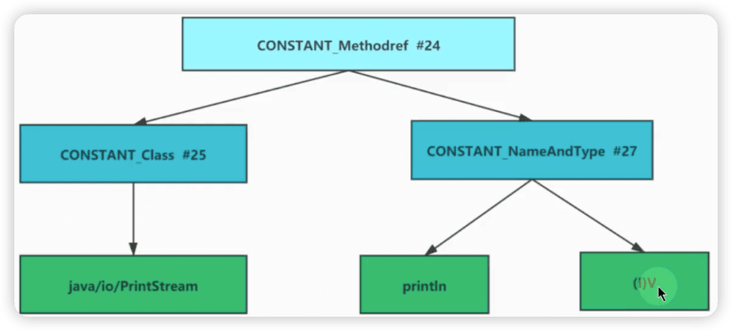

以方法为例，Java虚拟机为每个类都准备了一张==方法表==，将其所有的方法都列在表中，当需要调用一个类的方法的时候，只要知道这个方法在方法表中的偏移量就可以直接调用该方法。通过解析操作，符号引用就可以转变为目标方法在类中方法表中的位置，从而使得方法被成功调用。

2. 小结：

所谓解析就是将符号引用转为直接引用，也就是得到类、字段、方法在内存中的==指针或者偏移量==。因此，可以说，如果直接引用存在，那么可以肯定系统中存在该类、方法或者字段。但只存在符号引用,不能确定系统中一定存在该结构。

不过Java虚拟机规范并没有明确要求解析阶段一定要按照顺序执行。在Hotspot VM中，<u>加载、验证、准备和初始化会按照顺序有条不紊地执行，但链接阶段中的解析操作往往会伴随者JVM在执行完初始化之后再执行。</u>

3．字符串的复习

最后，再来看一下CONSTANT_String的解析。由于字行串在程序开发中有者重要的作用，因此，读者有必要了解一下String在Java虚拟机中的处理。==当在Java代码中直接使用字符串常量时，就会在类中出现CONSTANT_String==，它表字符串常量，并且会引用一个CONSTANT_UTF8的常量项。==在Java虚拟机内部运行中的常量池中，会维护一张字符串拘留表(intern），它会保存所有出现过的字待串常量，并且没有重复项==。只要以CONSTANT_String形式出现的字符串也都会在这张表中。使用String.intern()方法可以得到一个字符串在拘留表中的引用，因为该表中没有重复项，所以任何字面相同的宇符串的String.intern()方法返回总是相等的。

### 3.4 过程三：Initiation（初始化）阶段

初始化阶段，简言之，==为类的静态变量赋子正确的初始值==（显示赋值）。

1. 具体描述

类的初始化是类装载的最后一个阶段。如果前面的步骤都没有问题，那么表示类可以顺利装载到系统中。此时，类才会开始执行Java字节码。（即：==到了初始化阶段，才真正开始执行类中定义的Java程序代码。==）

初始化阶段的重要工作是执行类的初始化方法：`<clinit>()`方法。

- 该方法仅能由Java编译器生成并由JVM调用，程序开发者无法自定义一个同名的方法，更无法直接在Java程序中调用该方法，虽然该方法也是由字节码指令所组成。
- 它是由<u>类静态成员的赋值语句以及static语句块</u>合并产生的。

2. 说明

- 在加载一个类之前，虚拟机总是会试图加载该类的父类，因此父类的`<clinit>`总是在子类`<llinit>`之前被调用。也就是说，父类的static块优先级高于子类。

  > 口诀：由父及子，静态先行

- Java编译器并不会为所有的类都产生`<clinit>()`初始化方法。哪些类在编译为字节码后，字节码文件中将不会包含`<clinit>()`方法？
  - 一个类中并没有声明任何的类变量，也没有静态代码块时
  -  一个类中声明类变量，但是没有明确使用类变量的初始化语句以及静态代码块来执行初始化操作时
  - 一个类中包含static final修饰的基本数据类型的字段，这些类字段初始化语句采用编译时常量表达式

#### static和final的搭配问题

```java
/**
 * 说明：使用static + final修饰的字段的显示赋值操作，到底是在哪个阶段进行的赋值？
 *   情况1：在链接阶段的准备环节赋值
 *   情况2：在初始化阶段<clinit>()中赋值
 *
 * 结论：
 * 在链接阶段的准备环节赋值的情况：
 *   1. 对于基本数据类型的字段来说，如果static+final修饰，则显式赋值（直接赋值常量，而非调用方法）通常在链接阶段的准备环节进行
 *   2. 对于String来说，如果使用字面量的方式复制，使用static+final修饰，则显示赋值通常是在链接阶段的准备环境进行
 *
 * 最终结论：使用static+final修饰，且显示赋值中不涉及到方法或构造器调用的基本数据类型或String类型的显示赋值（字面量），是在链接阶段的准备环境进行。
 * @author andyron
 **/
public class InitializationTest2 {
    public static int a = 1; // 在初始化阶段<clinit>()中赋值
    public static final int INT_CONSTANT = 10; // 在链接阶段的准备环节赋值

    public static final Integer INTEGER_CONSTANT1 = Integer.valueOf(100); // 在初始化阶段<clinit>()中赋值
    public static Integer INTEGER_CONSTANT2 = Integer.valueOf(1000); // 在初始化阶段<clinit>()中赋值

    public static final String s0 = "helloworld0"; // 在链接阶段的准备环节赋值
    public static final String s1 = new String("helloworld1"); // 在初始化阶段<clinit>()中赋值

    public static String s2 = "helloworld2";

    public static final int NUM2 = new Random().nextInt(10); // 在初始化阶段<clinit>()中赋值
}

```


最终结论：使用static+final修饰，且显示赋值中不涉及到方法或构造器调用的基本数据类型或String类型的显示赋值（字面量），是在链接阶段的准备环境进行。其它在`<clinit>()`中赋值。

#### `<clinit>()`的线程安全性

对于`<clinit>()`方法的调用，也就是类的初始化，虚拟机会在内部确保其多线程环境中的安全性。

虚拟机会保证一个类的`<clinit>()`方法在多线程坏境中被正确地加锁、同步，如果多个线程同时去初始化一个类，那么只会有一个线程去执行这个类的`<clinit>()`方法，其他线程都需要阻塞等待，直到活动线程执行`<clinit>()`方法完毕。

正是因为函数`<clinit>()`带锁线程安全的，因此，如果在一个类的`<clinit>()`方法中有耗时很长的操作，就可能造成多个线程阻塞，引发死锁。并且这种死锁是很难发现的，因为看起来它们并没有可用的锁信息。

如果之前的线程成功加载了类，则等在队列中的线程就没有机会再执行`<clinit>()`方法了。那么，当需要使用这个类时，虚拟机会直接返回给它已经准备好的信息。

```java
/**
 * 死锁
 * StaticA 和 StaticB 交叉加载
 * @author andyron
 **/
class StaticA {
    static {
        try {
            Thread.sleep(1000);
        } catch (InterruptedException e) {
        }
        try {
            Class.forName("com.andyron.java1.StaticB");
        } catch (ClassNotFoundException e) {
            e.printStackTrace();
        }
        System.out.println("StaticA init Ok");
    }
}
class StaticB {
    static {
        try {
            Thread.sleep(1000);
        } catch (InterruptedException e) {
        }
        try {
            Class.forName("com.andyron.java1.StaticA");
        } catch (ClassNotFoundException e) {
            e.printStackTrace();
        }
        System.out.println("StaticB init Ok");
    }
}
public class StaticDeadLockMain extends Thread {
    private char flag;

    public StaticDeadLockMain(char flag) {
        this.flag = flag;
        this.setName("Thread" + flag);
    }

    @Override
    public void run() {
        try {
            Class.forName("com.andyron.java1.Static" + flag);
        } catch (ClassNotFoundException e) {
            e.printStackTrace();
        }
        System.out.println(getName() + " over");
    }

    public static void main(String[] args) throws InterruptedException {
        StaticDeadLockMain loadA = new StaticDeadLockMain('A');
        loadA.start();
        StaticDeadLockMain loadB = new StaticDeadLockMain('B');
        loadB.start();
    }
}
```


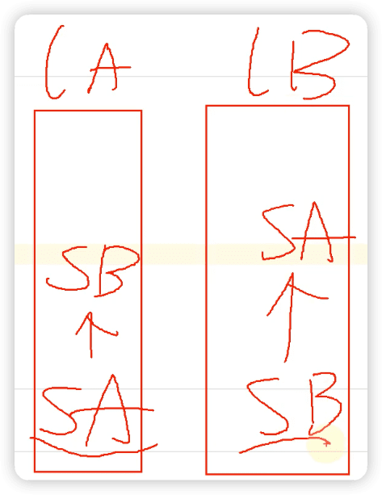

#### 类的初始化情况：主动便用vs被动使用

Java程序对类的使用分为两种：主动使用 和 被动使用。

##### 1️⃣主动使用

Class只有在必须要首次使用的时候才会被装载，Java虚拟机不会无条件地裝载Class类型。Java虚拟机规定，一个类或接口在初次使用前，必须要进行初始化。这里指的 “使用”，是指主动使用，主动使用只有下列几种情况：（即：<u>如果出现如下的情況，则==会对类进行初始化操作==</u>。而初始化操作之前的加载、验证、淮备己经完成。〕

1. 当创建一个类的实例时，比如使用new关键字，或者通过反射、克隆、反序列化。
2. 当调用类的静态方法时，即当使用了字节码`invokestatic`指令。
3. 当使用类、接口的静态字段时(final修饰特殊考虑），比如，使用`getstatic`或者`putstatic`指令。（对应访问变量、赋值变量操作）
4. 当使用java.lang.reflect包中的方法反射类的方法时。比如：`Class.forName("com.andyron.java.Test")`
5. 当初始化子类时，如果发现其父类还没有进行过初始化，则需要先触发其父类的初始化。
6. 如果一个接口定义了default方法，那么直接实现或者间接实现该接口的类的初始化，该接口要在其之前被初始化。

7. 当虚拟机启动时，用户需要指定一个要执行的主类（包含main(）方法的那个类），虛拟机会先初始化这个主类。
8. 当初次调用 `MethodHandle` 实例时，初始化该 MethodHandle指向的方法所在的类。(涉及解析REF_getstatic、 REF_putStatic、REF_invokestatic方法句柄对应的类）

针对5，补充说明：

当Java虚拟机初始化一个类时，要求它的所有父类都已经被初始化，但是这条规则并不适用于接口。

- 在初始化一个类时，并不会先初始化它所实现的接口

- 在初始化一个接口时，并不会先初始化它的父接口

因此，一个父接口并不会因为它的子接口或者实现类的初始化而初始化。只有当程序首次使用特定接口的静态字段时，才会导致该接口的初始化。


针对7，说明：

JVM启动的时候通过引导类加载器加载一个初始类。这个类在调用public static void main(string [】)方法之前被链按和初始化。这个方法的执行将依次导致所需的类的加载，链接和初始化。

> 总结：有上面8种情况就是主动使用，就会进行初始化过程，调用`<clinit>()`。

##### 2️⃣被动使用

除了以上的情况属于主动使用，其他的情况均属于被动使用。被动使用==不会引起类的初始化==。

也就是说：<u>并不是在代码中出现的类，就一定会被加载或者初始化。如果不符合主动使用的条件，类就不会初始化。</u>

1. 当访问一个静态字段时，只有真正声明这个字段的类才会被初始化。

   当通过子类引明父类的静态变量，不会导致子类初始化。

   > 说明：没有初始化的类，不意味着没有加载！

2. 通过数组定义类引用，不会触发此类的初始化。具体new类是才会进行初始化。

   ```java
   Parent[] parents = new Parent[10];  // 定义时没有初始化
   System.out.println(parents.getClass());
   System.out.println(parents.getClass().getSuperclass());
   
   parents[0] = new Parent();  // 初始化
   ```

   

3. 引用常量不会触发此类或接口的初始化。因为常量在链接阶段就己经被显式赋值了。

4. 调用ClassLoader类的loadClass(）方法加载一个类，并不是对类的主动使用，不会导致类的初始化。


> 设置参数`-XX:+TraceClassLoading`，可以追中类的加载信息并打印（查看加载了哪些类）。
>
> 使用junit时，可以修改器模板参数：
>
> 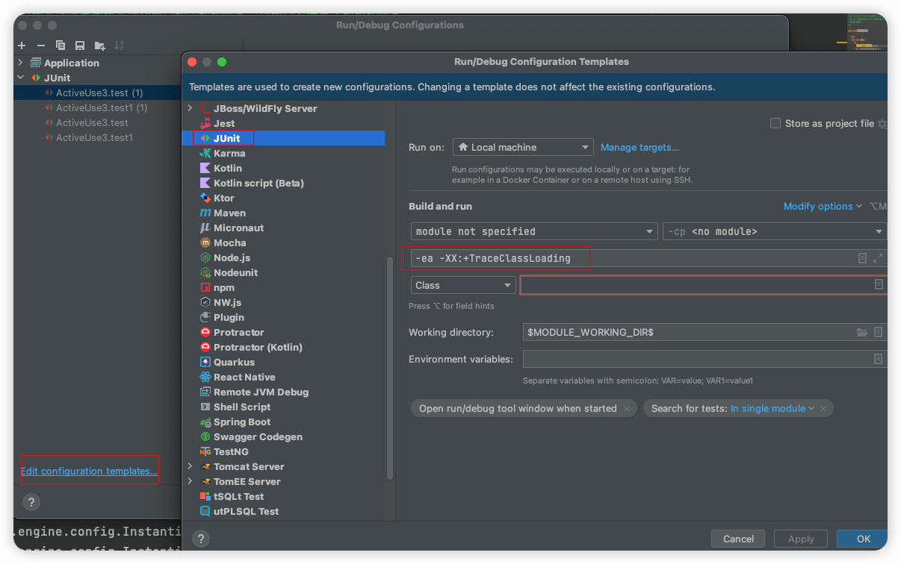

```java
// 被动使用
ClassLoader.getSystemClassLoader().loadClass("com.andyron.java1.Person");

// 主动使用
Class.forName("com.andyron.java1.Order");
```


### 3.5 过程四：类的Using（使用）

任何一个类型在使用之前都必领经历过完整的加载、链接和初始化3个类加载步骤。一旦一个类型成功经历过这了个步骤之后，便“万事俱备，只欠东风”，就等着开发者使用了。

开发人员可以在程序中访问和调用它的静态类成员信息（比如：静态字段、静态方法），或者使用new关键字为其创建对象实例。

### 3.6 过程五：类的Unloading（卸载）

#### 一、类、类的加载器、类的实例之问的引用关系

在类加载器的内部实现中，用一个Java集合来存放所加载类的引用。另一方面，一个Class对象总是会引用它的类加载器，调用Class对象的getClassLoader()方法，就能获得它的类加载器。由此可见，代表某个类的Class实例与其类的加载器之间为==双向关联关系==。

一个类的实例总是引用代表这个类的Class对象。在0bject类中定义了getClass(）方法，这个方法返回代表对象所属类的Class对象的引用。此外，所有的Java类都有一个静态属性Class，它引用代表这个类的Class对象。

#### 二、类的生命周期

当Sample类被加载、链接和初始化后，它的生命周期就开始了。当代表Sample类的Class对象不再被引用，即不可触及时，Class对象就会结束生命周期，Sample类在方法区内的数据也会被卸载，从而结束Sample类的生命周期。

==一个类何时结束生命周期，取决于代表它的Class对象何时结束生命周期。==

#### 三、具体例子

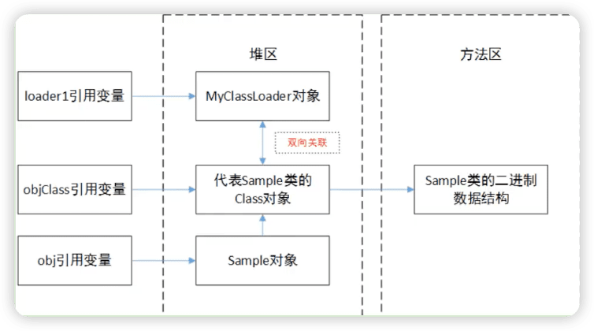

loader1变量和obj变量间接引用代表Sample类的Class对象，而objClass变量则直接引用它。

如果程序运行过程中，将上图左侧三个引用变量都罝为nu11，此时Sample对象结束生命周期，MyClassLoader对象结束生命周期，代表Sample类的Class对象也结束生命周期，Sample类在方法区内的二进制数据被卸载。

当再次有需要时，会检查Sample类的CLass对象是否存在，如果存在会直接使用，不再重新加载：如果不存在Sample类会被重新加载，在Java虚拟机的堆区会生成一个新的代表Sample类的Class实例（可以通过哈希码查看是否是同一个实例）。

#### 四、类的卸载

1. 启动类加载器加载的类型在整个运行期间是不可能被卸载的(jvm和jls规范）。

2. 被系统类加载器和扩展类加载器加载的类型在运行期间也不太可能被卸载，因为系统类加载器实例或者扩展类的实例基本上在整个运行期间,总能直接或者间接的访问的到，其达到unreachable的可能性极小。
3. 被开发者自定义的类加载器实例加载的类型只有在很简单的上下文环境中才能被卸载，而且一般还要借助于强制调用虚拟机的垃圾收集功能才可以做到。可以预想，稍微复杂点的应用场最中(比如：很多时候用户在开发自定义类加载器实例的时候采用缓存的策略以提高系统性能），被加载的类型在运行期间也是几乎不太可能被卸载的(至少卸载的时间是不确定的）。

综合以上三点，一个已经加载的类型被卸载的几率很小至少被卸载的时间是不确定的。同时我们可以看的出来，开发者在开发代码时候，不应该对虚拟机的类型卸载做任何假设的前提下，来实现系统中的特定功能。


#### 回顾：方法区的垃圾回收

方法区的垃圾收集主要回收两部分内容：==常量池中废弃的常量==和==不再使用的类型==。

Hotspot虚拟机对常量池的回收策略是很明确的，只要常量池中的常量没有被任何地方引用，就可以被回收。

判定一个常量是否 “废弃〞 还是相对简单，而要判定一个类型是否属于 “不再被使用的类”的条件就比较苛刻了。需要同时满足下面三个条件：

- 该类所有的实例都己经被回收。也就是Java堆中不存在该类及其任何派生子类的实例。
- 加载该类的类加载器己经被回收。这个条件除非是经过精心设计的可替换类加载器的场景，如OsGi、JSP的重加载等，否则通常是很难达成的。
- 该类对应的java.lang.Class对象没有在任何地方被引用，无法在任何地方通过反射访问该类的方法。

Java虚拟机被允许对满足上述三个条件的无用类进行回收，这里说的<u>仅仅是“被允许”</u>，而并不是和对象一样，没有引用了就必然会回收。

## 4 再谈类的加载器

P283

### 4.1 概述

类加载器是JVM 执行类加载机制的前提。

Classloader的作用：

ClassLoader是Java的核心组件，所有的Class都是由ClassLoader进行加载的，ClassLoader负责通过各种方式将Class信息的二进制数据流读入JVM内部，转换为一个与目标类对应的java.lang. Class对象实例。然后交给Java虚拟机进行链接、初始化等操作。因此，ClassLoader在整个装载阶段，只能影响到类的加载，而无法通过ClassLoader去改变类的链接和初始化行为。至于它是否可以运行，则由Execution Engine決定。


> 面试题
>
> 蚂蚁金服：
>
> 深入分析CIassLoader，双亲委派机制
>
> 类加载器的双亲委派模型是什么？
>
> 一面：双亲委派机制及使用原因
>
> 百度：
>
> 都有哪些类加载器，这些类加载器都加载哪些文件？
>
> 手写一个类加载器Demo
>
> Class的forName ("java.lang.string")和 Class的getClassLoader(）的loadClass(“java.lang .string”)有什么区别？
>
> 腾讯：
>
> 什么是双亲委派模型？
>
> 类加载器有哪些？
>
> 小米：
>
> 双亲委派模型介绍一下
>
> 滴滴：
>
> 简单说说你了解的类加载器
>
> 一面：讲一下双亲委派模型，以及其优点
>
> 字节跳动：
>
> 什么是类加载器，类加载器有哪些？
>
> 京东：
>
> 类加载器的双亲委派模型是什么？
>
> 双亲委派机制可以打破吗？为什么

#### 类的加载分类：显式（主动）加载 vs 隐式加载

class文件的显式加载与隐式加载的方式是指JVM加载class文件到内存的方式。

- 显式加载指的是在代码中通过调用ClassLoader加载class对象，如直接使用Class.forName (name)或this.getclass().getClassLoader().loadCIass()加载class对象。
- 隐式加载则是不直接在代码中调用ClassLoader的方法加载class对象，而是通过虚拟机自动加载到内存中，如在加载某个类的class交件时，该类的class文件中引用了另外一个类的对象，此时额外引用的类将通过JVM自动加载到内存中。

在目常开发以上两种方式一般会混合使用。

```java
User user = new User();  // 隐式加载

try {
  Class<?> clazz = Class.forName("com.andyron.java.User"); // 显式加载
  ClassLoader.getSystemClassLoader().loadClass("com.andyron.java.User");  // 显式加载
} catch (ClassNotFoundException e) {
  e.printStackTrace();
}
```


#### 类载器的必要性

一般情况下，Java开发人员并不需要在程序中显式地使用类加载器，但是了解类加载器的加载机制却显得至关重要。从以下几个方面说：

- 避免在开发中遇到 `java.lang.ClassNotFoundException`异常或`java.lang.NoCIassDefFoundError`异常时，手足无措。只有了解类加载器的加载机制才能够在出现异常的时候快速地根据错误异常目志定位问题和解决问题
- 需要支持类的动态加载或需要对编译后的字节码文件进行加解密操作时，就需要与类加载器打交道了。
- 开发人员可以在程序中编写自定义类加载器来重新定义类的加载规则，以便实现一些自定义的处理逻辑。

#### 命名空间

1. 何为类的唯一性？

对于任意一个类，都需要由加载它的类加载器和这个类本身一同确认其在Java虚拟机中的唯一性。==每一个类加载器，都拥有一个独立的类名称空间==：**比较两个类是否相等，只有在这两个类是由同一个类加载器加载的前提下才有意义**。否则，即使这两个类源自同一个Class文件，被同一个虚拟机加载，只要加载他们的类加载器不同，那这两个类就必定不相等。

2. 命名空间

- 每个类加载器都有自己的命名空间，命名空间由该加载器及所有的父加载器所加载的类组成
- 在同一命名空间中，不会出现类的完整名字（包括类的包名）相同的两个类
- 在不同的命名空间中，有可能会出现类的完整名字（包括类的包名）相同的两个类

在大型应用中，我们往往借助这一特性，来运行同一个类的不同版本。

Tomcat

#### 类加载机制的基本特征

通常类加载机制有三个基本特征：

- 双亲委派模型。但不是所有类加载都遵守这个模型，有的时候，启动类加载器所加载的类型，是可能要加载用户代码的，比如JDK内部的`ServiceProvider`/`ServiceLoader`机制，用户可以在标准API框架上，提供自己的实现，JDK也需要提供些默认的参考实现。例如，Java 中JNDI、JDBC、文件系统、Cipher等很多方面，都是利用的这种机制，这种情况就不会用双亲委派模型去加载，而是利用所谓的上下文加载器。

- 可见性，子类加载器可以访问父加载器加载的类型，但是反过来是不允许的。不然，因为缺少必要的隔离，我们就没有办法利用类加载器去实现容器的逻辑。
- 单一性，由于父加载器的类型对于子加载器是可见的，所以父加载器中加载过的类型，就不会在子加载器中重复加载。但是注意，类加载器“邻居”间，同一类型仍然可以被加载多次，因为互相并不可见。

### 4.2 复习：类的加载器分类

JVM支持两种类型的类加载器，分别为==引导类加载器(Bootstrap ClassLoader）==和==自定义类加载器（User-Defined ClassLoader)==。

从機念上来讲，自定义类加载器一般指的是程序中由开发人员自定义的一类类加载器，但是Java虚拟机规范却没有这么定义，而是将所有派生于抽象类ClassLoader的类加载器都划分为自定义类加载器。无论类加载器的类型如何划分，在程序中我们最常见的类加载器结构主要是如下情况：


- 除了顶层的启动类加载器外，其余的类加载器都应当有自己的 “父类加载器。

- 不同类加载器看似是继承(Inheritance）关系，实际上是包含关系。在下层加载器中，包含着上层加载器的引用。

#### 1 引导类加载器

启动类加载器（引导类加载器，Bootstrap ClassLoader)

- 这个类加载使用C/C++语言实现的，嵌套在JVM内部。
- 它用来加载Java的核心库（JAVA_HOME/jre/1ib/rt.jar或sun.boot.class.path路径下的内容）。用于提供JVM自身需要的类。
- 并不继承自java.lang.ClassLoader，没有父加载器。
- 出于安全考虑，Bootstrap启动炎加载器只加载包名为java、javax、sun等开头的类
- 加载扩展类和应用程序类加载器，并指定为他们的父类加载器。

`-XX:+TraceClassLoading`

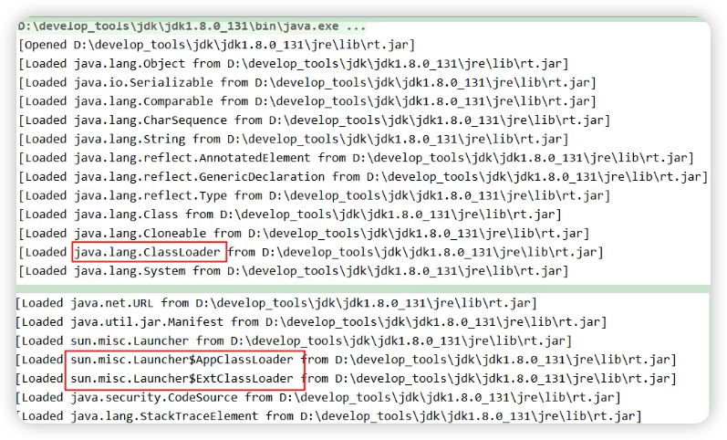

#### 2 扩展类加载器 (Extension ClassLoader)

- Java语言编写，由`sun.misc.Launcher$ExtClassLoadel`实现。

- 继承于ClassLoader类
- 父类加载器为启动类加载器
- 从`java.ext.dirs`系统属性所指定的目录中加载类库，或从JDK的安装目录的jre/lib/ext子目录下加载类库。如果用户创建的JAR放在此目录下，也会自动由扩展类加载器加载。

#### 3 系统类加载器（应用程序类加载器，AppClassLoader）

- java语言编写，由`sun.misc.Launcher$AppClassLoader`实现
- 继承于ClassLoader类
- 父类加载器为扩展类加载器
- 它负责加载环境变量classpath或系统属性 `java.class.path`指定路径下的类库
- ==应用程序中的类加载器默认是系统类加载器。==
- 它是用户自定义类加载器的默认父加载器
- 通过ClassLoader的getSystemClassLoader()方法可以获取到该类加载器

#### 4 用户自定义类加载器

- 在Java的日常应用程序开发中，类的加载几乎是由上述3种类加载器相互配合执行的。在必要时，我们还可以自定义类加载器，来定制类的加载方式。
- 体现Java语言**强大生命力和巨大魅力**的关键因素之一便是，<u>Java开发者可以自定义类加载器来实现类库的动态加载，加载源可以是本地的JAR包，也可以是网络上的远程资源。</u>
- ==通过类加载器可以实现非常绝妙的插件机制==，这方面的实际应用案例举不胜举。例如，著名的OSGI组件框架，再如Eclipse的插件机制。类加载器为应用程序提供了一种动态增加新功能的机制，这种机制无须重新打包发布应用程序就能实现。
- 同时，==自定义加载器能够实现应用隔离==，例如 Tomcat， Spring等中间件和组件框架都在内部实现了自定义的加载器，并通过自定义加载器隔离不同的组件模块。这种机制比C/C++程序要好太多，想不修改C/C++程就能为其新增功能，几乎是不可能的，仅仅一个兼容性便能阻挡住所有美好的设想。
- 自定义类加载器通常需要继承于ClassLoader。


### 4.3 测试不同的类加载器

每个Class对象都会包含一个定义它的ClassLoader的一个引用。

获取ClassLoader的途径：

1. 获得当前类的ClassLoader：`clazz.getClassLoader()`
2. 获得当前线程上下文的ClassLoader： `Thread.currentThread().getContextClassLoader()`
3. 获得系统的ClassLoader：`ClassLoader.getSystemClassLoader()`

说明：

站在程序的角度看，引导类加载器与另外两种类加载器（系统类加教器和扩展类加载器） 并不是同一个层次意义上的加载器，引导类加载器是使用C++语言编写而成的，而另外两种类加载器则是使用Java语言编写而成的。由于引导类加载器压根儿就不是一个java类，因此在java程序中只能打印出空值。


数组类的Class对象，不是由类加载器去创建的，而是<u>在Java运行期JVM根据需要自动创建的</u>。对于数组类的类加载器来说，是通过Class.getclassLoader(）返回的，与数组当中元素类型的类加载器是一样的：<u>如果数组当中的元素类型是基本数据类型，数组类是没有类加载器的</u>。


### 4.4 ClassLoader源码解析

ClassLoader与现有类加载器的关系：


#### ClassLoader的主要方法

抽象类ClassLoader的主要方法：(内部没有抽象方法)

- `public final ClassLoader getParent()`

返回该类加载器的超类加载器


- `public Class<?> loadclass (String name) throws ClassNotFoundException`

加载名称为name的类，返回结果为java.lang.Class类的实例。如果找不到类，则返回 ClassNotFoundException异常。该方法中的逻辑就==是双亲委派模式的实现==。

loadClass()的剖析：

```java
ClassLoader.getSystemClassLoader().loadClass("com.andyron.java.User");
```

```java
// resovle:true 表示加载class的同时进行解析操作
protected Class<?> loadClass(String name, boolean resolve) throws ClassNotFoundException {
   synchronized (getClassLoadingLock(name)) { // 同步操作，保证只能加载一次
     // 首先，在缓存中判断是否已经加载同名的类
     Class<?> c = findLoadedClass(name);
     if (c == null) {
       long t0 = System.nanoTime();
       try {
         // 获取当前类加载器的父类加载器
         if (parent != null) {
           // 如果存在父类加载器，则调用父类加载进行类的加载
           c = parent.loadClass(name, false);
         } else { // parent为null：父类加载是引导类加载器
           c = findBootstrapClassOrNull(name);
         }
       } catch (ClassNotFoundException e) {
         // ClassNotFoundException thrown if class not found
         // from the non-null parent class loader
       }

       if (c == null) { // 当前类的加载器的父类加载器为加载此类 or 当前类的加载器未加载此类
         // 调用当前ClassLoader的findClass，
         long t1 = System.nanoTime();
         c = findClass(name);

         // this is the defining class loader; record the stats
         sun.misc.PerfCounter.getParentDelegationTime().addTime(t1 - t0);
         sun.misc.PerfCounter.getFindClassTime().addElapsedTimeFrom(t1);
         sun.misc.PerfCounter.getFindClasses().increment();
       }
     }
     if (resolve) {
       resolveClass(c);
     }
     return c;
   }
}
```


- `protected Class‹?› findClass(String name) throws ClassNotFoundException`

查找二进制名称为name的类，返回结果为java.lang.Class类的实例。这是一个受保护的方法，JVM鼓励我们重写此方法，需要自定义加载器遵循双亲委托机制，该方法会在检查完父类加载器之后被loadClass()方法调用。

`AppClassLoader`和`ExtClassLoader`的调用的findClass方法是在它们的直接父类`URLClassLoader`中的。

> 在JDK1.2之前，在自定义类加载时，总会去继承ClassLoader类并重写loadClass方法，从而实现自定义的头加载类。但是在JDK1.2之后己不再建议用户去覆盖loadClass()方法（也就是不要破坏双亲委派机制），而是建议把自定义的类加载逻辑写在findClass()方法中，从前面的分析可知，findClass()方法是在LoadClass()方法中被调用的，当loadclass(）方法中父加载器加载失败后，则会调用自己的findClass()方法来完成类加载，这样就可以保证自定义的类加载器也符合双亲委托模式。
>
> 需要注意的是ClassLoader类中并没有实现findClass()方法的具体代码逻辑，取而代之的是抛出ClassNotFoundException异常，同时应该知道的是findClass方法通常是和defineClass方法一起使用的。一般情况下，在自定义类加载器时，会直接覆盖ClassLoader的findclass()方法并编写加载规则，==取得要加载类的字节码后转换成流，然后调用defineClass()方法生成类的Class对象==。

- `protected final Class<?> defineClass(String name, byte[] b, int off, int len)`

根据给定的字节数组b转换为Class的实例，off和len参数表示实际Class信息在byte数组中的位置和长度，其中byte数组b是ClassLoader从外部获取的。这是受保护的方法，只有在自定义ClassLoader子类中可以使用。

> defineClass()方法是用来将byte字节流解析成JVM能够识别的C1ass对象(ClassLoader中己实现该方法逻辑)，通过这个方法不仅能够通过class文件实例化c1ass对象，也可以通过其他方式实例化c1ass对象，如通过网络按收类的字节码，然后转换为byte字节流创建对应的Class对象。
>
> ==defineClass()方法通常与findclass()方法一起使用，一般情况下，在自定义类加载器时，会直接覆盖ClassLoader的findClass()方法并编写加载规则，取得要加载类的字节码后转换成流，然后调用defineClass()方法生成类的Class对象==。

例子：

```java
    @Override
    protected Class<?> findClass(String name) throws ClassNotFoundException {
        // 获取类的class文件字节数组
        byte[] classData = getClassData(name);
        if (classData == null) {
            throw new ClassNotFoundException();
        } else {
            // 直接生成class对象
            return defineClass(name, classData, 0, classData.length);
        }
    }
```

- `protected final void resolveClass (Class<?> c)`

链接指定的一个Java类。使用该方法可以使用类的Class对象创建完成的同时也被解析。前面我们说链接阶段主要是对字节码进行验证，为类变量分配内存并设置初始值同时将字节码文件中的符号引用转换为直接引用。

- `protected final Class‹?› findLoadedClass(String name)`

查找名称为name的己经被加载过的类，返回结果为java.lang.Class类的实例。这个方法是final方法，无法被修改。

- `private final ClassLoader parent;`

它也是一个Classloader的实例，这个字段所表示的ClassLoader也称为这 个ClassLoader的双亲。在类加载的过程中，Classloader可能会将某些请求交子自己的双亲处理。

#### SecureClassLoader与URLClassLoader

接着SecureClassLoader扩展了ClassLoader，新增了几个与使用相关的代码源(对代码源的位置及其证书的验证)和权限定义类验证(主要指对class源码的访问权限)的方法，一般我们不会直接跟这个类打交道，更多是与它的子类URLClassLoader有所关联。

前面说过，ClassLoader是一个抽象类，很多方法是空的没有实现，比如 findClass()、findResource()等。而URLClassLoader这个实现类为这些方法提供了具体的实现。并新增了URLClassPath类协助取得Class字节码流等功能。==在编写自定义类加载器时，如果没有太过于复杂的需求，可以直接继承URLClassLoader类==，这样就可以避免自己去编写findClass()方法及其获取字节码流的方式，使自定义类加载器编写更加简洁。

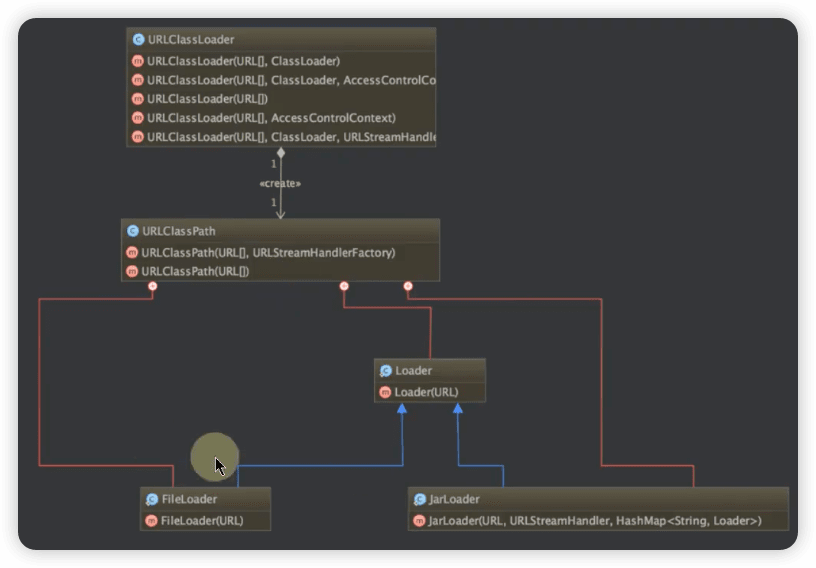

#### ExtClassLoader与Appclasshoader

了解完URLClassLoader后接者看看剩余的两个类加载器，即拓展类加载器ExtClassLoader和系统类加载器AppClassLoader，这两个类都继承自URLClassLoader，是sun.misc.Launcher的静态内部类。sun.misc.Launcher主要被系统用于启动主应用程序，ExtClassLoader和AppClassLoader都是由sun.misc.Launcher创建的，其类主要类结构如下：

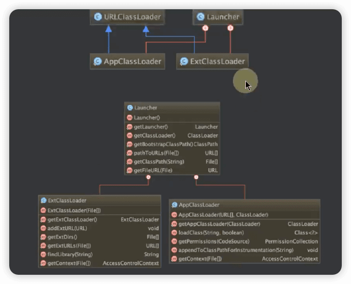

ExtClassLoader并没有重写loadClass()方法，而AppClassLoader虽然重载了loadClass()方法，但最终调用的还是父类loadClass()方法，因此它们都遵守双亲委派模式。

#### Class.forName()与ClassLoader.loadClass()

- Class.forName()：是一个静态方法，最常用的是Class.forName(string className);根据传入的类的全限定名返回一个 Class 对象。==该方法在将 Class 文件加载到内存的同时，会执行类的初始化==。如：`Class.forName ("com.andyron.java.Helloworld");`
- ClassLoader.loadClass()：这是一个实例方法，需要一个 ClassLoader 对象来调用该方法==。该方法将Class 文件加载到内存时，并不会执行类的初始化，直到这个类第一次使用时才进行初始化==。该方法因为需要得到一个Classloader对象，所以可以根据需要指定使用哪个类加载器。如： `ClassLoader c1=....; c1.loadClass("com.andyron.java.Helloworld”);`

### 4.5 双亲委派模型

#### 定义与本质

类加载器用来把类加载到了ava虚拟机中。从JDK1.2版本开始，类的加载过程采用双亲委派机制，这种机制能更好地保证Java平台的安全。

1. 定义

如果一个类加载器在接到加载类的请求时，它首先不会自己尝试去加载这个类，而是把这个请求任务委托给父类加载器去完成，依次递归，如果父类加载器可以完成类加载任务，就成功返回。只有父类加载器无法完成此加载任务时，才自己去加载。

2. 本质

规定了类加载的顺序是：引导类加载器先加载，若加载不到，由扩展类加载器加载，若还加载不到，才会由系统类加载器或自定义的类加载器进行加载。


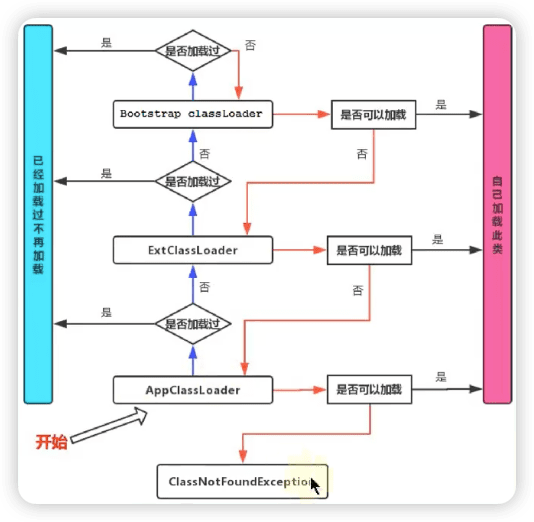

#### 优势与劣势

1. 双亲委派机制优势

- 避免类的重复加载，确保一个类的全局唯一性

  Java类随着它的类加载器一起具备了一种带有优先级的层次关系，通过这种层级关可以避免类的重复加载，当父亲己经加载了该类时，就没有必要子CIassLoader再加载一次。

- 保护程序安全，防止核心API被随意篡改

2. 代码支持

双亲委派机制在 `java.lang.ClassLoader.loadClass(string,boolean)`接口中体现。该接口的逻辑如下：

1️⃣ 先在当前加载器的缓存中查找有无目标类，如果有，直接返回。

2️⃣ 判断当前加载器的父加载器是否为空，如果不为空，则调用parent.loadClass(name, false）接口进行加载。

3️⃣ 反之，如果当前加载器的父类加载器为空，则调用findBootstrapClassOrNull(name)接口，让引导类加载器进行加载。

4️⃣ 如果通过以上3条路径都没能成功加载，则调用findClass(name)接口进行加载。该接口最终会调用java.lang.ClassLoader接口的defineClass系列的native接口加载目标Java类。

双亲委派的模型就隐藏在这第2和第3步中。

3. 举例

假设当前加载的是java. lang.object这个类，很显然，该类属于了DK中核心得不能再核心的一个类，因此一定只能由引导类加载器进行加载。当JVM准备加载javaJang.object时，JVM默认会使用系统类加载器去加载，按照上面4步加载的逻辑，在第1步从系统类的缓存中肯定查找不到该类，于是进入第2步。由于从系统类加载器的父加载器是扩展类加载。

4. 思考

如果在自定义的类加载器中重写java.lang.ClassLoader.loadClass(string)或

java.lang.ClassLoader.loadClass(string，boolean)方法，抹去其中的双亲委派机制，仅保留上面这4步中的第1步与第4步，那么是不是就能够加载核心类库了呢？

这也不行！因为jDK还为核心类库提供了一层保护机制。不管是自定义的类加载器，还是系统类加载器抑或扩展类加载器，最终都必须调用 java.lang.ClassLoader.defineClass(String, byte [], int, int,ProtectionDomain)方法，而该方法会执行==preDefineClass()接口==，该接口中提供了对JDK核心类库的保护。

5. 双亲委托模式的弊端

检查类是否加载的委托过程是单向的，这个方式虽然从结构上说比较清晰，使各个ClassLoader的职责非常明确，但是同时会带来一个问题，即==顶层的ClassLoader无法访问底层的ClassLoader所加载的类==。

通常情况下，启动类加载器中的类为系统核心类，包括一些重要的系统接口，而在应用类加载器中，为应用类。按照这种模式，==应用类访问系统类自然是没有问题，但是系统类访问应用类就会出现问题==。比如在系统类中提供了一个接口，该接口需要在应用类中得以实现，该接口达绑定一个工厂方法，用于创建该接口的实例，而接口和工厂方法都在启动类加载器中。这时，就会出现该工厂方法无法创建由应用类加载器加载的应用实例的问题。🔖

6. 结论：

==由于Java虚拟机规范并没有明确要求类加载器的加载机制一定要使用双亲委派模型，只是建议采用这种方式而己。==

比如在Tomcat中，类加载器所采用的加载机制就和传统的双亲委派模型有一定区别，当缺省的类加载器接收到一个类的加载任务时，首先会由它自行加载，当它加载失败时，才会将类的加载任务委派给它的超类加载器去执行，这同时也是Servlet规范推荐的一种做法。

#### 破坏双亲委派机制

1. 破坏双亲委派机制1

双亲委派模型并不是一个具有强制性约束的模型，而是Java设计者推荐给开发者们的类加载器实现方式。

在Java的世界中大部分的类加载器都遊循这个模型，但也有例外的情况，直到Java模块化出现为止，双亲委派模型主要出现过3次较大规模“被破坏” 的情况。


第一次破坏双亲委派机制：

双亲委派模型的第一次 “被破坏，其实发生 在双亲委派模型出现之前——即了DK 1.2面世以 前的“远古”时代。

由于双亲委派模型在JDK 1.2之后才被引入，但是类加载器的概念和抽象类java. lang.ClassLoader则在Java的第一个版本中就已经存在，面对己经存在的用户自定义类加载器的代码，Java设计者们引入双亲委派模型时不得不做出一些妥协，==为了兼容这些已有代码，无法再以技术手段避免loadClass()被子类複盖的可能性==，只能在JDK1.2之后的java.lang. ClassLoader中添加一个新的protected方法findC1ass()，并引1导用户编写的类加载逻辑时尽可能去重写这个方法，而不是在loadClass()中编写代码。上节我们已经分析过loadClass()方法，双亲委派的具体逻辑就实现在这里面，按照loadClass()方法的逻辑，如果父类加载失败，会自动调用自己的findClass(）方法来完成加载，这样既不影响用户按照自己的意愿去加载类，又可以保证新写出来的类加载器是符合双亲委派规则的。

2. 破坏双亲委派机制2

第二次破坏双亲委派机制：**线程上下文类加载器**

双亲委派模型的第二次“被破坏” 是由这个模型自身的缺陷导致的，双亲委派很好地解决了各个类加载器协作时基础类型的一致性问题（==越基础的类由越上层的加载器进行加载==），基础类型之所以被称为 “基础”，是因为它们总是作为被用户代码继承、调用的API存在，但程序设计往往没有绝对不变的完美规则，==如果有基础类型又要调用回用户的代码，那该怎么办呢？==

这并非是不可能出现的事情，一个典型的例子便是JNDI服务，JNDI现在己经是Java的标准服务，它的代码由启动类加载器来完成加载（在JDK 1.3时加入到rt.jar的），肯定属于Java中很基础的类型了。但JNDI存在的目的就是对资源进行查找和集中管理，它需要调用由其他厂商实现并部署在应用程序的ClassPath下的JNDI==服务提供者接口（Service Provider Interface, SPI）==的代码，现在问题来了，<u>启动类加载器是绝不可能认识、加载这些代码的，那该怎么办？</u>（<u>SPI：在Java平台中，通常把核心类rt.jar中提供外部服务、可由应用层自行实现的接口称为SPI</u>)

为了解决这个困境，Java的设计团队只好引入了一个不太优雅的设计：==线程上下文类加载器(Thread Context ClassLoader）==。这个类加载器可以通过java.lang.Thread类的`setContextClassLoader()`方法进行设置，如果创建线程时还未设置，它将会从父线程中继承一个，如果在应用程序的全局范国内都没有设置过的话，那这个类加载器默认就是应用程序类加载器。

举例：

> 高层（决策、与政府沟通）
>
> 中层（。。。）
>
> 普通员工（。。。）
>
> 一般情况下，不同级别的人员干不同的事，但高层电脑坏了搞不定需要找普通员工帮忙办理
>
> 当引导类加载器想用下面具体实现时，就委托给线程上下文类加载器，线程上下文类加载器再去调用具体应用类加载器，实现功能调用


有了线程上下文类加载器，程序就可以做一些 “舞弊”的事情了。JNDI服务使用这个线程上下文类加载器去加载所需的SPI服务代码，==这是一种父类加载器去请求子类加载器完成类加载的行为，这种行为实际上是打通了双亲委派模型的层次结构来逆向使用类加载器，己经违背了双亲委派模型的一般性原则==，但也是无可奈何的事情。Java中涉及SPI的加载基本上都采用这种方式来完成，例如**JNDI、JDBC、JCE、JAXB和JBI**等。不过，当SPI的服务提供者多于一个的时候，代码就只能根据具体提供者的类型来硬编码判断，为了消除这种极不优雅的实现方式，在JDK 6时，JDK提供了`java.util.ServiceLoader`类，以META-INF/services中的配置信息，辅以责任链模式，这才算给SPI的加载提供了一种相对合理的解决方案。

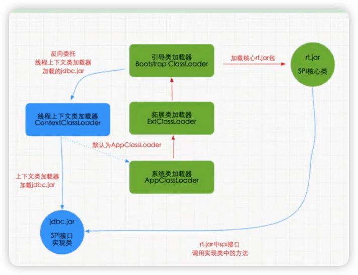

默认上下文加载器就是应用类加载器，这样以上下文加载器为中介，使得启动类加载器中的代码也可以访问应用类加载器中的类。

🔖// TODO JDBC `java.sql.DriverManager` `com.mysql.cj.jdbc.Driver`

3. 破坏双亲委派机制3

第三次破坏双亲委派机制：

双亲委派模型的第三次 “被破坏，是由于用户对程序**动态性**的追求而导致的。如：==代码热替换(Hot Swap）、模块热部署（Hot Deployment）==等。

> 举例：
>
> 想把java程序相关模块像电脑外设那样，拔插鼠标、键盘灯不需要关机。

IBM公司主导的JSR-291（即OSGi R4.2） 实现模块化热部署的关键是它自定义的类加载器机制的实现，每一个程序模块（OSGi中称为**Bundle**）都有一个自己的类加载器，当需要更换一个Bundle时，就把Bundle连同类加载器一起换掉以实现代码的热替换。在OSGi环境下，类加载器不再双亲委派模型推荐的树状结构，而是进一步发展为更加复杂的==网状结构==。

> oracle公司在 jdk9 才正式引入模块化Jigsaw，但也尽量避开OSGi上的优势。

当收到类加载请求时，OSGi将技照下面的顺序进行类搜索：

<u>1）将以java.*开头的类，委派给父类加载器加载。</u>

<u>2）否则，将委派列表名单内的类，委派给父类加载器加载。</u>

3）否则，将Import列表中的类，委派给Export这个类的Bundle的类加载器加载。

4）否则，查找当前Bundle的ClassPath，使用自己的类加载器加载。

5）否则，查找类是否在自己的Fragment Bundle中，如果在，则委派给Fragment Bundle的类加载器加载。

6）否则，查找Dynamic Import列表的Bundle，委派给对应Bundle的类加载器加载。

7）否则，类查找失败。

说明：只有开头两点仍然符合双亲委派模型的原则，其余的类查找都是在平级的类加载器中进行的。

小结：

这里，我们使用了 “被破坏〞这个词来形容上述不符合双亲委派模型原则的行为，但==这里 “被破坏〞并不一定是带有贬义的。只要有明确的目的和充分的理由，突破旧有原则无疑是一种创新。==

正如：OSGi中的类加载器的设计不符合传统的双亲委派的类加载器架构，且业界对其为了实现热部署而带来的额外的**高复杂度**还存在不少争议，但对这方面有了解的技术人员基本还是能达成一个共识，认为**OSGi中对类加载器的运用是值得学习的，完全弄懂了OSGi的实现，就算是掌握了类加载器的精榨**。

#### 热替换的实现

热替换是指在程序的运行过程中，不停止服务，只通过替换程序文件来修改程序的行为。==热替换的关键需求在于服务不能中断，修改必须立即表现正在运行的系统之中==。基本上大部分脚本语言都是天生支持热替换的，比如：PHP，只要替换了PHP源文件，这种改动就会立即生效，而无需重启web服务器。

但对Java来说，热替换并非天生就支持，<u>如果一个类己经加载到系统中，通过修改类文件，并无法让系统再来加载并重定义这个类</u>。因此，在Java中实现这一功能的一个可行的方法就是灵活运用ClassLoader。

注意：由不同ClassLoader加载的同名类属于不同的类型，不能相互转换和兼容。即两个不同的ClassLoader加载同一个类，在虛拟机内部，会认为这2个类是完全不同的。

根据这个特点，可以用来模拟热替换的实现，基本思路如下图所示：


> 《实战Java虚拟机》10.2.7

```java
/**
 * 热替换示列
 *
 * 在代码目录先用`javac Demo1.java`生成Demo1.class文件，然后运行程序后，重新修改Demo1.hot()方法，
 * 再用`javac Demo1.java`生成Demo1.class文件，程序不需要重新启动，修改结果就生效。
 * @author andyron
 **/
public class LoopRun {
    public static void main(String[] args) {
        // 每次调用Demo1.hot()方法之前，都会重新加载DemoA
        while (true) {
            try {
                MyClassLoader loader = new MyClassLoader(System.getProperty("user.dir") + "/ch04/src/");
                Class<?> clazz = loader.findClass("com.andyron.java1.Demo1");
                Object demo = clazz.newInstance();
                Method m = clazz.getMethod("hot");
                m.invoke(demo);
                Thread.sleep(5000);
            } catch (Exception e) {
                System.out.println("not find");
                try {
                    Thread.sleep(5000);
                } catch (InterruptedException ex) {
                    ex.printStackTrace();
                }
            }
        }
    }
}

```


### 4.6 沙箱安全机制

沙箱安全机制

- 保证程序安全
- 保护Java原生的JDK代码

==Java安全模型的核心就是Java沙箱(sandbox）==。什么是沙箱？沙箱是一个限制程序运行的环境。

沙箱机制就是将Java代码==限定在虛拟机（JVM）特定的运行范围中，并且严格限制代码对本地系统资源访问==。通过这样的措施米保证对代码的有限隔离，防止对本地系统造成破坏。

沙箱主要限制系统资源访问，那系统资源包括什么？CPU、内存、文件系统、网络。不同级别的沙箱对这些资源访问的限制也可以不一样。

所有的Java程序运行都可以指定沙箱，可以定制安全策路。

#### JDK1.0时期

在Java中将执行程序分成本地代码和远程代码两种，本地代码默认视为可信任的，而远程代码则被看作是不受信的。对手投信的本地代码，可以访问一切本地资源。而对于非投信的远程代码在早期的Java实现中，安全依赖于沙箱（Sandbox）机制。如下图所示JDK1.0安全模型


#### JDK1.1时明

JDK1.0中如此严格的安全机制也给程序的功能扩展带来障碍，比如当用户希望远程代码访问本地系统的文件时候，就无法实现。

因此在后续的Java1.1版本中，针对安全机制做了改进，增加了安全策略。允许用户指定代码对本地资源的访问权限。

如下图所示JDK1.1安全模型

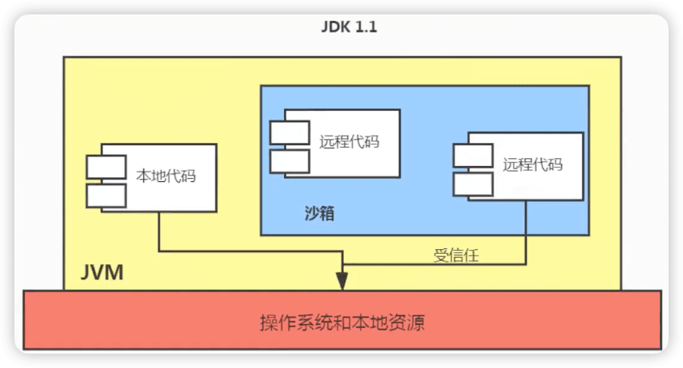

#### JDK1.2时期

在Java1.2版本中，再次改进了安全机制，增加了==代码签名==。不论本地代码或是远程代码，都会按照用户的安全策略设定，由类加载器加载到虚拟机中权限不同的运行空间，来实现差异化的代码执行权限控制。如下图所示JDK1.2安全模型：

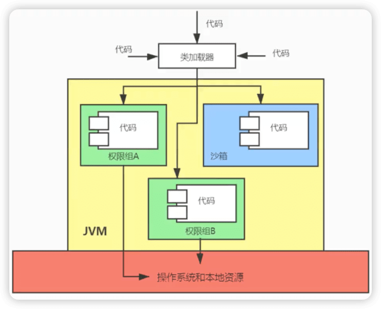

#### JDK1.6时朗

当前最新的安全机制实现，则引入了**域（Domain）**的概念。

虚拟机会把所有代码加载到不同的系统域和应用域。==系统域部分专门负责与关键资源进行交互==，而各个应用域部分则通过系统域的部分代理来对各种需要的资源进行访问。虛拟机中不同的受保护域(Protected Domain），对应不一样的权限 (Permission）。存在于不同域中的类文件就具有了当前域的全部权限，如下图所示，最新的安全模型（jdk1.6)：


### 4.7 自定义类的加载器

#### 1 为什么要自定义类加载器？

- ==隔离加载类==

在某些框架内进行中间件与应用的模块隔离，把类加载到不同的环境。

比如：阿里内某容器框架通过自定义类加载器确保应用中依赖的jar包不会影响到中间件运行时使用的jar包。再比如： Tomcat这类web应用服务器，内部自定义了好几种类加载器，用于隔离同一个Web应用服务器上的不同应用程序。（类的仲裁 --> 类冲突）

- ==修改类加载的方式==

类的加载模型并非强制，除Bootstrap外，其他的加载并非一定要引入，或者根据实际情況在某个时间点进行按需进行动态加载

- ==扩展加载源==

比如从数据库、网络、甚至是电祝机机顶盒进行加载

- ==防止源码泄漏==

Java代码容易被编译和篡改！可以进行编译加密。那么类加载也需要自定义，还原加密的字节码。

#### 2 常见的场景

- 实现类似进程内隔离，类加载器实际上用作不同的命名空间，以提供类似容器、模块化的效果。例如，两个模块依赖于某个类库的不同版本，如果分别被不同的容器加载，就可以互不干扰。这个方面的集大成者是Java EE和OSGI、JPMS等框架。
- 应用需要从不同的数据源获取类定义信息，例如网络数据源，而不是本地文件系统。或者是需要自己操纵宇节码，动态修改或者生成类型。

#### 3 注意：

在一般情况下，使用不向的类加载器去加载不同的功能模块，会提高应用程序的安全性。但是，如果涉及Java类型转换，则加载器反而容易产生不美好的事情。在做Java类型转换时，只有两个类型都是由同一个加载器所加载，才能进行类型转换，否则转换时会发生异常。


#### 实现方式

用户通过定制自己的类加载器，这样可以重新定义类的加载规则，以便实现一些自定义的处理逻辑。

1. 实现方式

- Java提供了抽象类java.lang.ClassLoader，所有用户自定义的类加载器都应该继承ClassLoader类。
- 在自定义 ClassLoader 的子类时候，我们常见的会有两种做法：
  - 方式一：重写1oadclass()方法
  - 方式二：重写findclass()方法(推荐)

2. 对比

这两种方法本质上差不多，毕竞loadC1ass()也会调用findClass()，但是从逻辑上讲我们最好不要直接修改loadClass(）的内部逻辑。建议的做法是只在findClass()里重写自定义类的加载方法，根据参数指定类的名字，返回对应的Class对象的引用。

- loadClass()这个方法是实现双亲委派模型逻辑的地方，擅自修改这个方法会导致模型被破坏，容易造成问题。==因此我们最好是在双亲委派模型框架内进行小范围的改动，不破坏原有的稳定结构。==同时，也避免了自己重写loadClass(）方法的过程中必须写双亲委托的重复代码，从代码的复用性来看，不直接修改这个方法始终是比较好的选择。
- 当编写好自定义类加载器后，便可以在程序中调用loadClass()方法来实现类加载操作。

3. 说明

- 自定义的类加载器的父类加载器是系统类加载器
- JVM中的所有类加载都会使用java.1ang.ClassLoader.1oadC1ass(string)接口(自定义类加载器并重写


### 4.8 Java9新特性

为了保证兼容性，JDK 9没有从根本上改变三层类加载器架构和双亲委派模型，但为了模块化系统的顺利运行，仍然发生了一些值得被注意的变动。

1. 扩展机制被移除，扩展类加载器由于向后兼容性的原因被保留，不过被重命名为==平台类加载器==(platform classloader）。可以通过ClassLoader的新方法getPlatformClassLoader(）来获取。

JDK9时基于模块化进行构建（原来的rt.jar 和 tools.jar 被拆分成数十个JMOD文件）

其中的 Java类库就已天然地满足了可扩展的需求，那自然无须再保留＜JAVA_ HOME>\lib\ext 目录，此前使用这个目录或者 java.ext.dirs 系统变量来扩展 jDK 功能的机制已经没有继续存在的价值了。

2．平台类加载器和应用程序类加载器都不再继承自 java.net.URLClassLoader。现在启动类加载器、平台类加载器、应用程序类加载器全都继承于 `jdk.internal.loader.BuiltinclassLoader`。

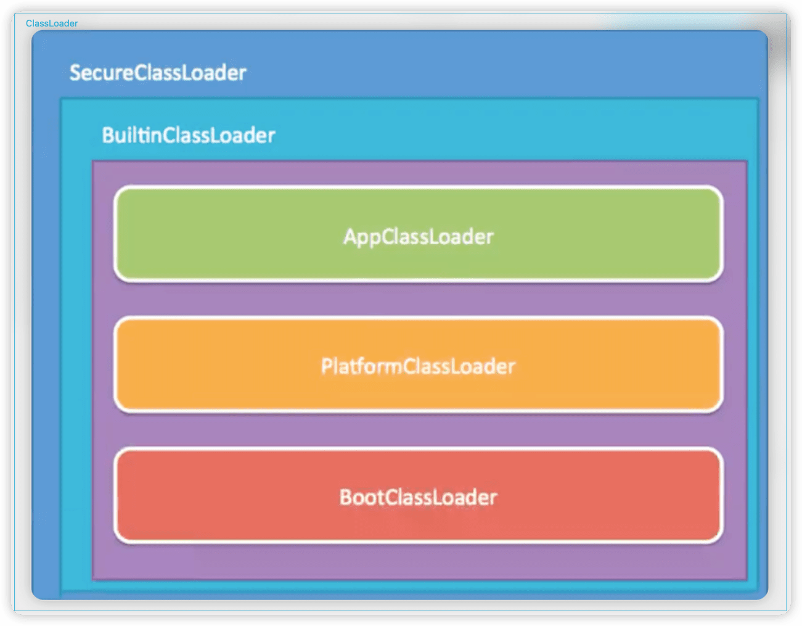

 `jdk.internal.loader.ClassLoaders`

如果有程序直接依赖了这种继承关系，或者依赖了 URLClassLoader 类的特定方法，那代码很可能会在 JDK 9及更高版本的 JDK 中崩溃。

3. 在Java 9中，类加载器有了名称。该名称在构造方法中指定，可以通过getName()方法来获取。平台类加载器的名称是platform， 应用类加载器的名称是app。类加载器的名称在调试与类加载器相关的问题时会非常有用。

4. 启动加载器现在是在jvm内部和java类库共同协作实现的类加载器（以前是C++实现了，但为了与之前代码兼容，在获取启动类加载器的场景中仍然会返回null，而不会到`BootClassLoader`实例。

5. 类加载的委派关系也发生了变动。

当平台及应用程序类加载器收到类加载请求，在委派给父加载器加载前，要先判断该类是否能够归属到某一个系统模块中，如果可以找到这样的归属关系，就要优先委派给负责那个模块的加载器完成加载。

双亲委派模式示意图


附加：

在java 模块化系统明确规定了三个类加载器负责各自加载的模块：

- 启动类加载器负责加载的模快

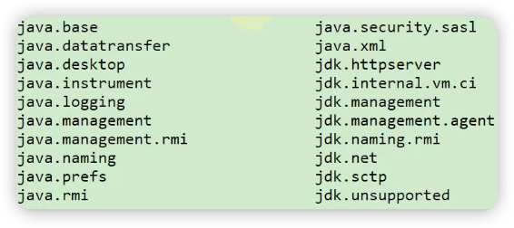

- 平台类加载器负责加载的模块


- 应用程序类加载器负责加载的模块

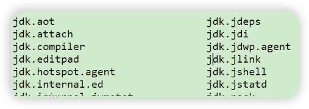 等等

# 三、性能监控与调优篇

P302 - p381

## 1 概述

### 面试题

> 支付宝：
>
> 支付宝三面：JVM性能调优都做了什么？
>
> 小米：
>
> 有做过JVM内存优化吗？
>
> 从SQL、JVM、架构、数据库四个方面讲讲优化思路
>
> 蚂蚁金服：
>
> JVM的编译优化
>
> jvm性能调优都做了什么
>
> JVM诊断调优工具用过哪些？
>
> 二面：jvm怎样调优，堆内存、栈空间设置多少合适
>
> 三面：JVM相关的分析工具使用过的有哪些？具体的性能调优步骤如何
>
> 阿里：
>
> 如何进行JVM调优？有哪些方法？
>
> 如何理解内存泄漏问题？有哪些情况会导致内存泄漏？如何解决？
>
> 字节跳动：
>
> 三面：JVN如何调优、参数怎么调？
>
> 拼多多：
>
> 从SQL、JVM、架构、数据库四个方面讲讲优化思路
>
> 京东：
>
> JVM诊断调优工具用过哪些？
>
> 每秒几十万并发的秒杀系统为什么会频繁发生GC？
>
> 日均百万级交易系统如付优化JVM？
>
> 线上生产系统OOM如何监控及定位与解决？
>
> 高并发系统如何基于G1垃圾回收器优化性能？

### 背景说明

#### 1 生产环境中的问题

生产环境发生了内存溢出该如何处理？

生产环境应该给服务器分配多少内存合适？

如何对垃圾回收器的性能进行调优？

生产环境CPU负载放高该如何处理？

生产环境应该给应用分配多少线程合适？

不加log，如何确定请求足否执行了某一行代码？

不加log，如何实时查看某个方法的入参与返回值？

#### 2 为什么要调优

防止出现OOM

解决OOM

减少Full GC出现的频率


#### 3 不同阶段考虑

上线前

项目运行阶段

线上出现OOM


### 调优概述

#### 1 监控的依据

运行日志

异常堆栈

GC日志

线程快照

堆转储快照

#### 2 调优的大方向

合理地编写代码

充分并合理的使用硬件资源

合理地进行JVM调优


### 性能优化的步骤

#### 第1步（发现问题）：性能监控

一种以==非强行或者入侵方式==收集或查看应用运营性能数据的活动。

监控通常是指一种在生产、质量评估或者开发环境下实施的带有预防或主动性的活动。

当应用相关干系人提出性能问题却没有提供足够多的线索时，首先我们需要进行性能监控，随后是性能分析。

- GC频繁

- cpu load过高

- OOM

- 内存泄漏

- 死锁

- 程序响应时间较长


#### 第2步（排查问题）：性能分析

一种以==侵入方式==收集运行性能数据的活动，它会影响应用的吞吐量或响应性。

性能分析是针对性能问题的答复结果，关注的范围通常比性能监控更加集中。

性能分析很少在生产环境下进行，通常是在质量评估、==系统测试或者开发环境==下进行，是性能监控之后的步骤。


- 打印GC日志，通过GCViewer或http://gceasy.io来分析日志信息
- 灵活运用命令行工具，jstack，jmap，jinfo等
- dump出堆文件，使用内存分析工具分析文件
- 使用阿里Arthas，或jconsole、JVisualVM来实时查看JVM状态
- jstack查看堆栈信息

#### 第3步（解决问题）：性能调优

一种为改善应用响应性或吞吐量而更改参数、源代码、属性配置的活动，性能调优是在性能监控、性能分析之后的活动。   

- 适当增加内存，根据业务背景选择垃圾回收器
- 优化代码，控制内存使用
- 增加机器，分散节点压力
- 合理设置线程池线程数量
- 使用中间件提高程序效率，比如缓存，消息队列等
- ...

### 性能评价/测试指标

#### 1 停顿时间（或响应时间）

提交请求和返回该请求的响应之间使用的时间，一般比较关注平均响应时间。

常用操作的响应时间列表：

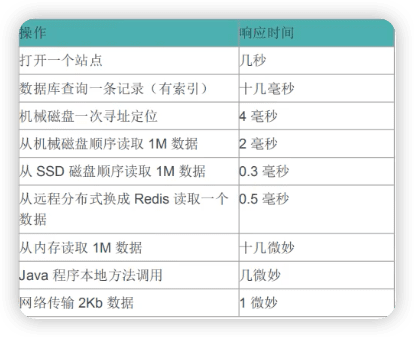

在垃圾回收环节中：

**暂停时间**：执行垃圾收集时，程序的工作线程被暂停的时间。 `-XX:MaxGCPauseMillis`

#### 2 吞吐量

对单位时间内完成的工作量（请求）的量度。

在GC中：运行用户代码的时间占总运行时间的比例（总运行时间：程序的运行时间 + 内存回收的时间）吞吐量为 1 - 1/(1+n)。 `-XX:GCTimeRatio=n`

#### 3 并发数

同一时刻，对服务器有实际交互的诘求数

1000个人同时在线，估计并发数在5%-15%之间，也就是同时井发量：50-150之间。

#### 4 内存占用

java堆区所占的内存大小

#### 5 相互间的关系

以高速公路通行状况为例

吞吐量：每天通过高速公路收费站的车辆的数据（也可以理解为收费站收取的高速费）

并发数：高速公路上正在行驶的车辆的数目

响应时间：车速

> Jvm调优最关心响应时间和吞吐量


## 2 JVM监控及诊断工具-命令行

### 2.1 概述

性能诊断是软件工程师在日常工作中需要经常面对和解决的问题，在==用户体验至==上的今天，解决好应用的性能问题能带来非常大的收益。

Java 作为最流行的编程语言之一，其应用性能诊断一直受到业界广泛关注。可能造成 Java应用出现性能问题的因素非常多，例如线程控制、磁盘读写、数据库访问、网络I/O、垃圾收集等。想要定位这些问题，一款优秀的性能诊断工具必不可少。

体会1：==使用数据说明问题，使用知识分析问题，使用工具处理问题==。

体会2：==无监控、不调优==！

命令行工具的都是java编写，源码在jdk根目录`lib/tool.jar`（jdk8）中。

https://hg.openjdk.org/jdk/jdk11/file/1ddf9a99e4ad/src/jdk.jcmd/share/classes/sun/tools

### 2.2 jps：查看正在运行的Java进程

jps (Java Process Status):

显示指定系统内所有的Hotspot虚拟机进程(查看虚拟机进程信息），可用于查询正在运行的虚拟机进程。

说明：对于本地虛拟机进程来说，**进程的本地虛拟机ID与操作系统的进程ID是一致的，是唯一的。**

`jps [options] [hostid]`


#### options参数

- `-q`：仅仅显示LVMID (local virtual machine id)，即本地虛拟机唯一id。不显示主类的名称等

- `-l`：输出应用程序主类的全类名 或 如果进程执行的是jar包，则输出jar完整路径

- `-m`：输出虛拟机进程启动时传递给主类main()的参数

  ```shell
  $ jps -m
  34514
  34691 ScannerTest andyron
  34552 RemoteMavenServer36
  34715 Jps -m
  ```

  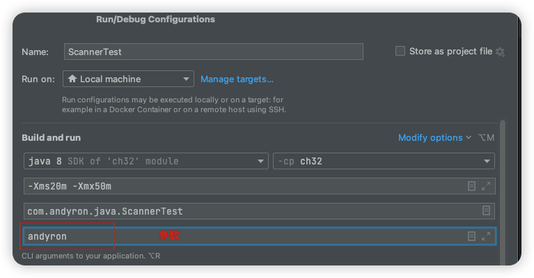

- `-v`：列出虚拟机进程启动时的JVM参数。比如：`-Xms20m -Xmx50m`是启动程序指定的jvm參数。

说明：以上参数可以综合使用。

补充：

如果某 Java 进程关闭了默认开启的UsePerfData參数（即使用参数`-XX:-UsePerfData`），那么jps命令（以及下面介绍的jstat）将无法探知该Java 进程。


#### hostid参教

`<hostid>:      <hostname>[:<port>]`

RMI注册表中注册的主机名。

如果想要远程监控主机上的 java程序，需要安装 `jstatd`。

对于具有更严格的安全实践的网络场所而言，可能使用一个自定义的策略文件来显示对特定的可信主机或网络的访问，尽管这种技术容易受到IP地址欺诈攻击。

如果安全问题无法使用一个定制的策略文件来处理，那么最安全的操作是不运行jstatd服务器，而是在本地使用jstat和jps工具。


### 2.3 jstat：查看JVM统计信息

jstat (JVM Statistics Monitoring Tool)：用于监视虛拟机各种运行状态信息的命令行工具。它可以显示本地或者远程虚拟机进程中的类装载、内存、垃圾收集、JIT编译等远行数据。

**在没有GUI图形界面，只提供了纯文本控制台环境的服务器上，它将是运行期定位虛拟机性能问题的首选工具。**常用于检测垃圾回收问题以及内存泄漏问题。

官方文档：https://docs.oracle.com/javase/8/docs/technotes/tools/unix/jstat.html

#### 基本语法

`jstat -<option> [-t] [-h<lines>] <vmid> [<interval> [<count>]]`

##### option参数

###### **类装载相关的：**

- `-class`：最示ClassLoader的相关信息：类的装载、卸载数量、总空间、类装载所消耗的时间等

```shell
➜ jstat -class 34889
Loaded  Bytes  Unloaded  Bytes     Time
   676  1350.1        0     0.0       0.06
```


###### **垃圾回收相关的**：

- `-gc`：显示与GC相关的堆信息。包括Eden区、两个Survivor区、老年代、永久代等的容量、已用空间、GC时间合计等信息。
- `-gccapacity`：显示内容与-gC基本相同，但输出主要关注Java堆各个区域
- 使用到的最大、最小空间。
- `-gcutil`：显示内容与-gC基本相同，但输出主要关注已使用空间占总空间的百分比。
- `-gccause`：与-gcutil功能一样，但是会额外输出导致最后一次或当前正在发生的GC产生的原因。
- `-gcnew`：显示新生代GC状况
- `-gcnewcapacity`：显示内容与-gcnew基本相同，输出主要关注使用到的最大、最小空间
- `-geold`：显示老年代GC状况

```shell
➜ jstat -gc 35025
 S0C    S1C    S0U    S1U      EC       EU        OC         OU       MC     MU    CCSC   CCSU   YGC     YGCT    FGC    FGCT     GCT
1024.0 1024.0  0.0    0.0    6144.0   2533.9   16384.0      0.0     4480.0 800.1  384.0   77.0       0    0.000   0      0.000    0.000
```

-gc显示说明：

```
新生代相关
	S0C是第一个幸存者区的大小（字节）
	S1C是第二个幸存者区的大小（字节）
	S0U是第一个幸存者区已使用的大小（字节）
	S1U是第二个幸存者区已使用的大小（字节）
	EC是Eden空间的大小（字节）
	EU是Eden空间已使用大小（字节）
老年代相关
	OC是老年代的大小（字节）
	OU是老年代已使用的大小（字节）
方法区（元空间）相关
	MC是方法区的大小
	MU是方法区已使用的大小
	CCSC是压缩类空间的大小
	CCSU是压缩类空间已使用的大小
其他
	YGC是从应用程序启动到采样时young gc的次数
	YGCT是指从应用程序启动到采样时young gc消耗时间（秒）
	FGC是从应用程序启动到采样时full gc的次数
	FGCT是从应用程序启动到采样时的full gc的消耗时间（秒）
	GCT是从应用程序启动到采样时gc的总时间
```


###### **JIT相关的：**

- `-compiler`：显示JIT编译器编译过的方法、耗时等信息

- `-printcompilation`：输出已经被JIT编译的方法

```shell
➜ jstat -compiler 34889
Compiled Failed Invalid   Time   FailedType FailedMethod
      58      0       0     0.01          0
      
➜ jstat -printcompilation 34889
Compiled  Size  Type Method
      58     70    1 java/lang/String indexOf
```


##### interval参数

用于指定输出统计数据的周期，单位为毫秒。即：查询间隔。

每隔疫苗打印一次

```shell
➜ jstat -class 34889 1000
```


##### count参数

用于指定查询的总次数。

```shell
➜  Downloads jstat -class 34889 1000 10
```

##### -t参数

可以在输出信息前加上一个Timestamp列，显示程序的运行时间。单位：秒。

```shell
➜ jstat -class -t 34889
Timestamp       Loaded  Bytes  Unloaded  Bytes     Time
          557.4    676  1350.1        0     0.0       0.06
```

**经验:**

我们可以比较Java 进程的启动时间以及总 GC 时间（GCT 列），或者两次测量的间隔时间以及总GC时间的增量，来得出 GC 时间占运行时间的比例。

如果该比例超过 20%，则说明目前堆的压力较大：如果该比例超过 90%，则说明堆里几乎没有可用空间，随时都可能抛出 OOM 异常。


##### -h参数

可以在周期性数据输出时，输出多少行数据后输出一个**表头信息**。

```shell
➜ jstat -class -t -h3 34889 1000 10
Timestamp       Loaded  Bytes  Unloaded  Bytes     Time
          676.3    676  1350.1        0     0.0       0.06
          677.4    676  1350.1        0     0.0       0.06
          678.4    676  1350.1        0     0.0       0.06
Timestamp       Loaded  Bytes  Unloaded  Bytes     Time
          679.4    676  1350.1        0     0.0       0.06
          680.4    676  1350.1        0     0.0       0.06
          681.4    676  1350.1        0     0.0       0.06
Timestamp       Loaded  Bytes  Unloaded  Bytes     Time
          682.4    676  1350.1        0     0.0       0.06
          683.4    676  1350.1        0     0.0       0.06
          684.4    676  1350.1        0     0.0       0.06
Timestamp       Loaded  Bytes  Unloaded  Bytes     Time
          685.4    676  1350.1        0     0.0       0.06
```


#### 补充

jstat还可以用来判断是否出现内存泄漏。

- 第1步：

在长时间运行的 Java 程序中，我们可以运行jstat命令连续获取多行性能数据，并取这几行数据中 OU列（即己占用的老年代内存）的最小值。

- 第2步：

然后，我们每隔一段较长的时间重复一次上述操作，来获得多组OU最小值。如果这些值呈上涨趋势，则说明该 Java 程序的老年代内存己使用量在不断上涨，这意味着无法回收的对象在不断增加，因此很有可能存在内存泄漏。

### 2.4 jinfo：实时==查看和修改==JVM配置参数

jinfo(Configuration Info for Java)

查看虚拟机配置参数信息，也可用于调整虛拟机的配置参数。

在很多情况下，Java应用程序不会指定所有的==Java虚拟机参数==。而此时，开发人员可能不知道某一个具体的Java虛拟机参数的默认值。在这种情况下，可能需要通过查找文档获取某个参数的默认值。这个查找过程可能是非常艰难的。但有了jinfo工具，开发人员可以很方便地找到Java虛拟机参数的当前值。

#### 基本语法

`jinfo <option> <pid>`

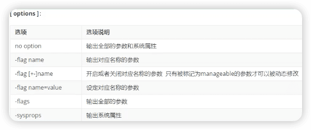

> 🐞macOS 上的jinfo失效？！

##### 查看

- `jinfo -sysprops 进程id`

可以查看由System.getProperties()取得的参数

- `jinfo -flags 进程id`

查看曾经赋过值的一些参数

- `jinfo -flag 参数名称 进程id`

查看某个java进程的具体参数信息

```shell
jinfo -flag UseG1GC 2157
```


##### 修改（能修改的参数有限）

jinfo不仅可以查看运行时某一个Java虛拟机参数的实际取值，甚至可以在运行时修改部分参数，并使之立即生效。

但是，并非所有参数都支持动态修改。参数只有被标记为`manageable`的flag可以被实时修改。其实，这个修改能力是极其有限的。可以查看被标记为manageable的参数:

```
java -XX:+PrintFlagsFinal -version | grep manageable
```

```shell
➜ java -XX:+PrintFlagsFinal -version | grep manageable
     intx CMSAbortablePrecleanWaitMillis            = 100                                 {manageable}
     intx CMSTriggerInterval                        = -1                                  {manageable}
     intx CMSWaitDuration                           = 2000                                {manageable}
     bool HeapDumpAfterFullGC                       = false                               {manageable}
     bool HeapDumpBeforeFullGC                      = false                               {manageable}
     bool HeapDumpOnOutOfMemoryError                = false                               {manageable}
    ccstr HeapDumpPath                              =                                     {manageable}
    uintx MaxHeapFreeRatio                          = 100                                 {manageable}
    uintx MinHeapFreeRatio                          = 0                                   {manageable}
     bool PrintClassHistogram                       = false                               {manageable}
     bool PrintClassHistogramAfterFullGC            = false                               {manageable}
     bool PrintClassHistogramBeforeFullGC           = false                               {manageable}
     bool PrintConcurrentLocks                      = false                               {manageable}
     bool PrintGC                                   = false                               {manageable}
     bool PrintGCDateStamps                         = false                               {manageable}
     bool PrintGCDetails                            = false                               {manageable}
     bool PrintGCID                                 = false                               {manageable}
     bool PrintGCTimeStamps                         = false                               {manageable}
openjdk version "1.8.0_352"
OpenJDK Runtime Environment (Zulu 8.66.0.15-CA-macos-aarch64) (build 1.8.0_352-b08)
OpenJDK 64-Bit Server VM (Zulu 8.66.0.15-CA-macos-aarch64) (build 25.352-b08, mixed mode)
```


- 针对boolean类型

`jinfo -flag [+ | -]参数名称 进程id`

如果使用+号，那就可以让该参数起作用，否则使用-号就让该参数不起作用，具体例子如下：

```shell
[root@localhost ~]# jinfo -flag PrintGCDetails 2157
-XX:-PrintGCDetails
[root@localhost ~]# jinfo -flag +PrintGCDetails 2157  // 修改成功
[root@localhost ~]# jinfo -flag PrintGCDetails 2157
-XX:+PrintGCDetails
```


- 针对非boolean类型

`jinfo -flag 参数名称=参数值 进程id`

```shell
[root@localhost ~]# jinfo -flag MaxHeapFreeRatio 2157
-XX:MaxHeapFreeRatio=70
[root@localhost ~]# jinfo -flag MaxHeapFreeRatio=90 2157
[root@localhost ~]# jinfo -flag MaxHeapFreeRatio 2157
-XX:MaxHeapFreeRatio=90
```


#### 拓展

- `java -XX:+PrintFlagsInitial`  查看所有JVM参数启动的初始值

- `java -XX:+PrintFlagsFinal`  查看所有JVM参数的最终值

- `java -参数名称:+PrintCommandLineFlags`  查看那些已经被用户或者JVM设置过的详细的XX参数的名称和值

### 2.5 jmap：导出内存映像文件&内存使用情况等

jmap(JVM Memory map)：作用一方面是获取**==dump文件(堆转储快照文件，二进制文件）==**，它还可以获取目标Java进程的<u>内存相关信息，包括Java堆各区域的使用情况、堆中对象的统计信息、类加载信息等</u>。

开发人员可以在控制台中输入命令“`jmap -help`”查阅jmap工具的具体使用方式和一些标淮选项配置。

官方帮助文档：https://docs.oracle.com/en/java/javase/11/tools/jmap.html

#### 基本语法

```shell
jmap [option] <pid>
jmap [option] <executable <core>
jmap [option] [server_id@]<remote server IP or hostname>

```

option选项：（这些参数可能因为jdk版本和操作系统不同有所不同）

1. **`-dump`**

生成Java堆转储快照：dump文件

特别的：`-dump:live`只保存堆中的存活对象

2. **`-heap`**

输出整个堆空间的详细信息，包括GC的使用、堆配置信息，以及内存的使用信息等

3. **`-histo`**

输出堆中对象的同级信息，包括类、实例数量和合计容量

特别的：-histo:live只统计堆中的存活对象

4. `-permstat`

以ClassLoader为统计口径输出永久代的内存状态信息

仅linux/solaris平台有效

5. `-finalizerinfo`

显示在F-Queue中等待Finalizer线程执行finalize方法的对象

仅linux/solaris平台有效

6. `-F`

当虚拟机进程对-dump选项没有任何响应时，可使用此选项强制执行生成dump文件

7. `-J <flag>`

传递参数给jmap启动的jvm


#### 使用1：导出内存映像文件

一般来说，使用jmap指令生成dump文件的操作算得上是最常用的jmap命令之一，将堆中所有存活对象导出至一个文件之中。

Heap Dump又叫做堆存储文件，指一个Java进程在某个时间点的内存快照。 Heap Dump在触发内存快照的时候会保存此刻的信,息如下：

- All Objects

Class, fields, primitive values and references

- All Classes

ClassLoader, name, super class,static fields

- Garbage Collection Roots

Objects defined to be reachable by the JVM

- Thread Stacks and Local Variables

The call-stacks of threads at the moment of the snapshot, and per-frame information about local objects

说明：

1. 通常在写Heap Dump文件前会触发一次Fu11 GC，所以heapdump文件里保存的都是Full GC后留下的对象信息。

2. 由于生成dump文件比较耗时，因此大家需要耐心等待，尤其是大内存镜像生成dump文件则需要耗费更长的时间来完成。

##### 手动的方式

`jmap -dump:format=b,file=<filename.hprof> <pid>`

`jmap -dump:live,format=b,file=<filename.hprof> <pid>`

```shell
➜  Downloads jmap -dump:format=b,file=/Users/andyron/Downloads/1.hprof 38869
Dumping heap to /Users/andyron/Downloads/1.hprof ...
Heap dump file created
➜  Downloads jmap -dump:format=b,file=/Users/andyron/Downloads/2.hprof 38869
Dumping heap to /Users/andyron/Downloads/2.hprof ...
Heap dump file created
➜  Downloads jmap -dump:format=b,file=/Users/andyron/Downloads/3.hprof 38869
Dumping heap to /Users/andyron/Downloads/3.hprof ...
Heap dump file created
➜  Downloads jmap -dump:live,format=b,file=/Users/andyron/Downloads/4.hprof 38869
Dumping heap to /Users/andyron/Downloads/4.hprof ...
Heap dump file created
```

由于jmap将访问堆中的所有对象，为了保证在此过程中不被应用线程干扰，jmap需要借助安全点机制，让所有线程停留在不改变堆中数据的状态。也就是说，由jmap导出的堆快照==必定是安全点位置的==。这可能导致基于该堆快照的分析结果存在偏差。

举个例子，假设在编译生成的机器码中，某些对象的生命周期在两个安全点之间，那么:live选项将无法探知到这些对象。

另外，如果某个线程长时间无法跑到安全点，jmap将一直等下去。与前面讲的jstat则不同，垃圾回收器会主动将jstat所需要的摘要数据保存至固定位置之中，而jstat只需直接读取即可。

##### 自动的方式

当程序发生OOM退出系统时，一些瞬时信息都随着程序的终止而消失，而重现OOM问题往往比较困难或者耗时。此时若能在OOM时，自动导出dump文件就显得非常迫切。

这里介绍一种比较常用的取得堆快照文件的方法，即使用：

- `-XX:+HeapDumpOnOutofMemoryError`：在程序发生OOM时，导出应用程序的当前堆快照。
- `-XX:HeapDumpPath=<filename.hprof>`：可以指定堆快照的保存位置。

比如：

`-Xms60m -Xmx60m -XX:SurvivorRatio=8 -XX:+HeapDumpOnOutOfMemoryError -XX:HeapDumpPath=/Users/andyron/Downloads/5.hprof`

> 手动、自动方式应用于不同场景。

#### 使用2：显示堆内存相关信息

- `jmap -heap 进程id`  时间点，执行命令那一刻的堆内存信息。比jstat差一点

- `jmap -histo 进程id` 时间点


#### 使用3：其他作用

- `jmap -permstat 进程id`  查看系统的ClassLoader信息

- `jmap -finalizerinfo`  查看堆积在finalizer队列中的对象


### 2.6 jhat：JDK自带堆分析工具

jhat (JVM Heap Analysis Tool):

sun JDK提供的jhat命令与jmap命令搭配使用，用于分析jmap生成的heap dump文件（堆转储快照）。jhat内罝了一个微型的HTTP/HTML服务器， 生成dump文件的分析结果后，用产可以在浏览器中查看分析结果(分析虛拟机转储快照信息）。

使用了jhat命令，就启动了一个http服务，端口是7000，即http://1ocalhost:7000/，就可以在浏览器里分析。

> jhat命令在jdk9及其之后就被移除了，官方建议使用jvisualvm代替jhat，所以该指令只需简单了解一下即可。


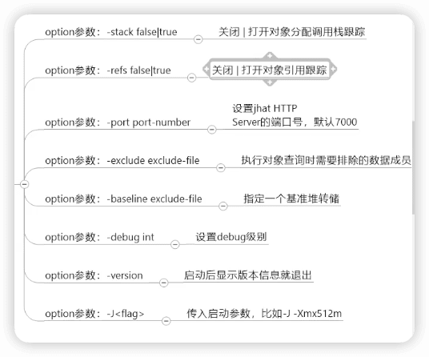

### 2.7 jstack：打印JVM中==线程==快照

每一个线程都有一个栈，所以叫jstack。

jstack(JVM stack Trace)：用于生成虚拟机指定进程当前时刻的线程快照(虚拟机堆栈跟踪)。==线程快照==就是==当前虛拟机内指定进程的每一条线程正在执行的方法堆的集合==。

生成线程快照的作用：可用于定位线程出现长时间停顿的原因，如<u>线程间死锁、死循环、请求外部资源导致的长时问等待等问题</u>。这些都是导致线程长时间停顿的常见原因。当线程出现停顿时，就可以用jstack显示各 个线程调用的堆栈情况。

官方帮助文档：https://docs.oracle.com/en/java/javase/11/tools/jstack.html

在thread dump中，要留意下面几种状态

- **死锁，Deadlock(重点关注）**
- **等待资源，Waiting on condition（重点关注）**
- **等待获取监视器，waiting on monitor entry（重点关注）**
- **阻塞，Blocked(重点关注）**
- 执行中，Runnable
- 暂停，Suspended

#### 基本语法

`jstack [option] <pid>`

- option参数：-F

当正常输出的请求不被响应时，强制输出线程堆栈

- option参数：-l

除堆栈外，显示关于锁的附加信息

- option参数：-m

如果调用本地方法的话，可以显示C/C++的堆栈

- option参数：-h

帮助操作

```shell
➜  jstack 40100
2023-04-30 14:26:36
Full thread dump OpenJDK 64-Bit Server VM (25.352-b08 mixed mode):

"Attach Listener" #14 daemon prio=9 os_prio=31 tid=0x0000000117008800 nid=0x5207 waiting on condition [0x0000000000000000]
   java.lang.Thread.State: RUNNABLE

"DestroyJavaVM" #13 prio=5 os_prio=31 tid=0x000000011c873000 nid=0x1d03 waiting on condition [0x0000000000000000]
   java.lang.Thread.State: RUNNABLE

"Thread-1" #12 prio=5 os_prio=31 tid=0x000000011406a800 nid=0x7a03 waiting for monitor entry [0x00000001723f6000]
   java.lang.Thread.State: BLOCKED (on object monitor)
	at com.andyron.jstack.TreadDeadLock$2.run(TreadDeadLock.java:53)
	- waiting to lock <0x00000006c00176d8> (a java.lang.StringBuilder)
	- locked <0x00000006c0000950> (a java.lang.StringBuilder)
	at java.lang.Thread.run(Thread.java:750)

"Thread-0" #11 prio=5 os_prio=31 tid=0x000000011c872000 nid=0x7c03 waiting for monitor entry [0x00000001721ea000]
   java.lang.Thread.State: BLOCKED (on object monitor)
	at com.andyron.jstack.TreadDeadLock$1.run(TreadDeadLock.java:29)
	- waiting to lock <0x00000006c0000950> (a java.lang.StringBuilder)
	- locked <0x00000006c00176d8> (a java.lang.StringBuilder)

"Service Thread" #10 daemon prio=9 os_prio=31 tid=0x0000000114068800 nid=0x7f03 runnable [0x0000000000000000]
   java.lang.Thread.State: RUNNABLE

"C1 CompilerThread3" #9 daemon prio=9 os_prio=31 tid=0x0000000114050000 nid=0x4803 waiting on condition [0x0000000000000000]
   java.lang.Thread.State: RUNNABLE

"C2 CompilerThread2" #8 daemon prio=9 os_prio=31 tid=0x000000011404f000 nid=0x4903 waiting on condition [0x0000000000000000]
   java.lang.Thread.State: RUNNABLE

"C2 CompilerThread1" #7 daemon prio=9 os_prio=31 tid=0x0000000116808800 nid=0x4a03 waiting on condition [0x0000000000000000]
   java.lang.Thread.State: RUNNABLE

"C2 CompilerThread0" #6 daemon prio=9 os_prio=31 tid=0x000000011400b800 nid=0x4c03 waiting on condition [0x0000000000000000]
   java.lang.Thread.State: RUNNABLE

"Monitor Ctrl-Break" #5 daemon prio=5 os_prio=31 tid=0x0000000114009000 nid=0x4e03 runnable [0x0000000171396000]
   java.lang.Thread.State: RUNNABLE
	at java.net.SocketInputStream.socketRead0(Native Method)
	at java.net.SocketInputStream.socketRead(SocketInputStream.java:116)
	at java.net.SocketInputStream.read(SocketInputStream.java:171)
	at java.net.SocketInputStream.read(SocketInputStream.java:141)
	at sun.nio.cs.StreamDecoder.readBytes(StreamDecoder.java:284)
	at sun.nio.cs.StreamDecoder.implRead(StreamDecoder.java:326)
	at sun.nio.cs.StreamDecoder.read(StreamDecoder.java:178)
	- locked <0x00000006c0016b80> (a java.io.InputStreamReader)
	at java.io.InputStreamReader.read(InputStreamReader.java:184)
	at java.io.BufferedReader.fill(BufferedReader.java:161)
	at java.io.BufferedReader.readLine(BufferedReader.java:324)
	- locked <0x00000006c0016b80> (a java.io.InputStreamReader)
	at java.io.BufferedReader.readLine(BufferedReader.java:389)
	at com.intellij.rt.execution.application.AppMainV2$1.run(AppMainV2.java:56)

"Signal Dispatcher" #4 daemon prio=9 os_prio=31 tid=0x000000011d862000 nid=0x4503 runnable [0x0000000000000000]
   java.lang.Thread.State: RUNNABLE

"Finalizer" #3 daemon prio=8 os_prio=31 tid=0x000000011c827000 nid=0x3303 in Object.wait() [0x0000000170e66000]
   java.lang.Thread.State: WAITING (on object monitor)
	at java.lang.Object.wait(Native Method)
	- waiting on <0x00000006c001f838> (a java.lang.ref.ReferenceQueue$Lock)
	at java.lang.ref.ReferenceQueue.remove(ReferenceQueue.java:144)
	- locked <0x00000006c001f838> (a java.lang.ref.ReferenceQueue$Lock)
	at java.lang.ref.ReferenceQueue.remove(ReferenceQueue.java:165)
	at java.lang.ref.Finalizer$FinalizerThread.run(Finalizer.java:188)

"Reference Handler" #2 daemon prio=10 os_prio=31 tid=0x000000011c824800 nid=0x3803 in Object.wait() [0x0000000170c5a000]
   java.lang.Thread.State: WAITING (on object monitor)
	at java.lang.Object.wait(Native Method)
	- waiting on <0x00000006c0008740> (a java.lang.ref.Reference$Lock)
	at java.lang.Object.wait(Object.java:502)
	at java.lang.ref.Reference.tryHandlePending(Reference.java:191)
	- locked <0x00000006c0008740> (a java.lang.ref.Reference$Lock)
	at java.lang.ref.Reference$ReferenceHandler.run(Reference.java:153)

"VM Thread" os_prio=31 tid=0x000000011c81d800 nid=0x3a03 runnable

"ParGC Thread#0" os_prio=31 tid=0x000000011d816800 nid=0x2403 runnable

"ParGC Thread#1" os_prio=31 tid=0x000000011d817800 nid=0x2a03 runnable

"ParGC Thread#2" os_prio=31 tid=0x000000011d818000 nid=0x2b03 runnable

"ParGC Thread#3" os_prio=31 tid=0x000000011d819000 nid=0x2c03 runnable

"ParGC Thread#4" os_prio=31 tid=0x000000011d819800 nid=0x2e03 runnable

"ParGC Thread#5" os_prio=31 tid=0x000000011d81a800 nid=0x3003 runnable

"ParGC Thread#6" os_prio=31 tid=0x000000011d81b000 nid=0x3c03 runnable

"ParGC Thread#7" os_prio=31 tid=0x000000011d81c000 nid=0x3b03 runnable

"VM Periodic Task Thread" os_prio=31 tid=0x0000000114069800 nid=0x5603 waiting on condition

JNI global references: 15


Found one Java-level deadlock:
=============================
"Thread-1":
  waiting to lock monitor 0x000000011d84ff60 (object 0x00000006c00176d8, a java.lang.StringBuilder),
  which is held by "Thread-0"
"Thread-0":
  waiting to lock monitor 0x000000011d84eac0 (object 0x00000006c0000950, a java.lang.StringBuilder),
  which is held by "Thread-1"

Java stack information for the threads listed above:
===================================================
"Thread-1":
	at com.andyron.jstack.TreadDeadLock$2.run(TreadDeadLock.java:53)
	- waiting to lock <0x00000006c00176d8> (a java.lang.StringBuilder)
	- locked <0x00000006c0000950> (a java.lang.StringBuilder)
	at java.lang.Thread.run(Thread.java:750)
"Thread-0":
	at com.andyron.jstack.TreadDeadLock$1.run(TreadDeadLock.java:29)
	- waiting to lock <0x00000006c0000950> (a java.lang.StringBuilder)
	- locked <0x00000006c00176d8> (a java.lang.StringBuilder)

Found 1 deadlock.
```


### 2.8 jcmd：多功能命令行

在JDK 1.7以后，新增了一个命令行工具jcmd。

它是一个多功能的工具，可以用来实现前面除了jstat之外所有命令的功能。比如：用定来导出堆、内存使用、查看Java进程、导出线程信息、执行GC、JVM运行时间等。

官方帮助文档：https://docs.oracle.com/en/java/javase/11/tools/jcmd.html

jcmd拥有 jmap的大部分功能，并且在Oracle的官方网站上也推荐使用jcmd命令代jmap命令。


#### 基本语法

##### `jcmd -l`

列出所有的JVM进程

##### `jcmd 进程号 help`

针对指定的进程，列出支持的所有具体命令

##### `jcmd 进程号 具体命令`

显示指定进程的指令命令的数据

首先通过jcmd 进程号 help 得出以下命令列表：

```shell
➜  jcmd 40100 help
40100:
The following commands are available:
VM.unlock_commercial_features
JFR.configure
JFR.stop
JFR.start
JFR.dump
JFR.check
VM.native_memory
ManagementAgent.stop
ManagementAgent.start_local
ManagementAgent.start
VM.classloader_stats
GC.rotate_log
Thread.print
GC.class_stats
GC.class_histogram
GC.heap_dump
GC.finalizer_info
GC.heap_info
GC.run_finalization
GC.run
VM.uptime
VM.dynlibs
VM.flags
VM.system_properties
VM.command_line
VM.version
help
```

 

根据以上命令来替换之前的那些操作：

1. Thread.print 可以替换 jstack指令
2. GC.class_histogram 可以替换 jmap中的-histo操作
3. GC.heap_dump 可以替换 jmap中的-dump操作
4. GC.run 可以查看GC的执行情况
5. VM.uptime 可以查看程序的总执行时间，可以替换jstat指令中的-t操作
6. VM.system_properties 可以替换 jinfo -sysprops 进程id 
7. VM.flags 可以获取JVM的配置参数信息 

### 2.9 jstatd：远程主机信息收集

之前的指令只涉及到监控本机的Java应用程序，而在这些工具中，一些监控工具也支持对远程计算机的监控（如jps、jstat）。为了启用远程监控，则需要配合使用jstatd工具。

命令jstatd是一个RMI服务端程序，它的作用相当于代理服务器，建立本地计算机与远程监控工具的通信。jstatd服务器将本机的Java应用程序信息传递到远程计算机。

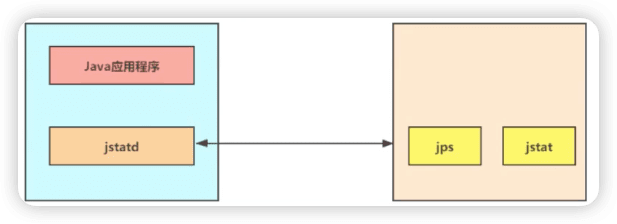


## 3 JVM监控及诊断工具-GUI

P320

### 3.1 工具概述

使用上一章命令行工具或组合能帮您获取目标Java应用性能相关的基础信息，但它们存在下列局限：

1. 无法获取==方法级別==的分析数据，如方法问的调用关系、各方法的调用次数和调用时间等（这对定位应用性能瓶颈至关重要）。
2. 要求用户登录到目标 Java 应用所在的宿主机上，使用起来不是很方便。
3. 分析数据通过终端输出，结果展示不够直观。

为此，JDK提供了一些内存泄漏的分析工具，如jconsole， jvisualvm等，用于辅助开发人员定位问题，但是这些工具很多时候并不足以满足快速定位的需求。所以这里我们介绍的工具相对多一些、丰富一些。

**图形化综合诊断工具**:

#### JDK自带的工具

- jconsole:JDK自带的可视化监控工具。查看Java应用程序的运行概况、监控堆信息、永久区（或元空间〕使用情況、类加载情況等。（简单，入门级别）
  位置：jdk/bin/jconsole.exe
- Visual VM:visual VM是一个工具，它提供了一个可视界面，用于查看Java虚拟机上运行的基于Java技术的应用程序的详细信息。(jvisualvm是jdk自带的，Visual VM都是另外下的独立的客户端工具)

​	位罝：jdk/bin/jvisualvm.exe

- JMC:Java Mission Control，内置Java Flight Recorder（飞行记录仪）。能够以极低的性能开销收集Java虚拟机的性能数据。

#### 第三方工具

- MAT: MAT(Memory Analyzer TooL)是基于EClipse的内存分析工具，是一个快速、功能丰富的Java heap分析工具，它可以帮助我们查找内存泄漏和减少内存消耗。（Eclipse的插件形式，也可以独立下载使用）

- JProfiler：商业软件，需要付费。功能强大。【与Visual VM类似】
- Arthas:Alibaba开源的Java诊断工具。深受开发者喜爱。
- Btrace:Java运行时追踪工具。可以在不停机的情况下，跟踪指定的方法调用、构造函数调用和系统内面等信息。https://github.com/btraceio/btrace

### 3.2 JConsole

从Java5开始，在JDK中自带的java监控和管理控制台。

用于对JVM中内存、线程和类等的监控，是一个基于JMX(java manegement extensions）的GUI性能
监控工具。

官方教程： https://docs.oracle.com/en/java/javase/11/tools/jconsole.html


#### 启动

在jdk安装目录中找到jconsole.exe，双击该可执行文件就可以
打开DOS窗口，直接输入jconsole就可以了

#### 三种连接方式

1. Local

使用JConsole连接一个正在本地系统运行的JVM，并且执行程序的和运行JConsole的需要是同一个用户。JConsole使用文件系统的授权通过RMI连接起链接到平台的MBean的服务器上。这种从本地连接的监控能力只有Sun的JDK具有。

2. Remote

使用下面的URL通过RMI连接器连接到一个JMX代理，service:jmx:rmi:///jndi/rmi://hostName:portNum/jmxrmi。JConsole为建立连接，需要在环境变量中设置mx.remote.credentials来指定用户名和密码，从而进行授权。

3. Advanced

使用一个特殊的URL连接JMX代理。一般情况使用自己定制的连接器而不是RMI提供的连接器来连接JMX代理，或者是一个使用JDK1.4的实现了JMX和JMX Rmote的应用


也可以用来检测死锁

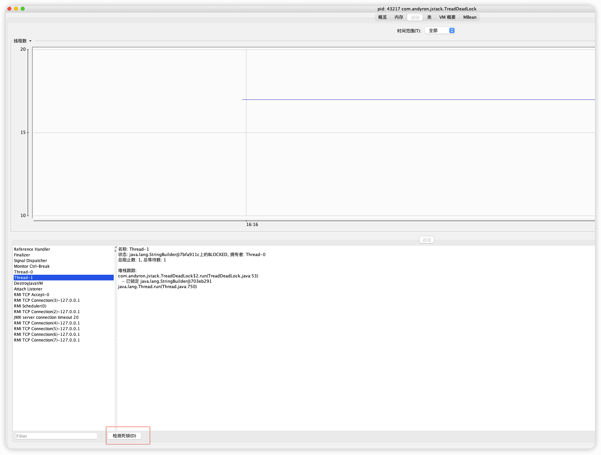

### 3.3 Visual VM❤️

jvisualvm和visual vm的区别：

visual vm是单独下载的工具，然后将visual vm结合到jdk中就变成了jvisualvm，仅仅是添加了一个j而已，这个j应该是java的用处，所以说jvisualvm其实就是visual vm

#### 基本概述

- Visual VM是一个功能强大的多合一故障诊断和性能监控的可视化工具。
- 它集成了多个JDK命令行工具，使用Visual VM可用于显示虚拟机进程及进程的配置和环境信息(jps,jinfo)p监视应用程序的CPU、GC、堆、万法区及线程的信恩(jstat、jstack)等，甚至代替JConsole。

- 在JDK 6 Update 7以后，Visual VM便作为JDK的一部分发布(VisualvM 在JDK/bin目录下），即：它完全免费。
- 此外， Visual VM也可以作为独立的软件安装：https://visualvm.github.io/index.html

#### 插件的安装

- Visual VM本身自己的插件

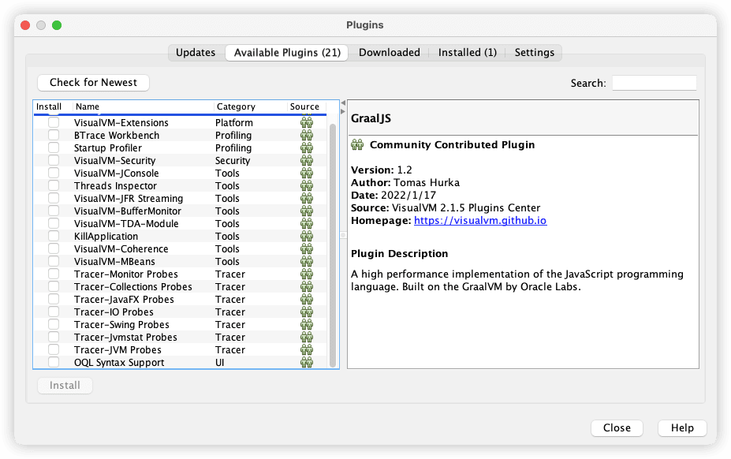

- IDEA中Visual VM的插件

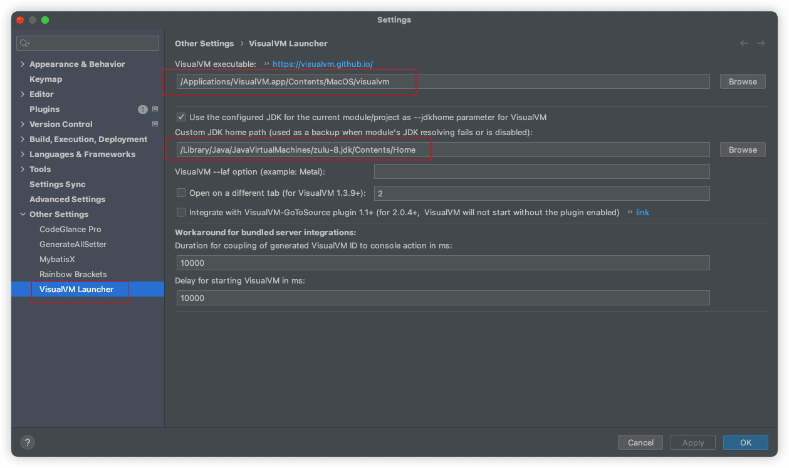

#### 连接方式

- 本地连接
  监控本地Java进程的CPU、类、线程等

- 远程连接

  1-确定远程服务器的ip地址
  2-添加JMX（通过JMX技术具体监控远程服务器哪个Java进程）
  3-修改bin/catalina.sh文件，连接远程的tomcat
  4-在…/conf中添加jmxremote.access和jmxremote.password文件
  5-将服务器地址改成公网ip地址
  6-设置阿里云安全策略和防火墙策略
  7-启动tomcat，查看tomcat启动日志和端口监听
  8-JMX中输入端口号、用户名、密码登录    


#### 主要功能

- 生成/读取堆内存快照


与另一个dump文件比较


- 查看JVM参数和系统属性

- 查看运行中的虚拟机进程

- 生成/读取线程快照

- 程序资源的实时监控

- 其他功能
      JMX代理连接
      远程环境监控
      CPU分析和内存分析

> park 驻留

- 抽样器

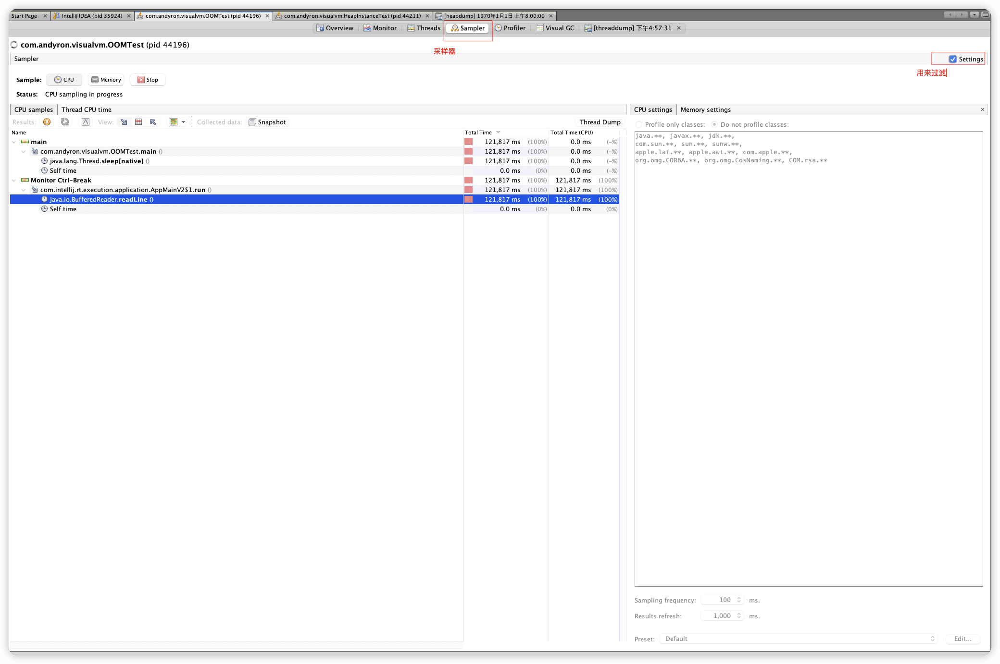

🔖p326 visual vm的使用过程

### 3.4 Eclipse MAT❤️

主要为了解决==内存泄漏==

#### 基本概述

MAT(Memory Analyzer Tool)工具是一款功能强大的Java堆内存分析器。可以用于查找内存泄漏以及查看内存消耗情況。

MAT是基于Eclipse开发的，不仅可以单独使用，还可以作为插件的形式嵌入在Eclipse中使用。是一款免费的性能分析工具，使用起来非常方便。大家可以在https://www.eclipse.org/mat/downloads.php

#### 获取堆dump文件

##### dump文件内存

MAT可以分析heap dump文件。在进行内存分析时，只要获得了反映当前设备内存映像的hprof文件，通过MAT打开就可以直观地看到当前的内存信息。

一般说来，这些内存信息包含：

- 所有的对象信息，包括对象实例、成员变量、存储于栈中的基本类型值和存储于堆中的其他对象的引用值。
- 所有的类信息，包括classloader、类名称、父类、静态变量等
- GCRoot到所有的这些对象的引用路径
- 线程信息，包括线程的调用栈及此线程的线程局部变量 (TLS)

##### 两点说明

说明1：缺点：

MAT不是一个万能工具，它并不能处理所有类型的堆存储文件。但是比较主流的厂家和格式，例如sun，HP，SAP 所采用的 HPROF 二进制堆存储文件，以及IBM 的 PHD 堆存储文件等都能被很好的解析。

说明2：

最吸引人的还是能够快速为开发人员生成==内存泄漏报表==，方便定位问题和分析问题。虽然MAT有如此强大的功能，但是内存分析也没有简单到一键完成的程度，很多内存问题还是需要我们从MAT展现给我们的信息当中通过经验和直觉来判断才能发现。


##### 获取dump文件

方法一：通过前一章介绍的 jmap工具生成，可以生成任意一个java进程的dump文件；

方法二：通过配置JVM参数生成。

- 选项“-xx:tHeapDumpOnoutOfMemoryError"或“-xx:tHeapDumpBeforeFu11GC"
- 选项"-xx:HeappumpPath"所代表的含义就是当程序出 现OutofMemory时，将会在相应的目录下生成一份dump文神。如果不指定选项“xx：HeapDumpPath”则在当前目录下生成dump文件。

对比：考虑到生产环境中几乎不可能在线对其进行分析，大都是采用离线分析，因此使用==jmap+MAT工具==是最常见的组合。

方法三：使用VisualVM可以导出堆dump文件

方法四：

使用MAT既可以打开一个已有的堆快照，也可以通过MAT==直接从活动Java程序中导出堆快照==。

该功能将借助jps列出当前正在运行的Java 进程，以供选择并获取快照。


🔖p328-p339

#### 分析堆dump文件

##### histogram

​    展示了各个类的实例数目以及这些实例的Shallow heap或者Retained heap的总和

##### thread overview

​    查看系统中的Java线程
​    查看局部变量的信息

##### 获得对象互相引用的关系

​    with outgoing references
​    with incoming references

##### 浅堆与深堆

- shallow heap

浅堆(Shallow Heap)是指一个对象所消耗的内存。在32位系统中，一个对象引用会占据4个字节，一个int类型会占据4个字节，long型变量会占据8个字节，每个对象头需要占用8个字节。根据堆快照格式不同，对象的大小可能会向8字节进行对齐。

以String 为例：2个int值共占8字节，对象引用占用4宇节，对象头8字节，合计20字节，向8字节对齐，故占24字节。(jdk7中）

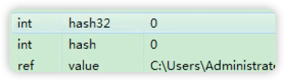

这24字节为string对象的浅堆大小。它与String的value实际取值无关，无论字符串长度如何，浅堆大小始终是24字节。

- retained heap

==保留集(Retained Set):==

对象A的保留集指当对象A被垃圾回收后，可以被释放的所有的对象集合(包括对象A本身)，即对象A的保留集可以被认为是==只能通过==对象A被直接或问接访问到的所有对象的集合。通俗地说，就是指仅被对象A所持有的对象的集合。

==深堆(Retained Heap)：==

深堆是指对象的保留集中所有的对象的浅堆大小之和。

注意：浅堆指对象本身占用的内存，不包括其内部引用对象的大小。一个对象的深堆指只能通过该对象

访问到的(直接或间接)所有对象的浅堆之和，即对象被回收后，可以释放的真实空间。

- 补充：对象实际大小

另外一个常用的概念是对象的实际大小。这里，对象的实际大小定义为一个对象==所能触及的==所有对象的浅堆大小之和，也就是通常意义上我们说的对象大小。与深堆相比，似乎这个在日常开发中更为直观和被人按受，但==实际上，这个概念和垃圾回收无关==。

下图显示了一个简单的对象引用关系图，对象A引用了C和D，对象B引用了C和E。那么对象A的浅堆大小只是A本身，不含C和D，而A的实际大小为A、C、D三者之和。而A的深堆大小为A与D之和，由于对象C还可以通过对象B访问到，因此不在对象A的深堆范围内。


- 练习

看图理解Retained Size

    

上图中，GC Roots 直接引用了A和B两个对象。

对象的Retained Size=A对象的Shal1ow Size

对象的Retained Size=B对象的Shallow Size + C对象的Shallow Size

这里不包括D对象，因为D对象被GC Roots直接引用。

如果GC Roots不引用D对象呢？


- 案例分析：StudentTrace

🔖p332


##### 支配树🔖

支配树 (Dominator Tree)，支配树的概念源自图论。

MAT提供了一个称为支配树 (Dominator Tree）的对象图。支配树体现了对象实例间的支配关系。在对象引用图中，所有指向对象B的路径都经过对象A，则认为==对象A支配对象B==。如果对象A是离对象B最近的一个支配对象，则认为对象A为对象B的==直接支配者==。支配树是基于对象间的引用图所建立的，它有以下基本性质：

- 对象A的子树《所有被对象A支配的对象集合）表示对象A的保留集 (retained set），即深堆。
- •如果对象A支配对象B，那么对象A的直接支配者也支配对象B。
- 支配树的边与对象引用图的边不直接对应。

如下图所示：左图表示对象引用图，右图表示左图所对应的支配树。对象A和B由根对象直接支配，由于在到对象C的路径中，可以经过A，也可以经过B，因此对象C的直接支配者也是根对象。对象F与对象D相互引用，因为到对象F的所有路径必然经过对象D，因此，对象D是对象F的直接支配者。而到对象D的所有路径中，必然经过对象C，即使是从对象F到对象口的引用，从根节点出发，也是经过对象C的，所以，对象D的直接支配者为对象C。


同理，对象E支配对象G。到达对象H的可以通过对象D，也可以通过对象E，因此对象口和E都不能支配对象H，而经过对象C既可以到达D世可以到达E，因此对象C为对象H的直接支配者。

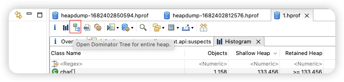

#### 案例：Tomcat堆溢出分析🔖

##### 说明

Tomcat 是最常用的Java servlet容器之一，同时也可以当做单独的web服务器使用。Tomcat本身使用用Java实现，并运行于Java虚拟机之上。在大规模请求时，Tomcat有可能会因为无法承受压力而发生内存溢出错误。这里根据一个被压垮的Tomcat的堆快照文件，来分析Tomcat在朋溃时的内部情況。

##### 分析过程

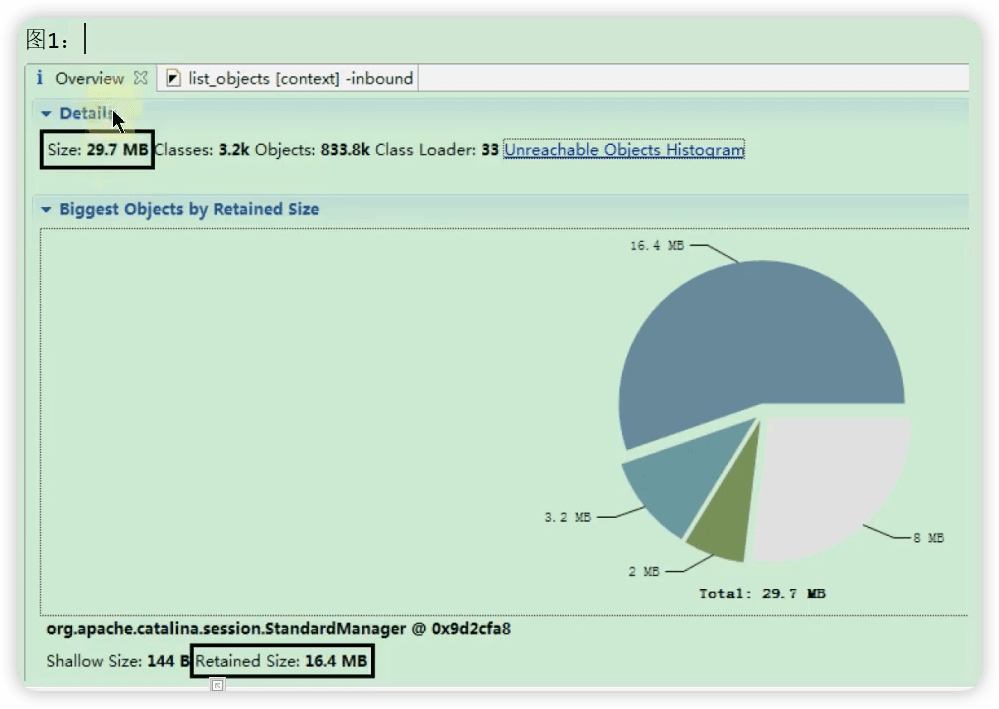

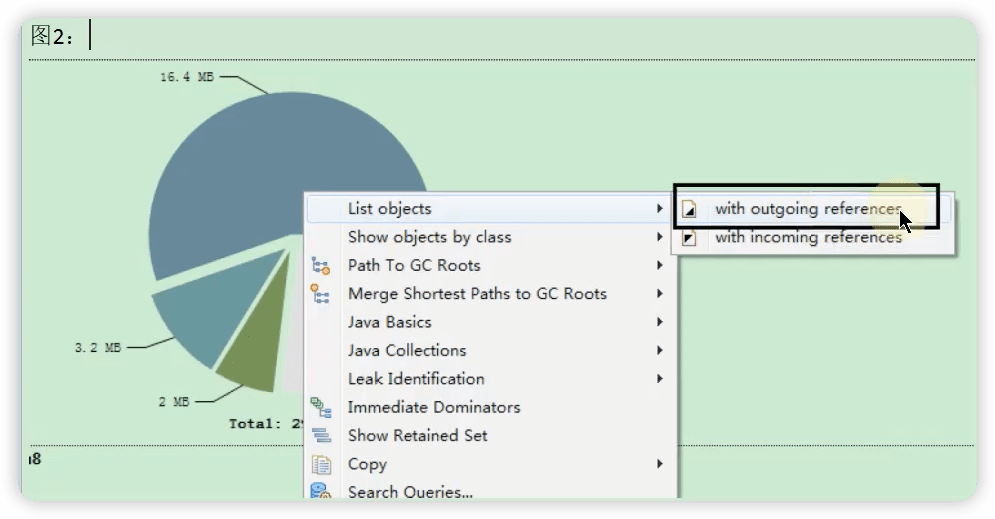

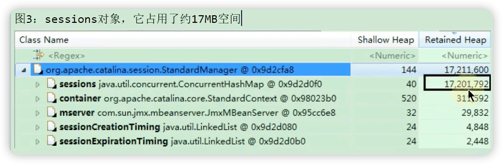


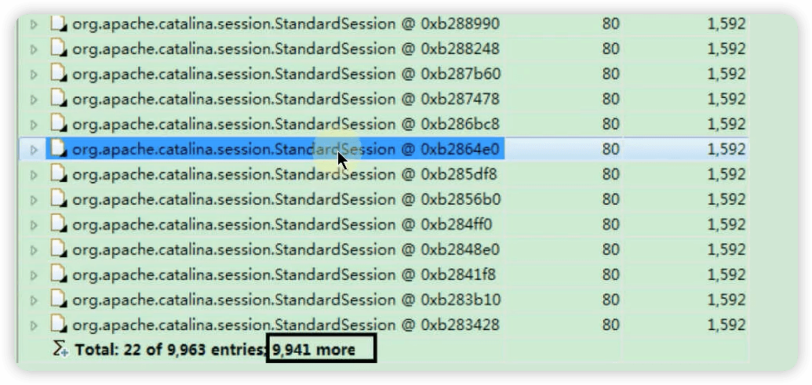

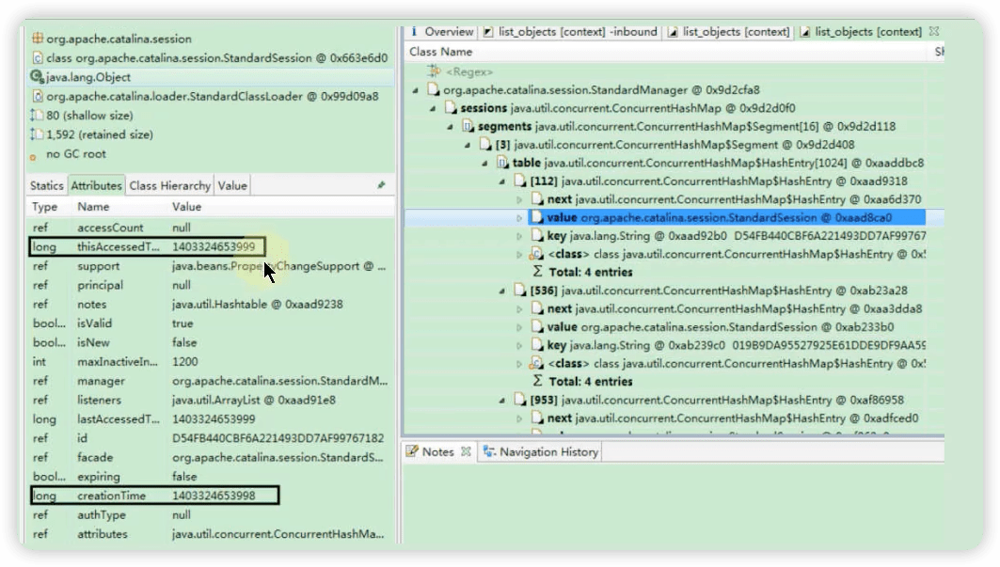

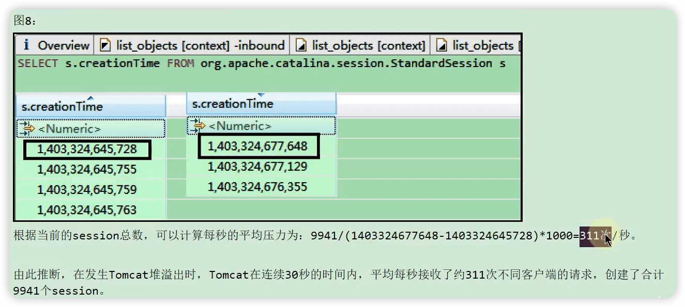


### 补充1：再谈内存泄露🔖

#### 内存泄露的理解与分析

<u>**何为内存泄漏 (memory leak)**</u>

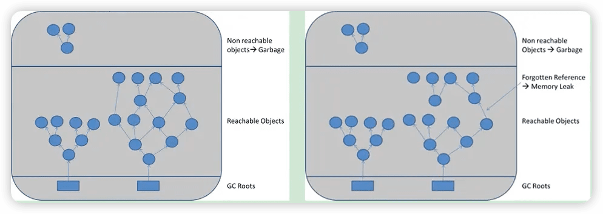

可达性分析算法来判断对象是否是不再使用的对象，本质都是判断一个对象是否还被引用。那么对于这种情况下，由于代码的实现不同就会出现很多种内存泄漏问题(让JVM误以为此对象还在引用中，无，法回收，造成内存泄漏）。

> 是否还被使用？ 
>
> 是否还被需要？
>
> 是、否 -> 泄漏， 

**内存泄漏(memory leak ）的理解**

严格来说，只有对象不会再被程序用到了，但是GC又不能回收他们的情況，才叫内存泄漏。

但实际情况很多时候一些不太好的实践（或疏忽〉会导致对象的生命周期变得很长甚至导致OOM，也可以叫作==宽泛意义上的“内存泄漏”==。

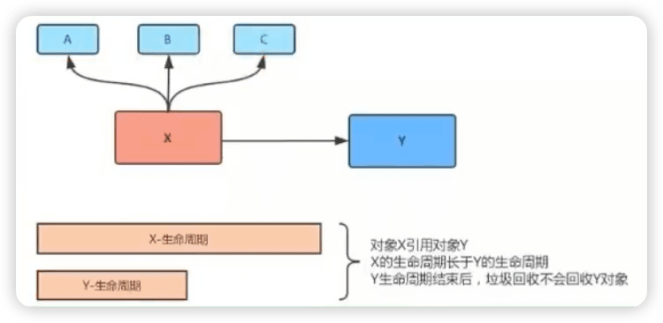

对象X 引用对象Y，X的生命周期比 Y 的生命周期长；

那么当Y生命周期结東的时候，x依然引用着V，这时候，垃圾回收期是不会回收对象丫的；

如果对象X还引用着生命周期比较短的A、B、C，对象A叉引用着对象日、b、c，这样就可能造成大量无用的对象不能被回收，进而占据了内存资源，造成内存泄漏，直到内存溢出。


**内存泄漏与内存溢出的关系：**

1．内存泄漏(memory leak )

申请了内存用完了不释放，比如一共有 1024M 的内存，分配了512M 的内存一直不回收，那么可以用的内存只有 512M 了，仿佛泄露掉了一部分：通俗一点讲的话，内存泄漏就是【占着茅坑不拉shi】【不操作也不使用】。

2．内存溢出 (out of memory)

申请内存时，没有足够的内存可以使用；

通俗一点儿讲，一个厕所就三个坑，有两个站着茅坑不走的（内存泄漏），剩下最后一个坑，厕所表示接待压力很大，这时候一下子来了两个人，坑位（内存）就不够了，内存泄漏变成内存溢出了。

可见，内存泄漏和内存溢出的关系：内存泄漏的增多，最终会导致内存溢出。


**泄漏的分类**

经常发生：发生内存泄露的代码会被多次执行，每次执行，泄露一块内存；

偶然发生：在某些特定情况下才会发生；

一次性：发生内存泄露的方法只会执行一次；

隐式泄漏：一直占着内存不释放，直到执行结束：严格的说这个不算内存泄漏，因为最终释放掉了，但是如果执行时间特别长，也可能会导致内存耗尽。


#### Java中内存泄露的8种情况

##### 1-静态集合类

##### 2-单例模式

##### 3-内部类持有外部类

##### 4-各种连接，如数据库连接、网络连接和IO连接等

##### 5-变量不合理的作用域

##### 6-改变哈希值

##### 7-缓存泄露

##### 8-监听器和回调


#### 内存泄露案例分析

案例代码
分析
解决办法


### 补充2：支持使用OQL语言查询对象信息

MAT支持一种类似于SQL的查询语言OQL (Object Query Language）。 OQL使用类SQL语法，可以在堆中进行对象的查找和筛选。

SELECT子句


FROM子句


WHERE子句


内置对象与方法


**例子：** 

1. select  * from  java.util.ArrayList（列出所有的ArrayList对象信息） 
2. select  v.elementData from  java.util.ArrayList v（注意：elementData代表ArrayList中的数组，结果最终以数组形式将结果呈现出来） 
3. select  objects  v.elementData from  java.util.ArrayList v（注意：elementData代表ArrayList中的数组，objects代表对象类型，所以最终以对象形式将结果呈现出来，同时展示出来的还有浅堆、深堆） 
4. select  as  retained  set  * from  com.atguigu.mat.Student（得到对象的保留级） 
5. select  * from  0x6cd57c828（0x6cd57c828是Student类的地址值） 
6. select  * from  char[] s where  s.@length > 10（char型数组长度大于10的数组） 
7. select  * from  java.lang.String s where  s.value != null（字符串值不为空的字符串信息） 

1. select toString (f.path.value) from java.io.File f（列出文件的路径值） 
2. select  v.elementData.@length from  java.util.ArrayList v（列出Arraylist对象中ArrayList中的数组长度） 


### 3.5 JProfiler

#### 基本概述

在运行Java餘时 候有时候想测试运行时占用内存情况，这时候就需要使用测试工具查看了。在eclipse里面有 Eclipse Memory Analvzer tool（MAT)插件可以测试，而在IDEA中也有这么一个插件，就是JProfiler。

JProfiler 是由 ej-technologies 公司开发的一款 Java应用性能诊断工具。功能强大，但是收费。

官网下载地址：https://www.ej-technologies.com/products/jprofiler/overview.html


特点
  主要功能
    1-方法调用
      对方法调用的分析可以帮助您了解应用程序正在做什么，并找到提高其性能的方法
    2-内存分配
      通过分析堆上对象、引用链和垃圾收集能帮您修复内存泄露问题，优化内存使用
    3-线程和锁
      JProfiler提供多种针对线程和锁的分析视图助您发现多线程问题
    4-高级子系统
      许多性能问题都发生在更高的语义级别上。例如，对于JDBC调用，您可能希望找出执行最慢的SQL语句。JProfiler支持对这些子系统进行集成分析

#### 安装与配置

  下载与安装
  JProfiler中配置IDEA
  IDEA集成JProfiler

#### 具体使用

- 数据采集方式
      instrumentation重构模式
      Sampling抽样模式


- 遥感监测 Telemetries

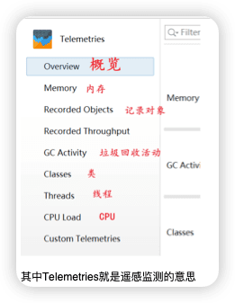

- 内存视图 Live Memory

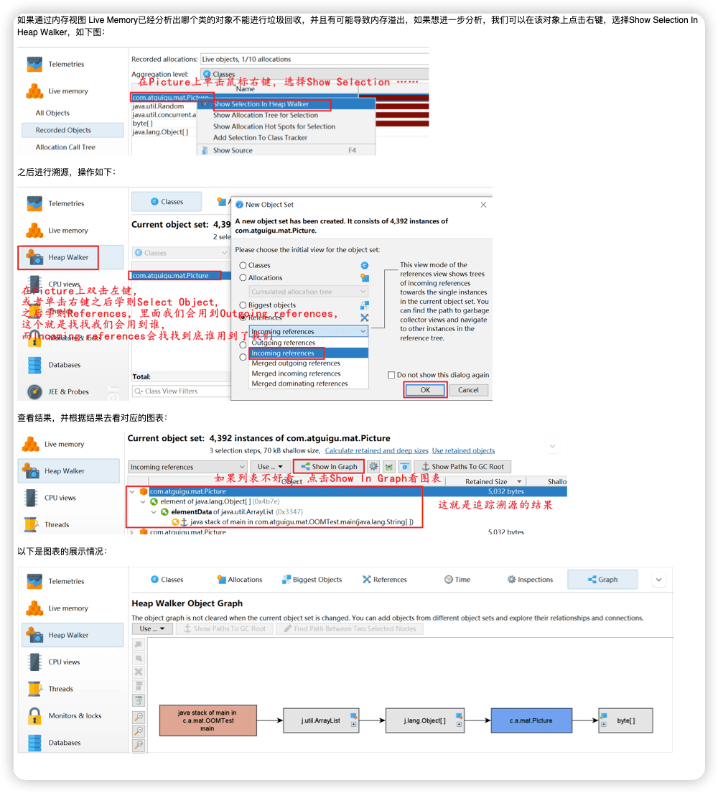

- 堆遍历 heap walker


- cpu视图 cpu views

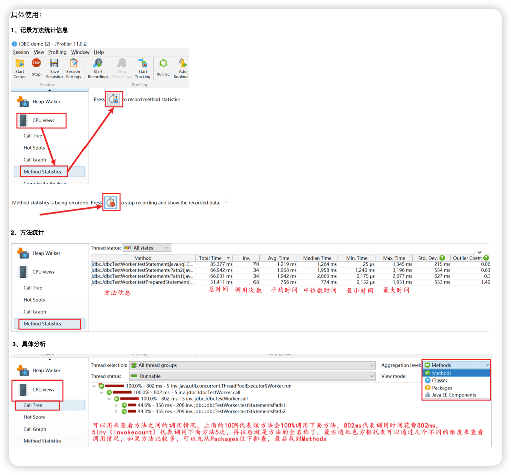

- 线程视图 threads


- 监视器&锁 Monitors&locks

#### 案例分析

案例1


案例2


### 3.6 Arthas

阿尔萨斯

#### 基本概述

背景

Visual VM和JProfiler这两款工具在业界知名度也比较高，他们的优点是可以图形界面上看到各维度的性能数据，使用者根据这些数据进行综合分析，然后判断哪里出现了性能问题。

但是这两款工具也有个缺点，**<u>都必须在服务端项目进程中配置相关的监控参数。然后工具通过远程连按到项目进程，获取相关的数据</u>**。这样就会带来一些不便，比如线上环境的网络是隔离的，本地的监控工具根本连不上线上环境。并且类似于Jprofiler这样的商业工具，是需要付费的。

那么有没有一款工具不需要远程连接，也不需要配置监控参数，同时也提供了丰富的性能监控数据呢?

今天跟大家介绍一款阿里巴巴开源的性能分析神器Arthas（阿尔萨斯）  


#### 概述

Arthas（阿尔萨斯）是Alibaba开源的Java诊断工具，深受开发者喜爱。在线排查问题，无需重启；动态跟踪Java代码；实时监控JVM状态。

Arthas 支持JDK 6+，支持Linux/Mac/Windows，采用命令行交互模式来同时提供丰富的 Tab 自动补全功能，进一步方便进行问题的定位和诊断。

当你遇到以下类似问题而束手无策时，Arthas可以帮助你解决：

- 这个类从哪个jar 包加载的？为什么会报各种类相关的 Exception?
- 我改的代码为什么没有执行到？难道是我没commit？分支搞错了？
- 遇到问题无法在线上debug，难道只能通过加日志再重新发布吗？
- 线上遇到某个用户的数据处理有问题，但线上同样无法 debug，线下无法重现！
- 是否有一个全局视角来杳看系统的运行状况？
- 有什么办決可以监控到JVM的实时运行状杰？
- 怎么快速定位应用的热点，生成火焰图？


#### 基于哪些工具开发而来

- greys-anatomy： Arthas代码基于Greys二次开发而来，非常感谢Greys之前所有的工作，以及Greys原作者对Arthas提出的意见和建议！
- termd： Arthas的命令行实现基于termd开发，是一款优秀的命令行程序开发框架，感谢termd提供了优秀的框架。
- crash：Arthas的文本渲染功能基于crash中的文本渲染功能开发，可以从这里看到源码，感谢crash在这方面所做的优秀工作。
- cli： Arthas的命令行界面基于vert.x提供的cli库进行开发，感谢vert.x在这方面做的优秀工作。
- compiler Arthas里的内行编绎器代码来源
- Apache Commons Net Arthas里的Telnet Client代码来源
- JavaAgent：运行在 main方法之前的拦截器，它内定的方法名叫 premain，也就是说先执行premain 方法然后再执行 main 方法
- ASM： 一个通用的Java宇节码操作和分析框架。它可以用于修改现有的类或直接以二进制形式动态生成类。ASM提供了一些常见的字节码转换和分析算法，可以从它们构建定制的复尜转换和代码分析工具。ASM提供了与其他Java字节码框架类似的功能，但是主要关注性能。因为它被设计和实现得尽可能小和快，所以非常适合在动态系统中使用(当然也可以以静态方式使用，例如在编译器中）


官方使用文档  https://arthas.aliyun.com/doc/quick-start.html


#### 安装与使用

  安装
  工程目录
  启动
  查看进程
  查看日志
    cat ~/logs/arthas/arthas.log
  查看帮助
    java -jar arthas-boot.jar -h
  web console
  退出

#### 相关诊断指令

基础指令


jvm相关
    dashboard
    thread
    jvm
    其他


class/classloader相关
    sc
    sm
    jad
    mc、redefine
    classloader

monitor/watch/trace相关
    monitor
    watch
    trace
    stack
    tt


其他
    profiler/火焰图
    options


### 3.7 Java Misssion Control

#### 历史

在 Oracle 收购sun 之前，Oracle 的 JRockit 虛拟机提供了一款叫做 JRockit Mission control 的虚拟机诊断工具。

在Oracle收购Sun之后，Oracle公司同时拥有了Sun Hotspot和JRockit两款虚拟机。根据oracle对于Java的战略，在今后的发展中，会將JRockit的优秀特性移植到Hotspot上。其中，一个重要的改进就是在Sun的JDK中加入了JRockit的支持。

在Oracle JDK 7u40之后，Mission Control这款工具己经鄉定在Oracle JDK中发布。

自 Java 11 开始，本节介绍的 JFR 己经开源。但在之前的 Java 版本，JFR 属于Commercial Feature， 需要通过 Java 虛拟机参数`-XX:+UnlockcommercialFeatures`开启。

如果你有兴趣请可以查看OpenJDK的Mission control项目。

https://github.com/JDKMissionControl/jmc


#### 启动

#### 概述

Java Mission control （简称JMC），Java官方提供的性能强劲的工具。是一个用于对Java 应用程序进行管理、监视、概要分析和故障排除的工具套件。

它包含一个GUI 客户端，以及众多用来收集 Java 虚拟机性能数据的插件，如 JMX Console（能够访问用来存放虚拟机各个子系统运行数据的MxBeans），以及虚拟机内罝的高效profiling 工具 Java Flight Recorder ( JFR)。

JMC 的另一个优点就是：**采用取样，而不是传统的代码植入技术，对应用性能的影响非常非常小，完全可以开着JMC 来做压测（唯一影响可能是full gC多了）。**


#### 功能：实时监控JVM运行时的状态


#### Java Flight Recorder

  事件类型
  启动方式
    方式1：使用-XX:StartFlightRecording=参数
    方式2：使用jcmd的JFR.*子命令
    方式3：JMC的JFR插件
  Java Flight Recorder 取样分析
    代码
    结果


### 3.8 其他工具


#### Flame Graphs（火焰图）

在追求极致性能的场景下，了解你的程序运行过程中cpu在干什么很重要，火焰图就是一种非常直观的展示cpu在程序整个生命周期过程中时间分配的工具。

火焰图对于现代的程序员不应该陌生，这个工具可以非常直观的显示出调用栈中的CPU消耗瓶颈。

网上的关于java火焰图的讲解大部分来自于Brendan Gregg的博客：

http://www.brendangregg.com/flamegraphs.html


#### Tprofiler

- 案例：

使用 JDK 自身提供的工具进行 JVM 调优可以将 TPS 由 2.5 提升到 20（提升了 7倍），并淮确定位系统瓶颈。

系统瓶颈有：应用里静态对象不是太多、有大量的业务线程在频繁创建一些生命周期很长的临时对象，代码里有问题。

那么，如何在海量业务代码里边准确定位这些性能代码？这里使用阿里开源工具 TProfiler 来定位这些性能代码，成功解决掉了 GC 过于频繁的性能瓶颈，并最终在上次优化的基础上将 TPS 再提升了4 倍，即提升到 100。

- TProfiler 配置部署、远程操作、日志阅读都不太复杂，操作还是很简单的。但是其却是能够起到一针见血、立竿见影的效果，帮我们解决了 GC 过于频繁的性能瓶颈。
- TProfiler 最重要的特性就是==能够统计出你指定时间段内 JVM 的top method==，这些topmethod 极有可能就是造成你 JVM 性能瓶颈的元凶。这是其他大多数JVM 调优工具所不具备的，包括 JRockit Mission Control。 jRokit 首席开发者 Marcus Hirt 在其私人博客《Low Overhead Method profiling with Java Mission control》下的评论中曾明确指出JRMC 并不支持 TOP 方法的统计。

#### Btrace

Java运行时追踪工具

#### YourKit

#### JProbe

#### Spring Insight


## 4 JVM运行时参数

P363

### 4.1 JVM参数选项类型

https://docs.oracle.com/javase/8/docs/technotes/tools/unix/java.html

#### 类型一：标准参数选项

特点：比较稳定，后续版本基本不会变化，==以-开头==。

直接在DOS窗口中运行java或者java -help可以看到所有的标准选项。

```shell
➜  java
用法: java [-options] class [args...]
           (执行类)
   或  java [-options] -jar jarfile [args...]
           (执行 jar 文件)
其中选项包括:
    -d32	  使用 32 位数据模型 (如果可用)
    -d64	  使用 64 位数据模型 (如果可用)
    -server	  选择 "server" VM
                  默认 VM 是 server,
                  因为您是在服务器类计算机上运行。


    -cp <目录和 zip/jar 文件的类搜索路径>
    -classpath <目录和 zip/jar 文件的类搜索路径>
                  用 : 分隔的目录, JAR 档案
                  和 ZIP 档案列表, 用于搜索类文件。
    -D<名称>=<值>
                  设置系统属性
    -verbose:[class|gc|jni]
                  启用详细输出
    -version      输出产品版本并退出
    -version:<值>
                  警告: 此功能已过时, 将在
                  未来发行版中删除。
                  需要指定的版本才能运行
    -showversion  输出产品版本并继续
    -jre-restrict-search | -no-jre-restrict-search
                  警告: 此功能已过时, 将在
                  未来发行版中删除。
                  在版本搜索中包括/排除用户专用 JRE
    -? -help      输出此帮助消息
    -X            输出非标准选项的帮助
    -ea[:<packagename>...|:<classname>]
    -enableassertions[:<packagename>...|:<classname>]
                  按指定的粒度启用断言
    -da[:<packagename>...|:<classname>]
    -disableassertions[:<packagename>...|:<classname>]
                  禁用具有指定粒度的断言
    -esa | -enablesystemassertions
                  启用系统断言
    -dsa | -disablesystemassertions
                  禁用系统断言
    -agentlib:<libname>[=<选项>]
                  加载本机代理库 <libname>, 例如 -agentlib:hprof
                  另请参阅 -agentlib:jdwp=help 和 -agentlib:hprof=help
    -agentpath:<pathname>[=<选项>]
                  按完整路径名加载本机代理库
    -javaagent:<jarpath>[=<选项>]
                  加载 Java 编程语言代理, 请参阅 java.lang.instrument
    -splash:<imagepath>
                  使用指定的图像显示启动屏幕
有关详细信息, 请参阅 http://www.oracle.com/technetwork/java/javase/documentation/index.html。
```

#### 类型二：-X参数选项

特点：非标准化参数，功能还是比较稳定的。但官方说后续版本可能会变更，以`-X`开头。

直接在DOS窗口中运行java -X命令可以看到所有的X选项

```shell
➜  java -X
    -Xmixed           混合模式执行 (默认)
    -Xint             仅解释模式执行
    -Xbootclasspath:<用 : 分隔的目录和 zip/jar 文件>
                      设置搜索路径以引导类和资源
    -Xbootclasspath/a:<用 : 分隔的目录和 zip/jar 文件>
                      附加在引导类路径末尾
    -Xbootclasspath/p:<用 : 分隔的目录和 zip/jar 文件>
                      置于引导类路径之前
    -Xdiag            显示附加诊断消息
    -Xnoclassgc       禁用类垃圾收集
    -Xincgc           启用增量垃圾收集
    -Xloggc:<file>    将 GC 状态记录在文件中 (带时间戳)
    -Xbatch           禁用后台编译
    -Xms<size>        设置初始 Java 堆大小
    -Xmx<size>        设置最大 Java 堆大小
    -Xss<size>        设置 Java 线程堆栈大小
    -Xprof            输出 cpu 配置文件数据
    -Xfuture          启用最严格的检查, 预期将来的默认值
    -Xrs              减少 Java/VM 对操作系统信号的使用 (请参阅文档)
    -Xcheck:jni       对 JNI 函数执行其他检查
    -Xshare:off       不尝试使用共享类数据
    -Xshare:auto      在可能的情况下使用共享类数据 (默认)
    -Xshare:on        要求使用共享类数据, 否则将失败。
    -XshowSettings    显示所有设置并继续
    -XshowSettings:all
                      显示所有设置并继续
    -XshowSettings:vm 显示所有与 vm 相关的设置并继续
    -XshowSettings:properties
                      显示所有属性设置并继续
    -XshowSettings:locale
                      显示所有与区域设置相关的设置并继续

-X 选项是非标准选项, 如有更改, 恕不另行通知。


以下选项为 Mac OS X 特定的选项:
    -XstartOnFirstThread
                      在第一个 (AppKit) 线程上运行 main() 方法
    -Xdock:name=<应用程序名称>"
                      覆盖停靠栏中显示的默认应用程序名称
    -Xdock:icon=<图标文件的路径>
                      覆盖停靠栏中显示的默认图标
```

JVM的JIT编译模式相关的选项：

- `-Xint`

​	只使用解释器（**interpreter**）：所有字节码都被解释执行，这个模式的速度是很慢的。

- `-Xcomp`

​	只使用编译器（**compiler**）：所有字节码第一次使用就被编译成本地代码，然后在执行。

- `-Xmixed`

​	混合模式：这是默认模式，刚开始的时候使用解释器慢慢解释执行，后来让JIT即时编译器根据程序运行的情况，有选择地将某些热点代码提前编译并缓存在本地，在执行的时候效率就非常高了


-Xmx -Xms -Xss属于XX参数？

`-Xms<size>`    设置初始Java堆大小，等价于-XX:InitialHeapSize

`-Xmx<size>`    设置最大Java堆大小，等价于-XX:MaxHeapSize

`-Xss<size>`     设置Java线程堆栈大小，等价于-XX:ThreadStackSize


#### 类型三：-XX参数选项

特点：非标准化参数，使用的最多的参数类型，这类选项属于实验性，不稳定，以`-XX`开头。

作用：用于开发和调试JVM

##### 分类

- Boolean类型格式

  `-XX:+<option>` 表示启用option属性，`-XX:-<option>`表示禁用option属性

  ```shell
  -XX:+UseParallelGC 		选择垃圾收集器为并行收集器
  -XX:+UseG1GC 					表示启用G1收集器
  -XX:+UseAdaptivesizePolicy 自动选择年轻代区大小和相应的Survivor区比例
  ```

  说明：因为有的指令默认是开启的，所以可以使用-关闭

- 非Boolean类型格式（key-value类型）

  子类型1：数值型格式`-XX:<option>=<number>`

  number表示数值，number可以带上单位，比如：‘m’、‘M° 表示兆，‘k‘、‘K’表示兆，‘g’、‘G’表示g（例如 32k跟32768是一样的效果）例如：

  `-XX:NewSize=1024m` 表示设置新生代初始大小为1024兆

  `-XX:MaxGCPauseMi11is=500` 表示设置GC停顿时间：500毫秒

  `-XX:GCTimeRatio=19` 表佘设置吞吐量

  `-XX:NewRatio=2` 表示新生代与老年代的比例

  子类型2：非数值型格式`-XX:<name>=<string>`

  `-XX:HeapDumpPath=/usr/local/heapdump.hprof` 用来指定heap转存文件的存储路径。


特别地：`-XX:+PrintFlagsFinal`

​		输出所有参数的名称和默认值

​		默认不包括Diagnostic和Experimental的参数

​		可以配合-XX:+UnlockDiagnosticVMOptions和-XX:UnlockExperimentalVMOptions使用


### 4.2 添加JVM参数选项


运行jar包：

`java -Xms50m -Xmx50m -XX:+PrintGCDetails -XX:+PrintGCTimeStamps -jar demo.jar`


通过Tomcat运行war包：

- Linux系统下可以在tomcat/bin/catalina.sh中添加类似如下配置：JAVA_OPTS="-Xms512M -Xmx1024M"

- Windows系统下载catalina.bat中添加类似如下配置：set "JAVA_OPTS=-Xms512M -Xmx1024M"


程序运行过程中

- 使用`jinfo -flag <name>=<value> <pid>`设置非Boolean类型参数
- 使用`jinfo -flag [+|-]<name> <pid>`设置Boolean类型参数


### 4.3 常用的JVM参数选项

#### 打印设置的XX选项及值

- `-XX:+PrintCommandLineFlags`  可以让程序运行前打印出用户手动设置或者JVM自动设置的XX选项
- `-XX:+PrintFlagsInitial`  表示打印出所有XX选项的默认值
- `-XX:+PrintFlagsFinal`  表示打印出XX选项在运行程序时生效的值  
- `-XX:+PrintVMOptions`  打印JVM的参数

#### 堆、栈、方法区等内存大小设置

栈 1 2

- `-Xss128k`

堆内存

- `-Xms3550m`  等价于-XX:InitialHeapSize，设置JVM初始堆内存为3500M

- `-Xmx3550m`    等价于-XX:MaxHeapSize，设置JVM最大堆内存为3500M

- `-Xmn2g`
      设置年轻代大小为2G，即等价于-XX:NewSize=2g -XX:MaxNewSize=2g，也就是设置年轻代初始值和年轻代最大值都是2G
      官方推荐配置为整个堆大小的3/8

- `-XX:NewSize=1024m`
      设置年轻代初始值为1024M

- `-XX:MaxNewSize=1024m`
      设置年轻代最大值为1024M

- `-XX:SurvivorRatio=8`
      设置年轻代中Eden区与一个Survivor区的比值，默认为8

- `-XX:+UseAdaptiveSizePolicy`
      自动选择各区大小比例，默认开启

- `-XX:NewRatio=2`
      设置老年代与年轻代（包括1个Eden区和2个Survivor区）的比值，默认为2

- `-XX:PretenureSizeThreadshold=1024`
      设置让大于此阈值的对象直接分配在老年代，单位为字节
      只对Serial、ParNew收集器有效

- `-XX:MaxTenuringThreshold=15`
      默认值为15
      新生代每次MinorGC后，还存活的对象年龄+1，当对象的年龄大于设置的这个值时就进入老年代

- `-XX:+PrintTenuringDistribution`
      让JVM在每次MinorGC后打印出当前使用的Survivor中对象的年龄分布

- `-XX:TargetSurvivorRatio`
      表示MinorGC结束后Survivor区域中占用空间的期望比例

  

方法区（永久代）

- `-XX:PermSize=256m`
        设置永久代初始值为256M
- `-XX:MaxPermSize=256m`
        设置永久代最大值为256M

方法区（元空间）

- `-XX:MetaspaceSize`
        初始空间大小

- `-XX:MaxMetaspaceSize`
        最大空间，默认没有限制    

- `-XX:+UseCompressedOops`
        使用压缩对象指针

- `-XX:+UseCompressedClassPointers`
        使用压缩类指针

- `-XX:CompressedClassSpaceSize`
        设置Klass Metaspace的大小，默认1G

  

直接内存

- `-XX:MaxDirectMemorySize`
      指定DirectMemory容量，若未指定，则默认与Java堆最大值一样

#### OutOfMemory相关的选项🔖

`-XX:+HeapDumpOnOutMemoryError`
  表示在内存出现OOM的时候，生成Heap转储文件，以便后续分析，-XX:+HeapDumpBeforeFullGC和-XX:+HeapDumpOnOutMemoryError只能设置1个
`-XX:+HeapDumpBeforeFullGC`
  表示在出现FullGC之前，生成Heap转储文件，以便后续分析，-XX:+HeapDumpBeforeFullGC和-XX:+HeapDumpOnOutMemoryError只能设置1个，请注意FullGC可能出现多次，那么dump文件也会生成多个
`-XX:HeapDumpPath=<path>`
  指定heap转存文件的存储路径，如果不指定，就会将dump文件放在当前目录中
`-XX:OnOutOfMemoryError`
  指定一个可行性程序或者脚本的路径，当发生OOM的时候，去执行这个脚本

#### 垃圾收集器相关选项

- 查看默认的垃圾回收器

-xx:+PrintCommandLineFlags：查看命令行相关参数《包含使用的垃圾收集器）

使用命令行指令：jinfo - f1ag 相关垃圾回收器参数 进程ID

- Serial回收器


- Parnew回收器


- Parallel回收器


- CMS回收器


补充参数

 

特别说明


- G1回收器


Mixed GC调优参数


##### 怎么选择垃圾收集器

优先调整堆的大小让JVM自适应完成。

- 如果内存小于100M，使用串行收集器
- 如果是单核、单机程序，并且没有停顿时间的要求，串行收集器
- 如果是多CPU、需要高吞吐量、允许停顿时间超过1秒，选择并行或者JVM自己选择
- 如果是多CPU、追求低停顿时间，需快速响应（比如延迟不能超过1秒，如互联网应用），使用并发收集器。官方推荐G1，性能高。现在互联网的项目，基本都是使用G1。

特别说明：

1．没有最好的收集器，更没有万能的收集：

2．调优永远是针对特定场景、特定需求，不存在一劳永逸的收集器


#### GC日志相关选项

##### 常用参数

`-verbose:gc`
  输出日志信息，默认输出的标准输出
  可以独立使用
`-XX:+PrintGC`
  等同于-verbose:gc 表示打开简化的日志
  可以独立使用
`-XX:+PrintGCDetails`
  在发生垃圾回收时打印内存回收详细的日志， 并在进程退出时输出当前内存各区域的分配情况
  可以独立使用
`-XX:+PrintGCTimeStamps`
  程序启动到GC发生的时间秒数
  不可以独立使用，需要配合-XX:+PrintGCDetails使用
`-XX:+PrintGCDateStamps`
  输出GC发生时的时间戳（以日期的形式，例如：2013-05-04T21:53:59.234+0800）
  不可以独立使用，可以配合-XX:+PrintGCDetails使用
`-XX:+PrintHeapAtGC`
  每一次GC前和GC后，都打印堆信息
  可以独立使用
`-XIoggc:<file>`
  把GC日志写入到一个文件中去，而不是打印到标准输出中

##### 其他参数

`-XX:TraceClassLoading`
  监控类的加载
`-XX:PrintGCApplicationStoppedTime`
  打印GC时线程的停顿时间
`-XX:+PrintGCApplicationConcurrentTime`
  垃圾收集之前打印出应用未中断的执行时间
`-XX:+PrintReferenceGC`
  记录回收了多少种不同引用类型的引用
`-XX:+PrintTenuringDistribution`
  让JVM在每次MinorGC后打印出当前使用的Survivor中对象的年龄分布
`-XX:+UseGCLogFileRotation`
  启用GC日志文件的自动转储
`-XX:NumberOfGCLogFiles=1`
  GC日志文件的循环数目
`-XX:GCLogFileSize=1M`
  控制GC日志文件的大小

#### 其他参数

`-XX:+DisableExplicitGC`
  禁用hotspot执行System.gc()，默认禁用
`-XX:ReservedCodeCacheSize=<n>[g|m|k]`、`-XX:InitialCodeCacheSize=<n>[g|m|k]`
  指定代码缓存（JIT会缓存热点代码的编译后指令到方法区）的大小
`-XX:+UseCodeCacheFlushing`
  使用该参数让jvm放弃一些被编译的代码， 避免代码缓存被占满时JVM切换到interpreted-only的情况
`-XX:+DoEscapeAnalysis`
  开启逃逸分析
`-XX:+UseBiasedLocking`
  开启偏向锁
`-XX:+UseLargePages`
  开启使用大页面
`-XX:+PrintTLAB`
  打印TLAB的使用情况
`-XX:TLABSize`
  设置TLAB大小


### 4.4 通过java代码获取JVM参数

Java提供了 java.1ang.management包用于监视和管理Java虚拟机和Java运行时中的其他组件，它允许本地和远程监控和管理运行的Java虛拟机。其中ManagementFactory这个类还是挺常用的。另外还有Runtime 类也可以获取一些内存、CPU核数等相关的数据。

通过这些api可以监控我们的应用服务器的堆内存使用情况，设置一些阈值进行报警等处理。


## 5 分析GC日志

P375

### 5.1 GC日志参数

1. `-verbose:gc`

输出gc日志信息，默认输出到标准输出

2. `-XX:+PrintGC`

输出GC日志。类似：-verbose:gc

3. `-XX:+PrintGCDetails`

在发生垃圾回收时打印内存回收相处的日志，并在进程退出时输出当前内存各区域分配情况

4. `-XX:+PrintGCTimeStamps`

输出GC发生时的时间戳

5. `-XX:+PrintGCDateStamps`

输出GC发生时的时间戳（以日期的形式，例如：2013-05-04T21:53:59.234+0800）

6. `-XX:+PrintHeapAtGC`

每一次GC前和GC后，都打印堆信息

7. `-Xloggc:<file>`

表示把GC日志写入到一个文件中去，而不是打印到标准输出中


### 5.2 GC日志格式


### 5.3 特殊问题：新生代与老年代的比例


### 5.4 GC日志分析工具

GCeasy

GCViewer


---------


## 6 OOM常见各种场景及解决方案

P302

案例1：堆溢出


案列2：元空间溢出


案例3：GC overhead limit exceeded


案例4：线程溢出


## 7 性能优化案例

性能测试工具：Jmeter


案例1：调整堆大小提高服务的吞吐量


案例2：调整垃圾回收器提供服务的吞吐量


案例3：JVM优化之JIT优化


案例4：G1并发执行的线程数对性能的影响


案例5：合理配置堆内存


案例6：CPU占用很高排查方案


日均百万级订单交易系统如何设置JVM参数

## 8 Java代码层及其它层面调优


> 延迟满足
>
> 遵守时间的价值
>
> 保有好奇心
