 尚硅谷JVM-2
----

[尚硅谷宋红康JVM全套教程（详解java虚拟机）](https://www.bilibili.com/video/BV1PJ411n7xZ)

《内存与垃圾回收篇》p1-p203

《字节码与类的加载篇》p204-p301

《性能监控与调优篇》三个篇章 p302-p381

Java8 本课程基于

Java11 LTS

> JVMDemo  第一部分示列代码
>
> JVMDemo2 第二、三部分示列代码


# 二、字节码与类的加载篇

p204

## 1 class文件结构

### 1.1 概述

#### 字节码文件的跨平台性

1. Java语言：跨平台的语言

- 当Java源代码成功编译成字节码后，如果想在不同的平台上面运行，则无须再次编译
- 这个优势不再那么吸引人了。Python、PHP、Perl、Ruby、Lisp等有强大的解释器。
- 跨平台似乎己经快成为一门语言必选的特性。

2. Java虚拟机：跨语言的平台

Java虚拟机不和包括 Java 在内的任何语言绑定，它只与“Class文件”这种特定的二进制文件格式所关联。无论使用何种语言进行软件开发，只要能将源文件编译为正确的Class文件，那么这种语言就可以在Java虚拟机上执行。可以说，统一而强大的Class文件结构，就是Java虛拟机的基石、桥梁。

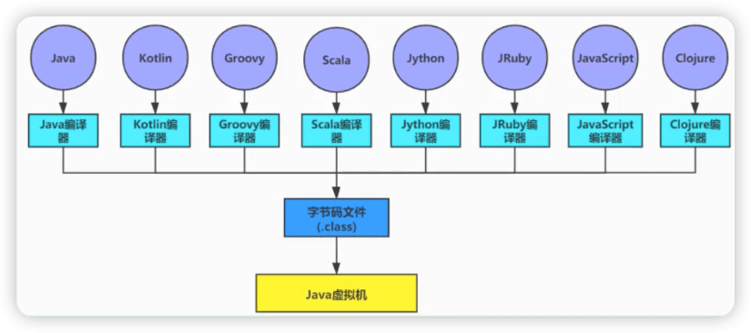

https://docs.oracle.com/javase/specs/index.html

所有的JVM全部遵守了java虚拟机规范，也就是说所有的JVM环境都是一样的，这样一来字节码文件可以在各种JVM上运行。

3. 想要让一个Java程序 正确地运行在JVM中，Java源码就必领要被编译为符合JVM规范的字节码。

- ==前端编译器==的主要任务就是负责将符合Java语法规范的Java代码转换为符合JVM规范的字节码文件。
- javac是一种能够将Java源码编译为字节码的前端编译器。
- javac编译器在将java源码编译为一个有效的字节码文件过程中经历了4个步骤，分别是==词法解析、语法解析、语义解析以及生成字节码==。

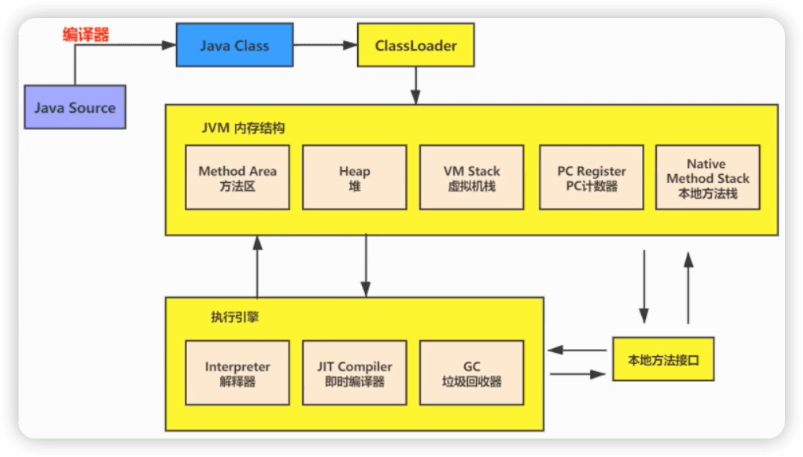

oracle的JDK软件包括两部分内容：

- 一部分是将Java源代码编译成Java虚拟机的指令集的编译器。

- 另一部分是用于实现java虛拟机的运行时环境。

#### Java的前端编译器

前端编译器 vs 后端编译器

Java源代码的编译结果是字节码，那么肯定需要有一种编译器能够将Java源码编译为字节码，承担这个重要责任的就是配罝在path环境变量中的==javac编译器==。javac是一种能够将Java源码编译为字节码的前端编译器。

Hotspot VM并没有强制要求前端编译器只能使用 javac来编译字节码，其实只要编译结果符合JVM规范都可以被了VM所识别即可。

在Java的前端编译器领域，除了javac之外，还有一种被大家经常用到的前端编译器，那就是内置在Eclipse中的==ECJ (Eclipse compiler for java)编译器==。和Javac的==全量式==编译不同，ECJ是一种==增量式==编译器。

- 在Eclipse中，当开发人员编写完代码后，使用“ctrl+S” 快捷键时，ECJ编译器所采取的编译方案是把未编译部分的源码逐行进行编译，而非每次都全量编译。因此ECJ的编译效率会比javac更加迅速和高效，当然编译质量和javac相比大致还是一样的。
- ECJ不仅是Eclipse的默认内置前端编泽器，在Tomcat中同样也是使用ECJ编译器来编译jsp文件。由于ECJ编译器是釆用GPLv2的开源协议进行源代码公开，所以，大家可以登eclipse官网下载ECJ编译器的源码进行二次开发。
- 默认情況下，IntelliJ IDEA 使用 javac编译器。（还可以自己设置为Aspect了编译器 ajc)

前端编译器并不会直接涉及编译优化等方面的技术，而是将这些具体优化细节移交给HotSpot的了JIT编译器负责。

复习：AOT(静态提前编译器， Ahead Of Time compiler)：在程序运行之前直接将字节码翻译成机器指令。想像C/C++一样，提高效率。


#### 透过字节码看代码执行细节

举例1:

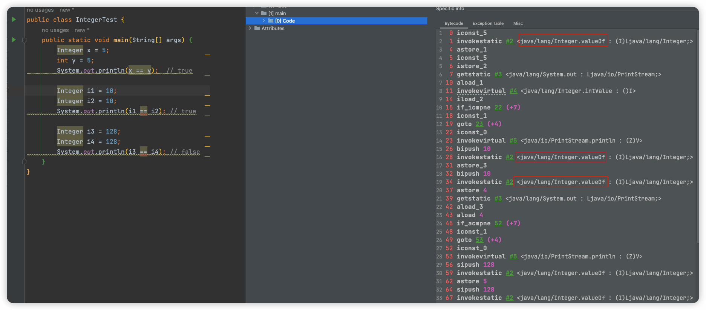

Integer有个内部类IntegerCache，它有个范围[-128, 127]，当valueof的值在这个范围之类，就直接返回，而不需要new Integer对象，因此`i1 == i2`是true，而`i3 == i4`是false

```java
public static Integer valueOf(int i) {
    if (i >= IntegerCache.low && i <= IntegerCache.high)
        return IntegerCache.cache[i + (-IntegerCache.low)];
    return new Integer(i);
}
```


举例2：

```java
    public static void main(String[] args) {
        String str = new String("hello") + new String("world");
        String str1 = "helloworld";
        System.out.println(str == str1);  // false
        String str2 = new String("helloworld");
        System.out.println(str == str2); // false
    }
```

```java
 0 new #2 <java/lang/StringBuilder>
 3 dup
 4 invokespecial #3 <java/lang/StringBuilder.<init> : ()V>
 7 new #4 <java/lang/String>
10 dup
11 ldc #5 <hello>
13 invokespecial #6 <java/lang/String.<init> : (Ljava/lang/String;)V>
16 invokevirtual #7 <java/lang/StringBuilder.append : (Ljava/lang/String;)Ljava/lang/StringBuilder;>
19 new #4 <java/lang/String>
22 dup
23 ldc #8 <world>
25 invokespecial #6 <java/lang/String.<init> : (Ljava/lang/String;)V>
28 invokevirtual #7 <java/lang/StringBuilder.append : (Ljava/lang/String;)Ljava/lang/StringBuilder;>
31 invokevirtual #9 <java/lang/StringBuilder.toString : ()Ljava/lang/String;>
34 astore_1
35 ldc #10 <helloworld>
37 astore_2
38 getstatic #11 <java/lang/System.out : Ljava/io/PrintStream;>
41 aload_1
42 aload_2
43 if_acmpne 50 (+7)
46 iconst_1
47 goto 51 (+4)
50 iconst_0
51 invokevirtual #12 <java/io/PrintStream.println : (Z)V>
54 new #4 <java/lang/String>
57 dup
58 ldc #10 <helloworld>
60 invokespecial #6 <java/lang/String.<init> : (Ljava/lang/String;)V>
63 astore_3
64 getstatic #11 <java/lang/System.out : Ljava/io/PrintStream;>
67 aload_1
68 aload_3
69 if_acmpne 76 (+7)
72 iconst_1
73 goto 77 (+4)
76 iconst_0
77 invokevirtual #12 <java/io/PrintStream.println : (Z)V>
80 return

```


举例3:🔖回看过程

```java
class Father {
    int x = 10;

    public Father() {
        this.print();
        x = 20;
    }
    public void print() {
        System.out.println("Father.x = " + x);
    }
}
class Son extends Father {
    int x = 30;
    public Son() {
        this.print();
        x = 40;
    }
    public void print() {
        System.out.println("Son = " + x);
    }
}
public class SonTest {
    public static void main(String[] args) {
//        Father f = new Father();
        Father f = new Son();
        System.out.println(f.x);
    }
}

```

运行结果：

```java
Son = 0
Son = 30
20
```


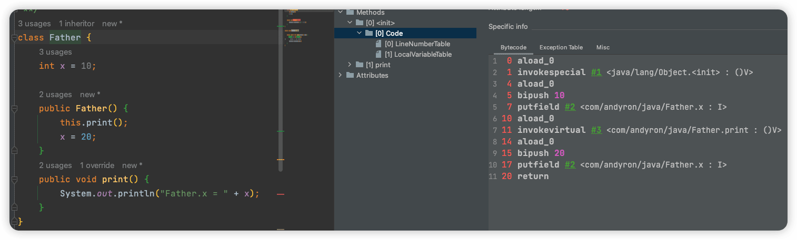

`aload_0`表示调用局部变量表0位置值，这里也就是this；

然后调用Father父类的`<init>`（调用构造器时会有一个super操作）；

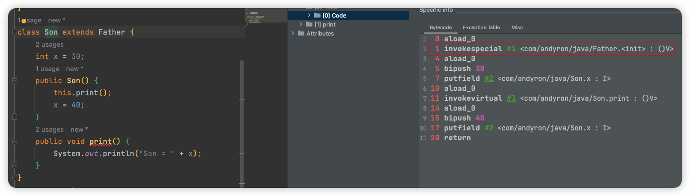

`new Son()`时，会先调用`Father.<init>`，print()方法被重写，`this.print()`调用的是Son的，而且此时还没有`bipush 30`，Son的x还没有显示赋值，是默认初始化的值0，所以会打印出`Son = 0`；

之后Father的x在`Father.<init>`中被赋值20，但回到Son的`<init>`，首先Son的x被现实赋值为30，接着调用`this.print()`，也就打印出`Son = 30`；

之后Son的x倍赋值40，但**==<u>属性不存在多态性</u>==**，`f.x`调用的是Father的x，因此打印出`20`。

### 1.2 虚拟机的基石：Class文件

- 字节码文件里是什么？

源代码经过编译器编译之后便会生成一个字节码文件，字节码是一种二进制的类文件，它的内容是JVM的指令，而不像C、C++经由编译器直接生成==机器码==。

- 什么是字节码指令(byte code)？

Java虚拟机的指令由一个字节长度的，代表着某种特定操作含义的==操作码==（opcode）以及跟随其后的零至多个代表此操作所需參数的==操作数==（operand）所构成。虛拟机中许多指令并不包含操作数，只有一个操作码。`操作码 (操作数)`

比如：

- 如何解读供虚拟机解释执行的二进制字节码？

方式一：一个一个二进制卡。用Binary Viewer等

方式二：javap：jdk自带的反解析工具

方式三：IDEA插件：jclasslib，或者其客户端工具


### 1.3 Class文件结构

https://docs.oracle.com/javase/specs/jvms/se8/html/jvms-4.html

**Class类的本质**

任何一个Class文件都对应着唯一一个类或接口的定义信息，但反过来说，Class文件实际上它并不一定以磁盘文件的形式存在。Class文件是一组以8位字节为基础单位的==二进制流==。

**Class文件格式**

Class 的结构不像XML等描述语言，由于它没有任何分隔符号。所以在其中的数据项，无论是字节顺序还是数量，都是被严格限定的，哪个字节代表什么含义，长度是多少，先后顺序如何，都不允许改变。

```
“下雨天留客天留我不留”
"下丽天，留客天，留我不留？”
“下雨天，留客天，留我不？留！”
“下雨，天留客？天留，我不留！”
```


Class 文件格式采用一种类似于C语言结构体的方式进行数据存储，这种结构中只有两种数据类型：==无符号数==和==表==。

- 无符号数属于基本的数据类型，以 u1、u2、u4、u8 来分别代表 1个字节、2个字节、4个字节和8个字节的无符号数，无符号数可以用来描述数字、 索引引用、数量值或者按照UTF-8编码构成字符串值。
- 表是由多个无符号数或者其他表作为数据项构成的复合数据类型，所有表都习惯性地以“`_info`”结尾。表用于描述有层次关系的复合结构的数据，整个 Class 文件本质上就是一张表。由于表没有固定长度，所以通常会在其前面加上个数说明。

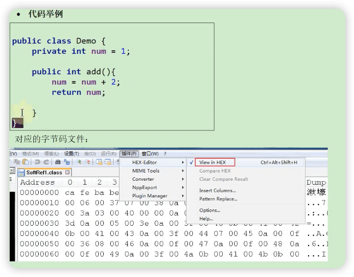

> 换句话说，充分理解了每一个字节码文件的细节，自己也可以反编译出Java源文件。


**class文件结构概述**

class文件的结构并不是一成不变的，随着Java虚拟机的不断发展，总是不可避免地会对Class文件结构做出一些调整，但是其基本结构和框架是非常稳定的。

Class文件的总体结构如下：

- 魔数
- Class文件版本
- 常量池
- 访问标志
- 类索引，父类索引，接口索引集合
- 字段表集合
- 方法表集合
- 属性表集合（注意和类中的field区分，field应该翻译成字段，但习惯上也叫属性）

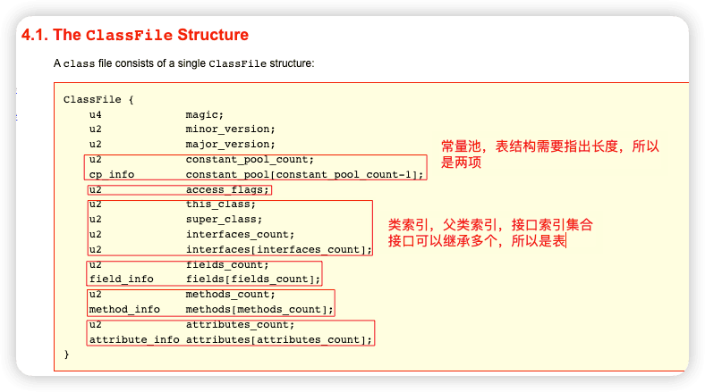


> P213 把字节码数据保存到excel中，方便分析

#### 魔数：Class文件的标志

- 每个Class 文件开头的4个字节的无符号整数称为魔数 ( Magic Number)
- 它的唯一作用是确定这个文件是否为一个能被虛拟机接受的有效合法的Class文件。即：魔数是Class文件的标识符。

- 魔数值固定为`OxCAFEBABE`。不会改变。
- 如果一个Class文件不以`0xCAFEBABE`开头，虚拟机在进行文件校验的时候就会直接抛出以下错误：

```
Error: A JNI error has occurred, please check your installation and try again
Exception in thread "main" java.lang. ClassFormatError: Incompatible magic value 1885430635 in class file StringTest
```

- 使用魔数而不是扩展名来进行识别主要是基于==安全==方面的考虑，因为文件扩展名可以随意地改动。

#### Class文件版本号

- 紧接着魔数的4个字节存储的是 Class 文件的版本号。同样也是4个字节。第5个和第6个字节所代表的含义就是编译的副版本号minor_version，而第7个和第8个字节就是编译的主版本号major_version。
- 它们共同构成了class文件的格式版本号。譬如某个Class文件的主版本号为M，副版本号为 m，那么这个Class 文件的格式版本号就确定为M.m。
- 版本号和Java编译器的对应关系如下表：


- Java 的版本号是从45开始的，JDK 1.1之后的每个JDK大版本发布主版本号向上加1。

- <u>不同版本的Java编译器编译的Class文件对应的版本是不一样的。目前，高版本的Java虚拟机可以执行由低版本编译器生成的Class文件，但是低版本的了ava虚拟机不能执行由高版本编译器生成的C1ass文件。否则JVM会抛出`java.lang.UnsupportedClassVersionError`异常。（向下兼容）</u>

- 在实际应用中，由于开发环境和生产环境的不同，可能会导致该问题的发生。因此，需要我们在开发时，特别注意开发编译的JDK版本和生产环境中的JDK版本是否一致。

  虛拟机JDK版本为1.k（k>=2）时，对应的class文件格式版本号的范国为45.0 - 44+k.0（含两端）。

#### 常量池：存放所有常量

The Constant Pool

- 常量池是Class文件中内容最为丰富的区域之一。常量池对于Class文件中的字段和方法解析也有着至关重要的作用。【资源仓库】

- 随着Java虚拟机的不断发展，常量池的内容也日渐丰富。可以说，常量池是整个Class文件的==基石==。

```java
cp_info {
    u1 tag;
    u1 info[];
}
```


- 在版本号之后，紧跟着的是常量池的数量，以及若干个常量池表项。
- 常量池中常量的数量是不固定的，所以在常量池的入口需要放置一项u2类型的无符号数，代表常量池容量计数值（constant_pool_count）。与Java中语言习惯不一样的是，这个容量计数是从1而不是0开始的。

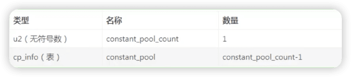

- 由上表可见，Class文件使用了一个前置的容量计数器 (constant_pool_count）加若干个连续的数据项 (constant_pool）的形式来描述常量池内容。我们把这一系列连续常量池数据称为**常量池集合**。

- 常量池表项中，用于存放编译时期生成的各种==字面量==和==符号引用==，这部分内容将在类加载后进入方法区的运行时常量池中存放。

  > ps：jdk8之后，把字符串常量池移到了堆空间。

##### 常量池计数器 (constant_pool_count）

- 由于常量池的数量不固定，时长时短，所以需要放置两个字节来表示常量池容量计数值。
- 常量池容量计数值（u2类型）：从1开始，表示常量池中有多少项常量。即constant_pool_count=1表示常量池中有0个常量项.

- Demo中的值为：


其值为`0x0016`，掐指一算，也就是22。

需要注意的是，这实际上只有21项常量。素引为范国是1-21。为什么呢？

通常我们写代码时都是从0开始的，但是这里的常量池却是从1开始，因为它把第0项常量空出来了。这是为了满足后面某些指向常量池的索引值的数据在特定情况下需要表达**“不引用任何一个常量池项目”**的含义，这种情况可用索引值0来表示。

##### 常量池表（constant_pool）

###### 字面量和符号引用

- constant_pool是一种表结构，以 1 ~ constant_pool_count-1为索引。表明了后面有多少个常量项。
- 常量池主要存放两大类常量：==字面量 （Literal）==和==符号引用 (Symbolic References)==


> + 全类名
>
> `com.andyron.test.Demo`
>
> + 全限定名
>
> `com/andyron/test/Demo`这个就是类的全限定名，仅仅是把包名的”“替换成”/“，为了使连续的多个全限定名之间不产生混淆，在使用时最后一般会加入一个“;” 表示全限定名结束。
>
> + 简单名称
>
> 简单名称是指没有类型和参数修饰的方法或者字段名称，上面例子中的类的add()方法和num字段的简单名称分别是add和num。
>
> + 描述符
>
> 描述符的作用是==用来描述字段的数据类型、方法的参数列表（包括数量、类型以及顺序）和返回值==。根据描述符规则，基本数据类型(byte、char、double、float、int、long、short、boolean）以及代表无返回值的void类型都用一个大写字符来表示，而对象类型则用宇符L加对象的全限定名来表示，详见下表：
>
> 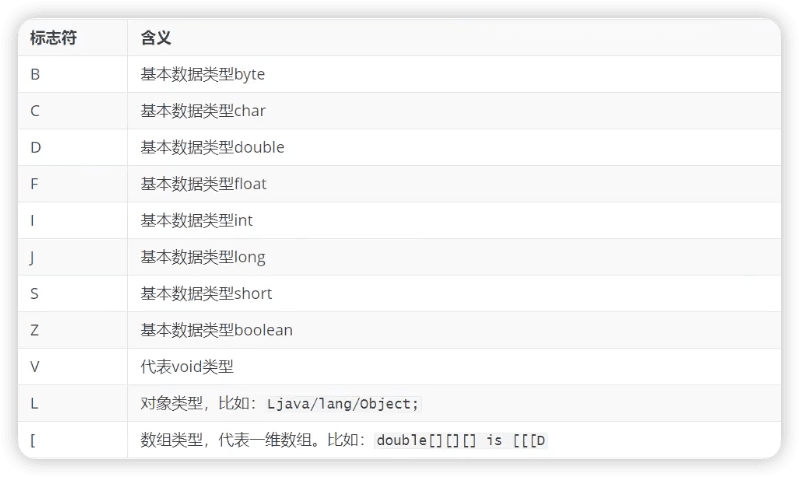
>
> 用描述符来描述方法时，按照先参数列表，后返回值的顺序描述，参数列表按照参数的严格顺序放在一组小括号“()” 之内。如方法`java.lang.String.tostring()`的描述符为`()Ljava/lang/String;`，方法`int abc(int[] x，int y)`的描述符为`([II)I`。🔖


- 它包含了class文件结构及其子结构中引用的所有字符串常量、类或接口名、字段名和其他常量。常量池中的每一项都具备相同的特征。第1个字节作为==类型标记==，用于确定该项的格式，这个字节称为tag byte（标记字节、标签字节）。

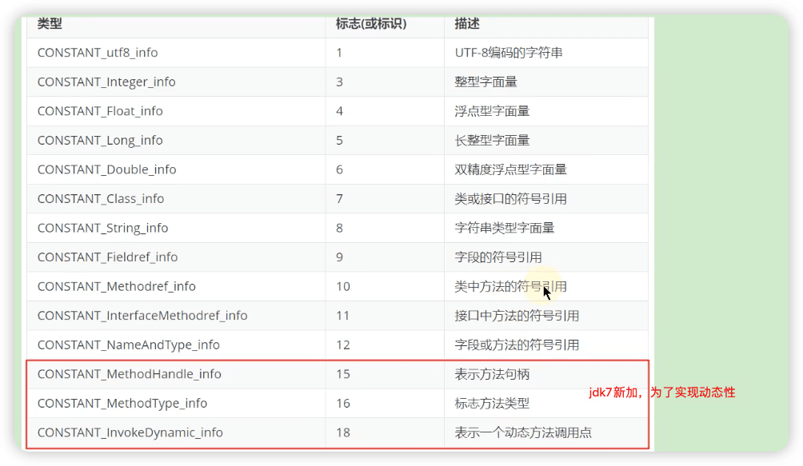


> 补充说明：
>
> 虚拟机在加载Class文件时才会进行动态链接，也就是说，Class 文件中不会保存各个方法和字段的最終内存布局信息，因此，这些字段和方法的符号引用不经过转换是无法直接被虚拟机使用的。==当虚拟机运行时，需要从常量池中获得对应的符号引用，再在类加载过程中的解析阶段将其替换为直接引用，并翻译到具体的内存地址中==。
>
> 这里说明下符号引用和直接引用的区别与关联：
>
> - 符号引用：符号引用以==一组符号==来描述所引用的目标，符号可以是任何形式的字面量，只要使用时能无歧义地定位到目标即可。==符号引用与虚拟机实现的内存布局无关==，引用的目标并不一定已经加载到了内存中。
> - 直按引用：直接号用可以是直接==指向目标的指针、相对偏移量或是一个能问接定位到目标的句柄。直按引用是与虚拟机实现的内存布属相关的==，同一个符号引用在不同虚拟机实例上翻译出来的直按引用一般不会相同。如果有了直接引用，那说明引用的目标必定已经存在于内存之中了。

###### 常量类型和结构

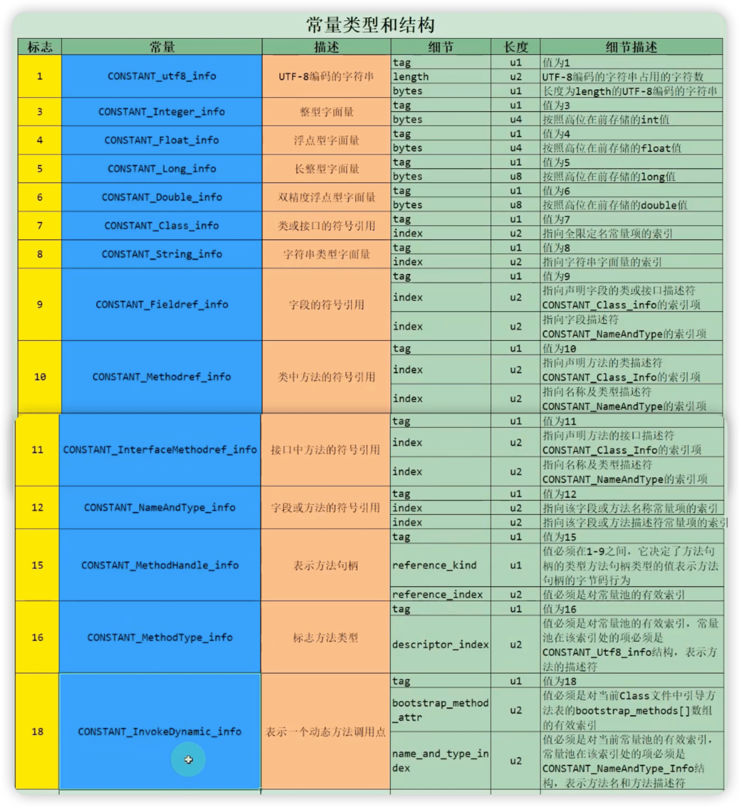

🔖p220 常量池解读过程

```java
package com.andyron.java1;

public class Demo {
    private int num = 1;

    public int add() {
        num = num + 2;
        return num;
    }
}
```

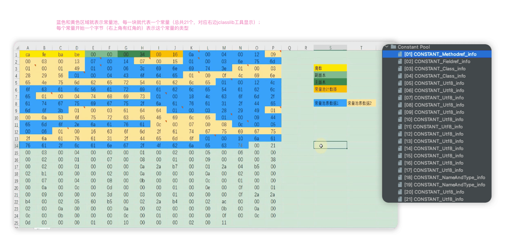

总结1:

- 这14种表（或者常量项结构）的共同点是：表开始的第一位是一个u1类型的标志位（tag），代表当前这个常量项使用的是哪种表结构，即哪种常量类型。
- 在常量池列表中，`CONSTANT_Utf8_info`常量项是一种使用改进过的UTF-8编码格式来存储诸如**文字字符串、类或者接口的全限定名、字段或者方法的简单名称以及描述符**等常量字符串信息。
- 这14种常量项结构还有一个特点是，其中13个常量项占用的字节固定，只有`CONSTANT_Utf8_info`占用字节不固定，其大小由length决定。为什么呢？==因为从常量池存放的内容可知，其存放的是字面量和符号引用，最终这些内容都会是一个字符串，这些字符串的大小是在编写程序时才确定==，比如你定义一个类，类名可以取长取短，所以在没编译前，大小不固定，编译后，通过utf-8编码，就可以知道其长度。

总结2：

- 常量池：可以理解为Class文件之中的资源仓库，它是Class文件结构中与其他项目关联最多的数据类型 （后面的很多数据类型都会指向此处），也是占用Class文件空间最大的数据项目之一。
- 常量池中为什么要包含这些内容

Java代码在进行Javac编译的时候，并不像C和C++那样有 “连接” 这一步骤，而是在虚拟机加载Class文件的时候进行动态链接。也就是说，==在Class文件中不会保存各个方法、字段的最终内存布局信息，因此这些字段、方法的符号引用不经过运行期转换的话无法得到真正的内存入口地址，也就无法直接被虛拟机使用==。当虛拟机运行时，需要从常量池获得对应的符号引用，再在类创建时或运行时解析、翻译到具体的内存地址之中。关于类的创建和动态链接的内容，在虚拟机类加载过程时再进行详细讲解。

#### 访问标识（access_flags）

- 在常量池后，紧跟着访问标记。该标记使用两个字节表示，用于识别一些类或者接口层次的访问信息，包括：这个Class是类还是接口；是否定义为 public 类型：是否定义为 abstract 类型；如果是类的话，是否被声明为 final 等。各种访问标记如下所示：

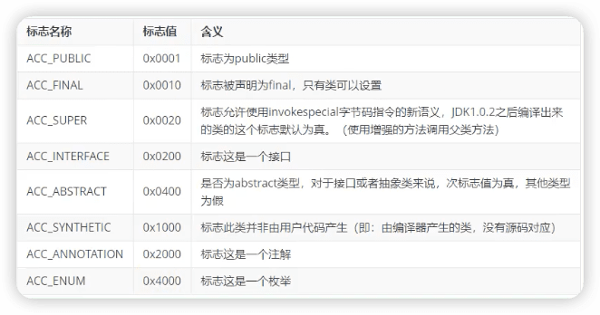

> 正常类（不是内部类）除了public修饰，就是没有，不能是private或protected。


- 类的访问权限通常为 `ACC_` 开头的常量。

- 每一种类型的表示都是通过设置访问标记的32位中的特定位来实现的。比如，若是public final的类，则该标记为 `ACC_PUBLIC | ACC_FINAL`.

- 使用ACC_SUPER可以让类更准确地定位到父类的方法super.method(），现代编译器都会设置并且使用这个标记。

补充说明：

1. 带有`ACC_INTERFACE`标志的class文件表示的是接口而不是类，反之则表示的是类而不是接口。
   - 如果一个class文件被设置了 `ACC_INTERFACE` 标志，那么同时也得设置`ACC_ABSTRACT` 标志。同时它不能再设置 `ACC_FINAL`、`ACC_SUPER` 或`ACC_ENUM` 标志。
   - 如果没有设置`ACC_INTERFACE`标志。那么这个class文件可以具有上表中除 `ACC_ANNOTATION`外的其他所有标志。当然。`ACC_FINAL`和`ACC_ABSTRACT`这类互斥的标志除外。这两个标志不得同时改置。

2. `ACC_SUPER`标志用于确定类或接口里面的`invokespecial`指令使用的是哪一种执行语义。**针对Java虚拟机指令集的编译器都应当设置这个标志**。对于Java SE 8及后续版本来说，无论class文件中这个标志的实际值是什么，也不管class文件的版本号是多少，Java虛拟机都认为每个Class文件均设置了ACC_SUPER标志。

   ACC_SUPER标志是为了向后兼容由旧Java编译器所编译的代码而设计的。目前的 ACC_SUPER标志在由JDK 1.0.2之前的编译器所生成的access_flags中是没有确定含义的，如果设置了该标志，那么Oracle的Java虚拟机实现会将其忽略。

3. `ACC_SYNTHETIC`标志意味着该类或接口是由编译器生成的，而不是由源代码生成的。
4. 注解类型必须设置`ACC_ANNOTATION`标志。如果设置了 ACC_ANNOTATION标志， 那么也必须设置`ACC_INTERFACE`标志。
5. ACC_ENUN标志表明该类或其父类为枚举类型。

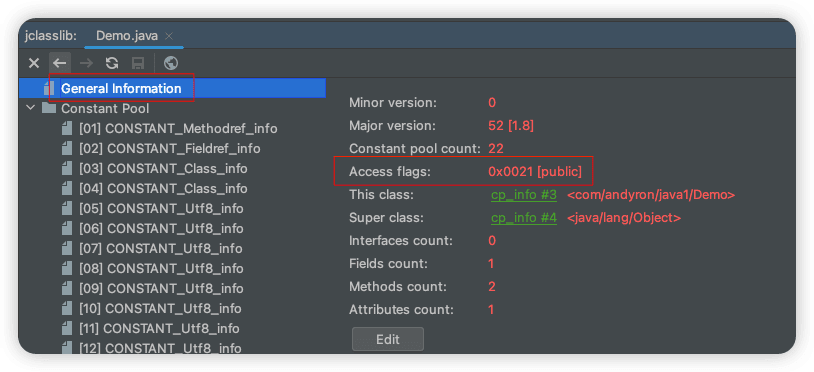

#### 类索引、父类索引、接口索引集合

- 在访问标记后，会指定该类的类别、父类类别以及实现的接口，格式如下：

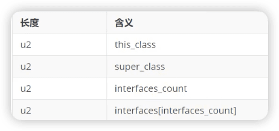

- 这三项数据来确定这个类的继承关系。
  + 类索引用于确定这个类的全限定名
  + 父类索引用于确定这个类的父类的全限定名。由于Java语言不允许多重继承，所以父类索引只有一个，除了`java.lang.object` 之外，所有的Java类都有父类，因此除了java.lang.object 外，所有Java类的父类索引都不为0。
  + 接口索引集合 就用来描达这个类实现了哪些接口，这些被实现的接口将按 implements 语句（如果这个类本身是一个接口，则应当是 extends 语句〉后的接口顺序从左到右排列在接口素引集合中。


##### this_class （类索引)

2字节无符号整数，指向常量池的索引。它提供了类的全限定名，如`com/andyron/java1/Demo`。 `this_class`的值必须是对常量池表中某项的一个有效索引值。常量池在这个索引处的成员必须为CONSTANT_Class_info类型结构体，该结构体表示这个class文件所定义的类或接口。


##### super_class（父类索引）

- 2字节无符号整数，指向常量池的索引。它提供了当前类的父类的全限定名。如果我们没有继承任何类，其默认继承的是java/lang/Object类。同时，由于java不支持多继承，所以其父类只有一个。
- superclass指向的父类不能是final。

##### interfaces

- 指向常量池索引集合，它提供了一个符号引用到所有己实现的接口
- 由于一个类可以实现多个接口，因此需要以数组形式保存多个接口的素引，表示接口的每个索引也是一个指向常量池的CONSTANT_Class（当然这里就必须是接口，而不是类）。

**==interfaces_count（接口计数器）==**项的值表示当前类或接口的直接超接口数量。

**==interfaces [](接口索引集合）==**（如果接口计数器为0，那就没有这个集合）中每个成员的值必须是对常量池表中某项的有效索引值，它的长度为 interfaces_count。 每个成员interfaces[i]必领为 CONSTANT_Class_info结构，其中`0 <= i < interfaces_count`。在interfaces[]中，各成员所表示的接口顺序和对应的源代码中给定的接口顺序 （从左至右）一样，即interfaces[0]对应的是源代码中最左边的接口。

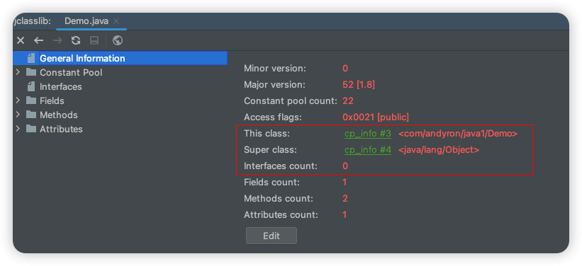

#### 字段表集合

fields

- 用于描述接口或类中声明的变量。字段（field）包括==类级变量以及实例级变量==，但是不包括方法内部、代码块内部声明的局部变量(local variables)。 
- 宇段叫什么名宇、宇段被定义为什么数据类型，这些都是无法固定的，只能引用常量池中的常量来描述。
- 它指向常量池索引集合，它描述了每个字段的完整信息。比如**字段的标识符、访问修饰符 (public、private或protected）、是类变量还是实例变量(static修饰符）、是否是常量（final修饰符）**等。

注意事项：

- 字段表集合中不会列出从父类或者实现的接口中继承而来的字段，但有可能列出原本Java代码之中不存在的字段。譬如<u>在内部类中为了保持对外部类的访问性，会自动添加指向外部类实例的字段</u>。
- 在Java语言中字段是无法重载的，两个字段的数据类型、修饰符不管是否相同，都必须使用不一样的名称，但是对于字节码来讲，如果两个字段的描述符不一致，那字段重名就是合法的。

##### fields_count （字段计数器）

fields_count的值表示当前class文件fields表的成员个数。使用两个字节来表示。

fields 表中每个成员都是一个field_info结构，用于表示该类或接口所声明的所有类字段或者实例字段，不包括方法内部声明的变量，也不包括从父类或父接口继承的那些字段。

##### fields[]（字段表）

- fields表中的每个成员都必须是一个fields_info结构的数据项，用于表示当前类或接口中某个字段的完整描述。

- 一个字段的信息包括如下这些信息。这些信息中，==各个修饰符都是布尔值，要么有，要么没有==。

  - 作用域(public、private、protected修饰符）

  - 是实例变量还是类变量 （static修饰符）

  - 可变性 (final)
  - 并发可见性(volatile修饰符，是否强制从主内存读写）
  - 可否序列化(transient修饰符）
  - 字段数据类型（基本数据类型、对象、数组）
  - 字段名称

- 字段表结构

字段表作为一个表，同样有他自己的结构：

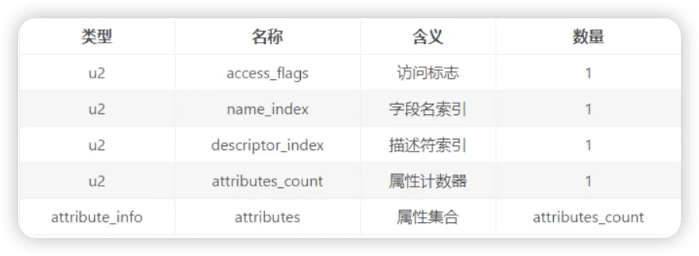

###### 1️⃣字段表访问标识

我们知道，一个字段可以被各种关键字去修饰，比如：==作用域修饰符== (public. private、protected)、==static修饰符==、==final修饰符==、==volatile修饰符==等等。因此，其可像类的访问标志那样，使用一些标志来标记字段。字段的访问标志有如下这些：

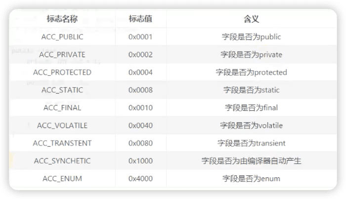

###### 2️⃣字段名索引

根据字段名索引的值，查询常量池中的指定索引项即可。

###### 3️⃣描述符索引

描述符的作用是用来描述字段的**==数据类型、方法的参数列表（包括数量、类型以及顺序）和返回值==**。根据描述符规则，基本数据类型 (byte,char,double,float,int,1ong,short,boolean）及代表无返回值的void类型都用一个大写字符来表示，而对象则用字符L加对象的全限定名来表示，如下所示：


###### 4️⃣属性表集合

一个字段还可能拥有一些属性，用于存储更多的额外信息。比如**初始化值（针对常量）、一些注释信息**等。属性个数存放在`attribute_count`中，属性具体内容存放在`attributes`数组中。

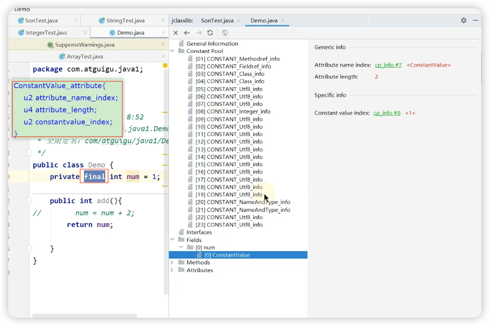

#### 方法表集合

methods：指向常量池索引集合，它完整描述了每个方法的签名。

- 在字节码文件中，==每一个method_info项都对应着一个类或者接口中的方法信息==。比如<u>方法的访问修饰符(public、private或protected)，方法的返回值类型以及方法的参数信息</u>等。
- 如果这个方法不是抽象的或者不是native的，那么字节码中会体现出来。
- 一方面，methods表只描述当前类或接口中声明的方法，**不包括从父类或父接口继承的方法**。另一方面，methods表有可能会出现**由编译器自动添加的方法**，最典型的便是编译器产生的方法信息(比如：类(接口)初始化方法`<clinit>()`和实例初始化方法`<init>()`）。

**使用注意事项：**

在Java语言中，要重载(Overload)一个方法，除了要与原方法具有相同的简单名称之外，还要求必领拥有一个与原方法不同的特征签名，==特征签名==就是一个方法中<u>各个参数在常量池中的字段符号引用的集合</u>，也就是因为返回值不会包含在特征签名之中，因此Java语言里无法仅仅依靠返回值的不同来对一个已有方法进行重载。但在Class文件格式中，特征签名的范围更大一些，只要描述符不是完全一致的两个方法就可以共存。也就是说，如果两个方法有相同的名称和特征签名，但返回值不同，那么也是可以合法共存于同一个class文件中。

也就是说，尽管java语法规范并不元许在一个类或者接口中声明多个方法签名相同的方法，但是和Java语法规范相反，字节码文件中却恰怡允许存放多个方法签名相同的方法，唯一的条件就是这些方法之间的返回值不能相同。

> 🔖 字段和方法，字节码文件的这种设计是不是为了兼容其他编程语言？

##### methods_count（方法计数器）

methods_count的值表示当前Class文件methods表的成员个数。使用两个字节来表示。

methods 表中每个成员都是一个method_info结构。

##### methods[]（方法表）

- methods表中的每个成员都必须是一个method_info结构，用于表示当前类或接口中某个方法的完整描述。如果某个method_ info结构的access_flags项既没有设置 ACC_ NATIVE 标志也没有设置ACC_ABSTRACT标志，那么该结构中也应包含实现这个方法所用的Java虚拟机指令。
- method_info结构可以表示类和接口中定义的所有方法，包括**实例方法、类方法、实例初始化方法和类或接口初始化方法**。
- 方法表的结构实际跟字段表是一样的，方法表结构如下：

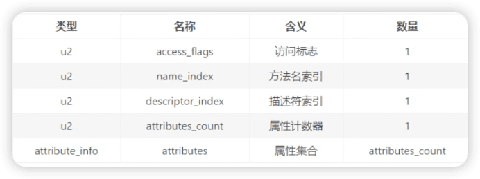

###### 1️⃣方法表访问标志

跟字段表一样，方法表也有访问标志，而且他们的标志有部分相同，部分则不同，方法表的具体访问标志如下：

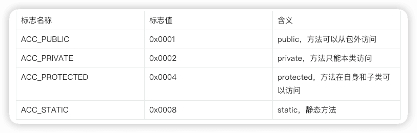

🔖

#### 属性表集合

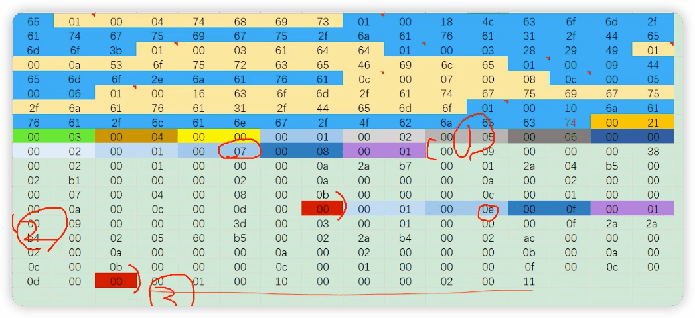

上图中1、2分别是字段表和方法表中的属性，3是class文件的属性表集合。


方法表集合之后的==属性表集合(attributes）==，指的是class文件所携带的辅助信息，比如该class 文件的源文件的名称。以及任何带有`RetentionPolicy.CLASS` 或者`RetentionPolicy.RUNTIME`的注解。这类信息通常被用于Java虚拟机的验证和运行，以及

Java程序的调试，一般无须深入了解。

此外，字段表、方法表都可以有自己的属性表。用于描述某些场景专有的信息。

属性表集合的限制没有那么严格，不再要求各个属性表具有严格的顺序，并且只要不与已有的属性名重复，任何人实现的编译器都可以向属性表中写入自己定义的属性信息，但Java虚拟机运行时会忽略掉它不认识的属性。

##### attributes_count（属性计数器）

attributes_count的值表示当前class文件属性表的成员个数。属性表中每一项都是一个attribute_info结构。

##### attributes []（属性表）

https://docs.oracle.com/javase/specs/jvms/se8/html/jvms-4.html#jvms-4.7

属性表的每个项的值必须是attribute_info结构。属性表的结构比较灵活，各种不同的属性只要满足以下结构即可。

###### 1️⃣属性的通用格式

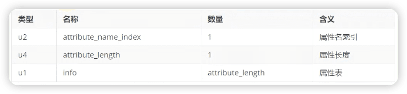

即只需说明属性的名称以及占用位数的长度即可，属性表具体的结构可以去自定义。

###### 2️⃣属性类型

属性表实际上可以有很多类型，上面看到的code属性只是其中一种，Java8里面定义了23种属性。

下面这些是虛拟机中预定义的属性：

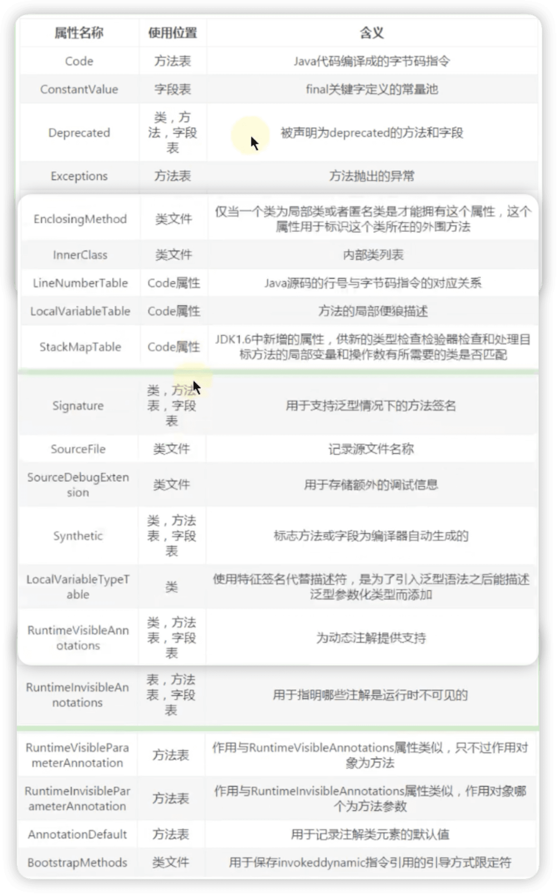

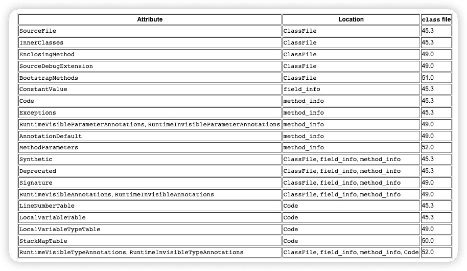

不分属性详解：

1. Constantvalue属性

Constantvalue属性表示一个常量字段的值。位于field_info结构的属性表中。

```java
ConstantValue_attribute {
    u2 attribute_name_index;
    u4 attribute_length;
    u2 constantvalue_index; // 字段值在常量池中的索引， 常量池在该索引处的项给出该属性表示的常量值。〔例如，值是long型的，在常量池中便是CONSTANT_Long）
}
```


2. Deprecated属性

Deprecated 属性是在 JDK 1.1 为了支持注释中的关键词@deprecated 而引入的。

```java
Deprecated_attribute {
	u2 attribute_name_index;
	u4 attribute_length;
}
```


3. Code属性

code属性就是存放方法体里面的代码。但是，并非所有方法表都有code属性。像接口或者抽象方法，他们没有具体的方法体，因此也就不会有code 属性了。

code属性表的结构：

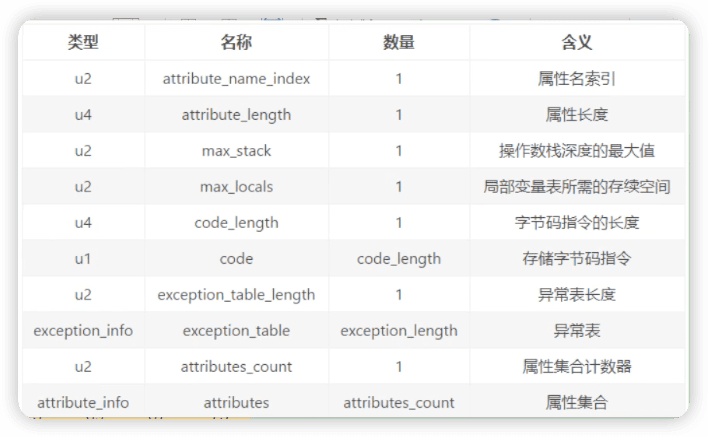

code属性中可以有属性

可以看到：code属性表的前两项跟属性表是一致的，即code属性表遵循属性表的结构，后面那些则是他自定义的结构。

4. InnerClasses 属性

为了方便说明特别定义一个表示类或接口的 Class 格式为C。如果C的常量池中包含某个CONSTANT_Class_info成员。且这个成员所表示的类或接口不属于任何一个包，那么C的ClassFile结构的属性表中就必须含有对应的 InnerClasses 属性。InnerClasses 属性是在 JDK 1.1 中为了支持内部类和内部接口而引入的，位于 ClassFile结构的属性表。

5. LineNumberTable 属性

LineNumberTable属性是可选变长属性，位于code结构的属性表。

LineNumberTable属性是用来==描述Java源码行号与字节码行号之间的对应关系==。这个属性可以用来在调试的时候定位代码执行的行数。

==start_pc,即字节码行号;line_number，即Java源代码行号。==

在code 属性的属性表中，LineNumberTable 属性可以按照任意顺序出现，此外，多个LineNumberTable属性可以共同表示一个行号在源文件中表示的内容，即 LineNumberTable 属性不需要与源文件的行一一对应。

LineNumberTable属性表结构：

```java
LineNumberTable_attribute {
    u2 attribute_name_index;
    u4 attribute_length;
    u2 line_number_table_length;
    {   u2 start_pc;
        u2 line_number;	
    } line_number_table[line_number_table_length];
}
```

6. LocalVariableTable 属性

LocalVariableTable 是可选变长属性，位于Code属性的属性表中。它被调试器用==于确定方法在执行过程中局部变量的信息==。

在code属性的属性表中，LocalVariableTable 属性可以按照任意顺序出现。code 属性中的每个局部变量最多只能有一个 LocalVariableTable 属性。

- start pc + length表示这个变量在字节码中的生命周期起始和结束的偏移位置 (this生命周期从头日到结尼10）

- index就是这个变量在局部交量表中的槽位（槽位可复用）
- name就是变量名称

- Descriptor表示局部变量类型描述

LocalVariableTable 属性表结构：

```java
LocalVariableTable_attribute {
    u2 attribute_name_index;
    u4 attribute_length;
    u2 local_variable_table_length;
    {   u2 start_pc;
        u2 length;
        u2 name_index;
        u2 descriptor_index;
        u2 index;
    } local_variable_table[local_variable_table_length];
}
```

7. Signature 属性

signature属性是可选的定长属性，位于 ClassFile, field_info或method_info结构的属性表中。在java 语言中，任何类、接口、初始化方法或成员的泛型签名如果包含了类型变量（Type Variables） 或参数化类型（ Parameterized Types)，则 Signature 属性会为它记录泛型签名信息。

8. SourceFile属性


长度固定式8个字节

9. 其它属性


> 🔖自我感慨：感觉class文件就像一个有多层对象、数组等等的JSON文件，去除掉各种括号、引号、冒号，数组（表）就在前面加一个长度。。。

本小节主要介绍了Class文件的基本格式。

随着Java平台的不断发展，在将来，Class文件的内容也一定会做进一步的扩充，但是其基本的格式和结构不会做重大调整。

从Java虚拟机的角度看，通过Class文件，可以让更多的计算机语言支持Java虚拟机平台。因此，Class文件结构不仅仅是Java虚拟机的执行入口，更是Java生态圈的基础和核心。

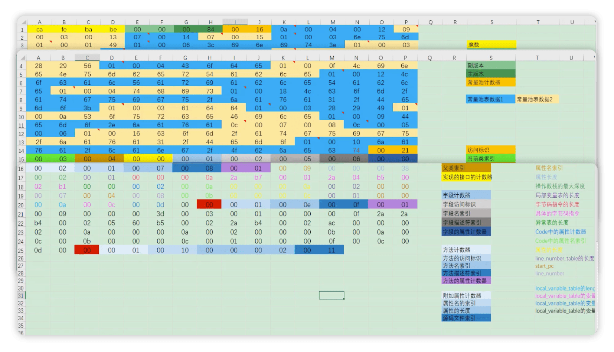


### 1.4 使用javap指令解析Class文件

#### 解析字节码的作用

通过反编译生成的字节码文件，我们可以深入的了解java代码的工作机制。但是，自己分析类文件结构太麻烦了！除了使用第三方的jclasslib工具之外，oracle官方也提供了工具：javap。

javap是jdk自带的反解析工具。它的作用就是根据class字节码文件，反解析出当前类对应的<u>code区《字节码指令）局部变量表、异常表和代码行偏移量映射表、常量池</u>等信息。

通过局部变量表，我们可以查看局部变量的作用域范围、所在槽位等信息，甚至可以看到槽位复用等信息。

> 有问题在源代码中不易发现。

#### javac-g操作

解析字节码文件得到的信息中，有些信息（如局部变量表、指令和代码行偏移量映射表、常量池中方法的參数名称等等）需要在使用javac编译成class文件时，指定参数才能输出。

比如，你直按`javac xx.java`，就不会在生成对应的局部变量表等信息，如果你使用`javac -g xx.java`就可以生成所有相关信息了。如果你使用的eclipse或IDEA，则默认情況下，eclipse、IDEA在编译时会帮你生成局部变量表、指令和代码行偏移量映射表等信息的。


#### javap的用法

`javap <options> <classes>`

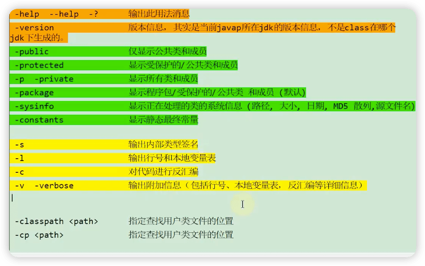

最全的

```
javap -v -p
```

#### 小结

1. 通过javap命令可以查看一个java类反汇编得到的Class交件版本号、常量迟、访问标识、变量表、指令代码行号表等等信息。不显示类索引、父类索引、接口索引集合、`<clinit>()`、`init()`等结构

2. 通过对前面例子代码反汇编文件的简单分析，可以发现，一个方法的执行通常会涉及下面几块内存的操作：
   - java栈中：局部变量表、操作数栈。
   - java堆。通过对象的地址引用去操作。
   - 常量池。
   - 其他如帧数据区、方法区的剩余部分等情况，测试中没有显示出来，这里说明一下。

3. 平常，我们比较关注的是java类中每个方法的反汇编中的指令操作过程，这些指令都是顺序执行的，可以参考官方文档查看每个指令的含义：

https://docs.oracle.com/javase/specs/jvms/se8/html/jvms-6.html

## 2 字节码指令集与解析举例

P238

### 2.1 概述

- java字节码对于虚拟机，就好像汇编语言对于计算机，属于基本执行指令。
- java虚拟机的指令由==一个字节长度==的、代表着某种特定操作含义的数字（称为==操作码，Opcode==，有一个**助记符**表示、方便记忆）以及跟随其后的零至多个代表此操作所需参数（称为==操作数，Operands==）而构成。由于 Java 虚拟机采用面向操作数栈而不是寄存器的结构，所以大多数的指令都不包含操作数，只有一个操作码。

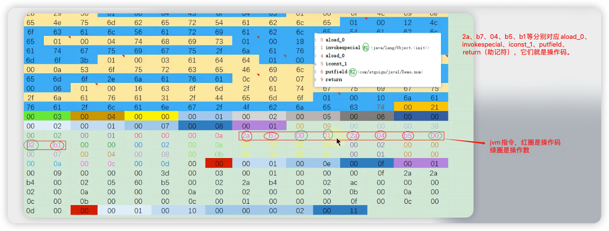

- 由于限制了 Java 虚拟机操作码的长度为一个字节（即0~255） ，这意味著指令集的操作码总数不可能超过256条。
- 官方文档：https://docs.oracle.com/javase/specs/jvms/se8/html/jvms-6.html
- 熟悉虛拟机的指令对于动态字节码生成、反编译Class文件、Class文件修补都有着非常重要的价值。因此，阅读字节码作为了解java虛拟机的基础技能，需要熟练掌握常见指令。

#### 执行模型

如果不考虑异常处理的话，那么Java虚拟机的解释器可以使用下面这个伪代码当做最基本的执行模型来理解：

```java
do {
	自动计算PC寄存器的值加1；
	根据PC寄存器的指示位罝，从字节码流中取出操作码；
	if(字节码存在操作数）从字节码流中取出操作数；
	执行操作码所定义的操作；
} while(字节码长度>0);
```

#### 字节码与数据类型

在Java虚拟机的指令集中，大多数的指令都包含了其操作所对应的数据类型信息。例如，`iload`指令用于从局部变量表中加载int型的数据到操作数栈中，而`fload`指令加载的则是float类型的数据。

对于大部分与数据类型相关的字节码指令，==它们的操作码助记符中都有特殊的字符来表明专门为哪种数据类型服务==：

- i代表对int类型的数据操作，
- l代表long
- s代表short
- b代表byte
- c代表char
- f代表float
- d代表double

也有一些指令的助记符中**没有明确地指明操作类型的字母**，如`arraylength`指令，它没有代表数据类型的特殊字待，但操作数永远只能是一个数组类型的对象。

> 数组也继承至Object

还有另外一些指今，如无条件跳转指令`goto`则是与==数据类型无关的==。


大部分的指令都没有支持整数类型byte、char和short，甚至没有任何指令支持boolean类型。编译器会在编译期或运行期将byte和short类型的数据带符号扩展（Sign-Extend）为相应的int类型数据，将boolean和char类型数据零位扩展（Zero-Extend）（就是无符号的）为相应的int类型数据。与之类似，在处理boolean、 byte、 short和char类型的数组时，也会转换为使用对应的int类型的字节码指令来处理。因此，大多数对于boolean、byte、short和char类型数据的操作，实际上都是使用相应的int类型作为运算类型。

#### 指令分类

由于完全介绍和学习这些指令需要花费大量时间。为了让大家能够更快地熟悉和了解这些基本指令，这里将JVM中的字节码指令集按用途大致分成9类。

- 加载与存储指令
- 算术指令
- 类型转换指令
- 对象的创建与访问指令
- 方法调用与返回指令
- 操作数栈管理指令
- 比较控制指令
- 异常处理指令
- 同步控制指令

（说在前面）在做值相关操作时：

- 一个指令，可以从局部交量表、常量池、堆中对象、方法调用、系统调用中等取得数据，这些数据（可能是值，可能是对象的引用）被压入操作数栈。

- 一个指令，也可以从操作数栈中取出一到多个值（pop多次），完成赋值、加减乘除、方法传参、系统调用等等操作。


### 2.2 加载与存储指令

P240

使用频率最高的

- 作用

加载和存储指令用于将数据**从栈帧的局部变量表和操作数栈之间==来回==传递**。

> 加载： 主要指把数据（来源于局部变量表或常量池）压到操作数栈中。 1️⃣2️⃣ （load、ldc、push）
>
> 存储：把数据保存到局部变量表中。 3️⃣ （store）

- 常用指令
  + 1️⃣【局部变量压栈指令】将一个局部变量加载到操作数栈：`xload`、`xload_<n>`（其中x为i、l、f、d、a，n为0到3）；`xaload`、`xaload_<n>`（其中x为i、l、f、d、a、b、c、s，n为0到3）。
  + 2️⃣【常量入栈指令】将一个常量加载到操作数栈： `bipush`、 `sipush`、 `ldc`、 `ldc_w` `ldc2_w`、`aconst_null`、`iconst_m1`、 `iconst_<i>`、 `lconst<l>`、`fconst_<f>`、`dconst_＜d>`。
  + 3️⃣【出栈装入局部变量表指令】将个数值从操作数栈存储到局部变量表：`xstore`、`xstore_<n>`（其中x为i、l、f、d、a，n为0到3）；`xastore`（其中x为i、l、f、d、a、b、c、s）。
  + 4️⃣扩充局部变量表的访问索引的指令：`wide`。

上面所列举的指令助记符中，有一部分是以尖括号结尾的（例如`iload_<n>`）。这些指令助记符实际上代表了一组指令（例如`iload_<n>`代表了iload_0、 iload_1、iload_2和iload_3这几个指令）。这几组指令都是某个带有一个操作数的通用指令（例如iload）的特殊形式，**对于这若干组特殊指令来说，它们表面上没有操作数，不需要进行取操作数的动作，但操作数都隐含在指令中**。

> `iload_0`和`iload 0`相同，都表示将局部变量表中索引为0位置上的数据压入操作数栈中，只不过前者只有操作码没有操作数，这样能节省空间。

除此之外，它们的语义与原生的通用指令完全一致(例如iload_0的语义与操作数为0时的iload 指令语义完全一致）。在尖括号之间的字母指定了指令隐含操作数的数据类型，`<n>`代表非负的整数，`＜i＞`代表是int类型数据，`＜l>`代表long类型，`<f>`代表float类型，`<d>`代表double类型。

操作byte、char、short和boolean类型数据时，经常用int类型的指令来表示。

#### 复习：再谈操作数栈与局部变量表

1. 操作数栈(Operand Stacks)【存放**操作数**的地方】

我们知道，Java字节码是Java虚拟机所使用的指令集。因此，它与java虚拟机基于栈的计算模型是密不可分的。

在解释执行过程中，每当为java方法分配栈帧时，java虚拟机往往需要开辟一块额外的空间作为==操作数栈，来存放计算的操作数些及返回结果。==

具体来说便是：<u>执行每一条指令之前，java 虚拟机要求该指令的操作数己被压入操作数栈中。在执行指令时，Java虚拟机会将该指令所需的操作数弹出，并且将指令的结果重新压入栈中。</u>


以加法指令 iadd 为例。假设在执行该指令前，栈顶的两个元素分别为 int 值1和int值2，那么iadd 指令将弹出这两个 int，并将求得的和 int 值3压入栈中。


由于 iadd 指令只消耗栈顶的两个元素，因此，对于离栈顶距离为 2 的元素，即图中的问号，iadd 指令并不关心它是否存在，更加不会对其进行修改。

2. 局部变量表(Local Variables )

Java 方法栈桢的另外一个重要组成部分则是局部变量区，==字节码程序可以将计算的结果级存在局部变量区之中==。

实际上，Java 虚拟机将局部变量区当成一个==数组==，依次存放 this指针（仅非静态方法），所传入的参数，以及字节码中的局部变量。

和操作数栈一样，long 类型以及 double 类型的值将占据两个单元，其余类型仅占据一个单元。

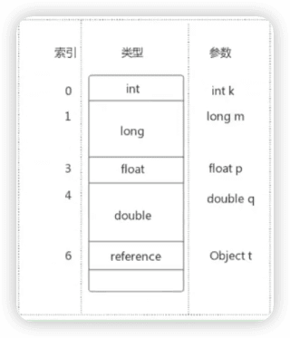

举例：

```java
public void foo(long l, float f) {
  {
    int i = 0;
  }
  {
    String s = "Hello,world";
  }
}
```


不同作用域i和s槽位复用。

在栈帧中，与性能调优关系最为密切的部分就是局部变量表。<u>局部变量表中的变量也是重要的垃圾回收根节点，只要被局部变量表中直接或间接引用的对象都不会被回收。</u>


在方法执行时，虚拟机使用局部变量表完成方法的传递。


#### 1 局部变量压栈指令

局部变量压栈指令**将给定的局部变量表中的数据压入操作数栈**。

这类指令大体可以分为：

- `xload_<n>`(x为i、l、f、d、a，n为0到3）

- `xload` (x为i、l、f、d、a）

说明：在这里，x的取值表示数据类型。

指令xload_n表示将第n个局部变量压入操作数栈，比如iload_1、fload_0、aload_0等指令。其中aload_n表示将一个对象引用压栈。

指令xload通过指定参数的形式，把局部变量压入操作数栈，当使用这个命令时，表示局部变量的数量可能超过了4个，比如指令iload、fload等。

```java
    // 1.局部变量压栈指令
    public void load(int num, Object obj, long count, boolean flag, short[] arr) {
        System.out.println(num);
        System.out.println(obj);
        System.out.println(count);
        System.out.println(flag);
        System.out.println(arr);
    }
```


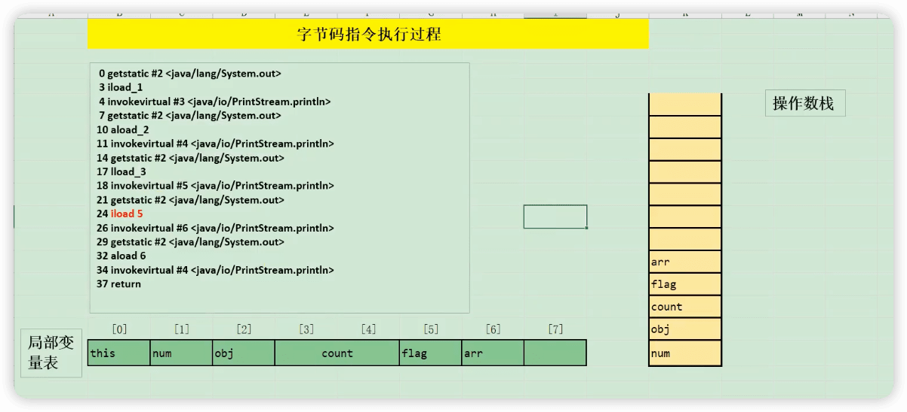


#### 2 常量入栈指令

常量入栈指令的功能是将常数压入操作数栈，根据数据类型和入栈内容的不同，又可以分为const系列、push系列和ldc指令。

- **指令const系列**：用于对**特定**的常量入栈，入栈的常量隐含在指令本身里。指令有：`iconst_<i＞`（之从-1到5，不是索引是具体数值）、`lconst_<1>`（l从0到1）、`fconst_<f>`（f从0到2）、`dconst_<d>`（d从0到1)、`aconst_null`。比如，
  + iconst_m1将-1压入操作数栈：
  + iconst_x（x为0到5） 将x压入栈；
  + lconst_e、lconst_1分别将长整数0和1压入栈；
  + fconst_0、fconst_1、fconst_2分别将浮点数0、1、2压入栈；
  + dconst_0和dconst_1分别将double型e和1压入栈；
  + aconst_null将null压入操作数栈；

从指令的命名上不难找出规律，指令助记符的第一个字符总是喜欢表示数据类型，i表示整数，l表示长整数，f表示浮点数，d表示双精度浮点，习惯上用a表示对象引用。如果指令隐含操作的参数，会以下划线形式给出。

```java
int i = 3;   iconst_3
int j = 6; 	 bipush 6
```

- **指令push系列**：主要包括`bipush`和`sipush`。它们的区别在于按收数据类型的不同，bipush按收8位整数作为参数，sipush接收16位整数，它们都将参数压入栈。

- **指令ldc系列**：如果以上指令都不能满足需求，那么可以使用万能的ldc指令，它可以接收一个8位的参数，该参数指向常量池中的int、float或者String的索引．将指定的内容压入堆栈。类似的还有`ldc_w`，它接收两个8位参数，能支持的素引范围大于ldc。如果要压入的元素是1ong或者double类型的，则使用`ldc2_w`指令，使用方式都是类似的。

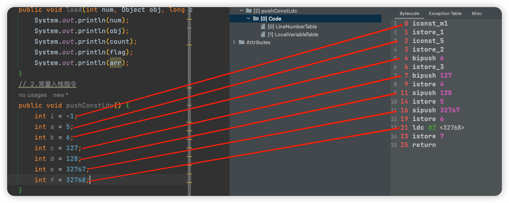

总结如下：

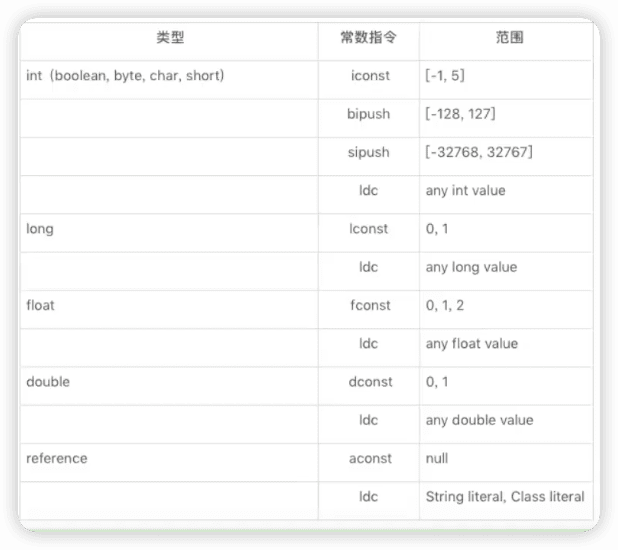

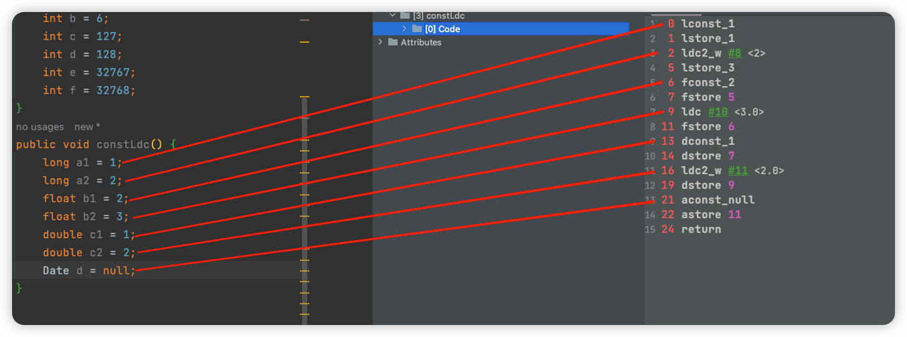


#### 3 出栈装入局部变量表指令

出栈装入局部变量表指令用于将操作数栈中栈顶元素弹出后，装入局部变量表的指定位置，用于给局部变量赋值。

这类指令主要以store的形式存在，比如xstore (x为i、l、f、d、a）、xstore_n(x为i、1，f、d、a，n为0至3）。

- 其中，指令istore_n将从操作数栈中弹出一个整数，并把它赋值给局部变量索引n位置。
- 指令xstore由于没有隐含参数信息，故需要提供一个byte类型的参数类指定目标局部变量表的位置。

说明：

==一般说来，类似像store这样的命令需要带一个参数，用来指明将弹出的元素放在局部变量表的第几个位置==。但是，为了尽可能压缩指令大小，使用专门的istore_1指令表示将弹出的元素放置在局部变量表第1个位置。类似的还有istore_0、istore_2、istore_3，它们分别表示从操作数栈顶弹出一个元素，存放在局部变量表第0、2、3个位置。

由于局部交量表前几个位置总是非常常用，因此==这种做法虽然增加了指令数量，但是可以大大压缩生成的字节码的体积==。如果局部变量表很大，需要存储的档位大于3，那么可以使用istore指令，外加一个参数，用来表示需要存放的槽位位置。


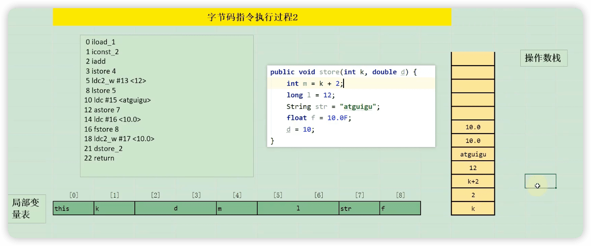

### 2.3 算术指令

🔖 // TODO p245

### 2.4 类型转换指令


#### 1 宽化类型转换


#### 2 窄化类型转换


### 2.5 对象的创建与访问指令


#### 1 创建指令


#### 2 字段访问指令


#### 3 数组操作指令


#### 4 类型检查指令


### 2.6 方法调用与返回指令


#### 1 方法调用指令


#### 2 方法返回指令

### 2.7 操作数栈管理指令


### 2.8 控制转移指令

#### 1 条件跳转指令


#### 2 比较条件跳转指令


#### 3 多条件分支跳转


#### 4 无条件跳转

### 2.9 异常处理指令


#### 1 抛出异常指令


#### 2 异常处理与异常表


### 2.10 同步控制指令

#### 1 方法级的同步


#### 2 方法内指定指令序列的同步

## 3 类的加载过程（类的生命周期）

P266

### 3.1 概述

在Java中数据类型分为基本数据类型和引用数据类型。==基本数据类型由處拟机预先定义，引用数据类型则需要进行类的加载。==

按照Java虚拟机规范，从class文件到加载到内存中的类，到类卸载出内存为止，它的整个生命周期包括如下7个阶段：

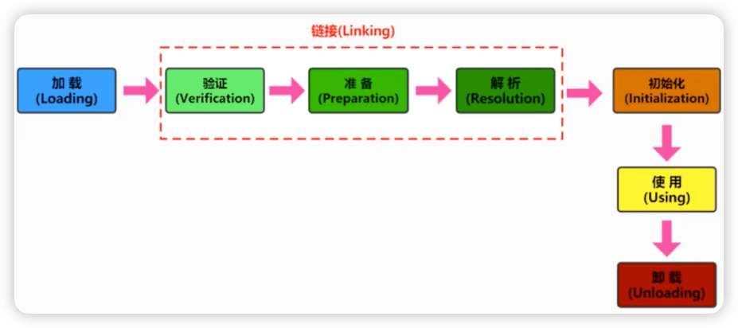

其中，验证、淮备、解析 3个部分统称为链接 (Linking）。

从程序中类的使用过程看：

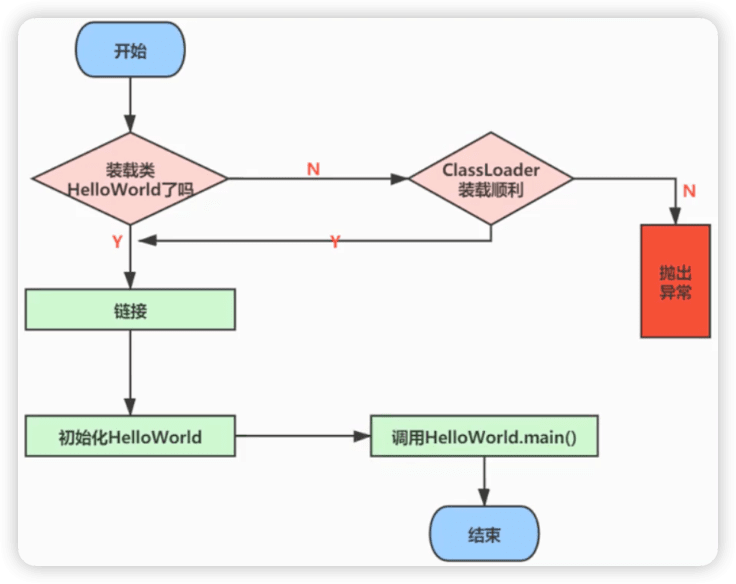

> 链接：默认赋值，符号应用改为直接引用
>
> 初始化：静态字段显示赋值

> 大厂面试题
>
> 蚂蚁金服：
>
> 描述一下 JVM 加载 Class 文件的原理机制？
>
> 一面：类加载过程
>
> 
>
> 百度：
>
> 类加载的时机
>
> java 类加载过程？
>
> 简述 java 类加载机制？
>
> 
>
> 勝讯：
>
> JvM中类加载机制，类加载过程？
>
> 
>
> 滴滴：
>
> JVM类加载机制
>
> 
>
> 美团：
>
> Java类加载过程
>
> 描述一下jvm加载class文件的原理机制
>
> 
>
> 京东：
>
> 什么是类的加载？
>
> 哪些情况会触发类的加载？
>
> 讲一下JVM加载一个类的过程
>
> JVM的类加载机制是什么？

### 3.2 过程一：Loading（加载）阶段

#### 1 加载完成的操作

**加载的理解**

所谓加载，简而言之就是**将Java类的字节码文件加载到机器内存中，并在内存中构建出Java类的原型 —— ==类模板对象==**。所谓类模板对象，其实就是Java类在JVM内存中的一个快照，JVM将从字节码文件中解析出的常量池、类字段、类方法等信息存储到类模板中，这样JVM在运行期便能通过类模板而获取Java类中的任意信息，能够对Java类的成员变量进行遍历，也能进行Java方法的调用。

反射的机制即基于这一基础。如果JVM没有将Java类的声明信息存储起来，则JVM在运行期也无法反射。

**加载完成的操作**

加载阶段，简言之，查找并加载类的二进制数据，生成Class的实例。

在加载类时，Java虚拟机必须完成以下3件事情：

- 通过类的全名，获取类的二进制数据流。
- 解析类的二进制数据流为方法区内的数据结构（Java类模型）
- 创建java.lang.Class类的实例，表示该类型。作为方法区这个类的各种数据的**访问入口**

#### 2 二进制流的获取方式

对于类的二进制数据流，虚拟机可以通过多种途径产生或获得。（只要所读取的字节码符合JVM规范即可）

- 虛拟机可能通过文件系统读入一个class后缀的文件**（最常见）**
- 读入jar、zip等归档数据包，提取类文件。
- 事先存放在数据库中的类的二进制数据
- 使用类似于HTTP之类的协议通过网络进行加载
- 在运行时生成一段Class的二进制信息等

在获取到类的二进制信息后，Java虚拟机就会处理这些数据，在方法区生成类结构(类模板对象)，在堆区生成一个java.lang.Class的实例指向类模板。

如果输入数据不是ClassFile的结构，则会拋出`ClassFormatError`。

#### 3 类模型与Class实例的位置

- 类模型的位置

加载的类在JVM中创建相应的类结构，类结构会存储在方法区(JDK1.8之前：永久代：JDK1.8及之后：元空间)。

- Class实例的位罝

类将.class文件加载至元空间后，会在堆中创建一个Java.lang.Class对象，用来封装类位于方法区内的数据结构，Class对象是在加载类的过程中创建的，每个类都对应有一个Class类型的对象。（instanceKlass --> mirror：Class的实例）

- 图示

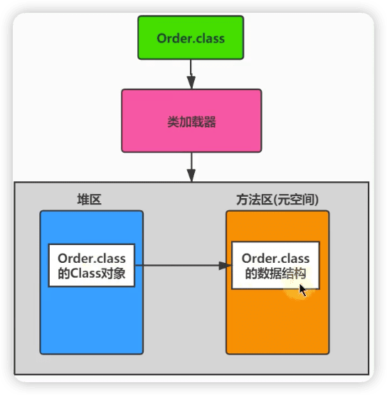

外部可以通过访问代表order类的Class对象来获取Order的类数据结构。

- 再说明

Class类的构造方法是私有的，只有JVM能够创建。

java.lang.Class实例是访问类型元数据的接口，也是实现反射的关键数据、入口。通过Class类提供的接口，可以获得目标类所关联的.Class文件中具体的数据结构：方法、字段等信息。

#### 4 数组类的加载

创建数组类的情况稍微有些特殊，因为==数组类本身并不是由类加载器负责创建==，而是由JVM在运行时根据需要而直接创建的，但数组的元素类型仍然需要依靠类加载器去创建。创建数组类（下述简称A）的过程：

1. 如果数组的元素类型是引用类型，那么就遵循定义的加载过程递归加载和创建数组A的元素类型；

2. JVM使用指定的元素类型和数组维度来创建新的数组类。

如果数组的元素类型是引用类型，数组类的可访问性就由元素类型的可访问性决定。否则数组类的可访问性将被缺省定义为public。


### 3.3 过程二：Linking（链接）阶段

#### 环节1：链接阶段之Verification（验证）

当类加载到系统后，就开始链接操作，验证是链接操作的第一步。

它的目的是==保证加载的字节码是合法、合理并符合规范的==。

验证的步骤比较复杂，实际要验证的项目也很繁多，大体上Java虚拟机需要做以下检查：

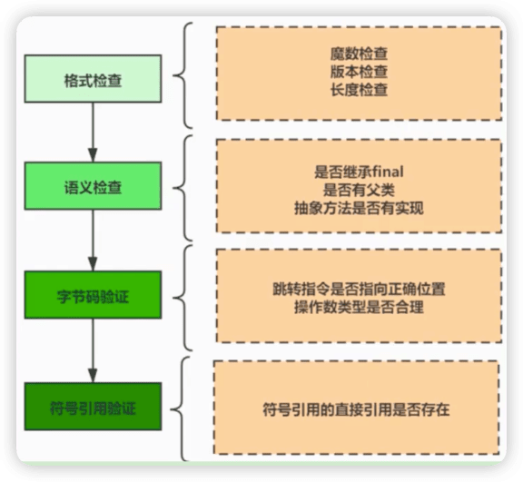

**整体说明：**

验证的内容则涵盖了类数据信息的格式验证、语义检查、字节码验证，以及符号引用验证等。

- 其中==格式验证会和加载阶段一起执行==。验证通过之后，类加载器才会成功将类的二进制数据信息加载到方法区中。
- ==格式验证之外的验证操作将会在方法区中进行==。

链接阶段的验证虽然拖慢了加载速度，但是它避免了在字节码运行时还需要进行各种检查。（磨刀不误砍柴工）


**具体说明：**

1. ==格式验证==：是否以魔数 OxCAFEBABE升头，主版本和副版本号是否在当前java虛拟机的支持范国内，数据中每一个项是否都拥有正确的长度等。
2. Java虚拟机会进行字节码的==语义检查==，但凡在语义上不符合规范的，虚拟机也不会给予验证通过。比如：
   - 是否所有的类都有父类的存在(在Java里，除了Object外，其他类都应该有父类）
   - 是否一些被定义为final的方法或者类被重写或继承了
   - 非抽象类是否实现了所有抽象方法或者接口方法
   - 是否存在不兼容的方法(比如方法的签名除了返回值不同，其他都一样，这种方法会让虛拟机无从下手调度：abstract情況下的方法，就不能是final的了）

3. Java虚拟机还会进行==字节码验证==，字节码验证也是==验证过程中最为复杂的一个过程==。它试图通过对字节码流的分析，判断字节码是否可以被正确地执行。比如：
   + 在字节码的执行过程中，是否会跳转到一条不存在的指令
   + 函数的调用是否传递了正确类型的参数
   + 变量的赋值是不是给了正确的数据类型等

**==栈映射帧(StackMapTable）==**🔖就是在这个阶段，用于检测在特定的字节码处，其局部变量表和操作数栈是否有者正确的数据类型。但遗憾的是，100%准确地判断一段字节码是否可以被安全执行是无法实现的，因此，该过程只是尽可能地检查出可以预知的明显的问题。如果在这个阶段无法通过检查，虛拟机也不会正确装载这个类。但是，如果通过了这个阶段的检查，也不能说明这个类是完全没有问题的。

<u>在前面3次检查中，已经排除了文件格式错误、语义错误以及宇节码的不正确性。但是依然不能确保类是没有问题的。</u>

4．校验器还将进行==符号引用的验证==。Class文件在其常量池会通过字符串记录自己将要使用的其他类或者方法。因此，在验证阶段，==虚拟机就会检查这些类或者方法确实是存在的==，并且当前类有权限访问这些数据，如果一个需要使用类无法在系统中找到，则会抛出`NoClassDefFoundError`，如果一个方法无法被找到，则会地出`NoSuchmethodError`。

此阶段在解析坏节才会执行。

#### 环节2：链接阶段之Perparation（准备）

淮备阶段(Preparation)，简言之，==为类的静态变量分配内存，并将其初始化为默认值==。

当一个类验证通过时，虚拟机就会进入准备阶段。在这个阶段，虚拟机就会为这个类分配相应的内存空问，并设置默认初始值。

Java虚拟机为各类型变量默认的初始值如表所示。

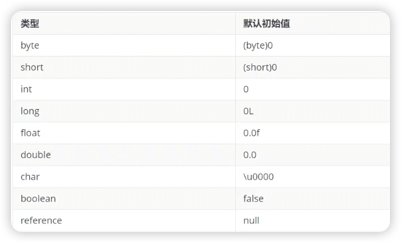

Java并不支持boolean类型，对于boo1ean类型，内部实现是int，由于int的默认值是日，故对应的，boolean的默认值就是false。

注意：

1. <u>这里不包含基本数据类型的字段用static final修饰的情况，因为final在编译的时候就会分配了，准备阶段会显式赋值。</u>
2. 注意这里不会为实例变量分配初始化，类变量会分配在方法区中，而实例变量是会随着对象一起分配到Java堆中。
3. 在这个阶段并不会像初始化阶段中那样会有初始化或者代码被执行。

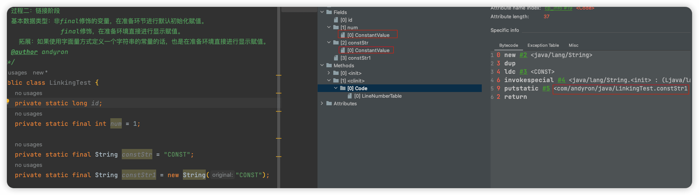

#### 环节3：链接阶段之Resolution（解析）

在准各阶段完成后，就进入了解析阶段。

解析阶段(Resolution)，简言之，==将类、接口、字段和方法的符号引用转为直接引用==。

1. 具体描述：

符号引用就是一些字面量的引用，和虚拟机的内部数据结构和和内存布局无关。比较容易理解的就是在Class类文件中，通过常量池进行了大量的符号引用。但是在程序实际运行时，只有符号引用是不够的，比如当如下println()方法被调用时，系统需要明确知道该方法的位置。

举例：输出操作System.out.println()对应的字节码：

```java
invokevirtual #24 <java/io/Printstream.println>
```

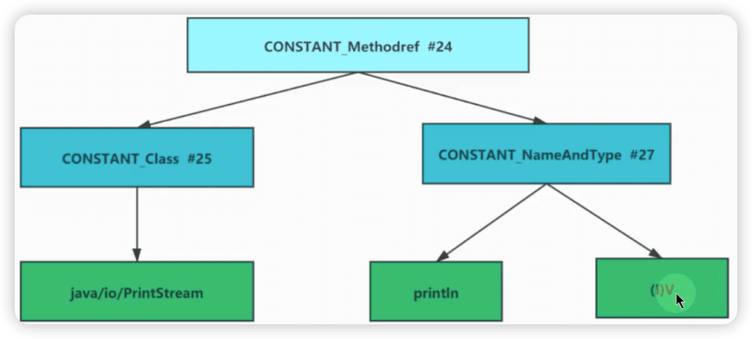

以方法为例，Java虚拟机为每个类都准备了一张==方法表==，将其所有的方法都列在表中，当需要调用一个类的方法的时候，只要知道这个方法在方法表中的偏移量就可以直接调用该方法。通过解析操作，符号引用就可以转变为目标方法在类中方法表中的位置，从而使得方法被成功调用。

2. 小结：

所谓解析就是将符号引用转为直接引用，也就是得到类、字段、方法在内存中的==指针或者偏移量==。因此，可以说，如果直接引用存在，那么可以肯定系统中存在该类、方法或者字段。但只存在符号引用,不能确定系统中一定存在该结构。

不过Java虚拟机规范并没有明确要求解析阶段一定要按照顺序执行。在Hotspot VM中，<u>加载、验证、准备和初始化会按照顺序有条不紊地执行，但链接阶段中的解析操作往往会伴随者JVM在执行完初始化之后再执行。</u>

3．字符串的复习

最后，再来看一下CONSTANT_String的解析。由于字行串在程序开发中有者重要的作用，因此，读者有必要了解一下String在Java虚拟机中的处理。==当在Java代码中直接使用字符串常量时，就会在类中出现CONSTANT_String==，它表字符串常量，并且会引用一个CONSTANT_UTF8的常量项。==在Java虚拟机内部运行中的常量池中，会维护一张字符串拘留表(intern），它会保存所有出现过的字待串常量，并且没有重复项==。只要以CONSTANT_String形式出现的字符串也都会在这张表中。使用String.intern()方法可以得到一个字符串在拘留表中的引用，因为该表中没有重复项，所以任何字面相同的宇符串的String.intern()方法返回总是相等的。

### 3.4 过程三：Initiation（初始化）阶段

初始化阶段，简言之，==为类的静态变量赋子正确的初始值==（显示赋值）。

1. 具体描述

类的初始化是类装载的最后一个阶段。如果前面的步骤都没有问题，那么表示类可以顺利装载到系统中。此时，类才会开始执行Java字节码。（即：==到了初始化阶段，才真正开始执行类中定义的Java程序代码。==）

初始化阶段的重要工作是执行类的初始化方法：`<clinit>()`方法。

- 该方法仅能由Java编译器生成并由JVM调用，程序开发者无法自定义一个同名的方法，更无法直接在Java程序中调用该方法，虽然该方法也是由字节码指令所组成。
- 它是由<u>类静态成员的赋值语句以及static语句块</u>合并产生的。

2. 说明

- 在加载一个类之前，虚拟机总是会试图加载该类的父类，因此父类的`<clinit>`总是在子类`<llinit>`之前被调用。也就是说，父类的static块优先级高于子类。

  > 口诀：由父及子，静态先行

- Java编译器并不会为所有的类都产生`<clinit>()`初始化方法。哪些类在编译为字节码后，字节码文件中将不会包含`<clinit>()`方法？
  - 一个类中并没有声明任何的类变量，也没有静态代码块时
  -  一个类中声明类变量，但是没有明确使用类变量的初始化语句以及静态代码块来执行初始化操作时
  - 一个类中包含static final修饰的基本数据类型的字段，这些类字段初始化语句采用编译时常量表达式

#### static和final的搭配问题

```java
/**
 * 说明：使用static + final修饰的字段的显示赋值操作，到底是在哪个阶段进行的赋值？
 *   情况1：在链接阶段的准备环节赋值
 *   情况2：在初始化阶段<clinit>()中赋值
 *
 * 结论：
 * 在链接阶段的准备环节赋值的情况：
 *   1. 对于基本数据类型的字段来说，如果static+final修饰，则显式赋值（直接赋值常量，而非调用方法）通常在链接阶段的准备环节进行
 *   2. 对于String来说，如果使用字面量的方式复制，使用static+final修饰，则显示赋值通常是在链接阶段的准备环境进行
 *
 * 最终结论：使用static+final修饰，且显示赋值中不涉及到方法或构造器调用的基本数据类型或String类型的显示赋值（字面量），是在链接阶段的准备环境进行。
 * @author andyron
 **/
public class InitializationTest2 {
    public static int a = 1; // 在初始化阶段<clinit>()中赋值
    public static final int INT_CONSTANT = 10; // 在链接阶段的准备环节赋值

    public static final Integer INTEGER_CONSTANT1 = Integer.valueOf(100); // 在初始化阶段<clinit>()中赋值
    public static Integer INTEGER_CONSTANT2 = Integer.valueOf(1000); // 在初始化阶段<clinit>()中赋值

    public static final String s0 = "helloworld0"; // 在链接阶段的准备环节赋值
    public static final String s1 = new String("helloworld1"); // 在初始化阶段<clinit>()中赋值

    public static String s2 = "helloworld2";

    public static final int NUM2 = new Random().nextInt(10); // 在初始化阶段<clinit>()中赋值
}

```


最终结论：使用static+final修饰，且显示赋值中不涉及到方法或构造器调用的基本数据类型或String类型的显示赋值（字面量），是在链接阶段的准备环境进行。其它在`<clinit>()`中赋值。

#### `<clinit>()`的线程安全性

对于`<clinit>()`方法的调用，也就是类的初始化，虚拟机会在内部确保其多线程环境中的安全性。

虚拟机会保证一个类的`<clinit>()`方法在多线程坏境中被正确地加锁、同步，如果多个线程同时去初始化一个类，那么只会有一个线程去执行这个类的`<clinit>()`方法，其他线程都需要阻塞等待，直到活动线程执行`<clinit>()`方法完毕。

正是因为函数`<clinit>()`带锁线程安全的，因此，如果在一个类的`<clinit>()`方法中有耗时很长的操作，就可能造成多个线程阻塞，引发死锁。并且这种死锁是很难发现的，因为看起来它们并没有可用的锁信息。

如果之前的线程成功加载了类，则等在队列中的线程就没有机会再执行`<clinit>()`方法了。那么，当需要使用这个类时，虚拟机会直接返回给它已经准备好的信息。

```java
/**
 * 死锁
 * StaticA 和 StaticB 交叉加载
 * @author andyron
 **/
class StaticA {
    static {
        try {
            Thread.sleep(1000);
        } catch (InterruptedException e) {
        }
        try {
            Class.forName("com.andyron.java1.StaticB");
        } catch (ClassNotFoundException e) {
            e.printStackTrace();
        }
        System.out.println("StaticA init Ok");
    }
}
class StaticB {
    static {
        try {
            Thread.sleep(1000);
        } catch (InterruptedException e) {
        }
        try {
            Class.forName("com.andyron.java1.StaticA");
        } catch (ClassNotFoundException e) {
            e.printStackTrace();
        }
        System.out.println("StaticB init Ok");
    }
}
public class StaticDeadLockMain extends Thread {
    private char flag;

    public StaticDeadLockMain(char flag) {
        this.flag = flag;
        this.setName("Thread" + flag);
    }

    @Override
    public void run() {
        try {
            Class.forName("com.andyron.java1.Static" + flag);
        } catch (ClassNotFoundException e) {
            e.printStackTrace();
        }
        System.out.println(getName() + " over");
    }

    public static void main(String[] args) throws InterruptedException {
        StaticDeadLockMain loadA = new StaticDeadLockMain('A');
        loadA.start();
        StaticDeadLockMain loadB = new StaticDeadLockMain('B');
        loadB.start();
    }
}
```


#### 类的初始化情况：主动便用vs被动使用

Java程序对类的使用分为两种：主动使用 和 被动使用。

##### 1️⃣主动使用

Class只有在必须要首次使用的时候才会被装载，Java虚拟机不会无条件地裝载Class类型。Java虚拟机规定，一个类或接口在初次使用前，必须要进行初始化。这里指的 “使用”，是指主动使用，主动使用只有下列几种情况：（即：<u>如果出现如下的情況，则==会对类进行初始化操作==</u>。而初始化操作之前的加载、验证、淮备己经完成。〕

1. 当创建一个类的实例时，比如使用new关键字，或者通过反射、克隆、反序列化。
2. 当调用类的静态方法时，即当使用了字节码`invokestatic`指令。
3. 当使用类、接口的静态字段时(final修饰特殊考虑），比如，使用`getstatic`或者`putstatic`指令。（对应访问变量、赋值变量操作）
4. 当使用java.lang.reflect包中的方法反射类的方法时。比如：`Class.forName("com.andyron.java.Test")`
5. 当初始化子类时，如果发现其父类还没有进行过初始化，则需要先触发其父类的初始化。
6. 如果一个接口定义了default方法，那么直接实现或者间接实现该接口的类的初始化，该接口要在其之前被初始化。

7. 当虚拟机启动时，用户需要指定一个要执行的主类（包含main(）方法的那个类），虛拟机会先初始化这个主类。
8. 当初次调用 `MethodHandle` 实例时，初始化该 MethodHandle指向的方法所在的类。(涉及解析REF_getstatic、 REF_putStatic、REF_invokestatic方法句柄对应的类）

针对5，补充说明：

当Java虚拟机初始化一个类时，要求它的所有父类都已经被初始化，但是这条规则并不适用于接口。

- 在初始化一个类时，并不会先初始化它所实现的接口

- 在初始化一个接口时，并不会先初始化它的父接口

因此，一个父接口并不会因为它的子接口或者实现类的初始化而初始化。只有当程序首次使用特定接口的静态字段时，才会导致该接口的初始化。


针对7，说明：

JVM启动的时候通过引导类加载器加载一个初始类。这个类在调用public static void main(string [】)方法之前被链按和初始化。这个方法的执行将依次导致所需的类的加载，链接和初始化。

> 总结：有上面8种情况就是主动使用，就会进行初始化过程，调用`<clinit>()`。

##### 2️⃣被动使用

除了以上的情况属于主动使用，其他的情况均属于被动使用。被动使用==不会引起类的初始化==。

也就是说：<u>并不是在代码中出现的类，就一定会被加载或者初始化。如果不符合主动使用的条件，类就不会初始化。</u>

1. 当访问一个静态字段时，只有真正声明这个字段的类才会被初始化。

   当通过子类引明父类的静态变量，不会导致子类初始化。

   > 说明：没有初始化的类，不意味着没有加载！

2. 通过数组定义类引用，不会触发此类的初始化。具体new类是才会进行初始化。

   ```java
   Parent[] parents = new Parent[10];  // 定义时没有初始化
   System.out.println(parents.getClass());
   System.out.println(parents.getClass().getSuperclass());
   
   parents[0] = new Parent();  // 初始化
   ```

   

3. 引用常量不会触发此类或接口的初始化。因为常量在链接阶段就己经被显式赋值了。

4. 调用ClassLoader类的loadClass(）方法加载一个类，并不是对类的主动使用，不会导致类的初始化。


> 设置参数`-XX:+TraceClassLoading`，可以追中类的加载信息并打印（查看加载了哪些类）。
>
> 使用junit时，可以修改器模板参数：
>
> 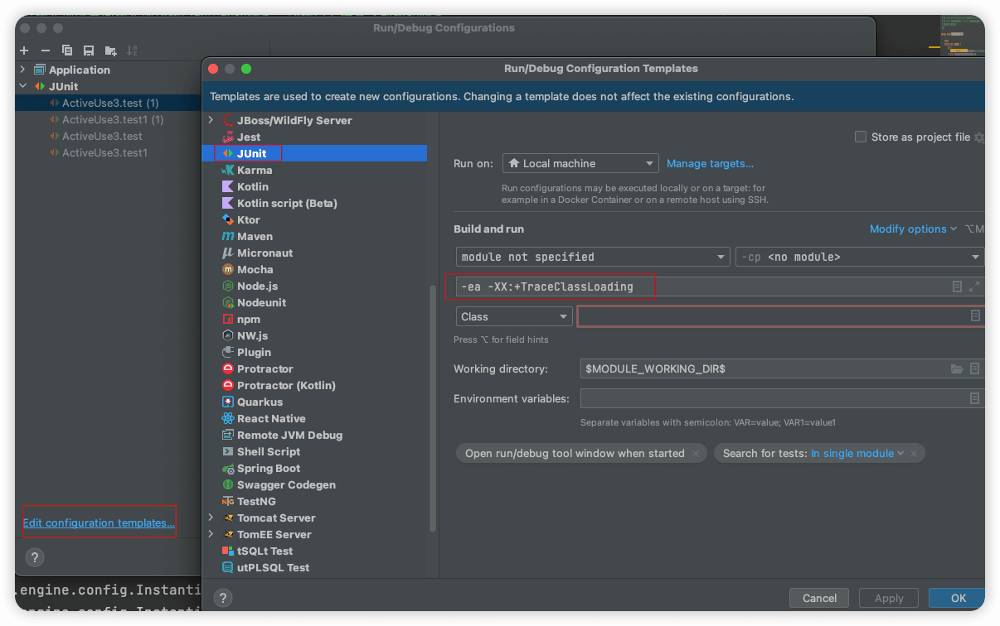

```java
// 被动使用
ClassLoader.getSystemClassLoader().loadClass("com.andyron.java1.Person");

// 主动使用
Class.forName("com.andyron.java1.Order");
```


### 3.5 过程四：类的Using（使用）

任何一个类型在使用之前都必领经历过完整的加载、链接和初始化3个类加载步骤。一旦一个类型成功经历过这了个步骤之后，便“万事俱备，只欠东风”，就等着开发者使用了。

开发人员可以在程序中访问和调用它的静态类成员信息（比如：静态字段、静态方法），或者使用new关键字为其创建对象实例。

### 3.6 过程五：类的Unloading（卸载）

#### 一、类、类的加载器、类的实例之问的引用关系

在类加载器的内部实现中，用一个Java集合来存放所加载类的引用。另一方面，一个Class对象总是会引用它的类加载器，调用Class对象的getClassLoader()方法，就能获得它的类加载器。由此可见，代表某个类的Class实例与其类的加载器之间为==双向关联关系==。

一个类的实例总是引用代表这个类的Class对象。在0bject类中定义了getClass(）方法，这个方法返回代表对象所属类的Class对象的引用。此外，所有的Java类都有一个静态属性Class，它引用代表这个类的Class对象。

#### 二、类的生命周期

当Sample类被加载、链接和初始化后，它的生命周期就开始了。当代表Sample类的Class对象不再被引用，即不可触及时，Class对象就会结束生命周期，Sample类在方法区内的数据也会被卸载，从而结束Sample类的生命周期。

==一个类何时结束生命周期，取决于代表它的Class对象何时结束生命周期。==

#### 三、具体例子

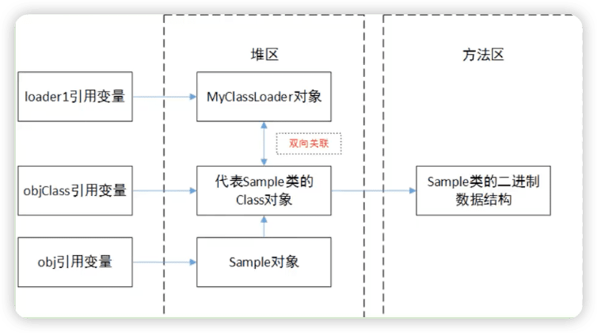

loader1变量和obj变量间接引用代表Sample类的Class对象，而objClass变量则直接引用它。

如果程序运行过程中，将上图左侧三个引用变量都罝为nu11，此时Sample对象结束生命周期，MyClassLoader对象结束生命周期，代表Sample类的Class对象也结束生命周期，Sample类在方法区内的二进制数据被卸载。

当再次有需要时，会检查Sample类的CLass对象是否存在，如果存在会直接使用，不再重新加载：如果不存在Sample类会被重新加载，在Java虚拟机的堆区会生成一个新的代表Sample类的Class实例（可以通过哈希码查看是否是同一个实例）。

#### 四、类的卸载

1. 启动类加载器加载的类型在整个运行期间是不可能被卸载的(jvm和jls规范）。

2. 被系统类加载器和扩展类加载器加载的类型在运行期间也不太可能被卸载，因为系统类加载器实例或者扩展类的实例基本上在整个运行期间,总能直接或者间接的访问的到，其达到unreachable的可能性极小。
3. 被开发者自定义的类加载器实例加载的类型只有在很简单的上下文环境中才能被卸载，而且一般还要借助于强制调用虚拟机的垃圾收集功能才可以做到。可以预想，稍微复杂点的应用场最中(比如：很多时候用户在开发自定义类加载器实例的时候采用缓存的策略以提高系统性能），被加载的类型在运行期间也是几乎不太可能被卸载的(至少卸载的时间是不确定的）。

综合以上三点，一个已经加载的类型被卸载的几率很小至少被卸载的时间是不确定的。同时我们可以看的出来，开发者在开发代码时候，不应该对虚拟机的类型卸载做任何假设的前提下，来实现系统中的特定功能。


#### 回顾：方法区的垃圾回收

方法区的垃圾收集主要回收两部分内容：==常量池中废弃的常量==和==不再使用的类型==。

Hotspot虚拟机对常量池的回收策略是很明确的，只要常量池中的常量没有被任何地方引用，就可以被回收。

判定一个常量是否 “废弃〞 还是相对简单，而要判定一个类型是否属于 “不再被使用的类”的条件就比较苛刻了。需要同时满足下面三个条件：

- 该类所有的实例都己经被回收。也就是Java堆中不存在该类及其任何派生子类的实例。
- 加载该类的类加载器己经被回收。这个条件除非是经过精心设计的可替换类加载器的场景，如OsGi、JSP的重加载等，否则通常是很难达成的。
- 该类对应的java.lang.Class对象没有在任何地方被引用，无法在任何地方通过反射访问该类的方法。

Java虚拟机被允许对满足上述三个条件的无用类进行回收，这里说的<u>仅仅是“被允许”</u>，而并不是和对象一样，没有引用了就必然会回收。

## 4 再谈类的加载器

P283

### 4.1 概述

类加载器是JVM 执行类加载机制的前提。

Classloader的作用：

ClassLoader是Java的核心组件，所有的Class都是由ClassLoader进行加载的，ClassLoader负责通过各种方式将Class信息的二进制数据流读入JVM内部，转换为一个与目标类对应的java.lang. Class对象实例。然后交给Java虚拟机进行链接、初始化等操作。因此，ClassLoader在整个装载阶段，只能影响到类的加载，而无法通过ClassLoader去改变类的链接和初始化行为。至于它是否可以运行，则由Execution Engine決定。

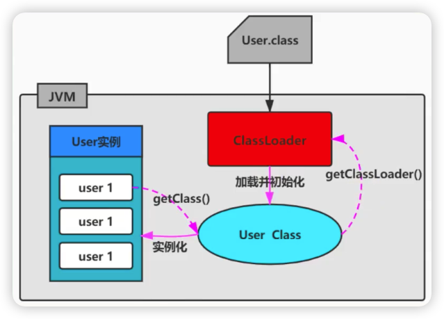

> 面试题
>
> 蚂蚁金服：
>
> 深入分析CIassLoader，双亲委派机制
>
> 类加载器的双亲委派模型是什么？
>
> 一面：双亲委派机制及使用原因
>
> 百度：
>
> 都有哪些类加载器，这些类加载器都加载哪些文件？
>
> 手写一个类加载器Demo
>
> Class的forName ("java.lang.string")和 Class的getClassLoader(）的loadClass(“java.lang .string”)有什么区别？
>
> 腾讯：
>
> 什么是双亲委派模型？
>
> 类加载器有哪些？
>
> 小米：
>
> 双亲委派模型介绍一下
>
> 滴滴：
>
> 简单说说你了解的类加载器
>
> 一面：讲一下双亲委派模型，以及其优点
>
> 字节跳动：
>
> 什么是类加载器，类加载器有哪些？
>
> 京东：
>
> 类加载器的双亲委派模型是什么？
>
> 双亲委派机制可以打破吗？为什么

#### 类的加载分类：显式（主动）加载 vs 隐式加载

class文件的显式加载与隐式加载的方式是指JVM加载class文件到内存的方式。

- 显式加载指的是在代码中通过调用ClassLoader加载class对象，如直接使用Class.forName (name)或this.getclass().getClassLoader().loadCIass()加载class对象。
- 隐式加载则是不直接在代码中调用ClassLoader的方法加载class对象，而是通过虚拟机自动加载到内存中，如在加载某个类的class交件时，该类的class文件中引用了另外一个类的对象，此时额外引用的类将通过JVM自动加载到内存中。

在目常开发以上两种方式一般会混合使用。

```java
User user = new User();  // 隐式加载

try {
  Class<?> clazz = Class.forName("com.andyron.java.User"); // 显式加载
  ClassLoader.getSystemClassLoader().loadClass("com.andyron.java.User");  // 显式加载
} catch (ClassNotFoundException e) {
  e.printStackTrace();
}
```


#### 类载器的必要性

一般情况下，Java开发人员并不需要在程序中显式地使用类加载器，但是了解类加载器的加载机制却显得至关重要。从以下几个方面说：

- 避免在开发中遇到 `java.lang.ClassNotFoundException`异常或`java.lang.NoCIassDefFoundError`异常时，手足无措。只有了解类加载器的加载机制才能够在出现异常的时候快速地根据错误异常目志定位问题和解决问题
- 需要支持类的动态加载或需要对编译后的字节码文件进行加解密操作时，就需要与类加载器打交道了。
- 开发人员可以在程序中编写自定义类加载器来重新定义类的加载规则，以便实现一些自定义的处理逻辑。

#### 命名空间

1. 何为类的唯一性？

对于任意一个类，都需要由加载它的类加载器和这个类本身一同确认其在Java虚拟机中的唯一性。==每一个类加载器，都拥有一个独立的类名称空间==：**比较两个类是否相等，只有在这两个类是由同一个类加载器加载的前提下才有意义**。否则，即使这两个类源自同一个Class文件，被同一个虚拟机加载，只要加载他们的类加载器不同，那这两个类就必定不相等。

2. 命名空间

- 每个类加载器都有自己的命名空间，命名空间由该加载器及所有的父加载器所加载的类组成
- 在同一命名空间中，不会出现类的完整名字（包括类的包名）相同的两个类
- 在不同的命名空间中，有可能会出现类的完整名字（包括类的包名）相同的两个类

在大型应用中，我们往往借助这一特性，来运行同一个类的不同版本。

Tomcat

#### 类加载机制的基本特征

通常类加载机制有三个基本特征：

- 双亲委派模型。但不是所有类加载都遵守这个模型，有的时候，启动类加载器所加载的类型，是可能要加载用户代码的，比如JDK内部的`ServiceProvider`/`ServiceLoader`机制，用户可以在标准API框架上，提供自己的实现，JDK也需要提供些默认的参考实现。例如，Java 中JNDI、JDBC、文件系统、Cipher等很多方面，都是利用的这种机制，这种情况就不会用双亲委派模型去加载，而是利用所谓的上下文加载器。

- 可见性，子类加载器可以访问父加载器加载的类型，但是反过来是不允许的。不然，因为缺少必要的隔离，我们就没有办法利用类加载器去实现容器的逻辑。
- 单一性，由于父加载器的类型对于子加载器是可见的，所以父加载器中加载过的类型，就不会在子加载器中重复加载。但是注意，类加载器“邻居”间，同一类型仍然可以被加载多次，因为互相并不可见。

### 4.2 复习：类的加载器分类

JVM支持两种类型的类加载器，分别为==引导类加载器(Bootstrap ClassLoader）==和==自定义类加载器（User-Defined ClassLoader)==。

从機念上来讲，自定义类加载器一般指的是程序中由开发人员自定义的一类类加载器，但是Java虚拟机规范却没有这么定义，而是将所有派生于抽象类ClassLoader的类加载器都划分为自定义类加载器。无论类加载器的类型如何划分，在程序中我们最常见的类加载器结构主要是如下情况：

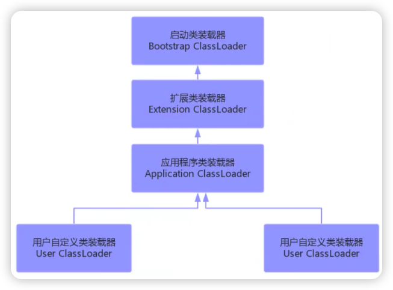

- 除了顶层的启动类加载器外，其余的类加载器都应当有自己的 “父类加载器。

- 不同类加载器看似是继承(Inheritance）关系，实际上是包含关系。在下层加载器中，包含着上层加载器的引用。

#### 1 引导类加载器

启动类加载器（引导类加载器，Bootstrap ClassLoader)

- 这个类加载使用C/C++语言实现的，嵌套在JVM内部。
- 它用来加载Java的核心库（JAVA_HOME/jre/1ib/rt.jar或sun.boot.class.path路径下的内容）。用于提供JVM自身需要的类。
- 并不继承自java.lang.ClassLoader，没有父加载器。
- 出于安全考虑，Bootstrap启动炎加载器只加载包名为java、javax、sun等开头的类
- 加载扩展类和应用程序类加载器，并指定为他们的父类加载器。

`-XX:+TraceClassLoading`

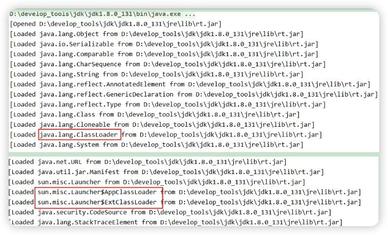

#### 2 扩展类加载器 (Extension ClassLoader)

- Java语言编写，由`sun.misc.Launcher$ExtClassLoadel`实现。

- 继承于ClassLoader类
- 父类加载器为启动类加载器
- 从`java.ext.dirs`系统属性所指定的目录中加载类库，或从JDK的安装目录的jre/lib/ext子目录下加载类库。如果用户创建的JAR放在此目录下，也会自动由扩展类加载器加载。

#### 3 系统类加载器（应用程序类加载器，AppClassLoader）

- java语言编写，由`sun.misc.Launcher$AppClassLoader`实现
- 继承于ClassLoader类
- 父类加载器为扩展类加载器
- 它负责加载环境变量classpath或系统属性 `java.class.path`指定路径下的类库
- ==应用程序中的类加载器默认是系统类加载器。==
- 它是用户自定义类加载器的默认父加载器
- 通过ClassLoader的getSystemClassLoader()方法可以获取到该类加载器

#### 4 用户自定义类加载器

- 在Java的日常应用程序开发中，类的加载几乎是由上述3种类加载器相互配合执行的。在必要时，我们还可以自定义类加载器，来定制类的加载方式。
- 体现Java语言**强大生命力和巨大魅力**的关键因素之一便是，<u>Java开发者可以自定义类加载器来实现类库的动态加载，加载源可以是本地的JAR包，也可以是网络上的远程资源。</u>
- ==通过类加载器可以实现非常绝妙的插件机制==，这方面的实际应用案例举不胜举。例如，著名的OSGI组件框架，再如Eclipse的插件机制。类加载器为应用程序提供了一种动态增加新功能的机制，这种机制无须重新打包发布应用程序就能实现。
- 同时，==自定义加载器能够实现应用隔离==，例如 Tomcat， Spring等中间件和组件框架都在内部实现了自定义的加载器，并通过自定义加载器隔离不同的组件模块。这种机制比C/C++程序要好太多，想不修改C/C++程就能为其新增功能，几乎是不可能的，仅仅一个兼容性便能阻挡住所有美好的设想。
- 自定义类加载器通常需要继承于ClassLoader。


### 4.3 测试不同的类加载器

每个Class对象都会包含一个定义它的ClassLoader的一个引用。

获取ClassLoader的途径：

1. 获得当前类的ClassLoader：`clazz.getClassLoader()`
2. 获得当前线程上下文的ClassLoader： `Thread.currentThread().getContextClassLoader()`
3. 获得系统的ClassLoader：`ClassLoader.getSystemClassLoader()`

说明：

站在程序的角度看，引导类加载器与另外两种类加载器（系统类加教器和扩展类加载器） 并不是同一个层次意义上的加载器，引导类加载器是使用C++语言编写而成的，而另外两种类加载器则是使用Java语言编写而成的。由于引导类加载器压根儿就不是一个java类，因此在java程序中只能打印出空值。


数组类的Class对象，不是由类加载器去创建的，而是<u>在Java运行期JVM根据需要自动创建的</u>。对于数组类的类加载器来说，是通过Class.getclassLoader(）返回的，与数组当中元素类型的类加载器是一样的：<u>如果数组当中的元素类型是基本数据类型，数组类是没有类加载器的</u>。


### 4.4 ClassLoader源码解析

ClassLoader与现有类加载器的关系：

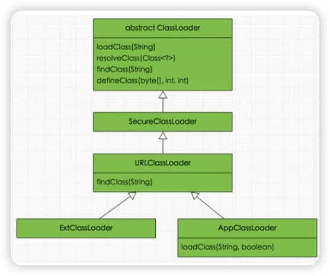

#### ClassLoader的主要方法

抽象类ClassLoader的主要方法：(内部没有抽象方法)

- `public final ClassLoader getParent()`

返回该类加载器的超类加载器


- `public Class<?> loadclass (String name) throws ClassNotFoundException`

加载名称为name的类，返回结果为java.lang.Class类的实例。如果找不到类，则返回 ClassNotFoundException异常。该方法中的逻辑就==是双亲委派模式的实现==。

loadClass()的剖析：

```java
ClassLoader.getSystemClassLoader().loadClass("com.andyron.java.User");
```

```java
// resovle:true 表示加载class的同时进行解析操作
protected Class<?> loadClass(String name, boolean resolve) throws ClassNotFoundException {
   synchronized (getClassLoadingLock(name)) { // 同步操作，保证只能加载一次
     // 首先，在缓存中判断是否已经加载同名的类
     Class<?> c = findLoadedClass(name);
     if (c == null) {
       long t0 = System.nanoTime();
       try {
         // 获取当前类加载器的父类加载器
         if (parent != null) {
           // 如果存在父类加载器，则调用父类加载进行类的加载
           c = parent.loadClass(name, false);
         } else { // parent为null：父类加载是引导类加载器
           c = findBootstrapClassOrNull(name);
         }
       } catch (ClassNotFoundException e) {
         // ClassNotFoundException thrown if class not found
         // from the non-null parent class loader
       }

       if (c == null) { // 当前类的加载器的父类加载器为加载此类 or 当前类的加载器未加载此类
         // 调用当前ClassLoader的findClass，
         long t1 = System.nanoTime();
         c = findClass(name);

         // this is the defining class loader; record the stats
         sun.misc.PerfCounter.getParentDelegationTime().addTime(t1 - t0);
         sun.misc.PerfCounter.getFindClassTime().addElapsedTimeFrom(t1);
         sun.misc.PerfCounter.getFindClasses().increment();
       }
     }
     if (resolve) {
       resolveClass(c);
     }
     return c;
   }
}
```


- `protected Class‹?› findClass(String name) throws ClassNotFoundException`

查找二进制名称为name的类，返回结果为java.lang.Class类的实例。这是一个受保护的方法，JVM鼓励我们重写此方法，需要自定义加载器遵循双亲委托机制，该方法会在检查完父类加载器之后被loadClass()方法调用。

`AppClassLoader`和`ExtClassLoader`的调用的findClass方法是在它们的直接父类`URLClassLoader`中的。

> 在JDK1.2之前，在自定义类加载时，总会去继承ClassLoader类并重写loadClass方法，从而实现自定义的头加载类。但是在JDK1.2之后己不再建议用户去覆盖loadClass()方法（也就是不要破坏双亲委派机制），而是建议把自定义的类加载逻辑写在findClass()方法中，从前面的分析可知，findClass()方法是在LoadClass()方法中被调用的，当loadclass(）方法中父加载器加载失败后，则会调用自己的findClass()方法来完成类加载，这样就可以保证自定义的类加载器也符合双亲委托模式。
>
> 需要注意的是ClassLoader类中并没有实现findClass()方法的具体代码逻辑，取而代之的是抛出ClassNotFoundException异常，同时应该知道的是findClass方法通常是和defineClass方法一起使用的。一般情况下，在自定义类加载器时，会直接覆盖ClassLoader的findclass()方法并编写加载规则，==取得要加载类的字节码后转换成流，然后调用defineClass()方法生成类的Class对象==。

- `protected final Class<?> defineClass(String name, byte[] b, int off, int len)`

根据给定的字节数组b转换为Class的实例，off和len参数表示实际Class信息在byte数组中的位置和长度，其中byte数组b是ClassLoader从外部获取的。这是受保护的方法，只有在自定义ClassLoader子类中可以使用。

> defineClass()方法是用来将byte字节流解析成JVM能够识别的C1ass对象(ClassLoader中己实现该方法逻辑)，通过这个方法不仅能够通过class文件实例化c1ass对象，也可以通过其他方式实例化c1ass对象，如通过网络按收类的字节码，然后转换为byte字节流创建对应的Class对象。
>
> ==defineClass()方法通常与findclass()方法一起使用，一般情况下，在自定义类加载器时，会直接覆盖ClassLoader的findClass()方法并编写加载规则，取得要加载类的字节码后转换成流，然后调用defineClass()方法生成类的Class对象==。

例子：

```java
    @Override
    protected Class<?> findClass(String name) throws ClassNotFoundException {
        // 获取类的class文件字节数组
        byte[] classData = getClassData(name);
        if (classData == null) {
            throw new ClassNotFoundException();
        } else {
            // 直接生成class对象
            return defineClass(name, classData, 0, classData.length);
        }
    }
```

- `protected final void resolveClass (Class<?> c)`

链接指定的一个Java类。使用该方法可以使用类的Class对象创建完成的同时也被解析。前面我们说链接阶段主要是对字节码进行验证，为类变量分配内存并设置初始值同时将字节码文件中的符号引用转换为直接引用。

- `protected final Class‹?› findLoadedClass(String name)`

查找名称为name的己经被加载过的类，返回结果为java.lang.Class类的实例。这个方法是final方法，无法被修改。

- `private final ClassLoader parent;`

它也是一个Classloader的实例，这个字段所表示的ClassLoader也称为这 个ClassLoader的双亲。在类加载的过程中，Classloader可能会将某些请求交子自己的双亲处理。

#### SecureClassLoader与URLClassLoader

接着SecureClassLoader扩展了ClassLoader，新增了几个与使用相关的代码源(对代码源的位置及其证书的验证)和权限定义类验证(主要指对class源码的访问权限)的方法，一般我们不会直接跟这个类打交道，更多是与它的子类URLClassLoader有所关联。

前面说过，ClassLoader是一个抽象类，很多方法是空的没有实现，比如 findClass()、findResource()等。而URLClassLoader这个实现类为这些方法提供了具体的实现。并新增了URLClassPath类协助取得Class字节码流等功能。==在编写自定义类加载器时，如果没有太过于复杂的需求，可以直接继承URLClassLoader类==，这样就可以避免自己去编写findClass()方法及其获取字节码流的方式，使自定义类加载器编写更加简洁。

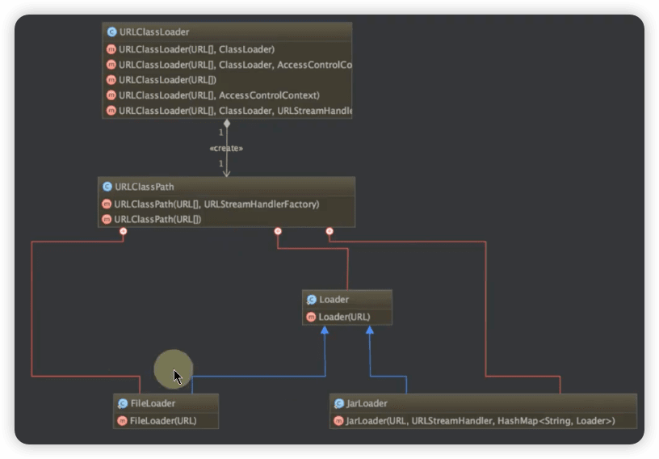

#### ExtClassLoader与Appclasshoader

了解完URLClassLoader后接者看看剩余的两个类加载器，即拓展类加载器ExtClassLoader和系统类加载器AppClassLoader，这两个类都继承自URLClassLoader，是sun.misc.Launcher的静态内部类。sun.misc.Launcher主要被系统用于启动主应用程序，ExtClassLoader和AppClassLoader都是由sun.misc.Launcher创建的，其类主要类结构如下：

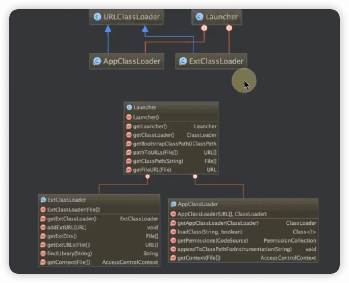

ExtClassLoader并没有重写loadClass()方法，而AppClassLoader虽然重载了loadClass()方法，但最终调用的还是父类loadClass()方法，因此它们都遵守双亲委派模式。

#### Class.forName()与ClassLoader.loadClass()

- Class.forName()：是一个静态方法，最常用的是Class.forName(string className);根据传入的类的全限定名返回一个 Class 对象。==该方法在将 Class 文件加载到内存的同时，会执行类的初始化==。如：`Class.forName ("com.andyron.java.Helloworld");`
- ClassLoader.loadClass()：这是一个实例方法，需要一个 ClassLoader 对象来调用该方法==。该方法将Class 文件加载到内存时，并不会执行类的初始化，直到这个类第一次使用时才进行初始化==。该方法因为需要得到一个Classloader对象，所以可以根据需要指定使用哪个类加载器。如： `ClassLoader c1=....; c1.loadClass("com.andyron.java.Helloworld”);`

### 4.5 双亲委派模型

#### 定义与本质

类加载器用来把类加载到了ava虚拟机中。从JDK1.2版本开始，类的加载过程采用双亲委派机制，这种机制能更好地保证Java平台的安全。

1. 定义

如果一个类加载器在接到加载类的请求时，它首先不会自己尝试去加载这个类，而是把这个请求任务委托给父类加载器去完成，依次递归，如果父类加载器可以完成类加载任务，就成功返回。只有父类加载器无法完成此加载任务时，才自己去加载。

2. 本质

规定了类加载的顺序是：引导类加载器先加载，若加载不到，由扩展类加载器加载，若还加载不到，才会由系统类加载器或自定义的类加载器进行加载。

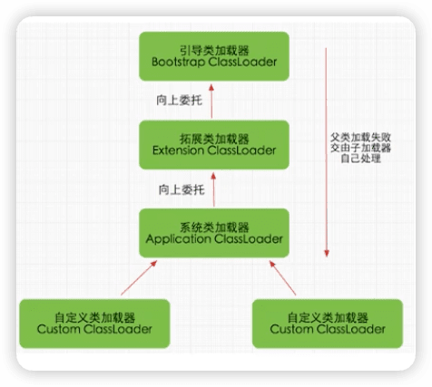

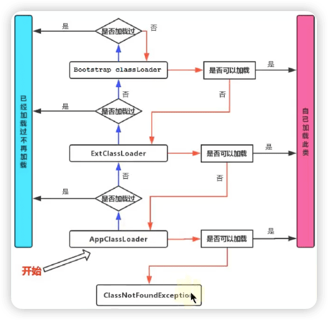

#### 优势与劣势

1. 双亲委派机制优势

- 避免类的重复加载，确保一个类的全局唯一性

  Java类随着它的类加载器一起具备了一种带有优先级的层次关系，通过这种层级关可以避免类的重复加载，当父亲己经加载了该类时，就没有必要子CIassLoader再加载一次。

- 保护程序安全，防止核心API被随意篡改

2. 代码支持

双亲委派机制在 `java.lang.ClassLoader.loadClass(string,boolean)`接口中体现。该接口的逻辑如下：

1️⃣ 先在当前加载器的缓存中查找有无目标类，如果有，直接返回。

2️⃣ 判断当前加载器的父加载器是否为空，如果不为空，则调用parent.loadClass(name, false）接口进行加载。

3️⃣ 反之，如果当前加载器的父类加载器为空，则调用findBootstrapClassOrNull(name)接口，让引导类加载器进行加载。

4️⃣ 如果通过以上3条路径都没能成功加载，则调用findClass(name)接口进行加载。该接口最终会调用java.lang.ClassLoader接口的defineClass系列的native接口加载目标Java类。

双亲委派的模型就隐藏在这第2和第3步中。

3. 举例

假设当前加载的是java. lang.object这个类，很显然，该类属于了DK中核心得不能再核心的一个类，因此一定只能由引导类加载器进行加载。当JVM准备加载javaJang.object时，JVM默认会使用系统类加载器去加载，按照上面4步加载的逻辑，在第1步从系统类的缓存中肯定查找不到该类，于是进入第2步。由于从系统类加载器的父加载器是扩展类加载。

4. 思考

如果在自定义的类加载器中重写java.lang.ClassLoader.loadClass(string)或

java.lang.ClassLoader.loadClass(string，boolean)方法，抹去其中的双亲委派机制，仅保留上面这4步中的第1步与第4步，那么是不是就能够加载核心类库了呢？

这也不行！因为jDK还为核心类库提供了一层保护机制。不管是自定义的类加载器，还是系统类加载器抑或扩展类加载器，最终都必须调用 java.lang.ClassLoader.defineClass(String, byte [], int, int,ProtectionDomain)方法，而该方法会执行==preDefineClass()接口==，该接口中提供了对JDK核心类库的保护。

5. 双亲委托模式的弊端

检查类是否加载的委托过程是单向的，这个方式虽然从结构上说比较清晰，使各个ClassLoader的职责非常明确，但是同时会带来一个问题，即==顶层的ClassLoader无法访问底层的ClassLoader所加载的类==。

通常情况下，启动类加载器中的类为系统核心类，包括一些重要的系统接口，而在应用类加载器中，为应用类。按照这种模式，==应用类访问系统类自然是没有问题，但是系统类访问应用类就会出现问题==。比如在系统类中提供了一个接口，该接口需要在应用类中得以实现，该接口达绑定一个工厂方法，用于创建该接口的实例，而接口和工厂方法都在启动类加载器中。这时，就会出现该工厂方法无法创建由应用类加载器加载的应用实例的问题。🔖

6. 结论：

==由于Java虚拟机规范并没有明确要求类加载器的加载机制一定要使用双亲委派模型，只是建议采用这种方式而己。==

比如在Tomcat中，类加载器所采用的加载机制就和传统的双亲委派模型有一定区别，当缺省的类加载器接收到一个类的加载任务时，首先会由它自行加载，当它加载失败时，才会将类的加载任务委派给它的超类加载器去执行，这同时也是Servlet规范推荐的一种做法。

#### 破坏双亲委派机制

1. 破坏双亲委派机制1

双亲委派模型并不是一个具有强制性约束的模型，而是Java设计者推荐给开发者们的类加载器实现方式。

在Java的世界中大部分的类加载器都遊循这个模型，但也有例外的情况，直到Java模块化出现为止，双亲委派模型主要出现过3次较大规模“被破坏” 的情况。


第一次破坏双亲委派机制：

双亲委派模型的第一次 “被破坏，其实发生 在双亲委派模型出现之前——即了DK 1.2面世以 前的“远古”时代。

由于双亲委派模型在JDK 1.2之后才被引入，但是类加载器的概念和抽象类java. lang.ClassLoader则在Java的第一个版本中就已经存在，面对己经存在的用户自定义类加载器的代码，Java设计者们引入双亲委派模型时不得不做出一些妥协，==为了兼容这些已有代码，无法再以技术手段避免loadClass()被子类複盖的可能性==，只能在JDK1.2之后的java.lang. ClassLoader中添加一个新的protected方法findC1ass()，并引1导用户编写的类加载逻辑时尽可能去重写这个方法，而不是在loadClass()中编写代码。上节我们已经分析过loadClass()方法，双亲委派的具体逻辑就实现在这里面，按照loadClass()方法的逻辑，如果父类加载失败，会自动调用自己的findClass(）方法来完成加载，这样既不影响用户按照自己的意愿去加载类，又可以保证新写出来的类加载器是符合双亲委派规则的。

2. 破坏双亲委派机制2

第二次破坏双亲委派机制：**线程上下文类加载器**

双亲委派模型的第二次“被破坏” 是由这个模型自身的缺陷导致的，双亲委派很好地解决了各个类加载器协作时基础类型的一致性问题（==越基础的类由越上层的加载器进行加载==），基础类型之所以被称为 “基础”，是因为它们总是作为被用户代码继承、调用的API存在，但程序设计往往没有绝对不变的完美规则，==如果有基础类型又要调用回用户的代码，那该怎么办呢？==

这并非是不可能出现的事情，一个典型的例子便是JNDI服务，JNDI现在己经是Java的标准服务，它的代码由启动类加载器来完成加载（在JDK 1.3时加入到rt.jar的），肯定属于Java中很基础的类型了。但JNDI存在的目的就是对资源进行查找和集中管理，它需要调用由其他厂商实现并部署在应用程序的ClassPath下的JNDI==服务提供者接口（Service Provider Interface, SPI）==的代码，现在问题来了，<u>启动类加载器是绝不可能认识、加载这些代码的，那该怎么办？</u>（<u>SPI：在Java平台中，通常把核心类rt.jar中提供外部服务、可由应用层自行实现的接口称为SPI</u>)

为了解决这个困境，Java的设计团队只好引入了一个不太优雅的设计：==线程上下文类加载器(Thread Context ClassLoader）==。这个类加载器可以通过java.lang.Thread类的`setContextClassLoader()`方法进行设置，如果创建线程时还未设置，它将会从父线程中继承一个，如果在应用程序的全局范国内都没有设置过的话，那这个类加载器默认就是应用程序类加载器。

举例：

> 高层（决策、与政府沟通）
>
> 中层（。。。）
>
> 普通员工（。。。）
>
> 一般情况下，不同级别的人员干不同的事，但高层电脑坏了搞不定需要找普通员工帮忙办理
>
> 当引导类加载器想用下面具体实现时，就委托给线程上下文类加载器，线程上下文类加载器再去调用具体应用类加载器，实现功能调用


有了线程上下文类加载器，程序就可以做一些 “舞弊”的事情了。JNDI服务使用这个线程上下文类加载器去加载所需的SPI服务代码，==这是一种父类加载器去请求子类加载器完成类加载的行为，这种行为实际上是打通了双亲委派模型的层次结构来逆向使用类加载器，己经违背了双亲委派模型的一般性原则==，但也是无可奈何的事情。Java中涉及SPI的加载基本上都采用这种方式来完成，例如**JNDI、JDBC、JCE、JAXB和JBI**等。不过，当SPI的服务提供者多于一个的时候，代码就只能根据具体提供者的类型来硬编码判断，为了消除这种极不优雅的实现方式，在JDK 6时，JDK提供了`java.util.ServiceLoader`类，以META-INF/services中的配置信息，辅以责任链模式，这才算给SPI的加载提供了一种相对合理的解决方案。

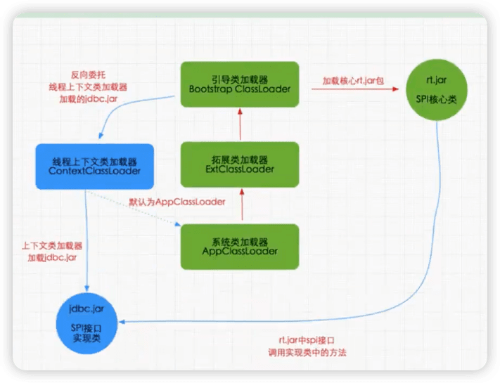

默认上下文加载器就是应用类加载器，这样以上下文加载器为中介，使得启动类加载器中的代码也可以访问应用类加载器中的类。

🔖// TODO JDBC `java.sql.DriverManager` `com.mysql.cj.jdbc.Driver`

3. 破坏双亲委派机制3

第三次破坏双亲委派机制：

双亲委派模型的第三次 “被破坏，是由于用户对程序**动态性**的追求而导致的。如：==代码热替换(Hot Swap）、模块热部署（Hot Deployment）==等。

> 举例：
>
> 想把java程序相关模块像电脑外设那样，拔插鼠标、键盘灯不需要关机。

IBM公司主导的JSR-291（即OSGi R4.2） 实现模块化热部署的关键是它自定义的类加载器机制的实现，每一个程序模块（OSGi中称为**Bundle**）都有一个自己的类加载器，当需要更换一个Bundle时，就把Bundle连同类加载器一起换掉以实现代码的热替换。在OSGi环境下，类加载器不再双亲委派模型推荐的树状结构，而是进一步发展为更加复杂的==网状结构==。

> oracle公司在 jdk9 才正式引入模块化Jigsaw，但也尽量避开OSGi上的优势。

当收到类加载请求时，OSGi将技照下面的顺序进行类搜索：

<u>1）将以java.*开头的类，委派给父类加载器加载。</u>

<u>2）否则，将委派列表名单内的类，委派给父类加载器加载。</u>

3）否则，将Import列表中的类，委派给Export这个类的Bundle的类加载器加载。

4）否则，查找当前Bundle的ClassPath，使用自己的类加载器加载。

5）否则，查找类是否在自己的Fragment Bundle中，如果在，则委派给Fragment Bundle的类加载器加载。

6）否则，查找Dynamic Import列表的Bundle，委派给对应Bundle的类加载器加载。

7）否则，类查找失败。

说明：只有开头两点仍然符合双亲委派模型的原则，其余的类查找都是在平级的类加载器中进行的。

小结：

这里，我们使用了 “被破坏〞这个词来形容上述不符合双亲委派模型原则的行为，但==这里 “被破坏〞并不一定是带有贬义的。只要有明确的目的和充分的理由，突破旧有原则无疑是一种创新。==

正如：OSGi中的类加载器的设计不符合传统的双亲委派的类加载器架构，且业界对其为了实现热部署而带来的额外的**高复杂度**还存在不少争议，但对这方面有了解的技术人员基本还是能达成一个共识，认为**OSGi中对类加载器的运用是值得学习的，完全弄懂了OSGi的实现，就算是掌握了类加载器的精榨**。

#### 热替换的实现

热替换是指在程序的运行过程中，不停止服务，只通过替换程序文件来修改程序的行为。==热替换的关键需求在于服务不能中断，修改必须立即表现正在运行的系统之中==。基本上大部分脚本语言都是天生支持热替换的，比如：PHP，只要替换了PHP源文件，这种改动就会立即生效，而无需重启web服务器。

但对Java来说，热替换并非天生就支持，<u>如果一个类己经加载到系统中，通过修改类文件，并无法让系统再来加载并重定义这个类</u>。因此，在Java中实现这一功能的一个可行的方法就是灵活运用ClassLoader。

注意：由不同ClassLoader加载的同名类属于不同的类型，不能相互转换和兼容。即两个不同的ClassLoader加载同一个类，在虛拟机内部，会认为这2个类是完全不同的。

根据这个特点，可以用来模拟热替换的实现，基本思路如下图所示：

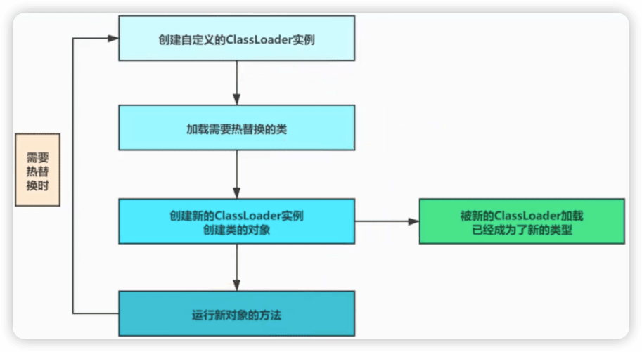

> 《实战Java虚拟机》10.2.7

```java
/**
 * 热替换示列
 *
 * 在代码目录先用`javac Demo1.java`生成Demo1.class文件，然后运行程序后，重新修改Demo1.hot()方法，
 * 再用`javac Demo1.java`生成Demo1.class文件，程序不需要重新启动，修改结果就生效。
 * @author andyron
 **/
public class LoopRun {
    public static void main(String[] args) {
        // 每次调用Demo1.hot()方法之前，都会重新加载DemoA
        while (true) {
            try {
                MyClassLoader loader = new MyClassLoader(System.getProperty("user.dir") + "/ch04/src/");
                Class<?> clazz = loader.findClass("com.andyron.java1.Demo1");
                Object demo = clazz.newInstance();
                Method m = clazz.getMethod("hot");
                m.invoke(demo);
                Thread.sleep(5000);
            } catch (Exception e) {
                System.out.println("not find");
                try {
                    Thread.sleep(5000);
                } catch (InterruptedException ex) {
                    ex.printStackTrace();
                }
            }
        }
    }
}

```


### 4.6 沙箱安全机制

沙箱安全机制

- 保证程序安全
- 保护Java原生的JDK代码

==Java安全模型的核心就是Java沙箱(sandbox）==。什么是沙箱？沙箱是一个限制程序运行的环境。

沙箱机制就是将Java代码==限定在虛拟机（JVM）特定的运行范围中，并且严格限制代码对本地系统资源访问==。通过这样的措施米保证对代码的有限隔离，防止对本地系统造成破坏。

沙箱主要限制系统资源访问，那系统资源包括什么？CPU、内存、文件系统、网络。不同级别的沙箱对这些资源访问的限制也可以不一样。

所有的Java程序运行都可以指定沙箱，可以定制安全策路。

#### JDK1.0时期

在Java中将执行程序分成本地代码和远程代码两种，本地代码默认视为可信任的，而远程代码则被看作是不受信的。对手投信的本地代码，可以访问一切本地资源。而对于非投信的远程代码在早期的Java实现中，安全依赖于沙箱（Sandbox）机制。如下图所示JDK1.0安全模型

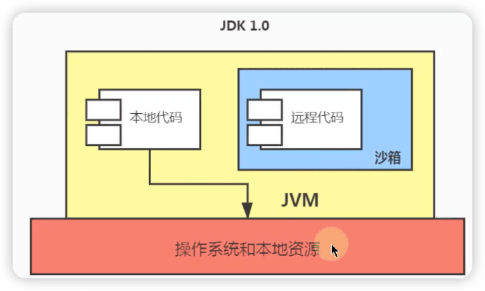

#### JDK1.1时明

JDK1.0中如此严格的安全机制也给程序的功能扩展带来障碍，比如当用户希望远程代码访问本地系统的文件时候，就无法实现。

因此在后续的Java1.1版本中，针对安全机制做了改进，增加了安全策略。允许用户指定代码对本地资源的访问权限。

如下图所示JDK1.1安全模型

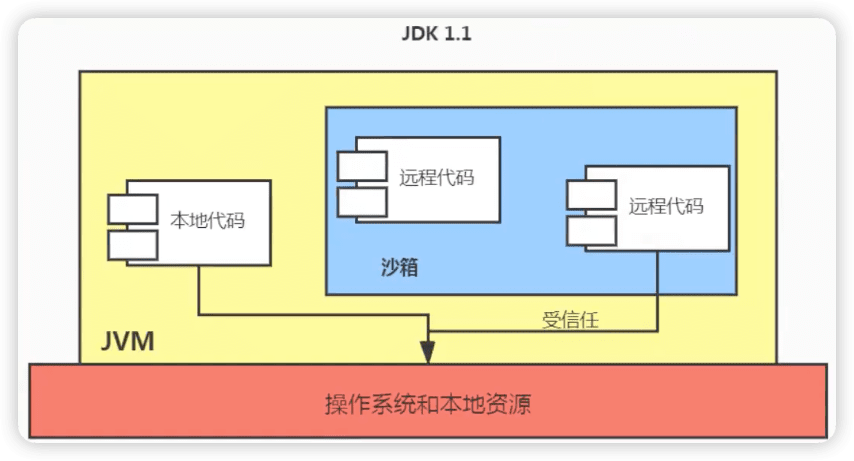

#### JDK1.2时期

在Java1.2版本中，再次改进了安全机制，增加了==代码签名==。不论本地代码或是远程代码，都会按照用户的安全策略设定，由类加载器加载到虚拟机中权限不同的运行空间，来实现差异化的代码执行权限控制。如下图所示JDK1.2安全模型：

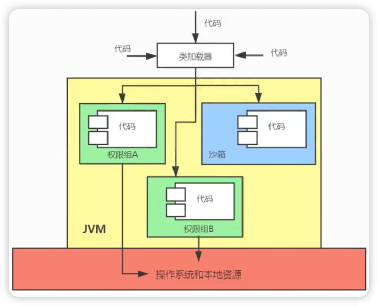

#### JDK1.6时朗

当前最新的安全机制实现，则引入了**域（Domain）**的概念。

虚拟机会把所有代码加载到不同的系统域和应用域。==系统域部分专门负责与关键资源进行交互==，而各个应用域部分则通过系统域的部分代理来对各种需要的资源进行访问。虛拟机中不同的受保护域(Protected Domain），对应不一样的权限 (Permission）。存在于不同域中的类文件就具有了当前域的全部权限，如下图所示，最新的安全模型（jdk1.6)：

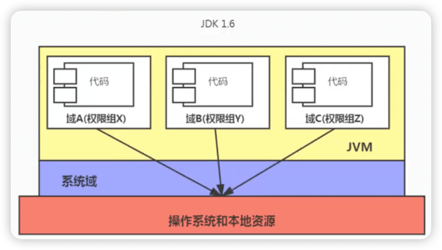

### 4.7 自定义类的加载器

#### 1 为什么要自定义类加载器？

- ==隔离加载类==

在某些框架内进行中间件与应用的模块隔离，把类加载到不同的环境。

比如：阿里内某容器框架通过自定义类加载器确保应用中依赖的jar包不会影响到中间件运行时使用的jar包。再比如： Tomcat这类web应用服务器，内部自定义了好几种类加载器，用于隔离同一个Web应用服务器上的不同应用程序。（类的仲裁 --> 类冲突）

- ==修改类加载的方式==

类的加载模型并非强制，除Bootstrap外，其他的加载并非一定要引入，或者根据实际情況在某个时间点进行按需进行动态加载

- ==扩展加载源==

比如从数据库、网络、甚至是电祝机机顶盒进行加载

- ==防止源码泄漏==

Java代码容易被编译和篡改！可以进行编译加密。那么类加载也需要自定义，还原加密的字节码。

#### 2 常见的场景

- 实现类似进程内隔离，类加载器实际上用作不同的命名空间，以提供类似容器、模块化的效果。例如，两个模块依赖于某个类库的不同版本，如果分别被不同的容器加载，就可以互不干扰。这个方面的集大成者是Java EE和OSGI、JPMS等框架。
- 应用需要从不同的数据源获取类定义信息，例如网络数据源，而不是本地文件系统。或者是需要自己操纵宇节码，动态修改或者生成类型。

#### 3 注意：

在一般情况下，使用不向的类加载器去加载不同的功能模块，会提高应用程序的安全性。但是，如果涉及Java类型转换，则加载器反而容易产生不美好的事情。在做Java类型转换时，只有两个类型都是由同一个加载器所加载，才能进行类型转换，否则转换时会发生异常。


#### 实现方式

用户通过定制自己的类加载器，这样可以重新定义类的加载规则，以便实现一些自定义的处理逻辑。

1. 实现方式

- Java提供了抽象类java.lang.ClassLoader，所有用户自定义的类加载器都应该继承ClassLoader类。
- 在自定义 ClassLoader 的子类时候，我们常见的会有两种做法：
  - 方式一：重写1oadclass()方法
  - 方式二：重写findclass()方法(推荐)

2. 对比

这两种方法本质上差不多，毕竞loadC1ass()也会调用findClass()，但是从逻辑上讲我们最好不要直接修改loadClass(）的内部逻辑。建议的做法是只在findClass()里重写自定义类的加载方法，根据参数指定类的名字，返回对应的Class对象的引用。

- loadClass()这个方法是实现双亲委派模型逻辑的地方，擅自修改这个方法会导致模型被破坏，容易造成问题。==因此我们最好是在双亲委派模型框架内进行小范围的改动，不破坏原有的稳定结构。==同时，也避免了自己重写loadClass(）方法的过程中必须写双亲委托的重复代码，从代码的复用性来看，不直接修改这个方法始终是比较好的选择。
- 当编写好自定义类加载器后，便可以在程序中调用loadClass()方法来实现类加载操作。

3. 说明

- 自定义的类加载器的父类加载器是系统类加载器
- JVM中的所有类加载都会使用java.1ang.ClassLoader.1oadC1ass(string)接口(自定义类加载器并重写


### 4.8 Java9新特性

为了保证兼容性，JDK 9没有从根本上改变三层类加载器架构和双亲委派模型，但为了模块化系统的顺利运行，仍然发生了一些值得被注意的变动。

1. 扩展机制被移除，扩展类加载器由于向后兼容性的原因被保留，不过被重命名为==平台类加载器==(platform classloader）。可以通过ClassLoader的新方法getPlatformClassLoader(）来获取。

JDK9时基于模块化进行构建（原来的rt.jar 和 tools.jar 被拆分成数十个JMOD文件）

其中的 Java类库就已天然地满足了可扩展的需求，那自然无须再保留＜JAVA_ HOME>\lib\ext 目录，此前使用这个目录或者 java.ext.dirs 系统变量来扩展 jDK 功能的机制已经没有继续存在的价值了。

2．平台类加载器和应用程序类加载器都不再继承自 java.net.URLClassLoader。现在启动类加载器、平台类加载器、应用程序类加载器全都继承于 `jdk.internal.loader.BuiltinclassLoader`。

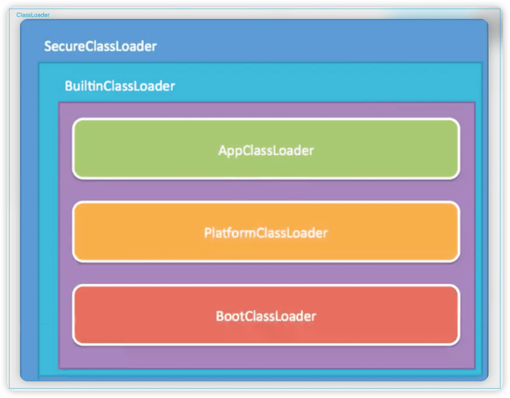

 `jdk.internal.loader.ClassLoaders`

如果有程序直接依赖了这种继承关系，或者依赖了 URLClassLoader 类的特定方法，那代码很可能会在 JDK 9及更高版本的 JDK 中崩溃。

3. 在Java 9中，类加载器有了名称。该名称在构造方法中指定，可以通过getName()方法来获取。平台类加载器的名称是platform， 应用类加载器的名称是app。类加载器的名称在调试与类加载器相关的问题时会非常有用。

4. 启动加载器现在是在jvm内部和java类库共同协作实现的类加载器（以前是C++实现了，但为了与之前代码兼容，在获取启动类加载器的场景中仍然会返回null，而不会到`BootClassLoader`实例。

5. 类加载的委派关系也发生了变动。

当平台及应用程序类加载器收到类加载请求，在委派给父加载器加载前，要先判断该类是否能够归属到某一个系统模块中，如果可以找到这样的归属关系，就要优先委派给负责那个模块的加载器完成加载。

双亲委派模式示意图

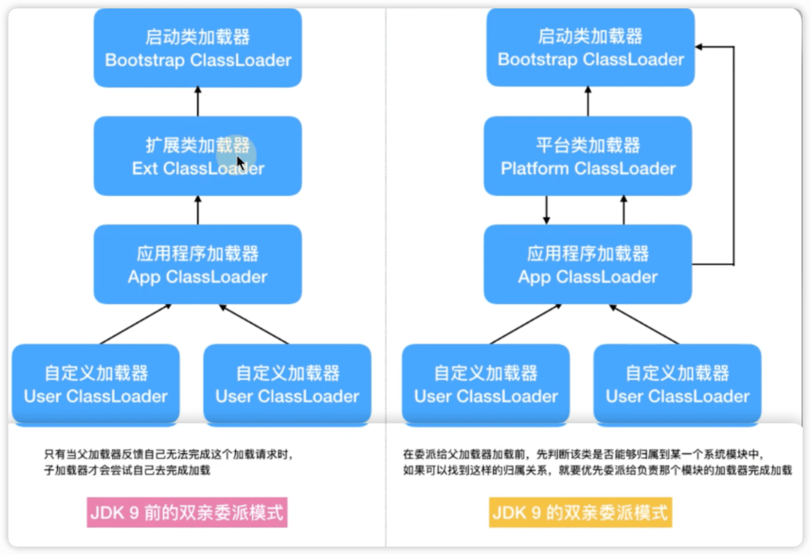

附加：

在java 模块化系统明确规定了三个类加载器负责各自加载的模块：

- 启动类加载器负责加载的模快

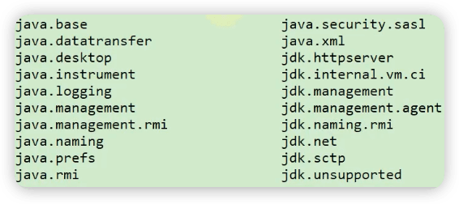

- 平台类加载器负责加载的模块

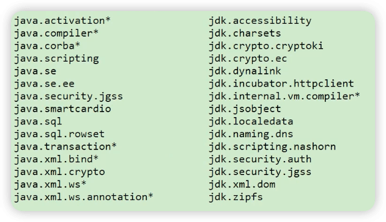

- 应用程序类加载器负责加载的模块

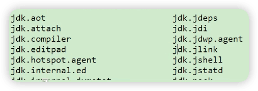 等等

# 三、性能监控与调优篇

P302 - p381

## 1 概述

### 面试题

> 支付宝：
>
> 支付宝三面：JVM性能调优都做了什么？
>
> 小米：
>
> 有做过JVM内存优化吗？
>
> 从SQL、JVM、架构、数据库四个方面讲讲优化思路
>
> 蚂蚁金服：
>
> JVM的编译优化
>
> jvm性能调优都做了什么
>
> JVM诊断调优工具用过哪些？
>
> 二面：jvm怎样调优，堆内存、栈空间设置多少合适
>
> 三面：JVM相关的分析工具使用过的有哪些？具体的性能调优步骤如何
>
> 阿里：
>
> 如何进行JVM调优？有哪些方法？
>
> 如何理解内存泄漏问题？有哪些情况会导致内存泄漏？如何解决？
>
> 字节跳动：
>
> 三面：JVN如何调优、参数怎么调？
>
> 拼多多：
>
> 从SQL、JVM、架构、数据库四个方面讲讲优化思路
>
> 京东：
>
> JVM诊断调优工具用过哪些？
>
> 每秒几十万并发的秒杀系统为什么会频繁发生GC？
>
> 日均百万级交易系统如付优化JVM？
>
> 线上生产系统OOM如何监控及定位与解决？
>
> 高并发系统如何基于G1垃圾回收器优化性能？

### 背景说明

#### 1 生产环境中的问题

生产环境发生了内存溢出该如何处理？

生产环境应该给服务器分配多少内存合适？

如何对垃圾回收器的性能进行调优？

生产环境CPU负载放高该如何处理？

生产环境应该给应用分配多少线程合适？

不加log，如何确定请求足否执行了某一行代码？

不加log，如何实时查看某个方法的入参与返回值？

#### 2 为什么要调优

防止出现OOM

解决OOM

减少Full GC出现的频率


#### 3 不同阶段考虑

上线前

项目运行阶段

线上出现OOM


### 调优概述

#### 1 监控的依据

运行日志

异常堆栈

GC日志

线程快照

堆转储快照

#### 2 调优的大方向

合理地编写代码

充分并合理的使用硬件资源

合理地进行JVM调优


### 性能优化的步骤

#### 第1步（发现问题）：性能监控

一种以==非强行或者入侵方式==收集或查看应用运营性能数据的活动。

监控通常是指一种在生产、质量评估或者开发环境下实施的带有预防或主动性的活动。

当应用相关干系人提出性能问题却没有提供足够多的线索时，首先我们需要进行性能监控，随后是性能分析。

- GC频繁

- cpu load过高

- OOM

- 内存泄漏

- 死锁

- 程序响应时间较长


#### 第2步（排查问题）：性能分析

一种以==侵入方式==收集运行性能数据的活动，它会影响应用的吞吐量或响应性。

性能分析是针对性能问题的答复结果，关注的范围通常比性能监控更加集中。

性能分析很少在生产环境下进行，通常是在质量评估、==系统测试或者开发环境==下进行，是性能监控之后的步骤。


- 打印GC日志，通过GCViewer或http://gceasy.io来分析日志信息
- 灵活运用命令行工具，jstack，jmap，jinfo等
- dump出堆文件，使用内存分析工具分析文件
- 使用阿里Arthas，或jconsole、JVisualVM来实时查看JVM状态
- jstack查看堆栈信息

#### 第3步（解决问题）：性能调优

一种为改善应用响应性或吞吐量而更改参数、源代码、属性配置的活动，性能调优是在性能监控、性能分析之后的活动。   

- 适当增加内存，根据业务背景选择垃圾回收器
- 优化代码，控制内存使用
- 增加机器，分散节点压力
- 合理设置线程池线程数量
- 使用中间件提高程序效率，比如缓存，消息队列等
- ...

### 性能评价/测试指标

#### 1 停顿时间（或响应时间）

提交请求和返回该请求的响应之间使用的时间，一般比较关注平均响应时间。

常用操作的响应时间列表：

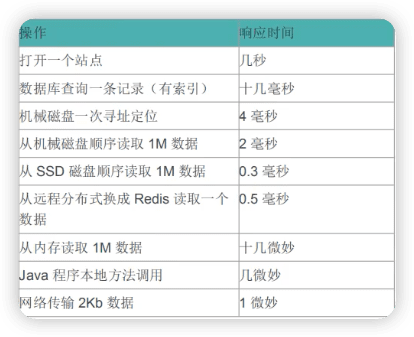

在垃圾回收环节中：

**暂停时间**：执行垃圾收集时，程序的工作线程被暂停的时间。 `-XX:MaxGCPauseMillis`

#### 2 吞吐量

对单位时间内完成的工作量（请求）的量度。

在GC中：运行用户代码的时间占总运行时间的比例（总运行时间：程序的运行时间 + 内存回收的时间）吞吐量为 1 - 1/(1+n)。 `-XX:GCTimeRatio=n`

#### 3 并发数

同一时刻，对服务器有实际交互的诘求数

1000个人同时在线，估计并发数在5%-15%之间，也就是同时井发量：50-150之间。

#### 4 内存占用

java堆区所占的内存大小

#### 5 相互间的关系

以高速公路通行状况为例

吞吐量：每天通过高速公路收费站的车辆的数据（也可以理解为收费站收取的高速费）

并发数：高速公路上正在行驶的车辆的数目

响应时间：车速

> Jvm调优最关心响应时间和吞吐量


## 2 JVM监控及诊断工具-命令行

### 2.1 概述

性能诊断是软件工程师在日常工作中需要经常面对和解决的问题，在==用户体验至==上的今天，解决好应用的性能问题能带来非常大的收益。

Java 作为最流行的编程语言之一，其应用性能诊断一直受到业界广泛关注。可能造成 Java应用出现性能问题的因素非常多，例如线程控制、磁盘读写、数据库访问、网络I/O、垃圾收集等。想要定位这些问题，一款优秀的性能诊断工具必不可少。

体会1：==使用数据说明问题，使用知识分析问题，使用工具处理问题==。

体会2：==无监控、不调优==！

命令行工具的都是java编写，源码在jdk根目录`lib/tool.jar`（jdk8）中。

https://hg.openjdk.org/jdk/jdk11/file/1ddf9a99e4ad/src/jdk.jcmd/share/classes/sun/tools

### 2.2 jps：查看正在运行的Java进程

jps (Java Process Status):

显示指定系统内所有的Hotspot虚拟机进程(查看虚拟机进程信息），可用于查询正在运行的虚拟机进程。

说明：对于本地虛拟机进程来说，**进程的本地虛拟机ID与操作系统的进程ID是一致的，是唯一的。**

`jps [options] [hostid]`


#### options参数

- `-q`：仅仅显示LVMID (local virtual machine id)，即本地虛拟机唯一id。不显示主类的名称等

- `-l`：输出应用程序主类的全类名 或 如果进程执行的是jar包，则输出jar完整路径

- `-m`：输出虛拟机进程启动时传递给主类main()的参数

  ```shell
  $ jps -m
  34514
  34691 ScannerTest andyron
  34552 RemoteMavenServer36
  34715 Jps -m
  ```

  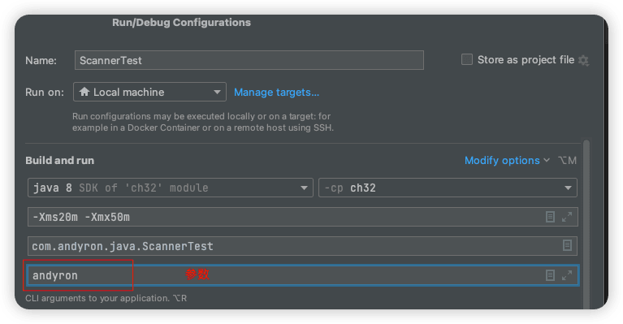

- `-v`：列出虚拟机进程启动时的JVM参数。比如：`-Xms20m -Xmx50m`是启动程序指定的jvm參数。

说明：以上参数可以综合使用。

补充：

如果某 Java 进程关闭了默认开启的UsePerfData參数（即使用参数`-XX:-UsePerfData`），那么jps命令（以及下面介绍的jstat）将无法探知该Java 进程。


#### hostid参教

`<hostid>:      <hostname>[:<port>]`

RMI注册表中注册的主机名。

如果想要远程监控主机上的 java程序，需要安装 `jstatd`。

对于具有更严格的安全实践的网络场所而言，可能使用一个自定义的策略文件来显示对特定的可信主机或网络的访问，尽管这种技术容易受到IP地址欺诈攻击。

如果安全问题无法使用一个定制的策略文件来处理，那么最安全的操作是不运行jstatd服务器，而是在本地使用jstat和jps工具。


### 2.3 jstat：查看JVM统计信息

jstat (JVM Statistics Monitoring Tool)：用于监视虛拟机各种运行状态信息的命令行工具。它可以显示本地或者远程虚拟机进程中的类装载、内存、垃圾收集、JIT编译等远行数据。

**在没有GUI图形界面，只提供了纯文本控制台环境的服务器上，它将是运行期定位虛拟机性能问题的首选工具。**常用于检测垃圾回收问题以及内存泄漏问题。

官方文档：https://docs.oracle.com/javase/8/docs/technotes/tools/unix/jstat.html

#### 基本语法

`jstat -<option> [-t] [-h<lines>] <vmid> [<interval> [<count>]]`

##### option参数

###### **类装载相关的：**

- `-class`：最示ClassLoader的相关信息：类的装载、卸载数量、总空间、类装载所消耗的时间等

```shell
➜ jstat -class 34889
Loaded  Bytes  Unloaded  Bytes     Time
   676  1350.1        0     0.0       0.06
```


###### **垃圾回收相关的**：

- `-gc`：显示与GC相关的堆信息。包括Eden区、两个Survivor区、老年代、永久代等的容量、已用空间、GC时间合计等信息。
- `-gccapacity`：显示内容与-gC基本相同，但输出主要关注Java堆各个区域
- 使用到的最大、最小空间。
- `-gcutil`：显示内容与-gC基本相同，但输出主要关注已使用空间占总空间的百分比。
- `-gccause`：与-gcutil功能一样，但是会额外输出导致最后一次或当前正在发生的GC产生的原因。
- `-gcnew`：显示新生代GC状况
- `-gcnewcapacity`：显示内容与-gcnew基本相同，输出主要关注使用到的最大、最小空间
- `-geold`：显示老年代GC状况

```shell
➜ jstat -gc 35025
 S0C    S1C    S0U    S1U      EC       EU        OC         OU       MC     MU    CCSC   CCSU   YGC     YGCT    FGC    FGCT     GCT
1024.0 1024.0  0.0    0.0    6144.0   2533.9   16384.0      0.0     4480.0 800.1  384.0   77.0       0    0.000   0      0.000    0.000
```

-gc显示说明：

```
新生代相关
	S0C是第一个幸存者区的大小（字节）
	S1C是第二个幸存者区的大小（字节）
	S0U是第一个幸存者区已使用的大小（字节）
	S1U是第二个幸存者区已使用的大小（字节）
	EC是Eden空间的大小（字节）
	EU是Eden空间已使用大小（字节）
老年代相关
	OC是老年代的大小（字节）
	OU是老年代已使用的大小（字节）
方法区（元空间）相关
	MC是方法区的大小
	MU是方法区已使用的大小
	CCSC是压缩类空间的大小
	CCSU是压缩类空间已使用的大小
其他
	YGC是从应用程序启动到采样时young gc的次数
	YGCT是指从应用程序启动到采样时young gc消耗时间（秒）
	FGC是从应用程序启动到采样时full gc的次数
	FGCT是从应用程序启动到采样时的full gc的消耗时间（秒）
	GCT是从应用程序启动到采样时gc的总时间
```


###### **JIT相关的：**

- `-compiler`：显示JIT编译器编译过的方法、耗时等信息

- `-printcompilation`：输出已经被JIT编译的方法

```shell
➜ jstat -compiler 34889
Compiled Failed Invalid   Time   FailedType FailedMethod
      58      0       0     0.01          0
      
➜ jstat -printcompilation 34889
Compiled  Size  Type Method
      58     70    1 java/lang/String indexOf
```


##### interval参数

用于指定输出统计数据的周期，单位为毫秒。即：查询间隔。

每隔疫苗打印一次

```shell
➜ jstat -class 34889 1000
```


##### count参数

用于指定查询的总次数。

```shell
➜  Downloads jstat -class 34889 1000 10
```

##### -t参数

可以在输出信息前加上一个Timestamp列，显示程序的运行时间。单位：秒。

```shell
➜ jstat -class -t 34889
Timestamp       Loaded  Bytes  Unloaded  Bytes     Time
          557.4    676  1350.1        0     0.0       0.06
```

**经验:**

我们可以比较Java 进程的启动时间以及总 GC 时间（GCT 列），或者两次测量的间隔时间以及总GC时间的增量，来得出 GC 时间占运行时间的比例。

如果该比例超过 20%，则说明目前堆的压力较大：如果该比例超过 90%，则说明堆里几乎没有可用空间，随时都可能抛出 OOM 异常。

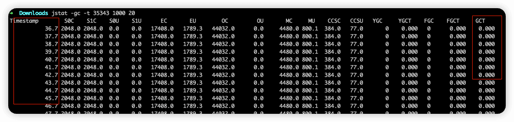

##### -h参数

可以在周期性数据输出时，输出多少行数据后输出一个**表头信息**。

```shell
➜ jstat -class -t -h3 34889 1000 10
Timestamp       Loaded  Bytes  Unloaded  Bytes     Time
          676.3    676  1350.1        0     0.0       0.06
          677.4    676  1350.1        0     0.0       0.06
          678.4    676  1350.1        0     0.0       0.06
Timestamp       Loaded  Bytes  Unloaded  Bytes     Time
          679.4    676  1350.1        0     0.0       0.06
          680.4    676  1350.1        0     0.0       0.06
          681.4    676  1350.1        0     0.0       0.06
Timestamp       Loaded  Bytes  Unloaded  Bytes     Time
          682.4    676  1350.1        0     0.0       0.06
          683.4    676  1350.1        0     0.0       0.06
          684.4    676  1350.1        0     0.0       0.06
Timestamp       Loaded  Bytes  Unloaded  Bytes     Time
          685.4    676  1350.1        0     0.0       0.06
```


#### 补充

jstat还可以用来判断是否出现内存泄漏。

- 第1步：

在长时间运行的 Java 程序中，我们可以运行jstat命令连续获取多行性能数据，并取这几行数据中 OU列（即己占用的老年代内存）的最小值。

- 第2步：

然后，我们每隔一段较长的时间重复一次上述操作，来获得多组OU最小值。如果这些值呈上涨趋势，则说明该 Java 程序的老年代内存己使用量在不断上涨，这意味着无法回收的对象在不断增加，因此很有可能存在内存泄漏。

### 2.4 jinfo：实时==查看和修改==JVM配置参数

jinfo(Configuration Info for Java)

查看虚拟机配置参数信息，也可用于调整虛拟机的配置参数。

在很多情况下，Java应用程序不会指定所有的==Java虚拟机参数==。而此时，开发人员可能不知道某一个具体的Java虛拟机参数的默认值。在这种情况下，可能需要通过查找文档获取某个参数的默认值。这个查找过程可能是非常艰难的。但有了jinfo工具，开发人员可以很方便地找到Java虛拟机参数的当前值。

#### 基本语法

`jinfo <option> <pid>`

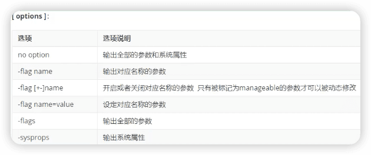

> 🐞macOS 上的jinfo失效？！

##### 查看

- `jinfo -sysprops 进程id`

可以查看由System.getProperties()取得的参数

- `jinfo -flags 进程id`

查看曾经赋过值的一些参数

- `jinfo -flag 参数名称 进程id`

查看某个java进程的具体参数信息

```shell
jinfo -flag UseG1GC 2157
```


##### 修改（能修改的参数有限）

jinfo不仅可以查看运行时某一个Java虛拟机参数的实际取值，甚至可以在运行时修改部分参数，并使之立即生效。

但是，并非所有参数都支持动态修改。参数只有被标记为`manageable`的flag可以被实时修改。其实，这个修改能力是极其有限的。可以查看被标记为manageable的参数:

```
java -XX:+PrintFlagsFinal -version | grep manageable
```

```shell
➜ java -XX:+PrintFlagsFinal -version | grep manageable
     intx CMSAbortablePrecleanWaitMillis            = 100                                 {manageable}
     intx CMSTriggerInterval                        = -1                                  {manageable}
     intx CMSWaitDuration                           = 2000                                {manageable}
     bool HeapDumpAfterFullGC                       = false                               {manageable}
     bool HeapDumpBeforeFullGC                      = false                               {manageable}
     bool HeapDumpOnOutOfMemoryError                = false                               {manageable}
    ccstr HeapDumpPath                              =                                     {manageable}
    uintx MaxHeapFreeRatio                          = 100                                 {manageable}
    uintx MinHeapFreeRatio                          = 0                                   {manageable}
     bool PrintClassHistogram                       = false                               {manageable}
     bool PrintClassHistogramAfterFullGC            = false                               {manageable}
     bool PrintClassHistogramBeforeFullGC           = false                               {manageable}
     bool PrintConcurrentLocks                      = false                               {manageable}
     bool PrintGC                                   = false                               {manageable}
     bool PrintGCDateStamps                         = false                               {manageable}
     bool PrintGCDetails                            = false                               {manageable}
     bool PrintGCID                                 = false                               {manageable}
     bool PrintGCTimeStamps                         = false                               {manageable}
openjdk version "1.8.0_352"
OpenJDK Runtime Environment (Zulu 8.66.0.15-CA-macos-aarch64) (build 1.8.0_352-b08)
OpenJDK 64-Bit Server VM (Zulu 8.66.0.15-CA-macos-aarch64) (build 25.352-b08, mixed mode)
```


- 针对boolean类型

`jinfo -flag [+ | -]参数名称 进程id`

如果使用+号，那就可以让该参数起作用，否则使用-号就让该参数不起作用，具体例子如下：

```shell
[root@localhost ~]# jinfo -flag PrintGCDetails 2157
-XX:-PrintGCDetails
[root@localhost ~]# jinfo -flag +PrintGCDetails 2157  // 修改成功
[root@localhost ~]# jinfo -flag PrintGCDetails 2157
-XX:+PrintGCDetails
```


- 针对非boolean类型

`jinfo -flag 参数名称=参数值 进程id`

```shell
[root@localhost ~]# jinfo -flag MaxHeapFreeRatio 2157
-XX:MaxHeapFreeRatio=70
[root@localhost ~]# jinfo -flag MaxHeapFreeRatio=90 2157
[root@localhost ~]# jinfo -flag MaxHeapFreeRatio 2157
-XX:MaxHeapFreeRatio=90
```


#### 拓展

- `java -XX:+PrintFlagsInitial`  查看所有JVM参数启动的初始值

- `java -XX:+PrintFlagsFinal`  查看所有JVM参数的最终值

- `java -参数名称:+PrintCommandLineFlags`  查看那些已经被用户或者JVM设置过的详细的XX参数的名称和值

### 2.5 jmap：导出内存映像文件&内存使用情况等

jmap(JVM Memory map)：作用一方面是获取**==dump文件(堆转储快照文件，二进制文件）==**，它还可以获取目标Java进程的<u>内存相关信息，包括Java堆各区域的使用情况、堆中对象的统计信息、类加载信息等</u>。

开发人员可以在控制台中输入命令“`jmap -help`”查阅jmap工具的具体使用方式和一些标淮选项配置。

官方帮助文档：https://docs.oracle.com/en/java/javase/11/tools/jmap.html

#### 基本语法

```shell
jmap [option] <pid>
jmap [option] <executable <core>
jmap [option] [server_id@]<remote server IP or hostname>

```

option选项：（这些参数可能因为jdk版本和操作系统不同有所不同）

1. **`-dump`**

生成Java堆转储快照：dump文件

特别的：`-dump:live`只保存堆中的存活对象

2. **`-heap`**

输出整个堆空间的详细信息，包括GC的使用、堆配置信息，以及内存的使用信息等

3. **`-histo`**

输出堆中对象的同级信息，包括类、实例数量和合计容量

特别的：-histo:live只统计堆中的存活对象

4. `-permstat`

以ClassLoader为统计口径输出永久代的内存状态信息

仅linux/solaris平台有效

5. `-finalizerinfo`

显示在F-Queue中等待Finalizer线程执行finalize方法的对象

仅linux/solaris平台有效

6. `-F`

当虚拟机进程对-dump选项没有任何响应时，可使用此选项强制执行生成dump文件

7. `-J <flag>`

传递参数给jmap启动的jvm


#### 使用1：导出内存映像文件

一般来说，使用jmap指令生成dump文件的操作算得上是最常用的jmap命令之一，将堆中所有存活对象导出至一个文件之中。

Heap Dump又叫做堆存储文件，指一个Java进程在某个时间点的内存快照。 Heap Dump在触发内存快照的时候会保存此刻的信,息如下：

- All Objects

Class, fields, primitive values and references

- All Classes

ClassLoader, name, super class,static fields

- Garbage Collection Roots

Objects defined to be reachable by the JVM

- Thread Stacks and Local Variables

The call-stacks of threads at the moment of the snapshot, and per-frame information about local objects

说明：

1. 通常在写Heap Dump文件前会触发一次Fu11 GC，所以heapdump文件里保存的都是Full GC后留下的对象信息。

2. 由于生成dump文件比较耗时，因此大家需要耐心等待，尤其是大内存镜像生成dump文件则需要耗费更长的时间来完成。

##### 手动的方式

`jmap -dump:format=b,file=<filename.hprof> <pid>`

`jmap -dump:live,format=b,file=<filename.hprof> <pid>`

```shell
➜  Downloads jmap -dump:format=b,file=/Users/andyron/Downloads/1.hprof 38869
Dumping heap to /Users/andyron/Downloads/1.hprof ...
Heap dump file created
➜  Downloads jmap -dump:format=b,file=/Users/andyron/Downloads/2.hprof 38869
Dumping heap to /Users/andyron/Downloads/2.hprof ...
Heap dump file created
➜  Downloads jmap -dump:format=b,file=/Users/andyron/Downloads/3.hprof 38869
Dumping heap to /Users/andyron/Downloads/3.hprof ...
Heap dump file created
➜  Downloads jmap -dump:live,format=b,file=/Users/andyron/Downloads/4.hprof 38869
Dumping heap to /Users/andyron/Downloads/4.hprof ...
Heap dump file created
```

由于jmap将访问堆中的所有对象，为了保证在此过程中不被应用线程干扰，jmap需要借助安全点机制，让所有线程停留在不改变堆中数据的状态。也就是说，由jmap导出的堆快照==必定是安全点位置的==。这可能导致基于该堆快照的分析结果存在偏差。

举个例子，假设在编译生成的机器码中，某些对象的生命周期在两个安全点之间，那么:live选项将无法探知到这些对象。

另外，如果某个线程长时间无法跑到安全点，jmap将一直等下去。与前面讲的jstat则不同，垃圾回收器会主动将jstat所需要的摘要数据保存至固定位置之中，而jstat只需直接读取即可。

##### 自动的方式

当程序发生OOM退出系统时，一些瞬时信息都随着程序的终止而消失，而重现OOM问题往往比较困难或者耗时。此时若能在OOM时，自动导出dump文件就显得非常迫切。

这里介绍一种比较常用的取得堆快照文件的方法，即使用：

- `-XX:+HeapDumpOnOutofMemoryError`：在程序发生OOM时，导出应用程序的当前堆快照。
- `-XX:HeapDumpPath=<filename.hprof>`：可以指定堆快照的保存位置。

比如：

`-Xms60m -Xmx60m -XX:SurvivorRatio=8 -XX:+HeapDumpOnOutOfMemoryError -XX:HeapDumpPath=/Users/andyron/Downloads/5.hprof`

> 手动、自动方式应用于不同场景。

#### 使用2：显示堆内存相关信息

- `jmap -heap 进程id`  时间点，执行命令那一刻的堆内存信息。比jstat差一点

- `jmap -histo 进程id` 时间点


#### 使用3：其他作用

- `jmap -permstat 进程id`  查看系统的ClassLoader信息

- `jmap -finalizerinfo`  查看堆积在finalizer队列中的对象


### 2.6 jhat：JDK自带堆分析工具

jhat (JVM Heap Analysis Tool):

sun JDK提供的jhat命令与jmap命令搭配使用，用于分析jmap生成的heap dump文件（堆转储快照）。jhat内罝了一个微型的HTTP/HTML服务器， 生成dump文件的分析结果后，用产可以在浏览器中查看分析结果(分析虛拟机转储快照信息）。

使用了jhat命令，就启动了一个http服务，端口是7000，即http://1ocalhost:7000/，就可以在浏览器里分析。

> jhat命令在jdk9及其之后就被移除了，官方建议使用jvisualvm代替jhat，所以该指令只需简单了解一下即可。

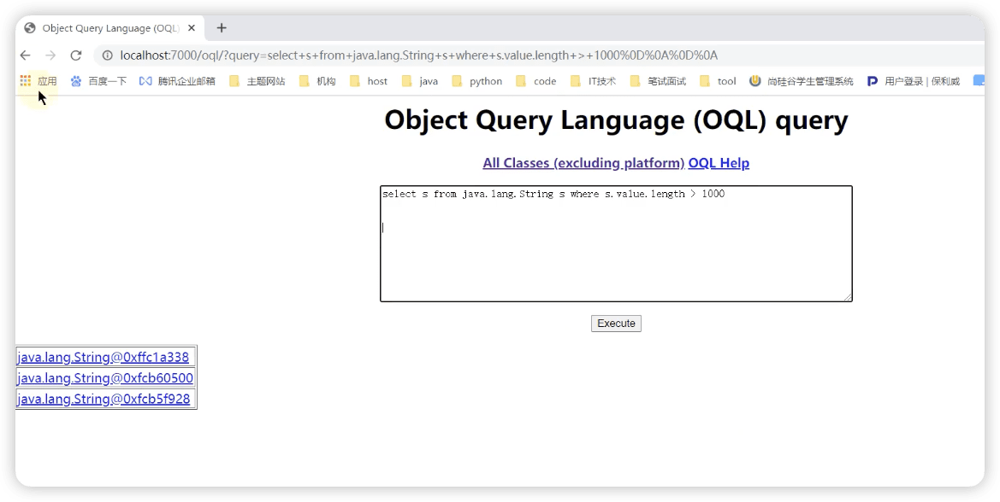

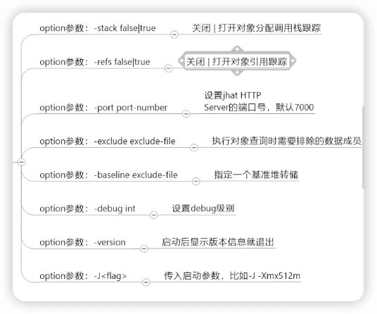

### 2.7 jstack：打印JVM中==线程==快照

每一个线程都有一个栈，所以叫jstack。

jstack(JVM stack Trace)：用于生成虚拟机指定进程当前时刻的线程快照(虚拟机堆栈跟踪)。==线程快照==就是==当前虛拟机内指定进程的每一条线程正在执行的方法堆的集合==。

生成线程快照的作用：可用于定位线程出现长时间停顿的原因，如<u>线程间死锁、死循环、请求外部资源导致的长时问等待等问题</u>。这些都是导致线程长时间停顿的常见原因。当线程出现停顿时，就可以用jstack显示各 个线程调用的堆栈情况。

官方帮助文档：https://docs.oracle.com/en/java/javase/11/tools/jstack.html

在thread dump中，要留意下面几种状态

- **死锁，Deadlock(重点关注）**
- **等待资源，Waiting on condition（重点关注）**
- **等待获取监视器，waiting on monitor entry（重点关注）**
- **阻塞，Blocked(重点关注）**
- 执行中，Runnable
- 暂停，Suspended

#### 基本语法

`jstack [option] <pid>`

- option参数：-F

当正常输出的请求不被响应时，强制输出线程堆栈

- option参数：-l

除堆栈外，显示关于锁的附加信息

- option参数：-m

如果调用本地方法的话，可以显示C/C++的堆栈

- option参数：-h

帮助操作

```shell
➜  jstack 40100
2023-04-30 14:26:36
Full thread dump OpenJDK 64-Bit Server VM (25.352-b08 mixed mode):

"Attach Listener" #14 daemon prio=9 os_prio=31 tid=0x0000000117008800 nid=0x5207 waiting on condition [0x0000000000000000]
   java.lang.Thread.State: RUNNABLE

"DestroyJavaVM" #13 prio=5 os_prio=31 tid=0x000000011c873000 nid=0x1d03 waiting on condition [0x0000000000000000]
   java.lang.Thread.State: RUNNABLE

"Thread-1" #12 prio=5 os_prio=31 tid=0x000000011406a800 nid=0x7a03 waiting for monitor entry [0x00000001723f6000]
   java.lang.Thread.State: BLOCKED (on object monitor)
	at com.andyron.jstack.TreadDeadLock$2.run(TreadDeadLock.java:53)
	- waiting to lock <0x00000006c00176d8> (a java.lang.StringBuilder)
	- locked <0x00000006c0000950> (a java.lang.StringBuilder)
	at java.lang.Thread.run(Thread.java:750)

"Thread-0" #11 prio=5 os_prio=31 tid=0x000000011c872000 nid=0x7c03 waiting for monitor entry [0x00000001721ea000]
   java.lang.Thread.State: BLOCKED (on object monitor)
	at com.andyron.jstack.TreadDeadLock$1.run(TreadDeadLock.java:29)
	- waiting to lock <0x00000006c0000950> (a java.lang.StringBuilder)
	- locked <0x00000006c00176d8> (a java.lang.StringBuilder)

"Service Thread" #10 daemon prio=9 os_prio=31 tid=0x0000000114068800 nid=0x7f03 runnable [0x0000000000000000]
   java.lang.Thread.State: RUNNABLE

"C1 CompilerThread3" #9 daemon prio=9 os_prio=31 tid=0x0000000114050000 nid=0x4803 waiting on condition [0x0000000000000000]
   java.lang.Thread.State: RUNNABLE

"C2 CompilerThread2" #8 daemon prio=9 os_prio=31 tid=0x000000011404f000 nid=0x4903 waiting on condition [0x0000000000000000]
   java.lang.Thread.State: RUNNABLE

"C2 CompilerThread1" #7 daemon prio=9 os_prio=31 tid=0x0000000116808800 nid=0x4a03 waiting on condition [0x0000000000000000]
   java.lang.Thread.State: RUNNABLE

"C2 CompilerThread0" #6 daemon prio=9 os_prio=31 tid=0x000000011400b800 nid=0x4c03 waiting on condition [0x0000000000000000]
   java.lang.Thread.State: RUNNABLE

"Monitor Ctrl-Break" #5 daemon prio=5 os_prio=31 tid=0x0000000114009000 nid=0x4e03 runnable [0x0000000171396000]
   java.lang.Thread.State: RUNNABLE
	at java.net.SocketInputStream.socketRead0(Native Method)
	at java.net.SocketInputStream.socketRead(SocketInputStream.java:116)
	at java.net.SocketInputStream.read(SocketInputStream.java:171)
	at java.net.SocketInputStream.read(SocketInputStream.java:141)
	at sun.nio.cs.StreamDecoder.readBytes(StreamDecoder.java:284)
	at sun.nio.cs.StreamDecoder.implRead(StreamDecoder.java:326)
	at sun.nio.cs.StreamDecoder.read(StreamDecoder.java:178)
	- locked <0x00000006c0016b80> (a java.io.InputStreamReader)
	at java.io.InputStreamReader.read(InputStreamReader.java:184)
	at java.io.BufferedReader.fill(BufferedReader.java:161)
	at java.io.BufferedReader.readLine(BufferedReader.java:324)
	- locked <0x00000006c0016b80> (a java.io.InputStreamReader)
	at java.io.BufferedReader.readLine(BufferedReader.java:389)
	at com.intellij.rt.execution.application.AppMainV2$1.run(AppMainV2.java:56)

"Signal Dispatcher" #4 daemon prio=9 os_prio=31 tid=0x000000011d862000 nid=0x4503 runnable [0x0000000000000000]
   java.lang.Thread.State: RUNNABLE

"Finalizer" #3 daemon prio=8 os_prio=31 tid=0x000000011c827000 nid=0x3303 in Object.wait() [0x0000000170e66000]
   java.lang.Thread.State: WAITING (on object monitor)
	at java.lang.Object.wait(Native Method)
	- waiting on <0x00000006c001f838> (a java.lang.ref.ReferenceQueue$Lock)
	at java.lang.ref.ReferenceQueue.remove(ReferenceQueue.java:144)
	- locked <0x00000006c001f838> (a java.lang.ref.ReferenceQueue$Lock)
	at java.lang.ref.ReferenceQueue.remove(ReferenceQueue.java:165)
	at java.lang.ref.Finalizer$FinalizerThread.run(Finalizer.java:188)

"Reference Handler" #2 daemon prio=10 os_prio=31 tid=0x000000011c824800 nid=0x3803 in Object.wait() [0x0000000170c5a000]
   java.lang.Thread.State: WAITING (on object monitor)
	at java.lang.Object.wait(Native Method)
	- waiting on <0x00000006c0008740> (a java.lang.ref.Reference$Lock)
	at java.lang.Object.wait(Object.java:502)
	at java.lang.ref.Reference.tryHandlePending(Reference.java:191)
	- locked <0x00000006c0008740> (a java.lang.ref.Reference$Lock)
	at java.lang.ref.Reference$ReferenceHandler.run(Reference.java:153)

"VM Thread" os_prio=31 tid=0x000000011c81d800 nid=0x3a03 runnable

"ParGC Thread#0" os_prio=31 tid=0x000000011d816800 nid=0x2403 runnable

"ParGC Thread#1" os_prio=31 tid=0x000000011d817800 nid=0x2a03 runnable

"ParGC Thread#2" os_prio=31 tid=0x000000011d818000 nid=0x2b03 runnable

"ParGC Thread#3" os_prio=31 tid=0x000000011d819000 nid=0x2c03 runnable

"ParGC Thread#4" os_prio=31 tid=0x000000011d819800 nid=0x2e03 runnable

"ParGC Thread#5" os_prio=31 tid=0x000000011d81a800 nid=0x3003 runnable

"ParGC Thread#6" os_prio=31 tid=0x000000011d81b000 nid=0x3c03 runnable

"ParGC Thread#7" os_prio=31 tid=0x000000011d81c000 nid=0x3b03 runnable

"VM Periodic Task Thread" os_prio=31 tid=0x0000000114069800 nid=0x5603 waiting on condition

JNI global references: 15


Found one Java-level deadlock:
=============================
"Thread-1":
  waiting to lock monitor 0x000000011d84ff60 (object 0x00000006c00176d8, a java.lang.StringBuilder),
  which is held by "Thread-0"
"Thread-0":
  waiting to lock monitor 0x000000011d84eac0 (object 0x00000006c0000950, a java.lang.StringBuilder),
  which is held by "Thread-1"

Java stack information for the threads listed above:
===================================================
"Thread-1":
	at com.andyron.jstack.TreadDeadLock$2.run(TreadDeadLock.java:53)
	- waiting to lock <0x00000006c00176d8> (a java.lang.StringBuilder)
	- locked <0x00000006c0000950> (a java.lang.StringBuilder)
	at java.lang.Thread.run(Thread.java:750)
"Thread-0":
	at com.andyron.jstack.TreadDeadLock$1.run(TreadDeadLock.java:29)
	- waiting to lock <0x00000006c0000950> (a java.lang.StringBuilder)
	- locked <0x00000006c00176d8> (a java.lang.StringBuilder)

Found 1 deadlock.
```


### 2.8 jcmd：多功能命令行

在JDK 1.7以后，新增了一个命令行工具jcmd。

它是一个多功能的工具，可以用来实现前面除了jstat之外所有命令的功能。比如：用定来导出堆、内存使用、查看Java进程、导出线程信息、执行GC、JVM运行时间等。

官方帮助文档：https://docs.oracle.com/en/java/javase/11/tools/jcmd.html

jcmd拥有 jmap的大部分功能，并且在Oracle的官方网站上也推荐使用jcmd命令代jmap命令。


#### 基本语法

##### `jcmd -l`

列出所有的JVM进程

##### `jcmd 进程号 help`

针对指定的进程，列出支持的所有具体命令

##### `jcmd 进程号 具体命令`

显示指定进程的指令命令的数据

首先通过jcmd 进程号 help 得出以下命令列表：

```shell
➜  jcmd 40100 help
40100:
The following commands are available:
VM.unlock_commercial_features
JFR.configure
JFR.stop
JFR.start
JFR.dump
JFR.check
VM.native_memory
ManagementAgent.stop
ManagementAgent.start_local
ManagementAgent.start
VM.classloader_stats
GC.rotate_log
Thread.print
GC.class_stats
GC.class_histogram
GC.heap_dump
GC.finalizer_info
GC.heap_info
GC.run_finalization
GC.run
VM.uptime
VM.dynlibs
VM.flags
VM.system_properties
VM.command_line
VM.version
help
```

 

根据以上命令来替换之前的那些操作：

1. Thread.print 可以替换 jstack指令
2. GC.class_histogram 可以替换 jmap中的-histo操作
3. GC.heap_dump 可以替换 jmap中的-dump操作
4. GC.run 可以查看GC的执行情况
5. VM.uptime 可以查看程序的总执行时间，可以替换jstat指令中的-t操作
6. VM.system_properties 可以替换 jinfo -sysprops 进程id 
7. VM.flags 可以获取JVM的配置参数信息 

### 2.9 jstatd：远程主机信息收集

之前的指令只涉及到监控本机的Java应用程序，而在这些工具中，一些监控工具也支持对远程计算机的监控（如jps、jstat）。为了启用远程监控，则需要配合使用jstatd工具。

命令jstatd是一个RMI服务端程序，它的作用相当于代理服务器，建立本地计算机与远程监控工具的通信。jstatd服务器将本机的Java应用程序信息传递到远程计算机。

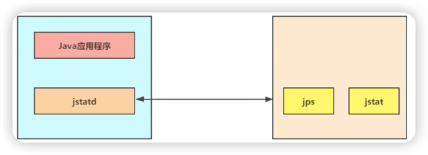


## 3 JVM监控及诊断工具-GUI

P320

### 3.1 工具概述

使用上一章命令行工具或组合能帮您获取目标Java应用性能相关的基础信息，但它们存在下列局限：

1. 无法获取==方法级別==的分析数据，如方法问的调用关系、各方法的调用次数和调用时间等（这对定位应用性能瓶颈至关重要）。
2. 要求用户登录到目标 Java 应用所在的宿主机上，使用起来不是很方便。
3. 分析数据通过终端输出，结果展示不够直观。

为此，JDK提供了一些内存泄漏的分析工具，如jconsole， jvisualvm等，用于辅助开发人员定位问题，但是这些工具很多时候并不足以满足快速定位的需求。所以这里我们介绍的工具相对多一些、丰富一些。

**图形化综合诊断工具**:

#### JDK自带的工具

- jconsole:JDK自带的可视化监控工具。查看Java应用程序的运行概况、监控堆信息、永久区（或元空间〕使用情況、类加载情況等。（简单，入门级别）
  位置：jdk/bin/jconsole.exe
- Visual VM:visual VM是一个工具，它提供了一个可视界面，用于查看Java虚拟机上运行的基于Java技术的应用程序的详细信息。(jvisualvm是jdk自带的，Visual VM都是另外下的独立的客户端工具)

​	位罝：jdk/bin/jvisualvm.exe

- JMC:Java Mission Control，内置Java Flight Recorder（飞行记录仪）。能够以极低的性能开销收集Java虚拟机的性能数据。

#### 第三方工具

- MAT: MAT(Memory Analyzer TooL)是基于EClipse的内存分析工具，是一个快速、功能丰富的Java heap分析工具，它可以帮助我们查找内存泄漏和减少内存消耗。（Eclipse的插件形式，也可以独立下载使用）

- JProfiler：商业软件，需要付费。功能强大。【与Visual VM类似】
- Arthas:Alibaba开源的Java诊断工具。深受开发者喜爱。
- Btrace:Java运行时追踪工具。可以在不停机的情况下，跟踪指定的方法调用、构造函数调用和系统内面等信息。https://github.com/btraceio/btrace

### 3.2 JConsole

从Java5开始，在JDK中自带的java监控和管理控制台。

用于对JVM中内存、线程和类等的监控，是一个基于JMX(java manegement extensions）的GUI性能
监控工具。

官方教程： https://docs.oracle.com/en/java/javase/11/tools/jconsole.html


#### 启动

在jdk安装目录中找到jconsole.exe，双击该可执行文件就可以
打开DOS窗口，直接输入jconsole就可以了

#### 三种连接方式

1. Local

使用JConsole连接一个正在本地系统运行的JVM，并且执行程序的和运行JConsole的需要是同一个用户。JConsole使用文件系统的授权通过RMI连接起链接到平台的MBean的服务器上。这种从本地连接的监控能力只有Sun的JDK具有。

2. Remote

使用下面的URL通过RMI连接器连接到一个JMX代理，service:jmx:rmi:///jndi/rmi://hostName:portNum/jmxrmi。JConsole为建立连接，需要在环境变量中设置mx.remote.credentials来指定用户名和密码，从而进行授权。

3. Advanced

使用一个特殊的URL连接JMX代理。一般情况使用自己定制的连接器而不是RMI提供的连接器来连接JMX代理，或者是一个使用JDK1.4的实现了JMX和JMX Rmote的应用


也可以用来检测死锁

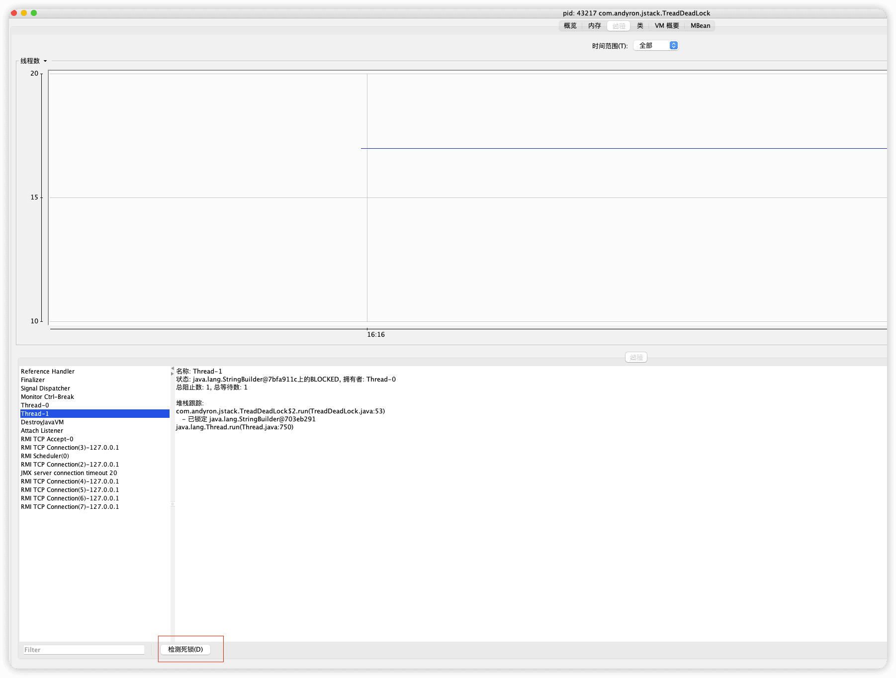

### 3.3 Visual VM❤️

jvisualvm和visual vm的区别：

visual vm是单独下载的工具，然后将visual vm结合到jdk中就变成了jvisualvm，仅仅是添加了一个j而已，这个j应该是java的用处，所以说jvisualvm其实就是visual vm

#### 基本概述

- Visual VM是一个功能强大的多合一故障诊断和性能监控的可视化工具。
- 它集成了多个JDK命令行工具，使用Visual VM可用于显示虚拟机进程及进程的配置和环境信息(jps,jinfo)p监视应用程序的CPU、GC、堆、万法区及线程的信恩(jstat、jstack)等，甚至代替JConsole。

- 在JDK 6 Update 7以后，Visual VM便作为JDK的一部分发布(VisualvM 在JDK/bin目录下），即：它完全免费。
- 此外， Visual VM也可以作为独立的软件安装：https://visualvm.github.io/index.html

#### 插件的安装

- Visual VM本身自己的插件

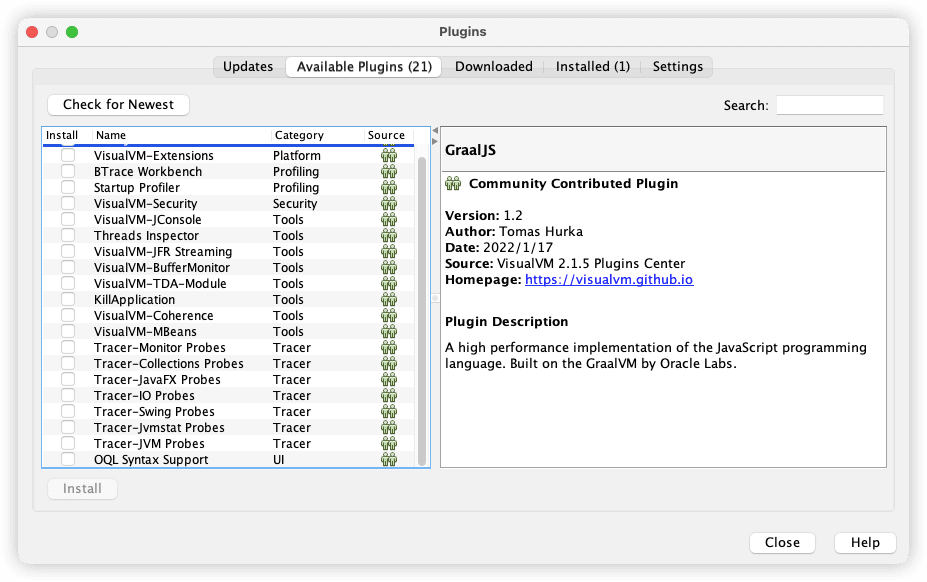

- IDEA中Visual VM的插件

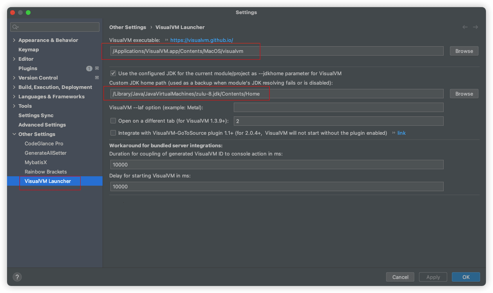

#### 连接方式

- 本地连接
  监控本地Java进程的CPU、类、线程等

- 远程连接

  1-确定远程服务器的ip地址
  2-添加JMX（通过JMX技术具体监控远程服务器哪个Java进程）
  3-修改bin/catalina.sh文件，连接远程的tomcat
  4-在…/conf中添加jmxremote.access和jmxremote.password文件
  5-将服务器地址改成公网ip地址
  6-设置阿里云安全策略和防火墙策略
  7-启动tomcat，查看tomcat启动日志和端口监听
  8-JMX中输入端口号、用户名、密码登录    


#### 主要功能

- 生成/读取堆内存快照


与另一个dump文件比较

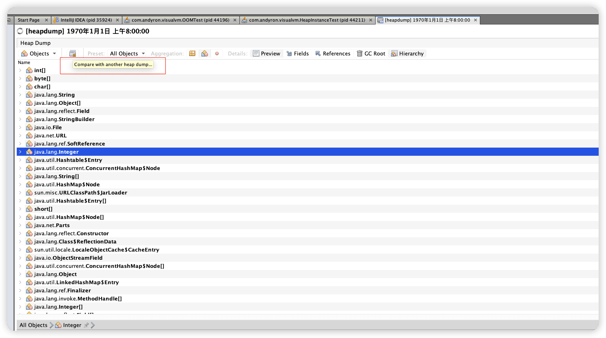


- 查看JVM参数和系统属性

- 查看运行中的虚拟机进程

- 生成/读取线程快照

- 程序资源的实时监控

- 其他功能
      JMX代理连接
      远程环境监控
      CPU分析和内存分析

> park 驻留

- 抽样器

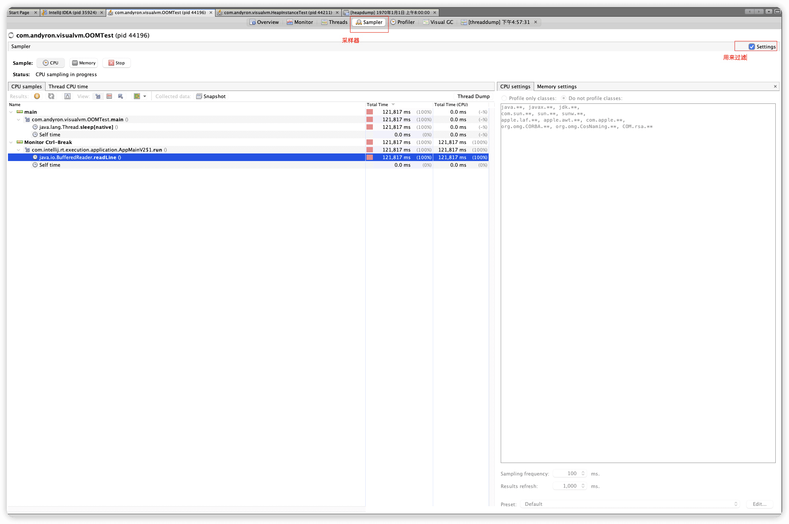

🔖p326 visual vm的使用过程

### 3.4 Eclipse MAT❤️

主要为了解决==内存泄漏==

#### 基本概述

MAT(Memory Analyzer Tool)工具是一款功能强大的Java堆内存分析器。可以用于查找内存泄漏以及查看内存消耗情況。

MAT是基于Eclipse开发的，不仅可以单独使用，还可以作为插件的形式嵌入在Eclipse中使用。是一款免费的性能分析工具，使用起来非常方便。大家可以在https://www.eclipse.org/mat/downloads.php

#### 获取堆dump文件

##### dump文件内存

MAT可以分析heap dump文件。在进行内存分析时，只要获得了反映当前设备内存映像的hprof文件，通过MAT打开就可以直观地看到当前的内存信息。

一般说来，这些内存信息包含：

- 所有的对象信息，包括对象实例、成员变量、存储于栈中的基本类型值和存储于堆中的其他对象的引用值。
- 所有的类信息，包括classloader、类名称、父类、静态变量等
- GCRoot到所有的这些对象的引用路径
- 线程信息，包括线程的调用栈及此线程的线程局部变量 (TLS)

##### 两点说明

说明1：缺点：

MAT不是一个万能工具，它并不能处理所有类型的堆存储文件。但是比较主流的厂家和格式，例如sun，HP，SAP 所采用的 HPROF 二进制堆存储文件，以及IBM 的 PHD 堆存储文件等都能被很好的解析。

说明2：

最吸引人的还是能够快速为开发人员生成==内存泄漏报表==，方便定位问题和分析问题。虽然MAT有如此强大的功能，但是内存分析也没有简单到一键完成的程度，很多内存问题还是需要我们从MAT展现给我们的信息当中通过经验和直觉来判断才能发现。


##### 获取dump文件

方法一：通过前一章介绍的 jmap工具生成，可以生成任意一个java进程的dump文件；

方法二：通过配置JVM参数生成。

- 选项“-xx:tHeapDumpOnoutOfMemoryError"或“-xx:tHeapDumpBeforeFu11GC"
- 选项"-xx:HeappumpPath"所代表的含义就是当程序出 现OutofMemory时，将会在相应的目录下生成一份dump文神。如果不指定选项“xx：HeapDumpPath”则在当前目录下生成dump文件。

对比：考虑到生产环境中几乎不可能在线对其进行分析，大都是采用离线分析，因此使用==jmap+MAT工具==是最常见的组合。

方法三：使用VisualVM可以导出堆dump文件

方法四：

使用MAT既可以打开一个已有的堆快照，也可以通过MAT==直接从活动Java程序中导出堆快照==。

该功能将借助jps列出当前正在运行的Java 进程，以供选择并获取快照。


🔖p328-p339

#### 分析堆dump文件

##### histogram

​    展示了各个类的实例数目以及这些实例的Shallow heap或者Retained heap的总和

##### thread overview

​    查看系统中的Java线程
​    查看局部变量的信息

##### 获得对象互相引用的关系

​    with outgoing references
​    with incoming references

##### 浅堆与深堆

- shallow heap

浅堆(Shallow Heap)是指一个对象所消耗的内存。在32位系统中，一个对象引用会占据4个字节，一个int类型会占据4个字节，long型变量会占据8个字节，每个对象头需要占用8个字节。根据堆快照格式不同，对象的大小可能会向8字节进行对齐。

以String 为例：2个int值共占8字节，对象引用占用4宇节，对象头8字节，合计20字节，向8字节对齐，故占24字节。(jdk7中）

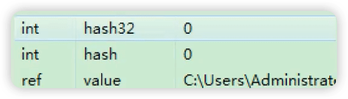

这24字节为string对象的浅堆大小。它与String的value实际取值无关，无论字符串长度如何，浅堆大小始终是24字节。

- retained heap

==保留集(Retained Set):==

对象A的保留集指当对象A被垃圾回收后，可以被释放的所有的对象集合(包括对象A本身)，即对象A的保留集可以被认为是==只能通过==对象A被直接或问接访问到的所有对象的集合。通俗地说，就是指仅被对象A所持有的对象的集合。

==深堆(Retained Heap)：==

深堆是指对象的保留集中所有的对象的浅堆大小之和。

注意：浅堆指对象本身占用的内存，不包括其内部引用对象的大小。一个对象的深堆指只能通过该对象

访问到的(直接或间接)所有对象的浅堆之和，即对象被回收后，可以释放的真实空间。

- 补充：对象实际大小

另外一个常用的概念是对象的实际大小。这里，对象的实际大小定义为一个对象==所能触及的==所有对象的浅堆大小之和，也就是通常意义上我们说的对象大小。与深堆相比，似乎这个在日常开发中更为直观和被人按受，但==实际上，这个概念和垃圾回收无关==。

下图显示了一个简单的对象引用关系图，对象A引用了C和D，对象B引用了C和E。那么对象A的浅堆大小只是A本身，不含C和D，而A的实际大小为A、C、D三者之和。而A的深堆大小为A与D之和，由于对象C还可以通过对象B访问到，因此不在对象A的深堆范围内。

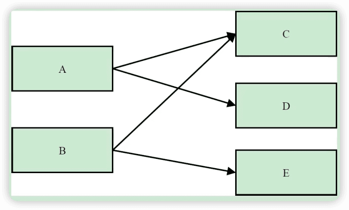


- 练习

看图理解Retained Size

  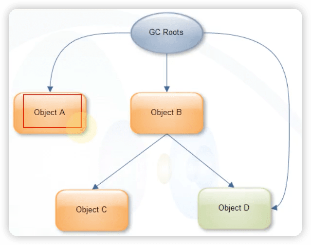  

上图中，GC Roots 直接引用了A和B两个对象。

对象的Retained Size=A对象的Shal1ow Size

对象的Retained Size=B对象的Shallow Size + C对象的Shallow Size

这里不包括D对象，因为D对象被GC Roots直接引用。

如果GC Roots不引用D对象呢？


- 案例分析：StudentTrace

🔖p332


##### 支配树🔖

支配树 (Dominator Tree)，支配树的概念源自图论。

MAT提供了一个称为支配树 (Dominator Tree）的对象图。支配树体现了对象实例间的支配关系。在对象引用图中，所有指向对象B的路径都经过对象A，则认为==对象A支配对象B==。如果对象A是离对象B最近的一个支配对象，则认为对象A为对象B的==直接支配者==。支配树是基于对象间的引用图所建立的，它有以下基本性质：

- 对象A的子树《所有被对象A支配的对象集合）表示对象A的保留集 (retained set），即深堆。
- •如果对象A支配对象B，那么对象A的直接支配者也支配对象B。
- 支配树的边与对象引用图的边不直接对应。

如下图所示：左图表示对象引用图，右图表示左图所对应的支配树。对象A和B由根对象直接支配，由于在到对象C的路径中，可以经过A，也可以经过B，因此对象C的直接支配者也是根对象。对象F与对象D相互引用，因为到对象F的所有路径必然经过对象D，因此，对象D是对象F的直接支配者。而到对象D的所有路径中，必然经过对象C，即使是从对象F到对象口的引用，从根节点出发，也是经过对象C的，所以，对象D的直接支配者为对象C。

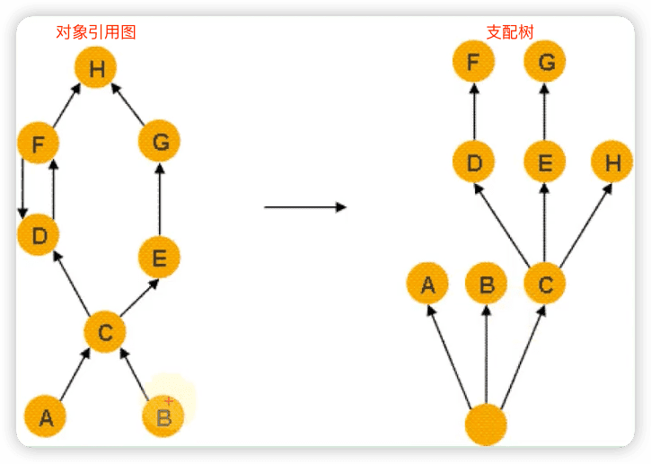

同理，对象E支配对象G。到达对象H的可以通过对象D，也可以通过对象E，因此对象口和E都不能支配对象H，而经过对象C既可以到达D世可以到达E，因此对象C为对象H的直接支配者。

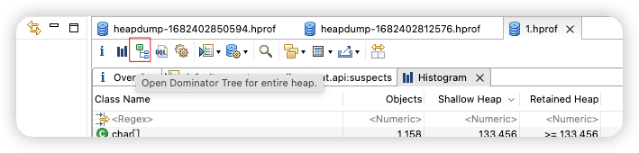

#### 案例：Tomcat堆溢出分析🔖

##### 说明

Tomcat 是最常用的Java servlet容器之一，同时也可以当做单独的web服务器使用。Tomcat本身使用用Java实现，并运行于Java虚拟机之上。在大规模请求时，Tomcat有可能会因为无法承受压力而发生内存溢出错误。这里根据一个被压垮的Tomcat的堆快照文件，来分析Tomcat在朋溃时的内部情況。

##### 分析过程

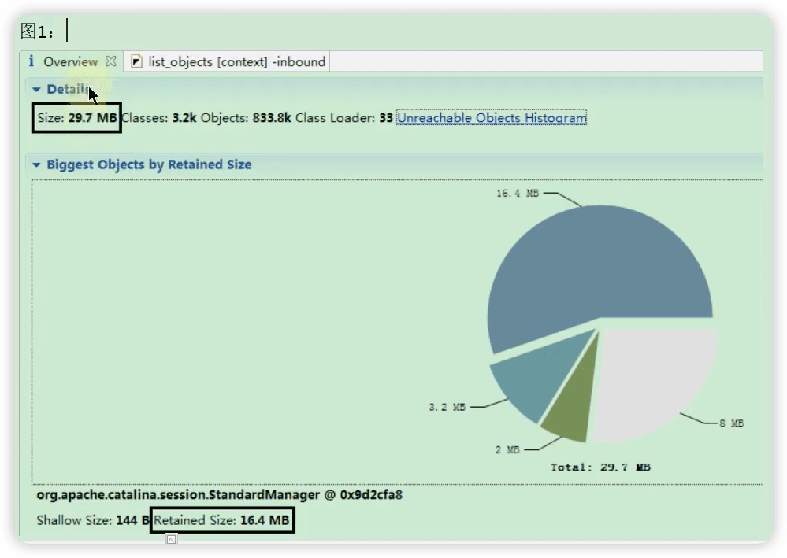

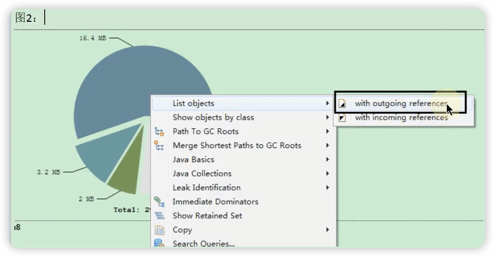

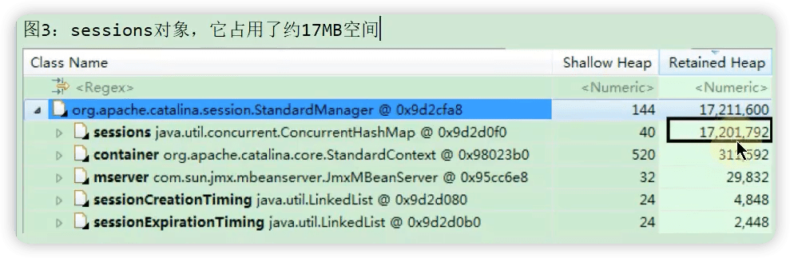

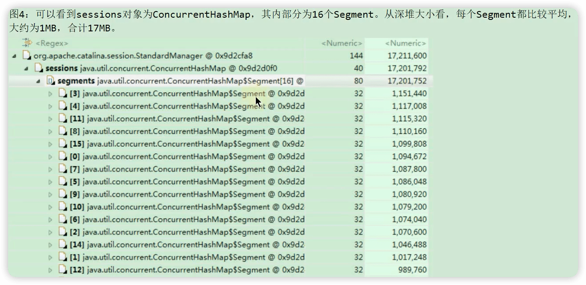

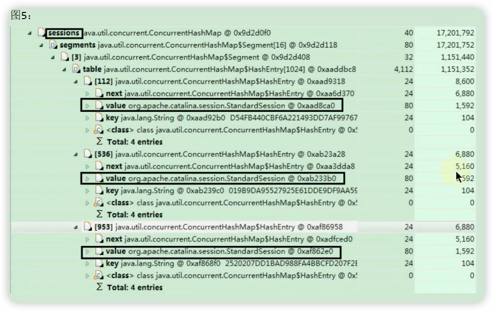


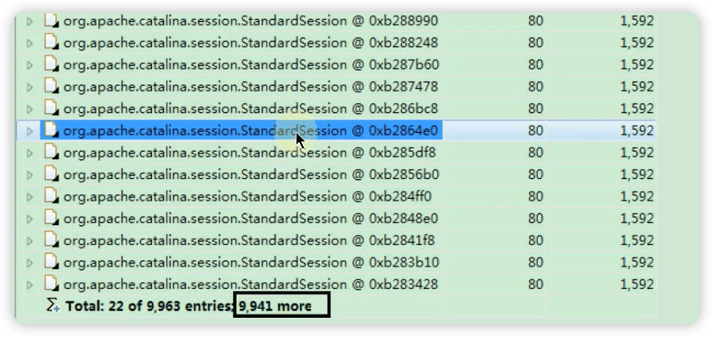

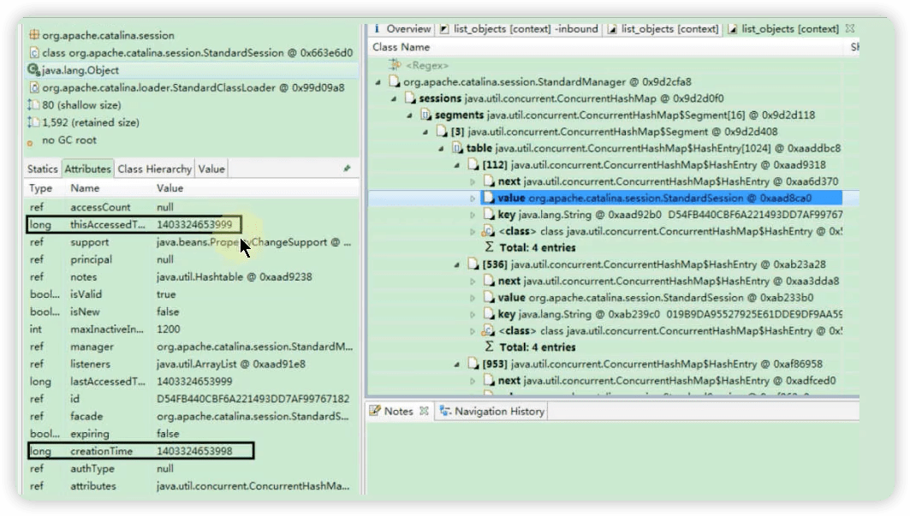

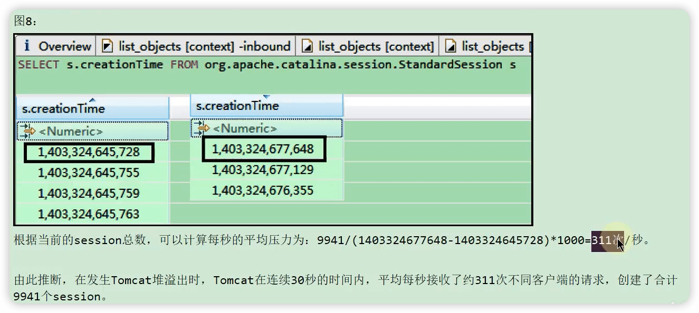


### 补充1：再谈内存泄露🔖

#### 内存泄露的理解与分析

<u>**何为内存泄漏 (memory leak)**</u>

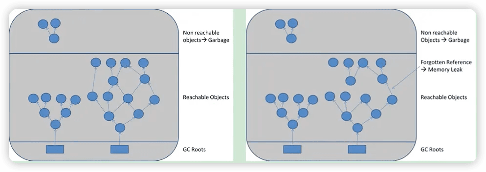

可达性分析算法来判断对象是否是不再使用的对象，本质都是判断一个对象是否还被引用。那么对于这种情况下，由于代码的实现不同就会出现很多种内存泄漏问题(让JVM误以为此对象还在引用中，无，法回收，造成内存泄漏）。

> 是否还被使用？ 
>
> 是否还被需要？
>
> 是、否 -> 泄漏， 

**内存泄漏(memory leak ）的理解**

严格来说，只有对象不会再被程序用到了，但是GC又不能回收他们的情況，才叫内存泄漏。

但实际情况很多时候一些不太好的实践（或疏忽〉会导致对象的生命周期变得很长甚至导致OOM，也可以叫作==宽泛意义上的“内存泄漏”==。

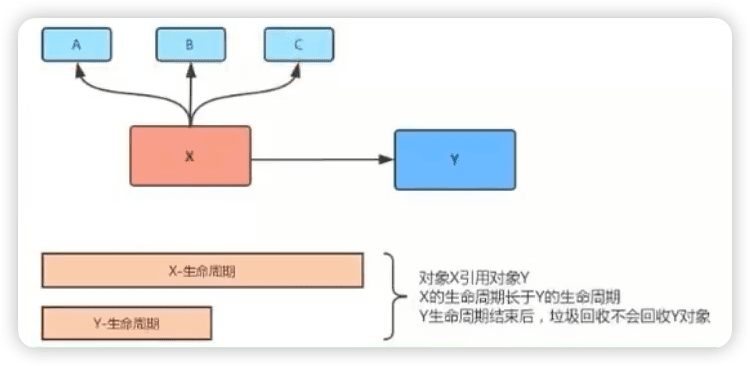

对象X 引用对象Y，X的生命周期比 Y 的生命周期长；

那么当Y生命周期结東的时候，x依然引用着V，这时候，垃圾回收期是不会回收对象丫的；

如果对象X还引用着生命周期比较短的A、B、C，对象A叉引用着对象日、b、c，这样就可能造成大量无用的对象不能被回收，进而占据了内存资源，造成内存泄漏，直到内存溢出。


**内存泄漏与内存溢出的关系：**

1．内存泄漏(memory leak )

申请了内存用完了不释放，比如一共有 1024M 的内存，分配了512M 的内存一直不回收，那么可以用的内存只有 512M 了，仿佛泄露掉了一部分：通俗一点讲的话，内存泄漏就是【占着茅坑不拉shi】【不操作也不使用】。

2．内存溢出 (out of memory)

申请内存时，没有足够的内存可以使用；

通俗一点儿讲，一个厕所就三个坑，有两个站着茅坑不走的（内存泄漏），剩下最后一个坑，厕所表示接待压力很大，这时候一下子来了两个人，坑位（内存）就不够了，内存泄漏变成内存溢出了。

可见，内存泄漏和内存溢出的关系：内存泄漏的增多，最终会导致内存溢出。


**泄漏的分类**

经常发生：发生内存泄露的代码会被多次执行，每次执行，泄露一块内存；

偶然发生：在某些特定情况下才会发生；

一次性：发生内存泄露的方法只会执行一次；

隐式泄漏：一直占着内存不释放，直到执行结束：严格的说这个不算内存泄漏，因为最终释放掉了，但是如果执行时间特别长，也可能会导致内存耗尽。


#### Java中内存泄露的8种情况

##### 1-静态集合类

##### 2-单例模式

##### 3-内部类持有外部类

##### 4-各种连接，如数据库连接、网络连接和IO连接等

##### 5-变量不合理的作用域

##### 6-改变哈希值

##### 7-缓存泄露

##### 8-监听器和回调


#### 内存泄露案例分析

案例代码
分析
解决办法


### 补充2：支持使用OQL语言查询对象信息

MAT支持一种类似于SQL的查询语言OQL (Object Query Language）。 OQL使用类SQL语法，可以在堆中进行对象的查找和筛选。

SELECT子句

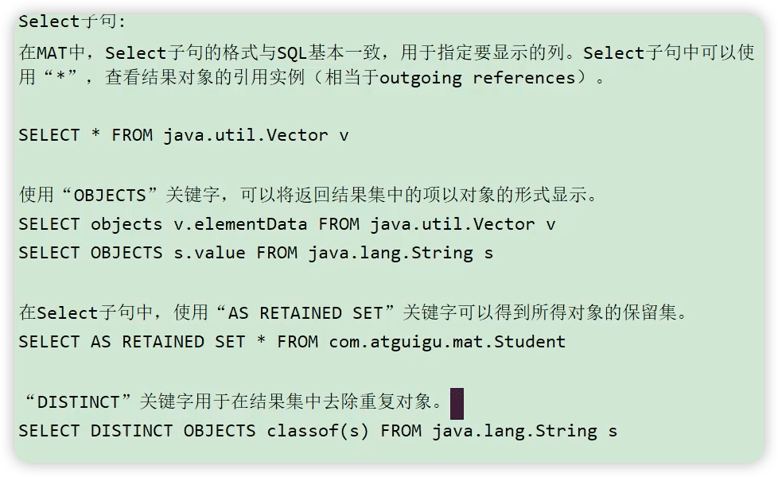

FROM子句


WHERE子句

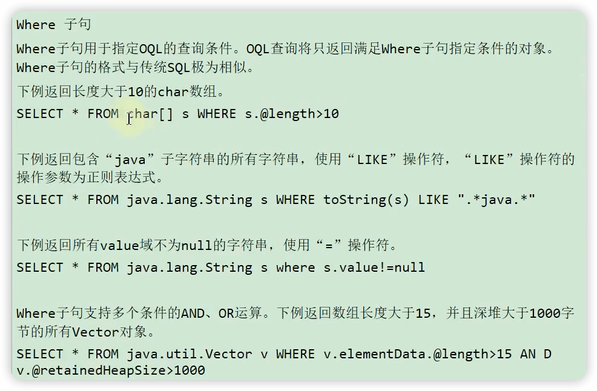

内置对象与方法

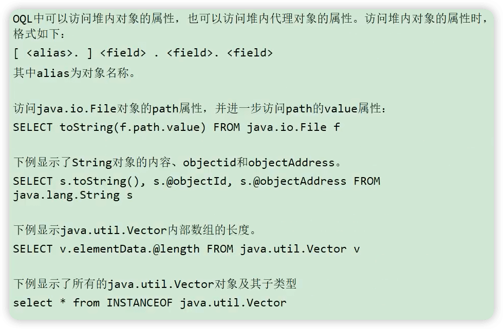


**例子：** 

1. select  * from  java.util.ArrayList（列出所有的ArrayList对象信息） 
2. select  v.elementData from  java.util.ArrayList v（注意：elementData代表ArrayList中的数组，结果最终以数组形式将结果呈现出来） 
3. select  objects  v.elementData from  java.util.ArrayList v（注意：elementData代表ArrayList中的数组，objects代表对象类型，所以最终以对象形式将结果呈现出来，同时展示出来的还有浅堆、深堆） 
4. select  as  retained  set  * from  com.atguigu.mat.Student（得到对象的保留级） 
5. select  * from  0x6cd57c828（0x6cd57c828是Student类的地址值） 
6. select  * from  char[] s where  s.@length > 10（char型数组长度大于10的数组） 
7. select  * from  java.lang.String s where  s.value != null（字符串值不为空的字符串信息） 

1. select toString (f.path.value) from java.io.File f（列出文件的路径值） 
2. select  v.elementData.@length from  java.util.ArrayList v（列出Arraylist对象中ArrayList中的数组长度） 


### 3.5 JProfiler

#### 基本概述

在运行Java餘时 候有时候想测试运行时占用内存情况，这时候就需要使用测试工具查看了。在eclipse里面有 Eclipse Memory Analvzer tool（MAT)插件可以测试，而在IDEA中也有这么一个插件，就是JProfiler。

JProfiler 是由 ej-technologies 公司开发的一款 Java应用性能诊断工具。功能强大，但是收费。

官网下载地址：https://www.ej-technologies.com/products/jprofiler/overview.html


特点
  主要功能
    1-方法调用
      对方法调用的分析可以帮助您了解应用程序正在做什么，并找到提高其性能的方法
    2-内存分配
      通过分析堆上对象、引用链和垃圾收集能帮您修复内存泄露问题，优化内存使用
    3-线程和锁
      JProfiler提供多种针对线程和锁的分析视图助您发现多线程问题
    4-高级子系统
      许多性能问题都发生在更高的语义级别上。例如，对于JDBC调用，您可能希望找出执行最慢的SQL语句。JProfiler支持对这些子系统进行集成分析

#### 安装与配置

  下载与安装
  JProfiler中配置IDEA
  IDEA集成JProfiler

#### 具体使用

- 数据采集方式
      instrumentation重构模式
      Sampling抽样模式


- 遥感监测 Telemetries

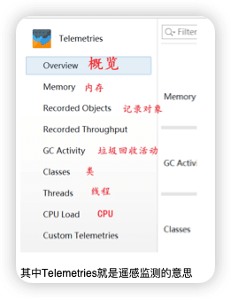

- 内存视图 Live Memory

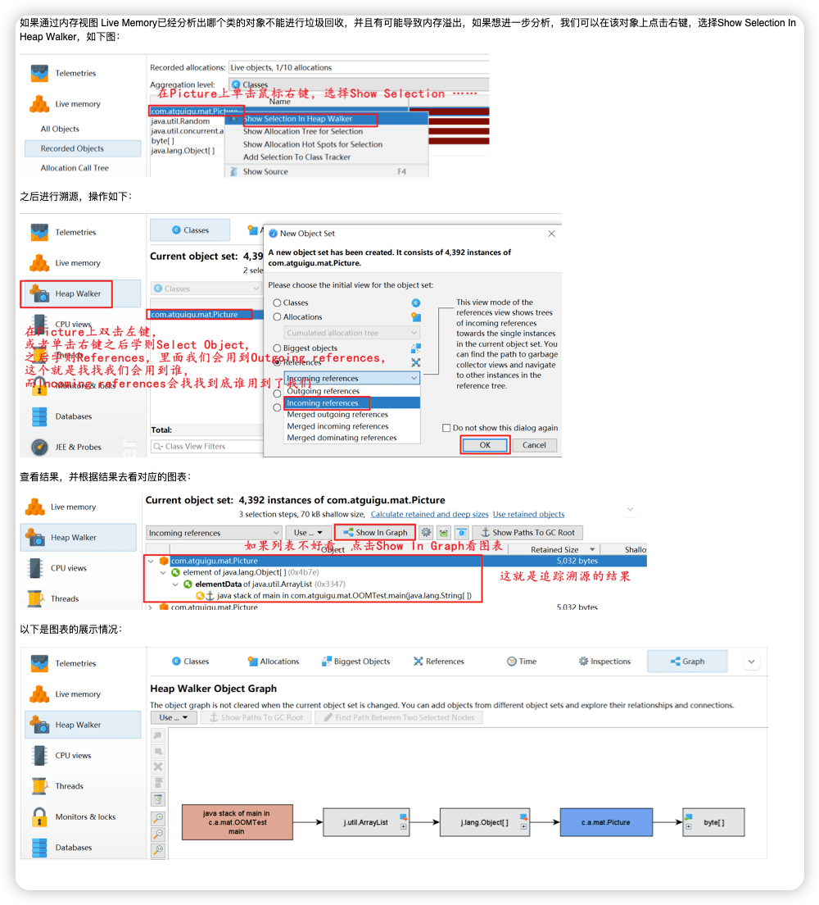

- 堆遍历 heap walker


- cpu视图 cpu views


- 线程视图 threads

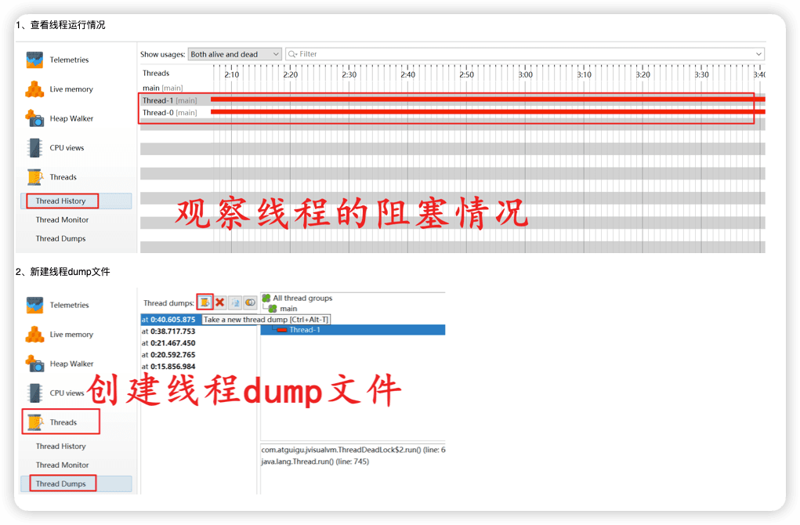

- 监视器&锁 Monitors&locks

#### 案例分析

案例1


案例2


### 3.6 Arthas

阿尔萨斯

#### 基本概述

背景

Visual VM和JProfiler这两款工具在业界知名度也比较高，他们的优点是可以图形界面上看到各维度的性能数据，使用者根据这些数据进行综合分析，然后判断哪里出现了性能问题。

但是这两款工具也有个缺点，**<u>都必须在服务端项目进程中配置相关的监控参数。然后工具通过远程连按到项目进程，获取相关的数据</u>**。这样就会带来一些不便，比如线上环境的网络是隔离的，本地的监控工具根本连不上线上环境。并且类似于Jprofiler这样的商业工具，是需要付费的。

那么有没有一款工具不需要远程连接，也不需要配置监控参数，同时也提供了丰富的性能监控数据呢?

今天跟大家介绍一款阿里巴巴开源的性能分析神器Arthas（阿尔萨斯）  


#### 概述

Arthas（阿尔萨斯）是Alibaba开源的Java诊断工具，深受开发者喜爱。在线排查问题，无需重启；动态跟踪Java代码；实时监控JVM状态。

Arthas 支持JDK 6+，支持Linux/Mac/Windows，采用命令行交互模式来同时提供丰富的 Tab 自动补全功能，进一步方便进行问题的定位和诊断。

当你遇到以下类似问题而束手无策时，Arthas可以帮助你解决：

- 这个类从哪个jar 包加载的？为什么会报各种类相关的 Exception?
- 我改的代码为什么没有执行到？难道是我没commit？分支搞错了？
- 遇到问题无法在线上debug，难道只能通过加日志再重新发布吗？
- 线上遇到某个用户的数据处理有问题，但线上同样无法 debug，线下无法重现！
- 是否有一个全局视角来杳看系统的运行状况？
- 有什么办決可以监控到JVM的实时运行状杰？
- 怎么快速定位应用的热点，生成火焰图？


#### 基于哪些工具开发而来

- greys-anatomy： Arthas代码基于Greys二次开发而来，非常感谢Greys之前所有的工作，以及Greys原作者对Arthas提出的意见和建议！
- termd： Arthas的命令行实现基于termd开发，是一款优秀的命令行程序开发框架，感谢termd提供了优秀的框架。
- crash：Arthas的文本渲染功能基于crash中的文本渲染功能开发，可以从这里看到源码，感谢crash在这方面所做的优秀工作。
- cli： Arthas的命令行界面基于vert.x提供的cli库进行开发，感谢vert.x在这方面做的优秀工作。
- compiler Arthas里的内行编绎器代码来源
- Apache Commons Net Arthas里的Telnet Client代码来源
- JavaAgent：运行在 main方法之前的拦截器，它内定的方法名叫 premain，也就是说先执行premain 方法然后再执行 main 方法
- ASM： 一个通用的Java宇节码操作和分析框架。它可以用于修改现有的类或直接以二进制形式动态生成类。ASM提供了一些常见的字节码转换和分析算法，可以从它们构建定制的复尜转换和代码分析工具。ASM提供了与其他Java字节码框架类似的功能，但是主要关注性能。因为它被设计和实现得尽可能小和快，所以非常适合在动态系统中使用(当然也可以以静态方式使用，例如在编译器中）


官方使用文档  https://arthas.aliyun.com/doc/quick-start.html


#### 安装与使用

  安装
  工程目录
  启动
  查看进程
  查看日志
    cat ~/logs/arthas/arthas.log
  查看帮助
    java -jar arthas-boot.jar -h
  web console
  退出

#### 相关诊断指令

基础指令


jvm相关
    dashboard
    thread
    jvm
    其他


class/classloader相关
    sc
    sm
    jad
    mc、redefine
    classloader

monitor/watch/trace相关
    monitor
    watch
    trace
    stack
    tt


其他
    profiler/火焰图
    options


### 3.7 Java Misssion Control

#### 历史

在 Oracle 收购sun 之前，Oracle 的 JRockit 虛拟机提供了一款叫做 JRockit Mission control 的虚拟机诊断工具。

在Oracle收购Sun之后，Oracle公司同时拥有了Sun Hotspot和JRockit两款虚拟机。根据oracle对于Java的战略，在今后的发展中，会將JRockit的优秀特性移植到Hotspot上。其中，一个重要的改进就是在Sun的JDK中加入了JRockit的支持。

在Oracle JDK 7u40之后，Mission Control这款工具己经鄉定在Oracle JDK中发布。

自 Java 11 开始，本节介绍的 JFR 己经开源。但在之前的 Java 版本，JFR 属于Commercial Feature， 需要通过 Java 虛拟机参数`-XX:+UnlockcommercialFeatures`开启。

如果你有兴趣请可以查看OpenJDK的Mission control项目。

https://github.com/JDKMissionControl/jmc


#### 启动

#### 概述

Java Mission control （简称JMC），Java官方提供的性能强劲的工具。是一个用于对Java 应用程序进行管理、监视、概要分析和故障排除的工具套件。

它包含一个GUI 客户端，以及众多用来收集 Java 虚拟机性能数据的插件，如 JMX Console（能够访问用来存放虚拟机各个子系统运行数据的MxBeans），以及虚拟机内罝的高效profiling 工具 Java Flight Recorder ( JFR)。

JMC 的另一个优点就是：**采用取样，而不是传统的代码植入技术，对应用性能的影响非常非常小，完全可以开着JMC 来做压测（唯一影响可能是full gC多了）。**


#### 功能：实时监控JVM运行时的状态


#### Java Flight Recorder

  事件类型
  启动方式
    方式1：使用-XX:StartFlightRecording=参数
    方式2：使用jcmd的JFR.*子命令
    方式3：JMC的JFR插件
  Java Flight Recorder 取样分析
    代码
    结果


### 3.8 其他工具


#### Flame Graphs（火焰图）

在追求极致性能的场景下，了解你的程序运行过程中cpu在干什么很重要，火焰图就是一种非常直观的展示cpu在程序整个生命周期过程中时间分配的工具。

火焰图对于现代的程序员不应该陌生，这个工具可以非常直观的显示出调用栈中的CPU消耗瓶颈。

网上的关于java火焰图的讲解大部分来自于Brendan Gregg的博客：

http://www.brendangregg.com/flamegraphs.html


#### Tprofiler

- 案例：

使用 JDK 自身提供的工具进行 JVM 调优可以将 TPS 由 2.5 提升到 20（提升了 7倍），并淮确定位系统瓶颈。

系统瓶颈有：应用里静态对象不是太多、有大量的业务线程在频繁创建一些生命周期很长的临时对象，代码里有问题。

那么，如何在海量业务代码里边准确定位这些性能代码？这里使用阿里开源工具 TProfiler 来定位这些性能代码，成功解决掉了 GC 过于频繁的性能瓶颈，并最终在上次优化的基础上将 TPS 再提升了4 倍，即提升到 100。

- TProfiler 配置部署、远程操作、日志阅读都不太复杂，操作还是很简单的。但是其却是能够起到一针见血、立竿见影的效果，帮我们解决了 GC 过于频繁的性能瓶颈。
- TProfiler 最重要的特性就是==能够统计出你指定时间段内 JVM 的top method==，这些topmethod 极有可能就是造成你 JVM 性能瓶颈的元凶。这是其他大多数JVM 调优工具所不具备的，包括 JRockit Mission Control。 jRokit 首席开发者 Marcus Hirt 在其私人博客《Low Overhead Method profiling with Java Mission control》下的评论中曾明确指出JRMC 并不支持 TOP 方法的统计。

#### Btrace

Java运行时追踪工具

#### YourKit

#### JProbe

#### Spring Insight


## 4 JVM运行时参数

P363

### 4.1 JVM参数选项类型

https://docs.oracle.com/javase/8/docs/technotes/tools/unix/java.html

#### 类型一：标准参数选项

特点：比较稳定，后续版本基本不会变化，==以-开头==。

直接在DOS窗口中运行java或者java -help可以看到所有的标准选项。

```shell
➜  java
用法: java [-options] class [args...]
           (执行类)
   或  java [-options] -jar jarfile [args...]
           (执行 jar 文件)
其中选项包括:
    -d32	  使用 32 位数据模型 (如果可用)
    -d64	  使用 64 位数据模型 (如果可用)
    -server	  选择 "server" VM
                  默认 VM 是 server,
                  因为您是在服务器类计算机上运行。


    -cp <目录和 zip/jar 文件的类搜索路径>
    -classpath <目录和 zip/jar 文件的类搜索路径>
                  用 : 分隔的目录, JAR 档案
                  和 ZIP 档案列表, 用于搜索类文件。
    -D<名称>=<值>
                  设置系统属性
    -verbose:[class|gc|jni]
                  启用详细输出
    -version      输出产品版本并退出
    -version:<值>
                  警告: 此功能已过时, 将在
                  未来发行版中删除。
                  需要指定的版本才能运行
    -showversion  输出产品版本并继续
    -jre-restrict-search | -no-jre-restrict-search
                  警告: 此功能已过时, 将在
                  未来发行版中删除。
                  在版本搜索中包括/排除用户专用 JRE
    -? -help      输出此帮助消息
    -X            输出非标准选项的帮助
    -ea[:<packagename>...|:<classname>]
    -enableassertions[:<packagename>...|:<classname>]
                  按指定的粒度启用断言
    -da[:<packagename>...|:<classname>]
    -disableassertions[:<packagename>...|:<classname>]
                  禁用具有指定粒度的断言
    -esa | -enablesystemassertions
                  启用系统断言
    -dsa | -disablesystemassertions
                  禁用系统断言
    -agentlib:<libname>[=<选项>]
                  加载本机代理库 <libname>, 例如 -agentlib:hprof
                  另请参阅 -agentlib:jdwp=help 和 -agentlib:hprof=help
    -agentpath:<pathname>[=<选项>]
                  按完整路径名加载本机代理库
    -javaagent:<jarpath>[=<选项>]
                  加载 Java 编程语言代理, 请参阅 java.lang.instrument
    -splash:<imagepath>
                  使用指定的图像显示启动屏幕
有关详细信息, 请参阅 http://www.oracle.com/technetwork/java/javase/documentation/index.html。
```

#### 类型二：-X参数选项

特点：非标准化参数，功能还是比较稳定的。但官方说后续版本可能会变更，以`-X`开头。

直接在DOS窗口中运行java -X命令可以看到所有的X选项

```shell
➜  java -X
    -Xmixed           混合模式执行 (默认)
    -Xint             仅解释模式执行
    -Xbootclasspath:<用 : 分隔的目录和 zip/jar 文件>
                      设置搜索路径以引导类和资源
    -Xbootclasspath/a:<用 : 分隔的目录和 zip/jar 文件>
                      附加在引导类路径末尾
    -Xbootclasspath/p:<用 : 分隔的目录和 zip/jar 文件>
                      置于引导类路径之前
    -Xdiag            显示附加诊断消息
    -Xnoclassgc       禁用类垃圾收集
    -Xincgc           启用增量垃圾收集
    -Xloggc:<file>    将 GC 状态记录在文件中 (带时间戳)
    -Xbatch           禁用后台编译
    -Xms<size>        设置初始 Java 堆大小
    -Xmx<size>        设置最大 Java 堆大小
    -Xss<size>        设置 Java 线程堆栈大小
    -Xprof            输出 cpu 配置文件数据
    -Xfuture          启用最严格的检查, 预期将来的默认值
    -Xrs              减少 Java/VM 对操作系统信号的使用 (请参阅文档)
    -Xcheck:jni       对 JNI 函数执行其他检查
    -Xshare:off       不尝试使用共享类数据
    -Xshare:auto      在可能的情况下使用共享类数据 (默认)
    -Xshare:on        要求使用共享类数据, 否则将失败。
    -XshowSettings    显示所有设置并继续
    -XshowSettings:all
                      显示所有设置并继续
    -XshowSettings:vm 显示所有与 vm 相关的设置并继续
    -XshowSettings:properties
                      显示所有属性设置并继续
    -XshowSettings:locale
                      显示所有与区域设置相关的设置并继续

-X 选项是非标准选项, 如有更改, 恕不另行通知。


以下选项为 Mac OS X 特定的选项:
    -XstartOnFirstThread
                      在第一个 (AppKit) 线程上运行 main() 方法
    -Xdock:name=<应用程序名称>"
                      覆盖停靠栏中显示的默认应用程序名称
    -Xdock:icon=<图标文件的路径>
                      覆盖停靠栏中显示的默认图标
```

JVM的JIT编译模式相关的选项：

- `-Xint`

​	只使用解释器（**interpreter**）：所有字节码都被解释执行，这个模式的速度是很慢的。

- `-Xcomp`

​	只使用编译器（**compiler**）：所有字节码第一次使用就被编译成本地代码，然后在执行。

- `-Xmixed`

​	混合模式：这是默认模式，刚开始的时候使用解释器慢慢解释执行，后来让JIT即时编译器根据程序运行的情况，有选择地将某些热点代码提前编译并缓存在本地，在执行的时候效率就非常高了


-Xmx -Xms -Xss属于XX参数？

`-Xms<size>`    设置初始Java堆大小，等价于-XX:InitialHeapSize

`-Xmx<size>`    设置最大Java堆大小，等价于-XX:MaxHeapSize

`-Xss<size>`     设置Java线程堆栈大小，等价于-XX:ThreadStackSize


#### 类型三：-XX参数选项

特点：非标准化参数，使用的最多的参数类型，这类选项属于实验性，不稳定，以`-XX`开头。

作用：用于开发和调试JVM

##### 分类

- Boolean类型格式

  `-XX:+<option>` 表示启用option属性，`-XX:-<option>`表示禁用option属性

  ```shell
  -XX:+UseParallelGC 		选择垃圾收集器为并行收集器
  -XX:+UseG1GC 					表示启用G1收集器
  -XX:+UseAdaptivesizePolicy 自动选择年轻代区大小和相应的Survivor区比例
  ```

  说明：因为有的指令默认是开启的，所以可以使用-关闭

- 非Boolean类型格式（key-value类型）

  子类型1：数值型格式`-XX:<option>=<number>`

  number表示数值，number可以带上单位，比如：‘m’、‘M° 表示兆，‘k‘、‘K’表示兆，‘g’、‘G’表示g（例如 32k跟32768是一样的效果）例如：

  `-XX:NewSize=1024m` 表示设置新生代初始大小为1024兆

  `-XX:MaxGCPauseMi11is=500` 表示设置GC停顿时间：500毫秒

  `-XX:GCTimeRatio=19` 表佘设置吞吐量

  `-XX:NewRatio=2` 表示新生代与老年代的比例

  子类型2：非数值型格式`-XX:<name>=<string>`

  `-XX:HeapDumpPath=/usr/local/heapdump.hprof` 用来指定heap转存文件的存储路径。


特别地：`-XX:+PrintFlagsFinal`

​		输出所有参数的名称和默认值

​		默认不包括Diagnostic和Experimental的参数

​		可以配合-XX:+UnlockDiagnosticVMOptions和-XX:UnlockExperimentalVMOptions使用


### 4.2 添加JVM参数选项


运行jar包：

`java -Xms50m -Xmx50m -XX:+PrintGCDetails -XX:+PrintGCTimeStamps -jar demo.jar`


通过Tomcat运行war包：

- Linux系统下可以在tomcat/bin/catalina.sh中添加类似如下配置：JAVA_OPTS="-Xms512M -Xmx1024M"

- Windows系统下载catalina.bat中添加类似如下配置：set "JAVA_OPTS=-Xms512M -Xmx1024M"


程序运行过程中

- 使用`jinfo -flag <name>=<value> <pid>`设置非Boolean类型参数
- 使用`jinfo -flag [+|-]<name> <pid>`设置Boolean类型参数


### 4.3 常用的JVM参数选项

#### 打印设置的XX选项及值

- `-XX:+PrintCommandLineFlags`  可以让程序运行前打印出用户手动设置或者JVM自动设置的XX选项
- `-XX:+PrintFlagsInitial`  表示打印出所有XX选项的默认值
- `-XX:+PrintFlagsFinal`  表示打印出XX选项在运行程序时生效的值  
- `-XX:+PrintVMOptions`  打印JVM的参数

#### 堆、栈、方法区等内存大小设置

栈 1 2

- `-Xss128k`

堆内存

- `-Xms3550m`  等价于-XX:InitialHeapSize，设置JVM初始堆内存为3500M

- `-Xmx3550m`    等价于-XX:MaxHeapSize，设置JVM最大堆内存为3500M

- `-Xmn2g`
      设置年轻代大小为2G，即等价于-XX:NewSize=2g -XX:MaxNewSize=2g，也就是设置年轻代初始值和年轻代最大值都是2G
      官方推荐配置为整个堆大小的3/8

- `-XX:NewSize=1024m`
      设置年轻代初始值为1024M

- `-XX:MaxNewSize=1024m`
      设置年轻代最大值为1024M

- `-XX:SurvivorRatio=8`
      设置年轻代中Eden区与一个Survivor区的比值，默认为8

- `-XX:+UseAdaptiveSizePolicy`
      自动选择各区大小比例，默认开启

- `-XX:NewRatio=2`
      设置老年代与年轻代（包括1个Eden区和2个Survivor区）的比值，默认为2

- `-XX:PretenureSizeThreadshold=1024`
      设置让大于此阈值的对象直接分配在老年代，单位为字节
      只对Serial、ParNew收集器有效

- `-XX:MaxTenuringThreshold=15`
      默认值为15
      新生代每次MinorGC后，还存活的对象年龄+1，当对象的年龄大于设置的这个值时就进入老年代

- `-XX:+PrintTenuringDistribution`
      让JVM在每次MinorGC后打印出当前使用的Survivor中对象的年龄分布

- `-XX:TargetSurvivorRatio`
      表示MinorGC结束后Survivor区域中占用空间的期望比例

  

方法区（永久代）

- `-XX:PermSize=256m`
        设置永久代初始值为256M
- `-XX:MaxPermSize=256m`
        设置永久代最大值为256M

方法区（元空间）

- `-XX:MetaspaceSize`
        初始空间大小

- `-XX:MaxMetaspaceSize`
        最大空间，默认没有限制    

- `-XX:+UseCompressedOops`
        使用压缩对象指针

- `-XX:+UseCompressedClassPointers`
        使用压缩类指针

- `-XX:CompressedClassSpaceSize`
        设置Klass Metaspace的大小，默认1G

  

直接内存

- `-XX:MaxDirectMemorySize`
      指定DirectMemory容量，若未指定，则默认与Java堆最大值一样

#### OutOfMemory相关的选项🔖

`-XX:+HeapDumpOnOutMemoryError`
  表示在内存出现OOM的时候，生成Heap转储文件，以便后续分析，-XX:+HeapDumpBeforeFullGC和-XX:+HeapDumpOnOutMemoryError只能设置1个
`-XX:+HeapDumpBeforeFullGC`
  表示在出现FullGC之前，生成Heap转储文件，以便后续分析，-XX:+HeapDumpBeforeFullGC和-XX:+HeapDumpOnOutMemoryError只能设置1个，请注意FullGC可能出现多次，那么dump文件也会生成多个
`-XX:HeapDumpPath=<path>`
  指定heap转存文件的存储路径，如果不指定，就会将dump文件放在当前目录中
`-XX:OnOutOfMemoryError`
  指定一个可行性程序或者脚本的路径，当发生OOM的时候，去执行这个脚本

#### 垃圾收集器相关选项

- 查看默认的垃圾回收器

-xx:+PrintCommandLineFlags：查看命令行相关参数《包含使用的垃圾收集器）

使用命令行指令：jinfo - f1ag 相关垃圾回收器参数 进程ID

- Serial回收器


- Parnew回收器


- Parallel回收器

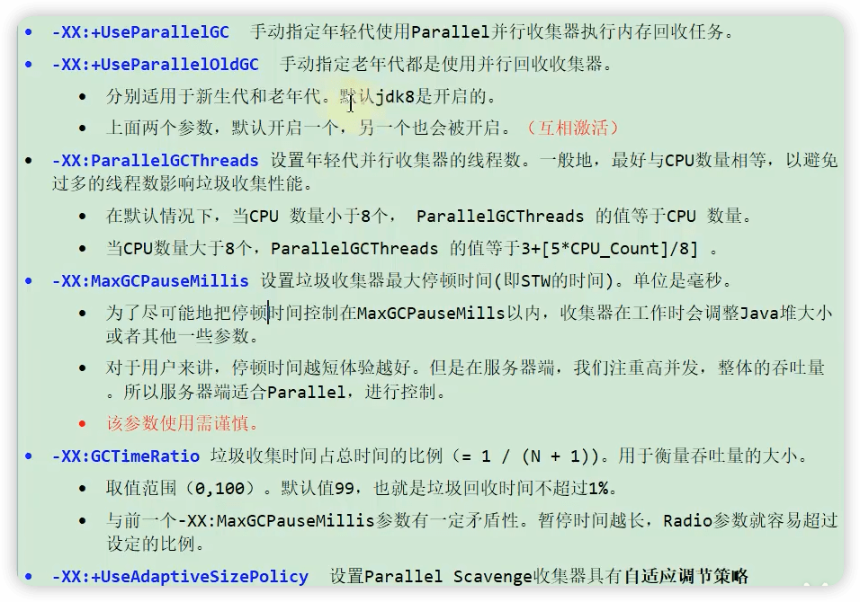

- CMS回收器

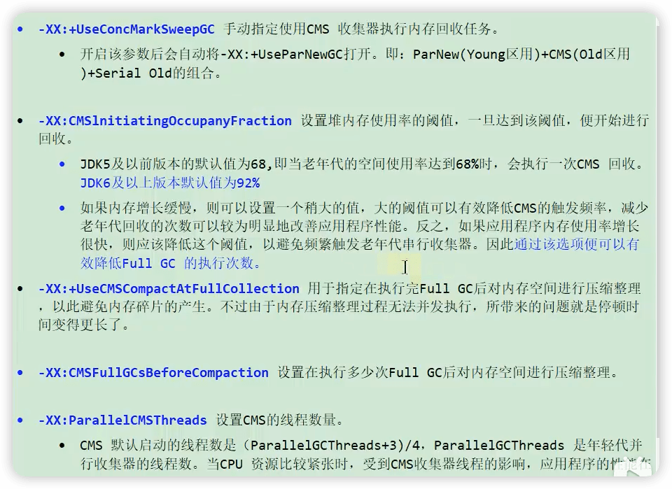

补充参数

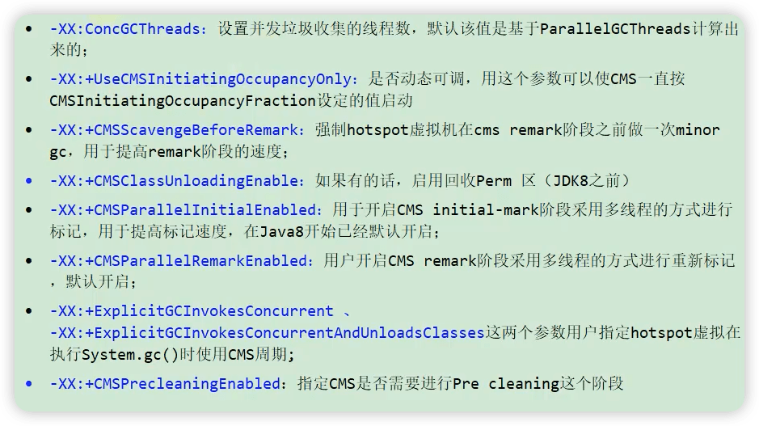 

特别说明


- G1回收器

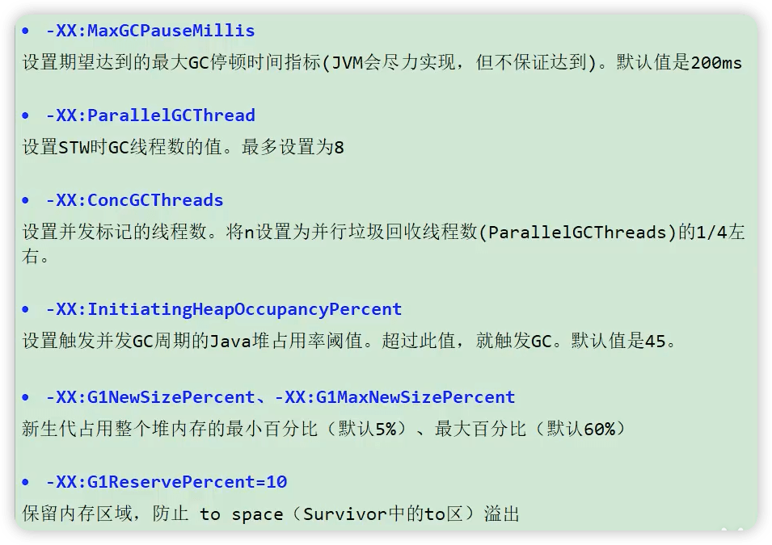

Mixed GC调优参数

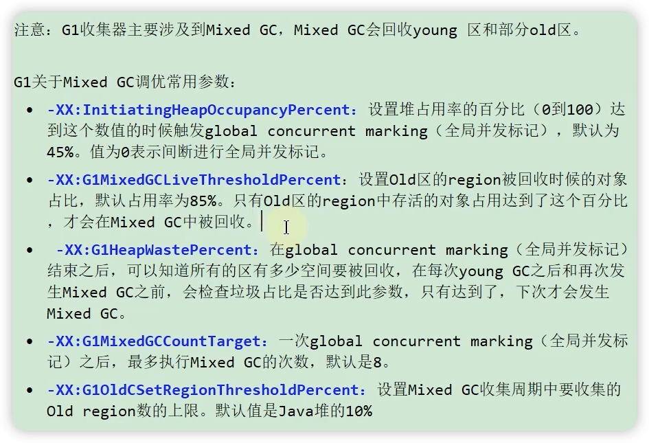


##### 怎么选择垃圾收集器

优先调整堆的大小让JVM自适应完成。

- 如果内存小于100M，使用串行收集器
- 如果是单核、单机程序，并且没有停顿时间的要求，串行收集器
- 如果是多CPU、需要高吞吐量、允许停顿时间超过1秒，选择并行或者JVM自己选择
- 如果是多CPU、追求低停顿时间，需快速响应（比如延迟不能超过1秒，如互联网应用），使用并发收集器。官方推荐G1，性能高。现在互联网的项目，基本都是使用G1。

特别说明：

1．没有最好的收集器，更没有万能的收集：

2．调优永远是针对特定场景、特定需求，不存在一劳永逸的收集器


#### GC日志相关选项

##### 常用参数

`-verbose:gc`
  输出日志信息，默认输出的标准输出
  可以独立使用
`-XX:+PrintGC`
  等同于-verbose:gc 表示打开简化的日志
  可以独立使用
`-XX:+PrintGCDetails`
  在发生垃圾回收时打印内存回收详细的日志， 并在进程退出时输出当前内存各区域的分配情况
  可以独立使用
`-XX:+PrintGCTimeStamps`
  程序启动到GC发生的时间秒数
  不可以独立使用，需要配合-XX:+PrintGCDetails使用
`-XX:+PrintGCDateStamps`
  输出GC发生时的时间戳（以日期的形式，例如：2013-05-04T21:53:59.234+0800）
  不可以独立使用，可以配合-XX:+PrintGCDetails使用
`-XX:+PrintHeapAtGC`
  每一次GC前和GC后，都打印堆信息
  可以独立使用
`-XIoggc:<file>`
  把GC日志写入到一个文件中去，而不是打印到标准输出中

##### 其他参数

`-XX:TraceClassLoading`
  监控类的加载
`-XX:PrintGCApplicationStoppedTime`
  打印GC时线程的停顿时间
`-XX:+PrintGCApplicationConcurrentTime`
  垃圾收集之前打印出应用未中断的执行时间
`-XX:+PrintReferenceGC`
  记录回收了多少种不同引用类型的引用
`-XX:+PrintTenuringDistribution`
  让JVM在每次MinorGC后打印出当前使用的Survivor中对象的年龄分布
`-XX:+UseGCLogFileRotation`
  启用GC日志文件的自动转储
`-XX:NumberOfGCLogFiles=1`
  GC日志文件的循环数目
`-XX:GCLogFileSize=1M`
  控制GC日志文件的大小

#### 其他参数

`-XX:+DisableExplicitGC`
  禁用hotspot执行System.gc()，默认禁用
`-XX:ReservedCodeCacheSize=<n>[g|m|k]`、`-XX:InitialCodeCacheSize=<n>[g|m|k]`
  指定代码缓存（JIT会缓存热点代码的编译后指令到方法区）的大小
`-XX:+UseCodeCacheFlushing`
  使用该参数让jvm放弃一些被编译的代码， 避免代码缓存被占满时JVM切换到interpreted-only的情况
`-XX:+DoEscapeAnalysis`
  开启逃逸分析
`-XX:+UseBiasedLocking`
  开启偏向锁
`-XX:+UseLargePages`
  开启使用大页面
`-XX:+PrintTLAB`
  打印TLAB的使用情况
`-XX:TLABSize`
  设置TLAB大小


### 4.4 通过java代码获取JVM参数

Java提供了 java.1ang.management包用于监视和管理Java虚拟机和Java运行时中的其他组件，它允许本地和远程监控和管理运行的Java虛拟机。其中ManagementFactory这个类还是挺常用的。另外还有Runtime 类也可以获取一些内存、CPU核数等相关的数据。

通过这些api可以监控我们的应用服务器的堆内存使用情况，设置一些阈值进行报警等处理。


## 5 分析GC日志

P375

### 5.1 GC日志参数

1. `-verbose:gc`

输出gc日志信息，默认输出到标准输出

2. `-XX:+PrintGC`

输出GC日志。类似：-verbose:gc

3. `-XX:+PrintGCDetails`

在发生垃圾回收时打印内存回收相处的日志，并在进程退出时输出当前内存各区域分配情况

4. `-XX:+PrintGCTimeStamps`

输出GC发生时的时间戳

5. `-XX:+PrintGCDateStamps`

输出GC发生时的时间戳（以日期的形式，例如：2013-05-04T21:53:59.234+0800）

6. `-XX:+PrintHeapAtGC`

每一次GC前和GC后，都打印堆信息

7. `-Xloggc:<file>`

表示把GC日志写入到一个文件中去，而不是打印到标准输出中


### 5.2 GC日志格式


### 5.3 特殊问题：新生代与老年代的比例


### 5.4 GC日志分析工具

GCeasy

GCViewer


---------


## 6 OOM常见各种场景及解决方案

P302

案例1：堆溢出


案列2：元空间溢出


案例3：GC overhead limit exceeded


案例4：线程溢出


## 7 性能优化案例

性能测试工具：Jmeter


案例1：调整堆大小提高服务的吞吐量


案例2：调整垃圾回收器提供服务的吞吐量


案例3：JVM优化之JIT优化


案例4：G1并发执行的线程数对性能的影响


案例5：合理配置堆内存


案例6：CPU占用很高排查方案


日均百万级订单交易系统如何设置JVM参数

## 8 Java代码层及其它层面调优


> 延迟满足
>
> 遵守时间的价值
>
> 保有好奇心
