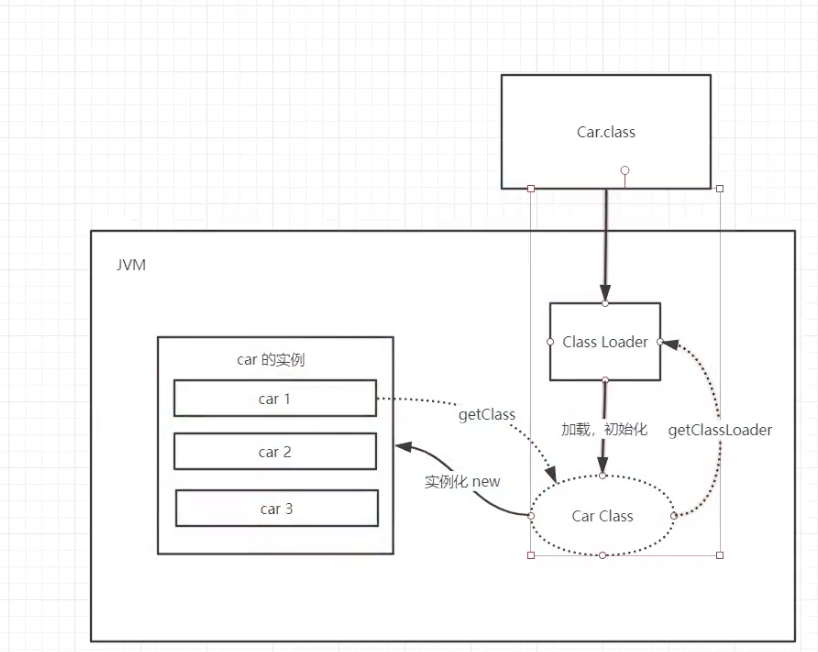

JVM入门
-------

[【狂神说Java】JVM快速入门篇](https://www.bilibili.com/video/BV1iJ411d7jS)


java8虚拟机和之前的变化？

什么是OOM，什么是栈溢出StackOverFlowError？怎么分析？

JVM的常用调用参数有哪些？

内存快照如何抓取，怎么分析Dump文件？

JVM中类加载器？


1. JVM的位置 

操作系统之上

### JVM的体系结构


### 类加载器

作用：加载Class文件 



1. 虚拟机自带的加载器
2. 启动类（根）加载器  
3. 扩展类加载器
4. 应用加载器


启动类加载器是到`rt.jar`（root）包中寻找，具体位置，macOS如下：

```bash
/Library/Java/JavaVirtualMachines/jdk1.8.0_181.jdk/Contents/Home/jre/lib/rt.jar
```

扩展类加载器是到目录`jre/lib/ext`中寻找，具体位置：

```bash
/Library/Java/JavaVirtualMachines/jdk1.8.0_181.jdk/Contents/Home/jre/lib/ext
```

```java
Car car1 = new Car();
Class<? extends Car> aClass1 = car1.getClass();

ClassLoader classLoader = aClass1.getClassLoader();
System.out.println(classLoader);                // AppClassLoader
System.out.println(classLoader.getParent());    // ExtClassLoader
System.out.println(classLoader.getParent().getParent()); // null 1.不存在 2.java程序获取不到（因为时C/C++）

```


双亲委派机制：安全

1. 类加载时，先启动类加载器检查寻找，如果找不到就抛出异常给其子类加载器（扩展类加载器）
2. 扩展类加载器检查寻找，如果找不到就抛出异常给其子类加载器（应用加载器）；
3. 应用加载检查寻找，如果找不动，就抛出异常`ClassNotFoundException`。


### 沙箱安全机制

Java安全模型的核心就是Java沙箱（sandbox），什么是沙箱？沙箱是一个限制程序运行的环境。沙箱机制就是将Java代码限定在虚拟机（JVM）特定的运行范围中，并且严格限制代码对本地系统资源访问，通过这样的措施来保证对代码的有效隔离，防止对本地系统造成破坏。

沙箱主要**限制系统资源访问**，那系统资源包括什么？**CPU、内存、文件系统、网络**。不同级别的沙箱对这些资源访问的限制也可以不一样。

所有的Java程序运行都可以指定沙箱，可以定制安全策略。

在Java中将执行程序分成**本地代码**和**远程代码**两种，本地代码默认视为可信任的，而远程代码则被看作是不受信的。对于授信的本地代码，可以访问一切本地资源。而对于非授信的远程代码在早期的Java实现中，安全依赖于沙箱（Sandbox）机制。如下图所示JDK1.0安全模型：


但如此严格的安全机制也给程序的功能扩展带来障碍，比如当用户希望远程代码访问本地系统的文件时候，就无法实现。因此在后续的Java1.1版本中，针对安全机制做了改进，增加了`安全策略`，允许用户指定代码对本地资源的访问权限。如下图所示JDK1.1安全模型：


在Java1.2版本中，再次改进了安全机制，增加了`代码签名`。不论本地代码或是远程代码，都会按照用户的安全策略设定，由类加载器加载到虚拟机中权限不同的运行空间，来实现差异化的代码执行权限控制。如下图所示
JDK1.2安全模型：


当前最新的安全机制实现，则引入了域(Domain) 的概念。虛拟机会把所有代码加载到不同的系统域和应用域，
系统域部分专门负责与关键资源进行交互，而各个应用域部分则通过系统域的部分代理来对各种需要的资源进行访
问。虛拟机中不同的受保护域(Protected Domain)，对应不一样的权限 (Permission)，存在于不同域中的类文件就具有了当前域的全部权限，如下图所示 最新的安全模型(idk 1.6)：


组成沙箱的基本组件：

- `字节码校验器`（bytecode verifier）：确保Java类文件遵循Java语言规范。这样可以帮助Java程序实现内存保护。但并不是所有的类文件都会经过字节码校验，比如核心类（java，javax）。
- 类装载器（class loader）：其中类装载器在3个方面对Java沙箱起作用
  - 它防止恶意代码去干涉善意的代码；
  - 它守护了被信任的类库边界；
  - 它将代码归入保护域，确定了代码可以进行哪些操作。

虚拟机为不同的类加载器载入的类提供不同的命名空间，命名空间由一系列唯一的名称组成，每一个被装载的类将有一个名字，这个命名空间是由Java虚拟机为每一个类装载器维护的，它们互相之间甚至不可见。

类装载器采用的机制是双亲委派模式。
1. 从最内层JVM自带类加载器开始加载，外层恶意同名类得不到加载从而无法使用；

2. 由于严格通过包来区分了访问域，外层恶意的类通过内置代码也无法获得权限访问到内层类，破坏代码就自然无法生效。

   

- 存取控制器（access controller）：存取控制器可以控制核心API对操作系统的存取权限，而这个控制的策略设定，可以由用户指定。
- 安全管理器（security manager）：是核心API和操作系统之间的主要接口。实现权限控制，比存取控制器优先级高。
- 安全软件包（security package）：java.security下的类和扩展包下的类，允许用户为自己的应用增加新的安全特性，包括：
  - 安全提供者
  - 消息摘要
  - 数字签名
  - 加密
  - 鉴别


### native

```java
public
class Thread implements Runnable {
  ...
  
	private native void start0();
  
  ...
    
}
```

凡是呆了`native`关键字的，说明调用C语言库，会进入本地方法栈，调用本地方法接口（JNI）。

JNI作用：扩展Java的使用，融合不同的编程语言（起初是C、C++）为Java所用。

它在内存区域中专门开辟了一块标记区域（Native Method Stack），登记native方法，在最终执行的时候，通过JNI加载本地方法库中的方法。

操作硬件等会用到本地方法，比如Java程序驱动打印机，管理系统等。


### PC寄存器

Program Counter Register
每个线程都有一个程序计数器，是线程私有的，就是一个指针，指向方法区中的方法字节码(用来存储指向像
一条指令的地址，也即将要执行的指令代码），在执行引擎读取下一条指令，是一个非第小的内存空间，几乎可以
忽路不计。


### 方法区

方法区是被所有线程共享，所有字段和方法字节码，以及一些待殊方法，如构造函数，接口代码也在此定义，
简单说，所有定义的方法的信息都保存在该区域，此区域属手**共享区间**;

> 存储了每个类的信息（包括类的名称、方法信息、字段信息）、静态变量、常量以及编译器编译后的代码等。
>
> static, final, Class, 常量池


JVM内存模型图：


### 栈

main方法最先执行，最后结束，它先被压进栈，最后弹出栈，程序结束。

线程结束，栈内存也就释放，对于栈来说，**不存在垃圾回收问题**。

```java
public  class Test {
  public static void main(String[] args) {
 	new Test().test();   
 }
  
  public test() {
    a();
  }
  public a() {
    test();
  }
}
```

循环引用导致栈溢出：`StackOverflowError`。


栈中存放：8大基本类型、对象引用、实例的方法


每执行一个方法都产生一个**栈帧**（stack1，stack2等）。程序正在执行的方法，一定在栈的顶部。


#### 栈 + 堆 + 方法区 之间交互关系


>  在内存中画出一个对象实例化的过程。

new时，现在栈中压入对象的引用，然后再对中创建具体的对象实例，此过程中如果有常量，就创建常量引用，然后再方法区的常量池中创建具体的常量值。


### 堆

Heap，一个JVM只有一个堆内存，对内存的大小是可以调节的。

堆内存中细分为三个区域：

- 新生区（伊甸园 + Survivor from + Survivor to）  Young
- 养老区 Old
- 永久区 Perm（也叫元空间）

> 大小比例：
>
> Young : Old = 1:2 		（可以通过参数 –XX:NewRatio 来指定 ）
>
> Edem : from : to = 8 : 1 : 1  （可以通过参数 –XX:SurvivorRatio 来设定）


GC垃圾回收，主要是在伊甸园区和养老区，前者是轻量级（轻GC），后者是重量级（重GC，==Full GC==）。

内存满了，`OOM`，堆内存不够！

```
java.lang.OutOfMemoryError: Java heap space
```

在JDK8以后，永久存储区名字改成了**元空间**。


#### 新生区、老年区

- 类：诞生和成长的地方，甚至死亡
- 伊甸园区：所有对象都是在伊甸园区new出来的
- 幸存者区（s0，s1）


伊甸园、s0、s1之间是动态变化，通过轻GC来删选。

当伊甸园、s0、s1都满了后触发重GC，经过删选，一部分就进入养老区。


#### 永久区（元空间，Metaspace）

永久区常驻内存的，用来存放JDK自身携带的Class对象，interface元数据。存储的是Java运行时的一些环境或类信息，这个区域不存在垃圾回收！

关闭虚拟机就会释放这个区域的内存。

一个启动类，加载了大量的第三方jar包；Tomcat部署了太多的应用，大量动态生成的发射类；不断的被加载，知道内存满了，就会出现OOM。

> 元空间是目前的叫法，有的人也称为 非堆，方法区


逻辑上存在，物理上不存在

#### 堆内存调优

```java
// 返回虚拟机使用的最大内存
long max = Runtime.getRuntime().maxMemory();
// 返回虚拟机初始化的最大内存
long total = Runtime.getRuntime().totalMemory();

System.out.println("max=" + max + "字节\t" + (max/(double)(1024*1024)) + "MB" );
System.out.println("total=" + total + "字节\t" + (total/(double)(1024*1024)) + "MB" );
```

结果为：

```
max=1908932608字节	1820.5MB
total=128974848字节	123.0MB
```

默认情况：分配的总内存(max)约是电脑内存1/4，初始化的内存(total)是1/64。

可以通过调节参数(VM options)来改变:

```
-Xms1024m -Xmx1024m -XX:+PrintGCDetails
```


控制台运行结果：

```
max=1029177344字节	981.5MB
total=1029177344字节	981.5MB
Heap
 PSYoungGen      total 305664K, used 15729K [0x00000007aab00000, 0x00000007c0000000, 0x00000007c0000000)
  eden space 262144K, 6% used [0x00000007aab00000,0x00000007aba5c420,0x00000007bab00000)
  from space 43520K, 0% used [0x00000007bd580000,0x00000007bd580000,0x00000007c0000000)
  to   space 43520K, 0% used [0x00000007bab00000,0x00000007bab00000,0x00000007bd580000)
 ParOldGen       total 699392K, used 0K [0x0000000780000000, 0x00000007aab00000, 0x00000007aab00000)
  object space 699392K, 0% used [0x0000000780000000,0x0000000780000000,0x00000007aab00000)
 Metaspace       used 3344K, capacity 4496K, committed 4864K, reserved 1056768K
  class space    used 367K, capacity 388K, committed 512K, reserved 1048576K

```


上面的PSYoungGen（新生代区）305664K + ParOldGen（老年代区）699392K = 1005056K = 981.5M，也说明Metaspace区物理上不存在（或者说不存在与此，不受JVM直接控制？）

通过减少内存，查看不同区域内存清理变化：

```
-Xms8m -Xmx8m -XX:+PrintGCDetails
```


> 出现OOM，调式步骤
>
> 1. 尝试扩大内存看结果，如果不错了，说明是内存不够。
> 2. 分析内存，看一下那个地方出现了问题（专业工具）

### 使用JPofiler工具分析OOM原因

OOM如何排除：

- 能够看到代码第几行出错：内存快照分析工具，MAT（eclipse），JProfiler
- Debug，一行行分析代码

MAT，JProfiler的作用：

- 分析Dump内存文件，快速定位内存泄漏
- 获得堆中的数据
- 获得打的对象
- ...


```
-Xms1m -Xmx8m -XX:+HeapDumpOnOutOfMemoryError
```


对应的dump文件`java_pid41484.hprof`文件在项目根目录，用安装好的JProfiler打开就可以分析了。

> `-Xms`：设置初始化内存分配带下，默认1/64
>
> `Xmx`：设置最大分配内存，默认1/4
>
> `-XX:+PrintGCDetails`：打印GC垃圾回收信息
>
> `-XX:+HeapDumpOnOutOfMemoryError`：生成OOM的dump文件


### GC：垃圾回收  

堆，JVM在进行GC时，并不是对这个三个区域统一回收。大部分时候都是新生代

- 新生代
- 幸存区 （from，to）谁空谁是to
- 老年区

GC两种：轻GC（普通的GC），重GC（全局GC）

 

#### GC常用算法

1. 引用计数法  

JVM不采用

2. 复制算法


复制算法的核心就是，将原有的内存空间一分为二（from，to），每次只用其中的一块，在垃圾回收时，将正在使用的对象复制到另外一个内存空间中，然后将该内存空间清空，交换两个内存的角色，完成垃圾回收。


每一次GC后，Eden和to区就清空。

好处：没有内存的碎片

- 坏处：浪费了内存空间，多了一半空间永远是空to。假设对象100%存活（极端情况）

复制算法最佳使用场景：对象存活度较低的时候，新生区

 


3. 标记清除算法

活着对象


- 缺点：两次扫描，严重浪费时间，会产生内存碎片
- 优点：不需要额外的空间


4. 标记压缩

再次优化标记清楚算法，把空格的内存移到一起，就不会是内存碎片了 

  


5. 标记清除压缩

先标记清除几次，再压缩


#### 总结

内存效率：复制算法 > 标记清除算法 > 标记压缩算法（时间复杂度）

内存整齐度：复制算法 = 标记压缩算法 > 标记清除算法  

内存利用率：标记压缩算法 = 标记清除算法 > 复制算法

> 难道没有最优算法吗？
>
> 答案：没有，没有最好的算法，只有最合适的算法  ---> GC:分代收集算法

年轻代：

- 存活率低
- 复制算法

老年代：

- 区域大：存活率高
- 标记清除 + 标记压缩混合 实现

#### GC知识点

- 当程序运行时，至少会有两个线程开启启动：主线程、垃圾回收线程，垃圾回收线程的priority（优先级）较低的。

- 垃圾回收器会在空闲的时候（不定时）对对象进行回收，释放内存空间，程序员是不可以显示的调用垃圾回收器回收内存的，但是可以使用`System.gc()`方法建议垃圾回收器进行回收，但是垃圾回收器不一定会执行。

- 垃圾回收机制只是回收不再使用的JVM内存，如果程序有严重BUG，照样内存溢出。

- 进入DEAD的线程，它还可以恢复，GC不会立即回收。

  真正宣布一个对象死亡，至少需要经历2次标记过程。当第一次标记时会同时进行一次筛选(判断此对象是否有必要执行finalize方法)。如果对象没有覆盖该方法，就面临死亡，所以说这个方法是对象逃脱死亡命运的最后一次机会。


### JMM：Java Memory Model

Java内存模型

1. 什么 是JMM？

   Java Memory Model，Java内存模型

2. 它是干嘛的？

   作用：缓存一致性协议，用于定义数据读写的规则（遵守，找到这个规则）。

   JMM定义了线程工作内存和主内存之间的抽象关系：线程之间的共享变量存储在主内存（Main Memory）中，每个线程都有一个私有的本地内存（Local Memory）

   

   解决共享对象可见性问题：volilate

   

3. 它该如何学习？

JMM：抽象的概念，理论
JMM对这八种指令的使用，制定了如下规则：

- 不允许read和load、store和write操作之一单独出现。即使用了read必须load，使用了store必须write

- 不允许线程丢弃他最近的assign操作，即工作变量的数据改变了之后，必须告知主存

- 不允许一个线程将没有assign的数据从工作内存同步回主内存

- 一个新的变量必须在主内存中诞生，不允许工作内存直接使用一个未被初始化的变量。就是怼变量实施use、store操作之前，必须经过assign和load操作

- 一个变量同一时间只有一个线程能对其进行lock。多次lock后，必须执行相同次数的unlock才能解锁■如果对一个变量进行lock操作，会清空所有工作内存中此变量的值，在执行引擎使用这个变量前，必须重新load或assign操作初始化变量的值

- 如果一个变量没有被lock，就不能对其进行unlock操作。也不能unlock一个被其他线程锁住的变量

- 对一个变量进行unlock操作之前，必须把此变量同步回主内存

  

JMM对这八种操作规则和对volatile的一些特殊规则就能确定哪里操作是线程安全，哪些操作是线程不安全的了。但是这些规则实在复杂，很难在实践中直接分析。所以一般我们也不会通过上述规则进行分析。更多的时候，使用java的happen-before规则来进行分析。


----

学习新东西是常态


## JVM知识点补充

### off-heap 和 on-heap

为了解决堆内内存过大带来的长时间的GC停顿的问题，以及操作系统对堆内内存不可知的问题，java虚拟机开辟出了堆外内存（off-heap memory）。堆外内存意味着把一些对象的实例分配在Java虚拟机堆内内存以外的内存区域，这些内存直接受操作系统管理（是JVM进程管理，JVM GC不能管理）。这样做的结果就是能保持一个较小的堆，以减少垃圾收集对应用的影响。同时因为这部分区域直接受操作系统的管理，别的进程和设备（例如GPU）可以直接通过操作系统对其进行访问，减少了从虚拟机中复制内存数据的过程。

java 在NIO 包中提供了`ByteBuffer`类，对堆外内存进行访问。


#### 堆外内存优点 

- 可以很方便的自主开辟很大的内存空间，对大内存的伸缩性很好
- 减少垃圾回收带来的系统停顿时间
- 直接受操作系统控制，可以直接被其他进程和设备访问，减少了原本从虚拟机复制的过程
- 特别适合那些分配次数少，读写操作很频繁的场景

#### 堆外内存缺点 

- 容易出现内存泄漏，并且很难排查
- 堆外内存的数据结构不直观，当存储结构复杂的对象时，会浪费大量的时间对其进行串行化。

#### 堆内内存与堆外内存的联系

虽然堆外内存本身不受垃圾回收算法的管辖，但是因为其是由ByteBuffer所创造出来的，因此这个buffer自身作为一个实例化的对象，其自身的信息（例如堆外内存在主存中的起始地址等信息）必须存储在堆内内存中。

当在堆内内存中存放的buffer对象实例被垃圾回收算法回收掉的时候，这个buffer对应的堆外内存区域同时也就被释放掉了。


### JVM工具

#### jps

**jps**(Java Virtual Machine Process Status Tool)，查看本机java进程信息。


#### jmap

**jmap**(Java Memory Map)，打印内存映射，制作**堆**dump文件。

监视进程运行中的jvm物理内存的占用情况，该进程内存内，所有对象的情况，例如产生了哪些对象，对象数量；

```
-dump:[live,]format=b,file=<filename> 使用hprof二进制形式,输出jvm的heap内容到文件=. live子选项是可选的，假如指定live选项,那么只输出活的对象到文件. 
-finalizerinfo 打印正等候回收的对象的信息.
-heap 打印heap的概要信息，GC使用的算法，heap的配置及wise heap的使用情况.
-histo[:live] 打印每个class的实例数目,内存占用,类全名信息. VM的内部类名字开头会加上前缀”*”. 如果live子参数加上后,只统计活的对象数量. 
-permstat 打印classload和jvm heap长久层的信息. 包含每个classloader的名字,活泼性,地址,父classloader和加载的class数量. 另外,内部String的数量和占用内存数也会打印出来. 
-F 强迫.在pid没有相应的时候使用-dump或者-histo参数. 在这个模式下,live子参数无效. 
-h | -help 打印辅助信息 
-J 传递参数给jmap启动的jvm. 
pid 需要被打印配相信息的java进程id.
```

实例：

```bash
# 12408是进程ID
$ jmap -histo 12408 
 num     #instances         #bytes  class name
----------------------------------------------
   1:         99057       11847040  [C
   2:         29792        9785464  [B
   3:          8798        7160792  [I
   4:         25907        2279816  java.lang.reflect.Method
   5:         87957        2110968  java.lang.String
   6:         14228        1572304  java.lang.Class
   7:         48864        1563648  java.util.concurrent.ConcurrentHashMap$Node
   8:         16260         891048  [Ljava.lang.Object;
   9:          7552         704488  [Ljava.util.HashMap$Node;
  10:         17150         686000  java.util.LinkedHashMap$Entry
  11:         19808         633856  java.util.HashMap$Node
  ...
  2283:             1             56  com.andyron.arblog.po.User
2382:             1             48  com.andyron.arblog.service.BlogServiceImpl$$EnhancerBySpringCGLIB$$20d392c9
2383:             1             48  com.andyron.arblog.service.TagServiceImpl$$EnhancerBySpringCGLIB$$d660fed1
2384:             1             48  com.andyron.arblog.service.TypeServiceImpl$$EnhancerBySpringCGLIB$$bbc30801
2385:             1             48  com.andyron.arblog.web.IndexController$$EnhancerBySpringCGLIB$$3bbbb2b7
3017:             1             32  com.andyron.arblog.ArblogApplication$$EnhancerBySpringCGLIB$$51f59e5b
3018:             1             32  com.andyron.arblog.interceptor.WebConfig$$EnhancerBySpringCGLIB$$cfc16f0b
3582:             1             24  com.andyron.arblog.web.admin.BlogController
4300:             1             16  com.andyron.arblog.aspect.LogAspect
4301:             1             16  com.andyron.arblog.handler.ControllerExceptionHandler
4302:             1             16  com.andyron.arblog.interceptor.LoginInterceptor
...
5871:             1             16  sun.util.resources.LocaleData
5872:             1             16  sun.util.resources.LocaleData$LocaleDataResourceBundleControl
Total       3834069      483846328
```

一个简单的博客项目，就用了不到6000千的类，和不到4百万的实例

#### jinfo

**jinfo**(Java Configuration Info)，观察进程运行环境参数，包括Java System属性和JVM命令行参数。

```bash
#查看java进程的配置信息
$ jinfo 2058
Attaching to process ID 2058, please wait...
Debugger attached successfully.
Server compiler detected.
JVM version is 24.0-b56
Java System Properties:

java.runtime.name = Java(TM) SE Runtime Environment
project.name = Amoeba-MySQL
java.vm.version = 24.0-b56
sun.boot.library.path = /usr/local/java/jdk1.7/jre/lib/amd64
................................................

# 查看2058的MaxPerm大小可以用
$ jinfo -flag MaxPermSize 2058
-XX:MaxPermSize=100663296
```


#### jstack：

jstack(Java Stack Trace)，打印线程的**栈**信息，制作线程dump文件。


#### jstat：性能监控

jstat(Java Virtual Machine Statistics Monitoring Tool)
    ① jstat利用JVM内建的指令对Java应用程序的资源和性能进行实时的命令行的监控，包括了对进程的classloader，compiler，gc情况；
    ②监视VM内存内的各种堆和非堆的大小及其内存使用量，以及加载类的数量。

```
-class：统计类装载器的行为
-compiler：统计HotSpot Just-in-Time编译器的行为
-gc：统计堆各个分区的使用情况
-gccapacity：统计新生区，老年区，permanent区的heap容量情况 
-gccause：统计最后一次gc和当前gc的原因
-gcnew：统计gc时，新生代的情况 
-gcnewcapacity：统计新生代大小和空间
-gcold：统计老年代和永久代的行为
-gcoldcapacity：统计老年代大小 
-gcpermcapacity：统计永久代大小 
-gcutil：统计gc时，heap情况 
-printcompilation：HotSpot编译方法统计
```


```bash
#每隔1秒监控一次，一共做10次

$ jstat -class 12607 1000 10
Loaded  Bytes  Unloaded  Bytes     Time
 12910 23488.3        4     6.2       8.26
 12910 23488.3        4     6.2       8.26
 12910 23488.3        4     6.2       8.26
 12910 23488.3        4     6.2       8.26
 12910 23488.3        4     6.2       8.26
 12910 23488.3        4     6.2       8.26
 12910 23488.3        4     6.2       8.26
 13056 23705.6        4     6.2       8.33
 13056 23705.6        4     6.2       8.33
 13056 23705.6        4     6.2       8.33
 
#Loaded 类加载数量
#Bytes  加载的大小（k） 
#Unloaded 类卸载的数量 
#Bytes 卸载的大小（k） 
#Time 时间花费在执行类加载和卸载操作
```

```bash
$ jstat -gc 2058 2000 20

 S0C    S1C    S0U    S1U      EC       EU        OC         OU       PC     PU    YGC     YGCT    FGC    FGCT     GCT   
8704.0 8704.0 805.5   0.0   69952.0  64174.5   174784.0    2644.5   16384.0 10426.7      2    0.034   0      0.000    0.034
8704.0 8704.0 805.5   0.0   69952.0  64174.5   174784.0    2644.5   16384.0 10426.7      2    0.034   0      0.000    0.034
8704.0 8704.0 805.5   0.0   69952.0  64174.5   174784.0    2644.5   16384.0 10426.7      2    0.034   0      0.000    0.034
.............................................
######################## 术语分隔符 ########################
#S0C 生还者区0 容量(KB)
#S1C 生还者区1 容量(KB)
#S0U 生还者区0 使用量(KB)
#S1U 生还者区1 使用量(KB)
#EC 伊甸园区容量(KB)
#EU 伊甸园区使用量(KB) 
#OC 老年区容量(KB)
#OU 老年区使用量(KB)
#PC 永久区容量(KB) 
#PU 永久区使用量(KB)
#YGC 新生代GC次数
#YGCT 新生代GC时间
#FGC full GC 事件的次数
#FGCT full GC的时间 
#GCT 总GC时间
```

```bash
$ jstat -gccapacity 12607 2000 10
NGCMN    NGCMX     NGC     S0C   S1C       EC      OGCMN      OGCMX       OGC         OC      PGCMN    PGCMX     PGC       PC     YGC    FGC
131072.0 131072.0 131072.0 13056.0 13056.0 104960.0   393216.0   393216.0   393216.0   393216.0  65536.0  65536.0  65536.0  65536.0      1     0
..........................................................................................................
######################## 术语分隔符 ########################
#NGCMN 最小新生代容量(KB)
#NGCMX 最大新生代容量(KB)
#NGC 当前新生代容量(KB)
#S0C 当前生存者0区容量(KB)
#S1C 当前生存者1区容量(KB)
#OGCMN 老年代最小容量(KB)
#OGCMX 老年代最大容量(KB)
#OGC 当前老年代容量(KB). 
#OC 当前老年代？Current old space capacity (KB). 
#PGCMN 永久区最小容量(KB)
#PGCMX 永久区最大容量(KB)
#PGC 当前永久区容量(KB). 
#PC 当前永久区？Current Permanent space capacity (KB). 
#YGC young GC事件的次数 
#FGC Full GC次数
```


#### jhat：内存分析工具 


#### jconsole：简易的可视化控制台
