《Java实战》第二版本
---

https://livebook.manning.com/book/modern-java-in-action/about-this-book/


# 一、基础知识

## 1 Java 8、9、10以及11的变化

### 1.1 为什么要关心Java的变化

Java 8所做的改变，其影响比Java历史上任何一次改变都深远次改变都深远（Java 9新增了效率提升方面的重要改进，但并不伤筋动骨。Java 10对类型推断做了微调）。

```java
// 按照重量给inventory中的苹果排序
Collections.sort(inventory, new Comparator<Apple>() {
  public int compare(Apple a1, Apple a2){
    return a1.getWeight().compareTo(a2.getWeight());
  }
});
```


基于之前的两个迫切需求（即编写更简洁的代码，以及更方便地利用处理器的多核）催生出了一座拔地而起相互勾连一致的Java 8大厦。

- Stream API；
- 向方法传递代码的技巧；
- 接口的默认方法。

流支持==多个数据处理的并行操作==，其思路和**数据库查询语言**类似——从高层的角度描述需求，而由“实现”（这里是Stream库）来选择底层最佳执行机制。这样就可以避免用`synchronized`编写代码，这种代码不仅容易出错，而且在多核CPU上执行所需的成本也比你想象的要高。

在Java 8中加入Stream可以视为添加另外两项的直接原因：向方法传递代码的简洁技巧（方法引用、Lambda）和接口中的默认方法。

🔖

简洁地表达行为参数化


### 1.2 Java怎么还在变

可在现实中，**某些语言只是更适合某些方面**。比如，C和C++仍然是构建操作系统和各种嵌入式系统的流行工具，因为它们编写出的程序尽管安全性不佳，但运行时占用资源少。

#### Java在编程语言生态系统中的位置

在硬件无关的内存模型中，并发线程在多核处理器上发生意外的概率比单核处理器上大得多

Java虚拟机（JVM）及其字节码可能会变得比Java语言本身更重要


#### 流处理

流是一系列数据项，一次只生成一项。程序可以从输入流中一个一个读取数据项，然后以同样的方式将数据项写入输出流。一个程序的输出流很可能是另一个程序的输入流。


Java 8可以透明地把输入的不相关部分拿到几个CPU核上去分别执行你的Stream操作流水线——这是几乎免费的并行，用不着去费劲搞Thread了。


#### 用行为参数化把代码传递给方法

Java 8中增加的另一个编程概念是**通过API来==传递代码==的能力**。


#### 并行与共享的可变数据

没有共享的可变数据，以及将方法和函数（即代码）传递给其他方法的能力，这两个要点是函数式编程范式的基石。


#### Java需要演变

语言需要不断改进，以适应硬件的更新或满足程序员的期待。


### 1.3 Java中的函数


#### 方法和Lambda作为一等值

方法引用


> 什么是谓词？
>
> 谓词（predicate）在数学上常常用来代表类似于函数的东西，它接受一个参数值，并返回true或false。


#### 从传递方法到Lambda


### 1.4 流

几乎每个Java应用都会**制造和处理集合**。但集合用起来并不总是那么理想。比方说，你需要从一个列表中筛选金额较高的交易，然后按货币分组。你需要写一大堆模板代码来实现这个数据处理命令：

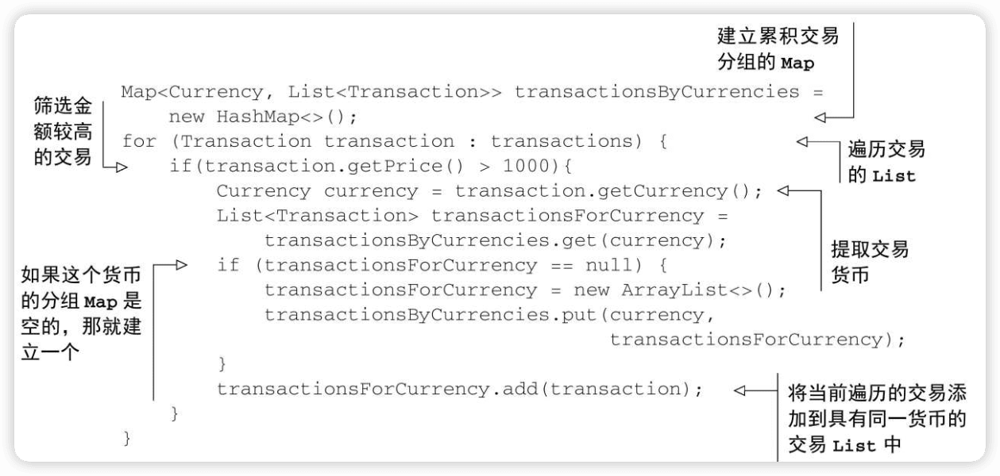

Stream API的方式：

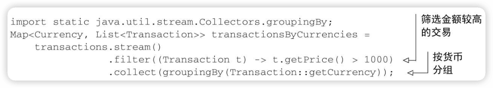

Stream API处理数据的方式与Collection API不同。用集合的话，你得自己管理迭代过程。你得用for-each循环一个个地迭代元素，然后再处理元素。我们把这种数据迭代方法称为==外部迭代==。相反，有了Stream API，你根本用不着操心循环的事情。数据处理完全是在库内部进行的。我们把这种思想叫作==内部迭代==。


🔖


Collection主要是为了==存储和访问数据==，Stream则主要用于==描述对数据的计算==。

Stream API**允许并提倡并行处理**一个Stream中的元素。


### 1.5 默认方法及Java模块


### 1.6 来自函数式编程的其他好思想

将方法和Lambda作为一等值，以及在没有可变共享状态时，函数或方法可以有效、安全地并行执行。

通过显式使用更多的描述性数据类型来避免null。 `Optional<T>`

（结构化的）模式匹配。

🔖


## 2 通过行为参数化传递代码

软件工程中一个众所周知的问题就是，**==不管你做什么，用户的需求肯定会变==**。

==行为参数化==就是可以帮助你**处理频繁变更的需求的一种软件开发模式**。意味着拿出一个代码块，把它准备好却不去执行它。这个代码块以后可以被你程序的其他部分调用，这意味着你可以==推迟==这块代码的执行。

🔖

### 2.1 应对不断变化的需求

#### 初试牛刀：筛选绿苹果

```java
        enum Color { RED, GREEN }
```

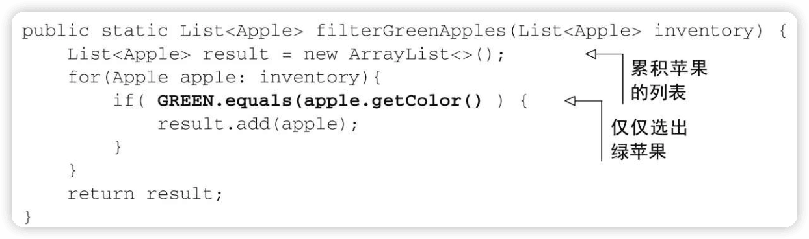

此时，如果筛选其他颜色苹果就要编写类似的另一个方法。

> 一个好的原则是编写类似的代码之后，尽量对其进行抽象化。

#### 再展身手：把颜色作为参数

```java
public static List<Apple> filterApplesByColor(List<Apple> inventory,
                                              Color color) {
  List<Apple> result = new ArrayList<>();
  for (Apple apple: inventory) {
    if ( apple.getColor().equals(color) ) {
      result.add(apple);
    }
  }
  return result;
}
```

如果要做重量的筛选，就编写另外一个类似方法：

```java
public static List<Apple> filterApplesByWeight(List<Apple> inventory,
                                               int weight) {
  List<Apple> result = new ArrayList<>();
  For (Apple apple: inventory){
    if ( apple.getWeight() > weight ) {
      result.add(apple);
    }
  }
  return result;
}
```


#### 第三次尝试：对你能想到的每个属性做筛选

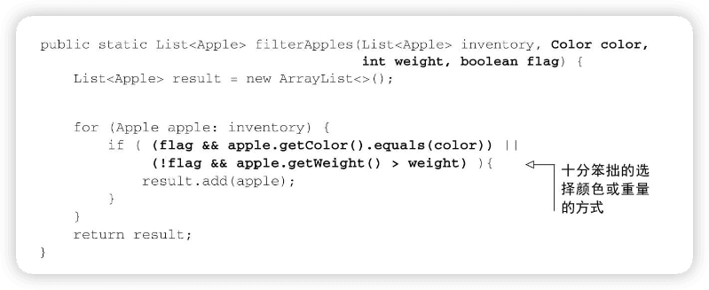

```java
List<Apple> greenApples = filterApples(inventory, GREEN, 0, true);
List<Apple> heavyApples = filterApples(inventory, null, 150, false);
...
```

这个解决方案还是不能很好地应对变化的需求。

客户端代码看上去糟透了。true和false是什么意思？

如果要求对苹果的不同属性做筛选，比如大小、形状、产地等，该怎么办？

如果要求组合属性，做更复杂的查询，比如绿色的重苹果，又该怎么办？

### 2.2 行为参数化

更高层次的抽象

一种可能的解决方案是==对选择标准建模==：你考虑的是苹果，需要根据Apple的某些属性（比如它是绿色的吗？重量超过150克吗？）来返回一个boolean值。我们把它称为==谓词==（即一个返回boolean值的函数）。定义一个接口来对选择标准建模：

```java
public interface ApplePredicate {
  boolean test(Apple apple);
}
```

然后不同的选择策略就可以在通过实现这个接口的类中实现。


给filterApples方法添加一个参数，让它接受ApplePredicate对象。这在软件工程上有很大好处：把filterApples方法迭代集合的==逻辑==与要应用到集合中每个元素的==行为==（这里是一个谓词）区分开了。

#### 第四次尝试：根据抽象条件筛选

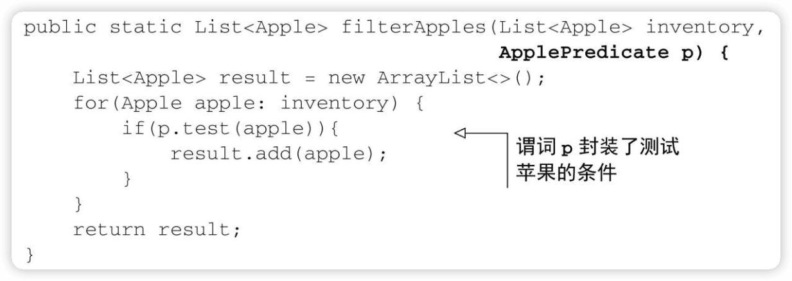

#### 1．传递代码/行为

现在任何选择策略，只需要创建一个类来实现ApplePredicate就行了。

```java
// 找出所有重量超过150克的红苹果
public class AppleRedAndHeavyPredicate implements ApplePredicate {
  public boolean test(Apple apple){
    return RED.equals(apple.getColor()) && apple.getWeight() > 150;
  }
}


List<Apple> redAndHeavyApples = filterApples(inventory, new AppleRedAndHeavyPredicate());
```

filterApples方法的行为取决于通过ApplePredicate对象传递的代码，也就是说，**把filterApples方法的行为参数化了**。

还可以进一步通过Lambda表达式，来简化，无须定义多个ApplePredicate类。

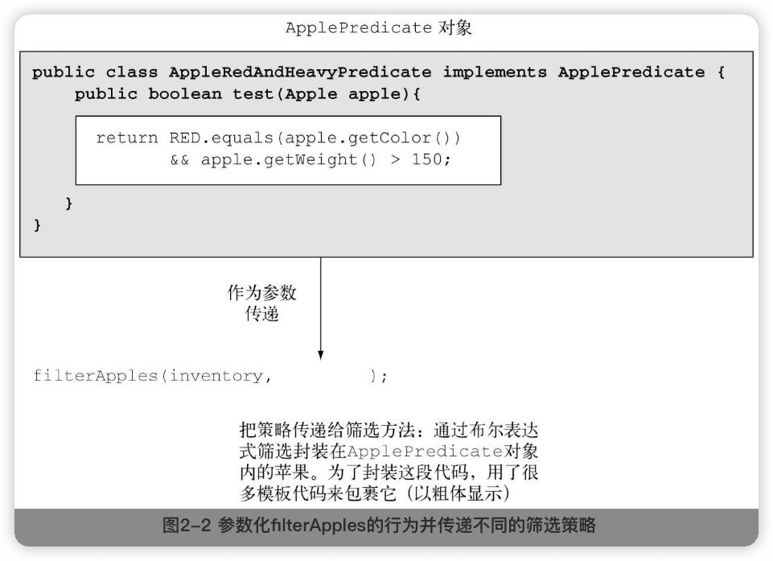

#### 2．多种行为，一个参数

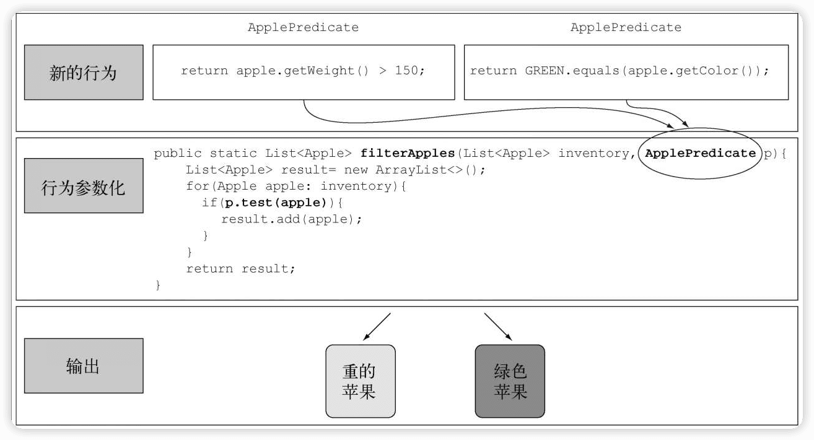

### 2.3 对付啰唆

使用谓词筛选时，声明好几个实现ApplePredicate接口的类是比较啰嗦的：

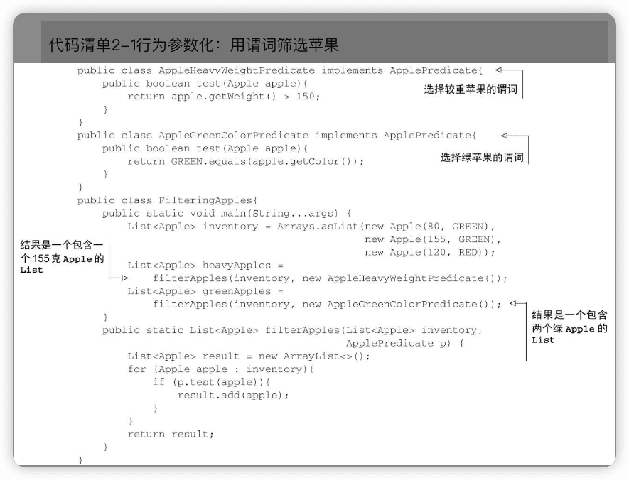

Java有一个机制称为==匿名类==，它可以让你**同时声明和实例化一个类**。

#### 第五次尝试：使用匿名类

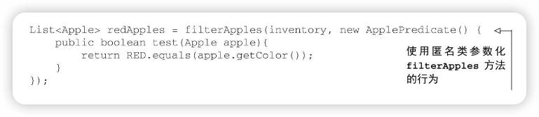

GUI应用程序中经常使用匿名类来创建事件处理器对象：

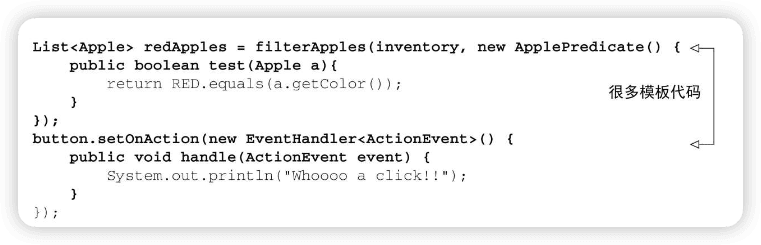

#### 第六次尝试：使用Lambda表达式

```java
List<Apple> result = filterApples(inventory, (Apple apple) -> RED.equals(apple.getColor()));
```

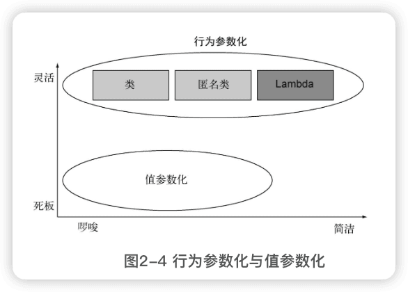

#### 第七次尝试：将List类型抽象化

目前，filterApples方法还只适用于Apple。还可以将List类型抽象化：

```java
public static <T> List<T> filter2(List<T> list, Predicate<T> p) {
  List<T> result = new ArrayList<>();
  for (T e : list) {
    if (p.test(e)) {
      result.add(e);
    }
  }
  return result;
}

interface Predicate<T> {
  boolean test(T t);
}
```

可以把filter2方法用在香蕉、橘子、Integer或是String等的列表上：

```java
List<Apple> redApples = filter2(inventory, (Apple a) -> Color.RED.equals(a.getColor()));
List<Integer> evenNumbers = filter2(Arrays.asList(1, 10, 4, 3), (Integer i) -> i % 2 == 0);
```

