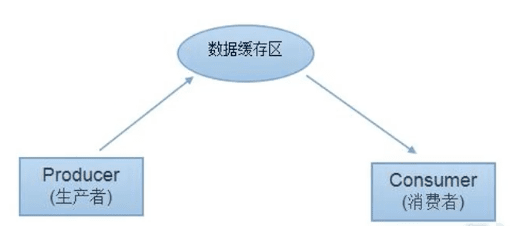

Java多线程
------------

[【狂神说Java】多线程详解](https://www.bilibili.com/video/BV1V4411p7EF?spm_id_from=333.999.0.0)


## 一、线程简介

任务、进程、线程、多线程

多任务

多线程 

### 普通方法调用和多线程


### 程序-进程-线程

Process Thread

 

### 本章核心概念

- 线程就是独立的执行路径；
- 在程序运行时，即使没有自己创建线程，后台也会有多个线程，如<u>主线程，gc线程</u>； 
- `main()`称之为**主线程**，为系统的入口，用于执行整个程序；
- 在一个进程中，如果开辟了多个线程，线程的运行由**调度器**安排调度，调度器是与操作系统紧密相关的，先后顺序是不能人为的干预的。
- 对同一份资源操作时，会存在资源抢夺的问题，需要加入**并发控制**；
- 线程会带来额外的开销，如**cpu调度时间，并发控制开销**。
- 每个线程在自己的**工作内存**交互，内存控制不当会造成数据不一致


> 注意：很多线程都是模拟出来的，真正的多线程是指由多个CPU，即多核，如服务器。如果是模拟出来的多线程，即在一个cpu的情况下，**在同一个时间点，cpu只能执行一个代码**，因为切换的很快，所以就有同时执行的错局。


## 二、线程实现【重点】

### 三种创建方式


### Thread

步骤：

- 自定义线程类继承**Thread**类
- 重写run()方法，编写线程执行体
- 创建线程对象，调用start()方法启动线程

```java
public class TestThread1 extends Thread {

    @Override
    public void run() {
        // 线程体
        for (int i = 0; i < 20; i++) {
            System.out.println("我在看代码=----" + i);
        }
    }

    public static void main(String[] args) {
        // main线程，主线程

        // 创建一个线程对象
        TestThread1 testThread1 = new TestThread1();

        // 调用start()方法开启线程
        testThread1.start();

        for (int i = 0; i < 2000; i++) {
            System.out.println("我在学习多线程--" + i);
        }
    }
}
```

线程开启不一定立即执行，由CPU调度执行。

#### 案例，下载图片

先下载Apache Commons IO的jar，直接拷贝到项目中，然后右击**Add as Library**就可以使用。

### 实现Runnable接口

步骤：

- 定义MyRunnable类实现Runnable接口
- 实现run()方法，编写线程执行体
- 创建线程对象，调用start()方法启动线程

```java
public class TestThread3 implements Runnable {
    @Override
    public void run() {
        // 线程体
        for (int i = 0; i < 200; i++) {
            System.out.println("Runnable我在看代码=----" + i);
        }
    }

    public static void main(String[] args) {
        // 创建Runnable接口的实现类
        TestThread3 testThread3 = new TestThread3();

        // 创建线程对象，通过线程对象来开启我们的线程，代理
        new Thread(testThread3).start();

        for (int i = 0; i < 1000; i++) {
            System.out.println("Runnable我在学习多线程--" + i);
        }
    }
}
```


### 继承Thread类 vs 实现Runnable接口

继承Thread类：

- 子类继承Thread类具备多线程能力
- 启动线程：子类对象.start()
- 不建议使用：避免OOP单继承局限性

实现Runnable接口：

- 实现接口Runnable具有多线程能力

- 启动线程：传入目标对象+Thread对象.start()

- 推荐使用：**避免单继承局限性，灵活方便，方便同一个对象被多个线程使用**

  ```java
  // 一份资源
  StartThread4 station = new StartThread4();
  
  // 多个代理
  new Thread(station, "小明").start();
  new Thread(station, "老是").start();
  new Thread(station, "小红").start();
  ```


#### 案例：买火车票

多个线程同时操作同一个对象

#### 案例：龟兔赛跑-Race


### 实现Callable接口(了解)

1. 实现Callable接口，需要返回值类型
2. 重写call方法，需要抛出异常
3. 创建目标对象
4. 创建执行服务：ExecutorService ser = Executors.newFixedThreadPool(1)； 
5. 提交执行：Future<Boolean> result1 = ser.submit(t1)；
6. 获取结果：boolean r1 = result1.get()
7. 关闭服务：ser.shutdownNow()；


callable的好处：

1. 可以定义返回值
2. 可以抛出异常

### 静态代理 

真实对象和代理对象都要实现同一个接口;

代理对象要代理真实角色;

静态搭理的好处：
 *      代理对象可以做很多真实对象做不了的事
 *      真实对象专注于自己的事情

```java
public class StaticProxy {
    public static void main(String[] args) {
        You you = new You();
        WeddingCompany weddingCompany = new WeddingCompany(you);
        weddingCompany.happyMarry();
    }
}

interface Marry {
    void happyMarry();
}

/**
 * 真实角色，你去结婚
 */
class You implements Marry {

    @Override
    public void happyMarry() {
        System.out.println("我要结婚了，好开心");
    }
}

/**
 * 代理角色，帮助你结婚
 */
class WeddingCompany implements Marry {

    // 代理谁？ --》 真实目标角色
    private Marry target;

    public WeddingCompany(Marry target) {
        this.target = target;
    }

    @Override
    public void happyMarry() {
        before();
        this.target.happyMarry(); // 这是真实对象
        after();
    }

    private void after() {
        System.out.println("结婚之后收尾款");
    }

    private void before() {
        System.out.println("结婚之前布置现场");
    }
}
```


### Lambda表达式

- λ希腊字母表中排序第十一位的字母，英语名称为Lambda
- 避免匿名内部类定义过多
- 可以让代码看起来很简洁
- 去掉了一堆没有意义的代码，留下核心的逻辑
- 其实质属于**函数式编程**的概念

**Funtional Interface(函数式接口)**是学习Lambda表达式的关键。

任何接口，如果只包含唯一一个抽象方法，那么它就是一个函数式接口。可以通过lambda表达式来创建该接口的对象。 

Lambda表达式的演化过程：

```java
public class TestLambda1 {
    // 3. 静态内部类
    static class Like2 implements ILike {
        @Override
        public void lambda() {
            System.out.println("I like lambda2");
        }
    }

    public static void main(String[] args) {
        ILike like = new Like();
        like.lambda();

        like = new Like2();
        like.lambda();

        // 4. 局部内部类
        class Like3 implements ILike {
            @Override
            public void lambda() {
                System.out.println("I like lambda3");
            }
        }
        like = new Like3();
        like.lambda();

        // 5. 匿名内部类，没有类的名称，必须借助接口或者父类
        like = new ILike() {
            @Override
            public void lambda() {
                System.out.println("I like lambda4");
            }
        };
        like.lambda();

        // 6. 用lambda简化
        like = () -> {
            System.out.println("I like lambda5");
        };
        like.lambda();
    }

}

// 1. 定义函数式接口
interface ILike {
    void lambda();
}

// 2. 实现类
class Like implements ILike {
    @Override
    public void lambda() {
        System.out.println("I like lambda");
    }
}
```

Lambda表示的简化：

```java
public class TestLambda2 {
    public static void main(String[] args) {
        ILove love = null;

        love = (int a) -> {
            System.out.println("I love you -->" + a);
        };

        // 简化1：去掉参数类型，多个参数也可以去掉参数类型
        love = (a) -> {
            System.out.println("I love you -->" + a);
        };

        // 简化2：去掉括号
        love = a -> {
            System.out.println("I love you -->" + a);
            System.out.println("I love you too.");
        };

        // 简化3：去掉大括号（因为代码只有一行）
        love = a -> System.out.println("I love you -->" + a);

        love.love(520);
    }
}

interface ILove {
    void love(int a);
}
```

总结：

- 前提是接口为函数式接口
- Lambda表示只有一行代码事才能简化为一行
- 多个参数也可以去掉参数类型，要去掉就都去掉，必须加上括号

## 三、线程五大状态


### 线程方法


| 方法                           | 说明                                       |
| ------------------------------ | ------------------------------------------ |
| setPriority(int newPriority)   | 更改线程的优先级                           |
| static void sleep(long millis) | 在指定的毫秒数内让当前正在执行的线程休眠   |
| void join()                    | 等待该线程终止                             |
| static void yield()            | 暂停当前正在执行的线程对象，并执行其他线程 |
| void interrupt()               | 中断线程(不建议使用)                       |
| boolean isAlive()              | 测试线程是否处于活动状态                   |

### 停止线程

- 不推荐使用JDK提供的stop()、destroy()（已废弃）
- 建议控制线程自己停止下来，使用一个标志位

```java
public class TestStop implements Runnable{

    private boolean flag = true;
    @Override
    public void run() {
        int i = 0;
        while (flag) {
            System.out.println("run ... Thread " + i++);
        }
    }

    // 设置一个公开的方法停止线程，转换标志位
    public void stop() {
        this.flag = false;
    }

    public static void main(String[] args) {
        TestStop testStop = new TestStop();
        new Thread(testStop).start();

        for (int i = 0; i < 1000; i++) {
            System.out.println("main " + i);
            if (i==900) {
                testStop.stop();
                System.out.println("线程该停止了");
            }
        }
    }
}
```


### 线程休眠

- sleep（时间）指定当前线程阻塞的毫秒数； 
- sleep存在异常InterruptedException； 
- sleep时间达到后线程进入就绪状态； 
- sleep可以模拟网络延时，倒计时等。
- **每一个对象都有一个锁，sleep不会释放锁**；


### 线程礼让（暂停）

- 礼让线程，让当前正在执行的线程暂停，但不阻塞
- 将线程从运行状态转为就绪状态
- 让CPU重新调度，礼让不一定成功，看CPU心情

```java
public class TestYield {
    public static void main(String[] args) {
        MyYield myYield = new MyYield();

        new Thread(myYield, "a").start();
        new Thread(myYield, "b").start();
    }

}

class MyYield implements Runnable {

    @Override
    public void run() {
        System.out.println(Thread.currentThread().getName()+"线程开始运行");
        Thread.yield();
        System.out.println(Thread.currentThread().getName()+"线程结束运行");
    }
}
```


### 线程强制执行Join

插队

```java
public class TestJoin implements Runnable {
    @Override
    public void run() {
        for (int i = 0; i < 1000; i++) {
            System.out.println("vip线程来了" + i);
        }
    }

    public static void main(String[] args) throws InterruptedException {
        // 启动线程
        TestJoin testJoin = new TestJoin();
        Thread thread = new Thread(testJoin);
        thread.start();

        // 主线程
        for (int i = 0; i < 500; i++) {
            if (i==200) {
                thread.join(); //插队
            }
            System.out.println("main" + i);
        }
    }
}
```

### 线程状态监测

`Thread.State`


### 线程优先级

- Java提供一个线程调度器来监控程序中启动后进入就绪状态的所有线程，线程调度器按照优先级决定应该调度哪个线程来执行。

- 线程的优先级用数字表示，范围从1~10。**数值大小不代表线程执行的先后顺序，只表示被CPU执行几率大小。**

  ```java
  Thread.MIN_PRIORITY = 1;
  Thread.MAX_PRIORITY = 10;
  Thread.NORM_PRIORITY = 5;
  ```

- 使用以下方式改变或获取优先级

  ```java
  getPriority()
  setPriority(int xxx)
  ```

  

### 守护（daemon）线程

- 线程分为**用户线程**和**守护线程**
- 虚拟机必须确保用户线程执行完毕
- 虚拟机不用等待守护线程执行完毕
- 如后台记录操作日志，监控内存，垃圾回收等待..


## 四、线程同步【重点】

多个线程操作同一个资源

并发：同一个对象被多个线程同时操作。

处理多线程问题时，多个线程访问同一个对象，并且某些线程还想修改这个对象.这时候我们就需要线程同步.线程同步其实就是一种**等待机制**，多个需要同时访问此对象的线程进入这个**对象的等待池**形成队列，等待前面线程使用完毕，下一个线程再使用。

### 队列和锁

排队打饭

排队上厕所


安全  性能

由于同一进程的多个线程共享同一块存储空间，在带来方便的同时，也带来了访问冲突问题，为了保证数据在方法中被访问时的正确性，在访问时加入**锁机制synchronized**，当一个线程获得对象的排它锁，独占资源，其他线程必须等待，使用后释放锁即可。存在以下问题：

- 一个线程持有锁会导致其他所有需要此锁的线程挂起；
- 在多线程竞争下，加锁，释放锁会导致比较多的上下文切换和调度延时，引起性能问题；
- 如果一个优先级高的线程等待一个优先级低的线程释放锁会导致优先级倒置，引起性能问题，

### 


### 三个不安全的案例

  

### 同步方法

- 由于我们可以通过`private`关键字来保证数据对象只能被方法访问，所以我们只需要针对方法提出一套机制，这套机制就是`synchronized`关键字，它包括两种用法：**synchronized方法**和**synchronized块**.

  > 同步方法：public synchronized void method（int args）{}

- synchronized方法控制对“对象”的访问，每个对象对应一把锁，每个synchronized方法都必须获得调用该方法的对象的锁才能执行，否则线程会阻塞，方法一旦执行，就独占该锁，直到该方法返回才释放锁，后面被阻塞的线程才能获得这个锁，继续执行。

  > 缺陷：若将一个大的方法申明为synchronized将会影响效率。
  >
  > 方法里面需要修改的内容才需要锁，锁的太多，浪费资源

### 同步块  

```
synchronized(Obj){}
```

**Obj**称为**同步监视器**

- Obj可以是任何对象，但是推荐使用共享资源作为同步监视器（就是变化的）
- 同步方法中无需指定同步监视器，因为同步方法的同步监视就是this，就是这个对象本身，或者是class

同步监视器的执行过程

1. 第一个线程访问，锁定同步监视器，执行其代码

2. 第二个线程访问，发现同步监视器被锁定，无法访问
3. 第一个线程访问完毕，解锁同步监视器
4. 第二线程访问，发现同步监视器没有锁，然后锁定并访问

`CopyOnWriteArrayList` 是对应`ArrayList`的安全类型。


### 死锁

多个线程各自占有一些共享资源，并且互相等待其他线程占有的资源才能运行，而导致两个或者多个线程都在等待对方释放资源，都停止执行的情形.某一个同步块同时拥有“两个以上对象的锁”时，就可能会发生“死锁”的问题.

#### 死锁避免方法

产生死锁的四个必要条件：

1. 互斥条件：一个资源每次只能被一个进程使用。
2. 请求与保持条件：一个进程因请求资源而阻塞时，对已获得的资源保持不放。
3. 不剥夺条件：进程已获得的资源，在未使用完成之前，不能强行剥夺。
4. 循环等待条件：若干进程之间形成一种头尾相接的循环等待资源关系。

> 只有想办法破其中的任意一个或多个条件就可以避免死锁


### Lock（锁）

- 从JDK5.0开始，Java提供了更强大的线程同步机制一通过显式定义同步锁对象来实现同步。同步锁使用`Lock`对象充
- `java.util.concurrent.locks.Lock`接口是控制多个线程对共享资源进行访问的工具。锁提供了对共享资源的独占访问，每次只能有一个线程对Lock对象加锁，线程开始访问共享资源之前应先获得Lock对象
- `ReentrantLock`（可重入锁）类实现了Lock，它拥有与synchronized相同的并发性和内存语义，在实现线程安全的控制中，比较常用的是ReentrantLock，可以显式加锁、释放锁。

```java
class A {
  private final ReentrantLock lock = new ReentrantLock();
  public void m() {
    lock.lock();
    try {
      // 保证线程安全的代码
    } finally {
      lock.unlock();
    }
  }
}
```


### synchronized 与 Lock 的对比

- Lock是显式锁（手动开启和关闭锁，别忘记关闭锁）synchronized是隐式锁，出了作用域自动释放
- Lock只有代码块锁，synchronized有代码块锁和方法锁
- 使用Lock锁，JVM将花费较少的时间来调度线程，性能更好。并且具有更好的扩展性（提供更多的子类）
- 优先使用顺序：
  Lock > 同步代码块（已经进入了方法体，分配了相应资源）> 同步方法（在方法体之外）


## 线程协作

生产者消费者

### 线程通信

应用场景：生产者和消费者问题

- 假设仓库中只能存放一件产品，生产者将生产出来的产品放入仓库，消费者将仓库中产品取走消费，
- 如果仓库中没有产品，则生产者将产品放入仓库，否则停止生产并等待，直到仓库中的产品被消费者取走为止，
- 如果仓库中放有产品，则消费者可以将产品取走消费，否则停止消费并等待，直到仓库中再次放入产品为止.


分析：这是一个线程同步问题，生产者和消费者共享同一个资源，并且生产者和消费者之间相互依赖，互为条件.

- 对于生产者，没有生产产品之前，要通知消费者等待.而生产了产品之后，又需要马上通知消费者消费
- 对于消费者，在消费之后，要通知生产者已经结束消费，需要生产新的产品以供消费，
- 在生产者消费者问题中，仅有synchronized是不够的
  synchronized可阻止并发更新同一个共享资源，实现了同步
  synchronized不能用来实现不同线程之间的消息传递（通信）


Java提供了几个方法解决线程之间的通信问题：

| 方法名             | 作用                                                         |
| ------------------ | ------------------------------------------------------------ |
| wait()             | 表示线程一直等待，直到其他线程通知，与sleep不同，会方法锁    |
| wait(long timeout) | 指定等待的毫秒数                                             |
| notify()           | 唤醒一个处于等待状态的线程                                   |
| notifyAll()        | 唤醒同一个对象上所有调用wait()方法的线程，优先级别高的线程优先调度 |

> 都是Object类的方法，都只能在同步方法或同步代码块中使用，否者会抛出异常`IllegalMonitorStateException`


#### 解决方式1

并发协作模型“生产者/消费者模式” 一> 管程法

- 生产者：负责生产数据的模块（可能是方法，对象，线程，进程）；
- 消费者：负责处理数据的模块（可能是方法，对象，线程，进程）；
- 缓冲区：消费者不能直接使用生产者的数据，他们之间有个“缓冲区

生产者将生产好的数据放入缓冲区，消费者从缓冲区拿出数据。




#### 解决方式2

并发协作模型 “生产者/消费者模式” --> 信号灯法

 🔖p26 


#### 使用线程池

- 背景：经常创建和销毁、使用量特别大的资源，比如并发情况下的线程，对性能影响很大。
- 思路：提前创建好多个线程，放入线程池中，使用时直接获取，使用完放回池中。可以避免频繁创建销毁、实现重复利用。类似生活中的公共交通工具。
- 好处：
  - 提高响应速度（减少了创建新线程的时间）
  - 降低资源消耗（重复利用线程池中线程，不需要每次都创建）
  - 便于线程管理....
    corePoolSize：核心池的大小
    maximumPoolSize：最大线程数
    keepAliveTime：线程没有任务时最多保持多长时间后会终止


## 五、线程通信问题

线程池
