Java Web
----------

[【狂神说Java】JavaWeb入门到实战](https://www.bilibili.com/video/BV12J411M7Sj)

JavaWeb是指所有通过Java语言编写可以通过浏览器访问的程序总称。

## 1、基本概念

Web开发

- web，网页
- 静态web
  - html、css
  - 提供给所有人看的数据始终不会发生变化
- 动态web
  - 提供给所有人看的数据始终会发生变化，每个人在不同时间，不同的地点看到的信息各不相同
  - 技术栈：Servlet/JSP，ASP，PHP

在Java中，动态web资源开发的技术统称为Java Web。

### web应用程序

web应用程序：可以提供浏览器访问的程序。


### 静态web

缺点：

- web不可以动态更新，所有用户看到的都是同一个页面
- 无法和数据库交互（数据无法持久化，用户无法交互）


### 动态web


新手村 -> 魔鬼训练（分析原理，看源码）-> PK场

## 2、web服务器

### 技术

ASP

- 微软，国内最早流行的
- 在HTML中嵌入VB的脚本
- 维护成本高
- C#
- IIS

PHP

JSP/Servlet：

- Sun公司主推的B/S架构（B/S浏览器和服务器，C/S客户端和服务器）
- 可以承载三高（高并发、高可用、高性能）带来的影响

### web服务器

服务器是一种被动的操作，用来处理用户的一些请求和给用户一些响应信息。

**IIS**

**Tomcat**

Tomcat是Apache 软件基金会（Apache Software Foundation)的jakarta项目中的一个核心项目，**最新的Servlet 和JSP 规范总是能在Tomcat中得到体现**，因为Tomcat 技术先进、性能稳定，而且免费，因而深受Java爱好者的喜爱并得到了部分软件开发商的认可，成为目前比较流行的Web应用服务器。

Tomcat 服务器是一个免费的开放源代码的Web应用服务器，属于轻量级应用服务器，在中小型系统和并发访问用户不是很多的场合下被普遍使用，是开发和调试JSP程序的首选。对于一个Java初学web的人来说，它是最佳的选择。


## 3、Tomcat

[官网](https://tomcat.apache.org/)

实际上Tomcat是Apache服务器的扩展，但运行时它是独立运行的，所以当你运行tomcat 时，它实际上作为一个与Apache 独立的进程单独运行的。

当配置正确时，Apache 为HTML页面服务，而Tomcat 实际上运行JSP 页面和Servlet。

Tomcat本身是JAVA程序。


### 安装、启动

下载解压即可，详细见[Mac下安装Tomcat及配置](https://www.jianshu.com/p/87121d912d10)。

启动Tomcat，`bin/startup.sh`

关闭，`bin/shutdown.sh`

> 我Mac上的地址：`~/java/Tomcat/apache-tomcat-9.0.30/bin`


默认访问地址 http://localhost:8080/


可能遇到的问题：

- Java环境变量没有配置
- 闪退问题：需要配置兼容性
- 乱码问题：配置文件中设置


### 目录结构

- `bin/`     可执行程序

- `conf/`   Tomcat的配置文件，其中

  **server.xml为服务器的主配置文件；**

  **web.xml为所有Web应用的配置文件；**

  **tomcat-users.xml用于定义Tomcat配置用户的权限与安全**。

- `lib/`   存放Tomcat服务器和所有web应用都能访问的**JAR文件**。

- `logs/` 

- `temp`   临时数据

- `work/`   Tomcat工作是的目录，Tomcat解析JSP生成的Servlet文件放在这个目录中，session钝化的目录。

- `webapps/`   存放Web应用相关文件

- `webapps/ROOT`   默认的服务器根目录

### 配置

 `conf/server.xml`是核心配置文件 。

端口号

```xml
<Connector port="8080" protocol="HTTP/1.1"
               connectionTimeout="20000"
               redirectPort="8443" />
```


主机名称

```xml
<Host name="localhost"  appBase="webapps"
            unpackWARs="true" autoDeploy="true">
```

### 发布一个web网站

将自己写的网站，放到服务器（Tomcat）中指定的web应用的文件夹（webapps）下，就可以访问了（http://localhost:8080/andyron/）。

`webapps`下每一个目录就是一个web工程。

网站应该有的结构：

```shell
--webapps
	-Root
	-andyron  		网站的目录名
		-WEB-INF
			-classes	java程序
			-lib			web应用所依赖的jar包
			-web.xml	网站配置文件
		-index.html
		-static
			-css
				-style.css
			-js
			-img
		-...
```


## 4、HTTP

### 什么是HTTP


### 两个时代

- http1.0

  HTTP/1.0：客户端可以与web服务器连接后，只能获得一个web资源，断开连接

- Http2.0

  HTTP/1.1：客户端可以与web服务器连接后，可以获得多个web资源

### Http请求

客户端 > 发请求（Request） > 服务器

```
Request URL:https://www.baidu.com/   请求地址
Request Method:GET    get方法/post方法
Status Code:200 OK    状态码：200
Remote（远程） Address:14.215.177.39:443

Accept:text/html  
Accept-Encoding:gzip, deflate, br
Accept-Language:zh-CN,zh;q=0.9    语言
Cache-Control:max-age=0
Connection:keep-alive
```

#### 请求行

请求方式：Get,Post,HEAD,DELETE,PUT,TRACT.…

- get：请求能够携带的参数比较少，大小有限制，会在浏览器的URL地址栏显示数据内容，不安全，但高效
- post:请求能够携带的参数没有限制，大小没有限制，不会在浏览器的URL地址栏显示数据内容，安全，但不高效。

#### 消息头

```
Accept：告诉浏览器，它所支持的数据类型
Accept-Encoding：支持哪种编码格式  GBK   UTF-8   GB2312  ISO8859-1
Accept-Language：告诉浏览器，它的语言环境
Cache-Control：缓存控制
Connection：告诉浏览器，请求完成是断开还是保持连接
HOST：主机..../.
```


### Http响应

服务器 > 响应 > 客户端

#### 响应体

```
Accept：告诉浏览器，它所支持的数据类型
Accept-Encoding：支持哪种编码格式  GBK   UTF-8   GB2312  ISO8859-1
Accept-Language：告诉浏览器，它的语言环境
Cache-Control：缓存控制
Connection：告诉浏览器，请求完成是断开还是保持连接
HOST：主机..../.
Refresh：告诉客户端，多久刷新一次；
Location：让网页重新定位；
```

#### 响应状态码

200：请求响应成功200
3xx:请求重定向·重定向：你重新到我给你新位置去；
4xx:找不到资源404·资源不存在；
5xx:服务器代码错误 500 502:网关错误


## 5、Maven

[Maven官网](https://maven.apache.org/)

### 简介

> 我为什么要学习这个技术？

1. 在Javaweb开发中，需要使用大量的jar包，之前需要手动去导入
2. 如果能够让一个东西自动帮我导入和配置这些jar包。

由此Maven诞生了。

Maven是Apache下的一个纯Java开发的、开源的项目管理工具，可以对Java项目进行构建、依赖管理。基于项目对象模型（缩写：**POM**）概念，利用一个中央信息片断能管理一个项目的构建、报告和文档等步骤。

#### Maven功能

构建、文档生成、报告、依赖、SCMs、发布、分发、邮件列表

#### 约定配置

Maven的核心思想：**约定大于配置**（有约束，不要去违反）。也就是共同的标准目录结构：

| 目录                               | 目的                                                         |
| :--------------------------------- | :----------------------------------------------------------- |
| ${basedir}                         | 存放pom.xml和所有的子目录                                    |
| ${basedir}/src/main/java           | 项目的java源代码                                             |
| ${basedir}/src/main/resources      | 项目的资源，比如说property文件，springmvc.xml                |
| ${basedir}/src/test/java           | 项目的测试类，比如说Junit代码                                |
| ${basedir}/src/test/resources      | 测试用的资源                                                 |
| ${basedir}/src/main/webapp/WEB-INF | web应用文件目录，web项目的信息，比如存放web.xml、本地图片、jsp视图页面 |
| ${basedir}/target                  | 打包输出目录                                                 |
| ${basedir}/target/classes          | 编译输出目录                                                 |
| ${basedir}/target/test-classes     | 测试编译输出目录                                             |
| Test.java                          | Maven只会自动运行符合该命名规则的测试类                      |
| ~/.m2/repository                   | Maven默认的本地仓库目录位置                                  |

#### 


### 下载安装Maven


下载解压即可。Mac中的位置`/usr/local/apache-maven-3.6.3`

> 建议电脑上所有环境都放在一个文件夹下，方便管理。

#### 目录结构

```shell
-bin
-boot
-conf
	-settings.xml
-lib
```

设置Maven环境变量`MAVEN_HOME`为`/usr/local/apache-maven-3.6.3`。

### 阿里云镜像


### 本地仓库


```xml
  <!-- localRepository
   | The pa·th to the local repository maven will use to store artifacts.
   |
   | Default: ${user.home}/.m2/repository
  <localRepository>/path/to/local/repo</localRepository>
  -->

```


### 5.6 在IDEA中使用Maven

1. 启动IDEA
2. 创一个Maven web项目（通过maven的模板，archetype）


可以选择新的仓库

archetype 也就是原型，是一个 Maven 插件，准确说是一个项目模板，它的任务是根据模板创建一个项目结构。


3. 等待项目初始化完毕

   

4. 观察Maven仓库中多了什么


5. IDEA中的Maven设置


### 5.7 Maven创建一个普通项目

不勾选archetype


### 5.8 标记文件夹功能


也可以在项目结构配置（Project Structure，`#+;`）中配置。

### 5.9 在idea中配置Tomcat


点击+号，Tomcat Server -> local

### 5.10 pom文件

pom.xml是Maven的核心配置文件。

POM( Project Object Model，项目对象模型 ) 是 Maven 工程的基本工作单元，是一个XML文件，包含了项目的基本信息，用于描述项目如何构建，声明项目依赖，等等。

所有 POM 文件都需要 project 元素和三个必需字段：groupId，artifactId，version。


```xml
<?xml version="1.0" encoding="UTF-8"?>

<!-- Maven版本和头文件 -->
<project xmlns="http://maven.apache.org/POM/4.0.0" xmlns:xsi="http://www.w3.org/2001/XMLSchema-instance"
  xsi:schemaLocation="http://maven.apache.org/POM/4.0.0 http://maven.apache.org/xsd/maven-4.0.0.xsd">
  <modelVersion>4.0.0</modelVersion>

  <groupId>com.andyron</groupId>
  <artifactId>javaweb-01-maven</artifactId>
  <version>1.0-SNAPSHOT</version>

  <!-- 项目的打包方式
  jar：Java应用
  war：JavaWeb应用
  -->
  <packaging>war</packaging>

  <!-- 配置 -->
  <properties>
    <project.build.sourceEncoding>UTF-8</project.build.sourceEncoding>
    <maven.compiler.source>1.7</maven.compiler.source>
    <maven.compiler.target>1.7</maven.compiler.target>
  </properties>

  <dependencies>
    <dependency>
      <groupId>junit</groupId>
      <artifactId>junit</artifactId>
      <version>4.11</version>
      <scope>test</scope>
    </dependency>
  </dependencies>

  <!-- 项目构建用的东西-->
  <build>
  ....
  </build>
</project>
```

maven约定大于配置。

无法导出的问题，解决方法：

```xml
    <build>
        <resources>
            <resource>
                <directory>src/main/resources</directory>
                <includes>
                    <include>**/*.properties</include>
                    <include>**/*.xml</include>
                </includes>
                <filtering>true</filtering>
            </resource>
            <resource>
                <directory>src/main/java</directory>
                <includes>
                    <include>**/*.properties</include>
                    <include>**/*.xml</include>
                </includes>
                <filtering>true</filtering>
            </resource>
        </resources>
    </build>
```

### 遇到的问题


## 6、Servlet

### 6.1 简介

- Servlet就是sun公司开发动态web的一门技术

- sun在这些API中提供一个接口叫做：`Servlet`，如果想开发一个Servlet程序，只需要完成两个小步骤：
  - **编写一个类，实现Servlet接口**
  - **把开发好的Java类部署到Web服务器中**

把实现了Servlet接口的Java程序叫做**Servlet**。

Servlet所需依赖包

```xml
<dependency>
  <groupId>javax.servlet</groupId>
  <artifactId>javax.servlet-api</artifactId>
  <version>4.0.1</version>
</dependency>
<dependency>
  <groupId>javax.servlet.jsp</groupId>
  <artifactId>jsp-api</artifactId>
  <version>2.2</version>
</dependency>
```


### 6.2 HelloServlet

Sun提供了两个Servlet实现类：`HttpServlet`, `GenericServlet`

新建module，servlet-01

1. 构建普通的maven项目，删除src目录，得到主工程

2. 关于Maven父子工程的理解

3. Maven环境优化:

   - 修改web.xml为最新的

     ```xml
     <?xml version="1.0" encoding="utf-8" ?>
     <web-app xmlns="http://xmlns.jcp.org/xml/ns/javaee"
              xmlns:xsi="http://www.w3.org/2001/XMLSchema-instance"
              xsi:schemaLocation="http://xmlns.jcp.org/xml/ns/javaee
                                 http://xmlns.jcp.org/xml/ns/javaee/web-app_4_0.xsd"
              version="4.0"
              metadata-complete="true">
       
     </web-app>
     ```

     

   - 将maven的结构搭建完整

4. 编写一个Servlet程序
   - 编写一个普通类
   
   - 实现Servlet接口，这里直接继承HttpServlet
   
     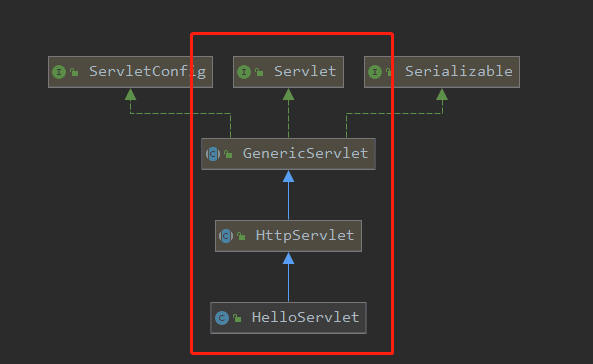

```java
public class HelloServlet extends HttpServlet {
    // 由于get和post只是请求实现的不同方式，可以相互调用，业务逻辑都一样
    @Override
    protected void doGet(HttpServletRequest req, HttpServletResponse resp) throws ServletException, IOException {
        System.out.println("进入doGet方法");

        PrintWriter writer = resp.getWriter(); // 响应流
        writer.print("Hello, Servlet!");
    }

  @Override
  protected void doPost(HttpServletRequest req, HttpServletResponse resp) throws ServletException, IOException {
    doGet(req, resp);
  }
}

```


5. 编写Servlet的映射

为什么需要映射：我们写的是Java程序，但是要通过浏览器访问，而浏览器需要连接web服务器，所以我们需要在web服务中注册我们写的Servlet，还需给它一个浏览器能够访问的路径：

```xml
<?xml version="1.0" encoding="utf-8" ?>
<web-app xmlns="http://xmlns.jcp.org/xml/ns/javaee"
         xmlns:xsi="http://www.w3.org/2001/XMLSchema-instance"
         xsi:schemaLocation="http://xmlns.jcp.org/xml/ns/javaee
                            http://xmlns.jcp.org/xml/ns/javaee/web-app_4_0.xsd"
         version="4.0"
         metadata-complete="true">
    <!--  web.xml是配置我们web的核心应用-->
    
    <!-- 注册Servlet -->
    <servlet>
        <servlet-name>hello</servlet-name>
        <servlet-class>com.andyron.servlet.HelloServlet</servlet-class>
    </servlet>
    <!-- Servlet的请求路径 -->
    <servlet-mapping>
        <servlet-name>hello</servlet-name>
        <url-pattern>/hello</url-pattern>
    </servlet-mapping>
</web-app>
```

> 注意url-pattern中`/`

6. 配置Tomcat

配置项目发布的路径


7. 启动测试

http://localhost:8081/s1/hello


### 6.3 Servlet原理

Servlet是由Web服务器调用，web服务器在受到浏览器请求之后，会：


### 6.4 Mapping问题

1. 一个Servlet可以指定一个映射路径

   ```xml
   <servlet-mapping>
     <servlet-name>hello</servlet-name>
     <url-pattern>/hello</url-pattern>
   </servlet-mapping>
   ```

   

2. 一个Servlet可以指定多个映射路径

   ```xml
   <servlet-mapping>
     <servlet-name>hello</servlet-name>
     <url-pattern>/hello</url-pattern>
   </servlet-mapping>
   <servlet-mapping>
     <servlet-name>hello</servlet-name>
     <url-pattern>/hello2</url-pattern>
   </servlet-mapping>
   <servlet-mapping>
     <servlet-name>hello</servlet-name>
     <url-pattern>/hello3</url-pattern>
   </servlet-mapping>
   <servlet-mapping>
     <servlet-name>hello</servlet-name>
     <url-pattern>/hello4</url-pattern>
   </servlet-mapping>
   ```

   

3. 一个Servlet可以指定通用映射路径

   ```xml
   <servlet-mapping>
     <servlet-name>hello</servlet-name>
     <url-pattern>/hello/*</url-pattern>
   </servlet-mapping>
   ```

4. 默认请求路径

   ```xml
   <servlet-mapping>
     <servlet-name>hello</servlet-name>
     <url-pattern>/*</url-pattern>
   </servlet-mapping>
   ```

   

5. 指定一些后缀或前缀等等...

   ```xml
   <!-- 可以自定义后缀实现请求映射
       注意点：*前面不能加项目映射的路径
       -->
   <servlet-mapping>
     <servlet-name>hello</servlet-name>
     <url-pattern>*.andy</url-pattern>
   </servlet-mapping>
   ```

   

6. 优先级问题

   指定了固有的映射路径优先级最高，如果找不到就会走默认的处理请求
   
   ```xml
     <!--404-->
     <servlet>
         <servlet-name>error</servlet-name>
         <servlet-class>com.andyron.servlet.ErrorServlet</servlet-class>
     </servlet>
     <servlet-mapping>
         <servlet-name>error</servlet-name>
         <url-pattern>/*</url-pattern>
     </servlet-mapping>
    
   ```
   
   

### 6.5 ServletContext

> 注意：配置Tomcat，war包时，去除其它项目的war，否者会被一起打包，影响速度。

web容器在启动的时候，它会为每个web程序都创建一个对应的ServletContext对象，它代表了当前的web应用；

#### 1 共享数据

在一个Servlet中保存的数据，可以在另一个Servlet中拿到


新module，servlet-02

```java
public class HelloServlet extends HttpServlet {
    @Override
    protected void doGet(HttpServletRequest req, HttpServletResponse resp) throws ServletException, IOException {

        ServletContext context = this.getServletContext();
        String username = "Andy Ron";
        context.setAttribute("username", username); // 将一个数据保存在ServletContext中
    }
}

public class GetServlet extends HttpServlet {
    @Override
    protected void doGet(HttpServletRequest req, HttpServletResponse resp) throws ServletException, IOException {
        ServletContext context = this.getServletContext();
        String username = (String)context.getAttribute("username");

        resp.setContentType("text/html");
        resp.setCharacterEncoding("utf-8");
        resp.getWriter().print("名字：" + username);
    }
}
```

```xml
<servlet>
  <servlet-name>hello</servlet-name>
  <servlet-class>com.andyron.servlet.HelloServlet</servlet-class>
</servlet>
<servlet-mapping>
  <servlet-name>hello</servlet-name>
  <url-pattern>/hello</url-pattern>
</servlet-mapping>

<servlet>
  <servlet-name>getName</servlet-name>
  <servlet-class>com.andyron.servlet.GetServlet</servlet-class>
</servlet>
<servlet-mapping>
  <servlet-name>getName</servlet-name>
  <url-pattern>/getName</url-pattern>
</servlet-mapping>
```

测试：

先调用/hello，再调用/getName，就可以获得name值


#### 2 获取初始化参数

web.xml中：

```xml
    <!-- 配置一些web应用初始化参数 -->
    <context-param>
        <param-name>url</param-name>
        <param-value>jdbc:mysql://localhost:3306/mybatis</param-value>
    </context-param>
    <servlet>
        <servlet-name>getUrl</servlet-name>
        <servlet-class>com.andyron.servlet.ServletDemo3</servlet-class>
    </servlet>
    <servlet-mapping>
        <servlet-name>getUrl</servlet-name>
        <url-pattern>/getUrl</url-pattern>
    </servlet-mapping>
```

```java
@Override
protected void doGet(HttpServletRequest req, HttpServletResponse resp) throws ServletException, IOException {
  ServletContext context = this.getServletContext();

  String url = context.getInitParameter("url");
  resp.getWriter().print(url);
}
```


#### 3 请求转发

```java
public class ServletDemo4 extends HttpServlet {
  @Override
  protected void doGet(HttpServletRequest req, HttpServletResponse resp) throws ServletException, IOException {
    System.out.println("in demo4");
    ServletContext context = this.getServletContext();    
    context.getRequestDispatcher("/getUrl").forward(req, resp);
  }
}
```

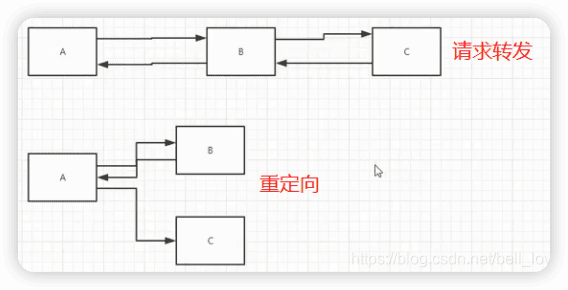

> 请求转发与重定向是不同的，前者请求地址是不变，后者就直接访问另外一个地址。

重定向：

```java
resp.sendRedirect("/s2/getUrl");
```


#### 4 读取资源文件

`Properties`

> 在java目录下新建properties文件；
>
> 在resources目录下新建properties文件；
>
> 发现都被打包到同一路径下：`classes`，俗称这个路径为classpath；
>
> 思路：需要一个文件流

```java
@Override
protected void doGet(HttpServletRequest req, HttpServletResponse resp) throws ServletException, IOException {
  ServletContext context = this.getServletContext();

  InputStream is = context.getResourceAsStream("/WEB-INF/classes/db.properties");
  Properties properties = new Properties();
  properties.load(is);
  String username = properties.getProperty("username");
  String password = properties.getProperty("password");
  resp.getWriter().print(username + ":" + password);

}
```


> 注：ServletContext上面介绍的功能之后很少使用，都会被其它替代。


### 6.6 HttpServletResponse

web服务器接收到客户端的http请求，针对这个请求，分别创建一个代表请求的`HttpServletRequest`对象和一个代表响应的`HttpServletResponse`对象；

- 如果要获取客户端请求过来的参数：找HttpServletRequest
- 如果要给客户端响应一些信息：找HttpServletResponse

#### 简单分类

负责向浏览器发送数据的方法：

```java
public ServletOutputStream getOutputStream() throws IOException;

public PrintWriter getWriter() throws IOException;
```

负责向浏览器发送响应头的方法：

```java
void setCharacterEncoding(String var1)；
void setContentLength(int var1)；
void setContentLengthLong(long var1);
void setContentType(String var1)；
void setDateHeader(String varl,long var2)
void addDateHeader(String var1,long var2)
void setHeader(String var1,String var2);
void addHeader(String var1,String var2)；
void setIntHeader(String var1,int var2);
void addIntHeader(String varl,int var2);
```

响应的状态码常量：

```java
    int SC_CONTINUE = 100;
    int SC_SWITCHING_PROTOCOLS = 101;
    int SC_OK = 200;
    int SC_CREATED = 201;
    int SC_ACCEPTED = 202;
    int SC_NON_AUTHORITATIVE_INFORMATION = 203;
    int SC_NO_CONTENT = 204;
    int SC_RESET_CONTENT = 205;
    int SC_PARTIAL_CONTENT = 206;
    int SC_MULTIPLE_CHOICES = 300;
    int SC_MOVED_PERMANENTLY = 301;
    int SC_MOVED_TEMPORARILY = 302;
    int SC_FOUND = 302;
    int SC_SEE_OTHER = 303;
    int SC_NOT_MODIFIED = 304;
    int SC_USE_PROXY = 305;
    int SC_TEMPORARY_REDIRECT = 307;
    int SC_BAD_REQUEST = 400;
    int SC_UNAUTHORIZED = 401;
    int SC_PAYMENT_REQUIRED = 402;
    int SC_FORBIDDEN = 403;
    int SC_NOT_FOUND = 404;
    int SC_METHOD_NOT_ALLOWED = 405;
    int SC_NOT_ACCEPTABLE = 406;
    int SC_PROXY_AUTHENTICATION_REQUIRED = 407;
    int SC_REQUEST_TIMEOUT = 408;
    int SC_CONFLICT = 409;
    int SC_GONE = 410;
    int SC_LENGTH_REQUIRED = 411;
    int SC_PRECONDITION_FAILED = 412;
    int SC_REQUEST_ENTITY_TOO_LARGE = 413;
    int SC_REQUEST_URI_TOO_LONG = 414;
    int SC_UNSUPPORTED_MEDIA_TYPE = 415;
    int SC_REQUESTED_RANGE_NOT_SATISFIABLE = 416;
    int SC_EXPECTATION_FAILED = 417;
    int SC_INTERNAL_SERVER_ERROR = 500;
    int SC_NOT_IMPLEMENTED = 501;
    int SC_BAD_GATEWAY = 502;
    int SC_SERVICE_UNAVAILABLE = 503;
    int SC_GATEWAY_TIMEOUT = 504;
    int SC_HTTP_VERSION_NOT_SUPPORTED = 505;
```

#### 下载文件

新建module，response


1. 要获取下载文件的路径
2. 下载的文件名是啥？
3. 设置想办法让浏览器能够支持下载我们需要的东西
4. 获取下载文件的输入流
5. 创建缓冲区
6. 获取OutputStream对象
7. 将FileOutputStream流写入到buffer缓冲区
7. 使用OutputStream将缓冲区中的数据输出到客户端！

```java
@Override
protected void doGet(HttpServletRequest req, HttpServletResponse resp) throws ServletException, IOException {
    // 1. 要获取下载文件的路径
    String realPath = "/Users/andyron/.../javaweb-02-servlet/response/target/response/WEB-INF/classes/1.jpg";
    System.out.println("下载文件的路径："+realPath);
    // 2. 下载的文件名是啥？
    String fileName = realPath.substring(realPath.lastIndexOf("\\") + 1);
    // 3. 设置想办法让浏览器能够支持(Content-Disposition)下载我们需要的东西,中文文件名URLEncoder.encode编码，否则有可能乱码
    resp.setHeader("Content-Disposition","attachment;filename="+URLEncoder.encode(fileName,"UTF-8"));
    // 4. 获取下载文件的输入流
    FileInputStream in = new FileInputStream(realPath);
    // 5. 创建缓冲区
    int len = 0;
    byte[] buffer = new byte[1024];
    // 6. 获取OutputStream对象
    ServletOutputStream out = resp.getOutputStream();
    // 7. 将FileOutputStream流写入到buffer缓冲区,使用OutputStream将缓冲区中的数据输出到客户端！
    while ((len=in.read(buffer))>0){
        out.write(buffer,0,len);
    }

    in.close();
    out.close();
}

```

```xml
<servlet>
  <servlet-name>filedown</servlet-name>
  <servlet-class>com.andyron.servlet.FileServlet</servlet-class>
</servlet>
<servlet-mapping>
  <servlet-name>filedown</servlet-name>
  <url-pattern>/down</url-pattern>
</servlet-mapping>
```


#### 验证码功能

验证码怎么来的？

- 前端实现
- 后端实现，需要到Java的图片类

```java
public class ImageServlet extends HttpServlet {
    @Override
    protected void doGet(HttpServletRequest req, HttpServletResponse resp) throws ServletException, IOException {
        // 让浏览器自动刷新
        resp.setHeader("refresh", "3");

        // 在内存中创建一个图片
        BufferedImage image = new BufferedImage(120, 40, BufferedImage.TYPE_INT_RGB);

        // 得到图片
        Graphics2D g = (Graphics2D)image.getGraphics();
        // 设置图片的背景颜色
        g.setColor(Color.white);
        g.fillRect(0, 0, 120, 40);
        // 给图片写数据
        g.setColor(Color.BLUE);
        g.setFont(new Font(null, Font.PLAIN, 20));
        g.drawString(makeNum(), 19, 25);

        // 告诉浏览器，这个请求用图片的方式打开
        resp.setContentType("image/jpg");
        // 不让浏览器缓存
        resp.setDateHeader("expires", -1);
        resp.setHeader("Cache-Control", "no-cache");
        resp.setHeader("Pragma", "no-cache");

        // 把图片写给浏览器
        ImageIO.write(image, "jpg", resp.getOutputStream());

    }

    // 生成随机数
    private String makeNum() {
        Random random = new Random();
        String num = random.nextInt(9999999) + "";
        StringBuffer sb = new StringBuffer();
        for (int i = 0; i < 7 - num.length(); i++) {
            sb.append(0); // 长度不足7位的用0来填充
        }
        return sb.toString() + num;
    }

    @Override
    protected void doPost(HttpServletRequest req, HttpServletResponse resp) throws ServletException, IOException {
        doGet(req, resp);
    }
}
```

```xml
    <servlet>
        <servlet-name>imageServlet</servlet-name>
        <servlet-class>com.andyron.servlet.ImageServlet</servlet-class>
    </servlet>
    <servlet-mapping>
        <servlet-name>imageServlet</servlet-name>
        <url-pattern>/img</url-pattern>
    </servlet-mapping>
```


#### 实现重定向


一个web资源B受到客户端A请求后，它会通知客户端A去访问另一个web资源C，这个过程叫重定向。

常见场景：

- 用户登录

```java
public void sendRedirect(String location) throws IOException;
```

```java
@Override
protected void doGet(HttpServletRequest req, HttpServletResponse resp) throws ServletException, IOException {


  resp.sendRedirect("/response_war/img");

  // 等价于
  //        resp.setHeader("Location", "/response_war/img");
  //        resp.setStatus(302);

}
```

> 重定向和转发？
>
> - 页面都会实现跳转
>
> - 重定向地址栏会发生变化（302），转发不会（307）。
>
> 


### 6.7 HttpServletRequest

用户通过HTTP协议访问服务器，HTTP请求中的所有信息会被封装到HttpServletRequest中，通过这个对象中的方法，可以后的客户端的所有信息。

获取前端传递的参数：

```java
String getParameter(String s);
String[] getParameterValues(String s);
```


#### 模拟登录2

在index.jsp中输入登录信息，然后跳转servlet`RequestTest`（/login），获得登录信息后打印，最后通过重定向到成功页面

新建模块servlet-request

index.jsp

```jsp
<%@ page contentType="text/html;charset=UTF-8" language="java" %>
<html>
<head>
  <title>登录</title>
</head>
<body>
<h1>登录</h1>
<div style="text-align: center">
  <form action="${pageContext.request.contextPath}/login" method="post">
    用户名：<input type="text" name="username"/><br/>
    密码：<input type="password" name="pwd"/><br/>
    爱好：
    <input type="checkbox" name="hobbies" value="看电影"/>看电影
    <input type="checkbox" name="hobbies" value="阅读"/>阅读
    <input type="checkbox" name="hobbies" value="爬山"/>爬山
    <input type="checkbox" name="hobbies" value="摄影"/>摄影
    <br/>
    <input type="submit"/>
  </form>
</div>

</body>
</html>
```

web.xml

```xml
<servlet>
  <servlet-name>login</servlet-name>
  <servlet-class>LoginServlet</servlet-class>
</servlet>
<servlet-mapping>
  <servlet-name>login</servlet-name>
  <url-pattern>/login</url-pattern>
</servlet-mapping>
```


```java
@Override
protected void doGet(HttpservletRequest req. HttpservletResponse resp) throws ServletException, IOException {

	req. setcharacterEncoding("utf-8");
	resp.setcharacterEncoding("utf-8");
	String username = req.getParameter("username");
	String password = req.getParameter("password");
	String[] hobbys = req.getParameterValues("hobbys");
	System.out.println("==========");
	//后台接收中文乱码问题
	System. out.println(username);
	System. out.println(password);
	System. out.println(Arrays.tostring(hobbys));
	System. out.println("============");
	system. out.println(req.getContextPath());
	//通过请求转发
	//这里的/代表当前的web应用
	req.getRequestDispatcher("/success.jsp").forward(req,resp);
}

```


## 7、Cookie、Session

### 7.1 会话

**会话**：用户打开一个浏览器，点击了很多超链接，访问多个web资源，关闭浏览器，这个过程可以称之为会话；

**有状态会话**：一个同学来过教室，下次再来教室，我们会知道这个同学，曾经来过，称之为有状态会话；
你能怎么证明你是西开的学生？
你 西开
1.发票	西开给你的发票
2.学校登记	西开标记你来过了

**一个网站，怎么证明你来过？**

客户端   服务端
1.服务端给客户端一个信件，客户端下次访问服务端带上信件就可以了；cookie 

2.服务器登记你来过了，下次你来的时候我来匹配你；seesion

### 7.2 保存会话的两种技术

cookie：客服端技术（响应，请求）

session：服务器技术，可以用来保存用户的会话信息


常用场景：网站登录之后，下次不要再登录


`javax.servlet.http.Cookie`


### 7.3、Cookie

1. 从请求中拿到cookie信息
2. 服务器响应给客户端cookie

方法小结：

```java
Cookie[] cookies = req.getCookies(); //获得Cookie
cookie.getName(); //获得cookie中的key
cookie.getValue(); //获得cookie中的vlaue
new Cookie("lastLoginTime", System.currentTimeMillis()+""); //新建一个cookie
cookie.setMaxAge(24*60*60); //设置cookie的有效期
resp.addCookie(cookie); //响应给客户端一个cookie
```

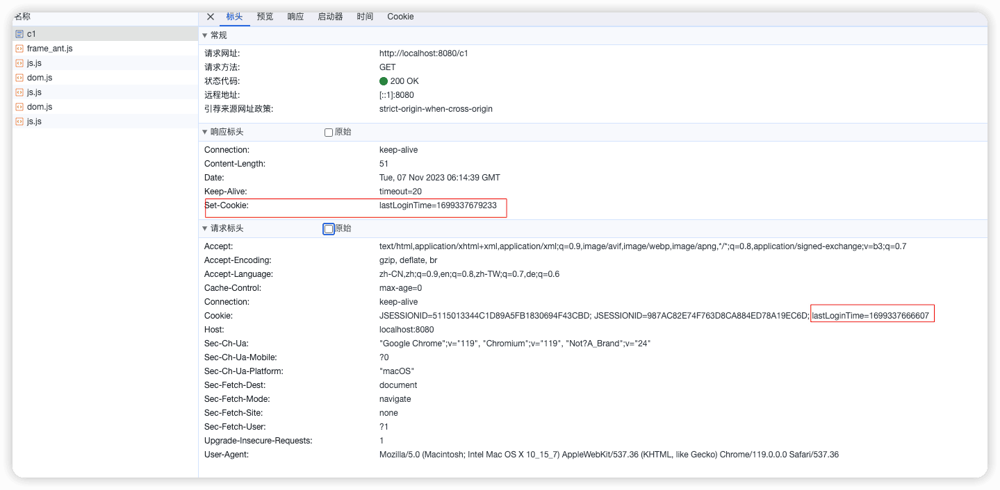

设置过期时间后：


cookie：一般会保存在本地的 用户目录下 appdata；


一个网站cookie是否存在上限？

- 一个Cookie只能保存一个信息；
- 一个web站点可以给浏览器发送多个cookie，最多存放20个cookie；
- Cookie大小有限制4kb；
- 300个cookie浏览器上限

两种删除Cookie方式；

- 不设置有效期，关闭浏览器，自动失效；

- 设置有效期时间为 0 ；


编码解码：

```java
URLEncoder.encode("秦疆","utf-8")
URLDecoder.decode(cookie.getValue(),"UTF-8")
```

### 7.4、Session（重点）


什么是Session：

- 服务器会给每一个用户（浏览器）创建一个Seesion对象；
- 一个Seesion独占一个浏览器，只要浏览器没有关闭，这个Session就存在；

- 用户登录之后，整个网站它都可以访问！–> 保存用户的信息；保存购物车的信息
- ……
  

Session和cookie的区别：

- Cookie是把用户的数据写给用户的浏览器，浏览器保存 （可以保存多个）
- Session把用户的数据写到用户独占Session中，服务器端保存 （保存重要的信息，减少服务器资源的浪费）
- Session对象由服务创建；

使用场景：

- 保存一个登录用户的信息；
- 购物车信息；
- 在整个网站中经常会使用的数据，我们将它保存在Session中；

使用Session：

```java
package com.andyron.servlet;

import javax.servlet.ServletException;
import javax.servlet.http.HttpServlet;
import javax.servlet.http.HttpServletRequest;
import javax.servlet.http.HttpServletResponse;
import javax.servlet.http.HttpSession;
import java.io.IOException;

/**
 * @author andyron
 **/
public class SessionDemo01 extends HttpServlet {
    @Override
    protected void doGet(HttpServletRequest req, HttpServletResponse resp) throws ServletException, IOException {
        //解决乱码问题
        req.setCharacterEncoding("UTF-8");
        resp.setCharacterEncoding("UTF-8");
        resp.setContentType("text/html;charset=utf-8");

        // 得到Session
        HttpSession session = req.getSession();
        // 给Session中存东西
        session.setAttribute("name", "andy");
        // 获取Session的ID
        String sessionId = session.getId();

        // 判断Session是不是新创建
        if (session.isNew()){
            resp.getWriter().write("session创建成功,ID:"+sessionId);
        }else {
            resp.getWriter().write("session以及在服务器中存在了,ID:"+sessionId);
        }
    }
}


```

Session创建的时候做了什么事情：在客户端存储了一个名为JSESSIONID的cookie，相当于下面的操作：

```java
Cookie cookie = new Cookie("JSESSIONID",sessionId);
resp.addCookie(cookie);
```


在另外一个servlet中获取上面session种存储的name值：

```java
public class SessionDemo02 extends HttpServlet {
    @Override
    protected void doGet(HttpServletRequest req, HttpServletResponse resp) throws ServletException, IOException {
        //解决乱码问题
        req.setCharacterEncoding("UTF-8");
        resp.setCharacterEncoding("UTF-8");
        resp.setContentType("text/html;charset=utf-8");

        // 得到Session
        HttpSession session = req.getSession();

        String name = (String) session.getAttribute("name");

        System.out.println(name);
    }
}
```


可以手动注销session，注销后会自动生成新的session（Cookie中的JSESSIONID变化了）

```java
public class SessionDemo03 extends HttpServlet {
    @Override
    protected void doGet(HttpServletRequest req, HttpServletResponse resp) throws ServletException, IOException {
        HttpSession session = req.getSession();
        // 手动注销Session
        session.invalidate();
    } 
}
```


也可以web.xml中配置session自动过期时间:

```xml
<!--设置Session默认的失效时间-->
<session-config>
    <!--1以分钟为单位-->
    <session-timeout>1</session-timeout>
</session-config>
```


#### session和cookie的区别

- cookie是把用户的数据写给用户的浏览器，浏览器保存（可以保存多个）
- session把用户的数据写到用户独占Session中，服务器端保存（保存重要的信息，减少服务器资源的浪费）
- Session对象由服务创建；


Session使用场景：

- 保存一个登录用户的信息;
- 购物车信息;
- 在整个网站中经常会使用的数据，我们将它保存在Session中;|


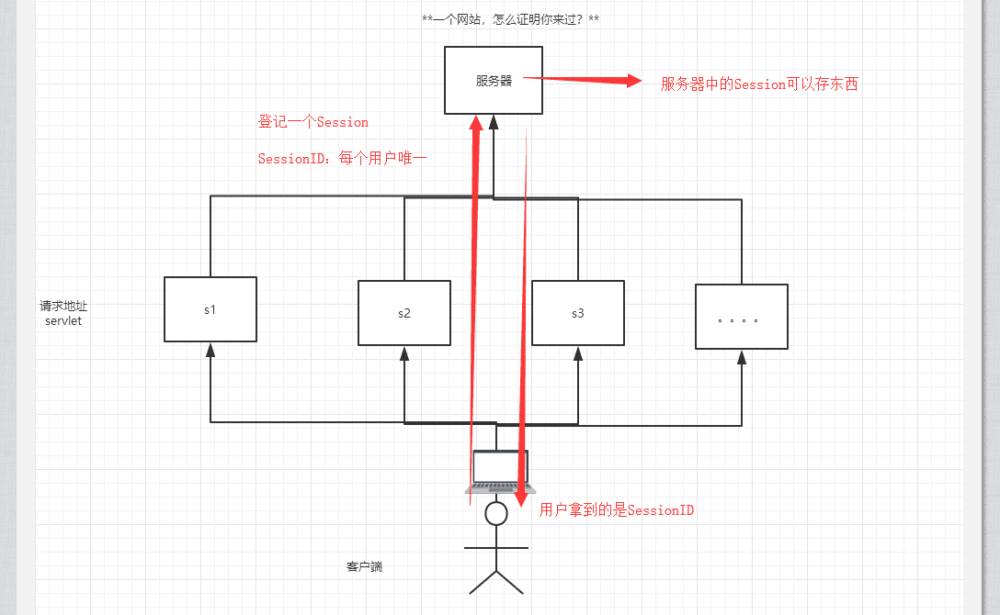

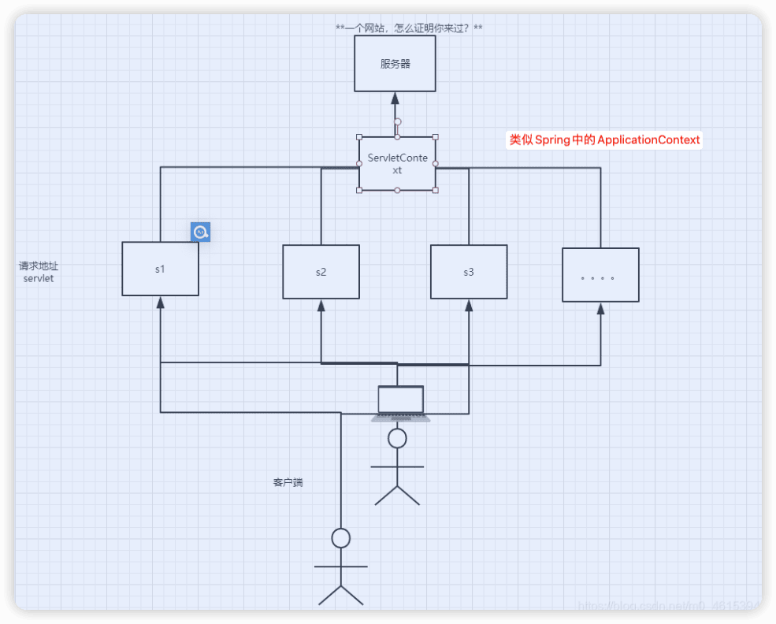

## 8、JSP

### 8.1 什么 JSP

Java Server Pages： Java服务器端页面，也和Servlet一样，用于动态Web技术！

最大的特点：写JSP就像在写HTML

区别：

- HTML只给用户提供静态的数据

- JSP页面中可以嵌入Java 代码，为用户提供动态数据；

### 8.2 JSP 原理

服务器内部工作：
Tomcat 中有一个 work 工作目录；
IDEA 中使用 Tomcat 的会在 IDEA 中 Tomcat 中生产一个 work 目录

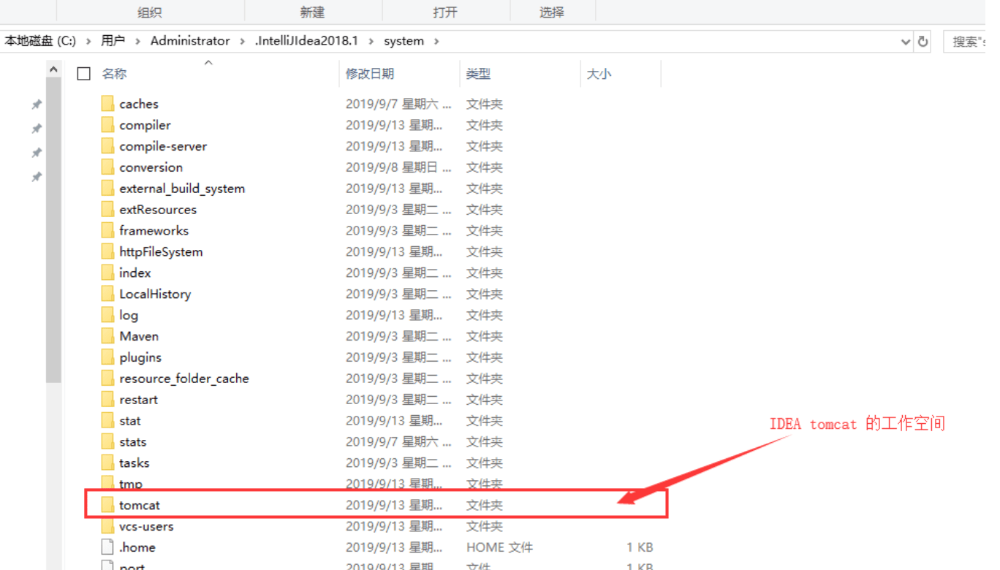


发现页面转变成了 Java 程序


浏览器向服务器发送请求，不管访问什么资源，起始都是在访问 Servlet ！

==JSP最终也会被转换成一个Java类！== ==JSP本质上就是一个Servlet。==

```java
//初始化
  public void _jspInit() {
      
  }
//销毁
  public void _jspDestroy() {
  }
//JSPService
  public void _jspService(.HttpServletRequest request,HttpServletResponse response)

```

1. 判断请求
2. 内置一些对象

```java
final javax.servlet.jsp.PageContext pageContext;  //页面上下文
javax.servlet.http.HttpSession session = null;    //session
final javax.servlet.ServletContext application;   //applicationContext
final javax.servlet.ServletConfig config;         //config
javax.servlet.jsp.JspWriter out = null;           //out
final java.lang.Object page = this;               //page：当前
HttpServletRequest request                        //请求
HttpServletResponse response                      //响应
```

3. 输出页面前增加的代码

```java
response.setContentType("text/html");       //设置响应的页面类型
pageContext = _jspxFactory.getPageContext(this, request, response,
                                          null, true, 8192, true);
_jspx_page_context = pageContext;
application = pageContext.getServletContext();
config = pageContext.getServletConfig();
session = pageContext.getSession();
out = pageContext.getOut();
_jspx_out = out;

```

4. 以上这些对象可直接在 JSP 中使用

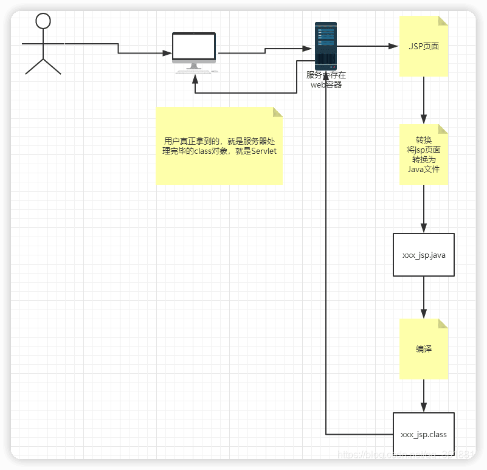

在JSP页面中；

只要是 JAVA代码就会原封不动的输出；

如果是HTML代码，就会被转换为：

```
out.write("<html>\r\n");
```

这样的格式，输出到前端！

### 8.3 JSP 基础语法

JSP 表达式

```xml
  <%--JSP表达式
  作用：用来将程序的输出，输出到客户端
  <%= 变量或者表达式%>
  --%>
  <%= new java.util.Date()%>
12345
```

**JSP 脚本片段**

```xml
  <%--jsp脚本片段--%>
  <%
    int sum = 0;
    for (int i = 1; i <=100 ; i++) {
      sum+=i;
    }
    out.println("<h1>Sum="+sum+"</h1>");
  %>
12345678
```

**脚本片段的再实现**

```xml
  <%
    int x = 10;
    out.println(x);
  %>
  <p>这是一个JSP文档</p>
  <%
    int y = 2;
    out.println(y);
  %>

  <hr>


  <%--在代码嵌入HTML元素--%>
  <%
    for (int i = 0; i < 5; i++) {
  %>
    <h1>Hello,World  <%=i%> </h1>
  <%
    }
  %>
123456789101112131415161718192021
```

**JSP 声明**

```xml
  <%!
    static {
      System.out.println("Loading Servlet!");
    }

    private int globalVar = 0;

    public void kuang(){
      System.out.println("进入了方法Kuang！");
    }
  %>
1234567891011
```

JSP 声明： 会被编译到 JSP 生成 Java 的类中！ 其他的，就会被生成 _jspService 方法中！

```
<%%>
<%=%>
<%!%>

<%--注释--%>
12345
```

JSP 的注释，不会在客户端显示，HTML就会！

### 8.4 JSP指令

```xml
<%@page args.... %>
<%@include file=""%>

<%--@include会将两个页面合二为一--%>

<%@include file="common/header.jsp"%>
<h1>网页主体</h1>

<%@include file="common/footer.jsp"%>

<hr>


<%--jSP标签
    jsp:include：拼接页面，本质还是三个
    --%>
<jsp:include page="/common/header.jsp"/>
<h1>网页主体</h1>
<jsp:include page="/common/footer.jsp"/>
12345678910111213141516171819
```

### 8.5 九大内置对象

- PageContext 存东西
- Request 存东西
- Response
- Session 存东西
- Application 【ServletContext】 存东西
- config 【ServletConfig】
- out
- page
- exception

```java
pageContext.setAttribute("name1","秦疆1号"); //保存的数据只在一个页面中有效
request.setAttribute("name2","秦疆2号"); //保存的数据只在一次请求中有效，请求转发会携带这个数据
session.setAttribute("name3","秦疆3号"); //保存的数据只在一次会话中有效，从打开浏览器到关闭浏览器
application.setAttribute("name4","秦疆4号");  //保存的数据只在服务器中有效，从打开服务器到关闭服务器
1234
```

request：客户端向服务器发送请求，产生的数据，用户看完就没用了，比如：新闻，用户看完没用的！

session：客户端向服务器发送请求，产生的数据，用户用完一会还有用，比如：购物车；

application：客户端向服务器发送请求，产生的数据，一个用户用完了，其他用户还可能使用，比如：聊天数据；

### 8.6 JSP标签、JSTL标签、EL表达式

```xml
<!-- JSTL表达式的依赖 -->
<dependency>
    <groupId>javax.servlet.jsp.jstl</groupId>
    <artifactId>jstl-api</artifactId>
    <version>1.2</version>
</dependency>
<!-- standard标签库 -->
<dependency>
    <groupId>taglibs</groupId>
    <artifactId>standard</artifactId>
    <version>1.1.2</version>
</dependency>
123456789101112
```

- EL 表达式： `${}`

  - 获取数据

  - 执行运算

  - 获取 Web 开发的常用对象


- JSP 标签

```xml
<%--jsp:include--%>

<%--
http://localhost:8080/jsptag.jsp?name=kuangshen&age=12
--%>

<jsp:forward page="/jsptag2.jsp">
    <jsp:param name="name" value="kuangshen"></jsp:param>
    <jsp:param name="age" value="12"></jsp:param>
</jsp:forward>
12345678910
```

- **JSTL表达式**

JSTL 标签库的使用就是为了弥补 HTML 标签的不足；它自定义许多标签，可以供我们使用，标签的功能和 Java 代码一样！

- **格式化标签**

- **SQL标签**

- **XML 标签**

- **核心标签** （掌握部分）

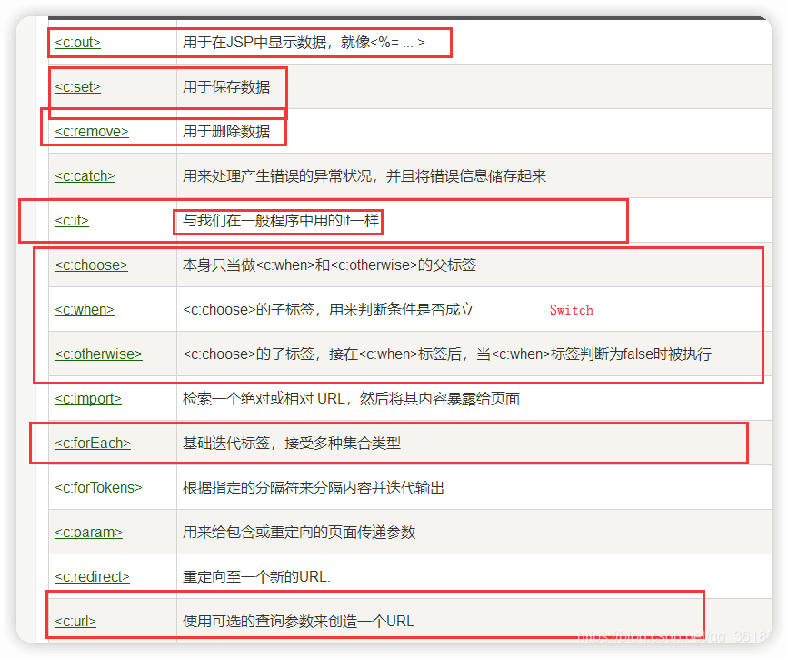


- **JSTL标签库使用步骤**

  - 引入对应的 taglib

  - 使用其中的方法

  - **在 Tomcat 也需要引入 JSTL 的包，否则会报错：JSTL 解析错误**


- `c: if`

```xml
<head>
    <title>Title</title>
</head>
<body>


<h4>if测试</h4>

<hr>

<form action="coreif.jsp" method="get">
    <%--
    EL表达式获取表单中的数据
    ${param.参数名}
    --%>
    <input type="text" name="username" value="${param.username}">
    <input type="submit" value="登录">
</form>

<%--判断如果提交的用户名是管理员，则登录成功--%>
<c:if test="${param.username=='admin'}" var="isAdmin">
    <c:out value="管理员欢迎您！"/>
</c:if>

<%--自闭合标签--%>
<c:out value="${isAdmin}"/>

</body>
12345678910111213141516171819202122232425262728
```

- `c:choose c:when`

```xml
<body>

<%--定义一个变量score，值为85--%>
<c:set var="score" value="55"/>

<c:choose>
    <c:when test="${score>=90}">
        你的成绩为优秀
    </c:when>
    <c:when test="${score>=80}">
        你的成绩为一般
    </c:when>
    <c:when test="${score>=70}">
        你的成绩为良好
    </c:when>
    <c:when test="${score<=60}">
        你的成绩为不及格
    </c:when>
</c:choose>

</body>
123456789101112131415161718192021
```

- `c:forEach`

```xml
<%

    ArrayList<String> people = new ArrayList<>();
    people.add(0,"张三");
    people.add(1,"李四");
    people.add(2,"王五");
    people.add(3,"赵六");
    people.add(4,"田六");
    request.setAttribute("list",people);
%>


<%--
var , 每一次遍历出来的变量
items, 要遍历的对象
begin,   哪里开始
end,     到哪里
step,   步长
--%>
<c:forEach var="people" items="${list}">
    <c:out value="${people}"/> <br>
</c:forEach>

<hr>

<c:forEach var="people" items="${list}" begin="1" end="3" step="1" >
    <c:out value="${people}"/> <br>
</c:forEach>
```


## 9、JavaBean

实体类

JavaBean有特定的写法：

- 必须要有一个无参构造
- 属性必须私有化
- 必须有对应的get/set方法

一般用来和数据库的字段做映射ORM；

ORM：对象关系映射

- 表 -> 类
- 字段 -> 属性
- 行记录 -> 对象

## 10 MVC

 Model view Controller 模型.视图.控制器

### 以前

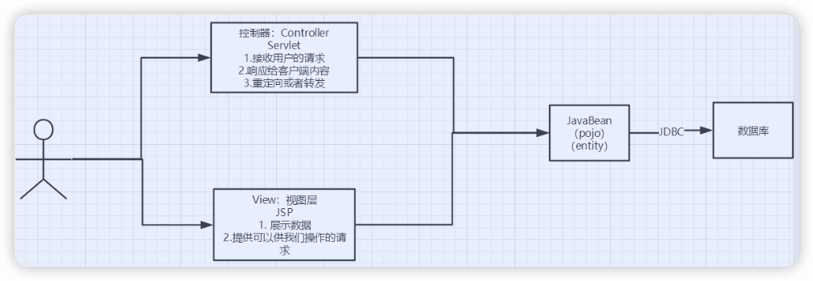

用户直接访问控制层，控制层就可以直接操作数据库

> servlet--CRUD-->数据库
> 弊端：程序十分臃肿，不利于维护  
> servlet的代码中：处理请求.响应.视图跳转.处理JDBC.处理业务代码.处理逻辑代码
>
> 架构：没有什么是加一层解决不了的！
> 程序猿调用
> |
> JDBC
> |
> Mysql Oracle SqlServer ....

### MVC三层架构

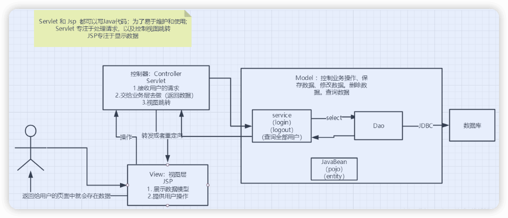

Model

- 业务处理 ：业务逻辑（Service）
- 数据持久层：CRUD （Dao）

View

- 展示数据
- 提供链接发起Servlet请求 （a，form，img…）

Controller （Servlet）

- 接收用户的请求 ：（req：请求参数.Session信息….）
- 交给业务层处理对应的代码
- 控制视图的跳转

> 登录--->接收用户的登录请求--->处理用户的请求（获取用户登录的参数，username，password）---->交给业务层处理登录业务（判断用户名密码是否正确：事务）--->Dao层查询用户名和密码是否正确-->数据库


## 11、过滤器Filter（重点）

Filter：过滤器，用来过滤网站的数据；

- 处理中文乱码
- 登录验证

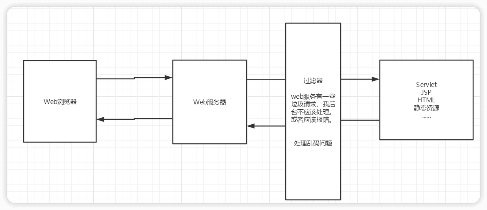


Filter 开发步骤：

1. 导包
2. 编写过滤器

```java
public class CharacterEncodingFilter implements Filter {

    //初始化：web服务器启动，就以及初始化了，随时等待过滤对象出现！
    public void init(FilterConfig filterConfig) throws ServletException {
        System.out.println("CharacterEncodingFilter初始化");
    }

    //Chain : 链
    /*
    1. 过滤中的所有代码，在过滤特定请求的时候都会执行
    2. 必须要让过滤器继续同行
        chain.doFilter(request,response);
     */
    public void doFilter(ServletRequest request, ServletResponse response, FilterChain chain) throws IOException, ServletException {
        request.setCharacterEncoding("utf-8");
        response.setCharacterEncoding("utf-8");
        response.setContentType("text/html;charset=UTF-8");

        System.out.println("CharacterEncodingFilter执行前....");
        chain.doFilter(request,response); //让我们的请求继续走，如果不写，程序到这里就被拦截停止！
        System.out.println("CharacterEncodingFilter执行后....");
    }

    //销毁：web服务器关闭的时候，过滤会销毁
    public void destroy() {
        System.out.println("CharacterEncodingFilter销毁");
    }
}
```

3. 在web.xml中配置Filter

```xml
<filter>
    <filter-name>CharacterEncodingFilter</filter-name>
    <filter-class>com.kuang.filter.CharacterEncodingFilter</filter-class>
</filter>
<filter-mapping>
    <filter-name>CharacterEncodingFilter</filter-name>
    <!--只要是 /servlet的任何请求，会经过这个过滤器-->
    <url-pattern>/servlet/*</url-pattern>
    <!--<url-pattern>/*</url-pattern>-->
</filter-mapping>
```


## 12、监听器

监听器在Javaweb开发中很少使用

实现一个监听器的接口；（有n种监听器）

1. 编写一个监听器。实现监听器的接口…

```java
//统计网站在线人数 ： 统计session
public class OnlineCountListener implements HttpSessionListener {

    //创建session监听： 看你的一举一动
    //一旦创建Session就会触发一次这个事件！
    public void sessionCreated(HttpSessionEvent se) {
        ServletContext ctx = se.getSession().getServletContext();

        System.out.println(se.getSession().getId());

        Integer onlineCount = (Integer) ctx.getAttribute("OnlineCount");

        if (onlineCount==null){
            onlineCount = new Integer(1);
        }else {
            int count = onlineCount.intValue();
            onlineCount = new Integer(count+1);
        }

        ctx.setAttribute("OnlineCount",onlineCount);

    }

    //销毁session监听
    //一旦销毁Session就会触发一次这个事件！
    public void sessionDestroyed(HttpSessionEvent se) {
        ServletContext ctx = se.getSession().getServletContext();

        Integer onlineCount = (Integer) ctx.getAttribute("OnlineCount");

        if (onlineCount==null){
            onlineCount = new Integer(0);
        }else {
            int count = onlineCount.intValue();
            onlineCount = new Integer(count-1);
        }

        ctx.setAttribute("OnlineCount",onlineCount);

    }


    /*
    Session销毁：
    1. 手动销毁  getSession().invalidate();
    2. 自动销毁
     */
}
```

2. web.xml中注册监听器

   ```xml
   <!--注册监听器-->
   <listener>
       <listener-class>com.kuang.listener.OnlineCountListener</listener-class>
   </listener>
   1234
   ```

3. 看情况是否使用！

## 13、过滤器、监听器常见应用

**监听器：GUI编程中经常使用；**

```java
public class TestPanel {
    public static void main(String[] args) {
        Frame frame = new Frame("中秋节快乐");  //新建一个窗体
        Panel panel = new Panel(null); //面板
        frame.setLayout(null); //设置窗体的布局

        frame.setBounds(300,300,500,500);
        frame.setBackground(new Color(0,0,255)); //设置背景颜色

        panel.setBounds(50,50,300,300);
        panel.setBackground(new Color(0,255,0)); //设置背景颜色

        frame.add(panel);

        frame.setVisible(true);

        //监听事件，监听关闭事件
        frame.addWindowListener(new WindowAdapter() {
            @Override
            public void windowClosing(WindowEvent e) {
                super.windowClosing(e);
            }
        });

    }
}
```

用户登录之后才能进入主页！用户注销后就不能进入主页了！

1. 用户登录之后，向Sesison中放入用户的数据
2. 进入主页的时候要判断用户是否已经登录；要求：在过滤器中实现！

```java
HttpServletRequest request = (HttpServletRequest) req;
HttpServletResponse response = (HttpServletResponse) resp;

if (request.getSession().getAttribute(Constant.USER_SESSION)==null){
    response.sendRedirect("/error.jsp");
}

chain.doFilter(request,response);

```


## 14、JDBC

Java Database Connectivity

需要jar包的支持：

- java.sql
- javax.sql
- mysql-conneter-java… 连接驱动（必须要导入）

**数据库**

```sql
USE jdbc;
create table users(
	id Int primary key,
  `name` varchar(40),
  `password` varchar(40),
  `email` varchar(60),
   birthday date
);

Insert into users(id, `name`, `password`,email, birthday)
values(1, '张三', '123456','zs@163.com','2000-01-01');
Insert into users(id, `name`, `password`,email, birthday)
values(2, '李四', '123456','ls@163.com','2001-01-01');
Insert into users(id, `name`, `password`,email, birthday)
values(3, '王五', '123456','ww@163.com','2002-01-01');
```

导入依赖

```xml
<dependency>
  <groupId>mysql</groupId>
  <artifactId>mysql-connector-java</artifactId>
  <version>8.0.21</version>
</dependency>
```

**JDBC固定六步骤**：

1. 加载驱动
2. 链接数据库
3.  得到想数据库发送SQL的对象：Statement
4. 编写SQL
5. 执行SQL
6. 关闭连接

```java
String url = "jdbc:mysql://localhost:3306/jdbc?useUnicode=true&characterEncoding=utf-8";
String username = "root";
String password = "iop654321";

// 1 加载驱动
Class.forName("com.mysql.cj.jdbc.Driver");
// 2 链接数据库，connection相当于代表数据库
Connection connection = DriverManager.getConnection(url, username, password);
// 3 向数据库发送SQL的对象Statement或PreparedStatement（安全的，预编译），用它来做crud
Statement statement = connection.createStatement();
// 4 编写SQL
String sql = "select * from users";
// 5 执行查询SQL，返回一个ResultSet：结果集
ResultSet rs = statement.executeQuery(sql);
while (rs.next()) {
  System.out.println("id=" + rs.getObject("id"));
  System.out.println("name=" + rs.getObject("name"));
  System.out.println("password=" + rs.getObject("password"));
  System.out.println("email=" + rs.getObject("email"));
  System.out.println("birthday=" + rs.getObject("birthday"));
// 6 关闭链接，释放资源（一点要做）。先开的后关闭
rs.close();
statement.close();
connection.close();
```

预编译SQL：

```java
String url = "jdbc:mysql://localhost:3306/jdbc?useUnicode=true&characterEncoding=utf-8";
String username = "root";
String password = "iop654321";

// 1 加载驱动
Class.forName("com.mysql.cj.jdbc.Driver");
// 2 链接数据库，connection相当于代表数据库
Connection connection = DriverManager.getConnection(url, username, password);

// 3 编写SQL
String sql = "insert into users(id, name, password, email, birthday) VALUES (?,?,?,?,?)";

// 4 预编译
PreparedStatement preparedStatement = connection.prepareStatement(sql);
preparedStatement.setInt(1,4);  // 给第一个占位符？赋值
preparedStatement.setString(2, "王麻子");
preparedStatement.setString(3, "wmz12345");
preparedStatement.setString(4, "wmz@163.com");
preparedStatement.setDate(5, new Date(new java.util.Date().getTime()));

// 5 执行SQL
int i = preparedStatement.executeUpdate();
if (i>0) {
  System.out.println("插入成功");
}
// 6 关闭链接，释放资源（一点要做）。先开的后关闭
preparedStatement.close();
connection.close();
```

**事务**

要么成功，要么失败。

ACID原则：保证数据的安全。

> 开启事务
> 事务提交 commit()
> 事务回滚 rollback()
> 关闭事务

事务一旦提交就没法回滚了。

```sql
create table account(
	id int primary key auto_increment,
  `name` varchar(40),
   money float
);
insert into account(name, money) VALUE('A', 1000);
insert into account(name, money) VALUE('B', 1000);
insert into account(name, money) VALUE('C', 1000);
```

```sql
start transaction ; #开启事务

update account set money = money - 100 where name = 'A';
update account set money = money + 100 where name = 'B';

rollback ;
commit ;
```

```java
String url = "jdbc:mysql://localhost:3306/jdbc?useUnicode=true&characterEncoding=utf-8";
String username = "root";
String password = "iop654321";

Connection connection = null;

try {
  // 1 加载驱动
  Class.forName("com.mysql.cj.jdbc.Driver");
  // 2 链接数据库，connection相当于代表数据库
  connection = DriverManager.getConnection(url, username, password);

  // 3 通知数据库开启事务，false表示开启
  connection.setAutoCommit(false);

  String sql1 = "update account set money = money - 100 where name = 'A'";
  connection.prepareStatement(sql1).executeUpdate();

  // 制造错误
  int i = 1/0;

  String sql2 = "update account set money = money + 100 where name = 'B'";
  connection.prepareStatement(sql2).executeUpdate();

  connection.commit(); // 两条SQL都提交成功，就提交事务
  System.out.println("success");

} catch (Exception e) {
  // 如果出现异常通知数据库回滚事务
  try {
    connection.rollback();
    System.out.println("rollback");
  } catch (SQLException ex) {
    ex.printStackTrace();
  }
} finally {
  try {
    connection.close();
  } catch (SQLException e) {
    e.printStackTrace();
  }
}
```


## 15、超市订单管理系统smbms

Supermarket bill managing system

```
smbms
	登录注销
	用户管理
	订单管理
	供应商管理
```

### 数据库创建

### 项目搭建

1. 新建maven web项目，用模板方式。

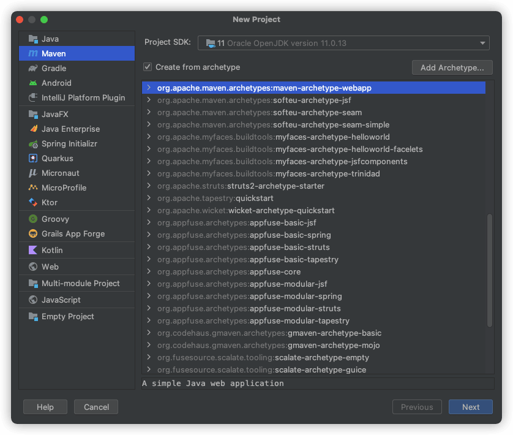

web.xml （可从Tomcat中拷贝）

```xml
<?xml version="1.0" encoding="UTF-8"?>
<web-app xmlns="https://jakarta.ee/xml/ns/jakartaee"
         xmlns:xsi="http://www.w3.org/2001/XMLSchema-instance"
         xsi:schemaLocation="https://jakarta.ee/xml/ns/jakartaee
                      https://jakarta.ee/xml/ns/jakartaee/web-app_5_0.xsd"
         version="5.0"
         metadata-complete="true">
  
</web-app>
```

新建`java`目录作为java源文件根目录；新建`resources`目录作为资源目录。

2. 配置Tomcat

3. 测试运行

4. 导入jar包

5. 创建项目包结构

6. 编写实体类。ORM映射：表-类映射

7. 编写基础公共类

   - 数据库配置文件

   - 编写数据库的公共类

   - 字符编码过滤器

     ```java
     public class CharacterEncodingFilter implements Filter {
         @Override
         public void init(FilterConfig filterConfig) throws ServletException {
         }
     
         @Override
         public void doFilter(ServletRequest request, ServletResponse response, FilterChain chain) throws IOException, ServletException {
             request.setCharacterEncoding("UTF-8");
             response.setCharacterEncoding("UTF-8");
             // 过滤器放行
             chain.doFilter(request, response);
         }
     
         @Override
         public void destroy() {
     
         }
     }
     ```

     ```xml
     		<filter>
             <filter-class>com.andyron.filter.CharacterEncodingFilter</filter-class>
             <filter-name>CharacterEncodingFilter</filter-name>
         </filter>
         <filter-mapping>
             <filter-name>CharacterEncodingFilter</filter-name>
             <url-pattern>/*</url-pattern>
         </filter-mapping>
     ```

     

8. 导入静态资源
9. 编写servlet
10. 注册servlet

p31🔖


## 16、文件上传   

2.使用类介绍

【文件上传的注意事项】

1. 为保证服务器安全，上传文件应该放在外界无法直接访问的目录下，比如放于WEB-INF目录下。 
2. 为防止文件覆盖的现象发生，要为上传文件产生一个唯一的文件名
3. 要限制上传文件的最大值，
4. 可以限制上传文件的类型，在收到上传文件名时，判断后缀名是否合法。

【需要用到的类详解】
`ServletFileUpload`负责处理上传的文件数据，并将表单中每个输入项封装成一个`Fileltem`对象，在使用ServletFileUpload对象解析请求时需要`Dis kFileltemFactory`对象。

所以，我们需要在进行解析工作前构造好DiskFileltemFactory对象，通过ServletfFileUpload对象的构造方法或setFileltem Factory()方法设置ServletFileUpload对象的fileltemFactory属性。

 

🔖p39 54min  项目报错，可能是包导入的问题


## 17 邮件发送


