Java Web
----------

[【狂神说Java】JavaWeb入门到实战](https://www.bilibili.com/video/BV12J411M7Sj)

JavaWeb是指所有通过Java语言编写可以通过浏览器访问的程序总称。

## 1、基本概念

Web开发

- web，网页
- 静态web
  - html、css
  - 提供给所有人看的数据始终不会发生变化
- 动态web
  - 提供给所有人看的数据始终会发生变化，每个人在不同时间，不同的地点看到的信息各不相同
  - 技术栈：Servlet/JSP，ASP，PHP

在Java中，动态web资源开发的技术统称为Java Web。

### web应用程序

web应用程序：可以提供浏览器访问的程序。


### 静态web

缺点：

- web不可以动态更新，所有用户看到的都是同一个页面
- 无法和数据库交互（数据无法持久化，用户无法交互）


### 动态web

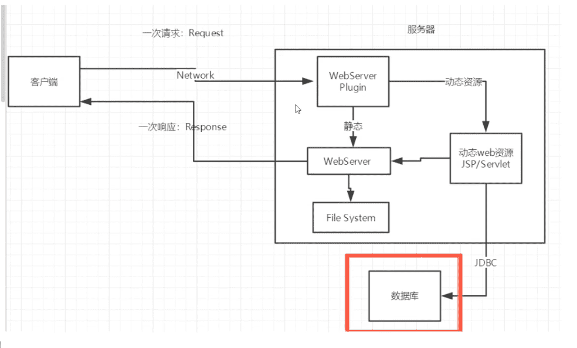


新手村 -> 魔鬼训练（分析原理，看源码）-> PK场

## 2、web服务器

ASP

- 微软，国内最早流行的
- 在HTML中嵌入VB的脚本
- 维护成本高
- C#
- IIS

PHP

JSP/Servlet：

- Sun公司主推的B/S架构（B/S浏览器和服务器，C/S客户端和服务器）
- 可以承载三高（高并发、高可用、高性能）带来的影响

### web服务器

服务器是一种被动的操作，用来处理用户的一些请求和给用户一些响应信息。

**IIS**

**Tomcat**


## 3、Tomcat

[官网](https://tomcat.apache.org/)

实际上Tomcat是Apache服务器的扩展，但运行时它是独立运行的，所以当你运行tomcat 时，它实际上作为一个与Apache 独立的进程单独运行的。

当配置正确时，Apache 为HTML页面服务，而Tomcat 实际上运行JSP 页面和Servlet。

Tomcat本身是JAVA程序。


### 安装、启动

下载解压即可，详细见[Mac下安装Tomcat及配置](https://www.jianshu.com/p/87121d912d10)。

启动Tomcat，`bin/startup.sh`

关闭，`bin/shutdown.sh`

> 我Mac上的地址：`~/java/Tomcat/apache-tomcat-9.0.30/bin`


默认访问地址 http://localhost:8080/


可能遇到的问题：

- Java环境变量没有配置
- 闪退问题：需要配置兼容性
- 乱码问题：配置文件中设置


### 目录结构

- `bin/`     可执行程序

- `conf/`   Tomcat的配置文件，其中server.xml为服务器的主配置文件；web.xml为所有Web应用的配置文件；tomcat-users.xml用于定义Tomcat配置用户的权限与安全。

- `lib/`   存放Tomcat服务器和所有web应用都能访问的**JAR文件**。

- `logs/` 

- `temp`   临时数据

- `work/`   Tomcat工作是的目录，Tomcat解析JSP生成的Servlet文件放在这个目录中，session钝化的目录。

- `webapps/`   存放Web应用相关文件

- `webapps/ROOT`   默认的服务器根目录

### 配置

 `conf/server.xml`是核心配置文件 。

端口号

```xml
<Connector port="8080" protocol="HTTP/1.1"
               connectionTimeout="20000"
               redirectPort="8443" />
```


主机名称

```xml
<Host name="localhost"  appBase="webapps"
            unpackWARs="true" autoDeploy="true">
```

### 发布一个web网站

将自己写的网站，放到服务器（Tomcat）中指定的web应用的文件夹（webapps）下，就可以访问了（http://localhost:8080/andyron/）。

`webapps`下每一个目录就是一个web工程。

网站应该有的结构：

```shell
--webapps
	-Root
	-andyron  		网站的目录名
		-WEB-INF
			-classes	java程序
			-lib			web应用所依赖的jar包
			-web.xml	网站配置文件
		-index.html
		-static
			-css
				-style.css
			-js
			-img
		-...
```


## 4、HTTP

### 什么是HTTP


### 两个时代

- http1.0

  HTTP/1.0：客户端可以与web服务器连接后，只能获得一个web资源，断开连接

- Http2.0

  HTTP/1.1：客户端可以与web服务器连接后，可以获得多个web资源


## 5、Maven

[Maven官网](https://maven.apache.org/)

### 简介

> 我为什么要学习这个技术？

1. 在Javaweb开发中，需要使用大量的jar包，之前需要手动去导入
2. 如果能够让一个东西自动帮我导入和配置这些jar包。

由此Maven诞生了。

Maven是Apache下的一个纯Java开发的、开源的项目管理工具，可以对Java项目进行构建、依赖管理。基于项目对象模型（缩写：**POM**）概念，利用一个中央信息片断能管理一个项目的构建、报告和文档等步骤。

#### Maven功能

构建、文档生成、报告、依赖、SCMs、发布、分发、邮件列表

#### 约定配置

Maven的核心思想：**约定大于配置**（有约束，不要去违反）。也就是共同的标准目录结构：

| 目录                               | 目的                                                         |
| :--------------------------------- | :----------------------------------------------------------- |
| ${basedir}                         | 存放pom.xml和所有的子目录                                    |
| ${basedir}/src/main/java           | 项目的java源代码                                             |
| ${basedir}/src/main/resources      | 项目的资源，比如说property文件，springmvc.xml                |
| ${basedir}/src/test/java           | 项目的测试类，比如说Junit代码                                |
| ${basedir}/src/test/resources      | 测试用的资源                                                 |
| ${basedir}/src/main/webapp/WEB-INF | web应用文件目录，web项目的信息，比如存放web.xml、本地图片、jsp视图页面 |
| ${basedir}/target                  | 打包输出目录                                                 |
| ${basedir}/target/classes          | 编译输出目录                                                 |
| ${basedir}/target/test-classes     | 测试编译输出目录                                             |
| Test.java                          | Maven只会自动运行符合该命名规则的测试类                      |
| ~/.m2/repository                   | Maven默认的本地仓库目录位置                                  |

#### 


### 下载安装Maven


下载解压即可。Mac中的位置`/usr/local/apache-maven-3.6.3`

> 建议电脑上所有环境都放在一个文件夹下，方便管理。

#### 目录结构

```shell
-bin
-boot
-conf
	-settings.xml
-lib
```

设置Maven环境变量`MAVEN_HOME`为`/usr/local/apache-maven-3.6.3`。

### 阿里云镜像


### 本地仓库


```xml
  <!-- localRepository
   | The pa·th to the local repository maven will use to store artifacts.
   |
   | Default: ${user.home}/.m2/repository
  <localRepository>/path/to/local/repo</localRepository>
  -->

```


### 5.6 在IDEA中使用Maven

1. 启动IDEA
2. 创一个Maven web项目（通过maven的模板，archetype）

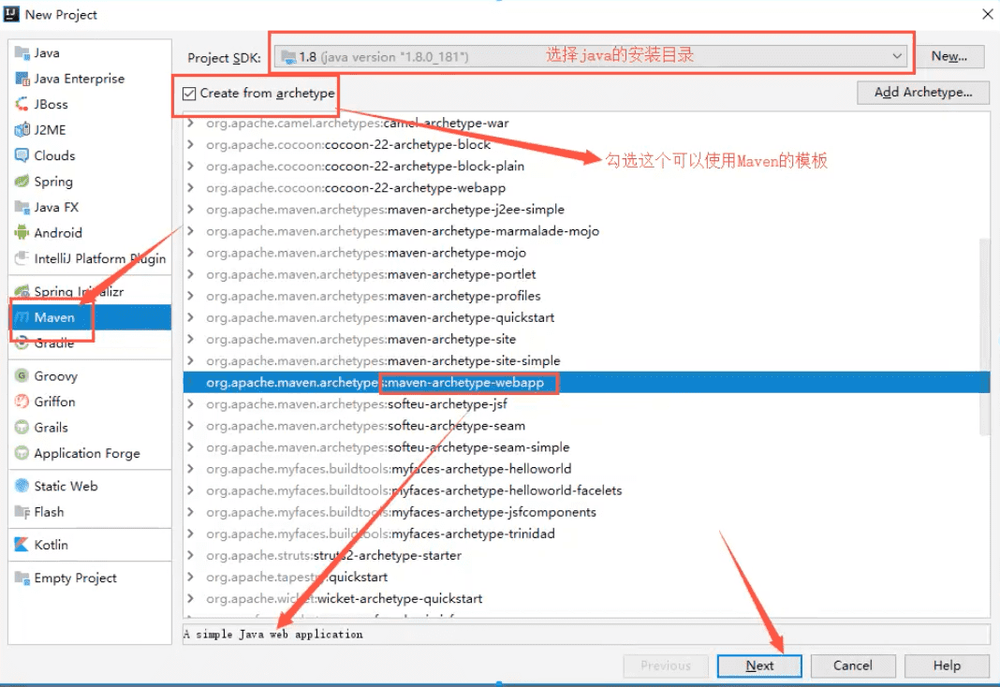

可以选择新的仓库

archetype 也就是原型，是一个 Maven 插件，准确说是一个项目模板，它的任务是根据模板创建一个项目结构。


3. 等待项目初始化完毕

   

4. 观察Maven仓库中多了什么


5. IDEA中的Maven设置

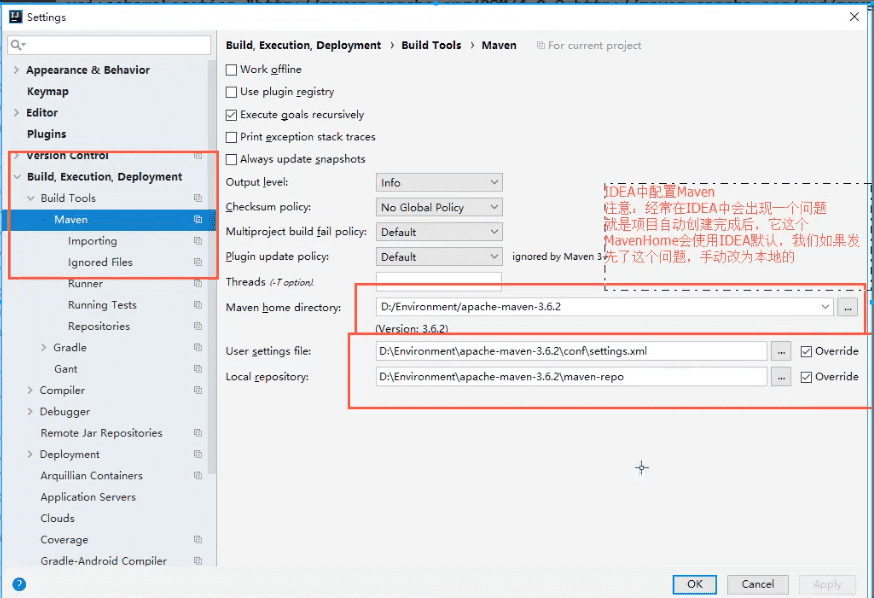


### 5.7 Maven创建一个普通项目

不勾选archetype

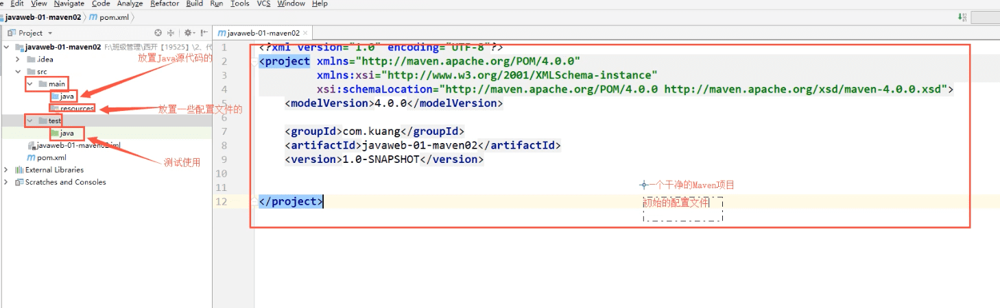

### 5.8 标记文件夹功能

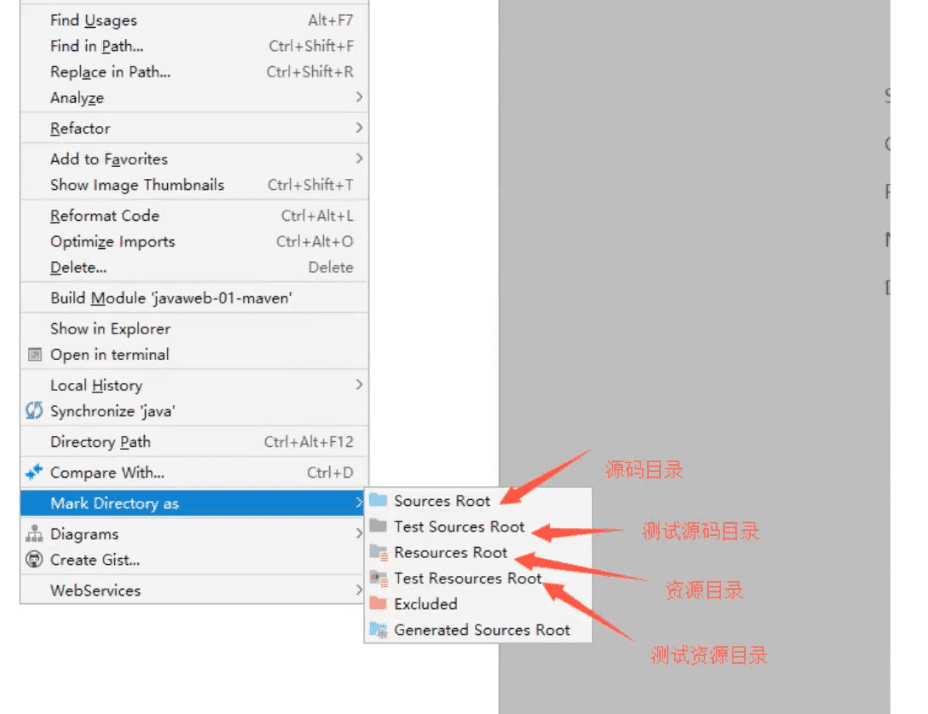

也可以在项目结构配置（Project Structure，`#+;`）中配置。

### 5.9 在idea中配置Tomcat

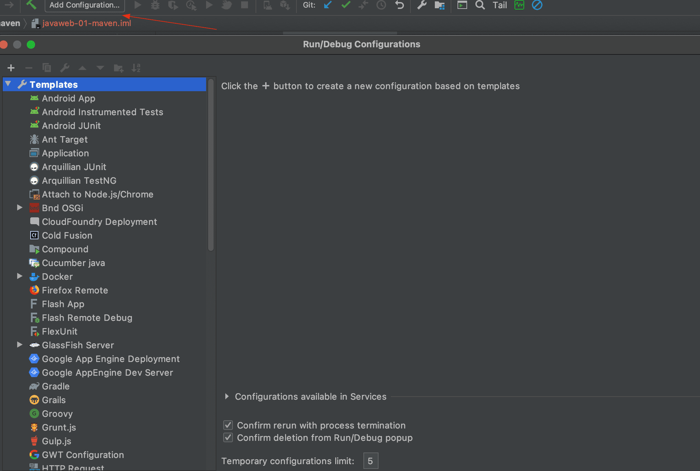

点击+号，Tomcat Server -> local

### 5.10 pom文件

pom.xml是Maven的核心配置文件。

POM( Project Object Model，项目对象模型 ) 是 Maven 工程的基本工作单元，是一个XML文件，包含了项目的基本信息，用于描述项目如何构建，声明项目依赖，等等。

所有 POM 文件都需要 project 元素和三个必需字段：groupId，artifactId，version。

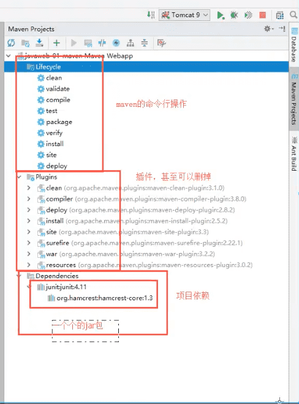


```xml
<?xml version="1.0" encoding="UTF-8"?>

<!-- Maven版本和头文件 -->
<project xmlns="http://maven.apache.org/POM/4.0.0" xmlns:xsi="http://www.w3.org/2001/XMLSchema-instance"
  xsi:schemaLocation="http://maven.apache.org/POM/4.0.0 http://maven.apache.org/xsd/maven-4.0.0.xsd">
  <modelVersion>4.0.0</modelVersion>

  <groupId>com.andyron</groupId>
  <artifactId>javaweb-01-maven</artifactId>
  <version>1.0-SNAPSHOT</version>

  <!-- 项目的打包方式
  jar：Java应用
  war：JavaWeb应用
  -->
  <packaging>war</packaging>

  <!-- 配置 -->
  <properties>
    <project.build.sourceEncoding>UTF-8</project.build.sourceEncoding>
    <maven.compiler.source>1.7</maven.compiler.source>
    <maven.compiler.target>1.7</maven.compiler.target>
  </properties>

  <dependencies>
    <dependency>
      <groupId>junit</groupId>
      <artifactId>junit</artifactId>
      <version>4.11</version>
      <scope>test</scope>
    </dependency>
  </dependencies>

  <!-- 项目构建用的东西-->
  <build>
  ....
  </build>
</project>
```

maven约定大于配置。

无法导出的问题，解决方法：

```xml
    <build>
        <resources>
            <resource>
                <directory>src/main/resources</directory>
                <includes>
                    <include>**/*.properties</include>
                    <include>**/*.xml</include>
                </includes>
                <filtering>true</filtering>
            </resource>
            <resource>
                <directory>src/main/java</directory>
                <includes>
                    <include>**/*.properties</include>
                    <include>**/*.xml</include>
                </includes>
                <filtering>true</filtering>
            </resource>
        </resources>
    </build>
```

### 遇到的问题


## 6、Servlet

### 6.1 简介

- Servlet就是sun公司开发动态web的一门技术

- sun在这些API中提供一个借口叫做：Servlet，如果想开发一个Servlet程序，只需要完成两个小步骤：
  - 编写一个类，实现Servlet接口
  - 把开发好的Java类部署到Web服务器中

把实现了Servlet接口的Java程序叫做**Servlet**。


### 6.2 HelloServlet

Sun提供了两个Servlet实现类：`HttpServlet`, `GenericServlet`

1. 构建普通的maven项目，删除src目录，得到主工程
2. 关于Maven父子工程的理解

3. Maven环境优化:

   - 修改web.xml为最新的

     ```xml
     <?xml version="1.0" encoding="utf-8" ?>
     <web-app xmlns="http://xmlns.jcp.org/xml/ns/javaee"
              xmlns:xsi="http://www.w3.org/2001/XMLSchema-instance"
              xsi:schemaLocation="http://xmlns.jcp.org/xml/ns/javaee
                                 http://xmlns.jcp.org/xml/ns/javaee/web-app_4_0.xsd"
              version="4.0"
              metadata-complete="true">
       
     </web-app>
     ```

     

   - 将maven的结构塔尖完整

4. 编写一个Servlet程序
   - 编写一个普通类
   - 实现Servlet接口，这里直接继承HttpServlet

5. 编写Servlet的映射

为什么需要映射：我们写的是Java程序，但是要通过浏览器访问，而浏览器需要连接web服务器，所以我们需要在web服务中注册我们写的Servlet，还需给它一个浏览器能够访问的路径：

```xml
<!-- 注册Servlet -->
  <servlet>
    <servlet-name>hello</servlet-name>
    <servlet-class>com.andyron.servlet.HelloServlet</servlet-class>
  </servlet>
  <!-- Servlet的请求路径 -->
  <servlet-mapping>
    <servlet-name>hello</servlet-name>
    <url-pattern>/hello</url-pattern>
  </servlet-mapping>
```

> 注意url-pattern中`/`

6. 配置Tomcat

配置项目发布的路径

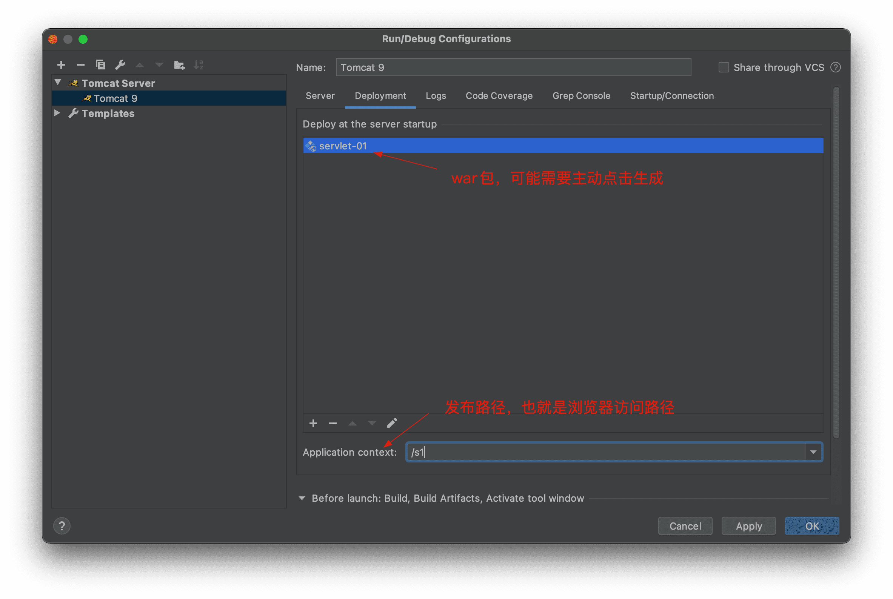

7. 启动测试

### 6.3 Servlet原理

Servlet是由Web服务器调用，web服务器在受到浏览器请求之后，会：

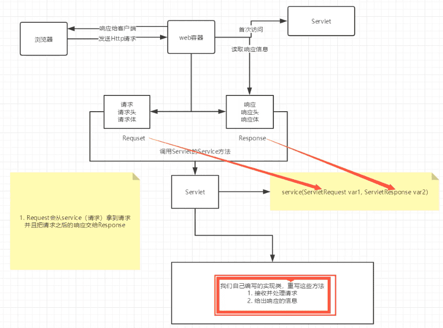


### 6.4 Mapping问题

1. 一个Servlet可以指定一个映射路径

   ```xml
   <servlet-mapping>
     <servlet-name>hello</servlet-name>
     <url-pattern>/hello</url-pattern>
   </servlet-mapping>
   ```

   

2. 一个Servlet可以指定一个映射路径

   ```xml
   <servlet-mapping>
     <servlet-name>hello</servlet-name>
     <url-pattern>/hello</url-pattern>
   </servlet-mapping>
   <servlet-mapping>
     <servlet-name>hello</servlet-name>
     <url-pattern>/hello2</url-pattern>
   </servlet-mapping>
   <servlet-mapping>
     <servlet-name>hello</servlet-name>
     <url-pattern>/hello3</url-pattern>
   </servlet-mapping>
   <servlet-mapping>
     <servlet-name>hello</servlet-name>
     <url-pattern>/hello4</url-pattern>
   </servlet-mapping>
   ```

   

3. 一个Servlet可以指定通用映射路径

   ```xml
   <servlet-mapping>
     <servlet-name>hello</servlet-name>
     <url-pattern>/hello/*</url-pattern>
   </servlet-mapping>
   ```

4. 默认请求路径

   ```xml
   <servlet-mapping>
     <servlet-name>hello</servlet-name>
     <url-pattern>/*</url-pattern>
   </servlet-mapping>
   ```

   

5. 指定一些后缀或前缀等等...

   ```xml
   <!-- 可以自定义后缀实现请求映射
       注意点：*前面不能加项目映射的路径
       -->
   <servlet-mapping>
     <servlet-name>hello</servlet-name>
     <url-pattern>*.andy</url-pattern>
   </servlet-mapping>
   ```

   

6. 优先级问题

   指定了固有的映射路径优先级最高，如果找不到就会走默认的处理请求

### 6.5 ServletContext

> 注意：配置Tomcat，war包时，去除其它项目的war，否者会被一起打包，影响速度。

web容器在启动的时候，它会为每个web程序都创建一个对应的ServletContext对象，它代表了当前的web应用；

#### 共享数据

在一个Servlet中保存的数据，可以咋另一个Servlet中拿到

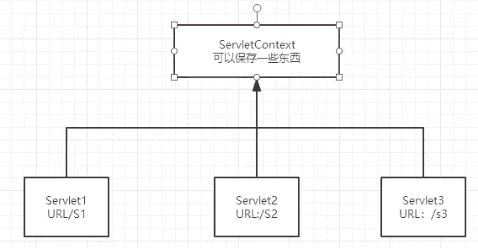

```java
public class HelloServlet extends HttpServlet {
    @Override
    protected void doGet(HttpServletRequest req, HttpServletResponse resp) throws ServletException, IOException {

        ServletContext context = this.getServletContext();
        String username = "Andy Ron";
        context.setAttribute("username", username); // 将一个数据保存在ServletContext中
    }
}

public class GetServlet extends HttpServlet {
    @Override
    protected void doGet(HttpServletRequest req, HttpServletResponse resp) throws ServletException, IOException {
        ServletContext context = this.getServletContext();
        String username = (String)context.getAttribute("username");

        resp.setContentType("text/html");
        resp.setCharacterEncoding("utf-8");
        resp.getWriter().print("名字：" + username);
    }
}
```

```xml
<servlet>
  <servlet-name>hello</servlet-name>
  <servlet-class>com.andyron.servlet.HelloServlet</servlet-class>
</servlet>
<servlet-mapping>
  <servlet-name>hello</servlet-name>
  <url-pattern>/hello</url-pattern>
</servlet-mapping>

<servlet>
  <servlet-name>getc</servlet-name>
  <servlet-class>com.andyron.servlet.GetServlet</servlet-class>
</servlet>
<servlet-mapping>
  <servlet-name>getc</servlet-name>
  <url-pattern>/getc</url-pattern>
</servlet-mapping>
```


#### 获取初始化参数

web.xml中：

```xml
<!-- 配置一些web应用初始化参数 -->
<context-param>
  <param-name>url</param-name>
  <param-value>jdbc:mysql://localhost:3306/mybatis</param-value>
</context-param>
```

```java
@Override
protected void doGet(HttpServletRequest req, HttpServletResponse resp) throws ServletException, IOException {
  ServletContext context = this.getServletContext();

  String url = context.getInitParameter("url");
  resp.getWriter().print(url);
}
```


#### 请求转发

```java
public class ServletDemo4 extends HttpServlet {
  @Override
  protected void doGet(HttpServletRequest req, HttpServletResponse resp) throws ServletException, IOException {
    System.out.println("in demo4");
    ServletContext context = this.getServletContext();    context.getRequestDispatcher("/demo3").forward(req, resp);
  }
}
```


> 请求转发与重定向是不同的，前者请求地址是不变，后者就直接访问另外一个地址。

#### 读取资源文件

`Properties`

> 在java目录下新建properties文件；
>
> 在resources目录下新建properties文件；
>
> 发现都被打包到同一路径下：`classes`，俗称这个路径为classpath；
>
> 思路：需要一个文件流

```java
@Override
protected void doGet(HttpServletRequest req, HttpServletResponse resp) throws ServletException, IOException {
  ServletContext context = this.getServletContext();

  InputStream is = context.getResourceAsStream("/WEB-INF/classes/db.properties");
  Properties properties = new Properties();
  properties.load(is);
  String username = properties.getProperty("username");
  String password = properties.getProperty("password");
  resp.getWriter().print(username + ":" + password);

    }
```

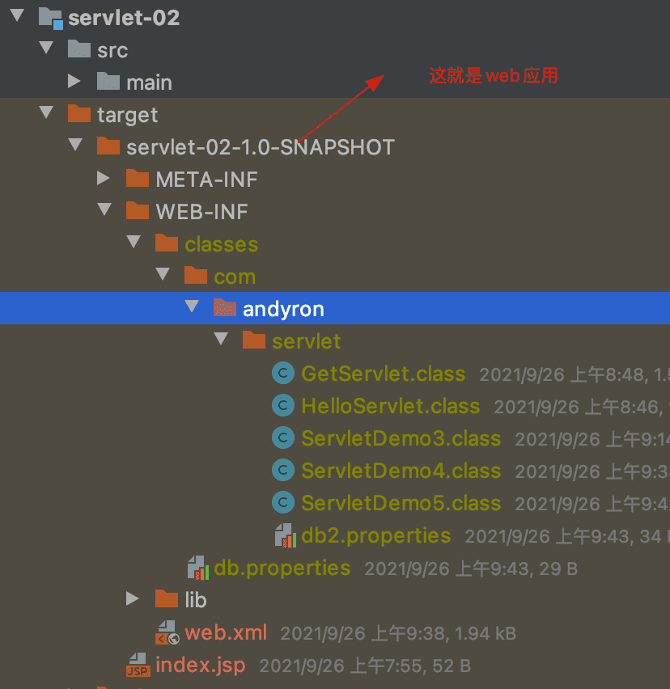

> 注：ServletContext上面介绍的功能之后很少使用，都会被其它替代。


### 6.6 HttpServletResponse

web服务器接收到客户端的http请求，针对这个请求，分别创建一个代表请求的HttpServletRequest对象和一个代表响应的HttpServletResponse对象；

#### 简单分类

负责想浏览器发送数据的方法：

```java
public ServletOutputStream getOutputStream() throws IOException;

public PrintWriter getWriter() throws IOException;
```

负责想浏览器发送响应头的方法：

```java


```

响应的状态码常量：

```java

```

#### 下载文件


1. 要获取下载文件的路径
2. 下载的文件名是啥？
3. 设置想办法让浏览器能够支持下载我们需要的东西
4. 获取下载文件的输入流
5. 创建缓冲区
6. 获取OutputStream对象
7. 将FileOutputStream流写入到buffer缓冲区，使用OutputStream将缓冲区中的数据输出到客户端！


#### 验证码功能

验证码怎么来的？

- 前端实现
- 后端实现，需要到Java的图片类

#### 实现重定向

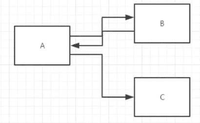

一个web资源B受到客户端A请求后，它会通知客户端A去访问另一个web资源C，这个过程叫重定向。

常见场景：

- 用户登录

```java
public void sendRedirect(String location) throws IOException;
```

```java
@Override
protected void doGet(HttpServletRequest req, HttpServletResponse resp) throws ServletException, IOException {


  resp.sendRedirect("/response_war/img");

  // 等价于
  //        resp.setHeader("Location", "/response_war/img");
  //        resp.setStatus(302);

}
```

> 重定向和转发？
>
> 页面都会实现跳转
>
> 前者地址栏会发生变化，后者不会。


### 6.7 HttpServletRequest

用户通过HTTP协议访问服务器，HTTP请求中的所有信息会被封装到HttpServletRequest中，通过这个对象中的方法，可以后的客户端的所有信息。

#### 获取前端传递的参数

```java
String getParameter(String s);

String[] getParameterValues(String s);
```


🔖p15


## 7、Cookie、Session

### 7.1 会话

**会话**：用户打开一个浏览器，点击了很多超链接，访问多个web资源，关闭浏览器，这个过程可以称之为会话；

**有状态会话**：一个同学来过教室，下次再来教室，我们会知道这个同学，曾经来过，称之为有状态会话；
你能怎么证明你是西开的学生？
你		西开
1.发票	西开给你发票
2.学校登记	西开标记你来过了

**一个网站，怎么证明你来过？**

客户端
服务端
1.服务端给客户端一个信件，客户端下次访问服务端带上信件就可以了；cookie 

2.服务器登记你来过了，下次你来的时候我来匹配你；seesion

### 7.2 保存会话的两种技术

cookie：客服端技术（响应，请求）

session：服务器技术，可以用来保存用户的会话信息


常用场景：网站登录之后不要在登录

🔖16:36

## 8、JSP


## 9、JavaBean

实体类

JavaBean有特定的写法：

- 必须要有一个无参构造
- 属性必须私有化
- 必须有对应的get/set方法

一般用来和数据库的字段做映射ORM；

ORM：对象关系映射

- 表 -> 类
- 字段 -> 属性
- 行记录 -> 对象


## 过滤器和监听器

监听器在Javaweb开发中很少使用


## JDBC

Java Database Connectivity

需要jar包的支持：


**数据库**

```sql
create table users(
	id Int primary key,
  `name` varchar(40),
  `password` varchar(40),
  `email` varchar(60),
   birthday date
);

Insert into users(id, `name`, `password`,email, birthday)
values(1, '张三', '123456','zs@163.com','2000-01-01');
Insert into users(id, `name`, `password`,email, birthday)
values(2, '李四', '123456','ls@163.com','2001-01-01');
Insert into users(id, `name`, `password`,email, birthday)
values(3, '王五', '123456','ww@163.com','2002-01-01');
```

导入依赖

```xml
<dependency>
  <groupId>mysql</groupId>
  <artifactId>mysql-connector-java</artifactId>
  <version>8.0.21</version>
</dependency>
```

**JDBC固定六步骤**：

1. 加载驱动
2. 链接数据库
3.  得到想数据库发送SQL的对象：Statement
4. 编写SQL
5. 执行SQL
6. 关闭连接

```java
String url = "jdbc:mysql://localhost:3306/jdbc?useUnicode=true&characterEncoding=utf-8";
String username = "root";
String password = "iop654321";

// 1 加载驱动
Class.forName("com.mysql.cj.jdbc.Driver");
// 2 链接数据库，connection相当于代表数据库
Connection connection = DriverManager.getConnection(url, username, password);
// 3 向数据库发送SQL的对象Statement或PreparedStatement（安全的，预编译），用它来做crud
Statement statement = connection.createStatement();
// 4 编写SQL
String sql = "select * from users";
// 5 执行查询SQL，返回一个ResultSet：结果集
ResultSet rs = statement.executeQuery(sql);
while (rs.next()) {
  System.out.println("id=" + rs.getObject("id"));
  System.out.println("name=" + rs.getObject("name"));
  System.out.println("password=" + rs.getObject("password"));
  System.out.println("email=" + rs.getObject("email"));
  System.out.println("birthday=" + rs.getObject("birthday"));
// 6 关闭链接，释放资源（一点要做）。先开的后关闭
rs.close();
statement.close();
connection.close();
```

预编译SQL：

```java
String url = "jdbc:mysql://localhost:3306/jdbc?useUnicode=true&characterEncoding=utf-8";
String username = "root";
String password = "iop654321";

// 1 加载驱动
Class.forName("com.mysql.cj.jdbc.Driver");
// 2 链接数据库，connection相当于代表数据库
Connection connection = DriverManager.getConnection(url, username, password);

// 3 编写SQL
String sql = "insert into users(id, name, password, email, birthday) VALUES (?,?,?,?,?)";

// 4 预编译
PreparedStatement preparedStatement = connection.prepareStatement(sql);
preparedStatement.setInt(1,4);  // 给第一个占位符？赋值
preparedStatement.setString(2, "王麻子");
preparedStatement.setString(3, "wmz12345");
preparedStatement.setString(4, "wmz@163.com");
preparedStatement.setDate(5, new Date(new java.util.Date().getTime()));

// 5 执行SQL
int i = preparedStatement.executeUpdate();
if (i>0) {
  System.out.println("插入成功");
}
// 6 关闭链接，释放资源（一点要做）。先开的后关闭
preparedStatement.close();
connection.close();
```

**事务**

要么成功，要么失败。

ACID原则：保证数据的安全。

> 开启事务
> 事务提交 commit()
> 事务回滚 rollback()
> 关闭事务

事务一旦提交就没法回滚了。

```sql
create table account(
	id int primary key auto_increment,
  `name` varchar(40),
   money float
);
insert into account(name, money) VALUE('A', 1000);
insert into account(name, money) VALUE('B', 1000);
insert into account(name, money) VALUE('C', 1000);
```

```sql
start transaction ; #开启事务

update account set money = money - 100 where name = 'A';
update account set money = money + 100 where name = 'B';

rollback ;
commit ;
```

```java
String url = "jdbc:mysql://localhost:3306/jdbc?useUnicode=true&characterEncoding=utf-8";
String username = "root";
String password = "iop654321";

Connection connection = null;

try {
  // 1 加载驱动
  Class.forName("com.mysql.cj.jdbc.Driver");
  // 2 链接数据库，connection相当于代表数据库
  connection = DriverManager.getConnection(url, username, password);

  // 3 通知数据库开启事务，false表示开启
  connection.setAutoCommit(false);

  String sql1 = "update account set money = money - 100 where name = 'A'";
  connection.prepareStatement(sql1).executeUpdate();

  // 制造错误
  int i = 1/0;

  String sql2 = "update account set money = money + 100 where name = 'B'";
  connection.prepareStatement(sql2).executeUpdate();

  connection.commit(); // 两条SQL都提交成功，就提交事务
  System.out.println("success");

} catch (Exception e) {
  // 如果出现异常通知数据库回滚事务
  try {
    connection.rollback();
    System.out.println("rollback");
  } catch (SQLException ex) {
    ex.printStackTrace();
  }
} finally {
  try {
    connection.close();
  } catch (SQLException e) {
    e.printStackTrace();
  }
}
```


