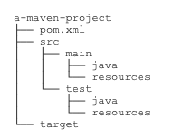

# [《Java教程》](https://www.liaoxuefeng.com/wiki/1252599548343744) 笔记2


## 8.IO

`InputStream`代表输入字节流，`OuputStream`代表输出字节流，`byte`。

`Reader`和`Writer`表示**字符流**，最小数据单位是`char`。

`Reader`和`Writer`本质上是一个能自动编解码的`InputStream`和`OutputStream`。


**同步IO**是指，读写IO时代码必须等待数据返回后才继续执行后续代码，它的优点是代码编写简单，缺点是CPU执行效率低。

而**异步IO**是指，读写IO时仅发出请求，然后立刻执行后续代码，它的优点是CPU执行效率高，缺点是代码编写复杂。

Java标准库的包`java.io`提供了同步IO，而`java.nio`则是异步IO。上面我们讨论的`InputStream`、`OutputStream`、`Reader`和`Writer`都是同步IO的抽象类，对应的具体实现类，以文件为例，有`FileInputStream`、`FileOutputStream`、`FileReader`和`FileWriter`。

本节我们只讨论Java的同步IO，即输入/输出流的IO模型。

### 8.1 File对象

Java标准库的`java.io.File`对象表示一个文件或者目录：

- 创建`File`对象本身不涉及IO操作；
- 可以获取路径／绝对路径／规范路径：`getPath()`/`getAbsolutePath()`/`getCanonicalPath()`；
- 可以获取目录的文件和子目录：`list()`/`listFiles()`；
- 可以创建或删除文件和目录，`mkdir()` `mkdirs` `delete()`。

`java.nio.file.Path`与`File`对象类似，操作更简单，如果需要对目录进行复杂的拼接、遍历等操作，使用`Path`对象更方便。

??

### 8.2 InputStream

`InputStream`就是Java标准库提供的最基本的输入流。


### 8.3 OutputStream


### 8.4 Filter模式

Java的IO标准库使用Filter模式为`InputStream`和`OutputStream`增加功能：

- 可以把一个`InputStream`和任意个`FilterInputStream`组合；
- 可以把一个`OutputStream`和任意个`FilterOutputStream`组合。

Filter模式可以在运行期动态增加功能（又称Decorator模式）


### 8.5 操作Zip

`ZipInputStream`


### 8.6 读取classpath资源


### 8.7 序列化

`java.io.Serializable`


### 8.8 Reader

`Reader`是Java的IO库提供的另一个输入流接口。和`InputStream`的区别是，`InputStream`是一个字节流，即以`byte`为单位读取，而`Reader`是一个字符流，即以`char`为单位读取：

| InputStream                         | Reader                                |
| :---------------------------------- | :------------------------------------ |
| 字节流，以`byte`为单位              | 字符流，以`char`为单位                |
| 读取字节（-1，0~255）：`int read()` | 读取字符（-1，0~65535）：`int read()` |
| 读到字节数组：`int read(byte[] b)`  | 读到字符数组：`int read(char[] c)`    |


### 8.9 Writer


### 8.10 PrintStream和PrintWriter


## 9.日期与时间

### 9.1 基本概念

#### 本地时间

#### 时区

#### 夏令时

### 9.2 Date和Calendar

计算机表示的时间是以整数表示的时间戳存储的，即Epoch Time，Java使用`long`型来表示以毫秒为单位的时间戳，通过`System.currentTimeMillis()`获取当前时间戳。

Java有两套日期和时间的API：

- 旧的Date、Calendar和TimeZone；
- 新的LocalDateTime、ZonedDateTime、ZoneId等。

分别位于`java.util`和`java.time`包中。

### 9.3 LocalDateTime


### 9.4 ZonedDateTime


### 9.5 DateTimeFormatter


### 9.6 Instant


## 10.单元测试

### 10.1 编写JUnit测试

什么是单元测试呢？单元测试就是针对最小的功能单元编写测试代码。Java程序最小的功能单元是方法，因此，对Java程序进行单元测试就是**针对单个Java方法的测试**。

#### JUnit

可以非常简单地组织测试代码，并随时运行它们，JUnit就会给出成功的测试和失败的测试，还可以生成测试报告，不仅包含**测试的成功率**，还可以统计测试的**代码覆盖率**，即被测试的代码本身有多少经过了测试。对于高质量的代码来说，测试覆盖率应该在80%以上。


### 10.2 使用Fixture


### 10.3 异常测试


### 10.4 条件测试


### 10.5 参数化测试


## 11.正则表达式

### 11.1 简介

`java.util.regex`

## 12.加密与安全

应对潜在的安全威胁，需要做到三防：

- 防窃听
- 防篡改
- 防伪造

要编写安全的计算机程序，我们要做到：

- 不要自己设计山寨的加密算法；
- 不要自己实现已有的加密算法；
- 不要自己修改已有的加密算法。

### 12.1 编码算法

URL编码和Base64编码都是<font color=#FF8C00>编码</font>算法，它们不是<font color=#FF8C00>加密</font>算法；

URL编码的目的是把任意文本数据编码为%前缀表示的文本，便于浏览器和服务器处理；

Base64编码的目的是把任意二进制数据编码为文本，但编码后数据量会增加1/3。

### 12.2 哈希算法

哈希算法（Hash）又称摘要算法（Digest），它的作用是：对任意一组输入数据进行计算，得到一个固定长度的输出摘要。

### 12.3 BouncyCastle

### 12.4 Hmac算法

### 12.5 对称加密算法

### 12.6 口令加密算法

### 12.7 密钥交换算法

### 12.8 非对称加密算法

### 12.9 签名算法

### 12.10 数字证书

数字证书就是集合了多种密码学算法，用于实现数据加解密、身份认证、签名等多种功能的一种安全标准。

数字证书采用链式签名管理，顶级的Root CA证书已内置在操作系统中。

数字证书存储的是公钥，可以安全公开，而私钥必须严格保密。


## 13.多线程

### 多线程基础


### 创建新线程


### 线程的状态

ava线程的状态有以下几种：

- New：新创建的线程，尚未执行；
- Runnable：运行中的线程，正在执行`run()`方法的Java代码；
- Blocked：运行中的线程，因为某些操作被阻塞而挂起；
- Waiting：运行中的线程，因为某些操作在等待中；
- Timed Waiting：运行中的线程，因为执行`sleep()`方法正在计时等待；
- Terminated：线程已终止，因为`run()`方法执行完毕。

用一个状态转移图表示如下：


### 中断线程


### 守护线程


### 线程同步


### 同步方法


### 死锁


### 使用wait和notify

### 使用ReentrantLock

### 使用Condition

### 使用ReadWriteLock

### 使用StampedLock

### 使用Concurrent集合

### 使用Atomic

### 使用线程池

### 使用Future

### 使用CompletableFuture

### 使用ForkJoin

### 使用ThreadLocal


## 14.Maven基础

### 14.1 Maven介绍

Maven是一个Java**项目管理和构建工具**，它可以定义项目结构、项目依赖，并使用统一的方式进行自动化构建，是Java项目不可缺少的工具。

#### Maven项目结构

一个使用Maven管理的普通的Java项目的目录结构默认如下：



`pom.xml`：项目描述文件

`src/main/java`：存放Java源码的目录

`src/main/resources`：存放资源文件的目录

`src/test/java`：存放测试源码的目录

`src/test/resources`：存放测试资源的目录

`target`：所有编译、打包生成的文件都放

`pom.xml`文件一般如下：

```xml
<project ...>
	<modelVersion>4.0.0</modelVersion>
	<groupId>com.itranswarp.learnjava</groupId>
	<artifactId>hello</artifactId>
	<version>1.0</version>
	<packaging>jar</packaging>
	<properties>
        ...
	</properties>
	<dependencies>
        <dependency>
            <groupId>commons-logging</groupId>
            <artifactId>commons-logging</artifactId>
            <version>1.2</version>
        </dependency>
	</dependencies>
</project>
```

`groupId`类似于Java的包名，通常是公司或组织名称，`artifactId`类似于Java的类名，通常是项目名称。

一个Maven工程就是由`groupId`，`artifactId`和`version`作为唯一标识。

使用`dependencies`声明一个依赖后，Maven就会自动下载这个依赖包并把它放到classpath中。

#### 安装Maven

macOS 安装

1 [官网](http://maven.apache.org/download.cgi)下载压缩包


2 解压后放到`/usr/local`目录下

3 在`~/.bash_profile`或`~/.zshrc`里添加：

```
# 配置Maven
export MAVEN_HOME=/usr/local/apache-maven-3.6.3
export PATH=$PATH:$MAVEN_HOME/bin
```

4 `source .zshrc`

5 `mvn -v` 


### 14.2 依赖管理

#### 依赖关系

| scope    | 说明                                          | 示例            |
| :------- | :-------------------------------------------- | :-------------- |
| compile  | 编译时需要用到该jar包（默认）                 | commons-logging |
| test     | 编译Test时需要用到该jar包                     | junit           |
| runtime  | 编译时不需要，但运行时需要用到                | mysql           |
| provided | 编译时需要用到，但运行时由JDK或某个服务器提供 | servlet-api     |

其中，默认的`compile`是最常用的，Maven会把这种类型的依赖直接放入classpath。

Maven如何知道从何处下载所需的依赖？答案是Maven维护了一个中央仓库（[repo1.maven.org](https://repo1.maven.org/)），所有第三方库将自身的jar以及相关信息上传至中央仓库。

一个jar包一旦被下载过，就会被Maven自动缓存在本地目录（`~/.m2`）。

#### 唯一ID

#### Maven镜像

在`~/.m2/`目录下创建，`settings.xml`配置文件，使用阿里云镜像：

```xml
<settings>
    <mirrors>
        <mirror>
            <id>aliyun</id>
            <name>aliyun</name>
            <mirrorOf>central</mirrorOf>
            <!-- 国内推荐阿里云的Maven镜像 -->
            <url>http://maven.aliyun.com/nexus/content/groups/public/</url>
        </mirror>
    </mirrors>
</settings>
```

#### 搜索第三方组件

通过[search.maven.org](https://search.maven.org/)搜索关键字，


### 14.3 构建流程

Maven不但有标准化的项目结构，而且还有一套标准化的构建流程，可以自动化实现编译，打包，发布，等等。


### 14.4 使用插件

### 14.5 模块管理

### 14.6 使用mvnw


## 15.网络编程

网络编程是Java最擅长的方向之一，使用Java进行网络编程时，由虚拟机实现了底层复杂的网络协议，Java程序只需要调用Java标准库提供的接口，就可以简单高效地编写网络程序。

### 网络编程基础


### TCP编程


### UDP编程


### 发送Email

### 接收Email

### HTTP编程

### RMI远程调用


## 16.XML与JSON

### XML简介

### 使用DOM

### 使用SAX

### 使用Jackson

### 使用JSON

## 17.JDBC编程

Java为关系数据库定义了一套标准的访问接口：JDBC（Java Database Connectivity）

### JDBC简介

### JDBC查询

### JDBC更新

### JDBC事务

### JDBC Batch

### JDBC连接池


## 18.函数式编程


