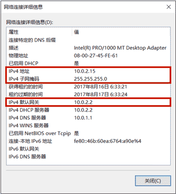
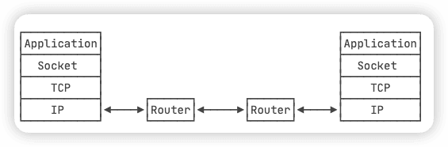

# [《Java教程》](https://www.liaoxuefeng.com/wiki/1252599548343744) 笔记2


## 8.IO

`InputStream`代表输入字节流，`OuputStream`代表输出字节流，`byte`。

`Reader`和`Writer`表示**字符流**，最小数据单位是`char`。

`Reader`和`Writer`本质上是一个能自动编解码的`InputStream`和`OutputStream`。


**同步IO**是指，读写IO时代码必须等待数据返回后才继续执行后续代码，它的优点是代码编写简单，缺点是CPU执行效率低。

而**异步IO**是指，读写IO时仅发出请求，然后立刻执行后续代码，它的优点是CPU执行效率高，缺点是代码编写复杂。

Java标准库的包`java.io`提供了同步IO，而`java.nio`则是异步IO。上面我们讨论的`InputStream`、`OutputStream`、`Reader`和`Writer`都是同步IO的抽象类，对应的具体实现类，以文件为例，有`FileInputStream`、`FileOutputStream`、`FileReader`和`FileWriter`。

本节我们只讨论Java的同步IO，即输入/输出流的IO模型。

### 8.1 File对象

Java标准库的`java.io.File`对象表示一个文件或者目录：

- 创建`File`对象本身不涉及IO操作；
- 可以获取路径／绝对路径／规范路径：`getPath()`/`getAbsolutePath()`/`getCanonicalPath()`；
- 可以获取目录的文件和子目录：`list()`/`listFiles()`；
- 可以创建或删除文件和目录，`mkdir()` `mkdirs` `delete()`。

`java.nio.file.Path`与`File`对象类似，操作更简单，如果需要对目录进行复杂的拼接、遍历等操作，使用`Path`对象更方便。

??

### 8.2 InputStream

`InputStream`就是Java标准库提供的最基本的输入流。


### 8.3 OutputStream


### 8.4 Filter模式

Java的IO标准库使用Filter模式为`InputStream`和`OutputStream`增加功能：

- 可以把一个`InputStream`和任意个`FilterInputStream`组合；
- 可以把一个`OutputStream`和任意个`FilterOutputStream`组合。

Filter模式可以在运行期动态增加功能（又称Decorator模式）


### 8.5 操作Zip

`ZipInputStream`


### 8.6 读取classpath资源


### 8.7 序列化

`java.io.Serializable`


### 8.8 Reader

`Reader`是Java的IO库提供的另一个输入流接口。和`InputStream`的区别是，`InputStream`是一个字节流，即以`byte`为单位读取，而`Reader`是一个字符流，即以`char`为单位读取：

| InputStream                         | Reader                                |
| :---------------------------------- | :------------------------------------ |
| 字节流，以`byte`为单位              | 字符流，以`char`为单位                |
| 读取字节（-1，0~255）：`int read()` | 读取字符（-1，0~65535）：`int read()` |
| 读到字节数组：`int read(byte[] b)`  | 读到字符数组：`int read(char[] c)`    |


### 8.9 Writer


### 8.10 PrintStream和PrintWriter


## 9.日期与时间

### 9.1 基本概念

#### 本地时间

#### 时区

#### 夏令时

### 9.2 Date和Calendar

计算机表示的时间是以整数表示的时间戳存储的，即Epoch Time，Java使用`long`型来表示以毫秒为单位的时间戳，通过`System.currentTimeMillis()`获取当前时间戳。

Java有两套日期和时间的API：

- 旧的Date、Calendar和TimeZone；
- 新的LocalDateTime、ZonedDateTime、ZoneId等。

分别位于`java.util`和`java.time`包中。

### 9.3 LocalDateTime


### 9.4 ZonedDateTime


### 9.5 DateTimeFormatter


### 9.6 Instant


## 10.单元测试

### 10.1 编写JUnit测试

什么是单元测试呢？单元测试就是针对最小的功能单元编写测试代码。Java程序最小的功能单元是方法，因此，对Java程序进行单元测试就是**针对单个Java方法的测试**。

#### JUnit

可以非常简单地组织测试代码，并随时运行它们，JUnit就会给出成功的测试和失败的测试，还可以生成测试报告，不仅包含**测试的成功率**，还可以统计测试的**代码覆盖率**，即被测试的代码本身有多少经过了测试。对于高质量的代码来说，测试覆盖率应该在80%以上。


### 10.2 使用Fixture


### 10.3 异常测试


### 10.4 条件测试


### 10.5 参数化测试


## 11.正则表达式

### 11.1 简介

`java.util.regex`

## 12.加密与安全

应对潜在的安全威胁，需要做到三防：

- 防窃听
- 防篡改
- 防伪造

要编写安全的计算机程序，我们要做到：

- 不要自己设计山寨的加密算法；
- 不要自己实现已有的加密算法；
- 不要自己修改已有的加密算法。

### 12.1 编码算法

URL编码和Base64编码都是<font color=#FF8C00>编码</font>算法，它们不是<font color=#FF8C00>加密</font>算法；

URL编码的目的是把任意文本数据编码为%前缀表示的文本，便于浏览器和服务器处理；

Base64编码的目的是把任意二进制数据编码为文本，但编码后数据量会增加1/3。

### 12.2 哈希算法

哈希算法（Hash）又称摘要算法（Digest），它的作用是：对任意一组输入数据进行计算，得到一个固定长度的输出摘要。

### 12.3 BouncyCastle

### 12.4 Hmac算法

### 12.5 对称加密算法

### 12.6 口令加密算法

### 12.7 密钥交换算法

### 12.8 非对称加密算法

### 12.9 签名算法

### 12.10 数字证书

数字证书就是集合了多种密码学算法，用于实现数据加解密、身份认证、签名等多种功能的一种安全标准。

数字证书采用链式签名管理，顶级的Root CA证书已内置在操作系统中。

数字证书存储的是公钥，可以安全公开，而私钥必须严格保密。


## 13.多线程

### 多线程基础


### 创建新线程


### 线程的状态

ava线程的状态有以下几种：

- New：新创建的线程，尚未执行；
- Runnable：运行中的线程，正在执行`run()`方法的Java代码；
- Blocked：运行中的线程，因为某些操作被阻塞而挂起；
- Waiting：运行中的线程，因为某些操作在等待中；
- Timed Waiting：运行中的线程，因为执行`sleep()`方法正在计时等待；
- Terminated：线程已终止，因为`run()`方法执行完毕。

用一个状态转移图表示如下：


### 中断线程


### 守护线程


### 线程同步


### 同步方法


### 死锁


### 使用wait和notify

### 使用ReentrantLock

### 使用Condition

### 使用ReadWriteLock

### 使用StampedLock

### 使用Concurrent集合

### 使用Atomic

### 使用线程池

### 使用Future

### 使用CompletableFuture

### 使用ForkJoin

### 使用ThreadLocal


## 14.Maven基础

### 14.1 Maven介绍

Maven是一个Java**项目管理和构建工具**，它可以定义项目结构、项目依赖，并使用统一的方式进行自动化构建，是Java项目不可缺少的工具。

#### Maven项目结构

一个使用Maven管理的普通的Java项目的目录结构默认如下：


`pom.xml`：项目描述文件

`src/main/java`：存放Java源码的目录

`src/main/resources`：存放资源文件的目录

`src/test/java`：存放测试源码的目录

`src/test/resources`：存放测试资源的目录

`target`：所有编译、打包生成的文件都放

`pom.xml`文件一般如下：

```xml
<project ...>
	<modelVersion>4.0.0</modelVersion>
	<groupId>com.itranswarp.learnjava</groupId>
	<artifactId>hello</artifactId>
	<version>1.0</version>
	<packaging>jar</packaging>
	<properties>
        ...
	</properties>
	<dependencies>
        <dependency>
            <groupId>commons-logging</groupId>
            <artifactId>commons-logging</artifactId>
            <version>1.2</version>
        </dependency>
	</dependencies>
</project>
```

`groupId`类似于Java的包名，通常是公司或组织名称，`artifactId`类似于Java的类名，通常是项目名称。

一个Maven工程就是由`groupId`，`artifactId`和`version`作为唯一标识。

使用`dependencies`声明一个依赖后，Maven就会自动下载这个依赖包并把它放到classpath中。

#### 安装Maven

macOS 安装

1 [官网](http://maven.apache.org/download.cgi)下载压缩包


2 解压后放到`/usr/local`目录下

3 在`~/.bash_profile`或`~/.zshrc`里添加：

```
# 配置Maven
export MAVEN_HOME=/usr/local/apache-maven-3.6.3
export PATH=$PATH:$MAVEN_HOME/bin
```

4 `source .zshrc`

5 `mvn -v` 


### 14.2 依赖管理

#### 依赖关系

| scope    | 说明                                          | 示例            |
| :------- | :-------------------------------------------- | :-------------- |
| compile  | 编译时需要用到该jar包（默认）                 | commons-logging |
| test     | 编译Test时需要用到该jar包                     | junit           |
| runtime  | 编译时不需要，但运行时需要用到                | mysql           |
| provided | 编译时需要用到，但运行时由JDK或某个服务器提供 | servlet-api     |

其中，默认的`compile`是最常用的，Maven会把这种类型的依赖直接放入classpath。

Maven如何知道从何处下载所需的依赖？答案是Maven维护了一个中央仓库（[repo1.maven.org](https://repo1.maven.org/)），所有第三方库将自身的jar以及相关信息上传至中央仓库。

一个jar包一旦被下载过，就会被Maven自动缓存在本地目录（`~/.m2`）。

#### 唯一ID

#### Maven镜像

在`~/.m2/`目录下创建，`settings.xml`配置文件，使用阿里云镜像：

```xml
<settings>
    <mirrors>
        <mirror>
            <id>aliyun</id>
            <name>aliyun</name>
            <mirrorOf>central</mirrorOf>
            <!-- 国内推荐阿里云的Maven镜像 -->
            <url>http://maven.aliyun.com/nexus/content/groups/public/</url>
        </mirror>
    </mirrors>
</settings>
```

#### 搜索第三方组件

通过[search.maven.org](https://search.maven.org/)搜索关键字，


### 14.3 构建流程

Maven不但有标准化的项目结构，而且还有一套标准化的构建流程，可以自动化实现编译，打包，发布，等等。


### 14.4 使用插件

### 14.5 模块管理

### 14.6 使用mvnw


## 15.网络编程

网络编程是Java最擅长的方向之一，使用Java进行网络编程时，由虚拟机实现了底层复杂的网络协议，Java程序只需要调用==Java标准库提供的接口==，就可以简单高效地编写网络程序。

### 网络编程基础

对某个特定的计算机网络来说，它可能使用网络协议ABC，而另一个计算机网络可能使用网络协议XYZ。如果计算机网络各自的通讯协议不统一，就没法把不同的网络连接起来形成互联网。因此，为了把计算机网络接入互联网，就必须使用TCP/IP协议。

TCP/IP协议泛指互联网协议，其中最重要的两个协议是TCP协议和IP协议。

#### IP地址

在互联网中，一个IP地址用于唯一标识一个网络接口（Network Interface）。

IP地址分为IPv4和IPv6两种。IPv4采用32位地址，类似`101.202.99.12`(4个10进制数组成，每个10进制数是一个字节8位bit组成，因此每个最大是255)，而IPv6采用128位地址，类似`2001:0DA8:100A:0000:0000:1020:F2F3:1428`（8个4位16进制数组成，2^16*8^）。IPv4地址总共有2^32^个（大约42亿），而IPv6地址则总共有2^128^个（大约340万亿亿亿亿），IPv4的地址目前已耗尽，而IPv6的地址是根本用不完的。

IP地址又分为==公网IP地址==和==内网IP地址==。公网IP地址可以直接被访问，内网IP地址只能在内网访问。

特殊地址：本机地址，`127.0.0.1`。

==网关==的作用就是连接多个网络，负责把来自一个网络的数据包发到另一个网络，这个过程叫==路由==。

一台计算机的一个网卡会有3个关键配置：



如果某台计算机的IP是`101.202.99.2`，子网掩码是`255.255.255.0`，那么计算该计算机的网络号是：

```
IP = 101.202.99.2
Mask = 255.255.255.0
Network = IP & Mask = 101.202.99.0
```

每台计算机都需要正确配置IP地址和子网掩码，根据这两个就可以计算网络号，如果两台计算机计算出的网络号相同，说明两台计算机在同一个网络，可以直接通信。

#### 域名

域名解析服务器DNS负责把域名翻译成对应的IP，客户端再根据IP地址访问服务器。

用`nslookup`可以查看域名对应的IP地址：

```shell
nslookup www.liaoxuefeng.com
```

#### 网络模型

#### 常用协议

IP协议是一个分组交换，它不保证可靠传输。而TCP协议是传输控制协议，它是面向连接的协议，支持可靠传输和双向通信。

TCP协议是建立在IP协议之上的，简单地说，**IP协议只负责发数据包，不保证顺序和正确性，而TCP协议负责控制数据包传输，它在传输数据之前需要先建立连接，建立连接后才能传输数据，传输完后还需要断开连接**。TCP协议之所以能保证数据的可靠传输，是通过**接收确认、超时重传**这些机制实现的。并且，TCP协议允许**双向通信**，即通信双方可以同时发送和接收数据。

TCP协议也是应用最广泛的协议，许多高级协议都是建立在TCP协议之上的，例如HTTP、SMTP等。

UDP协议（User Datagram Protocol）是一种**数据报文协议**，它是无连接协议，不保证可靠传输。因为UDP协议在通信前不需要建立连接，因此它的传输效率比TCP高，而且UDP协议比TCP协议要简单得多。

选择UDP协议时，传输的数据通常是能容忍丢失的，例如，一些语音视频通信的应用会选择UDP协议。

### TCP编程

Socket是一个抽象概念，一个应用程序通过一个Socket来建立一个远程连接，而Socket内部通过TCP/IP协议把数据传输到网络：



Socket、TCP和部分IP的功能都是由操作系统提供的，**不同的编程语言只是提供了对操作系统调用的简单的封装**。例如，Java提供的几个Socket相关的类就封装了操作系统提供的接口。

> 为什么需要Socket进行网络通信？
>
> 因为仅仅通过IP地址进行通信是不够的，同一台计算机同一时间会运行多个网络应用程序，例如浏览器、QQ、邮件客户端等。当操作系统接收到一个数据包的时候，如果只有IP地址，它没法判断应该发给哪个应用程序，所以，操作系统抽象出Socket接口，**每个应用程序需要各自对应到不同的Socket，数据包才能根据Socket正确地发到对应的应用程序。**

一个Socket就是由**IP地址和端口号**（范围是0～65535）组成，可以把Socket简单理解为IP地址加端口号。端口号总是由操作系统分配，它是一个0～65535之间的数字，其中，小于1024的端口属于*==特权端口==*，需要管理员权限，大于1024的端口可以由任意用户的应用程序打开。

使用Socket进行网络编程时，本质上就是**两个进程之间的网络通信**。其中一个进程必须充当服务器端，它会主动监听某个指定的端口，另一个进程必须充当客户端，它必须主动连接服务器的IP地址和指定端口，如果连接成功，服务器端和客户端就成功地建立了一个TCP连接，双方后续就可以**随时发送和接收数据**。

当Socket连接成功地在服务器端和客户端之间建立后：

- 对服务器端来说，它的Socket是指定的IP地址和指定的端口号；
- 对客户端来说，它的Socket是它所在计算机的IP地址和一个由操作系统分配的随机端口号。

#### 服务器端

Java标准库提供了`ServerSocket`来实现对指定IP和指定端口的监听。

```java
public class Server {
    public static void main(String[] args) throws IOException {
        // 监听指定端口；没有指定IP地址，表示在计算机的所有网络接口上进行监听
        ServerSocket ss = new ServerSocket(6666);

        System.out.println("server is running...");
        for (;;) {
            // 每当有新的客户端连接进来后，就返回一个Socket实例
            Socket sock = ss.accept();
            System.out.println("connected from " + sock.getRemoteSocketAddress());
            Thread t = new Handler(sock);
            t.start();
        }
    }
}

class Handler extends Thread {
    Socket sock;

    public Handler(Socket sock) {
        this.sock = sock;
    }

    @Override
    public void run() {
        try (InputStream input = this.sock.getInputStream()) {
            try (OutputStream output = this.sock.getOutputStream()) {
                handle(input, output);
            }
        } catch (Exception e) {
            try {
                this.sock.close();
            } catch (IOException ioe) {
            }
            System.out.println("client disconnected.");
        }
    }

    private void handle(InputStream input, OutputStream output) throws IOException {
        BufferedWriter writer = new BufferedWriter(new OutputStreamWriter(output, StandardCharsets.UTF_8));
        BufferedReader reader = new BufferedReader(new InputStreamReader(input, StandardCharsets.UTF_8));
        writer.write("hello\n");
        writer.flush();
        for (;;) {
            String s = reader.readLine();
            if (s.equals("bye")) {
                writer.write("bye\n");
                writer.flush();
                break;
            }
            writer.write("ok: " + s + "\n");
            writer.flush();
        }
    }
}
```

服务器端通过代码：

```java
ServerSocket ss = new ServerSocket(6666);
```

在指定端口`6666`监听。没有指定IP地址，表示在<u>计算机的所有网络接口上进行监听</u>。

如果`ServerSocket`监听成功，就使用一个无限循环来处理客户端的连接：

```java
for (;;) {
    Socket sock = ss.accept();
    Thread t = new Handler(sock);
    t.start();
}
```

`ss.accept()`表示每当有新的客户端连接进来后，就返回一个`Socket`实例，这个`Socket`实例就是用来和刚连接的客户端进行通信的。

由于客户端很多，要实现并发处理，就必须为每个新的`Socket`创建一个新线程来处理，这样，**主线程的作用就是接收新的连接**，每当收到新连接后，就创建一个新线程进行处理。

> 这里也完全可以利用线程池来处理客户端连接，能大大提高运行效率。

如果没有客户端连接进来，`accept()`方法会阻塞并一直等待。如果有多个客户端同时连接进来，`ServerSocket`会把连接扔到队列里，然后一个一个处理。对于Java程序而言，==只需要通过循环不断调用`accept()`就可以获取新的连接==。

#### 客户端

```java
public class Client {
    public static void main(String[] args) throws IOException{
        // 连接指定服务器和端口
        Socket socket = new Socket("localhost", 6666);

        try (InputStream input = socket.getInputStream()){
            try (OutputStream output = socket.getOutputStream()) {
                handle(input, output);
            }
        }
        socket.close();
        System.out.println("disconnected.");
    }

    private static void handle(InputStream input, OutputStream output) throws IOException {
        BufferedWriter writer = new BufferedWriter(new OutputStreamWriter(output, StandardCharsets.UTF_8));
        BufferedReader reader = new BufferedReader(new InputStreamReader(input, StandardCharsets.UTF_8));
        Scanner scanner = new Scanner(System.in);
        System.out.println("[server] " + reader.readLine());
        for(;;) {
            System.out.println(">>>");
            String s = scanner.nextLine();
            writer.write(s);
            writer.newLine();
            writer.flush();
            String resp = reader.readLine();
            System.out.println("<<< " + resp);
            if (resp.equals("bye")) {
                break;
            }
        }
    }
}
```


#### Socket流

当Socket连接创建成功后，无论是服务器端，还是客户端，都使用`Socket`实例进行网络通信。因为TCP是一种基于流的协议，因此，Java标准库使用`InputStream`和`OutputStream`来封装Socket的数据流，这样使用Socket的流，和普通IO流类似：

```java
// 用于读取网络数据:
InputStream in = sock.getInputStream();
// 用于写入网络数据:
OutputStream out = sock.getOutputStream();
```

> 为什么写入网络数据时，要调用`flush()`方法？
>
> 如果不调用`flush()`，我们很可能会发现，客户端和服务器都收不到数据，这并不是Java标准库的设计问题，而是我们以流的形式写入数据的时候，并不是一写入就立刻发送到网络，而是先写入内存缓冲区，直到缓冲区满了以后，才会一次性真正发送到网络，这样设计的目的是为了提高传输效率。如果缓冲区的数据很少，而我们又想强制把这些数据发送到网络，就必须调用`flush()`强制把缓冲区数据发送出去。

#### 小节

使用Java进行TCP编程时，需要使用Socket模型：

- 服务器端用`ServerSocket`监听指定端口；
- 客户端使用`Socket(InetAddress, port)`连接服务器；
- 服务器端用`accept()`接收连接并返回`Socket`；
- 双方通过`Socket`打开`InputStream`/`OutputStream`读写数据；
- 服务器端通常使用多线程同时处理多个客户端连接，利用线程池可大幅提升效率；
- `flush()`用于强制输出缓冲区到网络。

### UDP编程

🔖

和TCP编程相比，UDP编程就简单得多，**因为UDP没有创建连接，数据包也是一次收发一个，所以没有流的概念。**

在Java中使用UDP编程，仍然需要使用Socket，因为应用程序在使用UDP时必须指定网络接口（IP）和端口号。注意：UDP端口和TCP端口虽然都使用0~65535，但他们是两套独立的端口，即一个应用程序用TCP占用了端口1234，不影响另一个应用程序用UDP占用端口1234。

#### 服务端

Java提供了`DatagramSocket`来实现UDP对指定端口的监听：

```
```

#### 客户端


### 发送Email

### 接收Email

### HTTP编程

### RMI远程调用


## 16.XML与JSON

### XML简介

### 使用DOM

### 使用SAX

### 使用Jackson

### 使用JSON

## 17.JDBC编程

Java为关系数据库定义了一套标准的访问接口：JDBC（Java Database Connectivity）

### JDBC简介

### JDBC查询

### JDBC更新

### JDBC事务

### JDBC Batch

### JDBC连接池


## 18.函数式编程


