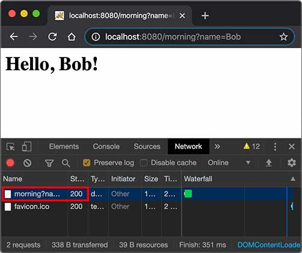

《Java教程》笔记
----------

[《Java教程》](https://www.liaoxuefeng.com/wiki/1252599548343744)   廖雪峰

**为什么Java应用最广泛？**

从互联网到企业平台，Java是应用最广泛的编程语言，原因在于：

- Java是基于JVM虚拟机的跨平台语言，一次编写，到处运行；
- Java程序易于编写，而且有内置垃圾收集，不必考虑内存管理；
- Java虚拟机拥有工业级的稳定性和高度优化的性能，且经过了长时期的考验；
- Java拥有最广泛的开源社区支持，各种高质量组件随时可用。

Java语言常年霸占着三大市场：

- 互联网和企业应用，这是Java EE的长期优势和市场地位；
- 大数据平台，主要有Hadoop、Spark、Flink等，他们都是Java或Scala（一种运行于JVM的编程语言）开发的；
- Android移动平台。


## 1.Java快速入门

### 1.1 Java简介

Java介于编译型语言和解释型语言之间。编译型语言如C、C++，代码是直接编译成**机器码**执行，但是不同的平台（x86、ARM等）CPU的**指令集**不同，因此，需要编译出每一种平台的对应机器码。解释型语言如Python、Ruby没有这个问题，可以由解释器直接加载源码然后运行，代价是运行效率太低。而Java是将代码编译成一种“字节码”，它类似于**抽象的CPU指令**，然后，针对不同平台编写虚拟机，不同平台的虚拟机负责加载字节码并执行，这样就实现了“一次编写，到处运行”的效果。当然，这是针对Java开发者而言。对于虚拟机，需要为每个平台分别开发。为了保证不同平台、不同公司开发的虚拟机都能正确执行Java字节码，SUN公司制定了一系列的**Java虚拟机规范**。从实践的角度看，JVM的兼容性做得非常好，低版本的Java字节码完全可以正常运行在高版本的JVM上。

Java的三个版本：

- **Java EE**(Enterprise Edition)     企业版，在Java SE的基础上加上了大量的API和库，以便方便开发Web应用、数据库、消息服务等，使用的虚拟机和Java SE完全相同。
- **Java SE**(Standard Edition)    标准版，包含标准的JVM和标准库。
- **Java ME**(Micro Edition)   “瘦身版”，不建议学习。


推荐的Java学习路线图如下：

1. 首先要学习Java SE，掌握Java语言本身、Java核心开发技术以及Java标准库的使用；
2. 如果继续学习Java EE，那么Spring框架、数据库开发、分布式架构就是需要学习的；
3. 如果要学习大数据开发，那么Hadoop、Spark、Flink这些大数据平台就是需要学习的，他们都基于Java或Scala开发；
4. 如果想要学习移动开发，那么就深入Android平台，掌握Android App开发。

无论怎么选择，Java SE的核心技术是基础，这个教程的目的就是让你完全精通Java SE！

#### Java版本

| 时间   | 版本      |
| ------ | --------- |
| 1996   | 1.0       |
|        |           |
| 2014   | 1.8 / 8.0 |
| 2018/9 | 11        |
| 2021/9 | 17        |
| 2023/9 | 21        |
| 2024/3 | 22        |
| 2024/9 | 23        |
| 2025/3 | 24        |
| 2025/9 | 25        |

#### 名字解释

- JDK：Java Development Kit
- JRE：Java Runtime Environment

JRE就是**运行Java字节码的虚拟机**。但是，如果只有Java源码，要编译成Java字节码，就需要JDK，因为JDK除了包含JRE，还提供了编译器、调试器等开发工具。


- SR规范：Java Specification Request
- JCP组织：Java Community Process

为了保证Java语言的规范性，SUN公司搞了一个JSR规范，凡是想给Java平台加一个功能，比如说访问数据库的功能，大家要先创建一个JSR规范，定义好接口，这样，各个数据库厂商都按照规范写出Java驱动程序，开发者就不用担心自己写的数据库代码在MySQL上能跑，却不能跑在PostgreSQL上。

所以JSR是一系列的规范，从JVM的内存模型到Web程序接口，全部都标准化了。而负责审核JSR的组织就是JCP。

- RI：Reference Implementation
- TCK：Technology Compatibility Kit

比如有人提议要搞一个基于Java开发的消息服务器，这个提议很好啊，但是光有提议还不行，得贴出真正能跑的代码，这就是RI。如果有其他人也想开发这样一个消息服务器，如何保证这些消息服务器对开发者来说接口、功能都是相同的？所以还得提供TCK。

#### 安装JDK


##### 设置环境变量

安装完JDK后，需要设置一个`JAVA_HOME`的环境变量，它指向JDK的安装目录。

[Java SE 文档](https://docs.oracle.com/en/java/javase/13/index.html)


##### JDK

`JAVA_HOME`的`bin`目录下找到很多可执行文件。

- `java`：这个可执行程序其实就是JVM，运行Java程序，就是启动JVM，然后让JVM执行指定的编译后的代码；
- `javac`：这是Java的编译器，它用于把Java源码文件（以`.java`后缀结尾）编译为Java字节码文件（以`.class`后缀结尾；
- `jar`：用于把一组`.class`文件打包成一个`.jar`文件，便于发布；
- `javadoc`：用于从Java源码中自动提取注释并生成文档；
- `jdb`：Java调试器，用于开发阶段的运行调试


#### 第一个Java程序

```java
public class Hello {
	public static void main(String[] args) {
		System.out.println("Hello, world!");
	}
}
```

Java规定，某个类定义的`public static void main(String[] args)`是Java程序的**固定入口方法**。

一个Java源码只能定义一个`public`类型的class，并且class名称和文件名要完全一致。

##### 如何运行Java程序

首先命令`javac`先把文本文件`Hello.java`编译成字节码文件`Hello.class`，然后命令`java`执行这个字节码文件：


```shell
$ javac Hello.java

$ ls
Hello.class	Hello.java

$ java Hello
Hello, world!
```

给虚拟机传递的参数`Hello`是我们定义的类名，虚拟机自动查找对应的class文件并执行。也可以直接运行`java Hello.java`文件。

在实际项目中，<u>单个不依赖第三方库的Java源码是非常罕见的，所以，绝大多数情况下，我们无法直接运行一个Java源码文件，原因是它需要依赖其他的库。</u>


#### 使用IDE

Eclipse  免费，本身使用Java开发，[下载地址](https://www.eclipse.org/downloads/packages/)

IntelliJ Idea

NetBeans

使用Eclipse IDE练习插件

**General > Editors > Text Editors**

钩上“Show line numbers”，这样编辑器会显示行号；

**General > Workspace**

钩上“Refresh using native hooks or polling”，这样Eclipse会自动刷新文件夹的改动；

对于“Text file encoding”，如果Default不是`UTF-8`，一定要改为“Other：UTF-8”，所有文本文件均使用`UTF-8`编码；

对于“New text file line delimiter”，建议使用Unix，即换行符使用`\n`而不是Windows的`\r\n`。

**Java > Compiler**

将“Compiler compliance level”设置为`13`，本教程的所有代码均使用Java 13的语法，并且编译到Java 13的版本。

去掉“Use default compliance settings”并钩上“Enable preview features for Java 13”，这样我们就可以使用Java 13的预览功能。

**Java > Installed JREs**

在Installed JREs中应该看到Java SE 13，如果还有其他的JRE，可以删除，以确保Java SE 13是默认的JRE。


<u>视图可以任意组合，然后把一组视图定义成一个Perspective（见5），Eclipse预定义了Java、Debug等几个Perspective，用于快速切换。</u>

#### IDE插件

安装重启后 ，在“Window”-“Show View”-“Other...”中查找插件

### 1.2 Java程序基础

#### 1.2.1 Java程序基本结构

```java
/**
 * 可以用来自动创建文档的注释
 */
public class Hello {  // 类名是Hello
    public static void main(String[] args) { // 返回值是void，表示没有任何返回值。String[]表示参数类型是String数组
        // 向屏幕输出文本:
        System.out.println("Hello, world!");
        /* 多行注释开始
        注释内容
        注释结束 */
    }
} // class定义结束
```

**类名要求**：以英文字母开头，后接字母，数字和下划线的组合；习惯以大写字母开头。

`public`是访问修饰符，不写`public`，也能正确编译，但是这个类将无法从命令行执行。

**方法名要求**：与类名类似，但以小写字母开头。

特殊的多行注释`/**   ...   */`，写在类和方法的定义处，可以用于自动创建文档。

eclipse代码快速格式化：`Ctrl+Shift+F`（macOS是`⌘+⇧+F`）


#### 1.2.2 变量和数据类型

##### 变量

在Java中，变量分为两种：**基本类型**的变量和**引用类型**的变量。

在Java中，变量必须先定义后使用。不定义初始值时，就相当于给它指定了默认值`0`。

##### 基本数据类型

**基本数据类型**是CPU可以直接进行运算的类型。Java定义了以下几种基本数据类型：

- 整数类型：byte，short，int，long
- 浮点数类型：float，double
- 字符类型：char
- 布尔类型：boolean

Java基本数据类型占用的字节数：

```ascii
       ┌───┐
  byte │   │
       └───┘
       ┌───┬───┐
 short │   │   │
       └───┴───┘
       ┌───┬───┬───┬───┐
   int │   │   │   │   │
       └───┴───┴───┴───┘
       ┌───┬───┬───┬───┬───┬───┬───┬───┐
  long │   │   │   │   │   │   │   │   │
       └───┴───┴───┴───┴───┴───┴───┴───┘
       ┌───┬───┬───┬───┐
 float │   │   │   │   │
       └───┴───┴───┴───┘
       ┌───┬───┬───┬───┬───┬───┬───┬───┐
double │   │   │   │   │   │   │   │   │
       └───┴───┴───┴───┴───┴───┴───┴───┘
       ┌───┬───┐
  char │   │   │
       └───┴───┘
```

##### 整型

##### 浮点型

##### 布尔类型

##### 字符类型

##### 常量

```java
final double PI = 3.14; // PI是一个常量
```

##### var关键字

`var`只是为了少写了变量类型

```java
StringBuilder sb = new StringBuilder();

var sb = new StringBuilder();
```

##### 变量的作用范围


#### 1.2.3 整数运算

整数运算永远是精确，除法只能得到整数部分。

##### 溢出

溢出<font color=#FF8C00>*不会出错*</font>，却会得到一个奇怪的结果：

```java
// 运算溢出
public class Main {
    public static void main(String[] args) {
        int x = 2147483640;
        int y = 15;
        int sum = x + y;
        System.out.println(sum); // -2147483641
    }
}
```


结果最高位变成了1，变成了一个负数。把int类型换成long类型就可以解决。


##### 自增/自减

##### 移位运算

对`byte`和`short`类型进行移位时，会首先转换为`int`再进行位移。左移实际上就是不断地×2，右移实际上就是不断地÷2。

##### 位运算

以快速判断一个IP是否在给定的网段内。

##### 运算优先级

##### 类型自动提升与强制转型


应该选择合适范围的整型（`int`或`long`），没有必要为了节省内存而使用`byte`和`short`进行整数运算。


#### 1.2.4 浮点数运算

浮点数只能进行加减乘除这些数值计算，不能做位运算和移位运算。

比较两个浮点数是否相等的方法是，判断两个浮点数之差的绝对值是否小于一个很小的数。

##### 类型提升

##### 溢出

- `NaN`表示Not a Number
- `Infinity`表示无穷大
- `-Infinity`表示负无穷大

##### 强制转型


比较两个浮点数通常比较它们的绝对值之差是否小于一个特定值


#### 1.2.5 布尔运算

布尔运算的一个重要特点是**短路运算**。如果一个布尔运算的表达式能提前确定结果，则后续的计算不再执行，直接返回结果。


#### 1.2.6 字符和字符串

##### 字符类型

因为Java在内存中总是使用Unicode表示字符，所以，一个英文字符和一个中文字符都用一个`char`类型表示，它们都占用两个字节。要显示一个字符的Unicode编码，只需将`char`类型直接赋值给`int`类型即可：

```java
int n1 = 'A'; // 字母“A”的Unicodde编码是65
int n2 = '中'; // 汉字“中”的Unicode编码是20013
```

还可以直接用转义字符`\u`+Unicode编码来表示一个字符：

```java
// 注意是十六进制:
char c3 = '\u0041'; // 'A'，因为十六进制0041 = 十进制65
char c4 = '\u4e2d'; // '中'，因为十六进制4e2d = 十进制20013
```

##### 字符串类型

常见的转义字符包括：

- `\"` 表示字符`"`
- `\'` 表示字符`'`
- `\\` 表示字符`\`
- `\n` 表示换行符
- `\r` 表示回车符
- `\t` 表示Tab
- `\u####` 表示一个Unicode编码的字符

##### 字符串连接

可以使用`+`连接任意字符串和其他数据类型，此时会将其他数据类型先自动转型为字符串，再连接。

##### 多行字符串

```java
String s = """
          SELECT * FROM
          users
          WHERE id > 100
          ORDER BY name DESC
          """;
```

##### 不可变特性

字符串的不可变是指字符串内容不可变

##### 空值null


```java
public class Main {
    public static void main(String[] args) {
        // 请将下面一组int值视为字符的Unicode码，把它们拼成一个字符串：
        int a = 72;
        int b = 105;
        int c = 65281;
      
        String s = "" + (char)a + (char)b + (char)c;
        System.out.println(s);
    }
}
```


#### 1.2.7 数组类型

Java的数组有几个特点：

- 数组所有元素初始化为默认值，整型都是`0`，浮点型是`0.0`，布尔型是`false`；
- 数组一旦创建后，大小就不可改变。

```java
 int[] ns = new int[] { 68, 79, 91, 85, 62 };
```


##### 字符串数组

```java
String[] names = {
    "ABC", "XYZ", "zoo"
};
```


### 1.3 流程控制

#### 输入和输出

```java
System.out.print("A,");			// 输出不换行

System.out.println("END");   // 输出并换行

System.out.printf("%.2f\n", d); // 格式化输出
```

##### 格式化输出

为什么要格式化输出？因为计算机表示的数据不一定适合人来阅读。

| 占位符 | 说明                             |
| :----- | :------------------------------- |
| `%d`   | 格式化输出整数                   |
| `%x`   | 格式化输出十六进制整数           |
| `%f`   | 格式化输出浮点数                 |
| `%e`   | 格式化输出科学计数法表示的浮点数 |
| `%s`   | 格式化字符串                     |

注意，由于%表示占位符，因此，连续两个%%表示一个%字符本身。

##### 输入

从控制台读取一个字符串和一个整数:

```java
import java.util.Scanner;

public class Main {
    public static void main(String[] args) {
        Scanner scanner = new Scanner(System.in); // 创建Scanner对象
        System.out.print("Input your name: "); // 打印提示
        String name = scanner.nextLine(); // 读取一行输入并获取字符串
        System.out.print("Input your age: "); // 打印提示
        int age = scanner.nextInt(); // 读取一行输入并获取整数
        System.out.printf("Hi, %s, you are %d\n", name, age); // 格式化输出
    }
}
```

`System.out`代表标准输出流，而`System.in`代表标准输入流。

Java提供Scanner对象来方便输入。

#### if

##### 判断引用类型相等

要判断引用类型的变量**内容**是否相等，必须使用`equals()`方法。

执行语句`s1.equals(s2)`时，如果变量`s1`为`null`，会报`NullPointerException`。

```java
public static void main(String[] args) {
        String s1 = null;
        if (s1 != null && s1.equals("hello")) {
            System.out.println("hello");
        }
    }
```


#### Switch多重选择

对于多个`==`判断的情况，使用`switch`结构更加清晰。

`case`语句具有“*穿透性*”，任何时候都不要忘记写`break`。

建议按照自然顺序排列，便于阅读。


##### 编译检查

##### java 12开始，switch表达式简化

java12后不要break。

```java
public class Main {
    public static void main(String[] args) {
        String fruit = "apple";
        switch (fruit) {
        case "apple" -> System.out.println("Selected apple");
        case "pear" -> System.out.println("Selected pear");
        case "mango" -> {
            System.out.println("Selected mango");
            System.out.println("Good choice!");
        }
        default -> System.out.println("No fruit selected");
        }
    }
}

// 直接赋值
public class Main {
    public static void main(String[] args) {
        String fruit = "apple";
        int opt = switch (fruit) {
            case "apple" -> 1;
            case "pear", "mango" -> 2;
            default -> 0;
        }; // 注意赋值语句要以;结束
        System.out.println("opt = " + opt);
    }
}

```

##### yield

复杂的语句，可以放到`{...}`里，然后，用`yield`返回一个值作为`switch`语句的返回值：

```java
public class Main {
    public static void main(String[] args) {
        String fruit = "orange";
        int opt = switch (fruit) {
            case "apple" -> 1;
            case "pear", "mango" -> 2;
            default -> {
                int code = fruit.hashCode();
                yield code; // switch语句返回值
            }
        };
        System.out.println("opt = " + opt);
    }
}
```


#### while循环


#### do while循环


#### for循环

使用`for`循环时，千万不要在循环体内修改计数器！在循环体中修改计数器常常导致莫名其妙的逻辑错误。

##### `for each`

```java
int[] ns = { 1, 4, 9, 16, 25 };
for (int n : ns) {  // 循环的变量n不再是计数器，而是直接对应到数组的每个元素
  System.out.println(n);
}
```


#### break和continue

`break`会跳出当前循环，也就是整个循环都不会执行了。而`continue`则是提前结束本次循环，直接继续执行下次循环。


### 1.4 数组操作

#### 遍历数组

`for`

`for each`

`Arrays.toString()`

```java
        int[] ns = { 1, 1, 2, 3, 5, 8 };
        System.out.println(Arrays.toString(ns)); // 结果：[1, 1, 2, 3, 5, 8]
```


#### 数组排序

`Arrays.sort()`

必须注意，对数组排序实际上修改了数组本身。

例如，排序前的数组是：

```java
int[] ns = { 9, 3, 6, 5 };
```


在内存中，这个整型数组表示如下：

```
      ┌───┬───┬───┬───┐
ns───▶│ 9 │ 3 │ 6 │ 5 │
      └───┴───┴───┴───┘
```

当我们调用`Arrays.sort(ns);`后，这个整型数组在内存中变为：

```
      ┌───┬───┬───┬───┐
ns───▶│ 3 │ 5 │ 6 │ 9 │
      └───┴───┴───┴───┘
```

即变量`ns`指向的数组内容已经被改变了。

如果对一个**字符串数组**进行排序，例如：

```java
String[] ns = { "banana", "apple", "pear" };
```


排序前，这个数组在内存中表示如下：

```
                   ┌──────────────────────────────────┐
               ┌───┼──────────────────────┐           │
               │   │                      ▼           ▼
         ┌───┬─┴─┬─┴─┬───┬────────┬───┬───────┬───┬──────┬───┐
ns ─────▶│░░░│░░░│░░░│   │"banana"│   │"apple"│   │"pear"│   │
         └─┬─┴───┴───┴───┴────────┴───┴───────┴───┴──────┴───┘
           │                 ▲
           └─────────────────┘
```

调用`Arrays.sort(ns);`排序后，这个数组在内存中表示如下：

```
                   ┌──────────────────────────────────┐
               ┌───┼──────────┐                       │
               │   │          ▼                       ▼
         ┌───┬─┴─┬─┴─┬───┬────────┬───┬───────┬───┬──────┬───┐
ns ─────▶│░░░│░░░│░░░│   │"banana"│   │"apple"│   │"pear"│   │
         └─┬─┴───┴───┴───┴────────┴───┴───────┴───┴──────┴───┘
           │                              ▲
           └──────────────────────────────┘
```

原来的3个字符串在内存中均没有任何变化，但是`ns`数组的每个元素指向变化了。

#### 多维数组

`Arrays.deepToString()`

```java
import java.util.Arrays;

public class Main {
    public static void main(String[] args) {
        int[][] ns = {
            { 1, 2, 3, 4 },
            { 5, 6, 7, 8 },
            { 9, 10, 11, 12 }
        };
        System.out.println(Arrays.deepToString(ns));
      // [[1, 2, 3, 4], [5, 6, 7, 8], [9, 10, 11, 12]]
    }
}

```


#### 命令行参数


## 2.面向对象编程

### 2.1 面向对象基础

class是一种对象**模版**，它定义了如何创建实例。而instance是对象**实例**，instance是根据class创建的实例。

通过`new`操作符创建新的`instance`。访问实例字段的方法是`变量名.字段名`；

指向`instance`的变量都是引用变量。

#### 2.1.1 方法

直接操作`field`，容易造成逻辑混乱。为了避免外部代码直接去访问`field`，我们可以用`private`修饰`field`，拒绝外部访问。使用方法（`method`）来让外部代码可以间接修改`field`。

在方法内部，我们就有机会检查参数对不对。比如，`setAge()`就会检查传入的参数，参数超出了范围，直接报错。这样，外部代码就没有任何机会把`age`设置成不合理的值。

所以，一个类通过定义方法，就可以**给外部代码暴露一些操作的接口，同时，内部自己保证逻辑一致性**。

##### private方法

##### this变量

始终指向当前实例

```java
class Person {
    private String name;

    public void setName(String name) {
        this.name = name; // 前面的this不可少，少了就变成局部变量name了
    }
}
```


##### 方法参数

##### 可变参数

可变参数用`类型...`定义，可变参数相当于数组类型:

```java
class Group {
    private String[] names;

    public void setNames(String... names) {
        this.names = names;
    }
}
Group g = new Group();
g.setNames("Xiao Ming", "Xiao Hong", "Xiao Jun"); // 传入3个String
g.setNames("Xiao Ming", "Xiao Hong"); // 传入2个String
g.setNames("Xiao Ming"); // 传入1个String
g.setNames(); // 传入0个String
```

可以把可变参数改写为`String[]`类型。但调用方需要自己先构造`String[]`，比较麻烦。

可变参数可以保证无法传入`null`，因为传入0个参数时，接收到的实际值是一个空数组而不是`null`。

##### 参数绑定

基本类型参数的传递，是调用方值的复制。双方各自的后续修改，互不影响。

引用类型参数的传递，调用方的变量，和接收方的参数变量，指向的是同一个对象。双方任意一方对这个对象的修改，都会影响对方（因为指向同一个对象嘛）。


#### 2.1.2 构造方法

实例实际上是通过构造方法来初始化的。

```java
public class Main {
    public static void main(String[] args) {
        Person p = new Person("Xiao Ming", 15);
        System.out.println(p.getName());
        System.out.println(p.getAge());
    }
}

class Person {
    private String name;
    private int age;

    public Person(String name, int age) {
        this.name = name;
        this.age = age;
    }
    
    public String getName() {
        return this.name;
    }

    public int getAge() {
        return this.age;
    }
}
```

构造方法的名称就是类名。构造方法的参数没有限制，在方法内部，也可以编写任意语句。但是，和普通方法相比，构造方法**没有返回值**（也没有`void`），调用构造方法，必须用`new`操作符。

##### 默认构造方法

如果一个类没有定义构造方法，编译器会自动为我们生成一个默认构造方法，它**没有参数，也没有执行语句**。如果自定义了一个构造方法，那么，编译器就不再自动创建默认构造方法。

没有在构造方法中初始化字段时，引用类型的字段默认是`null`，数值类型的字段用默认值，`int`类型默认值是`0`，布尔类型默认值是`false`：

```
class Person {
    private String name; // 默认初始化为null
    private int age; // 默认初始化为0

    public Person() {
    }
}
```

也可以对字段直接进行初始化。

##### 多构造方法

编译器通过构造方法的参数数量、位置和类型自动区分多个构造方法。

一个构造方法可以调用其他构造方法，调用其他构造方法的语法是`this(…)` 。

#### 2.1.3 方法重载

方法名相同，但各自的参数不同，称为<font color=#FF8C00>**方法重载**</font>（`Overload`）。返回值类型通常都是相同的。

方法重载的目的是，**功能类似的方法使用同一名字，更容易记住**，因此，调用起来更简单。

#### 2.1.4 继承

```java
class Person {
    private String name;
    private int age;

    public String getName() {...}
    public void setName(String name) {...}
    public int getAge() {...}
    public void setAge(int age) {...}
}

class Student extends Person {
    // 不要重复name和age字段/方法,
    // 只需要定义新增score字段/方法:
    private int score;

    public int getScore() { … }
    public void setScore(int score) { … }
}
```

在OOP的术语中，把`Person`称为超类（super class）/父类（parent class）/基类（base class），把`Student`称为子类（subclass）/扩展类（extended class）。

##### 继承树


Java**只允许一个class继承自一个类**，因此，一个类有且仅有一个父类。没有明确写`extends`的类，编译器会自动加上`extends Object`。只有`Object`特殊，它没有父类。

##### protected

子类无法访问父类的`private`字段或者`private`方法。用`protected`修饰的字段可以被子类访问。`protected`关键字可以把字段和方法的访问权限控制在继承树内部。

##### super

任何`class`的构造方法，<font color=#FF8C00>**第一行语句必须是调用父类的构造方法**</font>。如果没有明确地调用父类的构造方法，编译器会帮我们自动加一句`super();`。

即**子类不会继承任何父类的构造方法**。子类默认的构造方法是编译器自动生成的，不是继承的。

```java
public class Main {
    public static void main(String[] args) {
        Student s = new Student("Xiao Ming", 12, 89);
    }
}

class Person {
    protected String name;
    protected int age;

    public Person(String name, int age) {
        this.name = name;
        this.age = age;
    }
}

class Student extends Person {
    protected int score;

    public Student(String name, int age, int score) {
        super(name, age);
        this.score = score;
        
    }
}
```


##### 向上转型

```java
Person p = new Student();
```

这种把一个子类类型安全地变为父类类型的赋值，被称为<font color=#FF8C00>**向上转型（upcasting）**</font>。

##### 向下转型

如果把一个父类类型强制转型为子类类型，就是<font color=#FF8C00>**向下转型（downcasting）**</font>

向下转型很可能会失败。失败的时候，Java虚拟机会报`ClassCastException`。

`instanceof`

##### 区分继承和组合

继承是is关系，组合是has关系。


Java只允许单继承，所有类最终的根类是`Object`。

#### 2.1.5 多态

在继承关系中，子类如果定义了一个与父类方法签名完全相同的方法，被称为<font color=#FF8C00>**覆写（Override）**</font>。

```java
class Person {
    public void run() {
        System.out.println("Person.run");
    }
}

class Student extends Person {
    @Override
    public void run() {
        System.out.println("Student.run");
    }
}
```

Override和Overload不同的是，如果方法签名如果不同，就是Overload，Overload方法是一个新方法；如果方法签名相同，并且返回值也相同，就是`Override`。

Java的实例方法调用是基于运行时的实际类型的动态调用，而非变量的声明类型。

##### 多态

**多态**是指，针对某个类型的方法调用，其真正执行的方法取决于运行时期实际类型的方法。

多态实例：

```java
class Income {
    protected double income;
    public double getTax() {
        return income * 0.1; // 税率10%
    }
}

class Salary extends Income {
    @Override
    public double getTax() {
        if (income <= 5000) {
            return 0;
        }
        return (income - 5000) * 0.2;
    }
}
// 国务院特殊津贴免税
class StateCouncilSpecialAllowance extends Income {
    @Override
    public double getTax() {
        return 0;
    }
}

public class Main {
    public static void main(String[] args) {
        // 给一个有普通收入、工资收入和享受国务院特殊津贴的小伙伴算税:
        Income[] incomes = new Income[] {
            new Income(3000),
            new Salary(7500),
            new StateCouncilSpecialAllowance(15000)
        };
        System.out.println(totalTax(incomes));
    }

    public static double totalTax(Income... incomes) {
        double total = 0;
        for (Income income: incomes) {
            total = total + income.getTax();
        }
        return total;
    }
}
```

利用多态，`totalTax()`方法只需要和`Income`打交道，它完全不需要知道`Salary`和`StateCouncilSpecialAllowance`的存在，就可以正确计算出总的税。如果我们要新增一种稿费收入，只需要从`Income`派生，然后正确覆写`getTax()`方法就可以。把新的类型传入`totalTax()`，不需要修改任何代码。

多态具有一个非常强大的功能，就是**允许添加更多类型的子类实现功能扩展，却不需要修改基于父类的代码**。

##### 覆写Object方法

因为所有的`class`最终都继承自`Object`，而`Object`定义了几个重要的方法：

- `toString()`：把instance输出为`String`；
- `equals()`：判断两个instance是否逻辑相等；
- `hashCode()`：计算一个instance的哈希值。

```java
class Person {
    ...
    // 显示更有意义的字符串:
    @Override
    public String toString() {
        return "Person:name=" + name;
    }

    // 比较是否相等:
    @Override
    public boolean equals(Object o) {
        // 当且仅当o为Person类型:
        if (o instanceof Person) {
            Person p = (Person) o;
            // 并且name字段相同时，返回true:
            return this.name.equals(p.name);
        }
        return false;
    }

    // 计算hash:
    @Override
    public int hashCode() {
        return this.name.hashCode();
    }
}
```

##### 调用super

在子类的覆写方法中，如果要调用父类的被覆写的方法，可以通过`super`来调用。

##### final

用`final`修饰的方法不能被`Override`。

用`final`修饰的类不能被继承。

`final`修饰的field必须在创建对象时初始化，之后不可修改。


#### 2.1.6 抽象类

如果父类的方法本身不需要实现任何功能，**仅仅是为了定义方法签名**，目的是让子类去覆写它，那么，可以把父类的方法声明为抽象方法：

```java
class Person {
    public abstract void run();
}
```

因为无法执行抽象方法，因此这个类也必须申明为**抽象类（abstract class）**。

**无法实例化一个抽象类**，抽象类本身被设计成只能用于被继承，因此，抽象类可以强迫子类实现其定义的抽象方法，否则编译会报错。因此，抽象方法实际上相当于定义了**“规范”**。

##### 面向抽象编程

```java
Person s = new Student();
Person t = new Teacher();
// 不关心Person变量的具体子类型:
s.run();
t.run();

// 同样不关心新的子类是如何实现run()方法的：
Person e = new Employee();
e.run();

```


这种尽量引用高层类型，避免引用实际子类型的方式，称之为**面向抽象编程**。

面向抽象编程的本质就是：

- 上层代码只定义规范（例如：`abstract class Person`）；
- 不需要子类就可以实现业务逻辑（正常编译）；
- 具体的业务逻辑由不同的子类实现，调用者并不关心。

#### 2.1.7 接口

如果一个抽象类没有字段，所有方法全部都是抽象方法：

```java
abstract class Person {
    public abstract void run();
    public abstract String getName();
}
```

就可以把该抽象类改写为接口：`interface`。

```java
interface Person {
    void run();
    String getName();
}
```

所谓`interface`，就是比抽象类还要抽象的纯抽象接口，口定义的所有方法默认都是`public abstract`的，可以省略。

在Java中，一个类不能从多个类继承，但是，可以实现多个`interface`：

```java
class Student implements Person, Hello { // 实现了两个interface
    ...
}
```

##### 术语

**Java的接口**特指`interface`的定义，表示一个接口类型和一组方法签名，而**编程接口**泛指接口规范，如方法签名，数据格式，网络协议等。

##### 接口继承

一个`interface`可以继承自另一个`interface`。

```java
interface Hello {
    void hello();
}

interface Person extends Hello {
    void run();
    String getName();
}
```

##### 继承关系

合理设计`interface`和`abstract class`的继承关系，可以充分复用代码。一般来说，<font color=#FF8C00>**公共逻辑**</font>适合放在`abstract class`中，<font color=#FF8C00>**具体逻辑**</font>放到各个子类，而接口层次代表**抽象程度**。可以参考Java的集合类定义的一组接口、抽象类以及具体子类的继承关系：


在使用的时候，实例化的对象永远只能是某个具体的子类，但总是通过接口去引用它，因为接口比抽象类更抽象：

```java
List list = new ArrayList(); // 用List接口引用具体子类的实例
Collection coll = list; // 向上转型为Collection接口
Iterable it = coll; // 向上转型为Iterable接口
```

##### default方法

在接口中，可以定义`default`方法。

实现类可以不必覆写`default`方法。`default`方法的目的是，当我们需要给接口新增一个方法时，会涉及到修改全部子类。如果新增的是`default`方法，那么子类就不必全部修改，只需要在需要覆写的地方去覆写新增方法。

`default`方法和抽象类的普通方法是有所不同的。因为`interface`没有字段，`default`方法无法访问字段，而抽象类的普通方法可以访问实例字段。


接口也是数据类型，适用于向上转型和向下转型；

#### 2.1.8 静态字段和静态方法

**实例字段**

**静态字段**  `static`

静态字段并不属于实例。


不推荐用`实例变量.静态字段`去访问静态字段，推荐用类名来访问静态字段。在代码中，实例对象能访问静态字段只是因为编译器可以根据实例类型自动转换为`类名.静态字段`来访问静态对象。

##### 静态方法

静态方法内部，无法访问`this`变量，也无法访问实例字段，它只能访问静态字段。

静态方法经常用于**工具类**。例如：

- Arrays.sort()
- Math.random()

静态方法也经常用于**辅助方法**。注意到Java程序的入口`main()`也是静态方法。

##### 接口的静态字段

因为`interface`是一个纯抽象类，所以它不能定义实例字段，但可以有静态字段，并且只能是`public static final`类型。

```java
public interface Person {
    // 编译器会自动加上public statc final:
    int MALE = 1;
    int FEMALE = 2;
}
```

#### 2.1.9 包

`package`

一个类总是属于某个包，类名（比如`Person`）只是一个简写，完整类名是`包名.类名`

> 注意：包没有父子关系。java.util和java.util.zip是不同的包，两者没有任何继承关系。


我们还需要按照包结构把上面的Java文件组织起来。假设以`package_sample`作为根目录，`src`作为源码目录，那么所有文件结构就是：

```
package_sample
└─ src
    ├─ hong
    │  └─ Person.java
    │  ming
    │  └─ Person.java
    └─ mr
       └─ jun
          └─ Arrays.java
```

即所有Java文件对应的目录层次要和包的层次一致。

编译`src`目录下的所有Java文件：

```plain
$ javac -d ./bin src/**/*.java
```

编译后的`.class`文件也需要按照包结构存放。如果使用IDE，把编译后的`.class`文件放到`bin`目录下，那么，编译的文件结构就是：

```ascii
package_sample
└─ bin
   ├─ hong
   │  └─ Person.class
   │  ming
   │  └─ Person.class
   └─ mr
      └─ jun
         └─ Arrays.class
```

##### 包作用域


##### import

`import static`的语法，它可以导入一个类的静态字段和静态方法：

```java
// 导入System类的所有静态字段和静态方法:
import static java.lang.System.*;
```


Java编译器最终编译出的`.class`文件只使用**完整类名**，当编译器遇到类时：

- 如果是完整类名，就直接根据完整类名查找这个`class`；
- 如果是简单类名，按下面的顺序依次查找：
  - 查找当前`package`是否存在这个`class`；
  - 查找`import`的包是否包含这个`class`；
  - 查找`java.lang`包是否包含这个`class`。


> 注意：自动导入的是java.lang包，但类似java.lang.reflect这些包仍需要手动导入。


##### 最佳实践

包名推荐使用倒置的域名来确保唯一性。如：`org.apache.commons.log`，`com.andyron.sample`。

不要和`java.lang`包的类重名，不适用如：String，System，Runtime...

也不要和JDK常用类重名：`java.util.List`，`java.text.Format`，`java.math.BigInteger`...


#### 2.1.10 作用域

##### `public`

阅读代码的时候，应该先关注`public`方法，因为`public`方法定义了类对外提供的功能。

##### `private `  

访问权限被限定在`class`的内部(建议把这种方法放在后面)

##### `protected`   

可以被子类访问

##### `package`


##### 局部变量

##### final

`final`与访问权限不冲突，它有很多作用。

用`final`修饰`class`可以阻止被继承

用`final`修饰`method`可以阻止被子类覆写

用`final`修饰`field`可以阻止被重新赋值

用`final`修饰局部变量可以阻止被重新赋值


##### 小结

如果不确定是否需要`public`，就不声明为`public`，即**尽可能少地暴露对外的字段和方法**。

把方法定义为`package`权限有助于测试，因为测试类和被测试类只要位于同一个`package`，测试代码就可以访问被测试类的`package`权限方法。

一个`.java`文件只能包含一个`public`类，但可以包含多个非`public`类。如果有`public`类，文件名必须和`public`类的名字相同。

#### 2.1.11 内部类

```java
class Outer {
    class Inner {
        // 定义了一个Inner Class
    }
}
```

内部类与普通类有个最大的不同，就是Inner Class的实例不能单独存在，必须依附于一个Outer Class的实例。

##### 匿名类

在方法内部，可通过匿名类（Anonymous Class）来定义内部类。

##### 静态内部类


#### 2.1.12 classpath和jar

`classpath`是<font color=#FF8C00>JVM用到的一个环境变量，它用来指示JVM如何搜索`class`</font>。

因为Java是编译型语言，源码文件是`.java`，而编译后的`.class`文件才是真正可以被JVM执行的字节码。因此，JVM需要知道，如果要加载一个`abc.xyz.Hello`的类，应该去哪搜索对应的`Hello.class`文件。

所以，`classpath`就是一组目录的集合，它设置的搜索路径与操作系统相关。例如，在Windows系统上，用`;`分隔，带空格的目录用`""`括起来，可能长这样：

```
C:\work\project1\bin;C:\shared;"D:\My Documents\project1\bin"
```

在Linux系统上，用`:`分隔，可能长这样：

```
/usr/shared:/usr/local/bin:/home/liaoxuefeng/bin
```

现在我们假设`classpath`是`.;C:\work\project1\bin;C:\shared`，当JVM在加载`abc.xyz.Hello`这个类时，会依次查找：

- <当前目录>\abc\xyz\Hello.class
- C:\work\project1\bin\abc\xyz\Hello.class
- C:\shared\abc\xyz\Hello.class

`classpath`的设定两种方法：

- 在系统环境变量中设置`classpath`环境变量，不推荐；

- 在启动JVM时设置`classpath`变量，**推荐**。

启动JVM时设置，就是在命令行是加参数`cp`。没有设置就在当前目录中寻找。

在IDE中运行Java程序，IDE自动传入的`-cp`参数是当前工程的`bin`目录和引入的jar包。

> 不要把任何Java核心库添加到classpath中！JVM根本不依赖classpath加载核心库！

##### jar包

如果有很多`.class`文件，散落在各层目录中，肯定不便于管理。如果能把目录打一个包，变成一个文件，就方便多了。

jar包就是用来干这个事的，它可以把`package`组织的目录层级，以及各个目录下的所有文件（包括`.class`文件和其他文件）都打成一个jar文件，这样一来，无论是备份，还是发给客户，就简单多了。


如果我们要执行一个jar包的`class`，就可以把jar包放到`classpath`中：

```
java -cp ./hello.jar abc.xyz.Hello
```

这样JVM会自动在`hello.jar`文件里去搜索某个类。


jar包就是zip包。

jar包还可以包含一个特殊的`/META-INF/MANIFEST.MF`，`MANIFEST.MF`是纯文本，可以指定`Main-Class`和其它信息。JVM会自动读取这个`MANIFEST.MF`文件，如果存在`Main-Class`，就不必在命令行指定启动的类名，而是用更方便的命令：

```plain
java -jar hello.jar
```

在大型项目中，不可能手动编写`MANIFEST.MF`文件，再手动创建jar包。Java社区提供了大量的开源构建工具，例如[Maven](https://liaoxuefeng.com/books/java/maven/index.html)，可以非常方便地创建jar包。

##### 小结

JVM通过环境变量`classpath`决定搜索`class`的路径和顺序；

强烈建议**不要设置**系统环境变量`classpath`，建议始终通过`-cp`命令传入；

jar包本质上是zip格式，相当于目录，可以包含很多`.class`文件，方便下载和使用；

`MANIFEST.MF`文件可以提供jar包的信息，如`Main-Class`，这样可以直接运行jar包。

#### 2.1.13 class版本


高版本的JDK可编译输出低版本兼容的class文件，但需注意，低版本的JDK可能不存在高版本JDK添加的类和方法，导致运行时报错。

运行时使用哪个JDK版本，编译时就尽量使用同一版本的JDK编译源码。

#### 2.1.14 模块❤️

从Java 9开始，JDK又引入了模块（Module）。

`.class`文件是JVM看到的最小可执行文件，而一个大型程序需要编写很多Class，并生成一堆`.class`文件，很不便于管理，所以，<u>`jar`文件就是`class`文件的容器</u>。

在Java 9之前，一个大型Java程序会生成自己的jar文件，同时引用依赖的第三方jar文件，而JVM自带的Java标准库，实际上也是以jar文件形式存放的，这个文件叫`rt.jar`，一共有60多M。

如果是自己开发的程序，除了一个自己的`app.jar`以外，还需要一堆第三方的jar包，运行一个Java程序，一般来说，命令行写这样：

```bash
java -cp app.jar:a.jar:b.jar:c.jar com.liaoxuefeng.sample.Main
```

如果漏写了某个运行时需要用到的jar，那么在运行期极有可能抛出`ClassNotFoundException`。

所以，**==jar只是用于存放class的容器，它并不关心class之间的依赖。==**

模块就是用来解决<font color=#FF8C00>依赖</font>问题的。Java9后原本`rt.jar`被分拆层十几个模块，以`.jmod`文件存储在`$JAVA_HOME/jmods`目录里。

这些`.jmod`文件每一个都是一个模块，模块名就是文件名。例如：模块`java.base`对应的文件就是`java.base.jmod`。模块之间的依赖关系已经被写入到模块内的`module-info.class`文件了。所有的模块都直接或间接地依赖`java.base`模块，只有`java.base`模块不依赖任何模块，它可以被看作是“根模块”，好比所有的类都是从`Object`直接或间接继承而来。

把一堆class封装为jar仅仅是一个打包的过程，而把一堆class封装为模块则不但需要打包，还需要写入依赖关系，并且还可以包含二进制代码（通常是JNI扩展）。此外，模块支持多版本，即在同一个模块中可以为不同的JVM提供不同的版本。

##### 编写模块

- 创建目录`oop-module`并进入，创建如下结构：

```java
oop-module
├── bin
└── src
    ├── com
    │   └── andyron
    │       └── sample
    │           ├── Greeting.java
    │           └── Main.java
    └── module-info.java
```

`bin`目录存放编译后的class文件，`src`目录存放源码，按包名的目录结构存放，仅仅在`src`目录下多了一个`module-info.java`这个文件，这就是==模块的描述文件==：

```java
module hello.world {
	requires java.base; // 可不写，任何模块都会自动引入java.base
	requires java.xml;
}
```

`module`是关键字，后面的`hello.world`是模块的名称，它的命名规范与包一致。花括号的`requires xxx;`表示这个模块需要引用的其他模块名。

当使用模块声明了依赖关系后，才能使用引入的模块，如`Main.java`代码：

```java
package com.andyron.sample;

// 必须引入java.xml模块后才能使用其中的类:
import javax.xml.XMLConstants;

public class Main {
	public static void main(String[] args) {
		Greeting g = new Greeting();
		System.out.println(g.hello(XMLConstants.XML_NS_PREFIX));
	}
}
```

把工作目录切换到`oop-module`。

- 用JDK提供的命令行工具来编译并创建模块。

```shell
javac -d bin src/module-info.java src/com/andyron/sample/*.java
```

会生成如下结构：

```
oop-module
├── bin
│   ├── com
│   │   └── andyron
│   │       └── sample
│   │           ├── Greeting.class
│   │           └── Main.class
│   └── module-info.class
└── src
    ├── com
    │   └── andyron
    │       └── sample
    │           ├── Greeting.java
    │           └── Main.java
    └── module-info.java
```


- 把bin目录下的所有class文件先打包成jar。

```shell
jar --create --file hello.jar --main-class com.andyron.sample.Main -C bin .
```

`--main-class`参数，让这个jar包能自己定位`main`方法所在的类。

可以直接使用`java -jar hello.jar`命令来运行这个生成的目录。

- 使用`jmod`命令把一个jar包转换成模块

```shell
jmod create --class-path hello.jar hello.jmod
```

##### 运行模块

```shell
java --module-path hello.jmod --module hello.world
```

错误：

```
Error occurred during initialization of boot layer
java.lang.module.FindException: JMOD format not supported at execution time: hello.jmod
```

原因是`.jmod`不能被放入`--module-path`中。换成`.jar`就没问题了：

```shell
$ java --module-path hello.jar --module hello.world
Hello, xml!  
```

模块`hello.jmod`可以用来打包JRE。

##### 打包JRE

运行Java程序的时候，实际上我们用到的JDK模块，并没有那么多。不需要的模块，完全可以删除。

过去发布一个Java应用程序，要运行它，必须下载一个完整的JRE，再运行jar包。而完整的JRE块头很大，有100多M。

现在，JRE自身的标准库已经分拆成了模块，只需要带上自己程序用到的模块，其他的模块就可以被裁剪掉。

并不是说把系统安装的JRE给删掉部分模块，**而是“复制”一份JRE，但只带上用到的模块**。JDK提供了`jlink`命令来干这件事。

```shell
jlink --module-path hello.jmod --add-modules java.base,java.xml,hello.world --output jre/
```

`--module-path`参数指定了我们自己的模块`hello.jmod`，然后，在`--add-modules`参数中指定了我们用到的3个模块`java.base`、`java.xml`和`hello.world`，用`,`分隔。最后，在`--output`参数指定输出目录。

此时的`jre`目录是一个完整的并且带有我们自己`hello.jmod`模块的JRE。可以直接运行这个JRE：

```shell
$ jre/bin/java --module hello.world
Hello, xml!
```

<u>要分发我们自己的Java应用程序，只需要把这个`jre`目录打个包给对方发过去，对方直接运行上述命令即可，既不用下载安装JDK，也不用知道如何配置我们自己的模块，极大地方便了分发和部署。</u>

##### 访问权限

Java的class访问权限分为public、protected、private和默认的包访问权限。引入模块后，这些访问权限的规则就要**稍微做些调整**。class的这些访问权限只在一个模块内有效，模块和模块之间，例如，a模块要访问b模块的某个class，必要条件是b模块明确地==导出==了可以访问的包。

比如：我们编写的模块`hello.world`用到了模块`java.xml`的一个类`javax.xml.XMLConstants`，我们之所以能直接使用这个类，是因为模块`java.xml`的`module-info.java`中声明了若干导出：

```java
module java.xml {
    exports java.xml;
    exports javax.xml.catalog;
    exports javax.xml.datatype;
    ...
}
```

只有它声明的导出的包，外部代码才被允许访问。换句话说，如果外部代码想要访问我们的`hello.world`模块中的`com.andyron.sample.Greeting`类，我们必须将其导出：

```java
module hello.world {
    exports com.andyron.sample;

    requires java.base;
		requires java.xml;
}
```

因此，模块进一步隔离了代码的访问权限。

### 2.2 Java核心类

#### 2.2.1 字符串和编码

`String`是一个引用类型，它本身也是一个`class`。

##### 字符串比较

实际上是比较字符串的内容是否相同。必须使用`equals()`方法而不能用`==`。

`equalsIgnoreCase()`

```java
// 是否包含子串:
"Hello".contains("ll"); // true

"Hello".indexOf("l"); // 2
"Hello".lastIndexOf("l"); // 3
"Hello".startsWith("He"); // true
"Hello".endsWith("lo"); // true

"Hello".substring(2); // "llo"
"Hello".substring(2, 4); "ll"
```


##### 去除首尾空白字符

`trim()`并没有改变字符串的内容，而是返回了一个新字符串。它移除字符串首尾空白字符。空白字符包括空格，`\t`，`\r`，`\n`。

`strip()`和`trim()`不同的是，类似中文的空格字符`\u3000`也会被移除。

`String`还提供了`isEmpty()`和`isBlank()`。


##### 替换子串

`replace()`

`replaceAll()`  正则替换

##### 分割字符串

`split()`

##### 拼接字符串

静态方法`join()`

##### 类型转换

要把任意基本类型或引用类型转换为字符串，可以使用静态方法`valueOf()`。这是一个重载方法，编译器会根据参数自动选择合适的方法：

```java
String.valueOf(123); // "123"
String.valueOf(45.67); // "45.67"
String.valueOf(true); // "true"
String.valueOf(new Object()); // 类似java.lang.Object@636be97c
```

要把字符串转换为其他类型，就需要根据情况。例如，把字符串转换为`int`类型：

```
int n1 = Integer.parseInt("123"); // 123
int n2 = Integer.parseInt("ff", 16); // 按十六进制转换，255
```

把字符串转换为`boolean`类型：

```
boolean b1 = Boolean.parseBoolean("true"); // true
boolean b2 = Boolean.parseBoolean("FALSE"); // false
```

要特别注意，`Integer`有个`getInteger(String)`方法，它不是将字符串转换为`int`，而是把该字符串对应的系统变量转换为`Integer`：

```
Integer.getInteger("java.version"); // 版本号，11
```

##### 转换为char[]

`String`和`char[]`类型可以互相转换，方法是：

```java
char[] cs = "Hello".toCharArray(); // String -> char[]
String s = new String(cs); // char[] -> String
```

为通过`new String(char[])`创建新的`String`实例时，它并不会直接引用传入的`char[]`数组，而是会复制一份。


##### 字符编码


#### 2.2.2 StringBuilder

为了能高效拼接字符串，Java标准库提供了`StringBuilder`，它是一个可变对象，可以预分配缓冲区。往`StringBuilder`中新增字符时，不会创建新的临时对象：


#### 2.2.3 StringJoiner

高效拼接字符串

```java
import java.util.StringJoiner;

public class Main {
    public static void main(String[] args) {
        String[] names = {"Bob", "Alice", "Grace"};
        var sj = new StringJoiner(", ", "Hello ", "!");
        for (String name : names) {
            sj.add(name);
        }
        System.out.println(sj.toString());  // Hello Bob, Alice, Grace!
    }
}

```


静态方法 `String.join()`，在内部使用了`StringJoiner`来拼接字符串，在不需要指定“开头”和“结尾”的时候，用`String.join()`更方便。

#### 2.2.4 包装类型

Java的数据类型分两种：

- 基本类型：`byte`，`short`，`int`，`long`，`boolean`，`float`，`double`，`char`
- 引用类型：所有`class`和`interface`类型

引用类型可以赋值为`null`，表示空，但基本类型不能赋值为`null`。

通过包装类可以把基本类型变成引用类型，比如定义一个`Integer`类，它只包含一个实例字段`int`，这样，`Integer`类就可以视为`int`的**包装类（Wrapper Class）**：

```java
public class Integer {
    private int value;

    public Integer(int value) {
        this.value = value;
    }

    public int intValue() {
        return this.value;
    }
}

Integer n = null;
Integer n2 = new Integer(99);
int n3 = n2.intValue();
```

包装类型非常有用，Java核心库为每种基本类型都提供了对应的包装类型：

| 基本类型 | 对应的引用类型      |
| :------- | :------------------ |
| boolean  | java.lang.Boolean   |
| byte     | java.lang.Byte      |
| short    | java.lang.Short     |
| int      | java.lang.Integer   |
| long     | java.lang.Long      |
| float    | java.lang.Float     |
| double   | java.lang.Double    |
| char     | java.lang.Character |

```java
int i = 100;
// 通过new操作符创建Integer实例(不推荐使用,会有编译警告):
Integer n1 = new Integer(i);
// 通过静态方法valueOf(int)创建Integer实例:
Integer n2 = Integer.valueOf(i);
// 通过静态方法valueOf(String)创建Integer实例:
Integer n3 = Integer.valueOf("100");
System.out.println(n3.intValue());
```


##### Auto Boxing

`int`和`Integer`可以互相转换：

```java
int i = 100;
Integer n = Integer.valueOf(i);
int x = n.intValue();
```

Java编译器也可以自动在`int`和`Integer`之间转型：

```java
Integer n = 100; // 编译器自动使用Integer.valueOf(int)
int x = n; // 编译器自动使用Integer.intValue()
```

这种直接把`int`变为`Integer`的赋值写法，称为**自动装箱（Auto Boxing**）

<u>自动装箱和自动拆箱只发生在编译阶段，目的是为了少写代码。</u>

装箱和拆箱会影响执行效率，且拆箱时可能发生`NullPointerException`。

包装类型的比较必须使用`equals()`；

整数和浮点数的包装类型都继承自`Number`；

包装类型提供了大量实用方法。

##### 不变类


##### 进制转换


##### 处理无符号整型


#### 2.2.5 JavaBean

如果读写方法符合以下这种命名规范：

```java
// 读方法:
public Type getXyz()
// 写方法:
public void setXyz(Type value)
```

那么这种`class`被称为`JavaBean`。

`boolean`字段比较特殊，它的读方法一般命名为`isXyz()`：

```java
// 读方法:
public boolean isChild()
// 写方法:
public void setChild(boolean value)
```

通常把一组对应的读方法（`getter`）和写方法（`setter`）称为属性（`property`）。例如，`name`属性：

- 对应的读方法是`String getName()`
- 对应的写方法是`setName(String)`

只有`getter`的属性称为只读属性（read-only），例如，定义一个age只读属性：

- 对应的读方法是`int getAge()`
- 无对应的写方法`setAge(int)`

类似的，只有`setter`的属性称为只写属性（write-only）。

很明显，只读属性很常见，只写属性不常见。

<u>属性只需要定义`getter`和`setter`方法，不一定需要对应的字段。</u>

##### JavaBean的作用

JavaBean主要用来传递数据，即把一组数据组合成一个JavaBean便于传输。此外，JavaBean可以方便地被IDE工具分析，生成读写属性的代码，主要用在图形界面的可视化设计中。


##### 枚举JavaBean属性

使用Java核心库提供的`Introspector.getBeanInfo()`可以获取属性列表。

属性是一种通用的叫法，并非Java语法规定。

```java
import java.beans.*;

public class Main {
    public static void main(String[] args) throws Exception {
        BeanInfo info = Introspector.getBeanInfo(Person.class);
        for (PropertyDescriptor pd : info.getPropertyDescriptors()) {
            System.out.println(pd.getName());
            System.out.println("  " + pd.getReadMethod());
            System.out.println("  " + pd.getWriteMethod());
        }
    }
}

class Person {
    private String name;
    private int age;

    public String getName() {
        return name;
    }

    public void setName(String name) {
        this.name = name;
    }

    public int getAge() {
        return age;
    }

    public void setAge(int age) {
        this.age = age;
    }
}

```

结果：

```
age
  public int Person.getAge()
  public void Person.setAge(int)
class
  public final native java.lang.Class java.lang.Object.getClass()
  null
name
  public java.lang.String Person.getName()
  public void Person.setName(java.lang.String)
```


#### 2.2.6 枚举类

```java
enum Weekday {
    SUN, MON, TUE, WED, THU, FRI, SAT;
}
```

和`int`定义的常量相比，使用`enum`定义枚举有如下好处:

1. `enum`常量本身带有类型信息，即`Weekday.SUN`类型是`Weekday`，编译器会自动检查出类型错误。
2. 不可能引用到非枚举的值，因为无法通过编译。

##### enum的比较

引用类型比较使用`equals()`，不能使用`==`。虽然enum类型也是引用类型，但enum类型比较也可以使用`==`，因为`enum`类型的每个常量在JVM中只有一个唯一实例。

```java
if (day == Weekday.FRI) { // ok!
}
if (day.equals(Weekday.SUN)) { // ok, but more code!
}
```

##### enum类型

通过`enum`定义的枚举类，和其他的`class`没有任何区别。`enum`定义的类型就是`class`，只不过它有以下几个特点：

- 定义的`enum`类型总是继承自`java.lang.Enum`，且无法被继承；
- 只能定义出`enum`的实例，而无法通过`new`操作符创建`enum`的实例；
- 定义的每个实例都是引用类型的唯一实例；
- 可以将`enum`类型用于`switch`语句。

例如，`Color`枚举类的定义：

```java
public enum Color {
    RED, GREEN, BLUE;
}
```

编译器编译出的`class`大概就像这样：

```java
public final class Color extends Enum { // 继承自Enum，标记为final class
    // 每个实例均为全局唯一:
    public static final Color RED = new Color();
    public static final Color GREEN = new Color();
    public static final Color BLUE = new Color();
    // private构造方法，确保外部无法调用new操作符:
    private Color() {}
}
```

因为`enum`也是`class`，所以它也有一些实例方法：

```java
String s = Weekday.SUN.name(); // "SUN"
int n = Weekday.MON.ordinal(); // 1   返回常量定义的顺序（无实质意义）
```

##### switch


可以为`enum`编写构造方法、字段和方法

`enum`的构造方法要声明为`private`，字段强烈建议声明为`final`；

#### 2.2.7 BigInteger

`java.math.BigInteger`就是用来表示任意大小的整数。`BigInteger`内部用一个`int[]`数组来模拟一个非常大的整数。

`BigInteger`是不变类，并且继承自`Number`；将`BigInteger`转换成基本类型时可使用`longValueExact()`等方法保证结果准确。

#### 2.2.8 BigDecimal

`BigDecimal`可以表示一个任意大小且精度完全准确的浮点数，常用于财务计算，比较`BigDecimal`的值是否相等，必须使用`compareTo()`而不能使用`equals()`。

#### 2.2.9 常用工具类

##### Math

```java
Math.abs(-100); // 100
Math.max(100, 99); // 100
Math.min(1.2, 2.3); // 1.2
Math.pow(2, 10); // 2的10次方=1024
Math.sqrt(2); // √x   1.414...
Math.exp(2); // 7.389...
Math.log(4); // 以e为底的对数 1.386...
Math.log10(100); // 以10为底的对数 2

Math.sin(3.14); // 0.00159...
Math.cos(3.14); // -0.9999...
Math.tan(3.14); // -0.0015...
Math.asin(1.0); // 1.57079...
Math.acos(1.0); // 0.0

Math.PI
Math.E

Math.random(); // 随机数的范围是0 <= x < 1：
```

##### HexFormat

在处理`byte[]`数组时，经常需要与十六进制字符串转换：

```java
mport java.util.HexFormat;

public class Main {
    public static void main(String[] args) throws InterruptedException {
        byte[] data = "Hello".getBytes();
        HexFormat hf = HexFormat.of();
        String hexData = hf.formatHex(data); // 48656c6c6f
    }
}
```

如果要定制转换格式，则使用定制的`HexFormat`实例：

```java
// 分隔符为空格，添加前缀0x，大写字母:
HexFormat hf = HexFormat.ofDelimiter(" ").withPrefix("0x").withUpperCase();
hf.formatHex("Hello".getBytes())); // 0x48 0x65 0x6C 0x6C 0x6F
```

从十六进制字符串到`byte[]`数组转换，使用`parseHex()`方法：

```java
byte[] bs = HexFormat.of().parseHex("48656c6c6f");
```

##### Random

`Random`用来创建伪随机数。所谓伪随机数，是指只要给定一个初始的种子，产生的随机数序列是完全一样的。

```java
Random r = new Random();
r.nextInt(); // 2071575453,每次都不一样
r.nextInt(10); // 5,生成一个[0,10)之间的int
r.nextLong(); // 8811649292570369305,每次都不一样
r.nextFloat(); // 0.54335...生成一个[0,1)之间的float
r.nextDouble(); // 0.3716...生成一个[0,1)之间的double
```


Math.random()`实际上内部调用了`Random`类，所以它也是伪随机数，只是我们无法指定种子。

##### SecureRandom

实际上真正的真随机数只能通过量子力学原理来获取，而我们想要的是一个不可预测的安全的随机数，`SecureRandom`就是用来创建安全的随机数的：

```java
SecureRandom sr = new SecureRandom();
System.out.println(sr.nextInt(100));
```

`SecureRandom`无法指定种子，它使用RNG（random number generator）算法。


## 3.异常处理

### 3.1 Java的异常

一个健壮的程序必须处理各种各样的错误。

所谓**错误**，就是程序调用某个函数的时候，如果失败了，就表示出错。

<u>调用方如何获知调用失败的信息？</u>有两种方法：

方法一：约定返回错误码。

方法二：在语言层面上提供一个异常处理机制。

Java的异常是`class`，它的继承关系如下：


`Throwable`是异常体系的根。`Throwable`有两个体系：`Error`和`Exception`，`Error`表示严重的错误，程序对此一般无能为力，例如：

- `OutOfMemoryError`：内存耗尽
- `NoClassDefFoundError`：无法加载某个Class
- `StackOverflowError`：栈溢出

而`Exception`则是运行时的错误，它可以被捕获并处理。

某些异常是应用程序逻辑处理的一部分，应该捕获并处理。例如：

- `NumberFormatException`：数值类型的格式错误
- `FileNotFoundException`：未找到文件
- `SocketException`：读取网络失败

还有一些异常是程序逻辑编写不对造成的，应该修复程序本身。例如：

- `NullPointerException`：对某个`null`的对象调用方法或字段
- `IndexOutOfBoundsException`：数组索引越界

`Exception`又分为两大类：

1. `RuntimeException`以及它的子类；
2. 非`RuntimeException`（包括`IOException`、`ReflectiveOperationException`等等）

Java规定：

- 必须捕获的异常，包括`Exception`及其子类，但不包括`RuntimeException`及其子类，这种类型的异常称为==Checked Exception==。
- 不需要捕获的异常，包括`Error`及其子类，`RuntimeException`及其子类。

> 注意：编译器对RuntimeException及其子类不做强制捕获要求，不是指应用程序本身不应该捕获并处理RuntimeException。**是否需要捕获，具体问题具体分析。**

#### 捕获异常

`try...catch`

把可能发生异常的代码放到`try {...}`中，然后使用`catch`捕获对应的`Exception`及其子类。

在方法定义的时候，使用`throws Xxx`表示该方法可能抛出的异常类型。调用方在调用的时候，必须强制捕获这些异常，否则编译器会报错。

只要是方法声明的Checked Exception，不在调用层捕获，也必须在更高的调用层捕获。所有未捕获的异常，最终也必须在`main()`方法中捕获，不会出现漏写`try`的情况。这是由编译器保证的。`main()`方法也是最后捕获`Exception`的机会。

因为`main()`方法声明了可能抛出`Exception`，也就声明了可能抛出所有的`Exception`，因此在内部就无需捕获了。代价就是一旦发生异常，程序会立刻退出。

还有一些童鞋喜欢在`toGBK()`内部“消化”异常：

```java
static byte[] toGBK(String s) {
    try {
        return s.getBytes("GBK");
    } catch (UnsupportedEncodingException e) {
        // 什么也不干
    }
    return null;
```


这种捕获后不处理的方式是非常不好的，即使真的什么也做不了，也要先把异常记录下来：

```java
static byte[] toGBK(String s) {
    try {
        return s.getBytes("GBK");
    } catch (UnsupportedEncodingException e) {
        // 先记下来再说:
        e.printStackTrace();
    }
    return null;
```

所有异常都可以调用`printStackTrace()`方法打印异常栈，这是一个简单有用的快速打印异常的方法。


### 3.2 捕获异常

#### 多catch语句

存在多个`catch`的时候，`catch`的顺序非常重要：子类必须写在前面。

#### finally语句

`finally`语句块保证有无错误都会执行。`finally`总是最后执行。
```java
    try {
        process1();
        process2();
        process3();
    } catch (UnsupportedEncodingException e) {
        System.out.println("Bad encoding");
    } catch (IOException e) {
        System.out.println("IO error");
    } finally {
        System.out.println("END");
    }
```


#### 捕获多种异常

如果某些异常的处理逻辑相同，但是异常本身不存在继承关系，那么就得编写多条`catch`子句。


### 3.3 抛出异常

#### 异常的传播

当某个方法抛出了异常时，如果当前方法没有捕获异常，异常就会被抛到上层调用方法，直到遇到某个`try ... catch`被捕获为止


#### 抛出异常

如果一个方法捕获了某个异常后，又在`catch`子句中抛出新的异常，就相当于把抛出的异常类型“转换”了

如果在`main()`中捕获`IllegalArgumentException`，我们看看打印的异常栈：

```java
// exception
public class Main {
    public static void main(String[] args) {
        try {
            process1();
        } catch (Exception e) {
            e.printStackTrace();
        }
    }

    static void process1() {
        try {
            process2();
        } catch (NullPointerException e) {
            throw new IllegalArgumentException();
        }
    }

    static void process2() {
        throw new NullPointerException();
    }
}
```

打印出的异常栈类似：

```plain
java.lang.IllegalArgumentException
    at Main.process1(Main.java:15)
    at Main.main(Main.java:5)
```

这说明新的异常丢失了原始异常信息，我们已经看不到原始异常`NullPointerException`的信息了。

为了能追踪到完整的异常栈，在构造异常的时候，把原始的`Exception`实例传进去，新的`Exception`就可以持有原始`Exception`信息。对上述代码改进如下：

```java
// exception
public class Main {
    public static void main(String[] args) {
        try {
            process1();
        } catch (Exception e) {
            e.printStackTrace();
        }
    }

    static void process1() {
        try {
            process2();
        } catch (NullPointerException e) {
            throw new IllegalArgumentException(e);
        }
    }

    static void process2() {
        throw new NullPointerException();
    }
}
```

运行上述代码，打印出的异常栈类似：

```plain
java.lang.IllegalArgumentException: java.lang.NullPointerException
    at Main.process1(Main.java:15)
    at Main.main(Main.java:5)
Caused by: java.lang.NullPointerException
    at Main.process2(Main.java:20)
    at Main.process1(Main.java:13)
```

注意到`Caused by: Xxx`，说明捕获的`IllegalArgumentException`并不是造成问题的根源，根源在于`NullPointerException`，是在`Main.process2()`方法抛出的。

在代码中获取原始异常可以使用`Throwable.getCause()`方法。如果返回`null`，说明已经是“根异常”了。

有了完整的异常栈的信息，我们才能快速定位并修复代码的问题。

> 最佳实践：
>
> 捕获到异常并再次抛出时，一定要留住原始异常，否则很难定位第一案发现场！

#### 异常屏蔽

如果在执行`finally`语句时抛出异常，那么，`catch`语句的异常还能否继续抛出？例如：

```java
// exception
public class Main {
    public static void main(String[] args) {
        try {
            Integer.parseInt("abc");
        } catch (Exception e) {
            System.out.println("catched");
            throw new RuntimeException(e);
        } finally {
            System.out.println("finally");
            throw new IllegalArgumentException();
        }
    }
}
```

执行上述代码，发现异常信息如下：

```plain
catched
finally
Exception in thread "main" java.lang.IllegalArgumentException
    at Main.main(Main.java:11)
```

这说明`finally`抛出异常后，原来在`catch`中准备抛出的异常就“消失”了，因为只能抛出一个异常。没有被抛出的异常称为“被屏蔽”的异常（Suppressed Exception）。

在极少数的情况下，我们需要获知所有的异常。如何保存所有的异常信息？方法是先用`origin`变量保存原始异常，然后调用`Throwable.addSuppressed()`，把原始异常添加进来，最后在`finally`抛出：

```java
// exception
public class Main {
    public static void main(String[] args) throws Exception {
        Exception origin = null;
        try {
            System.out.println(Integer.parseInt("abc"));
        } catch (Exception e) {
            origin = e;
            throw e;
        } finally {
            Exception e = new IllegalArgumentException();
            if (origin != null) {
                e.addSuppressed(origin);
            }
            throw e;
        }
    }
}
```

当`catch`和`finally`都抛出了异常时，虽然`catch`的异常被屏蔽了，但是，`finally`抛出的异常仍然包含了它：

```plain
Exception in thread "main" java.lang.IllegalArgumentException
    at Main.main(Main.java:11)
Suppressed: java.lang.NumberFormatException: For input string: "abc"
    at java.base/java.lang.NumberFormatException.forInputString(NumberFormatException.java:65)
    at java.base/java.lang.Integer.parseInt(Integer.java:652)
    at java.base/java.lang.Integer.parseInt(Integer.java:770)
    at Main.main(Main.java:6)
```

通过`Throwable.getSuppressed()`可以获取所有的`Suppressed Exception`。

绝大多数情况下，在`finally`中不要抛出异常。因此，我们通常不需要关心`Suppressed Exception`。

#### 提问时贴出异常

异常打印的详细的栈信息是找出问题的关键，许多初学者在提问时只贴代码，不贴异常，相当于只报案不给线索，福尔摩斯也无能为力。

贴异常信息时，最关键的`Caused by: xxx`一定要给出。

### 3.4 自定义异常

Java标准库定义的常用异常包括：

```ascii
Exception
│
├─ RuntimeException
│  │
│  ├─ NullPointerException
│  │
│  ├─ IndexOutOfBoundsException
│  │
│  ├─ SecurityException
│  │
│  └─ IllegalArgumentException
│     │
│     └─ NumberFormatException
│
├─ IOException
│  │
│  ├─ UnsupportedCharsetException
│  │
│  ├─ FileNotFoundException
│  │
│  └─ SocketException
│
├─ ParseException
│
├─ GeneralSecurityException
│
├─ SQLException
│
└─ TimeoutException
```

当我们在代码中需要抛出异常时，尽量使用JDK已定义的异常类型。

在一个大型项目中，可以自定义新的异常类型，但是，保持一个合理的异常继承体系是非常重要的。

一个常见的做法是自定义一个`BaseException`作为“根异常”，然后，派生出各种业务类型的异常。

`BaseException`需要从一个适合的`Exception`派生，通常建议从`RuntimeException`派生：

```java
public class BaseException extends RuntimeException {
}
```

其他业务类型的异常就可以从`BaseException`派生：

```java
public class UserNotFoundException extends BaseException {
}

public class LoginFailedException extends BaseException {
}

...
```

自定义的`BaseException`应该提供多个构造方法：

```java
public class BaseException extends RuntimeException {
    public BaseException() {
        super();
    }

    public BaseException(String message, Throwable cause) {
        super(message, cause);
    }

    public BaseException(String message) {
        super(message);
    }

    public BaseException(Throwable cause) {
        super(cause);
    }
}
```

上述构造方法实际上都是原样照抄`RuntimeException`。这样，抛出异常的时候，就可以选择合适的构造方法。通过IDE可以根据父类快速生成子类的构造方法。

### 3.5 NullPointerException

在所有的`RuntimeException`异常中，Java程序员最熟悉的恐怕就是`NullPointerException`了。

`NullPointerException`即空指针异常，俗称NPE。如果一个对象为`null`，调用其方法或访问其字段就会产生`NullPointerException`，这个异常通常是由JVM抛出的，例如：

```java
// NullPointerException
public class Main {
    public static void main(String[] args) {
        String s = null;
        System.out.println(s.toLowerCase());
    }
}
```

指针这个概念实际上源自C语言，Java语言中并无指针。我们定义的变量实际上是引用，Null Pointer更确切地说是Null Reference，不过两者区别不大。

#### 处理NullPointerException

首先，必须明确，`NullPointerException`是一种代码逻辑错误，遇到`NullPointerException`，遵循原则是早暴露，早修复，严禁使用`catch`来隐藏这种编码错误：

```java
// 错误示例: 捕获NullPointerException
try {
    transferMoney(from, to, amount);
} catch (NullPointerException e) {
}
```

好的编码习惯可以极大地降低`NullPointerException`的产生，例如：

成员变量在定义时初始化：

```java
public class Person {
    private String name = "";
}
```

使用空字符串`""`而不是默认的`null`可避免很多`NullPointerException`，编写业务逻辑时，用空字符串`""`表示未填写比`null`安全得多。

返回空字符串`""`、空数组而不是`null`：

```java
public String[] readLinesFromFile(String file) {
    if (getFileSize(file) == 0) {
        // 返回空数组而不是null:
        return new String[0];
    }
    ...
}
```

这样可以使得调用方无需检查结果是否为`null`。

如果调用方一定要根据`null`判断，比如返回`null`表示文件不存在，那么考虑返回`Optional<T>`：

```java
public Optional<String> readFromFile(String file) {
    if (!fileExist(file)) {
        return Optional.empty();
    }
    ...
}
```

这样调用方必须通过`Optional.isPresent()`判断是否有结果。🔖

#### 定位NullPointerException

如果产生了`NullPointerException`，例如，调用`a.b.c.x()`时产生了`NullPointerException`，原因可能是：

- `a`是`null`；
- `a.b`是`null`；
- `a.b.c`是`null`；

确定到底是哪个对象是`null`以前只能打印这样的日志：

```java
System.out.println(a);
System.out.println(a.b);
System.out.println(a.b.c);
```

从Java 14开始，如果产生了`NullPointerException`，JVM可以给出详细的信息告诉我们`null`对象到底是谁。我们来看例子：

```java
public class Main {
    public static void main(String[] args) {
        Person p = new Person();
        System.out.println(p.address.city.toLowerCase());
    }
}

class Person {
    String[] name = new String[2];
    Address address = new Address();
}

class Address {
    String city;
    String street;
    String zipcode;
}
```

可以在`NullPointerException`的详细信息中看到类似`... because "<local1>.address.city" is null`，意思是`city`字段为`null`，这样我们就能快速定位问题所在。

这种增强的`NullPointerException`详细信息是Java 14新增的功能，但默认是关闭的，我们可以给JVM添加一个`-XX:+ShowCodeDetailsInExceptionMessages`参数启用它：

```plain
java -XX:+ShowCodeDetailsInExceptionMessages Main.java
```

### 3.6 使用断言

断言（Assertion）是一种调试程序的方式。在Java中，使用`assert`关键字来实现断言。断言失败会抛出`AssertionError`，只能在开发和测试阶段启用断言；

> **JVM虚拟机默认关闭了断言（assert）功能**。
>
> `java -ea Main`

Java断言的特点是：断言失败时会抛出`AssertionError`，导致程序结束退出。因此，断言不能用于可恢复的程序错误，只应该用于开发和测试阶段。

对可恢复的错误不能使用断言，而应该抛出异常；

断言很少被使用，更好的方法是编写单元测试。

### 3.7 使用JDK Logging

输出日志，而不是用`System.out.println()`，有以下几个好处：

1. 可以设置输出样式，避免自己每次都写`"ERROR: " + var`；
2. 可以设置输出级别，禁止某些级别输出。例如，只输出错误日志；
3. 可以被重定向到文件，这样可以在程序运行结束后查看日志；
4. 可以按包名控制日志级别，只输出某些包打的日志；
5. 可以……

`java.util.logging`

JDK的Logging定义了7个日志级别，从严重到普通：

- SEVERE
- WARNING
- INFO   默认
- CONFIG
- FINE
- FINER
- FINEST

JVM启动时传递参数`-Djava.util.logging.config.file=<config-file-name>`。

### 3.8 使用Commons Logging

Commons Logging是由Apache创建的一个第三方日志库。

Commons Logging的特色是，它可以挂接不同的日志系统，并通过配置文件指定挂接的日志系统。默认情况下，Commons Loggin自动搜索并使用Log4j（Log4j是另一个流行的日志系统），如果没有找到Log4j，再使用JDK Logging。

需要自己安装。

```
javac -cp commons-logging-1.3.5.jar Main.java

java -cp .:commons-logging-1.3.5.jar Main     (Windows分隔符是;)

```


Commons Logging定义了6个日志级别：

- FATAL
- ERROR
- WARNING
- INFO   默认
- DEBUG
- TRACE


### 3.9 使用Log4j🔖

Commons Logging，可以作为“日志接口”来使用。而真正的“日志实现”可以使用[Log4j](https://github.com/apache/logging-log4j2)。

Log4j是一个组件化设计的日志系统，架构大致如下：


使用Log4j输出一条日志时，Log4j自动通过不同的Appender把同一条日志输出到不同的目的地。例如：

- console：输出到屏幕；
- file：输出到文件；
- socket：通过网络输出到远程计算机；
- jdbc：输出到数据库

在输出日志的过程中，通过Filter来过滤哪些log需要被输出，哪些log不需要被输出。例如，仅输出`ERROR`级别的日志。

最后，通过Layout来格式化日志信息，例如，自动添加日期、时间、方法名称等信息。

上述结构虽然复杂，但在实际使用的时候，并不需要关心Log4j的API，而是通过配置文件来配置它。

以XML配置为例，使用Log4j的时候，我们把一个`log4j2.xml`的文件放到`classpath`下就可以让Log4j读取配置文件并按照我们的配置来输出日志。下面是一个配置文件的例子：


### 3.10 使用SLF4J和Logback🔖

Commons Logging和Log4j是一对好基友，它们一个负责充当日志API，一个负责实现日志底层，搭配使用非常便于开发。

其实SLF4J类似于Commons Logging，也是一个日志接口，而Logback类似于Log4j，是一个日志的实现。

因为对Commons Logging的接口不满意，有人就搞了SLF4J。因为对Log4j的性能不满意，有人就搞了Logback。


## 4.反射

反射就是Reflection，Java的反射是指程序**在运行期可以拿到一个对象的所有信息**。

反射是为了解决在运行期，对某个实例一无所知的情况下，如何调用其方法。

### 4.1 Class类

除了`int`等基本类型外，Java的其他类型全部都是`class`（包括`interface`）。

`class`（包括`interface`）的本质是数据类型（`Type`）。

`class`是由JVM在执行过程中动态加载的。JVM在第一次读取到一种`class`类型时，将其加载进内存。

每加载一种`class`，JVM就为其创建一个`Class`类型的实例，并关联起来。注意：这里的`Class`类型是一个名叫`Class`的`class`。它长这样：

```java
public final class Class {
    private Class() {}
}
```

以`String`类为例，当JVM加载`String`类时，它首先读取`String.class`文件到内存，然后，为`String`类创建一个`Class`实例并关联起来：

```java
Class cls = new Class(String);
```


这个`Class`实例是JVM内部创建的，如果我们查看JDK源码，可以发现`Class`类的构造方法是`private`，只有JVM能创建`Class`实例，我们自己的Java程序是无法创建`Class`实例的。

所以，JVM持有的每个`Class`实例都指向一个数据类型（`class`或`interface`）：


一个`Class`实例包含了该`class`的所有完整信息：


由于JVM为每个加载的`class`及`interface`创建了对应的`Class`实例来保存`class`及`interface`的所有信息，包括类名、包名、父类、实现的接口、所有方法、字段等，因此，获取一个`class`对应的`Class`实例后，就可以获取该`class`的所有信息。

这种通过Class实例获取`class`信息的方法称为**==反射==**（Reflection）；

获取一个`class`的`Class`实例有三种方法：

```java
Class cls = String.class;

String s = "Hello";
Class cls = s.getClass();

Class cls = Class.forName("java.lang.String");
```

因为`Class`实例在JVM中是唯一的，所以，上述方法获取的`Class`实例是同一个实例。可以用`==`比较两个`Class`实例。

> 注意一下`Class`实例比较和`instanceof`的差别：
>
> ```java
> Integer n = new Integer(123);
> 
> boolean b1 = n instanceof Integer; // true，因为n是Integer类型
> boolean b2 = n instanceof Number; // true，因为n是Number类型的子类
> 
> boolean b3 = n.getClass() == Integer.class; // true，因为n.getClass()返回Integer.class
> Class c1 = n.getClass();
> Class c2 = Number.class;
> boolean b4 = c1 == c2; // false，因为Integer.class != Number.class
> ```
>
> 用`instanceof`不但匹配指定类型，还匹配指定类型的子类。而用`==`判断`class`实例可以精确地判断数据类型，但不能作子类型比较。
>
> 通常情况下，我们应该用`instanceof`判断数据类型，因为面向抽象编程的时候，我们不关心具体的子类型。只有在需要精确判断一个类型是不是某个`class`的时候，我们才使用`==`判断`class`实例。

#### 动态加载

JVM总是动态加载`class`，这个特性对于Java程序非常重要。利用JVM动态加载`class`的特性，我们才能在运行期根据条件来加载不同的实现类。例如，Commons Logging总是优先使用Log4j，只有当Log4j不存在时，才使用JDK的logging。利用JVM动态加载特性，大致的实现代码如下：

```java
// Commons Logging优先使用Log4j:
LogFactory factory = null;
if (isClassPresent("org.apache.logging.log4j.Logger")) {
    factory = createLog4j();
} else {
    factory = createJdkLog();
}

boolean isClassPresent(String name) {
    try {
        Class.forName(name);
        return true;
    } catch (Exception e) {
        return false;
    }
}
```

### 4.2 访问字段

通过`Class`实例的方法可以获取`Field`实例：`getField()`，`getFields()`，`getDeclaredField()`，`getDeclaredFields()`；

通过Field实例可以获取字段信息：`getName()`，`getType()`，`getModifiers()`；

通过Field实例可以读取或设置某个对象的字段，如果存在访问限制，要首先调用`setAccessible(true)`来访问非`public`字段。

通过反射读写字段是一种非常规方法，它会破坏对象的封装。

### 4.3 调用方法

Method对象封装了方法的所有信息：

通过`Class`实例的方法可以获取`Method`实例：`getMethod()`，`getMethods()`，`getDeclaredMethod()`，`getDeclaredMethods()`；

通过`Method`实例可以获取方法信息：`getName()`，`getReturnType()`，`getParameterTypes()`，`getModifiers()`；

通过`Method`实例可以调用某个对象的方法：`Object invoke(Object instance, Object... parameters)`；

通过设置`setAccessible(true)`来访问非`public`方法；

通过反射调用方法时，仍然遵循多态原则。

### 4.4 调用构造方法

`Constructor`对象封装了构造方法的所有信息；

通过`Class`实例的方法可以获取`Constructor`实例：`getConstructor()`，`getConstructors()`，`getDeclaredConstructor()`，`getDeclaredConstructors()`；

通过`Constructor`实例可以创建一个实例对象：`newInstance(Object... parameters)`； 通过设置`setAccessible(true)`来访问非`public`构造方法。

### 4.5 获取继承关系

通过`Class`对象可以获取继承关系：

- `Class getSuperclass()`：获取父类类型；
- `Class[] getInterfaces()`：获取当前类实现的所有接口。

通过`Class`对象的`isAssignableFrom()`方法可以判断一个向上转型是否可以实现。


### 4.6 动态代理

Java的`class`和`interface`的区别：

- 可以实例化`class`（非`abstract`）；
- 不能实例化`interface`。

所有`interface`类型的变量总是通过某个实例向上转型并赋值给接口类型变量的：

```java
CharSequence cs = new StringBuilder();
```

Java标准库提供了动态代理功能，允许在运行期动态创建一个接口的实例；先看静态代码

#### 静态

定义接口：

```java
public interface Hello {
    void morning(String name);
}
```

编写实现类：

```java
public class HelloWorld implements Hello {
    public void morning(String name) {
        System.out.println("Good morning, " + name);
    }
}
```

创建实例，转型为接口并调用：

```java
Hello hello = new HelloWorld();
hello.morning("Bob");
```

#### 动态

动态代码仍然先定义了接口`Hello`，但是并不去编写实现类，而是直接通过JDK提供的一个`Proxy.newProxyInstance()`创建了一个`Hello`接口对象。这种没有实现类但是在运行期动态创建了一个接口对象的方式，我们称为**动态代码**。JDK提供的动态创建接口对象的方式，就叫**动态代理**。

一个最简单的动态代理实现如下：

```java
public class Main {
    public static void main(String[] args) {
        InvocationHandler handler = new InvocationHandler() {
            @Override
            public Object invoke(Object proxy, Method method, Object[] args) throws Throwable {
                System.out.println(method);
                if (method.getName().equals("morning")){
                    System.out.println("Good morning, " + args[0]);
                }
                return null;
            }
        };
        Hello hello = (Hello) Proxy.newProxyInstance(
                Hello.class.getClassLoader(),
                new Class[]{ Hello.class },     // 传入要实现的接口
                handler         // 传入处理调用方法的InvocationHandler
        );
        hello.morning("AndyRon");
    }

    interface Hello {
        void  morning(String name);
    }
}
```

在运行期动态创建一个`interface`实例的方法如下：

1. 定义一个`InvocationHandler`实例，它负责实现接口的方法调用；
2. 通过`Proxy.newProxyInstance()`创建`interface`实例，它需要3个参数：
   1. 使用的`ClassLoader`，通常就是接口类的`ClassLoader`；
   2. 需要实现的接口数组，至少需要传入一个接口进去；
   3. 用来处理接口方法调用的`InvocationHandler`实例。
3. 将返回的`Object`强制转型为接口。

动态代理实际上是JVM在运行期动态创建class字节码并加载的过程，它并没有什么黑魔法，把上面的动态代理改写为静态实现类大概长这样：

```java
public class HelloDynamicProxy implements Hello {
    InvocationHandler handler;
    public HelloDynamicProxy(InvocationHandler handler) {
        this.handler = handler;
    }
    public void morning(String name) {
        handler.invoke(
           this,
           Hello.class.getMethod("morning", String.class),
           new Object[] { name }
        );
    }
}
```

其实就是JVM帮我们自动编写了一个上述类（不需要源码，可以直接生成字节码），并不存在可以直接实例化接口的黑魔法。


> 动态代理是通过`Proxy`创建代理对象，然后将接口方法“代理”给`InvocationHandler`完成的。


## 5.注解

Java程序的一种特殊“注释”——**注解（Annotation）**。

### 5.1 使用注解

注解是放在Java源码的类、方法、字段、参数前的一种特殊“注释”。

注释会被编译器直接忽略，注解则可以被编译器打包进入class文件，因此，注解是一种用作标注的**“元数据”**。

#### 注解的作用

从JVM的角度看，注解本身对代码逻辑没有任何影响，<u>如何使用注解完全由工具决定</u>。

有三类注解，

第一类是由编译器使用的注解（不会被编译进入`.class`文件），例如：

- `@Override`：让编译器检查该方法是否正确地实现了覆写；
- `@SuppressWarnings`：告诉编译器忽略此处代码产生的警告。

第二类是由工具处理`.class`文件使用的注解，比如有些工具会在加载class的时候，对class做动态修改，实现一些特殊的功能。这类注解会被编译进入`.class`文件，但加载结束后并不会存在于内存中。这类注解只被一些底层库使用，一般我们不必自己处理。

第三类是在程序运行期能够读取的注解，它们在加载后一直存在于JVM中，这也是最常用的注解。例如，一个配置了`@PostConstruct`的方法会在调用构造方法后自动被调用（这是Java代码读取该注解实现的功能，JVM并不会识别该注解）。

### 5.2 定义注解

使用`@interface`语法来定义注解：

```java
public @interface Report {
    int type() default 0;
    String level() default "info";
    String value() default "";
}
```

注解的参数类似无参数方法，可以用`default`设定一个默认值（强烈推荐）。最常用的参数应当命名为`value`。

#### 元注解

有一些注解可以修饰其他注解，称其为==元注解（meta annotation）==。Java标准库已经定义了一些元注解，我们只需要使用元注解，通常不需要自己去编写元注解。

##### @Target

最常用。使用`@Target`可以定义`Annotation`能够被应用于源码的哪些位置：

- 类或接口：`ElementType.TYPE`；
- 字段：`ElementType.FIELD`；
- 方法：`ElementType.METHOD`；
- 构造方法：`ElementType.CONSTRUCTOR`；
- 方法参数：`ElementType.PARAMETER`。

例如，定义注解`@Report`可用在方法上，我们必须添加一个`@Target(ElementType.METHOD)`：

```java
@Target(ElementType.METHOD)
public @interface Report {
    int type() default 0;
    String level() default "info";
    String value() default "";
}
```

定义注解`@Report`可用在方法或字段上，可以把`@Target`注解参数变为数组`{ ElementType.METHOD, ElementType.FIELD }`：

```java
@Target({
    ElementType.METHOD,
    ElementType.FIELD
})
public @interface Report {
    ...
}
```

实际上`@Target`定义的`value`是`ElementType[]`数组，只有一个元素时，可以省略数组的写法。

##### @Retention

另一个重要的元注解`@Retention`定义了`Annotation`的生命周期：

- 仅编译期：`RetentionPolicy.SOURCE`；
- 仅class文件：`RetentionPolicy.CLASS`；
- 运行期：`RetentionPolicy.RUNTIME`。

如果`@Retention`不存在，则该`Annotation`默认为`CLASS`。因为通常我们自定义的`Annotation`都是`RUNTIME`，所以，务必要加上`@Retention(RetentionPolicy.RUNTIME)`这个元注解：

```java
@Retention(RetentionPolicy.RUNTIME)
public @interface Report {
    int type() default 0;
    String level() default "info";
    String value() default "";
}
```

##### @Repeatable

使用`@Repeatable`这个元注解可以定义`Annotation`是否可重复。这个注解应用不是特别广泛。

```java
@Repeatable(Reports.class)
@Target(ElementType.TYPE)
public @interface Report {
    int type() default 0;
    String level() default "info";
    String value() default "";
}

@Target(ElementType.TYPE)
public @interface Reports {
    Report[] value();
}
```

经过`@Repeatable`修饰后，在某个类型声明处，就可以添加多个`@Report`注解：

```java
@Report(type=1, level="debug")
@Report(type=2, level="warning")
public class Hello {
}
```

##### @Inherited

使用`@Inherited`定义子类是否可继承父类定义的`Annotation`。`@Inherited`仅针对`@Target(ElementType.TYPE)`类型的`annotation`有效，并且仅针对`class`的继承，对`interface`的继承无效：

```java
@Inherited
@Target(ElementType.TYPE)
public @interface Report {
    int type() default 0;
    String level() default "info";
    String value() default "";
}
```

在使用的时候，如果一个类用到了`@Report`：

```java
@Report(type=1)
public class Person {
}
```

则它的子类默认也定义了该注解：

```java
public class Student extends Person {
}
```

### 5.3 处理注解

如何使用注解完全由工具决定。`SOURCE`类型的注解主要由编译器使用，因此我们一般只使用，不编写。`CLASS`类型的注解主要由底层工具库使用，涉及到class的加载，一般我们很少用到。只有`RUNTIME`类型的注解不但要使用，还经常需要编写。

因此，我们只讨论如何读取`RUNTIME`类型的注解。

因为注解定义后也是一种`class`，所有的注解都继承自`java.lang.annotation.Annotation`，因此，读取注解，需要使用反射API。

Java提供的使用反射API读取`Annotation`的方法包括：

判断某个注解是否存在于`Class`、`Field`、`Method`或`Constructor`：

- Class.isAnnotationPresent(Class)
- Field.isAnnotationPresent(Class)
- Method.isAnnotationPresent(Class)
- Constructor.isAnnotationPresent(Class)

例如：

```java
// 判断@Report是否存在于Person类:
Person.class.isAnnotationPresent(Report.class);
```

使用反射API读取Annotation：

- Class.getAnnotation(Class)
- Field.getAnnotation(Class)
- Method.getAnnotation(Class)
- Constructor.getAnnotation(Class)

例如：

```java
// 获取Person定义的@Report注解:
Report report = Person.class.getAnnotation(Report.class);
int type = report.type();
String level = report.level();
```

使用反射API读取`Annotation`有两种方法。方法一是先判断`Annotation`是否存在，如果存在，就直接读取：

```java
Class cls = Person.class;
if (cls.isAnnotationPresent(Report.class)) {
    Report report = cls.getAnnotation(Report.class);
    ...
}
```

第二种方法是直接读取`Annotation`，如果`Annotation`不存在，将返回`null`：

```java
Class cls = Person.class;
Report report = cls.getAnnotation(Report.class);
if (report != null) {
   ...
}
```

读取方法、字段和构造方法的`Annotation`和Class类似。但要读取方法参数的`Annotation`就比较麻烦一点，因为方法参数本身可以看成一个数组，而每个参数又可以定义多个注解，所以，一次获取方法参数的所有注解就必须用一个二维数组来表示。例如，对于以下方法定义的注解：

```java
public void hello(@NotNull @Range(max=5) String name, @NotNull String prefix) {
}
```

要读取方法参数的注解，我们先用反射获取`Method`实例，然后读取方法参数的所有注解：

```java
// 获取Method实例:
Method m = ...
// 获取所有参数的Annotation:
Annotation[][] annos = m.getParameterAnnotations();
// 第一个参数（索引为0）的所有Annotation:
Annotation[] annosOfName = annos[0];
for (Annotation anno : annosOfName) {
    if (anno instanceof Range r) { // @Range注解
        r.max();
    }
    if (anno instanceof NotNull n) { // @NotNull注解
        //
    }
}
```

##### 使用注解

注解如何使用，完全由程序自己决定。例如，JUnit是一个测试框架，它会自动运行所有标记为`@Test`的方法。


## 6.泛型

泛型是一种“代码模板”，可以用一套代码套用各种类型。

### 6.1 什么是泛型

泛型就是编写模板代码来适应任意类型；

泛型的好处是使用时不必对类型进行强制转换，它通过编译器对类型进行检查；

注意泛型的继承关系：可以把`ArrayList`向上转型为`List`（`T`不能变！），但不能把`ArrayList`向上转型为`ArrayList`（`T`不能变成父类）。


#### 向上转型

在Java标准库中的`ArrayList<T>`实现了`List<T>`接口，它可以向上转型为`List<T>`：

```java
public class ArrayList<T> implements List<T> {
    ...
}

List<String> list = new ArrayList<String>();
```

即类型`ArrayList<T>`可以向上转型为`List<T>`。

要**==特别注意==**：不能把`ArrayList<Integer>`向上转型为`ArrayList<Number>`或`List<Number>`。

这是为什么呢？假设`ArrayList<Integer>`可以向上转型为`ArrayList<Number>`，观察一下代码：

```java
// 创建ArrayList<Integer>类型：
ArrayList<Integer> integerList = new ArrayList<Integer>();
// 添加一个Integer：
integerList.add(new Integer(123));
// “向上转型”为ArrayList<Number>：
ArrayList<Number> numberList = integerList;
// 添加一个Float，因为Float也是Number：
numberList.add(new Float(12.34));
// 从ArrayList<Integer>获取索引为1的元素（即添加的Float）：
Integer n = integerList.get(1); // ClassCastException!
```

我们把一个`ArrayList<Integer>`转型为`ArrayList<Number>`类型后，这个`ArrayList<Number>`就可以接受`Float`类型，因为`Float`是`Number`的子类。但是，`ArrayList<Number>`实际上和`ArrayList<Integer>`是同一个对象，也就是`ArrayList<Integer>`类型，它不可能接受`Float`类型， 所以在获取`Integer`的时候将产生`ClassCastException`。

实际上，编译器为了避免这种错误，根本就不允许把`ArrayList<Integer>`转型为`ArrayList<Number>`。

> 特别注意：`ArrayList<Integer>`和`ArrayList<Number>`两者完全没有继承关系。

用一个图来表示泛型的继承关系，就是`T`不变时，可以向上转型，`T`本身不能向上转型：


### 6.2 使用泛型

#### 泛型接口


使用泛型时，把泛型参数`<T>`替换为需要的class类型，例如：`ArrayList<String>`，`ArrayList<Number>`等；

可以省略编译器能自动推断出的类型，例如：`List<String> list = new ArrayList<>();`；

不指定泛型参数类型时，编译器会给出警告，且只能将`<T>`视为`Object`类型；

可以在接口中定义泛型类型，实现此接口的类必须实现正确的泛型类型。

### 6.3 编写泛型

泛型类一般用在集合类中，例如`ArrayList`，我们很少需要编写泛型类。

```java
public class Pair<T> {
    private T first;
    private T last;
    public Pair(T first, T last) {
        this.first = first;
        this.last = last;
    }
    public T getFirst() {
        return first;
    }
    public T getLast() {
        return last;
    }
}
```

#### 静态方法

注意：泛型类型`<T>`不能用于静态方法。

#### 多个泛型类型

```java
public class Pair<T, K> {
    private T first;
    private K last;
    public Pair(T first, K last) {
        this.first = first;
        this.last = last;
    }
    public T getFirst() { ... }
    public K getLast() { ... }
}

Pair<String, Integer> p = new Pair<>("test", 123);
```


### 6.4 擦拭法

所谓擦拭法（Type Erasure）是指，虚拟机对泛型其实一无所知，所有的工作都是编译器做的。

#### 不恰当的覆写方法


#### 泛型继承


Java的泛型是采用擦拭法实现的；

擦拭法决定了泛型`<T>`：

- 不能是基本类型，例如：`int`；
- 不能获取带泛型类型的`Class`，例如：`Pair<String>.class`；
- 不能判断带泛型类型的类型，例如：`x instanceof Pair<String>`；
- 不能实例化`T`类型，例如：`new T()`。

泛型方法要防止重复定义方法，例如：`public boolean equals(T obj)`；

子类可以获取父类的泛型类型`<T>`。


### 6.5 extends通配符


使用类似`<? extends Number>`通配符作为方法参数时表示：

- 方法内部可以调用获取`Number`引用的方法，例如：`Number n = obj.getFirst();`；
- 方法内部无法调用传入`Number`引用的方法（`null`除外），例如：`obj.setFirst(Number n);`。

即一句话总结：使用`extends`通配符表示可以读，不能写。

使用类似`<T extends Number>`定义泛型类时表示：

- 泛型类型限定为`Number`以及`Number`的子类。

### 6.6 super通配符

#### 对比extends和super通配符


#### PECS原则

PECS原则：Producer Extends Consumer Super

何时使用`extends`，何时使用`super`？

即：如果需要返回`T`，它是生产者（Producer），要使用`extends`通配符；如果需要写入`T`，它是消费者（Consumer），要使用`super`通配符。


#### 无限定通配符


使用类似`<? super Integer>`通配符作为方法参数时表示：

- 方法内部可以调用传入`Integer`引用的方法，例如：`obj.setFirst(Integer n);`；
- 方法内部无法调用获取`Integer`引用的方法（`Object`除外），例如：`Integer n = obj.getFirst();`。

即使用`super`通配符表示只能写不能读。

使用`extends`和`super`通配符要遵循PECS原则。

无限定通配符`<?>`很少使用，可以用`<T>`替换，同时它是所有`<T>`类型的超类。


### 6.7 泛型和反射


#### 谨慎使用泛型可变参数


部分反射API是泛型，例如：`Class<T>`，`Constructor<T>`；

可以声明带泛型的数组，但不能直接创建带泛型的数组，必须强制转型；

可以通过`Array.newInstance(Class<T>, int)`创建`T[]`数组，需要强制转型；

同时使用泛型和可变参数时需要特别小心。


## 7.集合

集合类型是Java标准库中被使用最多的类型。

### 7.1 Java集合简介

在Java中，如果一个Java对象可以在内部持有若干其他Java对象，并对外提供访问接口，我们把这种Java对象称为**集合**。

#### Collection

`java.util.Collection `  是除`Map`外所有集合类的根接口。

`List`

`Set`

`Map`

Java集合的特点：

一是实现了接口和实现类相分离，例如，有序表的接口是`List`，具体的实现类有`ArrayList`，`LinkedList`等；

二是支持泛型；

三是Java访问集合总是通过统一的方式——迭代器（Iterator）来实现，它最明显的好处在于无需知道集合内部元素是按什么方式存储的。

不应该使用的遗留类：`Hashtable` `Vector` `Stack`。不应该使用的遗留接口：`Enumeration<E>`（被`Iterator<E>`取代）。


### 7.2 使用List

`List`是按索引顺序访问的长度可变的有序表，优先使用`ArrayList`而不是`LinkedList`；

`ArrayList`把添加和删除的操作封装起来，让我们操作`List`类似于操作数组，却不用关心内部元素如何移动。

`LinkedList`通过“链表”实现了List接口。

#### 创建List

```java
List<String> list = new ArrayList<>();

List<String> list = new LinkedList<String>();

List<Integer> list = List.of(1, 2, 5);
```


#### 遍历

`ArrayList`可以直接使用`for each`遍历。也可用`Iterator`对象遍历。<font color=#FF8C00>通过`Iterator`遍历`List`永远是最高效的方式</font>

```java
import java.util.Iterator;
import java.util.List;

public class Main {
    public static void main(String[] args) {
        List<String> list = List.of("apple", "pear", "banana");
        for (Iterator<String> it = list.iterator(); it.hasNext(); ) {
            String s = it.next();
            System.out.println(s);
        }
    }
}
```

`for each`本身就可以使用`Iterator`遍历的，上面的代码可简写为：

```java
public class Main {
    public static void main(String[] args) {
        List<String> list = List.of("apple", "pear", "banana");
        for (String s: list ) {
            System.out.println(s);
        }
    }
}
```

只要实现了`Iterable`接口的集合类都可以直接用`for each`循环来遍历。


#### List和Array转换

三种`List`转`Array`的方法。第一种是调用`toArray()`方法直接返回一个`Object[]`数组：

```java
public class Main {
    public static void main(String[] args) {
        List<String> list = List.of("apple", "pear", "banana");
        Object[] array = list.toArray();
        for (Object s : array) {
            System.out.println(s);
        }
    }
}
```

第二种方式是给`toArray(T[])`传入一个类型相同的`Array`，`List`内部自动把元素复制到传入的`Array`中：

```java
public class Main {
    public static void main(String[] args) {
        List<Integer> list = List.of(12, 34, 56);
        Integer[] array = list.toArray(new Integer[3]);
        for (Integer n : array) {
            System.out.println(n);
        }
    }
}
```

最后一种更简洁的写法是通过`List`接口定义的`T[] toArray(IntFunction generator)`方法：

```java
Integer[] array = list.toArray(Integer[]::new);
```

把`Array`变为`List`就简单多了:

```java
Integer[] array = { 1, 2, 3 };
List<Integer> list = List.of(array);
```


### 7.3 编写equals方法

```java
public class Main {
    public static void main(String[] args) {
        List<String> list = List.of("A", "B", "C");
        System.out.println(list.contains("C")); // true
        System.out.println(list.contains("X")); // false
        System.out.println(list.indexOf("C")); // 2
        System.out.println(list.indexOf("X")); // -1
    }
}

```

在`List`中查找元素时，`List`的实现类通过元素的`equals()`方法比较两个元素是否相等，因此，放入的元素必须正确覆写`equals()`方法，Java标准库提供的`String`、`Integer`等已经覆写了`equals()`方法；

编写`equals()`方法可借助`Objects.equals()`判断。

如果不在`List`中查找元素，就不必覆写`equals()`方法。


### 7.4 使用Map

`Map`是一种映射表，可以通过`key`快速查找`value`。

<u>始终牢记：Map中不存在重复的key，因为放入相同的key，只会把原有的key-value对应的value给替换掉。</u>

#### 遍历Map

可以通过`for each`遍历`keySet()`，也可以通过`for each`遍历`entrySet()`，直接获取`key-value`。

最常用的一种`Map`实现是`HashMap`。

<font color=#FF8C00>**不保证顺序**</font>


### 7.5 编写equals和hashCode


要正确使用`HashMap`，作为`key`的类必须正确覆写`equals()`和`hashCode()`方法；

一个类如果覆写了`equals()`，就必须覆写`hashCode()`，并且覆写规则是：

- 如果`equals()`返回`true`，则`hashCode()`返回值必须相等；
- 如果`equals()`返回`false`，则`hashCode()`返回值尽量不要相等。

实现`hashCode()`方法可以通过`Objects.hashCode()`辅助方法实现。


### 7.6 使用EnumMap


如果`Map`的key是`enum`类型，推荐使用`EnumMap`，既保证速度，也不浪费空间。

使用`EnumMap`的时候，根据面向抽象编程的原则，应持有`Map`接口。


### 7.7 TreeMap


`SortedMap`在遍历时严格按照Key的顺序遍历，最常用的实现类是`TreeMap`；

作为`SortedMap`的Key必须实现`Comparable`接口，或者传入`Comparator`；

要严格按照`compare()`规范实现比较逻辑，否则，`TreeMap`将不能正常工作。


### 7.8 Properties

Java集合库提供了一个`Properties`来表示一组“配置”。

#### 读取配置文件

Java默认配置文件以`.properties`为扩展名，每行以`key=value`表示，以`#`课开头的是注释。

```java
String f = "setting.properties";
Properties props = new Properties();
props.load(new java.io.FileInputStream(f));

String filepath = props.getProperty("last_open_file");
String interval = props.getProperty("auto_save_interval", "120");
```

#### 写入配置文件

```java
Properties props = new Properties();
props.setProperty("url", "http://www.liaoxuefeng.com");
props.setProperty("language", "Java");
props.store(new FileOutputStream("C:\\conf\\setting.properties"), "这是写入的properties注释");
```


`Properties`用于读写配置文件`.properties`。`.properties`文件可以使用UTF-8编码；

可以从文件系统、classpath或其他任何地方读取`.properties`文件；

读写`Properties`时，注意仅使用`getProperty()`和`setProperty()`方法，不要调用继承而来的`get()`和`put()`等方法。

### 7.9 Set


`Set`用于存储不重复的元素集合：

- 放入`HashSet`的元素与作为`HashMap`的key要求相同；
- 放入`TreeSet`的元素与作为`TreeMap`的Key要求相同。

利用`Set`可以去除重复元素；

遍历`SortedSet`按照元素的排序顺序遍历，也可以自定义排序算法。

### 7.10 Queue

队列接口`Queue`定义了以下几个方法：

- `int size()`：获取队列长度；
- `boolean add(E)`/`boolean offer(E)`：添加元素到队尾；
- `E remove()`/`E poll()`：获取队首元素并从队列中删除；
- `E element()`/`E peek()`：获取队首元素但并不从队列中删除。

`LinkedList`即实现了`List`接口，又实现了`Queue`接口，但是，在使用的时候，如果我们把它当作List，就获取List的引用，如果我们把它当作Queue，就获取Queue的引用：

```java
// 这是一个List:
List<String> list = new LinkedList<>();
// 这是一个Queue:
Queue<String> queue = new LinkedList<>();
```

始终按照面向抽象编程的原则编写代码，可以大大提高代码的质量。

### 7.11 PriorityQueue


`PriorityQueue`实现了一个优先队列：从队首获取元素时，总是获取优先级最高的元素。

`PriorityQueue`默认按元素比较的顺序排序（必须实现`Comparable`接口），也可以通过`Comparator`自定义排序算法（元素就不必实现`Comparable`接口）。

### 7.12 使用Deque

把条件放松一下，允许两头都进，两头都出，这种队列叫双端队列（Double Ended Queue），学名`Deque`。


`Deque`实现了一个双端队列（Double Ended Queue），它可以：

- 将元素添加到队尾或队首：`addLast()`/`offerLast()`/`addFirst()`/`offerFirst()`；
- 从队首／队尾获取元素并删除：`removeFirst()`/`pollFirst()`/`removeLast()`/`pollLast()`；
- 从队首／队尾获取元素但不删除：`getFirst()`/`peekFirst()`/`getLast()`/`peekLast()`；
- 总是调用`xxxFirst()`/`xxxLast()`以便与`Queue`的方法区分开；
- 避免把`null`添加到队列。

### 7.13 使用Stack


栈（Stack）是一种后进先出（LIFO）的数据结构，操作栈的元素的方法有：

- 把元素压栈：`push(E)`；
- 把栈顶的元素“弹出”：`pop(E)`；
- 取栈顶元素但不弹出：`peek(E)`。

在Java中，我们用`Deque`可以实现`Stack`的功能，注意只调用`push()`/`pop()`/`peek()`方法，避免调用`Deque`的其他方法；

不要使用遗留类`Stack`。

### 7.14 使用Iterator


`Iterator`是一种抽象的数据访问模型。使用`Iterator`模式进行迭代的好处有：

- 对任何集合都采用同一种访问模型；
- 调用者对集合内部结构一无所知；
- 集合类返回的`Iterator`对象知道如何迭代。

Java提供了标准的迭代器模型，即集合类实现`java.util.Iterable`接口，返回`java.util.Iterator`实例。

### 7.15 使用Collections

`Collections`是JDK提供的工具类，同样位于`java.util`包中。它提供了一系列静态方法，能更方便地操作各种集合。

#### 创建空集合

对于旧版的JDK，可以使用`Collections`提供的一系列方法来创建空集合：

- 创建空List：`List<T> emptyList()`
- 创建空Map：`Map<K, V> emptyMap()`
- 创建空Set：`Set<T> emptySet()`

要注意到返回的空集合是不可变集合，无法向其中添加或删除元素。

新版的JDK≥9可以直接使用`List.of()`、`Map.of()`、`Set.of()`来创建空集合。

#### 创建单元素集合

对于旧版的JDK，`Collections`提供了一系列方法来创建一个单元素集合：

- 创建一个元素的List：`List<T> singletonList(T o)`
- 创建一个元素的Map：`Map<K, V> singletonMap(K key, V value)`
- 创建一个元素的Set：`Set<T> singleton(T o)`

要注意到返回的单元素集合也是不可变集合，无法向其中添加或删除元素。

新版的JDK≥9可以直接使用`List.of(T...)`、`Map.of(T...)`、`Set.of(T...)`来创建任意个元素的集合。

#### 排序

Collections可以对List进行排序。因为排序会直接修改List元素的位置，因此必须传入可变List。

#### 洗牌

`Collections`提供了洗牌算法，即传入一个有序的`List`，可以随机打乱`List`内部元素的顺序，效果相当于让计算机洗牌

#### 不可变集合

`Collections`还提供了一组方法把可变集合封装成不可变集合：

- 封装成不可变List：`List<T> unmodifiableList(List<? extends T> list)`
- 封装成不可变Set：`Set<T> unmodifiableSet(Set<? extends T> set)`
- 封装成不可变Map：`Map<K, V> unmodifiableMap(Map<? extends K, ? extends V> m)`

这种封装实际上是通过创建一个代理对象，拦截掉所有修改方法实现的。

#### 线程安全集合

`Collections`还提供了一组方法，可以把线程不安全的集合变为线程安全的集合：

- 变为线程安全的List：`List<T> synchronizedList(List<T> list)`
- 变为线程安全的Set：`Set<T> synchronizedSet(Set<T> s)`
- 变为线程安全的Map：`Map<K,V> synchronizedMap(Map<K,V> m)`

## 8.IO

`InputStream`代表输入字节流，`OuputStream`代表输出字节流，`byte`。

`Reader`和`Writer`表示**字符流**，最小数据单位是`char`。

`Reader`和`Writer`本质上是一个能自动编解码的`InputStream`和`OutputStream`。


**同步IO**是指，读写IO时代码必须等待数据返回后才继续执行后续代码，它的优点是代码编写简单，缺点是CPU执行效率低。

而**异步IO**是指，读写IO时仅发出请求，然后立刻执行后续代码，它的优点是CPU执行效率高，缺点是代码编写复杂。

Java标准库的包`java.io`提供了同步IO，而`java.nio`则是异步IO。上面我们讨论的`InputStream`、`OutputStream`、`Reader`和`Writer`都是同步IO的抽象类，对应的具体实现类，以文件为例，有`FileInputStream`、`FileOutputStream`、`FileReader`和`FileWriter`。

本节我们只讨论Java的同步IO，即输入/输出流的IO模型。

### 8.1 File对象

Java标准库的`java.io.File`对象表示一个文件或者目录：

- 创建`File`对象本身不涉及IO操作；
- 可以获取路径／绝对路径／规范路径：`getPath()`/`getAbsolutePath()`/`getCanonicalPath()`；
- 可以获取目录的文件和子目录：`list()`/`listFiles()`；
- 可以创建或删除文件和目录，`mkdir()` `mkdirs` `delete()`。

`java.nio.file.Path`与`File`对象类似，操作更简单，如果需要对目录进行复杂的拼接、遍历等操作，使用`Path`对象更方便。


### 8.2 InputStream

`InputStream`就是Java标准库提供的最基本的输入流。


Java标准库的`java.io.InputStream`定义了所有输入流的超类：

- `FileInputStream`实现了文件流输入；
- `ByteArrayInputStream`在内存中模拟一个字节流输入。

总是使用`try(resource)`来保证`InputStream`正确关闭。

### 8.3 OutputStream


Java标准库的`java.io.OutputStream`定义了所有输出流的超类：

- `FileOutputStream`实现了文件流输出；
- `ByteArrayOutputStream`在内存中模拟一个字节流输出。

某些情况下需要手动调用`OutputStream`的`flush()`方法来强制输出缓冲区；

总是使用`try(resource)`来保证`OutputStream`正确关闭。

### 8.4 Filter模式 🔖


Java的IO标准库使用Filter模式为`InputStream`和`OutputStream`增加功能：

- 可以把一个`InputStream`和任意个`FilterInputStream`组合；
- 可以把一个`OutputStream`和任意个`FilterOutputStream`组合。

Filter模式可以在运行期动态增加功能（又称Decorator模式）


### 8.5 操作Zip

`ZipInputStream`


`ZipInputStream`可以读取zip格式的流，`ZipOutputStream`可以把多份数据写入zip包；

配合`FileInputStream`和`FileOutputStream`就可以读写zip文件。

### 8.6 读取classpath资源


把资源存储在classpath中可以避免文件路径依赖；

`Class`对象的`getResourceAsStream()`可以从classpath中读取指定资源；

根据classpath读取资源时，需要检查返回的`InputStream`是否为`null`。

### 8.7 序列化

`java.io.Serializable`


可序列化的Java对象必须实现`java.io.Serializable`接口，类似`Serializable`这样的空接口被称为**==“标记接口”（Marker Interface）==**；

反序列化时不调用构造方法，可设置`serialVersionUID`作为版本号（非必需）；

Java的序列化机制仅适用于Java，如果需要与其它语言交换数据，必须使用通用的序列化方法，例如JSON。

### 8.8 Reader

`Reader`是Java的IO库提供的另一个输入流接口。和`InputStream`的区别是，`InputStream`是一个字节流，即以`byte`为单位读取，而`Reader`是一个字符流，即以`char`为单位读取：

| InputStream                         | Reader                                |
| :---------------------------------- | :------------------------------------ |
| 字节流，以`byte`为单位              | 字符流，以`char`为单位                |
| 读取字节（-1，0~255）：`int read()` | 读取字符（-1，0~65535）：`int read()` |
| 读到字节数组：`int read(byte[] b)`  | 读到字符数组：`int read(char[] c)`    |

#### FileReader


#### CharArrayReader


#### StringReader


#### InputStreamReader


`Reader`定义了所有字符输入流的超类：

- `FileReader`实现了文件字符流输入，使用时需要指定编码；
- `CharArrayReader`和`StringReader`可以在内存中模拟一个字符流输入。

`Reader`是基于`InputStream`构造的：可以通过`InputStreamReader`在指定编码的同时将任何`InputStream`转换为`Reader`；

总是使用`try (resource)`保证`Reader`正确关闭。

### 8.9 Writer

`Reader`是带编码转换器的`InputStream`，它把`byte`转换为`char`，而`Writer`就是带编码转换器的`OutputStream`，它把`char`转换为`byte`并输出。

`Writer`和`OutputStream`的区别如下：

| OutputStream                           | Writer                                   |
| -------------------------------------- | ---------------------------------------- |
| 字节流，以`byte`为单位                 | 字符流，以`char`为单位                   |
| 写入字节（0~255）：`void write(int b)` | 写入字符（0~65535）：`void write(int c)` |
| 写入字节数组：`void write(byte[] b)`   | 写入字符数组：`void write(char[] c)`     |
| 无对应方法                             | 写入String：`void write(String s)`       |

`Writer`是所有字符输出流的超类，它提供的方法主要有：

- 写入一个字符（0~65535）：`void write(int c)`；
- 写入字符数组的所有字符：`void write(char[] c)`；
- 写入String表示的所有字符：`void write(String s)`。

#### FileWriter


#### CharArrayWriter


#### StringWriter


#### OutputStreamWriter


`Writer`定义了所有字符输出流的超类：

- `FileWriter`实现了文件字符流输出；
- `CharArrayWriter`和`StringWriter`在内存中模拟一个字符流输出。

使用`try (resource)`保证`Writer`正确关闭；

`Writer`是基于`OutputStream`构造的，可以通过`OutputStreamWriter`将`OutputStream`转换为`Writer`，转换时需要指定编码。


### 8.10 PrintStream和PrintWriter


`PrintStream`是一种能接收各种数据类型的输出，打印数据时比较方便：

- `System.out`是标准输出；
- `System.err`是标准错误输出。

`PrintWriter`是基于`Writer`的输出。

### 8.11 使用Files

对于简单的小文件读写操作，可以使用`Files`工具类简化代码。例如配置文件等，不可一次读入几个G的大文件。读写大型文件仍然要使用文件流，每次只读写一部分文件内容。

把一个文件的全部内容读取为一个`byte[]：

```java
byte[] data = Files.readAllBytes(Path.of("/path/to/file.txt"));
```

如果是文本文件，可以把一个文件的全部内容读取为`String`：

```java
// 默认使用UTF-8编码读取:
String content1 = Files.readString(Path.of("/path/to/file.txt"));
// 可指定编码:
String content2 = Files.readString(Path.of("/path", "to", "file.txt"), StandardCharsets.ISO_8859_1);
// 按行读取并返回每行内容:
List<String> lines = Files.readAllLines(Path.of("/path/to/file.txt"));
```

写入文件也非常方便：

```java
// 写入二进制文件:
byte[] data = ...
Files.write(Path.of("/path/to/file.txt"), data);
// 写入文本并指定编码:
Files.writeString(Path.of("/path/to/file.txt"), "文本内容...", StandardCharsets.ISO_8859_1);
// 按行写入文本:
List<String> lines = ...
Files.write(Path.of("/path/to/file.txt"), lines);
```

此外，`Files`工具类还有`copy()`、`delete()`、`exists()`、`move()`等快捷方法操作文件和目录。

## 9.日期与时间

### 9.1 基本概念

#### 本地时间

#### 时区

#### 夏令时

### 9.2 Date和Calendar

计算机表示的时间是以整数表示的时间戳存储的，即Epoch Time，Java使用`long`型来表示以毫秒为单位的时间戳，通过`System.currentTimeMillis()`获取当前时间戳。

Java有两套日期和时间的API：

- 旧的Date、Calendar和TimeZone；
- 新的LocalDateTime、ZonedDateTime、ZoneId等。

分别位于`java.util`和`java.time`包中。

### 9.3 LocalDateTime


### 9.4 ZonedDateTime


### 9.5 DateTimeFormatter


### 9.6 Instant

`Instant`表示高精度时间戳，它可以和`ZonedDateTime`以及`long`互相转换。


### 9.7 最佳实践

由于Java提供了新旧两套日期和时间的API，除非涉及到遗留代码，否则我们应该坚持使用新的API。

如果需要与遗留代码打交道，如何在新旧API之间互相转换呢？

### 旧API转新API

如果要把旧式的`Date`或`Calendar`转换为新API对象，可以通过`toInstant()`方法转换为`Instant`对象，再继续转换为`ZonedDateTime`：

```java
// Date -> Instant:
Instant ins1 = new Date().toInstant();

// Calendar -> Instant -> ZonedDateTime:
Calendar calendar = Calendar.getInstance();
Instant ins2 = calendar.toInstant();
ZonedDateTime zdt = ins2.atZone(calendar.getTimeZone().toZoneId());
```


从上面的代码还可以看到，旧的`TimeZone`提供了一个`toZoneId()`，可以把自己变成新的`ZoneId`。

### 新API转旧API

如果要把新的`ZonedDateTime`转换为旧的API对象，只能借助`long`型时间戳做一个“中转”：

```java
// ZonedDateTime -> long:
ZonedDateTime zdt = ZonedDateTime.now();
long ts = zdt.toEpochSecond() * 1000;

// long -> Date:
Date date = new Date(ts);

// long -> Calendar:
Calendar calendar = Calendar.getInstance();
calendar.clear();
calendar.setTimeZone(TimeZone.getTimeZone(zdt.getZone().getId()));
calendar.setTimeInMillis(zdt.toEpochSecond() * 1000);
```


从上面的代码还可以看到，新的`ZoneId`转换为旧的`TimeZone`，需要借助`ZoneId.getId()`返回的`String`完成。

### 在数据库中存储日期和时间

除了旧式的`java.util.Date`，我们还可以找到另一个`java.sql.Date`，它继承自`java.util.Date`，但会自动忽略所有时间相关信息。这个奇葩的设计原因要追溯到数据库的日期与时间类型。

在数据库中，也存在几种日期和时间类型：

- `DATETIME`：表示日期和时间；
- `DATE`：仅表示日期；
- `TIME`：仅表示时间；
- `TIMESTAMP`：和`DATETIME`类似，但是数据库会在创建或者更新记录的时候同时修改`TIMESTAMP`。

在使用Java程序操作数据库时，我们需要把数据库类型与Java类型映射起来。下表是数据库类型与Java新旧API的映射关系：

| 数据库    | 对应Java类（旧）   | 对应Java类（新） |
| --------- | ------------------ | ---------------- |
| DATETIME  | java.util.Date     | LocalDateTime    |
| DATE      | java.sql.Date      | LocalDate        |
| TIME      | java.sql.Time      | LocalTime        |
| TIMESTAMP | java.sql.Timestamp | LocalDateTime    |

实际上，在数据库中，我们需要存储的最常用的是时刻（`Instant`），因为有了时刻信息，就可以根据用户自己选择的时区，显示出正确的本地时间。所以，最好的方法是直接用长整数`long`表示，在数据库中存储为`BIGINT`类型。

通过存储一个`long`型时间戳，我们可以编写一个`timestampToString()`的方法，非常简单地为不同用户以不同的偏好来显示不同的本地时间：

```java
import java.time.*;
import java.time.format.*;
import java.util.Locale;

public class Main {
    public static void main(String[] args) {
        long ts = 1574208900000L;
        System.out.println(timestampToString(ts, Locale.CHINA, "Asia/Shanghai"));
        System.out.println(timestampToString(ts, Locale.US, "America/New_York"));
    }

    static String timestampToString(long epochMilli, Locale lo, String zoneId) {
        Instant ins = Instant.ofEpochMilli(epochMilli);
        DateTimeFormatter f = DateTimeFormatter.ofLocalizedDateTime(FormatStyle.MEDIUM, FormatStyle.SHORT);
        return f.withLocale(lo).format(ZonedDateTime.ofInstant(ins, ZoneId.of(zoneId)));
    }
}
```

对上述方法进行调用，结果如下：

```
2019年11月20日 上午8:15
Nov 19, 2019, 7:15 PM
```


处理日期和时间时，尽量使用新的`java.time`包；

在数据库中存储时间戳时，尽量使用`long`型时间戳，它具有省空间，效率高，不依赖数据库的优点。

## 10.单元测试

### 10.1 编写JUnit测试

单元测试就是针对最小的功能单元编写测试代码。Java程序最小的功能单元是方法，因此，对Java程序进行单元测试就是**针对单个Java方法的测试**。

测试驱动开发，是指先编写接口，紧接着编写测试。编写完测试后，我们才开始真正编写实现代码。在编写实现代码的过程中，一边写，一边测，什么时候测试全部通过了，那就表示编写的实现完成了：

```
 编写接口
     │
     ▼
    编写测试
     │
     ▼
┌─▶ 编写实现
│    │
│ N  ▼
└── 运行测试
     │ Y
     ▼
    任务完成
```

简单例子，编写了一个计算阶乘的类，它只有一个静态方法来计算阶乘：

```java
public class Factorial {
    public static long fact(long n) {
        long r = 1;
        for (long i = 1; i <= n; i++) {
            r = r * i;
        }
        return r;
    }
}
```

要测试这个方法，一个很自然的想法是编写一个`main()`方法，然后运行一些测试代码：

```java
public class Test {
    public static void main(String[] args) {
        if (fact(10) == 3628800) {
            System.out.println("pass");
        } else {
            System.out.println("fail");
        }
    }
}
```

这样我们就可以通过运行`main()`方法来运行测试代码。

不过，使用`main()`方法测试有很多缺点：

一是只能有一个`main()`方法，不能把测试代码分离，

二是没有打印出测试结果和期望结果，例如，`expected: 3628800, but actual: 123456`，

三是很难编写一组通用的测试代码。

因此，我们需要一种测试框架，帮助我们编写测试。

#### JUnit

可以非常简单地组织测试代码，并随时运行它们，JUnit就会给出成功的测试和失败的测试，还可以生成测试报告，不仅包含**测试的成功率**，还可以统计测试的**代码覆盖率**，即被测试的代码本身有多少经过了测试。对于高质量的代码来说，测试覆盖率应该在80%以上。


#### 单元测试的好处

单元测试可以确保单个方法按照正确预期运行，如果修改了某个方法的代码，只需确保其对应的单元测试通过，即可认为改动正确。此外，测试代码本身就可以作为示例代码，用来演示如何调用该方法。

使用JUnit进行单元测试，我们可以使用断言（`Assertion`）来测试期望结果，可以方便地组织和运行测试，并方便地查看测试结果。此外，JUnit既可以直接在IDE中运行，也可以方便地集成到Maven这些自动化工具中运行。

在编写单元测试的时候，我们要遵循一定的规范：

一是单元测试代码本身必须非常简单，能一下看明白，决不能再为测试代码编写测试；

二是每个单元测试应当互相独立，不依赖运行的顺序；

三是测试时不但要覆盖常用测试用例，还要特别注意测试**边界条件**，例如输入为`0`，`null`，空字符串`""`等情况。


### 10.2 使用Fixture

在一个单元测试中，我们经常编写多个`@Test`方法，来分组、分类对目标代码进行测试。

在测试的时候，我们经常遇到一个对象需要初始化，测试完可能还需要清理的情况。如果每个`@Test`方法都写一遍这样的重复代码，显然比较麻烦。

JUnit提供了编写测试前准备、测试后清理的固定代码，我们称之为**Fixture**。


`@BeforeEach`和`@AfterEach`会“环绕”在每个@Test方法前后。

`@BeforeAll`和`@AfterAll`在所有`@Test`方法运行前后仅运行一次，因此，它们只能初始化静态变量，例如：

```java
public class DatabaseTest {
    static Database db;

    @BeforeAll
    public static void initDatabase() {
        db = createDb(...);
    }
    
    @AfterAll
    public static void dropDatabase() {
        ...
    }
}
```

事实上，`@BeforeAll`和`@AfterAll`也只能标注在静态方法上。


总结出编写Fixture的套路如下：

1. 对于实例变量，在`@BeforeEach`中初始化，在`@AfterEach`中清理，它们在各个`@Test`方法中互不影响，因为是不同的实例；
2. 对于静态变量，在`@BeforeAll`中初始化，在`@AfterAll`中清理，它们在各个`@Test`方法中均是唯一实例，会影响各个`@Test`方法。

大多数情况下，使用`@BeforeEach`和`@AfterEach`就足够了。只有某些测试资源初始化耗费时间太长，以至于我们不得不尽量“复用”时才会用到`@BeforeAll`和`@AfterAll`。

### 10.3 异常测试

编写一个`@Test`方法专门测试异常：

```java
@Test
void testNegative() {
    assertThrows(IllegalArgumentException.class, new Executable() {
        @Override
        public void execute() throws Throwable {
            Factorial.fact(-1);
        }
    });
}
```

JUnit提供`assertThrows()`来期望捕获一个指定的异常。第二个参数`Executable`封装了我们要执行的会产生异常的代码。当我们执行`Factorial.fact(-1)`时，必定抛出`IllegalArgumentException`。`assertThrows()`在捕获到指定异常时表示通过测试，未捕获到异常，或者捕获到的异常类型不对，均表示测试失败。

### 10.4 条件测试

在运行测试的时候，有些时候，我们需要排出某些`@Test`方法，不要让它运行，这时，我们就可以给它标记一个`@Disabled`：

```java
@Disabled
@Test
void testBug101() {
    // 这个测试不会运行
}
```

为什么我们不直接注释掉`@Test`，而是要加一个`@Disabled`？这是因为注释掉`@Test`，JUnit就不知道这是个测试方法，而加上`@Disabled`，JUnit仍然识别出这是个测试方法，只是暂时不运行。它会在测试结果中显示：

```plain
Tests run: 68, Failures: 2, Errors: 0, Skipped: 5
```

类似`@Disabled`这种注解就称为**条件测试（Conditional Test）**，JUnit根据不同的条件注解，决定是否运行当前的`@Test`方法。


### 10.5 参数化测试

如果待测试的输入和输出是一组数据，可以把测试数据组织起来，用不同的测试数据调用相同的测试方法，这就是**参数化测试**。

参数化测试和普通测试稍微不同的地方在于，一个测试方法需要接收至少一个参数，然后，传入一组参数反复运行。

JUnit提供了一个`@ParameterizedTest`注解，用来进行参数化测试。


## 11.正则表达式 🔖

### 11.1 简介

`java.util.regex`


## 12.加密与安全 🔖

应对潜在的安全威胁，需要做到三防：

- 防窃听
- 防篡改
- 防伪造

要编写安全的计算机程序，我们要做到：

- 不要自己设计山寨的加密算法；
- 不要自己实现已有的加密算法；
- 不要自己修改已有的加密算法。

### 12.1 编码算法

URL编码和Base64编码都是<font color=#FF8C00>编码</font>算法，它们不是<font color=#FF8C00>加密</font>算法；

URL编码的目的是把任意文本数据编码为%前缀表示的文本，便于浏览器和服务器处理；

Base64编码的目的是把任意二进制数据编码为文本，但编码后数据量会增加1/3。

### 12.2 哈希算法

哈希算法（Hash）又称摘要算法（Digest），它的作用是：对任意一组输入数据进行计算，得到一个固定长度的输出摘要。

### 12.3 BouncyCastle

### 12.4 Hmac算法

### 12.5 对称加密算法

### 12.6 口令加密算法

### 12.7 密钥交换算法

### 12.8 非对称加密算法

### 12.9 签名算法

### 12.10 数字证书

数字证书就是集合了多种密码学算法，用于实现数据加解密、身份认证、签名等多种功能的一种安全标准。

数字证书采用链式签名管理，顶级的Root CA证书已内置在操作系统中。

数字证书存储的是公钥，可以安全公开，而私钥必须严格保密。


## 13.多线程

### 13.1 多线程基础

#### 进程

因为同一个应用程序，既可以有多个进程，也可以有多个线程，因此，实现多任务的方法，有以下几种：

多进程模式（每个进程只有一个线程）：

```
┌──────────┐ ┌──────────┐ ┌──────────┐
│Process   │ │Process   │ │Process   │
│┌────────┐│ │┌────────┐│ │┌────────┐│
││ Thread ││ ││ Thread ││ ││ Thread ││
│└────────┘│ │└────────┘│ │└────────┘│
└──────────┘ └──────────┘ └──────────┘
```

多线程模式（一个进程有多个线程）：

```
┌────────────────────┐
│Process             │
│┌────────┐┌────────┐│
││ Thread ││ Thread ││
│└────────┘└────────┘│
│┌────────┐┌────────┐│
││ Thread ││ Thread ││
│└────────┘└────────┘│
└────────────────────┘
```

多进程＋多线程模式（复杂度最高）：

```
┌──────────┐┌──────────┐┌──────────┐
│Process   ││Process   ││Process   │
│┌────────┐││┌────────┐││┌────────┐│
││ Thread ││││ Thread ││││ Thread ││
│└────────┘││└────────┘││└────────┘│
│┌────────┐││┌────────┐││┌────────┐│
││ Thread ││││ Thread ││││ Thread ││
│└────────┘││└────────┘││└────────┘│
└──────────┘└──────────┘└──────────┘
```

#### 进程 vs 线程

进程和线程是包含关系，但是多任务既可以由多进程实现，也可以由单进程内的多线程实现，还可以混合多进程＋多线程。

具体采用哪种方式，要考虑到进程和线程的特点。

和多线程相比，多进程的缺点在于：

- 创建进程比创建线程开销大，尤其是在Windows系统上；
- 进程间通信比线程间通信要慢，因为线程间通信就是读写同一个变量，速度很快。

而多进程的优点在于：

多进程稳定性比多线程高，因为在多进程的情况下，一个进程崩溃不会影响其他进程，而在多线程的情况下，任何一个线程崩溃会直接导致整个进程崩溃。

#### 多线程

Java语言内置了多线程支持：一个Java程序实际上是一个JVM进程，JVM进程用一个主线程来执行`main()`方法，在`main()`方法内部，我们又可以启动多个线程。此外，JVM还有负责垃圾回收的其他工作线程等。

因此，对于大多数Java程序来说，我们说多任务，实际上是说如**何使用多线程实现多任务**。

和单线程相比，多线程编程的特点在于：多线程经常需要**读写共享数据，并且需要同步**。例如，播放电影时，就必须由一个线程播放视频，另一个线程播放音频，两个线程需要协调运行，否则画面和声音就不同步。因此，多线程编程的复杂度高，调试更困难。

Java多线程编程的特点又在于：

- 多线程模型是Java程序最基本的并发模型；
- 后续读写网络、数据库、Web开发等都依赖Java多线程模型。

### 13.2 创建新线程

#### 1 从Thread派生自定义类，覆写run()方法


#### 2 创建Thread实例时，传入一个Runnable实例

优点：**最常用、最推荐**。任务与线程分离，可复用，可继承其他类。

缺点：无返回值，无法抛出受检异常。

#### 3 实现 `Callable`接口

步骤：

1. 创建实现 `Callable<V>`的类。
2. 实现 `call()`方法（有返回值）。
3. 用 `FutureTask`包装 `Callable`对象，再交给 `Thread`启动。
4. 通过 `FutureTask.get()`获取结果。

优点：有返回值，可抛出异常，能与 `ExecutorService`线程池完美配合。

缺点：创建过程稍复杂，`get()`方法会阻塞。


> `Callable`与 `Runnable`的关键区别**
>
> | 特性         | `Callable<V>`               | `Runnable`                                                 |
> | ------------ | --------------------------- | ---------------------------------------------------------- |
> | **返回值**   | 有 (`V`类型)                | 无 (`void`)                                                |
> | **异常抛出** | 可以抛出受检异常            | 不能抛出受检异常                                           |
> | **方法名**   | `call()`                    | `run()`                                                    |
> | **提交方式** | `executor.submit(callable)` | `executor.execute(runnable)`或 `executor.submit(runnable)` |
> | **获取结果** | 通过 `Future.get()`         | 无直接结果                                                 |


> 两种线程池创建线程的方式：

#### 4 线程池 (`ExecutorService`)

线程池统一管理线程生命周期，避免频繁创建销毁的开销，并提供任务队列、调度、监控等功能。


FixedThreadPool（固定大小线程池） 和 CachedThreadPool（缓存线程池）

#### 5 CompletableFuture

复杂的异步编程、流式处理。

### 13.3 线程的状态

ava线程的状态有以下几种：

- New：新创建的线程，尚未执行；
- Runnable：运行中的线程，正在执行`run()`方法的Java代码；
- Blocked：运行中的线程，因为某些操作被阻塞而挂起；
- Waiting：运行中的线程，因为某些操作在等待中；
- Timed Waiting：运行中的线程，因为执行`sleep()`方法正在计时等待；
- Terminated：线程已终止，因为`run()`方法执行完毕。

用一个状态转移图表示如下：


当线程启动后，它可以在`Runnable`、`Blocked`、`Waiting`和`Timed Waiting`这几个状态之间切换，直到最后变成`Terminated`状态，线程终止。

线程终止的原因有：

- 线程正常终止：`run()`方法执行到`return`语句返回；
- 线程意外终止：`run()`方法因为未捕获的异常导致线程终止；
- 对某个线程的`Thread`实例调用`stop()`方法强制终止（强烈不推荐使用）。

一个线程还可以等待另一个线程直到其运行结束。例如，`main`线程在启动`t`线程后，可以通过`t.join()`等待`t`线程结束后再继续运行：

```java
// 多线程
public class Main {
    public static void main(String[] args) throws InterruptedException {
        Thread t = new Thread(() -> {
            System.out.println("hello");
        });
        System.out.println("start");
        t.start(); // 启动t线程
        t.join(); // 此处main线程会等待t结束
        System.out.println("end");
    }
}
```

当`main`线程对线程对象`t`调用`join()`方法时，主线程将等待变量`t`表示的线程运行结束，即`join`就是指等待该线程结束，然后才继续往下执行自身线程。所以，上述代码打印顺序可以肯定是`main`线程先打印`start`，`t`线程再打印`hello`，`main`线程最后再打印`end`。

如果`t`线程已经结束，对实例`t`调用`join()`会立刻返回。此外，`join(long)`的重载方法也可以指定一个等待时间，超过等待时间后就不再继续等待。

### 13.4 中断线程

如果线程需要执行一个长时间任务，就可能需要能中断线程。中断线程就是其他线程给该线程发一个信号，该线程收到信号后结束执行`run()`方法，使得自身线程能立刻结束运行。

举个栗子：假设从网络下载一个100M的文件，如果网速很慢，用户等得不耐烦，就可能在下载过程中点“取消”，这时，程序就需要中断下载线程的执行。

中断一个线程非常简单，只需要在其他线程中对目标线程调用`interrupt()`方法，目标线程需要反复检测自身状态是否是interrupted状态，如果是，就立刻结束运行。

我们还是看示例代码：

```java
// 中断线程
public class Main {
    public static void main(String[] args) throws InterruptedException {
        Thread t = new MyThread();
        t.start();
        Thread.sleep(1); // 暂停1毫秒
        t.interrupt(); // 中断t线程
        t.join(); // 等待t线程结束
        System.out.println("end");
    }
}

class MyThread extends Thread {
    public void run() {
        int n = 0;
        while (! isInterrupted()) {
            n ++;
            System.out.println(n + " hello!");
        }
    }
}
```


仔细看上述代码，`main`线程通过调用`t.interrupt()`方法中断`t`线程，但是要注意，`interrupt()`方法仅仅向`t`线程发出了“中断请求”，至于`t`线程是否能立刻响应，要看具体代码。而`t`线程的`while`循环会检测`isInterrupted()`，所以上述代码能正确响应`interrupt()`请求，使得自身立刻结束运行`run()`方法。

如果线程处于等待状态，例如，`t.join()`会让`main`线程进入等待状态，此时，如果对`main`线程调用`interrupt()`，`join()`方法会立刻抛出`InterruptedException`，因此，目标线程只要捕获到`join()`方法抛出的`InterruptedException`，就说明有其他线程对其调用了`interrupt()`方法，通常情况下该线程应该立刻结束运行。

我们来看下面的示例代码：

```java
// 中断线程
public class Main {
    public static void main(String[] args) throws InterruptedException {
        Thread t = new MyThread();
        t.start();
        Thread.sleep(1000);
        t.interrupt(); // 中断t线程
        t.join(); // 等待t线程结束
        System.out.println("end");
    }
}

class MyThread extends Thread {
    public void run() {
        Thread hello = new HelloThread();
        hello.start(); // 启动hello线程
        try {
            hello.join(); // 等待hello线程结束
        } catch (InterruptedException e) {
            System.out.println("interrupted!");
        }
        hello.interrupt();
    }
}

class HelloThread extends Thread {
    public void run() {
        int n = 0;
        while (!isInterrupted()) {
            n++;
            System.out.println(n + " hello!");
            try {
                Thread.sleep(100);
            } catch (InterruptedException e) {
                break;
            }
        }
    }
}
```

`main`线程通过调用`t.interrupt()`从而通知`t`线程中断，而此时`t`线程正位于`hello.join()`的等待中，此方法会立刻结束等待并抛出`InterruptedException`。由于我们在`t`线程中捕获了`InterruptedException`，因此，就可以准备结束该线程。在`t`线程结束前，对`hello`线程也进行了`interrupt()`调用通知其中断。如果去掉这一行代码，可以发现`hello`线程仍然会继续运行，且JVM不会退出。

另一个常用的中断线程的方法是**设置标志位**。我们通常会用一个`running`标志位来标识线程是否应该继续运行，在外部线程中，通过把`HelloThread.running`置为`false`，就可以让线程结束：

```java
// 中断线程
public class Main {
    public static void main(String[] args)  throws InterruptedException {
        HelloThread t = new HelloThread();
        t.start();
        Thread.sleep(1);
        t.running = false; // 标志位置为false
    }
}

class HelloThread extends Thread {
    public volatile boolean running = true;
    public void run() {
        int n = 0;
        while (running) {
            n ++;
            System.out.println(n + " hello!");
        }
        System.out.println("end!");
    }
}
```

注意到`HelloThread`的标志位`boolean running`是一个线程间共享的变量。线程间共享变量需要使用`volatile`关键字标记，确保每个线程都能读取到更新后的变量值。

为什么要对线程间共享的变量用关键字`volatile`声明？

这涉及到Java的内存模型。在Java虚拟机中，变量的值保存在主内存中，但是，当线程访问变量时，它会先获取一个副本，并保存在自己的工作内存中。如果线程修改了变量的值，虚拟机会在某个时刻把修改后的值回写到主内存，但是，这个**时间是不确定的**！

```
┌ ─ ─ ─ ─ ─ ─ ─ ─ ─ ─ ─ ─ ─ ─ ─ ┐
           Main Memory
│                               │
   ┌───────┐┌───────┐┌───────┐
│  │ var A ││ var B ││ var C │  │
   └───────┘└───────┘└───────┘
│     │ ▲               │ ▲     │
 ─ ─ ─│─│─ ─ ─ ─ ─ ─ ─ ─│─│─ ─ ─
      │ │               │ │
┌ ─ ─ ┼ ┼ ─ ─ ┐   ┌ ─ ─ ┼ ┼ ─ ─ ┐
      ▼ │               ▼ │
│  ┌───────┐  │   │  ┌───────┐  │
   │ var A │         │ var C │
│  └───────┘  │   │  └───────┘  │
   Thread 1          Thread 2
└ ─ ─ ─ ─ ─ ─ ┘   └ ─ ─ ─ ─ ─ ─ ┘
```

这会导致如果一个线程更新了某个变量，另一个线程读取的值可能还是更新前的。例如，主内存的变量`a = true`，线程1执行`a = false`时，它在此刻仅仅是把变量`a`的副本变成了`false`，主内存的变量`a`还是`true`，在JVM把修改后的`a`回写到主内存之前，其他线程读取到的`a`的值仍然是`true`，这就造成了多线程之间共享的变量不一致。

因此，`volatile`关键字的目的是告诉虚拟机：

- 每次访问变量时，总是获取主内存的最新值；
- 每次修改变量后，立刻回写到主内存。

`volatile`关键字解决的是可见性问题：**当一个线程修改了某个共享变量的值，其他线程能够立刻看到修改后的值。**

如果去掉`volatile`关键字，运行上述程序，发现效果和带`volatile`差不多，这是因为在x86的架构下，JVM回写主内存的速度非常快，但是，换成ARM的架构，就会有显著的延迟。

#### 小结

对目标线程调用`interrupt()`方法可以请求中断一个线程，目标线程通过检测`isInterrupted()`标志获取自身是否已中断。如果目标线程处于等待状态，该线程会捕获到`InterruptedException`；

目标线程检测到`isInterrupted()`为`true`或者捕获了`InterruptedException`都应该立刻结束自身线程；

通过标志位判断需要正确使用`volatile`关键字；

`volatile`关键字解决了共享变量在线程间的可见性问题。

### 13.5 守护线程


```java
Thread t = new MyThread();
t.setDaemon(true);
t.start();
```


守护线程是为其他线程服务的线程；

所有非守护线程都执行完毕后，虚拟机退出，守护线程随之结束；

守护线程不能持有需要关闭的资源（如打开文件等）。

### 13.6 线程同步

#### 13.6.0 介绍

当多个线程同时运行时，线程的调度由操作系统决定，程序本身无法决定。因此，任何一个线程都有可能在任何指令处被操作系统暂停，然后在某个时间段后继续执行。

这个时候，有个单线程模型下不存在的问题就来了：**如果多个线程同时读写共享变量，会出现数据不一致的问题。**

```java
// 多线程
public class Main {
    public static void main(String[] args) throws Exception {
        var add = new AddThread();
        var dec = new DecThread();
        add.start();
        dec.start();
        add.join();
        dec.join();
        System.out.println(Counter.count);
    }
}

class Counter {
    public static int count = 0;
}

class AddThread extends Thread {
    public void run() {
        for (int i=0; i<10000; i++) { Counter.count += 1; }
    }
}

class DecThread extends Thread {
    public void run() {
        for (int i=0; i<10000; i++) { Counter.count -= 1; }
    }
}
```

上面的代码很简单，两个线程同时对一个`int`变量进行操作，一个加10000次，一个减10000次，最后结果应该是0，但是，每次运行，结果实际上都是不一样的。

这是因为对变量进行读取和写入时，结果要正确，必须保证是**原子操作**。原子操作是指不能被中断的一个或一系列操作。

例如，对于语句：

```java
n = n + 1;
```

看上去是一行语句，实际上对应了3条指令：

```java
ILOAD
IADD
ISTORE
```

我们假设`n`的值是`100`，如果两个线程同时执行`n = n + 1`，得到的结果很可能不是`102`，而是`101`，原因在于：

```
┌───────┐     ┌───────┐
│Thread1│     │Thread2│
└───┬───┘     └───┬───┘
    │             │
    │ILOAD (100)  │
    │             │ILOAD (100)
    │             │IADD
    │             │ISTORE (101)
    │IADD         │
    │ISTORE (101) │
    ▼             ▼
```

如果线程1在执行`ILOAD`后被操作系统中断，此刻如果线程2被调度执行，它执行`ILOAD`后获取的值仍然是`100`，最终结果被两个线程的`ISTORE`写入后变成了`101`，而不是期待的`102`。

这说明多线程模型下，要保证逻辑正确，对共享变量进行读写时，必须保证一组指令以原子方式执行：即某一个线程执行时，其他线程必须等待：

```
┌───────┐     ┌───────┐
│Thread1│     │Thread2│
└───┬───┘     └───┬───┘
    │             │
    │-- lock --   │
    │ILOAD (100)  │
    │IADD         │
    │ISTORE (101) │
    │-- unlock -- │
    │             │-- lock --
    │             │ILOAD (101)
    │             │IADD
    │             │ISTORE (102)
    │             │-- unlock --
    ▼             ▼
```

通过加锁和解锁的操作，就能保证3条指令总是在一个线程执行期间，不会有其他线程会进入此指令区间。即使在执行期线程被操作系统中断执行，其他线程也会因为无法获得锁导致无法进入此指令区间。只有执行线程将锁释放后，其他线程才有机会获得锁并执行。这种加锁和解锁之间的代码块我们称之为**==临界区（Critical Section）==**，**任何时候临界区最多只有一个线程能执行**。

见，保证一段代码的原子性就是通过加锁和解锁实现的。Java程序使用`synchronized`关键字对一个对象进行加锁：

```java
synchronized(lock) {
    n = n + 1;
}
```

`synchronized`保证了代码块在任意时刻最多只有一个线程能执行。我们把上面的代码用`synchronized`改写如下：

```java
// 多线程
public class Main {
    public static void main(String[] args) throws Exception {
        var add = new AddThread();
        var dec = new DecThread();
        add.start();
        dec.start();
        add.join();
        dec.join();
        System.out.println(Counter.count);
    }
}

class Counter {
    public static final Object lock = new Object();
    public static int count = 0;
}

class AddThread extends Thread {
    public void run() {
        for (int i=0; i<10000; i++) {
            synchronized(Counter.lock) {
                Counter.count += 1;
            }
        }
    }
}

class DecThread extends Thread {
    public void run() {
        for (int i=0; i<10000; i++) {
            synchronized(Counter.lock) {
                Counter.count -= 1;
            }
        }
    }
}
```

注意到代码：

```java
synchronized(Counter.lock) { // 获取锁
    ...
} // 释放锁
```

它表示用`Counter.lock`实例作为锁，两个线程在执行各自的`synchronized(Counter.lock) { ... }`代码块时，必须先获得锁，才能进入代码块进行。执行结束后，在`synchronized`语句块结束会自动释放锁。这样一来，对`Counter.count`变量进行读写就不可能同时进行。上述代码无论运行多少次，最终结果都是0。

使用`synchronized`解决了多线程同步访问共享变量的正确性问题。但是，它的缺点是带来了**性能下降**。因为`synchronized`代码块**无法并发执行**。此外，加锁和解锁需要消耗一定的时间，所以，`synchronized`会降低程序的执行效率。

如何使用`synchronized`：

1. 找出修改共享变量的线程代码块；
2. 选择一个共享实例作为锁；
3. 使用`synchronized(lockObject) { ... }`。

在使用`synchronized`的时候，不必担心抛出异常。因为无论是否有异常，都会在`synchronized`结束处正确释放锁：

```java
public void add(int m) {
    synchronized (obj) {
        if (m < 0) {
            throw new RuntimeException();
        }
        this.value += m;
    } // 无论有无异常，都会在此释放锁
}
```

##### 不需要synchronized的操作 🔖

JVM规范定义了几种原子操作：

- 基本类型（`long`和`double`除外）赋值，例如：`int n = m`；
- 引用类型赋值，例如：`List<String> list = anotherList`。

`long`和`double`是64位数据，JVM没有明确规定64位赋值操作是不是一个原子操作，不过在x64平台的JVM是把`long`和`double`的赋值作为原子操作实现的。

单条原子操作的语句不需要同步。例如：

```java
public void set(int m) {
    synchronized(lock) {
        this.value = m;
    }
}
```

就不需要同步。

对引用也是类似。例如：

```java
public void set(String s) {
    this.value = s;
}
```

上述赋值语句并不需要同步。

但是，如果是多行赋值语句，就必须保证是同步操作，例如：

```java
class Point {
    int x;
    int y;
    public void set(int x, int y) {
        synchronized(this) {
            this.x = x;
            this.y = y;
        }
    }
}
```

> 提示：
>
> 多线程连续读写多个变量时，同步的目的是为了保证程序逻辑正确！

不但写需要同步，读也需要同步：

```java
class Point {
    int x;
    int y;

    public void set(int x, int y) {
        synchronized(this) {
            this.x = x;
            this.y = y;
        }
    }

    public int[] get() {
        int[] copy = new int[2];
        copy[0] = x;
        copy[1] = y;
    }
}
```

假定当前坐标是`(100, 200)`，那么当设置新坐标为`(110, 220)`时，上述未同步的多线程读到的值可能有：

- (100, 200)：x，y更新前；
- (110, 200)：x更新后，y更新前；
- (110, 220)：x，y更新后。

如果读取到`(110, 200)`，即读到了更新后的x，更新前的y，那么可能会造成程序的逻辑错误，无法保证读取的多个变量状态保持一致。

有些时候，通过一些巧妙的转换，可以把非原子操作变为原子操作。例如，上述代码如果改造成：

```java
class Point {
    int[] ps;
    public void set(int x, int y) {
        int[] ps = new int[] { x, y };
        this.ps = ps;
    }
}
```

就不再需要写同步，因为`this.ps = ps`是引用赋值的原子操作。而语句：

```java
int[] ps = new int[] { x, y };
```

这里的`ps`是方法内部定义的局部变量，每个线程都会有各自的局部变量，互不影响，并且互不可见，并不需要同步。

不过要注意，读方法在复制`int[]`数组的过程中仍然需要同步。

##### 不可变对象无需同步 🔖

如果多线程读写的是一个不可变对象，那么无需同步，因为不会修改对象的状态：

```java
class Data {
    List<String> names;
    void set(String[] names) {
        this.names = List.of(names);
    }
    List<String> get() {
        return this.names;
    }
}
```

注意到`set()`方法内部创建了一个不可变`List`，这个`List`包含的对象也是不可变对象`String`，因此，整个`List<String>`对象都是不可变的，因此读写均无需同步。

> 不可变性的三个层次：
>
> - List 结构不可变（List.of() 创建）
>   不能 add、remove、clear
>   多线程读安全
> - 元素不可变（String 是 final 类）
>   "hello" 的内容不能改
>   没有 setName() 之类的方法
> - 引用可见性
>   names 字段虽然没加 volatile
>   但由于指向的是不可变对象
>   一旦发布，所有线程看到相同状态

分析变量是否能被多线程访问时，首先要理清概念，多线程同时执行的是方法。对于下面这个例子：

```java
class Status {
    List<String> names;
    int x;
    int y;
    void set(String[] names, int n) {
        List<String> ns = List.of(names);
        this.names = ns;
        int step = n * 10;
        this.x += step;
        this.y += step;
    }
    StatusRecord get() {
        return new StatusRecord(this.names, this.x, this.y);
    }
}
```

如果有A、B两个线程，同时执行是指：

- 可能同时执行set()；
- 可能同时执行get()；
- 可能A执行set()，同时B执行get()。

类的成员变量`names`、`x`、`y`显然能被多线程同时读写，但局部变量（包括方法参数）如果没有“逃逸”，那么只有当前线程可见。局部变量`step`仅在`set()`方法内部使用，因此每个线程同时执行set时都有一份独立的step存储在线程的栈上，互不影响，但是局部变量`ns`虽然每个线程也各有一份，但后续赋值后对其他线程就变成可见了。对`set()`方法同步时，如果要最小化`synchronized`代码块，可以改写如下：

```java
void set(String[] names, int n) {
    // 局部变量其他线程不可见:
    List<String> ns = List.of(names);
    int step = n * 10;
    synchronized(this) {
        this.names = ns;
        this.x += step;
        this.y += step;
    }
}
```

因此，深入理解多线程还需理解变量在栈上的存储方式，基本类型和引用类型的存储方式也不同。

#### 13.6.1 同步方法

Java程序依靠`synchronized`对线程进行同步，使用`synchronized`的时候，锁住的是哪个对象非常重要。

让线程自己选择锁对象往往会使得代码逻辑混乱，也不利于封装。更好的方法是把`synchronized`逻辑封装起来。例如，我们编写一个计数器如下：

```java
public class Counter {
    private int count = 0;

    public void add(int n) {
        synchronized(this) {
            count += n;
        }
    }

    public void dec(int n) {
        synchronized(this) {
            count -= n;
        }
    }

    public int get() {
        return count;
    }
}
```

这样一来，线程调用`add()`、`dec()`方法时，它不必关心同步逻辑，因为`synchronized`代码块在`add()`、`dec()`方法内部。并且，我们注意到，`synchronized`锁住的对象是`this`，即当前实例，这又使得创建多个`Counter`实例的时候，它们之间互不影响，可以并发执行：

```java
var c1 = new Counter();
var c2 = new Counter();

// 对c1进行操作的线程:
new Thread(() -> {
  c1.add(2);
}).start();
new Thread(() -> {
  c1.dec(1);
}).start();

// 对c2进行操作的线程:
new Thread(() -> {
  c2.add(3);
}).start();
new Thread(() -> {
  c2.dec(2);
}).start();
```

现在，对于`Counter`类，多线程可以正确调用。

如果一个类被设计为允许多线程正确访问，我们就说这个类就是**==“线程安全”的（thread-safe）==**，上面的`Counter`类就是线程安全的。Java标准库的`java.lang.StringBuffer`也是线程安全的。

还有一些不变类，例如`String`，`Integer`，`LocalDate`，它们的所有成员变量都是`final`，多线程同时访问时只能读不能写，这些不变类也是线程安全的。

最后，类似`Math`这些只提供静态方法，没有成员变量的类，也是线程安全的。

除了上述几种少数情况，大部分类，例如`ArrayList`，都是非线程安全的类，我们不能在多线程中修改它们。但是，如果所有线程都只读取，不写入，那么`ArrayList`是可以安全地在线程间共享的。

> 提示：没有特殊说明时，一个类默认是非线程安全的。


当锁住的是`this`实例时，实际上可以用`synchronized`修饰这个方法。下面两种写法是等价的：

```java
public void add(int n) {
    synchronized(this) { // 锁住this
        count += n;
    } // 解锁
}
```

写法二：

```java
public synchronized void add(int n) { // 锁住this
    count += n;
} // 解锁
```

因此，用`synchronized`修饰的方法就是**同步方法**，它表示整个方法都必须用`this`实例加锁。

<u>如果对一个静态方法添加`synchronized`修饰符，它锁住的是哪个对象？</u>

对于`static`方法，是没有`this`实例的，因为`static`方法是针对类而不是实例。但是我们注意到任何一个类都有一个由JVM自动创建的`Class`实例，因此，对`static`方法添加`synchronized`，锁住的是该类的`Class`实例。


`Counter`的`get()`方法只读一个`int`变量不需要同步，如果是多个就需要同步了。

#### 13.6.2 死锁

Java的线程锁是可重入的锁。

```java
public class Counter {
    private int count = 0;

    public synchronized void add(int n) {
        if (n < 0) {
            dec(-n);
        } else {
            count += n;
        }
    }

    public synchronized void dec(int n) {
        count += n;
    }
}
```

观察`synchronized`修饰的`add()`方法，一旦线程执行到`add()`方法内部，说明它已经获取了当前实例的`this`锁。如果传入的`n < 0`，将在`add()`方法内部调用`dec()`方法。由于`dec()`方法也需要获取`this`锁，现在问题来了：

对同一个线程，能否在获取到锁以后继续获取同一个锁？

答案是肯定的。JVM允许同一个线程重复获取同一个锁，这种能被同一个线程反复获取的锁，就叫做**可重入锁**。

由于Java的线程锁是可重入锁，所以，获取锁的时候，不但要判断是否是第一次获取，还要记录这是第几次获取。每获取一次锁，记录+1，每退出`synchronized`块，记录-1，减到0的时候，才会真正释放锁。

##### 死锁 🔖

一个线程可以获取一个锁后，再继续获取另一个锁。例如：


Java的`synchronized`锁是可重入锁；

死锁产生的条件是多线程各自持有不同的锁，并互相试图获取对方已持有的锁，导致无限等待；

避免死锁的方法是多线程获取锁的顺序要一致。

#### 13.6.3 使用wait和notify


##### 小结

`wait`和`notify`用于多线程协调运行：

- 在`synchronized`内部可以调用`wait()`使线程进入等待状态；
- 必须在已获得的锁对象上调用`wait()`方法；
- 在`synchronized`内部可以调用`notify()`或`notifyAll()`唤醒其他等待线程；
- 必须在已获得的锁对象上调用`notify()`或`notifyAll()`方法；
- 已唤醒的线程还需要重新获得锁后才能继续执行。

#### 13.6.4 使用ReentrantLock

> reentrant  再进入

如果用`ReentrantLock`替代，可以把代码改造为：

```java
public class Counter {
    private final Lock lock = new ReentrantLock();
    private int count;

    public void add(int n) {
        lock.lock();
        try {
            count += n;
        } finally {
            lock.unlock();
        }
    }
}
```


因为`synchronized`是Java语言层面提供的语法，所以我们不需要考虑异常，而`ReentrantLock`是Java代码实现的锁，我们就必须先获取锁，然后在`finally`中正确释放锁。

顾名思义，`ReentrantLock`是可重入锁，它和`synchronized`一样，一个线程可以多次获取同一个锁。

和`synchronized`不同的是，`ReentrantLock`可以尝试获取锁：

```java
if (lock.tryLock(1, TimeUnit.SECONDS)) {
    try {
        ...
    } finally {
        lock.unlock();
    }
}
```

上述代码在尝试获取锁的时候，最多等待1秒。如果1秒后仍未获取到锁，`tryLock()`返回`false`，程序就可以做一些额外处理，而不是无限等待下去。

所以，使用`ReentrantLock`比直接使用`synchronized`更安全，线程在`tryLock()`失败的时候不会导致死锁。


#### 13.6.5 使用Condition

使用`ReentrantLock`比直接使用`synchronized`更安全，可以替代`synchronized`进行线程同步。

使用`Condition`对象来实现`wait`和`notify`的功能。


#### 13.6.6 使用ReadWriteLock


使用`ReadWriteLock`可以提高读取效率：

- `ReadWriteLock`只允许一个线程写入；
- `ReadWriteLock`允许多个线程在没有写入时同时读取；
- `ReadWriteLock`适合读多写少的场景。

#### 13.6.7 使用StampedLock

`ReadWriteLock`可以解决多线程同时读，但只有一个线程能写的问题。

深入分析`ReadWriteLock`，会发现它有个潜在的问题：如果有线程正在读，写线程需要等待读线程释放锁后才能获取写锁，即读的过程中不允许写，这是一种悲观的读锁。

要进一步提升并发执行效率，Java 8引入了新的读写锁：`StampedLock`。

`StampedLock`和`ReadWriteLock`相比，改进之处在于：读的过程中也允许获取写锁后写入！这样一来，我们读的数据就可能不一致，所以，需要一点额外的代码来判断读的过程中是否有写入，这种读锁是一种乐观锁。

乐观锁的意思就是乐观地估计读的过程中大概率不会有写入，因此被称为乐观锁。反过来，悲观锁则是读的过程中拒绝有写入，也就是写入必须等待。显然乐观锁的并发效率更高，但一旦有小概率的写入导致读取的数据不一致，需要能检测出来，再读一遍就行。

#### 13.6.8 使用Semaphore

本质上锁的目的是保护一种受限资源，保证同一时刻只有一个线程能访问（ReentrantLock），或者只有一个线程能写入（ReadWriteLock）。

还有一种受限资源，它需要保证同一时刻最多有N个线程能访问，比如同一时刻最多创建100个数据库连接，最多允许10个用户下载等。


#### 13.6.9 使用Concurrent集合


使用`java.util.concurrent`包提供的线程安全的并发集合可以大大简化多线程编程：

- 多线程同时读写并发集合是安全的；
- 尽量使用Java标准库提供的并发集合，避免自己编写同步代码。

#### 13.6.10 使用Atomic

一组原子操作的封装类，位于`java.util.concurrent.atomic`包。


### 13.7 使用线程池

把很多小任务让一组线程来执行，而不是一个任务对应一个新线程。这种能接收大量小任务并进行分发处理的就是线程池。

简单地说，线程池内部维护了若干个线程，没有任务的时候，这些线程都处于等待状态。如果有新任务，就分配一个空闲线程执行。如果所有线程都处于忙碌状态，新任务要么放入队列等待，要么增加一个新线程进行处理。

Java标准库提供了`ExecutorService`接口表示线程池，它的典型用法如下：

```java
// 创建固定大小的线程池:
ExecutorService executor = Executors.newFixedThreadPool(3);
// 提交任务:
executor.submit(task1);
executor.submit(task2);
executor.submit(task3);
executor.submit(task4);
executor.submit(task5);
```

因为`ExecutorService`只是接口，Java标准库提供的几个常用实现类有：

- FixedThreadPool：线程数固定的线程池；
- CachedThreadPool：线程数根据任务动态调整的线程池；
- SingleThreadExecutor：仅单线程执行的线程池。

创建这些线程池的方法都被封装到`Executors`这个类中


### 13.8 使用Future


### 13.9 使用CompletableFuture


`CompletableFuture`可以指定异步处理流程：

- `thenAccept()`处理正常结果；
- `exceptional()`处理异常结果；
- `thenApplyAsync()`用于串行化另一个`CompletableFuture`；
- `anyOf()`和`allOf()`用于并行化多个`CompletableFuture`。

### 13.10 使用ForkJoin

Java 7开始引入了一种新的Fork/Join线程池，它可以执行一种特殊的任务：把一个大任务拆成多个小任务并行执行。


#### 小结

Fork/Join是一种基于“分治”的算法：通过分解任务，并行执行，最后合并结果得到最终结果。

`ForkJoinPool`线程池可以把一个大任务分拆成小任务并行执行，任务类必须继承自`RecursiveTask`或`RecursiveAction`。

使用Fork/Join模式可以进行并行计算以提高效率。

### 13.11 使用ThreadLocal


#### 小结

`ThreadLocal`表示线程的“局部变量”，它确保每个线程的`ThreadLocal`变量都是各自独立的；

`ThreadLocal`适合在一个线程的处理流程中保持上下文（避免了同一参数在所有方法中传递）；

使用`ThreadLocal`要用`try ... finally`结构，并在`finally`中清除。

### 13.12 使用虚拟线程


#### 小结

Java 19引入的虚拟线程是为了解决IO密集型任务的吞吐量，它可以高效通过少数线程去调度大量虚拟线程；

虚拟线程在执行到IO操作或Blocking操作时，会自动切换到其他虚拟线程执行，从而避免当前线程等待，能最大化线程的执行效率；

虚拟线程使用普通线程相同的接口，最大的好处是无需修改任何代码，就可以将现有的IO操作异步化获得更大的吞吐能力。

计算密集型任务不应使用虚拟线程，只能通过增加CPU核心解决，或者利用分布式计算资源。

## 14.Maven基础

### 14.1 Maven介绍

Maven是一个Java**项目管理和构建工具**，它可以定义项目结构、项目依赖，并使用统一的方式进行自动化构建，是Java项目不可缺少的工具。

主要功能有：

- 提供了一套标准化的项目结构；
- 提供了一套标准化的构建流程（编译，测试，打包，发布……）；
- 提供了一套依赖管理机制。

#### Maven项目结构

一个使用Maven管理的普通的Java项目的目录结构默认如下：


`pom.xml`：项目描述文件

`src/main/java`：存放Java源码的目录

`src/main/resources`：存放资源文件的目录

`src/test/java`：存放测试源码的目录

`src/test/resources`：存放测试资源的目录

`target`：所有编译、打包生成的文件都放

`pom.xml`文件一般如下：

```xml
<project ...>
	<modelVersion>4.0.0</modelVersion>
	<groupId>com.itranswarp.learnjava</groupId>
	<artifactId>hello</artifactId>
	<version>1.0</version>
	<packaging>jar</packaging>
	<properties>
        ...
	</properties>
	<dependencies>
        <dependency>
            <groupId>commons-logging</groupId>
            <artifactId>commons-logging</artifactId>
            <version>1.2</version>
        </dependency>
	</dependencies>
</project>
```

`groupId`类似于Java的包名，通常是公司或组织名称，`artifactId`类似于Java的类名，通常是项目名称。

一个Maven工程就是由`groupId`，`artifactId`和`version`作为唯一标识。

使用`<dependency>`声明一个依赖后，Maven就会自动下载这个依赖包并把它放到classpath中。

`<properties>`定义了一些属性，常用的属性有：

- `project.build.sourceEncoding`：表示项目源码的字符编码，通常应设定为`UTF-8`；
- `maven.compiler.release`：表示使用的JDK版本，例如`21`；
- `maven.compiler.source`：表示Java编译器读取的源码版本；
- `maven.compiler.target`：表示Java编译器编译的Class版本。

从Java 9开始，推荐使用`maven.compiler.release`属性，保证编译时输入的源码和编译输出版本一致。如果源码和输出版本不同，则应该分别设置`maven.compiler.source`和`maven.compiler.target`。

通过`<properties>`定义的属性，就可以固定JDK版本，防止同一个项目的不同的开发者各自使用不同版本的JDK。

#### 安装Maven

macOS 安装

1 [官网](http://maven.apache.org/download.cgi)下载压缩包


2 解压后放到`/usr/local`目录下

3 在`~/.bash_profile`或`~/.zshrc`里添加：

```
# 配置Maven
export MAVEN_HOME=/usr/local/apache-maven-3.6.3
export PATH=$PATH:$MAVEN_HOME/bin
```

4 `source .zshrc`

5 `mvn -v` 


### 14.2 依赖管理

#### 依赖关系

Maven定义了几种依赖关系：

| scope    | 说明                                          | 示例            |
| :------- | :-------------------------------------------- | :-------------- |
| compile  | 编译时需要用到该jar包（默认）                 | commons-logging |
| test     | 编译Test时需要用到该jar包                     | junit           |
| runtime  | 编译时不需要，但运行时需要用到                | mysql           |
| provided | 编译时需要用到，但运行时由JDK或某个服务器提供 | servlet-api     |

其中，默认的`compile`是最常用的，Maven会把这种类型的依赖直接放入classpath。

`test`依赖表示仅在测试时使用，正常运行时并不需要。最常用的`test`依赖就是JUnit：

```xml
<dependency>
    <groupId>org.junit.jupiter</groupId>
    <artifactId>junit-jupiter-api</artifactId>
    <version>5.3.2</version>
    <scope>test</scope>
</dependency>
```

`runtime`依赖表示编译时不需要，但运行时需要。最典型的`runtime`依赖是JDBC驱动，例如MySQL驱动：

```xml
<dependency>
    <groupId>mysql</groupId>
    <artifactId>mysql-connector-java</artifactId>
    <version>5.1.48</version>
    <scope>runtime</scope>
</dependency>
```

`provided`依赖表示编译时需要，但运行时不需要。最典型的`provided`依赖是Servlet API，编译的时候需要，但是运行时，Servlet服务器内置了相关的jar，所以运行期不需要：🔖

```xml
<dependency>
    <groupId>javax.servlet</groupId>
    <artifactId>javax.servlet-api</artifactId>
    <version>4.0.0</version>
    <scope>provided</scope>
</dependency>
```

Maven如何知道从何处下载所需的依赖？答案是Maven维护了一个中央仓库（[repo1.maven.org](https://repo1.maven.org/)），所有第三方库将自身的jar以及相关信息上传至中央仓库。

一个jar包一旦被下载过，就会被Maven自动缓存在本地目录（`~/.m2`）。

#### 唯一ID

3个变量即可唯一确定某个jar包：

- groupId：属于组织的名称，类似Java的包名；
- artifactId：该jar包自身的名称，类似Java的类名；
- version：该jar包的版本。

Maven通过对jar包进行PGP签名确保任何一个jar包一经发布就无法修改。修改已发布jar包的唯一方法是发布一个新版本。

> 注：只有以`-SNAPSHOT`结尾的版本号会被Maven视为开发版本，开发版本每次都会重复下载，这种SNAPSHOT版本只能用于内部私有的Maven repo，公开发布的版本不允许出现SNAPSHOT。

#### Maven镜像

如果访问Maven的中央仓库非常慢，可以选择一个速度较快的Maven的镜像仓库。Maven镜像仓库定期从中央仓库同步：

```
        slow    	 ┌───────────────────┐
    ┌─────────────▶│Maven Central Repo.│
    │              └───────────────────┘
    │                        │
    │                        │sync
    │                        ▼
┌───────┐  fast    ┌───────────────────┐
│ User  │─────────▶│Maven Mirror Repo. │
└───────┘          └───────────────────┘
```

在`~/.m2/`目录下创建，`settings.xml`配置文件，使用阿里云镜像：

```xml
<settings>
    <mirrors>
        <mirror>
            <id>aliyun</id>
            <name>aliyun</name>
            <mirrorOf>central</mirrorOf>
            <!-- 国内推荐阿里云的Maven镜像 -->
            <url>http://maven.aliyun.com/nexus/content/groups/public/</url>
        </mirror>
    </mirrors>
</settings>
```

#### 搜索第三方组件

通过[search.maven.org](https://search.maven.org/)搜索关键字，

#### 命令行编译

```shell
$ mvn clean package
```

### 14.3 构建流程

Maven不但有标准化的项目结构，而且还有一套标准化的构建流程，可以自动化实现编译，打包，发布，等等。

#### Lifecycle和Phase

Maven的生命周期（lifecycle）由一系列阶段（phase）构成，以内置的生命周期`default`为例，它包含以下phase：

- validate
- initialize
- generate-sources
- process-sources
- generate-resources
- process-resources
- compile
- process-classes
- generate-test-sources
- process-test-sources
- generate-test-resources
- process-test-resources
- test-compile
- process-test-classes
- test
- prepare-package
- package
- pre-integration-test
- integration-test
- post-integration-test
- verify
- install
- deploy

如果我们运行`mvn package`，Maven就会执行`default`生命周期，它会从开始一直运行到`package`这个phase为止：

- validate
- initialize
- ...
- prepare-package
- package

如果我们运行`mvn compile`，Maven也会执行`default`生命周期，但这次它只会运行到`compile`，即以下几个phase：

- validate
- initialize
- ...
- process-resources
- compile

Maven另一个常用的生命周期是`clean`，它会执行3个phase：

- pre-clean
- clean （注意这个clean不是lifecycle而是phase）
- post-clean

所以，我们使用`mvn`这个命令时，后面的参数是phase，Maven自动根据生命周期运行到指定的phase。

更复杂的例子是指定多个phase，例如，运行`mvn clean package`，Maven先执行`clean`生命周期并运行到`clean`这个phase，然后执行`default`生命周期并运行到`package`这个phase，实际执行的phase如下：

- pre-clean
- clean （注意这个clean是phase）
- validate （开始执行default生命周期的第一个phase）
- initialize
- ...
- prepare-package
- package

在实际开发过程中，经常使用的命令有：

`mvn clean`：清理所有生成的class和jar；

`mvn clean compile`：先清理，再执行到`compile`；

`mvn clean test`：先清理，再执行到`test`，因为执行`test`前必须执行`compile`，所以这里不必指定`compile`；

`mvn clean package`：先清理，再执行到`package`。

大多数phase在执行过程中，因为我们通常没有在`pom.xml`中配置相关的设置，所以这些phase什么事情都不做。

经常用到的phase其实只有几个：

- clean：清理
- compile：编译
- test：运行测试
- package：打包

#### Goal

执行一个phase又会触发一个或多个goal：

| 执行的Phase | 对应执行的Goal                     |
| ----------- | ---------------------------------- |
| compile     | compiler:compile                   |
| test        | compiler:testCompile surefire:test |

goal的命名总是`abc:xyz`这种形式。

类比一下：

- lifecycle相当于Java的package，它包含一个或多个phase；
- phase相当于Java的class，它包含一个或多个goal；
- goal相当于class的method，它其实才是真正干活的。

大多数情况，我们只要指定phase，就默认执行这些phase默认绑定的goal，只有少数情况，我们可以直接指定运行一个goal，例如，启动Tomcat服务器：

```plain
$ mvn tomcat:run
```

#### 小结

Maven通过lifecycle、phase和goal来提供标准的构建流程。

最常用的构建命令是指定phase，然后让Maven执行到指定的phase：

- mvn clean
- mvn clean compile
- mvn clean test
- mvn clean package

通常情况，我们总是执行phase默认绑定的goal，因此不必指定goal。

### 14.4 使用插件


### 14.5 模块管理


Maven支持模块化管理，可以把一个大项目拆成几个模块：

- 可以通过继承在parent的`pom.xml`统一定义重复配置；
- 可以通过`<modules>`编译多个模块。

### 14.6 使用mvnw

`mvnw`是Maven Wrapper的缩写。因为我们安装Maven时，默认情况下，系统所有项目都会使用全局安装的这个Maven版本。但是，对于某些项目来说，它可能必须使用某个特定的Maven版本，这个时候，就可以使用Maven Wrapper，它可以负责给这个特定的项目安装指定版本的Maven，而其他项目不受影响。

简单地说，Maven Wrapper就是给一个项目提供一个独立的，指定版本的Maven给它使用。

🔖

#### 14.7 发布Artifact

🔖

#### 以静态文件发布


#### 通过Nexus发布到中央仓库


#### 发布到私有仓库


## 15.网络编程

网络编程是Java最擅长的方向之一，使用Java进行网络编程时，由虚拟机实现了底层复杂的网络协议，Java程序只需要调用==Java标准库提供的接口==，就可以简单高效地编写网络程序。

### 15.1 网络编程基础

对某个特定的计算机网络来说，它可能使用网络协议ABC，而另一个计算机网络可能使用网络协议XYZ。如果计算机网络各自的通讯协议不统一，就没法把不同的网络连接起来形成互联网。因此，为了把计算机网络接入互联网，就必须使用TCP/IP协议。

TCP/IP协议泛指互联网协议，其中最重要的两个协议是TCP协议和IP协议。

#### IP地址

在互联网中，一个IP地址用于唯一标识一个网络接口（Network Interface）。

IP地址分为IPv4和IPv6两种。IPv4采用32位地址，类似`101.202.99.12`(4个10进制数组成，每个10进制数是一个字节8位bit组成，因此每个最大是255)，而IPv6采用128位地址，类似`2001:0DA8:100A:0000:0000:1020:F2F3:1428`（8个4位16进制数组成，2^16*8^）。IPv4地址总共有2^32^个（大约42亿），而IPv6地址则总共有2^128^个（大约340万亿亿亿亿），IPv4的地址目前已耗尽，而IPv6的地址是根本用不完的。

IP地址又分为==公网IP地址==和==内网IP地址==。公网IP地址可以直接被访问，内网IP地址只能在内网访问。

特殊地址：本机地址，`127.0.0.1`。

==网关==的作用就是连接多个网络，负责把来自一个网络的数据包发到另一个网络，这个过程叫==路由==。

一台计算机的一个网卡会有3个关键配置：


如果某台计算机的IP是`101.202.99.2`，子网掩码是`255.255.255.0`，那么计算该计算机的网络号是：

```
IP = 101.202.99.2
Mask = 255.255.255.0
Network = IP & Mask = 101.202.99.0
```

每台计算机都需要正确配置IP地址和子网掩码，根据这两个就可以计算网络号，如果两台计算机计算出的网络号相同，说明两台计算机在同一个网络，可以直接通信。

#### 域名

域名解析服务器DNS负责把域名翻译成对应的IP，客户端再根据IP地址访问服务器。

用`nslookup`可以查看域名对应的IP地址：

```shell
nslookup www.liaoxuefeng.com
```

#### 网络模型

- 应用层，提供应用程序之间的通信；
- 表示层：处理数据格式，加解密等等；
- 会话层：负责建立和维护会话；
- 传输层：负责提供端到端的可靠传输；
- 网络层：负责根据目标地址选择路由来传输数据；
- 链路层和物理层负责把数据进行分片并且真正通过物理网络传输，例如，无线网、光纤等。


#### 常用协议

IP协议是一个分组交换，它不保证可靠传输。而TCP协议是传输控制协议，它是面向连接的协议，支持可靠传输和双向通信。

TCP协议是建立在IP协议之上的，简单地说，**IP协议只负责发数据包，不保证顺序和正确性，而TCP协议负责控制数据包传输，它在传输数据之前需要先建立连接，建立连接后才能传输数据，传输完后还需要断开连接**。TCP协议之所以能保证数据的可靠传输，是通过**接收确认、超时重传**这些机制实现的。并且，TCP协议允许**双向通信**，即通信双方可以同时发送和接收数据。

TCP协议也是应用最广泛的协议，许多高级协议都是建立在TCP协议之上的，例如HTTP、SMTP等。

UDP协议（User Datagram Protocol）是一种**数据报文协议**，它是无连接协议，不保证可靠传输。因为UDP协议在通信前不需要建立连接，因此它的传输效率比TCP高，而且UDP协议比TCP协议要简单得多。

选择UDP协议时，传输的数据通常是能容忍丢失的，例如，一些语音视频通信的应用会选择UDP协议。

### 15.2 TCP编程

Socket是一个**抽象概念**，一个应用程序通过一个Socket来建立一个远程连接，而Socket内部通过TCP/IP协议把数据传输到网络：


Socket、TCP和部分IP的功能都是由操作系统提供的，**不同的编程语言只是提供了对操作系统调用的简单的封装**。例如，Java提供的几个Socket相关的类就封装了操作系统提供的接口。

> 为什么需要Socket进行网络通信？
>
> 因为仅仅通过IP地址进行通信是不够的，同一台计算机同一时间会运行多个网络应用程序，例如浏览器、QQ、邮件客户端等。当操作系统接收到一个数据包的时候，如果只有IP地址，它没法判断应该发给哪个应用程序，所以，操作系统抽象出Socket接口，**每个应用程序需要各自对应到不同的Socket，数据包才能根据Socket正确地发到对应的应用程序。**

一个Socket就是由**IP地址和端口号**（范围是0～65535）组成，可以把Socket简单理解为IP地址加端口号。端口号总是由操作系统分配，它是一个0～65535之间的数字，其中，小于1024的端口属于*==特权端口==*，需要管理员权限，大于1024的端口可以由任意用户的应用程序打开。

使用Socket进行网络编程时，本质上就是**两个进程之间的网络通信**。其中一个进程必须充当服务器端，它会主动监听某个指定的端口，另一个进程必须充当客户端，它必须主动连接服务器的IP地址和指定端口，如果连接成功，服务器端和客户端就成功地建立了一个TCP连接，双方后续就可以**随时发送和接收数据**。

当Socket连接成功地在服务器端和客户端之间建立后：

- 对服务器端来说，它的Socket是指定的IP地址和指定的端口号；
- 对客户端来说，它的Socket是它所在计算机的IP地址和一个由操作系统分配的随机端口号。

#### 服务器端

Java标准库提供了`ServerSocket`来实现对指定IP和指定端口的监听。

```java
public class Server {
    public static void main(String[] args) throws IOException {
        // 监听指定端口；没有指定IP地址，表示在计算机的所有网络接口上进行监听
        ServerSocket ss = new ServerSocket(6666);

        System.out.println("server is running...");
        for (;;) {
            // 每当有新的客户端连接进来后，就返回一个Socket实例
            Socket sock = ss.accept();
            System.out.println("connected from " + sock.getRemoteSocketAddress());
            Thread t = new Handler(sock);
            t.start();
        }
    }
}

class Handler extends Thread {
    Socket sock;

    public Handler(Socket sock) {
        this.sock = sock;
    }

    @Override
    public void run() {
        try (InputStream input = this.sock.getInputStream()) {
            try (OutputStream output = this.sock.getOutputStream()) {
                handle(input, output);
            }
        } catch (Exception e) {
            try {
                this.sock.close();
            } catch (IOException ioe) {
            }
            System.out.println("client disconnected.");
        }
    }

    private void handle(InputStream input, OutputStream output) throws IOException {
        BufferedWriter writer = new BufferedWriter(new OutputStreamWriter(output, StandardCharsets.UTF_8));
        BufferedReader reader = new BufferedReader(new InputStreamReader(input, StandardCharsets.UTF_8));
        writer.write("hello\n");
        writer.flush();
        for (;;) {
            String s = reader.readLine();
            if (s.equals("bye")) {
                writer.write("bye\n");
                writer.flush();
                break;
            }
            writer.write("ok: " + s + "\n");
            writer.flush();
        }
    }
}
```

服务器端通过代码：

```java
ServerSocket ss = new ServerSocket(6666);
```

在指定端口`6666`监听。没有指定IP地址，表示在<u>计算机的所有网络接口上进行监听</u>。

如果`ServerSocket`监听成功，就使用一个无限循环来处理客户端的连接：

```java
for (;;) {
    Socket sock = ss.accept();
    Thread t = new Handler(sock);
    t.start();
}
```

`ss.accept()`表示每当有新的客户端连接进来后，就返回一个`Socket`实例，这个`Socket`实例就是用来和刚连接的客户端进行通信的。

由于客户端很多，要实现并发处理，就必须为每个新的`Socket`创建一个新线程来处理，这样，**主线程的作用就是接收新的连接**，每当收到新连接后，就创建一个新线程进行处理。

> 这里也完全可以利用线程池来处理客户端连接，能大大提高运行效率。

如果没有客户端连接进来，`accept()`方法会阻塞并一直等待。如果有多个客户端同时连接进来，`ServerSocket`会把连接扔到队列里，然后一个一个处理。对于Java程序而言，==只需要通过循环不断调用`accept()`就可以获取新的连接==。

#### 客户端

```java
public class Client {
    public static void main(String[] args) throws IOException{
        // 连接指定服务器和端口
        Socket socket = new Socket("localhost", 6666);

        try (InputStream input = socket.getInputStream()){
            try (OutputStream output = socket.getOutputStream()) {
                handle(input, output);
            }
        }
        socket.close();
        System.out.println("disconnected.");
    }

    private static void handle(InputStream input, OutputStream output) throws IOException {
        BufferedWriter writer = new BufferedWriter(new OutputStreamWriter(output, StandardCharsets.UTF_8));
        BufferedReader reader = new BufferedReader(new InputStreamReader(input, StandardCharsets.UTF_8));
        Scanner scanner = new Scanner(System.in);
        System.out.println("[server] " + reader.readLine());
        for(;;) {
            System.out.println(">>>");
            String s = scanner.nextLine();
            writer.write(s);
            writer.newLine();
            writer.flush();
            String resp = reader.readLine();
            System.out.println("<<< " + resp);
            if (resp.equals("bye")) {
                break;
            }
        }
    }
}
```


#### Socket流

当Socket连接创建成功后，无论是服务器端，还是客户端，都使用`Socket`实例进行网络通信。因为TCP是一种基于流的协议，因此，Java标准库使用`InputStream`和`OutputStream`来封装Socket的数据流，这样使用Socket的流，和普通IO流类似：

```java
// 用于读取网络数据:
InputStream in = sock.getInputStream();
// 用于写入网络数据:
OutputStream out = sock.getOutputStream();
```

> 为什么写入网络数据时，要调用`flush()`方法？
>
> 如果不调用`flush()`，我们很可能会发现，客户端和服务器都收不到数据，这并不是Java标准库的设计问题，而是我们以流的形式写入数据的时候，并不是一写入就立刻发送到网络，而是先写入内存缓冲区，直到缓冲区满了以后，才会一次性真正发送到网络，这样设计的目的是为了提高传输效率。如果缓冲区的数据很少，而我们又想强制把这些数据发送到网络，就必须调用`flush()`强制把缓冲区数据发送出去。

#### 小节

使用Java进行TCP编程时，需要使用Socket模型：

- 服务器端用`ServerSocket`监听指定端口；
- 客户端使用`Socket(InetAddress, port)`连接服务器；
- 服务器端用`accept()`接收连接并返回`Socket`；
- 双方通过`Socket`打开`InputStream`/`OutputStream`读写数据；
- 服务器端通常使用多线程同时处理多个客户端连接，利用线程池可大幅提升效率；
- `flush()`用于强制输出缓冲区到网络。

### 15.3 UDP编程

和TCP编程相比，UDP编程就简单得多，**因为UDP没有创建连接，数据包也是一次收发一个，所以没有流的概念。**

在Java中使用UDP编程，仍然需要使用Socket，因为应用程序在使用UDP时必须指定网络接口（IP）和端口号。注意：UDP端口和TCP端口虽然都使用0~65535，但他们是两套独立的端口，即一个应用程序用TCP占用了端口1234，不影响另一个应用程序用UDP占用端口1234。

#### 服务端

Java提供了`DatagramSocket`来实现UDP对指定端口的监听：

```

```

#### 客户端


### 15.4 发送Email

#### 准备SMTP登录信息

#### 发送邮件

#### 发送HTML邮件

#### 发送附件

#### 发送内嵌图片的HTML邮件

#### 常见问题


### 15.5 接收Email


### 15.6 HTTP编程


### 15.7 RMI远程调用

Java的RMI远程调用是指，一个JVM中的代码可以通过网络实现远程调用另一个JVM的某个方法。RMI是Remote Method Invocation的缩写。


## 16.XML与JSON

### 16.1 XML简介

### 16.2 使用DOM

XML是一种树形结构的文档，它有两种标准的解析API：

- DOM：一次性读取XML，并在内存中表示为树形结构；
- SAX：以流的形式读取XML，使用事件回调。


### 16.3 使用SAX

SAX是Simple API for XML的缩写，它是一种基于流的解析方式，边读取XML边解析，并以事件回调的方式让调用者获取数据。因为是一边读一边解析，所以无论XML有多大，占用的内存都很小。

SAX解析会触发一系列事件：

- startDocument：开始读取XML文档；
- startElement：读取到了一个元素，例如`<book>`；
- characters：读取到了字符；
- endElement：读取到了一个结束的元素，例如`</book>`；
- endDocument：读取XML文档结束。


**典型案例**：

- 电商平台解析千万级订单的 XML 导出文件；
- 日志系统解析服务器生成的超大 XML 日志；
- 大数据场景下解析批量数据的 XML 格式文件。

### 16.4 使用Jackson

第三方库Jackson可以轻松做到XML到JavaBean的转换。


### 16.5 使用JSON


## 17.JDBC编程

Java为关系数据库定义了一套标准的访问接口：JDBC（Java Database Connectivity）

### 17.1 JDBC简介


使用JDBC的好处是：

- 各数据库厂商使用相同的接口，Java代码不需要针对不同数据库分别开发；
- Java程序编译期仅依赖java.sql包，不依赖具体数据库的jar包；
- 可随时替换底层数据库，访问数据库的Java代码基本不变。

### 17.2 JDBC查询


JDBC接口的`Connection`代表一个JDBC连接；

使用JDBC查询时，总是使用`PreparedStatement`进行查询而不是`Statement`；

查询结果总是`ResultSet`，即使使用聚合查询也不例外。

### 17.3 JDBC更新


使用JDBC执行`INSERT`、`UPDATE`和`DELETE`都可视为更新操作；

更新操作使用`PreparedStatement`的`executeUpdate()`进行，返回受影响的行数。

### 17.4 JDBC事务


### 17.5 JDBC批处理

batch


### 17.6 JDBC连接池


## 18.函数式编程🔖

Java不支持单独定义函数，但可以把静态方法视为独立的函数，把实例方法视为自带`this`参数的函数。

而函数式编程（请注意多了一个“==式==”字）——Functional Programming，虽然也可以归结到面向过程的程序设计，但其思想更接近**数学计算**。

计算机（Computer）和计算（Compute）的概念

在计算机的层次上，CPU执行的是加减乘除的指令代码，以及各种条件判断和跳转指令，所以，汇编语言是最贴近计算机的语言。

而计算则指数学意义上的计算，越是抽象的计算，离计算机硬件越远。

对应到编程语言，就是越低级的语言，越贴近计算机，抽象程度低，执行效率高，比如C语言；越高级的语言，越贴近计算，抽象程度高，执行效率低，比如Lisp语言。

函数式编程就是一种抽象程度很高的编程范式，纯粹的函数式编程语言编写的函数**没有变量**，因此，任意一个函数，只要输入是确定的，输出就是确定的，这种纯函数我们称之为**没有副作用**。而允许使用变量的程序设计语言，由于函数内部的变量状态不确定，同样的输入，可能得到不同的输出，因此，这种函数是**有副作用的**。

函数式编程的一个特点就是，**允许把函数本身作为参数传入另一个函数，还允许返回一个函数**！

函数式编程最早是数学家[阿隆佐·邱奇](https://zh.wikipedia.org/wiki/阿隆佐·邱奇)研究的一套函数变换逻辑，又称Lambda Calculus（λ-Calculus），所以也经常把函数式编程称为**Lambda计算**。


## 19.设计模式 🔖


## 20.Web开发

JavaEE是Java Platform Enterprise Edition的缩写，即Java企业平台。

JavaSE，即Java Platform Standard Edition。

JavaEE并不是一个软件产品，它更多的是一种软件架构和设计思想。我们可以把JavaEE看作是在JavaSE的基础上，开发的一系列基于服务器的组件、API标准和通用架构。

JavaEE最核心的组件就是**基于Servlet标准的Web服务器**，开发者编写的应用程序是基于Servlet API并运行在Web服务器内部的：

```
┌─────────────┐
│┌───────────┐│
││ User App  ││
│├───────────┤│
││Servlet API││
│└───────────┘│
│ Web Server  │
├─────────────┤
│   JavaSE    │
└─────────────┘
```

此外，JavaEE还有一系列技术标准：

- EJB：Enterprise JavaBean，企业级JavaBean，早期经常用于实现应用程序的业务逻辑，现在基本被轻量级框架如Spring所取代；
- JAAS：Java Authentication and Authorization Service，一个标准的认证和授权服务，常用于企业内部，Web程序通常使用更轻量级的自定义认证；
- JCA：JavaEE Connector Architecture，用于连接企业内部的EIS系统等；
- JMS：Java Message Service，用于消息服务；
- JTA：Java Transaction API，用于分布式事务；
- JAX-WS：Java API for XML Web Services，用于构建基于XML的Web服务；
- ...

目前流行的基于Spring的轻量级JavaEE开发架构，使用最广泛的是Servlet和JMS，以及一系列开源组件。

### 20.1 Web基础

编写HTTP服务器其实是非常简单的，只需要先编写基于多线程的TCP服务，然后在一个TCP连接中读取HTTP请求，发送HTTP响应即可。

### 20.2 Servlet入门

编写简单的HTTP服务器很容易，但是，要编写一个完善的HTTP服务器，需要考虑很多东西。

在JavaEE平台上，处理TCP连接，解析HTTP协议这些底层工作统统扔给现成的Web服务器去做，我们只需要把自己的应用程序跑在Web服务器上。为了实现这一目的，JavaEE提供了Servlet API，我们使用Servlet API编写自己的Servlet来处理HTTP请求，Web服务器实现Servlet API接口，实现底层功能：

```
                 ┌───────────┐
                 │My Servlet │
                 ├───────────┤
                 │Servlet API│
┌───────┐  HTTP  ├───────────┤
│Browser│◀──────▶│Web Server │
└───────┘        └───────────┘
```


```xml
<dependency>
  <groupId>jakarta.servlet</groupId>
  <artifactId>jakarta.servlet-api</artifactId>
  <version>5.0.0</version>
  <scope>provided</scope>
</dependency>
```


一个Servlet总是继承自`HttpServlet`，然后覆写`doGet()`或`doPost()`方法。注意到`doGet()`方法传入了`HttpServletRequest`和`HttpServletResponse`两个对象，分别代表HTTP请求和响应。我们使用Servlet API时，并不直接与底层TCP交互，也不需要解析HTTP协议，因为`HttpServletRequest`和`HttpServletResponse`就已经封装好了请求和响应。以发送响应为例，我们只需要设置正确的响应类型，然后获取`PrintWriter`，写入响应即可。

> `war`，表示Java Web Application Archive

#### Servlet版本

`servlet-api`4.0及之前的`servlet-api`由Oracle官方维护，引入的依赖项是`javax.servlet:javax.servlet-api`，编写代码时引入的包名为：

```java
import javax.servlet.*;
```

```xml
<dependency>
  <groupId>javax.servlet</groupId>
  <artifactId>javax.servlet-api</artifactId>
  <version>4.0.1</version>
  <scope>provided</scope>
</dependency>
```

而5.0及以后的`servlet-api`由Eclipse开源社区维护，引入的依赖项是`jakarta.servlet:jakarta.servlet-api`，编写代码时引入的包名为：

```java
import jakarta.servlet.*;
```


普通的Java程序是通过启动JVM，然后执行`main()`方法开始运行。但是Web应用程序有所不同，我们无法直接运行`war`文件，必须先启动Web服务器，再由Web服务器加载我们编写的`HelloServlet`，这样就可以让`HelloServlet`处理浏览器发送的请求。


#### Tomcat版本

- 使用Servlet<=4.0时，选择Tomcat 9.x或更低版本；
- 使用Servlet>=5.0时，选择Tomcat 10.x或更高版本。


在Servlet容器中运行的Servlet具有如下特点：

- 无法在代码中直接通过new创建Servlet实例，必须由Servlet容器自动创建Servlet实例；
- Servlet容器只会给每个Servlet类创建唯一实例；
- Servlet容器会使用多线程执行`doGet()`或`doPost()`方法。

复习Java多线程的内容，可以得出结论：

- 在Servlet中定义的实例变量会被多个线程同时访问，要注意线程安全；
- `HttpServletRequest`和`HttpServletResponse`实例是由Servlet容器传入的局部变量，它们只能被当前线程访问，不存在多个线程访问的问题；
- 在`doGet()`或`doPost()`方法中，如果使用了`ThreadLocal`，但没有清理，那么它的状态很可能会影响到下次的某个请求，因为Servlet容器很可能用线程池实现线程复用。

因此，正确编写Servlet，要清晰理解Java的多线程模型，需要同步访问的必须同步。


#### 小结

编写Web应用程序就是编写Servlet处理HTTP请求；

Servlet API提供了`HttpServletRequest`和`HttpServletResponse`两个高级接口来封装HTTP请求和响应；

Web应用程序必须按固定结构组织并打包为`.war`文件；

需要启动Web服务器来加载我们的war包来运行Servlet。

### 20.3 Servlet开发

之前，一个完整的Web应用程序的开发流程如下：

1. 编写Servlet；
2. 打包为war文件；
3. 复制到Tomcat的webapps目录下；
4. 启动Tomcat。

但不好调试。

因为Tomcat实际上也是一个Java程序，Tomcat的启动流程：

1. 启动JVM并执行Tomcat的`main()`方法；
2. 加载war并初始化Servlet；
3. 正常服务。

启动Tomcat无非就是设置好classpath并执行Tomcat某个jar包的`main()`方法，我们完全可以把Tomcat的jar包全部引入进来，然后自己编写一个`main()`方法，先启动Tomcat，然后让它加载我们的webapp就行。


通过`main()`方法启动Tomcat服务器并加载我们自己的webapp有如下好处：

1. 启动简单，无需下载Tomcat或安装任何IDE插件；
2. 调试方便，可在IDE中使用断点调试；
3. 使用Maven创建war包后，也可以正常部署到独立的Tomcat服务器中。


#### 生成可执行war包

🔖

### 20.4 Servlet进阶

#### 20.4.0

一个Web App就是由一个或多个Servlet组成的，每个Servlet通过注解说明自己能处理的路径。

> 早期的Servlet需要在web.xml中配置映射路径，但最新Servlet版本只需要通过注解就可以完成映射。

HTTP的其它请求方法就要覆写对应的方法，例如post就要覆写`doGet()`。

浏览器发出的HTTP请求总是由Web Server先接收，然后，根据Servlet配置的映射，不同的路径转发到不同的Servlet：

```
               ┌ ─ ─ ─ ─ ─ ─ ─ ─ ─ ─ ─ ─ ─ ─ ─ ─ ─ ─ ─ ┐

               │            /hello    ┌───────────────┐│
                          ┌──────────▶│ HelloServlet  │
               │          │           └───────────────┘│
┌───────┐    ┌──────────┐ │ /signin   ┌───────────────┐
│Browser│───▶│Dispatcher│─┼──────────▶│ SignInServlet ││
└───────┘    └──────────┘ │           └───────────────┘
               │          │ /         ┌───────────────┐│
                          └──────────▶│ IndexServlet  │
               │                      └───────────────┘│
                              Web Server
               └ ─ ─ ─ ─ ─ ─ ─ ─ ─ ─ ─ ─ ─ ─ ─ ─ ─ ─ ─ ┘
```

这种根据路径转发的功能我们一般称为dispatch。映射到`/`的`IndexServlet`比较特殊，它实际上会接收所有未匹配的路径，相当于`/*`，因为Dispatcher的逻辑可以用伪代码实现如下：

```java
String path = ...
if (path.equals("/hello")) {
    dispatchTo(helloServlet);
} else if (path.equals("/signin")) {
    dispatchTo(signinServlet);
} else {
    // 所有未匹配的路径均转发到"/"
    dispatchTo(indexServlet);
}
```


所以我们在浏览器输入一个`http://localhost:8080/abc`也会看到`IndexServlet`生成的页面。


##### HttpServletRequest

`HttpServletRequest`封装了一个HTTP请求，它实际上是从`ServletRequest`继承而来。最早设计Servlet时，设计者希望Servlet不仅能处理HTTP，也能处理类似SMTP等其他协议，因此，单独抽出了`ServletRequest`接口，但实际上除了HTTP外，并没有其他协议会用Servlet处理，所以这是一个过度设计。

我们通过`HttpServletRequest`提供的接口方法可以拿到HTTP请求的几乎全部信息，常用的方法有：

- getMethod()：返回请求方法，例如，`"GET"`，`"POST"`；
- getRequestURI()：返回请求路径，但不包括请求参数，例如，`"/hello"`；
- getQueryString()：返回请求参数，例如，`"name=Bob&a=1&b=2"`；
- getParameter(name)：返回请求参数，GET请求从URL读取参数，POST请求从Body中读取参数；
- getContentType()：获取请求Body的类型，例如，`"application/x-www-form-urlencoded"`；
- getContextPath()：获取当前Webapp挂载的路径，对于ROOT来说，总是返回空字符串`""`；
- getCookies()：返回请求携带的所有Cookie；
- getHeader(name)：获取指定的Header，对Header名称不区分大小写；
- getHeaderNames()：返回所有Header名称；
- getInputStream()：如果该请求带有HTTP Body，该方法将打开一个输入流用于读取Body；
- getReader()：和getInputStream()类似，但打开的是Reader；
- getRemoteAddr()：返回客户端的IP地址；
- getScheme()：返回协议类型，例如，`"http"`，`"https"`；

此外，`HttpServletRequest`还有两个方法：`setAttribute()`和`getAttribute()`，可以给当前`HttpServletRequest`对象附加多个Key-Value，相当于把`HttpServletRequest`当作一个`Map<String, Object>`使用。

调用`HttpServletRequest`的方法时，注意务必阅读接口方法的文档说明，因为有的方法会返回`null`，例如`getQueryString()`的文档就写了：

```plain
... This method returns null if the URL does not have a query string...
```

##### HttpServletResponse

`HttpServletResponse`封装了一个HTTP响应。由于HTTP响应必须先发送Header，再发送Body，所以，操作`HttpServletResponse`对象时，必须先调用设置Header的方法，最后调用发送Body的方法。

常用的设置Header的方法有：

- setStatus(sc)：设置响应代码，默认是`200`；
- setContentType(type)：设置Body的类型，例如，`"text/html"`；
- setCharacterEncoding(charset)：设置字符编码，例如，`"UTF-8"`；
- setHeader(name, value)：设置一个Header的值；
- addCookie(cookie)：给响应添加一个Cookie；
- addHeader(name, value)：给响应添加一个Header，因为HTTP协议允许有多个相同的Header；

写入响应时，需要通过`getOutputStream()`获取写入流，或者通过`getWriter()`获取字符流，二者只能获取其中一个。

写入响应前，无需设置`setContentLength()`，因为底层服务器会根据写入的字节数自动设置，如果写入的数据量很小，实际上会先写入缓冲区，如果写入的数据量很大，服务器会自动采用Chunked编码让浏览器能识别数据结束符而不需要设置Content-Length头。

但是，写入完毕后调用`flush()`却是必须的，因为大部分Web服务器都基于HTTP/1.1协议，会复用TCP连接。如果没有调用`flush()`，将导致缓冲区的内容无法及时发送到客户端。此外，写入完毕后千万不要调用`close()`，原因同样是因为会复用TCP连接，如果关闭写入流，将关闭TCP连接，使得Web服务器无法复用此TCP连接。

>  注意:写入完毕后对输出流调用flush()而不是close()方法！

有了`HttpServletRequest`和`HttpServletResponse`这两个高级接口，我们就不需要直接处理HTTP协议。注意到具体的实现类是由各服务器提供的，而我们编写的Web应用程序只关心接口方法，并不需要关心具体实现的子类。

##### Servlet多线程模型🔖

一个Servlet类在服务器中只有一个实例，但对于每个HTTP请求，Web服务器会使用多线程执行请求。因此，一个Servlet的`doGet()`、`doPost()`等处理请求的方法是多线程并发执行的。如果Servlet中定义了字段，要注意多线程并发访问的问题：

```java
public class HelloServlet extends HttpServlet {
    private Map<String, String> map = new ConcurrentHashMap<>();

    protected void doGet(HttpServletRequest req, HttpServletResponse resp) throws ServletException, IOException {
        // 注意读写map字段是多线程并发的:
        this.map.put(key, value);
    }
}
```

对于每个请求，Web服务器会创建唯一的`HttpServletRequest`和`HttpServletResponse`实例，因此，`HttpServletRequest`和`HttpServletResponse`实例只有在当前处理线程中有效，它们总是局部变量，不存在多线程共享的问题。

#### 20.4.1 重定向与转发

##### Redirect

重定向是指当浏览器请求一个URL时，服务器返回一个重定向指令，告诉浏览器地址已经变了，麻烦使用新的URL再重新发送新请求。


##### Forward

Forward是指内部转发。当一个Servlet处理请求的时候，它可以决定自己不继续处理，而是转发给另一个Servlet处理。

```java
@WebServlet(urlPatterns = "/morning")
public class ForwardServlet extends HttpServlet {
    protected void doGet(HttpServletRequest req, HttpServletResponse resp) throws ServletException, IOException {
        req.getRequestDispatcher("/hello").forward(req, resp);
    }
}
```


`ForwardServlet`在收到请求后，它并不自己发送响应，而是把请求和响应都转发给路径为`/hello`的Servlet，即下面的代码：

```java
req.getRequestDispatcher("/hello").forward(req, resp);
```

后续请求的处理实际上是由`HelloServlet`完成的。这种处理方式称为转发（Forward），我们用流程图画出来如下：

```
                          ┌────────────────────────┐
                          │      ┌───────────────┐ │
                          │ ────▶│ForwardServlet │ │
┌───────┐  GET /morning   │      └───────────────┘ │
│Browser│ ──────────────▶ │              │         │
│       │ ◀────────────── │              ▼         │
└───────┘    200 <html>   │      ┌───────────────┐ │
                          │ ◀────│ HelloServlet  │ │
                          │      └───────────────┘ │
                          │       Web Server       │
                          └────────────────────────┘
```

转发和重定向的区别在于，转发是在Web服务器内部完成的，对浏览器来说，它只发出了一个HTTP请求：



注意到使用转发的时候，浏览器的地址栏路径仍然是`/morning`，浏览器并不知道该请求在Web服务器内部实际上做了一次转发。

#### 20.4.2 使用Session和Cookie


Servlet容器提供了Session机制以跟踪用户；

默认的Session机制是以Cookie形式实现的，Cookie名称为`JSESSIONID`；

通过读写Cookie可以在客户端设置用户偏好等。

### 20.5 JSP开发


### 20.6 MVC开发

```java
@WebServlet(urlPatterns = "/user")
public class UserServlet extends HttpServlet {
    protected void doGet(HttpServletRequest req, HttpServletResponse resp) throws ServletException, IOException {
        // 假装从数据库读取:
        School school = new School("No.1 Middle School", "101 South Street");
        User user = new User(123, "Bob", school);
        // 放入Request中:
        req.setAttribute("user", user);
        // forward给user.jsp:
        req.getRequestDispatcher("/WEB-INF/user.jsp").forward(req, resp);
    }
}
```


`UserServlet`作为控制器（Controller），`User`作为模型（Model），`user.jsp`作为视图（View），整个MVC架构如下：

```
                   ┌───────────────────────┐
             ┌────▶│Controller: UserServlet│
             │     └───────────────────────┘
             │                 │
┌───────┐    │           ┌─────┴─────┐
│Browser│────┘           │Model: User│
│       │◀───┐           └─────┬─────┘
└───────┘    │                 │
             │                 ▼
             │     ┌───────────────────────┐
             └─────│    View: user.jsp     │
                   └───────────────────────┘
```

使用MVC模式的好处是，Controller专注于业务处理，它的处理结果就是Model。Model可以是一个JavaBean，也可以是一个包含多个对象的Map，Controller只负责把Model传递给View，View只负责把Model给“渲染”出来，这样，三者职责明确，且开发更简单，因为开发Controller时无需关注页面，开发View时无需关心如何创建Model。


### 20.7 MVC高级开发

直接把MVC搭在Servlet和JSP之上还是不太好，原因如下：

- Servlet提供的接口仍然偏底层，需要实现Servlet调用相关接口；
- JSP对页面开发不友好，更好的替代品是模板引擎；
- 业务逻辑最好由纯粹的Java类实现，而不是强迫继承自Servlet。

能不能通过普通的Java类实现MVC的Controller？类似下面的代码：

```java
public class UserController {
    @GetMapping("/signin")
    public ModelAndView signin() {
        ...
    }

    @PostMapping("/signin")
    public ModelAndView doSignin(SignInBean bean) {
        ...
    }

    @GetMapping("/signout")
    public ModelAndView signout(HttpSession session) {
        ...
    }
}
```

上面的这个Java类每个方法都对应一个GET或POST请求，方法返回值是`ModelAndView`，它包含一个View的路径以及一个Model，这样，再由MVC框架处理后返回给浏览器。

如果是GET请求，我们希望MVC框架能直接把URL参数按方法参数对应起来然后传入：

```java
@GetMapping("/hello")
public ModelAndView hello(String name) {
    ...
}
```

如果是POST请求，我们希望MVC框架能直接把Post参数变成一个JavaBean后通过方法参数传入：

```java
@PostMapping("/signin")
public ModelAndView doSignin(SignInBean bean) {
    ...
}
```

为了增加灵活性，如果Controller的方法在处理请求时需要访问`HttpServletRequest`、`HttpServletResponse`、`HttpSession`这些实例时，只要方法参数有定义，就可以自动传入：

```java
@GetMapping("/signout")
public ModelAndView signout(HttpSession session) {
    ...
}
```

以上就是我们在设计MVC框架时，上层代码所需要的一切信息。


### 20.8 使用Filter（过滤器）

为了把一些公用逻辑从各个Servlet中抽离出来，JavaEE的Servlet规范还提供了一种Filter组件，即过滤器，它的作用是，在HTTP请求到达Servlet之前，可以被一个或多个Filter预处理，类似打印日志、登录检查等逻辑，完全可以放到Filter中。


遗憾的是，Servlet规范并没有对`@WebFilter`注解标注的Filter规定顺序。如果一定要给每个Filter指定顺序，就必须在`web.xml`文件中对这些Filter再配置一遍。


> 注意：如果Filter要使请求继续被处理，就一定要调用chain.doFilter()！

Filter是一种对HTTP请求进行预处理的组件，它可以构成一个处理链，使得公共处理代码能集中到一起；

Filter适用于日志、登录检查、全局设置等；

设计合理的URL映射可以让Filter链更清晰。

#### 修改请求


对`HttpServletRequest`进行读取时，只能读取一次。如果Filter调用`getInputStream()`读取了一次数据，后续Servlet处理时，再次读取，将无法读到任何数据。

需要一个“伪造”的`HttpServletRequest`，对`getInputStream()`和`getReader()`返回一个新的流。


##### 小结

对`HttpServletRequest`接口进行代理的步骤：

1. 从`HttpServletRequestWrapper`继承一个`XxxHttpServletRequest`，需要传入原始的`HttpServletRequest`实例；
2. 覆写某些方法，使得新的`XxxHttpServletRequest`实例看上去“改变”了原始的`HttpServletRequest`实例；
3. 在`doFilter()`中传入新的`XxxHttpServletRequest`实例。


借助`HttpServletRequestWrapper`，可以在Filter中实现对原始`HttpServletRequest`的修改。

#### 修改响应 🔖


借助`HttpServletResponseWrapper`，可以在Filter中实现对原始`HttpServletResponse`的修改。

### 20.9 使用Listener（监听器）

除了Servlet和Filter外，JavaEE的Servlet规范还提供了第三种组件：Listener。


`AppListener`实现了`ServletContextListener`接口，它会在整个Web应用程序初始化完成后，以及Web应用程序关闭后获得回调通知。

除了`ServletContextListener`外，还有几种Listener：

- HttpSessionListener：监听HttpSession的创建和销毁事件；
- ServletRequestListener：监听ServletRequest请求的创建和销毁事件；
- ServletRequestAttributeListener：监听ServletRequest请求的属性变化事件（即调用`ServletRequest.setAttribute()`方法）；
- ServletContextAttributeListener：监听ServletContext的属性变化事件（即调用`ServletContext.setAttribute()`方法）；

#### ServletContext

一个Web服务器可以运行一个或多个WebApp，对于每个WebApp，Web服务器都会为其创建一个全局唯一的`ServletContext`实例，我们在`AppListener`里面编写的两个回调方法实际上对应的就是`ServletContext`实例的创建和销毁。

`ServletRequest`、`HttpSession`等很多对象也提供`getServletContext()`方法获取到同一个`ServletContext`实例。`ServletContext`实例最大的作用就是设置和共享全局信息。

此外，`ServletContext`还提供了动态添加Servlet、Filter、Listener等功能，它允许应用程序在运行期间动态添加一个组件，虽然这个功能不是很常用。

#### 小结

通过Listener我们可以监听Web应用程序的生命周期，获取`HttpSession`等创建和销毁的事件；

`ServletContext`是一个WebApp运行期的全局唯一实例，可用于设置和共享配置信息。

### 20.10 部署


类似Tomcat这样的Web服务器，运行的Web应用程序通常都是业务系统，因此，这类服务器也被称为应用服务器。应用服务器并不擅长处理静态文件，也不适合直接暴露给用户。通常，我们在生产环境部署时，总是使用类似Nginx这样的服务器充当反向代理和静态服务器，只有动态请求才会放行给应用服务器，所以，部署架构如下：

```
          ┌ ─ ─ ─ ─ ─ ─ ─ ─ ─ ─ ─ ┐

             │  /static/*            │
┌───────┐      ┌──────────▶ file
│Browser├────┼─┤                     │    ┌ ─ ─ ─ ─ ─ ─ ┐
└───────┘      │/          proxy_pass
             │ └─────────────────────┼───▶│  Web Server │
                       Nginx
             └ ─ ─ ─ ─ ─ ─ ─ ─ ─ ─ ─ ┘    └ ─ ─ ─ ─ ─ ─ ┘
```


nginx指定配置文件开启：

```
nginx -c /path/to/your/nginx.conf
```


## 21.Spring开发

Spring Framework主要包括几个模块：

- 支持IoC和AOP的容器；
- 支持JDBC和ORM的数据访问模块；
- 支持声明式事务的模块；
- 支持基于Servlet的MVC开发；
- 支持基于Reactive的Web开发；
- 以及集成JMS、JavaMail、JMX、缓存等其他模块。

| Spring 5.x   | Spring 6.x       |                    |
| ------------ | ---------------- | ------------------ |
| JDK版本      | >= 1.8           | >= 17              |
| Tomcat版本   | 9.x              | 10.x               |
| Annotation包 | javax.annotation | jakarta.annotation |
| Servlet包    | javax.servlet    | jakarta.servlet    |
| JMS包        | javax.jms        | jakarta.jms        |
| JavaMail包   | javax.mail       | jakarta.mail       |

### 21.1 IoC容器

什么是容器？容器是一种**为某种特定组件的运行提供必要支持的一个软件环境**。例如，Tomcat就是一个Servlet容器，它可以为Servlet的运行提供运行环境。类似Docker这样的软件也是一个容器，它提供了必要的Linux环境以便运行一个特定的Linux进程。

通常来说，使用容器运行组件，除了提供一个组件运行环境之外，容器还提供了许多**底层服务**。例如，Servlet容器底层实现了TCP连接，解析HTTP协议等非常复杂的服务，如果没有容器来提供这些服务，我们就无法编写像Servlet这样代码简单，功能强大的组件。早期的JavaEE服务器提供的EJB容器最重要的功能就是通过声明式事务服务，使得EJB组件的开发人员不必自己编写冗长的事务处理代码，所以极大地简化了事务处理。

Spring的核心就是提供了一个IoC容器，它可以管理所有轻量级的JavaBean组件，提供的底层服务包括组件的生命周期管理、配置和组装服务、AOP支持，以及建立在AOP基础上的声明式事务服务等。

#### 21.1.1 IoC原理

Inversion of Control，直译为控制反转。

上述每个组件都采用了一种简单的通过`new`创建实例并持有的方式。仔细观察，会发现以下缺点：

1. 实例化一个组件其实很难，例如，`BookService`和`UserService`要创建`HikariDataSource`，实际上需要读取配置，才能先实例化`HikariConfig`，再实例化`HikariDataSource`。
2. 没有必要让`BookService`和`UserService`分别创建`DataSource`实例，完全可以共享同一个`DataSource`，但谁负责创建`DataSource`，谁负责获取其他组件已经创建的`DataSource`，不好处理。类似的，`CartServlet`和`HistoryServlet`也应当共享`BookService`实例和`UserService`实例，但也不好处理。
3. 很多组件需要销毁以便释放资源，例如`DataSource`，但如果该组件被多个组件共享，如何确保它的使用方都已经全部被销毁？
4. 随着更多的组件被引入，例如，书籍评论，需要共享的组件写起来会更困难，这些组件的依赖关系会越来越复杂。
5. 测试某个组件，例如`BookService`，是复杂的，因为必须要在真实的数据库环境下执行。

从上面的例子可以看出，如果一个系统有大量的组件，其生命周期和相互之间的依赖关系如果由组件自身来维护，不但大大增加了系统的复杂度，而且会导致组件之间极为紧密的耦合，继而给测试和维护带来了极大的困难。

因此，核心问题是：

1. 谁负责创建组件？
2. 谁负责根据依赖关系组装组件？
3. 销毁时，如何按依赖顺序正确销毁？

解决这一问题的核心方案就是IoC。

传统的应用程序中，控制权在程序本身，程序的控制流程完全由开发者控制，例如：

`CartServlet`创建了`BookService`，在创建`BookService`的过程中，又创建了`DataSource`组件。这种模式的缺点是，一个组件如果要使用另一个组件，必须先知道如何正确地创建它。

在IoC模式下，控制权发生了反转，即**从应用程序转移到了IoC容器，所有组件不再由应用程序自己创建和配置，而是由IoC容器负责**，这样，应用程序只需要直接使用已经创建好并且配置好的组件。为了能让组件在IoC容器中被“装配”出来，需要某种“注入”机制，例如，`BookService`自己并不会创建`DataSource`，而是等待外部通过`setDataSource()`方法来注入一个`DataSource`：

```java
public class BookService {
    private DataSource dataSource;

    public void setDataSource(DataSource dataSource) {
        this.dataSource = dataSource;
    }
}
```

不直接`new`一个`DataSource`，而是注入一个`DataSource`，这个小小的改动虽然简单，却带来了一系列好处：

1. `BookService`不再关心如何创建`DataSource`，因此，不必编写读取数据库配置之类的代码；
2. `DataSource`实例被注入到`BookService`，同样也可以注入到`UserService`，因此，共享一个组件非常简单；
3. 测试`BookService`更容易，因为注入的是`DataSource`，可以使用内存数据库，而不是真实的MySQL配置。

因此，IoC又称为依赖注入（DI：Dependency Injection），它解决了一个最主要的问题：**将组件的创建+配置与组件的使用相分离，并且，由IoC容器负责管理组件的生命周期。**

因为IoC容器要负责实例化所有的组件，因此，有必要告诉容器如何创建组件，以及各组件的依赖关系。一种最简单的配置是通过XML文件来实现，例如：

```xml
<beans>
    <bean id="dataSource" class="HikariDataSource" />
    <bean id="bookService" class="BookService">
        <property name="dataSource" ref="dataSource" />
    </bean>
    <bean id="userService" class="UserService">
        <property name="dataSource" ref="dataSource" />
    </bean>
</beans>
```

上述XML配置文件指示IoC容器创建3个JavaBean组件，并把id为`dataSource`的组件通过属性`dataSource`（即调用`setDataSource()`方法）注入到另外两个组件中。

在Spring的IoC容器中，把所有组件统称为==JavaBean==，即配置一个组件就是配置一个Bean。

##### 依赖注入方式

Spring的IoC容器同时支持属性注入和构造方法注入，并允许混合使用。

##### 无侵入容器

在设计上，Spring的IoC容器是一个高度可扩展的无侵入容器。所谓无侵入，是指**应用程序的组件无需实现Spring的特定接口，或者说，组件根本不知道自己在Spring的容器中运行**。这种无侵入的设计有以下好处：

1. 应用程序组件既可以在Spring的IoC容器中运行，也可以自己编写代码自行组装配置；
2. 测试的时候并不依赖Spring容器，可单独进行测试，大大提高了开发效率。


#### 21.1.2 装配Bean


Spring的IoC容器接口是`ApplicationContext`，并提供了多种实现类；

通过XML配置文件创建IoC容器时，使用`ClassPathXmlApplicationContext`；

持有IoC容器后，通过`getBean()`方法获取Bean的引用。

#### 21.1.3 使用Annotation配置

使用Spring的IoC容器，实际上就是通过类似XML这样的配置文件，把我们自己的Bean的依赖关系描述出来，然后让容器来创建并装配Bean。一旦容器初始化完毕，我们就直接从容器中获取Bean使用它们。


使用Annotation可以大幅简化配置，每个Bean通过`@Component`和`@Autowired`注入；

必须合理设计包的层次结构，才能发挥`@ComponentScan`的威力。


#### 21.1.4 定制Bean

##### Scope

对于Spring容器来说，当我们把一个Bean标记为`@Component`后，它就会自动为我们创建一个**单例（Singleton）**，即容器初始化时创建Bean，容器关闭前销毁Bean。在容器运行期间，我们调用`getBean(Class)`获取到的Bean总是同一个实例。

另一种bean，Prototype（原型），每次调用`getBean(Class)`，容器都返回一个新的实例，声明一个Prototype的Bean时，需要添加一个额外的`@Scope`注解：

```java
@Component
@Scope(ConfigurableBeanFactory.SCOPE_PROTOTYPE) // @Scope("prototype")
public class MailSession {
    ...
}
```

##### 注入List

有些时候，我们会有一系列接口相同，不同实现类的Bean。例如，注册用户时，我们要对email、password和name这3个变量进行验证。为了便于扩展，我们先定义验证接口：

```java
public interface Validator {
    void validate(String email, String password, String name);
}
```

然后，分别使用3个`Validator`对用户参数进行验证：

```java
@Component
public class EmailValidator implements Validator {
    public void validate(String email, String password, String name) {
        if (!email.matches("^[a-z0-9]+\\@[a-z0-9]+\\.[a-z]{2,10}$")) {
            throw new IllegalArgumentException("invalid email: " + email);
        }
    }
}

@Component
public class PasswordValidator implements Validator {
    public void validate(String email, String password, String name) {
        if (!password.matches("^.{6,20}$")) {
            throw new IllegalArgumentException("invalid password");
        }
    }
}

@Component
public class NameValidator implements Validator {
    public void validate(String email, String password, String name) {
        if (name == null || name.isBlank() || name.length() > 20) {
            throw new IllegalArgumentException("invalid name: " + name);
        }
    }
}
```

最后，我们通过一个`Validators`作为入口进行验证：

```java
@Component
public class Validators {
    @Autowired
    List<Validator> validators;

    public void validate(String email, String password, String name) {
        for (var validator : this.validators) {
            validator.validate(email, password, name);
        }
    }
}
```

注意到`Validators`被注入了一个`List<Validator>`，Spring会自动把所有类型为`Validator`的Bean装配为一个`List`注入进来，这样每新增一个`Validator`类型，就自动被Spring装配到`Validators`中了，非常方便。

因为Spring是通过扫描classpath获取到所有的Bean，而`List`是有序的，要指定`List`中Bean的顺序，可以加上`@Order`注解：

```java
@Component
@Order(1)
public class EmailValidator implements Validator {
    ...
}

@Component
@Order(2)
public class PasswordValidator implements Validator {
    ...
}

@Component
@Order(3)
public class NameValidator implements Validator {
    ...
}
```

##### 可选注入

默认情况下，当我们标记了一个`@Autowired`后，Spring如果没有找到对应类型的Bean，它会抛出`NoSuchBeanDefinitionException`异常。

可以给`@Autowired`增加一个`required = false`的参数：

```java
@Component
public class MailService {
    @Autowired(required = false)
    ZoneId zoneId = ZoneId.systemDefault();
    ...
}
```

这个参数告诉Spring容器，如果找到一个类型为`ZoneId`的Bean，就注入，如果找不到，就忽略。

这种方式非常适合有定义就使用定义，没有就使用默认值的情况。

##### 创建第三方Bean

如果一个Bean不在我们自己的package管理之内，例如`ZoneId`，如何创建它？

答案是在`@Configuration`类中编写一个Java方法创建并返回它，注意给方法标记一个`@Bean`注解：

```java
@Configuration
@ComponentScan
public class AppConfig {
    // 创建一个Bean:
    @Bean
    ZoneId createZoneId() {
        return ZoneId.of("Z");
    }
}
```

Spring对标记为`@Bean`的方法只调用一次，因此返回的Bean仍然是单例。

##### 初始化和销毁

有些时候，一个Bean在注入必要的依赖后，需要进行初始化（监听消息等）。在容器关闭时，有时候还需要清理资源（关闭连接池等）。我们通常会定义一个`init()`方法进行初始化，定义一个`shutdown()`方法进行清理，然后，引入JSR-250定义的Annotation：

- jakarta.annotation:jakarta.annotation-api:2.1.1

在Bean的初始化和清理方法上标记`@PostConstruct`和`@PreDestroy`：

```java
@Component
public class MailService {
    @Autowired(required = false)
    ZoneId zoneId = ZoneId.systemDefault();

    @PostConstruct
    public void init() {
        System.out.println("Init mail service with zoneId = " + this.zoneId);
    }

    @PreDestroy
    public void shutdown() {
        System.out.println("Shutdown mail service");
    }
}
```

Spring容器会对上述Bean做如下初始化流程：

- 调用构造方法创建`MailService`实例；
- 根据`@Autowired`进行注入；
- 调用标记有`@PostConstruct`的`init()`方法进行初始化。

而销毁时，容器会首先调用标记有`@PreDestroy`的`shutdown()`方法。

Spring只根据Annotation查找*无参数*方法，对方法名不作要求。

##### 使用别名

默认情况下，对一种类型的Bean，容器只创建一个实例。但有些时候，我们需要对一种类型的Bean创建多个实例。例如，同时连接多个数据库，就必须创建多个`DataSource`实例。

如果我们在`@Configuration`类中创建了多个同类型的Bean：

```java
@Configuration
@ComponentScan
public class AppConfig {
    @Bean
    ZoneId createZoneOfZ() {
        return ZoneId.of("Z");
    }

    @Bean
    ZoneId createZoneOfUTC8() {
        return ZoneId.of("UTC+08:00");
    }
}
```

Spring会报`NoUniqueBeanDefinitionException`异常，意思是出现了重复的Bean定义。

这个时候，需要给每个Bean添加不同的名字：

```java
@Configuration
@ComponentScan
public class AppConfig {
    @Bean("z")
    ZoneId createZoneOfZ() {
        return ZoneId.of("Z");
    }

    @Bean
    @Qualifier("utc8")
    ZoneId createZoneOfUTC8() {
        return ZoneId.of("UTC+08:00");
    }
}
```

可以用`@Bean("name")`指定别名，也可以用`@Bean`+`@Qualifier("name")`指定别名。

存在多个同类型的Bean时，注入`ZoneId`又会报错：

```plain
NoUniqueBeanDefinitionException: No qualifying bean of type 'java.time.ZoneId' available: expected single matching bean but found 2
```

意思是期待找到唯一的`ZoneId`类型Bean，但是找到两。因此，注入时，要指定Bean的名称：

```java
@Component
public class MailService {
	@Autowired(required = false)
	@Qualifier("z") // 指定注入名称为"z"的ZoneId
	ZoneId zoneId = ZoneId.systemDefault();
    ...
}
```

还有一种方法是把其中某个Bean指定为`@Primary`：

```java
@Configuration
@ComponentScan
public class AppConfig {
    @Bean
    @Primary // 指定为主要Bean
    @Qualifier("z")
    ZoneId createZoneOfZ() {
        return ZoneId.of("Z");
    }

    @Bean
    @Qualifier("utc8")
    ZoneId createZoneOfUTC8() {
        return ZoneId.of("UTC+08:00");
    }
}
```

这样，在注入时，如果没有指出Bean的名字，Spring会注入标记有`@Primary`的Bean。这种方式也很常用。例如，对于主从两个数据源，通常将主数据源定义为`@Primary`：

```java
@Configuration
@ComponentScan
public class AppConfig {
    @Bean
    @Primary
    DataSource createMasterDataSource() {
        ...
    }

    @Bean
    @Qualifier("slave")
    DataSource createSlaveDataSource() {
        ...
    }
}
```

其他Bean默认注入的就是主数据源。如果要注入从数据源，那么只需要指定名称即可。

##### 使用FactoryBean

Spring也提供了工厂模式，允许定义一个工厂，然后由工厂创建真正的Bean。

用工厂模式创建Bean需要实现`FactoryBean`接口。我们观察下面的代码：

```java
@Component
public class ZoneIdFactoryBean implements FactoryBean<ZoneId> {

    String zone = "Z";

    @Override
    public ZoneId getObject() throws Exception {
        return ZoneId.of(zone);
    }

    @Override
    public Class<?> getObjectType() {
        return ZoneId.class;
    }
}
```

当一个Bean实现了`FactoryBean`接口后，Spring会先实例化这个工厂，然后调用`getObject()`创建真正的Bean。`getObjectType()`可以指定创建的Bean的类型，因为指定类型不一定与实际类型一致，可以是接口或抽象类。

因此，如果定义了一个`FactoryBean`，要注意Spring创建的Bean实际上是这个`FactoryBean`的`getObject()`方法返回的Bean。为了和普通Bean区分，我们通常都以`XxxFactoryBean`命名。

由于可以用`@Bean`方法创建第三方Bean，本质上`@Bean`方法就是工厂方法，所以，`FactoryBean`已经用得越来越少了。


##### 小结

Spring默认使用Singleton创建Bean，也可指定Scope为Prototype；

可将相同类型的Bean注入`List`或数组；

可用`@Autowired(required=false)`允许可选注入；

可用带`@Bean`标注的方法创建Bean；

可使用`@PostConstruct`和`@PreDestroy`对Bean进行初始化和清理；

相同类型的Bean只能有一个指定为`@Primary`，其他必须用`@Qualifier("beanName")`指定别名；

注入时，可通过别名`@Qualifier("beanName")`指定某个Bean；

可以定义`FactoryBean`来使用工厂模式创建Bean。


#### 21.1.5 使用Resource

Java程序经常会读取配置文件、资源文件等，需要写很多繁琐的代码，主要是为了定位文件，打开InputStream。

Spring提供了一个`org.springframework.core.io.Resource`，它可以像`String`、`int`一样使用`@Value`注入：

```java
@Component
public class AppService {
    @Value("classpath:/logo.txt")
    private Resource resource;

    private String logo;

    @PostConstruct
    public void init() throws IOException {
        try (var reader = new BufferedReader(
                new InputStreamReader(resource.getInputStream(), StandardCharsets.UTF_8))) {
            this.logo = reader.lines().collect(Collectors.joining("\n"));
        }
    }
}
```

注入`Resource`最常用的方式是通过classpath，即类似`classpath:/logo.txt`表示在classpath中搜索`logo.txt`文件，然后，我们直接调用`Resource.getInputStream()`就可以获取到输入流，避免了自己搜索文件的代码。

也可以直接指定文件的路径，例如：

```java
@Value("file:/path/to/logo.txt")
private Resource resource;
```


#### 21.1.6 注入配置


##### 小结

Spring容器可以通过`@PropertySource`自动读取配置，并以`@Value("${key}")`的形式注入；

可以通过`${key:defaultValue}`指定默认值；

以`#{bean.property}`形式注入时，Spring容器自动把指定Bean的指定属性值注入。

#### 21.1.7 使用条件装配

开发应用程序时，我们会使用开发环境，例如，使用内存数据库以便快速启动。而运行在生产环境时，我们会使用生产环境，例如，使用MySQL数据库。如果应用程序可以根据自身的环境做一些适配，无疑会更加灵活。

##### Profile

假定别定义开发、测试和生产这3个环境：

```java
@Configuration
@ComponentScan
public class AppConfig {
    @Bean
    @Profile("!test")
    ZoneId createZoneId() {
        return ZoneId.systemDefault();
    }

    @Bean
    @Profile("test")
    ZoneId createZoneIdForTest() {
        return ZoneId.of("America/New_York");
    }
}
```

如果当前的Profile设置为`test`，则Spring容器会调用`createZoneIdForTest()`创建`ZoneId`，否则，调用`createZoneId()`创建`ZoneId`。注意到`@Profile("!test")`表示非test环境。

在运行程序时，加上JVM参数`-Dspring.profiles.active=test`就可以指定以`test`环境启动。

实际上，Spring允许指定多个Profile，例如：

```plain
-Dspring.profiles.active=test,master
```

可以表示`test`环境，并使用`master`分支代码。

要满足多个Profile条件，可以这样写：

```java
@Bean
@Profile({ "test", "master" }) // 满足test或master
ZoneId createZoneId() {
    ...
}
```

##### Conditional


Spring只提供了`@Conditional`注解，具体判断逻辑还需要我们自己实现。Spring Boot提供了更多使用起来更简单的条件注解，例如，如果配置文件中存在`app.smtp=true`，则创建`MailService`：

```java
@Component
@ConditionalOnProperty(name="app.smtp", havingValue="true")
public class MailService {
    ...
}
```

如果当前classpath中存在类`javax.mail.Transport`，则创建`MailService`：

```java
@Component
@ConditionalOnClass(name = "javax.mail.Transport")
public class MailService {
    ...
}
```

##### 小结

Spring允许通过`@Profile`配置不同的Bean；

Spring还提供了`@Conditional`来进行条件装配，Spring Boot在此基础上进一步提供了基于配置、Class、Bean等条件进行装配。

### 21.2 使用AOP

AOP是Aspect Oriented Programming，即面向切面编程。

OP是一种新的编程方式，它和OOP不同，OOP把系统看作多个对象的交互，AOP把系统分解为不同的关注点，或者称之为**切面（Aspect）**。

#### 21.2.1 AOP原理

如何把切面织入到核心逻辑中？这正是AOP需要解决的问题。换句话说，如果客户端获得了`BookService`的引用，当调用`bookService.createBook()`时，如何对调用方法进行拦截，并在拦截前后进行安全检查、日志、事务等处理，就相当于完成了所有业务功能。

在Java平台上，对于AOP的织入，有3种方式：

1. 编译期：在编译时，由编译器把切面调用编译进字节码，这种方式需要定义新的关键字并扩展编译器，AspectJ就扩展了Java编译器，使用关键字aspect来实现织入；
2. 类加载器：在目标类被装载到JVM时，通过一个特殊的类加载器，对目标类的字节码重新“增强”；
3. 运行期：目标对象和切面都是普通Java类，通过JVM的动态代理功能或者第三方库实现运行期动态织入。

最简单的方式是第三种，Spring的AOP实现就是基于JVM的动态代理。由于JVM的动态代理要求必须实现接口，如果一个普通类没有业务接口，就需要通过[CGLIB](https://github.com/cglib/cglib)或者[Javassist](https://www.javassist.org/)这些第三方库实现。

AOP技术看上去比较神秘，但实际上，它本质就是一个动态代理，让我们把一些常用功能如权限检查、日志、事务等，从每个业务方法中剥离出来。

需要特别指出的是，AOP对于解决特定问题，例如事务管理非常有用，这是因为分散在各处的事务代码几乎是完全相同的，并且它们需要的参数（JDBC的Connection）也是固定的。另一些特定问题，如日志，就不那么容易实现，因为日志虽然简单，但打印日志的时候，经常需要捕获局部变量，如果使用AOP实现日志，我们只能输出固定格式的日志，因此，使用AOP时，必须适合特定的场景。

##### AspectJ与Spring AOP

###### Java中AOP的两种实现方式

| 方式                        | 技术代表       | 核心原理                                                     | 特点                                                         | 适用场景                                                     |
| --------------------------- | -------------- | ------------------------------------------------------------ | ------------------------------------------------------------ | ------------------------------------------------------------ |
| **编译时/加载时字节码增强** | **AspectJ**    | 在编译期或类加载期，直接修改目标类的字节码文件（`.class`），将切面逻辑“织入”其中。 | 功能强大，可拦截任何可执行元素（方法、构造器、字段访问等），性能高（无运行时代理开销）。 | 对性能、功能有极高要求的系统；需要拦截非方法操作（如字段修改）。 |
| **运行时动态代理**          | **Spring AOP** | 在运行期，为目标对象动态生成一个代理对象，在代理对象中嵌入增强逻辑。 | 实现简单，与 Spring 容器无缝集成，但只能拦截 **public 方法** 调用，有轻微性能开销。 | 主流的 Spring 应用，用于处理业务层的横切关注点（日志、事务等）。 |

**结论**：AspectJ 是 **“真·AOP”**，功能全面；Spring AOP 是 **“实用简化版”**，基于动态代理，能满足大部分应用场景。

###### 动态代理的两种实现方式

动态代理是 Spring AOP 的默认实现基础，它允许在运行时创建代理对象。Java 原生支持两种机制：

1. JDK 动态代理（基于接口）。**原理**：利用 `java.lang.reflect.Proxy`类和 `InvocationHandler`接口，在运行时动态生成一个**实现了目标对象所有接口**的代理类。

2. CGLIB 动态代理（基于继承）。**原理**：通过操作字节码，生成一个**继承自目标类**的子类，并重写父类方法来实现代理。

###### Spring AOP 如何选择代理方式？

Spring AOP 内部自动根据目标类的情况选择代理方式，规则如下：

1. **如果目标对象实现了至少一个接口** → 默认使用 **JDK 动态代理**。

2. **如果目标对象没有实现任何接口** → 使用 **CGLIB 代理**。

3. **可通过配置强制使用 CGLIB**（即使有接口）：

   ```java
   @EnableAspectJAutoProxy(proxyTargetClass = true) 
   ```


#### 21.2.2 装配AOP


##### 拦截器类型

- @Before：这种拦截器先执行拦截代码，再执行目标代码。如果拦截器抛异常，那么目标代码就不执行了；
- @After：这种拦截器先执行目标代码，再执行拦截器代码。无论目标代码是否抛异常，拦截器代码都会执行；
- @AfterReturning：和@After不同的是，只有当目标代码正常返回时，才执行拦截器代码；
- @AfterThrowing：和@After不同的是，只有当目标代码抛出了异常时，才执行拦截器代码；
- @Around：能完全控制目标代码是否执行，并可以在执行前后、抛异常后执行任意拦截代码，可以说是包含了上面所有功能。

#### 21.2.3 使用注解装配AOP


##### 小结

使用注解实现AOP需要先定义注解，然后使用`@Around("@annotation(name)")`实现装配；

使用注解既简单，又能明确标识AOP装配，是使用AOP推荐的方式。

#### 21.2.4 AOP避坑指南 🔖


由于Spring通过CGLIB实现代理类，我们要避免直接访问Bean的字段，以及由`final`方法带来的“未代理”问题。

遇到CglibAopProxy的相关日志，务必要仔细检查，防止因为AOP出现NPE异常。


### 21.3 访问数据库

JDBC虽然简单，但代码比较繁琐。Spring为了简化数据库访问，主要做了以下几点工作：

- 提供了简化的访问JDBC的模板类，不必手动释放资源；
- 提供了一个统一的DAO类以实现Data Access Object模式；
- 把`SQLException`封装为`DataAccessException`，这个异常是一个`RuntimeException`，并且让我们能区分SQL异常的原因，例如，`DuplicateKeyException`表示违反了一个唯一约束；
- 能方便地集成Hibernate、JPA和MyBatis这些数据库访问框架。

#### 21.3.1 使用JDBC


#### 21.3.2 使用声明式事务


##### 回滚事务


##### 事务边界


##### 事务传播


##### 小结


#### 21.3.3 使用DAO 🔖

在传统的多层应用程序中，通常是Web层调用业务层，业务层调用数据访问层。业务层负责处理各种业务逻辑，而数据访问层只负责对数据进行增删改查。因此，实现数据访问层就是用`JdbcTemplate`实现对数据库的操作。

编写数据访问层的时候，可以使用DAO(Data Access Object)模式。


Spring提供了`JdbcDaoSupport`来便于我们实现DAO模式；

可以基于泛型实现更通用、更简洁的DAO模式。

#### 21.3.4 集成Hibernate


#### 21.3.5 集成JPA


#### 21.3.6 集成MyBatis


MyBatis是一个半自动化的ORM框架，需要手写SQL语句，没有自动加载一对多或多对一关系的功能。

#### 21.3.7 设计ORM 🔖


### 21.4 开发Web应用

直接使用Servlet进行Web开发好比直接在JDBC上操作数据库，比较繁琐，更好的方法是在Servlet基础上封装MVC框架，基于MVC开发Web应用，大部分时候，不需要接触Servlet API，开发省时省力。

#### 21.4.1 使用Spring MVC


##### 小结

使用Spring MVC时，整个Web应用程序按如下顺序启动：

1. 启动Tomcat服务器；
2. Tomcat读取`web.xml`并初始化`DispatcherServlet`；
3. `DispatcherServlet`创建IoC容器并自动注册到`ServletContext`中。

启动后，浏览器发出的HTTP请求全部由`DispatcherServlet`接收，并根据配置转发到指定Controller的指定方法处理。

#### 21.4.2 使用REST


使用`@RestController`可以方便地编写REST服务，Spring默认使用JSON作为输入和输出。

要控制序列化和反序列化，可以使用Jackson提供的`@JsonIgnore`和`@JsonProperty`注解。

#### 21.4.3 集成Filter


当一个Filter作为Spring容器管理的Bean存在时，可以通过`DelegatingFilterProxy`间接地引用它并使其生效。

#### 21.4.4 使用Interceptor


Spring MVC提供的一种功能类似Filter的拦截器：Interceptor。和Filter相比，Interceptor拦截范围不是后续整个处理流程，而是仅针对Controller拦截：

```
       │   ▲
       ▼   │
     ┌───────┐
     │Filter1│
     └───────┘
       │   ▲
       ▼   │
     ┌───────┐
     │Filter2│
     └───────┘
       │   ▲
       ▼   │
┌─────────────────┐
│DispatcherServlet│◀───┐
└─────────────────┘    │
 │ ┌ ─ ─ ─ ─ ─ ─ ─ ─ ─ ┼ ─ ─ ─ ┐
 │                     │
 │ │            ┌────────────┐ │
 │              │   Render   │
 │ │            └────────────┘ │
 │                     ▲
 │ │                   │       │
 │              ┌────────────┐
 │ │            │ModelAndView│ │
 │              └────────────┘
 │ │                   ▲       │
 │    ┌───────────┐    │
 ├─┼─▶│Controller1│────┤       │
 │    └───────────┘    │
 │ │                   │       │
 │    ┌───────────┐    │
 └─┼─▶│Controller2│────┘       │
      └───────────┘
   └ ─ ─ ─ ─ ─ ─ ─ ─ ─ ─ ─ ─ ─ ┘
```

上图虚线框就是Interceptor的拦截范围。

#### 21.4.5 处理CORS

`@CrossOrigin`

`CorsRegistry`

`CorsFilter`


CORS可以控制指定域的页面JavaScript能否访问API。

#### 21.4.6 国际化


多语言支持需要从HTTP请求中解析用户的Locale，然后针对不同Locale显示不同的语言；

Spring MVC应用程序通过`MessageSource`和`LocaleResolver`，配合View实现国际化。

#### 21.4.7 异步处理


在Spring MVC中异步处理请求需要正确配置`web.xml`，并返回`Callable`或`DeferredResult`对象。

#### 21.4.8 使用WebSocket


### 21.5 集成第三方组件

#### 21.5.1 集成JavaMail


#### 21.5.2 集成JMS

JMS即Java Message Service，是JavaEE的消息服务接口。JMS主要有两个版本：1.1和2.0。2.0和1.1相比，主要是简化了收发消息的代码。

所谓消息服务，就是两个进程之间，通过消息服务器传递消息：

```
┌────────┐    ┌──────────────┐    ┌────────┐
│Producer│───▶│Message Server│───▶│Consumer│
└────────┘    └──────────────┘    └────────┘
```

使用消息服务，而不是直接调用对方的API，它的好处是：

- 双方各自无需知晓对方的存在，消息可以异步处理，因为消息服务器会在Consumer离线的时候自动缓存消息；
- 如果Producer发送的消息频率高于Consumer的处理能力，消息可以积压在消息服务器，不至于压垮Consumer；
- 通过一个消息服务器，可以连接多个Producer和多个Consumer。

因为消息服务在各类应用程序中非常有用，所以JavaEE专门定义了JMS规范。注意到JMS是一组接口定义，如果我们要使用JMS，还需要选择一个具体的JMS产品。常用的JMS服务器有开源的[ActiveMQ](https://activemq.apache.org/)。


#### 21.5.3 使用Scheduler


Spring内置定时任务和Cron任务的支持，编写调度任务十分方便。

#### 21.5.4 集成JMX

JMX是Java Management Extensions，它是一个Java平台的管理和监控接口。为什么要搞JMX呢？因为在所有的应用程序中，对运行中的程序进行监控都是非常重要的，Java应用程序也不例外。我们肯定希望知道Java应用程序当前的状态，例如，占用了多少内存，分配了多少内存，当前有多少活动线程，有多少休眠线程等等。如何获取这些信息呢？

为了标准化管理和监控，Java平台使用JMX作为管理和监控的标准接口，任何程序，只要按JMX规范访问这个接口，就可以获取所有管理与监控信息。

实际上，常用的运维监控如Zabbix、Nagios等工具对JVM本身的监控都是通过JMX获取的信息。

因为JMX是一个标准接口，不但可以用于管理JVM，还可以管理应用程序自身。下图是JMX的架构：

```
    ┌─────────┐  ┌─────────┐
    │jconsole │  │   Web   │
    └─────────┘  └─────────┘
         │            │
┌ ─ ─ ─ ─│─ ─ ─ ─ ─ ─ ┼ ─ ─ ─ ─
 JVM     ▼            ▼        │
│   ┌─────────┐  ┌─────────┐
  ┌─┤Connector├──┤ Adaptor ├─┐ │
│ │ └─────────┘  └─────────┘ │
  │       MBeanServer        │ │
│ │ ┌──────┐┌──────┐┌──────┐ │
  └─┤MBean1├┤MBean2├┤MBean3├─┘ │
│   └──────┘└──────┘└──────┘
 ─ ─ ─ ─ ─ ─ ─ ─ ─ ─ ─ ─ ─ ─ ─ ┘
```

JMX把所有被管理的资源都称为MBean（Managed Bean），这些MBean全部由MBeanServer管理，如果要访问MBean，可以通过MBeanServer对外提供的访问接口，例如通过RMI或HTTP访问。

注意到使用JMX不需要安装任何额外组件，也不需要第三方库，因为MBeanServer已经内置在JavaSE标准库中了。JavaSE还提供了一个`jconsole`程序，用于通过RMI连接到MBeanServer，这样就可以管理整个Java进程。

除了JVM会把自身的各种资源以MBean注册到JMX中，我们自己的配置、监控信息也可以作为MBean注册到JMX，这样，管理程序就可以直接控制我们暴露的MBean。因此，应用程序使用JMX，只需要两步：

1. 编写MBean提供管理接口和监控数据；
2. 注册MBean。


## 22.Spring Boot开发

Spring Boot是一个基于Spring的套件，它帮我们预组装了Spring的一系列组件，以便以尽可能少的代码和配置来开发基于Spring的Java应用程序。

以汽车为例，如果我们想组装一辆汽车，我们需要发动机、传动、轮胎、底盘、外壳、座椅、内饰等各种部件，然后把它们装配起来。Spring就相当于提供了一系列这样的部件，但是要装好汽车上路，还需要我们自己动手。而Spring Boot则相当于已经帮我们预装好了一辆可以上路的汽车，如果有特殊的要求，例如把发动机从普通款换成涡轮增压款，可以通过修改配置或编写少量代码完成。

因此，Spring Boot和Spring的关系就是整车和零部件的关系，它们不是取代关系，试图跳过Spring直接学习Spring Boot是不可能的。

Spring Boot的目标就是提供一个开箱即用的应用程序架构，我们基于Spring Boot的预置结构继续开发，省时省力。


## 23.Spring Cloud开发

Spring Cloud就是为了让分布式应用程序编写更方便，更容易而提供的一组基础设施，它的核心是Spring框架，利用Spring Boot的自动配置，力图实现最简化的分布式应用程序开发。

Spring Cloud包含了一大堆技术组件，既有开源社区开发的组件，也有商业公司开发的组件，既有持续更新迭代的组件，也有即将退役不再维护的组件。

### 项目架构设计

从零开始搭建一个7x24小时运行的证券交易所。


### 搭建项目框架


### 设计交易引擎


### 设计定序系统


### 设计API系统


### 设计行情系统


### 设计推送系统


### 编写UI


### 项目总结

