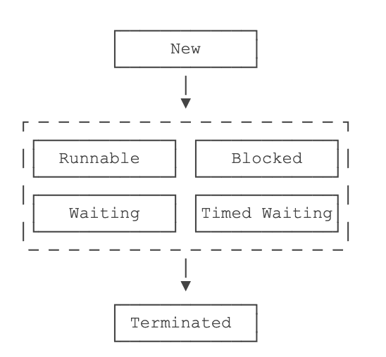

《Java教程》 笔记
----------

[《Java教程》](https://www.liaoxuefeng.com/wiki/1252599548343744)   廖雪峰

**为什么Java应用最广泛？**

从互联网到企业平台，Java是应用最广泛的编程语言，原因在于：

- Java是基于JVM虚拟机的跨平台语言，一次编写，到处运行；
- Java程序易于编写，而且有内置垃圾收集，不必考虑内存管理；
- Java虚拟机拥有工业级的稳定性和高度优化的性能，且经过了长时期的考验；
- Java拥有最广泛的开源社区支持，各种高质量组件随时可用。

Java语言常年霸占着三大市场：

- 互联网和企业应用，这是Java EE的长期优势和市场地位；
- 大数据平台，主要有Hadoop、Spark、Flink等，他们都是Java或Scala（一种运行于JVM的编程语言）开发的；
- Android移动平台。


## 1.Java快速入门

### 1.1 Java简介

Java介于编译型语言和解释型语言之间。编译型语言如C、C++，代码是直接编译成**机器码**执行，但是不同的平台（x86、ARM等）CPU的**指令集**不同，因此，需要编译出每一种平台的对应机器码。解释型语言如Python、Ruby没有这个问题，可以由解释器直接加载源码然后运行，代价是运行效率太低。而Java是将代码编译成一种“字节码”，它类似于抽象的CPU指令，然后，针对不同平台编写虚拟机，不同平台的虚拟机负责加载字节码并执行，这样就实现了“一次编写，到处运行”的效果。当然，这是针对Java开发者而言。对于虚拟机，需要为每个平台分别开发。为了保证不同平台、不同公司开发的虚拟机都能正确执行Java字节码，SUN公司制定了一系列的Java虚拟机规范。从实践的角度看，JVM的兼容性做得非常好，低版本的Java字节码完全可以正常运行在高版本的JVM上。

Java的三个版本：

- **Java EE**(Enterprise Edition)     企业版，在Java SE的基础上加上了大量的API和库，以便方便开发Web应用、数据库、消息服务等，使用的虚拟机和Java SE完全相同。
- **Java SE**(Standard Edition)    标准版，包含标准的JVM和标准库。
- **Java ME**(Micro Edition)   “瘦身版”，不建议学习。


推荐的Java学习路线图如下：

1. 首先要学习Java SE，掌握Java语言本身、Java核心开发技术以及Java标准库的使用；
2. 如果继续学习Java EE，那么Spring框架、数据库开发、分布式架构就是需要学习的；
3. 如果要学习大数据开发，那么Hadoop、Spark、Flink这些大数据平台就是需要学习的，他们都基于Java或Scala开发；
4. 如果想要学习移动开发，那么就深入Android平台，掌握Android App开发。

无论怎么选择，Java SE的核心技术是基础，这个教程的目的就是让你完全精通Java SE！

#### 名字解释

- JDK：Java Development Kit
- JRE：Java Runtime Environment

JRE就是**运行Java字节码的虚拟机**。但是，如果只有Java源码，要编译成Java字节码，就需要JDK，因为JDK除了包含JRE，还提供了编译器、调试器等开发工具。


- SR规范：Java Specification Request
- JCP组织：Java Community Process

为了保证Java语言的规范性，SUN公司搞了一个JSR规范，凡是想给Java平台加一个功能，比如说访问数据库的功能，大家要先创建一个JSR规范，定义好接口，这样，各个数据库厂商都按照规范写出Java驱动程序，开发者就不用担心自己写的数据库代码在MySQL上能跑，却不能跑在PostgreSQL上。

所以JSR是一系列的规范，从JVM的内存模型到Web程序接口，全部都标准化了。而负责审核JSR的组织就是JCP。

- RI：Reference Implementation
- TCK：Technology Compatibility Kit


#### 安装JDK


##### 设置环境变量

安装完JDK后，需要设置一个`JAVA_HOME`的环境变量，它指向JDK的安装目录。

[Java SE 文档](https://docs.oracle.com/en/java/javase/13/index.html)


##### JDK

`JAVA_HOME`的`bin`目录下找到很多可执行文件。

- `java`：这个可执行程序其实就是JVM，运行Java程序，就是启动JVM，然后让JVM执行指定的编译后的代码；
- `javac`：这是Java的编译器，它用于把Java源码文件（以`.java`后缀结尾）编译为Java字节码文件（以`.class`后缀结尾；
- `jar`：用于把一组`.class`文件打包成一个`.jar`文件，便于发布；
- `javadoc`：用于从Java源码中自动提取注释并生成文档；
- `jdb`：Java调试器，用于开发阶段的运行调试


#### 第一个Java程序

```java
public class Hello {
	public static void main(String[] args) {
		System.out.println("Hello, world!");
	}
}
```

Java规定，某个类定义的`public static void main(String[] args)`是Java程序的**固定入口方法**。

一个Java源码只能定义一个`public`类型的class，并且class名称和文件名要完全一致。

##### 如何运行Java程序

首先命令`javac`先把文本文件`Hello.java`编译成字节码文件`Hello.class`，然后命令`java`执行这个字节码文件：


```shell
$ javac Hello.java

$ ls
Hello.class	Hello.java

$ java Hello
Hello, world!
```

给虚拟机传递的参数`Hello`是我们定义的类名，虚拟机自动查找对应的class文件并执行。也可以直接运行`java Hello.java`文件。

在实际项目中，<u>单个不依赖第三方库的Java源码是非常罕见的，所以，绝大多数情况下，我们无法直接运行一个Java源码文件，原因是它需要依赖其他的库。</u>


#### 使用IDE

Eclipse  免费，本身使用Java开发，[下载地址](https://www.eclipse.org/downloads/packages/)

IntelliJ Idea

NetBeans

使用Eclipse IDE练习插件

**General > Editors > Text Editors**

钩上“Show line numbers”，这样编辑器会显示行号；

**General > Workspace**

钩上“Refresh using native hooks or polling”，这样Eclipse会自动刷新文件夹的改动；

对于“Text file encoding”，如果Default不是`UTF-8`，一定要改为“Other：UTF-8”，所有文本文件均使用`UTF-8`编码；

对于“New text file line delimiter”，建议使用Unix，即换行符使用`\n`而不是Windows的`\r\n`。

**Java > Compiler**

将“Compiler compliance level”设置为`13`，本教程的所有代码均使用Java 13的语法，并且编译到Java 13的版本。

去掉“Use default compliance settings”并钩上“Enable preview features for Java 13”，这样我们就可以使用Java 13的预览功能。

**Java > Installed JREs**

在Installed JREs中应该看到Java SE 13，如果还有其他的JRE，可以删除，以确保Java SE 13是默认的JRE。


<u>视图可以任意组合，然后把一组视图定义成一个Perspective（见5），Eclipse预定义了Java、Debug等几个Perspective，用于快速切换。</u>

#### IDE插件

安装重启后 ，在“Window”-“Show View”-“Other...”中查找插件

### 1.2 Java程序基础

#### 1.2.1 Java程序基本结构

```java
/**
 * 可以用来自动创建文档的注释
 */
public class Hello {  // 类名是Hello
    public static void main(String[] args) { // 返回值是void，表示没有任何返回值。String[]表示参数类型是String数组
        // 向屏幕输出文本:
        System.out.println("Hello, world!");
        /* 多行注释开始
        注释内容
        注释结束 */
    }
} // class定义结束
```

**类名要求**：以英文字母开头，后接字母，数字和下划线的组合；习惯以大写字母开头。

`public`是访问修饰符，不写`public`，也能正确编译，但是这个类将无法从命令行执行。

**方法名要求**：与类名类似，但以小写字母开头。

特殊的多行注释`/**   ...   */`，写在类和方法的定义处，可以用于自动创建文档。

eclipse代码快速格式化：`Ctrl+Shift+F`（macOS是`⌘+⇧+F`）


#### 1.2.2 变量和数据类型

##### 变量

在Java中，变量分为两种：**基本类型**的变量和**引用类型**的变量。

在Java中，变量必须先定义后使用。不定义初始值时，就相当于给它指定了默认值`0`。

##### 基本数据类型

**基本数据类型**是CPU可以直接进行运算的类型。Java定义了以下几种基本数据类型：

- 整数类型：byte，short，int，long
- 浮点数类型：float，double
- 字符类型：char
- 布尔类型：boolean

Java基本数据类型占用的字节数：

```ascii
       ┌───┐
  byte │   │
       └───┘
       ┌───┬───┐
 short │   │   │
       └───┴───┘
       ┌───┬───┬───┬───┐
   int │   │   │   │   │
       └───┴───┴───┴───┘
       ┌───┬───┬───┬───┬───┬───┬───┬───┐
  long │   │   │   │   │   │   │   │   │
       └───┴───┴───┴───┴───┴───┴───┴───┘
       ┌───┬───┬───┬───┐
 float │   │   │   │   │
       └───┴───┴───┴───┘
       ┌───┬───┬───┬───┬───┬───┬───┬───┐
double │   │   │   │   │   │   │   │   │
       └───┴───┴───┴───┴───┴───┴───┴───┘
       ┌───┬───┐
  char │   │   │
       └───┴───┘
```

##### 整型

##### 浮点型

##### 布尔类型

##### 字符类型

##### 常量

```java
final double PI = 3.14; // PI是一个常量
```

##### var关键字

`var`只是为了少写了变量类型

```java
StringBuilder sb = new StringBuilder();

var sb = new StringBuilder();
```

##### 变量的作用范围


#### 1.2.3 整数运算

整数运算永远是精确，除法只能得到整数部分。

##### 溢出

溢出<font color=#FF8C00>*不会出错*</font>，却会得到一个奇怪的结果：

```java
// 运算溢出
public class Main {
    public static void main(String[] args) {
        int x = 2147483640;
        int y = 15;
        int sum = x + y;
        System.out.println(sum); // -2147483641
    }
}
```


结果最高位变成了1，变成了一个负数。把int类型换成long类型就可以解决。


##### 自增/自减

##### 移位运算

对`byte`和`short`类型进行移位时，会首先转换为`int`再进行位移。左移实际上就是不断地×2，右移实际上就是不断地÷2。

##### 位运算

以快速判断一个IP是否在给定的网段内。

##### 运算优先级

##### 类型自动提升与强制转型


应该选择合适范围的整型（`int`或`long`），没有必要为了节省内存而使用`byte`和`short`进行整数运算。


#### 1.2.4 浮点数运算

浮点数只能进行加减乘除这些数值计算，不能做位运算和移位运算。

比较两个浮点数是否相等的方法是，判断两个浮点数之差的绝对值是否小于一个很小的数。

##### 类型提升

##### 溢出

- `NaN`表示Not a Number
- `Infinity`表示无穷大
- `-Infinity`表示负无穷大

##### 强制转型


比较两个浮点数通常比较它们的绝对值之差是否小于一个特定值


#### 1.2.5 布尔运算

布尔运算的一个重要特点是**短路运算**。如果一个布尔运算的表达式能提前确定结果，则后续的计算不再执行，直接返回结果。


#### 1.2.6 字符和字符串

##### 字符类型

因为Java在内存中总是使用Unicode表示字符，所以，一个英文字符和一个中文字符都用一个`char`类型表示，它们都占用两个字节。要显示一个字符的Unicode编码，只需将`char`类型直接赋值给`int`类型即可：

```java
int n1 = 'A'; // 字母“A”的Unicodde编码是65
int n2 = '中'; // 汉字“中”的Unicode编码是20013
```

还可以直接用转义字符`\u`+Unicode编码来表示一个字符：

```java
// 注意是十六进制:
char c3 = '\u0041'; // 'A'，因为十六进制0041 = 十进制65
char c4 = '\u4e2d'; // '中'，因为十六进制4e2d = 十进制20013
```

##### 字符串类型

常见的转义字符包括：

- `\"` 表示字符`"`
- `\'` 表示字符`'`
- `\\` 表示字符`\`
- `\n` 表示换行符
- `\r` 表示回车符
- `\t` 表示Tab
- `\u####` 表示一个Unicode编码的字符

##### 字符串连接

可以使用`+`连接任意字符串和其他数据类型，此时会将其他数据类型先自动转型为字符串，再连接。

##### 多行字符串

```java
String s = """
          SELECT * FROM
          users
          WHERE id > 100
          ORDER BY name DESC
          """;
```

##### 不可变特性

字符串的不可变是指字符串内容不可变

##### 空值null


```java
public class Main {
    public static void main(String[] args) {
        // 请将下面一组int值视为字符的Unicode码，把它们拼成一个字符串：
        int a = 72;
        int b = 105;
        int c = 65281;
      
        String s = "" + (char)a + (char)b + (char)c;
        System.out.println(s);
    }
}
```


#### 1.2.7 数组类型

Java的数组有几个特点：

- 数组所有元素初始化为默认值，整型都是`0`，浮点型是`0.0`，布尔型是`false`；
- 数组一旦创建后，大小就不可改变。

```java
 int[] ns = new int[] { 68, 79, 91, 85, 62 };
```


##### 字符串数组

```java
String[] names = {
    "ABC", "XYZ", "zoo"
};
```


### 1.3 流程控制

#### 输入和输出

```java
System.out.print("A,");			// 输出不换行

System.out.println("END");   // 输出并换行

System.out.printf("%.2f\n", d); // 格式化输出
```

##### 格式化输出

为什么要格式化输出？因为计算机表示的数据不一定适合人来阅读。

| 占位符 | 说明                             |
| :----- | :------------------------------- |
| %d     | 格式化输出整数                   |
| %x     | 格式化输出十六进制整数           |
| %f     | 格式化输出浮点数                 |
| %e     | 格式化输出科学计数法表示的浮点数 |
| %s     | 格式化字符串                     |

注意，由于%表示占位符，因此，连续两个%%表示一个%字符本身。


##### 输入

从控制台读取一个字符串和一个整数:

```java
import java.util.Scanner;

public class Main {
    public static void main(String[] args) {
        Scanner scanner = new Scanner(System.in); // 创建Scanner对象
        System.out.print("Input your name: "); // 打印提示
        String name = scanner.nextLine(); // 读取一行输入并获取字符串
        System.out.print("Input your age: "); // 打印提示
        int age = scanner.nextInt(); // 读取一行输入并获取整数
        System.out.printf("Hi, %s, you are %d\n", name, age); // 格式化输出
    }
}
```

`System.out`代表标准输出流，而`System.in`代表标准输入流。

Java提供Scanner对象来方便输入。

#### if

要判断引用类型的变量**内容**是否相等，必须使用`equals()`方法。

执行语句`s1.equals(s2)`时，如果变量`s1`为`null`，会报`NullPointerException`。


#### Switch多重选择??

对于多个`==`判断的情况，使用`switch`结构更加清晰。

`case`语句具有“*穿透性*”，任何时候都不要忘记写`break`。

建议按照自然顺序排列，便于阅读。


##### 编译检查

##### java 12开始，switch表达式简化

java12后不要break。

```java
public class Main {
    public static void main(String[] args) {
        String fruit = "apple";
        switch (fruit) {
        case "apple" -> System.out.println("Selected apple");
        case "pear" -> System.out.println("Selected pear");
        case "mango" -> {
            System.out.println("Selected mango");
            System.out.println("Good choice!");
        }
        default -> System.out.println("No fruit selected");
        }
    }
}

// 直接赋值
public class Main {
    public static void main(String[] args) {
        String fruit = "apple";
        int opt = switch (fruit) {
            case "apple" -> 1;
            case "pear", "mango" -> 2;
            default -> 0;
        }; // 注意赋值语句要以;结束
        System.out.println("opt = " + opt);
    }
}

```

##### yield

复杂的语句，可以放到`{...}`里，然后，用`yield`返回一个值作为`switch`语句的返回值：

```java
public class Main {
    public static void main(String[] args) {
        String fruit = "orange";
        int opt = switch (fruit) {
            case "apple" -> 1;
            case "pear", "mango" -> 2;
            default -> {
                int code = fruit.hashCode();
                yield code; // switch语句返回值
            }
        };
        System.out.println("opt = " + opt);
    }
}
```


#### while循环


#### do while循环

#### for循环

使用`for`循环时，千万不要在循环体内修改计数器！在循环体中修改计数器常常导致莫名其妙的逻辑错误。

##### `for each`

```java
int[] ns = { 1, 4, 9, 16, 25 };
for (int n : ns) {  // 循环的变量n不再是计数器，而是直接对应到数组的每个元素
  System.out.println(n);
}
```


#### break和continue

`break`会跳出当前循环，也就是整个循环都不会执行了。而`continue`则是提前结束本次循环，直接继续执行下次循环。


### 1.4 数组操作

#### 遍历数组

`for`

`for each`

`Arrays.toString()`

```java
        int[] ns = { 1, 1, 2, 3, 5, 8 };
        System.out.println(Arrays.toString(ns)); // 结果：[1, 1, 2, 3, 5, 8]
```


#### 数组排序

`Arrays.sort()`

#### 多维数组

`Arrays.deepToString()`

```java
import java.util.Arrays;

public class Main {
    public static void main(String[] args) {
        int[][] ns = {
            { 1, 2, 3, 4 },
            { 5, 6, 7, 8 },
            { 9, 10, 11, 12 }
        };
        System.out.println(Arrays.deepToString(ns));
      // [[1, 2, 3, 4], [5, 6, 7, 8], [9, 10, 11, 12]]
    }
}

```


#### 命令行参数


## 2.面向对象编程

### 2.1 面向对象基础

class是一种对象**模版**，它定义了如何创建实例。而instance是对象**实例**，instance是根据class创建的实例。

通过`new`操作符创建新的`instance`。访问实例字段的方法是`变量名.字段名`；

指向`instance`的变量都是引用变量。

#### 2.1.1 方法

直接操作`field`，容易造成逻辑混乱。为了避免外部代码直接去访问`field`，我们可以用`private`修饰`field`，拒绝外部访问。使用方法（`method`）来让外部代码可以间接修改`field`。

在方法内部，我们就有机会检查参数对不对。比如，`setAge()`就会检查传入的参数，参数超出了范围，直接报错。这样，外部代码就没有任何机会把`age`设置成不合理的值。

所以，一个类通过定义方法，就可以**给外部代码暴露一些操作的接口，同时，内部自己保证逻辑一致性**。

##### private方法

##### this变量

始终指向当前实例

```java
class Person {
    private String name;

    public void setName(String name) {
        this.name = name; // 前面的this不可少，少了就变成局部变量name了
    }
}
```


##### 方法参数

##### 可变参数

可变参数用`类型...`定义，可变参数相当于数组类型:

```java
class Group {
    private String[] names;

    public void setNames(String... names) {
        this.names = names;
    }
}
Group g = new Group();
g.setNames("Xiao Ming", "Xiao Hong", "Xiao Jun"); // 传入3个String
g.setNames("Xiao Ming", "Xiao Hong"); // 传入2个String
g.setNames("Xiao Ming"); // 传入1个String
g.setNames(); // 传入0个String
```

可以把可变参数改写为`String[]`类型。但调用方需要自己先构造`String[]`，比较麻烦。

可变参数可以保证无法传入`null`，因为传入0个参数时，接收到的实际值是一个空数组而不是`null`。

##### 参数绑定

基本类型参数的传递，是调用方值的复制。双方各自的后续修改，互不影响。

引用类型参数的传递，调用方的变量，和接收方的参数变量，指向的是同一个对象。双方任意一方对这个对象的修改，都会影响对方（因为指向同一个对象嘛）。


#### 2.1.2 构造方法

实例实际上是通过构造方法来初始化的。

```java
public class Main {
    public static void main(String[] args) {
        Person p = new Person("Xiao Ming", 15);
        System.out.println(p.getName());
        System.out.println(p.getAge());
    }
}

class Person {
    private String name;
    private int age;

    public Person(String name, int age) {
        this.name = name;
        this.age = age;
    }
    
    public String getName() {
        return this.name;
    }

    public int getAge() {
        return this.age;
    }
}
```

构造方法的名称就是类名。构造方法的参数没有限制，在方法内部，也可以编写任意语句。但是，和普通方法相比，构造方法**没有返回值**（也没有`void`），调用构造方法，必须用`new`操作符。

##### 默认构造方法

如果一个类没有定义构造方法，编译器会自动为我们生成一个默认构造方法，它**没有参数，也没有执行语句**。如果自定义了一个构造方法，那么，编译器就不再自动创建默认构造方法。

没有在构造方法中初始化字段时，引用类型的字段默认是`null`，数值类型的字段用默认值，`int`类型默认值是`0`，布尔类型默认值是`false`：

```
class Person {
    private String name; // 默认初始化为null
    private int age; // 默认初始化为0

    public Person() {
    }
}
```

也可以对字段直接进行初始化。

##### 多构造方法

编译器通过构造方法的参数数量、位置和类型自动区分多个构造方法。

一个构造方法可以调用其他构造方法，调用其他构造方法的语法是`this(…)` 。

#### 2.1.3 方法重载

方法名相同，但各自的参数不同，称为<font color=#FF8C00>**方法重载**</font>（`Overload`）。返回值类型通常都是相同的。

方法重载的目的是，**功能类似的方法使用同一名字，更容易记住**，因此，调用起来更简单。

#### 2.1.4 继承

```java
class Person {
    private String name;
    private int age;

    public String getName() {...}
    public void setName(String name) {...}
    public int getAge() {...}
    public void setAge(int age) {...}
}

class Student extends Person {
    // 不要重复name和age字段/方法,
    // 只需要定义新增score字段/方法:
    private int score;

    public int getScore() { … }
    public void setScore(int score) { … }
}
```

在OOP的术语中，把`Person`称为超类（super class）/父类（parent class）/基类（base class），把`Student`称为子类（subclass）/扩展类（extended class）。

##### 继承树


Java**只允许一个class继承自一个类**，因此，一个类有且仅有一个父类。没有明确写`extends`的类，编译器会自动加上`extends Object`。只有`Object`特殊，它没有父类。

##### protected

子类无法访问父类的`private`字段或者`private`方法。用`protected`修饰的字段可以被子类访问。`protected`关键字可以把字段和方法的访问权限控制在继承树内部。

##### super

任何`class`的构造方法，<font color=#FF8C00>**第一行语句必须是调用父类的构造方法**</font>。如果没有明确地调用父类的构造方法，编译器会帮我们自动加一句`super();`。

即**子类不会继承任何父类的构造方法**。子类默认的构造方法是编译器自动生成的，不是继承的。

```java
public class Main {
    public static void main(String[] args) {
        Student s = new Student("Xiao Ming", 12, 89);
    }
}

class Person {
    protected String name;
    protected int age;

    public Person(String name, int age) {
        this.name = name;
        this.age = age;
    }
}

class Student extends Person {
    protected int score;

    public Student(String name, int age, int score) {
        super(name, age);
        this.score = score;
        
    }
}
```


##### 向上转型

```java
Person p = new Student();
```

这种把一个子类类型安全地变为父类类型的赋值，被称为<font color=#FF8C00>**向上转型（upcasting）**</font>。

##### 向下转型

如果把一个父类类型强制转型为子类类型，就是<font color=#FF8C00>**向下转型（downcasting）**</font>

向下转型很可能会失败。失败的时候，Java虚拟机会报`ClassCastException`。

`instanceof`

##### 区分继承和组合

继承是is关系，组合是has关系。


Java只允许单继承，所有类最终的根类是`Object`。

#### 2.1.4 多态

在继承关系中，子类如果定义了一个与父类方法签名完全相同的方法，被称为<font color=#FF8C00>**覆写（Override）**</font>。

```java
class Person {
    public void run() {
        System.out.println("Person.run");
    }
}

class Student extends Person {
    @Override
    public void run() {
        System.out.println("Student.run");
    }
}
```

Override和Overload不同的是，如果方法签名如果不同，就是Overload，Overload方法是一个新方法；如果方法签名相同，并且返回值也相同，就是`Override`。

Java的实例方法调用是基于运行时的实际类型的动态调用，而非变量的声明类型。

##### 多态

**多态**是指，针对某个类型的方法调用，其真正执行的方法取决于运行时期实际类型的方法。

多态实例：

```java
class Income {
    protected double income;
    public double getTax() {
        return income * 0.1; // 税率10%
    }
}

class Salary extends Income {
    @Override
    public double getTax() {
        if (income <= 5000) {
            return 0;
        }
        return (income - 5000) * 0.2;
    }
}
// 国务院特殊津贴免税
class StateCouncilSpecialAllowance extends Income {
    @Override
    public double getTax() {
        return 0;
    }
}

public class Main {
    public static void main(String[] args) {
        // 给一个有普通收入、工资收入和享受国务院特殊津贴的小伙伴算税:
        Income[] incomes = new Income[] {
            new Income(3000),
            new Salary(7500),
            new StateCouncilSpecialAllowance(15000)
        };
        System.out.println(totalTax(incomes));
    }

    public static double totalTax(Income... incomes) {
        double total = 0;
        for (Income income: incomes) {
            total = total + income.getTax();
        }
        return total;
    }
}
```

利用多态，`totalTax()`方法只需要和`Income`打交道，它完全不需要知道`Salary`和`StateCouncilSpecialAllowance`的存在，就可以正确计算出总的税。如果我们要新增一种稿费收入，只需要从`Income`派生，然后正确覆写`getTax()`方法就可以。把新的类型传入`totalTax()`，不需要修改任何代码。

多态具有一个非常强大的功能，就是**允许添加更多类型的子类实现功能扩展，却不需要修改基于父类的代码**。

##### 覆写Object方法

因为所有的`class`最终都继承自`Object`，而`Object`定义了几个重要的方法：

- `toString()`：把instance输出为`String`；
- `equals()`：判断两个instance是否逻辑相等；
- `hashCode()`：计算一个instance的哈希值。

```java
class Person {
    ...
    // 显示更有意义的字符串:
    @Override
    public String toString() {
        return "Person:name=" + name;
    }

    // 比较是否相等:
    @Override
    public boolean equals(Object o) {
        // 当且仅当o为Person类型:
        if (o instanceof Person) {
            Person p = (Person) o;
            // 并且name字段相同时，返回true:
            return this.name.equals(p.name);
        }
        return false;
    }

    // 计算hash:
    @Override
    public int hashCode() {
        return this.name.hashCode();
    }
}
```

##### 调用super

在子类的覆写方法中，如果要调用父类的被覆写的方法，可以通过`super`来调用。

##### final

用`final`修饰的方法不能被`Override`。

用`final`修饰的类不能被继承。

`final`修饰的field必须在创建对象时初始化，之后不可修改。


#### 2.1.5 抽象类

如果父类的方法本身不需要实现任何功能，**仅仅是为了定义方法签名**，目的是让子类去覆写它，那么，可以把父类的方法声明为抽象方法：

```java
class Person {
    public abstract void run();
}
```

因为无法执行抽象方法，因此这个类也必须申明为**抽象类（abstract class）**。

**无法实例化一个抽象类**，抽象类本身被设计成只能用于被继承，因此，抽象类可以强迫子类实现其定义的抽象方法，否则编译会报错。因此，抽象方法实际上相当于定义了**“规范”**。

##### 面向抽象编程

```java
Person s = new Student();
Person t = new Teacher();
// 不关心Person变量的具体子类型:
s.run();
t.run();

// 同样不关心新的子类是如何实现run()方法的：
Person e = new Employee();
e.run();

```


这种尽量引用高层类型，避免引用实际子类型的方式，称之为**面向抽象编程**。

面向抽象编程的本质就是：

- 上层代码只定义规范（例如：`abstract class Person`）；
- 不需要子类就可以实现业务逻辑（正常编译）；
- 具体的业务逻辑由不同的子类实现，调用者并不关心。

#### 2.1.6 接口

如果一个抽象类没有字段，所有方法全部都是抽象方法：

```java
abstract class Person {
    public abstract void run();
    public abstract String getName();
}
```

就可以把该抽象类改写为接口：`interface`。

```java
interface Person {
    void run();
    String getName();
}
```

所谓`interface`，就是比抽象类还要抽象的纯抽象接口，口定义的所有方法默认都是`public abstract`的，可以省略。

在Java中，一个类不能从多个类继承，但是，可以实现多个`interface`：

```java
class Student implements Person, Hello { // 实现了两个interface
    ...
}
```

##### 术语

**Java的接口**特指`interface`的定义，表示一个接口类型和一组方法签名，而**编程接口**泛指接口规范，如方法签名，数据格式，网络协议等。

##### 接口继承

一个`interface`可以继承自另一个`interface`。

```java
interface Hello {
    void hello();
}

interface Person extends Hello {
    void run();
    String getName();
}
```

##### 继承关系

合理设计`interface`和`abstract class`的继承关系，可以充分复用代码。一般来说，<font color=#FF8C00>**公共逻辑**</font>适合放在`abstract class`中，<font color=#FF8C00>**具体逻辑**</font>放到各个子类，而接口层次代表**抽象程度**。可以参考Java的集合类定义的一组接口、抽象类以及具体子类的继承关系：


在使用的时候，实例化的对象永远只能是某个具体的子类，但总是通过接口去引用它，因为接口比抽象类更抽象：

```java
List list = new ArrayList(); // 用List接口引用具体子类的实例
Collection coll = list; // 向上转型为Collection接口
Iterable it = coll; // 向上转型为Iterable接口
```

##### default方法

在接口中，可以定义`default`方法。

实现类可以不必覆写`default`方法。`default`方法的目的是，当我们需要给接口新增一个方法时，会涉及到修改全部子类。如果新增的是`default`方法，那么子类就不必全部修改，只需要在需要覆写的地方去覆写新增方法。

`default`方法和抽象类的普通方法是有所不同的。因为`interface`没有字段，`default`方法无法访问字段，而抽象类的普通方法可以访问实例字段。


接口也是数据类型，适用于向上转型和向下转型；

#### 2.1.7 静态字段和静态方法

**实例字段**

**静态字段**  `static`

静态字段并不属于实例。


不推荐用`实例变量.静态字段`去访问静态字段，推荐用类名来访问静态字段。在代码中，实例对象能访问静态字段只是因为编译器可以根据实例类型自动转换为`类名.静态字段`来访问静态对象。

##### 静态方法

静态方法内部，无法访问`this`变量，也无法访问实例字段，它只能访问静态字段。

静态方法经常用于**工具类**。例如：

- Arrays.sort()
- Math.random()

静态方法也经常用于**辅助方法**。注意到Java程序的入口`main()`也是静态方法。

##### 接口的静态字段

因为`interface`是一个纯抽象类，所以它不能定义实例字段，但可以有静态字段，并且只能是`public static final`类型。

```java
public interface Person {
    // 编译器会自动加上public statc final:
    int MALE = 1;
    int FEMALE = 2;
}
```

#### 2.1.8 包

`package`

一个类总是属于某个包，类名（比如`Person`）只是一个简写，完整类名是`包名.类名`

> 注意：包没有父子关系。java.util和java.util.zip是不同的包，两者没有任何继承关系。


我们还需要按照包结构把上面的Java文件组织起来。假设以`package_sample`作为根目录，`src`作为源码目录，那么所有文件结构就是：

```
package_sample
└─ src
    ├─ hong
    │  └─ Person.java
    │  ming
    │  └─ Person.java
    └─ mr
       └─ jun
          └─ Arrays.java
```

即所有Java文件对应的目录层次要和包的层次一致。

编译后的`.class`文件也需要按照包结构存放。如果使用IDE，把编译后的`.class`文件放到`bin`目录下，那么，编译的文件结构就是：

```ascii
package_sample
└─ bin
   ├─ hong
   │  └─ Person.class
   │  ming
   │  └─ Person.class
   └─ mr
      └─ jun
         └─ Arrays.class
```

##### 包作用域


##### import

`import static`的语法，它可以导入一个类的静态字段和静态方法：

```java
// 导入System类的所有静态字段和静态方法:
import static java.lang.System.*;
```


Java编译器最终编译出的`.class`文件只使用**完整类名**，当编译器遇到类时：

- 如果是完整类名，就直接根据完整类名查找这个`class`；
- 如果是简单类名，按下面的顺序依次查找：
  - 查找当前`package`是否存在这个`class`；
  - 查找`import`的包是否包含这个`class`；
  - 查找`java.lang`包是否包含这个`class`。


> 注意：自动导入的是java.lang包，但类似java.lang.reflect这些包仍需要手动导入。


##### 最佳实践

包名推荐使用倒置的域名来确保唯一性。如：`org.apache.commons.log`，`com.andyron.sample`。

不要和`java.lang`包的类重名，不适用如：String，System，Runtime...

也不要和JDK常用类重名：`java.util.List`，`java.text.Format`，`java.math.BigInteger`...


#### 2.1.9 作用域

`public`

`protected`   可以被子类访问

`private `  访问权限被限定在`class`的内部(建议把这种方法放在后面)


阅读代码的时候，应该先关注`public`方法，因为`public`方法定义了类对外提供的功能。


##### 局部变量

##### final

用`final`修饰`class`可以阻止被继承

用`final`修饰`method`可以阻止被子类覆写

用`final`修饰`field`可以阻止被重新赋值

用`final`修饰局部变量可以阻止被重新赋值


##### 小结

如果不确定是否需要`public`，就不声明为`public`，即**尽可能少地暴露对外的字段和方法**。

一个`.java`文件只能包含一个`public`类，但可以包含多个非`public`类。如果有`public`类，文件名必须和`public`类的名字相同。


#### 2.1.10 classpath和jar

`classpath`是<font color=#FF8C00>JVM用到的一个环境变量，它用来指示JVM如何搜索`class`</font>。

因为Java是编译型语言，源码文件是`.java`，而编译后的`.class`文件才是真正可以被JVM执行的字节码。因此，JVM需要知道，如果要加载一个`abc.xyz.Hello`的类，应该去哪搜索对应的`Hello.class`文件。

所以，`classpath`就是一组目录的集合，它设置的搜索路径与操作系统相关。例如，在Windows系统上，用`;`分隔，带空格的目录用`""`括起来，可能长这样：

```
C:\work\project1\bin;C:\shared;"D:\My Documents\project1\bin"
```

在Linux系统上，用`:`分隔，可能长这样：

```
/usr/shared:/usr/local/bin:/home/liaoxuefeng/bin
```

现在我们假设`classpath`是`.;C:\work\project1\bin;C:\shared`，当JVM在加载`abc.xyz.Hello`这个类时，会依次查找：

- <当前目录>\abc\xyz\Hello.class
- C:\work\project1\bin\abc\xyz\Hello.class
- C:\shared\abc\xyz\Hello.class

`classpath`的设定两种方法：

- 在系统环境变量中设置`classpath`环境变量，不推荐；

- 在启动JVM时设置`classpath`变量，**推荐**。

启动JVM时设置，就是在命令行是加参数`cp`。没有设置就在当前目录中寻找。

在IDE中运行Java程序，IDE自动传入的`-cp`参数是当前工程的`bin`目录和引入的jar包。

> 不要把任何Java核心库添加到classpath中！JVM根本不依赖classpath加载核心库！

##### jar包

如果有很多`.class`文件，散落在各层目录中，肯定不便于管理。如果能把目录打一个包，变成一个文件，就方便多了。

jar包就是用来干这个事的，它可以把`package`组织的目录层级，以及各个目录下的所有文件（包括`.class`文件和其他文件）都打成一个jar文件，这样一来，无论是备份，还是发给客户，就简单多了。


如果我们要执行一个jar包的`class`，就可以把jar包放到`classpath`中：

```
java -cp ./hello.jar abc.xyz.Hello
```

这样JVM会自动在`hello.jar`文件里去搜索某个类。


jar包就是zip包。

`/META-INF/MANIFEST.MF`

#### 2.1.11 模块

从Java 9开始，JDK又引入了模块（Module）。

`.class`文件是JVM看到的最小可执行文件，而一个大型程序需要编写很多Class，并生成一堆`.class`文件，很不便于管理，所以，<u>`jar`文件就是`class`文件的容器</u>。

在Java 9之前，一个大型Java程序会生成自己的jar文件，同时引用依赖的第三方jar文件，而JVM自带的Java标准库，实际上也是以jar文件形式存放的，这个文件叫`rt.jar`，一共有60多M。

如果是自己开发的程序，除了一个自己的`app.jar`以外，还需要一堆第三方的jar包，运行一个Java程序，一般来说，命令行写这样：

```bash
java -cp app.jar:a.jar:b.jar:c.jar com.liaoxuefeng.sample.Main
```

如果漏写了某个运行时需要用到的jar，那么在运行期极有可能抛出`ClassNotFoundException`。

所以，**==jar只是用于存放class的容器，它并不关心class之间的依赖。==**

模块就是用来解决<font color=#FF8C00>依赖</font>问题的。Java9后原本`rt.jar`被分拆层十几个模块，以`.jmod`文件存储在`$JAVA_HOME/jmods`目录里。

这些`.jmod`文件每一个都是一个模块，模块名就是文件名。例如：模块`java.base`对应的文件就是`java.base.jmod`。模块之间的依赖关系已经被写入到模块内的`module-info.class`文件了。所有的模块都直接或间接地依赖`java.base`模块，只有`java.base`模块不依赖任何模块，它可以被看作是“根模块”，好比所有的类都是从`Object`直接或间接继承而来。

把一堆class封装为jar仅仅是一个打包的过程，而把一堆class封装为模块则不但需要打包，还需要写入依赖关系，并且还可以包含二进制代码（通常是JNI扩展）。此外，模块支持多版本，即在同一个模块中可以为不同的JVM提供不同的版本。

##### 编写模块

- 创建目录`oop-module`并进入，创建如下结构：

```java
oop-module
├── bin
└── src
    ├── com
    │   └── andyron
    │       └── sample
    │           ├── Greeting.java
    │           └── Main.java
    └── module-info.java
```

`bin`目录存放编译后的class文件，`src`目录存放源码，按包名的目录结构存放，仅仅在`src`目录下多了一个`module-info.java`这个文件，这就是==模块的描述文件==：

```java
module hello.world {
	requires java.base; // 可不写，任何模块都会自动引入java.base
	requires java.xml;
}
```

`module`是关键字，后面的`hello.world`是模块的名称，它的命名规范与包一致。花括号的`requires xxx;`表示这个模块需要引用的其他模块名。

当使用模块声明了依赖关系后，才能使用引入的模块，如`Main.java`代码：

```java
package com.andyron.sample;

// 必须引入java.xml模块后才能使用其中的类:
import javax.xml.XMLConstants;

public class Main {
	public static void main(String[] args) {
		Greeting g = new Greeting();
		System.out.println(g.hello(XMLConstants.XML_NS_PREFIX));
	}
}
```

- 用JDK提供的命令行工具来编译并创建模块。

```shell
javac -d bin src/module-info.java src/com/andyron/sample/*.java
```

会生成如下结构：

```
oop-module
├── bin
│   ├── com
│   │   └── andyron
│   │       └── sample
│   │           ├── Greeting.class
│   │           └── Main.class
│   └── module-info.class
└── src
    ├── com
    │   └── andyron
    │       └── sample
    │           ├── Greeting.java
    │           └── Main.java
    └── module-info.java
```


- 把bin目录下的所有class文件先打包成jar。

```shell
jar --create --file hello.jar --main-class com.andyron.sample.Main -C bin .
```

`--main-class`参数，让这个jar包能自己定位`main`方法所在的类。

可以直接使用`java -jar hello.jar`命令来运行这个生成的目录。

- 使用`jmod`命令把一个jar包转换成模块

```shell
jmod create --class-path hello.jar hello.jmod
```

##### 运行模块

```shell
java --module-path hello.jmod --module hello.world
```

错误：

```
Error occurred during initialization of boot layer
java.lang.module.FindException: JMOD format not supported at execution time: hello.jmod
```

原因是`.jmod`不能被放入`--module-path`中。换成`.jar`就没问题了：

```shell
$ java --module-path hello.jar --module hello.world
Hello, xml!  
```

模块`hello.jmod`可以用来打包JRE。

##### 打包JRE

运行Java程序的时候，实际上我们用到的JDK模块，并没有那么多。不需要的模块，完全可以删除。

过去发布一个Java应用程序，要运行它，必须下载一个完整的JRE，再运行jar包。而完整的JRE块头很大，有100多M。

现在，JRE自身的标准库已经分拆成了模块，只需要带上自己程序用到的模块，其他的模块就可以被裁剪掉。

并不是说把系统安装的JRE给删掉部分模块，而是“复制”一份JRE，但只带上用到的模块。JDK提供了`jlink`命令来干这件事。

```shell
jlink --module-path hello.jmod --add-modules java.base,java.xml,hello.world --output jre/
```

`--module-path`参数指定了我们自己的模块`hello.jmod`，然后，在`--add-modules`参数中指定了我们用到的3个模块`java.base`、`java.xml`和`hello.world`，用`,`分隔。最后，在`--output`参数指定输出目录。

此时的`jre`目录是一个完整的并且带有我们自己`hello.jmod`模块的JRE。可以直接运行这个JRE：

```shell
$ jre/bin/java --module hello.world
Hello, xml!
```

<u>要分发我们自己的Java应用程序，只需要把这个`jre`目录打个包给对方发过去，对方直接运行上述命令即可，既不用下载安装JDK，也不用知道如何配置我们自己的模块，极大地方便了分发和部署。</u>

##### 访问权限

Java的class访问权限分为public、protected、private和默认的包访问权限。引入模块后，这些访问权限的规则就要稍微做些调整。class的这些访问权限只在一个模块内有效，模块和模块之间，例如，a模块要访问b模块的某个class，必要条件是b模块明确地==导出==了可以访问的包。

比如：我们编写的模块`hello.world`用到了模块`java.xml`的一个类`javax.xml.XMLConstants`，我们之所以能直接使用这个类，是因为模块`java.xml`的`module-info.java`中声明了若干导出：

```java
module java.xml {
    exports java.xml;
    exports javax.xml.catalog;
    exports javax.xml.datatype;
    ...
}
```

只有它声明的导出的包，外部代码才被允许访问。换句话说，如果外部代码想要访问我们的`hello.world`模块中的`com.andyron.sample.Greeting`类，我们必须将其导出：

```java
module hello.world {
    exports com.andyron.sample;

    requires java.base;
		requires java.xml;
}
```

因此，模块进一步隔离了代码的访问权限。

### 2.2 Java核心类

#### 2.2.1 字符串和编码??

`String`是一个引用类型，它本身也是一个`class`。

##### 字符串比较

实际上是比较字符串的内容是否相同。必须使用`equals()`方法而不能用`==`。

`equalsIgnoreCase()`

```java
// 是否包含子串:
"Hello".contains("ll"); // true

"Hello".indexOf("l"); // 2
"Hello".lastIndexOf("l"); // 3
"Hello".startsWith("He"); // true
"Hello".endsWith("lo"); // true

"Hello".substring(2); // "llo"
"Hello".substring(2, 4); "ll"
```


##### 去除首尾空白字符

`trim()`并没有改变字符串的内容，而是返回了一个新字符串。它移除字符串首尾空白字符。空白字符包括空格，`\t`，`\r`，`\n`。

`strip()`和`trim()`不同的是，类似中文的空格字符`\u3000`也会被移除。

`String`还提供了`isEmpty()`和`isBlank()`。

```

##### 替换子串

`replace()`

`replaceAll()`  正则替换

##### 分割字符串

`split()`

##### 拼接字符串

静态方法`join()`

##### 类型转换

要把任意基本类型或引用类型转换为字符串，可以使用静态方法`valueOf()`。这是一个重载方法，编译器会根据参数自动选择合适的方法：

​```java
String.valueOf(123); // "123"
String.valueOf(45.67); // "45.67"
String.valueOf(true); // "true"
String.valueOf(new Object()); // 类似java.lang.Object@636be97c
```

要把字符串转换为其他类型，就需要根据情况。例如，把字符串转换为`int`类型：

```
int n1 = Integer.parseInt("123"); // 123
int n2 = Integer.parseInt("ff", 16); // 按十六进制转换，255
```

把字符串转换为`boolean`类型：

```
boolean b1 = Boolean.parseBoolean("true"); // true
boolean b2 = Boolean.parseBoolean("FALSE"); // false
```

要特别注意，`Integer`有个`getInteger(String)`方法，它不是将字符串转换为`int`，而是把该字符串对应的系统变量转换为`Integer`：

```
Integer.getInteger("java.version"); // 版本号，11
```

##### 转换为char[]


##### 字符编码


#### 2.2.2 StringBuilder

为了能高效拼接字符串，Java标准库提供了`StringBuilder`，它是一个可变对象，可以预分配缓冲区。往`StringBuilder`中新增字符时，不会创建新的临时对象：


#### 2.2.3 StringJoiner

高效拼接字符串

```java
import java.util.StringJoiner;

public class Main {
    public static void main(String[] args) {
        String[] names = {"Bob", "Alice", "Grace"};
        var sj = new StringJoiner(", ", "Hello ", "!");
        for (String name : names) {
            sj.add(name);
        }
        System.out.println(sj.toString());  // Hello Bob, Alice, Grace!
    }
}

```


静态方法 `String.join()`，在内部使用了`StringJoiner`来拼接字符串，在不需要指定“开头”和“结尾”的时候，用`String.join()`更方便。

#### 2.2.4 包装类型

Java的数据类型分两种：

- 基本类型：`byte`，`short`，`int`，`long`，`boolean`，`float`，`double`，`char`
- 引用类型：所有`class`和`interface`类型

引用类型可以赋值为`null`，表示空，但基本类型不能赋值为`null`。

通过包装类可以把基本类型变成引用类型，比如定义一个`Integer`类，它只包含一个实例字段`int`，这样，`Integer`类就可以视为`int`的**包装类（Wrapper Class）**：

```java
public class Integer {
    private int value;

    public Integer(int value) {
        this.value = value;
    }

    public int intValue() {
        return this.value;
    }
}

Integer n = null;
Integer n2 = new Integer(99);
int n3 = n2.intValue();
```

包装类型非常有用，Java核心库为每种基本类型都提供了对应的包装类型：

| 基本类型 | 对应的引用类型      |
| :------- | :------------------ |
| boolean  | java.lang.Boolean   |
| byte     | java.lang.Byte      |
| short    | java.lang.Short     |
| int      | java.lang.Integer   |
| long     | java.lang.Long      |
| float    | java.lang.Float     |
| double   | java.lang.Double    |
| char     | java.lang.Character |

```java
int i = 100;
// 通过new操作符创建Integer实例(不推荐使用,会有编译警告):
Integer n1 = new Integer(i);
// 通过静态方法valueOf(int)创建Integer实例:
Integer n2 = Integer.valueOf(i);
// 通过静态方法valueOf(String)创建Integer实例:
Integer n3 = Integer.valueOf("100");
System.out.println(n3.intValue());
```


##### Auto Boxing

`int`和`Integer`可以互相转换：

```java
int i = 100;
Integer n = Integer.valueOf(i);
int x = n.intValue();
```

Java编译器也可以自动在`int`和`Integer`之间转型：

```java
Integer n = 100; // 编译器自动使用Integer.valueOf(int)
int x = n; // 编译器自动使用Integer.intValue()
```

这种直接把`int`变为`Integer`的赋值写法，称为**自动装箱（Auto Boxing**）

<u>自动装箱和自动拆箱只发生在编译阶段，目的是为了少写代码。</u>

装箱和拆箱会影响执行效率，且拆箱时可能发生`NullPointerException`。

包装类型的比较必须使用`equals()`；

整数和浮点数的包装类型都继承自`Number`；

包装类型提供了大量实用方法。

##### 不变类


##### 进制转换


##### 处理无符号整型


#### 2.2.5 JavaBean

如果读写方法符合以下这种命名规范：

```java
// 读方法:
public Type getXyz()
// 写方法:
public void setXyz(Type value)
```

那么这种`class`被称为`JavaBean`。

##### JavaBean的作用

JavaBean主要用来传递数据，即把一组数据组合成一个JavaBean便于传输。此外，JavaBean可以方便地被IDE工具分析，生成读写属性的代码，主要用在图形界面的可视化设计中。


##### 枚举JavaBean属性

使用`Introspector.getBeanInfo()`可以获取属性列表。

属性是一种通用的叫法，并非Java语法规定。

```java
import java.beans.*;

public class Main {
    public static void main(String[] args) throws Exception {
        BeanInfo info = Introspector.getBeanInfo(Person.class);
        for (PropertyDescriptor pd : info.getPropertyDescriptors()) {
            System.out.println(pd.getName());
            System.out.println("  " + pd.getReadMethod());
            System.out.println("  " + pd.getWriteMethod());
        }
    }
}

class Person {
    private String name;
    private int age;

    public String getName() {
        return name;
    }

    public void setName(String name) {
        this.name = name;
    }

    public int getAge() {
        return age;
    }

    public void setAge(int age) {
        this.age = age;
    }
}

```

结果：

```
age
  public int Person.getAge()
  public void Person.setAge(int)
class
  public final native java.lang.Class java.lang.Object.getClass()
  null
name
  public java.lang.String Person.getName()
  public void Person.setName(java.lang.String)
```


#### 2.2.6 枚举类

```java
enum Weekday {
    SUN, MON, TUE, WED, THU, FRI, SAT;
}
```

和`int`定义的常量相比，使用`enum`定义枚举有如下好处:

1. `enum`常量本身带有类型信息，即`Weekday.SUN`类型是`Weekday`，编译器会自动检查出类型错误。
2. 不可能引用到非枚举的值，因为无法通过编译。

##### enum的比较

引用类型比较使用`equals()`，不能使用`==`。虽然enum类型也是引用类型，但enum类型比较也可以使用`==`，因为`enum`类型的每个常量在JVM中只有一个唯一实例。

```java
if (day == Weekday.FRI) { // ok!
}
if (day.equals(Weekday.SUN)) { // ok, but more code!
}
```

##### enum类型

通过`enum`定义的枚举类，和其他的`class`没有任何区别。`enum`定义的类型就是`class`，只不过它有以下几个特点：

- 定义的`enum`类型总是继承自`java.lang.Enum`，且无法被继承；
- 只能定义出`enum`的实例，而无法通过`new`操作符创建`enum`的实例；
- 定义的每个实例都是引用类型的唯一实例；
- 可以将`enum`类型用于`switch`语句。

例如，`Color`枚举类的定义：

```java
public enum Color {
    RED, GREEN, BLUE;
}
```

编译器编译出的`class`大概就像这样：

```java
public final class Color extends Enum { // 继承自Enum，标记为final class
    // 每个实例均为全局唯一:
    public static final Color RED = new Color();
    public static final Color GREEN = new Color();
    public static final Color BLUE = new Color();
    // private构造方法，确保外部无法调用new操作符:
    private Color() {}
}
```

因为`enum`也是`class`，所以它也有一些实例方法：

```java
String s = Weekday.SUN.name(); // "SUN"
int n = Weekday.MON.ordinal(); // 1   返回常量定义的顺序（无实质意义）
```

##### switch


可以为`enum`编写构造方法、字段和方法

`enum`的构造方法要声明为`private`，字段强烈建议声明为`final`；

#### 2.2.7 BigInteger

`java.math.BigInteger`就是用来表示任意大小的整数。`BigInteger`内部用一个`int[]`数组来模拟一个非常大的整数。

`BigInteger`是不变类，并且继承自`Number`；将`BigInteger`转换成基本类型时可使用`longValueExact()`等方法保证结果准确。

#### 2.2.8 BigDecimal

`BigDecimal`可以表示一个任意大小且精度完全准确的浮点数，常用于财务计算，比较`BigDecimal`的值是否相等，必须使用`compareTo()`而不能使用`equals()`。

#### 2.2.9 常用工具类

##### Math

```java
Math.abs(-100); // 100
Math.max(100, 99); // 100
Math.min(1.2, 2.3); // 1.2
Math.pow(2, 10); // 2的10次方=1024
Math.sqrt(2); // √x   1.414...
Math.exp(2); // 7.389...
Math.log(4); // 以e为底的对数 1.386...
Math.log10(100); // 以10为底的对数 2

Math.sin(3.14); // 0.00159...
Math.cos(3.14); // -0.9999...
Math.tan(3.14); // -0.0015...
Math.asin(1.0); // 1.57079...
Math.acos(1.0); // 0.0

Math.PI
Math.E

Math.random(); // 随机数的范围是0 <= x < 1：
```


##### Random

`Random`用来创建伪随机数。所谓伪随机数，是指只要给定一个初始的种子，产生的随机数序列是完全一样的。

```java
Random r = new Random();
r.nextInt(); // 2071575453,每次都不一样
r.nextInt(10); // 5,生成一个[0,10)之间的int
r.nextLong(); // 8811649292570369305,每次都不一样
r.nextFloat(); // 0.54335...生成一个[0,1)之间的float
r.nextDouble(); // 0.3716...生成一个[0,1)之间的double
```


Math.random()`实际上内部调用了`Random`类，所以它也是伪随机数，只是我们无法指定种子。

##### SecureRandom

实际上真正的真随机数只能通过量子力学原理来获取，而我们想要的是一个不可预测的安全的随机数，`SecureRandom`就是用来创建安全的随机数的：

```java
SecureRandom sr = new SecureRandom();
System.out.println(sr.nextInt(100));
```

`SecureRandom`无法指定种子，它使用RNG（random number generator）算法。


## 3.异常处理

### 3.1 Java的异常

一个健壮的程序必须处理各种各样的错误。

所谓**错误**，就是程序调用某个函数的时候，如果失败了，就表示出错。

<u>调用方如何获知调用失败的信息？</u>有两种方法：

方法一：约定返回错误码。

方法二：在语言层面上提供一个异常处理机制。

Java的异常是`class`，它的继承关系如下：


`Throwable`是异常体系的根。`Throwable`有两个体系：`Error`和`Exception`，`Error`表示严重的错误，程序对此一般无能为力，例如：

- `OutOfMemoryError`：内存耗尽
- `NoClassDefFoundError`：无法加载某个Class
- `StackOverflowError`：栈溢出

而`Exception`则是运行时的错误，它可以被捕获并处理。

某些异常是应用程序逻辑处理的一部分，应该捕获并处理。例如：

- `NumberFormatException`：数值类型的格式错误
- `FileNotFoundException`：未找到文件
- `SocketException`：读取网络失败

还有一些异常是程序逻辑编写不对造成的，应该修复程序本身。例如：

- `NullPointerException`：对某个`null`的对象调用方法或字段
- `IndexOutOfBoundsException`：数组索引越界

`Exception`又分为两大类：

1. `RuntimeException`以及它的子类；
2. 非`RuntimeException`（包括`IOException`、`ReflectiveOperationException`等等）

Java规定：

- 必须捕获的异常，包括`Exception`及其子类，但不包括`RuntimeException`及其子类，这种类型的异常称为Checked Exception。
- 不需要捕获的异常，包括`Error`及其子类，`RuntimeException`及其子类。

### 3.2 捕获异常

`try...catch`

所有异常都可以调用`printStackTrace()`方法打印异常栈，这是一个简单有用的快速打印异常的方法。

#### 多catch语句

存在多个`catch`的时候，`catch`的顺序非常重要：子类必须写在前面。

#### finally语句

`finally`语句块保证有无错误都会执行。`finally`总是最后执行。
```java
    try {
        process1();
        process2();
        process3();
    } catch (UnsupportedEncodingException e) {
        System.out.println("Bad encoding");
    } catch (IOException e) {
        System.out.println("IO error");
    } finally {
        System.out.println("END");
    }
```


#### 捕获多种异常


### 3.3 抛出异常

当某个方法抛出了异常时，如果当前方法没有捕获异常，异常就会被抛到上层调用方法，直到遇到某个`try ... catch`被捕获为止


### 3.4 自定义异常

Java标准库定义的常用异常包括：

```ascii
Exception
│
├─ RuntimeException
│  │
│  ├─ NullPointerException
│  │
│  ├─ IndexOutOfBoundsException
│  │
│  ├─ SecurityException
│  │
│  └─ IllegalArgumentException
│     │
│     └─ NumberFormatException
│
├─ IOException
│  │
│  ├─ UnsupportedCharsetException
│  │
│  ├─ FileNotFoundException
│  │
│  └─ SocketException
│
├─ ParseException
│
├─ GeneralSecurityException
│
├─ SQLException
│
└─ TimeoutException
```


### 3.5 使用断言

断言是一种调试方式，断言失败会抛出`AssertionError`，只能在开发和测试阶段启用断言；

对可恢复的错误不能使用断言，而应该抛出异常；

断言很少被使用，更好的方法是编写单元测试。

### 3.6 使用JDK Logging

输出日志，而不是用`System.out.println()`，有以下几个好处：

1. 可以设置输出样式，避免自己每次都写`"ERROR: " + var`；
2. 可以设置输出级别，禁止某些级别输出。例如，只输出错误日志；
3. 可以被重定向到文件，这样可以在程序运行结束后查看日志；
4. 可以按包名控制日志级别，只输出某些包打的日志；
5. 可以……

`java.util.logging`

JDK的Logging定义了7个日志级别，从严重到普通：

- SEVERE
- WARNING
- INFO   默认
- CONFIG
- FINE
- FINER
- FINEST


### 3.7 使用Commons Logging

和Java标准库提供的日志不同，Commons Logging是一个第三方日志库，它是由Apache创建的日志模块。

Commons Logging的特色是，它可以挂接不同的日志系统，并通过配置文件指定挂接的日志系统。默认情况下，Commons Loggin自动搜索并使用Log4j（Log4j是另一个流行的日志系统），如果没有找到Log4j，再使用JDK Logging。

需要自己安装。

Commons Logging定义了6个日志级别：

- FATAL
- ERROR
- WARNING
- INFO   默认
- DEBUG
- TRACE


### 3.8 使用Log4j


### 3.9 使用SLF4J和Logback

前面介绍了Commons Logging和Log4j这一对好基友，它们一个负责充当日志API，一个负责实现日志底层，搭配使用非常便于开发。

其实SLF4J类似于Commons Logging，也是一个日志接口，而Logback类似于Log4j，是一个日志的实现。


## 4.反射??

反射就是Reflection，Java的反射是指程序**在运行期可以拿到一个对象的所有信息**。

反射是为了解决在运行期，对某个实例一无所知的情况下，如何调用其方法。

### 4.1 Class类

JVM持有的每个`Class`实例都指向一个数据类型（`class`或`interface`）：


一个`Class`实例包含了该`class`的所有完整信息：


JVM为每个加载的`class`及`interface`创建了对应的`Class`实例来保存`class`及`interface`的所有信息；

获取一个`class`对应的`Class`实例后，就可以获取该`class`的所有信息；获取`Class`实例有三种方法：

```java
Class cls = String.class;

String s = "Hello";
Class cls = s.getClass();

Class cls = Class.forName("java.lang.String");
```


通过Class实例获取`class`信息的方法称为**反射**（Reflection）；

JVM总是动态加载`class`，可以在运行期根据条件来控制加载class。

### 4.2 访问字段

通过`Class`实例的方法可以获取`Field`实例：`getField()`，`getFields()`，`getDeclaredField()`，`getDeclaredFields()`；

通过Field实例可以获取字段信息：`getName()`，`getType()`，`getModifiers()`；

通过Field实例可以读取或设置某个对象的字段，如果存在访问限制，要首先调用`setAccessible(true)`来访问非`public`字段。

通过反射读写字段是一种非常规方法，它会破坏对象的封装。

### 4.3 调用方法


### 4.4 调用构造方法


### 4.5 获取继承关系

通过`Class`对象可以获取继承关系：

- `Class getSuperclass()`：获取父类类型；
- `Class[] getInterfaces()`：获取当前类实现的所有接口。

通过`Class`对象的`isAssignableFrom()`方法可以判断一个向上转型是否可以实现。


### 4.6 动态代理

Java标准库提供了动态代理功能，允许在运行期动态创建一个接口的实例；

动态代理是通过`Proxy`创建代理对象，然后将接口方法“代理”给`InvocationHandler`完成的。


## 5.注解??

Java程序的一种特殊“注释”——**注解（Annotation）**。

### 5.1 使用注解

注解是放在Java源码的类、方法、字段、参数前的一种特殊“注释”。

注释会被编译器直接忽略，注解则可以被编译器打包进入class文件，因此，注解是一种用作标注的**“元数据”**。

从JVM的角度看，注解本身对代码逻辑没有任何影响，<u>如何使用注解完全由工具决定</u>。

有三类注解，第一类是由编译器使用的注解（不会被编译进入`.class`文件），例如：

- `@Override`：让编译器检查该方法是否正确地实现了覆写；
- `@SuppressWarnings`：告诉编译器忽略此处代码产生的警告。

第二类是由工具处理`.class`文件使用的注解，比如有些工具会在加载class的时候，对class做动态修改，实现一些特殊的功能。这类注解会被编译进入`.class`文件，但加载结束后并不会存在于内存中。这类注解只被一些底层库使用，一般我们不必自己处理。

第三类是在程序运行期能够读取的注解，它们在加载后一直存在于JVM中，这也是最常用的注解。例如，一个配置了`@PostConstruct`的方法会在调用构造方法后自动被调用（这是Java代码读取该注解实现的功能，JVM并不会识别该注解）。

### 5.2 定义注解


### 5.3 处理注解


## 6.泛型

泛型是一种“代码模板”，可以用一套代码套用各种类型。

### 6.1 什么是泛型

泛型就是编写模板代码来适应任意类型；

泛型的好处是使用时不必对类型进行强制转换，它通过编译器对类型进行检查；

注意泛型的继承关系：可以把`ArrayList`向上转型为`List`（`T`不能变！），但不能把`ArrayList`向上转型为`ArrayList`（`T`不能变成父类）。


### 6.2 使用泛型

使用泛型时，把泛型参数`<T>`替换为需要的class类型，例如：`ArrayList<String>`，`ArrayList<Number>`等；


### 6.3 编写泛型

泛型类一般用在集合类中，例如`ArrayList`，我们很少需要编写泛型类。

```java
public class Pair<T> {
    private T first;
    private T last;
    public Pair(T first, T last) {
        this.first = first;
        this.last = last;
    }
    public T getFirst() {
        return first;
    }
    public T getLast() {
        return last;
    }
}
```

注意：泛型类型`<T>`不能用于静态方法。

#### 多个泛型类型

```java
public class Pair<T, K> {
    private T first;
    private K last;
    public Pair(T first, K last) {
        this.first = first;
        this.last = last;
    }
    public T getFirst() { ... }
    public K getLast() { ... }
}

Pair<String, Integer> p = new Pair<>("test", 123);
```


### 6.4 擦拭法??


### 6.5 extends通配符


### 6.6 super通配符


### 6.7 泛型和反射


## 7.集合

集合类型是Java标准库中被使用最多的类型。

### 7.1 Java集合简介

在Java中，如果一个Java对象可以在内部持有若干其他Java对象，并对外提供访问接口，我们把这种Java对象称为**集合**。

#### Collection

`java.util.Collection `  是除`Map`外所有集合类的根接口。

`List`

`Set`

`Map`

Java集合的特点：

一是实现了接口和实现类相分离，例如，有序表的接口是`List`，具体的实现类有`ArrayList`，`LinkedList`等；

二是支持泛型；

三是Java访问集合总是通过统一的方式——迭代器（Iterator）来实现，它最明显的好处在于无需知道集合内部元素是按什么方式存储的。

不应该使用的遗留类：`Hashtable` `Vector` `Stack`。不应该使用的遗留接口：`Enumeration<E>`（被`Iterator<E>`取代）。


### 7.2 使用List

`List`是按索引顺序访问的长度可变的有序表，优先使用`ArrayList`而不是`LinkedList`；

`ArrayList`把添加和删除的操作封装起来，让我们操作`List`类似于操作数组，却不用关心内部元素如何移动。

`LinkedList`通过“链表”实现了List接口。

#### 创建List

```java
List<String> list = new ArrayList<>();

List<String> list = new LinkedList<String>();

List<Integer> list = List.of(1, 2, 5);
```


#### 遍历

`ArrayList`可以直接使用`for each`遍历。也可用`Iterator`对象遍历。<font color=#FF8C00>通过`Iterator`遍历`List`永远是最高效的方式</font>

```java
import java.util.Iterator;
import java.util.List;

public class Main {
    public static void main(String[] args) {
        List<String> list = List.of("apple", "pear", "banana");
        for (Iterator<String> it = list.iterator(); it.hasNext(); ) {
            String s = it.next();
            System.out.println(s);
        }
    }
}
```

`for each`本身就可以使用`Iterator`遍历的，上面的代码可简写为：

```java
public class Main {
    public static void main(String[] args) {
        List<String> list = List.of("apple", "pear", "banana");
        for (String s: list ) {
            System.out.println(s);
        }
    }
}
```

只要实现了`Iterable`接口的集合类都可以直接用`for each`循环来遍历。


#### List和Array转换

三种`List`转`Array`的方法。第一种是调用`toArray()`方法直接返回一个`Object[]`数组：

```java
public class Main {
    public static void main(String[] args) {
        List<String> list = List.of("apple", "pear", "banana");
        Object[] array = list.toArray();
        for (Object s : array) {
            System.out.println(s);
        }
    }
}
```

第二种方式是给`toArray(T[])`传入一个类型相同的`Array`，`List`内部自动把元素复制到传入的`Array`中：

```java
public class Main {
    public static void main(String[] args) {
        List<Integer> list = List.of(12, 34, 56);
        Integer[] array = list.toArray(new Integer[3]);
        for (Integer n : array) {
            System.out.println(n);
        }
    }
}
```

最后一种更简洁的写法是通过`List`接口定义的`T[] toArray(IntFunction generator)`方法：

```java
Integer[] array = list.toArray(Integer[]::new);
```

把`Array`变为`List`就简单多了:

```java
Integer[] array = { 1, 2, 3 };
List<Integer> list = List.of(array);
```


### 7.3 编写equals方法??

```java
public class Main {
    public static void main(String[] args) {
        List<String> list = List.of("A", "B", "C");
        System.out.println(list.contains("C")); // true
        System.out.println(list.contains("X")); // false
        System.out.println(list.indexOf("C")); // 2
        System.out.println(list.indexOf("X")); // -1
    }
}

```

在`List`中查找元素时，`List`的实现类通过元素的`equals()`方法比较两个元素是否相等，因此，放入的元素必须正确覆写`equals()`方法，Java标准库提供的`String`、`Integer`等已经覆写了`equals()`方法；

编写`equals()`方法可借助`Objects.equals()`判断。

如果不在`List`中查找元素，就不必覆写`equals()`方法。


### 7.4 使用Map??

`Map`是一种映射表，可以通过`key`快速查找`value`。

<u>始终牢记：Map中不存在重复的key，因为放入相同的key，只会把原有的key-value对应的value给替换掉。</u>

#### 遍历Map

可以通过`for each`遍历`keySet()`，也可以通过`for each`遍历`entrySet()`，直接获取`key-value`。

最常用的一种`Map`实现是`HashMap`。

<font color=#FF8C00>**不保证顺序**</font>

### 7.5 编写equals和hashCode

要正确使用`HashMap`，作为`key`的类必须正确覆写`equals()`和`hashCode()`方法；

一个类如果覆写了`equals()`，就必须覆写`hashCode()`，并且覆写规则是：

- 如果`equals()`返回`true`，则`hashCode()`返回值必须相等；
- 如果`equals()`返回`false`，则`hashCode()`返回值尽量不要相等。

实现`hashCode()`方法可以通过`Objects.hashCode()`辅助方法实现。

### 7.6 使用EnumMap

如果`Map`的key是`enum`类型，推荐使用`EnumMap`，既保证速度，也不浪费空间。

使用`EnumMap`的时候，根据面向抽象编程的原则，应持有`Map`接口。

### 7.7 TreeMap


`SortedMap`在遍历时严格按照Key的顺序遍历，最常用的实现类是`TreeMap`；

作为`SortedMap`的Key必须实现`Comparable`接口，或者传入`Comparator`；

要严格按照`compare()`规范实现比较逻辑，否则，`TreeMap`将不能正常工作。


### 7.8 Properties

Java集合库提供了一个`Properties`来表示一组“配置”。

#### 读取配置文件

Java默认配置文件以`.properties`为扩展名，每行以`key=value`表示，以`#`课开头的是注释。

```java
String f = "setting.properties";
Properties props = new Properties();
props.load(new java.io.FileInputStream(f));

String filepath = props.getProperty("last_open_file");
String interval = props.getProperty("auto_save_interval", "120");
```

#### 写入配置文件

```java
Properties props = new Properties();
props.setProperty("url", "http://www.liaoxuefeng.com");
props.setProperty("language", "Java");
props.store(new FileOutputStream("C:\\conf\\setting.properties"), "这是写入的properties注释");
```

### 7.9 Set


### 7.10 Queue

队列接口`Queue`定义了以下几个方法：

- `int size()`：获取队列长度；
- `boolean add(E)`/`boolean offer(E)`：添加元素到队尾；
- `E remove()`/`E poll()`：获取队首元素并从队列中删除；
- `E element()`/`E peek()`：获取队首元素但并不从队列中删除。

`LinkedList`即实现了`List`接口，又实现了`Queue`接口，但是，在使用的时候，如果我们把它当作List，就获取List的引用，如果我们把它当作Queue，就获取Queue的引用：

```java
// 这是一个List:
List<String> list = new LinkedList<>();
// 这是一个Queue:
Queue<String> queue = new LinkedList<>();
```

始终按照面向抽象编程的原则编写代码，可以大大提高代码的质量。

### 7.11 PriorityQueue

`PriorityQueue`实现了一个优先队列：从队首获取元素时，总是获取优先级最高的元素。

`PriorityQueue`默认按元素比较的顺序排序（必须实现`Comparable`接口），也可以通过`Comparator`自定义排序算法（元素就不必实现`Comparable`接口）。


### 7.12 使用Deque

把条件放松一下，允许两头都进，两头都出，这种队列叫双端队列（Double Ended Queue），学名`Deque`。


### 7.13 使用Stack


### 7.14 使用Iterator


### 7.15 使用Collections


## 8.IO

`InputStream`代表输入字节流，`OuputStream`代表输出字节流，`byte`。

`Reader`和`Writer`表示**字符流**，最小数据单位是`char`。

`Reader`和`Writer`本质上是一个能自动编解码的`InputStream`和`OutputStream`。


**同步IO**是指，读写IO时代码必须等待数据返回后才继续执行后续代码，它的优点是代码编写简单，缺点是CPU执行效率低。

而**异步IO**是指，读写IO时仅发出请求，然后立刻执行后续代码，它的优点是CPU执行效率高，缺点是代码编写复杂。

Java标准库的包`java.io`提供了同步IO，而`java.nio`则是异步IO。上面我们讨论的`InputStream`、`OutputStream`、`Reader`和`Writer`都是同步IO的抽象类，对应的具体实现类，以文件为例，有`FileInputStream`、`FileOutputStream`、`FileReader`和`FileWriter`。

本节我们只讨论Java的同步IO，即输入/输出流的IO模型。

### 8.1 File对象

Java标准库的`java.io.File`对象表示一个文件或者目录：

- 创建`File`对象本身不涉及IO操作；
- 可以获取路径／绝对路径／规范路径：`getPath()`/`getAbsolutePath()`/`getCanonicalPath()`；
- 可以获取目录的文件和子目录：`list()`/`listFiles()`；
- 可以创建或删除文件和目录，`mkdir()` `mkdirs` `delete()`。

`java.nio.file.Path`与`File`对象类似，操作更简单，如果需要对目录进行复杂的拼接、遍历等操作，使用`Path`对象更方便。

??

### 8.2 InputStream

`InputStream`就是Java标准库提供的最基本的输入流。


### 8.3 OutputStream


### 8.4 Filter模式

Java的IO标准库使用Filter模式为`InputStream`和`OutputStream`增加功能：

- 可以把一个`InputStream`和任意个`FilterInputStream`组合；
- 可以把一个`OutputStream`和任意个`FilterOutputStream`组合。

Filter模式可以在运行期动态增加功能（又称Decorator模式）


### 8.5 操作Zip

`ZipInputStream`


### 8.6 读取classpath资源


### 8.7 序列化

`java.io.Serializable`


### 8.8 Reader

`Reader`是Java的IO库提供的另一个输入流接口。和`InputStream`的区别是，`InputStream`是一个字节流，即以`byte`为单位读取，而`Reader`是一个字符流，即以`char`为单位读取：

| InputStream                         | Reader                                |
| :---------------------------------- | :------------------------------------ |
| 字节流，以`byte`为单位              | 字符流，以`char`为单位                |
| 读取字节（-1，0~255）：`int read()` | 读取字符（-1，0~65535）：`int read()` |
| 读到字节数组：`int read(byte[] b)`  | 读到字符数组：`int read(char[] c)`    |


### 8.9 Writer


### 8.10 PrintStream和PrintWriter


## 9.日期与时间

### 9.1 基本概念

#### 本地时间

#### 时区

#### 夏令时

### 9.2 Date和Calendar

计算机表示的时间是以整数表示的时间戳存储的，即Epoch Time，Java使用`long`型来表示以毫秒为单位的时间戳，通过`System.currentTimeMillis()`获取当前时间戳。

Java有两套日期和时间的API：

- 旧的Date、Calendar和TimeZone；
- 新的LocalDateTime、ZonedDateTime、ZoneId等。

分别位于`java.util`和`java.time`包中。

### 9.3 LocalDateTime


### 9.4 ZonedDateTime


### 9.5 DateTimeFormatter


### 9.6 Instant


## 10.单元测试

### 10.1 编写JUnit测试

什么是单元测试呢？单元测试就是针对最小的功能单元编写测试代码。Java程序最小的功能单元是方法，因此，对Java程序进行单元测试就是**针对单个Java方法的测试**。

#### JUnit

可以非常简单地组织测试代码，并随时运行它们，JUnit就会给出成功的测试和失败的测试，还可以生成测试报告，不仅包含**测试的成功率**，还可以统计测试的**代码覆盖率**，即被测试的代码本身有多少经过了测试。对于高质量的代码来说，测试覆盖率应该在80%以上。


### 10.2 使用Fixture


### 10.3 异常测试


### 10.4 条件测试


### 10.5 参数化测试


## 11.正则表达式

### 11.1 简介

`java.util.regex`

## 12.加密与安全

应对潜在的安全威胁，需要做到三防：

- 防窃听
- 防篡改
- 防伪造

要编写安全的计算机程序，我们要做到：

- 不要自己设计山寨的加密算法；
- 不要自己实现已有的加密算法；
- 不要自己修改已有的加密算法。

### 12.1 编码算法

URL编码和Base64编码都是<font color=#FF8C00>编码</font>算法，它们不是<font color=#FF8C00>加密</font>算法；

URL编码的目的是把任意文本数据编码为%前缀表示的文本，便于浏览器和服务器处理；

Base64编码的目的是把任意二进制数据编码为文本，但编码后数据量会增加1/3。

### 12.2 哈希算法

哈希算法（Hash）又称摘要算法（Digest），它的作用是：对任意一组输入数据进行计算，得到一个固定长度的输出摘要。

### 12.3 BouncyCastle

### 12.4 Hmac算法

### 12.5 对称加密算法

### 12.6 口令加密算法

### 12.7 密钥交换算法

### 12.8 非对称加密算法

### 12.9 签名算法

### 12.10 数字证书

数字证书就是集合了多种密码学算法，用于实现数据加解密、身份认证、签名等多种功能的一种安全标准。

数字证书采用链式签名管理，顶级的Root CA证书已内置在操作系统中。

数字证书存储的是公钥，可以安全公开，而私钥必须严格保密。


## 13.多线程

### 多线程基础


### 创建新线程


### 线程的状态

ava线程的状态有以下几种：

- New：新创建的线程，尚未执行；
- Runnable：运行中的线程，正在执行`run()`方法的Java代码；
- Blocked：运行中的线程，因为某些操作被阻塞而挂起；
- Waiting：运行中的线程，因为某些操作在等待中；
- Timed Waiting：运行中的线程，因为执行`sleep()`方法正在计时等待；
- Terminated：线程已终止，因为`run()`方法执行完毕。

用一个状态转移图表示如下：



### 中断线程


### 守护线程


### 线程同步


### 同步方法


### 死锁


### 使用wait和notify

### 使用ReentrantLock

### 使用Condition

### 使用ReadWriteLock

### 使用StampedLock

### 使用Concurrent集合

### 使用Atomic

### 使用线程池

### 使用Future

### 使用CompletableFuture

### 使用ForkJoin

### 使用ThreadLocal


## 14.Maven基础

### 14.1 Maven介绍

Maven是一个Java**项目管理和构建工具**，它可以定义项目结构、项目依赖，并使用统一的方式进行自动化构建，是Java项目不可缺少的工具。

主要功能有：

- 提供了一套标准化的项目结构；
- 提供了一套标准化的构建流程（编译，测试，打包，发布……）；
- 提供了一套依赖管理机制。

#### Maven项目结构

一个使用Maven管理的普通的Java项目的目录结构默认如下：


`pom.xml`：项目描述文件

`src/main/java`：存放Java源码的目录

`src/main/resources`：存放资源文件的目录

`src/test/java`：存放测试源码的目录

`src/test/resources`：存放测试资源的目录

`target`：所有编译、打包生成的文件都放

`pom.xml`文件一般如下：

```xml
<project ...>
	<modelVersion>4.0.0</modelVersion>
	<groupId>com.itranswarp.learnjava</groupId>
	<artifactId>hello</artifactId>
	<version>1.0</version>
	<packaging>jar</packaging>
	<properties>
        ...
	</properties>
	<dependencies>
        <dependency>
            <groupId>commons-logging</groupId>
            <artifactId>commons-logging</artifactId>
            <version>1.2</version>
        </dependency>
	</dependencies>
</project>
```

`groupId`类似于Java的包名，通常是公司或组织名称，`artifactId`类似于Java的类名，通常是项目名称。

一个Maven工程就是由`groupId`，`artifactId`和`version`作为唯一标识。

使用`<dependency>`声明一个依赖后，Maven就会自动下载这个依赖包并把它放到classpath中。

#### 安装Maven

macOS 安装

1 [官网](http://maven.apache.org/download.cgi)下载压缩包


2 解压后放到`/usr/local`目录下

3 在`~/.bash_profile`或`~/.zshrc`里添加：

```
# 配置Maven
export MAVEN_HOME=/usr/local/apache-maven-3.6.3
export PATH=$PATH:$MAVEN_HOME/bin
```

4 `source .zshrc`

5 `mvn -v` 


### 14.2 依赖管理

#### 依赖关系

| scope    | 说明                                          | 示例            |
| :------- | :-------------------------------------------- | :-------------- |
| compile  | 编译时需要用到该jar包（默认）                 | commons-logging |
| test     | 编译Test时需要用到该jar包                     | junit           |
| runtime  | 编译时不需要，但运行时需要用到                | mysql           |
| provided | 编译时需要用到，但运行时由JDK或某个服务器提供 | servlet-api     |

其中，默认的`compile`是最常用的，Maven会把这种类型的依赖直接放入classpath。

`test`依赖表示仅在测试时使用，正常运行时并不需要。最常用的`test`依赖就是JUnit：

```xml
<dependency>
    <groupId>org.junit.jupiter</groupId>
    <artifactId>junit-jupiter-api</artifactId>
    <version>5.3.2</version>
    <scope>test</scope>
</dependency>
```

`runtime`依赖表示编译时不需要，但运行时需要。最典型的`runtime`依赖是JDBC驱动，例如MySQL驱动：

```xml
<dependency>
    <groupId>mysql</groupId>
    <artifactId>mysql-connector-java</artifactId>
    <version>5.1.48</version>
    <scope>runtime</scope>
</dependency>
```

`provided`依赖表示编译时需要，但运行时不需要。最典型的`provided`依赖是Servlet API，编译的时候需要，但是运行时，Servlet服务器内置了相关的jar，所以运行期不需要：

```xml
<dependency>
    <groupId>javax.servlet</groupId>
    <artifactId>javax.servlet-api</artifactId>
    <version>4.0.0</version>
    <scope>prov
```


Maven如何知道从何处下载所需的依赖？答案是Maven维护了一个中央仓库（[repo1.maven.org](https://repo1.maven.org/)），所有第三方库将自身的jar以及相关信息上传至中央仓库。

一个jar包一旦被下载过，就会被Maven自动缓存在本地目录（`~/.m2`）。

#### 唯一ID

3个变量即可唯一确定某个jar包：

- groupId：属于组织的名称，类似Java的包名；
- artifactId：该jar包自身的名称，类似Java的类名；
- version：该jar包的版本。


#### Maven镜像

在`~/.m2/`目录下创建，`settings.xml`配置文件，使用阿里云镜像：

```xml
<settings>
    <mirrors>
        <mirror>
            <id>aliyun</id>
            <name>aliyun</name>
            <mirrorOf>central</mirrorOf>
            <!-- 国内推荐阿里云的Maven镜像 -->
            <url>http://maven.aliyun.com/nexus/content/groups/public/</url>
        </mirror>
    </mirrors>
</settings>
```

#### 搜索第三方组件

通过[search.maven.org](https://search.maven.org/)搜索关键字，

#### 命令行编译

```shell
$ mvn clean package
```

### 14.3 构建流程

Maven不但有标准化的项目结构，而且还有一套标准化的构建流程，可以自动化实现编译，打包，发布，等等。

🔖

### 14.4 使用插件

### 14.5 模块管理

### 14.6 使用mvnw

`mvnw`是Maven Wrapper的缩写。因为我们安装Maven时，默认情况下，系统所有项目都会使用全局安装的这个Maven版本。但是，对于某些项目来说，它可能必须使用某个特定的Maven版本，这个时候，就可以使用Maven Wrapper，它可以负责给这个特定的项目安装指定版本的Maven，而其他项目不受影响。

简单地说，Maven Wrapper就是给一个项目提供一个独立的，指定版本的Maven给它使用。

#### 14.7 发布Artifact

🔖

## 15.网络编程

网络编程是Java最擅长的方向之一，使用Java进行网络编程时，由虚拟机实现了底层复杂的网络协议，Java程序只需要调用==Java标准库提供的接口==，就可以简单高效地编写网络程序。

### 网络编程基础

对某个特定的计算机网络来说，它可能使用网络协议ABC，而另一个计算机网络可能使用网络协议XYZ。如果计算机网络各自的通讯协议不统一，就没法把不同的网络连接起来形成互联网。因此，为了把计算机网络接入互联网，就必须使用TCP/IP协议。

TCP/IP协议泛指互联网协议，其中最重要的两个协议是TCP协议和IP协议。

#### IP地址

在互联网中，一个IP地址用于唯一标识一个网络接口（Network Interface）。

IP地址分为IPv4和IPv6两种。IPv4采用32位地址，类似`101.202.99.12`(4个10进制数组成，每个10进制数是一个字节8位bit组成，因此每个最大是255)，而IPv6采用128位地址，类似`2001:0DA8:100A:0000:0000:1020:F2F3:1428`（8个4位16进制数组成，2^16*8^）。IPv4地址总共有2^32^个（大约42亿），而IPv6地址则总共有2^128^个（大约340万亿亿亿亿），IPv4的地址目前已耗尽，而IPv6的地址是根本用不完的。

IP地址又分为==公网IP地址==和==内网IP地址==。公网IP地址可以直接被访问，内网IP地址只能在内网访问。

特殊地址：本机地址，`127.0.0.1`。

==网关==的作用就是连接多个网络，负责把来自一个网络的数据包发到另一个网络，这个过程叫==路由==。

一台计算机的一个网卡会有3个关键配置：


如果某台计算机的IP是`101.202.99.2`，子网掩码是`255.255.255.0`，那么计算该计算机的网络号是：

```
IP = 101.202.99.2
Mask = 255.255.255.0
Network = IP & Mask = 101.202.99.0
```

每台计算机都需要正确配置IP地址和子网掩码，根据这两个就可以计算网络号，如果两台计算机计算出的网络号相同，说明两台计算机在同一个网络，可以直接通信。

#### 域名

域名解析服务器DNS负责把域名翻译成对应的IP，客户端再根据IP地址访问服务器。

用`nslookup`可以查看域名对应的IP地址：

```shell
nslookup www.liaoxuefeng.com
```

#### 网络模型

#### 常用协议

IP协议是一个分组交换，它不保证可靠传输。而TCP协议是传输控制协议，它是面向连接的协议，支持可靠传输和双向通信。

TCP协议是建立在IP协议之上的，简单地说，**IP协议只负责发数据包，不保证顺序和正确性，而TCP协议负责控制数据包传输，它在传输数据之前需要先建立连接，建立连接后才能传输数据，传输完后还需要断开连接**。TCP协议之所以能保证数据的可靠传输，是通过**接收确认、超时重传**这些机制实现的。并且，TCP协议允许**双向通信**，即通信双方可以同时发送和接收数据。

TCP协议也是应用最广泛的协议，许多高级协议都是建立在TCP协议之上的，例如HTTP、SMTP等。

UDP协议（User Datagram Protocol）是一种**数据报文协议**，它是无连接协议，不保证可靠传输。因为UDP协议在通信前不需要建立连接，因此它的传输效率比TCP高，而且UDP协议比TCP协议要简单得多。

选择UDP协议时，传输的数据通常是能容忍丢失的，例如，一些语音视频通信的应用会选择UDP协议。

### TCP编程

Socket是一个抽象概念，一个应用程序通过一个Socket来建立一个远程连接，而Socket内部通过TCP/IP协议把数据传输到网络：


Socket、TCP和部分IP的功能都是由操作系统提供的，**不同的编程语言只是提供了对操作系统调用的简单的封装**。例如，Java提供的几个Socket相关的类就封装了操作系统提供的接口。

> 为什么需要Socket进行网络通信？
>
> 因为仅仅通过IP地址进行通信是不够的，同一台计算机同一时间会运行多个网络应用程序，例如浏览器、QQ、邮件客户端等。当操作系统接收到一个数据包的时候，如果只有IP地址，它没法判断应该发给哪个应用程序，所以，操作系统抽象出Socket接口，**每个应用程序需要各自对应到不同的Socket，数据包才能根据Socket正确地发到对应的应用程序。**

一个Socket就是由**IP地址和端口号**（范围是0～65535）组成，可以把Socket简单理解为IP地址加端口号。端口号总是由操作系统分配，它是一个0～65535之间的数字，其中，小于1024的端口属于*==特权端口==*，需要管理员权限，大于1024的端口可以由任意用户的应用程序打开。

使用Socket进行网络编程时，本质上就是**两个进程之间的网络通信**。其中一个进程必须充当服务器端，它会主动监听某个指定的端口，另一个进程必须充当客户端，它必须主动连接服务器的IP地址和指定端口，如果连接成功，服务器端和客户端就成功地建立了一个TCP连接，双方后续就可以**随时发送和接收数据**。

当Socket连接成功地在服务器端和客户端之间建立后：

- 对服务器端来说，它的Socket是指定的IP地址和指定的端口号；
- 对客户端来说，它的Socket是它所在计算机的IP地址和一个由操作系统分配的随机端口号。

#### 服务器端

Java标准库提供了`ServerSocket`来实现对指定IP和指定端口的监听。

```java
public class Server {
    public static void main(String[] args) throws IOException {
        // 监听指定端口；没有指定IP地址，表示在计算机的所有网络接口上进行监听
        ServerSocket ss = new ServerSocket(6666);

        System.out.println("server is running...");
        for (;;) {
            // 每当有新的客户端连接进来后，就返回一个Socket实例
            Socket sock = ss.accept();
            System.out.println("connected from " + sock.getRemoteSocketAddress());
            Thread t = new Handler(sock);
            t.start();
        }
    }
}

class Handler extends Thread {
    Socket sock;

    public Handler(Socket sock) {
        this.sock = sock;
    }

    @Override
    public void run() {
        try (InputStream input = this.sock.getInputStream()) {
            try (OutputStream output = this.sock.getOutputStream()) {
                handle(input, output);
            }
        } catch (Exception e) {
            try {
                this.sock.close();
            } catch (IOException ioe) {
            }
            System.out.println("client disconnected.");
        }
    }

    private void handle(InputStream input, OutputStream output) throws IOException {
        BufferedWriter writer = new BufferedWriter(new OutputStreamWriter(output, StandardCharsets.UTF_8));
        BufferedReader reader = new BufferedReader(new InputStreamReader(input, StandardCharsets.UTF_8));
        writer.write("hello\n");
        writer.flush();
        for (;;) {
            String s = reader.readLine();
            if (s.equals("bye")) {
                writer.write("bye\n");
                writer.flush();
                break;
            }
            writer.write("ok: " + s + "\n");
            writer.flush();
        }
    }
}
```

服务器端通过代码：

```java
ServerSocket ss = new ServerSocket(6666);
```

在指定端口`6666`监听。没有指定IP地址，表示在<u>计算机的所有网络接口上进行监听</u>。

如果`ServerSocket`监听成功，就使用一个无限循环来处理客户端的连接：

```java
for (;;) {
    Socket sock = ss.accept();
    Thread t = new Handler(sock);
    t.start();
}
```

`ss.accept()`表示每当有新的客户端连接进来后，就返回一个`Socket`实例，这个`Socket`实例就是用来和刚连接的客户端进行通信的。

由于客户端很多，要实现并发处理，就必须为每个新的`Socket`创建一个新线程来处理，这样，**主线程的作用就是接收新的连接**，每当收到新连接后，就创建一个新线程进行处理。

> 这里也完全可以利用线程池来处理客户端连接，能大大提高运行效率。

如果没有客户端连接进来，`accept()`方法会阻塞并一直等待。如果有多个客户端同时连接进来，`ServerSocket`会把连接扔到队列里，然后一个一个处理。对于Java程序而言，==只需要通过循环不断调用`accept()`就可以获取新的连接==。

#### 客户端

```java
public class Client {
    public static void main(String[] args) throws IOException{
        // 连接指定服务器和端口
        Socket socket = new Socket("localhost", 6666);

        try (InputStream input = socket.getInputStream()){
            try (OutputStream output = socket.getOutputStream()) {
                handle(input, output);
            }
        }
        socket.close();
        System.out.println("disconnected.");
    }

    private static void handle(InputStream input, OutputStream output) throws IOException {
        BufferedWriter writer = new BufferedWriter(new OutputStreamWriter(output, StandardCharsets.UTF_8));
        BufferedReader reader = new BufferedReader(new InputStreamReader(input, StandardCharsets.UTF_8));
        Scanner scanner = new Scanner(System.in);
        System.out.println("[server] " + reader.readLine());
        for(;;) {
            System.out.println(">>>");
            String s = scanner.nextLine();
            writer.write(s);
            writer.newLine();
            writer.flush();
            String resp = reader.readLine();
            System.out.println("<<< " + resp);
            if (resp.equals("bye")) {
                break;
            }
        }
    }
}
```


#### Socket流

当Socket连接创建成功后，无论是服务器端，还是客户端，都使用`Socket`实例进行网络通信。因为TCP是一种基于流的协议，因此，Java标准库使用`InputStream`和`OutputStream`来封装Socket的数据流，这样使用Socket的流，和普通IO流类似：

```java
// 用于读取网络数据:
InputStream in = sock.getInputStream();
// 用于写入网络数据:
OutputStream out = sock.getOutputStream();
```

> 为什么写入网络数据时，要调用`flush()`方法？
>
> 如果不调用`flush()`，我们很可能会发现，客户端和服务器都收不到数据，这并不是Java标准库的设计问题，而是我们以流的形式写入数据的时候，并不是一写入就立刻发送到网络，而是先写入内存缓冲区，直到缓冲区满了以后，才会一次性真正发送到网络，这样设计的目的是为了提高传输效率。如果缓冲区的数据很少，而我们又想强制把这些数据发送到网络，就必须调用`flush()`强制把缓冲区数据发送出去。

#### 小节

使用Java进行TCP编程时，需要使用Socket模型：

- 服务器端用`ServerSocket`监听指定端口；
- 客户端使用`Socket(InetAddress, port)`连接服务器；
- 服务器端用`accept()`接收连接并返回`Socket`；
- 双方通过`Socket`打开`InputStream`/`OutputStream`读写数据；
- 服务器端通常使用多线程同时处理多个客户端连接，利用线程池可大幅提升效率；
- `flush()`用于强制输出缓冲区到网络。

### UDP编程

🔖

和TCP编程相比，UDP编程就简单得多，**因为UDP没有创建连接，数据包也是一次收发一个，所以没有流的概念。**

在Java中使用UDP编程，仍然需要使用Socket，因为应用程序在使用UDP时必须指定网络接口（IP）和端口号。注意：UDP端口和TCP端口虽然都使用0~65535，但他们是两套独立的端口，即一个应用程序用TCP占用了端口1234，不影响另一个应用程序用UDP占用端口1234。

#### 服务端

Java提供了`DatagramSocket`来实现UDP对指定端口的监听：

```

```

#### 客户端


### 发送Email

### 接收Email

### HTTP编程

### RMI远程调用


## 16.XML与JSON

### XML简介

### 使用DOM

### 使用SAX

### 使用Jackson

### 使用JSON

## 17.JDBC编程

Java为关系数据库定义了一套标准的访问接口：JDBC（Java Database Connectivity）

### JDBC简介

### JDBC查询

### JDBC更新

### JDBC事务

### JDBC Batch

### JDBC连接池


## 18.函数式编程


## 19.设计模式


## 20.Web开发


