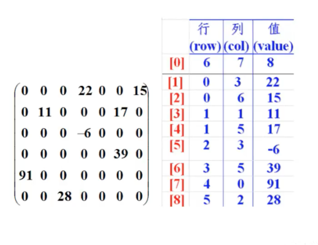
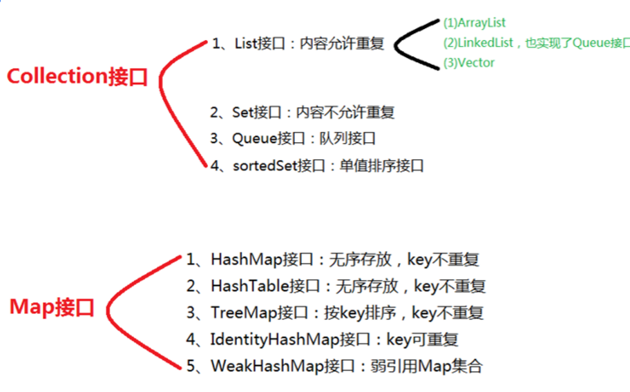

Java知识点补充
-----------


### 1 对象初始化顺序

1. 父类静态代码块，父类静态成员变量（同级，按代码顺序执行）  
2. 子类静态代码块，子类静态成员变量（同级，按代码顺序执行）  
3. 父类普通代码块，父类普通成员变量（同级，按代码顺序执行）  
4. 父类构造方法  
5. 子类普通代码块，子类普通成员变量（同级，按代码顺序执行）  
6. 子类构造方法

注意点：

1. 静态内容只在类加载时执行一次，之后不再执行。
2. 默认子类的构造方法（无参和有参）都会调用父类的无参构造方法，可以在子类构造方法中利用super指定调用父类的哪个构造方法。

```java
public class Test {
    public static void main(String[] args) {
        Son son1 = new Son();
        System.out.println("===================");
        Son son2 = new Son("andy");
    }
}

class Father {
    public Father() {
        System.out.println("父类无参构造方法");
    }  
	public Father(int i) {
		System.out.println("父类有参构造方法");

	}
}

class Son extends Father {
    private String name;
	
    public Son() {
        // super(2018);
        System.out.println("子类构造方法");
    }
	
	public Son(String name) {
		System.out.println("子类有参构造");
		this.name = name;
	}
}
```

结果为：

```
父类有参构造方法
子类构造方法
===================
父类无参构造方法
子类有参构造
```

https://www.nowcoder.com/questionTerminal/6f126682f29544708bb73a08e4e2bd0a

### 2 异常

- try:可能发生异常的语句；try{}中有异常，则异常下面代码不执行。
- catch:捕获，并处理异常（printStackTrace()用来跟踪异常事件发生时执行堆栈的内容）
- throw:方法内部抛异常
- throws:声明方法异常
- finaly：代码中无论是否有异常都会执行，清除资源（如释放资源，关闭数据库、关闭文件）

- 在异常处理中，若try中的代码可能产生多种异常则可以对应多个catch语句，若catch中的参数类型有父类子类关系，此时应该将父类放在后面，子类放在前面。比如用Exception，因为所有异常都是Exception的子类,如果你把Exception放在前边捕获,后边的catch将永远不会执行。

```java
public class Test {
	public static void main(String[] args) {
		System.out.println(test());
	}
	
	private static int test() {
		int temp = 1;
		try {
			System.out.println(temp);
			return ++temp;
		} catch (Exception e) {
			System.out.println(temp);
			return ++temp;
		} finally {
			++temp;
			System.out.println(temp);
		}
	}
}
```

结果为：

```
1
3
2
```

解释，执行顺序为：

```
输出try里面的初始temp：1；
temp=2；
保存return里面temp的值：2；
执行finally的语句temp：3，输出temp：3；
返回try中的return语句，返回存在里面的temp的值：2；
输出temp：2。
```


在try语句块或catch语句块中执行到System.exit(0)直接退出程序，System.exit(0)。表示将整个虚拟机里的内容都释放，JVM停止工作，此时程序正常退出


### 3 ceil,floor,round

ceil（天花板），表示向上取整，Math.ceil（11.3）的结果为12，Math.ceil(-11.6)的结果为-11；

floor（地板），表示向下取整，Math.floor(11.6)的结果是11，Math.floor(-11.4)的结果-12；

round，表示“四舍五入”，算法为Math.floor(x+0.5)，即将原来的数字加上0.5后再向下取整，所以，Math.round(11.5)的结果是12，Math.round(-11.5)的结果为-11。


### 4 关于ClassLoader

java中类的加载有5个过程，加载、验证、准备、解析、初始化；类加载器的任务是根据一个类的全限定名来读取此类的二进制字节流到JVM中，然后转换为一个与目标类对应的java.lang.Class对象实例；在虚拟机提供了3种类加载器，引导（Bootstrap）类加载器、扩展（Extension）类加载器、系统（System）类加载器（也称应用类加载器）。

类装载器需要保证类装载过程的线程安全。


### 5 数组

下面哪个语句是创建数组的正确语句？(A B D E )

```
float f[][] = new float[6][6];
float []f[] = new float[6][6];
float f[][] = new float[][6];
float [][]f = new float[6][6];
float [][]f = new float[6][];
```

答：数组命名时名称与[]可以随意排列，但声明的二维数组中第一个中括号中必须要有值，它代表的是在该二维数组中有多少个一维数组。


\1. 定义一维数组时，必须显式指明数组的长度；

\2. 定义***数组时，其一维数组的长度必须首先指明，其他维数组长度可以稍后指定；

\3. 采用给定值初始化数组时，不必指明长度；

\4. “[]” 是数组运算符的意思，在声明一个数组时，数组运算符可以放在数据类型与变量之间，也可以放在变量之后。


定义数组，等号左边不能出现数字

**第一个就是为什么左边不用标大小，而右边需要标大小？**
首先数组一个对象，它不属于任何类，由jvm在运行期间在堆中创建并继承object，同时添加length属性。由于数组对象所占的内存在堆上，所以在声明时应明确告诉jvm自己所占的大小，方便分配，又因为数组对象的引用在栈中，所以声明时左边就无需标大小，之所以写成2个括号，就是为了表明这个引用指向堆中的二维数组。
**第二个就是为什么右边数组可以只声明几行，无需声明没行的大小？**
大概jvm在运行期间会根据行数分配对应的可扩展空间，方便每一行进行扩充。其实又可以按c语言那样理解，行其实又是一种引用，行首地址又代表一个一维数组。欢迎大佬对第二问题进行补充。


https://www.nowcoder.com/questionTerminal/e7c2d52c9cf0476bbba6aae6713dd303

### 6 构造方法特点

（1）构造方法的方法名必须与类名相同。

（2）构造方法没有返回类型，也不能定义为void，在方法名前面不声明方法类型。

（3）构造方法的主要作用是完成对象的初始化工作，它能够把定义对象时的参数传给对象的域。

（4）一个类可以定义多个构造方法，如果在定义类时没有定义构造方法，则编译系统会自动插入一个无参数的默认构造器，这个构造器不执行任何代码。

（5）构造方法可以重载，以参数的个数，类型，顺序。

在调用子类构造器之前，会先调用父类构造器，当子类构造器中没有使用"super(参数或无参数)"指定调用父类构造器时，是默认调用父类的无参构造器，如果父类中包含有参构造器，却没有无参构造器，则在子类构造器中一定要使用“super(参数)”指定调用父类的有参构造器，不然就会报错。


https://www.nowcoder.com/questionTerminal/73db4daf28b042428eb8b92c54a33dcd

### 7 java基础类库

java.lang包是java语言包，由java解释器自动引入，而不用import语句引入。

java.util包是java的工具包，需要手动导入。

java.sql包，JDBC接口类，需要手动导入。

java.io;各种输入输入流，需要手动导入。


### 8 运算符，表达式，类型转换

https://www.nowcoder.com/questionTerminal/a568949ffbfc4a20977a2dab786032dd

https://www.nowcoder.com/questionTerminal/15b1429e6c364c3bbe6e8134a519f2a3

操作符

https://www.nowcoder.com/questionTerminal/bc1b22b2af5c47f89caca1d4f77b8807

优先级

https://www.nowcoder.com/questionTerminal/57668b0a3e2746cfbbbf37663a0c4868


https://www.nowcoder.com/questionTerminal/ba2a8890ba59437e974b69276539ca67


### 10 Servlet

Servlet生命周期分为三个阶段：

1.初始化阶段 调用init()方法

2.响应客户请求阶段　　调用service()方法

3.终止阶段　　调用destroy()方法


HttpServlet容器响应Web客户请求流程如下：

1）Web客户向Servlet容器发出Http请求；

2）Servlet容器解析Web客户的Http请求；

3）Servlet容器创建一个HttpRequest对象，在这个对象中封装Http请求信息；

4）Servlet容器创建一个HttpResponse对象；

5）Servlet容器调用HttpServlet的service方法，这个方法中会根据request的Method来判断具体是执行doGet还是doPost，把HttpRequest和HttpResponse对象作为service方法的参数传给HttpServlet对象；

6）HttpServlet调用HttpRequest的有关方法，获取HTTP请求信息；

7）HttpServlet调用HttpResponse的有关方法，生成响应数据；

8）Servlet容器把HttpServlet的响应结果传给Web客户。

doGet() 或 doPost() 是创建HttpServlet时需要覆盖的方法.


https://www.nowcoder.com/questionTerminal/6f32a414e2554f709444dc30b1b2a6b5

https://www.nowcoder.com/questionTerminal/3dfd72f89070415185f09aebecd0e3f7

https://www.nowcoder.com/questionTerminal/9ed5f1893de946149da2d0d602d97c70

Servlet与CGI

https://www.nowcoder.com/questionTerminal/a48429bf440f463cb84a01ecdc654cfa


forward redirect

https://www.nowcoder.com/questionTerminal/e14e58a3d78346be9540a3fbefd62ee3


包名

https://www.nowcoder.com/questionTerminal/96042b5ee9194445a7728f43f72244df


### 12 字符串

String StringBuilder StringBuffer

String是final修饰的，不可变

运行速度StringBuilder>StringBuffer>String

StringBuffer是线程安全的

https://www.nowcoder.com/questionTerminal/ea753f170fff4b9f8e242458b2fc5a6d

### 13 重写与重载

通过继承，一个类可以用作多种类型：可以用作它自己的类型、任何基类型，或者在实现接口时用作任何接口类型，这称为多态性。

覆盖（重写）只有出现在父类与子类之间，而重载可以出现在同一个类中。

首先，重载和重写都是多态的一种体现方式。重载是编译期间的活动，重写是运行期间的活动。
   其次，重载是在一个类中定义相同的名字的方法，方法的参数列表或者类型要互相不同，但是返回值类型不作为是否重载的标准，可以修改可见性；
   重写是不同的，要求子类重写基类的方法时要与父类方法具有相同的参数类型和返回值，可见性需要大于等于基类的方法

https://www.nowcoder.com/questionTerminal/50b657ff1c68456f952e00d15c08d4b2

https://www.nowcoder.com/questionTerminal/b91e9678c45d44fa84e34e2680556754

https://www.nowcoder.com/questionTerminal/e88d5e5931554240a46498abe5682492

https://www.nowcoder.com/questionTerminal/3f4af0f48392470c9493493741be0897

重载就是一句话：同名不同参，返回值无关。

覆盖/重写：同名同参

### 14 equal 与 == 

https://www.nowcoder.com/questionTerminal/1e2d492968ae49e0827b8341b0f33d25

https://www.nowcoder.com/questionTerminal/2e91232158704054a48f54d73619953f

https://www.nowcoder.com/questionTerminal/ccaf97ecf8f64e73a8982a6e8c792d4e

```java
Integer a = 1;
Integer b = 1;
Integer c = 500;
Integer d = 500;
System.out.print(a == b);
System.out.print(c == d);
```

上述代码返回结果为：true、false

Integer类型在-128-->127范围之间是被缓存了的，也就是每个对象的内存地址是相同的，赋值就直接从缓存中取，不会有新的对象产生，而大于这个范围，将会重新创建一个Integer对象，也就是new一个对象出来，当然地址就不同了，也就！=；

https://www.nowcoder.com/questionTerminal/e35f449be29548c68352ef302965a44e


https://www.nowcoder.com/questionTerminal/23e1de26ed9f43868a98ee296891cdaf


https://www.nowcoder.com/questionTerminal/a40182696d5d46c2be753074f3330d84


https://www.nowcoder.com/questionTerminal/783b17050b074f5fa952f093b384430f

### 15 内部类、lambda

#### 成员内部类

1. 该类像是外部类的一个成员，可以无条件的访问外部类的所有成员属性和成员方法（包括private成员和静态成员）； 

2. 成员内部类拥有与外部类同名的成员变量时，会发生隐藏现象，即默认情况下访问的是成员内部类中的成员。如果要访问外部类中的成员，需要以下形式访问：【外部类.this.成员变量  或  外部类.this.成员方法】； 

3. 在外部类中如果要访问成员内部类的成员，必须先创建一个成员内部类的对象，再通过指向这个对象的引用来访问； 

4. 成员内部类是依附外部类而存在的，也就是说，如果要创建成员内部类的对象，前提是必须存在一个外部类的对象； 

5. 内部类可以拥有private访问权限、protected访问权限、public访问权限及包访问权限。

   如果成员内部类用private修饰，则只能在外部类的内部访问；

   如果用public修饰，则任何地方都能访问；

   如果用protected修饰，则只能在同一个包下或者继承外部类的情况下访问；

   如果是默认访问权限，则只能在同一个包下访问。外部类只能被public和包访问两种权限修饰。

#### 局部内部类

1. 局部内部类是定义在一个方法或者一个作用域里面的类，它和成员内部类的区别在于局部内部类的访问仅限于方法内或者该作用域内； 
2. 局部内部类就像是方法里面的一个局部变量一样，是不能有public、protected、private以及static修饰符的。

#### 静态内部类

1. 静态内部类是不需要依赖于外部类的，这点和类的静态成员属性有点类似；
2. 不能使用外部类的非static成员变量或者方法。

#### 匿名内部类

1. 一般使用匿名内部类的方法来编写事件监听代码； 
2. 匿名内部类是不能有访问修饰符和static修饰符的； 
3. 匿名内部类是唯一一种没有构造器的类； 
4. 匿名内部类用于继承其他类或是实现接口，并不需要增加额外的方法，只是对继承方法的实现或是重写。

https://www.nowcoder.com/questionTerminal/e081f2dcd1864be0ab6ddc7be153e0d6


https://www.nowcoder.com/questionTerminal/bec7b650bc7c4548afe26da6fcbd1a16


lambda

https://www.nowcoder.com/questionTerminal/4e12588431cd40418fd7efa728f75f45

### 16 抽象类和接口

https://www.nowcoder.com/questionTerminal/02821e6b4e654ecbb0e5865c36391ad1

抽象类：在Java中被abstract关键字修饰的类称为抽象类，被abstract关键字修饰的方法称为抽象方法，抽象方法只有方法的声明，没有方法体。抽象类的特点：

a、抽象类不能被实例化只能被继承；

b、包含抽象方法的一定是抽象类，但是抽象类不一定含有抽象方法；

c、抽象类中的抽象方法的修饰符只能为public或者protected，默认为public；

d、一个子类继承一个抽象类，则子类必须实现父类抽象方法，否则子类也必须定义为抽象类；

e、抽象类可以包含属性、方法、构造方法，但是构造方法不能用于实例化，主要用途是被子类调用。

*接口*：Java中接口使用interface关键字修饰，特点为:

a、接口可以包含变量、方法；变量被隐士指定为public static final，方法被隐士指定为public abstract（JDK1.8之前）；

b、接口支持多继承，即一个接口可以extends多个接口，间接的解决了Java中类的单继承问题；

c、一个类可以实现多个接口；

d、JDK1.8中对接口增加了新的特性：

​    （1）、默认方法（default method）：JDK 1.8允许给接口添加非抽象的方法实现，但必须使用default关键字修饰；定义了default的方法可以不被实现子类所实现，但只能被实现子类的对象调用；如果子类实现了多个接口，并且这些接口包含一样的默认方法，则子类必须重写默认方法；

​    （2）、静态方法（static method）：JDK 1.8中允许使用static关键字修饰一个方法，并提供实现，称为接口静态方法。接口静态方法只能通过接口调用（接口名.静态方法名）。

​    注意：**jdk1.9是允许接口中出现private修饰的默认方法和静态方法**。


### 17 继承、多态等

https://www.nowcoder.com/questionTerminal/2aa69f9816ac4cc4be8872861dca6d6e

https://www.nowcoder.com/questionTerminal/8b7e3edf00d646afb15319c31206ad31

https://www.nowcoder.com/questionTerminal/c9d1294463944959b374c40bf71a3ccc

https://www.nowcoder.com/questionTerminal/6cba4487852e46ad819ceb4f342eebe9


https://www.nowcoder.com/questionTerminal/8594961e5b04442084ab6d5ae0f536e2

https://www.nowcoder.com/questionTerminal/d62b845d28d84870a3e06380fc0e0dae

多态？ 对于同一个父类方法，不同的子类会有不同的实现方式

### 18 多线程


https://www.nowcoder.com/questionTerminal/11a7d8d366d54ff9a07c1fa054d6541b

https://www.nowcoder.com/questionTerminal/c329b173a9b34cb1af6165395b8e7635

https://www.nowcoder.com/questionTerminal/153be8d8915e465aa89012fab7876304

https://www.nowcoder.com/questionTerminal/aec40003f6314bd79df12631a25c841b


https://www.nowcoder.com/questionTerminal/81888b413fae42348429b845242c4edd

https://www.nowcoder.com/questionTerminal/ba2eca99ecdf466d8a45dcab369e8403


https://www.nowcoder.com/questionTerminal/68c6c63ad0d444f481552a81fd769f2b

https://www.nowcoder.com/questionTerminal/555ee3dbaa1647ed94c72500ab5f04bb


https://www.nowcoder.com/questionTerminal/fdee2c9deae54a38ae32051e4116da9b

https://www.nowcoder.com/questionTerminal/a0c59b5a3e71436a86c3cc1f6392e55f

https://www.nowcoder.com/questionTerminal/6a3cb7582a7844ef99a04c09c2647e84

https://www.nowcoder.com/questionTerminal/5a9e81d22a6a491aac1b6bac5d4d6036


https://www.nowcoder.com/questionTerminal/3dbb60125c2b47918b03ecb112b9c2cb

https://www.nowcoder.com/questionTerminal/48ee199608824e409cca879ae50e6022

### 单例模式

单例模式: 第一步，不让外部调用创建对象，所以把构造器私有化，用private修饰。 第二步，怎么让外部获取本类的实例对象？通过本类提供一个方法，供外部调用获取实例。由于没有对象调用，所以此方法为类方法，用static修饰。 第三步，通过方法返回实例对象，由于类方法(静态方法)只能调用静态方法，所以存放该实例的变量改为类变量，用static修饰。 最后，类变量，类方法是在类加载时初始化的，只加载一次。

```java
class Chinese {
    private static Chinese objref =new Chinese();
    private Chinese(){}
    public static Chinese getInstance() { return objref; }
}
```


### 子类要调用继承自父类的方法

1、子类构造函数调用父类构造函数用super

2、子类重写父类方法后，若想调用父类中被重写的方法，用super

3、未被重写的方法可以直接调用。


https://www.nowcoder.com/questionTerminal/1fb1e18e57a64163bbb404f56555bb3a


### 19 输入输出、文件和IO流

`File`类是对文件整体或者文件属性操作的类，例如创建文件、删除文件、查看文件是否存在等功能，不能操作文件内容；文件内容是用IO流操作的。

Java中对于文本文件和二进制文件，都可以当作二进制文件进行操作。


static不能修饰局部变量


Double 是java定义的包装类，double是java定义的数据类型，不同的数据类型不能自动装箱拆箱，只有对应类型的数据类型和包装类才能自动装箱拆箱。


https://www.nowcoder.com/questionTerminal/b59f18ff7d1a49c19aa66886b04ce347

https://www.nowcoder.com/questionTerminal/1585b178f50b4681a82cd9cee46d6d1e

https://www.nowcoder.com/questionTerminal/df08c9951c5d4d81805382a4690dab9f

https://www.nowcoder.com/questionTerminal/4e18b865ec55419bb45ed9be3c7ed9b4

https://www.nowcoder.com/questionTerminal/13928d8c655f48cc82508ec4d4788e8c

处理流

https://www.nowcoder.com/questionTerminal/89307747e8904102b26505712a5191d4

### 泛型

https://www.nowcoder.com/questionTerminal/61dc07d0a0cb4168ac58397339d84122


https://www.nowcoder.com/questionTerminal/196aded078f04847b6917e0e3bb1dc80

###  会话跟踪的机制

实现会话跟踪的机制

Cookies，URL重写，隐藏式表单域，Session机制

https://www.nowcoder.com/questionTerminal/8d86bb29952642169e816d519f8417f3


JDBC

https://www.nowcoder.com/questionTerminal/d29b742b521743118a741d01fcdc0b96


### 监听器


**HttpSessionAttributeListener**：可以实现此侦听器接口获取此web应用程序中会话属性列表更改的通知； 

**HttpSessionBindingListener**：当该对象从一个会话中被绑定或者解绑时通知该对象，这个对象由HttpSessionBindingEvent对象通知。这可能是servlet程序显式地从会话中解绑定属性的结果，可能是由于会话无效，也可能是由于会话超时； 

**HttpSessionListener**：当web应用程序中的活动会话列表发生更改时通知该接口的实现类，为了接收该通知事件，必须在web应用程序的部署描述符中配置实现类； 

**HttpSessionActivationListener**：绑定到会话的对象可以侦听容器事件，通知它们会话将被钝化，会话将被激活。需要一个在虚拟机之间迁移会话或持久会话的容器来通知所有绑定到实现该接口会话的属性。


### JavaBean 

JavaBean 是一种JAVA语言写成的可重用组件。为写成JavaBean，类必须是具体的和公共的，并且具有无参数的构造器。JavaBean 通过提供符合一致性设计模式的公共方法将内部域暴露成员属性，set和get方法获取。众所周知，属性名称符合这种模式，其他Java 类可以通过自省机制(反射机制)发现和操作这些JavaBean 的属性。

### POJO

POJO（Plain Ordinary Java Object）简单的Java对象，实际就是普通JavaBeans，是为了避免和EJB混淆所创造的简称。


构造函数不能被继承，构造方法只能被显式或隐式的调用。


import语句并没有将对应的java源文件拷贝到此处仅仅是引入，告诉编译器有使用外部文件，编译的时候要去读取这个外部文件。

### 好题

https://www.nowcoder.com/questionTerminal/ca4daaaba2a74097b7990018187436b8

https://www.nowcoder.com/questionTerminal/344945bc01fd49b5beca0cf5f6edea78

https://www.nowcoder.com/questionTerminal/ec83945fe29f44abbdd6d156fbeccdb1

https://www.nowcoder.com/questionTerminal/29498beafbcc440f972644ddf1c1f9ed

https://www.nowcoder.com/questionTerminal/79ac94b52b004226a65197e5f788a063

https://www.nowcoder.com/questionTerminal/cbec6a41dc75420eb4f909a5fd4652bf

https://www.nowcoder.com/questionTerminal/b9b65a3e3efd491a8bfba591dbb88b6d

https://www.nowcoder.com/questionTerminal/19ae8ab1b45549fd9a5d2e8f90ff8036


https://www.nowcoder.com/questionTerminal/eee02717270a4519bf7d4c2a47f3d821

https://www.nowcoder.com/questionTerminal/a5f82c7f51324377808a119f8c46d692

https://www.nowcoder.com/questionTerminal/9aa8adae3a4e47ce819a5a34b9ec8bfe


```
客户端通过new Socket()方法创建通信的Socket对象
服务器端通过new ServerSocket()创建TCP连接对象  accept接纳客户端请求
```


实参形参

https://www.nowcoder.com/questionTerminal/82f87aaa3b2b4703ade779f302b604b6

ASCII

https://www.nowcoder.com/questionTerminal/a1b2b9033b2f4dc5ac79ad2cd24772c1

三元操作符

https://www.nowcoder.com/questionTerminal/701d348fec8f4c1893740e253217a65f


https://www.nowcoder.com/questionTerminal/b507628f3f0b4c85a00a7ed0de830413

https://www.nowcoder.com/questionTerminal/cdfed61a0a2e4f4e9809df0a27b0f8a5


https://www.nowcoder.com/questionTerminal/fdd467b87112408288b790dfc1933629

https://www.nowcoder.com/questionTerminal/15550357ca784b5ba56287587081d372


```java
System.out.println(1+"10"+3+"2");//11032
System.out.println(1+2+"10"+3+"2");//31032
System.out.println(1+"10"+3+1+"2");//110312
// 注意“+”的两边的类型
```

在遇到string类型之前，int间使用“+”还是表示数值的相加，但是遇到第一个string后，后面就都是按string类型来了，变成字符串的拼接

```java
int x=20, y=5;
System.out.println(x+y +""+(x+y)+y);  
// 25255
```

1）不论有什么运算，小括号的优先级都是最高的，先计算小括号中的运算，得到x+y +""+25+y

2）任何字符与字符串相加都是字符串，但是是有顺序的，字符串前面的按原来的格式相加，字符串后面的都按字符串相加，得到25+“”+25+5


java中创建对象有以下几种方法：

1.用new语句创建对象，这是最常用的创建对象的方式。

2.运用反射手段，调用java.lang.Class或者java.lang.reflect.Constructor类的newInstance()实例方法。

3.调用对象的clone()方法。

4.运用反序列化手段，调用java.io.ObjectInputStream对象的readObject()方法.


```java
int x = -5;
int y = -12;
System.out.println(y % x);
// -2
```

取模运算，结果的符号和被除数符号一致，切记切记


方法内定义的变量没有初始值，必须要进行初始化。 类中定义的变量可以不需要赋予初始值，默认初始值为0。


### 运算符

#### 算术运算符

| 操作符 | 描述                              | 例子                               |
| :----- | :-------------------------------- | :--------------------------------- |
| +      | 加法 - 相加运算符两侧的值         | A + B 等于 30                      |
| -      | 减法 - 左操作数减去右操作数       | A – B 等于 -10                     |
| *      | 乘法 - 相乘操作符两侧的值         | A * B等于200                       |
| /      | 除法 - 左操作数除以右操作数       | B / A等于2                         |
| ％     | 取余 - 左操作数除以右操作数的余数 | B%A等于0                           |
| ++     | 自增: 操作数的值增加1             | B++ 或 ++B 等于 21（区别详见下文） |
| --     | 自减: 操作数的值减少1             | B-- 或 --B 等于 19（区别详见下文） |

#### 关系（比较）运算符

| 运算符 | 描述                                                         | 例子             |
| :----- | :----------------------------------------------------------- | :--------------- |
| ==     | 检查如果两个操作数的值是否相等，如果相等则条件为真。         | （A == B）为假。 |
| !=     | 检查如果两个操作数的值是否相等，如果值不相等则条件为真。     | (A != B) 为真。  |
| >      | 检查左操作数的值是否大于右操作数的值，如果是那么条件为真。   | （A> B）为假。   |
| <      | 检查左操作数的值是否小于右操作数的值，如果是那么条件为真。   | （A <B）为真。   |
| >=     | 检查左操作数的值是否大于或等于右操作数的值，如果是那么条件为真。 | （A> = B）为假。 |
| <=     | 检查左操作数的值是否小于或等于右操作数的值，如果是那么条件为真。 | （A <= B）为真。 |

#### 位运算符

| 操作符 | 描述                                                         | 例子                           |
| :----- | :----------------------------------------------------------- | :----------------------------- |
| ＆     | 如果相对应位都是1，则结果为1，否则为0                        | （A＆B），得到12，即0000 1100  |
| \|     | 如果相对应位都是 0，则结果为 0，否则为 1                     | （A \| B）得到61，即 0011 1101 |
| ^      | 如果相对应位值相同，则结果为0，否则为1                       | （A ^ B）得到49，即 0011 0001  |
| 〜     | 按位取反运算符翻转操作数的每一位，即0变成1，1变成0。         | （〜A）得到-61，即1100 0011    |
| <<     | 按位左移运算符。左操作数按位左移右操作数指定的位数。         | A << 2得到240，即 1111 0000    |
| >>     | 按位右移运算符。左操作数按位右移右操作数指定的位数。         | A >> 2得到15即 1111            |
| >>>    | 按位右移补零操作符。左操作数的值按右操作数指定的位数右移，移动得到的空位以零填充。 | A>>>2得到15即0000 1111         |

#### 逻辑运算符

| 操作符 | 描述                                                         | 例子                |
| :----- | :----------------------------------------------------------- | :------------------ |
| &&     | 称为逻辑与运算符。当且仅当两个操作数都为真，条件才为真。     | （A && B）为假。    |
| \| \|  | 称为逻辑或操作符。如果任何两个操作数任何一个为真，条件为真。 | （A \| \| B）为真。 |
| ！     | 称为逻辑非运算符。用来反转操作数的逻辑状态。如果条件为true，则逻辑非运算符将得到false。 | ！（A && B）为真。  |

#### 赋值运算符

#### 三元运算符

#### instanceof 运算符


Java基础补充
------------


https://www.bilibili.com/video/BV12J41137hu


编程语言：

编译型   compile 编译器 C/C++

解释型	解释器	


Java 两种结合 先预编译成字节码（.class）然后再解释


### 标识符 关键字

#### 标识符

Java中标识符是为变量名、类名、方法名或其他用户定义项所定义的名称。标识符的构成规则：

1. 标识符由26个英文字符大小写（`a~z`，`A~Z`）、数字(`0~9`)、下划线(_)和美元符号($)组成；
2. 不能以数字开头，不能是关键字；
3. 严格区分大小写；
4. 标识符的可以为任意长度；


#### 关键字

关键字（或者保留字）是对编译器有特殊意义的固定单词，不能在程序中做其他目的使用。关键字具有专门的意义和用途，和自定义的标识符不同，不能当作一般的标识符来使用。

保留字是为 Java 预留的关键字，它们虽然现在没有作为关键字，但在以后的升级版本中有可能作为关键字。

Java 语言目前定义了 51 个关键字，这些关键字不能作为名来使用。以下对这些关键字进行了分类。

1. 数据类型：boolean、int、long、short、byte、float、double、char、class、interface。
2. 流程控制：if、else、do、while、for、switch、case、default、break、continue、return、try、catch、finally。
3. 修饰符：public、protected、private、final、void、static、strict、abstract、transient、synchronized、volatile、native。
4. 动作：package、import、throw、throws、extends、implements、this、supper、instanceof、new。
5. 保留字：true、false、null、goto、const。

https://www.nowcoder.com/questionTerminal/f049440648ae4a1d83c2205bfa87289e


https://www.nowcoder.com/questionTerminal/dc5651a872ff44a187afd7034a1708ba


[1]Java标识符只能由数字、字母、下划线“_”或“$”符号以及Unicode字符集组成

[2]Java标识符必须以字母、下划线“_”或“$”符号以及Unicode字符集开头
[3]Java标识符不可以是Java关键字、保留字（const、goto）和字面量（true、false、null）
[4]Java标识符区分大小写，是大小写敏感的


### 数据类型

Java是**强类型语言**（要求变量的使用要严格符合规定，所有变量都必须先定义后才能使用）

弱类型语言

Java的数据类型分为两大类：

- 基本类型

  数值类型：整数类型（byte、short、int、long），浮点类型（float、double），字符类型（char）

  boolean类型（占1位）：true、false

- 引用类型

### 类型转换

由于Java是强类型语言，所以要进行有些运算的时候，需要类型转换。

```java
byte,short,char -> int -> long -> float -> double
```

运算中，不同类型的数据先转化为统一类型，然后进行运算。


强制类型转换：高->低   (类型)变量名

自动类型转换：低->高

> 1. 不能对布尔值进行转换
> 2. 不能把对象类型转换为不相干的类型
> 3. 转换的时候可能存在内存溢出，或者精度问题

### 数组

- 长度确定，一旦被创建大小不可以改变

- 元素必须是相同类型

- 数组中的元素可以使任何数据类型

- 数组变量是引用类型，数组也可以看出对象，数组中的每个元素相当于该对象的成员变量。

  Java中对象时在堆中的，因此数组无论保存原始类型还是其它对象类型，<font color=#FF8C00>数组对象本身在堆中的</font>。

数组工具类`java.util.Arrays`

#### 稀疏数组

一种数据结构

当一个数据中大部分元素为0，或者为同一个值的数组是，可以用稀疏数组哎保存该数组。

稀疏数组的处理方式：

- 记录数组一共有几行几列，有多少个不同值
- 把具有不同值的元素和行列及值记录在一个小规模的数组中，从而缩小程序的规模



### 面向对象

#### 构造器

和类名相同，没有返回值。

使用new关键字，本质是在调用构造器。

一旦定义了有参构造，无参就必须显示定义。

#### 对象内存分析

https://www.bilibili.com/video/BV12J41137hu?p=65&spm_id_from=pageDriver


#### 重写

1. 需要有继承关系，子类重写父类的方法！
2. 方法名必须相同
3. 参数列表必须相同
4. 修饰符范围可以扩大但不能缩小
5. 抛出异常范围可以被缩小但不能扩大

为什么需要重写：父类的功能，子类不一定需要，或者不一定满足。

#### 多态

一个对象的实际类型时确定的：

```java
new Student();
new Person();
```

可以指向的引用类型就不确定了，父类的引用可以指向子类：

```java
Student s1 = new Student();
Person s2 = new Student();
Object s3 = new Student();
```

对象能执行那些方法，主要看左边的类型，和右边关系不大！

> 多态注意：
>
> 1. 多态是方法的多态，属性没有多态
> 2. 存在条件：继承关系，方法重写，父类引用指向子类对象

**多态**即同一方法可以根据发送对象的不同而采用多种不同的行为方式。


### 集合总结

那些常用？

总分类体系

各自的用途

那些是线程安全的


Java容器/集合
------

Java容器/集合有两大接口：

一个是 `Collecton`接口，主要用于存放单一元素，另有三个主要的子接口：`List`、`Set` 和 `Queue`；

另一个是 `Map` 接口，主要用于存放键值对。


> 上图只列举了主要的继承派生关系，省略了`AbstractList`, `NavigableSet`等抽象类以及其他的一些辅助类。





| Map集合类     | key                | value        |
| ------------- | ------------------ | ------------ |
| HashMap       | 可为null，不重复   | 允许为null   |
| TreeMap       | 不可为null，不重复 | 允许为null   |
| ConcurrentMap | 不可为null         | 不允许为null |
| HashTable     | 不可为null，不重复 | 不允许为null |


### 线程安全

如果你的代码所在的进程中有多个线程在同时运行，而这些线程可能会同时运行这段代码。如果每次运行结果和单线程运行的结果是一样的，而且其他的变量的值也和预期的是一样的，就是**线程安全**的。线程安全问题都是由**全局变量**及**静态变量**引起的。

若每个线程中对全局变量、静态变量只有读操作，而无写操作，一般来说，这个全局变量是线程安全的；若有多个线程同时执行写操作，一般都需要考虑**<font color=#FF8C00>线程同步</font>**，否则的话就可能影响线程安全。


LinkedList 和 ArrayList 都是不同步的，线程不安全； 

Vector 和 Stack 都是同步的，线程安全； 

Set是线程不安全的； 

Hashtable的方法是同步的，线程安全； 

HashMap的方法不是同步的，线程不安全；


StringBuffer 是线程安全，而 StringBuilder 是线程不安全的


### HashMap HashTable

- 继承不同

  ```java
  public class HashMap<K,V> extends AbstractMap<K,V>
      implements Map<K,V>, Cloneable, Serializable
  
  public class Hashtable<K,V>
      extends Dictionary<K,V>
      implements Map<K,V>, Cloneable, java.io.Serializable
  ```

- Hashtable中的方法同步线程安全，HashMap需要自己同步线程不安全

- Hashtable中，key和value都不允许出现null值。 

  在HashMap中，null可以作为键，这样的键只有一个；可以有一个或多个键所对应的值为null。当get()方法返回null值时，即可以表示  HashMap中没有该键，也可以表示该键所对应的值为null。因此，在HashMap中不能由get()方法来判断HashMap中是否存在某个键，  而应该用containsKey()方法来判断。

- 遍历方式：Hashtable、HashMap都使用了 Iterator。而由于历史原因，Hashtable还使用了Enumeration的方式 。

- 哈希值的使用不同，HashTable直接使用对象的hashCode。而HashMap重新计算hash值。

- 初始大小和扩容的方式都不同


### 更多

collection类型的集合（ArrayList,LinkedList）只能装入对象类型的数据，该题中装入了0，是一个基本类型，但是JDK5以后提供了自动装箱与自动拆箱，所以int类型自动装箱变为了Integer类型。


https://www.nowcoder.com/questionTerminal/b41c88359c8a4d69a35c2f37400e49f0


https://snailclimb.gitee.io/javaguide/#/docs/java/collection/Java%E9%9B%86%E5%90%88%E6%A1%86%E6%9E%B6%E5%B8%B8%E8%A7%81%E9%9D%A2%E8%AF%95%E9%A2%98

https://snailclimb.gitee.io/javaguide/#/docs/java/collection/Java%E9%9B%86%E5%90%88%E4%BD%BF%E7%94%A8%E6%B3%A8%E6%84%8F%E4%BA%8B%E9%A1%B9%E6%80%BB%E7%BB%93


## Java IO

https://github.com/fuzhengwei/itstack-demo-netty

BIO NIO AIO netty

### Java NIO

JAVA NIO有两种解释：一种叫非阻塞IO（Non-blocking I/O），另一种也叫新的IO（New I/O），其实是同一个概念。

### NIO VS IO

NIO（JDK1.4）模型是一种同步非阻塞IO，主要有三大核心部分：Channel(通道)，Buffer(缓冲区), Selector（多路复用器）。传统IO基于字节流和字符流进行操作，而NIO基于Channel和Buffer(缓冲区)进行操作，数据总是从通道读取到缓冲区中，或者从缓冲区写入到通道中。Selector(多路复用器)用于监听多个通道的事件（比如：连接打开，数据到达）。因此，单个线程可以监听多个数据通道。
 NIO和传统IO（一下简称IO）之间第一个最大的区别是，IO是面向流的，NIO是面向缓冲区的。 Java IO面向流意味着每次从流中读一个或多个字节，直至读取所有字节，它们没有被缓存在任何地方。此外，它不能前后移动流中的数据。如果需要前后移动从流中读取的数据，需要先将它缓存到一个缓冲区。NIO的缓冲导向方法略有不同。数据读取到一个它稍后处理的缓冲区，需要时可在缓冲区中前后移动。这就增加了处理过程中的灵活性。但是，还需要检查是否该缓冲区中包含所有您需要处理的数据。而且，需确保当更多的数据读入缓冲区时，不要覆盖缓冲区里尚未处理的数据。
 IO的各种流是阻塞的。这意味着，当一个线程调用read() 或 write()时，该线程被阻塞，直到有一些数据被读取，或数据完全写入。该线程在此期间不能再干任何事情了。 NIO的非阻塞模式，使一个线程从某通道发送请求读取数据，但是它仅能得到目前可用的数据，如果目前没有数据可用时，就什么都不会获取。而不是保持线程阻塞，所以直至数据变的可以读取之前，该线程可以继续做其他的事情。 非阻塞写也是如此。一个线程请求写入一些数据到某通道，但不需要等待它完全写入，这个线程同时可以去做别的事情。 线程通常将非阻塞IO的空闲时间用于在其它通道上执行IO操作，所以一个单独的线程现在可以管理多个输入和输出通道（channel）。

#### NIO优点：

1. 通过Channel注册到Selector上的状态来实现一种客户端与服务端的通信。
2. Channel中数据的读取是通过Buffer , 一种非阻塞的读取方式。
3. Selector 多路复用器  单线程模型，  线程的资源开销相对比较小。


https://www.zhihu.com/question/29005375

https://blog.csdn.net/forezp/article/details/88414741

https://www.cnblogs.com/lfs2640666960/p/9970353.html

https://tech.meituan.com/2016/11/04/nio.html

https://www.cnblogs.com/minikobe/p/12166280.html


使用场景


https://www.zhihu.com/question/67535292/answer/1248887503


https://segmentfault.com/a/1190000040458363


## Java8新特性

https://www.runoob.com/java/java8-new-features.html


### Lambda 表达式

Lambda 允许把函数作为一个方法的参数（函数作为参数传递到方法中）。

语法：

```java
(parameters) -> expression
或
(parameters) ->{ statements; }
```

lambda表达式的特征:

- **可选类型声明：**不需要声明参数类型，编译器可以统一识别参数值。
- **可选的参数圆括号：**一个参数无需定义圆括号，但多个参数需要定义圆括号。
- **可选的大括号：**如果主体包含了一个语句，就不需要使用大括号。
- **可选的返回关键字：**如果主体只有一个表达式返回值则编译器会自动返回值，大括号需要指定表达式返回了一个数值。


例子：

```java
// 1. 不需要参数,返回值为 5  
() -> 5  
  
// 2. 接收一个参数(数字类型),返回其2倍的值  
x -> 2 * x  
  
// 3. 接受2个参数(数字),并返回他们的差值  
(x, y) -> x – y  
  
// 4. 接收2个int型整数,返回他们的和  
(int x, int y) -> x + y  
  
// 5. 接受一个 string 对象,并在控制台打印,不返回任何值(看起来像是返回void)  
(String s) -> System.out.print(s)
```


### 方法引用

方法引用通过方法的名字来指向一个方法；可以使语言的构造更紧凑简洁，减少冗余代码。

方法引用使用一对冒号 `::` 。

4 种不同方法的引用：

```java
package com.runoob.main;
 
@FunctionalInterface
public interface Supplier<T> {
    T get();
}
 
class Car {
    //Supplier是jdk1.8的接口，这里和lamda一起使用了
    public static Car create(final Supplier<Car> supplier) {
        return supplier.get();
    }
 
    public static void collide(final Car car) {
        System.out.println("Collided " + car.toString());
    }
 
    public void follow(final Car another) {
        System.out.println("Following the " + another.toString());
    }
 
    public void repair() {
        System.out.println("Repaired " + this.toString());
    }
}
```

1. **构造器引用：**语法是`Class::new`，或者更一般的`Class< T >::new`。

```java
final Car car = Car.create( Car::new );
final List<Car> cars = Arrays.asList(car);
```

2. **静态方法引用：**语法是`Class::static_method`。

```java
cars.forEach(Car::collide);
```

3. **特定类的任意对象的方法引用：**语法是`Class::method`。

```java
cars.forEach(Car::repair);
```

4. **特定对象的方法引用：**语法是`instance::method`。

```java
final Car police = Car.create(Car::new);
cars.forEach(police::follow);
```


### 函数式接口

函数式接口(Functional Interface)就是一个有且仅有一个抽象方法，但是可以有多个非抽象方法的接口。

函数式接口可以被隐式转换为 lambda 表达式。


### 默认方法

简单说，默认方法就是接口可以有实现方法，而且不需要实现类去实现其方法。`default`


### Stream API

新添加的Stream API（java.util.stream） 把真正的函数式编程风格引入到Java中。


### Date Time API

加强对日期与时间的处理。


### Optional 类

用来解决空指针异常。


### Base64
