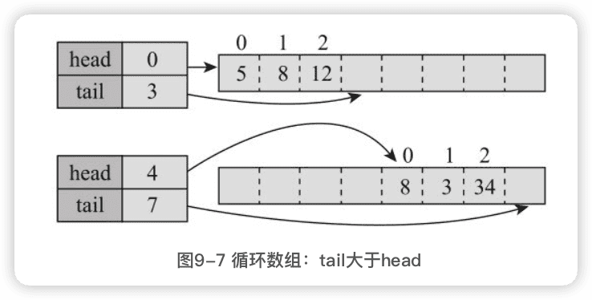

Java编程的逻辑
-------

[示例  代码](https://github.com/swiftma/program-logic/blob/master/the_logic_of_java_programming.md)


## 前言

为编程的核心知识建立知识地图，从最基础的概念开始，分解为知识点，一个知识点一个知识点地讲解，每一个知识点都力争清晰透彻，阐述知识点是什么、怎么用、有什么用途、实现原理是什么、思维逻辑是什么、与其他知识点有什么关系等。

要掌握人工智能技术，必须先掌握基本编程技术。

2017年7月，国务院印发了《新一代人工智能发展规划》，其中提到“实施全民智能教育项目，在中小学阶段设置人工智能相关课程，逐步推广编程教育”，未来，可能大部分人都需要学习编程。

# 一、编程基础与二进制

## 1 编程基础

操作系统将时间分成很多细小的时间片，一个时间片给一个程序用，另一个时间片给另一个程序用，并频繁地在程序间切换。不过，在应用程序看来，整个机器资源好像都归它使用，操作系统给它制造了这种假象。对程序员而言，编写程序时基本不用考虑其他应用程序，做好自己的事就可以了。

应用程序看上去能做很多事情，能读写文档、能播放音乐、能聊天、能玩游戏、能下围棋等，但本质上，计算机只会<font color=#FF8C00>**执行预先写好的指令**</font>（操作数据或者设备）而已。

所谓程序，基本上就是告诉计算机要操作的<font color=#FF8C00>**数据**</font>和执行的；<font color=#FF8C00>**指令序列**</font>，即对什么数据做什么操作，比如：

1. 读文档，就是将数据从磁盘加载到内存，然后输出到显示器上；
2. 写文档，就是将数据从内存写回磁盘；
3. 播放音乐，就是将音乐的数据加载到内存，然后写到声卡上；
4. 聊天，就是从键盘接收聊天数据，放到内存，然后传给网卡，通过网络传给另一个人的网卡，再从网卡传到内存，显示在显示器上。

数据在计算机内部都是二进制表示的，不方便操作，为了方便操作数据，高级语言引入了**数据类型**和**变量**的概念；

对数据进行的第一个操作：**赋值**；

数据有了初始值之后，可以对数据进行的一些**基本运算**；

为了编写有实用功能的程序，需要对操作的过程进行**流程控制**；

为了减少重复代码和分解复杂操作，计算机程序引入了**函数**和**子程序**的概念。

### 1.1 数据类型和变量

8中基本数据类型：

1. 整数类型：有4种整型byte/short/int/long（分别占1、2、4、8个字节），分别有不同的取值范围；
2. 小数类型：有两种类型float/double（4和8字节），有不同的取值范围和精度；
3. 字符类型：char，表示单个字符（2字节）；
4. 真假类型：boolean，表示真假。

>  世界万物都是由元素周期表中的基本元素组成的，**基本数据类型**就相当于化学中的**基本元素**，而**对象**就相当于**世界万物**。

所谓内存在程序看来就是一块<font color=#FF8C00>**有地址编号的连续的空间**</font>，数据放到内存中的某个位置后，为了方便地找到和操作这个数据，需要给这个位置起一个名字。编程语言通过<font color=#FF8C00>**变量**</font>这个概念来表示这个过程。

变量就是给数据起名字，方便找不同的数据，它的值可以变，但含义不应变。

### 1.2 赋值

赋值声明变量之后，就在内存分配了一块位置，但这个位置的内容是未知的，赋值就是把这块位置的内容设为一个确定的值。

#### 数组类型

3中赋值方式：

```java
int[] arr = {1,2,3};

int[] arr = new int[]{1,2,3};

int[] arr = new int[3];
arr[0] = 1;
arr[1] = 2;
arr[2] = 3;
```

动态确定数组长度：

```java
int length = ...; // 根据一些条件动态计算
int[] arr = new int[length];
```

数组组长度虽然可以动态确定，但定了之后就不可以变。

数组类型和基本类型是有明显不同的，一个基本类型变量，内存中只会有一块对应的内存空间。但数组有两块：**一块用于存储数组内容本身，另一块用于存储内容的位置**。


### 1.3 基本运算

#### 算术运算

整数相除不是四舍五入，而是直接舍去小数位。

小数计算结果不精确。

#### 比较运算

#### 逻辑运算

- 与（&）
- 或（|）
- 非（!）
- 异或（^）：两个相同为false，两个不相同为true；
- 短路与（&&）
- 短路或（||）

### 1.4 条件执行

if/else

三元运算

switch

#### 实现原理

CPU的<font color=#FF8C00>指令指示器</font>，**跳转**指令，有两种：

1. <font color=#FF8C00>**条件跳转**</font>（满足某个条件则进行跳转）
2. <font color=#FF8C00>**无条件跳转**</font>（直接跳转）

if/else就是转换为跳转指令：

```java
        1 int a=10;
        2 if(a%2==0)
        3 {
        4     System.out.println("偶数");
        5 }
        6 //其他代码
```

转换为：

```java
        1 int a=10;
        2 条件跳转：如果a%2==0，跳转到第4行
        3 无条件跳转：跳转到第7行
        4 {
        5     System.out.println("偶数");
        6 }
        7 //其他代码
```

switch的转换和具体系统实现有关。如果分支比较少，可能会转换为跳转指令。如果分支比较多，使用条件跳转会进行很多次的比较运算，效率比较低，可能会使用一种更为高效的方式，叫<font color=#FF8C00>跳转表</font>。跳转表是一个映射表，存储了可能的值以及要跳转到的地址：


跳转表为什么会更为高效呢？因为其中的值必须为**整数**，且按大小顺序**排序**。按大小排序的整数可以使用高效的二分查找。

**程序源代码中的case值排列不要求是排序的，编译器会自动排序。**

switch值的类型可以是<u>byte、short、int、char、枚举和String</u>。byte、short、int、char都是整数，枚举也可以表示为整数，String用于switch时也会转换为整数（通过hasCode方法）。**不可以使用long**，因为跳跳转表值的存储空间一般为32位，容纳不下long。

### 1.5 循环

循环：多次重复执行某些类似的操作。

计算机程序运行时大致只能**顺序执行、条件执行和循环执行**。顺序和条件其实没什么特别的，而循环大概才是程序强大的地方。

循环的4中形式：

1. while

2. do/while

3. for

4. foreach  对于不需要使用索引变量，只是简单遍历的情况，foreach语法上更为简洁。

   ```java
   for (int element : arr) {
     
   }
   ```

循环控制：

break

continue

**虽然循环看起来只是重复执行一些类似的操作而已，但它其实是计算机程序解决问题的一种基本思维方式。**

解决复杂问题的基本策略是<font color=#FF8C00>**分而治之**</font>，将复杂问题分解为若干相对简单的子问题，然后子问题再分解为更小的子问题……程序由数据和指令组成，大程序可以分解为小程序，小程序接着分解为更小的程序。

### 1.6 函数的用法

<font color=#FF8C00>使用函数来减少重复代码和分解复杂操作。</font>

Java中，任何函数都需要放在一个类中。Java中的函数一般叫做方法。

```java
修饰符 返回值类型 函数名字(参数类型 参数名字，...) {
	操作
  return 返回值;
}
```

Java中函数有大量修饰符，如：public、private、static、final、synchronized、abstract等。

定义函数时声明参数，实际上就是定义变量，只是这些变量的值是未知的，调用函数时传递参数，实际上就是给函数中的变量赋值。

对于需要重复执行的代码，可以定义函数，然后在需要的地方调用，这样可以减少重复代码。对于复杂的操作，可以将操作分为多个函数，会使得代码更加易读。

#### 进一步理解函数

##### 1 参数传递

有两类特殊类型的参数：

- 数组

函数内修改数组中的元素会修改调用者中的数组内容。

- 可变长度的参数

```java
public static int max(int min, int ... a){
  int max = min;
  for(int i=0; i<a.length; i++){
    if(max<a[i]){
      max = a[i];
    }
  }
  return max;
}
public static void main(String[] args) {
  System.out.println(max(0));
  System.out.println(max(0,2));
  System.out.println(max(0,2,4));
  System.out.println(max(0,2,4,5));
}
```

可变长度参数可以看作是数组。可变长度参数必须是参数列表中的最后一个，一个函数也只能有一个可变长度的参数。

### 1.7 函数调用的基本原理

#### 栈的概念

程序执行的基本原理：CPU有一个**指令指示器**，指向下一条要执行的指令，要么顺序执行，要么进行跳转（条件跳转或无条件跳转）。

**程序从main函数开始顺序执行，函数调用可以看作一个无条件跳转，跳转到对应函数的指令处开始执行，碰到return语句或者函数结尾的时候，再执行一次无条件跳转，跳转回调用方，执行调用函数后的下一条指令。**

有几个问题：

1. 参数如何传递？

2. 函数如何知道返回到什么地方？

   在if/else、for中，跳转的地址都是确定的，但函数自己并不知道会被谁调用，而且可能会被很多地方调用，它并不能提前知道执行结束后返回哪里。

3. 函数结果如何传给调用方？

<font color=#FF8C00>解决思路</font>是使用内存来存放这些数据，函数调用方和函数自己就如何存放和使用这些数据达成一个一致的**协议或约定**。这个约定在各种计算机系统中都是**类似的**，存放这些数据的内存有一个相同的名字，叫**栈**。

栈中存放函数调用过程中需要的数据，包括<font color=#FF8C00>**参数、返回地址以及函数内定义的局部变量**</font>。

#### 函数执行的基本原理


- 当程序在main函数调用Sum.sum之前，栈的情况：


- 在程序执行到Sum.sum的函数内部，准备返回之前，即第5行，栈的情况：

  

在main函数调用Sum.sum时，首先将参数1和2入栈，然后将**返回地址**（也就是调用函数结束后要执行的指令地址）入栈，接着跳转到sum函数，在sum函数内部，需要为局部变量c分配一个空间，而参数变量a和b则直接对应于入栈的数据1和2，在返回之前，返回值保存到了专门的**返回值存储器**中。

在调用return后，程序会跳转到栈中保存的返回地址，即**main的下一条指令地址**，而sum函数相关的数据会出栈，从而又变回图1-1的样子。


<u>这些变量只有在函数被调用的时候才分配，而且在调用结束后就被释放了。但这个说法主要针对基本数据类型。</u>

#### 数组和对象的内存分配

数组和对象类型，存放地址的空间是分配在栈上的，实际内容空间一般分配在**堆中。

```java
public class ArrayMax {
  public static int max(int min, int[] arr) {
    int max = min;
    for(int a : arr){
      if(a>max){
        max = a;
      }
    }
    return max;
  }
  public static void main(String[] args) {
    int[] arr = new int[]{2,3,4};
    int ret = max(0, arr);
    System.out.println(ret);
  }
}
```


#### 递归调用的原理

```java
public static int factorial(int n){
  if(n==0){
    return 1;
  }else{
    return n＊factorial(n-1);
  }
}
public static void main(String[] args) {
  int ret = factorial(4);
  System.out.println(ret);
}
```


返回值存储器是没有值的。


每递归调用一次，栈的深度就增加一层，每次调用都会分配对应的参数和局部变量，也都会保存调用的返回地址。


递归函数的执行过程，函数代码虽然只有一份，但在执行的过程中，每调用一次，就会有一次入栈，生成一份不同的参数、局部变量和返回地址。

#### 小结

函数调用主要是通过栈来存储相关的数据，系统就函数调用者和函数如何使用栈做了约定，返回值可以简单认为是通过一个专门的返回值存储器存储的。

从函数调用的过程可以看出，调用是有成本的，**每一次调用都需要分配额外的栈空间用于存储参数、局部变量以及返回地址，需要进行额外的入栈和出栈操作**。

栈的空间不是无限的，如果栈空间过深，系统就会抛出错误`java.lang.StackOverflowError`，即**栈溢出**。

## 2 理解数据背后的二进制

### 2.1 整数的二进制表示与位运算

123 十进制表示 `1× (10^2)+2× (10^1)+3× (10^0)`

==位权==

#### 正整数的二进制表示


#### 负整数的二进制表示

二进制使用最高位表示符号位，用1表示负数，用0表示正数。

**原码表示法**

但负数表示不是简单地将最高位变为1，而是用**补码表示法**，是在原码表示的基础上**取反然后加1**。

- `-1`: 1的原码表示是00000001，取反是11111110，然后再加1，就是11111111。
- `-2`: 2的原码表示是00000010，取反是11111101，然后再加1，就是11111110。
- `-127`: 127的原码表示是01111111，取反是10000000，然后再加1，就是10000001。

给定一个负数的二进制表示，要得到它的十进制，也可以使用补码运行，**取反然后加1**（注意不是减1），比如：

- `100100101` ，取反是`01101101`，加1是`01101110`，就是十进制`110`(`2^6+2^5+2^3+2^2+2`)，所以原值的十进制表示就是-110。

> 负整数为什么要采用这种奇怪的表示形式呢？
>
> 原因是，**只有这种形式，计算机才能实现正确的加减法。**

计算机只能做加法，而补码的一个良好特性就是，**对负数的补码表示做补码运算就可以得到其对应正数的原码。**

1-1其实是1+(-1)，如果用原码表示，结果就不对了：

```java
1   ->  00000001
-1  ->  10000001
+   --------------
-2  ->  10000010   
```

结果就是-2了，补码表示：

```java
1   ->  00000001
-1  ->  11111111
+   --------------
0   ->  00000000   
```

结果就是0，对的。

> 为什么正数的运算结果可能出现负数？
>
> 当计算结果超出表示范围的时候，最高位往往是1，然后就会被看作负数。

#### 十六进制

用十六进制简化二进制的写法。

#### 位运算

位运算有**移位运算**和**逻辑运算**。

移位以下几种：

1. `<<`：向左移动，右边的低位补0，高位的就舍弃掉了，将二进制看作整数，左移1位就相当于乘以2。
2. `>>>`：无符号右移，右边的舍弃掉，左边补0。
3. `>>`：有符号右移，右边的舍弃掉，左边补什么取决于原来最高位是什么，原来是1就补1，原来是0就补0，将二进制看作整数，右移1位相当于除以2。

逻辑运算：

1. 按位与`&`：两位都为1才为1。
2. 按位或`|`：只要有一位为1，就为1。
3. 按位取反`~`:1变为0,0变为1。、
4. 按位异或`^`：相异为真，相同为假。

```java
        int a = …;
        a = a & 0x1 	//返回0或1，就是a最右边一位的值
        a   = a | 0x1 //不管a原来最右边一位是什么，都将设为1
```


### 2.2 小数的二进制表示

#### 小数计算为什么会出错

计算机根本就不能精确地表示很多数。

十进制也只能表示那些可以表述为**10的多少次方和的数**。如如12.345 = 1× 10+2× 1+3× 0.1+4× 0.01+5× 0.001。

二进制只能表示那些可以表述为**2的多少次方和的数**。


> 为什么计算机使用二进制而不是十进制？
>
> 在最底层，计算机使用的电子元器件只能表示两个状态，通常是低压和高压，对应0和1，使用二进制容易基于这些电子元器件构建硬件设备和进行运算。如果非要使用十进制，则这些硬件就会复杂很多，并且效率低下。

> 在误差足够小的时候，结果看上去是精确的，但不精确其实才是常态。

如果真的需要比较高的精度，一种方法是将小数转化为整数进行运算，运算结束后再转化为小数；另一种方法是使用十进制的数据类型，这个并没有统一的规范。在Java中是`BigDecimal`，运算更准确，但效率比较低。

#### 二进制表示

小数运算被称为==浮点运算==。

> 为什么要叫浮点数呢？
>
> 这是由于小数的二进制表示中，表示那个小数点的时候，点不是固定的，而是浮动的。

二进制中为表示小数，也采用类似的科学表示法，形如`m×(2^e)`。m称为**尾数**，e称为**指数**。指数可以为正，也可以为负，负的指数表示那些接近0的比较小的数。

几乎所有的硬件和编程语言表示小数的二进制格式都是一样的，叫做==IEEE 754标准==。

32位格式(float)中，1位表示符号，23位表示尾数，8位表示指数。64位格式(double)中，1位表示符号，52位表示尾数，11位表示指数。

查看浮点数的具体二进制形式：

```java
System.out.println(Integer.toBinaryString(Float.floatToIntBits(1.2345f)));
System.out.println(Long.toBinaryString(Double.doubleToLongBits(1.2345f)));
```

```java
111111100111100000010000011001
11111111110011110000001000001100100000000000000000000000000000
```

### 2.3 字符的编码与乱码 

编码分两大类：非Unicode编码，Unicode编码。

#### 常见非Unicode编码

##### 1 ASCII

ASCII编码，全称是American Standard Codefor InformationInterchange，即美国信息互换标准代码。

一个字节表示一个字符，ASCII码中最高位设置为0，用剩下的7位表示字符。

数字32～126表示的字符都是可打印字符，0～31和127表示一些不可以打印的字符，这些字符一般用于控制目的。


各个国家的各种计算机厂商就发明了各种各种的编码方式以表示自己国家的字符，为了保持与ASCII码的兼容性，一般都是将最高位设置为1。也就是说，**当最高位为0时，表示ASCII码，当为1时就是各个国家自己的字符**。

##### 2 ISO 8859-1(Latin-1)

一个字节表示一个字符。其中0～127与ASCII一样，128～159表示一些控制字符，160～255表示一些西欧字符。

##### 3 Windows-1252

与ISO 8859-1标准类似。区别只在于数字128～159。Windows-1252使用其中的一些数字表示可打印字符。

基本上可以认为，ISO 8859-1已被Windows-1252取代。

HTML5甚至明确规定，如果文件声明的是ISO 8859-1编码，它应该被看作Win-dows-1252编码。

##### 4 GB2312

针对**简体中文常见字符**，包括约7000个汉字和一些罕用词和繁体字。

GB2312==固定==使用**==两个字节==**表示汉字，在这两个字节中，最高位都是1，如果是0，就认为是ASCII字符。在这两个字节中，其中高位字节范围是`0xA1`（1010 0001）～`0xF7`（1111 0111），低位字节范围是`0xA1`～`0xFE`（1111 1110）。


##### 5 GBK

GBK建立在GB2312的基础上，向下兼容GB2312，也就是说，GB2312编码的字符和二进制表示，在GBK编码里是完全一样的。GBK增加了14 000多个汉字，共计约21 000个汉字，其中包括繁体字。也是==固定两个字节==表示汉字。

GBK同样使用固定的两个字节表示，其中高位字节范围是0x81～0xFE，低位字节范围是0x40～0x7E和0x80～0xFE。需要注意的是，低位字节是从0x40（也就是64）开始的，也就是说，低位字节的最高位可能为0。那怎么知道它是汉字的一部分，还是一个ASCII字符呢？其实很简单，因为汉字是用固定两个字节表示的，在解析二进制流的时候，如果第一个字节的最高位为1，那么就将下一个字节读进来一起解析为一个汉字，而不用考虑它的最高位，解析完后，跳到第三个字节继续解析。

##### 6 GB18030

GB18030向下兼容GBK，增加了55 000多个字符，共76 000多个字符，包括了很多少数民族字符，以及中日韩统一字符。

用两个字节已经表示不了GB18030中的所有字符，GB18030使用变长编码，**==有的字符是两个字节，有的是四个字节==**。在两字节编码中，字节表示范围与GBK一样。在四字节编码中，第一个字节的值为0x81～0xFE，第二个字节的值为0x30～0x39，第三个字节的值为0x81～0xFE，第四个字节的值为0x30～0x39。

解析二进制时，<u>如何知道是两个字节还是4个字节表示一个字符呢？</u>看第二个字节的范围，如果是0x30～0x39就是4个字节表示，因为两个字节编码中第二个字节都比这个大。

##### 7 Big5

主要香港、台湾地区使用，针对繁体中文。固定两个字节表示汉字。

##### 8 编码汇总

ASCII码是基础，使用一个字节表示，最高位设为0，其他7位表示128个字符。其他编码都是兼容ASCII的，最高位使用1来进行区分。

西欧主要使用Windows-1252，使用一个字节，增加了额外128个字符。

我国内地的三个主要编码GB2312、GBK、GB18030有时间先后关系，表示的字符数越来越多，且后面的兼容前面的，GB2312和GBK都是用两个字节表示，而GB18030则使用两个或四个字节表示。

我国香港特别行政区和我国台湾地区的主要编码是Big5。

如果文本里的字符都是ASCII码字符，那么采用以上所说的任一编码方式都是一样的。但如果有高位为1的字符，除了GB2312、GBK、GB18030外，其他编码都是不兼容的。比如，Windows-1252和中文的各种编码是不兼容的，即使Big5和GB18030都能表示繁体字，其表示方式也是不一样的，而这就会出现所谓的乱码，

#### Unicode编码

Unicode 做了一件事，就是给世界上所有字符都分配了一个**唯一的数字编号**，这个编号范围从`0x000000`～`0x10FFFF`，包括110多万(16^4 - 1 + 16^5 = 1114111)。但大部分常用字符都在0x0000～0xFFFF之间，即65536个数字之内。

一般写成十六进制，在前面加`U+`。大部分中文的编号范围为`U+4E00～U+9FFF`。

上面的几种编码既规定了能表示哪些字符，又规定了每个字符对应的二进制是什么。但是Unicode并没有规定这个**编号怎么对应到二进制表示**，有几种方案：

##### 1 UTF-32

这个最简单，就是字符编号的整数二进制形式，4个字节。

但有个细节，就是字节的排列顺序，如果第一个字节是整数二进制中的最高位，最后一个字节是整数二进制中的最低位，那这种字节序就叫==“大端”（Big Endian,BE）==，否则，就叫==“小端”（Little Endian, LE）==。对应的编码方式分别是==UTF-32BE==和==UTF-32LE==。

每个字符都用4个字节表示，非常浪费空间，实际采用的也比较少。

##### 2 UTF-16

UTF-16使用变长字节表示：

- 对于编号在`U+0000`～`U+FFFF`的字符（**常用字符集**），直接用两个字节表示。需要说明的是，U+D800～U+DBFF的编号其实是没有定义的。
- 字符值在U+10000～U+10FFFF的字符（也叫做**增补字符集**），需要用4个字节表示。前两个字节叫**高代理项**，范围是U+D800～U+DBFF；后两个字节叫**低代理项**，范围是U+DC00～U+DFFF。数字编号和这个二进制表示之间有一个转换算法，本书就不介绍了。

区分是两个字节还是4个字节表示一个字符就看前两个字节的编号范围，<u>如果是U+D800～U+DBFF，就是4个字节，否则就是两个字节。</u>

UTF-16也有和UTF-32一样的字节序问题，如果高位存放在前面就叫大端（BE），编码就叫UTF-16BE，否则就叫小端，编码就叫UTF-16LE。

**UTF-16常用于系统内部编码**，UTF-16比UTF-32节省了很多空间，但是任何一个字符都至少需要两个字节表示，对于美国和西欧国家而言，还是很浪费的。

##### 3 UTF-8

UTF-8使用变长字节表示，每个字符使用的字节个数与其Unicode编号的大小有关，<u>编号小的使用的字节就少，编号大的使用的字节就多，使用的字节个数为1～4不等。</u>


小于128的，编码与ASCII码一样，最高位为0。其他编号的第一个字节有特殊含义，<u>最高位有几个连续的1就表示用几个字节表示，而其他字节都以10开头。</u>

> 对于一个Unicode编号，具体怎么编码呢？
>
> 首先将其看作整数，转化为二进制形式（去掉高位的0），然后将二进制位从右向左依次填入对应的二进制格式x中，填完后，如果对应的二进制格式还有没填的x，则设为0。

例子，“马”的Unicode编号是0x9A6C，整数编号是39 532，其对应的UTF-8二进制格式是：

`1110xxxx 10xxxxxx 10xxxxxx`

整数编号39 532的二进制格式是：

`1001 101001 101100`

将这个二进制位从右到左依次填入二进制格式中，结果就是其UTF-8编码：

`11101001 10101001 10101100`

十六进制表示为0xE9A9AC。


和UTF-32/UTF-16不同，UTF-8是兼容ASCII的，对大部分中文而言，一个中文字符需要用三个字节表示。

##### 4 Unicode编码小结

Unicode给世界上所有字符都规定了一个统一的编号，编号范围达到110多万，但大部分字符都在65 536以内。Unicode本身没有规定怎么把这个编号对应到二进制形式。

UTF-32/UTF-16/UTF-8都在做一件事，就是把Unicode编号对应到二进制形式，其对应方法不同而已。UTF-32使用4个字节，UTF-16大部分是两个字节，少部分是4个字节，它们都不兼容ASCII编码，都有字节顺序的问题。UTF-8使用1～4个字节表示，兼容ASCII编码，英文字符使用1个字节，中文字符大多用3个字节。

#### 编码转换

有了Unicode之后，每一个字符就有了多种不兼容的编码方式，如：


这几种格式之间可以借助Unicode编号进行编码转换。可以认为：**每种编码都有一个映射表，存储其特有的字符编码和Unicode编号之间的对应关系，这个映射表是一个简化的说法，实际上可能是一个映射或转换方法。**

编码转换的具体过程可以是：**一个字符从A编码转到B编码，先找到字符的A编码格式，通过A的映射表找到其Unicode编号，然后通过Unicode编号再查B的映射表，找到字符的B编码格式。**

举例来说，“马”从GB18030转到UTF-8，先查GB18030->Unicode编号表，得到其编号是9A 6C，然后查Uncode编号->UTF-8表，得到其UTF-8编码：E9 A9AC。

**编码转换改变了字符的二进制内容，但并没有改变字符看上去的样子。**

#### 乱码的原因

乱码有两种常见原因：一种比较简单，就是简单的解析错误；另外一种比较复杂，在错误解析的基础上进行了编码转换。

##### 1 解析错误

看个简单的例子。一个法国人采用Windows-1252编码写了个文件，发送给了一个中国人，中国人使用GB18030来解析这个字符，看到的可能就是乱码。比如，法国人发送的是Pékin, Windows-1252的二进制（采用十六进制）是`50 E9 6B 69 6E`，第二个字节E9对应é，其他都是ASCII码，中国人收到的也是这个二进制，但是他把它看成了GB18030编码，GB18030中`E9 6B`对应的是字符“閗”，于是他看到的就是“P閗in”，这看来就是一个乱码。

反之也是一样的，一个GB18030编码的文件如果被看作Windows-1252也是乱码。

这种情况下，之所以看起来是乱码，是因为==看待或者说解析数据的方式错了==。只要使用正确的编码方式进行解读就可以纠正了。很多文件编辑器，如EditPlus、NotePad++、UltraEdit都有切换查看编码方式的功能，浏览器也都有切换查看编码方式的功能，如Fire-fox，在菜单“查看”→“文字编码”中即可找到该功能。

**切换查看编码的方式并没有改变数据的二进制本身，而只是改变了解析数据的方式**，从而改变了数据看起来的样子，这与前面提到的编码转换正好相反。很多时候，做这样一个编码查看方式的切换就可以解决乱码的问题，但有的时候这样是不够的。

##### 2 错误的解析和编码转换

如果怎么改变查看方式都不对，那很有可能就不仅仅是解析二进制的方式不对，而是文本在错误解析的基础上还进行了编码转换。我们举个例子来说明：

- 两个字“老马”，本来的编码格式是GB18030，编码（十六进制）是C0 CF C2ED。
- 这个二进制形式被错误当成了Windows-1252编码，解读成了字符“ÀÏÂí”。
- 随后这个字符进行了编码转换，转换成了UTF-8编码，形式还是“ÀÏÂí”，但二进制变成了C3 80 C3 8F C3 82 C3 AD，每个字符两个字节。
- 这个时候再按照GB18030解析，字符就变成了乱码形式“脌脧脗铆”，而且这时无论怎么切换查看编码的方式，这个二进制看起来都是乱码。

🔖


#### 从乱码中恢复🔖


### 2.4 char的真正含义🔖

Java内部字符处理，采用的都是Unicode，具体编码格式是**UTF-16BE**。

char本质上是一个固定占用两个字节的无符号正整数，这个正整数对应于Unicode编号，用于表示那个Unicode编号对应的字符。由于**固定占用两个字节**，char只能表示Unicode编号在65 536以内的字符，而不能表示超出范围的字符。

超出范围的字符怎么表示呢？使用两个char。

char多种赋值方式：

```java
  1. char c = 'A'
  2. char c = '马'
  3. char c = 39532
  4. char c = 0x9a6c
  5. char c = '\u9a6c'
```

本质都是将Unicode编号39 532赋给了字符。

由于char本质上是一个整数，所以可以进行整数能做的一些运算。

# 二、面向对象

## 3 类的基础

程序主要就是**数据以及对数据的操作**，为方便理解和操作，高级语言使用了**数据类型**这个概念。 

### 3.1 类的基础概念

某些情况下，类也确实只是函数的容器，但类更多表示的是自定义数据类型。

#### 函数容器

`Math`

`Arrays`

static表示==类方法==，也叫静态方法，与类方法相对的是==实例方法==。实例方法没有static修饰符，必须通过实例或者对象调用，而类方法可以直接通过类名进行调用，不需要创建实例。

**通过private封装和隐藏内部实现细节，避免被误操作，是计算机程序的一种基本思维方式。**

Math和Arrays也可以看作自定义数据类型，分别表示数学和数组类型，其中的public static函数可以看作类型能进行的操作。


#### 自定义数据类型

一个数据类型由其包含的<font color=#FF8C00>**属性**</font>以及该类型可以进行的<font color=#FF8C00>**操作**</font>组成，属性又可以分为是类型本身具有的属性（**==类变量==** 或叫 静态变量 或叫 静态成员变量），还是一个具体实例具有的属性（**==实例变量==**），同样，操作也可以分为是类型本身可以进行的操作（**==类方法==**/静态方法），还是一个具体实例可以进行的操作（**==实例方法==**）。

类变量和实例变量都叫**==成员变量==**；类方法和实例方法都叫==成员方法==。

实例方法中，有一个隐含的参数，这个参数就是当前操作的实例自己，直接操作实例变量，实际也需要通过参数进行。

实例方法和类方法的区别：

1. 类方法只能访问类变量，不能访问实例变量，可以调用其他的类方法，不能调用实例方法。
2. 实例方法既能访问实例变量，也能访问类变量，既可以调用实例方法，也可以调用类方法。

`final`在修饰变量的时候表示常量。

**==引用类型==**的变量都有两块内存：一块存放**实际内容**，一块存放实际内容的**位置**。声明变量本身只会分配存放位置的内存空间，这块空间还没有指向任何实际内容。

**通过对象来访问和操作其内部的数据是一种基本的面向对象思维。**

#### 变量默认值

在创建对象的时候，所有的实例变量都会分配一个**默认值**，这与创建数组的时候是类似的，<u>数值类型变量的默认值是`0`, boolean是`false`, char是`\u0000`，引用类型变量都是`null`。</u>

初始化代码块。

静态初始化代码块，类加载时只执行一次。

#### private变量

一般而言，**不应该将实例变量声明为public，而只应该通过对象的方法对实例变量进行操作**。这也是为了减少误操作，直接访问变量没有办法进行**参数检查和控制**，而通过方法修改，可以在方法中进行检查。

#### 构造方法

1. 名称是固定的，与类名相同。
2. 没有返回值，也不能有返回值。构造方法隐含的返回值就是实例本身。

```java
        public Point(){
            this(0,0);
          	....
        }
        public Point(int x, int y){
              this.x = x;
              this.y = y;
        }
```

this的两个用法：`this(0,0)`表示调用其它构造方法；`this.x`表示当前实例。

构造方法中的this调用必须放在第一行，这个规定也是**为了避免误操作**。构造方法是用于初始化对象的，如果要调用别的构造方法，先调别的，然后根据情况自己再做调整，而如果自己先初始化了一部分，再调别的，自己的修改可能就被覆盖了。

##### **默认构造方法**

##### **私有构造方法**

使用场景：

1. 不能创建类的实例，类只能被静态访问，如Math和Arrays类。
2. 能创建类的实例，但只能被类的静态方法调用，如单例模式。
3. 只是用来被其他多个构造方法调用，用于减少重复代码。

#### 类和对象的生命周期

在程序运行的时候，当第一次通过new创建一个类的对象时，或者直接通过类名访问类变量和类方法时，Java会将类加载进内存，为这个类分配一块空间，这个空间会包括**类的定义、它的变量和方法信息，同时还有类的静态变量，并对静态变量赋初始值**。

类加载进内存后，一般不会释放，直到程序结束。一般情况下，类只会加载一次，所以静态变量在内存中只有一份。


当通过new创建一个对象的时候，对象产生，在内存中，会存储这个对象的实例变量值，每做new操作一次，就会产生一个对象，就会有一份独立的实例变量。

每个对象除了保存实例变量的值外，可以理解为还保存着对应类型即类的地址，这样，通过对象能知道它的类，访问到类的变量和方法代码。

<u>实例方法可以理解为一个静态方法，只是多了一个参数this。通过对象调用方法，可以理解为就是调用这个静态方法，并将对象作为参数传给this。</u>

对象和数组一样，有两块内存，**保存地址的部分分配在栈中，而保存实际内容的部分分配在堆中**。栈中的内存是自动管理的，函数调用入栈就会分配，而出栈就会释放。

#### 总结

1. public：可以修饰类、类方法、类变量、实例变量、实例方法、构造方法，表示可被外部访问。
2. private：可以修饰类、类方法、类变量、实例变量、实例方法、构造方法，表示不可以被外部访问，只能在类内部被使用。
3. static：修饰类变量和类方法，它也可以修饰内部类。
4. this：表示当前实例，可以用于调用其他构造方法，访问实例变量，访问实例方法。
5. final：修饰类变量、实例变量，表示<u>只能被赋值一次</u>，也可以修饰实例方法和局部变量。

### 3.2 类的组合

<font color=#FF8C00>程序是用来解决现实问题的，将现实中的概念映射为程序中的概念，是初学编程过程中的一步跨越。</font>

#### String和Date

`String`表示多个字符，即一段文本或字符串，它内部是一个char的数组，提供了若干方法用于操作字符串。

`Date`表示日期和时间，它内部是一个long类型的值。

#### 图形类

**在设计线时，我们考虑的层次是点，而不考虑点的内部细节。每个类封装其内部细节，对外提供高层次的功能，使其他类在更高层次上考虑和解决问题，是程序设计的一种基本思维方式。**

```java
    public static void main(String[] args) {
        Point start = new Point(2, 3);
        Point end = new Point(5, 9);
        Line line = new Line(start, end);
        System.out.println(line.length());
    }
```


start、end、line三个引用型变量分配在栈中，保存的是实际内容的地址，实际内容保存在堆中，line的两个实例变量line.start和line.end还是引用，同样保存的是实际内容的地址。

#### 用类描述电商概念

电商系统中最基本的有产品、用户和订单。

- 产品：有产品唯一id、名称、描述、图片、价格等属性。
- 用户：有用户名、密码等属性。
- 订单：有订单号、下单用户、选购产品列表及数量、下单时间、收货人、收货地址、联系电话、订单状态等属性。

想想现实问题有哪些==概念==，这些概念有哪些==属性==、哪些==行为==，概念之间有什么关系，然后定义类、定义属性、定义方法、定义类之间的关系。概念的属性和行为可能是非常多的，但**定义的类只需要包括那些与现实问题相关的**就行了。

#### 用类描述人之间的血缘关系

一个类定义中还可以引用它自己。

#### 目录和文件

两个类之间可以互相引用，MyFile引用了MyFolder，而MyFolder也引用了MyFile。


类中应该定义哪些变量和方法，这是与要解决的问题密切相关的。

类之间的组合关系在Java中实现的都是**==引用==**，但在逻辑关系上，有两种明显不同的关系，一种是**==包含==**，另一种是**==单纯引用==**。比如，在订单类Order中，Order与User的关系就是单纯引用，User是独立存在的；而Order与OrderItem的关系就是包含，OrderItem总是从属于某一个Order。

**<font color=#FF8C00>分解现实问题中涉及的概念以及概念间的关系，将概念表示为多个类，通过类之间的组合来表达更为复杂的概念以及概念间的关系，是计算机程序的一种基本思维方式。</font>**


### 3.3 代码的组织机制

使用任何语言进行编程都有一个类似的问题，那就是**==如何组织代码？==** 具体就是：<u>如何避免命名冲突？如何合理组织各种源文件？如何使用第三方库？各种代码和依赖库如何编译链接为一个完整的程序？</u>

#### 包的概念

**完全限定名**：带完整包名的类名。

Java API中所有的类和接口都位于包java或javax下，java是标准包，javax是扩展包。

1. ==声明==类所在的包

包声明语句应该位于源代码的最前面，前面**不能有注释外的其他语句**。

**包名和文件目录结构必须匹配**。

如果代码需要公开给其他人用，最好有一个域名以确保唯一性。

包可以方便模块化开发，不同功能可以位于不同包内，不同开发人员负责不同的包。包也可以方便封装，**供外部使用的类可以放在包的上层，而内部的实现细节则可以放在比较底层的子包内**。

2. 通过包==使用==类

同一个包下的类之间互相引用是不需要包名的。不同包，两种方式使用：**一种是通过类的完全限定名；另外一种是将用到的类引入当前类**。

只有一个例外，**==java.lang包下的类可以直接使用，不需要引入==**，也不需要使用完全限定名，比如String类、System类，其他包内的类则不行。

`import java.util.*`，引入不能递归，它只会引入java.util包下的直接类，而不会引入java.util下嵌套包内的类。

**==静态导入==**：可以直接导入类的公开静态方法和成员。静态导入不应过度使用，否则难以区分访问的是哪个类的代码。

```java
import static java.util.Arrays.*;
import static java.lang.System.out;

sort(arr);
out.println(...)
```


3. 包范围可见性

同一个包指的是同一个直接包，子包下的类并不能访问。

可见性范围从小到大是：private < 默认(包) < protected < public

#### jar包

各种程序语言大多有打包的概念，**打包的一般不是源代码，而是编译后的代码**。

在Java中，编译后的一个或多个包的Java class文件可以打包为一个文件，Java中打包命令为`jar`，打包后的文件扩展名为`.jar`，一般称之为jar包。jar包其实就是一个**压缩文件**。

```
jar -cvf <包名>.jar <最上层包名>
```

Java类库、第三方类库都是以jar包形式提供的。如何使用jar包呢？将其加入**类路径（classpath）**中即可。

#### 程序的编译与链接

从Java源代码到运行的程序，有编译和链接两个步骤。编译是将源代码文件变成扩展名是.class的一种字节码，这个工作一般是由`javac`命令完成的。链接是在运行时动态执行的，.class文件不能直接运行，运行的是Java虚拟机，虚拟机听起来比较抽象，执行的就是`java`命令，这个命令解析.class文件，转换为机器能识别的二进制代码，然后运行。所谓链接就是**==根据引用到的类加载相应的字节码并执行==**。

Java编译和运行时，都需要以参数指定一个**classpath**，即<font color=#FF8C00>类路径</font>。类路径可以有多个，对于直接的class文件，路径是class文件的根目录；对于jar包，路径是jar包的完整名称（包括**路径和jar包名**）。在Windows系统中，多个路径用分号“; ”分隔；在其他系统中，以冒号“:”分隔。

import是编译时概念，用于确定完全限定名，在运行时，只根据完全限定名寻找并加载类。

> 🔖在Java 9中，引入了**模块**的概念，JDK和JRE都按模块化进行了重构，传统的组织机制依然是支持的，但新的应用可以使用模块。**一个应用可由多个模块组成，一个模块可由多个包组成。模块之间可以有一定的依赖关系，一个模块可以导出包给其他模块用，可以提供服务给其他模块用，也可以使用其他模块提供的包，调用其他模块提供的服务。对于复杂的应用，模块化有很多好处，比如更强的封装、更为可靠的配置、更为松散的耦合、更动态灵活等。**


## 4 类的继承

现实中的概念有个重要关系：<font color=#FF8C00>分类</font>。

计算机程序经常使用类之间的继承关系来表示对象之间的分类关系。

使用继承一方面可以复用代码，公共的属性和行为可以放到父类中，而子类只需要关注子类特有的就可以了；另一方面，不同子类的对象可以更为方便地被统一处理。

### 4.1 基本概念

根父类`Object`：在Java中，即使没有声明父类，也有一个隐含的父类。

每个类有且只有一个父类，没有声明父类的，其父类为Object，子类继承了父类非private的属性和方法，可以增加自己的属性和方法，以及重写父类的方法实现。

<u>new过程中，父类先进行初始化，可通过super调用父类相应的构造方法，没有使用super的情况下，调用父类的默认构造方法（super必须放在第一行）</u>。

子类变量和方法与父类重名的情况下，可通过super强制访问父类的变量和方法。

super的使用与this有点像，但super和this是不同的，this引用一个对象，是实实在在存在的，可以作为函数参数，可以作为返回值，但super只是一个关键字，不能作为参数和返回值，它只是用于告诉编译器访问父类的相关变量和方法。

```java
public class ShapeManager {
    private static final int MAX_NUM = 100;
    private Shape[] shapes = new Shape[MAX_NUM];
    private int shapeNum = 0;

    public void addShape(Shape shape) {
        if (shapeNum < MAX_NUM) {
            shapes[shapeNum++] = shape;
        }
    }

    public void draw() {
        for (int i = 0; i < shapeNum; i++) {
            shapes[i].draw();
        }
    }

    public static void main(String[] args) {
        ShapeManager shapeManager = new ShapeManager();
        shapeManager.addShape(new Line(new Point(1, 2), new Point(3, 5), "red"));
        shapeManager.addShape(new Circle(new Point(5, 9), 2));
        shapeManager.addShape(new ArrowLine(new Point(6, 7), new Point(8, 11), "blue", true, false));

        shapeManager.draw();
    }
}
```

继承的一个好处是**可以统一处理不同子类型的对象**。

子类对象赋值给父类引用变量，这叫**向上转型**。

参数`Shape shape`中的变量shape可以引用任何Shape子类类型的对象，这叫**多态**，**即一种类型的变量，可引用多种实际类型对象**。

这样，对于变量shape，它就有两个类型：类型Shape，我们称之为shape的**==静态类型==**；类型Circle/Line/ArrowLine，我们称之为shape的**==动态类型==**。在ShapeManager的draw方法中，shapes[i].draw()调用的是其对应动态类型的draw方法，这称之为方法的**==动态绑定==**。

> 为什么要有多态和动态绑定呢？
>
> 创建对象的代码（ShapeManager以外的代码）和操作对象的代码（ShapeManager本身的代码），经常不在一起，操作对象的代码往往只知道对象是某种父类型，也往往只需要知道它是某种父类型就可以了。

<font color=#FF8C00>**多态和动态绑定是计算机程序的一种重要思维方式，使得操作对象的程序不需要关注对象的实际类型，从而可以统一处理不同对象，但又能实现每个对象的特有行为。**</font>

总结：**子类对象可以赋值给父类引用变量，这叫==多态==；实际执行调用的是子类实现，这叫动态绑定。**

### 4.2 继承的细节

#### 构造方法

父类只有一个带参数的构造方法，没有默认构造方法的时候，它的任何子类都必须在构造方法中通过super调用父类的带参数构造方法。

> 在父类构造方法中调用可被子类重写的方法，是一种不好的实践，容易引起混淆，应该只调用private的方法。

#### 重名与静态绑定

> 子类与父类中实例变量、静态方法和静态变量可以重名吗？如果重名，访问的是哪一个呢？
>
> 重名是可以的，重名后实际上有两个变量或方法。private变量和方法只能在类内访问，访问的也永远是当前类的，即：在子类中访问的是子类的；在父类中访问的是父类的，它们只是碰巧名字一样而已，没有任何关系。
>
> public变量和方法，则要看如何访问它。在类内，访问的是当前类的，但子类可以通过super．明确指定访问父类的。在类外，则要看访问变量的静态类型：静态类型是父类，则访问父类的变量和方法；静态类型是子类，则访问的是子类的变量和方法。

```java
public class Base {
    public static String s = "static_base";
    public String m = "base";
    public static void staticTest(){
        System.out.println("base static: "+s);
    }
}
public class Child extends Base {
    public static String s = "child_base";
    public String m = "child";
    public static void staticTest(){
        System.out.println("child static: "+s);
    }
}
```

```java
    public static void main(String[] args) {
        Child c = new Child();
        Base b = c;
        System.out.println(b.s);
        System.out.println(b.m);
        b.staticTest();
        System.out.println(c.s);
        System.out.println(c.m);
        c.staticTest()
    }
```

结果为

```
        static_base
        base
        base static: static_base
        child_base
        child
        child static: child_base
```

当通过b（静态类型Base）访问时，访问的是Base的变量和方法，当通过c（静态类型Child）访问时，访问的是Child的变量和方法，这称之为**==静态绑定==**，即<u>访问绑定到变量的静态类型</u>。静态绑定在程序编译阶段即可决定，而动态绑定则要等到程序运行时。**实例变量、静态变量、静态方法、private方法，都是静态绑定的**。🔖

#### 重载和重写

重载是指方法名称相同但==参数签名==不同（参数==个数、类型或顺序==不同），重写是指子类重写与父类相同参数签名的方法。

当有多个重名函数的时候，在决定要调用哪个函数的过程中，首先是按照参数类型进行匹配的，换句话说，寻找在所有重载版本中最匹配的，然后才看变量的动态类型，进行动态绑定。

#### 父子类型转换

```java
Base b = new Base();
Child c = (Child)b;
```

语法上Java不会报错，但运行时会抛出错误，错误为类型转换异常。

一个父类的变量能不能转换为一个子类的变量，取决于这个父类变量的动态类型（即引用的对象类型）是不是这个子类或这个子类的子类。

可通过`instanceof`来判断一个父类的变量是不是某个子类的对象：

```java
public boolean canCast(Base b) {
  return b instanceof Child;
}
```

#### 继承访问权限protected

protected表示虽然不能被外部任意访问，但可被子类访问。

```java
public class Base {
    protected int currentStep;
    protected void step1() {}
    protected void step2() {}

    public void action() {
        this.currentStep = 1;
        step1();
        this.currentStep = 2;
        step2();
    }
}
```

```java
public class Child extends Base {
    protected void step1() {
        System.out.println("child step " + this.currentStep);
    }
    protected void step2() {
        System.out.println("child step " + this.currentStep);
    }

    public static void main(String[] args) {
        Child c = new Child();
        c.action();
    }
}
```

基类定义了表示对外行为的方法action，并定义了可以被子类重写的两个步骤step1()和step2()，以及被子类查看的变量currentStep，子类通过重写protected方法step1()和step2()来修改对外的行为。

这种思路和设计是一种设计模式，称之为==模板方法==。action方法就是一个模板方法，它定义了实现的模板，而具体实现则由子类提供。模板方法在很多框架中有广泛的应用，这是使用protected的一种常见场景。

#### 可见性重写

重写方法时，一般并不会修改方法的可见性；如果要修改，**子类方法不能降低父类方法的可见性**。

> 为什么要这样规定呢？
>
> 继承反映的是“is-a”的关系，即子类对象也属于父类，**子类必须支持父类所有对外的行为**，将可见性降低就会减少子类对外的行为，从而破坏“is-a”的关系，但子类可以增加父类的行为，所以提升可见性是没有问题的。

#### 防止继承final

一个Java类，默认情况下都是可以被继承的，但加了final关键字之后就不能被继承了。另外final实例方法不能被重写。

### 4.3 继承实现的基本原理

#### 示例

```java
public class Base {
    public static int s;
    private int a;
    static {
        System.out.println("基类静态代码块，s：" + s);
        s = 1;
    }
    {
        System.out.println("基类实例代码块，a：" + a);
        a = 1;
    }

    public Base() {
        System.out.println("基类构造方法，a：" + a);
        a = 2;
    }

    protected void step() {
        System.out.println("base s: " + s + ", a:" + a);
    }

    public void action() {
        System.out.println("start");
        step();
        System.out.println("end");
    }
}


public class Child extends Base {
    public static int s;
    private int a;
    static {
        System.out.println("子类静态代码块，s：" + s);
        s = 10;
    }
    {
        System.out.println("子类实例代码块，a：" + a);
        a = 10;
    }

    public Child() {
        System.out.println("子类构造方法，a：" + a);
        a = 20;
    }

    protected void step() {
        System.out.println("child s: " + s + ", a:" + a);
    }
}
```

```java
    public static void main(String[] args) {
        System.out.println("---- new Child()");
        Child c = new Child();
        System.out.println("\n---- c.action()");
        c.action();
        Base b = c;
        System.out.println("\n---- b.action()");
        b.action();
        System.out.println("\n---- b.s: " + b.s);
        System.out.println("\n---- c.s: " + c.s);
    }
```

结果：

```
基类静态代码块，s：0
---- new Child()
子类静态代码块，s：0
基类实例代码块，a：0
基类构造方法，a：1
子类实例代码块，a：0
子类构造方法，a：10

---- c.action()
start
child s: 10, a:20
end

---- b.action()
start
child s: 10, a:20
end

---- b.s: 1

---- c.s: 10

```


#### 类加载过程❤️

Java中，所谓类的加载是指**将类的相关信息加载到内存**。在Java中，类是**动态加载**的，当**第一次使用这个类的时候才会加载，加载一个类时，会查看其父类是否已加载，如果没有，则会加载其父类**。

1. 一个类的信息主要包括以下部分：
   - 类变量（静态变量）；
   - 类初始化代码；
   - 类方法（静态方法）；
   - 实例变量；
   - 实例初始化代码；
   - 实例方法；
   - 父类信息引用
2. 类初始化代码包括：
   - 定义静态变量时的赋值语句；
   - 静态初始化代码块。
3. 实例初始化代码包括：
   - 定义实例变量时的赋值语句；
   - 实例初始化代码块；
   - 构造方法。
4. 类加载过程包括：
   - 分配内存保存类的信息；
   - 给类变量赋默认值；
   - 加载父类；
   - 设置父子关系；
   - 执行类初始化代码。

栈存放函数的局部变量；而堆存放动态分配的对象，存放类的信息，这个区在Java中称为**方法区**。

上面的示例，加载后，Java方法区有3份类信息，分别是Child、Base、Object。


用`class_init()`来表示类初始化代码；用`instance_init()`表示实例初始化代码（实例初始化代码块和构造方法），例子中只有一个构造方法，实际情况则可能有多个实例初始化方法。

#### 对象创建的过程

在类加载之后，new Child()就是创建Child对象，创建对象过程包括：

1. 分配内存；
2. 对所有实例变量赋默认值；
3. 执行实例初始化代码。

分配的内存包括<u>本类和所有父类的实例变量</u>，但不包括任何静态变量。实例初始化代码的执行从父类开始，再执行子类的。但在任何类执行初始化代码之前，所有实例变量都已设置完默认值。

每个对象除了保存类的实例变量之外，还保存着实际类信息的引用。

`Child c = new Child();`会将新创建的Child对象引用赋给变量c，而`Base b = c;`会让b也引用这个Child对象。


引用型变量c和b分配在栈中，它们指向相同的堆中的Child对象。Child对象存储着方法区中Child类型的地址，还有Base中的实例变量a和Child中的实例变量a

#### 方法调用的过程

`c.action();` 执行过程：

1. 查看c的对象类型，找到Child类型，在Child类型中找action方法，发现没有，到父类中寻找；
2. 在父类Base中找到了方法action，开始执行action方法；
3. action先输出了start，然后发现需要调用step()方法，就从Child类型开始寻找step()方法；
4. 在Child类型中找到了step()方法，执行Child中的step()方法，执行完后返回action方法；
5. 继续执行action方法，输出end。

寻找要执行的实例方法的时候，是从对象的实际类型信息开始查找的，找不到的时候，再查找父类类型信息。

`b.action()`和`c.action()`的输出是一样的，这称为动态绑定，而动态绑定实现的机制就是**根据对象的实际类型查找要执行的方法，子类型中找不到的时候再查找父类。**

如果继承的层次比较深，要调用的方法位于比较上层的父类，则调用的效率是比较低的，因为每次调用都要进行很多次查找。大多数系统使用一种称为虚方法表的方法来优化调用的效率。

**==虚方法表==**，就是在类加载的时候为每个类创建一个表，记录该类的对象所有动态绑定的方法（包括父类的方法）及其地址，但一个方法只有一条记录，子类重写了父类方法后只会保留子类的。


#### 变量访问的过程

**对变量的访问是静态绑定的，无论是类变量还是实例变量。**代码中演示的是类变量：b.s和c.s，通过对象访问类变量，系统会转换为直接访问类变量Base.s和Child.s。


### 4.4 为什么说继承是把双刃剑

> 继承为什么会有破坏力呢？
>
> 因为继承可能破坏封装，而封装可以说是程序设计的第一原则；另外，继承可能没有反映出is-a关系。

#### 继承破坏封装

> **封装**就是隐藏实现细节，提供简化接口。实现细节可以随时修改，而不影响使用者。
>
> 函数是封装，类也是封装。
>
> 通过封装，才能**在更高的层次上考虑和解决问题**。
>
> 没有封装，代码之间会到处存在着实现细节的依赖，则构建和维护复杂的程序是难以想象的。

继承可能破坏封装是因为**子类和父类之间可能存在着实现细节的依赖**。子类在继承父类的时候，往往不得不关注父类的实现细节，而父类在修改其内部实现的时候，如果不考虑子类，也往往会影响到子类。

#### 封装是如何被破坏的

```java
public class Base {
  private static final init MAX_NUM = 1000;
  private int[] arr = new int[MAX_NUM];
  private int count;
  
  public void add(int number) {
    if (count < MAX_NUM) {
      arr[count++] = number;
    }
  }
  
  public void addAll(int[] numbers) {
    for(int num : numbers) {
      add(num);
    } 
  }
}
```

```java
public class Child extends Base {
  private long sum;
  @Override
  public void add(int number) {
    super.add(number);
    sum += number;
  }
  
  @Override
  public void addAll(int[] numbers) {
    super.addAll(numbers);
    for (int i=0; i<numbers.length; i++) {
      sum += numbers[i];
    }
  }
  
  public long getSum() {
    return sum;
  }
}
```

```java
    public static void main(String[] args) {
        Child c = new Child();
        c.addAll(new int[]{1,2,3});
        System.out.println(c.getSum());
    }
```

使用addAll添加1、2、3，期望的输出是1+2+3=6，实际输出为12！

因为同一个数字被汇总了两次。子类的addAll方法首先调用了父类的addAll方法，而父类的addAll方法通过add方法添加，<u>由于动态绑定，子类的add方法会执行，子类的add也会做汇总操作</u>。

可以看出，**如果子类不知道基类方法的实现细节，它就不能正确地进行扩展**。知道了错误，现在我们修改子类实现，修改addAll方法为：

```java
    @Override
    public void addAll(int[] numbers) {
        super.addAll(numbers);
    }
```

也就是说，addAll方法不再进行重复汇总。这次，程序就可以输出正确结果6了。

但是，基类Base决定修改addAll方法的实现，改为下面代码：

```java
    public void addAll(int[] numbers) {
        for (int num : numbers) {
          if (count < MAX_NUM) {
            arr[count++] = num;
          }
        }
    }
```

也就是说，它不再通过调用add方法添加，这是Base类的实现细节。但是，修改了基类的内部细节后，上面使用子类的程序却错了，输出由正确值6变为了0。

上面的例子看出，**子类和父类之间是细节依赖，子类扩展父类，仅仅知道父类能做什么是不够的，还需要知道父类是怎么做的，而父类的实现细节也不能随意修改，否则可能影响子类**。

父类不能随意增加公开方法，因为给父类增加就是给所有子类增加，而子类可能必须要重写该方法才能确保方法的正确性。

小结：**对于子类而言，通过继承实现是没有安全保障的，因为父类修改内部实现细节，它的功能就可能会被破坏；而对于基类而言，让子类继承和重写方法，就可能丧失随意修改内部实现的自由。**

#### 继承没有反映is-a关系🔖

现实中，**设计完全符合is-a关系的继承关系是困难的**。

==预期的行为==

但对于通过父类引用操作子类对象的程序而言，它是把对象当作父类对象来看待的，期望对象符合父类中声明的属性和行为。如果不符合，结果是什么呢？混乱。

#### 如何应对继承的双面性

两个思路：1 避免使用继承；2 正确使用继承。

避免继承的三种方法：

1. 使用final；
2. 优先使用组合而非继承；
3. 使用接口

##### 使用final避免继承

**给方法加final修饰符，父类就保留了随意修改这个方法内部实现的自由**，使用这个方法的程序也可以确保其行为是符合父类声明的。

**给类加final修饰符，父类就保留了随意修改这个类实现的自由**，使用者也可以放心地使用它，而不用担心一个父类引用的变量，实际指向的却是一个完全不符合预期行为的子类对象。

##### 优先使用组合而非继承

使用组合可以抵挡父类变化对子类的影响，从而保护子类，应该优先使用组合。

```java
public class Child {
    private Base base;
    private long sum;
    public Child() {
        base = new Base();
    }
    public void add(int number) {
        base.add(number);
        sum += number;
    }
    public void addAll(int[] numbers) {
        base.addAll(numbers);
        for (int i = 0; i < numbers.length; i++) {
            sum += numbers[i];
        }
    }

    public long getSum() {
        return sum;
    }
}
```

这样，子类就不需要关注基类是如何实现的了，基类修改实现细节，增加公开方法，也不会影响到子类了。但组合的问题是，**子类对象不能当作基类对象来统一处理了**。解决方法是**使用接口**。

##### 正确使用继承

使用继承的三种主要场景：

1. 基类是别人写的，我们写子类。主要是Java API、其他框架或类库中的类。注意
   - 重写方法不要改变预期的行为；
   - 阅读文档说明，理解可重写方法的实现机制，尤其是方法之间的依赖关系；
   - 在基类修改的情况下，阅读其修改说明，相应修改子类。
2. 我们写基类，别人可能写子类.注意：
   - 使用继承反映真正的is-a关系，只将真正公共的部分放到基类；
   - 对不希望被重写的公开方法添加final修饰符；
   - 写文档，说明可重写方法的实现机制，为子类提供指导，告诉子类应该如何重写；
   - 在基类修改可能影响子类时，写修改说明。
3. 基类、子类都是我们写的。关于基类，注意事项和第2种场景类似，关于子类，注意事项和第1种场景类似，不过程序都由我们控制，要求可以适当放松一些。


## 5 类的扩展

**程序主要就是数据以及对数据的操作**，而为了方便操作数据，高级语言引入了数据类型的概念。Java定义了8种基本数据类型，而类相当于是**自定义数据类型**，通过类的组合和继承可以表示和操作各种事物或者说对象。

### 5.1 接口的本质

只是将对象看作属于某种数据类型，并按该类型进行操作，在一些情况下，并不能反映对象以及对对象操作的本质。

很多时候，我们实际上关心的，并==不是对象的类型，而是对象的能力==，只要能提供这个能力，类型并不重要。

> 比如要拍照，很多时候，只要能拍出符合需求的照片就行，至于是用手机拍，还是用Pad拍，或者是用单反相机拍，并不重要，即关心的是对象是否有拍出照片的能力，而并不关心对象到底是什么类型，手机、Pad或单反相机都可以。
>
> 又如要计算一组数字，只要能计算出正确结果即可，至于是由人心算，用算盘算，用计算器算，用计算机软件算，并不重要，即关心的是对象是否有计算的能力，而并不关心对象到底是算盘还是计算器。
>
> 再如要将冷水加热，只要能得到热水即可，至于是用电磁炉加热，用燃气灶加热，还是用电热水壶加热，并不重要，即重要的是对象是否有加热水的能力，而并不关心对象到底是什么类型。

对象的**能力**通过接口表示。

#### 接口的概念

接口声明了一组能力，但它自己并没有实现这个能力，它只是一个约定。

接口涉及交互两方对象，一方需要实现这个接口，另一方使用这个接口，但**双方对象并不直接互相依赖，它们只是通过接口间接交互**。

> 拿USB接口来说，USB协议约定了USB设备需要实现的能力，每个USB设备都需要实现这些能力，计算机使用USB协议与USB设备交互，计算机和USB设备互不依赖，但可以通过USB接口相互交互。


#### 定义接口

> Java中接口的概念举例：
>
> ”比较“，很多时候不关心对象的类型，而是关系对象有没有可比较的能力。
>
> Java API中提供了`Comparable接口`，以表示可比较的能力。

```java
public interface MyComparable {
  int compareTo(Object other);
}
```


接口与类不同，它的方法没有实现代码。定义一个接口本身并没有做什么，也没有太大的用处，它还需要至少两个参与者：**一个需要实现接口，另一个使用接口**。

#### 实现接口

```java
public class Point implements MyComparable{
    ...
      
    @Override
    public int comparableTo(Object other) {
        if (!(other instanceof Point)) {
            throw new IllegalArgumentException();
        }
        Point otherPoint = (Point) other;
        double delta = distance() - otherPoint.distance();

        if (delta < 0) {
            return -1;
        } else if (delta > 0) {
            return 1;
        } else {
            return 0;
        }
    }
}
```

一个类可以实现多个接口，表明类的对象具备多种能力，各个接口之间以逗号分隔。

#### 使用接口

与类不同，接口不能new，不能直接创建一个接口对象，对象只能通过类来创建。但可以声明接口类型的变量，引用实现了接口的类对象。

```java
public class CompUtil {
    public static Object max(MyComparable[] objs){
        if(objs==null||objs.length==0){
            return null;
        }
        MyComparable max = objs[0];
        for(int i=1; i<objs.length; i++){
            if(max.compareTo(objs[i])<0){
                max = objs[i];
            }
        }
        return max;
    }
    public static void sort(MyComparable[] objs){
        for(int i=0; i<objs.length; i++){
            int min = i;
            for(int j=i+1; j<objs.length; j++){
                if(objs[j].compareTo(objs[min])<0){
                    min = j;
                }
            }
            if(min!=i){
                 Comparable temp = objs[i];
                 objs[i] = objs[min];
                 objs[min] = temp;
            }
        }
    }
}

```


**==针对接口而非具体类型进行编程，是计算机程序的一种重要思维方式。==**

接口更重要的是降低了耦合，提高了灵活性。

#### 接口的细节

1. 接口中的变量。修饰符自动是`public static final`，可以不写，通过`接口名.变量名`方式使用。
2. 接口的继承，可以有多个父接口。
3. 类的继承与接口可以共存，关键字extends要放在implements之前。
4. instanceof也可用来判断一个对象是否实现了某接口。

#### 使用接口替代继承❤️

继承至少有两个好处：一个是复用代码；另一个是利用多态和动态绑定统一处理多种不同子类的对象。

使用组合替代继承，可以复用代码，但不能统一处理。

使用接口替代继承，针对接口编程，可以实现统一处理不同类型的对象，但接口没有代码实现，无法复用代码。

**将组合和接口结合起来替代继承，就既可以统一处理，又可以复用代码了。**

```java
public interface IAdd {
  void add (int number);
  void addAll(int[] numbers);
}

public class Base implements IAdd {
    private static final int MAX_NUM = 1000;
    private int[] arr = new int[MAX_NUM];
    private int count;
    @Override
    public void add(int number) {
        if (count < MAX_NUM) {
            arr[count++] = number;
        }
    }
    @Override
    public void addAll(int[] numbers) {
        for (int num : numbers) {
            add(num);
        }
    }
}

public class Child implements IAdd {
    private Base base;
    private long sum;
    public Child() {
        base = new Base();
    }

    @Override
    public void add(int number) {
        base.add(number);
        sum += number;
    }

    @Override
    public void addAll(int[] numbers) {
        base.addAll(numbers);
        for (int i = 0; i < numbers.length; i++) {
            sum += numbers[i];
        }
    }

    public long getSum() {
        return sum;
    }
}
```

Child复用了Base的代码，又都实现了IAdd接口，这样，既复用代码，又可以统一处理，还不用担心破坏封装。


#### Java 8和Java 9对接口的增强

在Java 8之前，接口中的方法都是抽象方法，都没有实现体，Java 8允许在接口中定义两类新方法：**==静态方法和默认方法==**，它们有实现体。

```java
public interface IDemo {
  void hello();
  public static void test() {
    ...
  }
  default void hi() {
    ...
  }
}
```

在接口不能定义静态方法之前，相关的静态方法往往定义在单独的类中，比如，Java API中，Collection接口有一个对应的单独的类`Collections`，在Java 8中，就可以直接写在接口中了，比如Comparator接口就定义了多个静态方法。

默认方法有默认的实现，实现类可以改变它的实现，也可以不改变。**引入默认方法主要是==函数式数据处理的需求，是为了便于给接口增加功能==。**

在没有默认方法之前，Java是很难给接口增加功能的，比如List接口（第9章介绍），因为有太多非Java JDK控制的代码实现了该接口，**如果给接口增加一个方法，则那些接口的实现就无法在新版Java上运行，必须改写代码，实现新的方法，这显然是无法接受的**。

函数式数据处理需要给一些接口增加一些新的方法，所以就有了默认方法的概念，**==接口增加了新方法，而接口现有的实现类也不需要必须实现==**。

在Java 8中，静态方法和默认方法都必须是public的，Java 9去除了这个限制，它们都可以是private的，引入private方法主要是为了方便多个静态或默认方法复用代码：

```java
public interface IDemoPrivate {
  private void common() {
    System.out.println("common");
  }
  default void actionA() {
    common();
  }
  default void actionB() {
    common();
  }
}
```

这里，actionA和actionB两个默认方法共享了相同的common()方法的代码。


>  <font color=#FF8C00>针对接口而非具体类型进行编程，是计算机程序的一种重要思维方式。这种方式不仅可以复用代码，还可以降低耦合，提高灵活性，是分解复杂问题的一种重要工具。</font>

### 5.2 抽象类

抽象类就是抽象的类。**抽象是相对于具体而言的，一般而言，具体类有==直接对应的对象==，而抽象类没有，它表达的是==抽象概念==**，一般是具体类的比较上层的父类。比如，狗是具体对象，而动物则是抽象概念；樱桃是具体对象，而水果则是抽象概念；正方形是具体对象，而图形则是抽象概念。

#### 抽象方法和抽象类

定义了抽象方法的类必须被声明为抽象类，不过，抽象类可以没有抽象方法。抽象类和具体类一样，可以定义具体方法、实例变量等，它和具体类的核心区别是，**抽象类不能创建对象(比如，不能使用new Shape())，而具体类可以。**

一个类在继承抽象类后，<u>必须实现抽象类中定义的所有抽象方法</u>，除非它自己也声明为抽象类。

与接口类似，抽象类虽然不能使用new，但可以声明抽象类的变量，引用抽象类具体子类的对象：

```java
Shape shape = new Circle();
shape.draw();
```

#### 为什么需要抽象类

引入抽象方法和抽象类，是Java提供的一种语法工具，对于一些类和方法，引导使用者正确使用它们，**减少误用**。

使用抽象方法而非空方法体，子类就知道它必须要实现该方法，而**不可能忽略**，若忽略Java编译器会提示错误。使用抽象类，类的使用者创建对象的时候，就知道必须要使用某个具体子类，而不可能误用不完整的父类。

> **每个人都可能会犯错，减少错误不能只依赖人的优秀素质，还需要一些==机制==，使得一个普通人都容易把事情做对，而难以把事情做错。抽象类就是Java提供的这样一种机制**。

#### 抽象类和接口

类似处：**都不能用于创建对象，接口中的方法其实都是抽象方法。**

不同处：接口中不能定义实例变量，而抽象类可以；一个类可以实现多个接口，但只能继承一个类。

抽象类和接口是配合而非替代关系，它们经常一起使用，**接口声明能力，抽象类提供默认实现**，实现全部或部分方法，**一个接口经常有一个对应的抽象类**。比如，在Java类库中，有：

- `Collection`接口和对应的`AbstractCollection`抽象类。
- `List`接口和对应的`AbstractList`抽象类。
- Map接口和对应的AbstractMap抽象类。

对于需要实现接口的具体类而言，有两个选择：

1. 实现接口，自己实现全部方法；
2. 继承抽象类，然后根据需要重写方法。

继承只重写部分代码，但如果具体类已经有父类，就只能选择实现接口。


```java
public abstract class AbstractAdder implements IAdd {
  @Override
  public void addAll(int[] numbers) {
    for(int num : numbers){
      add(num);
    }
  }
}


public class Base extends AbstractAdder {
  private static final int MAX_NUM = 1000;
  private int[] arr = new int[MAX_NUM];
  private int count;
  @Override
  public void add(int number){
    if(count<MAX_NUM){
      arr[count++] = number;
    }
  }
}
```


> 抽象类和接口经常相互配合，接口定义能力，而抽象类提供默认实现，方便子类实现接口。


### 5.3 内部类的本质

内部类与包含它的外部类有比较密切的关系，而与其他类关系不大，定义在类内部，可以实现对外部完全隐藏，可以有更好的封装性，代码实现上也往往更为简洁。

内部类只是Java编译器的概念，对于Java虚拟机而言，它是不知道内部类这回事的，**==每个内部类最后都会被编译为一个独立的类==**，**生成一个独立的字节码文件**。

内部类可以方便地访问外部类的私有变量，可以声明为private从而实现对外完全隐藏，相关代码写在一起，写法也更为简洁，这些都是内部类的好处。

#### 静态内部类

静态内部类与静态变量和静态方法定义的位置一样，也带有static关键字。

```java
public class Outer {
  private static int shared = 100;
  public static class StaticInner {
    public void innerMethod() {
      System.out.println("inner " + shared);
    }
  }
  
  public void test() {
    StaticInner si = new StaticInner();
    si.innerMethod();
  }
}
```

<u>静态内部类可以访问外部类的静态变量和方法，但不可以访问实例变量和方法。</u>

public静态内部类可以被外部使用，只是需要通过“`外部类.静态内部类`”的方式使用。

静态内部类是怎么实现的？上面的代码实际生成两个类：`Outer`，`Outer$StaticInner`，大概代码：

```java
public class Outer {
  private static int shared = 100;
  public void test() {
    Outer$StaticInner si = new Outer$StaticInner();
    si.innerMethod();
  }
  
  static int access$0() {
    return shared;
  }
}

public static class Outer$StaticInner {
  public void innerMethod() {
    System.out.println("inner " + Outer.access$0);
  }
}
```

私有变量是不能被类外部访问的，内部类能访问的解决方法就是，**自动为Outer生成一个非私有访问法access$0，它返回这个私有静态变量shared**。

**静态内部类的使用场景是很多的，如果它与外部类关系密切，且不依赖于外部类实例，则可以考虑定义为静态内部类。**比如，一个类内部，如果既要计算最大值，又要计算最小值，可以在一次遍历中将最大值和最小值都计算出来，但怎么返回呢？可以定义一个类Pair，包括最大值和最小值，但Pair这个名字太普遍，而且它主要是类内部使用的，就可以定义为一个静态内部类。

Java API中使用静态内部类的例子：

- Integer类内部有一个私有静态内部类`IntegerCache`，用于支持整数的自动装箱。
- 表示链表的LinkedList类内部有一个私有静态内部类`Node`，表示链表中的每个节点。
- Character类内部有一个public静态内部类`UnicodeBlock`，用于表示一个Unicode block。

#### 成员内部类

```java
public class Outer {
  private int a = 100;
  public class Inner {
    public void innerMethod() {
      System.out.println("outer a " + a);
      Outer.this.action();
    }

  }
  private void action() {
    System.out.println("action");
  }
  
  public void test() {
    Inner si = new Inner();
    si.innerMethod();
  }
}
```

除了静态变量和方法，成员内部类还可以直接访问外部类的实例变量和方法(`Outer.this.action()`，如果没有重名，可以直接省略`Outer.this`)。

与静态内部类不同，**==成员内部类对象总是与一个外部类对象相连==**的，在外部使用时，它不能直接通过new Outer.Inner()的方式创建对象，而是要先将创建一个Outer类对象（`外部类对象.new 内部类()`）：

```java
Outer outer = new Outer();
Outer.Inner inner = outer.new Inner();
inner.innerMethod();
```

> 与静态内部类不同，成员内部类中**不可以定义静态变量和方法（final变量例外，它等同于常量）**，下面介绍的方法内部类和匿名内部类也都不可以。Java为什么要有这个规定呢？
>
> 可以这么理解，这些内部类是与外部实例相连的，不应独立使用，而静态变量和方法作为类型的属性和方法，一般是独立使用的，在内部类中意义不大，而如果内部类确实需要静态变量和方法，那么也可以挪到外部类中。

成员内部类示例的内部实现:

```java
public class Outer {
  private int a = 100;
  private void action() {
    System.out.println("action");
  }
  public void test() {
    Outer$Inner inner = new Outer$Inner(this);
    inner.innerMethod();
  }
  static int access$0(Outer outer) {
    return outer.a;
  }               
  static void access$1(Outer outer) {
    outer.action();
  }
}
public class Outer$Inner {
  final Outer outer;
  public Outer$Inner(Outer outer){
    ths.outer = outer;
  }
  public void innerMethod() {
    System.out.println("outer a " + Outer.access$0(outer));
    Outer.access$1(outer);
  }
}
```

`Outer$Inner`类有个实例变量outer指向外部类的对象，它在构造方法中被初始化，Outer在新建`Outer$Inner`对象时给它传递当前对象，由于内部类访问了外部类的私有变量和方法，外部类Outer生成了两个非私有静态方法：`access$0`用于访问变量a, `access$1`用于访问方法action。

应用场景：**如果内部类与外部类关系密切，需要访问外部类的实例变量或方法，则可以考虑定义为成员内部类。外部类的一些方法的返回值可能是某个接口，为了返回这个接口，外部类方法可能==使用内部类实现这个接口==，这个内部类可以被设为private，对外完全隐藏。**

比如，在Java API的类LinkedList中，它的两个方法listIterator和descendingIterator的返回值都是接口`Iterator`，调用者可以通过Iterator接口对链表遍历，listIterator和descendingIterator内部分别使用了成员内部类ListItr和DescendingIterator，这两个内部类都实现了接口Iterator。

#### 方法内部类

内部类还可以定义在一个方法体中。

```java
public class Outer {
  private int a = 100;
  public void test(final int param){
    final String str = "hello";
    class Inner {
      public void innerMethod(){
        System.out.println("outer a " +a);
        System.out.println("param " +param);
        System.out.println("local var " +str);
      }
    }
    Inner inner = new Inner();
    inner.innerMethod();
  }
}
```

类Inner定义在外部类方法test中，**方法内部类只能在定义的方法内被使用**。

如果方法是实例方法，则除了静态变量和方法，内部类还可以直接访问外部类的实例变量和方法。

如果方法是静态方法，则方法内部类只能访问外部类的静态变量和方法。

方法内部类还可以直接访问**方法的参数和方法中的局部变量**，不过，这些变量必须被声明为`final`。

方法内部类的内部实现：

```java
public class Outer {
  private int a = 100;
  public void test(final int param) {
    final String str = "hello";
    OuterInner inner = new OuterInner(this, param);
    inner.innerMethod();
  }
  static int access$0(Outer outer){
    return outer.a;
  }
}
public class OuterInner {
  Outer outer;
  int param;
  OuterInner(Outer outer, int param){
    this.outer = outer;
    this.param = param;
  }
  public void innerMethod() {
    System.out.println("outer a " + Outer.access$0(this.outer));
    System.out.println("param " + param);
    System.out.println("local var " + "hello");
  }
}
```

与成员内部类类似，OuterInner类也有一个实例变量outer指向外部对象，在构造方法中被初始化，对外部私有实例变量的访问也是通过Outer添加的方法access$0来进行的。

方法内部类可以访问方法中的参数和局部变量，这是通过在构造方法中传递参数来实现的。

这也解释了为什么方法内部类访问外部方法中的参数和局部变量时，这些变量必须被声明为final，因为实际上，**方法内部类操作的并不是外部的变量，而是它自己的实例变量**，只是这些变量的值和外部一样，对这些变量赋值，并不会改变外部的值，为避免混淆，所以干脆强制规定必须声明为final。

如果的确需要修改外部的变量，那么可以将变量改为只含该变量的数组，修改数组中的值。

#### 匿名内部类

匿名内部类没有单独的类定义，它**在创建对象的同时定义类**，语法如下：

```java
new 父类(参数列表) {
  // 匿名内部类实现部分
}
```

或者

```java
new 父接口() {
  // 匿名内部类实现部分
}
```

匿名内部类是与new关联的，在创建对象的时候定义类，new后面是父类或者父接口，然后是圆括号()，里面可以是传递给父类构造方法的参数，最后是大括号{}，里面是类的定义。

```java
public class Outer {
  public void test(final int x, final int y){
    Point p = new Point(2,3){
      @Override
      public double distance() {
        return distance(new Point(x, y));
      }
    };
    System.out.println(p.distance());
  }
}
```

创建Point对象的时候，定义了一个匿名内部类，这个类的父类是Point，创建对象的时候，给父类构造方法传递了参数2和3，重写了distance()方法，在方法中访问了外部方法final参数x和y。

**匿名内部类只能被使用一次，用来创建一个对象。它没有名字，没有构造方法，但可以根据参数列表，调用对应的父类构造方法。**

匿名内部类示例的内部实现:

```java
public class Outer {
  public void test(final int x, final int y){
    Point p = new Outer$1(this,2,3, x, y);
    System.out.println(p.distance());
  }
}
public class Outer$1 extends Point {
  int x2;
  int y2;
  Outer outer;
  Outer$1(Outer outer, int x1, int y1, int x2, int y2){
    super(x1, y1);
    this.outer = outer;
    this.x2 = x2;
    this.y2 = y2;
  }
  @Override
  public double distance() {
    return distance(new Point(this.x2, y2));
  }
}
```

与方法内部类类似，外部实例this、方法参数x和y都作为参数传递给了内部类构造方法。此外，new时的参数2和3也传递给了构造方法，内部类构造方法又将它们传递给了父类构造方法。

匿名内部类能做的，方法内部类都能做。但如果对象只会创建一次，且不需要构造方法来接受参数，则可以使用匿名内部类，这样代码书写上更为简洁。

```java
Arrays.sort(strs, new Comparator<String>() {
  @Override
  public int compare(String o1, String o2) {
    return o1.compareToIgnoreCase(o2);
  }
});
```

```java
Button bt = new Button();
bt.addActionListener(new ActionListener() {
  @Override
  public void actionPerformed(ActionEvent e) {
    // 处理事件
  }
});
```

调用addActionListener将事件处理程序注册到了Button对象bt中，当事件发生时，会调用actionPerformed方法，并传递事件详情ActionEvent作为参数。

以上Arrays.sort和Button都是针对接口编程的例子，另外，它们也都是一种回调的例子。所谓==回调==是相对于一般的==正向调==用而言的，平时一般都是正向调用，但Arrays.sort中传递的Comparator对象，它的compare方法并不是在写代码的时候被调用的，而是在Arrays. sort的内部某个地方回过头来调用的。Button的addActionListener中传递的ActionListener对象，它的actionPerformed方法也一样，是在事件发生的时候回过头来调用的。

==将程序分为保持不变的主体框架，和针对具体情况的可变逻辑，通过回调的方式进行协作，是计算机程序的一种常用实践==。匿名内部类是实现回调接口的一种简便方式。

> 内部类本质上都会被转换为**独立的类**，但一般而言，它们可以实现**更好的封装，代码实现上也更为简洁**。


### 5.4 枚举的本质

枚举是一种特殊的数据，它的**取值是有限的**，是可以枚举出来的，比如一年有四季、一周有七天。虽然使用类也可以处理这种数据，但枚举类型更为简洁、安全和方便。

```java
public enum Size {
    SMALL, MEDIUM, LARGE
}
```

**枚举类型可以定义为一个单独的文件，也可以定义在其他类内部。**

枚举变量的toString方法返回其字面值，所有枚举类型也都有一个`name()`方法，返回值与`toString()`一样:

```java
Size size = Size.MEDIUM;
System.out.println(size.toString());
System.out.println(size.name());
// MEDIUM
```

枚举变量可以使用`equals`和`==`进行比较，结果是一样的。

**枚举值是有顺序的，可以比较大小**。枚举类型都有一个方法i`nt ordinal()`，表示枚举值在声明时的顺序，从0开始。枚举类型都实现了Java API中的Comparable接口，都可以通过方法compareTo与其他枚举值进行比较。比较其实就是比较ordinal的大小。

枚举变量可以用于和其他类型变量一样的地方，如**方法参数、类变量、实例变量**等，还可以用于**switch语句**。

枚举类型也都有一个静态的`values`方法，返回一个包括所有枚举值的数组，顺序与声明时的顺序一致。

```java
for (Size s : Size.values()) {
  System.out.println(s);
}
```


枚举的好处体:

- 定义枚举的语法更为简洁。
- 枚举更为安全。一个枚举类型的变量，它的值要么为null，要么为枚举值之一，不可能为其他值，但使用整型变量，它的值就没有办法强制，值可能就是无效的。
- 枚举类型自带很多便利方法（如values、valueOf、toString等），易于使用。

枚举类型实际上会被Java编译器转换为一个对应的类，这个类继承了`java.lang.Enum`类。


> 枚举类型本质上也是类，但由于编译器自动做了很多事情，因此它的使用更为简洁、安全和方便。

#### 典型场景

```java
public enum Size {
  SMALL("S", "小号"),
  MEDIUM("M", "中号"),
  LARGE("L", "大号");
  private String abbr;
  private String title;
  private Size(String abbr, String title){
    this.abbr = abbr;
    this.title = title;
  }
  public String getAbbr() {
    return abbr;
  }
  public String getTitle() {
    return title;
  }
  public static Size fromAbbr(String abbr){
    for(Size size : Size.values()){
      if(size.getAbbr().equals(abbr)){
        return size;
      }
    }
    return null;
  }
}
```

枚举值的定义需要放在最上面，枚举值写完之后，要以分号（`;` ）结尾，然后才能写其他代码。

定义了两个实例变量abbr和title，以及对应的get方法，分别表示缩写和中文名称；定义了一个私有构造方法，接受缩写和中文名称，每个枚举值在定义的时候都传递了对应的值；同时定义了一个静态方法fromAbbr，根据缩写返回对应的枚举值。

```java
Size s = Size.MEDIUM;
System.out.println(s.getAbbr());
s = Size.fromAbbr("L");
System.out.println(s.getTitle());
```


## 6 异常

出错的原因，**不可控的内部原因**，比如内存不够了、磁盘满了；**不可控的外部原因**，比如网络连接有问题；更多的可能是**程序的编写错误**，比如引用变量未初始化就直接调用实例方法。

### 6.1 初识异常

#### NullPointerException（空指针异常）

```java
public class ExceptionTest1 {
    public static void main(String[] args) {
        String s = null;
        s.indexOf("a");
        System.out.println("end");
    }
}
```

```java
Exception in thread "main" java.lang.NullPointerException
	at com.andyron.bcdlj.c06.c61.ExceptionTest1.main(ExceptionTest1.java:9)
```

当执行s.indexOf("a")的时候，Java虚拟机发现s的值为null，没有办法继续执行了，这时就启用异常处理机制，

- 首先创建一个异常对象，这里是类`NullPointerException`的对象，
- 然后查找看谁能处理这个异常，在示例代码中，没有代码能处理这个异常，
- 因此Java启用**默认处理机制**，即**打印异常栈信息到屏幕，并退出程序**。

==异常栈信息==就包括了**从异常发生点到最上层调用者的轨迹，还包括行号**，可以说，这个栈信息是分析异常最为重要的信息。

Java的默认异常处理机制是退出程序，异常发生点后的代码都不会执行。

#### NumberFormatException（数字格式异常）

```java
public class ExceptionTest {
  public static void main(String[] args) {
    if(args.length<1){
      System.out.println("请输入数字");
      return;
    }
    int num = Integer.parseInt(args[0]);
    System.out.println(num);
  }
}
```


```
Exception in thread "main" java.lang.NumberFormatException: For input string: "abc"
  at java.lang.NumberFormatException.forInputString(NumberFormatException.java:65)
  at java.lang.Integer.parseInt(Integer.java:492)
  at java.lang.Integer.parseInt(Integer.java:527)
  at ExceptionTest.main(ExceptionTest.java:7)
```

NumberFormatException类65行:

```java
  64 static NumberFormatException forInputString(String s) {
  65      return new NumberFormatException("For input string: \"" + s + "\"");
  66 }
```

Integer类492行:

```java
        490 digit = Character.digit(s.charAt(i++), radix);
        491 if (digit < 0) {
        492      throw NumberFormatException.forInputString(s);
        493 }
        494 if (result < multmin) {
        495      throw NumberFormatException.forInputString(s);
        496 }
```

将这两处合为一行，主要代码就是：

```java
        throw new NumberFormatException(...)
```

`throw`就是抛出异常，它会触发Java的异常处理机制。在之前的空指针异常中，我们没有看到throw的代码，可以认为throw是由Java虚拟机自己实现的。

`return`代表正常退出，`throw`代表异常退出；return的返回位置是确定的，就是上一级调用者，而`throw`后执行哪行代码则经常是**不确定的，由异常处理机制动态确定**。

异常处理机制会从当前函数开始查找看谁“捕获”了这个异常，当前函数没有就查看上一层，直到主函数，如果主函数也没有，就使用默认机制，即输出异常栈信息并退出，这正是我们在屏幕输出中看到的。

捕获异常后，程序就不会异常退出了，但try语句内异常点之后的其他代码就不会执行了，执行完catch内的语句后，程序会继续执行catch花括号外的代码。

异常是相对于return的一种==退出机制==，可以由系统触发，也可以由程序通过throw语句触发，异常可以通过try/catch语句进行捕获并处理，如果没有捕获，则会导致程序退出并输出异常栈信息。

### 6.2 异常类

所有异常类都有一个共同的父类`Throwable`。

```java
public Throwable()
public Throwable(String message)
public Throwable(String message, Throwable cause)
public Throwable(Throwable cause)
```

`Throwable`类有两个主要参数：一个是message，表示异常消息；另一个是cause，表示触发该异常的其他异常。异常可以形成一个==异常链==，上层的异常由底层异常触发，cause表示底层异常。Throwable还有一个public方法用于设置cause：

```java
Throwable initCause(Throwable cause)
```

在所有构造方法的内部，都有一句重要的函数调用：

```java
fillInStackTrace();
```

它会**将异常栈信息保存下来**，这是我们能看到异常栈的关键。

Throwable有一些常用方法用于获取异常信息，比如：

```java
	void printStackTrace() //打印异常栈信息到标准错误输出流
  //打印栈信息到指定的流，PrintStream和PrintWriter在第13章介绍
  void printStackTrace(PrintStream s)
  void printStackTrace(PrintWriter s)
  String getMessage() //获取设置的异常message
  Throwable getCause() //获取异常的cause
  //获取异常栈每一层的信息， 每个StackTraceElement包括文件名、类名、函数名、行号等信息
  StackTraceElement[] getStackTrace()
```


#### 异常类体系


`Error`表示系统错误或资源耗尽，由Java系统自己使用，应用程序不应抛出和处理，比如虚拟机错误（`VirtualMacheError`）及其子类内存溢出错误（`OutOfMemoryError`）和栈溢出错误（`StackOverflowError`）。

`Exception`表示应用程序错误，它有很多子类，应用程序也可以通过继承Exception或其子类创建自定义异常，比如`IOException`（输入输出I/O异常）、`RuntimeException`（运行时异常）、`SQLException`（数据库SQL异常）。

RuntimeException比较特殊，它的名字有点误导，因为其他异常也是运行时产生的，它表示的实际含义是**未受检异常**（unchecked exception），相对而言，Exception的其他子类和Exception自身则是**受检异常**（checked exception）,Error及其子类也是未受检异常。

受检（checked）和未受检（unchecked）的区别在于Java如何处理这两种异常。**对于受检异常（必检异常），Java会强制要求程序员进行处理，否则会有编译错误，而对于未受检异常（免检异常）则没有这个要求。**


#### 自定义异常

如果父类是RuntimeException或它的某个子类，则自定义异常也是未受检异常；如果是Exception或Exception的其他子类，则自定义异常是受检异常。

### 6.3 异常处理

catch、throw、finally、try-with-resources和throws

#### catch匹配

catch可以有多条，每条对应一种异常类型。

需要注意的是，抛出的异常类型是catch中声明异常的子类也算匹配，所以需要将最具体的子类放在前面，如果基类Exception放在前面，则其他更具体的catch代码将得不到执行。

e.getMessage()获取异常消息，e.printStackTrace()打印异常栈到标准错误输出流。

```java
        try {
              //可能抛出 ExceptionA和ExceptionB
        } catch (ExceptionA | ExceptionB e) {
              e.printStackTrace();
        }
```


#### 重新抛出异常

在catch块内处理完后，可以重新抛出异常，异常可以是原来的，也可以是新建的。

```java
        try{
            //可能触发异常的代码
        }catch(NumberFormatException e){
            System.out.println("not valid number");
            throw new AppException("输入格式不正确", e);
        }catch(Exception e){
            e.printStackTrace();
            throw e;
        }
```


> 为什么要重新抛出呢？
>
> 因为当前代码不能够完全处理该异常，需要调用者进一步处理。
>
> 为什么要抛出一个新的异常呢？
>
> 当然是因为当前异常不太合适。不合适可能是信息不够，需要补充一些新信息；还可能是过于细节，不便于调用者理解和使用，如果调用者对细节感兴趣，还可以继续通过getCause()获取到原始异常。

#### finally

```java
        try{
            //可能抛出异常
        }catch(Exception e){
            //捕获异常
        }finally{
            //不管有无异常都执行
        }
```

**finally内的代码不管有无异常发生，都会执行**，具体来说：

- 如果没有异常发生，在try内的代码执行结束后执行。
- 如果有异常发生且被catch捕获，在catch内的代码执行结束后执行。
- 如果有异常发生但没被捕获，则在异常被抛给上层之前执行。

由于finally的这个特点，它一般用于**释放资源，如数据库连接、文件流**等。

try/catch/finally语法中，catch不是必需的，也就是可以只有try/finally，表示不捕获异常，异常自动向上传递，但finally中的代码在异常发生后也执行。

finally语句有一个执行细节，如果在try或者catch语句内有return语句，则return语句在finally语句执行结束后才执行，但finally并不能改变返回值。

```java
        public static int test(){
            int ret = 0;
            try{
                  return ret;
              }finally{
                  ret = 2;
              }
          }
```

返回值是0，而不是2。

实际执行过程是：在执行到try内的return ret；语句前，会先将返回值ret保存在一个临时变量中，然后才执行finally语句，最后try再返回那个临时变量，finally中对ret的修改不会被返回。


如果在finally中也有return语句，try和catch内的return会丢失，实际会返回finally中的返回值。finally中有return不仅会覆盖try和catch内的返回值，还会掩盖try和catch内的异常，就像异常没有发生一样，比如：

```java
   static int test2(){
        int ret = 0;
        try{
            int a = 5/0;
            return ret;
        }finally{
            return 2;
        }
    }
```

5/0会触发ArithmeticException，但是finally中有return语句，这个方法就会返回2，而不再向上传递异常了。


如果finally中抛出了异常，则原异常也会被掩盖:

```java
    static void test3() {
        try {
            int a = 5/0;
        } finally {
            throw new RuntimeException("hello");
        }
    }
```

finally中抛出了RuntimeException，则原异常ArithmeticException就丢失了。

一般而言，为避免混淆，**应该避免在finally中使用return语句或者抛出异常**，如果调用的其他代码可能抛出异常，则应该捕获异常并进行处理。

#### try-with-resources

对于一些使用资源的场景，比如文件和数据库连接，典型的使用流程是首先打开资源，最后在finally语句中调用资源的关闭方法，针对这种场景，Java 7开始支持一种新的语法，称之为try-with-resources，这种语法针对实现了`java.lang.AutoCloseable`接口的对象，该接口的定义为：

```java
public interface AutoCloseable {
  void close() throws Exception;
}
```

没有try-with-resources时:

```java
public static void useResource() throws Exception {
  AutoCloseable r = new FileInputStream("hello"); //创建资源
  try {
    //使用资源
  } finally {
    r.close();
  }
}
```

使用try-with-resources语法:

```java
public static void useResource() throws Exception {
  try(AutoCloseable r = new FileInputStream("hello")) { //创建资源
    //使用资源
  }
}
```

资源r的声明和初始化放在try语句内，不用再调用finally，在语句执行完try语句后，会自动调用资源的close()方法。

资源可以定义多个，以分号分隔。

#### throws

关键字`throws`，用于声明一个方法可能抛出的异常。


#### 对比受检和未受检异常

未受检异常和受检异常的区别如下：受检异常必须出现在throws语句中，调用者必须处理，Java编译器会强制这一点，而未受检异常则没有这个要求。

为什么要有这个区分呢？我们自己定义异常的时候应该使用受检还是未受检异常呢？对于这个问题，业<u>界有各种各样的观点和争论，没有特别一致的结论。</u>

一种普遍的说法是：未受检异常表示编程的逻辑错误，编程时应该检查以避免这些错误，比如空指针异常，如果真的出现了这些异常，程序退出也是正常的，程序员应该检查程序代码的bug而不是想办法处理这种异常。受检异常表示程序本身没问题，但由于I/O、网络、数据库等其他不可预测的错误导致的异常，调用者应该进行适当处理。

但其实编程错误也是应该进行处理的，尤其是Java被广泛应用于服务器程序中，不能因为一个逻辑错误就使程序退出。所以，目前一种更被认同的观点是：Java中对受检异常和未受检异常的区分是没有太大意义的，可以统一使用未受检异常来代替。

这种观点的基本理由是：**无论是受检异常还是未受检异常，无论是否出现在throws声明中，都应该在合适的地方以适当的方式进行处理**。

### 6.4 如何使用异常

#### 异常应该且仅用于异常情况


#### 异常处理的目标

异常三种来源：**用户、程序员、第三方**。用户是指用户的输入有问题；程序员是指编程错误；第三方泛指其他情况，如I/O错误、网络、数据库、第三方服务等。每种异常都应该进行适当的处理。

处理的目标可以分为**恢复和报告**。恢复是指通过程序自动解决问题。**报告的最终对象**可能是用户，即**程序使用者**，也可能是系统运维人员或程序员。报告的目的也是为了恢复，但这个恢复经常需要人的参与。

对用户，如果用户输入不对，可以提示用户具体哪里输入不对，如果是编程错误，可以提示用户系统错误、建议联系客服，如果是第三方连接问题，可以提示用户稍后重试。

对系统运维人员或程序员，他们一般不关心用户输入错误，而关注编程错误或第三方错误，对于这些错误，需要报告<u>尽量完整的细节，包括异常链、异常栈等，以便尽快定位和解决问题</u>。

用户输入或编程错误一般都是难以通过程序自动解决的，第三方错误则可能可以，甚至很多时候，程序都**不应该假定第三方是可靠的，应该有==容错机制==**。比如，某个第三方服务连接不上（比如发短信），可能的容错机制是换另一个提供同样功能的第三方试试，还可能是间隔一段时间进行重试，在多次失败之后再报告错误。


#### 异常处理的一般逻辑

如果自己知道怎么处理异常，就进行处理；如果可以通过程序自动解决，就自动解决；如果异常可以被自己解决，就不需要再向上报告。

如果自己不能完全解决，就应该向上报告。如果自己有额外信息可以提供，有助于分析和解决问题，就应该提供，可以以原异常为cause重新抛出一个异常。

**总有一层代码需要为异常负责**，可能是知道如何处理该异常的代码，可能是面对用户的代码，也可能是主程序。如果异常不能自动解决，对于用户，应该根据异常信息提供用户能理解和对用户有帮助的信息；对运维和开发人员，则应该输出详细的异常链和异常栈到日志。

这个逻辑与在公司中处理问题的逻辑是类似的，每个级别都有自己应该解决的问题，自己能处理的自己处理，不能处理的就应该报告上级，把下级告诉他的和他自己知道的一并告诉上级，最终，公司老板必须要为所有问题负责。每个级别既不应


在有了异常机制后，程序的正常逻辑与异常逻辑可以相分离，异常情况可以集中进行处理，异常还可以自动向上传递，不再需要每层方法都进行处理，异常也不再可能被自动忽略。


## 7 常用基础类

### 7.1 包装类


> 包装类有什么用呢？
>
> Java中很多代码（比如容器类）只能操作对象，为了能操作基本类型，需要使用其对应的包装类。另外，包装类提供了很多有用的方法，可以方便对数据的操作。

#### 基本用法

各个包装类都可以与其对应的基本类型相互转换，转换代码结构是类似的，每种包装类都有一个静态方法`valueOf()`，接受基本类型，返回引用类型，也都有一个实例方法`xxxValue()`返回对应的基本类型。

将基本类型转换为包装类的过程，一般称为“**==装箱==**”，而将包装类型转换为基本类型的过程，则称为“**==拆箱==**”。Java 5引入自动装箱和拆箱:

```java
Integer a = 100;
int b = a;
```

**自动装箱/拆箱是Java编译器提供的能力**，它会替换为调用对应的valueOf/xxxValue方法，如：

```java
Integer a = Integer.valueOf(100);
int b = a.intValue();
```

每种包装类都有构造方法，可以通过new 创建（但建议使用valueOf方法）。

#### 共同点

##### 1 重写了Object的方法

```java
	boolean equals(Object obj)
  int hashCode()
  String toString()
```

- equals

Object类的默认实现是比较地址，对于两个变量，<u>只有这两个变量指向同一个对象时</u>，equals才返回true，和比较运算符（==）的结果是一样的。

包装类比较直接比较地址是不适合的，所以所有包装类都重写了equals方法，如`Long`类的：

```java
public boolean equals(Object obj) {
  if (obj instanceof Long) {
    return value == ((Long)obj).longValue();
  }
  return false;
}
```

`Float`的：

```java
public boolean equals(Object obj) {
  return (obj instanceof Float)
    && (floatToIntBits(((Float)obj).value) == floatToIntBits(value));
}
```

🔖❤️ 静态方法`floatToIntBits()`，将float的二进制表示看作int。**只有两个float的二进制表示完全一样的时候，equals才会返回true**。但小数计算，就算把浮点数看作整数，计算机运算结果可能不同的。

```java
Float f1 = 0.01f;
Float f2 = 0.1f＊0.1f;
System.out.println(f1.equals(f2));
System.out.println(Float.floatToIntBits(f1));
System.out.println(Float.floatToIntBits(f2));
```

结果：

```java
false
1008981770
1008981771
```


- hashCode

hashCode返回一个对象的哈希值（一个int类型的数），由对象中**一般不变的属性映射得来，用于快速对对象进行区分、分组等**。

==一个对象的哈希值不能改变，相同对象的哈希值必须一样==。不同对象的哈希值一般应不同，但这不是必需的，可以有对象不同但哈希值相同的情况。

**==对两个对象，如果equals方法返回true，则hashCode也必须一样==**。反之不要求，equal方法返回false时，hashCode可以一样，也可以不一样，但应该尽量不一样。

hashCode的默认实现一般是**将对象的内存地址转换为整数**，==子类如果重写了equals方法，也必须重写hashCode==。之所以有这个规定，是因为Java API中很多类依赖于这个行为，尤其是容器中的一些类。

包装类都重写了hashCode，根据包装的基本类型值计算hashCode，对于Byte、Short、Integer、Character, hashCode就是其内部值，代码类似：

```java
public int hashCode() {
  return (int)value;
}
```

Boolean的是两个质数（质数用于哈希时比较好，不容易冲突）：

```java
public int hashCode() {
  return value ? 1231 : 1237;
}
```

Long的是高32位与低32位进行位异或操作：

```java
public int hashCode() {
  return (int)(value ^ (value >>> 32));
}
```

Float、Double的与equals方法类似，分别将其二进制表示看做int、long：

```java
@Override
public int hashCode() {
  return Float.hashCode(value);
}
public static int hashCode(float value) {
  return floatToIntBits(value);
}

@Override
public int hashCode() {
  return Double.hashCode(value);
}
public static int hashCode(double value) {
  long bits = doubleToLongBits(value);
  return (int)(bits ^ (bits >>> 32));
}
```

- toString

##### 2 Comparable

每个包装类都实现了Comparable接口。

各个包装类的实现基本都是根据基本类型值进行比较。注意Boolean，Float、Double。

##### 3 包装类和String

除了`Character`外，每个包装类都有一个静态的`valueOf(String)`方法，==根据字符串表示返回包装类对象==，如：

```java
Boolean b = Boolean.valueOf("true");
Float f = Float.valueOf("123.45f");
```

除了Character外，每个包装类都有一个静态的`parseXXX(String)`方法，==根据字符串表示返回基本类型值==，如：

```java
boolean b = Boolean.parseBoolean("true");
double d = Double.parseDouble("123.45");
```

对于整数类型，字符串表示除了默认的十进制外，还可以表示为其他进制，如二进制、八进制和十六进制，包装类有静态方法进行相互转换，比如：

```java
System.out.println(Integer.toBinaryString(12345));       //输出二进制
System.out.println(Integer.toHexString(12345));          //输出十六进制
System.out.println(Integer.parseInt("3039", 16));        //按十六进制解析
```

输出：

```java
11000000111001
3039
12345
```


##### 4 常用常量

Boolean：

```java
public static final Boolean TRUE = new Boolean(true);
public static final Boolean FALSE = new Boolean(false);
```

所有数值类型的包装类都定义了MAⅩ_VALUE和MIN_VALUE，比如Float：

```java
public static final float MAX_VALUE = 0x1.fffffeP+127f; // 3.4028235e+38f
public static final float MIN_VALUE = 0x0.000002P-126f; // 1.4e-45f
```

Float和Double还定义了一些特殊数值，比如正无穷、负无穷、非数值。

```java
public static final double POSITIVE_INFINITY = 1.0 / 0.0; //正无穷
public static final double NEGATIVE_INFINITY = -1.0 / 0.0; //负无穷
public static final double NaN = 0.0d / 0.0; //非数值
```


##### 5 Number

6种数值类型包装类有一个共同的抽象父类Number。它定义6个抽象方法：

```java
byte byteValue()
short shortValue()
int intValue()
long longValue()
float floatValue()
double doubleValue()
```

包装类实例可以通过这些方法返回任意的基本数值类型。

##### 6 不可变性

包装类都是不可变类。所谓不可变是指实例对象一旦创建，就没有办法修改了。

通过如下方式强制实现的：

- 所有包装类都声明为了final，不能被继承。
- 内部基本类型值是私有的，且声明为了final。
- 没有定义setter方法。


#### 剖析Integer与二进制算法❤️

Long与Integer类似。

二进制是计算机的基础，但代码往往晦涩难懂。

##### 1 位翻转

```java
public static int reverse(int i)
public static int reverseBytes(int i)
```

位翻转就是将int当作二进制，左边的位与右边的位进行互换，reverse是按位进行互换， reverseBytes是按byte进行互换。

```java
int a = 0x12345678;
System.out.println(Integer.toBinaryString(a));
int r = Integer.reverse(a);
System.out.println(Integer.toBinaryString(r));
int rb = Integer.reverseBytes(a);
System.out.println(Integer.toHexString(rb));
```

a是整数，用十六进制赋值，首先输出其二进制字符串，接着输出reverse后的二进制，最后输出reverseBytes后的十六进制：

```
10010001101000101011001111000
11110011010100010110001001000
78563412
```

十六进制两位代表一个字节，`78`，`12`等都是一个字节，因此`0x12345678`经过按字节互换变成`0x78563412`。

按位互换要补全32位，就看出了：

```
00010010001101000101011001111000
00011110011010100010110001001000
```

reverseBytes的代码：

```java
    public static int reverseBytes(int i) {
        return ((i >>> 24)           ) |
               ((i >>   8) &   0xFF00) |
               ((i <<   8) & 0xFF0000) |
               ((i << 24));
    }
```

以`0x12345678`为例，分析执行过程：

1. `i >>> 24` 无符号右移，最高字节挪到最低位，结果是`0x00000012`；
2. `i >> 8`结果是`0x00123456`，在进行`& 0xFF00`，保留右边第二字节，得到`0x000034`；`(i >> 8) & 0xFF00`最终的结果是左边第二个字节挪到右边第二个；
3. `(i << 8) & 0xFF0000`，类似第二步，就是右边第二个字节挪到左边第二个，得到`0x00560000`；
4. `i<<24`，结果是`0x78000000`；

5. 4个结果再进行`|`操作，就完成了字节互换。

reverse的代码：

```java
    public static int reverse(int i) {
        // HD, Figure 7-1
        i = (i & 0x55555555) << 1 | (i >>> 1) & 0x55555555;
        i = (i & 0x33333333) << 2 | (i >>> 2) & 0x33333333;
        i = (i & 0x0f0f0f0f) << 4 | (i >>> 4) & 0x0f0f0f0f;
        i = (i << 24) | ((i & 0xff00) << 8) |
            ((i >>> 8) & 0xff00) | (i >>> 24);
        return i;
    }
```

HD, Figure 7-1表示出处位： [Hacker's Delight，中文版为《算法心得：高效算法的奥秘》](https://book.douban.com/subject/25837031/)的图7-1。

高效实现位翻转的基本思路是：==首先交换相邻的单一位，然后以两位为一组，再交换相邻的位，接着是4位一组交换、然后是8位、16位，16位之后就完成了==。这个思路不仅适用于二进制，而且适用于十进制。

以十进制为例，对数字12345678进行翻转：

1. 第一轮，相邻单一数字进行互换：

> 21 43 65 87

2. 第二轮，以两个数字为一组交换相邻的：

> 43 21 87 65

3. 第三轮，以4个数字为一组交换相邻的：

>         8765 4321

翻转完成。

对十进制而言，这个效率并不高，但对于二进制而言，却是高效的，因为==二进制可以在一条指令中交换多个相邻位==。

```java
x = (x & 0x55555555) <<   1 | (x & 0xAAAAAAAA) >>>   1;
```

5的二进制表示是`0101`，`0x55555555`的二进制表示就是：

```java
01010101010101010101010101010101
```

`x & 0x55555555`就是取x的奇数位。

A的二进制表示是`1010`，`0xAAAAAAAA`的二进制表示就是：

```java
10101010101010101010101010101010
```

`x & 0xAAAAAAAA`就是取x的偶数位。


```java
(x & 0x55555555) << 1 | (x & 0xAAAAAAAA) >>>   1;
```

表示的就是x的奇数位向左移，偶数位向右移，然后通过`|`合并，达到相邻位互换的目的。

再进行小的优化，使用一个常量`0x55555555`，后半部分先移位再进行与操作，变为：

```java
(i & 0x55555555) << 1 | (i >>> 1) & 0x55555555;
```

同理

```java
// 以两位为一组，对相邻位进行互换：
i = (i & 0x33333333) << 2 | (i & 0xCCCCCCCC)>>>2;
// 0x33333333的二进制表示是：
00110011001100110011001100110011
// x & 0x33333333就是取x以两位为一组的低半部分。
// 0xCCCCCCCC的二进制表示是：
11001100110011001100110011001100
// 同样，x & 0xCCCCCCCC就是取x以两位为一组的高半部分：
(i & 0x33333333) << 2 | (i & 0xCCCCCCCC)>>>2;
// 去掉常量0xCCCCCCCC，代码可以优化为：
(i & 0x33333333) << 2 | (i >>> 2) & 0x33333333;

// 同理，以4位为一组进行交换的代码：
i = (i & 0x0f0f0f0f) << 4 | (i >>> 4) & 0x0f0f0f0f;

// 以8位为单位交换时，就是字节翻转了，代码和reverseBytes基本一样
i = (i << 24) | ((i & 0xff00) << 8) |
    ((i >>> 8) & 0xff00) | (i >>> 24);
```


CPU指令并不能高效地操作单个位，它操作的最小数据单位一般是32位（32位机器），另外，CPU可以高效地实现移位和逻辑运算，但实现加、减、乘、除运算则比较慢。

reverse是==在充分利用CPU的这些特性，并行高效地进行相邻位的交换==。

##### 2 循环移位

```java
public static int rotateLeft(int i, int distance)
public static int rotateRight(int i, int distance)
```

循环移位，是相对于普通的移位而言的，普通移位，比如左移2位，原来的最高两位就没有了，右边会补0；

而如果是循环左移两位，则原来的最高两位会移到最右边，就像一个左右相接的环一样。

```java
int a = 0x12345678;
int b = Integer.rotateLeft(a, 8);
System.out.println(Integer.toHexString(b));
int c = Integer.rotateRight(a, 8);
System.out.println(Integer.toHexString(c));
```

```
34567812
78123456
```

🔖


##### 3 valueOf的实现 🔖

`IntegerCache`表示Integer缓存

享元模式


#### 剖析Character🔖❤️

Character有很多静态方法，封装了**Unicode字符级别的各种操作**，是**Java文本处理的基础**。

##### 1. Unicode基础

Unicode给世界上每个字符分配了一个==编号==，编号范围为0x000000～0x10FFFF（约110多万）。编号范围在0x0000～0xFFFF的字符为常用字符集，称**BMP（Basic MultilingualPlane）字符**。

编号范围在0x10000～0x10FFFF的字符叫做**增补字符（supplementary character）**。

Unicode主要规定了编号，但没有规定如何把编号映射为二进制。

UTF-16是一种==编码方式==，或者叫==映射方式==，它将编号映射为两个或4个字节，对BMP字符，它直接用两个字节表示，对于增补字符，使用4个字节表示，前两个字节叫==高代理项（high surrogate）==，范围为0xD800～0xDBFF，后两个字节叫==低代理项（low surrogate）==，范围为0xDC00～0xDFFF。

UTF-16定义了一个公式，可以将编号与4字节表示进行相互转换。

**Java内部采用UTF-16编码**，==char表示一个字符，但只能表示BMP中的字符==，对于增补字符，需要使用两个char表示，一个表示高代理项，一个表示低代理项。

使用int可以表示任意一个Unicode字符，低21位表示Unicode编号(Unicode编号最大的`0x10FFFF`是20位)，高11位设为0。整数编号在Unicode中一般称为==代码点（code point）==，表示一个Unicode字符，与之相对，还有一个词==代码单元（code unit）==表示一个char。

##### 2 检查code point和char

```java
	//判断一个int是不是一个有效的代码点，小于等于0x10FFFF的为有效，大于的为无效
	public static boolean isValidCodePoint(int codePoint)
  //判断一个int是不是BMP字符，小于等于0xFFFF的为BMP字符，大于的不是
  public static boolean isBmpCodePoint(int codePoint)
  //判断一个int是不是增补字符，0x010000～0X10FFFF为增补字符
  public static boolean isSupplementaryCodePoint(int codePoint)
  //判断char是否是高代理项，0xD800～0xDBFF为高代理项
  public static boolean isHighSurrogate(char ch)
  //判断char是否为低代理项，0xDC00～0xDFFF为低代理项
  public static boolean isLowSurrogate(char ch)
  //判断char是否为代理项， char为低代理项或高代理项，则返回true
  public static boolean isSurrogate(char ch)
  //判断两个字符high和low是否分别为高代理项和低代理项
  public static boolean isSurrogatePair(char high, char low)
  //判断一个代码点由几个char组成，增补字符返回2, BMP字符返回1
  public static int charCount(int codePoint)
```


##### 3  code point与char的转换

```java
	//根据高代理项high和低代理项low生成代码点，这个转换有个公式，这个方法封装了这个公式
	public static int toCodePoint(char high, char low)
  //根据代码点生成char数组，即UTF-16表示，如果code point为BMP字符，则返回的char
  //数组长度为1，如果为增补字符，长度为2, char[0]为高代理项，char[1]为低代理项
  public static char[] toChars(int codePoint)
  //将代码点转换为char数组，与上面方法类似，只是结果存入指定数组dst的指定位置index
  public static int toChars(int codePoint, char[] dst, int dstIndex)
  //对增补字符code point，生成低代理项
  public static char lowSurrogate(int codePoint)
  //对增补字符code point，生成高代理项
  public static char highSurrogate(int codePoint)
```

🔖

##### 4 按code point处理char数组或序列


##### 5 字符属性

Unicode在给每个字符分配一个编号之外，还分配了一些属性，Character类封装了对Unicode字符属性的检查和操作。

- **获取字符类型**（general category）：

```java
	public static int getType(int codePoint)
  public static int getType(char ch)
```


每个被定义的字符，其getType()返回值都不为0，如果返回值为0，表示无定义。

- 检查字符是否在Unicode中被定义：

```java
	public static boolean isDefined(int codePoint)
```

> 注意：isValidCodePoint表只要unicode范围内（不大月`0x10FFFF`）都为true；但Unicode中还有很多编号没有定义字符，也就是getType()位0的。

- 检查字符是否为数字：

```java
	public static boolean isDigit(int codePoint)
```

> 中文全角字符数字也可以。

- 检查是否为字母（Letter）：

```java
	public static boolean isLetter(int codePoint)
```

- 检查是否为字母或数字:

```java
	public static boolean isLetterOrDigit(int codePoint)
```

- 检查是否为字母（Alphabetic）：

```java
	public static boolean isAlphabetic(int codePoint)
```

返回比isLetter大一点，包括getType()值为`LETTER_NUMBER`（罗马数字字符）。

- 检查是否为空格字符：

```java
	public static boolean isSpaceChar(int codePoint)
```

不常用，只能严格匹配空格字符本身。

- 更常用的检查空格：

```java
 public static boolean isWhitespace(int codePoint)
```

'\t'、'\n'、全角空格' '和半角空格' '的返回值都为true。

- 检查是否为小写字符：

- 检查是否为大写字符：
- 检查是否为表意象形文字：

```java
	public static boolean isIdeographic(int codePoint)
```

大部分中文都返回为true。

- 检查是否为ISO 8859-1编码中的控制字符：
- 检查是否可作为Java标识符的第一个字符：
- 检查是否可作为Java标识符的中间字符：
- 检查是否为镜像（mirrowed）字符：

```java
	public static boolean isMirrored(int codePoint)
```

常见镜像字符有( )、{ }、< >、[ ]，都有对应的镜像。

##### 6 字符转换

```java
// 针对英文字符的大小转换
public static int toLowerCase(int codePoint)
public static int toUpperCase(int codePoint)
  
// 返回一个字符表示的数值
public static int getNumericValue(int codePoint)
  
// 返回按给定进制表示的数值
public static int digit(char ch, int radix)
  
// 返回给定数值的字符形式：
public static char forDigit(int digit, int radix)
```

##### 7 按字节翻转

类似Interger

```java
public static char reverseBytes(char ch)
```


### 7.2 剖析String❤️

#### 基本用法

```java
public boolean isEmpty() //判断字符串是否为空
public int length() //获取字符串长度
public String substring(int beginIndex) //取子字符串
public String substring(int beginIndex, int endIndex) //取子字符串
public int indexOf(int ch) //查找字符，返回第一个找到的索引位置，没找到返回-1
public int indexOf(String str) //查找子串，返回第一个找到的索引位置，没找到返回-1
public int lastIndexOf(int ch) //从后面查找字符
public int lastIndexOf(String str) //从后面查找子字符串
public boolean contains(CharSequence s) //判断字符串中是否包含指定的字符序列
public boolean startsWith(String prefix) //判断字符串是否以给定子字符串开头
public boolean endsWith(String suffix) //判断字符串是否以给定子字符串结尾
public boolean equals(Object anObject) //与其他字符串比较，看内容是否相同
public boolean equalsIgnoreCase(String anotherString) //忽略大小写比较是否相同
public int compareTo(String anotherString) //比较字符串大小
public int compareToIgnoreCase(String str) //忽略大小写比较
public String toUpperCase() //所有字符转换为大写字符，返回新字符串，原字符串不变
public String toLowerCase() //所有字符转换为小写字符，返回新字符串，原字符串不变
public String concat(String str) //字符串连接，返回当前字符串和参数字符串合并结果
public String replace(char oldChar, char newChar) //字符串替换，替换单个字符
//字符串替换，替换字符序列，返回新字符串，原字符串不变
public String replace(CharSequence target, CharSequence replacement)
public String trim() //删掉开头和结尾的空格，返回新字符串，原字符串不变
public String[] split(String regex) //分隔字符串，返回分隔后的子字符串数组
```


#### 走进String内部

String类内部用一个**字符数组**表示字符串，实例变量定义为：

```java
private final char value[];
```

String有两个构造方法，可以根据char数组创建String变量：

```java
public String(char value[])
public String(char value[], int offset, int count)
```

String会根据参数新创建一个数组，并**复制**内容，而不会直接用参数中的字符数组。

String中的大部分方法内部也都是操作的这个字符数组。比如：

- `length()`方法返回的是这个数组的长度。
- `substring()`方法是根据参数，调用构造方法`String(char value[], int offset, int count)`新建了一个字符串。
- `indexOf()`方法查找字符或子字符串时是在这个数组中进行查找。

```java
//返回指定索引位置的char
public char charAt(int index) 
//返回字符串对应的char数组， 注意，返回的是一个复制后的数组，而不是原数组
public char[] toCharArray()
//将char数组中指定范围的字符复制入目标数组指定位置
public void getChars(int srcBegin, int srcEnd, char dst[], int dstBegin)
```

与Character类似的，按代码点对字符串进行处理方法：

```java
public int codePointAt(int index)
public int codePointBefore(int index)
public int codePointCount(int beginIndex, int endIndex)
public int offsetByCodePoints(int index, int codePointOffset)
```

#### 编码转换

String内部是按==UTF-16BE==处理字符的，对BMP字符，使用一个char，两个字节，对于增补字符，使用两个char，四个字节。

`Charset`

```java
public static Charset defaultCharset()
public static Charset forName(String charsetName)
```

🔖

#### 不可变性

String类也声明为了final，不能被继承，内部char数组value也是final的，初始化后就不能再变了。

#### 常量字符串

Java中的字符串常量是非常特殊的，除了可以直接赋值给String变量外，它自己就像一个String类型的对象，可以直接调用String的各种方法。

```java
System.out.println("老马说编程".length());
System.out.println("老马说编程".contains("老马"));
System.out.println("老马说编程".indexOf("编程"));
```

实际上，这些常量就是String类型的对象，在内存中，它们被放在一个共享的地方，这个地方称为**==字符串常量池==**，它保存所有的常量字符串，每个常量只会保存一份，被所有使用者共享。**当通过常量的形式使用一个字符串的时候，使用的就是常量池中的那个对应的String类型的对象。**

```java
        String name1 = "老马说编程";
        String name2 = "老马说编程";
        System.out.println(name1==name2);  // 输出 true
```

可以认为，"老马说编程"在常量池中有一个对应的String类型的对象，假定名称为laoma，那么上面的代码实际上就类似于：

```java
        String laoma = new String(new char[]{'老', '马', '说', '编', '程'});
        String name1 = laoma;
        String name2 = laoma;
        System.out.println(name1==name2);
```

实际上只有一个String对象，三个变量都指向这个对象。

**如果不是通过常量直接赋值，而是通过new创建，==就不会返回true了**：

```java
        String name1 = new String("老马说编程");
        String name2 = new String("老马说编程");
        System.out.println(name1==name2);  // 输出 false
```

类似于：

```java
        String laoma = new String(new char[]{'老', '马', '说', '编', '程'});
        String name1 = new String(laoma);
        String name2 = new String(laoma);
        System.out.println(name1==name2);
```

name1和name2指向两个不同的String对象，只是这两个对象内部的value值指向相同的char数组。


所以，`name1==name2`不成立，但`name1.equals(name2)`是true。

#### hashCode

hash变量缓存了hashCode方法的值，第一次调用hashCode方法的时候，会把结果保存在hash这个变量中，以后再调用就直接返回保存的值。

```java
public int hashCode() {
  int h = hash;
  if(h == 0 && value.length > 0) {
    char val[] = value;
    for(int i = 0; i < value.length; i++) {
      h = 31 ＊ h + val[i];
    }
    hash = h;
  }
  return h;
}
```

如果缓存的hash不为0，就直接返回了，否则根据字符数组中的内容计算hash，计算方法是：

```java
s[0]＊31^(n-1) + s[1]＊31^(n-2) + ... + s[n-1]
```

> 为什么要用这个计算方法呢？
>
> 可以让hash值与每个字符的==值==有关，也与每个字符的==位置==有关。
>
> 使用31的原因：
>
> - 产生更分散的散列，即不同字符串hash值也一般不同；
> - 计算效率比较高，`31*h`与 `32*h-h` 即`（h<<5）-h`等价，可以用更高效率的移位和减法操作代替乘法操作。🔖

#### 正则表达式

Java中有专门的类（如`Pattern`和`Matcher`）用于正则表达式，但对于简单的情况，String类提供了更为简洁的操作，String中接受正则表达式的方法有：

```java
	public String[] split(String regex)  //分隔字符串
  public boolean matches(String regex) //检查是否匹配
  public String replaceFirst(String regex, String replacement) //字符串替换
  public String replaceAll(String regex, String replacement) //字符串替换
```


> Java 9对String的实现进行了优化，它的内部不是char数组，而是byte数组，如果字符都是ASCII字符，它就可以使用一个字节表示一个字符，而不用UTF-16BE编码，节省内存。


### 7.3 剖析StringBuilder

StringBuilder和StringBuffer类，这两个类的方法基本是完全一样的，它们的实现代码也几乎一样，唯一的不同就在于**==StringBuffer类是线程安全的，而StringBuilder类不是==**。

#### 基本实现原理

StringBuilder继承自抽象类`AbstractStringBuilder`

```java
    char[] value;
    // 数组已经使用的字符个数
    int count;

    AbstractStringBuilder(int capacity) {
      value = new char[capacity];
    }

    public AbstractStringBuilder append(StringBuffer sb) {
      if (sb == null)
        return appendNull();
      int len = sb.length();
      ensureCapacityInternal(count + len);
      sb.getChars(0, len, value, count);
      count += len;
      return this;
    }

    private void ensureCapacityInternal(int minimumCapacity) {
      // overflow-conscious code
      if (minimumCapacity - value.length > 0) {
        value = Arrays.copyOf(value,
                              newCapacity(minimumCapacity));
      }
    }

    private int newCapacity(int minCapacity) {
        // overflow-conscious code
        int newCapacity = (value.length << 1) + 2;
        if (newCapacity - minCapacity < 0) {
            newCapacity = minCapacity;
        }
        return (newCapacity <= 0 || MAX_ARRAY_SIZE - newCapacity < 0)
            ? hugeCapacity(minCapacity)
            : newCapacity;
    }

    private int hugeCapacity(int minCapacity) {
        if (Integer.MAX_VALUE - minCapacity < 0) { // overflow
            throw new OutOfMemoryError();
        }
        return (minCapacity > MAX_ARRAY_SIZE)
            ? minCapacity : MAX_ARRAY_SIZE;
    }
```


> 为什么要这么扩展呢？这是一种**折中策略**，一方面要减少内存分配的次数，另一方面要避免空间浪费。
>
> ==在不知道最终需要多长的情况下，指数扩展是一种常见的策略，广泛应用于各种内存分配相关的计算机程序中。==

🔖

#### String的+和+=运算符

这是Java编译器提供的支持，背后，Java编译器一般会生成StringBuilder, +和+=操作会转换为append。

对于简单的情况，可以直接使用String的+和+=，对于复杂的情况，尤其是<u>有循环的时候（编译器没那么智能，可能会生成多个StringBuilder），应该直接使用StringBuilder。</u>

```java
        String hello = "hello";
        for (int i=0; i<3; i++) {
            hello += ", world";
        }
        System.out.println(hello);
```

编译器转换后：

```java
        String hello = "hello";
        for (int i=0; i<3; i++) {
            StringBuilder sb = new StringBuilder(hello);
            sb.append(", world");
            hello = sb.toString();
        }
        System.out.println(hello);
```


### 7.4 剖析Arrays

数组是存储多个同类型元素的基本数据结构，数组中的元素在内存连续存放，可以通过数组下标直接定位任意元素，相比在其他容器而言效率非常高。

Arrays包含很多对数组操作的静态方法。

#### 用法

##### 1.toString

包括8个基本类型和1个对象类型总共9个重载方法：

```java
public static String toString(int[] a)
public static String toString(Object[] a)
```

##### 2.排序

类似toString，sort方法有除boolean外其它7种基本类型和对象类型的很多重载方法，对象类型的对象要实现Comparable接口。

```java
public static void sort(int[] a)
public static void sort(int[] a, int fromIndex, int toIndex)
public static void sort(Object[] a)
public static void sort(Object[] a, int fromIndex, int toIndex)
...
```

sort还有另外两个重载方法，可以接受一个**比较器**（Comparator）作为参数：

```java
public static <T> void sort(T[] a, Comparator<? super T> c)
public static <T> void sort(T[] a, int fromIndex, int toIndex, Comparator<? super T> c)
```

Comparator接口在Java7定义：

```java
public interface Comparator<T> {
  int compare(T o1, T o2);
  boolean equals(Object obj);
}
```

sort方法在排序的过程中需要对对象进行比较的时候，就调用比较器的compare方法。在Java8中国Comparator增加了几个静态方法和默认方法。

String类有一个public静态成员，是表示忽略大小的比较器：

```java
public static final Comparator<String> CASE_INSENSITIVE_ORDER = new CaseInsensitiveComparator();
```

使用方式：

```java
String[] arr = {"hello", "world", "Break", "abc"};
Arrays.sort(arr, String.CASE_INSENSITIVE_ORDER);
System.out.println(Arrays.toString(arr));
```

> 传递比较器Comparator给sort方法，体现了程序设计中一种重要的思维方式。将不变和变化相分离，排序的基本步骤和算法是不变的，但按什么排序是变化的，sort方法将不变的算法设计为主体逻辑，而将变化的排序方式设计为参数，允许调用者动态指定，这也是一种常见的设计模式，称为策略模式，不同的排序方式就是不同的策略。

##### 3.查找

二分查找

```java
public static int binarySearch(int[] a, int key)
public static int binarySearch(int[] a, int fromIndex, int toIndex, int key)

public static int binarySearch(Object[] a, Object key)
          
public static <T> int binarySearch(T[] a, T key, Comparator<? super T> c)
          
```

##### 4.更多方法

- 复制(newLength表示从开始的长度)：

```java
public static long[] copyOf(long[] original, int newLength)
public static <T> T[] copyOf(T[] original, int newLength)
```

- 判断数组是否相同（长度相同且每个元素相同）：

```java
public static boolean equals(boolean[] a, boolean[] a2)
public static boolean equals(Object[] a, Object[] a2)  
```

- fill方法，为数组每个元素设置同一个值，或者一个范围设置成同一个值：

```java
public static void fill(int[] a, int val)
public static void fill(int[] a, int val, int fromIndex, int toIndex, int val)
```

- 哈希值

```java
// 计算方式与String类似
public static int hashCode(int a[])
```

Java 8和9对Arrays类又增加了将数组转换为流、并行排序、数组比较等方法。

#### 多维数组

在创建多维数组时，除了第一维的长度需要指定外，其他维的长度不需要指定，甚至第一维中每个元素的第二维的长度可以不一样：

```java
int[][] arr = new int[2][];
arr[0] = new int[3];
arr[0] = new int[5];
```


Arrays中的toString、equals、hashCode都有对应的针对多维数组的`deepⅩⅩⅩ`方法：

```java
public static String deepToString(Object[] a)
public static boolean deepEquals(Object[] a1, Object[] a2)
public static int deepHashCode(Object a[])
```

#### 实现原理🔖

##### 1．二分查找

```java
private static <T> int binarySearch0(T[] a, int fromIndex, int toIndex,
                                     T key, Comparator<? super T> c) {
  int low = fromIndex;
  int high = toIndex - 1;
  while(low <= high) {
    int mid = (low + high) >>> 1;
    T midVal = a[mid];
    int cmp = c.compare(midVal, key);
    if(cmp < 0)
      low = mid + 1;
    else if(cmp > 0)
      high = mid - 1;
    else
      return mid; //key found
  }
  return -(low + 1);   //key not found
}
```

low和high，表示查找范围，在while循环中，与中间值进行对比，大于则在后半部分查找（提高low），否则在前半部分查找（降低high）。

##### 2.排序

一般而言，没有一个最好的算法，不同算法往往有不同的适用场合。

对于基本类型的数组，Java采用的算法是==双枢轴快速排序==（Dual-Pivot Quicksort）。`java.util.DualPivotQuicksort`

对于对象类型，Java采用的算法是==TimSort==，它对归并排序的一系列优化。`java.util.TimSort`

> 排序算法的**==稳定性==**就是对值相同的元素，如果排序前和排序后，算法可以保证它们的相对顺序不变，那算法就是稳定的，否则就是不稳定的。

为什么基本类型和对象类型的算法不一样呢？

快速排序更快，但不稳定，而归并排序是稳定的。对于基本类型，值相同就是完全相同，所以稳定不稳定没有关系。但对于对象类型，相同只是比较结果一样，它们还是不同的对象，其他实例变量也不见得一样，稳定不稳定可能就很有关系了，所以采用归并排序。


🔖[Apache Commons](https://commons.apache.org/)是java工具包集合，其中[commons-lang](https://github.com/apache/commons-lang)的类ArrayUtils包含更多常用数组操作。

### 7.5 剖析日期和时间

日期和时间是一个比较复杂的概念，Java 8之前的设计有一些不足，业界有一个广泛使用的第三方类库Joda-Time, Java 8受Joda-Time影响，重新设计了日期和时间API，新增了一个包java.time，使用了Lambda表达式。

#### 基本概念

##### 1.时区

共有24个时区，英国格林尼治是0时区（GMT），北京是东八区（GMT+8:00）。

##### 2.时刻和纪元时

**格林尼治标准时间**1970年1月1日0时0分0秒也被称为**Epoch Time（纪元时）**。

距离格林尼治标准时间1970年1月1日0时0分0秒的毫秒数是**时刻**。

##### 3.年历

简单总结下，时刻是一个绝对时间，对时刻的解读，则是相对的，与年历和时区相关。

#### 日期和时间API

三个主要类：

- `Date`：表示时刻，即绝对时间，与年月无关

- `Calendar`：表示年历，一个抽象类，其中表示公历的子类是GregorianCalendar

- `DateFormat`：表示格式化，能够将日期和时间与字符串进行相互转换，DateFormat也是一个抽象类，其中最常用的子类是SimpleDateFormat。

两个相关类：

- `TimeZone`：表示时区。

- `Locale`：表示国家（或地区）和语言。

##### 1.Date

两个构造方法：

```java
public Date(long date) {
  fastTime = date;
}
public Date() {
  this(System.currentTimeMillis());
}
```

System.currentTimeMillis()

Date中的大部分方法都已经过时，没有过时的主要方法：

```java
public long getTime() //返回毫秒数
public boolean equals(Object obj) //主要就是比较内部的毫秒数是否相同
//与其他Date进行比较，如果当前Date的毫秒数小于参数中的返回-1，相同返回0，否则返回1
public int compareTo(Date anotherDate)
public boolean before(Date when) //判断是否在给定日期之前
public boolean after(Date when) //判断是否在给定日期之后
public int hashCode() //哈希值算法与Long类似
```

##### 2.TimeZone

抽象类，有静态方法用于获取其实例，表示当前默认时区。

```java
TimeZone tz = TimeZone.getDefault();
System.out.println(tz.getID());
```

Java中有一个系统属性`user.timezone`，保存的就是默认时区。系统属性可通过System.getProperty获取：

```java
System.out.println(System.getProperty("user.timezone"));
```

系统属性可以在Java启动的时候传入参数进行更改:

```java
java -Duser.timezone=Asia/Shanghai xxxx
```

TimeZone也有静态方法，可以获得任意给定时区的实例:

```java
TimeZone tz = TimeZone.getTimeZone("US/Eastern");
TimeZone tz = TimeZone.getTimeZone("GMT+08:00");
```

##### 3.Locale

Locale表示国**家（或地区）和语言**，它有两个主要参数：一个是国家（或地区）；另一个是语言，每个参数都有一个代码，不过国家（或地区）并不是必需的。

Locale类中定义很多静态变量，表示常见的Locale，比如：

- Locale.US：表示美国英语。
- Locale.ENGLISH：表示所有英语。
- Locale.TAIWAN：表示中国台湾地区所用的中文。
- Locale.CHINESE：表示所有中文。
- Locale.SIMPLIFIED_CHINESE：表示中国内地所用的中文。

##### 4.Calendar

Calendar内部也有一个表示时刻的毫秒数：

```java
protected long time;
```

有一个数组，表示日历中各个字段的值：

```java
protected int fields[];
```

这个数组的长度为17，保存一个日期中各个字段的值，这个字段主要有：

- Calendar.YEAR：表示年。
- Calendar.MONTH：表示月，1月是0。
-  Calendar.DAY_OF_MONTH：表示日，每月的第一天是1。 
- Calendar.HOUR_OF_DAY：表示小时，为0～23。
- Calendar.MINUTE：表示分钟，为0～59。
- Calendar.SECOND：表示秒，为0～59。
- Calendar.MILLISECOND：表示毫秒，为0～999。
- Calendar.DAY_OF_WEEK：表示星期几，周日是1，周一是2，周六是7。

Calendar是抽象类，通过静态方法获取实例：

```java
public static Calendar getInstance()
public static Calendar getInstance(TimeZone zone, Locale aLocale)
```


```java
Calendar calendar = Calendar.getInstance();
System.out.println("year: " + calendar.get(Calendar.YEAR));
System.out.println("month: " + calendar.get(Calendar.MONTH));
System.out.println("day: " + calendar.get(Calendar.DAY_OF_MONTH));
System.out.println("hour: " + calendar.get(Calendar.HOUR_OF_DAY));
System.out.println("minute: " + calendar.get(Calendar.MINUTE));
System.out.println("second: " + calendar.get(Calendar.SECOND));
System.out.println("millisecond: " + calendar.get(Calendar.MILLISECOND));
System.out.println("day_of_week: " + calendar.get(Calendar.DAY_OF_WEEK));
```

```java
year: 2022
month: 5
day: 3
hour: 12
minute: 10
second: 45
millisecond: 486
day_of_week: 6
```

##### 5.DateFormat

DateFormat类主要在Date和字符串表示之间进行相互转换，它有两个主要的方法：

```java
public final String format(Date date)
public Date parse(String source)
```

format将Date转换为字符串，parse将字符串转换为Date。


##### 6. SimpleDateFormat

SimpleDateFormat是DateFormat的子类，相比DateFormat，它的一个主要不同是，它可以接受一个自定义的模式（pattern）作为参数，这个模式规定了Date的字符串形式。

```java
Calendar calendar = Calendar.getInstance();
calendar.set(2021, 8, 15, 19, 25, 20);
SimpleDateFormat sdf = new SimpleDateFormat("yyyy年MM月dd日 E HH时mm分ss秒");
System.out.println(sdf.format(calendar.getTime()));
```

SimpleDateFormat有个构造方法，可以接受一个pattern作为参数，pattern中的英文字符a～z和A～Z表示特殊含义，其他字符原样输出。


#### 局限性

##### 1. Date中的过时方法


##### 2. Calendar操作比较烦琐


##### 3. DateFormat的线程安全性

DateFormat/SimpleDateFormat不是线程安全的。


解决方案：

- 每次使用DateFormat都新建一个对象。
- 用线程同步（第15章介绍）。
- 使用ThreadLocal（第19章介绍）。
- 使用Joda-Time或Java 8的API，它们是线程安全的。


### 7.6 随机❤️

#### Math.random

静态方法，获得[0~1)的Double

#### Random

```java
Random rnd = new Random();
System.out.println(rnd.nextInt());
System.out.println(rnd.nextInt(100));
```

nextInt()产生一个随机的int，可能为正数，也可能为负数，nextInt(100)产生一个随机int，范围是0～100，包括0不包括100。

<u>其它基本类型，也有类似的方法。</u>

Random类还有一个构造方法，可以接受一个long类型的种子参数：

```java
public Random(long seed)
```

**种子决定了随机产生的序列，种子相同，产生的随机数序列就是相同的。**

```java
Random rnd2 = new Random(20220101);
for (int i = 0; i < 5; i++) {
  System.out.print(rnd2.nextInt(100) + " ");
}
```

程序的结构总是：

```
69 90 90 2 90 
```

**指定种子是为了实现可重复的随机。**

#### 随机的基本原理

Random产生的随机数不是真正的随机数，相反，它产生的随机数一般称为**==伪随机数==**。

数学运算是固定的，所以种子确定后，产生的随机数序列就是确定的，确定的数字序列当然不是真正的随机数，但种子不同，序列就不同，每个序列中数字的分布也都是比较随机和均匀的，所以称之为伪随机数。

基本原理是：**随机数基于一个种子，种子固定，随机数序列就固定，默认构造方法中，种子是一个真正的随机数。**


```java
    public Random() {
        this(seedUniquifier() ^ System.nanoTime());
    }

    private static long seedUniquifier() {
        // L'Ecuyer, "Tables of Linear Congruential Generators of
        // Different Sizes and Good Lattice Structure", 1999
        for (;;) {
            long current = seedUniquifier.get();
            long next = current * 181783497276652981L;
            if (seedUniquifier.compareAndSet(current, next))
                return next;
        }
    }

    private static final AtomicLong seedUniquifier
        = new AtomicLong(8682522807148012L);
```

🔖

#### 随机密码


#### 洗牌


#### 带权重的随机选择🔖

> 从多个选项中随机选择一个，不过，不同选项经常有不同的权重。比如，给用户随机奖励，三种面额：1元、5元和10元，权重分别为70、20和10。
>
> 实现的基本思路是，使用概率中的==累计概率分布==。

#### 抢红包算法


#### 北京购车摇号算法🔖


Random类是线程安全的，也就是说，==多个线程可以同时使用一个Random实例对象==；

不过，如果并发性很高，会产生竞争，这时，可以考虑使用多线程库中的**ThreadLocalRandom**类。

另外，Java类库中还有一个随机类**SecureRandom**，可以产生安全性更高、随机性更强的随机数，用于安全加密等领域。


其它基础类，UUID、Math和Objects等。

# 三、泛型与容器

## 8 泛型

虽然泛型的基本思维和概念是比较简单的，但它有一些非常令人费解的语法、细节，以及局限性。

<font color=#FF8C00>容器类是基于泛型的，不理解泛型，就难以深刻理解容器类。</font>

### 8.1 基本概念和原理

泛型将接口的概念进一步**延伸**，“泛型”的字面意思就是**广泛的类型**。类、接口和方法代码可以应用于非常广泛的类型，<u>代码与它们能够操作的数据类型不再绑定在一起</u>，同一套代码可以用于多种数据类型，这样，不仅可以复用代码，降低耦合，而且可以提高代码的可读性和安全性。

#### 一个简单泛型类

##### 1.基本概念

```java
public class Pair<T> {
  T first;
  T second;
  public Pair(T first, T second) {
    this.first = first;
    this.second = second;
  }
  public T getFirst() {
    return first;
  }
  public T getSecond() {
    return second;
  }
}
```

泛型就是**==类型参数化==**，处理的数据类型不是固定的，而是可以作为参数传入。

```java
public class Pair<U, V> {
  U first;
  V second;
  public Pair(U first, V second) {
    this.first = first;
    this.second = second;
  }
  public U getFirst() {
    return first;
  }
  public V getSecond() {
    return second;
  }
}
```

使用：

```java
Pair<String, Integer> pair = new Pair<String, Integer>("老马",100);
```

或者简化为：

```java
Pair<String, Integer> pair = new Pair("老马",100);
```


##### 2.基本原理

为什么一定要定义类型参数？定义普通类，直接使用Object不就行了吗？

```java
public class Pair {
  Object first;
  Object second;
  public Pair(Object first, Object second){
    this.first = first;
    this.second = second;
  }
  public Object getFirst() {
    return first;
  }
  public Object getSecond() {
    return second;
  }
}
```

```java
Pair minmax = new Pair(1,100);
Integer min = (Integer)minmax.getFirst();
Integer max = (Integer)minmax.getSecond();
Pair kv = new Pair("name", "老马");
String key = (String)kv.getFirst();
String value = (String)kv.getSecond();
```

实际上，Java泛型的内部原理就是这样的。

Java有**Java编译器**和**Java虚拟机**，编译器将Java源代码转换为class文件，虚拟机加载并运行class文件。对于泛型类，Java编译器会将泛型代码转换为普通的非泛型代码，就像上面的普通Pair类代码及其使用代码一样，==将类型参数T擦除，替换为Object，插入必要的强制类型转换==。**Java虚拟机实际执行的时候，它是不知道泛型这回事的，只知道普通的类及代码。**

##### 3.泛型的好处

- 更好的==安全性==。只使用Object，代码写错的时候，开发环境和编译器不能帮我们发现问题。
- 更好的==可读性==。

> 语言和程序设计的一个重要目标是**将bug尽量消灭在摇篮里，能消灭在写代码的时候，就不要等到代码写完程序运行的时候**。

**类型安全**。通过使用泛型，开发环境（如Eclipse、IDEA）和编译器能确保不会用错类型，为程序多设置一道安全防护网。使用泛型，还可以省去烦琐的强制类型转换，再加上明确的类型信息，代码可读性也会更好。

#### 容器类

<font color=#FF8C00>容器类</font>，就是**容纳并管理多项数据的类**。

> 数组就是用来管理多项数据，但其限制比较多。
>
> **数据结构**，专门讨论管理数据的各种方式。这些数据结构在Java中的实现主要就是各种容器类。
>
> Java泛型的引入主要也是为了更好地支持Java容器。

```java
/**
 * 模拟一个简单的动态数组容器，类似ArrayList
 */
public class DynamicArray<E> {
  private static final int DEFAULT_CAPACITY = 10;
  private int size;
  private Object[] elementData;
  
  public DynamicArray() {
    this.elementData = new Object[DEFAULT_CAPACITY];
  }
  
  private void ensureCapacity(int minCapacity) {
    int oldCapacity = elementData.length;
    if (oldCapacity >= minCapacity) {
      return;
    }
    int newCapacity = oldCapacity * 2;
    if (newCapacity < minCapacity) {
      newCapacity = minCapacity;
    }
    elementData = Arrays.copyOf(elementData, newCapacity);
  }
  
  public void add(E e) {
    ensureCapacity(size + 1);
    elementData[size++] = e;
  }
  
  public E get(int index) {
    return (E)elementData[index];
  }
  
  public int size() {
    return size;
  }
  
  public E set(int index, E element) {
    E oldValue = get(index);
    elementData[index] = element;
    return oldValue;
  }
}
```

DynamicArray就是一个动态数组，它容纳的数据类型是作为参数传递过来的：

```java
DynamicArray<Double> arr = new DynamicArray<Double>();

DynamicArray<Pair<Integer, String>> arr = new DynamicArray<>()
```


#### 泛型方法

除了泛型类，方法也可以是泛型的，而且，一个方法是不是泛型的，与它所在的类是不是泛型没有什么关系。

```java
public static <T> int indexOf(T[] arr, T elm)
```


与泛型类不同，调用方法时一般并不需要特意指定类型参数的实际类型，编译器可以自动推断出来。

#### 泛型接口

实现接口时，应该指定具体的类型。

#### 类型参数的限定

泛型的类型参数支持限定这个参数的一个<font color=#FF8C00>上界</font>，通过`extends`来表示。

##### 1.上界为某个具体的类

```java
public class NumberPair<U extends Number, V extends Number> extends Pair<U, V> {
  public NumberPair(U first, V second) {
    super(first, second);
  }
}
```

##### 2.上界为某个接口

```java
public static <T extends Comparable<T>> T max(T[] arr){
  T max = arr[0];
  for(int i=1; i<arr.length; i++){
    if(arr[i].compareTo(max)>0){
      max = arr[i];
    }
  }
  return max;
}
```

`<T extends Comparable<T>>`是一种令人费解的语法形式，这种形式称为**递归类型限制**，可以这么解读：T表示一种数据类型，必须实现Comparable接口，且必须可以与相同类型的元素进行比较。

🔖 extens？

##### 3.上界为其他类型参数

```java
    public void addAll(DynamicArray<T> c) {
        for (int i = 0; i < c.size; i++) {
            add(c.get(i));
        }
    }

    public static void main(String[] args) {
        DynamicArray<Number> numbers = new DynamicArray<>();
        DynamicArray<Integer> ints = new DynamicArray<>();
        ints.add(123);
        ints.add(4567);
        numbers.addAll(ints); // 编译错误
    }
```

虽然Integer是Number的子类，但`DynamicArray<Integer>`并不是`DynamicArray<Number>`的子类，`DynamicArray<Integer>`的对象也不能赋值给`DynamicArray<Number>`的变量，这一点初看上去是违反直觉的，但这是事实，必须要理解这一点。

通过**类型限定**来解决：

```java
    public <T extends E> void addAll(DynamicArray<T> c) {
        for (int i = 0; i < c.size; i++) {
            add(c.get(i));
        }
    }
```


> 泛型是计算机程序中一种重要的思维方式，它将==数据结构和算法与数据类型相分离==，使得同一套数据结构和算法能够应用于各种数据类型，而且可以保证类型安全，提高可读性。

在Java中，泛型是通过**==类型擦除==**来实现的，它是Java编译器的概念，Java虚拟机运行时对泛型基本一无所知，理解这一点是很重要的，它有助于我们理解Java泛型的很多局限性。


### 8.2 解析通配符

#### 更简洁的参数类型限定

```java
public void addAll(DynamicArray<? extends E> c) {
  for(int i = 0; i < c.size; i++) {
    add(c.get(i));
  }
}
```

`?`表示==通配符==，`<? extends E>`表示**==有限定通配符==**。

`<T extends E>`和`<? extends E>`的关系：

1. `<T extends E>`用于**定义**类型参数，它声明了一个类型参数T，可放在泛型类定义中类名后面、泛型方法返回值前面。
2. `<? extends E>`用于**实例化**类型参数，它用于实例化泛型变量中的类型参数，只是这个具体类型是未知的，只知道它是E或E的某个子类型。

```java
public <T extends E> void addAll(DynamicArray<T> c)

public void addAll(DynamicArray<? extends E> c) 
```

#### 理解通配符

**==无限定通配符==**，如`DynamicArray<? >`：

```java
public static int indexOf(DynamicArray<? > arr, Object elm)
```

改为使用类型参数：

```java
public static <T> int indexOf(DynamicArray<T> arr, Object elm)
```

通配符形式更为简洁，但上面两种通配符（有限定和无限定）都有一个重要限制：**==只能读，不能写==**，如：

```java
DynamicArray<Integer> ints = new DynamicArray<>();
DynamicArray<? extends Number> numbers = ints;
Integer a = 200;
numbers.add(a); //错误！
numbers.add((Number)a); //错误！
numbers.add((Object)a); //错误！
```

`? extends Number`表示是Number的某个子类型，但不知道具体子类型，如果允许写入，Java就无法确保类型安全性，所以干脆禁止。

大部分情况下，这种限制是好的，但这使得一些理应正确的基本操作无法完成，比如交换两个元素的位置：

```java
public static void swap(DynamicArray<? > arr, int i, int j){
  Object tmp = arr.get(i);
  arr.set(i, arr.get(j));
  arr.set(j, tmp);
}
```

Java会提示编译错误，两行set语句都是非法的。不过，借助带类型参数的泛型方法，这个问题可以如下解决：

```java
private static <T> void swapInternal(DynamicArray<T> arr, int i, int j){
  T tmp = arr.get(i);
  arr.set(i, arr.get(j));
  arr.set(j, tmp);
}
public static void swap(DynamicArray<? > arr, int i, int j){
  swapInternal(arr, i, j);
}
```

Java容器类中就有类似这样的用法，==公共的API是通配符形式，形式更简单，但内部调用带类型参数的方法。==


另外，如果参数类型之间有依赖关系，也只能用类型参数，比如，将src容器中的内容复制到dest中：

```java
public static <D, S extends D> void copy(DynamicArray<D> dest, DynamicArray<S> src){
  for(int i=0; i<src.size(); i++){
    dest.add(src.get(i));
  }
}
```

如果返回值依赖于类型参数，也不能用通配符

🔖


泛型方法到底应该用通配符的形式还是加类型参数？

1. 通配符形式都可以用类型参数的形式来替代，==通配符能做的，用类型参数都能做==。
2. 通配符形式可以减少类型参数，形式上往往更为简单，可读性也更好，所以，==能用通配符的就用通配符==。
3. 如果类型参数之间有依赖关系，或者返回值依赖类型参数，或者需要写操作，则只能用类型参数。
4. 通配符形式和类型参数往往配合使用，比如，上面的copy方法，定义必要的类型参数，使用通配符表达依赖，并接受更广泛的数据类型。


#### 超类型通配符

`<? super E>`，称为**超类型通配符**，表示E的某个父类型。无法用类型参数替代。

🔖

#### 通配符比较

`<? >`、`<? super E>`和`<? extends E>`：

1. 它们的目的都是为了使方法接口==更为灵活，可以接受更为广泛的类型==。
2. `<? super E>`用于==灵活写入或比较==，使得对象可以写入父类型的容器，使得父类型的比较方法可以应用于子类对象，它不能被类型参数形式替代。
3. `<? >`和`<? extends E>`用于==灵活读取==，使得方法可以读取E或E的任意子类型的容器对象，它们可以用类型参数的形式替代，但通配符形式更为简洁。


### 8.3 细节和局限性🔖

> 一项技术，往往只有理解了其局限性，才算是真正理解了它，才能更好地应用它。

Java泛型的实现机制决定了它有一定的限制性。

#### 使用泛型类、方法和接口

因为类型参数会被替换为Object，所以Java泛型中不能使用基本数据类型。

```java
// 不合法
Pair<int> minmax = new Pair<int>(1,100);
```

一个泛型对象的getClass方法的返回值与原始类型对象也是相同的：

```java
Pair<Integer> p1 = new Pair<Integer>(1,100);
Pair<String> p2 = new Pair<String>("hello", "world");
System.out.println(Pair.class==p1.getClass()); //true
System.out.println(Pair.class==p2.getClass()); //true
```

instanceof是运行时判断，也与泛型无关。

运行时类型信息不适用于泛型。

类型擦除可能会引发一些冲突。

#### 定义泛型类、方法和接口

- 不能通过类型参数创建对象。

- 泛型类类型参数不能用于静态变量和方法。

- Java中还支持多个上界，多个上界之间以&分隔：

  ```java
  T extends Base & Comparable & Serializable
  ```

  

#### 泛型与数组

不能创建泛型数组。


## 9 列表和队列

计算机课程中有一门课叫<u>数据结构，可以粗略对应于Java中的容器类。</u>

### 9.1 剖析ArrayList

动态数组容器类

```mermaid

```

```java
  public boolean add(E e) //添加元素到末尾
  public boolean isEmpty() //判断是否为空
  public int size() //获取长度
  public E get(int index) //访问指定位置的元素
  public int indexOf(Object o) //查找元素， 如果找到，返回索引位置，否则返回-1
  public int lastIndexOf(Object o) //从后往前找
  public boolean contains(Object o) //是否包含指定元素，依据是equals方法的返回值
  public E remove(int index) //删除指定位置的元素， 返回值为被删对象
  public boolean remove(Object o) //删除指定对象，只删除第一个相同的对象，返回值表示是否删除了元素,如果o为null，则删除值为null的元素
  public void clear() //删除所有元素
  //在指定位置插入元素，index为0表示插入最前面，index为ArrayList的长度表示插到最后面
  public void add(int index, E element)
  public E set(int index, E element) //修改指定位置的元素内容
```

#### 基本原理

内部有一个数组elementData，一般会有一些预留的空间，有一个整数size记录实际的元素个数：

```java
transient Object[] elementData; // non-private to simplify nested class access
private int size;
```

各种public方法内部操作的基本都是这个数组和这个整数。

add方法：

```java
public boolean add(E e) {
  ensureCapacityInternal(size + 1);  // Increments modCount!!
  elementData[size++] = e;
  return true;
}
```

ensureCapacityInternal确保数组容量是够的：

```java
private static int calculateCapacity(Object[] elementData, int minCapacity) {
  if (elementData == DEFAULTCAPACITY_EMPTY_ELEMENTDATA) {
    return Math.max(DEFAULT_CAPACITY, minCapacity);
  }
  return minCapacity;
}

private void ensureCapacityInternal(int minCapacity) {
  ensureExplicitCapacity(calculateCapacity(elementData, minCapacity));
}

private void ensureExplicitCapacity(int minCapacity) {
  modCount++;

  // overflow-conscious code
  if (minCapacity - elementData.length > 0)
    grow(minCapacity);
}
```

modCount表示内部的修改次数，modCount++就是增加修改次数。

如果需要的长度大于当前数组的长度，则调用grow方法：

```java
private void grow(int minCapacity) {
  // overflow-conscious code
  int oldCapacity = elementData.length;
  // 右移一位相当于除2，因此newCapacity相当于1.5倍
  int newCapacity = oldCapacity + (oldCapacity >> 1);
  if (newCapacity - minCapacity < 0)
    newCapacity = minCapacity;
  if (newCapacity - MAX_ARRAY_SIZE > 0)
    newCapacity = hugeCapacity(minCapacity);
  // minCapacity is usually close to size, so this is a win:
  elementData = Arrays.copyOf(elementData, newCapacity);
}

private static int hugeCapacity(int minCapacity) {
  if (minCapacity < 0) // overflow
    throw new OutOfMemoryError();
  return (minCapacity > MAX_ARRAY_SIZE) ?
    Integer.MAX_VALUE :
  MAX_ARRAY_SIZE;
}
```


remove方法：

```java
public E remove(int index) {
  rangeCheck(index);
  modCount++;
  E oldValue = elementData(index);
  int numMoved = size - index - 1; //计算要移动的元素个数
  if(numMoved > 0)
    System.arraycopy(elementData, index+1, elementData, index, numMoved);
  elementData[--size] = null; //将size减1，同时释放引用以便原对象被垃圾回收
  return oldValue;
}
```

从index往后的元素都往前移动一位，实际调用`System.arraycopy`方法移动元素。

#### 迭代

```java
for(Integer a : intList){
  System.out.println(a);
}
```

编译器会转换为：

```java
Iterator<Integer> it = intList.iterator();
while(it.hasNext()){
  System.out.println(it.next());
}
```


##### 1.迭代器接口

ArrayList实现了`Iterable`接口（表示可迭代）：

```java
public interface Iterable<T> {
  Iterator<T> iterator();
}
```

iterator方法返回一个实现了`Iterator`接口的对象。


只要对象实现了Iterable接口，就可以使用foreach语法，编译器会转换为调用Iterable和Iterator接口的方法。

-  Iterable表示对象可以被迭代，它有一个方法iterator()，返回Iterator对象，实际通过Iterator接口的方法进行遍历；
- 如果对象实现了Iterable，就可以使用foreach语法；
- 类可以不实现Iterable，也可以创建Iterator对象。

##### 2.ListIterator

##### 3.迭代的陷阱

迭代的中间调用容器的删除方法: `java.util.ConcurrentModificationException`。

迭代器内部会维护一些索引位置相关的数据，要求<u>在迭代过程中，容器不能发生结构性变化</u>，否则这些索引位置就失效了。

##### 4.迭代器实现的原理🔖🔖


##### 5.迭代器的好处

**迭代器表示的是一种==关注点分离==的思想，将数据的实际组织方式与数据的迭代遍历相分离，是一种常见的设计模式。**

从封装的思路上讲，迭代器**==封装了各种数据组织方式的迭代操作==**，提供了简单和一致的接口。

#### ArrayList实现的接口

Java的各种容器类有一些**共性**的操作，这些共性以接口的方式体现。

##### 1.Collection

Collection表示一个==数据集合==，数据间没有==位置或顺序==的概念。

```java
public interface Collection<E> extends Iterable<E> {
  int size();
  boolean isEmpty();
  boolean contains(Object o);
  Iterator<E> iterator();
  Object[] toArray();
  <T> T[] toArray(T[] a);
  boolean add(E e);
  boolean remove(Object o);
  boolean containsAll(Collection<? > c);
  boolean addAll(Collection<? extends E> c);
  boolean removeAll(Collection<? > c);
  boolean retainAll(Collection<? > c);
  void clear();
  boolean equals(Object o);
  int hashCode();
}
```

containsAll表示检查是否包含了参数容器中的所有元素，只有全包含才返回true, retainAll表示只保留参数容器中的元素，其他元素会进行删除。

##### 2.List

List表示有顺序或位置的数据集合，它扩展了Collection，增加的主要方法有：

```java
boolean addAll(int index, Collection<? extends E> c);
E get(int index);
E set(int index, E element);
void add(int index, E element);
E remove(int index);
int indexOf(Object o);
int lastIndexOf(Object o);
ListIterator<E> listIterator();
ListIterator<E> listIterator(int index);
List<E> subList(int fromIndex, int toIndex);
```

Java 8对List接口增加了几个默认方法，包括sort、replaceAll和spliterator; Java 9增加了多个重载的of方法，可以根据一个或多个元素生成一个不变的List。

##### 3.RandomAccess

```java
public interface RandomAccess {
}
```

这种没有任何代码的接口在Java中被称为**==标记接口==**，用于声明类的一种属性。

可随机访问就是具备类似数组那样的特性，数据在内存是连续存放的，根据索引值就可以直接定位到具体的元素，访问效率很高。

> 有没有声明RandomAccess有什么关系呢？
>
> 主要用于一些通用的算法代码中，它可以根据这个声明而选择效率更高的实现。

如Collections类中：

```java
public static <T> int binarySearch(List<? extends Comparable<? super T>> list, T key) {
  if(list instanceof RandomAccess || list.size()<BINARYSEARCH_THRESHOLD)
    return Collections.indexedBinarySearch(list, key);
  else
    return Collections.iteratorBinarySearch(list, key);
}
```

#### ArrayList的其他方法

- 构造方法：

```java
public ArrayList(int initialCapacity)
public ArrayList(Collection<? extends E> c)
```

- 返回数据：

```java
public Object[] toArray()
public <T> T[] toArray(T[] a)
```

- Arrays中有一个静态方法asList可以返回对应的List（返回不是ArrayList，Arrays类的一个内部类）。

- 控制内部使用的数组大小：

```java
public void ensureCapacity(int minCapacity)
  
public void trimToSize()
```


#### ArrayList特点分析

不同数据组织方式有不同特点，而不同特点有不同适用场合。

==作为程序员，就是要理解每种数据结构的特点，根据场合的不同，选择不同的数据结构。==

ArrayList内部采用动态数组实现，这决定它的特点：

1. 可以随机访问，按照索引位置进行访问效率很高
2. 除非数组已排序，否则按照内容查找元素效率比较低。具体是O(N), N为数组内容长度，也就是说，性能与数组长度成正比。
3. 添加元素的效率还可以，重新分配和复制数组的开销被平摊了，具体来说，添加N个元素的效率为O(N)。
4. 插入和删除元素的效率比较低，因为需要移动元素，具体为O(N)。


### 9.2 剖析LinkedList

LinkedList实现了<u>List和Deque、Queue接口，可以按照队列、栈和双端队列</u>的方式进行操作。

它的特点基本与ArrayList相反。

#### 用法

````java
public LinkedList()
public LinkedList(Collection<? extends E> c)
````

```java
List<String> list = new LinkedList<>();
List<String> list2 = new LinkedList<>(Arrays.asList(new String[]{"a", "b", "c"}));
```


Queue扩展了Collection，它的主要操作有三个：

|                    | throw Exception | 返回false或null |
| ------------------ | --------------- | --------------- |
| 添加元素到队尾     | add             | offer           |
| 取队首元素并删除   | remove          | poll            |
| 取队首元素但不删除 | element         | peek            |

在队列为满时，add会抛出异常`IllegalStateException`，而offer只是返回false；

在队列为空时，element和remove会抛出异常`NoSuchElementException`，而peek和poll返回特殊值null。

> Java中没有单独的栈接口，栈相关方法包括在了表示双端队列的接口Deque中，主要有三个方法：
>
> ```java
>         void push(E e);
>         E pop();
>         E peek();
> ```
>
> 类Stack，也实现了栈的一些方法，如push/pop/peek等，但它没有实现Deque接口，它是Vector的子类，它增加的这些方法也通过synchronized实现了线程安全。

栈和队列都是在两端进行操作，栈只操作头部，队列两端都操作，但尾部只添加、头部只查看和删除。有一个更为通用的操作两端的接口`Deque`。Deque扩展了Queue，包括了栈的操作方法，此外，它还有如下更为明确的操作两端的方法：

```java
void addFirst(E e);
void addLast(E e);
E getFirst();
E getLast();
boolean offerFirst(E e);
boolean offerLast(E e);
E peekFirst();
E peekLast();
E pollFirst();
E pollLast();
E removeFirst();
E removeLast();
```

为空时，getⅩⅩⅩ/removeⅩⅩⅩ会抛出异常，而peekⅩⅩⅩ/pollⅩⅩⅩ会返回null；

队列满时，addⅩⅩⅩ会抛出异常，offerⅩⅩⅩ只是返回false。

<u>栈和队列只是双端队列的特殊情况，它们的方法都可以使用双端队列的方法替代，不过，使用不同的名称和方法，概念上更为清晰。</u>

相比于ArrayList，LinkedList增加了一个接口Deque，可以把它看作队列、栈、双端队列，方便地在两端进行操作。

#### 实现原理

##### 1 内部组成

==双向链表==

LinkedList内部组成就是如下三个实例变量：

```java
transient int size = 0;
transient Node<E> first;
transient Node<E> last;
```

LinkedList的所有public方法内部操作的都是这三个实例变量。

##### 2 add

```java
public boolean add(E e) {
  linkLast(e);
  return true;
}

void linkLast(E e) {
  final Node<E> l = last;
  final Node<E> newNode = new Node<>(l, e, null);
  last = newNode;
  if (l == null)
    first = newNode;
  else
    l.next = newNode;
  size++;
  modCount++;
}
```

```java
List<String> list = new LinkedList<String>();
list.add("a");
list.add("b");
```


##### 3 根据索引访问元素get

```java
public E get(int index) {
  checkElementIndex(index);
  return node(index).item;
}
private void checkElementIndex(int index) {
  if (!isElementIndex(index))
    throw new IndexOutOfBoundsException(outOfBoundsMsg(index));
}
private boolean isElementIndex(int index) {
  return index >= 0 && index < size;
}
```

checkElementIndex检查索引位置的有效性，如果无效，则抛出异常。

index有效，调用node方法查找：

```java
Node<E> node(int index) {
  // assert isElementIndex(index);

  if (index < (size >> 1)) {
    Node<E> x = first;
    for (int i = 0; i < index; i++)
      x = x.next;
    return x;
  } else {
    Node<E> x = last;
    for (int i = size - 1; i > index; i--)
      x = x.prev;
    return x;
  }
}
```

##### 4 根据内容查找元素

```java
public int indexOf(Object o) {
  int index = 0;
  if (o == null) {
    for (Node<E> x = first; x != null; x = x.next) {
      if (x.item == null)
        return index;
      index++;
    }
  } else {
    for (Node<E> x = first; x != null; x = x.next) {
      if (o.equals(x.item))
        return index;
      index++;
    }
  }
  return -1;
}
```

##### 5 插入元素

```java
public void add(int index, E element) {
  checkPositionIndex(index);

  if (index == size)
    linkLast(element);
  else
    linkBefore(element, node(index));
}

void linkBefore(E e, Node<E> succ) {
  // assert succ != null;
  final Node<E> pred = succ.prev;
  final Node<E> newNode = new Node<>(pred, e, succ);
  succ.prev = newNode;
  if (pred == null)
    first = newNode;
  else
    pred.next = newNode;
  size++;
  modCount++;
}
```


##### 6 删除元素

```java
public E remove(int index) {
  checkElementIndex(index);
  return unlink(node(index));
}

E unlink(Node<E> x) {
  // assert x != null;
  final E element = x.item;
  final Node<E> next = x.next;
  final Node<E> prev = x.prev;

  if (prev == null) {
    first = next;
  } else {
    prev.next = next;
    x.prev = null;
  }

  if (next == null) {
    last = prev;
  } else {
    next.prev = prev;
    x.next = null;
  }

  x.item = null;
  size--;
  modCount++;
  return element;
}

```

删除x节点，基本思路就是让x的前驱和后继直接链接起来，next是x的后继，prev是x的前驱。

#### LinkedList特点分析

用法上，LinkedList是一个List，但也实现了Deque接口，可以作为队列、栈和双端队列使用。实现原理上，LinkedList内部是一个双向链表，并维护了长度、头节点和尾节点，这决定了它有如下特点：

1. 按需分配空间，不需要预先分配很多空间。
2. 不可以随机访问，按照索引位置访问效率比较低，必须从头或尾顺着链接找，效率为O(N/2)。
3. 不管列表是否已排序，只要是按照内容查找元素，效率都比较低，必须逐个比较，效率为O(N)。
4. 在两端添加、删除元素的效率很高，为O(1)。
5. 在中间插入、删除元素，要先定位，效率比较低，为O(N)，但修改本身的效率。

### 9.3 剖析ArrayDeque

ArrayDeque是**==基于数组实现的双端队列==**。

一般而言，由于需要移动元素，数组的插入和删除效率比较低，但ArrayDeque的效率却非常高。

构造方法：

```java
	public ArrayDeque()
  public ArrayDeque(int numElements)
  public ArrayDeque(Collection<? extends E> c)
```


| 操作           | API           | API(会抛出异常) |
| -------------- | ------------- | --------------- |
| 从头部插入元素 | offerFirst(e) | addFirst(e)     |
| 从头部移出元素 | pollFirst(e)  | removeFirst(e)  |
| 从头部获取元素 | peekFirst(e)  | peekFirst(e)    |
| 从尾部插入元素 | offerLast(e)  | addLast(e)      |
| 从尾部移出元素 | pollLast(e)   | removeLast(e)   |
| 从尾部获取元素 | peekLast(e)   | peekLast(e)     |

#### 实现原理

主要实例变量：

```java
private transient E[] elements;
private transient int head;
private transient int tail;
```

ArrayDeque的高效来源于head和tail这两个变量，它们使得物理上简单的从头到尾的数组变为了一个==逻辑上循环的数组==，避免了在头尾操作时的移动。

##### 1.循环数组

- 如果head和tail相同，则数组为空，长度为0。


- 如果tail大于head，则第一个元素为elements[head]，最后一个为elements[tail-1]，长度为tail-head，元素索引从head到tail-1。



- 如果tail小于head，且为0，则第一个元素为elements[head]，最后一个为elements [elements.length-1]，元素索引从head到elements.length-1。


- 如果tail小于head，且大于0，则会形成循环，第一个元素为elements[head]，最后一个是elements[tail-1]，元素索引从head到elements.length-1，然后再从0到tail-1。


##### 2.构造方法

##### 3.从尾部添加

```java
public boolean add(E e) {
  addLast(e);
  return true;
}
public void addLast(E e) {
  if (e == null)
    throw new NullPointerException();
  elements[tail] = e;
  if ( (tail = (tail + 1) & (elements.length - 1)) == head)
    doubleCapacity();
}
private void doubleCapacity() {
  assert head == tail;
  int p = head;
  int n = elements.length;
  int r = n - p; // number of elements to the right of p
  int newCapacity = n << 1;
  if (newCapacity < 0)
    throw new IllegalStateException("Sorry, deque too big");
  Object[] a = new Object[newCapacity];
  System.arraycopy(elements, p, a, 0, r);
  System.arraycopy(elements, 0, a, r, p);
  elements = a;
  head = 0;
  tail = n;
}
```


##### 4.从头部添加

```java
        Deque<String> queue = new ArrayDeque<>(7);
        queue.addFirst("a");
        queue.addFirst("b");
```


##### 5.从头部删除


##### 6.查看长度

```java
        public int size() {
            return (tail - head) & (elements.length - 1);
        }
```


##### 7.检测给定元素是否存在

```java
        public boolean contains(Object o) {
            if(o == null)
                return false;
            int mask = elements.length - 1;
            int i = head;
            E x;
            while( (x = elements[i]) ! = null) {
                if(o.equals(x))
                    return true;
                i = (i + 1) & mask;
            }
            return false;
        }
```


##### 8.toArray方法


#### ArrayDeque特点分析

1. 在两端添加、删除元素的效率很高，动态扩展需要的内存分配以及数组复制开销可以被平摊，具体来说，添加N个元素的效率为O(N)。
2. 根据元素内容查找和删除的效率比较低，为O(N)。
3. 与ArrayList和LinkedList不同，没有索引位置的概念，不能根据索引位置进行操作。

> ArrayDeque和LinkedList应该用哪一个呢？
>
> 如果只需要Deque接口，从两端进行操作，一般而言，ArrayDeque效率更高一些，应该被优先使用；如果同时需要根据索引位置进行操作，或者经常需要在中间进行插入和删除，则应该选LinkedList。

## 10 Map和Set

ArrayList、LinkedList和ArrayDeque==查找元素的效率都比较低==，都需要逐个进行比较。

Map和Set接口的实现类查找效率就高得多。

### 10.1 剖析HashMap

Map表示==映射==关系，HashMap表示利用哈希（Hash）实现Map接口。

#### Map接口

一个键映射到一个值，Map按照键存储和访问值，**键不能重复**，即一个键只会存储一份，给同一个键重复设值会覆盖原来的值。

Map可以方便处理需要根据**键**访问对象的场景，比如：

- 一个词典应用，键可以为单词，值可以为单词信息类，包括含义、发音、例句等；
- 统计和记录一本书中所有单词出现的次数，可以以单词为键，以出现次数为值；
- 管理配置文件中的配置项，配置项是典型的键值对；
- 根据身份证号查询人员信息，身份证号为键，人员信息为值。

> 数组、ArrayList、LinkedList可以视为一种特殊的Map，键为索引，值为对象。

Java 7中Map接口的定义：

```java
public interface Map<K, V> { //K和V是类型参数，分别表示键(Key)和值(Value)的类型
  V put(K key, V value); //保存键值对，如果原来有key，覆盖，返回原来的值
  V get(Object key); //根据键获取值， 没找到，返回null
  V remove(Object key); //根据键删除键值对， 返回key原来的值，如果不存在，返回null
  int size(); //查看Map中键值对的个数
  boolean isEmpty(); //是否为空
  boolean containsKey(Object key); //查看是否包含某个键
  boolean containsValue(Object value); //查看是否包含某个值
  void putAll(Map<? extends K, ? extends V> m); //保存m中的所有键值对到当前Map
  void clear(); //清空Map中所有键值对
  Set<K> keySet(); //获取Map中键的集合
  Collection<V> values(); //获取Map中所有值的集合
  Set<Map.Entry<K, V>> entrySet(); //获取Map中的所有键值对
  interface Entry<K, V> { //嵌套接口，表示一条键值对
    K getKey(); //键值对的键
    V getValue(); //键值对的值
    V setValue(V value);
    boolean equals(Object o);
    int hashCode();
  }
  boolean equals(Object o);
  int hashCode();
}
```

Java 8增加了一些默认方法，如<u>getOrDefault、forEach、replaceAll、putIfAbsent、replace、computeIfAbsent、merge</u>等，Java 9增加了多个重载的of方法，可以方便地根据一个或多个键值对构建不变的Map。

Set是一个接口，表示的是数学中的集合概念，即**没有重复的元素集合**。

Map的keySet()、values()、entrySet()都是返回Set，并且它们基于返回值的修改会直接修改Map自身，比如：

```java
map.keySet().clear();
```

会删除所有键值对。

#### HashMap

随机产生1000个0～3的数，统计每个数的次数：

```java
Random rnd = new Random();
Map<Integer, Integer> countMap = new HashMap<>();
for (int i = 0; i < 1000; i++) {
  int num = rnd.nextInt(4);
  Integer count = countMap.get(num);
  if (count == null) {
    countMap.put(num, 1);
  } else {
    countMap.put(num, count + 1);
  }
}

for (Map.Entry<Integer, Integer> kv : countMap.entrySet()) {
  System.out.println(kv.getKey() + ", " + kv.getValue());
}
```

构造方法：

```java
public HashMap(int initialCapacity)
public HashMap(int initialCapacity, float loadFactor)
public HashMap(Map<? extends K, ? extends V> m)  // 复制一个已有Map
```


#### 实现原理

##### 1.内部构成

HashMap主要实例变量：

```java
transient Node<K,V>[] table;
transient Set<Map.Entry<K,V>> entrySet;
transient int size;
transient int modCount;
int threshold;
final float loadFactor;
```

- size表示实际键值对的个数。

- table是一个Entry类型的数组，称为==哈希表==，其中的每个元素指向一个单向链表，链表中的每个节点表示一个键值对。

  Node是HashMap中的静态内部类，它实现了Map中的内部接口`Map.Entry`（==entry==单词有条目的意思，这里可以理解为**键值对**），这个接口也Map下很多容器实现。table也就是Entry类型的数组。

- `threshold`表示阈值，当size大于threshold时进行扩展，threshold等于table.length乘以loadFactor（负载因子），loadFactor默认为0.75。

##### 2.默认构造方法

##### 3.保存键值对

🔖jdk8后代码变化大

基本步骤为：

1. 计算键的哈希值；
2. 根据哈希值得到保存位置（取模）；
3. 插到对应位置的链表头部或更新已有值；
4. 根据需要扩展table大小。


`hash`方法基于key自身的hashCode方法的返回值又进行了一些位运算，目的是为了==随机和均匀性==。


```java
Map<String, Integer> countMap = new HashMap<>();
countMap.put("hello", 1);
countMap.put("world", 3);
countMap.put("position", 4);
```


保持第一个键值对，"hello"的hash值为96207088，模16的结果为0，所以插入table[0]指向的链表头部：


"world"的hash值为111207038，模16结果为14：


"position"的hash值为771782464，模16结果也为0, table[0]已经有节点了，新节点会插到链表头部：


##### 4.查找方法

```java
public V get(Object key) {
  Node<K,V> e;
  return (e = getNode(hash(key), key)) == null ? null : e.value;
}
final Node<K,V> getNode(int hash, Object key) {
  Node<K,V>[] tab; Node<K,V> first, e; int n; K k;
  if ((tab = table) != null && (n = tab.length) > 0 &&
      (first = tab[(n - 1) & hash]) != null) {
    if (first.hash == hash && // always check first node
        ((k = first.key) == key || (key != null && key.equals(k))))
      return first;
    if ((e = first.next) != null) {
      if (first instanceof TreeNode)
        return ((TreeNode<K,V>)first).getTreeNode(hash, key);
      do {
        if (e.hash == hash &&
            ((k = e.key) == key || (key != null && key.equals(k))))
          return e;
      } while ((e = e.next) != null);
    }
  }
  return null;
}
```


##### 5.根据键删除键值对

```java
public V remove(Object key) {
  Node<K,V> e;
  return (e = removeNode(hash(key), key, null, false, true)) == null ?
    null : e.value;
}

final Node<K,V> removeNode(int hash, Object key, Object value,
                           boolean matchValue, boolean movable) {
  Node<K,V>[] tab; Node<K,V> p; int n, index;
  if ((tab = table) != null && (n = tab.length) > 0 &&
      (p = tab[index = (n - 1) & hash]) != null) {
    Node<K,V> node = null, e; K k; V v;
    if (p.hash == hash &&
        ((k = p.key) == key || (key != null && key.equals(k))))
      node = p;
    else if ((e = p.next) != null) {
      if (p instanceof TreeNode)
        node = ((TreeNode<K,V>)p).getTreeNode(hash, key);
      else {
        do {
          if (e.hash == hash &&
              ((k = e.key) == key ||
               (key != null && key.equals(k)))) {
            node = e;
            break;
          }
          p = e;
        } while ((e = e.next) != null);
      }
    }
    if (node != null && (!matchValue || (v = node.value) == value ||
                         (value != null && value.equals(v)))) {
      if (node instanceof TreeNode)
        ((TreeNode<K,V>)node).removeTreeNode(this, tab, movable);
      else if (node == p)
        tab[index] = node.next;
      else
        p.next = node.next;
      ++modCount;
      --size;
      afterNodeRemoval(node);
      return node;
    }
  }
  return null;
}
```


HashMap基本原理总结：

- <u>内部有一个哈希表，即数组table，每个元素table[i]指向一个单向链表，根据键存取值</u>，用键算出hash值，取模得到数组中的索引位置buketIndex，然后操作table[buketIndex]指向的单向链表。
- 存取的时候依据键的hash值，只在对应的链表中操作，不会访问别的链表，在对应链表操作时也是先比较hash值，如果相同再用equals方法比较。

> java 8对HashMap的实现进行了优化，在哈希冲突比较严重的情况下，即大量元素映射到同一个链表的情况下（具体是至少8个元素，且总的键值对个数至少是64）, Java 8会将该链表转换为一个平衡的排序二叉树，以提高查询的效率。

> **==根据哈希值存取对象、比较对象==**是计算机程序中一种重要的思维方式，它使得存取对象主要依赖于自身Hash值，而不是与其他对象进行比较，存取效率也与集合大小无关，高达O(1)，即使进行比较，也利用Hash值提高比较性能。

> 注：
>
> HashMap不是线程安全的；Hashtable通过synchronized实现了线程安全，很少用，并发场景下被ConcurrentHashMap取代。


### 10.2 剖析HashSet

HashSet表示利用哈希（Hash）实现Set接口。

Set表示的是**没有重复元素、且不保证顺序的容器接口**，它扩展了Collection，但没有定义任何新的方法，不过，对于其中的一些方法，它有自己的规范。

```java
public interface Set<E> extends Collection<E> {
  int size();
  boolean isEmpty();
  boolean contains(Object o);
  //迭代遍历时，不要求元素之间有特别的顺序
  //HashSet的实现就是没有顺序，但有的Set实现可能会有特定的顺序，比如TreeSet
  Iterator<E> iterator();
  Object[] toArray();
  <T> T[] toArray(T[] a);
  //添加元素， 如果集合中已经存在相同元素了，则不会改变集合，直接返回false，
  //只有不存在时，才会添加，并返回true
  boolean add(E e);
  boolean remove(Object o);
  boolean containsAll(Collection<? > c);
  //重复的元素不添加，不重复的添加，如果集合有变化，返回true，没变化返回false
  boolean addAll(Collection<? extends E> c);
  boolean retainAll(Collection<? > c);
  boolean removeAll(Collection<? > c);
  void clear();
  boolean equals(Object o);
  int hashCode();
}
```

**==与HashMap类似，HashSet要求元素重写hashCode和equals方法==**，且对于两个对象，如果equals相同，则hashCode也必须相同，如果元素是自定义的类，需要注意这一点。

```java
class Spec {
    String size;
    String color;

    @Override
    public String toString() {
        return "Spec{" +
                "size='" + size + '\'' +
                ", color='" + color + '\'' +
                '}';
    }

    public Spec(String size, String color) {
        this.size = size;
        this.color = color;
    }

    @Override
    public boolean equals(Object o) {
        if (this == o) {
            return true;
        }
        if (o == null || getClass() != o.getClass()) {
            return false;
        }
        Spec spec = (Spec) o;
        return size.equals(spec.size) && color.equals(spec.color);
    }

    @Override
    public int hashCode() {
        return Objects.hash(size, color);
    }
}
```

HashSet应用场景：

1. **排重**，前提是没有顺序要求；
2. **保存特殊值**，Set可以用于保存各种特殊值，程序处理用户请求或数据记录时，根据是否为特殊值判断是否进行特殊处理，比如保存IP地址的黑名单或白名单；
3. **集合运算**，使用Set可以方便地进行数学集合中的运算，如交集、并集等运算，这些运算有一些很现实的意义。比如，<u>用户标签计</u>算，每个用户都有一些标签，两个用户的标签交集就表示他们的共同特征，交集大小除以并集大小可以表示他们的相似程度。

#### 实现原理🔖

**==HashSet内部是用HashMap实现的==**，它内部有一个HashMap实例变量。

```java
private transient HashMap<E,Object> map;
```

Map有键和值，HashSet相当于只有键，值都是相同的固定值，这个值的定义为：

```java
private static final Object PRESENT = new Object();
```


```java
public HashSet(int initialCapacity, float loadFactor) {
  map = new HashMap<>(initialCapacity, loadFactor);
}
public HashSet(Collection<? extends E> c) {
  map = new HashMap<>(Math.max((int) (c.size()/.75f) + 1, 16));
  addAll(c);
}

public boolean add(E e) {
  return map.put(e, PRESENT)==null;
}
public boolean contains(Object o) {
  return map.containsKey(o);
}
public boolean remove(Object o) {
  return map.remove(o)==PRESENT;
}
public Iterator<E> iterator() {
  return map.keySet().iterator();
}
```


HashSet的特点：

1. 没有重复元素；
2. 可以高效地添加、删除元素、判断元素是否存在，效率都为O(1)；
3. 没有顺序。如果要保持添加的顺序，可以使用其子类`LinkedHashSet`。
4. 可以方便高效地实现去重、集合运算等功能。

### 10.3 排序二叉树

HashMap和HashSet的共同实现机制是**==哈希表==**，它们共同的限制是**没有顺序**；它们对应能保持顺序的是TreeMap和TreeSet，这两个类实现基础就是**排序二叉树**。

#### 基本概念

==排序==二叉树的排序体现在每个节点：

- 如果左子树不为空，则左子树上的所有节点都小于该节点；
- 如果右子树不为空，则右子树上的所有节点都大于该节点。

#### 基本算法

##### 1 查找

1. 首先与根节点比较，如果相同，就找到了；
2. 如果小于根节点，则到左子树中递归查找；
3. 如果大于根节点，则到右子树中递归查找。

排序二叉树可以方便地查找最小值和最大值，**最小值即为最左边的节点，最大值即为最右边的节点**。

##### 2 遍历

递归方式遍历：

1. 访问左子树；
2. 访问当前节点；
3. 访问右子树。


不用递归的方式，也可以实现按序遍历，第一个节点为最左边的节点，从第一个节点开始，依次找后继节点。

给定一个节点，找其**==后继节点==**的算法为：

1. 如果该节点有右孩子，则后继节点为右子树中最小的节点。
2. 如果该节点没有右孩子，则后继节点为父节点或某个祖先节点，从当前节点往上找，如果它是父节点的右孩子，则继续找父节点，直到它不是右孩子或父节点为空，第一个非右孩子节点的父节点就是后继节点，如果找不到这样的祖先节点，则后继为空，遍历结束。


过程详细：

1. 第一个节点1没有右孩子，它不是父节点的右孩子，所以它的后继节点就是其父节点3；
2. 3有右孩子，右子树中最小的就是4，所以3的后继节点为4；
3. 4有右孩子，右子树中只有一个节点6，所以4的后继节点为6；
4. 6没有右孩子，往上找父节点，它是父节点4的右孩子，4又是父节点3的右孩子， 3不是父节点7的右孩子，所以6的后继节点为3的父节点7；
5. 7有右孩子，右子树中最小的是8，所以7的后继节点为8；
6. 8没有右孩子，往上找父节点，它不是父节点9的右孩子，所以它的后继节点就是其父节点9；
7. 9没有右孩子，往上找父节点，它是父节点7的右孩子，接着往上找，但7已经是根节点，父节点为空，所以后继为空。


##### 3 插入

在排序二叉树中，插入元素首先要找插入位置，即**新节点的父节点**。

1. 与当前节点比较，如果相同，表示已经存在了，不能再插入；
2. 如果小于当前节点，则到左子树中寻找，如果左子树为空，则当前节点即为要找的父节点；
3. 如果大于当前节点，则到右子树中寻找，如果右子树为空，则当前节点即为要找的父节点。

找到父节点后，即可插入，如果插入元素小于父节点，则作为左孩子插入，否则作为右孩子插入。

例如依次插入7、3、4、1、9、6、8的过程：


##### 4 删除

从排序二叉树中删除一个节点要复杂一些，有三种情况：

- 节点为叶子节点；

直接删掉，修改父节点的对应孩子节点为空即可。

- 节点只有一个孩子节点；

替换待删节点为孩子节点，或者说，在孩子节点和父节点之间直接建立链接：


- 节点有两个孩子节点。

首先找该节点的==后继节点==（右子树中最小的节点，且没有左孩子节点），替换待删节点为后继节点的内容，然后再删除后继节点。


#### 平衡的排序二叉树

**==高度平衡==**，即任何节点的左右子树的高度差最多为一。

**==AVL树==**（名字来源发明者的名字）：满足高度平衡的排序二叉树。

**大致平衡**，指它确保任意一条从根到叶子节点的路径，没有任何一条路径的长度会比其他路径长过两倍。

**==红黑树==**：满足大致平衡的排序二叉树。

红黑树减弱了对平衡的要求，降低了保持平衡需要的开销，在实际应用中，统计性能高于AVL树。TreeMap就是通过红黑树实现的。


**与哈希表一样，树也是计算机程序中一种重要的数据结构和思维方式。为了能够快速操作数据，哈希和树是两种基本的思维方式，==不需要顺序，优先考虑哈希，需要顺序，考虑树==。除了容器类TreeMap/TreeSet，数据库中的索引结构也是基于树的（不过基于B树，而不是二叉树），而索引是能够在大量数据中快速访问数据的关键。**


### 10.4 剖析TreeMap

在TreeMap中，键值对之间**==按键==**有序。

#### 基本用法

两个基本构造方法：

```java
public TreeMap()
public TreeMap(Comparator<? super K> comparator)
```

- 第一个为默认构造方法，键会实现`Comparabe`接口，键比较就是调用Comparable接口中的compareTo方法。简单，按照ASCII从小到大排序。
- 第二个接受一个比较器对象`Comparator`，键比较就是调用Comparator的compare方法。比较器可以用灵活复杂的方式进行实现。

```java
        // 1 默认按照ASCII从小到大排序
//        Map<String, String> map = new TreeMap<>();

        // 2 忽略大小写，String.CASE_INSENSITIVE_ORDER是一种比较器Comparator
//        Map<String, String> map = new TreeMap<>(String.CASE_INSENSITIVE_ORDER);

        // 3 从大到小
//        Map<String, String> map = new TreeMap<>(new Comparator<String>() {
//            @Override
//            public int compare(String o1, String o2) {
//                return o2.compareTo(o1);
//            }
//        });
        // 从大到小另一种方式
//        Map<String, String> map = new TreeMap<>(Collections.reverseOrder());

        // 4 从大到小且忽略大小写
        Map<String, String> map = new TreeMap<>(Collections.reverseOrder(String.CASE_INSENSITIVE_ORDER));

        map.put("b", "basic");
        map.put("a", "abstract");
        map.put("T", "tree");
        map.put("c", "call");
        for (Map.Entry<String, String> kv : map.entrySet()) {
            System.out.print(kv.getKey() + "=" + kv.getValue() + " ");
        }
```

TreeMap使用键的比较结果对键进行排重，即使键实际上不同，但只要比较结果相同，它们就会被认为相同，键只会保存一份。如：

```java
Map<String, String> map   = new TreeMap<>(String.CASE_INSENSITIVE_ORDER);
map.put("T", "tree");
map.put("t", "try");
for(Map.Entry<String, String> kv : map.entrySet()){
  System.out.print(kv.getKey()+"="+kv.getValue()+" ");
}
```

结果为：

```
T=try
```

如果键为字符串形式的日期，排序时就会出现类似2016-7-10小于2016-7-3的情况，这时自定义的比较器，将字符串转换为日期，按日期进行比较。

```java
Map<String, Integer> map   = new TreeMap<>(new Comparator<String>() {
  SimpleDateFormat sdf = new SimpleDateFormat("yyyy-MM-dd");

  @Override
  public int compare(String o1, String o2) {
    try {
      return sdf.parse(o1).compareTo(sdf.parse(o2));
    } catch (ParseException e) {
      e.printStackTrace();
      return 0;
    }
  }
});
map.put("2016-7-3", 100);
map.put("2016-7-10", 120);
map.put("2016-8-1", 90);
for(Map.Entry<String, Integer> kv : map.entrySet()){
  System.out.println(kv.getKey()+", "+kv.getValue());
}
```


TreeMap实现了NavigableMap接口，而NavigableMap接口扩展了SortedMap，通过这两个接口，可以方便地根据键的顺序进行查找，如第一个、最后一个、某一范围的键、邻近键等。

#### 实现原理

##### 1 内部组成

```java
private final Comparator<? super K> comparator;
private transient Entry<K, V> root;
private transient int size = 0;
```


##### 2 保存键值对


##### 3 根据键获取值


##### 4 查看是否包含某个值

```java
public boolean containsValue(Object value) {
  for (Entry<K,V> e = getFirstEntry(); e != null; e = successor(e))
    if (valEquals(value, e.value))
      return true;
  return false;
}
```


##### 5 根据键删除键值对


#### TreeMap小结

TreeMap内部使用红黑树实现。红黑树是统计效率比较高的大致平衡的排序二叉树，这决定了它的特点：

1. 按键有序，TreeMap同样实现了SortedMap和NavigableMap接口，可以方便地根据键的顺序进行查找，如第一个、最后一个、某一范围的键、邻近键等。
2. 为了按键有序，TreeMap要求键实现`Comparable`接口或通过构造方法提供一个`Comparator`对象。
3. 根据键保存、查找、删除的效率比较高，为O(h), h为树的高度，在树平衡的情况下，h为log~2~(N), N为节点数。

> 不要求排序，优先考虑HashMap，要求排序，考虑TreeMap。

### 10.5 剖析TreeSet

TreeSet是基于TreeMap。

#### 基本用法

==排重和有序==

基本构造方法类似TreeMap：

```java
public TreeSet()
public TreeSet(Comparator<？super E> comparator)
```


#### 实现原理

HashSet是基于HashMap实现的，元素就是HashMap中的键，值是一个固定的值，TreeSet是类似的，它是基于TreeMap实现的。

```java
private transient NavigableMap<E, Object> m;
private static final Object PRESENT = new Object();
```


#### TreeSet小结

TreeSet的特点：

1. 没有重复元素。
2. 添加、删除元素、判断元素是否存在，效率比较高，为O(log~2~(N)), N为元素个数。
3. 有序，TreeSet同样实现了SortedSet和NavigatableSet接口，可以方便地根据顺序进行查找和操作，如第一个、最后一个、某一取值范围、某一值的邻近元素等。
4. 为了有序，TreeSet要求元素实现Comparable接口或通过构造方法提供一个Comparator对象。


### 10.6 剖析LinkedHashMap

LinkedHashMap是HashMap的子类，但可以**==保持元素按插入或访问有序==**，这与TreeMap按键排序不同。

#### 基本用法

LinkedHashMap是HashMap的子类，但内部还有**一个双向链表维护键值对的顺序，每个键值对既位于哈希表中，也位于这个双向链表中**。

LinkedHashMap支持两种顺序：一种是==插入顺序==；另外一种是==访问顺序==。

LinkedHashMap有5个构造方法，其中4个都是按插入顺序，只有一个可以指定按访问顺序:

```java
public LinkedHashMap(int initialCapacity,
                         float loadFactor,
                         boolean accessOrder)
```

accessOrder为true时，指定为访问顺序。

```java
Map<String, Integer> seqMap = new LinkedHashMap<>();
seqMap.put("c", 100);
seqMap.put("d", 200);
seqMap.put("a", 500);
seqMap.put("d", 300);
for (Map.Entry<String, Integer> entry : seqMap.entrySet()) {
  System.out.println(entry.getKey() + " " + entry.getValue());
}
```

结果为：

```java
c 100
d 300
a 500
```

> 什么时候希望保持插入顺序呢？
>
> Map经常用来处理一些数据，其处理模式是：接收一些键值对作为输入，处理，然后输出，输出时希望保持原来的顺序。
>
> 场景1：
>
> 一个配置文件，其中有一些键值对形式的配置项，但其中有一些键是重复的，希望保留最后一个值，但还是按原来的键顺序输出， LinkedHashMap就是一个合适的数据结构。
>
> 场景2：
>
> 希望的数据模型可能就是一个Map，但希望保持添加的顺序，如一个购物车，键为购买项目，值为购买数量，按用户添加的顺序保存。
>
> 场景3：
>
> 希望Map能够按键有序，但在添加到Map前，键已经通过其他方式排好序了，这时，就没有必要使用TreeMap了，毕竟TreeMap的开销要大一些。比如，在从数据库查询数据放到内存时，可以使用SQL的order by语句让数据库对数据排序。


```java
Map<String, Integer> accessMap = new LinkedHashMap<>(16, 0.75f, true);
accessMap.put("c", 100);
accessMap.put("d", 200);
accessMap.put("a", 500);
accessMap.get("c");
accessMap.put("d", 300);
for(Map.Entry<String, Integer> entry : accessMap.entrySet()){
  System.out.println(entry.getKey()+" "+entry.getValue());
}
```

每次访问都会将该键值对移到末尾，结果为：

```
a 500
c 100
d 300
```


LinkedHashMap可以用于缓存，比如<u>缓存用户基本信息，键是用户Id，值是用户信息，所有用户的信息可能保存在数据库中，部分活跃用户的信息</u>可能保存在缓存中。

> 如果缓存满了，当需要存储新数据时，就需要一定的策略将一些老的数据清理出去，这个策略一般称为==替换算法==。==LRU==是一种流行的替换算法，它的全称是Least Recently Used，即**最近最少使用**。它的思路是，**最近刚被使用的很快再次被用的可能性最高，而最久没被访问的很快再次被用的可能性最低**，所以被优先清理。

==LRU缓存==

🔖

#### 实现原理

```java
transient LinkedHashMap.Entry<K,V> head;
transient LinkedHashMap.Entry<K,V> tail;
final boolean accessOrder;
```


#### LinkedHashSet

LinkedHashSet是HashSet的子类，它内部的Map的实现类是LinkedHashMap，所以它也可以保持插入顺序。


### 10.7 剖析EnumMap

键的类型为枚举类型，Map的实现类。

枚举类型的两个特征：一是它可能的值是==有限的且预先定义的==；二是枚举值都有一个顺序。

这两个特征使得可以更为高效地实现Map接口。

#### 实现原理

```java
private final Class<K> keyType;
private transient K[] keyUniverse;
private transient Object[] vals;
private transient int size = 0;
```

keyType表示类型信息，keyUniverse表示键，是所有可能的枚举值，vals表示键对应的值，size表示键值对个数。


#### 小节

如果需要一个Map且键是枚举类型，则应该用EnumMap，简洁、方便、安全；实现原理上，内部有两个数组，长度相同，**一个表示所有可能的键，一个表示对应的值**，值为null表示没有该键值对，键都有一个对应的索引，根据索引可直接访问和操作其键和值，效率很高。

### 10.8 剖析EnumSet

之前Set接口的实现类HashSet/TreeSet，它们内部都是用对应的HashMap/TreeMap实现的，但EnumSet不是，它的实现与EnumMap没有任何关系，而是用极为精简和高效的位向量实现的。

> **==位向量==**是计算机程序中解决问题的一种常用方式，我们有必要理解和掌握。

#### 基本用法

EnumSet是一个抽象类，不能直接通过new新建。EnumSet提供了若干静态工厂方法，可以创建EnumSet类型的对象，比如：

```java
public static <E extends Enum<E>> EnumSet<E> noneOf(Class<E> elementType)
```

noneOf方法会创建一个指定枚举类型的EnumSet，不含任何元素。

其它静态工厂方法：

```java
	//初始集合包括指定枚举类型的所有枚举值
	<E extends Enum<E>> EnumSet<E> allOf(Class<E> elementType)
  //初始集合包括枚举值中指定范围的元素
  <E extends Enum<E>> EnumSet<E> range(E from, E to)
  //初始集合包括指定集合的补集
  <E extends Enum<E>> EnumSet<E> complementOf(EnumSet<E> s)
  //初始集合包括参数中的所有元素
  <E extends Enum<E>> EnumSet<E> of(E e)
  <E extends Enum<E>> EnumSet<E> of(E e1, E e2)
  <E extends Enum<E>> EnumSet<E> of(E e1, E e2, E e3)
  <E extends Enum<E>> EnumSet<E> of(E e1, E e2, E e3, E e4)
  <E extends Enum<E>> EnumSet<E> of(E e1, E e2, E e3, E e4, E e5)
  <E extends Enum<E>> EnumSet<E> of(E first, E... rest)
  //初始集合包括参数容器中的所有元素
  <E extends Enum<E>> EnumSet<E> copyOf(EnumSet<E> s)
  <E extends Enum<E>> EnumSet<E> copyOf(Collection<E> c)
```


#### 应用场景

在一些工作中（如医生、客服），不是每个工作人员每天都在的，每个人可工作的时间是不一样的，比如张三可能是周一和周三，李四可能是周四和周六，给定每个人可工作的时间，我们可能有一些问题需要回答。比如：

- 有没有哪天一个人都不会来？
- 有哪些天至少会有一个人来？
- 有哪些天至少会有两个人来？
- 有哪些天所有人都会来，以便开会？
- 哪些人周一和周二都会来？

#### 实现原理

位向量就是用一个位表示一个元素的状态，用一组位表示一个集合的状态，每个位对应一个元素，而状态只可能有两种。

🔖


**对于只有两种状态，且需要进行集合运算的数据，使用位向量进行表示、位运算进行处理，是计算机程序中一种常用的思维方式。**

Java中有一个更为通用的可动态扩展长度的位向量容器类`BitSet`，可以方便地对指定位置的位进行操作，与其他位向量进行位运算。


## 11 堆与优先级队列

前面介绍的每个容器类背后都有一种数据结构，**==ArrayList是动态数组，LinkedList是链表，HashMap/HashSet是哈希表，TreeMap/TreeSet是红黑树==**。

之前提到的堆指的是内存中的区域，保存动态分配的对象，与栈相对应。**这里的堆是一种数据结构，与内存区域和分配无关**。

堆可以非常高效方便地解决很多问题：

1. 优先级队列
2. 求前K个最大的元素
3. 求中值元素

### 11.1 堆的概念与算法

**==堆是完全二叉树==**。

#### 基本概念

##### **满二叉树**

是指除了最后一层外，每个节点都有两个孩子，而最后一层都是叶子节点，都没有孩子。


##### **完全二叉树**

满二叉树一定是完全二叉树，但完全二叉树不要求最后一层是满的，但如果不满，则要求<u>所有节点必须集中在最左边，从左到右是连续的，中间不能有空的</u>。


在完全二叉树中，可以给每个节点一个编号，编号从1开始连续递增，从上到下，从左到右：


完全二叉树有一个重要的特点：**==给定任意一个节点，可以根据其编号直接快速计算出其父节点和孩子节点编号==**。如果编号为i，则父节点编号即为i/2，左孩子编号即为2× i，右孩子编号即为2× i+1。

这个特点**使得逻辑概念上的二叉树可以方便地存储到数组中**，数组中的元素索引就对应节点的编号，树中的父子关系通过其索引关系隐含维持，不需要单独保持。


排序二叉树是完全有序的，每个节点都有确定的前驱和后继，而且不能有重复元素。

而堆是可以有重复元素，元素间不是完全有序的，但对于父子节点之间，有一定的顺序要求。

根据顺序分为两种堆：

1. **最大堆**是指每个节点都不大于其父节点。根是最大的。
2. **最小堆**是指每个节点都不小于其父节点。根是最小的。


#### 堆的算法

以最小堆来说明

##### 1 添加元素

如果初始堆为空，那么添加的元素就是根。如果初始堆不会空，添加元素的基本步骤：

1. 添加元素到最后位置。
2. 与父节点比较，如果大于等于父节点则满足堆的性质，结束，否则与父节点进行交换，然后再与父节点比较和交换，直到父节点为空或者大于等于父节点。


添加一个元素，需要比较和交换的次数最多为树的高度，即**log~2~(N)**, N为节点数。

这种自底向上比较、交换，使得树重新满足堆的性质的过程，称为**==向上调整（siftup）==**。

##### 2 从头部删除元素

1. 用最后一个元素替换头部元素，并删掉最后一个元素；
2. 将新的头部与两个孩子节点中较小的比较，如果不大于该孩子节点，则满足堆的性质，结束，否则与较小的孩子节点进行交换，交换后，再**与较小的孩子节点比较和交换**，一直到没有孩子节点，或者不大于两个孩子节点。这个过程称为**向下调整（siftdown）**。


##### 3 从中间删除元素

与从头部删除一样，都是先用最后一个元素替换待删元素。

替换后，有两种情况：如果该元素大于某孩子节点，则需向下调整（sift-down）；如果小于父节点，则需向上调整（siftup）。


替换后，6没有子节点，小于父节点12，执行向上调整（siftup）过程，最后结果：


##### 4 构建初始堆

> 给定一个无序数组，如何使之成为一个最小堆呢？将普通无序数组变为堆的过程称为**==heapify(堆化)==**。

基本思路是：从最后一个非叶子节点开始，一直往前直到根，对每个节点，执行向下调整（siftdown）。也就是自底向上，先使每个最小子树为堆，然后每对左右子树和其父节点合并，调整为更大的堆，因为每个子树已经为堆。

伪代码：

```java
void heapify() {
  for(int i=size/2; i>=1; i--)
    siftdown(i);
}
```

size表示节点个数，节点编号从1开始，size/2表示第一个非叶子节点的编号。

##### 5 查找和遍历

堆中查找没有特殊算法，只有从数组的头找到尾，效率为O(N)。

遍历类似，就是数组的遍历，第一个元素是最大值或最小值，后面的没有特定顺序。

> 如果是逐个从头部删除元素，那么堆可以确保输出是有序的。


**堆是一种比较神奇的数据结构，概念上是树，存储为数组，父子有特殊顺序，根是最大值/最小值，构建/添加/删除效率都很高，可以高效解决很多问题。**

### 11.2 剖析PriorityQueue

PriorityQueue是优先级队列，实现了队列接口（Queue）。内部是用堆实现的，内部元素不是完全有序的，逐个出队会得到有序的输出。

可以将PriorityQueue看作一种比较通用的实现了堆的性质的数据结构，可用其来解决适合用堆解决的问题。

#### 基本用法

```java
public interface Queue<E> extends Collection<E> {
  boolean add(E e); //在尾部添加元素，队列满时抛异常
  boolean offer(E e); //在尾部添加元素，队列满时返回false
  E remove(); //删除头部元素，队列空时抛异常
  E poll(); //删除头部元素，队列空时返回null
  E element(); //查看头部元素，队列空时抛异常
  E peek(); //查看头部元素，队列空时返回null
}
```

构造方法：

```java
public PriorityQueue()
public PriorityQueue(int initialCapacity, Comparator<? super E> comparator)public PriorityQueue(Collection<? extends E> c)
```


#### 实现原理🔖

```java
private transient Object[] queue;
private int size = 0;
private final Comparator<? super E> comparator;
private transient int modCount = 0;
```

queue就是实际存储元素的数组。size表示当前元素个数。comparator为比较器，可以为null。modCount记录修改次数。

添加元素（入队）：

```java
public boolean offer(E e) {
  if(e == null)
    throw new NullPointerException();
  modCount++;
  int i = size;
  if(i >= queue.length) //首先确保数组长度是够的，如果不够，调用grow方法动态扩展
    grow(i + 1);
  size = i + 1; //增加长度
  if(i == 0) //如果是第一次添加，直接添加到第一个位置即可
    queue[0] = e;
  else  //否则将其放入最后一个位置，但同时向上调整（siftUp），直至满足堆的性质
    siftUp(i, e);
  return true;
}
```

查看头部元素：

```java
public E peek() {
  if(size == 0)
    return null;
  return (E) queue[0];
}
```

删除头部元素（出队）：

```java
public E poll() {
  if(size == 0)
    return null;
  int s = --size;
  modCount++;
  E result = (E) queue[0];
  E x = (E) queue[s];
  queue[s] = null;
  if(s ! = 0)
    siftDown(0, x);
  return result;
}

private void siftDown(int k, E x) {
  if(comparator ! = null)
    siftDownUsingComparator(k, x);
  else
    siftDownComparable(k, x);
}
```

根据值删除元素：

```java
public boolean remove(Object o) {
  int i = indexOf(o);
  if(i == -1)
    return false;
  else {
    removeAt(i);
    return true;
  }
}
private E removeAt(int i) {
  assert i >= 0 && i < size;
  modCount++;
  int s = --size;
  if(s == i) // removed last element
    queue[i] = null;
  else {
    E moved = (E) queue[s];
    queue[s] = null;
    siftDown(i, moved);
    if(queue[i] == moved) {
      siftUp(i, moved);
      if(queue[i] ! = moved)
        return moved;
    }
  }
  return null;
}
```

#### 小节

Java中堆的实现类`PriorityQueue`特点：

1. 实现了优先级队列，最先出队的总是优先级最高的，即排序中的第一个。
2. 优先级可以有相同的，内部元素不是完全有序的，如果遍历输出，除了第一个，其他没有特定顺序。
3. 查看头部元素的效率很高，为O(1)，入队、出队效率比较高，为O(log2(N))，构建堆heapify的效率为O(N)。
4. 根据值查找和删除元素的效率比较低，为O(N)。

### 11.3 堆和PriorityQueue的应用

PriorityQueue除了用作优先级队列，还可以：

#### 求前K个最大的元素

> 求前K个最大的元素，元素个数不确定，数据量可能很大，甚至源源不断到来，但需要知道到目前为止的最大的前K个元素。
>
> 这个问题的变体有：求前K个最小的元素，求第K个最大的元素，求第K个最小的元素。

#### 求中值

> 求中值元素，中值不是平均值，而是排序后中间那个元素的值，同样，数据量可能很大，甚至源源不断到来。


**PriorityQueue和ArrayDeque都是队列，都是基于数组的，但都不是简单的数组，通过一些特殊的约束、辅助成员和算法，它们都能高效地解决一些特==定的问题==，这大概是计算机程序中使用数据结构和算法的一种艺术吧。**


## 12 通用容器类和总结

为什么需要实现容器接口呢？

1. 容器类是一个大家庭，它们之间可以方便地协作，比如很多方法的参数和返回值都是容器接口对象，实现了容器接口，就可以方便地参与这种协作。
2. Java有一个类Collections，提供了很多针对容器接口的通用算法和功能，实现了容器接口，可以直接利用Collections中的算法和功能。

### 12.1 抽象容器类


虚线框表示接口，有Collection、List、Set、Queue、Deque和Map。

有6个抽象容器类

#### 1 AbstractCollection

提供了Collection接口的基础实现。

被抽象类AbstractList、AbstractSet、AbstractQueue继承；也被ArrayDeque继承。

```java
  public boolean addAll(Collection<? extends E> c)
  public boolean contains(Object o)
  public boolean containsAll(Collection<? > c)
  public boolean isEmpty()
  public boolean remove(Object o)
  public boolean removeAll(Collection<? > c)
  public boolean retainAll(Collection<? > c)
  public void clear()
  public Object[] toArray()
  public <T> T[] toArray(T[] a)
  public String toString()
```

<u>AbstractCollection又不知道数据是怎么存储的，它是如何实现这些方法的呢？</u>

依赖三个更为基础的方法：

```java
public boolean add(E e) {
  throw new UnsupportedOperationException();
}
public abstract int size();
public abstract Iterator<E> iterator();
```

如果子类集合是不可被修改的，add方法就可以使用这个默认实现（抛出“操作不支持”异常），否则必须重写add方法。

size和iterator都是抽象方法，子类必须重写。

AbstractCollection中的大部分方法都是基于迭代器的方法实现的，比如contains方法：

```java
public boolean contains(Object o) {
  Iterator<E> it = iterator();
  if(o==null) {
    while(it.hasNext())
      if(it.next()==null)
        return true;
  } else {
    while(it.hasNext())
      if(o.equals(it.next()))
        return true;
  }
  return false;
}
```


除了接口中的方法，Collection接口文档建议，<u>每个Collection接口的实现类都应该提供至少两个标准的构造方法，一个是默认构造方法，另一个接受一个Collection类型的参数</u>。

#### 2 AbstractList

提供了List接口的基础实现。

被ArrayList、AbstractSequentialList继承。

```java
	public boolean add(E e)
  public boolean addAll(int index, Collection<? extends E> c)
  public void clear()
  public boolean equals(Object o)
  public int hashCode()
  public int indexOf(Object o)
  public Iterator<E> iterator()
  public int lastIndexOf(Object o)
  public ListIterator<E> listIterator()
  public ListIterator<E> listIterator(final int index)
  public List<E> subList(int fromIndex, int toIndex)
```

更基础的方法：

```java
	public abstract int size();
	abstract public E get(int index);
	public E set(int index, E element)
  public void add(int index, E element)
  public E remove(int index)
```

🔖

#### 3 AbstractSequentialList

是AbstractList的子类，也提供了List接口的基础实现。

```java
	public void add(int index, E element)
  public boolean addAll(int index, Collection<? extends E> c)
  public E get(int index)
  public Iterator<E> iterator()
  public E remove(int index)
  public E set(int index, E element)
```

🔖

#### 4 AbstractMap

提供了Map接口的基础实现。被TreeMap、HashMap、EnumMap继承。

```java
	public void clear()
  public boolean containsKey(Object key)
  public boolean containsValue(Object value)
  public boolean equals(Object o)
  public V get(Object key)
  public int hashCode()
  public boolean isEmpty()
  public Set<K> keySet()
  public void putAll(Map<? extends K, ? extends V> m)
  public V remove(Object key)
  public int size()
  public String toString()
  public Collection<V> values()
```

更基础的方法：

```java
	public V put(K key, V value)
  public abstract Set<Entry<K, V>> entrySet();
```

🔖

#### 5 AbstractSet

提供了Set接口的基础实现。被HashSet、TreeSet和EnumSet继承。


#### 6 AbstractQueue

提供了Queue接口的基础实现。被PriorityQueue继承。

```java
	public boolean add(E e)
  public boolean addAll(Collection<? extends E> c)
  public void clear()
  public E element()
  public E remove()
```


### 12.2 Collections

类Collections以静态方法的方式提供了很多==通用算法和功能==，这些功能大概可以分为两类。

1. 对容器接口对象进行操作。
   - 查找和替换。
   - 排序和调整顺序。
   - 添加和修改。
2. 返回一个容器接口对象。
   - 适配器：将其他类型的数据转换为容器接口对象。
   - 装饰器：修饰一个给定容器接口对象，增加某种性质。

#### 查找和替换

##### 1.二分查找

Arrays类有针对数组对象的二分查找方法，Collections提供了针对List接口的二分查找：

```java
public static <T> int binarySearch( List<? extends Comparable<? super T>> list, T key)
public static <T> int binarySearch(List<? extends T> list, T key, Comparator<? super T> c)
```

一个要求List的每个元素实现Comparable接口，另一个不需要，但要求提供Comparator。

如果是从大到小排序的，需要传递一个逆序Comparator对象，Collections提供了返回逆序Comparator的方法：

```java
public static <T> Comparator<T> reverseOrder()
public static <T> Comparator<T> reverseOrder(Comparator<T> cmp)
```


##### 2.查找最大值/最小值

```java
	<T extends Object & Comparable<? super T>> T max(Collection<? extends T> coll)
  <T> T max(Collection<? extends T> coll, Comparator<? super T> comp)
  <T extends Object & Comparable<? super T>> T min(Collection<? extends T> coll)
  <T> T min(Collection<? extends T> coll, Comparator<? super T> comp)
```


##### 3.其他方法

查找元素出现次数：

```java
public static int frequency(Collection<? > c, Object o)
```

在source List中查找target List的位置：

```java
public static int indexOfSubList(List<? > source, List<? > target)
public static int lastIndexOfSubList(List<? > source, List<? > target)
```

查看两个集合是否有交集：

```java
public static boolean disjoint(Collection<? > c1, Collection<? > c2)
```

替换方法：

```java
public static <T> boolean replaceAll(List<T> list, T oldVal, T newVal)
```


#### 排序和调整顺序

##### 1.排序、交换位置与翻转

```java
public static <T extends Comparable<? super T>> void sort(List<T> list)
public static <T> void sort(List<T> list, Comparator<? super T> c)
```


```java
public static void swap(List<? > list, int i, int j)
```


```java
public static void reverse(List<? > list)
```


##### 2.随机化重排

```java
public static void shuffle(List<? > list)
public static void shuffle(List<? > list, Random rnd)
```


##### 3.循环移位

```java
public static void rotate(List<? > list, int distance)
```


#### 添加和修改

```java
// 批量添加
public static <T> boolean addAll(Collection<? super T> c, T... elements)
// 批量填充          
public static <T> void fill(List<? super T> list, T obj)
// 批量复制
public static <T> void copy(List<? super T> dest, List<? extends T> src)
```


#### 适配器

适配器，就是将一种类型的接口转换成另一种接口。

##### 1.空容器方法

类似于将null或“空”转换为一个标准的容器接口对象。

```java
	public static final <T> List<T> emptyList()
  public static final <T> Set<T> emptySet()
  public static final <K, V> Map<K, V> emptyMap()
  public static <T> Iterator<T> emptyIterator()
```

```java
List<String> list = Collections.emptyList();
Map<String, Integer> map = Collections.emptyMap();
Set<Integer> set = Collections.emptySet();
```

空容器对象经常用作方法返回值。

##### 2.单一对象方法

将一个单独的对象转换为一个标准的容器接口对象。

```java
	public static <T> Set<T> singleton(T o)
  public static <T> List<T> singletonList(T o)
  public static <K, V> Map<K, V> singletonMap(K key, V value)
```


#### 装饰器

装饰器接受一个接口对象，并返回一个同样接口的对象，不过，新对象可能会扩展一些新的方法或属性，扩展的方法或属性就是所谓的“装饰”，也可能会对原有的接口方法做一些修改，达到一定的“装饰”目的。

Collections有三组装饰器方法，它们的返回对象都没有新的方法或属性，但改变了原有接口方法的性质。

##### 1.写安全

```java
	public static <T> Collection<T> unmodifiableCollection(
  Collection<? extends T> c)
  public static <T> List<T> unmodifiableList(List<? extends T> list)
  public static <K, V> Map<K, V> unmodifiableMap(Map<? extends K, ? extends V> m)
  public static <T> Set<T> unmodifiableSet(Set<? extends T> s)
```


##### 2.类型安全

类型安全是指**确保容器中不会保存错误类型的对象**。

```java
	public static <E> List<E> checkedList(List<E> list, Class<E> type)
  public static <K, V> Map<K, V> checkedMap(Map<K, V> m,
                                            Class<K> keyType, Class<V> valueType)
  public static <E> Set<E> checkedSet(Set<E> s, Class<E> type)
```


##### 3.线程安全

将一个容器对象变为线程安全的：

```java
	public static <T> Collection<T> synchronizedCollection(Collection<T> c)
  public static <T> List<T> synchronizedList(List<T> list)
  public static <K, V> Map<K, V> synchronizedMap(Map<K, V> m)
  public static <T> Set<T> synchronizedSet(Set<T> s)
```


### 12.3 容器类总结🔖

#### 用法和特点

1. **动态数组**：ArrayList内部就是动态数组，HashMap内部的链表数组也是动态扩展的，ArrayDeque和PriorityQueue内部也都是动态扩展的数组。
2. **链表**：LinkedList是用双向链表实现的，HashMap中映射到同一个链表数组的键值对是通过单向链表链接起来的，LinkedHashMap中每个元素还加入到了一个双向链表中以维护插入或访问顺序。
3. **哈希表**：HashMap是用哈希表实现的，HashSet、LinkedHashSet和LinkedHashMap基于HashMap，内部当然也是哈希表。
4. **排序二叉树**：TreeMap是用红黑树（基于排序二叉树）实现的，TreeSet内部使用TreeMap，当然也是红黑树，红黑树能保持元素的顺序且综合性能很高。
5. 堆：PriorityQueue是用堆实现的，堆逻辑上是树，物理上是动态数组，堆可以高效地解决一些其他数据结构难以解决的问题。
6. 循环数组：ArrayDeque是用循环数组实现的，通过对头尾变量的维护，实现了高效的队列操作。
7. 位向量：EnumSet和BitSet是用位向量实现的，对于只有两种状态，且需要进行集合运算的数据，使用位向量进行表示、位运算进行处理，精简且高效。

#### 数据结构和算法


#### 设计思维和模式


