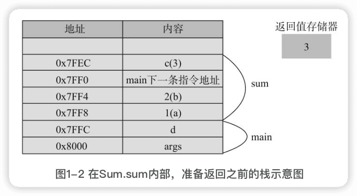
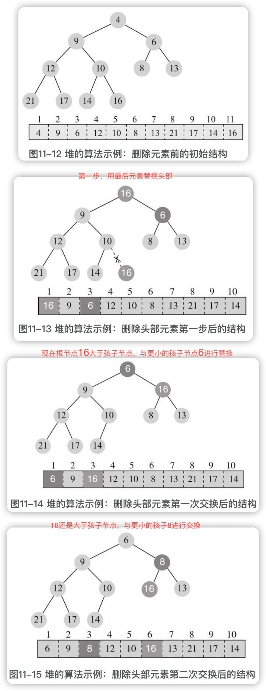

Java编程的逻辑
-------

[示例  代码](https://github.com/swiftma/program-logic/blob/master/the_logic_of_java_programming.md)


## 前言

为编程的核心知识建立知识地图，从最基础的概念开始，分解为知识点，一个知识点一个知识点地讲解，每一个知识点都力争清晰透彻，阐述知识点是什么、怎么用、有什么用途、实现原理是什么、思维逻辑是什么、与其他知识点有什么关系等。

要掌握人工智能技术，必须先掌握基本编程技术。

2017年7月，国务院印发了《新一代人工智能发展规划》，其中提到“实施全民智能教育项目，在中小学阶段设置人工智能相关课程，逐步推广编程教育”，未来，可能大部分人都需要学习编程。

# 一、编程基础与二进制

## 1 编程基础

操作系统将时间分成很多细小的时间片，一个时间片给一个程序用，另一个时间片给另一个程序用，并频繁地在程序间切换。不过，在应用程序看来，整个机器资源好像都归它使用，操作系统给它制造了这种假象。对程序员而言，编写程序时基本不用考虑其他应用程序，做好自己的事就可以了。

应用程序看上去能做很多事情，能读写文档、能播放音乐、能聊天、能玩游戏、能下围棋等，但本质上，计算机只会<font color=#FF8C00>**执行预先写好的指令**</font>（操作数据或者设备）而已。

所谓程序，基本上就是告诉计算机要操作的<font color=#FF8C00>**数据**</font>和执行的；<font color=#FF8C00>**指令序列**</font>，即对什么数据做什么操作，比如：

1. 读文档，就是将数据从磁盘加载到内存，然后输出到显示器上；
2. 写文档，就是将数据从内存写回磁盘；
3. 播放音乐，就是将音乐的数据加载到内存，然后写到声卡上；
4. 聊天，就是从键盘接收聊天数据，放到内存，然后传给网卡，通过网络传给另一个人的网卡，再从网卡传到内存，显示在显示器上。

数据在计算机内部都是二进制表示的，不方便操作，为了方便操作数据，高级语言引入了**数据类型**和**变量**的概念；

对数据进行的第一个操作：**赋值**；

数据有了初始值之后，可以对数据进行的一些**基本运算**；

为了编写有实用功能的程序，需要对操作的过程进行**流程控制**；

为了减少重复代码和分解复杂操作，计算机程序引入了**函数**和**子程序**的概念。

### 1.1 数据类型和变量

8中基本数据类型：

1. 整数类型：有4种整型byte/short/int/long（分别占1、2、4、8个字节），分别有不同的取值范围；
2. 小数类型：有两种类型float/double（4和8字节），有不同的取值范围和精度；
3. 字符类型：char，表示单个字符（2字节）；
4. 真假类型：boolean，表示真假。

>  世界万物都是由元素周期表中的基本元素组成的，**基本数据类型**就相当于化学中的**基本元素**，而**对象**就相当于**世界万物**。

所谓内存在程序看来就是一块<font color=#FF8C00>**有地址编号的连续的空间**</font>，数据放到内存中的某个位置后，为了方便地找到和操作这个数据，需要给这个位置起一个名字。编程语言通过<font color=#FF8C00>**变量**</font>这个概念来表示这个过程。

变量就是给数据起名字，方便找不同的数据，它的值可以变，但含义不应变。

### 1.2 赋值

赋值声明变量之后，就在内存分配了一块位置，但这个位置的内容是未知的，赋值就是把这块位置的内容设为一个确定的值。

#### 数组类型

3中赋值方式：

```java
int[] arr = {1,2,3};

int[] arr = new int[]{1,2,3};

int[] arr = new int[3];
arr[0] = 1;
arr[1] = 2;
arr[2] = 3;
```

动态确定数组长度：

```java
int length = ...; // 根据一些条件动态计算
int[] arr = new int[length];
```

数组组长度虽然可以动态确定，但定了之后就不可以变。

数组类型和基本类型是有明显不同的，一个基本类型变量，内存中只会有一块对应的内存空间。但数组有两块：**一块用于存储数组内容本身，另一块用于存储内容的位置**。


### 1.3 基本运算

#### 算术运算

整数相除不是四舍五入，而是直接舍去小数位。

小数计算结果不精确。

#### 比较运算

#### 逻辑运算

- 与（&）
- 或（|）
- 非（!）
- 异或（^）：两个相同为false，两个不相同为true；
- 短路与（&&）
- 短路或（||）

### 1.4 条件执行

if/else

三元运算

switch

#### 实现原理

CPU的<font color=#FF8C00>指令指示器</font>，**跳转**指令，有两种：

1. <font color=#FF8C00>**条件跳转**</font>（满足某个条件则进行跳转）
2. <font color=#FF8C00>**无条件跳转**</font>（直接跳转）

if/else就是转换为跳转指令：

```java
        1 int a=10;
        2 if(a%2==0)
        3 {
        4     System.out.println("偶数");
        5 }
        6 //其他代码
```

转换为：

```java
        1 int a=10;
        2 条件跳转：如果a%2==0，跳转到第4行
        3 无条件跳转：跳转到第7行
        4 {
        5     System.out.println("偶数");
        6 }
        7 //其他代码
```

switch的转换和具体系统实现有关。如果分支比较少，可能会转换为跳转指令。如果分支比较多，使用条件跳转会进行很多次的比较运算，效率比较低，可能会使用一种更为高效的方式，叫<font color=#FF8C00>跳转表</font>。跳转表是一个映射表，存储了可能的值以及要跳转到的地址：


跳转表为什么会更为高效呢？因为其中的值必须为**整数**，且按大小顺序**排序**。按大小排序的整数可以使用高效的二分查找。

**程序源代码中的case值排列不要求是排序的，编译器会自动排序。**

switch值的类型可以是<u>byte、short、int、char、枚举和String</u>。byte、short、int、char都是整数，枚举也可以表示为整数，String用于switch时也会转换为整数（通过hasCode方法）。**不可以使用long**，因为跳跳转表值的存储空间一般为32位，容纳不下long。

### 1.5 循环

循环：多次重复执行某些类似的操作。

计算机程序运行时大致只能**顺序执行、条件执行和循环执行**。顺序和条件其实没什么特别的，而循环大概才是程序强大的地方。

循环的4中形式：

1. while

2. do/while

3. for

4. foreach  对于不需要使用索引变量，只是简单遍历的情况，foreach语法上更为简洁。

   ```java
   for (int element : arr) {
     
   }
   ```

循环控制：

break

continue

**虽然循环看起来只是重复执行一些类似的操作而已，但它其实是计算机程序解决问题的一种基本思维方式。**

解决复杂问题的基本策略是<font color=#FF8C00>**分而治之**</font>，将复杂问题分解为若干相对简单的子问题，然后子问题再分解为更小的子问题……程序由数据和指令组成，大程序可以分解为小程序，小程序接着分解为更小的程序。

### 1.6 函数的用法

<font color=#FF8C00>使用函数来减少重复代码和分解复杂操作。</font>

Java中，任何函数都需要放在一个类中。Java中的函数一般叫做方法。

```java
修饰符 返回值类型 函数名字(参数类型 参数名字，...) {
	操作
  return 返回值;
}
```

Java中函数有大量修饰符，如：public、private、static、final、synchronized、abstract等。

定义函数时声明参数，实际上就是定义变量，只是这些变量的值是未知的，调用函数时传递参数，实际上就是给函数中的变量赋值。

对于需要重复执行的代码，可以定义函数，然后在需要的地方调用，这样可以减少重复代码。对于复杂的操作，可以将操作分为多个函数，会使得代码更加易读。

#### 进一步理解函数

##### 1 参数传递

有两类特殊类型的参数：

- 数组

函数内修改数组中的元素会修改调用者中的数组内容。

- 可变长度的参数

```java
public static int max(int min, int ... a){
  int max = min;
  for(int i=0; i<a.length; i++){
    if(max<a[i]){
      max = a[i];
    }
  }
  return max;
}
public static void main(String[] args) {
  System.out.println(max(0));
  System.out.println(max(0,2));
  System.out.println(max(0,2,4));
  System.out.println(max(0,2,4,5));
}
```

可变长度参数可以看作是数组。可变长度参数必须是参数列表中的最后一个，一个函数也只能有一个可变长度的参数。

### 1.7 函数调用的基本原理

#### 栈的概念

程序执行的基本原理：CPU有一个**指令指示器**，指向下一条要执行的指令，要么顺序执行，要么进行跳转（条件跳转或无条件跳转）。

**程序从main函数开始顺序执行，函数调用可以看作一个无条件跳转，跳转到对应函数的指令处开始执行，碰到return语句或者函数结尾的时候，再执行一次无条件跳转，跳转回调用方，执行调用函数后的下一条指令。**

有几个问题：

1. 参数如何传递？

2. 函数如何知道返回到什么地方？

   在if/else、for中，跳转的地址都是确定的，但函数自己并不知道会被谁调用，而且可能会被很多地方调用，它并不能提前知道执行结束后返回哪里。

3. 函数结果如何传给调用方？

<font color=#FF8C00>解决思路</font>是使用内存来存放这些数据，函数调用方和函数自己就如何存放和使用这些数据达成一个一致的**协议或约定**。这个约定在各种计算机系统中都是**类似的**，存放这些数据的内存有一个相同的名字，叫**栈**。

栈中存放函数调用过程中需要的数据，包括<font color=#FF8C00>**参数、返回地址以及函数内定义的局部变量**</font>。

#### 函数执行的基本原理


- 当程序在main函数调用Sum.sum之前，栈的情况：


- 在程序执行到Sum.sum的函数内部，准备返回之前，即第5行，栈的情况：

  

在main函数调用Sum.sum时，首先将参数1和2入栈，然后将**返回地址**（也就是调用函数结束后要执行的指令地址）入栈，接着跳转到sum函数，在sum函数内部，需要为局部变量c分配一个空间，而参数变量a和b则直接对应于入栈的数据1和2，在返回之前，返回值保存到了专门的**返回值存储器**中。

在调用return后，程序会跳转到栈中保存的返回地址，即**main的下一条指令地址**，而sum函数相关的数据会出栈，从而又变回图1-1的样子。


<u>这些变量只有在函数被调用的时候才分配，而且在调用结束后就被释放了。但这个说法主要针对基本数据类型。</u>

#### 数组和对象的内存分配

数组和对象类型，存放地址的空间是分配在栈上的，实际内容空间一般分配在**堆中。

```java
public class ArrayMax {
  public static int max(int min, int[] arr) {
    int max = min;
    for(int a : arr){
      if(a>max){
        max = a;
      }
    }
    return max;
  }
  public static void main(String[] args) {
    int[] arr = new int[]{2,3,4};
    int ret = max(0, arr);
    System.out.println(ret);
  }
}
```


#### 递归调用的原理

```java
public static int factorial(int n){
  if(n==0){
    return 1;
  }else{
    return n＊factorial(n-1);
  }
}
public static void main(String[] args) {
  int ret = factorial(4);
  System.out.println(ret);
}
```


返回值存储器是没有值的。


每递归调用一次，栈的深度就增加一层，每次调用都会分配对应的参数和局部变量，也都会保存调用的返回地址。


递归函数的执行过程，函数代码虽然只有一份，但在执行的过程中，每调用一次，就会有一次入栈，生成一份不同的参数、局部变量和返回地址。

#### 小结

函数调用主要是通过栈来存储相关的数据，系统就函数调用者和函数如何使用栈做了约定，返回值可以简单认为是通过一个专门的返回值存储器存储的。

从函数调用的过程可以看出，调用是有成本的，**每一次调用都需要分配额外的栈空间用于存储参数、局部变量以及返回地址，需要进行额外的入栈和出栈操作**。

栈的空间不是无限的，如果栈空间过深，系统就会抛出错误`java.lang.StackOverflowError`，即**栈溢出**。

## 2 理解数据背后的二进制

### 2.1 整数的二进制表示与位运算

123 十进制表示 `1× (10^2)+2× (10^1)+3× (10^0)`

==位权==

#### 正整数的二进制表示


#### 负整数的二进制表示

二进制使用最高位表示符号位，用1表示负数，用0表示正数。

**原码表示法**

但负数表示不是简单地将最高位变为1，而是用**补码表示法**，是在原码表示的基础上**取反然后加1**。

- `-1`: 1的原码表示是00000001，取反是11111110，然后再加1，就是11111111。
- `-2`: 2的原码表示是00000010，取反是11111101，然后再加1，就是11111110。
- `-127`: 127的原码表示是01111111，取反是10000000，然后再加1，就是10000001。

给定一个负数的二进制表示，要得到它的十进制，也可以使用补码运行，**取反然后加1**（注意不是减1），比如：

- `100100101` ，取反是`01101101`，加1是`01101110`，就是十进制`110`(`2^6+2^5+2^3+2^2+2`)，所以原值的十进制表示就是-110。

> 负整数为什么要采用这种奇怪的表示形式呢？
>
> 原因是，**只有这种形式，计算机才能实现正确的加减法。**

计算机只能做加法，而补码的一个良好特性就是，**对负数的补码表示做补码运算就可以得到其对应正数的原码。**

1-1其实是1+(-1)，如果用原码表示，结果就不对了：

```java
1   ->  00000001
-1  ->  10000001
+   --------------
-2  ->  10000010   
```

结果就是-2了，补码表示：

```java
1   ->  00000001
-1  ->  11111111
+   --------------
0   ->  00000000   
```

结果就是0，对的。

> 为什么正数的运算结果可能出现负数？
>
> 当计算结果超出表示范围的时候，最高位往往是1，然后就会被看作负数。

#### 十六进制

用十六进制简化二进制的写法。

#### 位运算

位运算有**移位运算**和**逻辑运算**。

移位以下几种：

1. `<<`：向左移动，右边的低位补0，高位的就舍弃掉了，将二进制看作整数，左移1位就相当于乘以2。
2. `>>>`：无符号右移，右边的舍弃掉，左边补0。
3. `>>`：有符号右移，右边的舍弃掉，左边补什么取决于原来最高位是什么，原来是1就补1，原来是0就补0，将二进制看作整数，右移1位相当于除以2。

逻辑运算：

1. 按位与`&`：两位都为1才为1。
2. 按位或`|`：只要有一位为1，就为1。
3. 按位取反`~`:1变为0,0变为1。、
4. 按位异或`^`：相异为真，相同为假。

```java
        int a = …;
        a = a & 0x1 	//返回0或1，就是a最右边一位的值
        a   = a | 0x1 //不管a原来最右边一位是什么，都将设为1
```


### 2.2 小数的二进制表示

#### 小数计算为什么会出错

计算机根本就不能精确地表示很多数。

十进制也只能表示那些可以表述为**10的多少次方和的数**。如如12.345 = 1× 10+2× 1+3× 0.1+4× 0.01+5× 0.001。

二进制只能表示那些可以表述为**2的多少次方和的数**。


> 为什么计算机使用二进制而不是十进制？
>
> 在最底层，计算机使用的电子元器件只能表示两个状态，通常是低压和高压，对应0和1，使用二进制容易基于这些电子元器件构建硬件设备和进行运算。如果非要使用十进制，则这些硬件就会复杂很多，并且效率低下。

> 在误差足够小的时候，结果看上去是精确的，但不精确其实才是常态。

如果真的需要比较高的精度，一种方法是将小数转化为整数进行运算，运算结束后再转化为小数；另一种方法是使用十进制的数据类型，这个并没有统一的规范。在Java中是`BigDecimal`，运算更准确，但效率比较低。

#### 二进制表示

小数运算被称为==浮点运算==。

> 为什么要叫浮点数呢？
>
> 这是由于小数的二进制表示中，表示那个小数点的时候，点不是固定的，而是浮动的。

二进制中为表示小数，也采用类似的科学表示法，形如`m×(2^e)`。m称为**尾数**，e称为**指数**。指数可以为正，也可以为负，负的指数表示那些接近0的比较小的数。

几乎所有的硬件和编程语言表示小数的二进制格式都是一样的，叫做==IEEE 754标准==。

32位格式(float)中，1位表示符号，23位表示尾数，8位表示指数。64位格式(double)中，1位表示符号，52位表示尾数，11位表示指数。

查看浮点数的具体二进制形式：

```java
System.out.println(Integer.toBinaryString(Float.floatToIntBits(1.2345f)));
System.out.println(Long.toBinaryString(Double.doubleToLongBits(1.2345f)));
```

```java
111111100111100000010000011001
11111111110011110000001000001100100000000000000000000000000000
```

### 2.3 字符的编码与乱码 

编码分两大类：非Unicode编码，Unicode编码。

#### 常见非Unicode编码

##### 1 ASCII

ASCII编码，全称是American Standard Codefor InformationInterchange，即美国信息互换标准代码。

一个字节表示一个字符，ASCII码中最高位设置为0，用剩下的7位表示字符。

数字32～126表示的字符都是可打印字符，0～31和127表示一些不可以打印的字符，这些字符一般用于控制目的。


各个国家的各种计算机厂商就发明了各种各种的编码方式以表示自己国家的字符，为了保持与ASCII码的兼容性，一般都是将最高位设置为1。也就是说，**当最高位为0时，表示ASCII码，当为1时就是各个国家自己的字符**。

##### 2 ISO 8859-1(Latin-1)

一个字节表示一个字符。128～159表示一些控制字符，160～255表示一些西欧字符。

##### 3 Windows-1252

与ISO 8859-1标准类似。

##### 4 GB2312

针对简体中文常见字符，包括约7000个汉字和一些罕用词和繁体字。

GB2312固定使用**两个字节**表示汉字。

##### 5 GBK

GBK建立在GB2312的基础上，向下兼容GB2312，增加了14 000多个汉字，共计约21 000个汉字，其中包括繁体字。也是固定两个字节表示汉字。

##### 6 GB18030

GB18030向下兼容GBK，增加了55 000多个字符，共76 000多个字符，包括了很多少数民族字符，以及中日韩统一字符。

**有的字符是两个字节，有的是四个字节**。

##### 7 Big5

主要香港、台湾地区使用，针对繁体中文。固定两个字节表示汉字。

##### 8 编码汇总

ASCII码是基础，使用一个字节表示，最高位设为0，其他7位表示128个字符。其他编码都是兼容ASCII的，最高位使用1来进行区分。

#### Unicode编码

Unicode 做了一件事，就是给世界上所有字符都分配了一个唯一的数字编号，这个编号范围从0x000000～0x10FFFF，包括110多万(16^4 - 1 + 16^5 = 1114111)。但大部分常用字符都在0x0000～0xFFFF之间，即65536个数字之内。

一般写成十六进制，在前面加`U+`。大部分中文的编号范围为`U+4E00～U+9FFF`。

并没有规定这个**编号怎么对应到二进制表示**，产生几种方案：

##### 1 UTF-32


##### 2 UTF-16


##### 3 UTF-8

编号小的使用的字节就少，编号大的使用的字节就多，使用的字节个数为1～4不等。


小于128的，编码与ASCII码一样，最高位为0。其他编号的第一个字节有特殊含义，<u>最高位有几个连续的1就表示用几个字节表示，而其他字节都以10开头。</u>


#### 编码转换

有了Unicode之后，每一个字符就有了多种不兼容的编码方式，如：


这几种格式之间可以借助Unicode编号进行编码转换。

一个字符从A编码转到B编码，先找到字符的A编码格式，通过A的映射表找到其Unicode编号，然后通过Unicode编号再查B的映射表，找到字符的B编码格式。

#### 乱码的原因

乱码有两种常见原因：一种比较简单，就是简单的解析错误；另外一种比较复杂，在错误解析的基础上进行了编码转换。

#### 从乱码中恢复🔖


### 2.4 char的真正含义🔖

Java内部字符处理，采用的都是Unicode，具体编码格式是**UTF-16BE**。

char本质上是一个固定占用两个字节的无符号正整数，这个正整数对应于Unicode编号，用于表示那个Unicode编号对应的字符。由于**固定占用两个字节**，char只能表示Unicode编号在65 536以内的字符，而不能表示超出范围的字符。

超出范围的字符怎么表示呢？使用两个char。

char多种赋值方式：

```java
  1. char c = 'A'
  2. char c = '马'
  3. char c = 39532
  4. char c = 0x9a6c
  5. char c = '\u9a6c'
```

本质都是将Unicode编号39 532赋给了字符。

由于char本质上是一个整数，所以可以进行整数能做的一些运算。

# 二、面向对象

## 3 类的基础

程序主要就是**数据以及对数据的操作**，为方便理解和操作，高级语言使用了**数据类型**这个概念。 

### 3.1 类的基础概念

某些情况下，类也确实只是函数的容器，但类更多表示的是自定义数据类型。

#### 函数容器

`Math`

`Arrays`

static表示==类方法==，也叫静态方法，与类方法相对的是==实例方法==。实例方法没有static修饰符，必须通过实例或者对象调用，而类方法可以直接通过类名进行调用，不需要创建实例。

**通过private封装和隐藏内部实现细节，避免被误操作，是计算机程序的一种基本思维方式。**

Math和Arrays也可以看作自定义数据类型，分别表示数学和数组类型，其中的public static函数可以看作类型能进行的操作。


#### 自定义数据类型

一个数据类型由其包含的<font color=#FF8C00>**属性**</font>以及该类型可以进行的<font color=#FF8C00>**操作**</font>组成，属性又可以分为是类型本身具有的属性（==**类变量**== 或叫 静态变量 或叫 静态成员变量），还是一个具体实例具有的属性（**实例变量**），同样，操作也可以分为是类型本身可以进行的操作（**类方法**/静态方法），还是一个具体实例可以进行的操作（**实例方法**）。

类变量和实例变量都叫**==成员变量==**；类方法和实例方法都叫==**成员方法**==。

实例方法中，有一个隐含的参数，这个参数就是当前操作的实例自己，直接操作实例变量，实际也需要通过参数进行。

实例方法和类方法的区别：

1. 类方法只能访问类变量，不能访问实例变量，可以调用其他的类方法，不能调用实例方法。
2. 实例方法既能访问实例变量，也能访问类变量，既可以调用实例方法，也可以调用类方法。

`final`在修饰变量的时候表示常量。

==**引用类型**==的变量都有两块内存：一块存放**实际内容**，一块存放实际内容的**位置**。声明变量本身只会分配存放位置的内存空间，这块空间还没有指向任何实际内容。

**通过对象来访问和操作其内部的数据是一种基本的面向对象思维。**

#### 变量默认值

在创建对象的时候，所有的实例变量都会分配一个**默认值**，这与创建数组的时候是类似的，<u>数值类型变量的默认值是`0`, boolean是`false`, char是`\u0000`，引用类型变量都是`null`。</u>

初始化代码块。

静态初始化代码块，类加载时只执行一次。

#### private变量

一般而言，**不应该将实例变量声明为public，而只应该通过对象的方法对实例变量进行操作**。这也是为了减少误操作，直接访问变量没有办法进行**参数检查和控制**，而通过方法修改，可以在方法中进行检查。

#### 构造方法

1. 名称是固定的，与类名相同。
2. 没有返回值，也不能有返回值。构造方法隐含的返回值就是实例本身。

```java
        public Point(){
            this(0,0);
          	....
        }
        public Point(int x, int y){
              this.x = x;
              this.y = y;
        }
```

this的两个用法：`this(0,0)`表示调用其它构造方法；`this.x`表示当前实例。

构造方法中的this调用必须放在第一行，这个规定也是**为了避免误操作**。构造方法是用于初始化对象的，如果要调用别的构造方法，先调别的，然后根据情况自己再做调整，而如果自己先初始化了一部分，再调别的，自己的修改可能就被覆盖了。

##### **默认构造方法**


##### **私有构造方法**

使用场景：

1. 不能创建类的实例，类只能被静态访问，如Math和Arrays类。
2. 能创建类的实例，但只能被类的静态方法调用，如单例模式。
3. 只是用来被其他多个构造方法调用，用于减少重复代码。

#### 类和对象的生命周期

在程序运行的时候，当第一次通过new创建一个类的对象时，或者直接通过类名访问类变量和类方法时，Java会将类加载进内存，为这个类分配一块空间，这个空间会包括**类的定义、它的变量和方法信息，同时还有类的静态变量，并对静态变量赋初始值**。

类加载进内存后，一般不会释放，直到程序结束。一般情况下，类只会加载一次，所以静态变量在内存中只有一份。


当通过new创建一个对象的时候，对象产生，在内存中，会存储这个对象的实例变量值，每做new操作一次，就会产生一个对象，就会有一份独立的实例变量。

每个对象除了保存实例变量的值外，可以理解为还保存着对应类型即类的地址，这样，通过对象能知道它的类，访问到类的变量和方法代码。

<u>实例方法可以理解为一个静态方法，只是多了一个参数this。通过对象调用方法，可以理解为就是调用这个静态方法，并将对象作为参数传给this。</u>

对象和数组一样，有两块内存，<u>保存地址的部分分配在栈中，而保存实际内容的部分分配在堆中</u>。栈中的内存是自动管理的，函数调用入栈就会分配，而出栈就会释放。

#### 总结

1. public：可以修饰类、类方法、类变量、实例变量、实例方法、构造方法，表示可被外部访问。
2. private：可以修饰类、类方法、类变量、实例变量、实例方法、构造方法，表示不可以被外部访问，只能在类内部被使用。
3. static：修饰类变量和类方法，它也可以修饰内部类。
4. this：表示当前实例，可以用于调用其他构造方法，访问实例变量，访问实例方法。
5. final：修饰类变量、实例变量，表示<u>只能被赋值一次</u>，也可以修饰实例方法和局部变量。

### 3.2 类的组合

<font color=#FF8C00>程序是用来解决现实问题的，将现实中的概念映射为程序中的概念，是初学编程过程中的一步跨越。</font>

#### String和Date

`String`表示多个字符，即一段文本或字符串，它内部是一个char的数组，提供了若干方法用于操作字符串。

`Date`表示日期和时间，它内部是一个long类型的值。

#### 图形类

**在设计线时，我们考虑的层次是点，而不考虑点的内部细节。每个类封装其内部细节，对外提供高层次的功能，使其他类在更高层次上考虑和解决问题，是程序设计的一种基本思维方式。**

```java
    public static void main(String[] args) {
        Point start = new Point(2, 3);
        Point end = new Point(5, 9);
        Line line = new Line(start, end);
        System.out.println(line.length());
    }
```


start、end、line三个引用型变量分配在栈中，保存的是实际内容的地址，实际内容保存在堆中，line的两个实例变量line.start和line.end还是引用，同样保存的是实际内容的地址。

#### 用类描述电商概念

电商系统中最基本的有产品、用户和订单。

想想现实问题有哪些==概念==，这些概念有哪些==属性==、哪些==行为==，概念之间有什么关系，然后定义类、定义属性、定义方法、定义类之间的关系。概念的属性和行为可能是非常多的，但定义的类<u>只需要包括那些与现实问题相关的</u>就行了。

#### 用类描述人之间的血缘关系

一个类定义中还可以引用它自己。

#### 目录和文件

两个类之间可以互相引用，MyFile引用了MyFolder，而MyFolder也引用了MyFile。


类中应该定义哪些变量和方法，这是与要解决的问题密切相关的。

类之间的组合关系在Java中实现的都是==**引用**==，但在逻辑关系上，有两种明显不同的关系，一种是**==包含==**，另一种是**单纯引用**。比如，在订单类Order中，Order与User的关系就是单纯引用，User是独立存在的；而Order与OrderItem的关系就是包含，OrderItem总是从属于某一个Order。

**<font color=#FF8C00>分解现实问题中涉及的概念以及概念间的关系，将概念表示为多个类，通过类之间的组合来表达更为复杂的概念以及概念间的关系，是计算机程序的一种基本思维方式。</font>**


### 3.3 代码的组织机制

使用任何语言进行编程都有一个类似的问题，那就是**==如何组织代码？==** 具体就是：<u>如何避免命名冲突？如何合理组织各种源文件？如何使用第三方库？各种代码和依赖库如何编译链接为一个完整的程序？</u>

#### 包的概念

**完全限定名**：带完整包名的类名。

Java API中所有的类和接口都位于包java或javax下，java是标准包，javax是扩展包。

1. ==声明==类所在的包

包声明语句应该位于源代码的最前面，前面**不能有注释外的其他语句**。

**包名和文件目录结构必须匹配**。

如果代码需要公开给其他人用，最好有一个域名以确保唯一性。

包可以方便模块化开发，不同功能可以位于不同包内，不同开发人员负责不同的包。包也可以方便封装，<u>供外部使用的类可以放在包的上层，而内部的实现细节则可以放在比较底层的子包内。</u>🔖怎么理解？

2. 通过包==使用==类

同一个包下的类之间互相引用是不需要包名的。不同包，两种方式使用：**一种是通过类的完全限定名；另外一种是将用到的类引入当前类**。

只有一个例外，**java.lang包下的类可以直接使用，不需要引入**，也不需要使用完全限定名，比如String类、System类，其他包内的类则不行。

`import java.util.*`，引入不能递归，它只会引入java.util包下的直接类，而不会引入java.util下嵌套包内的类。

**静态导入**：可以直接导入类的公开静态方法和成员。静态导入不应过度使用，否则难以区分访问的是哪个类的代码。

3. 包范围可见性

同一个包指的是同一个直接包，子包下的类并不能访问。

可见性范围从小到大是：private < 默认(包) < protected < public

#### jar包

各种程序语言大多有打包的概念，打包的一般不是源代码，而是编译后的代码。

在Java中，编译后的一个或多个包的Java class文件可以打包为一个文件，Java中打包命令为jar，打包后的文件扩展名为`.jar`，一般称之为jar包。jar包其实就是一个压缩文件。

```
jar -cvf <包名>.jar <最上层包名>
```

Java类库、第三方类库都是以jar包形式提供的。如何使用jar包呢？将其加入**类路径（classpath）**中即可。

#### 程序的编译与链接

从Java源代码到运行的程序，有编译和链接两个步骤。编译是将源代码文件变成扩展名是.class的一种字节码，这个工作一般是由`javac`命令完成的。链接是在运行时动态执行的，.class文件不能直接运行，运行的是Java虚拟机，虚拟机听起来比较抽象，执行的就是`java`命令，这个命令解析.class文件，转换为机器能识别的二进制代码，然后运行。所谓链接就是**根据引用到的类加载相应的字节码并执行**。

Java编译和运行时，都需要以参数指定一个classpath，即<font color=#FF8C00>类路径</font>。类路径可以有多个，对于直接的class文件，路径是class文件的根目录；对于jar包，路径是jar包的完整名称（包括路径和jar包名）。在Windows系统中，多个路径用分号“; ”分隔；在其他系统中，以冒号“:”分隔。

import是编译时概念，用于确定完全限定名，在运行时，只根据完全限定名寻找并加载类。

> 🔖在Java 9中，引入了**模块**的概念，JDK和JRE都按模块化进行了重构，传统的组织机制依然是支持的，但新的应用可以使用模块。**一个应用可由多个模块组成，一个模块可由多个包组成。模块之间可以有一定的依赖关系，一个模块可以导出包给其他模块用，可以提供服务给其他模块用，也可以使用其他模块提供的包，调用其他模块提供的服务。对于复杂的应用，模块化有很多好处，比如更强的封装、更为可靠的配置、更为松散的耦合、更动态灵活等。**


## 4 类的继承

现实中的概念有个重要关系：<font color=#FF8C00>分类</font>。

计算机程序经常使用类之间的继承关系来表示对象之间的分类关系。

使用继承一方面可以复用代码，公共的属性和行为可以放到父类中，而子类只需要关注子类特有的就可以了；另一方面，不同子类的对象可以更为方便地被统一处理。

### 4.1 基本概念

根父类`Object`：在Java中，即使没有声明父类，也有一个隐含的父类。

每个类有且只有一个父类，没有声明父类的，其父类为Object，子类继承了父类非private的属性和方法，可以增加自己的属性和方法，以及重写父类的方法实现。

<u>new过程中，父类先进行初始化，可通过super调用父类相应的构造方法，没有使用super的情况下，调用父类的默认构造方法（super必须放在第一行）</u>。

子类变量和方法与父类重名的情况下，可通过super强制访问父类的变量和方法。

super的使用与this有点像，但super和this是不同的，this引用一个对象，是实实在在存在的，可以作为函数参数，可以作为返回值，但super只是一个关键字，不能作为参数和返回值，它只是用于告诉编译器访问父类的相关变量和方法。

```java
public class ShapeManager {
    private static final int MAX_NUM = 100;
    private Shape[] shapes = new Shape[MAX_NUM];
    private int shapeNum = 0;

    public void addShape(Shape shape) {
        if (shapeNum < MAX_NUM) {
            shapes[shapeNum++] = shape;
        }
    }

    public void draw() {
        for (int i = 0; i < shapeNum; i++) {
            shapes[i].draw();
        }
    }

    public static void main(String[] args) {
        ShapeManager shapeManager = new ShapeManager();
        shapeManager.addShape(new Line(new Point(1, 2), new Point(3, 5), "red"));
        shapeManager.addShape(new Circle(new Point(5, 9), 2));
        shapeManager.addShape(new ArrowLine(new Point(6, 7), new Point(8, 11), "blue", true, false));

        shapeManager.draw();
    }
}
```

继承的一个好处是**可以统一处理不同子类型的对象**。

子类对象赋值给父类引用变量，这叫**向上转型**。

参数`Shape shape`中的变量shape可以引用任何Shape子类类型的对象，这叫**多态**，**即一种类型的变量，可引用多种实际类型对象**。

这样，对于变量shape，它就有两个类型：类型Shape，我们称之为shape的**静态类型**；类型Circle/Line/ArrowLine，我们称之为shape的**动态类型**。在ShapeManager的draw方法中，shapes[i].draw()调用的是其对应动态类型的draw方法，这称之为方法的**动态绑定**。

> 为什么要有多态和动态绑定呢？
>
> 创建对象的代码（ShapeManager以外的代码）和操作对象的代码（ShapeManager本身的代码），经常不在一起，操作对象的代码往往只知道对象是某种父类型，也往往只需要知道它是某种父类型就可以了。

<font color=#FF8C00>**多态和动态绑定是计算机程序的一种重要思维方式，使得操作对象的程序不需要关注对象的实际类型，从而可以统一处理不同对象，但又能实现每个对象的特有行为。**</font>

总结：**子类对象可以赋值给父类引用变量，这叫多态；实际执行调用的是子类实现，这叫动态绑定。**

### 4.2 继承的细节

#### 构造方法

父类只有一个带参数的构造方法，没有默认构造方法的时候，它的任何子类都必须在构造方法中通过super调用父类的带参数构造方法。

> 在父类构造方法中调用可被子类重写的方法，是一种不好的实践，容易引起混淆，应该只调用private的方法。

#### 重名与静态绑定

> 子类与父类中实例变量、静态方法和静态变量可以重名吗？如果重名，访问的是哪一个呢？
>
> 重名是可以的，重名后实际上有两个变量或方法。private变量和方法只能在类内访问，访问的也永远是当前类的，即：在子类中访问的是子类的；在父类中访问的是父类的，它们只是碰巧名字一样而已，没有任何关系。
>
> public变量和方法，则要看如何访问它。在类内，访问的是当前类的，但子类可以通过super．明确指定访问父类的。在类外，则要看访问变量的静态类型：静态类型是父类，则访问父类的变量和方法；静态类型是子类，则访问的是子类的变量和方法。

```java
public class Base {
    public static String s = "static_base";
    public String m = "base";
    public static void staticTest(){
        System.out.println("base static: "+s);
    }
}
public class Child extends Base {
    public static String s = "child_base";
    public String m = "child";
    public static void staticTest(){
        System.out.println("child static: "+s);
    }
}
```

```java
    public static void main(String[] args) {
        Child c = new Child();
        Base b = c;
        System.out.println(b.s);
        System.out.println(b.m);
        b.staticTest();
        System.out.println(c.s);
        System.out.println(c.m);
        c.staticTest()
    }
```

结果为

```
        static_base
        base
        base static: static_base
        child_base
        child
        child static: child_base
```

当通过b（静态类型Base）访问时，访问的是Base的变量和方法，当通过c（静态类型Child）访问时，访问的是Child的变量和方法，这称之为**静态绑定**，即<u>访问绑定到变量的静态类型</u>🔖。静态绑定在程序编译阶段即可决定，而动态绑定则要等到程序运行时。**实例变量、静态变量、静态方法、private方法，都是静态绑定的**。

#### 重载和重写

重载是指方法名称相同但参数签名不同（参数个数、类型或顺序不同），重写是指子类重写与父类相同参数签名的方法。

当有多个重名函数的时候，在决定要调用哪个函数的过程中，首先是按照参数类型进行匹配的，换句话说，寻找在所有重载版本中最匹配的，然后才看变量的动态类型，进行动态绑定。

#### 父子类型转换

```java
Base b = new Base();
Child c = (Child)b;
```

语法上Java不会报错，但运行时会抛出错误，错误为类型转换异常。

一个父类的变量能不能转换为一个子类的变量，取决于这个父类变量的动态类型（即引用的对象类型）是不是这个子类或这个子类的子类。

可通过`instanceof`来判断一个父类的变量是不是某个子类的对象：

```java
public boolean canCast(Base b) {
  return b instanceof Child;
}
```

#### 继承访问权限protected

模板方法在很多框架中有广泛的应用，这是使用protected的一种常见场景。🔖

#### 可见性重写

重写方法时，一般并不会修改方法的可见性；如果要修改，**子类方法不能降低父类方法的可见性**。

> 为什么要这样规定呢？
>
> 继承反映的是“is-a”的关系，即子类对象也属于父类，子类必须支持父类所有对外的行为，将可见性降低就会减少子类对外的行为，从而破坏“is-a”的关系，但子类可以增加父类的行为，所以提升可见性是没有问题的。

#### 防止继承final

一个Java类，默认情况下都是可以被继承的，但加了final关键字之后就不能被继承了。另外final实例方法不能被重写。

### 4.3 继承实现的基本原理

#### 示例

```java
public class Base {
    public static int s;
    private int a;
    static {
        System.out.println("基类静态代码块，s：" + s);
        s = 1;
    }
    {
        System.out.println("基类实例代码块，a：" + a);
        a = 1;
    }

    public Base() {
        System.out.println("基类构造方法，a：" + a);
        a = 2;
    }

    protected void step() {
        System.out.println("base s: " + s + ", a:" + a);
    }

    public void action() {
        System.out.println("start");
        step();
        System.out.println("end");
    }
}


public class Child extends Base {
    public static int s;
    private int a;
    static {
        System.out.println("子类静态代码块，s：" + s);
        s = 10;
    }
    {
        System.out.println("子类实例代码块，a：" + a);
        a = 10;
    }

    public Child() {
        System.out.println("子类构造方法，a：" + a);
        a = 20;
    }

    protected void step() {
        System.out.println("child s: " + s + ", a:" + a);
    }
}
```

```java
    public static void main(String[] args) {
        System.out.println("---- new Child()");
        Child c = new Child();
        System.out.println("\n---- c.action()");
        c.action();
        Base b = c;
        System.out.println("\n---- b.action()");
        b.action();
        System.out.println("\n---- b.s: " + b.s);
        System.out.println("\n---- c.s: " + c.s);
    }
```

结果：

```
基类静态代码块，s：0
---- new Child()
子类静态代码块，s：0
基类实例代码块，a：0
基类构造方法，a：1
子类实例代码块，a：0
子类构造方法，a：10

---- c.action()
start
child s: 10, a:20
end

---- b.action()
start
child s: 10, a:20
end

---- b.s: 1

---- c.s: 10

```


#### 类加载过程

Java中，所谓类的加载是指将类的相关信息加载到内存。在Java中，类是动态加载的，当第一次使用这个类的时候才会加载，加载一个类时，会查看其父类是否已加载，如果没有，则会加载其父类。

1. 一个类的信息主要包括以下部分：
   - 类变量（静态变量）；
   - 类初始化代码；
   - 类方法（静态方法）；
   - 实例变量；
   - 实例初始化代码；
   - 实例方法；
   - 父类信息引用
2. 类初始化代码包括：
   - 定义静态变量时的赋值语句；
   - 静态初始化代码块。
3. 实例初始化代码包括：
   - 定义实例变量时的赋值语句；
   - 实例初始化代码块；
   - 构造方法。
4. 类加载过程包括：
   - 分配内存保存类的信息；
   - 给类变量赋默认值；
   - 加载父类；
   - 设置父子关系；
   - 执行类初始化代码。

栈存放函数的局部变量；而堆存放动态分配的对象；存放类的信息，这个区在Java中称为**方法区**。

上面的示例，加载后，Java方法区有3份类信息，分别是Child、Base、Object。


#### 对象创建的过程

在类加载之后，new Child()就是创建Child对象，创建对象过程包括：

1. 分配内存；
2. 对所有实例变量赋默认值；
3. 执行实例初始化代码。

分配的内存包括<u>本类和所有父类的实例变量</u>，但不包括任何静态变量。实例初始化代码的执行从父类开始，再执行子类的。但在任何类执行初始化代码之前，所有实例变量都已设置完默认值。

每个对象除了保存类的实例变量之外，还保存着实际类信息的引用。

`Child c = new Child();`会将新创建的Child对象引用赋给变量c，而`Base b = c;`会让b也引用这个Child对象。


引用型变量c和b分配在栈中，它们指向相同的堆中的Child对象。Child对象存储着方法区中Child类型的地址，还有Base中的实例变量a和Child中的实例变量a

#### 方法调用的过程

`c.action();` 执行过程：

1. 查看c的对象类型，找到Child类型，在Child类型中找action方法，发现没有，到父类中寻找；
2. 在父类Base中找到了方法action，开始执行action方法；
3. action先输出了start，然后发现需要调用step()方法，就从Child类型开始寻找step()方法；
4. 在Child类型中找到了step()方法，执行Child中的step()方法，执行完后返回action方法；
5. 继续执行action方法，输出end。

寻找要执行的实例方法的时候，是从对象的实际类型信息开始查找的，找不到的时候，再查找父类类型信息。

`b.action()`和`c.action()`的输出是一样的，这称为动态绑定，而动态绑定实现的机制就是**根据对象的实际类型查找要执行的方法，子类型中找不到的时候再查找父类。**

如果继承的层次比较深，要调用的方法位于比较上层的父类，则调用的效率是比较低的，因为每次调用都要进行很多次查找。大多数系统使用一种称为虚方法表的方法来优化调用的效率。

**虚方法表**，就是在类加载的时候为每个类创建一个表，记录该类的对象所有动态绑定的方法（包括父类的方法）及其地址，但一个方法只有一条记录，子类重写了父类方法后只会保留子类的。


#### 变量访问的过程

**对变量的访问是静态绑定的，无论是类变量还是实例变量。**代码中演示的是类变量：b.s和c.s，通过对象访问类变量，系统会转换为直接访问类变量Base.s和Child.s。

### 4.4 为什么说继承是把双刃剑

> 继承为什么会有破坏力呢？
>
> 因为继承可能破坏封装，而封装可以说是程序设计的第一原则；另外，继承可能没有反映出is-a关系。

#### 继承破坏封装

> **封装**就是隐藏实现细节，提供简化接口。实现细节可以随时修改，而不影响使用者。
>
> 函数是封装，类也是封装。
>
> 通过封装，才能在更高的层次上考虑和解决问题。
>
> 没有封装，代码之间会到处存在着实现细节的依赖，则构建和维护复杂的程序是难以想象的。

继承可能破坏封装是因为**子类和父类之间可能存在着实现细节的依赖**。子类在继承父类的时候，往往不得不关注父类的实现细节，而父类在修改其内部实现的时候，如果不考虑子类，也往往会影响到子类。

#### 封装是如何被破坏的

```java
public class Base {
  private static final init MAX_NUM = 1000;
  private int[] arr = new int[MAX_NUM];
  private int count;
  
  public void add(int number) {
    if (count < MAX_NUM) {
      arr[count++] = number;
    }
  }
  
  public void addAll(int[] numbers) {
    for(int num : numbers) {
      add(num);
    } 
  }
}
```


```java
public class Child extends Base {
  private long sum;
  @Override
  public void add(int number) {
    super.add(number);
    sum += number;
  }
  
  @Override
  public void addAll(int[] numbers) {
    super.addAll(numbers);
    for (int i=0; i<numbers.length; i++) {
      sum += numbers[i];
    }
  }
  
  public long getSum() {
    return sum;
  }
}
```


子类和父类之间是细节依赖，子类扩展父类，仅仅知道父类能做什么是不够的，还需要知道父类是怎么做的，而父类的实现细节也不能随意修改，否则可能影响子类。

父类不能随意增加公开方法，因为给父类增加就是给所有子类增加，而子类可能必须要重写该方法才能确保方法的正确性。

小结：<u>对于子类而言，通过继承实现是没有安全保障的，因为父类修改内部实现细节，它的功能就可能会被破坏；而对于基类而言，让子类继承和重写方法，就可能丧失随意修改内部实现的自由。</u>

#### 继承没有反映is-a关系

现实中，设计完全符合is-a关系的继承关系是困难的。

但对于通过父类引用操作子类对象的程序而言，它是把对象当作父类对象来看待的，期望对象符合父类中声明的属性和行为。如果不符合，结果是什么呢？混乱。

#### 如何应对继承的双面性

两个思路：1 避免使用继承；2 正确使用继承。

避免继承的三种方法：

1. 使用final；
2. 优先使用组合而非继承；
3. 使用接口

使用继承的三种主要场景：

1. 基类是别人写的，我们写子类。主要是Java API、其他框架或类库中的类。注意
   - 重写方法不要改变预期的行为；
   - 阅读文档说明，理解可重写方法的实现机制，尤其是方法之间的依赖关系；
   - 在基类修改的情况下，阅读其修改说明，相应修改子类。
2. 我们写基类，别人可能写子类
   - 使用继承反映真正的is-a关系，只将真正公共的部分放到基类；
   - 对不希望被重写的公开方法添加final修饰符；
   - 写文档，说明可重写方法的实现机制，为子类提供指导，告诉子类应该如何重写；
   - 在基类修改可能影响子类时，写修改说明。
3. 基类、子类都是我们写的。


## 5 类的扩展

类相当于是<u>自定义数据类型</u>，通过类的组合和继承可以表示和操作各种事物或者说对象。

### 5.1 接口的本质

只是将对象看作属于某种数据类型，并按该类型进行操作，在一些情况下，并不能反映对象以及对对象操作的本质。

对象的类型

对象的**能力**

#### 接口的概念

接口声明了一组能力，但它自己并没有实现这个能力，它只是一个约定。

**双方对象并不直接互相依赖，它们只是通过接口间接交互**。


#### 定义接口

> ”比较“，很多时候不关心对象的类型，而是关系对象有没有可比较的能力。
>
> Java API中提供了`Comparable接口`，以表示可比较的能力。

```java
public interface MyComparable {
  int compareTo(Object other);
}
```

接口与类不同，它的方法没有实现代码。定义一个接口本身并没有做什么，也没有太大的用处，它还需要至少两个参与者：一个需要实现接口，另一个使用接口。

#### 实现接口

```java
public class Point implements MyComparable{
    ...
      
    @Override
    public int comparableTo(Object other) {
        if (!(other instanceof Point)) {
            throw new IllegalArgumentException();
        }
        Point otherPoint = (Point) other;
        double delta = distance() - otherPoint.distance();

        if (delta < 0) {
            return -1;
        } else if (delta > 0) {
            return 1;
        } else {
            return 0;
        }
    }
}
```


#### 使用接口

与类不同，接口不能new，不能直接创建一个接口对象，对象只能通过类来创建。但可以声明接口类型的变量，引用实现了接口的类对象。

```java
public class CompUtil {
    public static Object max(MyComparable[] objs){
        if(objs==null||objs.length==0){
            return null;
        }
        MyComparable max = objs[0];
        for(int i=1; i<objs.length; i++){
            if(max.compareTo(objs[i])<0){
                max = objs[i];
            }
        }
        return max;
    }
    public static void sort(MyComparable[] objs){
        for(int i=0; i<objs.length; i++){
            int min = i;
            for(int j=i+1; j<objs.length; j++){
                if(objs[j].compareTo(objs[min])<0){
                    min = j;
                }
            }
            if(min!=i){
                 Comparable temp = objs[i];
                 objs[i] = objs[min];
                 objs[min] = temp;
            }
        }
    }
}

```


#### 接口的细节

1. 接口中的变量。修饰符自动是`public static final`，可以不写，通过`接口名.变量名`方式使用。
2. 接口的继承，可以有多个父接口。
3. 类的继承与接口可以共存，关键字extends要放在implements之前。
4. instanceof也可用来判断一个对象是否实现了某接口。

#### 使用接口替代继承

继承至少有两个好处：一个是复用代码；另一个是利用多态和动态绑定统一处理多种不同子类的对象。

使用组合替代继承，可以复用代码，但不能统一处理。

使用接口替代继承，针对接口编程，可以实现统一处理不同类型的对象，但接口没有代码实现，无法复用代码。

将组合和接口结合起来替代继承，就既可以统一处理，又可以复用代码了。

```java
public interface IAdd {
  void add (int number);
  void addAll(int[] numbers);
}

public class Base implements IAdd {
  ...
  // 主体代码，与代码清单4-10一样
}

public class Child implements IAdd {
  // 主体代码，组合使用Base，与代码清单4-12一样
}
```

🔖怎么组合使用Base？


#### Java 8和Java 9对接口的增强

在Java 8之前，接口中的方法都是抽象方法，都没有实现体，Java 8允许在接口中定义两类新方法：**静态方法和默认方法**，它们有实现体。

```java
public interface IDemo {
  void hello();
  public static void test() {
    ...
  }
  default void hi() {
    ...
  }
}
```

在接口不能定义静态方法之前，相关的静态方法往往定义在单独的类中，比如，Java API中，Collection接口有一个对应的单独的类Collections，在Java 8中，就可以直接写在接口中了，比如Comparator接口就定义了多个静态方法。

默认方法有默认的实现，实现类可以改变它的实现，也可以不改变。**引入默认方法主要是函数式数据处理的需求，是为了便于给接口增加功能。**

在没有默认方法之前，Java是很难给接口增加功能的，比如List接口（第9章介绍），因为有太多非Java JDK控制的代码实现了该接口，如果给接口增加一个方法，则那些接口的实现就无法在新版Java上运行，必须改写代码，实现新的方法，这显然是无法接受的。

函数式数据处理需要给一些接口增加一些新的方法，所以就有了默认方法的概念，**接口增加了新方法，而接口现有的实现类也不需要必须实现**。

在Java 8中，静态方法和默认方法都必须是public的，Java 9去除了这个限制，它们都可以是private的，引入private方法主要是为了方便多个静态或默认方法复用代码：

```java
        public interface IDemoPrivate {
              private void common() {
                  System.out.println("common");
              }
              default void actionA() {
                  common();
              }
              default void actionB() {
                  common();
              }
          }
```

>  <font color=#FF8C00>针对接口而非具体类型进行编程，是计算机程序的一种重要思维方式。这种方式不仅可以复用代码，还可以降低耦合，提高灵活性，是分解复杂问题的一种重要工具。</font>

### 5.2 抽象类

抽象类就是抽象的类。**抽象是相对于具体而言的，一般而言，具体类有直接对应的对象，而抽象类没有，它表达的是抽象概念**，一般是具体类的比较上层的父类。比如，狗是具体对象，而动物则是抽象概念；樱桃是具体对象，而水果则是抽象概念；正方形是具体对象，而图形则是抽象概念。


#### 抽象方法和抽象类

定义了抽象方法的类必须被声明为抽象类，不过，抽象类可以没有抽象方法。抽象类和具体类一样，可以定义具体方法、实例变量等，它和具体类的核心区别是，**抽象类不能创建对象(比如，不能使用new Shape())，而具体类可以。**

一个类在继承抽象类后，<u>必须实现抽象类中定义的所有抽象方法</u>，除非它自己也声明为抽象类。

与接口类似，抽象类虽然不能使用new，但可以声明抽象类的变量，引用抽象类具体子类的对象：

```java
Shape shape = new Circle();
shape.draw();
```


#### 为什么需要抽象类

引入抽象方法和抽象类，是Java提供的一种语法工具，对于一些类和方法，引导使用者正确使用它们，减少误用。

使用抽象方法而非空方法体，子类就知道它必须要实现该方法，而不可能忽略，若忽略Java编译器会提示错误。使用抽象类，类的使用者创建对象的时候，就知道必须要使用某个具体子类，而不可能误用不完整的父类。

> 每个人都可能会犯错，减少错误不能只依赖人的优秀素质，还需要一些机制，使得一个普通人都容易把事情做对，而难以把事情做错。抽象类就是Java提供的这样一种机制。

#### 抽象类和接口

类似处：**都不能用于创建对象，接口中的方法其实都是抽象方法。**

不同处：接口中不能定义实例变量，而抽象类可以；一个类可以实现多个接口，但只能继承一个类。

抽象类和接口是配合而非替代关系，它们经常一起使用，**接口声明能力，抽象类提供默认实现**，实现全部或部分方法，一个接口经常有一个对应的抽象类。比如，在Java类库中，有：

- Collection接口和对应的AbstractCollection抽象类。
- List接口和对应的AbstractList抽象类。
- Map接口和对应的AbstractMap抽象类。

对于需要实现接口的具体类而言，有两个选择：

1. 实现接口，自己实现全部方法；
2. 继承抽象类，然后根据需要重写方法。

继承只重写部分代码，但如果具体类已经有父类，就只能选择实现接口。


```java
public abstract class AbstractAdder implements IAdd {
  @Override
  public void addAll(int[] numbers) {
    for(int num : numbers){
      add(num);
    }
  }
}


public class Base extends AbstractAdder {
  private static final int MAX_NUM = 1000;
  private int[] arr = new int[MAX_NUM];
  private int count;
  @Override
  public void add(int number){
    if(count<MAX_NUM){
      arr[count++] = number;
    }
  }
}
```


### 5.3 内部类的本质

内部类与包含它的外部类有比较密切的关系，而与其他类关系不大，定义在类内部，可以实现对外部完全隐藏，可以有更好的封装性，代码实现上也往往更为简洁。

内部类只是Java编译器的概念，对于Java虚拟机而言，它是不知道内部类这回事的，**==每个内部类最后都会被编译为一个独立的类==**，生成一个独立的字节码文件。

内部类可以方便地访问外部类的私有变量，可以声明为private从而实现对外完全隐藏，相关代码写在一起，写法也更为简洁，这些都是内部类的好处。

#### 静态内部类

静态内部类与静态变量和静态方法定义的位置一样，也带有static关键字。

```java
public class Outer {
  private static int shared = 100;
  public static class StaticInner {
    public void innerMethod() {
      System.out.println("inner " + shared);
    }
  }
  
  public void test() {
    StaticInner si = new StaticInner();
    si.innerMethod();
  }
}
```

<u>静态内部类可以访问外部类的静态变量和方法，但不可以访问实例变量和方法。</u>

public静态内部类可以被外部使用，只是需要通过“外部类.静态内部类”的方式使用。

静态内部类是怎么实现的？上面的代码实际生成两个类：`Outer`，`Outer$StaticInner`，大概代码：

```java
public class Outer {
  private static int shared = 100;
  public void test() {
    Outer$StaticInner si = new Outer$StaticInner();
    si.innerMethod();
  }
  
  static int access$0() {
    return shared;
  }
}

  public static class Outer$StaticInner {
    public void innerMethod() {
      System.out.println("inner " + Outer.access$0);
    }
  }
```

私有变量是不能被类外部访问的，内部类能访问的解决方法就是，**自动为Outer生成一个非私有访问法access$0，它返回这个私有静态变量shared**。

**静态内部类的使用场景是很多的，如果它与外部类关系密切，且不依赖于外部类实例，则可以考虑定义为静态内部类。**比如，一个类内部，如果既要计算最大值，又要计算最小值，可以在一次遍历中将最大值和最小值都计算出来，但怎么返回呢？可以定义一个类Pair，包括最大值和最小值，但Pair这个名字太普遍，而且它主要是类内部使用的，就可以定义为一个静态内部类。

Java API中使用静态内部类的例子：

- Integer类内部有一个私有静态内部类`IntegerCache`，用于支持整数的自动装箱。
- 表示链表的LinkedList类内部有一个私有静态内部类Node，表示链表中的每个节点。
- Character类内部有一个public静态内部类UnicodeBlock，用于表示一个Unicode block。

#### 成员内部类

```java
public class Outer {
  private int shared = 100;
  public class Inner {
    public void innerMethod() {
      System.out.println("outer a " + a);
      Outer.this.action();
    }

  }
  
  private void action() {
    System.out.println("action");
  }
  
  public void test() {
    Inner si = new Inner();
    si.innerMethod();
  }
}
```

除了静态变量和方法，成员内部类还可以直接访问外部类的实例变量和方法(`Outer.this.action()`，如果没有重名，可以直接省略`Outer.this`)。

与静态内部类不同，**==成员内部类对象总是与一个外部类对象相连==**的，在外部使用时，它不能直接通过new Outer.Inner()的方式创建对象，而是要先将创建一个Outer类对象（`外部类对象.new 内部类()`）：

```java
Outer outer = new Outer();
Outer.Inner inner = outer.new Inner();
inner.innerMethod();
```

> 与静态内部类不同，成员内部类中**不可以定义静态变量和方法（final变量例外，它等同于常量）**，下面介绍的方法内部类和匿名内部类也都不可以。Java为什么要有这个规定呢？
>
> 可以这么理解，这些内部类是与外部实例相连的，不应独立使用，而静态变量和方法作为类型的属性和方法，一般是独立使用的，在内部类中意义不大，而如果内部类确实需要静态变量和方法，那么也可以挪到外部类中。

成员内部类示例的内部实现:

```java
public class Outer {
  private int a = 100;
  private void action() {
    System.out.println("action");
  }
  public void test() {
    Outer$Inner inner = new Outer$Inner(this);
    inner.innerMethod();
  }
  static int access$0(Outer outer) {
    return outer.a;
  }               
  static void access$1(Outer outer) {
    outer.action();
  }
}
public class Outer$Inner {
  final Outer outer;
  public Outer$Inner(Outer outer){
    ths.outer = outer;
  }
  public void innerMethod() {
    System.out.println("outer a " + Outer.access$0(outer));
    Outer.access$1(outer);
  }
}
```

`Outer$Inner`类有个实例变量outer指向外部类的对象，它在构造方法中被初始化，Outer在新建`Outer$Inner`对象时给它传递当前对象，由于内部类访问了外部类的私有变量和方法，外部类Outer生成了两个非私有静态方法：`access$0`用于访问变量a, `access$1`用于访问方法action。

应用场景：如果内部类与外部类关系密切，需要访问外部类的实例变量或方法，则可以考虑定义为成员内部类。外部类的一些方法的返回值可能是某个接口，为了返回这个接口，外部类方法可能使用内部类实现这个接口，这个内部类可以被设为private，对外完全隐藏。

比如，在Java API的类LinkedList中，它的两个方法listIterator和descendingIterator的返回值都是接口Iterator，调用者可以通过Iterator接口对链表遍历，listIterator和descendingIterator内部分别使用了成员内部类ListItr和DescendingIterator，这两个内部类都实现了接口Iterator。

#### 方法内部类

```java
public class Outer {
  private int a = 100;
  public void test(final int param){
    final String str = "hello";
    class Inner {
      public void innerMethod(){
        System.out.println("outer a " +a);
        System.out.println("param " +param);
        System.out.println("local var " +str);
      }
    }
    Inner inner = new Inner();
    inner.innerMethod();
  }
}
```

类Inner定义在外部类方法test中，方法内部类只能在定义的方法内被使用。

如果方法是实例方法，则除了静态变量和方法，内部类还可以直接访问外部类的实例变量和方法。

如果方法是静态方法，则方法内部类只能访问外部类的静态变量和方法。

方法内部类还可以直接访问方法的参数和方法中的局部变量，不过，这些变量必须被声明为final。

方法内部类的内部实现：

```java
public class Outer {
  private int a = 100;
  public void test(final int param) {
    final String str = "hello";
    OuterInner inner = new OuterInner(this, param);
    inner.innerMethod();
  }
  static int access$0(Outer outer){
    return outer.a;
  }
}
public class OuterInner {
  Outer outer;
  int param;
  OuterInner(Outer outer, int param){
    this.outer = outer;
    this.param = param;
  }
  public void innerMethod() {
    System.out.println("outer a " + Outer.access$0(this.outer));
    System.out.println("param " + param);
    System.out.println("local var " + "hello");
  }
}
```


#### 匿名内部类

匿名内部类没有单独的类定义，它在创建对象的同时定义类，语法如下：

```java
new 父类(参数列表) {
  // 匿名内部类实现部分
}
```

或者

```java
new 父接口() {
  // 匿名内部类实现部分
}
```

匿名内部类是与new关联的，在创建对象的时候定义类，new后面是父类或者父接口，然后是圆括号()，里面可以是传递给父类构造方法的参数，最后是大括号{}，里面是类的定义。

```java
public class Outer {
  public void test(final int x, final int y){
    Point p = new Point(2,3){
      @Override
      public double distance() {
        return distance(new Point(x, y));
      }
    };
    System.out.println(p.distance());
  }
}
```

创建Point对象的时候，定义了一个匿名内部类，这个类的父类是Point，创建对象的时候，给父类构造方法传递了参数2和3，重写了distance()方法，在方法中访问了外部方法final参数x和y。

**匿名内部类只能被使用一次，用来创建一个对象。它没有名字，没有构造方法，但可以根据参数列表，调用对应的父类构造方法。**

匿名内部类示例的内部实现:

```java
public class Outer {
  public void test(final int x, final int y){
    Point p = new Outer$1(this,2,3, x, y);
    System.out.println(p.distance());
  }
}
public class Outer$1 extends Point {
  int x2;
  int y2;
  Outer outer;
  Outer$1(Outer outer, int x1, int y1, int x2, int y2){
    super(x1, y1);
    this.outer = outer;
    this.x2 = x2;
    this.y2 = y2;
  }
  @Override
  public double distance() {
    return distance(new Point(this.x2, y2));
  }
}
```

> 内部类本质上都会被转换为独立的类，但一般而言，它们可以实现更好的封装，代码实现上也更为简洁。

### 5.4 枚举的本质

```java
public enum Size {
    SMALL, MEDIUM, LARGE
}
```

枚举类型可以定义为一个单独的文件，也可以定义在其他类内部。

枚举变量的toString方法返回其字面值，所有枚举类型也都有一个name()方法，返回值与toString()一样:

```java
Size size = Size.MEDIUM;
System.out.println(size.toString());
System.out.println(size.name());
// MEDIUM
```

枚举变量可以使用equals和==进行比较，结果是一样的。

枚举值是有顺序的，可以比较大小。枚举类型都有一个方法int ordinal()，表示枚举值在声明时的顺序，从0开始。枚举类型都实现了Java API中的Comparable接口，都可以通过方法compareTo与其他枚举值进行比较。比较其实就是比较ordinal的大小。

枚举变量可以用于和其他类型变量一样的地方，如方法参数、类变量、实例变量等，还可以用于switch语句。

枚举类型也都有一个静态的values方法，返回一个包括所有枚举值的数组，顺序与声明时的顺序一致。

```java
for (Size s : Size.values()) {
  System.out.println(s);
}
```


> 枚举类型本质上也是类，但由于编译器自动做了很多事情，因此它的使用更为简洁、安全和方便。

#### 典型场景

```java
        public enum Size {
            SMALL("S", "小号"),
            MEDIUM("M", "中号"),
            LARGE("L", "大号");
            private String abbr;
            private String title;
            private Size(String abbr, String title){
                this.abbr = abbr;
                this.title = title;
            }
            public String getAbbr() {
                return abbr;
            }
            public String getTitle() {
                return title;
            }
            public static Size fromAbbr(String abbr){
                for(Size size : Size.values()){
                    if(size.getAbbr().equals(abbr)){
                        return size;
                    }
                }
                return null;
            }
        }
```

枚举值的定义需要放在最上面，枚举值写完之后，要以分号（; ）结尾，然后才能写其他代码。

## 6 异常

出错的原因，**不可控的内部原因**，比如内存不够了、磁盘满了；**不可控的外部原因**，比如网络连接有问题；更多的可能是**程序的编写错误**，比如引用变量未初始化就直接调用实例方法。

### 6.1 初识异常

Java的默认异常处理机制是退出程序，异常发生点后的代码都不会执行。

return代表正常退出，throw代表异常退出；return的返回位置是确定的，就是上一级调用者，而throw后执行哪行代码则经常是不确定的，由异常处理机制动态确定。

异常处理机制会从当前函数开始查找看谁“捕获”了这个异常，当前函数没有就查看上一层，直到主函数，如果主函数也没有，就使用默认机制，即输出异常栈信息并退出，这正是我们在屏幕输出中看到的。

捕获异常后，程序就不会异常退出了，但try语句内异常点之后的其他代码就不会执行了，执行完catch内的语句后，程序会继续执行catch花括号外的代码。

异常是相对于return的一种退出机制，可以由系统触发，也可以由程序通过throw语句触发，异常可以通过try/catch语句进行捕获并处理，如果没有捕获，则会导致程序退出并输出异常栈信息。

### 6.2 异常类

Throwable类有两个主要参数：一个是message，表示异常消息；另一个是cause，表示触发该异常的其他异常。异常可以形成一个异常链，上层的异常由底层异常触发，cause表示底层异常。Throwable还有一个public方法用于设置cause：

```java
Throwable initCause(Throwable cause)
```

#### 异常类体系


Error表示系统错误或资源耗尽，由Java系统自己使用，应用程序不应抛出和处理，比如虚拟机错误（VirtualMacheError）及其子类内存溢出错误（OutOfMemory-Error）和栈溢出错误（StackOverflowError）。

Exception表示应用程序错误，它有很多子类，应用程序也可以通过继承Exception或其子类创建自定义异常，比如IOException（输入输出I/O异常）、RuntimeException（运行时异常）、SQLException（数据库SQL异常）。

RuntimeException比较特殊，它的名字有点误导，因为其他异常也是运行时产生的，它表示的实际含义是**未受检异常**（unchecked exception），相对而言，Exception的其他子类和Exception自身则是**受检异常**（checked exception）,Error及其子类也是未受检异常。

受检（checked）和未受检（unchecked）的区别在于Java如何处理这两种异常。<u>对于受检异常（必检异常），Java会强制要求程序员进行处理，否则会有编译错误，而对于未受检异常（免检异常）则没有这个要求。</u>


#### 自定义异常

如果父类是RuntimeException或它的某个子类，则自定义异常也是未受检异常；如果是Exception或Exception的其他子类，则自定义异常是受检异常。

### 6.3 异常处理

catch、throw、finally、try-with-resources和throws

#### catch匹配

catch可以有多条，每条对应一种异常类型。

需要注意的是，抛出的异常类型是catch中声明异常的子类也算匹配，所以需要将最具体的子类放在前面，如果基类Exception放在前面，则其他更具体的catch代码将得不到执行。

e.getMessage()获取异常消息，e.printStackTrace()打印异常栈到标准错误输出流。

#### 重新抛出异常

在catch块内处理完后，可以重新抛出异常，异常可以是原来的，也可以是新建的

> 为什么要重新抛出呢？
>
> 因为当前代码不能够完全处理该异常，需要调用者进一步处理。
>
> 为什么要抛出一个新的异常呢？
>
> 当然是因为当前异常不太合适。不合适可能是信息不够，需要补充一些新信息；还可能是过于细节，不便于调用者理解和使用，如果调用者对细节感兴趣，还可以继续通过getCause()获取到原始异常。

#### finally


#### try-with-resources


#### throws


#### 对比受检和未受检异常


无论是受检异常还是未受检异常，无论是否出现在throws声明中，都应该在合适的地方以适当的方式进行处理。

### 6.4 如何使用异常

#### 异常应该且仅用于异常情况


#### 异常处理的目标

异常三种来源：**用户、程序员、第三方**。

处理的目标可以分为**恢复和报告**。恢复是指通过程序自动解决问题。报告的最终对象可能是用户，即程序使用者，也可能是系统运维人员或程序员。报告的目的也是为了恢复，但这个恢复经常需要人的参与。

程序都不应该假定第三方是可靠的，应该有容错机制。

#### 异常处理的一般逻辑


在有了异常机制后，程序的正常逻辑与异常逻辑可以相分离，异常情况可以集中进行处理，异常还可以自动向上传递，不再需要每层方法都进行处理，异常也不再可能被自动忽略。


## 7 常用基础类

### 7.1 包装类


> 包装类有什么用呢？
>
> Java中很多代码（比如容器类）只能操作对象，为了能操作基本类型，需要使用其对应的包装类。另外，包装类提供了很多有用的方法，可以方便对数据的操作。

#### 基本用法

各个包装类都可以与其对应的基本类型相互转换，转换代码结构是类似的，每种包装类都有一个静态方法`valueOf()`，接受基本类型，返回引用类型，也都有一个实例方法`xxxValue()`返回对应的基本类型。

将基本类型转换为包装类的过程，一般称为“**==装箱==**”，而将包装类型转换为基本类型的过程，则称为“**==拆箱==**”。Java 5引入自动装箱和拆箱:

```java
Integer a = 100;
int b = a;
```

自动装箱/拆箱是Java编译器提供的能力，它会替换为调用对应的valueOf/xxx-Value方法，如：

```java
Integer a = Integer.valueOf(100);
int b = a.intValue();
```

每种包装类都有构造方法，可以通过new 创建（但建议使用valueOf方法）。

#### 共同点

##### 1 重写了Object的方法

```java
        boolean equals(Object obj)
        int hashCode()
        String toString()
```


- equals

Object类的默认实现是比较地址，对于两个变量，<u>只有这两个变量指向同一个对象时</u>，equals才返回true，和比较运算符（==）的结果是一样的。

包装类比较直接比较地址是不适合的，所以所有包装类都重写了equals方法，如`Long`类的：

```java
    public boolean equals(Object obj) {
        if (obj instanceof Long) {
            return value == ((Long)obj).longValue();
        }
        return false;
    }
```

`Float`的：

```java
    public boolean equals(Object obj) {
        return (obj instanceof Float)
               && (floatToIntBits(((Float)obj).value) == floatToIntBits(value));
    }
```

🔖静态方法`floatToIntBits()`，将float的二进制表示看作int。**只有两个float的二进制表示完全一样的时候，equals才会返回true**。但小数计算，就算把浮点数看作整数，计算机运算结果可能不同的。

```java
Float f1 = 0.01f;
Float f2 = 0.1f＊0.1f;
System.out.println(f1.equals(f2));
System.out.println(Float.floatToIntBits(f1));
System.out.println(Float.floatToIntBits(f2));
```

结果：

```java
false
1008981770
1008981771
```


- hashCode

hashCode返回一个对象的哈希值（一个int类型的数），由对象中**一般不变的属性映射得来，用于快速对对象进行区分、分组等**。

==一个对象的哈希值不能改变，相同对象的哈希值必须一样==。不同对象的哈希值一般应不同，但这不是必需的，可以有对象不同但哈希值相同的情况。

**==对两个对象，如果equals方法返回true，则hashCode也必须一样==**。反之不要求，equal方法返回false时，hashCode可以一样，也可以不一样，但应该尽量不一样。

hashCode的默认实现一般是**将对象的内存地址转换为整数**，==子类如果重写了equals方法，也必须重写hashCode==。之所以有这个规定，是因为Java API中很多类依赖于这个行为，尤其是容器中的一些类。

包装类都重写了hashCode，根据包装的基本类型值计算hashCode，对于Byte、Short、Integer、Character, hashCode就是其内部值，代码类似：

```java
public int hashCode() {
  return (int)value;
}
```

Boolean的是两个质数（质数用于哈希时比较好，不容易冲突）：

```java
public int hashCode() {
  return value ? 1231 : 1237;
}
```

Long的是高32位与低32位进行位异或操作：

```java
public int hashCode() {
  return (int)(value ^ (value >>> 32));
}
```

Float、Double的与equals方法类似，分别将其二进制表示看做int、long：

```java
@Override
public int hashCode() {
  return Float.hashCode(value);
}
public static int hashCode(float value) {
  return floatToIntBits(value);
}

@Override
public int hashCode() {
  return Double.hashCode(value);
}
public static int hashCode(double value) {
  long bits = doubleToLongBits(value);
  return (int)(bits ^ (bits >>> 32));
}
```

- toString

##### 2 Comparable

每个包装类都实现了Comparable接口。

各个包装类的实现基本都是根据基本类型值进行比较。注意Boolean，Float、Double。

##### 3 包装类和String

除了`Character`外，每个包装类都有一个静态的`valueOf(String)`方法，==根据字符串表示返回包装类对象==，如：

```java
Boolean b = Boolean.valueOf("true");
Float f = Float.valueOf("123.45f");
```

除了Character外，每个包装类都有一个静态的`parseXXX(String)`方法，==根据字符串表示返回基本类型值==，如：

```java
boolean b = Boolean.parseBoolean("true");
double d = Double.parseDouble("123.45");
```

对于整数类型，字符串表示除了默认的十进制外，还可以表示为其他进制，如二进制、八进制和十六进制，包装类有静态方法进行相互转换，比如：

```java
System.out.println(Integer.toBinaryString(12345));       //输出二进制
System.out.println(Integer.toHexString(12345));          //输出十六进制
System.out.println(Integer.parseInt("3039", 16));        //按十六进制解析
```

输出：

```java
11000000111001
3039
12345
```


##### 4 常用常量

Boolean：

```java
public static final Boolean TRUE = new Boolean(true);
public static final Boolean FALSE = new Boolean(false);
```

所有数值类型的包装类都定义了MAⅩ_VALUE和MIN_VALUE，比如Float：

```java
public static final float MAX_VALUE = 0x1.fffffeP+127f; // 3.4028235e+38f
public static final float MIN_VALUE = 0x0.000002P-126f; // 1.4e-45f
```

Float和Double还定义了一些特殊数值，比如正无穷、负无穷、非数值。

```java
public static final double POSITIVE_INFINITY = 1.0 / 0.0; //正无穷
public static final double NEGATIVE_INFINITY = -1.0 / 0.0; //负无穷
public static final double NaN = 0.0d / 0.0; //非数值
```


##### 5 Number

6种数值类型包装类有一个共同的抽象父类Number。它定义6个抽象方法：

```java
byte byteValue()
short shortValue()
int intValue()
long longValue()
float floatValue()
double doubleValue()
```

包装类实例可以通过这些方法返回任意的基本数值类型。

##### 6 不可变性

包装类都是不可变类。所谓不可变是指实例对象一旦创建，就没有办法修改了。

通过如下方式强制实现的：

- 所有包装类都声明为了final，不能被继承。
- 内部基本类型值是私有的，且声明为了final。
- 没有定义setter方法。


#### 剖析Integer与二进制算法

Long与Integer类似

##### 1 位翻转

```java
public static int reverse(int i)
public static int reverseBytes(int i)
```

位翻转就是将int当作二进制，左边的位与右边的位进行互换，reverse是按位进行互换， reverseBytes是按byte进行互换。

```java
int a = 0x12345678;
System.out.println(Integer.toBinaryString(a));
int r = Integer.reverse(a);
System.out.println(Integer.toBinaryString(r));
int rb = Integer.reverseBytes(a);
System.out.println(Integer.toHexString(rb));
```

输出：

```
10010001101000101011001111000
11110011010100010110001001000
78563412
```

十六进制两位代表一个字节，`78`，`12`等都是一个字节，因此`0x12345678`经过按字节互换变成`0x78563412`。

按位互换要补全32位，就看出了：

```
00010010001101000101011001111000
00011110011010100010110001001000
```

reverseBytes的代码：

```java
    public static int reverseBytes(int i) {
        return ((i >>> 24)           ) |
               ((i >>   8) &   0xFF00) |
               ((i <<   8) & 0xFF0000) |
               ((i << 24));
    }
```

以`0x12345678`为例，分析执行过程：

1. `i >>> 24` 无符号右移，最高字节挪到最低位，结果是`0x00000012`；
2. `i >> 8`结果是`0x00123456`，在进行`& 0xFF00`，保留右边第二字节，得到`0x000034`；`(i >> 8) & 0xFF00`最终的结果是左边第二个字节挪到右边第二个；
3. `(i << 8) & 0xFF0000`，类似第二步，就是右边第二个字节挪到左边第二个，得到`0x00560000`；
4. `i<<24`，结果是`0x78000000`；

5. 4个结果再进行`|`操作，就完成了字节互换。

reverse的代码：

```java
    public static int reverse(int i) {
        // HD, Figure 7-1
        i = (i & 0x55555555) << 1 | (i >>> 1) & 0x55555555;
        i = (i & 0x33333333) << 2 | (i >>> 2) & 0x33333333;
        i = (i & 0x0f0f0f0f) << 4 | (i >>> 4) & 0x0f0f0f0f;
        i = (i << 24) | ((i & 0xff00) << 8) |
            ((i >>> 8) & 0xff00) | (i >>> 24);
        return i;
    }
```

HD, Figure 7-1表示出处位： [Hacker's Delight，中文版为《算法心得：高效算法的奥秘》](https://book.douban.com/subject/25837031/)的图7-1。

高效实现位翻转的基本思路是：==首先交换相邻的单一位，然后以两位为一组，再交换相邻的位，接着是4位一组交换、然后是8位、16位，16位之后就完成了==。这个思路不仅适用于二进制，而且适用于十进制。

以十进制为例，对数字12345678进行翻转：

1. 第一轮，相邻单一数字进行互换：

> 21 43 65 87

2. 第二轮，以两个数字为一组交换相邻的：

> 43 21 87 65

3. 第三轮，以4个数字为一组交换相邻的：

>         8765 4321

翻转完成。

对十进制而言，这个效率并不高，但对于二进制而言，却是高效的，因为==二进制可以在一条指令中交换多个相邻位==。

```java
x = (x & 0x55555555) <<   1 | (x & 0xAAAAAAAA) >>>   1;
```

5的二进制表示是`0101`，`0x55555555`的二进制表示就是：

```java
01010101010101010101010101010101
```

`x & 0x55555555`就是取x的奇数位。

A的二进制表示是`1010`，`0xAAAAAAAA`的二进制表示就是：

```java
10101010101010101010101010101010
```

`x & 0xAAAAAAAA`就是取x的偶数位。


```java
(x & 0x55555555) << 1 | (x & 0xAAAAAAAA) >>>   1;
```

表示的就是x的奇数位向左移，偶数位向右移，然后通过`|`合并，达到相邻位互换的目的。

再进行小的优化，使用一个常量`0x55555555`，后半部分先移位再进行与操作，变为：

```java
(i & 0x55555555) << 1 | (i >>> 1) & 0x55555555;
```

同理

```java
// 以两位为一组，对相邻位进行互换：
i = (i & 0x33333333) << 2 | (i & 0xCCCCCCCC)>>>2;
// 0x33333333的二进制表示是：
00110011001100110011001100110011
// x & 0x33333333就是取x以两位为一组的低半部分。
// 0xCCCCCCCC的二进制表示是：
11001100110011001100110011001100
// 同样，x & 0xCCCCCCCC就是取x以两位为一组的高半部分：
(i & 0x33333333) << 2 | (i & 0xCCCCCCCC)>>>2;
// 去掉常量0xCCCCCCCC，代码可以优化为：
(i & 0x33333333) << 2 | (i >>> 2) & 0x33333333;

// 同理，以4位为一组进行交换的代码：
i = (i & 0x0f0f0f0f) << 4 | (i >>> 4) & 0x0f0f0f0f;

// 以8位为单位交换时，就是字节翻转了，代码和reverseBytes基本一样
i = (i << 24) | ((i & 0xff00) << 8) |
    ((i >>> 8) & 0xff00) | (i >>> 24);
```


CPU指令并不能高效地操作单个位，它操作的最小数据单位一般是32位（32位机器），另外，CPU可以高效地实现移位和逻辑运算，但实现加、减、乘、除运算则比较慢。

reverse是==在充分利用CPU的这些特性，并行高效地进行相邻位的交换==。

##### 2 循环移位

```java
public static int rotateLeft(int i, int distance)
public static int rotateRight(int i, int distance)
```

循环移位，是相对于普通的移位而言的，普通移位，比如左移2位，原来的最高两位就没有了，右边会补0；

而如果是循环左移两位，则原来的最高两位会移到最右边，就像一个左右相接的环一样。

```java
int a = 0x12345678;
int b = Integer.rotateLeft(a, 8);
System.out.println(Integer.toHexString(b));
int c = Integer.rotateRight(a, 8);
System.out.println(Integer.toHexString(c));
```

```
34567812
78123456
```

🔖


##### 3 valueOf的实现 🔖

`IntegerCache`表示Integer缓存

享元模式


#### 剖析Character🔖

Character有很多静态方法，封装了**Unicode字符级别的各种操作**，是**Java文本处理的基础**。

##### 1. Unicode基础

Unicode给世界上每个字符分配了一个==编号==，编号范围为0x000000～0x10FFFF（约110多万）。编号范围在0x0000～0xFFFF的字符为常用字符集，称**BMP（Basic MultilingualPlane）字符**。

编号范围在0x10000～0x10FFFF的字符叫做**增补字符（supplementary character）**。

Unicode主要规定了编号，但没有规定如何把编号映射为二进制。

UTF-16是一种==编码方式==，或者叫==映射方式==，它将编号映射为两个或4个字节，对BMP字符，它直接用两个字节表示，对于增补字符，使用4个字节表示，前两个字节叫==高代理项（high surrogate）==，范围为0xD800～0xDBFF，后两个字节叫==低代理项（low surrogate）==，范围为0xDC00～0xDFFF。

UTF-16定义了一个公式，可以将编号与4字节表示进行相互转换。

**Java内部采用UTF-16编码**，==char表示一个字符，但只能表示BMP中的字符==，对于增补字符，需要使用两个char表示，一个表示高代理项，一个表示低代理项。

使用int可以表示任意一个Unicode字符，低21位表示Unicode编号(Unicode编号最大的`0x10FFFF`是20位)，高11位设为0。整数编号在Unicode中一般称为==代码点（code point）==，表示一个Unicode字符，与之相对，还有一个词==代码单元（code unit）==表示一个char。

##### 2 检查code point和char

```java
	//判断一个int是不是一个有效的代码点，小于等于0x10FFFF的为有效，大于的为无效
	public static boolean isValidCodePoint(int codePoint)
  //判断一个int是不是BMP字符，小于等于0xFFFF的为BMP字符，大于的不是
  public static boolean isBmpCodePoint(int codePoint)
  //判断一个int是不是增补字符，0x010000～0X10FFFF为增补字符
  public static boolean isSupplementaryCodePoint(int codePoint)
  //判断char是否是高代理项，0xD800～0xDBFF为高代理项
  public static boolean isHighSurrogate(char ch)
  //判断char是否为低代理项，0xDC00～0xDFFF为低代理项
  public static boolean isLowSurrogate(char ch)
  //判断char是否为代理项， char为低代理项或高代理项，则返回true
  public static boolean isSurrogate(char ch)
  //判断两个字符high和low是否分别为高代理项和低代理项
  public static boolean isSurrogatePair(char high, char low)
  //判断一个代码点由几个char组成，增补字符返回2, BMP字符返回1
  public static int charCount(int codePoint)
```


##### 3  code point与char的转换

```java
	//根据高代理项high和低代理项low生成代码点，这个转换有个公式，这个方法封装了这个公式
	public static int toCodePoint(char high, char low)
  //根据代码点生成char数组，即UTF-16表示，如果code point为BMP字符，则返回的char
  //数组长度为1，如果为增补字符，长度为2, char[0]为高代理项，char[1]为低代理项
  public static char[] toChars(int codePoint)
  //将代码点转换为char数组，与上面方法类似，只是结果存入指定数组dst的指定位置index
  public static int toChars(int codePoint, char[] dst, int dstIndex)
  //对增补字符code point，生成低代理项
  public static char lowSurrogate(int codePoint)
  //对增补字符code point，生成高代理项
  public static char highSurrogate(int codePoint)
```

🔖

##### 4 按code point处理char数组或序列


##### 5 字符属性

Unicode在给每个字符分配一个编号之外，还分配了一些属性，Character类封装了对Unicode字符属性的检查和操作。

- **获取字符类型**（general category）：

```java
	public static int getType(int codePoint)
  public static int getType(char ch)
```


每个被定义的字符，其getType()返回值都不为0，如果返回值为0，表示无定义。

- 检查字符是否在Unicode中被定义：

```java
	public static boolean isDefined(int codePoint)
```

> 注意：isValidCodePoint表只要unicode范围内（不大月`0x10FFFF`）都为true；但Unicode中还有很多编号没有定义字符，也就是getType()位0的。

- 检查字符是否为数字：

```java
	public static boolean isDigit(int codePoint)
```

> 中文全角字符数字也可以。

- 检查是否为字母（Letter）：

```java
	public static boolean isLetter(int codePoint)
```

- 检查是否为字母或数字:

```java
	public static boolean isLetterOrDigit(int codePoint)
```

- 检查是否为字母（Alphabetic）：

```java
	public static boolean isAlphabetic(int codePoint)
```

返回比isLetter大一点，包括getType()值为`LETTER_NUMBER`（罗马数字字符）。

- 检查是否为空格字符：

```java
	public static boolean isSpaceChar(int codePoint)
```

不常用，只能严格匹配空格字符本身。

- 更常用的检查空格：

```java
 public static boolean isWhitespace(int codePoint)
```

'\t'、'\n'、全角空格' '和半角空格' '的返回值都为true。

- 检查是否为小写字符：

- 检查是否为大写字符：
- 检查是否为表意象形文字：

```java
	public static boolean isIdeographic(int codePoint)
```

大部分中文都返回为true。

- 检查是否为ISO 8859-1编码中的控制字符：
- 检查是否可作为Java标识符的第一个字符：
- 检查是否可作为Java标识符的中间字符：
- 检查是否为镜像（mirrowed）字符：

```java
	public static boolean isMirrored(int codePoint)
```

常见镜像字符有( )、{ }、< >、[ ]，都有对应的镜像。

##### 6 字符转换

```java
// 针对英文字符的大小转换
public static int toLowerCase(int codePoint)
public static int toUpperCase(int codePoint)
  
// 返回一个字符表示的数值
public static int getNumericValue(int codePoint)
  
// 返回按给定进制表示的数值
public static int digit(char ch, int radix)
  
// 返回给定数值的字符形式：
public static char forDigit(int digit, int radix)
```

##### 7 按字节翻转

类似Interger

```java
public static char reverseBytes(char ch)
```


### 7.2 剖析String

#### 基本用法

```java
public boolean isEmpty() //判断字符串是否为空
public int length() //获取字符串长度
public String substring(int beginIndex) //取子字符串
public String substring(int beginIndex, int endIndex) //取子字符串
public int indexOf(int ch) //查找字符，返回第一个找到的索引位置，没找到返回-1
public int indexOf(String str) //查找子串，返回第一个找到的索引位置，没找到返回-1
public int lastIndexOf(int ch) //从后面查找字符
public int lastIndexOf(String str) //从后面查找子字符串
public boolean contains(CharSequence s) //判断字符串中是否包含指定的字符序列
public boolean startsWith(String prefix) //判断字符串是否以给定子字符串开头
public boolean endsWith(String suffix) //判断字符串是否以给定子字符串结尾
public boolean equals(Object anObject) //与其他字符串比较，看内容是否相同
public boolean equalsIgnoreCase(String anotherString) //忽略大小写比较是否相同
public int compareTo(String anotherString) //比较字符串大小
public int compareToIgnoreCase(String str) //忽略大小写比较
public String toUpperCase() //所有字符转换为大写字符，返回新字符串，原字符串不变
public String toLowerCase() //所有字符转换为小写字符，返回新字符串，原字符串不变
public String concat(String str) //字符串连接，返回当前字符串和参数字符串合并结果
public String replace(char oldChar, char newChar) //字符串替换，替换单个字符
//字符串替换，替换字符序列，返回新字符串，原字符串不变
public String replace(CharSequence target, CharSequence replacement)
public String trim() //删掉开头和结尾的空格，返回新字符串，原字符串不变
public String[] split(String regex) //分隔字符串，返回分隔后的子字符串数组
```


#### 走进String内部

String类内部用一个**字符数组**表示字符串，实例变量定义为：

```java
private final char value[];
```

String有两个构造方法，可以根据char数组创建String变量：

```java
public String(char value[])
public String(char value[], int offset, int count)
```

String会根据参数新创建一个数组，并**复制**内容，而不会直接用参数中的字符数组。

String中的大部分方法内部也都是操作的这个字符数组。比如：

- `length()`方法返回的是这个数组的长度。
- `substring()`方法是根据参数，调用构造方法`String(char value[], int offset, int count)`新建了一个字符串。
- `indexOf()`方法查找字符或子字符串时是在这个数组中进行查找。

```java
//返回指定索引位置的char
public char charAt(int index) 
//返回字符串对应的char数组， 注意，返回的是一个复制后的数组，而不是原数组
public char[] toCharArray()
//将char数组中指定范围的字符复制入目标数组指定位置
public void getChars(int srcBegin, int srcEnd, char dst[], int dstBegin)
```

与Character类似的，按代码点对字符串进行处理方法：

```java
public int codePointAt(int index)
public int codePointBefore(int index)
public int codePointCount(int beginIndex, int endIndex)
public int offsetByCodePoints(int index, int codePointOffset)
```

#### 编码转换

String内部是按==UTF-16BE==处理字符的，对BMP字符，使用一个char，两个字节，对于增补字符，使用两个char，四个字节。

`Charset`

```java
public static Charset defaultCharset()
public static Charset forName(String charsetName)
```

🔖

#### 不可变性

String类也声明为了final，不能被继承，内部char数组value也是final的，初始化后就不能再变了。

#### 常量字符串

Java中的字符串常量是非常特殊的，除了可以直接赋值给String变量外，它自己就像一个String类型的对象，可以直接调用String的各种方法。

```java
System.out.println("老马说编程".length());
System.out.println("老马说编程".contains("老马"));
System.out.println("老马说编程".indexOf("编程"));
```

实际上，这些常量就是String类型的对象，在内存中，它们被放在一个共享的地方，这个地方称为**==字符串常量池==**，它保存所有的常量字符串，每个常量只会保存一份，被所有使用者共享。**当通过常量的形式使用一个字符串的时候，使用的就是常量池中的那个对应的String类型的对象。**

```java
        String name1 = "老马说编程";
        String name2 = "老马说编程";
        System.out.println(name1==name2);  // 输出 true
```

可以认为，"老马说编程"在常量池中有一个对应的String类型的对象，假定名称为laoma，那么上面的代码实际上就类似于：

```java
        String laoma = new String(new char[]{'老', '马', '说', '编', '程'});
        String name1 = laoma;
        String name2 = laoma;
        System.out.println(name1==name2);
```

实际上只有一个String对象，三个变量都指向这个对象。

**如果不是通过常量直接赋值，而是通过new创建，==就不会返回true了**：

```java
        String name1 = new String("老马说编程");
        String name2 = new String("老马说编程");
        System.out.println(name1==name2);  // 输出 false
```

类似于：

```java
        String laoma = new String(new char[]{'老', '马', '说', '编', '程'});
        String name1 = new String(laoma);
        String name2 = new String(laoma);
        System.out.println(name1==name2);
```

name1和name2指向两个不同的String对象，只是这两个对象内部的value值指向相同的char数组。


所以，`name1==name2`不成立，但`name1.equals(name2)`是true。

#### hashCode

hash变量缓存了hashCode方法的值，第一次调用hashCode方法的时候，会把结果保存在hash这个变量中，以后再调用就直接返回保存的值。

```java
public int hashCode() {
  int h = hash;
  if(h == 0 && value.length > 0) {
    char val[] = value;
    for(int i = 0; i < value.length; i++) {
      h = 31 ＊ h + val[i];
    }
    hash = h;
  }
  return h;
}
```

如果缓存的hash不为0，就直接返回了，否则根据字符数组中的内容计算hash，计算方法是：

```java
s[0]＊31^(n-1) + s[1]＊31^(n-2) + ... + s[n-1]
```

> 为什么要用这个计算方法呢？
>
> 可以让hash值与每个字符的==值==有关，也与每个字符的==位置==有关。
>
> 使用31的原因：
>
> - 产生更分散的散列，即不同字符串hash值也一般不同；
> - 计算效率比较高，`31*h`与 `32*h-h` 即`（h<<5）-h`等价，可以用更高效率的移位和减法操作代替乘法操作。🔖

#### 正则表达式

Java中有专门的类（如`Pattern`和`Matcher`）用于正则表达式，但对于简单的情况，String类提供了更为简洁的操作，String中接受正则表达式的方法有：

```java
	public String[] split(String regex)  //分隔字符串
  public boolean matches(String regex) //检查是否匹配
  public String replaceFirst(String regex, String replacement) //字符串替换
  public String replaceAll(String regex, String replacement) //字符串替换
```


> Java 9对String的实现进行了优化，它的内部不是char数组，而是byte数组，如果字符都是ASCII字符，它就可以使用一个字节表示一个字符，而不用UTF-16BE编码，节省内存。


### 7.3 剖析StringBuilder

StringBuilder和StringBuffer类，这两个类的方法基本是完全一样的，它们的实现代码也几乎一样，唯一的不同就在于**==StringBuffer类是线程安全的，而StringBuilder类不是==**。

#### 基本实现原理

StringBuilder继承自抽象类`AbstractStringBuilder`

```java
    char[] value;
    // 数组已经使用的字符个数
    int count;

    AbstractStringBuilder(int capacity) {
      value = new char[capacity];
    }

    public AbstractStringBuilder append(StringBuffer sb) {
      if (sb == null)
        return appendNull();
      int len = sb.length();
      ensureCapacityInternal(count + len);
      sb.getChars(0, len, value, count);
      count += len;
      return this;
    }

    private void ensureCapacityInternal(int minimumCapacity) {
      // overflow-conscious code
      if (minimumCapacity - value.length > 0) {
        value = Arrays.copyOf(value,
                              newCapacity(minimumCapacity));
      }
    }

    private int newCapacity(int minCapacity) {
        // overflow-conscious code
        int newCapacity = (value.length << 1) + 2;
        if (newCapacity - minCapacity < 0) {
            newCapacity = minCapacity;
        }
        return (newCapacity <= 0 || MAX_ARRAY_SIZE - newCapacity < 0)
            ? hugeCapacity(minCapacity)
            : newCapacity;
    }

    private int hugeCapacity(int minCapacity) {
        if (Integer.MAX_VALUE - minCapacity < 0) { // overflow
            throw new OutOfMemoryError();
        }
        return (minCapacity > MAX_ARRAY_SIZE)
            ? minCapacity : MAX_ARRAY_SIZE;
    }
```


> 为什么要这么扩展呢？这是一种**折中策略**，一方面要减少内存分配的次数，另一方面要避免空间浪费。
>
> ==在不知道最终需要多长的情况下，指数扩展是一种常见的策略，广泛应用于各种内存分配相关的计算机程序中。==

🔖

#### String的+和+=运算符

这是Java编译器提供的支持，背后，Java编译器一般会生成StringBuilder, +和+=操作会转换为append。

对于简单的情况，可以直接使用String的+和+=，对于复杂的情况，尤其是<u>有循环的时候（编译器没那么智能，可能会生成多个StringBuilder），应该直接使用StringBuilder。</u>

```java
        String hello = "hello";
        for (int i=0; i<3; i++) {
            hello += ", world";
        }
        System.out.println(hello);
```

编译器转换后：

```java
        String hello = "hello";
        for (int i=0; i<3; i++) {
            StringBuilder sb = new StringBuilder(hello);
            sb.append(", world");
            hello = sb.toString();
        }
        System.out.println(hello);
```


### 7.4 剖析Arrays

数组是存储多个同类型元素的基本数据结构，数组中的元素在内存连续存放，可以通过数组下标直接定位任意元素，相比在其他容器而言效率非常高。

Arrays包含很多对数组操作的静态方法。

#### 用法

##### 1.toString

包括8个基本类型和1个对象类型总共9个重载方法：

```java
public static String toString(int[] a)
public static String toString(Object[] a)
```

##### 2.排序

类似toString，sort方法有除boolean外其它7种基本类型和对象类型的很多重载方法，对象类型的对象要实现Comparable接口。

```java
public static void sort(int[] a)
public static void sort(int[] a, int fromIndex, int toIndex)
public static void sort(Object[] a)
public static void sort(Object[] a, int fromIndex, int toIndex)
...
```

sort还有另外两个重载方法，可以接受一个**比较器**（Comparator）作为参数：

```java
public static <T> void sort(T[] a, Comparator<? super T> c)
public static <T> void sort(T[] a, int fromIndex, int toIndex, Comparator<? super T> c)
```

Comparator接口在Java7定义：

```java
public interface Comparator<T> {
  int compare(T o1, T o2);
  boolean equals(Object obj);
}
```

sort方法在排序的过程中需要对对象进行比较的时候，就调用比较器的compare方法。在Java8中国Comparator增加了几个静态方法和默认方法。

String类有一个public静态成员，是表示忽略大小的比较器：

```java
public static final Comparator<String> CASE_INSENSITIVE_ORDER = new CaseInsensitiveComparator();
```

使用方式：

```java
String[] arr = {"hello", "world", "Break", "abc"};
Arrays.sort(arr, String.CASE_INSENSITIVE_ORDER);
System.out.println(Arrays.toString(arr));
```

> 传递比较器Comparator给sort方法，体现了程序设计中一种重要的思维方式。将不变和变化相分离，排序的基本步骤和算法是不变的，但按什么排序是变化的，sort方法将不变的算法设计为主体逻辑，而将变化的排序方式设计为参数，允许调用者动态指定，这也是一种常见的设计模式，称为策略模式，不同的排序方式就是不同的策略。

##### 3.查找

二分查找

```java
public static int binarySearch(int[] a, int key)
public static int binarySearch(int[] a, int fromIndex, int toIndex, int key)

public static int binarySearch(Object[] a, Object key)
          
public static <T> int binarySearch(T[] a, T key, Comparator<? super T> c)
          
```

##### 4.更多方法

- 复制(newLength表示从开始的长度)：

```java
public static long[] copyOf(long[] original, int newLength)
public static <T> T[] copyOf(T[] original, int newLength)
```

- 判断数组是否相同（长度相同且每个元素相同）：

```java
public static boolean equals(boolean[] a, boolean[] a2)
public static boolean equals(Object[] a, Object[] a2)  
```

- fill方法，为数组每个元素设置同一个值，或者一个范围设置成同一个值：

```java
public static void fill(int[] a, int val)
public static void fill(int[] a, int val, int fromIndex, int toIndex, int val)
```

- 哈希值

```java
// 计算方式与String类似
public static int hashCode(int a[])
```

Java 8和9对Arrays类又增加了将数组转换为流、并行排序、数组比较等方法。

#### 多维数组

在创建多维数组时，除了第一维的长度需要指定外，其他维的长度不需要指定，甚至第一维中每个元素的第二维的长度可以不一样：

```java
int[][] arr = new int[2][];
arr[0] = new int[3];
arr[0] = new int[5];
```


Arrays中的toString、equals、hashCode都有对应的针对多维数组的`deepⅩⅩⅩ`方法：

```java
public static String deepToString(Object[] a)
public static boolean deepEquals(Object[] a1, Object[] a2)
public static int deepHashCode(Object a[])
```

#### 实现原理🔖

##### 1．二分查找

```java
private static <T> int binarySearch0(T[] a, int fromIndex, int toIndex,
                                     T key, Comparator<? super T> c) {
  int low = fromIndex;
  int high = toIndex - 1;
  while(low <= high) {
    int mid = (low + high) >>> 1;
    T midVal = a[mid];
    int cmp = c.compare(midVal, key);
    if(cmp < 0)
      low = mid + 1;
    else if(cmp > 0)
      high = mid - 1;
    else
      return mid; //key found
  }
  return -(low + 1);   //key not found
}
```

low和high，表示查找范围，在while循环中，与中间值进行对比，大于则在后半部分查找（提高low），否则在前半部分查找（降低high）。

##### 2.排序

一般而言，没有一个最好的算法，不同算法往往有不同的适用场合。

对于基本类型的数组，Java采用的算法是==双枢轴快速排序==（Dual-Pivot Quicksort）。`java.util.DualPivotQuicksort`

对于对象类型，Java采用的算法是==TimSort==，它对归并排序的一系列优化。`java.util.TimSort`

> 排序算法的**==稳定性==**就是对值相同的元素，如果排序前和排序后，算法可以保证它们的相对顺序不变，那算法就是稳定的，否则就是不稳定的。

为什么基本类型和对象类型的算法不一样呢？

快速排序更快，但不稳定，而归并排序是稳定的。对于基本类型，值相同就是完全相同，所以稳定不稳定没有关系。但对于对象类型，相同只是比较结果一样，它们还是不同的对象，其他实例变量也不见得一样，稳定不稳定可能就很有关系了，所以采用归并排序。


🔖[Apache Commons](https://commons.apache.org/)是java工具包集合，其中[commons-lang](https://github.com/apache/commons-lang)的类ArrayUtils包含更多常用数组操作。

### 7.5 剖析日期和时间

日期和时间是一个比较复杂的概念，Java 8之前的设计有一些不足，业界有一个广泛使用的第三方类库Joda-Time, Java 8受Joda-Time影响，重新设计了日期和时间API，新增了一个包java.time，使用了Lambda表达式。

#### 基本概念

##### 1.时区

共有24个时区，英国格林尼治是0时区（GMT），北京是东八区（GMT+8:00）。

##### 2.时刻和纪元时

**格林尼治标准时间**1970年1月1日0时0分0秒也被称为**Epoch Time（纪元时）**。

距离格林尼治标准时间1970年1月1日0时0分0秒的毫秒数是**时刻**。

##### 3.年历

简单总结下，时刻是一个绝对时间，对时刻的解读，则是相对的，与年历和时区相关。

#### 日期和时间API

三个主要类：

- `Date`：表示时刻，即绝对时间，与年月无关

- `Calendar`：表示年历，一个抽象类，其中表示公历的子类是GregorianCalendar

- `DateFormat`：表示格式化，能够将日期和时间与字符串进行相互转换，DateFormat也是一个抽象类，其中最常用的子类是SimpleDateFormat。

两个相关类：

- `TimeZone`：表示时区。

- `Locale`：表示国家（或地区）和语言。

##### 1.Date

两个构造方法：

```java
public Date(long date) {
  fastTime = date;
}
public Date() {
  this(System.currentTimeMillis());
}
```

System.currentTimeMillis()

Date中的大部分方法都已经过时，没有过时的主要方法：

```java
public long getTime() //返回毫秒数
public boolean equals(Object obj) //主要就是比较内部的毫秒数是否相同
//与其他Date进行比较，如果当前Date的毫秒数小于参数中的返回-1，相同返回0，否则返回1
public int compareTo(Date anotherDate)
public boolean before(Date when) //判断是否在给定日期之前
public boolean after(Date when) //判断是否在给定日期之后
public int hashCode() //哈希值算法与Long类似
```

##### 2.TimeZone

抽象类，有静态方法用于获取其实例，表示当前默认时区。

```java
TimeZone tz = TimeZone.getDefault();
System.out.println(tz.getID());
```

Java中有一个系统属性`user.timezone`，保存的就是默认时区。系统属性可通过System.getProperty获取：

```java
System.out.println(System.getProperty("user.timezone"));
```

系统属性可以在Java启动的时候传入参数进行更改:

```java
java -Duser.timezone=Asia/Shanghai xxxx
```

TimeZone也有静态方法，可以获得任意给定时区的实例:

```java
TimeZone tz = TimeZone.getTimeZone("US/Eastern");
TimeZone tz = TimeZone.getTimeZone("GMT+08:00");
```

##### 3.Locale

Locale表示国**家（或地区）和语言**，它有两个主要参数：一个是国家（或地区）；另一个是语言，每个参数都有一个代码，不过国家（或地区）并不是必需的。

Locale类中定义很多静态变量，表示常见的Locale，比如：

- Locale.US：表示美国英语。
- Locale.ENGLISH：表示所有英语。
- Locale.TAIWAN：表示中国台湾地区所用的中文。
- Locale.CHINESE：表示所有中文。
- Locale.SIMPLIFIED_CHINESE：表示中国内地所用的中文。

##### 4.Calendar

Calendar内部也有一个表示时刻的毫秒数：

```java
protected long time;
```

有一个数组，表示日历中各个字段的值：

```java
protected int fields[];
```

这个数组的长度为17，保存一个日期中各个字段的值，这个字段主要有：

- Calendar.YEAR：表示年。
- Calendar.MONTH：表示月，1月是0。
-  Calendar.DAY_OF_MONTH：表示日，每月的第一天是1。 
- Calendar.HOUR_OF_DAY：表示小时，为0～23。
- Calendar.MINUTE：表示分钟，为0～59。
- Calendar.SECOND：表示秒，为0～59。
- Calendar.MILLISECOND：表示毫秒，为0～999。
- Calendar.DAY_OF_WEEK：表示星期几，周日是1，周一是2，周六是7。

Calendar是抽象类，通过静态方法获取实例：

```java
public static Calendar getInstance()
public static Calendar getInstance(TimeZone zone, Locale aLocale)
```


```java
Calendar calendar = Calendar.getInstance();
System.out.println("year: " + calendar.get(Calendar.YEAR));
System.out.println("month: " + calendar.get(Calendar.MONTH));
System.out.println("day: " + calendar.get(Calendar.DAY_OF_MONTH));
System.out.println("hour: " + calendar.get(Calendar.HOUR_OF_DAY));
System.out.println("minute: " + calendar.get(Calendar.MINUTE));
System.out.println("second: " + calendar.get(Calendar.SECOND));
System.out.println("millisecond: " + calendar.get(Calendar.MILLISECOND));
System.out.println("day_of_week: " + calendar.get(Calendar.DAY_OF_WEEK));
```

```java
year: 2022
month: 5
day: 3
hour: 12
minute: 10
second: 45
millisecond: 486
day_of_week: 6
```

##### 5.DateFormat

DateFormat类主要在Date和字符串表示之间进行相互转换，它有两个主要的方法：

```java
public final String format(Date date)
public Date parse(String source)
```

format将Date转换为字符串，parse将字符串转换为Date。


##### 6. SimpleDateFormat

SimpleDateFormat是DateFormat的子类，相比DateFormat，它的一个主要不同是，它可以接受一个自定义的模式（pattern）作为参数，这个模式规定了Date的字符串形式。

```java
Calendar calendar = Calendar.getInstance();
calendar.set(2021, 8, 15, 19, 25, 20);
SimpleDateFormat sdf = new SimpleDateFormat("yyyy年MM月dd日 E HH时mm分ss秒");
System.out.println(sdf.format(calendar.getTime()));
```

SimpleDateFormat有个构造方法，可以接受一个pattern作为参数，pattern中的英文字符a～z和A～Z表示特殊含义，其他字符原样输出。


#### 局限性

##### 1. Date中的过时方法


##### 2. Calendar操作比较烦琐


##### 3. DateFormat的线程安全性

DateFormat/SimpleDateFormat不是线程安全的。


解决方案：

- 每次使用DateFormat都新建一个对象。
- 用线程同步（第15章介绍）。
- 使用ThreadLocal（第19章介绍）。
- 使用Joda-Time或Java 8的API，它们是线程安全的。


### 7.6 随机

#### Math.random

静态方法，获得[0~1)的Double

#### Random

```java
Random rnd = new Random();
System.out.println(rnd.nextInt());
System.out.println(rnd.nextInt(100));
```

nextInt()产生一个随机的int，可能为正数，也可能为负数，nextInt(100)产生一个随机int，范围是0～100，包括0不包括100。

<u>其它基本类型，也有类似的方法。</u>

Random类还有一个构造方法，可以接受一个long类型的种子参数：

```java
public Random(long seed)
```

**种子决定了随机产生的序列，种子相同，产生的随机数序列就是相同的。**

```java
Random rnd2 = new Random(20220101);
for (int i = 0; i < 5; i++) {
  System.out.print(rnd2.nextInt(100) + " ");
}
```

程序的结构总是：

```
69 90 90 2 90 
```

**指定种子是为了实现可重复的随机。**

#### 随机的基本原理

Random产生的随机数不是真正的随机数，相反，它产生的随机数一般称为**==伪随机数==**。

数学运算是固定的，所以种子确定后，产生的随机数序列就是确定的，确定的数字序列当然不是真正的随机数，但种子不同，序列就不同，每个序列中数字的分布也都是比较随机和均匀的，所以称之为伪随机数。

基本原理是：**随机数基于一个种子，种子固定，随机数序列就固定，默认构造方法中，种子是一个真正的随机数。**


```java
    public Random() {
        this(seedUniquifier() ^ System.nanoTime());
    }

    private static long seedUniquifier() {
        // L'Ecuyer, "Tables of Linear Congruential Generators of
        // Different Sizes and Good Lattice Structure", 1999
        for (;;) {
            long current = seedUniquifier.get();
            long next = current * 181783497276652981L;
            if (seedUniquifier.compareAndSet(current, next))
                return next;
        }
    }

    private static final AtomicLong seedUniquifier
        = new AtomicLong(8682522807148012L);
```

🔖

#### 随机密码


#### 洗牌


#### 带权重的随机选择🔖

> 从多个选项中随机选择一个，不过，不同选项经常有不同的权重。比如，给用户随机奖励，三种面额：1元、5元和10元，权重分别为70、20和10。
>
> 实现的基本思路是，使用概率中的==累计概率分布==。

#### 抢红包算法


#### 北京购车摇号算法🔖


Random类是线程安全的，也就是说，==多个线程可以同时使用一个Random实例对象==；

不过，如果并发性很高，会产生竞争，这时，可以考虑使用多线程库中的**ThreadLocalRandom**类。

另外，Java类库中还有一个随机类**SecureRandom**，可以产生安全性更高、随机性更强的随机数，用于安全加密等领域。


其它基础类，UUID、Math和Objects等。

# 三、泛型与容器

## 8 泛型

虽然泛型的基本思维和概念是比较简单的，但它有一些非常令人费解的语法、细节，以及局限性。

<font color=#FF8C00>容器类是基于泛型的，不理解泛型，就难以深刻理解容器类。</font>

### 8.1 基本概念和原理

泛型将接口的概念进一步**延伸**，“泛型”的字面意思就是**广泛的类型**。类、接口和方法代码可以应用于非常广泛的类型，<u>代码与它们能够操作的数据类型不再绑定在一起</u>，同一套代码可以用于多种数据类型，这样，不仅可以复用代码，降低耦合，而且可以提高代码的可读性和安全性。

#### 一个简单泛型类

##### 1.基本概念

```java
public class Pair<T> {
  T first;
  T second;
  public Pair(T first, T second) {
    this.first = first;
    this.second = second;
  }
  public T getFirst() {
    return first;
  }
  public T getSecond() {
    return second;
  }
}
```

泛型就是**==类型参数化==**，处理的数据类型不是固定的，而是可以作为参数传入。

```java
public class Pair<U, V> {
  U first;
  V second;
  public Pair(U first, V second) {
    this.first = first;
    this.second = second;
  }
  public U getFirst() {
    return first;
  }
  public V getSecond() {
    return second;
  }
}
```

使用：

```java
Pair<String, Integer> pair = new Pair<String, Integer>("老马",100);
```

或者简化为：

```java
Pair<String, Integer> pair = new Pair("老马",100);
```


##### 2.基本原理

为什么一定要定义类型参数？定义普通类，直接使用Object不就行了吗？

```java
public class Pair {
  Object first;
  Object second;
  public Pair(Object first, Object second){
    this.first = first;
    this.second = second;
  }
  public Object getFirst() {
    return first;
  }
  public Object getSecond() {
    return second;
  }
}
```

```java
Pair minmax = new Pair(1,100);
Integer min = (Integer)minmax.getFirst();
Integer max = (Integer)minmax.getSecond();
Pair kv = new Pair("name", "老马");
String key = (String)kv.getFirst();
String value = (String)kv.getSecond();
```

实际上，Java泛型的内部原理就是这样的。

Java有**Java编译器**和**Java虚拟机**，编译器将Java源代码转换为class文件，虚拟机加载并运行class文件。对于泛型类，Java编译器会将泛型代码转换为普通的非泛型代码，就像上面的普通Pair类代码及其使用代码一样，==将类型参数T擦除，替换为Object，插入必要的强制类型转换==。**Java虚拟机实际执行的时候，它是不知道泛型这回事的，只知道普通的类及代码。**

##### 3.泛型的好处

- 更好的==安全性==。只使用Object，代码写错的时候，开发环境和编译器不能帮我们发现问题。
- 更好的==可读性==。

> 语言和程序设计的一个重要目标是**将bug尽量消灭在摇篮里，能消灭在写代码的时候，就不要等到代码写完程序运行的时候**。

**类型安全**。通过使用泛型，开发环境（如Eclipse、IDEA）和编译器能确保不会用错类型，为程序多设置一道安全防护网。使用泛型，还可以省去烦琐的强制类型转换，再加上明确的类型信息，代码可读性也会更好。

#### 容器类

<font color=#FF8C00>容器类</font>，就是**容纳并管理多项数据的类**。

> 数组就是用来管理多项数据，但其限制比较多。
>
> **数据结构**，专门讨论管理数据的各种方式。这些数据结构在Java中的实现主要就是各种容器类。
>
> Java泛型的引入主要也是为了更好地支持Java容器。

```java
/**
 * 模拟一个简单的动态数组容器，类似ArrayList
 */
public class DynamicArray<E> {
  private static final int DEFAULT_CAPACITY = 10;
  private int size;
  private Object[] elementData;
  
  public DynamicArray() {
    this.elementData = new Object[DEFAULT_CAPACITY];
  }
  
  private void ensureCapacity(int minCapacity) {
    int oldCapacity = elementData.length;
    if (oldCapacity >= minCapacity) {
      return;
    }
    int newCapacity = oldCapacity * 2;
    if (newCapacity < minCapacity) {
      newCapacity = minCapacity;
    }
    elementData = Arrays.copyOf(elementData, newCapacity);
  }
  
  public void add(E e) {
    ensureCapacity(size + 1);
    elementData[size++] = e;
  }
  
  public E get(int index) {
    return (E)elementData[index];
  }
  
  public int size() {
    return size;
  }
  
  public E set(int index, E element) {
    E oldValue = get(index);
    elementData[index] = element;
    return oldValue;
  }
}
```

DynamicArray就是一个动态数组，它容纳的数据类型是作为参数传递过来的：

```java
DynamicArray<Double> arr = new DynamicArray<Double>();

DynamicArray<Pair<Integer, String>> arr = new DynamicArray<>()
```


#### 泛型方法

除了泛型类，方法也可以是泛型的，而且，一个方法是不是泛型的，与它所在的类是不是泛型没有什么关系。

```java
public static <T> int indexOf(T[] arr, T elm)
```


与泛型类不同，调用方法时一般并不需要特意指定类型参数的实际类型，编译器可以自动推断出来。

#### 泛型接口

实现接口时，应该指定具体的类型。

#### 类型参数的限定

泛型的类型参数支持限定这个参数的一个<font color=#FF8C00>上界</font>，通过`extends`来表示。

##### 1.上界为某个具体的类

```java
public class NumberPair<U extends Number, V extends Number> extends Pair<U, V> {
  public NumberPair(U first, V second) {
    super(first, second);
  }
}
```

##### 2.上界为某个接口

```java
public static <T extends Comparable<T>> T max(T[] arr){
  T max = arr[0];
  for(int i=1; i<arr.length; i++){
    if(arr[i].compareTo(max)>0){
      max = arr[i];
    }
  }
  return max;
}
```

`<T extends Comparable<T>>`是一种令人费解的语法形式，这种形式称为**递归类型限制**，可以这么解读：T表示一种数据类型，必须实现Comparable接口，且必须可以与相同类型的元素进行比较。

🔖 extens？

##### 3.上界为其他类型参数

```java
    public void addAll(DynamicArray<T> c) {
        for (int i = 0; i < c.size; i++) {
            add(c.get(i));
        }
    }

    public static void main(String[] args) {
        DynamicArray<Number> numbers = new DynamicArray<>();
        DynamicArray<Integer> ints = new DynamicArray<>();
        ints.add(123);
        ints.add(4567);
        numbers.addAll(ints); // 编译错误
    }
```

虽然Integer是Number的子类，但`DynamicArray<Integer>`并不是`DynamicArray<Number>`的子类，`DynamicArray<Integer>`的对象也不能赋值给`DynamicArray<Number>`的变量，这一点初看上去是违反直觉的，但这是事实，必须要理解这一点。

通过**类型限定**来解决：

```java
    public <T extends E> void addAll(DynamicArray<T> c) {
        for (int i = 0; i < c.size; i++) {
            add(c.get(i));
        }
    }
```


> 泛型是计算机程序中一种重要的思维方式，它将==数据结构和算法与数据类型相分离==，使得同一套数据结构和算法能够应用于各种数据类型，而且可以保证类型安全，提高可读性。

在Java中，泛型是通过**==类型擦除==**来实现的，它是Java编译器的概念，Java虚拟机运行时对泛型基本一无所知，理解这一点是很重要的，它有助于我们理解Java泛型的很多局限性。


### 8.2 解析通配符

#### 更简洁的参数类型限定

```java
public void addAll(DynamicArray<? extends E> c) {
  for(int i = 0; i < c.size; i++) {
    add(c.get(i));
  }
}
```

`?`表示==通配符==，`<? extends E>`表示**==有限定通配符==**。

`<T extends E>`和`<? extends E>`的关系：

1. `<T extends E>`用于**定义**类型参数，它声明了一个类型参数T，可放在泛型类定义中类名后面、泛型方法返回值前面。
2. `<? extends E>`用于**实例化**类型参数，它用于实例化泛型变量中的类型参数，只是这个具体类型是未知的，只知道它是E或E的某个子类型。

```java
public <T extends E> void addAll(DynamicArray<T> c)

public void addAll(DynamicArray<? extends E> c) 
```

#### 理解通配符

**==无限定通配符==**，如`DynamicArray<? >`：

```java
public static int indexOf(DynamicArray<? > arr, Object elm)
```

改为使用类型参数：

```java
public static <T> int indexOf(DynamicArray<T> arr, Object elm)
```

通配符形式更为简洁，但上面两种通配符（有限定和无限定）都有一个重要限制：**==只能读，不能写==**，如：

```java
DynamicArray<Integer> ints = new DynamicArray<>();
DynamicArray<? extends Number> numbers = ints;
Integer a = 200;
numbers.add(a); //错误！
numbers.add((Number)a); //错误！
numbers.add((Object)a); //错误！
```

`? extends Number`表示是Number的某个子类型，但不知道具体子类型，如果允许写入，Java就无法确保类型安全性，所以干脆禁止。

大部分情况下，这种限制是好的，但这使得一些理应正确的基本操作无法完成，比如交换两个元素的位置：

```java
public static void swap(DynamicArray<? > arr, int i, int j){
  Object tmp = arr.get(i);
  arr.set(i, arr.get(j));
  arr.set(j, tmp);
}
```

Java会提示编译错误，两行set语句都是非法的。不过，借助带类型参数的泛型方法，这个问题可以如下解决：

```java
private static <T> void swapInternal(DynamicArray<T> arr, int i, int j){
  T tmp = arr.get(i);
  arr.set(i, arr.get(j));
  arr.set(j, tmp);
}
public static void swap(DynamicArray<? > arr, int i, int j){
  swapInternal(arr, i, j);
}
```

Java容器类中就有类似这样的用法，==公共的API是通配符形式，形式更简单，但内部调用带类型参数的方法。==


另外，如果参数类型之间有依赖关系，也只能用类型参数，比如，将src容器中的内容复制到dest中：

```java
public static <D, S extends D> void copy(DynamicArray<D> dest, DynamicArray<S> src){
  for(int i=0; i<src.size(); i++){
    dest.add(src.get(i));
  }
}
```

如果返回值依赖于类型参数，也不能用通配符

🔖


泛型方法到底应该用通配符的形式还是加类型参数？

1. 通配符形式都可以用类型参数的形式来替代，==通配符能做的，用类型参数都能做==。
2. 通配符形式可以减少类型参数，形式上往往更为简单，可读性也更好，所以，==能用通配符的就用通配符==。
3. 如果类型参数之间有依赖关系，或者返回值依赖类型参数，或者需要写操作，则只能用类型参数。
4. 通配符形式和类型参数往往配合使用，比如，上面的copy方法，定义必要的类型参数，使用通配符表达依赖，并接受更广泛的数据类型。


#### 超类型通配符

`<? super E>`，称为**超类型通配符**，表示E的某个父类型。无法用类型参数替代。

🔖

#### 通配符比较

`<? >`、`<? super E>`和`<? extends E>`：

1. 它们的目的都是为了使方法接口==更为灵活，可以接受更为广泛的类型==。
2. `<? super E>`用于==灵活写入或比较==，使得对象可以写入父类型的容器，使得父类型的比较方法可以应用于子类对象，它不能被类型参数形式替代。
3. `<? >`和`<? extends E>`用于==灵活读取==，使得方法可以读取E或E的任意子类型的容器对象，它们可以用类型参数的形式替代，但通配符形式更为简洁。


### 8.3 细节和局限性🔖

> 一项技术，往往只有理解了其局限性，才算是真正理解了它，才能更好地应用它。

Java泛型的实现机制决定了它有一定的限制性。

#### 使用泛型类、方法和接口

因为类型参数会被替换为Object，所以Java泛型中不能使用基本数据类型。

```java
// 不合法
Pair<int> minmax = new Pair<int>(1,100);
```

一个泛型对象的getClass方法的返回值与原始类型对象也是相同的：

```java
Pair<Integer> p1 = new Pair<Integer>(1,100);
Pair<String> p2 = new Pair<String>("hello", "world");
System.out.println(Pair.class==p1.getClass()); //true
System.out.println(Pair.class==p2.getClass()); //true
```

instanceof是运行时判断，也与泛型无关。

运行时类型信息不适用于泛型。

类型擦除可能会引发一些冲突。

#### 定义泛型类、方法和接口

- 不能通过类型参数创建对象。

- 泛型类类型参数不能用于静态变量和方法。

- Java中还支持多个上界，多个上界之间以&分隔：

  ```java
  T extends Base & Comparable & Serializable
  ```

  

#### 泛型与数组

不能创建泛型数组。


## 9 列表和队列

计算机课程中有一门课叫<u>数据结构，可以粗略对应于Java中的容器类。</u>

### 9.1 剖析ArrayList

动态数组容器类

```mermaid

```

```java
  public boolean add(E e) //添加元素到末尾
  public boolean isEmpty() //判断是否为空
  public int size() //获取长度
  public E get(int index) //访问指定位置的元素
  public int indexOf(Object o) //查找元素， 如果找到，返回索引位置，否则返回-1
  public int lastIndexOf(Object o) //从后往前找
  public boolean contains(Object o) //是否包含指定元素，依据是equals方法的返回值
  public E remove(int index) //删除指定位置的元素， 返回值为被删对象
  public boolean remove(Object o) //删除指定对象，只删除第一个相同的对象，返回值表示是否删除了元素,如果o为null，则删除值为null的元素
  public void clear() //删除所有元素
  //在指定位置插入元素，index为0表示插入最前面，index为ArrayList的长度表示插到最后面
  public void add(int index, E element)
  public E set(int index, E element) //修改指定位置的元素内容
```

#### 基本原理

内部有一个数组elementData，一般会有一些预留的空间，有一个整数size记录实际的元素个数：

```java
transient Object[] elementData; // non-private to simplify nested class access
private int size;
```

各种public方法内部操作的基本都是这个数组和这个整数。

add方法：

```java
public boolean add(E e) {
  ensureCapacityInternal(size + 1);  // Increments modCount!!
  elementData[size++] = e;
  return true;
}
```

ensureCapacityInternal确保数组容量是够的：

```java
private static int calculateCapacity(Object[] elementData, int minCapacity) {
  if (elementData == DEFAULTCAPACITY_EMPTY_ELEMENTDATA) {
    return Math.max(DEFAULT_CAPACITY, minCapacity);
  }
  return minCapacity;
}

private void ensureCapacityInternal(int minCapacity) {
  ensureExplicitCapacity(calculateCapacity(elementData, minCapacity));
}

private void ensureExplicitCapacity(int minCapacity) {
  modCount++;

  // overflow-conscious code
  if (minCapacity - elementData.length > 0)
    grow(minCapacity);
}
```

modCount表示内部的修改次数，modCount++就是增加修改次数。

如果需要的长度大于当前数组的长度，则调用grow方法：

```java
private void grow(int minCapacity) {
  // overflow-conscious code
  int oldCapacity = elementData.length;
  // 右移一位相当于除2，因此newCapacity相当于1.5倍
  int newCapacity = oldCapacity + (oldCapacity >> 1);
  if (newCapacity - minCapacity < 0)
    newCapacity = minCapacity;
  if (newCapacity - MAX_ARRAY_SIZE > 0)
    newCapacity = hugeCapacity(minCapacity);
  // minCapacity is usually close to size, so this is a win:
  elementData = Arrays.copyOf(elementData, newCapacity);
}

private static int hugeCapacity(int minCapacity) {
  if (minCapacity < 0) // overflow
    throw new OutOfMemoryError();
  return (minCapacity > MAX_ARRAY_SIZE) ?
    Integer.MAX_VALUE :
  MAX_ARRAY_SIZE;
}
```


remove方法：

```java
public E remove(int index) {
  rangeCheck(index);
  modCount++;
  E oldValue = elementData(index);
  int numMoved = size - index - 1; //计算要移动的元素个数
  if(numMoved > 0)
    System.arraycopy(elementData, index+1, elementData, index, numMoved);
  elementData[--size] = null; //将size减1，同时释放引用以便原对象被垃圾回收
  return oldValue;
}
```

从index往后的元素都往前移动一位，实际调用`System.arraycopy`方法移动元素。

#### 迭代

```java
for(Integer a : intList){
  System.out.println(a);
}
```

编译器会转换为：

```java
Iterator<Integer> it = intList.iterator();
while(it.hasNext()){
  System.out.println(it.next());
}
```


##### 1.迭代器接口

ArrayList实现了`Iterable`接口（表示可迭代）：

```java
public interface Iterable<T> {
  Iterator<T> iterator();
}
```

iterator方法返回一个实现了`Iterator`接口的对象。


只要对象实现了Iterable接口，就可以使用foreach语法，编译器会转换为调用Iterable和Iterator接口的方法。

-  Iterable表示对象可以被迭代，它有一个方法iterator()，返回Iterator对象，实际通过Iterator接口的方法进行遍历；
- 如果对象实现了Iterable，就可以使用foreach语法；
- 类可以不实现Iterable，也可以创建Iterator对象。

##### 2.ListIterator

##### 3.迭代的陷阱

迭代的中间调用容器的删除方法: `java.util.ConcurrentModificationException`。

迭代器内部会维护一些索引位置相关的数据，要求<u>在迭代过程中，容器不能发生结构性变化</u>，否则这些索引位置就失效了。

##### 4.迭代器实现的原理🔖🔖


##### 5.迭代器的好处

**迭代器表示的是一种==关注点分离==的思想，将数据的实际组织方式与数据的迭代遍历相分离，是一种常见的设计模式。**

从封装的思路上讲，迭代器**==封装了各种数据组织方式的迭代操作==**，提供了简单和一致的接口。

#### ArrayList实现的接口

Java的各种容器类有一些**共性**的操作，这些共性以接口的方式体现。

##### 1.Collection

Collection表示一个==数据集合==，数据间没有==位置或顺序==的概念。

```java
public interface Collection<E> extends Iterable<E> {
  int size();
  boolean isEmpty();
  boolean contains(Object o);
  Iterator<E> iterator();
  Object[] toArray();
  <T> T[] toArray(T[] a);
  boolean add(E e);
  boolean remove(Object o);
  boolean containsAll(Collection<? > c);
  boolean addAll(Collection<? extends E> c);
  boolean removeAll(Collection<? > c);
  boolean retainAll(Collection<? > c);
  void clear();
  boolean equals(Object o);
  int hashCode();
}
```

containsAll表示检查是否包含了参数容器中的所有元素，只有全包含才返回true, retainAll表示只保留参数容器中的元素，其他元素会进行删除。

##### 2.List

List表示有顺序或位置的数据集合，它扩展了Collection，增加的主要方法有：

```java
boolean addAll(int index, Collection<? extends E> c);
E get(int index);
E set(int index, E element);
void add(int index, E element);
E remove(int index);
int indexOf(Object o);
int lastIndexOf(Object o);
ListIterator<E> listIterator();
ListIterator<E> listIterator(int index);
List<E> subList(int fromIndex, int toIndex);
```

Java 8对List接口增加了几个默认方法，包括sort、replaceAll和spliterator; Java 9增加了多个重载的of方法，可以根据一个或多个元素生成一个不变的List。

##### 3.RandomAccess

```java
public interface RandomAccess {
}
```

这种没有任何代码的接口在Java中被称为**==标记接口==**，用于声明类的一种属性。

可随机访问就是具备类似数组那样的特性，数据在内存是连续存放的，根据索引值就可以直接定位到具体的元素，访问效率很高。

> 有没有声明RandomAccess有什么关系呢？
>
> 主要用于一些通用的算法代码中，它可以根据这个声明而选择效率更高的实现。

如Collections类中：

```java
public static <T> int binarySearch(List<? extends Comparable<? super T>> list, T key) {
  if(list instanceof RandomAccess || list.size()<BINARYSEARCH_THRESHOLD)
    return Collections.indexedBinarySearch(list, key);
  else
    return Collections.iteratorBinarySearch(list, key);
}
```

#### ArrayList的其他方法

- 构造方法：

```java
public ArrayList(int initialCapacity)
public ArrayList(Collection<? extends E> c)
```

- 返回数据：

```java
public Object[] toArray()
public <T> T[] toArray(T[] a)
```

- Arrays中有一个静态方法asList可以返回对应的List（返回不是ArrayList，Arrays类的一个内部类）。

- 控制内部使用的数组大小：

```java
public void ensureCapacity(int minCapacity)
  
public void trimToSize()
```


#### ArrayList特点分析

不同数据组织方式有不同特点，而不同特点有不同适用场合。

==作为程序员，就是要理解每种数据结构的特点，根据场合的不同，选择不同的数据结构。==

ArrayList内部采用动态数组实现，这决定它的特点：

1. 可以随机访问，按照索引位置进行访问效率很高
2. 除非数组已排序，否则按照内容查找元素效率比较低。具体是O(N), N为数组内容长度，也就是说，性能与数组长度成正比。
3. 添加元素的效率还可以，重新分配和复制数组的开销被平摊了，具体来说，添加N个元素的效率为O(N)。
4. 插入和删除元素的效率比较低，因为需要移动元素，具体为O(N)。


### 9.2 剖析LinkedList

LinkedList实现了<u>List和Deque、Queue接口，可以按照队列、栈和双端队列</u>的方式进行操作。

它的特点基本与ArrayList相反。

#### 用法

````java
public LinkedList()
public LinkedList(Collection<? extends E> c)
````

```java
List<String> list = new LinkedList<>();
List<String> list2 = new LinkedList<>(Arrays.asList(new String[]{"a", "b", "c"}));
```


Queue扩展了Collection，它的主要操作有三个：

|                    | throw Exception | 返回false或null |
| ------------------ | --------------- | --------------- |
| 添加元素到队尾     | add             | offer           |
| 取队首元素并删除   | remove          | poll            |
| 取队首元素但不删除 | element         | peek            |

在队列为满时，add会抛出异常`IllegalStateException`，而offer只是返回false；

在队列为空时，element和remove会抛出异常`NoSuchElementException`，而peek和poll返回特殊值null。

> Java中没有单独的栈接口，栈相关方法包括在了表示双端队列的接口Deque中，主要有三个方法：
>
> ```java
>         void push(E e);
>         E pop();
>         E peek();
> ```
>
> 类Stack，也实现了栈的一些方法，如push/pop/peek等，但它没有实现Deque接口，它是Vector的子类，它增加的这些方法也通过synchronized实现了线程安全。

栈和队列都是在两端进行操作，栈只操作头部，队列两端都操作，但尾部只添加、头部只查看和删除。有一个更为通用的操作两端的接口`Deque`。Deque扩展了Queue，包括了栈的操作方法，此外，它还有如下更为明确的操作两端的方法：

```java
void addFirst(E e);
void addLast(E e);
E getFirst();
E getLast();
boolean offerFirst(E e);
boolean offerLast(E e);
E peekFirst();
E peekLast();
E pollFirst();
E pollLast();
E removeFirst();
E removeLast();
```

为空时，getⅩⅩⅩ/removeⅩⅩⅩ会抛出异常，而peekⅩⅩⅩ/pollⅩⅩⅩ会返回null；

队列满时，addⅩⅩⅩ会抛出异常，offerⅩⅩⅩ只是返回false。

<u>栈和队列只是双端队列的特殊情况，它们的方法都可以使用双端队列的方法替代，不过，使用不同的名称和方法，概念上更为清晰。</u>

相比于ArrayList，LinkedList增加了一个接口Deque，可以把它看作队列、栈、双端队列，方便地在两端进行操作。

#### 实现原理

##### 1 内部组成

==双向链表==

LinkedList内部组成就是如下三个实例变量：

```java
transient int size = 0;
transient Node<E> first;
transient Node<E> last;
```

LinkedList的所有public方法内部操作的都是这三个实例变量。

##### 2 add

```java
public boolean add(E e) {
  linkLast(e);
  return true;
}

void linkLast(E e) {
  final Node<E> l = last;
  final Node<E> newNode = new Node<>(l, e, null);
  last = newNode;
  if (l == null)
    first = newNode;
  else
    l.next = newNode;
  size++;
  modCount++;
}
```

```java
List<String> list = new LinkedList<String>();
list.add("a");
list.add("b");
```


##### 3 根据索引访问元素get

```java
public E get(int index) {
  checkElementIndex(index);
  return node(index).item;
}
private void checkElementIndex(int index) {
  if (!isElementIndex(index))
    throw new IndexOutOfBoundsException(outOfBoundsMsg(index));
}
private boolean isElementIndex(int index) {
  return index >= 0 && index < size;
}
```

checkElementIndex检查索引位置的有效性，如果无效，则抛出异常。

index有效，调用node方法查找：

```java
Node<E> node(int index) {
  // assert isElementIndex(index);

  if (index < (size >> 1)) {
    Node<E> x = first;
    for (int i = 0; i < index; i++)
      x = x.next;
    return x;
  } else {
    Node<E> x = last;
    for (int i = size - 1; i > index; i--)
      x = x.prev;
    return x;
  }
}
```

##### 4 根据内容查找元素

```java
public int indexOf(Object o) {
  int index = 0;
  if (o == null) {
    for (Node<E> x = first; x != null; x = x.next) {
      if (x.item == null)
        return index;
      index++;
    }
  } else {
    for (Node<E> x = first; x != null; x = x.next) {
      if (o.equals(x.item))
        return index;
      index++;
    }
  }
  return -1;
}
```

##### 5 插入元素

```java
public void add(int index, E element) {
  checkPositionIndex(index);

  if (index == size)
    linkLast(element);
  else
    linkBefore(element, node(index));
}

void linkBefore(E e, Node<E> succ) {
  // assert succ != null;
  final Node<E> pred = succ.prev;
  final Node<E> newNode = new Node<>(pred, e, succ);
  succ.prev = newNode;
  if (pred == null)
    first = newNode;
  else
    pred.next = newNode;
  size++;
  modCount++;
}
```


##### 6 删除元素

```java
public E remove(int index) {
  checkElementIndex(index);
  return unlink(node(index));
}

E unlink(Node<E> x) {
  // assert x != null;
  final E element = x.item;
  final Node<E> next = x.next;
  final Node<E> prev = x.prev;

  if (prev == null) {
    first = next;
  } else {
    prev.next = next;
    x.prev = null;
  }

  if (next == null) {
    last = prev;
  } else {
    next.prev = prev;
    x.next = null;
  }

  x.item = null;
  size--;
  modCount++;
  return element;
}

```

删除x节点，基本思路就是让x的前驱和后继直接链接起来，next是x的后继，prev是x的前驱。

#### LinkedList特点分析

用法上，LinkedList是一个List，但也实现了Deque接口，可以作为队列、栈和双端队列使用。实现原理上，LinkedList内部是一个双向链表，并维护了长度、头节点和尾节点，这决定了它有如下特点：

1. 按需分配空间，不需要预先分配很多空间。
2. 不可以随机访问，按照索引位置访问效率比较低，必须从头或尾顺着链接找，效率为O(N/2)。
3. 不管列表是否已排序，只要是按照内容查找元素，效率都比较低，必须逐个比较，效率为O(N)。
4. 在两端添加、删除元素的效率很高，为O(1)。
5. 在中间插入、删除元素，要先定位，效率比较低，为O(N)，但修改本身的效率。

### 9.3 剖析ArrayDeque

ArrayDeque是**==基于数组实现的双端队列==**。

一般而言，由于需要移动元素，数组的插入和删除效率比较低，但ArrayDeque的效率却非常高。

构造方法：

```java
	public ArrayDeque()
  public ArrayDeque(int numElements)
  public ArrayDeque(Collection<? extends E> c)
```


| 操作           | API           | API(会抛出异常) |
| -------------- | ------------- | --------------- |
| 从头部插入元素 | offerFirst(e) | addFirst(e)     |
| 从头部移出元素 | pollFirst(e)  | removeFirst(e)  |
| 从头部获取元素 | peekFirst(e)  | peekFirst(e)    |
| 从尾部插入元素 | offerLast(e)  | addLast(e)      |
| 从尾部移出元素 | pollLast(e)   | removeLast(e)   |
| 从尾部获取元素 | peekLast(e)   | peekLast(e)     |

#### 实现原理

主要实例变量：

```java
private transient E[] elements;
private transient int head;
private transient int tail;
```

ArrayDeque的高效来源于head和tail这两个变量，它们使得物理上简单的从头到尾的数组变为了一个==逻辑上循环的数组==，避免了在头尾操作时的移动。

##### 1.循环数组

- 如果head和tail相同，则数组为空，长度为0。


- 如果tail大于head，则第一个元素为elements[head]，最后一个为elements[tail-1]，长度为tail-head，元素索引从head到tail-1。


- 如果tail小于head，且为0，则第一个元素为elements[head]，最后一个为elements [elements.length-1]，元素索引从head到elements.length-1。


- 如果tail小于head，且大于0，则会形成循环，第一个元素为elements[head]，最后一个是elements[tail-1]，元素索引从head到elements.length-1，然后再从0到tail-1。


##### 2.构造方法

##### 3.从尾部添加

```java
public boolean add(E e) {
  addLast(e);
  return true;
}
public void addLast(E e) {
  if (e == null)
    throw new NullPointerException();
  elements[tail] = e;
  if ( (tail = (tail + 1) & (elements.length - 1)) == head)
    doubleCapacity();
}
private void doubleCapacity() {
  assert head == tail;
  int p = head;
  int n = elements.length;
  int r = n - p; // number of elements to the right of p
  int newCapacity = n << 1;
  if (newCapacity < 0)
    throw new IllegalStateException("Sorry, deque too big");
  Object[] a = new Object[newCapacity];
  System.arraycopy(elements, p, a, 0, r);
  System.arraycopy(elements, 0, a, r, p);
  elements = a;
  head = 0;
  tail = n;
}
```


##### 4.从头部添加

```java
        Deque<String> queue = new ArrayDeque<>(7);
        queue.addFirst("a");
        queue.addFirst("b");
```


##### 5.从头部删除


##### 6.查看长度

```java
        public int size() {
            return (tail - head) & (elements.length - 1);
        }
```


##### 7.检测给定元素是否存在

```java
        public boolean contains(Object o) {
            if(o == null)
                return false;
            int mask = elements.length - 1;
            int i = head;
            E x;
            while( (x = elements[i]) ! = null) {
                if(o.equals(x))
                    return true;
                i = (i + 1) & mask;
            }
            return false;
        }
```


##### 8.toArray方法


#### ArrayDeque特点分析

1. 在两端添加、删除元素的效率很高，动态扩展需要的内存分配以及数组复制开销可以被平摊，具体来说，添加N个元素的效率为O(N)。
2. 根据元素内容查找和删除的效率比较低，为O(N)。
3. 与ArrayList和LinkedList不同，没有索引位置的概念，不能根据索引位置进行操作。

> ArrayDeque和LinkedList应该用哪一个呢？
>
> 如果只需要Deque接口，从两端进行操作，一般而言，ArrayDeque效率更高一些，应该被优先使用；如果同时需要根据索引位置进行操作，或者经常需要在中间进行插入和删除，则应该选LinkedList。

## 10 Map和Set

ArrayList、LinkedList和ArrayDeque==查找元素的效率都比较低==，都需要逐个进行比较。

Map和Set接口的实现类查找效率就高得多。

### 10.1 剖析HashMap

Map表示==映射==关系，HashMap表示利用哈希（Hash）实现Map接口。

#### Map接口

一个键映射到一个值，Map按照键存储和访问值，**键不能重复**，即一个键只会存储一份，给同一个键重复设值会覆盖原来的值。

Map可以方便处理需要根据**键**访问对象的场景，比如：

- 一个词典应用，键可以为单词，值可以为单词信息类，包括含义、发音、例句等；
- 统计和记录一本书中所有单词出现的次数，可以以单词为键，以出现次数为值；
- 管理配置文件中的配置项，配置项是典型的键值对；
- 根据身份证号查询人员信息，身份证号为键，人员信息为值。

> 数组、ArrayList、LinkedList可以视为一种特殊的Map，键为索引，值为对象。

Java 7中Map接口的定义：

```java
public interface Map<K, V> { //K和V是类型参数，分别表示键(Key)和值(Value)的类型
  V put(K key, V value); //保存键值对，如果原来有key，覆盖，返回原来的值
  V get(Object key); //根据键获取值， 没找到，返回null
  V remove(Object key); //根据键删除键值对， 返回key原来的值，如果不存在，返回null
  int size(); //查看Map中键值对的个数
  boolean isEmpty(); //是否为空
  boolean containsKey(Object key); //查看是否包含某个键
  boolean containsValue(Object value); //查看是否包含某个值
  void putAll(Map<? extends K, ? extends V> m); //保存m中的所有键值对到当前Map
  void clear(); //清空Map中所有键值对
  Set<K> keySet(); //获取Map中键的集合
  Collection<V> values(); //获取Map中所有值的集合
  Set<Map.Entry<K, V>> entrySet(); //获取Map中的所有键值对
  interface Entry<K, V> { //嵌套接口，表示一条键值对
    K getKey(); //键值对的键
    V getValue(); //键值对的值
    V setValue(V value);
    boolean equals(Object o);
    int hashCode();
  }
  boolean equals(Object o);
  int hashCode();
}
boolean containsValue(Object value);
Set<K> keySet();
```

Java 8增加了一些默认方法，如<u>getOrDefault、forEach、replaceAll、putIfAbsent、replace、computeIfAbsent、merge</u>等，Java 9增加了多个重载的of方法，可以方便地根据一个或多个键值对构建不变的Map。

Set是一个接口，表示的是数学中的集合概念，即**没有重复的元素集合**。

Map的keySet()、values()、entrySet()都是返回Set，并且它们基于返回值的修改会直接修改Map自身，比如：

```java
map.keySet().clear();
```

会删除所有键值对。

#### HashMap

随机产生1000个0～3的数，统计每个数的次数：

```java
Random rnd = new Random();
Map<Integer, Integer> countMap = new HashMap<>();
for (int i = 0; i < 1000; i++) {
  int num = rnd.nextInt(4);
  Integer count = countMap.get(num);
  if (count == null) {
    countMap.put(num, 1);
  } else {
    countMap.put(num, count + 1);
  }
}

for (Map.Entry<Integer, Integer> kv : countMap.entrySet()) {
  System.out.println(kv.getKey() + ", " + kv.getValue());
}
```

构造方法：

```java
public HashMap(int initialCapacity)
public HashMap(int initialCapacity, float loadFactor)
public HashMap(Map<? extends K, ? extends V> m)  // 复制一个已有Map
```


#### 实现原理

##### 1.内部构成

HashMap主要实例变量：

```java
transient Node<K,V>[] table;
transient int size;
int threshold;
final float loadFactor;
```

Node是HashMap中的静态内部类，它实现了Map中的内部接口`Map.Entry`（==entry==单词有条目的意思，这里可以理解为**键值对**），这个接口也Map下很多容器实现。table也就是Entry类型的数组。

`threshold`表示阈值，当size大于threshold时进行扩展，threshold等于table.length乘以loadFactor（负载因子），loadFactor默认为0.75。

##### 2.默认构造方法

##### 3.保存键值对

🔖jdk8后代码变化大

基本步骤为：

1. 计算键的哈希值；
2. 根据哈希值得到保存位置（取模）；
3. 插到对应位置的链表头部或更新已有值；
4. 根据需要扩展table大小。


`hash`方法基于key自身的hashCode方法的返回值又进行了一些位运算，目的是为了==随机和均匀性==。


```java
Map<String, Integer> countMap = new HashMap<>();
countMap.put("hello", 1);
countMap.put("world", 3);
countMap.put("position", 4);
```


保持第一个键值对，"hello"的hash值为96207088，模16的结果为0，所以插入table[0]指向的链表头部：


"world"的hash值为111207038，模16结果为14：


"position"的hash值为771782464，模16结果也为0, table[0]已经有节点了，新节点会插到链表头部：


##### 4.查找方法

```java
public V get(Object key) {
  Node<K,V> e;
  return (e = getNode(hash(key), key)) == null ? null : e.value;
}
final Node<K,V> getNode(int hash, Object key) {
  Node<K,V>[] tab; Node<K,V> first, e; int n; K k;
  if ((tab = table) != null && (n = tab.length) > 0 &&
      (first = tab[(n - 1) & hash]) != null) {
    if (first.hash == hash && // always check first node
        ((k = first.key) == key || (key != null && key.equals(k))))
      return first;
    if ((e = first.next) != null) {
      if (first instanceof TreeNode)
        return ((TreeNode<K,V>)first).getTreeNode(hash, key);
      do {
        if (e.hash == hash &&
            ((k = e.key) == key || (key != null && key.equals(k))))
          return e;
      } while ((e = e.next) != null);
    }
  }
  return null;
}
```


##### 5.根据键删除键值对

```java
public V remove(Object key) {
  Node<K,V> e;
  return (e = removeNode(hash(key), key, null, false, true)) == null ?
    null : e.value;
}

final Node<K,V> removeNode(int hash, Object key, Object value,
                           boolean matchValue, boolean movable) {
  Node<K,V>[] tab; Node<K,V> p; int n, index;
  if ((tab = table) != null && (n = tab.length) > 0 &&
      (p = tab[index = (n - 1) & hash]) != null) {
    Node<K,V> node = null, e; K k; V v;
    if (p.hash == hash &&
        ((k = p.key) == key || (key != null && key.equals(k))))
      node = p;
    else if ((e = p.next) != null) {
      if (p instanceof TreeNode)
        node = ((TreeNode<K,V>)p).getTreeNode(hash, key);
      else {
        do {
          if (e.hash == hash &&
              ((k = e.key) == key ||
               (key != null && key.equals(k)))) {
            node = e;
            break;
          }
          p = e;
        } while ((e = e.next) != null);
      }
    }
    if (node != null && (!matchValue || (v = node.value) == value ||
                         (value != null && value.equals(v)))) {
      if (node instanceof TreeNode)
        ((TreeNode<K,V>)node).removeTreeNode(this, tab, movable);
      else if (node == p)
        tab[index] = node.next;
      else
        p.next = node.next;
      ++modCount;
      --size;
      afterNodeRemoval(node);
      return node;
    }
  }
  return null;
}
```


HashMap基本原理总结：

- <u>内部有一个哈希表，即数组table，每个元素table[i]指向一个单向链表，根据键存取值</u>，用键算出hash值，取模得到数组中的索引位置buketIndex，然后操作table[buketIndex]指向的单向链表。
- 存取的时候依据键的hash值，只在对应的链表中操作，不会访问别的链表，在对应链表操作时也是先比较hash值，如果相同再用equals方法比较。

> java 8对HashMap的实现进行了优化，在哈希冲突比较严重的情况下，即大量元素映射到同一个链表的情况下（具体是至少8个元素，且总的键值对个数至少是64）, Java 8会将该链表转换为一个平衡的排序二叉树，以提高查询的效率。

> **==根据哈希值存取对象、比较对象==**是计算机程序中一种重要的思维方式，它使得存取对象主要依赖于自身Hash值，而不是与其他对象进行比较，存取效率也与集合大小无关，高达O(1)，即使进行比较，也利用Hash值提高比较性能。

> 注：
>
> HashMap不是线程安全的；Hashtable通过synchronized实现了线程安全，很少用，并发场景下被ConcurrentHashMap取代。


### 10.2 剖析HashSet

HashSet表示利用哈希（Hash）实现Set接口。

Set表示的是**没有重复元素、且不保证顺序的容器接口**，它扩展了Collection，但没有定义任何新的方法，不过，对于其中的一些方法，它有自己的规范。

```java
public interface Set<E> extends Collection<E> {
  int size();
  boolean isEmpty();
  boolean contains(Object o);
  //迭代遍历时，不要求元素之间有特别的顺序
  //HashSet的实现就是没有顺序，但有的Set实现可能会有特定的顺序，比如TreeSet
  Iterator<E> iterator();
  Object[] toArray();
  <T> T[] toArray(T[] a);
  //添加元素， 如果集合中已经存在相同元素了，则不会改变集合，直接返回false，
  //只有不存在时，才会添加，并返回true
  boolean add(E e);
  boolean remove(Object o);
  boolean containsAll(Collection<? > c);
  //重复的元素不添加，不重复的添加，如果集合有变化，返回true，没变化返回false
  boolean addAll(Collection<? extends E> c);
  boolean retainAll(Collection<? > c);
  boolean removeAll(Collection<? > c);
  void clear();
  boolean equals(Object o);
  int hashCode();
}
```

**==与HashMap类似，HashSet要求元素重写hashCode和equals方法==**，且对于两个对象，如果equals相同，则hashCode也必须相同，如果元素是自定义的类，需要注意这一点。

```java
class Spec {
    String size;
    String color;

    @Override
    public String toString() {
        return "Spec{" +
                "size='" + size + '\'' +
                ", color='" + color + '\'' +
                '}';
    }

    public Spec(String size, String color) {
        this.size = size;
        this.color = color;
    }

    @Override
    public boolean equals(Object o) {
        if (this == o) {
            return true;
        }
        if (o == null || getClass() != o.getClass()) {
            return false;
        }
        Spec spec = (Spec) o;
        return size.equals(spec.size) && color.equals(spec.color);
    }

    @Override
    public int hashCode() {
        return Objects.hash(size, color);
    }
}
```

HashSet应用场景：

1. **排重**，前提是没有顺序要求；
2. **保存特殊值**，Set可以用于保存各种特殊值，程序处理用户请求或数据记录时，根据是否为特殊值判断是否进行特殊处理，比如保存IP地址的黑名单或白名单；
3. **集合运算**，使用Set可以方便地进行数学集合中的运算，如交集、并集等运算，这些运算有一些很现实的意义。比如，<u>用户标签计</u>算，每个用户都有一些标签，两个用户的标签交集就表示他们的共同特征，交集大小除以并集大小可以表示他们的相似程度。

#### 实现原理🔖

**==HashSet内部是用HashMap实现的==**，它内部有一个HashMap实例变量。

```java
private transient HashMap<E,Object> map;
```

Map有键和值，HashSet相当于只有键，值都是相同的固定值，这个值的定义为：

```java
private static final Object PRESENT = new Object();
```


```java
public HashSet(int initialCapacity, float loadFactor) {
  map = new HashMap<>(initialCapacity, loadFactor);
}
public HashSet(Collection<? extends E> c) {
  map = new HashMap<>(Math.max((int) (c.size()/.75f) + 1, 16));
  addAll(c);
}

public boolean add(E e) {
  return map.put(e, PRESENT)==null;
}
public boolean contains(Object o) {
  return map.containsKey(o);
}
public boolean remove(Object o) {
  return map.remove(o)==PRESENT;
}
public Iterator<E> iterator() {
  return map.keySet().iterator();
}
```


HashSet的特点：

1. 没有重复元素；
2. 可以高效地添加、删除元素、判断元素是否存在，效率都为O(1)；
3. 没有顺序。如果要保持添加的顺序，可以使用其子类`LinkedHashSet`。
4. 可以方便高效地实现去重、集合运算等功能。

### 10.3 排序二叉树

HashMap和HashSet的共同实现机制是**==哈希表==**，它们共同的限制是**没有顺序**；它们对应能保持顺序的是TreeMap和TreeSet，这两个类实现基础就是**排序二叉树**。

#### 基本概念

==排序==二叉树的排序体现在每个节点：

- 如果左子树不为空，则左子树上的所有节点都小于该节点；
- 如果右子树不为空，则右子树上的所有节点都大于该节点。

#### 基本算法

##### 1 查找

1. 首先与根节点比较，如果相同，就找到了；
2. 如果小于根节点，则到左子树中递归查找；
3. 如果大于根节点，则到右子树中递归查找。

排序二叉树可以方便地查找最小值和最大值，**最小值即为最左边的节点，最大值即为最右边的节点**。

##### 2 遍历

递归方式遍历：

1. 访问左子树；
2. 访问当前节点；
3. 访问右子树。


不用递归的方式，也可以实现按序遍历，第一个节点为最左边的节点，从第一个节点开始，依次找后继节点。

给定一个节点，找其**==后继节点==**的算法为：

1. 如果该节点有右孩子，则后继节点为右子树中最小的节点。
2. 如果该节点没有右孩子，则后继节点为父节点或某个祖先节点，从当前节点往上找，如果它是父节点的右孩子，则继续找父节点，直到它不是右孩子或父节点为空，第一个非右孩子节点的父节点就是后继节点，如果找不到这样的祖先节点，则后继为空，遍历结束。


过程详细：

1. 第一个节点1没有右孩子，它不是父节点的右孩子，所以它的后继节点就是其父节点3；
2. 3有右孩子，右子树中最小的就是4，所以3的后继节点为4；
3. 4有右孩子，右子树中只有一个节点6，所以4的后继节点为6；
4. 6没有右孩子，往上找父节点，它是父节点4的右孩子，4又是父节点3的右孩子， 3不是父节点7的右孩子，所以6的后继节点为3的父节点7；
5. 7有右孩子，右子树中最小的是8，所以7的后继节点为8；
6. 8没有右孩子，往上找父节点，它不是父节点9的右孩子，所以它的后继节点就是其父节点9；
7. 9没有右孩子，往上找父节点，它是父节点7的右孩子，接着往上找，但7已经是根节点，父节点为空，所以后继为空。


##### 3 插入

在排序二叉树中，插入元素首先要找插入位置，即**新节点的父节点**。

1. 与当前节点比较，如果相同，表示已经存在了，不能再插入；
2. 如果小于当前节点，则到左子树中寻找，如果左子树为空，则当前节点即为要找的父节点；
3. 如果大于当前节点，则到右子树中寻找，如果右子树为空，则当前节点即为要找的父节点。

找到父节点后，即可插入，如果插入元素小于父节点，则作为左孩子插入，否则作为右孩子插入。

例如依次插入7、3、4、1、9、6、8的过程：


##### 4 删除

从排序二叉树中删除一个节点要复杂一些，有三种情况：

- 节点为叶子节点；

直接删掉，修改父节点的对应孩子节点为空即可。

- 节点只有一个孩子节点；

替换待删节点为孩子节点，或者说，在孩子节点和父节点之间直接建立链接：


- 节点有两个孩子节点。

首先找该节点的==后继节点==（右子树中最小的节点，且没有左孩子节点），替换待删节点为后继节点的内容，然后再删除后继节点。


#### 平衡的排序二叉树

**==高度平衡==**，即任何节点的左右子树的高度差最多为一。

**==AVL树==**（名字来源发明者的名字）：满足高度平衡的排序二叉树。

**大致平衡**，指它确保任意一条从根到叶子节点的路径，没有任何一条路径的长度会比其他路径长过两倍。

**==红黑树==**：满足大致平衡的排序二叉树。

红黑树减弱了对平衡的要求，降低了保持平衡需要的开销，在实际应用中，统计性能高于AVL树。TreeMap就是通过红黑树实现的。


**与哈希表一样，树也是计算机程序中一种重要的数据结构和思维方式。为了能够快速操作数据，哈希和树是两种基本的思维方式，==不需要顺序，优先考虑哈希，需要顺序，考虑树==。除了容器类TreeMap/TreeSet，数据库中的索引结构也是基于树的（不过基于B树，而不是二叉树），而索引是能够在大量数据中快速访问数据的关键。**


### 10.4 剖析TreeMap

在TreeMap中，键值对之间**==按键==**有序。

#### 基本用法

两个基本构造方法：

```java
public TreeMap()
public TreeMap(Comparator<? super K> comparator)
```

- 第一个为默认构造方法，键会实现`Comparabe`接口，键比较就是调用Comparable接口中的compareTo方法。简单，按照ASCII从小到大排序。
- 第二个接受一个比较器对象`Comparator`，键比较就是调用Comparator的compare方法。比较器可以用灵活复杂的方式进行实现。

```java
        // 1 默认按照ASCII从小到大排序
//        Map<String, String> map = new TreeMap<>();

        // 2 忽略大小写，String.CASE_INSENSITIVE_ORDER是一种比较器Comparator
//        Map<String, String> map = new TreeMap<>(String.CASE_INSENSITIVE_ORDER);

        // 3 从大到小
//        Map<String, String> map = new TreeMap<>(new Comparator<String>() {
//            @Override
//            public int compare(String o1, String o2) {
//                return o2.compareTo(o1);
//            }
//        });
        // 从大到小另一种方式
//        Map<String, String> map = new TreeMap<>(Collections.reverseOrder());

        // 4 从大到小且忽略大小写
        Map<String, String> map = new TreeMap<>(Collections.reverseOrder(String.CASE_INSENSITIVE_ORDER));

        map.put("b", "basic");
        map.put("a", "abstract");
        map.put("T", "tree");
        map.put("c", "call");
        for (Map.Entry<String, String> kv : map.entrySet()) {
            System.out.print(kv.getKey() + "=" + kv.getValue() + " ");
        }
```

TreeMap使用键的比较结果对键进行排重，即使键实际上不同，但只要比较结果相同，它们就会被认为相同，键只会保存一份。如：

```java
Map<String, String> map   = new TreeMap<>(String.CASE_INSENSITIVE_ORDER);
map.put("T", "tree");
map.put("t", "try");
for(Map.Entry<String, String> kv : map.entrySet()){
  System.out.print(kv.getKey()+"="+kv.getValue()+" ");
}
```

结果为：

```
T=try
```

如果键为字符串形式的日期，排序时就会出现类似2016-7-10小于2016-7-3的情况，这时自定义的比较器，将字符串转换为日期，按日期进行比较。

```java
Map<String, Integer> map   = new TreeMap<>(new Comparator<String>() {
  SimpleDateFormat sdf = new SimpleDateFormat("yyyy-MM-dd");

  @Override
  public int compare(String o1, String o2) {
    try {
      return sdf.parse(o1).compareTo(sdf.parse(o2));
    } catch (ParseException e) {
      e.printStackTrace();
      return 0;
    }
  }
});
map.put("2016-7-3", 100);
map.put("2016-7-10", 120);
map.put("2016-8-1", 90);
for(Map.Entry<String, Integer> kv : map.entrySet()){
  System.out.println(kv.getKey()+", "+kv.getValue());
}
```


TreeMap实现了NavigableMap接口，而NavigableMap接口扩展了SortedMap，通过这两个接口，可以方便地根据键的顺序进行查找，如第一个、最后一个、某一范围的键、邻近键等。

#### 实现原理

##### 1 内部组成

```java
private final Comparator<? super K> comparator;
private transient Entry<K, V> root;
private transient int size = 0;
```


##### 2 保存键值对


##### 3 根据键获取值


##### 4 查看是否包含某个值

```java
public boolean containsValue(Object value) {
  for (Entry<K,V> e = getFirstEntry(); e != null; e = successor(e))
    if (valEquals(value, e.value))
      return true;
  return false;
}
```


##### 5 根据键删除键值对


#### TreeMap小结

TreeMap内部使用红黑树实现。红黑树是统计效率比较高的大致平衡的排序二叉树，这决定了它的特点：

1. 按键有序，TreeMap同样实现了SortedMap和NavigableMap接口，可以方便地根据键的顺序进行查找，如第一个、最后一个、某一范围的键、邻近键等。
2. 为了按键有序，TreeMap要求键实现`Comparable`接口或通过构造方法提供一个`Comparator`对象。
3. 根据键保存、查找、删除的效率比较高，为O(h), h为树的高度，在树平衡的情况下，h为log~2~(N), N为节点数。

> 不要求排序，优先考虑HashMap，要求排序，考虑TreeMap。

### 10.5 剖析TreeSet

TreeSet是基于TreeMap。

#### 基本用法

==排重和有序==

基本构造方法类似TreeMap：

```java
public TreeSet()
public TreeSet(Comparator<？super E> comparator)
```


#### 实现原理

HashSet是基于HashMap实现的，元素就是HashMap中的键，值是一个固定的值，TreeSet是类似的，它是基于TreeMap实现的。

```java
private transient NavigableMap<E, Object> m;
private static final Object PRESENT = new Object();
```


#### TreeSet小结

TreeSet的特点：

1. 没有重复元素。
2. 添加、删除元素、判断元素是否存在，效率比较高，为O(log~2~(N)), N为元素个数。
3. 有序，TreeSet同样实现了SortedSet和NavigatableSet接口，可以方便地根据顺序进行查找和操作，如第一个、最后一个、某一取值范围、某一值的邻近元素等。
4. 为了有序，TreeSet要求元素实现Comparable接口或通过构造方法提供一个Comparator对象。


### 10.6 剖析LinkedHashMap

LinkedHashMap是HashMap的子类，但可以**==保持元素按插入或访问有序==**，这与TreeMap按键排序不同。

#### 基本用法

LinkedHashMap是HashMap的子类，但内部还有**一个双向链表维护键值对的顺序，每个键值对既位于哈希表中，也位于这个双向链表中**。

LinkedHashMap支持两种顺序：一种是==插入顺序==；另外一种是==访问顺序==。

LinkedHashMap有5个构造方法，其中4个都是按插入顺序，只有一个可以指定按访问顺序:

```java
public LinkedHashMap(int initialCapacity,
                         float loadFactor,
                         boolean accessOrder)
```

accessOrder为true时，指定为访问顺序。

```java
Map<String, Integer> seqMap = new LinkedHashMap<>();
seqMap.put("c", 100);
seqMap.put("d", 200);
seqMap.put("a", 500);
seqMap.put("d", 300);
for (Map.Entry<String, Integer> entry : seqMap.entrySet()) {
  System.out.println(entry.getKey() + " " + entry.getValue());
}
```

结果为：

```java
c 100
d 300
a 500
```

> 什么时候希望保持插入顺序呢？
>
> Map经常用来处理一些数据，其处理模式是：接收一些键值对作为输入，处理，然后输出，输出时希望保持原来的顺序。
>
> 场景1：
>
> 一个配置文件，其中有一些键值对形式的配置项，但其中有一些键是重复的，希望保留最后一个值，但还是按原来的键顺序输出， LinkedHashMap就是一个合适的数据结构。
>
> 场景2：
>
> 希望的数据模型可能就是一个Map，但希望保持添加的顺序，如一个购物车，键为购买项目，值为购买数量，按用户添加的顺序保存。
>
> 场景3：
>
> 希望Map能够按键有序，但在添加到Map前，键已经通过其他方式排好序了，这时，就没有必要使用TreeMap了，毕竟TreeMap的开销要大一些。比如，在从数据库查询数据放到内存时，可以使用SQL的order by语句让数据库对数据排序。


```java
Map<String, Integer> accessMap = new LinkedHashMap<>(16, 0.75f, true);
accessMap.put("c", 100);
accessMap.put("d", 200);
accessMap.put("a", 500);
accessMap.get("c");
accessMap.put("d", 300);
for(Map.Entry<String, Integer> entry : accessMap.entrySet()){
  System.out.println(entry.getKey()+" "+entry.getValue());
}
```

每次访问都会将该键值对移到末尾，结果为：

```
a 500
c 100
d 300
```


LinkedHashMap可以用于缓存，比如<u>缓存用户基本信息，键是用户Id，值是用户信息，所有用户的信息可能保存在数据库中，部分活跃用户的信息</u>可能保存在缓存中。

> 如果缓存满了，当需要存储新数据时，就需要一定的策略将一些老的数据清理出去，这个策略一般称为==替换算法==。==LRU==是一种流行的替换算法，它的全称是Least Recently Used，即**最近最少使用**。它的思路是，**最近刚被使用的很快再次被用的可能性最高，而最久没被访问的很快再次被用的可能性最低**，所以被优先清理。

==LRU缓存==

🔖

#### 实现原理

```java
transient LinkedHashMap.Entry<K,V> head;
transient LinkedHashMap.Entry<K,V> tail;
final boolean accessOrder;
```


#### LinkedHashSet

LinkedHashSet是HashSet的子类，它内部的Map的实现类是LinkedHashMap，所以它也可以保持插入顺序。


### 10.7 剖析EnumMap

键的类型为枚举类型，Map的实现类。

枚举类型的两个特征：一是它可能的值是==有限的且预先定义的==；二是枚举值都有一个顺序。

这两个特征使得可以更为高效地实现Map接口。

#### 实现原理

```java
private final Class<K> keyType;
private transient K[] keyUniverse;
private transient Object[] vals;
private transient int size = 0;
```

keyType表示类型信息，keyUniverse表示键，是所有可能的枚举值，vals表示键对应的值，size表示键值对个数。


#### 小节

如果需要一个Map且键是枚举类型，则应该用EnumMap，简洁、方便、安全；实现原理上，内部有两个数组，长度相同，**一个表示所有可能的键，一个表示对应的值**，值为null表示没有该键值对，键都有一个对应的索引，根据索引可直接访问和操作其键和值，效率很高。

### 10.8 剖析EnumSet

之前Set接口的实现类HashSet/TreeSet，它们内部都是用对应的HashMap/TreeMap实现的，但EnumSet不是，它的实现与EnumMap没有任何关系，而是用极为精简和高效的位向量实现的。

> **==位向量==**是计算机程序中解决问题的一种常用方式，我们有必要理解和掌握。

#### 基本用法

EnumSet是一个抽象类，不能直接通过new新建。EnumSet提供了若干静态工厂方法，可以创建EnumSet类型的对象，比如：

```java
public static <E extends Enum<E>> EnumSet<E> noneOf(Class<E> elementType)
```

noneOf方法会创建一个指定枚举类型的EnumSet，不含任何元素。

其它静态工厂方法：

```java
	//初始集合包括指定枚举类型的所有枚举值
	<E extends Enum<E>> EnumSet<E> allOf(Class<E> elementType)
  //初始集合包括枚举值中指定范围的元素
  <E extends Enum<E>> EnumSet<E> range(E from, E to)
  //初始集合包括指定集合的补集
  <E extends Enum<E>> EnumSet<E> complementOf(EnumSet<E> s)
  //初始集合包括参数中的所有元素
  <E extends Enum<E>> EnumSet<E> of(E e)
  <E extends Enum<E>> EnumSet<E> of(E e1, E e2)
  <E extends Enum<E>> EnumSet<E> of(E e1, E e2, E e3)
  <E extends Enum<E>> EnumSet<E> of(E e1, E e2, E e3, E e4)
  <E extends Enum<E>> EnumSet<E> of(E e1, E e2, E e3, E e4, E e5)
  <E extends Enum<E>> EnumSet<E> of(E first, E... rest)
  //初始集合包括参数容器中的所有元素
  <E extends Enum<E>> EnumSet<E> copyOf(EnumSet<E> s)
  <E extends Enum<E>> EnumSet<E> copyOf(Collection<E> c)
```


#### 应用场景

在一些工作中（如医生、客服），不是每个工作人员每天都在的，每个人可工作的时间是不一样的，比如张三可能是周一和周三，李四可能是周四和周六，给定每个人可工作的时间，我们可能有一些问题需要回答。比如：

- 有没有哪天一个人都不会来？
- 有哪些天至少会有一个人来？
- 有哪些天至少会有两个人来？
- 有哪些天所有人都会来，以便开会？
- 哪些人周一和周二都会来？

#### 实现原理

位向量就是用一个位表示一个元素的状态，用一组位表示一个集合的状态，每个位对应一个元素，而状态只可能有两种。

🔖


**对于只有两种状态，且需要进行集合运算的数据，使用位向量进行表示、位运算进行处理，是计算机程序中一种常用的思维方式。**

Java中有一个更为通用的可动态扩展长度的位向量容器类`BitSet`，可以方便地对指定位置的位进行操作，与其他位向量进行位运算。


## 11 堆与优先级队列

前面介绍的每个容器类背后都有一种数据结构，**==ArrayList是动态数组，LinkedList是链表，HashMap/HashSet是哈希表，TreeMap/TreeSet是红黑树==**。

之前提到的堆指的是内存中的区域，保存动态分配的对象，与栈相对应。**这里的堆是一种数据结构，与内存区域和分配无关**。

堆可以非常高效方便地解决很多问题：

1. 优先级队列
2. 求前K个最大的元素
3. 求中值元素

### 11.1 堆的概念与算法

**==堆是完全二叉树==**。

#### 基本概念

##### **满二叉树**

是指除了最后一层外，每个节点都有两个孩子，而最后一层都是叶子节点，都没有孩子。


##### **完全二叉树**

满二叉树一定是完全二叉树，但完全二叉树不要求最后一层是满的，但如果不满，则要求<u>所有节点必须集中在最左边，从左到右是连续的，中间不能有空的</u>。


在完全二叉树中，可以给每个节点一个编号，编号从1开始连续递增，从上到下，从左到右：


完全二叉树有一个重要的特点：**==给定任意一个节点，可以根据其编号直接快速计算出其父节点和孩子节点编号==**。如果编号为i，则父节点编号即为i/2，左孩子编号即为2× i，右孩子编号即为2× i+1。

这个特点**使得逻辑概念上的二叉树可以方便地存储到数组中**，数组中的元素索引就对应节点的编号，树中的父子关系通过其索引关系隐含维持，不需要单独保持。


排序二叉树是完全有序的，每个节点都有确定的前驱和后继，而且不能有重复元素。

而堆是可以有重复元素，元素间不是完全有序的，但对于父子节点之间，有一定的顺序要求。

根据顺序分为两种堆：

1. **最大堆**是指每个节点都不大于其父节点。根是最大的。
2. **最小堆**是指每个节点都不小于其父节点。根是最小的。


#### 堆的算法

以最小堆来说明

##### 1 添加元素

如果初始堆为空，那么添加的元素就是根。如果初始堆不会空，添加元素的基本步骤：

1. 添加元素到最后位置。
2. 与父节点比较，如果大于等于父节点则满足堆的性质，结束，否则与父节点进行交换，然后再与父节点比较和交换，直到父节点为空或者大于等于父节点。


添加一个元素，需要比较和交换的次数最多为树的高度，即**log~2~(N)**, N为节点数。

这种自底向上比较、交换，使得树重新满足堆的性质的过程，称为**==向上调整（siftup）==**。

##### 2 从头部删除元素

1. 用最后一个元素替换头部元素，并删掉最后一个元素；
2. 将新的头部与两个孩子节点中较小的比较，如果不大于该孩子节点，则满足堆的性质，结束，否则与较小的孩子节点进行交换，交换后，再**与较小的孩子节点比较和交换**，一直到没有孩子节点，或者不大于两个孩子节点。这个过程称为**向下调整（siftdown）**。



##### 3 从中间删除元素

与从头部删除一样，都是先用最后一个元素替换待删元素。

替换后，有两种情况：如果该元素大于某孩子节点，则需向下调整（sift-down）；如果小于父节点，则需向上调整（siftup）。


替换后，6没有子节点，小于父节点12，执行向上调整（siftup）过程，最后结果：


##### 4 构建初始堆

> 给定一个无序数组，如何使之成为一个最小堆呢？将普通无序数组变为堆的过程称为**==heapify(堆化)==**。

基本思路是：从最后一个非叶子节点开始，一直往前直到根，对每个节点，执行向下调整（siftdown）。也就是自底向上，先使每个最小子树为堆，然后每对左右子树和其父节点合并，调整为更大的堆，因为每个子树已经为堆。

伪代码：

```java
void heapify() {
  for(int i=size/2; i>=1; i--)
    siftdown(i);
}
```

size表示节点个数，节点编号从1开始，size/2表示第一个非叶子节点的编号。

##### 5 查找和遍历

堆中查找没有特殊算法，只有从数组的头找到尾，效率为O(N)。

遍历类似，就是数组的遍历，第一个元素是最大值或最小值，后面的没有特定顺序。

> 如果是逐个从头部删除元素，那么堆可以确保输出是有序的。


**堆是一种比较神奇的数据结构，概念上是树，存储为数组，父子有特殊顺序，根是最大值/最小值，构建/添加/删除效率都很高，可以高效解决很多问题。**

### 11.2 剖析PriorityQueue

PriorityQueue是优先级队列，实现了队列接口（Queue）。内部是用堆实现的，内部元素不是完全有序的，逐个出队会得到有序的输出。

可以将PriorityQueue看作一种比较通用的实现了堆的性质的数据结构，可用其来解决适合用堆解决的问题。

#### 基本用法

```java
public interface Queue<E> extends Collection<E> {
  boolean add(E e); //在尾部添加元素，队列满时抛异常
  boolean offer(E e); //在尾部添加元素，队列满时返回false
  E remove(); //删除头部元素，队列空时抛异常
  E poll(); //删除头部元素，队列空时返回null
  E element(); //查看头部元素，队列空时抛异常
  E peek(); //查看头部元素，队列空时返回null
}
```

构造方法：

```java
public PriorityQueue()
public PriorityQueue(int initialCapacity, Comparator<? super E> comparator)public PriorityQueue(Collection<? extends E> c)
```


#### 实现原理🔖

```java
private transient Object[] queue;
private int size = 0;
private final Comparator<? super E> comparator;
private transient int modCount = 0;
```

queue就是实际存储元素的数组。size表示当前元素个数。comparator为比较器，可以为null。modCount记录修改次数。

添加元素（入队）：

```java
public boolean offer(E e) {
  if(e == null)
    throw new NullPointerException();
  modCount++;
  int i = size;
  if(i >= queue.length) //首先确保数组长度是够的，如果不够，调用grow方法动态扩展
    grow(i + 1);
  size = i + 1; //增加长度
  if(i == 0) //如果是第一次添加，直接添加到第一个位置即可
    queue[0] = e;
  else  //否则将其放入最后一个位置，但同时向上调整（siftUp），直至满足堆的性质
    siftUp(i, e);
  return true;
}
```

查看头部元素：

```java
public E peek() {
  if(size == 0)
    return null;
  return (E) queue[0];
}
```

删除头部元素（出队）：

```java
public E poll() {
  if(size == 0)
    return null;
  int s = --size;
  modCount++;
  E result = (E) queue[0];
  E x = (E) queue[s];
  queue[s] = null;
  if(s ! = 0)
    siftDown(0, x);
  return result;
}

private void siftDown(int k, E x) {
  if(comparator ! = null)
    siftDownUsingComparator(k, x);
  else
    siftDownComparable(k, x);
}
```

根据值删除元素：

```java
public boolean remove(Object o) {
  int i = indexOf(o);
  if(i == -1)
    return false;
  else {
    removeAt(i);
    return true;
  }
}
private E removeAt(int i) {
  assert i >= 0 && i < size;
  modCount++;
  int s = --size;
  if(s == i) // removed last element
    queue[i] = null;
  else {
    E moved = (E) queue[s];
    queue[s] = null;
    siftDown(i, moved);
    if(queue[i] == moved) {
      siftUp(i, moved);
      if(queue[i] ! = moved)
        return moved;
    }
  }
  return null;
}
```

#### 小节

Java中堆的实现类`PriorityQueue`特点：

1. 实现了优先级队列，最先出队的总是优先级最高的，即排序中的第一个。
2. 优先级可以有相同的，内部元素不是完全有序的，如果遍历输出，除了第一个，其他没有特定顺序。
3. 查看头部元素的效率很高，为O(1)，入队、出队效率比较高，为O(log2(N))，构建堆heapify的效率为O(N)。
4. 根据值查找和删除元素的效率比较低，为O(N)。

### 11.3 堆和PriorityQueue的应用

PriorityQueue除了用作优先级队列，还可以：

#### 求前K个最大的元素

> 求前K个最大的元素，元素个数不确定，数据量可能很大，甚至源源不断到来，但需要知道到目前为止的最大的前K个元素。
>
> 这个问题的变体有：求前K个最小的元素，求第K个最大的元素，求第K个最小的元素。

#### 求中值

> 求中值元素，中值不是平均值，而是排序后中间那个元素的值，同样，数据量可能很大，甚至源源不断到来。


**PriorityQueue和ArrayDeque都是队列，都是基于数组的，但都不是简单的数组，通过一些特殊的约束、辅助成员和算法，它们都能高效地解决一些特==定的问题==，这大概是计算机程序中使用数据结构和算法的一种艺术吧。**


## 12 通用容器类和总结

为什么需要实现容器接口呢？

1. 容器类是一个大家庭，它们之间可以方便地协作，比如很多方法的参数和返回值都是容器接口对象，实现了容器接口，就可以方便地参与这种协作。
2. Java有一个类Collections，提供了很多针对容器接口的通用算法和功能，实现了容器接口，可以直接利用Collections中的算法和功能。

### 12.1 抽象容器类


虚线框表示接口，有Collection、List、Set、Queue、Deque和Map。

有6个抽象容器类

#### 1 AbstractCollection

提供了Collection接口的基础实现。

被抽象类AbstractList、AbstractSet、AbstractQueue继承；也被ArrayDeque继承。

```java
  public boolean addAll(Collection<? extends E> c)
  public boolean contains(Object o)
  public boolean containsAll(Collection<? > c)
  public boolean isEmpty()
  public boolean remove(Object o)
  public boolean removeAll(Collection<? > c)
  public boolean retainAll(Collection<? > c)
  public void clear()
  public Object[] toArray()
  public <T> T[] toArray(T[] a)
  public String toString()
```

<u>AbstractCollection又不知道数据是怎么存储的，它是如何实现这些方法的呢？</u>

依赖三个更为基础的方法：

```java
public boolean add(E e) {
  throw new UnsupportedOperationException();
}
public abstract int size();
public abstract Iterator<E> iterator();
```

如果子类集合是不可被修改的，add方法就可以使用这个默认实现（抛出“操作不支持”异常），否则必须重写add方法。

size和iterator都是抽象方法，子类必须重写。

AbstractCollection中的大部分方法都是基于迭代器的方法实现的，比如contains方法：

```java
public boolean contains(Object o) {
  Iterator<E> it = iterator();
  if(o==null) {
    while(it.hasNext())
      if(it.next()==null)
        return true;
  } else {
    while(it.hasNext())
      if(o.equals(it.next()))
        return true;
  }
  return false;
}
```


除了接口中的方法，Collection接口文档建议，<u>每个Collection接口的实现类都应该提供至少两个标准的构造方法，一个是默认构造方法，另一个接受一个Collection类型的参数</u>。

#### 2 AbstractList

提供了List接口的基础实现。

被ArrayList、AbstractSequentialList继承。

```java
	public boolean add(E e)
  public boolean addAll(int index, Collection<? extends E> c)
  public void clear()
  public boolean equals(Object o)
  public int hashCode()
  public int indexOf(Object o)
  public Iterator<E> iterator()
  public int lastIndexOf(Object o)
  public ListIterator<E> listIterator()
  public ListIterator<E> listIterator(final int index)
  public List<E> subList(int fromIndex, int toIndex)
```

更基础的方法：

```java
	public abstract int size();
	abstract public E get(int index);
	public E set(int index, E element)
  public void add(int index, E element)
  public E remove(int index)
```

🔖

#### 3 AbstractSequentialList

是AbstractList的子类，也提供了List接口的基础实现。

```java
	public void add(int index, E element)
  public boolean addAll(int index, Collection<? extends E> c)
  public E get(int index)
  public Iterator<E> iterator()
  public E remove(int index)
  public E set(int index, E element)
```

🔖

#### 4 AbstractMap

提供了Map接口的基础实现。被TreeMap、HashMap、EnumMap继承。

```java
	public void clear()
  public boolean containsKey(Object key)
  public boolean containsValue(Object value)
  public boolean equals(Object o)
  public V get(Object key)
  public int hashCode()
  public boolean isEmpty()
  public Set<K> keySet()
  public void putAll(Map<? extends K, ? extends V> m)
  public V remove(Object key)
  public int size()
  public String toString()
  public Collection<V> values()
```

更基础的方法：

```java
	public V put(K key, V value)
  public abstract Set<Entry<K, V>> entrySet();
```

🔖

#### 5 AbstractSet

提供了Set接口的基础实现。被HashSet、TreeSet和EnumSet继承。


#### 6 AbstractQueue

提供了Queue接口的基础实现。被PriorityQueue继承。

```java
	public boolean add(E e)
  public boolean addAll(Collection<? extends E> c)
  public void clear()
  public E element()
  public E remove()
```


### 12.2 Collections

类Collections以静态方法的方式提供了很多==通用算法和功能==，这些功能大概可以分为两类。

1. 对容器接口对象进行操作。
   - 查找和替换。
   - 排序和调整顺序。
   - 添加和修改。
2. 返回一个容器接口对象。
   - 适配器：将其他类型的数据转换为容器接口对象。
   - 装饰器：修饰一个给定容器接口对象，增加某种性质。

#### 查找和替换

##### 1.二分查找

Arrays类有针对数组对象的二分查找方法，Collections提供了针对List接口的二分查找：

```java
public static <T> int binarySearch( List<? extends Comparable<? super T>> list, T key)
public static <T> int binarySearch(List<? extends T> list, T key, Comparator<? super T> c)
```

一个要求List的每个元素实现Comparable接口，另一个不需要，但要求提供Comparator。

如果是从大到小排序的，需要传递一个逆序Comparator对象，Collections提供了返回逆序Comparator的方法：

```java
public static <T> Comparator<T> reverseOrder()
public static <T> Comparator<T> reverseOrder(Comparator<T> cmp)
```


##### 2.查找最大值/最小值

```java
	<T extends Object & Comparable<? super T>> T max(Collection<? extends T> coll)
  <T> T max(Collection<? extends T> coll, Comparator<? super T> comp)
  <T extends Object & Comparable<? super T>> T min(Collection<? extends T> coll)
  <T> T min(Collection<? extends T> coll, Comparator<? super T> comp)
```


##### 3.其他方法

查找元素出现次数：

```java
public static int frequency(Collection<? > c, Object o)
```

在source List中查找target List的位置：

```java
public static int indexOfSubList(List<? > source, List<? > target)
public static int lastIndexOfSubList(List<? > source, List<? > target)
```

查看两个集合是否有交集：

```java
public static boolean disjoint(Collection<? > c1, Collection<? > c2)
```

替换方法：

```java
public static <T> boolean replaceAll(List<T> list, T oldVal, T newVal)
```


#### 排序和调整顺序

##### 1.排序、交换位置与翻转

```java
public static <T extends Comparable<? super T>> void sort(List<T> list)
public static <T> void sort(List<T> list, Comparator<? super T> c)
```


```java
public static void swap(List<? > list, int i, int j)
```


```java
public static void reverse(List<? > list)
```


##### 2.随机化重排

```java
public static void shuffle(List<? > list)
public static void shuffle(List<? > list, Random rnd)
```


##### 3.循环移位

```java
public static void rotate(List<? > list, int distance)
```


#### 添加和修改

```java
// 批量添加
public static <T> boolean addAll(Collection<? super T> c, T... elements)
// 批量填充          
public static <T> void fill(List<? super T> list, T obj)
// 批量复制
public static <T> void copy(List<? super T> dest, List<? extends T> src)
```


#### 适配器

适配器，就是将一种类型的接口转换成另一种接口。

##### 1.空容器方法

类似于将null或“空”转换为一个标准的容器接口对象。

```java
	public static final <T> List<T> emptyList()
  public static final <T> Set<T> emptySet()
  public static final <K, V> Map<K, V> emptyMap()
  public static <T> Iterator<T> emptyIterator()
```

```java
List<String> list = Collections.emptyList();
Map<String, Integer> map = Collections.emptyMap();
Set<Integer> set = Collections.emptySet();
```

空容器对象经常用作方法返回值。

##### 2.单一对象方法

将一个单独的对象转换为一个标准的容器接口对象。

```java
	public static <T> Set<T> singleton(T o)
  public static <T> List<T> singletonList(T o)
  public static <K, V> Map<K, V> singletonMap(K key, V value)
```


#### 装饰器

装饰器接受一个接口对象，并返回一个同样接口的对象，不过，新对象可能会扩展一些新的方法或属性，扩展的方法或属性就是所谓的“装饰”，也可能会对原有的接口方法做一些修改，达到一定的“装饰”目的。

Collections有三组装饰器方法，它们的返回对象都没有新的方法或属性，但改变了原有接口方法的性质。

##### 1.写安全

```java
	public static <T> Collection<T> unmodifiableCollection(
  Collection<? extends T> c)
  public static <T> List<T> unmodifiableList(List<? extends T> list)
  public static <K, V> Map<K, V> unmodifiableMap(Map<? extends K, ? extends V> m)
  public static <T> Set<T> unmodifiableSet(Set<? extends T> s)
```


##### 2.类型安全

类型安全是指**确保容器中不会保存错误类型的对象**。

```java
	public static <E> List<E> checkedList(List<E> list, Class<E> type)
  public static <K, V> Map<K, V> checkedMap(Map<K, V> m,
                                            Class<K> keyType, Class<V> valueType)
  public static <E> Set<E> checkedSet(Set<E> s, Class<E> type)
```


##### 3.线程安全

将一个容器对象变为线程安全的：

```java
	public static <T> Collection<T> synchronizedCollection(Collection<T> c)
  public static <T> List<T> synchronizedList(List<T> list)
  public static <K, V> Map<K, V> synchronizedMap(Map<K, V> m)
  public static <T> Set<T> synchronizedSet(Set<T> s)
```


### 12.3 容器类总结🔖

#### 用法和特点

1. **动态数组**：ArrayList内部就是动态数组，HashMap内部的链表数组也是动态扩展的，ArrayDeque和PriorityQueue内部也都是动态扩展的数组。
2. **链表**：LinkedList是用双向链表实现的，HashMap中映射到同一个链表数组的键值对是通过单向链表链接起来的，LinkedHashMap中每个元素还加入到了一个双向链表中以维护插入或访问顺序。
3. **哈希表**：HashMap是用哈希表实现的，HashSet、LinkedHashSet和LinkedHashMap基于HashMap，内部当然也是哈希表。
4. **排序二叉树**：TreeMap是用红黑树（基于排序二叉树）实现的，TreeSet内部使用TreeMap，当然也是红黑树，红黑树能保持元素的顺序且综合性能很高。
5. 堆：PriorityQueue是用堆实现的，堆逻辑上是树，物理上是动态数组，堆可以高效地解决一些其他数据结构难以解决的问题。
6. 循环数组：ArrayDeque是用循环数组实现的，通过对头尾变量的维护，实现了高效的队列操作。
7. 位向量：EnumSet和BitSet是用位向量实现的，对于只有两种状态，且需要进行集合运算的数据，使用位向量进行表示、位运算进行处理，精简且高效。

#### 数据结构和算法


#### 设计思维和模式


# 四、文件

## 13 文件基本技术

### 13.1 文件概述

#### 基本概念和常识

##### 1 二进制思维

所有文件（不可执行文件、图片文件、视频文件、Word文件、压缩文件、txt文件等等）都是以0和1的二进制形式保存的。我们所看到的图片、视频、文本，都是**应用程序对这些二进制的解析结果**。

##### 2 文件类型

每种文件类型都有一定的格式，代表着**==文件含义和二进制之间的映射关系==**。

文件类型粗略分为两类：**文本文件和二进制文件**。前者如文本文件（.txt）、程序源代码文件（.java等）、HTML文件（.html）等，后者如压缩文件（.zip）、PDF文件、MP3文件、Excel文件等。

文本文件里的每个二进制字节都是某个可打印字符的一部分，都可以用最基本的文本编辑器进行查看和编辑；二进制文件中，每个字节就不一定表示字符，可能表示颜色、字体、声音大小等，如果用基本的文本编辑器打开，一般都是满屏的乱码，需要专门的应用程序进行查看和编辑。

##### 3 文本文件的编码

**==编码==**：字符到二进制的映射。

一个文本文件有自己的编码方式。应用程序用什么编码方式进行解读？一般使用某种默认的编码方式，<u>可能是应用程序默认的，也可能是操作系统默认的，当然也可能采用一些比较智能的算法自动推断编码方式。</u>


🔖三个特殊字节（0xEF 0xBB 0xBF）

BOM头，Byte Order Mark（即字节序标记）

##### 4 文件系统

不同的文件系统有不同的文件组织方式、结构和特点，但编程时不需要关心其细节，编程语言和类库为我们提供统一的API。

`File.separator`，路径分隔符

`System.getProperty("user.dir")`，运行Java程序的当前目录

文件都具有**元数据信息**，如文件名、创建时间、修改时间、文件大小等。

**是否隐藏**

**访问权限**

**文件名大小写是否敏感**

临时文件，Windows 7 是 `C:\Users\用户名\AppData\Local\Temp`，Linux是`/tmp`。

##### 5 文件读写

Java封装了操作系统的功能，提供了统一的API。

基本常识：**硬盘的访问延时，相比内存，是很慢的。**

操作系统和硬盘一般是**按==块==批量传输**，而不是按字节，以摊销延时开销，块大小一般至少为**512字节**，即使应用程序只需要文件的一个字节，操作系统也会至少将一个块读进来。一般而言，应<u>尽量减少接触硬盘</u>，接触一次，就一次多做一些事情。对于网络请求和其他输入输出设备，原则都是类似的。

基本常识：一般读写文件需要**两==次数据复制==**，比如读文件，<u>需要先从硬盘复制到操作系统内核，再从内核复制到应用程序分配的内存中。</u>

操作系统所在的环境是**==内核态==**，应用程序是**==用户态==**，应用程序调用操作系统的功能，需要两次环境的切换，<u>先从用户态切到内核态，再从内核态切到用户态</u>。**这种用户态/内核态的切换是有开销的，应尽量减少这种切换。**

**缓冲区**

**打开**，**关闭**。打开文件操作系统会建立一个有关该文件的内存结构，这个结构通过一个整数索引来引用，这个索引叫做**==文件描述符==**。**关闭文件**一般会同步缓冲区内容到硬盘，并释放占据的内存。

**内存映射文件**，高效的随机读写大文件的方法，将文件直接映射到内存，操作内存就是操作文件。

#### Java文件概述

##### 1 流 

在Java中（很多其他语言也类似），文件一般不是单独处理的，而是视为==输入输出（Input/Output, IO）设备==的一种。Java使用基本统一的概念（**==流==**）处理所有的IO，包括<u>文件、键盘、显示终端、网络</u>等。

> 输入流就是可以从中获取数据到内存，输出流就是内存可以向其中写入数据。

Java IO的基本类大多位于java.io。类`InputStream`表示**输入流**，`OutputStream`表示**输出流**，而`FileInputStream`表示**文件输入流**，`FileOutputStream`表示**文件输出流**。

有了流的概念，就有了很多**面向流的代码**，比如对流做<u>加密、压缩、计算信息摘要、计算检验和</u>等，这些代码接受的参数和返回结果都是**==抽象的流==**，它们构成了一个**协作体系**，**这类似于之前介绍的接口概念、面向接口的编程，以及容器类协作体系**。一些实际上不是IO的数据源和目的地也转换为了流，以方便参与这种协作，比如字节数组，也包装为了流`ByteArrayInputStream`和`ByteArrayOutputStream`。

##### 2 装饰器设计模式

基本的流按字节读写，<u>没有缓冲区</u>，这不方便使用。Java解决这个问题的方法是使用装饰器设计模式。

很多装饰类，其中两个基类：过滤器输入流`FilterInputStream`和过滤器输出流`FilterOutputStream`。

过滤类似于自来水管道，流入的是水，流出的也是水，功能不变，或者只是增加功能。子类如：

- 对流起缓冲装饰的子类是`BufferedInputStream`和`BufferedOutputStream`。
- 可以按8种基本类型和字符串对流进行读写的子类是`DataInputStream`和`DataOutputStream`。
- 可以对流进行压缩和解压缩的子类有`GZIPInputStream`、`ZipInputStream`、`GZIPOutputStream`和`ZipOutputStream`。
- 可以将基本类型、对象输出为其字符串表示的子类有`PrintStream`。

##### 3 Reader/Writer

以InputStream/OutputStream为基类的流基本都是<u>以二进制形式处理数据的</u>，不能够方便地处理文本文件，没有**编码**的概念，能够方便地==按字符处理文本数据==的基类是`Reader`和`Writer`。子类：

- 读写文件的子类是`FileReader`和`FileWriter`。
- 起缓冲装饰的子类是`BufferedReader`和`BufferedWriter`。
- 将字符数组包装为Reader/Writer的子类是`CharArrayReader`和`CharArrayWriter`。
- 将字符串包装为Reader/Writer的子类是`StringReader`和`StringWriter`。
- 将InputStream/OutputStream转换为Reader/Writer的子类是`InputStreamReader`和`OutputStreamWriter`。
- 将基本类型、对象输出为其字符串表示的子类是`PrintWriter`。

##### 4 随机读写文件

`RandomAccessFile`

##### 5 File

文件路径、文件元数据、文件目录、临时文件、访问权限管理等

##### 6 NIO

以上介绍的类基本都位于包java.io下。

java.nio，表示**New IO**。

NIO代表一种不同的看待IO的方式，它有**==缓冲区==**和**==通道==**的概念。更接近操作系统的概念，某些操作的性能也更高，比如，复制文件到网络。

通道可以利用操作系统和硬件提供的**==DMA机制==**（Direct Memory Access，直接内存存取），不用CPU和应用程序参与，直接将数据从硬盘复制到网卡。

NIO还支持一些比较底层的功能，如**内存映射文件、文件加锁、自定义文件系统、非阻塞式IO、异步IO**等。

##### 7 序列化和反序列化

**序列化就是将内存中的Java对象持久保存到一个流中，反序列化就是从流中恢复Java对象到内存。**

它们的作用：一是==对象状态持久化==；二是==网络远程调用==，用于传递和返回对象。

Java主要通过接口`Serializable`和类`ObjectInputStream`/`ObjectOutputStream`提供对序列化的支持。

Java的默认序列化的缺点：**序列化后的形式比较大、浪费空间，序列化/反序列化的性能也比较低；Java特有技术，不能与其他语言交互。**

Java对象也可以序列化为ⅩML和JSON，它们都是文本格式，人容易阅读，但**占用的空间相对大**一些。

在只用于网络远程调用的情况下，有很多流行的、跨语言的、精简且高效的对象序列化机制，如ProtoBuf、Thrift、MessagePack等。其中，<u>MessagePack是二进制形式的JSON，更小更快</u>。

### 13.2 二进制文件和字节流

#### InputStream/OutputStream

抽象基类

##### InputStream的基本方法

```java
public abstract int read() throws IOException;
```

read方法从流中读取下一个字节，返回类型为int，但取值为0～255，当读到流结尾的时候，返回值为-1，如果流中没有数据，read方法会==阻塞==直到数据到来、流关闭或异常出现。异常出现时，read方法抛出异常，类型为`IOException`，这是一个受检异常，调用者必须进行处理。

read方法是个抽象方法，子类FileInputStream中实现会调用本地方法。

其它方法：

```java
// 一次读取多个字节
public int read(byte b[]) throws IOException {
  return read(b, 0, b.length);
}
public int read(byte b[], int off, int len) throws IOException
public void close() throws IOException
```

close方法通常应该放在finally语句内

##### InputStream的高级方法

```java
public long skip(long n) throws IOException
public int available() throws IOException
public synchronized void mark(int readlimit)
public boolean markSupported()
public synchronized void reset() throws IOException
```

skip跳过输入流中n个字节。

available返回下一次不需要阻塞就能读取到的大概字节个数。

mark、reset、markSupported，用于支持从读过的流中**重复读取**。

不是所有流都支持mark、reset方法，是否支持可以通过markSupported的返回值进行判断。InpuStream的默认实现是不支持，FileInputStream也不直接支持，但BufferedInputStream和ByteArrayInputStream可以支持。

##### OutputStream

```java
public abstract void write(int b) throws IOException;
```

需要子类实现，，FileOutputStream的实现会调用本地方法。

```java
// 批量写入
public void write(byte b[]) throws IOException
public void write(byte b[], int off, int len) throws IOException
```

```java
// 
public void flush() throws IOException
public void close() throws IOException
```

flush将缓冲而未实际写的数据进行实际写入，如在BufferedOutputStream中，调用flush方法会将其缓冲区的内容写到其装饰的流中，并调用该流的flush方法。基类OutputStream没有缓冲，flush方法代码为空。


close方法一般会**首先调用flush方法，然后再释放流占用的系统资源**。同InputStream一样，close方法一般应该放在finally语句内。

#### FileInputStream/FileOutputStream

输入源和输出目标是文件的流。

##### 1 FileOutputStream

FileOutputStream的构造方法：

```java
public FileOutputStream(File file, boolean append) throws FileNotFoundException
public FileOutputStream(String name) throws FileNotFoundException
```

```java
FileOutputStream output = new FileOutputStream("hello.txt");
try {
  String data = "hello, world! I'm coming.";
  byte[] bytes = data.getBytes(StandardCharsets.UTF_8);
  output.write(bytes);
} finally {
  output.close();
}

```

OutputStream只能以byte或byte数组写文件。

FileOutputStream两个额外的方法：

```java
public FileChannel getChannel()
public final FileDescriptor getFD()
```

`FileChannel`定义在java.nio中，表示文件通道概念;

`FileDescriptor`表示文件描述符，它与操作系统的一些文件内存结构相连，它有一个本地方法==sync==，它会确保将操作系统缓冲的数据写到硬盘上。

```java
public native void sync() throws SyncFailedException;
```

sync与OutputStream的flush方法相区别，**flush方法只能将应用程序缓冲的数据写到操作系统，sync方法则确保数据写到硬盘**。（一般不需要手动调用它）

##### 2 FileInputStream

FileInputStream的主要构造方法:

```java
public FileInputStream(String name) throws FileNotFoundException
public FileInputStream(File file) throws FileNotFoundException
```

参数是文件路径或File对象，必须是一个已经存在的文件，不能是目录。如果不存在，抛出`FileNotFoundException`，如果用户没有读的权限，抛出`SecurityException`。

```java
FileInputStream input = new FileInputStream("hello.txt");
try {
  byte[] buf = new byte[1024];
  int bytesRead = input.read(buf);
  String data = new String(buf, 0, bytesRead, StandardCharsets.UTF_8);
  System.out.println(data);
} finally {
  input.close();
}
```


#### ByteArrayInputStream/ByteArrayOutputStream

输入源和输出目标是**字节数组**。

```java
        public ByteArrayOutputStream()
        public ByteArrayOutputStream(int size)
```

```java
public synchronized byte[] toByteArray()
public synchronized String toString()
public synchronized String toString(String charsetName)

// 把ByteArrayOutputStream中的数据写到另一个OutputStream
public synchronized void writeTo(OutputStream out) throws IOException
  
public synchronized int size()
public synchronized void reset()
```


```java
public ByteArrayInputStream(byte buf[])
public ByteArrayInputStream(byte buf[], int offset, int length)
```


#### DataInputStream/DataOutputStream🔖

装饰类，按基本类型和字符串而非只是字节读写流。

DataOutputStream -> FilterOutputStream  -> OutputStream

DataInputStream -> FilterInputStream -> InputStream


#### BufferedInputStream/BufferedOutputStream🔖

装饰类，对输入输出流提供缓冲功能。

**将文件流包装到缓冲流中**。BufferedInputStream内部有个字节数组作为缓冲区，读取时，先从这个缓冲区读，缓冲区读完了再调用包装的流，它的构造方法有两个：

```java
public BufferedInputStream(InputStream in)
public BufferedInputStream(InputStream in, int size)
```


#### 实用方法

实际开发中需要将一些常用功能进行封装。

复制输入流的内容到输出流：

```java
public static void copy(InputStream input,
                        OutputStream output) throws IOException{
  byte[] buf = new byte[4096];
  int bytesRead = 0;
  while((bytesRead = input.read(buf)) != -1){
    output.write(buf, 0, bytesRead);
  }
}
```

Java9中，InputStream类增加了一个方法transferTo，可以实现相同功能：

```java
public long transferTo(OutputStream out) throws IOException {
  Objects.requireNonNull(out, "out");
  long transferred = 0;
  byte[] buffer = new byte[DEFAULT_BUFFER_SIZE]; //buf大小是8192
  int read;
  while((read = this.read(buffer, 0, DEFAULT_BUFFER_SIZE)) >= 0) {
    out.write(buffer, 0, read);
    transferred += read;
  }
  return transferred;
}
```

将文件读入字节数组，调用了上面的复制方法：

```java
public static byte[] readFileToByteArray(String fileName) throws IOException{
  InputStream input = new FileInputStream(fileName);
  ByteArrayOutputStream output = new ByteArrayOutputStream();
  try{
    copy(input, output);
    return output.toByteArray();
  }finally{
    input.close();
  }
}
```

将字节数组写到文件：

```java
public static void writeByteArrayToFile(String fileName,
                                        byte[] data) throws IOException{
  OutputStream output = new FileOutputStream(fileName);
  try{
    output.write(data);
  }finally{
    output.close();
  }
}
```


[Apache Commons IO](http://commons.apache.org/proper/commons-io/) 提供了很多简单易用的方法。


### 13.3 文本文件和字符流


#### 基本概论

##### 1.文本文件

```java
DataOutputStream output = new DataOutputStream(new FileOutputStream("test.data"));
try {
  output.writeInt(123);
} finally {
  output.close();
}
```


在文件中存储的实际有4个字节，最低位字节7B对应的十进制数是123，也就是说，对int类型，二进制文件保存的直接就是int的二进制形式。这个二进制形式，如果当成字符来解释，显示成什么字符则与编码有关，如果当成UTF-32BE编码，解释成的就是一个字符，即{。

如果要使用文本文件保存整数123，需将整数123转换为字符串，然后将它的UTF-8编码输出到了文件中：

```java
OutputStream output = new FileOutputStream("test.txt");
try {
  String data = Integer.toString(123);
  output.write(data.getBytes("UTF-8"));
} finally {
  output.close();
}
```


##### 2.编码

在文本文件中，同一个字符不同编码方式对应的二进制形式可能是不一样的。

##### 3.字符流

字节流是按字节读取的，而**字符流则是按char读取的**，一个char在文件中保存的是几个字节与编码有关。但字符流封装了这种细节，我们操作的对象就是char。

注意：**一个char不完全等同于一个字符**，对于绝大部分字符，一个字符就是一个char，但之前介绍过，对于增补字符集中的字符，需要两个char表示，对于这种字符，Java中的字符流是按char而不是一个完整字符处理的。

#### Reader/Writer

Reader/Writer类似字节流的InputStream/OutputStream，都是抽象类。

Reader与字节流的InputStream类似，主要方法：

```java
public int read() throws IOException
public int read(char cbuf[]) throws IOException
abstract public void close() throws IOException
public long skip(long n) throws IOException
public boolean ready() throws IOException 
```

方法的名称和含义与InputStream中的对应方法基本类似，但Reader中处理的单位是char，比如read读取的是一个char，取值范围为0～65 535。Reader没有available方法，对应的方法是ready()。

Writer与字节流的OutputStream类似，主要方法：

```java
public void write(int c)
public void write(char cbuf[])
public void write(String str) throws IOException
abstract public void close() throws IOException;
abstract public void flush() throws IOException;
```


#### InputStreamReader/OutputStreamWriter

==适配器类==，**将字节流转换为字符流**（将InputStream/OutputStream转换为Reader/Writer）；

```java
public OutputStreamWriter(OutputStream out)
public OutputStreamWriter(OutputStream out, String charsetName)
```


```java
public InputStreamReader(InputStream in)
public InputStreamReader(InputStream in, String charsetName)
```


#### FileReader/FileWriter

输入源和输出目标是文件的字符流；

FileReader/FileWriter不能指定编码类型，只能使用默认编码，如果需要指定编码类型，可以使用InputStreamReader/OutputStreamWriter。

#### CharArrayReader/CharArrayWriter

输入源和输出目标是char数组的字符流，这个数组的长度可以根据数据内容动态扩展。

CharArrayWriter与ByteArrayOutputStream类似。

CharArrayWriter可以方便地将数据转换为char数组或字符串：

```java
public char[] toCharArray()
public String toString()
```


CharArrayReader与ByteArrayInputStream类似，它将char数组包装为一个Reader，是一种适配器模式。

```java
public CharArrayReader(char buf[])
public CharArrayReader(char buf[], int offset, int length)
```


#### StringReader/StringWriter

StringReader/StringWriter与CharArrayReader/CharArrayWriter类似，只是输入源为`String`，输出目标为`StringBuffer`，而且，String/StringBuffer内部是由char数组组成的，所以它们本质上是一样的。

#### BufferedReader/BufferedWriter

装饰类，对输入/输出流提供缓冲，以及==按行读写==功能；

```java
public BufferedWriter(Writer out)
public BufferedWriter(Writer out, int sz)

public void newLine() throws IOException
```

```java
public BufferedReader(Reader in)
public BufferedReader(Reader in, int sz)

// 字符'\r'或'\n'或'\r\n'被视为换行符，readLine返回一行内容，但不会包含换行符，当读到流结尾时，返回null
public String readLine() throws IOException
```


#### PrintWriter

装饰类，可将基本类型和对象转换为其字符串形式输出的类。

有很多print方法，这些方法都是先调用String.valueOf()，把参数转为字符串，然后再调用write：

```java
public void print(int i)
public void print(Object obj)
...
  
public void print(int i) {
  write(String.valueOf(i));
}
```

println多添加一个换行符。

printf是格式化输出：

```java
public PrintWriter printf(String format, Object ... args)
```


PrintWriter的方便之处在于，它有很多构造方法，可以接受文件路径名、文件对象、OutputStream、Writer等，对于文件路径名和File对象，还可以接受编码类型作为参数。

```java
	public PrintWriter(File file) throws FileNotFoundException
  public PrintWriter(String fileName, String csn)
  public PrintWriter(OutputStream out, boolean autoFlush)
  public PrintWriter(Writer out)
```

🔖

#### Scanner

类似于一个Reader，但不是Reader的子类，可以读取基本类型的字符串形式，类似于PrintWriter的逆操作。

🔖

#### 标准流

之前一直在使用System.out向屏幕上输出，它是一个PrintStream对象，输出目标就是所谓的“标准”输出，经常是屏幕。除了System.out, Java中还有两个标准流：System.in和System.err。

System.in表示标准输入，它是一个InputStream对象，输入源经常是键盘。


System.err表示标准错误流，一般异常和错误信息输出到这个流。

🔖

#### 实用方法

🔖

> 小结：
>
> 写文件时，可以优先考虑PrintWriter，因为它使用方便，支持自动缓冲、指定编码类型、类型转换等。
>
> 读文件时，如果需要指定编码类型，需要使用InputStreamReader；如果不需要指定编码类型，可使用FileReader，但都应该考虑在外面包上缓冲类BufferedReader。


### 13.4 文件和目录操作

文件和目录操作最终是与操作系统和文件系统相关的，不同系统的实现是不一样的，但Java中的**java.io.File**类提供了统一的接口，底层会通过本地方法调用操作系统和文件系统的具体实现。

#### 构造方法

```java
//pathname表示完整路径，该路径可以是相对路径，也可以是绝对路径
public File(String pathname)
//parent表示父目录，child表示孩子
public File(String parent, String child)
public File(File parent, String child)
```

#### 文件元数据

```java
public String getName() //返回文件或目录名称，不含路径名
public boolean isAbsolute() //判断File中的路径是否是绝对路径
public String getPath() //返回构造File对象时的完整路径名，包括路径和文件名称
public String getAbsolutePath() //返回完整的绝对路径名
//返回标准的完整路径名，它会去掉路径中的冗余名称如".", ".."，跟踪软链接(Unix系统概念)等
public String getCanonicalPath() throws IOException
public String getParent() //返回父目录路径
public File getParentFile() //返回父目录的File对象
//返回一个新的File对象，新的File对象使用getAbsolutePath()的返回值作为参数构造
public File getAbsoluteFile()
//返回一个新的File对象，新的File对象使用getCanonicalPath()的返回值作为参数构造
public File getCanonicalFile() throws IOException
```

File有4个静态变量：

```java
public static final String separator
public static final char separatorChar
public static final String pathSeparator
public static final char pathSeparatorChar
```

前两个表示文件路径分隔符，Windows和Linux系统分别为：`\`， `/`；

后两个表示多个文件路径中的分隔符，比如，环境变量PATH中的分隔符，Java类路径变量classpath中的分隔符，Windows和Linux系统分别为：`;`， `:`。

获取文件或目录的基本信息：

```java
public boolean exists() //文件或目录是否存在
public boolean isDirectory() //是否为目录
public boolean isFile() //是否为文件
public long length() //文件长度，字节数，对目录没有意义
public long lastModified() //最后修改时间，从纪元时开始的毫秒数
public boolean setLastModified(long time) //设置最后修改时间，返回是否修改成功
```

> <font color=#FF8C00>注：</font>File对象没有返回创建时间的方法，因为创建时间不是一个公共概念， Linux/Unix就没有创建时间的概念。

File类中与安全和权限相关的主要方法有：

```java
public boolean isHidden() //是否为隐藏文件
public boolean canExecute() //是否可执行
public boolean canRead() //是否可读
public boolean canWrite() //是否可写
public boolean setReadOnly() //设置文件为只读文件
//修改文件读权限
public boolean setReadable(boolean readable, boolean ownerOnly)
public boolean setReadable(boolean readable)
//修改文件写权限
public boolean setWritable(boolean writable, boolean ownerOnly)
public boolean setWritable(boolean writable)
//修改文件可执行权限
public boolean setExecutable(boolean executable, boolean ownerOnly)
public boolean setExecutable(boolean executable)
```

#### 文件操作

新建一个File对象不会实际创建文件，但如下方法可以：

```java
public boolean createNewFile() throws IOException
```

创建临时文件：

```java
public static File createTempFile(String prefix, String suffix) throws IOException
public static File createTempFile(String prefix, String suffix, File directory) throws IOException
```

删除方法为：

```java
public boolean delete()
public boolean deleteOnExit()
```

重命名：

```java
public boolean renameTo(File dest)
```

#### 目录操作

创建：

```java
public boolean mkdir()
public bollean mkdirs()
```

访问一个目录下的子目录和文件：

```java
public String[] list()
public String[] list(FilenameFilter filter)
public File[] listFiles()
public File[] listFiles(FileFilter filter)
public File[] listFiles(FilenameFilter filter)
```

FilenameFilter和FileFilter都是接口，用于过滤。

```java
public interface FileFilter {
  boolean accept(File pathname);
}

public interface FilenameFilter {
  boolean accept(File dir, String name);
}
```

在遍历子目录和文件时，针对每个文件，会调用FilenameFilter或FileFilter的accept方法，只有accept方法返回true时，才将该子目录或文件包含到返回结果中。

FilenameFilter和FileFilter的区别在于：<u>FileFilter的accept方法参数只有一个File对象，而File-nameFilter的accept方法参数有两个，dir表示父目录，name表示子目录或文件名。</u>


File类封装了操作系统和文件系统的差异，提供了统一的文件和目录API。


## 14 文件高级技术

上一章中的字符流和字节流，都是以流的方式读写文件，它们有局限性：

1. 要么读、要么写，不能同时读和写。
2. 不能随机读写，只能从头读到尾，且不能重复读，虽然通过缓冲可以实现部分重读，但是有限制。

### 14.1 常见文件类型处理

#### 属性文件

属性文件是常见的配置文件，用于<u>在不改变代码的情况下改变程序的行为</u>。

`java.util.Properties`

```java
// 从流中加载属性
public synchronized void load(InputStream inStream)
// 获取属性值
public String getProperty(String key)
public String getProperty(String key, String defaultValue)
```

```java
Properties properties = new Properties();
properties.load(new FileInputStream("data/config.properties"));
String host = properties.getProperty("db.host");
int port = Integer.valueOf(properties.getProperty("db.port", "3306"));
System.out.println(host);
```

使用类Properties处理属性文件的好处是：

- 可以自动处理空格，分隔符=前后的空格会被自动忽略。
- 可以自动忽略空行。
- 可以添加注释，以字符#或！开头的行会被视为注释，进行忽略。

使用Properties也有限制：**不能直接处理中文，在配置文件中，所有非ASCII字符需要使用Unicode编码**。

> 在Java IDE（如Eclipse）中使用属性文件编辑器，会地总替换中文为Unicode编码；
>
> 也可以用jdk命令`native2ascii`可用来转换为Unicode编码。
>
> ```java
> native2ascii -encoding UTF-8 native.properties ascii.properties
> ```


#### CSV文件

CSV是Comma-Separated Values的缩写，表示逗号分隔值。

一般，一行表示一条**记录**，一条记录包含多个**字段**，字段之间用逗号（也可以是tab符`\t`、冒号`:`、分号`; `等）分隔。

各种日志文件通常是CSV文件。


[**Apache Commons CSV**](http://commons.apache.org/proper/commons-csv/index.html)，`CSVFormat`表示CSV的格式，它有很多方法以定义具体的CSV格式：

```java
//定义分隔符
public CSVFormat withDelimiter(final char delimiter)
//定义引号符
public CSVFormat withQuote(final char quoteChar)
//定义转义符
public CSVFormat withEscape(final char escape)
//定义值为null的对象对应的字符串值
public CSVFormat withNullString(final String nullString)
//定义记录之间的分隔符
public CSVFormat withRecordSeparator(final char recordSeparator)
//定义是否忽略字段之间的空白
public CSVFormat withIgnoreSurroundingSpaces(
    final boolean ignoreSurroundingSpaces)
```

分析字符流：

```java
public CSVParser parse(final Reader in) throws IOException
```

`CSVParser`的方法获取记录信息：

```java
	public Iterator<CSVRecord> iterator()
  public List<CSVRecord> getRecords() throws IOException
  public long getRecordNumber()
```

`CSVRecord`表示一条记录，它有获取每个字段的信息方法：

```java
	//根据字段列索引获取值，索引从0开始
	public String get(final int i)
  //根据列名获取值
  public String get(final String name)
  //字段个数
  public int size()
  //字段的迭代器
  public Iterator<String> iterator()
```

`CSVPrinter`用来写CSV文件。

#### Excel

[POI类库](http://poi.apache.org/)，主要类：

- `Workbook`：表示一个Excel文件对象，它是一个接口，有两个主要类`HSSFWorkbook`和`ⅩSSFWorkbook`，前者对应.xls格式，后者对应.xlsx格式。
- `Sheet`：表示一个工作表。
- `Row`：表示一行。
- `Cell`：表示一个单元格。

更加复杂的使用，如配置单元格的格式、颜色、字体： http://poi.apache.org/spreadsheet/quick-guide.html

#### HTML

HTML分析器:[jsoup](https://jsoup.org/)

#### 压缩文件

java SDK支持两种压缩文件格式：gzip（一个文件）和zip（多个文件）。

gzip两个主要类：

```java
java.util.zip.GZIPOutputStream
java.util.zip.GZIPInputStream
```

zip的主要类：

```java
java.util.zip.ZipOutputStream
java.util.zip.ZipInputStream
```

ZipOutputStream可以写入多个文件，它有一个重要方法：

```java
public void putNextEntry(ZipEntry e) throws IOException
```

压缩条目`ZipEntry`

🔖

如果需要更多格式，可以使用[Apache Commons Compress](http://commons.apache.org/proper/commons-compress/)。

### 14.2 随机读写文件

RandomAccessFile

```java
public class RandomAccessFile implements DataOutput, DataInput, Closeable
```


#### 用法

```java
public RandomAccessFile(String name, String mode) throws FileNotFoundException
public RandomAccessFile(File file, String mode) throws FileNotFoundException
```

mode的四个值：

1. "r"：只用于读。
2. "rw"：用于读和写。
3. "rws"：和"rw"一样，另外，它要求文件**内容和元数据**的任何更新都同步到设备上。
4. "rwd"：和"rw"一样，另外，它要求文件内容的任何更新都同步到设备上，和"rws"的区别是，元数据的更新不要求同步。

RandomAccessFile有类似InputStream/OutputStream的读写字节流的方法。还实现了DataInput/DataOutput接口。

```java
	//读一个字节，取最低8位，0～255
	public int read() throws IOException
  public int read(byte b[]) throws IOException
  public final int readInt() throws IOException
  public final void writeInt(int v) throws IOException
  public void write(byte b[]) throws IOException
```

另外两个特殊的read方法：

```java
	public final void readFully(byte b[]) throws IOException
  public final void readFully(byte b[], int off, int len) throws IOException
```

它们可以确保读够期望的长度，如果到了文件结尾也没读够，它们会抛出**EOFException**异常。

RandomAccessFile内部有一个**文件指针**，指向当前读写的位置，各种read/write操作都会自动更新该指针（本地方法）。与流不同的是，RandomAccessFile可以获取该指针，也可以更改该指针，相关方法是：

```java
	//获取当前文件指针
	public native long getFilePointer() throws IOException
  //更改当前文件指针到pos
  public native void seek(long pos) throws IOException
```

RandomAccessFile是通过本地方法，最终调用操作系统的API来实现文件指针调整的。


```java
// 跳过输入流中n个字节。类似InputStream的skip方法（通过实际读取n个字节实现的），但skipBytes通过更改文件指针实现
public int skipBytes(int n) throws IOException
// 直接获取文件长度，返回文件字节数
public native long length() throws IOException
// 修改文件长度（当前文件会根据情况扩展或截取）
public native void setLength(long newLength) throws IOException
```

避免使用下面两个方法，它们没有编码概念，都假定一个字节代表一个字符，对中文显然不成立：

```java
public final void writeBytes(String s) throws IOException
public final String readLine() throws IOException
```


#### 设计一个键值数据库BasicDB

在日常的一般文件读写中，使用流就可以了，但在一些系统程序中，流是不适合的， RandomAccessFile因为更接近操作系统，更为方便和高效。

🔖🔖


### 14.3 内存映射文件🔖

> 内存映射文件不是Java引入的概念，而是操作系统提供的一种功能，大部分操作系统都支持。

#### 基本概念

==内存映射文件==，就是**将文件映射到内存，文件对应于内存中的一个字节数组，对文件的操作变为对这个字节数组的操作，而字节数组的操作直接映射到文件上**。这种映射可以是映射文件全部区域，也可以是只映射一部分区域。

不过，这种映射是操作系统提供的一种==假象==，文件一般不会马上加载到内存，操作系统只是记录下了这回事，当实际发生读写时，才会按需加载。操作系统一般是按页加载的，页可以理解为就是一块，页的大小与操作系统和硬件相关，典型的配置可能是4K、8K等，当操作系统发现读写区域不在内存时，就会加载该区域对应的一个页到内存。

这种按需加载的方式，使得内存映射文件可以==方便高效地处理非常大的文件==，内存放不下整个文件也不要紧，操作系统会自动进行处理，将需要的内容读到内存，将修改的内容保存到硬盘，将不再使用的内存释放。

在应用程序写的时候，它写的是内存中的字节数组，这个内容什么时候同步到文件上呢？这个时机是不确定的，由操作系统决定，不过，<u>只要操作系统不崩溃，操作系统会保证同步到文件上，即使映射这个文件的应用程序已经退出了。</u>

在一般的文件读写中，会有两次数据复制，一次是从硬盘复制到操作系统内核，另一次是从操作系统内核复制到用户态的应用程序。而在内存映射文件中，一般情况下，==只有一次复制==，且内存分配在操作系统内核，应用程序访问的就是操作系统的内核内存空间，这显然要**比普通的读写效率更高**。

内存映射文件的另一个重要特点是：它可以被多个不同的应用程序==共享==，多个程序可以映射同一个文件，映射到同一块内存区域，一个程序对内存的修改，可以让其他程序也看到，这使得它特别适合用于==不同应用程序之间的通信==。

操作系统自身在加载可执行文件的时候，一般都利用了内存映射文件，比如：

- 按需加载代码，只有当前运行的代码在内存，其他暂时用不到的代码还在硬盘。
- 同时启动多次同一个可执行文件，文件代码在内存也只有一份。
- 不同应用程序共享的动态链接库代码在内存也只有一份。

内存映射文件也有==局限性==。比如，<u>它不太适合处理小文件，它是按页分配内存的，对于小文件，会浪费空间；另外，映射文件要消耗一定的操作系统资源，初始化比较慢</u>。

> 总结，对于一般的文件读写不需要使用内存映射文件，但如果处理的是大文件，要求极高的读写效率，比如数据库系统，或者需要在不同程序间进行共享和通信，那就可以考虑内存映射文件。

#### 用法

#### 设计一个消息队列BasicQueue

#### 实现消息队列


内存映射文件在日常普通的文件读写中，用到得比较少，但在**一些系统程序中，它却是经常被用到的一把利器**，可以高效地读写大文件，且能实现不同程序间的共享和通信。

### 14.4 标准序列化机制

之前在将对象保存到文件时，使用的是DataOutputStream，从文件读入对象时，使用的是DataInputStream，使用它们，需要逐个处理对象中的每个字段，这种方式比较啰嗦，Java中有一种更为简单的机制，那就是序列化。

简单来说，==序列化就是将对象转化为字节流，反序列化就是将字节流转化为对象==。

#### 基本用法

`java.io.Serializable`

声明实现了Serializable接口后，保存/读取Student对象就可以使用`ObjectOutputStream`/`ObjectInputStream`流了。

将对象obj转化为字节，写到流中：

```java
public void writeObject(Object obj) throws IOException
```

从流中读取字节，转化为一个对象：

```java
public Object readObject() throws ClassNotFoundException, IOException
```


#### 复杂对象

Java序列化机制能自动处理引用同一个对象的情况，也能自动处理循环引用的情况。

#### 定制序列化

Java提供了多种定制序列化的机制，主要的有两种：

1. transient关键字，
2. 实现writeObject和readObject方法。

🔖

#### 序列化的基本原理


#### 版本问题


#### 序列化特点分析


### 14.5 使用Jackson序列化为JSON/XML/MessagePack

Java的标准序列化机制有一些重要的限制，而且不能跨语言，实践中经常使用一些替代方案，比如ⅩML/JSON/MessagePack。Java SDK中对这些格式的支持有限，有很多第三方的类库提供了更为方便的支持，Jackson是其中一种，它支持多种格式。

#### 基本用法

##### 1.Json

`ObjectMapper`

```java
Student student = new Student("张三", 21, 80.9d);
ObjectMapper mapper = new ObjectMapper();
mapper.enable(SerializationFeature.INDENT_OUTPUT);
String str = mapper.writeValueAsString(student);
System.out.println(str);
```

```jav
ObjectMapper mapper = new ObjectMapper();
Student s = mapper.readValue(new File("student.json"), Student.class);
System.out.println(s.toString());
```

##### 2.xml

只需要替换ObjectMapper为`ⅩmlMapper`🔖。`ⅩmlMapper`是ObjectMapepr的子类。


##### 3.MessagePack🔖


#### 容器对象

##### 1.List


##### 2.Map

#### 复杂对象


#### 定制序列化

Jackson两种配置方法：

1. 注解
2. 配置ObjectMapper对象，ObjectMapper支持对序列化和反序列化过程做一些配置

🔖

#### Jackson对XML支持的局限性


Jackson还支持很多其他格式，如YAML、AVRO、Protobuf、Smile等。

# 五、并发

## 15 并发基础知识

### 15.1 线程的基本概念

#### 创建线程

线程表示一条单独的**执行流**，它有自己的程序**执行计数器**，有自己的**栈**。

Java中创建线程有两种方式：

##### 1.继承Thread

继承Thread并重写其run方法来实现一个线程。

```java
public class HelloThread extends Thread {
    @Override
    public void run() {
        System.out.println("hello");
    }

    public static void main(String[] args) {
        HelloThread thread = new HelloThread();
        thread.start();
    }
}
```

run方法的方法**签名是固定的**， public，没有参数，没有返回值，不能抛出受检异常。

run方法类似于单线程程序中的main方法，线程<u>从run方法的第一条语句开始执行</u>直到结束。

start方法表示**启动**该线程，使其成为一条**单独的执行流**，操作系统会分配线程相关的资源，每个线程会有单独的程序执行计数器和栈，操作系统会把这个线程作为一个独立的个体进行调度，分配时间片让它执行，执行的起点就是run方法。

> 如果不调用start，而直接调用run方法呢？
>
> 屏幕的输出并不会发生变化，但并不会启动一条单独的执行流，run方法的代码依然是在main线程中执行的，run方法只是main方法调用的一个普通方法。

```java
public static native Thread currentThread();
public long getId()
public final String getName()
```

操作系统负责调度，<u>在单CPU的机器上，同一时刻只能有一个线程在执行，在多CPU的机器上，同一时刻可以有多个线程同时执行</u>，但操作系统给我们屏蔽了这种差异，给程序员的感觉就是多个线程并发执行

##### 2.实现Runnable接口

```java
public class HelloRunnable implements Runnable {
    @Override
    public void run() {
        System.out.println("hello");
    }
  
  	public static void main(String[] args) {
      Thread helloThread = new Thread(new HelloRunnable());
      helloThread.start();
	}
}
```


#### 线程的基本属性和方法

##### 1.id和name


##### 2.优先级

在Java中，优先级从1到10，默认为5。

优先级对操作系统而言主要是一种**建议和提示，而非强制**。

##### 3.状态

`Thread.State`

1. `NEW`：没有调用start的线程状态为NEW。
2. `TERMINATED`：线程运行结束后状态为TERMINATED。
3. `RUNNABLE`：调用start后线程在执行run方法且没有阻塞时状态为RUNNABLE，不过，RUNNABLE不代表CPU一定在执行该线程的代码，可能正在执行也可能在等待操作系统分配时间片，只是它没有在等待其他条件。
4. `BLOCKED`、`WAITING`、`TIMED_WAITING`：都表示线程被阻塞了，在等待一些条件。

另外isAlive方法，线程被启动后，run方法运行结束前，返回值都是true。

##### 4.是否daemon线程

```java
public final void setDaemon(boolean on)
public final boolean isDaemon()
```

启动线程会启动一条单独的执行流，整个程序只有在所有线程都结束的时候才退出，但daemon线程是例外，当**整个程序中剩下的都是daemon线程的时候，程序就会退出**。

daemon线程一般是其他线程的**辅助线程**（如垃圾回收），在它辅助的主线程退出的时候，它就没有存在的意义了。

##### 5.sleep方法

```java
public static native void sleep(long millis) throws InterruptedException;
```

睡眠期间，该线程会**让出CPU**，但睡眠的时间不一定是确切的给定毫秒数，可能有一定的偏差，**偏差与系统定时器和操作系统调度器的准确度和精度有关**。

睡眠期间，线程可以被中断，如果被中断，sleep会抛出`InterruptedException`。

##### 6.yield方法

让出CPU（只是建议）:

```java
public static native void yield();
```

##### 7.join方法

```java
public final void join() throws InterruptedException
```

join方法，可以**让调用join的线程等待该线程结束，再执行其它线程**。在等待线程结束的过程中，这个等待可能被中断，如果被中断，会抛出`InterruptedException`。

```java
public class HelloRunnable implements Runnable {
    @Override
    public void run() {
        System.out.println("hello");
    }

    public static void main(String[] args) throws InterruptedException {
        Thread helloThread = new Thread(new HelloRunnable());
        helloThread.start();
        System.out.println("world");
    }
}
```

结果可能为(HelloThread没执行完，main线程可能就执行完了)：

```
world
hello
```

```java
public class HelloRunnable implements Runnable {
    @Override
    public void run() {
        System.out.println("hello");
    }

    public static void main(String[] args) throws InterruptedException {
        Thread helloThread = new Thread(new HelloRunnable());
        helloThread.start();
        helloThread.join();
        System.out.println("world");
    }
}
```

一直为：

```
hello
world
```


##### 8.过时方法

```java
public final void stop()
public final void suspend()
public final void resume()
```


#### 共享内存及可能存在的问题

每个线程表示一条单独的执行流，有自己的程序计数器，有自己的栈，但**线程之间可以共享内存，它们可以访问和操作相同的对象**。

```java
public class ShareMemoryDemo {
    private static int shared = 0;
    private static void incrShared(){
        shared ++;
    }
    static class ChildThread extends Thread {
        List<String> list;
        public ChildThread(List<String> list) {
            this.list = list;
        }
        @Override
        public void run() {
            incrShared();
            list.add(Thread.currentThread().getName());
        }
    }
    public static void main(String[] args) throws InterruptedException {
        List<String> list = new ArrayList<String>();
        Thread t1 = new ChildThread(list);
        Thread t2 = new ChildThread(list);
        t1.start();
        t2.start();
        t1.join();
        t2.join();
        System.out.println(shared);
        System.out.println(list);
    }
}
```

定义了一个静态变量shared和静态内部类ChildThread，在main方法中，创建并启动了两个ChildThread对象，传递了相同的list对象，ChildThread的run方法访问了共享的变量shared和list,main方法最后输出了共享的shared和list的值，大部分情况会输出：

```
2
[Thread-0, Thread-1]
```

通过此例子说明**执行流、内存和程序代码**之间的关系：

- 该例中有三条执行流，一条执行main方法，另外两条执行ChildThread的run方法。
- 不同执行流可以访问和操作相同的变量。
- 不同执行流可以执行相同的程序代码，如本例中incrShared方法，ChildThread的run方法，被两条ChildThread执行流执行，incrShared方法是在外部定义的，但被ChildThread的执行流执行。**==在分析代码执行过程时，理解代码在被哪个线程执行是很重要的==**。
- 当多条执行流执行相同的程序代码时，**每条执行流都有单独的栈**，方法中的参数和局部变量都有自己的一份。

当多条执行流可以操作相同的变量时，可能会出现一些意料之外的结果：

##### 1.竟态条件

==竞态条件（race condition）==是指，当多个线程访问和操作同一个对象时，最终执行结果与==执行时序==有关，可能正确也可能不正确。

```java
public class CounterThread extends Thread {
    private static int counter = 0;
    @Override
    public void run() {
        for (int i = 0; i < 1000; i++) {
            counter++;
        }
    }
    public static void main(String[] args) throws InterruptedException {
        int num = 1000;
        Thread[] threads = new Thread[num];
        for (int i = 0; i < num; i++) {
            threads[i] = new CounterThread();
            threads[i].start();
        }
        for (int i = 0; i < num; i++) {
            threads[i].join();
        }
        System.out.println(counter);
    }
}
```

期望结果值为1000000，但一般都是不是。因为counter++这个操作不是==原子操作==，它分为三个步骤：

1. 取counter的当前值；
2. 在当前值基础上加1；
3. 将新值重新赋值给counter。

两个线程可能同时执行第一步，取到了相同的counter值，比如都取到了100，第一个线程执行完后counter变为101，而第二个线程执行完后还是101，最终的结果就与期望不符。

解决办法：

- 使用synchronized关键字；
- 使用显式锁；
- 使用原子变量。

##### 2.内存可见性

多个线程可以共享访问和操作相同的变量，但<u>一个线程对一个共享变量的修改，另一个线程不一定马上就能看到，甚至永远也看不到</u>。

```java
public class VisibilityDemo {
    private static boolean shutdown = false;
    static class HelloThread extends Thread {
        @Override
        public void run() {
            while (!shutdown) {

            }
            System.out.println("exit hello");
        }
    }
    
    public static void main(String[] args) throws InterruptedException {
        new HelloThread().start();
        Thread.sleep(1000);
        shutdown = true;
        System.out.println("exit main");
    }
}
```

期望的结果是两个线程都退出，但实际执行时，很可能会发现HelloThread永远都不会退出。也就是说，在HelloThread执行流看来，shutdown永远为false，即使main线程已经更改为了true。

**内存可见性问题**。在计算机系统中，==除了内存，数据还会被缓存在CPU的寄存器以及各级缓存中，当访问一个变量时，可能直接从寄存器或CPU缓存中获取，而不一定到内存中去取，当修改一个变量时，也可能是先写到缓存中，稍后才会同步更新到内存中。==

在单线程的程序中，这一般不是问题，但在多线程的程序中，尤其是在有多CPU的情况下，这就是严重的问题。**一个线程对内存的修改，另一个线程看不到，一是修改没有及时同步到内存，二是另一个线程根本就没从内存读。**

解决办法：

- 使用volatile关键字。
- 使用synchronized关键字或显式锁同步。

#### 线程的优点及成本

优点：

1. 充分利用**多CPU的计算能力**，单线程只能利用一个CPU，使用多线程可以利用多CPU的计算能力。
2. 充分利用**硬件资源**，CPU和硬盘、网络是可以同时工作的，一个线程在等待网络IO的同时，另一个线程完全可以利用CPU，对于多个独立的网络请求，完全可以使用多个线程同时请求。
3. 在用户界面（GUI）应用程序中，<u>保持程序的响应性，界面和后台任务通常是不同的线程</u>，否则，如果所有事情都是一个线程来执行，当执行一个很慢的任务时，整个界面将停止响应，也无法取消该任务。
4. 简化建模及IO处理，比如，在服务器应用程序中，对每个用户请求使用一个单独的线程进行处理，相比使用一个线程，处理来自各种用户的各种请求，以及各种网络和文件IO事件，建模和编写程序要容易得多。

成本：

1. 操作系统会为每个线程创建必要的数据结构、栈、程序计数器等，创建也需要一定的时间。
2. 线程调度和切换也是有成本的。**==上下文切换==**

如果执行的任务都是CPU密集型的，即主要消耗的都是CPU，那创建超过CPU数量的线程就是没有必要的，并不会加快程序的执行。


### 15.2 理解synchronized

共享内存的两种问题都可以通过synchronized解决。

#### 用法和基本原理

`synchronized`可以用于修饰类的<u>实例方法、静态方法和代码块</u>。

##### 1.实例方法

```java
public class Counter {
    private int count;
    public synchronized void incr() {
        count++;
    }
    public synchronized int getCount() {
        return count;
    }
}


public class CounterThread extends Thread {
    Counter counter;
    public CounterThread(Counter counter) {
        this.counter = counter;
    }

    @Override
    public void run() {
        for (int i = 0; i < 1000; i++) {
            counter.incr();
        }
    }

    public static void main(String[] args) throws InterruptedException {
        int num = 1000;
        Counter counter = new Counter();
        Thread[] threads = new Thread[num];
        for (int i = 0; i < num; i++) {
            threads[i] = new CounterThread(counter);
            threads[i].start();
        }
        for (int i = 0; i < num; i++) {
            threads[i].join();
        }
        System.out.println(counter.getCount());
    }
}
```

创建了1000个线程，传递了相同的counter对象，每个线程主要就是调用Counter的incr方法1000次，main线程等待子线程结束后输出counter的值，不论运行多少次结果都是100万。

```java
Counter counter1 = new Counter();
Counter counter2 = new Counter();
Thread t1 = new CounterThread(counter1);
Thread t2 = new CounterThread(counter2);
t1.start();
t2.start();
```

t1和t2两个线程是可以同时执行Counter的incr方法的，因为它们访问的是不同的Counter对象，一个是counter1，另一个是counter2。

**synchronized实例方法实际保护的是同一个==对象==的方法调用**（同时只能有一个线程执行同一对象的实例方法）。

synchronized实例方法保护的是当前实例对象，即this, this对象有**一个锁和一个等待队列**，锁只能被一个线程持有，其他试图获得同样锁的线程需要等待。执行synchronized实例方法的过程大致如下：

1. 尝试获得锁，如果能够获得锁，继续下一步，否则加入等待队列，阻塞并等待唤醒。
2. 执行实例方法体代码。
3. 释放锁，如果等待队列上有等待的线程，从中取一个并唤醒，如果有多个等待的线程，唤醒哪一个是不一定的，**不保证公平性**。

当前线程不能获得锁的时候，它会加入等待队列等待，线程的状态会变为**==BLOCKED==**。

**==synchronized保护的是对象而非代码，只要访问的是同一个对象的synchronized方法，即使是不同的代码，也会被同步顺序访问。==**比如，对于Counter中的两个实例方法getCount和incr，对同一个Counter对象，一个线程执行getCount，另一个执行incr，它们是不能同时执行的，会被synchronized同步顺序执行。

synchronized方法不能防止非synchronized方法被同时执行。比如，如果给Counter类增加一个非synchronized方法：

```java
public void decr() {
  count--;
}
```

则该方法可以和synchronized的incr方法同时执行，这通常会出现非期望的结果，所以，**==一般在保护变量时，需要在所有访问该变量的方法上加上synchronized==**。

##### 2.静态方法

```java
public class StaticCounter {
  private static int count = 0;
  public static synchronized void incr() {
    count++;
  }
  public static synchronized int getCount() {
    return count;
  }
}
```

对于静态方法，synchronized保护的是==类对象==，也就是`StaticCounter.class`。实际上，每个对象都有一个锁和一个等待队列，类对象也不例外。

##### 3.代码块

```java
public class Counter {
  private int count;
  public void incr() {
    synchronized(this) {
      count++;
    }
  }
  public int getCount() {
    synchronized(this) {
      return count;
    }
  }
}
```

```java
public class StaticCounter {
  private static int count = 0;
  public static void incr() {
    synchronized(StaticCounter.class){
      count++;
    }
  }
  public static int getCount() {
    synchronized(StaticCounter.class){
      return count;
    }
  }
}
```

synchronized括号里面的就是保护的对象，对于实例方法，就是`this`，对于静态方法，就是类对象， `{}`里面是同步执行的代码。

synchronized同步的对象可以是任意对象，**==任意对象都有一个锁和等待队列==**，或者说，任何对象都可以作为锁对象。比如，Counter类的等价代码还可以是：

```java
public class Counter {
  private int count;
  private Object lock = new Object();
  public void incr(){
    synchronized(lock){
      count ++;
    }
  }
  public int getCount() {
    synchronized(lock){
      return count;
    }
  }
}
```


#### 进一步了解synchronized

##### 1.可重入性

对同一个执行线程，它在获得了锁之后，在调用其他需要同样锁的代码时，可以直接调用。比如，在一个synchronized实例方法内，可以直接调用其他synchronized实例方法。

**可重入是通过记录锁的==持有线程和持有数量==来实现的**，当调用被synchronized保护的代码时，检查对象是否已被锁，如果是，再检查是否被当前线程锁定，如果是，增加持有数量，如果不是被当前线程锁定，才加入等待队列，当释放锁时，减少持有数量，当数量变为0时才释放整个锁。

##### 2.内存可见性

🔖

synchronized除了==保证原子操作==外，它还有一个重要的作用，就是==保证内存可见性==，在释放锁时，所有写入都会写回内存，而获得锁后，都会从内存中读最新数据。

不过，如果只是为了保证内存可见性，使用synchronized的成本有点高，有一个更轻量级的方式，那就是给变量加修饰符`volatile`。

加了volatile之后，Java会在操作对应变量时插入特殊的指令，保证读写到内存最新值，而非缓存的值。

##### 3.死锁🔖

> 有a、b两个线程，a持有锁A，在等待锁B，而b持有锁B，在等待锁A, a和b陷入了互相等待，最后谁都执行不下去


**应该尽量避免在持有一个锁的同时去申请另一个锁，如果确实需要多个锁，所有代码都应该按照相同的顺序去申请锁。**

显式锁接口`Lock`，它支持<u>尝试获取锁（tryLock）和带时间限制的获取锁方法</u>。

`jstack`会报告发现的死锁。

#### 同步容器及其注意事项

类Collections中有一些方法，可以返回**线程安全的同步容器**，比如：

```java
public static <T> Collection<T> synchronizedCollection(Collection<T> c)
  public static <T> List<T> synchronizedList(List<T> list)
  public static <K, V> Map<K, V> synchronizedMap(Map<K, V> m)
```

它们是给所有容器方法都加上synchronized来实现安全的，比如`SynchronizedCollection`：

```java
static class SynchronizedCollection<E> implements Collection<E> {
  final Collection<E> c;   //Backing Collection
  final Object mutex;      //Object on which to synchronize
  SynchronizedCollection(Collection<E> c) {
    if(c==null)
      throw new NullPointerException();
    this.c = c;
    mutex = this;
  }
  public int size() {
    synchronized (mutex) {return c.size(); }
  }
  public boolean add(E e) {
    synchronized (mutex) {return c.add(e); }
  }
  public boolean remove(Object o) {
    synchronized (mutex) {return c.remove(o); }
  }
  //…
}
```

这里线程安全针对的是**容器对象**，指的是当多个线程并发访问同一个容器对象时，不需要额外的同步操作，也不会出现错误的结果。

🔖

##### 1.复合操作

##### 2.伪同步

##### 3.迭代

##### 4.并发容器

- CopyOnWriteArrayList。 
- ConcurrentHashMap。
- ConcurrentLinkedQueue。
- ConcurrentSkipListSet。

这些容器类都是线程安全的，但都没有使用synchronized，没有迭代问题，直接支持一些复合操作，性能也高得多。

### 15.3 线程的基本协作机制

多线程之间除了竞==争访问同一个资源==外，也经常需要==相互协作==。协作的基本机制是==wait/notify==。

#### 协作场景

1. 生产者/消费者协作模式

   常见的协作模式，生产者线程和消费者线程通过**共享队列**进行协作，生产者将数据或任务放到队列上，而消费者从队列上取数据或任务，如果队列长度有限，在队列满的时候，生产者需要等待，而在队列为空的时候，消费者需要等待。

2. 同时开始

   类似运动员比赛，在听到比赛开始枪响后同时开始，在一些程序，尤其是**模拟仿真程序**中，要求多个线程能同时开始

3. 等待结束

   **主从协作模式**也是一种常见的协作模式，主线程将任务分解为若干子任务，为每个子任务创建一个线程，主线程在继续执行其他任务之前需要等待每个子任务执行完毕。

4. 异步结果

   在主从协作模式中，主线程手工创建子线程的写法往往比较麻烦，一种常见的模式是将子线程的管理封装为**异步调用**，异步调用马上返回，但返回的不是最终的结果，而是一个一般称为**Future**的对象，通过它可以在随后获得最终的结果。

5. 集合点

   类似于学校或公司组团旅游，在旅游过程中有若干集合点，比如出发集合点，每个人从不同地方来到集合点，所有人到齐后进行下一项活动，在一些程序，比如<u>并行迭代计算</u>中，每个线程负责一部分计算，然后在集合点等待其他线程完成，所有线程到齐后，<u>交换数据和计算结果</u>，再进行下一次迭代。

#### wait/notify

线程协作的基本方法定义在根父类Object里，是每个对象都可以调用这些方法。

wait方法有：

```java
public final void wait() throws InterruptedException
public final native void wait(long timeout) throws InterruptedException;
public final void wait(long timeout, int nanos) throws InterruptedException
```

带时间参数的表示最多等待这么长时间，参数为0表示无限期等待；不带时间参数的就表示无限期等待。

**除了用于锁的等待队列，每个对象还有另一个等待队列，表示==条件队列==，该队列用于线程间的协作。**

调用wait就会把当前线程<u>放到条件队列上并阻塞</u>，表示当前线程执行不下去了，它需要等待一个条件，这个条件它自己改变不了，需要其他线程改变。

当其他线程改变了条件后，应该调用Object的notify方法：

```java
public final native void notify();
public final native void notifyALL();
```

notify做的事情就是**从条件队列中选一个线程，将其从队列中移除并唤醒**，notifyAll和notify的区别是，它会**移除条件队列中所有的线程并全部唤醒**。

一个线程启动后，在执行一项操作前，它需要等待主线程给它指令，收到指令后才执行：

```java
public class WaitThread extends Thread {
    private volatile boolean fire = false;

    @Override
    public void run() {
        try {
            synchronized (this) {
                while (!fire) {
                    wait();
                }
            }
            System.out.println("fired");
        } catch (InterruptedException e) {

        }
    }

    public synchronized void fire() {
        this.fire = true;
        notify();
    }

    public static void main(String[] args) throws InterruptedException {
        WaitThread waitThread = new WaitThread();
        waitThread.start();
        Thread.sleep(1000);
        System.out.println("fire");
        waitThread.fire();
    }
}
```

两个线程，一个是主线程，一个是WaitThread，协作的条件变量是fire, WaitThread等待该变量变为true，在不为true的时候调用wait，主线程设置该变量并调用notify。

实际上，**==wait/notify方法只能在synchronized代码块内被调用==**，如果调用wait/notify方法时，当前线程没有持有对象锁，会抛出异常`java.lang.IllegalMonitorStateException`。

**虽然是在synchronized方法内，但调用wait时，线程会释放对象锁**。wait的具体过程是：

1. 把当前线程放入条件等待队列，释放对象锁，阻塞等待，线程状态变为**WAITING**或**TIMED_WAITING**。
2. 等待时间到或被其他线程调用notify/notifyAll从条件队列中移除，这时，要重新竞争对象锁：
   - 如果能够获得锁，线程状态变为**RUNNABLE**，并从wait调用中返回。
   - 否则，该线程加入对象锁等待队列，线程状态变为**BLOCKED**，只有在获得锁后才会从wait调用中返回。

> wait等的到底是什么？ 而notify通知的又是什么?

它们被不同的线程调用，但共享相同的锁和条件等待队列（相同对象的synchronized代码块内），它们围绕一个<u>共享的条件变量</u>进行协作，这个条件变量是程序自己维护的，当条件不成立时，线程调用wait进入条件等待队列，另一个线程修改了条件变量后调用notify，调用wait的线程唤醒后需要重新检查条件变量。从多线程的角度看，它们围绕共享变量进行协作，从调用wait的线程角度看，它阻塞等待一个条件的成立。

计多线程协作时，需要**==想清楚协作的共享变量和条件是什么==**，这是协作的核心。

#### 生产者/消费者模式

在生产者/消费者模式中，协作的共享变量是**队列**，生产者往队列上放数据，如果满了就wait，而消费者从队列上取数据，如果队列为空也wait。

🔖


Java提供了专门的阻塞队列实现：

- 接口BlockingQueue和BlockingDeque。
- 基于数组的实现类ArrayBlockingQueue。
- 基于链表的实现类LinkedBlockingQueue和LinkedBlockingDeque。
- 基于堆的实现类PriorityBlockingQueue。

#### 同时开始


#### 等待结束


#### 异步结果🔖

Callable


#### 集合点🔖


### 15.4 线程的中断

#### 取消/关闭的场景

线程的start方法启动一个线程后，线程开始执行run方法，run方法运行结束后线程退出，那为什么还需要结束一个线程呢？

1. 很多线程的运行模式是死循环
2. 在一些图形用户界面程序中，线程是用户启动的，完成一些任务，比如从远程服务器上下载一个文件，在下载过程中，用户可能会希望取消该任务。
3. 在一些场景中，比如从第三方服务器查询一个结果，我们希望在限定的时间内得到结果，如果得不到，我们会希望取消该任务
4. 有时，我们会启动多个线程做同一件事，比如类似抢火车票，我们可能会让多个好友帮忙从多个渠道买火车票，只要有一个渠道买到了，我们会通知取消其他渠道。


#### 取消/关闭的机制

在Java中，停止一个线程的主要机制是**==中断==**，**中断并不是强迫终止一个线程，它是一种协作机制，是给线程传递一个取消信号，但是由线程来决定如何以及何时退出**。

Thread类关于中断的方法：

```java
public boolean isInterrupted()
public void interrupt()
public static boolean interrupted()
```

- isInterrupted：返回对应线程的中断标志位是否为true。
- interrupt：表示中断对应的线程。
- interrupted：返回当前线程的中断标志位是否为true（会调用Thread. currentThread()），但它还有一个重要的副作用，就是清空中断标志位，也就是说，连续两次调用interrupted()，第一次返回的结果为true，第二次一般就是false（除非同时又发生了一次中断）。


#### 线程对中断的反应🔖

interrupt()对线程的影响与线程的状态和在进行的IO操作有关。

##### 1.RUNNABLE

线程在运行或具备运行条件只是在等待操作系统调度。

##### 2.WAITING/TIMED_WAITING

线程在等待某个条件或超时。

##### 3.BLOCKED

线程在等待锁，试图进入同步块。

##### 4.NEW/TERMINATED

线程还未启动或已结束。


#### 如何正确地取消/关闭线程


## 16 并发包的基石

`java.util.concurrent`，包括很多易用且高性能的并发开发工具。

### 16.1 原子变量和CAS

对于count++这种操作来说，使用synchronized**成本太高**了，需要<u>先获取锁，最后需要释放锁，获取不到锁的情况下需要等待，还会有线程的上下文切换</u>，这些都需要成本。

可使用原子变量替代，Java并发包中的基本**==原子变量==**类型有很多种。

- `AtomicBoolean`：原子Boolean类型，常用来在程序中表示一个标志位。
- `AtomicInteger`：原子Integer类型。
- `AtomicLong`：原子Long类型，常用来在程序中生成唯一序列号。
- `AtomicReference`：原子引用类型，用来以原子方式更新复杂类型。

另外还又针对数组的类：AtomicLongArray、AtomicReferenceArray，以及用于以原子方式更新对象中的字段的类，如AtomicIntegerFieldUpdater、AtomicReferenceFieldUpdater等。

Java 8之后增加了几个类，在高并发统计汇总的场景中更为适合，包括LongAdder、LongAccumulator、DoubleAdder和DoubleAccumulator。

#### AtomicInteger

##### 1.基本用法

之所以称为原子变量，是因为它包含一些**以原子方式实现组合操作的方法**。如：

```java
//以原子方式获取旧值并设置新值
public final int getAndSet(int newValue)
//以原子方式获取旧值并给当前值加1
public final int getAndIncrement()
//以原子方式获取旧值并给当前值减1
public final int getAndDecrement()
//以原子方式获取旧值并给当前值加delta
public final int getAndAdd(int delta)
//以原子方式给当前值加1并获取新值
public final int incrementAndGet()
//以原子方式给当前值减1并获取新值
public final int decrementAndGet()
//以原子方式给当前值加delta并获取新值
public final int addAndGet(int delta)
```

这些方法的实现都依赖：

```java
public final boolean compareAndSet(int expect, int update)
```

compareAndSet是一个非常重要的方法，比较并设置，我们以后将简称为**CAS**。该方法有两个参数expect和update，以原子方式实现了如下功能：<u>如果当前值等于expect，则更新为update，否则不更新，如果更新成功，返回true，否则返回false。</u>

##### 2.基本原理和思维

AtomicInteger的主要内部成员：

```java
private volatile int value;
```

volatile是必需的，以保证**内存可见性**。

与synchronized锁相比，**这种原子更新方式代表一种不同的思维方式**。synchronized是**悲观**的，它假定更新很可能冲突，所以先获取锁，得到锁后才更新。原子变量的更新逻辑是**乐观**的，它假定冲突比较少，但使用CAS更新，也就是进行冲突检测，如果确实冲突了，那也没关系，继续尝试就好了。

synchronized代表一种**阻塞式**算法，得不到锁的时候，进入锁等待队列，等待其他线程唤醒，有上下文切换开销。原子变量的更新逻辑是**非阻塞式**的，更新冲突的时候，它就重试，不会阻塞，不会有上下文切换开销。对于大部分比较简单的操作，无论是在低并发还是高并发情况下，这种乐观非阻塞方式的**性能都远高于**悲观阻塞式方式。

 ConcurrentLinkedQueue和ConcurrentLinkedDeque：非阻塞并发队列。 

ConcurrentSkipListMap和ConcurrentSkipListSet：非阻塞并发Map和Set。

`sun.misc.Unsafe`是Sun的私有实现，名字的意思是是“不安全”，一般应用程序不应该直接使用。原理上，**一般的计算机系统都在硬件层次上直接支持CAS指令**。

##### 3.实现锁

基于CAS，除了可以实现乐观非阻塞算法之外，还可以实现悲观阻塞式算法，比如锁。

实际上，Java并发包中的所有阻塞式工具、容器、算法也都是基于CAS的（不过，也需要一些别的支持）。

#### ABA问题

使用CAS方式更新有一个ABA问题：假设当前值为A，如果另一个线程先将A修改成B，再修改回成A，当前线程的CAS操作无法分辨当前值发生过变化。

🔖

>  CAS是Java并发包的基础，基于它可以实现高效的、乐观、非阻塞式数据结构和算法，它也是并发包中锁、同步工具和各种容器的基础。

### 16.2 显式锁

Java并发包中的显式锁可以解决synchronized的一些局限性。

`java.util.concurrent.locks`，主要接口和类有：

- 锁接口Lock，主要实现类是`ReentrantLock`；
- 读写锁接口`ReadWriteLock`，主要实现类是`ReentrantReadWriteLock`。

#### 接口Lock

```java
public interface Lock {
  void lock();
  void lockInterruptibly() throws InterruptedException;
  boolean tryLock();
  boolean tryLock(long time, TimeUnit unit) throws InterruptedException;
  void unlock();
  Condition newCondition();
}
```

- lock()：普通的获取锁，会阻塞直到成功；unlock()：释放锁方法。
- lockInterruptibly()：与lock()的不同是，它可以响应中断，如果被其他线程中断了，则抛出InterruptedException。
- tryLock()：只是尝试获取锁，立即返回，不阻塞，如果获取成功，返回true，否则返回false。
- tryLock(long time, TimeUnit unit)：先尝试获取锁，如果能成功则立即返回true，否则阻塞等待，但等待的最长时间由指定的参数设置，在等待的同时响应中断，如果发生了中断，抛出InterruptedException，如果在等待的时间内获得了锁，返回true，否则返回false。
- newCondition：新建一个条件，一个Lock可以关联多个条件。

相比synchronized，**显式锁支持以非阻塞方式获取锁、可以响应中断、可以限时**。


#### 可重入锁ReentrantLock

##### 1.基本用法

构造方法：

```java
public ReentrantLock()
public ReentrantLock(boolean fair)
```

参数fair，默认是false，表示不公平。所谓公平指，**等待时间最长的线程优先获得锁**。

**保证公平会影响性能**，一般也不需要，所以默认不保证，synchronized锁也是不保证公平的。

```java
public class Counter {
    private final Lock lock = new ReentrantLock();
    private volatile int count;
    
    public void incr() {
        lock.lock();
        try {
            count++;
        } finally {
            lock.unlock();
        }
    }
    public int getCount() {
        return count;
    }
}
```

##### 2.使用tryLock避免死锁

🔖

#### ReentrantLock的实现原理

##### 1.LockSupport

```java
	public static void park()
  public static void parkNanos(long nanos)
  public static void parkUntil(long deadline)
  public static void unpark(Thread thread)
```

park使得当前线程放弃CPU，进入等待状态（WAITING）；当有其他线程对它调用了unpark, unpark使参数指定的线程恢复可运行状态，操作系统对其进行再调度。

> park不同于Thread.yield(), yield只是告诉操作系统可以先让其他线程运行，但自己依然是可运行状态，而park会放弃调度资格，使线程进入WAITING状态。

park的两个变体：

- parkNanos：可以指定等待的最长时间，参数是相对于当前时间的纳秒数；
- parkUntil：可以指定最长等到什么时候，参数是绝对时间，是相对于纪元时的毫秒数。

##### 2.AQS

抽象类AbstractQueuedSynchronizer，简称AQS。

🔖

##### 3.ReentrantLock

🔖


#### 对比ReentrantLock和synchronized

synchronized代表一种**声明式编程思维**，程序员更多的是表达一种同步声明，由Java系统负责具体实现，程序员不知道其实现细节；显式锁代表一种**命令式编程思维**，程序员实现所有细节。

声明式编程的好处除了简单，还在于性能，在较新版本的JVM上，ReentrantLock和synchronized的性能是接近的，但Java编译器和虚拟机可以不断优化synchronized的实现，比如自动分析synchronized的使用，对于没有锁竞争的场景，自动省略对锁获取/释放的调用。

> 总结：**能用synchronized就用synchronized**，不满足要求时再考虑ReentrantLock。

### 16.3 显式条件🔖

显式条件在不同上下文中也可以被称为**条件变量、条件队列、或条件**。

#### 用法

锁用于解决竞态条件问题，条件是线程间的协作机制。

显式锁与synchronized相对应，而显式条件与wait/notify相对应。wait/notify与synchronized配合使用，显式条件与显式锁配合使用。

Lock接口定义了创建方法：

```java
Condition newCondition();
```

```java
public interface Condition {
  void await() throws InterruptedException;
  void awaitUninterruptibly();
  long awaitNanos(long nanosTimeout) throws InterruptedException;
  boolean await(long time, TimeUnit unit) throws InterruptedException;
  boolean awaitUntil(Date deadline) throws InterruptedException;
  void signal();
  void signalAll();
}
```


await在进入等待队列后，会释放锁，释放CPU，当其他线程将它唤醒后，或等待超时后，或发生中断异常后，它都需要重新获取锁，获取锁后，才会从await方法中退出。


#### 生产者/消费者模式


#### 实现原理


显式条件与显式锁配合使用，与wait/notify相比，可以支持多个条件队列，代码更为易读，效率更高，使用时注意不要将signal/signalAll误写为notify/notifyAll。

## 17 并发容器

Copy-On-Write即写时复制，或称写时拷贝，是解决并发问题的一种重要思路。

### 17.1 写时复制的List和Set

#### CopyOnWriteArrayList

CopyOnWriteArrayList的用法与其他List（如ArrayList）基本是一样的。它的特点如下：

- 线程安全
- 迭代器不支持修改操作，但也不会抛出ConcurrentModificationException
- 以原子方式支持一些复合操作

两个原子方法：

```java
//不存在才添加，如果添加了，返回true，否则返回false
public boolean addIfAbsent(E e)
//批量添加c中的非重复元素，不存在才添加，返回实际添加的个数
public int addAllAbsent(Collection<? extends E> c)
```

CopyOnWriteArrayList的内部也是一个数组，但这个数组是以原子方式被整体更新的。每次修改操作，都会新建一个数组，复制原数组的内容到新数组，在新数组上进行需要的修改，然后以原子方式设置内部的数组引用，这就是**==写时复制==**。


> **写时复制是一种重要的思维，用于各种计算机程序中，比如操作系统内部的进程管理和内存管理。**在进程管理中，子进程经常共享父进程的资源，只有在写时才复制。在内存管理中，当多个程序同时访问同一个文件时，操作系统在内存中可能只会加载一份，只有程序要写时才会复制，分配自己的内存，复制可能也不会全部复制，只会复制写的位置所在的。

#### CopyOnWriteArraySet

CopyOnWriteArraySet内部是通过CopyOnWriteArrayList实现的。


### 17.2 ConcurrentHashMap

HashMap的并发版本，与HashMap相比，它有如下特点：

#### 并发安全


#### 原子复合操作

实现了ConcurrentMap接口


#### 高并发的基本机制

- 分段锁 
- 读不需要锁

同步容器使用synchronized，所有方法竞争同一个锁；而ConcurrentHashMap**采用分段锁技术，将数据分为多个段，而每个段有一个独立的锁**，每一个段相当于一个独立的哈希表，分段的依据也是哈希值，无论是保存键值对还是根据键查找，都先根据键的哈希值映射到段，再在段对应的哈希表上进行操作。

#### 迭代安全


#### 弱一致性


### 17.3 基于跳表的Map和Set

Java并发包中与TreeMap/TreeSet对应的并发版本是`ConcurrentSkipListMap`和`ConcurrentSkipListSet`。

#### 基本概念

ConcurrentSkipListSet也是基于ConcurrentSkipListMap实现的。

ConcurrentSkipListMap是基于SkipList实现的，`SkipList`称为跳跃表或==跳表==。

> 并发版本为什么采用跳表而不是树呢？
>
> 原因也很简单，因为跳表更易于实现高效并发算法。


#### 基本实现原理🔖

跳表是基于链表的，在链表的基础上加了多层索引结构。

### 17.4 并发队列


#### 无锁非阻塞并发队列

ConcurrentLinkedQueue、ConcurrentLinkedDeque


#### 普通阻塞队列

基于数组的ArrayBlockingQueue，基于链表的LinkedBlockingQueue和LinkedBlockingDeque。

#### 优先级阻塞队列

PriorityBlockingQueue

#### 延时阻塞队列

DelayQueue

#### 其它阻塞队列

SynchronousQueue和LinkedTransferQueue。


## 18 异步任务执行服务

**执行服务**，将“**任务的提交**”和“**任务的执行**”相分离。

“执行服务”封装了任务执行的细节，对于任务提交者而言，它可以关注于任务本身，如提交任务、获取结果、取消任务，而不需要关注任务执行的细节，如线程创建、任务调度、线程关闭等。

### 18.1 基本概念和原理

#### 基本接口

任务执行服务涉及的基本接口：

- Runnable和Callable：表示要执行的异步任务。
- Executor和ExecutorService：表示执行服务。
- Future：表示异步任务的结果。

#### 基本用法


#### 基本实现原理


### 18.2 线程池

线程池，就是一个线程的池子，里面有若干线程，它们的目的就是执行提交给线程池的任务，**执行完一个任务后不会退出，而是继续等待或执行新任务**。

线程池两个概念：**任务队列**，**工作者线程**。

线程池优点：

- 它可以重用线程，避免线程创建的开销。
- 任务过多时，通过排队避免创建过多线程，减少系统资源消耗和竞争，确保任务有序完成。

ThreadPoolExecutor

#### 理解线程池

```java
public ThreadPoolExecutor(int corePoolSize, int maximumPoolSize, long keepAliveTime, TimeUnit unit, BlockingQueue<Runnable> workQueue)

public ThreadPoolExecutor(int corePoolSize, int maximumPoolSize, long keepAliveTime, TimeUnit unit, BlockingQueue<Runnable> workQueue, ThreadFactory threadFactory, RejectedExecutionHandler handler)
```


##### 1.线程池大小

主要与4个参数有关：

- corePoolSize：核心线程个数。
- maximumPoolSize：最大线程个数。
- keepAliveTime和unit：空闲线程存活时间。


```java
	//返回当前线程个数
	public int getPoolSize()
  //返回线程池曾经达到过的最大线程个数
  public int getLargestPoolSize()
  //返回线程池自创建以来所有已完成的任务数
  public long getCompletedTaskCount()
  //返回所有任务数，包括所有已完成的加上所有排队待执行的
  public long getTaskCount()
```


##### 2.队列


##### 3.任务拒绝策略


##### 4.线程工厂


##### 5.关于核心线程的特殊配置


#### 工厂类Executors

```java
	public static ExecutorService newSingleThreadExecutor()
  public static ExecutorService newFixedThreadPool(int nThreads)
  public static ExecutorService newCachedThreadPool()
```


#### 线程池的死锁


### 18.3 定时任务的陷阱

定时任务的应用场景很多，比如：

- 闹钟程序或任务提醒，指定时间叫床或在指定日期提醒还信用卡。
- 监控系统，每隔一段时间采集下系统数据，对异常事件报警。
- 统计系统，一般凌晨一定时间统计昨日的各种数据指标。

#### Timer和TimerTask

##### 基本用法

TimerTask表示一个定时任务，它是一个抽象类，实现了Runnable，具体的定时任务需要继承该类，实现run方法。

Timer是一个具体类，它负责定时任务的调度和执行，主要方法有：

```java
	//在指定绝对时间time运行任务task
	public void schedule(TimerTask task, Date time)
  //在当前时间延时delay毫秒后运行任务task
  public void schedule(TimerTask task, long delay)
  //固定延时重复执行，第一次计划执行时间为firstTime，
  //后一次的计划执行时间为前一次"实际"执行时间加上period
  public void schedule(TimerTask task, Date firstTime, long period)
  //同样是固定延时重复执行，第一次执行时间为当前时间加上delay
  public void schedule(TimerTask task, long delay, long period)
  //固定频率重复执行，第一次计划执行时间为firstTime，
  //后一次的计划执行时间为前一次"计划"执行时间加上period
  public void scheduleAtFixedRate(TimerTask task, Date firstTime, long period)
  //同样是固定频率重复执行，第一次计划执行时间为当前时间加上delay
  public void scheduleAtFixedRate(TimerTask task, long delay, long period)
```


##### 小节

注意：

- 后台只有一个线程在运行；
- 固定频率的任务被延迟后，可能会立即执行多次，将次数补够；
- 固定延时任务的延时相对的是任务执行前的时间；
- 不要在定时任务中使用无限循环；
- 一个定时任务的未处理异常会导致所有定时任务被取消。

#### ScheduledExecutorService

```java
public interface ScheduledExecutorService extends ExecutorService {
  //单次执行，在指定延时delay后运行command
  public ScheduledFuture<? > schedule(Runnable command, long delay,
                                      TimeUnit unit);
  //单次执行，在指定延时delay后运行callable
  public <V> ScheduledFuture<V> schedule(Callable<V> callable, long delay,
                                         TimeUnit unit);
  //固定频率重复执行
  public ScheduledFuture<? > scheduleAtFixedRate(Runnable command,
                                                 long initialDelay, long period, TimeUnit unit);
  //固定延时重复执行
  public ScheduledFuture<? > scheduleWithFixedDelay(Runnable command,
                                                    long initialDelay, long delay, TimeUnit unit);
}
```


ScheduledThreadPoolExecutor与Timer主要不同：

- 它的背后是线程池，可以有多个线程执行任务。
- 它在任务执行后再设置下次执行的时间，对于固定延时的任务更为合理。
- 任务执行线程会捕获任务执行过程中的所有异常，一个定时任务的异常不会影响其他定时任务，不过，发生异常的任务（即使是一个重复任务）不会再被调度。

#### 小节

Timer和ScheduledExecutorService，实践中建议使用ScheduledExecutorService。

它们的共同局限是**不太胜任复杂的定时任务调度**。此时可使用[日期和时间处理方法](#7.5 剖析日期和时间)，后者第三方类库如[Quartz](http://www.quartz-scheduler.org/)。

在并发应用程序中，一般我们应该尽量利用高层次的服务，比如各种并发容器、任务执行服务和线程池等，避免自己管理线程和它们之间的同步。

## 19 同步和协作工具类

### 19.1 读写锁ReentrantReadWriteLock

synchronized和显式锁ReentrantLock这两种锁对于同一受保护对象的访问，无论是读还是写，它们都要求获得相同的锁。在一些场景中，这是没有必要的，多个线程的读操作完全可以并行，在读多写少的场景中，**让读操作并行可以明显提高性能**。

```java
public interface ReadWriteLock {
  Lock readLock();
  Lock writeLock();
}
```

只有“读-读”操作是可以并行的，“读-写”和“写-写”都不可以。

### 19.2 信号量Semaphore

之前介绍的锁都是**限制只有一个线程可以同时访问一个资源**。

现实中，资源往往有多个，但每个同时只能被一个线程访问，比如，饭店的饭桌、火车上的卫生间。有的单个资源即使可以被并发访问，但并发访问数多了可能影响性能，所以希望**限制并发访问的线程数**。还有的情况，与软件的授权和计费有关，对不同等级的账户，限制不同的最大并发访问数。

信号量类Semaphore就是用来解决这类问题。

```java
public Semaphore(int permits)
public Semaphore(int permits, boolean fair)
```

fire表示公平，permits表示许可数量。
Semaphore的方法与锁是类似的，主要的方法有两类，获取许可和释放许可：

```java
//阻塞获取许可
public void acquire() throws InterruptedException
//阻塞获取许可，不响应中断
public void acquireUninterruptibly()
//批量获取多个许可
public void acquire(int permits) throws InterruptedException
public void acquireUninterruptibly(int permits)
//尝试获取
public boolean tryAcquire()
//限定等待时间获取
public boolean tryAcquire(int permits, long timeout, TimeUnit unit) throws InterruptedException
//释放许可
public void release()
```


### 19.3 倒计时门栓CountDownLatch

CountDownLatch相当于是一个门栓，一开始是关闭的，所有希望通过该门的线程都需要等待，然后开始倒计时，倒计时变为0后，门栓打开，等待的所有线程都可以通过，它是一次性的，打开后就不能再关上了。


### 19.4 循环栅栏CyclicBarrier

CyclicBarrier相当于是一个栅栏，所有线程在到达该栅栏后都需要等待其他线程，等所有线程都到达后再一起通过，它是循环的，可以用作重复的同步。


CyclicBarrier与CountDownLatch的区别。

1. CountDownLatch的参与线程是有不同角色的，有的负责倒计时，有的在等待倒计时变为0，负责倒计时和等待倒计时的线程都可以有多个，用于不同角色线程间的同步。
2. CyclicBarrier的参与线程角色是一样的，用于同一角色线程间的协调一致。
3. CountDownLatch是一次性的，而CyclicBarrier是可以重复利用的。

### 19.5 理解ThreadLocal

实现线程安全的特殊概念：线程本地变量

#### 基本概念和用法

线程本地变量是说，**==每个线程都有同一个变量的独有拷贝==**。


#### 使用场景

##### 1.日期处理


##### 2.随机数


##### 3.上下文信息


## 20 并发总结

多线程开发有两个核心问题：一个是**==竞争==**，另一个是**==协作==**。

### 20.1 线程安全的机制

- 使用synchronized；
- 使用显式锁； 
- 使用volatile；
- 使用原子变量和CAS；
- 写时复制；
- 使用ThreadLocal。

### 20.2 线程的协作机制

- wait/notify；

- 显式条件；

- 线程的中断；

- 协作工具类；

- 阻塞队列；

- Future/FutureTask。


### 20.3 容器类

#### 同步容器

#### 并发容器

- 写时复制的List和Set。
- ConcurrentHashMap。
- 基于SkipList的Map和Set。
- 各种队列。

### 20.4 任务执行服务


# 六、动态与函数式编程

## 21 反射

Java的动态特性：反射、注解、动态代理、类加载器等。

利用这些特性，可以优雅地实现一些灵活通用的功能，它们经常用于各种框架、库和系统程序中，比如：

1. Jackson利用反射和注解实现了**通用的序列化机制**。
2. 有多种库（如Spring MVC、Jersey）用于处理Web请求，利用反射和注解，能方便地==将用户的请求参数和内容转换为Java对象，将Java对象转变为响应内容==。
3. 有多种库（如Spring、Guice）利用这些特性实现了==对象管理容器==，方便程序员管理对象的生命周期以及其中复杂的依赖关系。
4. 应用服务器（如Tomcat）利用类加载器实现不同应用之间的隔离，JSP技术利用类加载器实现修改代码不用重启就能生效的特性。
5. 面向方面的编程==AOP==（Aspect Oriented Programming）将编程中通用的关注点（如日志记录、安全检查等）与业务的主体逻辑相==分离==，减少冗余代码，提高程序的可维护性， AOP需要依赖上面的这些特性来实现。


### 21.1 Class类

每个已加载的类在内存都有一份**类信息**，每个对象都有指向它所属类信息的引用。

- 所有类的根父类Object有一个方法`getClass`，用于获取对象的Class对象：

```java
public final native Class<? > getClass()
```

Class是一个泛型类，有一个类型参数，getClass()并不知道具体的类型，所以返回`Class<?>`。

- 获取Class对象不一定需要实例对象，如果在写程序时就知道类名，可以使用`<类名>.class`获取Class对象。

- Class有一个静态方法`forName`（可能抛出`ClassNotFoundException`），可以根据类名直接加载Class，获取Class对象。

```java
Class<Date> cls = Date.class;

Class<?> aClass = Class.forName("java.util.Date");
```

- 接口也有Class对象：

```java
Class<Comparable> cls = Comparable.class;
```

- 基本类型也有对应的Class对象，类型参数为对应的包装类型：

```java
Class<Integer> intCls = int.class; 
```

- 对于数组，每种类型都有对应数组类型的Class对象，每个维度都有一个，即一维数组有一个，二维数组有一个不同的类型：

```java
String[] strArr = new String[10];
int[][] twoDimArr = new int[3][2];
int[] oneDimArr = new int[10];
Class<? extends String[]> strArrCls = strArr.getClass();
Class<? extends int[][]> twoDimArrCls = twoDimArr.getClass();
Class<? extends int[]> oneDimArrCls = oneDimArr.getClass();
```

- 枚举类型也有对应的Class：

```java
    enum Size {
        SMALL, MEDIUM, BIG
    }
		Class<Size> sCls = Size.class;
```

通过Class对象可以获得很多信息：

#### 1.名称信息

Class有四种与名称相关的方法。

 不同Class对象的各种名称方法的返回值：


getSimpleName：名称不带包信息；

getName：Java内部使用的真正的名称；

getCanonicalName：名称更为友好；

getPackage返回的是包信息。

> 数组类型的getName，`[`表示数组，几个就表示几维数组；比如上面的二位数组就是`[[I`
>
> 数组的类型用一个大写字符表示，`L`表示类或接口，`I`表示int，其它基本类型：boolean(`Z`)、byte(`B`)、char(`C`)、double(`D`)、float(`F`)、long(`J`)、short(`S`)；
>
> 对于**引用类型的数组**，注意最后有一个分号`;`。

#### 2.字段信息

类中定义的静态和实例变量都被称为**字段**，用类**Field**表示，位于包<u>java.lang.reflect</u>下，后文涉及的反射相关的类都位于该包下。Class有4个获取字段信息的方法：

```java
//返回所有的public字段，包括其父类的，如果没有字段，返回空数组
public Field[] getFields()
//返回本类声明的所有字段，包括非public的，但不包括父类的
public Field[] getDeclaredFields()
//返回本类或父类中指定名称的public字段，找不到抛出异常NoSuchFieldException
public Field getField(String name)
//返回本类中声明的指定名称的字段，找不到抛出异常NoSuchFieldException
public Field getDeclaredField(String name)
```

Field也有很多方法，可以获取字段的信息，也可以通过Field访问和操作<u>指定对象中该字段的值</u>：

```java
//获取字段的名称
public String getName()
//判断当前程序是否有该字段的访问权限
public boolean isAccessible()
//flag设为true表示忽略Java的访问检查机制，以允许读写非public的字段
public void setAccessible(boolean flag)
//获取指定对象obj中该字段的值
public Object get(Object obj)
//将指定对象obj中该字段的值设为value
public void set(Object obj, Object value)
```

在get/set方法中，对于静态变量，obj被忽略，可以为null，如果字段值为基本类型， <u>get/set会自动在基本类型与对应的包装类型间进行转换</u>；对于private字段，直接调用get/set会抛出非法访问异常IllegalAccessException，应该先调用`setAccessible(true)`以关闭Java的检查机制：

```java
List<String> obj = Arrays.asList(new String[]{"Andy", "编程"});
Class<? > lcls = obj.getClass();
System.out.println(lcls.getName());
for(Field f : lcls.getDeclaredFields()){  // 返回的是Arrays静态内部类ArrayList中的两个字段
  f.setAccessible(true);
  System.out.println(f.getName()+" - "+f.get(obj) + " - " + Modifier.toString(f.getModifiers()));
}
```

结果：

```java
java.util.Arrays$ArrayList
serialVersionUID - -2764017481108945198 - private static final
a - [Ljava.lang.String;@20fa23c1 - private final
```

Field的其它方法：

```java
//返回字段的修饰符，结果int通过Modifier类的静态方法toString解读
public int getModifiers()
//返回字段的类型
public Class<? > getType()
//以基本类型操作字段
public void setBoolean(Object obj, boolean z)
public boolean getBoolean(Object obj)
public void setDouble(Object obj, double d)
public double getDouble(Object obj)
//查询字段的注解信息，下一章介绍注解
public <T extends Annotation> T getAnnotation(Class<T> annotationClass)
public Annotation[] getDeclaredAnnotations()    
```


#### 3.方法信息

类中定义的静态和实例方法都被称为**方法**，用类**Method**表示。

```java
//返回所有的public方法，包括其父类的，如果没有方法，返回空数组
public Method[] getMethods()
//返回本类声明的所有方法，包括非public的，但不包括父类的
public Method[] getDeclaredMethods()
  
//返回本类或父类中指定名称和参数类型的public方法，
//找不到抛出异常NoSuchMethodException
public Method getMethod(String name, Class<? >... parameterTypes)
  
//返回本类中声明的指定名称和参数类型的方法，找不到抛出异常NoSuchMethodException
public Method getDeclaredMethod(String name, Class<? >... parameterTypes)
```

> 注：`Class<? >... parameterTypes`表示方法参数的Class的数组。

Method的基本方法：

```java
//获取方法的名称
public String getName()
//flag设为true表示忽略Java的访问检查机制，以允许调用非public的方法
public void setAccessible(boolean flag)
//在指定对象obj上调用Method代表的方法，传递的参数列表为args
public Object invoke(Object obj, Object... args) throws
    IllegalAccessException, IllegalArgumentException, InvocationTargetException
```

对`invoke`方法，如果Method为静态方法，obj被忽略，可以为null, args可以为null，也可以为一个空的数组，方法调用的返回值被包装为Object返回，如果实际方法调用抛出异常，异常被包装为`InvocationTargetException`重新抛出，可以通过getCause方法得到原异常。

```java
Class<Integer> icls = Integer.class;
try {
  Method method = icls.getMethod("parseInt", new Class[]{String.class});
  System.out.println(method.invoke(null, "123"));
} catch (NoSuchMethodException e) {
  e.printStackTrace();
} catch (InvocationTargetException e) {
  e.printStackTrace();
}
```

Method还有很多方法，可以获取其修饰符、参数、返回值、注解等信息。

#### 4.创建对象和构造方法

Class有一个用来创建对象的方法：

```java
public T newInstance() throws InstantiationException, IllegalAccessException
```

它会调用类的默认构造方法（即无参public构造方法），如果类没有该构造方法，会抛出异常`InstantiationException`。

Class中获取所有构造方法的方法：

```java
//获取所有的public构造方法，返回值可能为长度为0的空数组
public Constructor<? >[] getConstructors()
//获取所有的构造方法，包括非public的
public Constructor<? >[] getDeclaredConstructors()
//获取指定参数类型的public构造方法，没找到抛出异常NoSuchMethodException
public Constructor<T> getConstructor(Class<? >... parameterTypes)
//获取指定参数类型的构造方法，包括非public的，没找到抛出异常NoSuchMethodException
public Constructor<T> getDeclaredConstructor(Class<? >... parameterTypes)
```

`Constructor`表示构造方法，它也有newInstance方法来创建对象：

```java
public T newInstance(Object ... initargs) throws InstantiationException,
        IllegalAccessException, IllegalArgumentException, InvocationTargetException
```

例子：

```java
// 通过指定参数类型，获取到特定构造方法
Constructor<StringBuilder> constructor = StringBuilder.class.getConstructor(new Class[]{int.class});
StringBuilder sb = constructor.newInstance(100);
```

Constructor还有很多获取关于构造方法信息（参数、修饰符、注解等）的方法。


#### 5.类型检查和转换

`instanceof`关键字可以用来判断**变量指向的实际对象类型**。

instanceof后面的类型是在代码中确定的，如果要检查的类型是动态的，可以使用Class类的方法：

```java
public native boolean isInstance(Object obj)
```

```java
if (list instanceof ArrayList) {
  System.out.println("array list");
}
```

等价于：

```java
Class cls = Class.forName("java.util.ArrayList");
if (cls.isIntance(list)) {
  System.out.println("array list");
}
```


Class中强制转换类型的方法：

```java
public T cast(Object obj)
```

正常转换：

```java
	List list = ..
  if(list instanceof ArrayList){
    ArrayList arrList = (ArrayList)list;
  }
```

强制转换到的类型ArrayList，在写代码时就知道了。

使用cast方法：

```java
// 把对象obj强制转换成T
public static <T> T toType(Object obj, Class<T> cls){
  return cls.cast(obj);
}
```


判断Class之间的关系：

```java
// 检查参数类型cls能否赋给当前Class类型的变量
public native boolean isAssignableFrom(Class<? > cls);

Object.class.isAssignableFrom(String.class)
```

#### 6.Class的类型信息

```java
public native boolean isArray()  //是否是数组
public native boolean isPrimitive()  //是否是基本类型
public native boolean isInterface()  //是否是接口
public boolean isEnum()  //是否是枚举
public boolean isAnnotation()  //是否是注解
public boolean isAnonymousClass()  //是否是匿名内部类
public boolean isMemberClass()  //是否是成员类，成员类定义在方法外，不是匿名类
public boolean isLocalClass()  //是否是本地类，本地类定义在方法内，不是匿名类
```

#### 7.类的声明信息

类的声明信息，如修饰符、父类、接口、注解等：

```java
//获取修饰符，返回值可通过Modifier类进行解读
public native int getModifiers()
//获取父类，如果为Object，父类为null
public native Class<? super T> getSuperclass()
//对于类，为自己声明实现的所有接口，对于接口，为直接扩展的接口，不包括通过父类继承的
public native Class<? >[] getInterfaces();
//自己声明的注解
public Annotation[] getDeclaredAnnotations()
//所有的注解，包括继承得到的
public Annotation[] getAnnotations()
//获取或检查指定类型的注解，包括继承得到的
public <A extends Annotation> A getAnnotation(Class<A> annotationClass)
public boolean isAnnotationPresent(
        Class<? extends Annotation> annotationClass)
```


#### 8.类的加载

Class有两个静态方法，可以根据类名加载类：

```java
public static Class<? > forName(String className)
public static Class<? > forName(String name, boolean initialize,  ClassLoader loader)
```

ClassLoader表示类加载器；initialize表示加载后，<u>是否执行类的初始化代码</u>（如static语句块）。第一个方法中没有传这些参数，相当于：

```java
Class.forName(className, true, currentLoader)
```

className与Class.getName的返回值是一致的，是Java内部使用的名称。如对于String数组：

```java
String name = "[Ljava.lang.String; ";
Class cls = Class.forName(name);
System.out.println(cls == String[].class);
```

> java9的添加的forName方法：
>
> ```java
> public static Class<? > forName(Module module, String name)
> ```
>
> 

#### 9.反射与数组

对于数组类型，有一个专门的方法，可以获取它的**元素类型**：

```java
public native Class<? > getComponentType()
```

如：

```java
String[] arr = new String[]{};
System.out.println(arr.getClass().getComponentType()); // class java.lang.String
```

java.lang.reflect包中有一个针对数组的专门的类Array（注意不是java.util中的Arrays)，提供了对于数组的一些反射支持，以便于统一处理多种类型的数组，主要方法有：

```java
//创建指定元素类型、指定长度的数组
public static Object newInstance(Class<? > componentType, int length)
//创建多维数组
public static Object newInstance(Class<? > componentType, int... dimensions)
//获取数组array指定的索引位置index处的值
public static native Object get(Object array, int index)
//修改数组array指定的索引位置index处的值为value
public static native void set(Object array, int index, Object value)
//返回数组的长度
public static native int getLength(Object array)
```

在Array类中，数组是用Object而非Object[]表示的。

#### 10.反射与枚举

获取所有的枚举常量:

```java
public T[] getEnumConstants()
```

### 21.2 应用示例：实现简单的通用序列化/反序列化

```java
/**
 * 利用反射实现一个简单的通用序列化/反序列化类SimpleMapper
 * 只支持最简单的类，即有默认构造方法，成员类型只有基本类型、包装类或String。
 */
public class SimpleMapper {
    public static String toString(Object obj) {
        try {
            Class<?> cls = obj.getClass();
            StringBuilder sb = new StringBuilder();
            sb.append(cls.getName() + "\n");
            for (Field f : cls.getDeclaredFields()) {
                if (! f.isAccessible()) {
                    f.setAccessible(true);
                }
                sb.append(f.getName() + "=" + f.get(obj).toString() + "\n");
            }
            return sb.toString();
        } catch (IllegalAccessException e) {
            throw new RuntimeException(e);
        }
    }

    public static Object fromString(String str) {
        try {
            String[] lines = str.split("\n");
            if (lines.length < 1) {
                throw new IllegalArgumentException(str);
            }
            Class<?> cls = Class.forName(lines[0]);
            Object obj = cls.newInstance();
            if (lines.length > 1) {
                for (int i = 1; i < lines.length; i++) {
                    String[] fv = lines[i].split("=");
                    if (fv.length != 2) {
                        throw new IllegalArgumentException(lines[i]);
                    }
                    Field f = cls.getDeclaredField(fv[0]);
                    if (! f.isAccessible()) {
                        f.setAccessible(true);
                    }
                    setFieldValue(f, obj, fv[1]);
                }
            }
            return obj;
        } catch (Exception e) {
            throw new RuntimeException(e);
        }
    }

    /**
     * 根据字段的类型，将字符串形式的值转换为了对应类型的值。
     * 对于基本类型和String以外的类型，它假定该类型有一个以String类型为参数的构造方法。
     * @param f 字段
     * @param obj 对象
     * @param value 字段的值
     * @throws Exception
     */
    private static void setFieldValue(Field f, Object obj, String value) throws Exception {
        Class<?> type = f.getType();
        if (type == int.class) {
            f.setInt(obj, Integer.parseInt(value));
        } else if (type == byte.class) {
            f.setByte(obj, Byte.parseByte(value));
        } else if (type == long.class) {
            f.setLong(obj, Long.parseLong(value));
        } else if (type == short.class) {
            f.setShort(obj, Short.parseShort(value));
        } else if (type == float.class) {
            f.setFloat(obj, Float.parseFloat(value));
        } else if (type == double.class) {
            f.setDouble(obj, Double.parseDouble(value));
        } else if (type == char.class) {
            f.setChar(obj, value.charAt(0));
        } else if (type == boolean.class) {
            f.setBoolean(obj, Boolean.parseBoolean(value));
        } else if (type == String.class) {
            f.set(obj, value);
        } else {
            Constructor<?> constructor = type.getConstructor(new Class[]{String.class});
            f.set(obj, constructor.newInstance(value));
        }
    }
}
```


### 21.3 反射与泛型

泛型参数在运行时会被==擦除==，在类信息Class中依然有关于泛型的一些信息，可以通过反射得到。

Class有如下方法，可以获取类的泛型参数信息：

```java
public TypeVariable<Class<T>>[] getTypeParameters()
```

Field有：

```java
public Type getGenericType()
```

Method有：

```java
public Type getGenericReturnType() 
public Type[] getGenericParameterTypes()
public Type[] getGenericExceptionTypes()
```

Constructor有：

```java
public Type[] getGenericParameterTypes()
```

Type是一个接口，Class实现了Type, Type的其他子接口还有：

- `TypeVariable`：类型参数，可以有上界，比如`T extends Number`；
- `ParameterizedType`：参数化的类型，有原始类型和具体的类型参数，比如`List<String>`；
- `WildcardType`：通配符类型，比如`?`、`? extends Number`、`? super Integer`。


**如果能用接口实现同样的灵活性，就不要使用反射。**原因：

1. 反射更容易出现运行时错误，使用显式的类和接口，编译器能帮我们做类型检查，减少错误，但使用反射，类型是运行时才知道的，编译器无能为力。
2. 反射的性能要低一些，在访问字段、调用方法前，反射先要查找对应的Field/Method，要慢一些。

## 22 注解

在Java中，注解就是给程序添加一些信息，用字符@开头，这些信息用于修饰它后面紧挨着的其他代码元素，比如<u>类、接口、字段、方法、方法中的参数、构造方法</u>等。注解可以被编译器、程序运行时和其他工具使用，用于**增强或修改**程序行为等。

### 22.1 内置注解

#### @Override

修饰方法，表示该方法不是当前类首先声明的（而是在父类或接口中）。不写，也改变不了”重写“的本质，但还是加上，让编译器帮助减少编程的错误。

#### @Deprecated

修饰范围很广，可以是类、方法、字段、参数等，表示代码过时，是一种警告，不是强制性的。

在声明元素为@Deprecated时，应该用Java文档注释的方式同时说明替代方案，优先使用替代方案。

从Java 9开始，@Deprecated多了两个属性：since和forRemoval。since是一个字符串，表示是从哪个版本开始过时的；forRemoval是一个boolean值，表示将来是否会删除。

#### @SuppressWarnings

表示压制Java的编译警告，它有一个**必填参数**，表示压制哪种类型的警告，它也可以修饰大部分代码元素，在更大范围的修饰也会对内部元素起效，比如，在类上的注解会影响到方法，在方法上的注解会影响到代码行。

```java
@SuppressWarnings({"deprecation", "unused"})
public static void main(String[] args) {
  Date date = new Date(2017, 4, 12);
  int year = date.getYear();
}
```


### 22.2 框架和库的注解

#### 1.Jackson

Jackson是一个通用的序列化库，其中一些注解可以对序列化进行定制：

- 使用@JsonIgnore和@JsonIgnoreProperties配置忽略字段。
- 使用@JsonManagedReference和@JsonBackReference配置互相引用关系。
- 使用@JsonProperty和@JsonFormat配置字段的名称和格式等。

注解出现之前，同样的配置功能使用配置文件也同样能实现，但配置项和要配置的程序元素不在一个地方，难易管理和维护。

#### 2.依赖注入容器

现代Java开发经常利用某种框架**管理对象的生命周期及其依赖关系**。

这个框架一般称为DI（Dependency Injection）容器。DI是指依赖注入，流行的框架有Spring、[Guice](https://github.com/google/guice)等。

在使用这些框架时，程序员一般**不通过new创建对象，而是由容器管理对象的创建，对于依赖的服务，也不需要自己管理，而是使用注解表达依赖关系**。


#### 3.Servlet 3.0

Servlet是Java为Web应用提供的技术框架，早期的Servlet只能在web.xml中进行配置，而Servlet 3.0则开始支持注解，可以使用@WebServlet配置一个类为Servlet，比如：

```java
@WebServlet(urlPatterns = "/async", asyncSupported = true)
public class AsyncDemoServlet extends HttpServlet {
  ...
}
```


#### 4.Web应用框架


#### 5.神奇的注解

注解通过简单的声明，就可以达到某种效果；

序列化机制中通过简单的Serializable接口，Java就能自动处理很多复杂的事情；

synchronized关键字，通过它可以自动实现同步访问；

在这些**==声明式编程风格==**中，程序都由三个组件组成：

- 声明的关键字和语法本身
- 系统/框架/库，它们负责解释、执行声明式的语句
- 应用程序，使用声明式风格写程序

**在编程的世界里，访问数据库的SQL语言、编写网页样式的CSS，以及正则表达式、函数式编程都是这种风格，这种风格降低了编程的难度，为应用程序员提供了更为高级的语言，使得程序员可以在更高的抽象层次上思考和解决问题，而不是陷于底层的细节实现。**


### 22.3 创建注解

`@Override`的定义：

```java
@Target(ElementType.METHOD)
@Retention(RetentionPolicy.SOURCE)
public @interface Override {
}
```

<u>@Target和@Retention</u>是**==元注解==**，专门用于定义注解本身。

@Target表示注解的目标。`ElementType`是一个枚举，主要可选值有：

- TYPE：表示类、接口（包括注解），或者枚举声明；
- FIELD：字段，包括枚举常量；
- METHOD：方法；
- PARAMETER：方法中的参数；
- CONSTRUCTOR：构造方法；
- LOCAL_VARIABLE：本地变量；
- MODULE：模块（Java 9引入的）。

如果没有声明@Target，默认为适用于所有类型。

@Retention表示注解信息保留到什么时候，取值只能有一个，类型为`RetentionPolicy`，它是一个枚举，有三个取值。

- SOURCE：只在源代码中保留，编译器将代码编译为字节码文件后就会丢掉。
- CLASS：保留到字节码文件中，但Java虚拟机将class文件加载到内存时不一定会在内存中保留。
- RUNTIME：一直保留到运行时。

没有声明@Retention，则默认为CLASS。

可以为注解定义一些参数，定义的方式是在注解内定义一些方法，返回值类型表示参数的类型，比如：

```java
// 定义
...
public @interface SuppressWarings {
  String[] value();
}

// 使用
@SuppressWarings(value={"deprecation", "unused"})
```

当只有一个参数，且名称为value时，使用时可简写：

```java
@SuppressWarings({"deprecation", "unused"})
```

注解内参数的类型，可以是<u>基本类型、String、Class、枚举、注解，以及这些类型的数组</u>。

参数定义时可以使用default指定一个默认值，比如：

```java
@Target({ METHOD, CONSTRUCTOR, FIELD })
@Retention(RUNTIME)
@Documented
public @interface Inject {
  boolean optional() default false;
}
```

如果参数没有提供默认值，使用注解时必须提供具体的值，不能为null。

元注解<u>@Documented</u>，表示**注解信息包含到生成的文档中**。

注解不能继承。不过注解有一个与继承有关的元注解`@Inherited`：

```java
public class InheritDemo {
  @Inherited
  @Retention(RetentionPolicy.RUNTIME)
  static @interface Test {
  }
  
  @Test
  static class Base {
  }
  
  static class Child extends Base {
  }
  
  public static void main(String[] args) {
    System.out.println(Child.class.isAnnotationPresent(Test.class));  // true
  }
}
```

注解@Inherited会让Child继承了Base的注解。

### 22.4 查看注解信息

注解要影响程序，先要能查看这些信息。

主要考虑`@Retention`为`RetentionPolicy.RUNTIME`的注解，利用反射机制在运行时进行查看和利用这些信息。

反射相关类中与注解相关的方法，Class、Field、Method、Constructor中都有：

```java
//获取所有的注解
public Annotation[] getAnnotations()
//获取所有本元素上直接声明的注解，忽略inherited来的
public Annotation[] getDeclaredAnnotations()
//获取指定类型的注解，没有返回null
public <A extends Annotation> A getAnnotation(Class<A> annotationClass)
//判断是否有指定类型的注解
public boolean isAnnotationPresent(Class<? extends Annotation> annotationClass)
```

Annotation是一个接口，表示注解，具体定义：

```java
public interface Annotation {
    boolean equals(Object obj);
    int hashCode();
    String toString();
    //返回真正的注解类型
    Class<? extends Annotation> annotationType();
}
```

==内部实现时，所有的注解类型都是扩展的Annotation。==

对于Method和Contructor，它们都有方法参数，而参数也可以有注解，因而它们有另外的方法：

```java
public Annotation[][] getParameterAnnotations()
```

返回结果为一个二维数组，每个参数对应一个一维数组。


```java
public class MethodAnnotations {
    @Target(ElementType.PARAMETER)
    @Retention(RetentionPolicy.RUNTIME)
    static @interface QueryParam {
        String value();
    }
    @Target(ElementType.PARAMETER)
    @Retention(RetentionPolicy.RUNTIME)
    static @interface DefaultValue {
        String value() default "";
    }
    public void hello(@QueryParam("action") String action, @QueryParam("sort") @DefaultValue("asc") String sort){
        //…
    }
    public static void main(String[] args) throws Exception {
        Class<? > cls = MethodAnnotations.class;
        Method method = cls.getMethod("hello", new Class[]{String.class, String.class});
        Annotation[][] annts = method.getParameterAnnotations();
        for (int i = 0; i < annts.length; i++) {
            System.out.println("annotations for paramter " + (i + 1));
            Annotation[] anntArr = annts[i];
            for(Annotation annt : anntArr) {
                if(annt instanceof QueryParam) {
                    QueryParam qp = (QueryParam) annt;
                    System.out.println(qp.annotationType().getSimpleName() + ":" + qp.value());
                } else if(annt instanceof DefaultValue) {
                    DefaultValue dv = (DefaultValue) annt;
                    System.out.println(dv.annotationType().getSimpleName() + ":" + dv.value());
                }
            }
        }
    }
}
```

定义了注解，通过反射获取到注解信息，但具体怎么利用这些信息呢？

### 22.5 注解的应用：定制序列化

定义两个注解：

```java
/**
 * 定制输出字段的名称
 */
@Retention(RetentionPolicy.RUNTIME)
@Target(ElementType.FIELD)
public @interface Label {
    String value() default "";
}
/**
 * 定义日期类型的输出格式
 */
@Retention(RetentionPolicy.RUNTIME)
@Target(ElementType.FIELD)
public @interface Format {
    String pattern() default "yyyy-MM-dd HH:mm:ss";
    String timezone() default "GMT+8";
}

```

使用注解来修饰要序列化的类字段：

```java
public class Student {
  @Label("姓名")
  String name;

  @Label("出生日期")
  @Format(pattern="yyyy/MM/dd")
  Date born;

  @Label("分数")
  double score;
 // ... 
}  
```

获取处理注解：

```java
public class SimpleFormatter {

    public static String format(Object obj) {
        try {
            Class<? > cls = obj.getClass();
            StringBuilder sb = new StringBuilder();
            for(Field f : cls.getDeclaredFields()) {
                if(!f.isAccessible()) {
                    f.setAccessible(true);
                }
                Label label = f.getAnnotation(Label.class);
                String name = label != null ? label.value() : f.getName();
                Object value = f.get(obj);
                if(value != null && f.getType() == Date.class) {
                    value = formatDate(f, value);
                }
                sb.append(name + ": " + value + "\n");
            }
            return sb.toString();
        } catch (IllegalAccessException e) {
            throw new RuntimeException(e);
        }
    }

    private static Object formatDate(Field f, Object value) {
        Format format = f.getAnnotation(Format.class);
        if(format != null) {
            SimpleDateFormat sdf = new SimpleDateFormat(format.pattern());
            sdf.setTimeZone(TimeZone.getTimeZone(format.timezone()));
            return sdf.format(value);
        }
        return value;
    }

    public static void main(String[] args) throws ParseException {
        SimpleDateFormat sdf = new SimpleDateFormat("yyyy-MM-dd");
        Student zs = new Student("张三", sdf.parse("2002-5-31"), 89.2d);
        System.out.println(SimpleFormatter.format(zs));
    }
}
```

结果为：

```
姓名: 张三
出生日期: 2002/05/31
分数: 89.2
```


### 22.6 注解的应用：DI容器


**注解提升了Java语言的==表达能力==，有效地实现了==应用功能和底层功能的分离==，框架/库的程序员可以专注于底层实现，借助反射实现通用功能，提供注解给应用程序员使用，应用程序员可以专注于应用功能，通过简单的声明式注解与框架/库进行协作。**


## 23 动态代理

在运行时动态创建一个类，实现一个或多个接口，可以在不修改原有类的基础上动态为通过该类获取的对象添加方法、修改行为。

动态代理是实现面向切面的编程**AOP**（Aspect OrientedProgramming）的基础。切面的例子有**日志、性能监控、权限检查、数据库事务**等。与具体业务逻辑分离

动态代理有两种实现方式：一种是Java SDK提供的；另外一种是第三方库（如cglib）提供的。

🔖

### 23.1 静态代理

代理存在的价值：

1. 节省成本比较高的实际对象的创建开销，**==按需延迟加载==**，创建代理时并不真正创建实际对象，而只是保存实际对象的地址，在需要时再加载或创建。
2. 执行**==权限检查==**，代理检查权限后，再调用实际对象。
3. **==屏蔽网络差异和复杂性==**，代理在本地，而实际对象在其他服务器上，调用本地代理时，本地代理请求其他服务器。

```java
/**
 * 静态代理示例
 */
public class SimpleStaticProxyDemo {
    static interface IService {
        public void sayHello();
    }

    static class RealService implements IService {
        @Override
        public void sayHello() {
            System.out.println("hello");
        }
    }

    static class TraceProxy implements IService {
        private IService realService;

        public TraceProxy(IService realService) {
            this.realService = realService;
        }

        @Override
        public void sayHello() {
            System.out.println("entering sayHello");
            this.realService.sayHello();
            System.out.println("leaving sayHello");
        }
    }

    public static void main(String[] args) {
        IService realService = new RealService();
        IService proxyService = new TraceProxy(realService);

        proxyService.sayHello();
    }
}
```

**代理和实际对象一般有相同的接口**，共同的接口是IService，实际对象是RealService，代理是TraceProxy。

TraceProxy内部有一个IService的**成员变量，指向实际对象，在构造方法中被初始化**，对于方法sayHello的调用，它转发给了实际对象，在调用前后输出了一些跟踪调试信息。

<u>代理模式与适配器和装饰器有点类似</u>，它们的背后都有一个别的实际对象，都是通过==组合==的方式指向该对象，不同之处在于，<u>适配器是提供了一个不一样的新接口，装饰器是对原接口起到了“装饰”作用，可能是增加了新接口、修改了原有的行为等，代理一般不改变接口。</u>

代理类TraceProxy的代码是在写程序时固定的，所以称为**==静态代理==**。

输出跟踪调试信息是一个通用需求。

### 23.2 Java SDK动态代理

在动态代理中，代理类是动态生成的。

#### 用法

```java
public class SimpleJDKDynamicProxyDemo {
    static interface IService {
        public void sayHello();
    }
    static class RealService implements IService {
        @Override
        public void sayHello() {
            System.out.println("hello");
        }
    }
    static class SimpleInvocationHandler implements InvocationHandler {
        private Object realObj;

        public SimpleInvocationHandler(Object realObj) {
            this.realObj = realObj;
        }

        @Override
        public Object invoke(Object proxy, Method method, Object[] args) throws Throwable {
            System.out.println("entering " + method.getName());
            Object result = method.invoke(realObj, args);
            System.out.println("leaving " + method.getName());
            return result;
        }
    }
    public static void main(String[] args) {
        IService realService = new RealService();
        IService proxyService = (IService) Proxy.newProxyInstance(IService.class.getClassLoader(),
                new Class<? >[]{ IService.class },
                new SimpleInvocationHandler(realService));
        proxyService.sayHello();
    }
}
```

IService和RealService的定义不变，程序的输出也没变，但<u>代理对象proxyService的创建方式变了</u>，它使用java.lang.reflect包中的`Proxy`类的静态方法`newProxyInstance`来创建代理对象，这个方法的声明：

```java
public static Object newProxyInstance(ClassLoader loader, Class<? >[] interfaces, InvocationHandler h)
```

- 第一个参数loader表示类加载器。例子是使用与IService一样的类加载器；
- interfaces表示**代理类要实现的接口列表**，是一个Class数组，元素的类型只能是接口，不能是普通的类；
- `InvocationHandler`是一个接口，也定义在java.lang.reflect包中，它只定义了一个方法invoke，**对代理接口所有方法的调用都会转给该方法**。

newProxyInstance的返回值类型为Object，可以强制转换为<u>interfaces数组中的某个接口类型</u>。这里我们强制转换为了IService类型，需要注意的是，==它不能强制转换为某个类类型==，比如RealService，即使它实际代理的对象类型为RealService。

SimpleInvocationHandler实现了`InvocationHandler`，它的构造方法接受一个参数realObj表示被代理的对象，`invoke`方法处理所有的接口调用，它有三个参数：

- proxy表示代理对象本身，需要注意，它不是被代理的对象；
- method表示正在被调用的方法；
- args表示方法的参数。

在SimpleInvocationHandler的invoke实现中，我们调用了method的invoke方法，传递了实际对象realObj作为参数，达到了调用实际对象对应方法的目的。注意，不能将proxy作为参数传递给method. invoke。

#### 基本原理

```java
Class<? > proxyCls = Proxy.getProxyClass(IService.class.getClassLoader(), new Class<? >[] { IService.class });
Constructor<? > ctor = proxyCls.getConstructor(new Class<? >[]{ InvocationHandler.class });
InvocationHandler handler = new SimpleInvocationHandler(realService);
IService proxyService = (IService) ctor.newInstance(handler);
```

🔖🔖

#### 动态代理的优点

使用动态代理，可以编写==通用的代理逻辑==，用于各种类型的被代理对象，而不需要为每个被代理的类型都创建一个静态代理类。

### 23.3 cglib动态代理

Java SDK动态代理的局限在于，它**==只能为接口创建代理==，返回的代理对象也只能转换到某个接口类型**，如果一个类没有接口，或者希望代理非接口中定义的方法，那就没有办法了。

第三方的类库[cglib](https://github.com/cglib/cglib)，可以做到，Spring、Hibernate等都使用该类库。

🔖🔖

==cglib的实现机制与Java SDK不同，它是通过继承实现的==，它也是动态创建了一个类，但这个类的父类是被代理的类，代理类重写了父类的所有public非final方法，改为调用Callback中的相关方法，在上例中，调用SimpleInterceptor的intercept方法。

### 23.4 Java SDK代理与cglib代理比较

Java SDK代理**面向的是一组接口**，它为这些接口动态创建了一个实现类。接口的具体实现逻辑是通过自定义的InvocationHandler实现的，这个实现是自定义的，也就是说，**其背后都不一定有真正被代理的对象，也可能有多个实际对象，根据情况动态选择。cglib代理面向的是一个具体的类**，它动态创建了一个新类，继承了该类，重写了其方法。

从代理的角度看，Java SDK**==代理的是对象==**，需要先有一个实际对象，自定义的InvocationHandler引用该对象，然后创建一个代理类和代理对象，客户端访问的是代理对象，代理对象最后再调用实际对象的方法；cglib==代理的是类==，创建的对象只有一个。

如果目的都是为一个类的方法增强功能，Java SDK要求该类必须有接口，且只能处理接口中的方法，cglib没有这个限制。

### 23.5 动态代理的应用：AOP

🔖

#### 实现原理

🔖🔖

## 24 类加载机制

类加载器ClassLoader就是加载其他类的类，它负责**将字节码文件加载到内存**，创建Class对象。

ClassLoader一般是系统提供的，不需要自己实现，不过，通过创建自定义的ClassLoader，可以实现一些强大灵活的功能，比如：

1. ==热部署==。在不重启Java程序的情况下，动态**替换类的实现**。

2. ==应用的模块化和相互隔离==。不同的ClassLoader可以加载相同的类但互相隔离、互不影响。

   Web应用服务器如Tomcat利用这一点在一个程序中管理多个Web应用程序，每个Web应用使用自己的ClassLoader，这些Web应用互不干扰。

   **OSGI**（Open Service Gateway Initiative，开放服务网关协议）和Java9利用这一点实现了一个**动态模块化架构**，每个模块有自己的ClassLoader，不同模块可以互不干扰。

3. 从不同地方灵活加载。

   默认ClassLoader一般从本地的class文件或jar文件中加载字节码文件。

   通过自定义的ClassLoader，也可以从**共享的Web服务器、数据库、缓存服务器**等其他地方加载字节码文件。

### 24.1 类加载的基本机制和过程

运行Java程序，就是执行`java`命令，指定包含main方法的完整类名以及一个classpath（**==类路径==**）。

类路径可以有多个。对于直接的class文件，类路径就是class文件的根目录；对于jar包，类路径是jar包的完整路径（**路径+jar包名**）。

负责加载类的类就是类加载器，它的输入是**==完全限定的类名==**，输出是**==Class对象==**。类加载器不是只有一个，一般程序运行时，都会有三个（java9引入模块化，有些变化）：

1. **启动类加载器**（Bootstrap ClassLoader）：Java虚拟机实现的一部分，不是Java语言实现的，一般是C++实现的，它负责加载Java的基础类，主要是`<JAVA_HOME>/lib/rt.jar`，日常用的Java类库比如String、ArrayList等都位于该包内。
2. **扩展类加载器**（Extension ClassLoader）：这个加载器的实现类是`sun.misc.Launcher$ExtClassLoader`，它负责加载Java的一些扩展类，一般是`<JAVA_HOME>/lib/ext`目录中的jar包。
3. **应用程序类加载器**（Application ClassLoader）/**系统类加载器**（System ClassLoader）：这个加载器的实现类是`sun.misc.Launcher$AppClassLoader`，它负责加载应用程序的类，包括自己写的和引入的第三方法类库，即所有在类路径中指定的类。

三个类加载器<u>不是父子继承关系，而是父子委派关系</u>（**==双亲委派==**）。子ClassLoader有一个变量parent指向父ClassLoader，在子ClassLoader加载类时，一般会首先通过父ClassLoader加载，过程：

1. 判断是否已经加载过了，加载过了，直接返回Class对象，一个类只会被一个ClassLoader加载一次。
2. 如果没有被加载，先让父ClassLoader去加载，如果加载成功，返回得到的Class对象。
3. 在父ClassLoader没有加载成功的前提下，自己尝试加载类。

优先让父ClassLoader去加载，可以避免**Java类库被覆盖**的问题。

双亲委派的例外，如：

1. **自定义的加载顺序**：尽管不被建议，自定义的ClassLoader可以不遵从“双亲委派”这个约定，不过，即使不遵从，<u>以java开头的类也不能被自定义类加载器加载，这是由Java的安全机制保证的，以避免混乱</u>。
2. **网状加载顺序**：在OSGI框架和Java 9模块化系统中，类加载器之间的关系是一个网，每个模块有一个类加载器，不同模块之间可能有依赖关系，在一个模块加载一个类时，可能是从自己模块加载，也可能是委派给其他模块的类加载器加载。
3. **父加载器委派给子加载器加载**：典型的例子有JNDI服务（Java Naming and DirectoryInterface），它是Java企业级应用中的一项服务。


### 24.2 理解ClassLoader

类`ClassLoader`是一个抽象类，扩展类加载器和应用程序类加载器都继承至它。

Application ClassLoader和Extension ClassLoader的具体实现类分别是`sun.misc.Launcher$AppClassLoader`和`sun.misc.Launcher$ExtClassLoader`, Bootstrap ClassLoader不是由Java实现的，没有对应的类。

每个`Class`对象都有一个`getClassLoader()`方法，可以获取实际加载它的`ClassLoader`。

`ClassLoader`有一个获取父`ClassLoader`的方法(如果是启动类加载器返回null)：

```java
public final ClassLoader getParent()
```

ClassLoader有一个静态方法，可以获取默认的系统类加载器：

```java
public static ClassLoader getSystemClassLoader()
```

ClassLoader中加载类方法：

```java
public Class<? > loadClass(String name) throws ClassNotFoundException
```

```java
ClassLoader cl = ClassLoader.getSystemClassLoader();
System.out.println(cl);
try {
  // java.util.ArrayList实际由BootStrap ClassLoader加载，所以返回值就是null。
  Class<?> cls = cl.loadClass("java.util.ArrayList");
  ClassLoader actualLoader = cls.getClassLoader();
  System.out.println(actualLoader);
} catch (ClassNotFoundException e) {
  e.printStackTrace();
}
```

由于委派机制，Class的getClassLoader方法返回的不一定是调用loadClass的ClassLoader，比如，上面代码中，java.util.ArrayList实际由BootStrap ClassLoader加载而不是默认的系统类加载器，所以返回值就是null。


`Class`有两个静态方法forName：

```java
public static Class<?> forName(String className)
public static Class<?> forName(String name, boolean initialize, ClassLoader loader)
```

第一个方法使用系统类加载器加载，第二个方法指定ClassLoader，参数initialize表示==加载后是否执行类的初始化代码（如static语句块）==，没有指定默认为true。

> ClassLoader的loadClass方法与Class的forName方法都可以加载类，它们有什么不同呢？
>
> ClassLoader的loadClass不会执行类的初始化代码。

```java
public class CLInitDemo {
    public static class Hello {
        static {
            System.out.println("hello");
        }
    }

    public static void main(String[] args) {
        ClassLoader cl = ClassLoader.getSystemClassLoader();
        String className = CLInitDemo.class.getName()+ "$Hello";
        try {
//            Class<?> cls = cl.loadClass(className);   // 没有输出
            Class<?> cls = Class.forName(className);    // 输出 hello
        } catch (ClassNotFoundException e) {
            e.printStackTrace();
        }
    }
}
```


🔖ClassLoader的loadClass：

```java
protected Class<? > loadClass(String name, boolean resolve) throws ClassNotFoundException {
  synchronized (getClassLoadingLock(name)) {
    //首先，检查类是否已经被加载了
    Class c = findLoadedClass(name);
    if(c == null) {
      //没被加载，先委派父ClassLoader或BootStrap ClassLoader去加载
      try {
        if(parent ! = null) {
          //委派父ClassLoader, resolve参数固定为false
          c = parent.loadClass(name, false);
        } else {
          c = findBootstrapClassOrNull(name);
        }
      } catch (ClassNotFoundException e) {
        //没找到，捕获异常，以便尝试自己加载
      }
      if(c == null) {
        //自己去加载，findClass才是当前ClassLoader的真正加载方法
        c = findClass(name);
      }
    }
    if(resolve) {
      //链接，执行static语句块
      resolveClass(c);
    }
    return c;
  }
}
```


### 24.3 类加载的应用：可配置的策略

> 什么情况需要自己加载类呢？

很多应用使用面向接口的编程，接口具体的实现类可能有很多，适用于不同的场合，具体使用哪个实现类在配置文件中配置，**通过更改配置，不用改变代码，就可以改变程序的行为**，在设计模式中，这是一种**==策略模式==**。

```java
public interface IService {
    public void action();
}
```

```java
public class ConfigurableStrategyDemo {

    public static IService createService() {
        try {
            Properties prop = new Properties();
            String filename = "data/config.properties";
            prop.load(new FileInputStream(filename));
            String className = prop.getProperty("service");
            Class<?> cls = Class.forName(className);
            return (IService) cls.newInstance();
        } catch (Exception e) {
            throw new RuntimeException();
        }
    }

    public static void main(String[] args) {
        IService service = createService();
        service.action();
    }
}
```

```java
public class ServiceB implements IService {
    @Override
    public void action() {
        System.out.println("service B action");
    }
}
```

config.properties内容：

```properties
service=com.andyron.bcdlj.c24.c243.ServiceB
```


### 24.4 自定义ClassLoader

自定义ClassLoader是Tomcat实现应用隔离、支持JSP、OSGI实现动态模块化的基础。

一般是继承类ClassLoader，重写`findClass`方法，使用自己的逻辑寻找class文件字节码的字节形式。再通过`defineClass`方法转换为Class对象：

```java
protected final Class<?> defineClass(String name, byte[] b, int off, int len) throws ClassFormatError
```

name表示类名，b是存放字节码数据的字节数组，有效数据从off开始，长度为len。看个例子：

```java
public class MyClassLoader extends ClassLoader {

    private static final String BASE_DIR = "data/";

    @Override
    protected Class<?> findClass(String name) throws ClassNotFoundException {
        String fileName = name.replace("\\.", "/");
        fileName = BASE_DIR + fileName + ".class";
        try {
            byte[] bytes = BinaryFileUtils.readFileToByteArray(fileName);
            return defineClass(fileName, bytes, 0, bytes.length);
        } catch (IOException e) {
            throw new ClassNotFoundException("failed to load class " + name, e);
        }
    }
}
```

父ClassLoader默认是系统类加载器，如果要指定可重写构造方法：

```java
protected ClassLoader(ClassLoader parent)
```

🔖  ？java.lang.NoClassDefFoundError: IllegalName:


### 24.5 自定义ClassLoader的应用：热部署🔖

热部署：在不重启应用的情况下，当类的定义即字节码文件修改后，能够替换该Class创建的对象。

```java


```


## 25 正则表达式

### 25.1 语法

正则表达式中的字符分两类：==普通字符==，==元字符==。

#### 1.单个字符


#### 2.字符组


#### 3.量词：指定出现次数的元字符


#### 4.分组


#### 5.特殊边界匹配


#### 6.环视边界匹配


#### 7.转义与匹配模式


### 25.2 Java API

`java.util.regex`，两个主要类：

- `Pattern`：表示正则表达式对象，它与要处理的具体字符串无关。
- `Matcher`：表示一个匹配，它将正则表达式应用于一个具体字符串，通过它对字符串进行处理。

### 25.3 模板引擎


### 25.4 剖析常见表达式

#### 1.邮编

```java
[0-9]{6}
```

#### 2.手机号码

```java
[0-9]{11}
```

#### 3.固定电话号码

不考虑分机，中国的固定电话一般由两部分组成：区号和市内号码，区号是3到4位，市内号码是7到8位。

区号以0开头，表达式：

```java
0[0-9]{2,3}
```

市内号码：

```java
[0-9]{7,8}
```

区号可能用括号包含，区号与市内号码之间可能有连字符，如010-63325678，(010)63325678。整个表达式：

```java
(\(?0[0-9]{2,3}\)?-?)?[0-9]{7,8}
```

#### 4.日期

日期有多种表示，看类似`2022-01-11`的形式：

```java
\d{4}-(0? [1-9]|1[0-2])-(0? [1-9]|[1-2][0-9]|3[01])
```

#### 5.时间

#### 6.身份证号

#### 7.IP地址

#### 8.URL

#### 9.Email地址

#### 10.中文字符


## 26 函数式编程

ambda表达式是一种紧凑的传递代码的方式。

基于Lambda表达式，针对常见的集合数据处理，Java 8引入了一套新的类库，位于包java.util.stream下，称为**Stream API**。

Stream API是对容器类的增强，它可以**将对集合数据的多个操作以流水线的方式组合在一起**。

Java 8新增的CompletableFuture是对并发编程的增强，可以方便地**将多个有一定依赖关系的异步任务以流水线的方式组合在一起**，大大简化多异步任务的开发。

利用Lambda表达式，Java 8还增强了日期和时间API。

### 26.1 Lambda表达式

#### 通过接口传递代码

针对接口而非具体类型进行编程，可以降低程序的耦合性，提高灵活性，提高复用性。**接口常被用于传递代码**，比如：

1. `File`有方法：

   ```java
   public File[] listFiles(FilenameFilter filter)
   ```

   listFiles需要的其实不是FilenameFilter对象，而是需要FilenameFilter对象中的方法`boolean accept(File dir, String name);`。

   或者说，listFiles希望接受一段方法代码作为参数，但没有办法直接传递这个方法代码本身，只能传递一个接口。

2. 类Collections中的很多方法都接受一个参数Comparator：

   ```java
   public static <T> void sort(List<T> list, Comparator<? super T> c)
   ```

   它们需要的也不是Comparator对象，而是需要它包含的方法`int compare(T o1, T o2);`

3. 异步任务执行服务ExecutorService，提交任务的方法有：

   ```java
   <T> Future<T> submit(Callable<T> task);
   Future<? > submit(Runnable task);
   ```

   Callable和Runnable接口也用于传递任务代码。

通过接口传递行为代码，就要传递一个实现了该接口的实例对象，之前最简洁的方式是使用匿名内部类：

```java
File f = new File(".");
File[] files = f.listFiles(new FilenameFilter() {
  @Override
  public boolean accept(File dir, String name) {
    if (name.endsWith(".txt")) {
      return true;
    } else {
      return false;
    }
  }
});
// 将files按照文件名排序
Arrays.sort(files, new Comparator<File>() {
  @Override
  public int compare(File o1, File o2) {
    return o1.getName().compareTo(o2.getName());
  }
});
for (File file : files) {
  System.out.println(file.getName());
}
```


#### Lambda语法

java8提供了一个比匿名内部类更紧凑的传递代码的语法：Lambda表达式。

```java
File f = new File(".");
File[] files = f.listFiles((File dir, String name) -> {
  if (name.endsWith(".txt")) {
    return true;
  } else {
    return false;
  }
});
```

简化：

```java
File[] files = f.listFiles((File dir, String name) -> {
  return name.endsWith(".txt");
});  
```

当主体代码只有一条语句的时候，括号和return语句也可以省略：

```java
File[] files = f.listFiles((File dir, String name) -> name.endsWith(".txt"));
```

方法的参数类型声明也可以省略：

```java
File[] files = f.listFiles((dir, name) -> name.endsWith(".txt"));
```

当参数只有一个的时候，参数部分的括号可以省略，比如File还有另外一个listFiles方法：

```java
public File[] listFiles(FileFilter filter)
```

```java
public interface FileFilter {
  boolean accept(File pathname);
}
```

它的Lambda表达式为：

```java
File[] files = f.listFiles(path -> path.getName.endsWith(".txt"));
```


**Java会为每个匿名内部类生成一个类，但Lambda表达式不会。**

Lambda表达式内部实现上，利用了Java 7引入的为支持动态类型语言引入的invokedynamic指令、方法句柄（method handle）等具体实现查看[Translation of Lambda Expressions](http://cr.openjdk.java.net/~briangoetz/lambda/lambda-translation.html)。🔖

### 函数式接口

**==函数式接口==也是接口，但只能有一个抽象方法**（java8引入）。还是运行有静态方法和默认方法的。

Lambda表达式就是函数接口，可以赋值给函数接口：

```java
FileFilter filter = path -> path.getName().endsWith(".txt");
FilenameFilter filenameFilter= ((dir, name) -> name.endsWith(".txt"));
```

这些函数接口都有一个注解`@FunctionalInterface`，非必须。

### 预定义的函数接口

Java 8定义了大量的预定义函数式接口，用于常见类型的代码传递，在`java.util.function`包内。


#### 1 Predicate示例

```java
public class Student {
  String name;
  Double score;
  // ...
}
```


```java
public class PredicateTest {
    public static void main(String[] args) {
        List<Student> students = Arrays.asList(new Student[]{
            new Student("zhangsan", 87d),
            new Student("lisi", 89d),
            new Student("wangwu", 92d)
        });
        // 过滤90分以上
        students = filter(students, t -> t.getScore() > 90);
        for (Student s : students) {
            System.out.println(s);
        }
    }

    public static <E> List<E> filter(List<E> list, Predicate<E> pred) {
        List<E> retList = new ArrayList<>();
        for (E e : list) {
            if (pred.test(e)) {
                retList.add(e);
            }
        }
        return retList;
    }
}

```

在日常开发中，列表处理的一个常见需求是**==过滤==**，**列表的类型**经常不一样，**过滤的条件**也经常变化，但主体逻辑都是类似的，可以借助Predicate写一个通用的方法。

#### 2 Function示例

列表处理的另一个常见需求是转换。比如，给定一个学生列表，需要返回名称列表，或者将名称转换为大写返回，可以借助Function写一个通用的方法:

```java
public class FunctionTest {
    public static <T, R> List<R> map(List<T>list, Function<T, R> mapper) {
        List<R> retList = new ArrayList<>(list.size());
        for (T e : list) {
            retList.add(mapper.apply(e));
        }
        return retList;
    }

    public static void main(String[] args) {
        List<Student> students = Arrays.asList(new Student[]{
                new Student("zhangsan", 87d),
                new Student("lisi", 89d),
                new Student("wangwu", 92d)
        });
        List<String> names = map(students, t -> t.getName());
        System.out.println(names);

        students = map(students, t -> new Student(t.getName().toUpperCase(), t.getScore()));
        for (Student s : students) {
            System.out.println(s);
        }
    }
}
```

####  3 Consumer示例

直接修改原对象

```java
public class ConsumerTest {
    public static <E> void foreach(List<E> list, Consumer<E> consumer) {
        for (E e : list) {
            consumer.accept(e);
        }
    }

    public static void main(String[] args) {
        List<Student> students = Arrays.asList(new Student[]{
                new Student("zhangsan", 87d),
                new Student("lisi", 89d),
                new Student("wangwu", 92d)
        });
        foreach(students, t -> t.setName(t.getName().toUpperCase()));
        for (Student s : students) {
            System.out.println(s);
        }
    }
}
```

> 以上这些示例主要用于演示函数式接口的基本概念，实际中可以直接使用流API。

### 方法引用

Lambda表达式经常用于调用对象的某个方法，比如：

```java
List<String> names = map(students, t -> t.getName());
```

可简化为：

```java
List<String> names = map(students,  Student::getName);
```

`Student::getName`这种写法是Java 8引入对Lambda表达式简写的一种新语法，称为**==方法引用==**。

`::`前面是类名或变量名，后面是方法名。方法可以是实例方法，也可以是静态方法，但含义不同。

🔖

### 函数的复合

函数式接口和Lambda表达式还可用作方法的返回值，传递代码回调用者，将这两种用法结合起来，可以构造复合的函数，使程序简洁易读。

🔖

### 26.2 函数式数据处理：基本用法🔖

#### 基本示例

##### 1．基本过滤


##### 2．基本转换


##### 3．基本的过滤和转换组合


#### 中间操作

##### 1. distinct


##### 2. sorted


##### 3. skip/limit


##### 4. peek


##### 5. mapToLong/mapToInt/mapToDouble


##### 6. flatMap


#### 终端操作

##### 1. max/min


##### 2. count


##### 3. allMatch/anyMatch/noneMatch


##### 4. findFirst/findAny


##### 5. forEach


##### 6. toArray


##### 7. reduce


#### 构建流


#### 函数式数据处理思维

流定义了很多数据处理的基本函数，对于一个具体的数据处理问题，解决的主要思路就是组合利用这些基本函数，以声明式的方式简洁地实现期望的功能，这种思路就是函数式数据处理思维，相比直接利用容器类API的命令式思维，思考的层次更高。

### 26.3 函数式数据处理：强大方便的收集器🔖

#### 理解collect


#### 容器收集器

##### 1. toSet


##### 2. toCollection


##### 3. toMap

#### 字符串收集器


#### 分组


### 26.4 组合式异步编程 🔖

java.time

#### 异步任务管理


#### 与Future/FutrueTask对比


#### 构建依赖单一阶段的任务流


#### 构建依赖两个阶段的任务流


#### 构建依赖多个阶段的任务流


### 26.5 Java 8 的日期和时间API🔖

位于包`java.time`。

#### 表示日期和时间

##### 1. Instant


##### 2. LocalDateTime


##### 3. ZoneId/ZoneOffset


##### 4. LocalDate/LocalTime


##### 5. ZonedDateTime


#### 格式化


#### 设置和修改时间


#### 时间段的计算


#### 与Date/Calendar对象的转换
