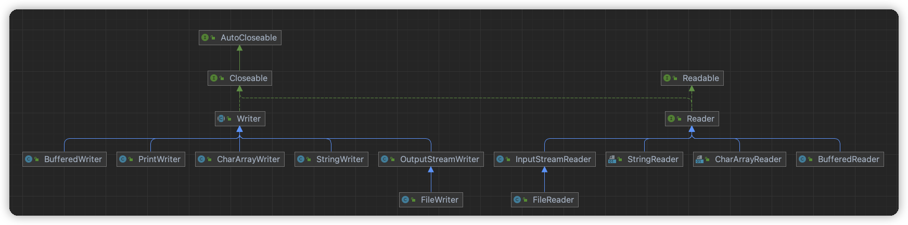
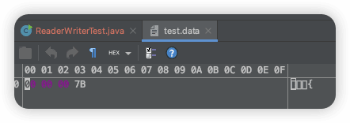
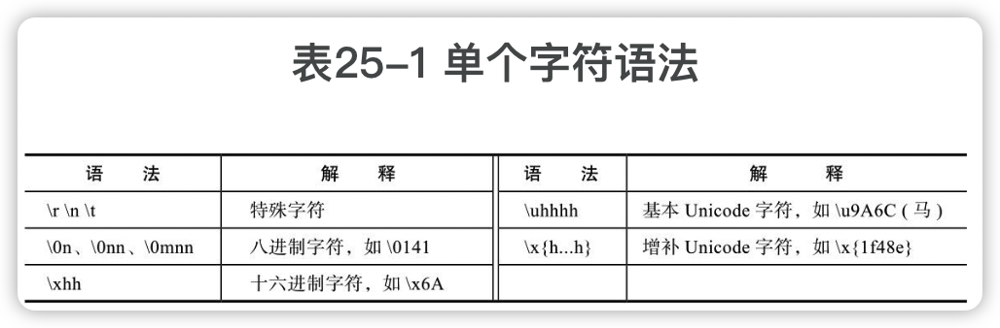
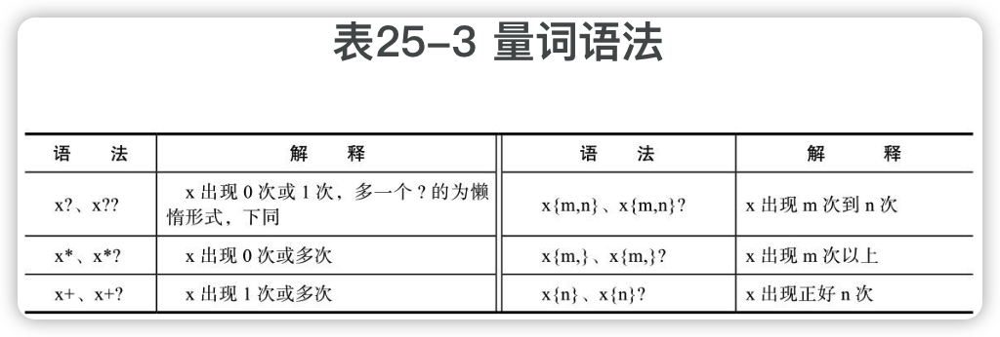
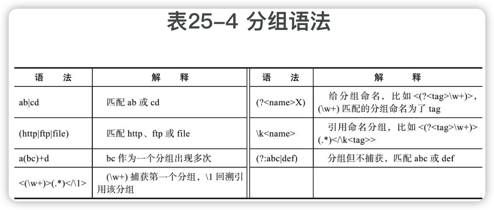
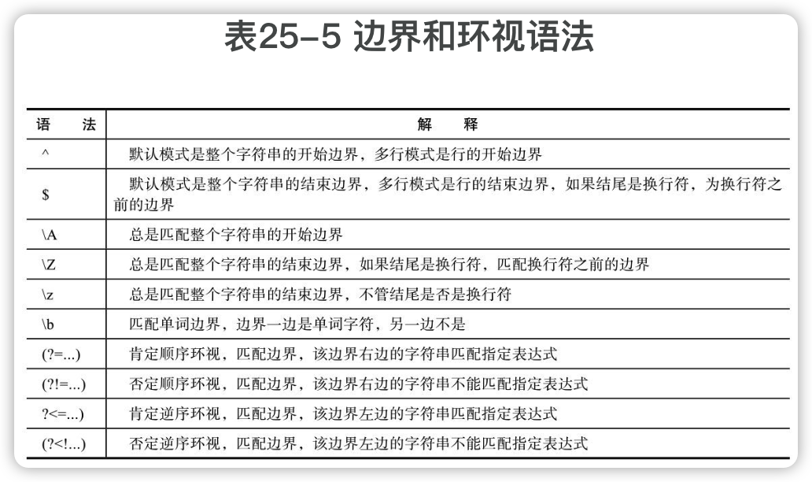

Java编程的逻辑
-------

[示例  代码](https://github.com/swiftma/program-logic/blob/master/the_logic_of_java_programming.md)


# 四、文件

## 13 文件基本技术

### 13.1 文件概述

#### 基本概念和常识

##### 1 二进制思维

所有文件（不可执行文件、图片文件、视频文件、Word文件、压缩文件、txt文件等等）都是以0和1的二进制形式保存的。我们所看到的图片、视频、文本，都是**应用程序对这些二进制的解析结果**。

##### 2 文件类型

每种文件类型都有一定的格式，代表着**==文件含义和二进制之间的映射关系==**。

文件类型粗略分为两类：**文本文件和二进制文件**。前者如文本文件（.txt）、程序源代码文件（.java等）、HTML文件（.html）等，后者如压缩文件（.zip）、PDF文件、MP3文件、Excel文件等。

文本文件里的每个二进制字节都是某个可打印字符的一部分，都可以用最基本的文本编辑器进行查看和编辑；二进制文件中，每个字节就不一定表示字符，可能表示颜色、字体、声音大小等，如果用基本的文本编辑器打开，一般都是满屏的乱码，需要专门的应用程序进行查看和编辑。

##### 3 文本文件的编码

**==编码==**：字符到二进制的映射。

一个文本文件有自己的编码方式。应用程序用什么编码方式进行解读？一般使用某种默认的编码方式，<u>可能是应用程序默认的，也可能是操作系统默认的，当然也可能采用一些比较智能的算法自动推断编码方式。</u>


🔖三个特殊字节（0xEF 0xBB 0xBF）

BOM头，Byte Order Mark（即字节序标记）

##### 4 文件系统

不同的文件系统有不同的文件组织方式、结构和特点，但编程时不需要关心其细节，编程语言和类库为我们提供统一的API。

`File.separator`，路径分隔符

`System.getProperty("user.dir")`，运行Java程序的当前目录

文件都具有**元数据信息**，如文件名、创建时间、修改时间、文件大小等。

**是否隐藏**

**访问权限**

**文件名大小写是否敏感**

临时文件，Windows 7 是 `C:\Users\用户名\AppData\Local\Temp`，Linux是`/tmp`。

##### 5 文件读写

Java封装了操作系统的功能，提供了统一的API。

基本常识：**硬盘的访问延时，相比内存，是很慢的。**

操作系统和硬盘一般是**按==块==批量传输**，而不是按字节，以摊销延时开销，块大小一般至少为**512字节**，即使应用程序只需要文件的一个字节，操作系统也会至少将一个块读进来。一般而言，应<u>尽量减少接触硬盘</u>，接触一次，就一次多做一些事情。对于网络请求和其他输入输出设备，原则都是类似的。

基本常识：一般读写文件需要**两==次数据复制==**，比如读文件，<u>需要先从硬盘复制到操作系统内核，再从内核复制到应用程序分配的内存中。</u>

操作系统所在的环境是**==内核态==**，应用程序是**==用户态==**，应用程序调用操作系统的功能，需要两次环境的切换，<u>先从用户态切到内核态，再从内核态切到用户态</u>。**这种用户态/内核态的切换是有开销的，应尽量减少这种切换。**

**缓冲区**

**打开**，**关闭**。打开文件操作系统会建立一个有关该文件的内存结构，这个结构通过一个整数索引来引用，这个索引叫做**==文件描述符==**。**关闭文件**一般会同步缓冲区内容到硬盘，并释放占据的内存。

**内存映射文件**，高效的随机读写大文件的方法，将文件直接映射到内存，操作内存就是操作文件。

#### Java文件概述

##### 1 流 

在Java中（很多其他语言也类似），文件一般不是单独处理的，而是视为==输入输出（Input/Output, IO）设备==的一种。Java使用基本统一的概念（**==流==**）处理所有的IO，包括<u>文件、键盘、显示终端、网络</u>等。

> 输入流就是可以从中获取数据到内存，输出流就是内存可以向其中写入数据。

Java IO的基本类大多位于java.io。类`InputStream`表示**输入流**，`OutputStream`表示**输出流**，而`FileInputStream`表示**文件输入流**，`FileOutputStream`表示**文件输出流**。

有了流的概念，就有了很多**面向流的代码**，比如对流做<u>加密、压缩、计算信息摘要、计算检验和</u>等，这些代码接受的参数和返回结果都是**==抽象的流==**，它们构成了一个**协作体系**，**这类似于之前介绍的接口概念、面向接口的编程，以及容器类协作体系**。一些实际上不是IO的数据源和目的地也转换为了流，以方便参与这种协作，比如字节数组，也包装为了流`ByteArrayInputStream`和`ByteArrayOutputStream`。

##### 2 装饰器设计模式

基本的流按字节读写，<u>没有缓冲区</u>，这不方便使用。Java解决这个问题的方法是使用装饰器设计模式。

很多装饰类，其中两个基类：过滤器输入流`FilterInputStream`和过滤器输出流`FilterOutputStream`。

过滤类似于自来水管道，流入的是水，流出的也是水，功能不变，或者只是增加功能。子类如：

- 对流起缓冲装饰的子类是`BufferedInputStream`和`BufferedOutputStream`。
- 可以按8种基本类型和字符串对流进行读写的子类是`DataInputStream`和`DataOutputStream`。
- 可以对流进行压缩和解压缩的子类有`GZIPInputStream`、`ZipInputStream`、`GZIPOutputStream`和`ZipOutputStream`。
- 可以将基本类型、对象输出为其字符串表示的子类有`PrintStream`。

##### 3 Reader/Writer

以InputStream/OutputStream为基类的流基本都是<u>以二进制形式处理数据的</u>，不能够方便地处理文本文件，没有**编码**的概念，能够方便地==按字符处理文本数据==的基类是`Reader`和`Writer`。子类：

- 读写文件的子类是`FileReader`和`FileWriter`。
- 起缓冲装饰的子类是`BufferedReader`和`BufferedWriter`。
- 将字符数组包装为Reader/Writer的子类是`CharArrayReader`和`CharArrayWriter`。
- 将字符串包装为Reader/Writer的子类是`StringReader`和`StringWriter`。
- 将InputStream/OutputStream转换为Reader/Writer的子类是`InputStreamReader`和`OutputStreamWriter`。
- 将基本类型、对象输出为其字符串表示的子类是`PrintWriter`。

##### 4 随机读写文件

`RandomAccessFile`

##### 5 File

文件路径、文件元数据、文件目录、临时文件、访问权限管理等

##### 6 NIO

以上介绍的类基本都位于包java.io下。

java.nio，表示**New IO**。

NIO代表一种不同的看待IO的方式，它有**==缓冲区==**和**==通道==**的概念。更接近操作系统的概念，某些操作的性能也更高，比如，复制文件到网络。

通道可以利用操作系统和硬件提供的**==DMA机制==**（Direct Memory Access，直接内存存取），不用CPU和应用程序参与，直接将数据从硬盘复制到网卡。

NIO还支持一些比较底层的功能，如**内存映射文件、文件加锁、自定义文件系统、非阻塞式IO、异步IO**等。

##### 7 序列化和反序列化

**序列化就是将内存中的Java对象持久保存到一个流中，反序列化就是从流中恢复Java对象到内存。**

它们的作用：一是==对象状态持久化==；二是==网络远程调用==，用于传递和返回对象。

Java主要通过接口`Serializable`和类`ObjectInputStream`/`ObjectOutputStream`提供对序列化的支持。

Java的默认序列化的缺点：**序列化后的形式比较大、浪费空间，序列化/反序列化的性能也比较低；Java特有技术，不能与其他语言交互。**

Java对象也可以序列化为ⅩML和JSON，它们都是文本格式，人容易阅读，但**占用的空间相对大**一些。

在只用于网络远程调用的情况下，有很多流行的、跨语言的、精简且高效的对象序列化机制，如ProtoBuf、Thrift、MessagePack等。其中，<u>MessagePack是二进制形式的JSON，更小更快</u>。

### 13.2 二进制文件和字节流

#### InputStream/OutputStream

抽象基类

##### InputStream的基本方法

```java
public abstract int read() throws IOException;
```

read方法从流中读取下一个字节，返回类型为int，但取值为0～255，当读到流结尾的时候，返回值为-1，如果流中没有数据，read方法会==阻塞==直到数据到来、流关闭或异常出现。异常出现时，read方法抛出异常，类型为`IOException`，这是一个受检异常，调用者必须进行处理。

read方法是个抽象方法，子类FileInputStream中实现会调用本地方法。

其它方法：

```java
// 一次读取多个字节
public int read(byte b[]) throws IOException {
  return read(b, 0, b.length);
}
public int read(byte b[], int off, int len) throws IOException
public void close() throws IOException
```

close方法通常应该放在finally语句内

##### InputStream的高级方法

```java
public long skip(long n) throws IOException
public int available() throws IOException
public synchronized void mark(int readlimit)
public boolean markSupported()
public synchronized void reset() throws IOException
```

skip跳过输入流中n个字节。

available返回下一次不需要阻塞就能读取到的大概字节个数。

mark、reset、markSupported，用于支持从读过的流中**重复读取**。

不是所有流都支持mark、reset方法，是否支持可以通过markSupported的返回值进行判断。InpuStream的默认实现是不支持，FileInputStream也不直接支持，但BufferedInputStream和ByteArrayInputStream可以支持。

##### OutputStream

```java
public abstract void write(int b) throws IOException;
```

需要子类实现，，FileOutputStream的实现会调用本地方法。

```java
// 批量写入
public void write(byte b[]) throws IOException
public void write(byte b[], int off, int len) throws IOException
```

```java
// 
public void flush() throws IOException
public void close() throws IOException
```

flush将缓冲而未实际写的数据进行实际写入，如在BufferedOutputStream中，调用flush方法会将其缓冲区的内容写到其装饰的流中，并调用该流的flush方法。基类OutputStream没有缓冲，flush方法代码为空。


close方法一般会**首先调用flush方法，然后再释放流占用的系统资源**。同InputStream一样，close方法一般应该放在finally语句内。

#### FileInputStream/FileOutputStream

输入源和输出目标是文件的流。

##### 1 FileOutputStream

FileOutputStream的构造方法：

```java
public FileOutputStream(File file, boolean append) throws FileNotFoundException
public FileOutputStream(String name) throws FileNotFoundException
```

```java
FileOutputStream output = new FileOutputStream("hello.txt");
try {
  String data = "hello, world! I'm coming.";
  byte[] bytes = data.getBytes(StandardCharsets.UTF_8);
  output.write(bytes);
} finally {
  output.close();
}

```

OutputStream只能以byte或byte数组写文件。

FileOutputStream两个额外的方法：

```java
public FileChannel getChannel()
public final FileDescriptor getFD()
```

`FileChannel`定义在java.nio中，表示文件通道概念;

`FileDescriptor`表示文件描述符，它与操作系统的一些文件内存结构相连，它有一个本地方法==sync==，它会确保将操作系统缓冲的数据写到硬盘上。

```java
public native void sync() throws SyncFailedException;
```

sync与OutputStream的flush方法相区别，**flush方法只能将应用程序缓冲的数据写到操作系统，sync方法则确保数据写到硬盘**。（一般不需要手动调用它）

##### 2 FileInputStream

FileInputStream的主要构造方法:

```java
public FileInputStream(String name) throws FileNotFoundException
public FileInputStream(File file) throws FileNotFoundException
```

参数是文件路径或File对象，必须是一个已经存在的文件，不能是目录。如果不存在，抛出`FileNotFoundException`，如果用户没有读的权限，抛出`SecurityException`。

```java
FileInputStream input = new FileInputStream("hello.txt");
try {
  byte[] buf = new byte[1024];
  int bytesRead = input.read(buf);
  String data = new String(buf, 0, bytesRead, StandardCharsets.UTF_8);
  System.out.println(data);
} finally {
  input.close();
}
```


#### ByteArrayInputStream/ByteArrayOutputStream

输入源和输出目标是**字节数组**。

```java
        public ByteArrayOutputStream()
        public ByteArrayOutputStream(int size)
```

```java
public synchronized byte[] toByteArray()
public synchronized String toString()
public synchronized String toString(String charsetName)

// 把ByteArrayOutputStream中的数据写到另一个OutputStream
public synchronized void writeTo(OutputStream out) throws IOException
  
public synchronized int size()
public synchronized void reset()
```


```java
public ByteArrayInputStream(byte buf[])
public ByteArrayInputStream(byte buf[], int offset, int length)
```


#### DataInputStream/DataOutputStream🔖

装饰类，按基本类型和字符串而非只是字节读写流。

DataOutputStream -> FilterOutputStream  -> OutputStream

DataInputStream -> FilterInputStream -> InputStream


#### BufferedInputStream/BufferedOutputStream🔖

装饰类，对输入输出流提供缓冲功能。

**将文件流包装到缓冲流中**。BufferedInputStream内部有个字节数组作为缓冲区，读取时，先从这个缓冲区读，缓冲区读完了再调用包装的流，它的构造方法有两个：

```java
public BufferedInputStream(InputStream in)
public BufferedInputStream(InputStream in, int size)
```


#### 实用方法

实际开发中需要将一些常用功能进行封装。

复制输入流的内容到输出流：

```java
public static void copy(InputStream input,
                        OutputStream output) throws IOException{
  byte[] buf = new byte[4096];
  int bytesRead = 0;
  while((bytesRead = input.read(buf)) != -1){
    output.write(buf, 0, bytesRead);
  }
}
```

Java9中，InputStream类增加了一个方法transferTo，可以实现相同功能：

```java
public long transferTo(OutputStream out) throws IOException {
  Objects.requireNonNull(out, "out");
  long transferred = 0;
  byte[] buffer = new byte[DEFAULT_BUFFER_SIZE]; //buf大小是8192
  int read;
  while((read = this.read(buffer, 0, DEFAULT_BUFFER_SIZE)) >= 0) {
    out.write(buffer, 0, read);
    transferred += read;
  }
  return transferred;
}
```

将文件读入字节数组，调用了上面的复制方法：

```java
public static byte[] readFileToByteArray(String fileName) throws IOException{
  InputStream input = new FileInputStream(fileName);
  ByteArrayOutputStream output = new ByteArrayOutputStream();
  try{
    copy(input, output);
    return output.toByteArray();
  }finally{
    input.close();
  }
}
```

将字节数组写到文件：

```java
public static void writeByteArrayToFile(String fileName,
                                        byte[] data) throws IOException{
  OutputStream output = new FileOutputStream(fileName);
  try{
    output.write(data);
  }finally{
    output.close();
  }
}
```


[Apache Commons IO](http://commons.apache.org/proper/commons-io/) 提供了很多简单易用的方法。


### 13.3 文本文件和字符流



#### 基本概论

##### 1.文本文件

```java
DataOutputStream output = new DataOutputStream(new FileOutputStream("test.data"));
try {
  output.writeInt(123);
} finally {
  output.close();
}
```



在文件中存储的实际有4个字节，最低位字节7B对应的十进制数是123，也就是说，对int类型，二进制文件保存的直接就是int的二进制形式。这个二进制形式，如果当成字符来解释，显示成什么字符则与编码有关，如果当成UTF-32BE编码，解释成的就是一个字符，即{。

如果要使用文本文件保存整数123，需将整数123转换为字符串，然后将它的UTF-8编码输出到了文件中：

```java
OutputStream output = new FileOutputStream("test.txt");
try {
  String data = Integer.toString(123);
  output.write(data.getBytes("UTF-8"));
} finally {
  output.close();
}
```


##### 2.编码

在文本文件中，同一个字符不同编码方式对应的二进制形式可能是不一样的。

##### 3.字符流

字节流是按字节读取的，而**字符流则是按char读取的**，一个char在文件中保存的是几个字节与编码有关。但字符流封装了这种细节，我们操作的对象就是char。

注意：**一个char不完全等同于一个字符**，对于绝大部分字符，一个字符就是一个char，但之前介绍过，对于增补字符集中的字符，需要两个char表示，对于这种字符，Java中的字符流是按char而不是一个完整字符处理的。

#### Reader/Writer

Reader/Writer类似字节流的InputStream/OutputStream，都是抽象类。

Reader与字节流的InputStream类似，主要方法：

```java
public int read() throws IOException
public int read(char cbuf[]) throws IOException
abstract public void close() throws IOException
public long skip(long n) throws IOException
public boolean ready() throws IOException 
```

方法的名称和含义与InputStream中的对应方法基本类似，但Reader中处理的单位是char，比如read读取的是一个char，取值范围为0～65 535。Reader没有available方法，对应的方法是ready()。

Writer与字节流的OutputStream类似，主要方法：

```java
public void write(int c)
public void write(char cbuf[])
public void write(String str) throws IOException
abstract public void close() throws IOException;
abstract public void flush() throws IOException;
```


#### InputStreamReader/OutputStreamWriter

==适配器类==，**将字节流转换为字符流**（将InputStream/OutputStream转换为Reader/Writer）；

```java
public OutputStreamWriter(OutputStream out)
public OutputStreamWriter(OutputStream out, String charsetName)
```


```java
public InputStreamReader(InputStream in)
public InputStreamReader(InputStream in, String charsetName)
```


#### FileReader/FileWriter

输入源和输出目标是文件的字符流；

FileReader/FileWriter不能指定编码类型，只能使用默认编码，如果需要指定编码类型，可以使用InputStreamReader/OutputStreamWriter。

#### CharArrayReader/CharArrayWriter

输入源和输出目标是char数组的字符流，这个数组的长度可以根据数据内容动态扩展。

CharArrayWriter与ByteArrayOutputStream类似。

CharArrayWriter可以方便地将数据转换为char数组或字符串：

```java
public char[] toCharArray()
public String toString()
```


CharArrayReader与ByteArrayInputStream类似，它将char数组包装为一个Reader，是一种适配器模式。

```java
public CharArrayReader(char buf[])
public CharArrayReader(char buf[], int offset, int length)
```


#### StringReader/StringWriter

StringReader/StringWriter与CharArrayReader/CharArrayWriter类似，只是输入源为`String`，输出目标为`StringBuffer`，而且，String/StringBuffer内部是由char数组组成的，所以它们本质上是一样的。

#### BufferedReader/BufferedWriter

装饰类，对输入/输出流提供缓冲，以及==按行读写==功能；

```java
public BufferedWriter(Writer out)
public BufferedWriter(Writer out, int sz)

public void newLine() throws IOException
```

```java
public BufferedReader(Reader in)
public BufferedReader(Reader in, int sz)

// 字符'\r'或'\n'或'\r\n'被视为换行符，readLine返回一行内容，但不会包含换行符，当读到流结尾时，返回null
public String readLine() throws IOException
```


#### PrintWriter

装饰类，可将基本类型和对象转换为其字符串形式输出的类。

有很多print方法，这些方法都是先调用String.valueOf()，把参数转为字符串，然后再调用write：

```java
public void print(int i)
public void print(Object obj)
...
  
public void print(int i) {
  write(String.valueOf(i));
}
```

println多添加一个换行符。

printf是格式化输出：

```java
public PrintWriter printf(String format, Object ... args)
```


PrintWriter的方便之处在于，它有很多构造方法，可以接受文件路径名、文件对象、OutputStream、Writer等，对于文件路径名和File对象，还可以接受编码类型作为参数。

```java
	public PrintWriter(File file) throws FileNotFoundException
  public PrintWriter(String fileName, String csn)
  public PrintWriter(OutputStream out, boolean autoFlush)
  public PrintWriter(Writer out)
```

🔖

#### Scanner

类似于一个Reader，但不是Reader的子类，可以读取基本类型的字符串形式，类似于PrintWriter的逆操作。

🔖

#### 标准流

之前一直在使用System.out向屏幕上输出，它是一个PrintStream对象，输出目标就是所谓的“标准”输出，经常是屏幕。除了System.out, Java中还有两个标准流：System.in和System.err。

System.in表示标准输入，它是一个InputStream对象，输入源经常是键盘。


System.err表示标准错误流，一般异常和错误信息输出到这个流。

🔖

#### 实用方法

🔖

> 小结：
>
> 写文件时，可以优先考虑PrintWriter，因为它使用方便，支持自动缓冲、指定编码类型、类型转换等。
>
> 读文件时，如果需要指定编码类型，需要使用InputStreamReader；如果不需要指定编码类型，可使用FileReader，但都应该考虑在外面包上缓冲类BufferedReader。


### 13.4 文件和目录操作

文件和目录操作最终是与操作系统和文件系统相关的，不同系统的实现是不一样的，但Java中的**java.io.File**类提供了统一的接口，底层会通过本地方法调用操作系统和文件系统的具体实现。

#### 构造方法

```java
//pathname表示完整路径，该路径可以是相对路径，也可以是绝对路径
public File(String pathname)
//parent表示父目录，child表示孩子
public File(String parent, String child)
public File(File parent, String child)
```

#### 文件元数据

```java
public String getName() //返回文件或目录名称，不含路径名
public boolean isAbsolute() //判断File中的路径是否是绝对路径
public String getPath() //返回构造File对象时的完整路径名，包括路径和文件名称
public String getAbsolutePath() //返回完整的绝对路径名
//返回标准的完整路径名，它会去掉路径中的冗余名称如".", ".."，跟踪软链接(Unix系统概念)等
public String getCanonicalPath() throws IOException
public String getParent() //返回父目录路径
public File getParentFile() //返回父目录的File对象
//返回一个新的File对象，新的File对象使用getAbsolutePath()的返回值作为参数构造
public File getAbsoluteFile()
//返回一个新的File对象，新的File对象使用getCanonicalPath()的返回值作为参数构造
public File getCanonicalFile() throws IOException
```

File有4个静态变量：

```java
public static final String separator
public static final char separatorChar
public static final String pathSeparator
public static final char pathSeparatorChar
```

前两个表示文件路径分隔符，Windows和Linux系统分别为：`\`， `/`；

后两个表示多个文件路径中的分隔符，比如，环境变量PATH中的分隔符，Java类路径变量classpath中的分隔符，Windows和Linux系统分别为：`;`， `:`。

获取文件或目录的基本信息：

```java
public boolean exists() //文件或目录是否存在
public boolean isDirectory() //是否为目录
public boolean isFile() //是否为文件
public long length() //文件长度，字节数，对目录没有意义
public long lastModified() //最后修改时间，从纪元时开始的毫秒数
public boolean setLastModified(long time) //设置最后修改时间，返回是否修改成功
```

> <font color=#FF8C00>注：</font>File对象没有返回创建时间的方法，因为创建时间不是一个公共概念， Linux/Unix就没有创建时间的概念。

File类中与安全和权限相关的主要方法有：

```java
public boolean isHidden() //是否为隐藏文件
public boolean canExecute() //是否可执行
public boolean canRead() //是否可读
public boolean canWrite() //是否可写
public boolean setReadOnly() //设置文件为只读文件
//修改文件读权限
public boolean setReadable(boolean readable, boolean ownerOnly)
public boolean setReadable(boolean readable)
//修改文件写权限
public boolean setWritable(boolean writable, boolean ownerOnly)
public boolean setWritable(boolean writable)
//修改文件可执行权限
public boolean setExecutable(boolean executable, boolean ownerOnly)
public boolean setExecutable(boolean executable)
```

#### 文件操作

新建一个File对象不会实际创建文件，但如下方法可以：

```java
public boolean createNewFile() throws IOException
```

创建临时文件：

```java
public static File createTempFile(String prefix, String suffix) throws IOException
public static File createTempFile(String prefix, String suffix, File directory) throws IOException
```

删除方法为：

```java
public boolean delete()
public boolean deleteOnExit()
```

重命名：

```java
public boolean renameTo(File dest)
```

#### 目录操作

创建：

```java
public boolean mkdir()
public bollean mkdirs()
```

访问一个目录下的子目录和文件：

```java
public String[] list()
public String[] list(FilenameFilter filter)
public File[] listFiles()
public File[] listFiles(FileFilter filter)
public File[] listFiles(FilenameFilter filter)
```

FilenameFilter和FileFilter都是接口，用于过滤。

```java
public interface FileFilter {
  boolean accept(File pathname);
}

public interface FilenameFilter {
  boolean accept(File dir, String name);
}
```

在遍历子目录和文件时，针对每个文件，会调用FilenameFilter或FileFilter的accept方法，只有accept方法返回true时，才将该子目录或文件包含到返回结果中。

FilenameFilter和FileFilter的区别在于：<u>FileFilter的accept方法参数只有一个File对象，而File-nameFilter的accept方法参数有两个，dir表示父目录，name表示子目录或文件名。</u>


File类封装了操作系统和文件系统的差异，提供了统一的文件和目录API。


## 14 文件高级技术

上一章中的字符流和字节流，都是以流的方式读写文件，它们有局限性：

1. 要么读、要么写，不能同时读和写。
2. 不能随机读写，只能从头读到尾，且不能重复读，虽然通过缓冲可以实现部分重读，但是有限制。

`RandomAccessFile`，它没有这两个限制，**既可以读，也可以写**，还可以**随机**读写，是一个更接近于操作系统API的封装类。

访问文件还有一种方式：==内存映射文件==，它可以高效处理非常大的文件，而且可以被多个不同的应用程序共享，特别适合用于**不同应用程序之间的通信**。

使用`DataOutputStream`、`DataInputStream`需要逐个处理对象中的每个字段，比较麻烦，一种更为简单的机制就是==序列化==。

Java的标准序列化机制有一些重要的**限制**，而且**不能跨语言**，实践中经常使用一些替代方案，比如ⅩML/JSON/MessagePack。Java SDK中对这些格式的支持有限，有很多第三方的类库提供了更为方便的支持，Jackson是其中一种，它支持多种格式。

### 14.1 常见文件类型处理

#### 属性文件

属性文件是常见的配置文件，用于**在不改变代码的情况下改变程序的行为**。

`java.util.Properties`

```java
// 从流中加载属性
public synchronized void load(InputStream inStream)
// 获取属性值
public String getProperty(String key)
public String getProperty(String key, String defaultValue)
```

```java
Properties properties = new Properties();
properties.load(new FileInputStream("data/config.properties"));
String host = properties.getProperty("db.host");
int port = Integer.valueOf(properties.getProperty("db.port", "3306"));
System.out.println(host);
```

使用类Properties处理属性文件的好处是：

- 可以自动处理空格，分隔符=前后的空格会被自动忽略。
- 可以自动忽略空行。
- 可以添加注释，以字符#或！开头的行会被视为注释，进行忽略。

使用Properties也有限制：**不能直接处理中文，在配置文件中，所有非ASCII字符需要使用Unicode编码**。比如：能在配置文件中直接这么写`name=老马`，要写成`name=\u8001\u9A6C`。

> 在Java IDE（如Eclipse）中使用属性文件编辑器，会地总替换中文为Unicode编码；
>
> 也可以用jdk命令`native2ascii`可用来转换为Unicode编码。
>
> ```java
> native2ascii -encoding UTF-8 native.properties ascii.properties
> ```


#### CSV文件

CSV是Comma-Separated Values的缩写，表示逗号分隔值。

一般，一行表示一条**记录**，一条记录包含多个**字段**，字段之间用逗号（也可以是tab符`\t`、冒号`:`、分号`; `等）分隔。

各种日志文件通常是CSV文件。CSV也经常用于交换表格类型的数据。

CSV看上去很简单，但处理的复杂性经常被低估。

- 字段内容中包含分隔符怎么办？
- 字段内容中包含换行符怎么办？

两种处理方式：

1. 使用引用符号比如"，在字段内容两边加上"，如果内容中包含"本身，则使用两个"
2. 使用转义字符，常用的是\，如果内容中包含\，则使用两个\。

其它问题：

- 怎么表示null值
- 空行和字段之间的空格怎么处理
- 怎么表示注释


这些问题使用简单的字符流就难以处理了，需要第三方库[Apache Commons CSV](http://commons.apache.org/proper/commons-csv/index.html)，`CSVFormat`表示CSV的格式，它有很多方法以定义具体的CSV格式：

```java
//定义分隔符
public CSVFormat withDelimiter(final char delimiter)
//定义引号符
public CSVFormat withQuote(final char quoteChar)
//定义转义符
public CSVFormat withEscape(final char escape)
//定义值为null的对象对应的字符串值
public CSVFormat withNullString(final String nullString)
//定义记录之间的分隔符
public CSVFormat withRecordSeparator(final char recordSeparator)
//定义是否忽略字段之间的空白
public CSVFormat withIgnoreSurroundingSpaces(
    final boolean ignoreSurroundingSpaces)
```

分析字符流：

```java
public CSVParser parse(final Reader in) throws IOException
```

`CSVParser`的方法获取记录信息：

```java
	public Iterator<CSVRecord> iterator()
  public List<CSVRecord> getRecords() throws IOException
  public long getRecordNumber()
```

`CSVRecord`表示一条记录，它有获取每个字段的信息方法：

```java
	//根据字段列索引获取值，索引从0开始
	public String get(final int i)
  //根据列名获取值
  public String get(final String name)
  //字段个数
  public int size()
  //字段的迭代器
  public Iterator<String> iterator()
```

`CSVPrinter`用来写CSV文件。

#### Excel

Excel主要有两种格式：`.xls`和`.xlsx`（Office 2007以后）。

Java中处理Excel文件及其他微软文档广泛使用[POI类库](http://poi.apache.org/)，主要类：

- `Workbook`：表示一个Excel文件对象，它是一个接口，有两个主要类`HSSFWorkbook`和`ⅩSSFWorkbook`，前者对应.xls格式，后者对应.xlsx格式。
- `Sheet`：表示一个工作表。
- `Row`：表示一行。
- `Cell`：表示一个单元格。

更加复杂的使用，如配置单元格的格式、颜色、字体： http://poi.apache.org/spreadsheet/quick-guide.html

#### HTML

HTML分析器:[jsoup](https://jsoup.org/)

#### 压缩文件

java SDK支持两种压缩文件格式：gzip（一个文件）和zip（多个文件）。

gzip两个主要类：

```java
java.util.zip.GZIPOutputStream
java.util.zip.GZIPInputStream
```

zip的主要类：

```java
java.util.zip.ZipOutputStream
java.util.zip.ZipInputStream
```

ZipOutputStream可以写入多个文件，它有一个重要方法：

```java
public void putNextEntry(ZipEntry e) throws IOException
```

压缩条目`ZipEntry`

🔖

如果需要更多格式，可以使用[Apache Commons Compress](http://commons.apache.org/proper/commons-compress/)。

### 14.2 随机读写文件

RandomAccessFile

```java
public class RandomAccessFile implements DataOutput, DataInput, Closeable
```

#### 用法

```java
public RandomAccessFile(String name, String mode) throws FileNotFoundException
public RandomAccessFile(File file, String mode) throws FileNotFoundException
```

mode的四个值：

1. "r"：只用于读。
2. "rw"：用于读和写。
3. "rws"：和"rw"一样，另外，它要求文件**内容和元数据**的任何更新都同步到设备上。
4. "rwd"：和"rw"一样，另外，它要求文件内容的任何更新都同步到设备上，和"rws"的区别是，元数据的更新不要求同步。

RandomAccessFile有类似InputStream/OutputStream的读写字节流的方法。还实现了DataInput/DataOutput接口。

```java
	//读一个字节，取最低8位，0～255
	public int read() throws IOException
  public int read(byte b[]) throws IOException
  public final int readInt() throws IOException
  public final void writeInt(int v) throws IOException
  public void write(byte b[]) throws IOException
```

另外两个特殊的read方法：

```java
	public final void readFully(byte b[]) throws IOException
  public final void readFully(byte b[], int off, int len) throws IOException
```

它们可以确保读够期望的长度，如果到了文件结尾也没读够，它们会抛出**EOFException**异常。

RandomAccessFile内部有一个**文件指针**，指向当前读写的位置，各种read/write操作都会自动更新该指针（本地方法）。与流不同的是，RandomAccessFile可以获取该指针，也可以更改该指针，相关方法是：

```java
	//获取当前文件指针
	public native long getFilePointer() throws IOException
  //更改当前文件指针到pos
  public native void seek(long pos) throws IOException
```

RandomAccessFile是**通过本地方法，最终调用操作系统的API来实现文件指针调整的**。

```java
// 跳过输入流中n个字节。类似InputStream的skip方法（通过实际读取n个字节实现的），但skipBytes通过更改文件指针实现
public int skipBytes(int n) throws IOException
// 直接获取文件长度，返回文件字节数
public native long length() throws IOException
// 修改文件长度（当前文件会根据情况扩展或截取）
public native void setLength(long newLength) throws IOException
```

避免使用下面两个方法，它们没有编码概念，都假定一个字节代表一个字符，对中文显然不成立：

```java
public final void writeBytes(String s) throws IOException
public final String readLine() throws IOException
```


#### 设计一个键值数据库BasicDB❤️

在日常的一般文件读写中，使用流就可以了，但在一些系统程序中，流是不适合的， RandomAccessFile因为更接近操作系统，更为方便和高效。


### 14.3 内存映射文件🔖

> 内存映射文件不是Java引入的概念，而是操作系统提供的一种功能，大部分操作系统都支持。

#### 基本概念

==内存映射文件==，就是**将文件映射到内存，文件对应于内存中的一个字节数组，对文件的操作变为对这个字节数组的操作，而字节数组的操作直接映射到文件上**。这种映射可以是映射文件全部区域，也可以是只映射一部分区域。

不过，这种映射是操作系统提供的一种==假象==，文件一般不会马上加载到内存，操作系统只是记录下了这回事，当实际发生读写时，才会按需加载。操作系统一般是按页加载的，页可以理解为就是一块，页的大小与操作系统和硬件相关，典型的配置可能是4K、8K等，当操作系统发现读写区域不在内存时，就会加载该区域对应的一个页到内存。

这种按需加载的方式，使得内存映射文件可以==方便高效地处理非常大的文件==，内存放不下整个文件也不要紧，操作系统会自动进行处理，将需要的内容读到内存，将修改的内容保存到硬盘，将不再使用的内存释放。

在应用程序写的时候，它写的是内存中的字节数组，这个内容什么时候同步到文件上呢？这个时机是不确定的，由操作系统决定，不过，<u>只要操作系统不崩溃，操作系统会保证同步到文件上，即使映射这个文件的应用程序已经退出了。</u>

在一般的文件读写中，会有两次数据复制，一次是从硬盘复制到操作系统内核，另一次是从操作系统内核复制到用户态的应用程序。而在内存映射文件中，一般情况下，==只有一次复制==，且内存分配在操作系统内核，应用程序访问的就是操作系统的内核内存空间，这显然要**比普通的读写效率更高**。

内存映射文件的另一个重要特点是：它可以被多个不同的应用程序==共享==，多个程序可以映射同一个文件，映射到同一块内存区域，一个程序对内存的修改，可以让其他程序也看到，这使得它特别适合用于==不同应用程序之间的通信==。

操作系统自身在加载可执行文件的时候，一般都利用了内存映射文件，比如：

- 按需加载代码，只有当前运行的代码在内存，其他暂时用不到的代码还在硬盘。
- 同时启动多次同一个可执行文件，文件代码在内存也只有一份。
- 不同应用程序共享的动态链接库代码在内存也只有一份。

内存映射文件也有==局限性==。比如，<u>它不太适合处理小文件，它是按页分配内存的，对于小文件，会浪费空间；另外，映射文件要消耗一定的操作系统资源，初始化比较慢</u>。

> 总结，对于一般的文件读写不需要使用内存映射文件，但如果处理的是大文件，要求极高的读写效率，比如数据库系统，或者需要在不同程序间进行共享和通信，那就可以考虑内存映射文件。

#### 用法

#### 设计一个消息队列BasicQueue

#### 实现消息队列


内存映射文件在日常普通的文件读写中，用到得比较少，但在**一些系统程序中，它却是经常被用到的一把利器**，可以高效地读写大文件，且能实现不同程序间的共享和通信。

### 14.4 标准序列化机制🔖

之前在将对象保存到文件时，使用的是DataOutputStream，从文件读入对象时，使用的是DataInputStream，使用它们，需要逐个处理对象中的每个字段，这种方式比较啰嗦，Java中有一种更为简单的机制，那就是序列化。

简单来说，==序列化就是将对象转化为字节流，反序列化就是将字节流转化为对象==。

#### 基本用法

`java.io.Serializable`

声明实现了Serializable接口后，保存/读取Student对象就可以使用`ObjectOutputStream`/`ObjectInputStream`流了。

将对象obj转化为字节，写到流中：

```java
public void writeObject(Object obj) throws IOException
```

从流中读取字节，转化为一个对象：

```java
public Object readObject() throws ClassNotFoundException, IOException
```


#### 复杂对象

Java序列化机制能自动处理引用同一个对象的情况，也能自动处理循环引用的情况。

#### 定制序列化

Java提供了多种定制序列化的机制，主要的有两种：

1. transient关键字，
2. 实现writeObject和readObject方法。


#### 序列化的基本原理


#### 版本问题


#### 序列化特点分析

序列化的主要用途有两个：

- 对象持久化；
- 跨网络的数据交换、远程过程调用。

Java标准的序列化机制有很多优点：

- 使用简单
- 可自动处理对象引用和循环引用
- 也可以方便地进行定制，处理版本问题

局限性：

- Java序列化格式是一种私有格式，是一种Java特有的技术，不能被其他语言识别，不能实现跨语言的数据交换。
- Java在序列化字节中保存了很多描述信息，使得序列化格式比较大。
- Java的默认序列化使用反射分析遍历对象结构，性能比较低。
- Java的序列化格式是二进制的，不方便查看和修改。

在跨语言的数据交换格式中，ⅩML/JSON是被广泛采用的文本格式，各种语言都有对它们的支持，文件格式清晰易读。有很多查看和编辑工具，它们的不足之处是**性能和序列化大小**，在性能和大小敏感的领域，往往会采用更为精简高效的二进制方式，如**ProtoBuf、Thrift、MessagePack**等。

### 14.5 使用Jackson序列化为JSON/XML/MessagePack❤️

Java的标准序列化机制有一些重要的限制，而且不能跨语言，实践中经常使用一些替代方案，比如ⅩML/JSON/MessagePack。Java SDK中对这些格式的支持有限，有很多第三方的类库提供了更为方便的支持，Jackson是其中一种，它支持多种格式。

Jackson起初主要是用来支持JSON格式的，现在也支持很多其他格式，它的各种方式的使用方式是类似的。

#### 基本用法

##### 1.Json

`ObjectMapper`

```java
Student student = new Student("张三", 21, 80.9d);
ObjectMapper mapper = new ObjectMapper();
mapper.enable(SerializationFeature.INDENT_OUTPUT);
String str = mapper.writeValueAsString(student);
System.out.println(str);
```


反序列化：

```jav
ObjectMapper mapper = new ObjectMapper();
Student s = mapper.readValue(new File("student.json"), Student.class);
System.out.println(s.toString());
```

##### 2.xml

只需要替换ObjectMapper为`ⅩmlMapper`🔖。`ⅩmlMapper`是ObjectMapepr的子类。

```java
Student student = new Student("张三", 18, 80.9d);
ObjectMapper mapper = new XmlMapper();
mapper.enable(SerializationFeature.INDENT_OUTPUT);
String str = mapper.writeValueAsString(student);
mapper.writeValue(new File("student.xml"), student);
System.out.println(str);
```


反序列化：

```java
ObjectMapper mapper = new XmlMapper();
Student s = mapper.readValue(new File("student.xml"), Student.class);
System.out.println(s.toString());
```


##### 3.MessagePack

> MessagePack是一种计算机数据交换格式。它是一种二进制形式，用于表示简单的数据结构，如数组和关系数组。MessagePack 旨在尽可能紧凑和简单。

https://msgpack.org/

```xml
<dependency>
  <groupId>org.msgpack</groupId>
  <artifactId>jackson-dataformat-msgpack</artifactId>
  <version>0.8.11</version>
</dependency>
```

```java
    static void messagePack() throws IOException {
        Student student = new Student("李三", 28, 81.9d);
        ObjectMapper mapper = new ObjectMapper(new MessagePackFactory());
        byte[] bytes = mapper.writeValueAsBytes(student);
        mapper.writeValue(new File("student.bson"), student);
    }

    static void messagePack2() throws IOException {
        ObjectMapper mapper = new ObjectMapper(new MessagePackFactory());
        Student s = mapper.readValue(new File("student.bson"), Student.class);
        System.out.println(s.toString());
    }
```


#### 容器对象

##### 1.List


##### 2.Map

#### 复杂对象


#### 定制序列化

Jackson两种配置方法：

1. 注解
2. 配置ObjectMapper对象，ObjectMapper支持对序列化和反序列化过程做一些配置


#### Jackson对XML支持的局限性

对于ⅩML格式，Jackson的支持不是太全面。比如，对于一个`Map<String, List<String>>`对象，Jackson可以序列化，但不能反序列化


Jackson还支持很多其他格式，如YAML、AVRO、Protobuf、Smile等。

# 五、并发

## 15 并发基础知识

### 15.1 线程的基本概念

#### 创建线程

线程表示一条单独的**执行流**，它有自己的程序**执行计数器**，有自己的**栈**。

Java中创建线程有两种方式：

##### 1.继承Thread

继承Thread并重写其run方法来实现一个线程。

```java
public class HelloThread extends Thread {
    @Override
    public void run() {
        System.out.println("hello");
    }

    public static void main(String[] args) {
        HelloThread thread = new HelloThread();
        thread.start();
    }
}
```

run方法的方法**签名是固定的**， public，没有参数，没有返回值，不能抛出受检异常。

run方法类似于单线程程序中的main方法，线程<u>从run方法的第一条语句开始执行</u>直到结束。

start方法表示**启动**该线程，使其成为一条**单独的执行流**，操作系统会分配线程相关的资源，每个线程会有单独的程序执行计数器和栈，操作系统会把这个线程作为一个独立的个体进行调度，分配时间片让它执行，执行的起点就是run方法。

> 如果不调用start，而直接调用run方法呢？
>
> 屏幕的输出并不会发生变化，但并不会启动一条单独的执行流，run方法的代码依然是在main线程中执行的，run方法只是main方法调用的一个普通方法。

```java
public static native Thread currentThread();
public long getId()
public final String getName()
```

操作系统负责调度，<u>在单CPU的机器上，同一时刻只能有一个线程在执行，在多CPU的机器上，同一时刻可以有多个线程同时执行</u>，但操作系统给我们屏蔽了这种差异，给程序员的感觉就是多个线程并发执行。

##### 2.实现Runnable接口

```java
public class HelloRunnable implements Runnable {
    @Override
    public void run() {
        System.out.println("hello");
    }
  
  	public static void main(String[] args) {
      Thread helloThread = new Thread(new HelloRunnable());
      helloThread.start();
	}
}
```


#### 线程的基本属性和方法

##### 1.id和name


##### 2.优先级

在Java中，优先级从1到10，默认为5。

优先级对操作系统而言主要是一种**建议和提示，而非强制**。

##### 3.状态

`Thread.State`

1. `NEW`：没有调用start的线程状态为NEW。
2. `TERMINATED`：线程运行结束后状态为TERMINATED。
3. `RUNNABLE`：调用start后线程在执行run方法且没有阻塞时状态为RUNNABLE，不过，RUNNABLE不代表CPU一定在执行该线程的代码，可能正在执行也可能在等待操作系统分配时间片，只是它没有在等待其他条件。
4. `BLOCKED`、`WAITING`、`TIMED_WAITING`：都表示线程被阻塞了，在等待一些条件。

另外isAlive方法，线程被启动后，run方法运行结束前，返回值都是true。

##### 4.是否daemon线程

```java
public final void setDaemon(boolean on)
public final boolean isDaemon()
```

启动线程会启动一条单独的执行流，整个程序只有在所有线程都结束的时候才退出，但daemon线程是例外，当**整个程序中剩下的都是daemon线程的时候，程序就会退出**。

daemon线程一般是其他线程的**辅助线程**（如垃圾回收），在它辅助的主线程退出的时候，它就没有存在的意义了。

##### 5.sleep方法

```java
public static native void sleep(long millis) throws InterruptedException;
```

睡眠期间，该线程会**让出CPU**，但睡眠的时间不一定是确切的给定毫秒数，可能有一定的偏差，**偏差与系统定时器和操作系统调度器的准确度和精度有关**。

睡眠期间，线程可以被中断，如果被中断，sleep会抛出`InterruptedException`。

##### 6.yield方法

让出CPU（只是建议）:

```java
public static native void yield();
```

##### 7.join方法

```java
public final void join() throws InterruptedException
```

join方法，可以**让调用join的线程等待该线程结束，再执行其它线程**。在等待线程结束的过程中，这个等待可能被中断，如果被中断，会抛出`InterruptedException`。

```java
public class HelloRunnable implements Runnable {
    @Override
    public void run() {
        System.out.println("hello");
    }

    public static void main(String[] args) throws InterruptedException {
        Thread helloThread = new Thread(new HelloRunnable());
        helloThread.start();
        System.out.println("world");
    }
}
```

结果可能为(HelloThread没执行完，main线程可能就执行完了)：

```
world
hello
```

```java
public class HelloRunnable implements Runnable {
    @Override
    public void run() {
        System.out.println("hello");
    }

    public static void main(String[] args) throws InterruptedException {
        Thread helloThread = new Thread(new HelloRunnable());
        helloThread.start();
        helloThread.join();
        System.out.println("world");
    }
}
```

一直为：

```
hello
world
```


##### 8.过时方法

```java
public final void stop()
public final void suspend()
public final void resume()
```


#### 共享内存及可能存在的问题

每个线程表示一条单独的执行流，有自己的程序计数器，有自己的栈，但**线程之间可以共享内存，它们可以访问和操作相同的对象**。

```java
public class ShareMemoryDemo {
    private static int shared = 0;
    private static void incrShared(){
        shared ++;
    }
    static class ChildThread extends Thread {
        List<String> list;
        public ChildThread(List<String> list) {
            this.list = list;
        }
        @Override
        public void run() {
            incrShared();
            list.add(Thread.currentThread().getName());
        }
    }
    public static void main(String[] args) throws InterruptedException {
        List<String> list = new ArrayList<String>();
        Thread t1 = new ChildThread(list);
        Thread t2 = new ChildThread(list);
        t1.start();
        t2.start();
        t1.join();
        t2.join();
        System.out.println(shared);
        System.out.println(list);
    }
}
```

定义了一个静态变量shared和静态内部类ChildThread，在main方法中，创建并启动了两个ChildThread对象，传递了相同的list对象，ChildThread的run方法访问了共享的变量shared和list,main方法最后输出了共享的shared和list的值，大部分情况会输出：

```
2
[Thread-0, Thread-1]
```

通过此例子说明**执行流、内存和程序代码**之间的关系：

- 该例中有三条执行流，一条执行main方法，另外两条执行ChildThread的run方法。
- 不同执行流可以访问和操作相同的变量。
- 不同执行流可以执行相同的程序代码，如本例中incrShared方法，ChildThread的run方法，被两条ChildThread执行流执行，incrShared方法是在外部定义的，但被ChildThread的执行流执行。**==在分析代码执行过程时，理解代码在被哪个线程执行是很重要的==**。
- 当多条执行流执行相同的程序代码时，**每条执行流都有单独的栈**，方法中的参数和局部变量都有自己的一份。

当多条执行流可以操作相同的变量时，可能会出现一些意料之外的结果：

##### 1.竟态条件

==竞态条件（race condition）==是指，当多个线程访问和操作同一个对象时，最终执行结果与==执行时序==有关，可能正确也可能不正确。

```java
public class CounterThread extends Thread {
    private static int counter = 0;
    @Override
    public void run() {
        for (int i = 0; i < 1000; i++) {
            counter++;
        }
    }
    public static void main(String[] args) throws InterruptedException {
        int num = 1000;
        Thread[] threads = new Thread[num];
        for (int i = 0; i < num; i++) {
            threads[i] = new CounterThread();
            threads[i].start();
        }
        for (int i = 0; i < num; i++) {
            threads[i].join();
        }
        System.out.println(counter);
    }
}
```

期望结果值为1000000，但一般都是不是。因为counter++这个操作不是==原子操作==，它分为三个步骤：

1. 取counter的当前值；
2. 在当前值基础上加1；
3. 将新值重新赋值给counter。

两个线程可能同时执行第一步，取到了相同的counter值，比如都取到了100，第一个线程执行完后counter变为101，而第二个线程执行完后还是101，最终的结果就与期望不符。

解决办法：

- 使用`synchronized`关键字；
- 使用显式锁；
- 使用原子变量。

##### 2.内存可见性

多个线程可以共享访问和操作相同的变量，但<u>一个线程对一个共享变量的修改，另一个线程不一定马上就能看到，甚至永远也看不到</u>。

```java
public class VisibilityDemo {
    private static boolean shutdown = false;
    static class HelloThread extends Thread {
        @Override
        public void run() {
            while (!shutdown) {

            }
            System.out.println("exit hello");
        }
    }
    
    public static void main(String[] args) throws InterruptedException {
        new HelloThread().start();
        Thread.sleep(1000);
        shutdown = true;
        System.out.println("exit main");
    }
}
```

期望的结果是两个线程都退出，但实际执行时，很可能会发现HelloThread永远都不会退出。也就是说，在HelloThread执行流看来，shutdown永远为false，即使main线程已经更改为了true。

**内存可见性问题**。在计算机系统中，==除了内存，数据还会被缓存在CPU的寄存器以及各级缓存中，当访问一个变量时，可能直接从寄存器或CPU缓存中获取，而不一定到内存中去取，当修改一个变量时，也可能是先写到缓存中，稍后才会同步更新到内存中。==

在单线程的程序中，这一般不是问题，但在多线程的程序中，尤其是在有多CPU的情况下，这就是严重的问题。**一个线程对内存的修改，另一个线程看不到，一是修改没有及时同步到内存，二是另一个线程根本就没从内存读。**

解决办法：

- 使用`volatile`关键字。
- 使用`synchronized`关键字或显式锁同步。

#### 线程的优点及成本

优点：

1. 充分利用**多CPU的计算能力**，单线程只能利用一个CPU，使用多线程可以利用多CPU的计算能力。
2. 充分利用**硬件资源**，CPU和硬盘、网络是可以同时工作的，一个线程在等待网络IO的同时，另一个线程完全可以利用CPU，对于多个独立的网络请求，完全可以使用多个线程同时请求。
3. 在用户界面（GUI）应用程序中，<u>保持程序的响应性，界面和后台任务通常是不同的线程</u>，否则，如果所有事情都是一个线程来执行，当执行一个很慢的任务时，整个界面将停止响应，也无法取消该任务。
4. 简化建模及IO处理，比如，在服务器应用程序中，对每个用户请求使用一个单独的线程进行处理，相比使用一个线程，处理来自各种用户的各种请求，以及各种网络和文件IO事件，建模和编写程序要容易得多。

成本：

1. 操作系统会为每个线程创建必要的数据结构、栈、程序计数器等，创建也需要一定的时间。
2. 线程调度和切换也是有成本的。**==上下文切换==**

如果执行的任务都是CPU密集型的，即主要消耗的都是CPU，那创建超过CPU数量的线程就是没有必要的，并不会加快程序的执行。


### 15.2 理解synchronized

共享内存的两种问题都可以通过synchronized解决。

#### 用法和基本原理

`synchronized`可以用于修饰类的<u>**实例方法、静态方法和代码块**</u>。

##### 1.实例方法

```java
public class Counter {
    private int count;
    public synchronized void incr() {
        count++;
    }
    public synchronized int getCount() {
        return count;
    }
}


public class CounterThread extends Thread {
    Counter counter;
    public CounterThread(Counter counter) {
        this.counter = counter;
    }

    @Override
    public void run() {
        for (int i = 0; i < 1000; i++) {
            counter.incr();
        }
    }

    public static void main(String[] args) throws InterruptedException {
        int num = 1000;
        Counter counter = new Counter();
        Thread[] threads = new Thread[num];
        for (int i = 0; i < num; i++) {
            threads[i] = new CounterThread(counter);
            threads[i].start();
        }
        for (int i = 0; i < num; i++) {
            threads[i].join();
        }
        System.out.println(counter.getCount());
    }
}
```

创建了1000个线程，传递了相同的counter对象，每个线程主要就是调用Counter的incr方法1000次，main线程等待子线程结束后输出counter的值，不论运行多少次结果都是100万。

```java
Counter counter1 = new Counter();
Counter counter2 = new Counter();
Thread t1 = new CounterThread(counter1);
Thread t2 = new CounterThread(counter2);
t1.start();
t2.start();
```

t1和t2两个线程是可以同时执行Counter的incr方法的，因为它们访问的是不同的Counter对象，一个是counter1，另一个是counter2。

**synchronized实例方法实际保护的是同一个==对象==的方法调用**（同时只能有一个线程执行同一对象的实例方法）。

synchronized实例方法保护的是当前实例对象，即this, this对象有**一个锁和一个等待队列**，锁只能被一个线程持有，其他试图获得同样锁的线程需要等待。执行synchronized实例方法的过程大致如下：

1. 尝试获得锁，如果能够获得锁，继续下一步，否则加入等待队列，阻塞并等待唤醒。
2. 执行实例方法体代码。
3. 释放锁，如果等待队列上有等待的线程，从中取一个并唤醒，如果有多个等待的线程，唤醒哪一个是不一定的，**不保证公平性**。

当前线程不能获得锁的时候，它会加入等待队列等待，线程的状态会变为**==BLOCKED==**。

**==synchronized保护的是对象而非代码，只要访问的是同一个对象的synchronized方法，即使是不同的代码，也会被同步顺序访问。==**比如，对于Counter中的两个实例方法getCount和incr，对同一个Counter对象，一个线程执行getCount，另一个执行incr，它们是不能同时执行的，会被synchronized同步顺序执行。

synchronized方法不能防止非synchronized方法被同时执行。比如，如果给Counter类增加一个非synchronized方法：

```java
public void decr() {
  count--;
}
```

则该方法可以和synchronized的incr方法同时执行，这通常会出现非期望的结果，所以，**==一般在保护变量时，需要在所有访问该变量的方法上加上synchronized==**。

##### 2.静态方法

```java
public class StaticCounter {
  private static int count = 0;
  public static synchronized void incr() {
    count++;
  }
  public static synchronized int getCount() {
    return count;
  }
}
```

对于静态方法，synchronized保护的是==类对象==，也就是`StaticCounter.class`。实际上，每个对象都有一个锁和一个等待队列，类对象也不例外。

##### 3.代码块

```java
public class Counter {
  private int count;
  public void incr() {
    synchronized(this) {
      count++;
    }
  }
  public int getCount() {
    synchronized(this) {
      return count;
    }
  }
}
```

```java
public class StaticCounter {
  private static int count = 0;
  public static void incr() {
    synchronized(StaticCounter.class){
      count++;
    }
  }
  public static int getCount() {
    synchronized(StaticCounter.class){
      return count;
    }
  }
}
```

synchronized括号里面的就是保护的对象，对于实例方法，就是`this`，对于静态方法，就是类对象， `{}`里面是同步执行的代码。

synchronized同步的对象可以是任意对象，**==任意对象都有一个锁和等待队列==**，或者说，任何对象都可以作为锁对象。比如，Counter类的等价代码还可以是：

```java
public class Counter {
  private int count;
  private Object lock = new Object();
  public void incr(){
    synchronized(lock){
      count ++;
    }
  }
  public int getCount() {
    synchronized(lock){
      return count;
    }
  }
}
```


#### 进一步了解synchronized

##### 1.可重入性

**对同一个执行线程，它在获得了锁之后，在调用其他需要同样锁的代码时，可以直接调用**。比如，在一个synchronized实例方法内，可以直接调用其他synchronized实例方法。

**可重入是通过记录锁的==持有线程和持有数量==来实现的**，当调用被synchronized保护的代码时，检查对象是否已被锁，如果是，再检查是否被当前线程锁定，如果是，增加持有数量，如果不是被当前线程锁定，才加入等待队列，当释放锁时，减少持有数量，当数量变为0时才释放整个锁。

##### 2.内存可见性

```java
public class Switcher {
  private boolean on;
  public boolean isOn() {
    return on;
  }
  public void setOn(boolean on) {
    this.on = on;
  }
}
```


synchronized除了==保证原子操作==外，它还有一个重要的作用，就是==保证内存可见性==，在释放锁时，所有写入都会写回内存，而获得锁后，都会从内存中读最新数据。

不过，如果只是为了保证内存可见性，使用synchronized的成本有点高，有一个更轻量级的方式，那就是给变量加修饰符`volatile`。

加了volatile之后，Java会在操作对应变量时插入特殊的指令，保证读写到内存最新值，而非缓存的值。

##### 3.死锁🔖

> 有a、b两个线程，a持有锁A，在等待锁B，而b持有锁B，在等待锁A, a和b陷入了互相等待，最后谁都执行不下去

```java
public class DeadLockDemo {
    private static Object lockA = new Object();
    private static Object lockB = new Object();
    private static void startThreadA() {
        Thread aThread = new Thread() {
            @Override
            public void run() {
                synchronized (lockA) {
                    try {
                        Thread.sleep(1000);
                    } catch (InterruptedException e) {

                    }
                    synchronized (lockB) {

                    }
                }
            }
        };
        aThread.start();
    }

    private static void startThreadB() {
        Thread bThread = new Thread() {
            @Override
            public void run() {
                synchronized (lockB) {
                    try {
                        Thread.sleep(1000);
                    } catch (InterruptedException e) {

                    }
                    synchronized (lockA) {

                    }
                }
            }
        };
        bThread.start();
    }

    public static void main(String[] args) {
        startThreadA();
        startThreadB();
    }
}
```

**应该尽量避免在持有一个锁的同时去申请另一个锁，如果确实需要多个锁，所有代码都应该按照相同的顺序去申请锁。**

显式锁接口`Lock`，它支持<u>尝试获取锁（tryLock）和带时间限制的获取锁方法</u>。🔖

`jstack`会报告发现的死锁。

#### 同步容器及其注意事项

类Collections中有一些方法，可以返回**线程安全的同步容器**，比如：

```java
public static <T> Collection<T> synchronizedCollection(Collection<T> c)
public static <T> List<T> synchronizedList(List<T> list)
public static <K, V> Map<K, V> synchronizedMap(Map<K, V> m)
```

它们是给所有容器方法都加上synchronized来实现安全的，比如`SynchronizedCollection`：

```java
static class SynchronizedCollection<E> implements Collection<E> {
  final Collection<E> c;   //Backing Collection
  final Object mutex;      //Object on which to synchronize
  SynchronizedCollection(Collection<E> c) {
    if(c==null)
      throw new NullPointerException();
    this.c = c;
    mutex = this;
  }
  public int size() {
    synchronized (mutex) {return c.size(); }
  }
  public boolean add(E e) {
    synchronized (mutex) {return c.add(e); }
  }
  public boolean remove(Object o) {
    synchronized (mutex) {return c.remove(o); }
  }
  //…
}
```

这里线程安全针对的是**容器对象**，指的是当多个线程并发访问同一个容器对象时，不需要额外的同步操作，也不会出现错误的结果。🔖

加了synchronized，所有方法调用变成了原子操作，客户端在调用时，是不是就绝对安全了呢？不是的，至少有以下情况需要注意：1️⃣ 复合操作，比如先检查再更新。2️⃣ 伪同步。3️⃣ 迭代。

##### 1.复合操作

```java
package com.andyron.bcdlj.c15.c152;

import java.util.Collections;
import java.util.Map;

/**
 * @author andyron
 **/
public class EnhancedMap <K, V> {
    Map<K, V> map;
    public EnhancedMap(Map<K, V> map) {
        this.map = Collections.synchronizedMap(map);
    }
    public V putIfAbsent(K key, V value) {
        V old = map.get(key);
        if (old != null) {
            return old;
        }
        return map.put(key, value);
    }
    public V put(K key, V value) {
        return map.put(key, value);
    }
    // ...
}
```

map的每个方法都是安全的，但这个复合方法putIfAbsent是安全的吗？显然是否定的，这是一个检查然后再更新的复合操作，在多线程的情况下，可能有多个线程都执行完了检查这一步，都发现Map中没有对应的键，然后就会都调用put，这就破坏了putIfAbsent方法期望保持的语义。

##### 2.伪同步

那给该方法加上synchronized就能实现安全吗？

```java
public synchronized V putIfAbsent(K key, V value){
  V old = map.get(key);
  if(old! =null){
    return old;
  }
  return map.put(key, value);
}
```

答案是否定的！为什么呢？同步错对象了。putIfAbsent同步使用的是EnhancedMap对象，而其他方法（如代码中的put方法）使用的是Collections.synchronizedMap返回的对象map，两者是不同的对象。要解决这个问题，所有方法必须使用相同的锁，可以使用EnhancedMap的对象锁，也可以使用map。使用EnhancedMap对象作为锁，则EnhancedMap中的所有方法都需要加上synchronized。

使用map作为锁，putIfAbsent方法可以改为：

```java
public V putIfAbsent(K key, V value){
  synchronized(map){
    V old = map.get(key);
    if(old! =null){
      return old;
    }
    return map.put(key, value);
  }
}
```


##### 3.迭代

对于同步容器对象，虽然单个操作是安全的，但迭代并不是。

```java
public class IterationTest {
    private static void startModifyThread(final List<String> list) {
        Thread modifyThread = new Thread(new Runnable() {
            @Override
            public void run() {
                for (int i = 0; i < 100; i++) {
                    list.add("item " + i);
                    try {
                        Thread.sleep((int) (Math.random() * 10));
                    } catch (InterruptedException e) {
                        e.printStackTrace();
                    }
                }
            }
        });
        modifyThread.start();
    }
    private static void startIteratorThread(final List<String> list) {
       Thread iteratorThread = new Thread(new Runnable() {
           @Override
           public void run() {
               while (true) {
                   for (String s : list) {
                   }
               }
           }
       });
       iteratorThread.start();
    }
    public static void main(String[] args) {
        final List<String> list = Collections.synchronizedList(new ArrayList<String>());
        startIteratorThread(list);
        startModifyThread(list);
    }
}
```

抛出异常：

```
Exception in thread "Thread-0" java.util.ConcurrentModificationException
	at java.util.ArrayList$Itr.checkForComodification(ArrayList.java:911)
	at java.util.ArrayList$Itr.next(ArrayList.java:861)
	at com.andyron.bcdlj.c15.c152.IterationTest$2.run(IterationTest.java:37)
	at java.lang.Thread.run(Thread.java:750)
```

如果在遍历的同时容器发生了结构性变化，就会抛出该异常`ConcurrentModificationException`。

同步容器并没有解决这个问题，如果要避免这个异常，需要在遍历的时候给整个容器对象加锁。比如：

```java
        private static void startIteratorThread(final List<String> list) {
            Thread iteratorThread = new Thread(new Runnable() {
                @Override
                public void run() {
                    while(true) {
                        synchronized(list){
                            for(String str : list) {
                            }
                        }
                    }
                }
            });
            iteratorThread.start();
        }
```


##### 4.并发容器

除了以上这些注意事项，同步容器的性能也是比较低的，当并发访问量比较大的时候性能比较差。所幸的是，Java中还有很多专为并发设计的容器类，比如：

- `CopyOnWriteArrayList`。 
- `ConcurrentHashMap`。
- `ConcurrentLinkedQueue`。
- `ConcurrentSkipListSet`。

这些容器类都是线程安全的，但都没有使用`synchronized`，没有迭代问题，直接支持一些复合操作，性能也高得多。

### 15.3 线程的基本协作机制🔖

多线程之间除了==竞争访问同一个资源==外，也经常需要==相互协作==。协作的基本机制是==wait/notify==。

#### 协作场景

1. 生产者/消费者协作模式

   常见的协作模式，生产者线程和消费者线程通过**共享队列**进行协作，生产者将数据或任务放到队列上，而消费者从队列上取数据或任务，如果队列长度有限，在队列满的时候，生产者需要等待，而在队列为空的时候，消费者需要等待。

2. 同时开始

   类似运动员比赛，在听到比赛开始枪响后同时开始，在一些程序，尤其是**模拟仿真程序**中，要求多个线程能同时开始。

3. 等待结束

   **主从协作模式**也是一种常见的协作模式，主线程将任务分解为若干子任务，为每个子任务创建一个线程，主线程在继续执行其他任务之前需要等待每个子任务执行完毕。

4. 异步结果

   在主从协作模式中，主线程手工创建子线程的写法往往比较麻烦，一种常见的模式是将子线程的管理封装为**异步调用**，异步调用马上返回，但返回的不是最终的结果，而是一个一般称为**`Future`**的对象，通过它可以在随后获得最终的结果。

5. 集合点

   类似于学校或公司组团旅游，在旅游过程中有若干集合点，比如出发集合点，每个人从不同地方来到集合点，所有人到齐后进行下一项活动，在一些程序，比如<u>并行迭代计算</u>中，每个线程负责一部分计算，然后在集合点等待其他线程完成，所有线程到齐后，<u>交换数据和计算结果</u>，再进行下一次迭代。

#### wait/notify

线程协作的基本方法定义在根父类Object里，是每个对象都可以调用这些方法。

wait方法有：

```java
public final void wait() throws InterruptedException
public final native void wait(long timeout) throws InterruptedException;
public final void wait(long timeout, int nanos) throws InterruptedException
```

带时间参数的表示最多等待这么长时间，参数为0表示无限期等待；不带时间参数的就表示无限期等待。

**除了用于锁的等待队列，每个对象还有另一个等待队列，表示==条件队列==，该队列用于线程间的协作。**

调用wait就会把当前线程<u>放到条件队列上并阻塞</u>，表示当前线程执行不下去了，它需要等待一个条件，这个条件它自己改变不了，需要其他线程改变。

当其他线程改变了条件后，应该调用Object的notify方法：

```java
public final native void notify();
public final native void notifyAll();
```

notify做的事情就是**从条件队列中选一个线程，将其从队列中移除并唤醒**，notifyAll和notify的区别是，它会**移除条件队列中所有的线程并全部唤醒**。

一个线程启动后，在执行一项操作前，它需要等待主线程给它指令，收到指令后才执行：

```java
public class WaitThread extends Thread {
    private volatile boolean fire = false;

    @Override
    public void run() {
        try {
            synchronized (this) {
                while (!fire) {
                    wait();
                }
            }
            System.out.println("fired");
        } catch (InterruptedException e) {

        }
    }

    public synchronized void fire() {
        this.fire = true;
        notify();
    }

    public static void main(String[] args) throws InterruptedException {
        WaitThread waitThread = new WaitThread();
        waitThread.start();
        Thread.sleep(1000);
        System.out.println("fire");
        waitThread.fire();
    }
}
```

两个线程，一个是主线程，一个是WaitThread，协作的条件变量是fire, WaitThread等待该变量变为true，在不为true的时候调用wait，主线程设置该变量并调用notify。

实际上，**==wait/notify方法只能在synchronized代码块内被调用==**，如果调用wait/notify方法时，当前线程没有持有对象锁，会抛出异常`java.lang.IllegalMonitorStateException`。

**虽然是在synchronized方法内，但调用wait时，线程会释放对象锁**。wait的具体过程是：

1. 把当前线程放入条件等待队列，释放对象锁，阻塞等待，线程状态变为**WAITING**或**TIMED_WAITING**。
2. 等待时间到或被其他线程调用notify/notifyAll从条件队列中移除，这时，要重新竞争对象锁：
   - 如果能够获得锁，线程状态变为**RUNNABLE**，并从wait调用中返回。
   - 否则，该线程加入对象锁等待队列，线程状态变为**BLOCKED**，只有在获得锁后才会从wait调用中返回。

> wait等的到底是什么？ 而notify通知的又是什么?

它们被不同的线程调用，但共享相同的锁和条件等待队列（相同对象的synchronized代码块内），它们围绕一个<u>共享的条件变量</u>进行协作，这个条件变量是程序自己维护的，当条件不成立时，线程调用wait进入条件等待队列，另一个线程修改了条件变量后调用notify，调用wait的线程唤醒后需要重新检查条件变量。从多线程的角度看，它们围绕共享变量进行协作，从调用wait的线程角度看，它阻塞等待一个条件的成立。

设计多线程协作时，需要**==想清楚协作的共享变量和条件是什么==**，这是协作的核心。

#### 生产者/消费者模式

在生产者/消费者模式中，协作的共享变量是**队列**，生产者往队列上放数据，如果满了就wait，而消费者从队列上取数据，如果队列为空也wait。

```java
/**
 * 生产者/消费者协作队列
 * @author andyron
 **/
public class MyBlockingQueue<E> {
    private Queue<E> queue = null;
    private int limit;
    public MyBlockingQueue(int limit) {
        this.limit = limit;
        queue = new ArrayDeque<>(limit);
    }

    public synchronized void put(E e) throws InterruptedException {
        while (queue.size() == limit) {
            wait();
        }
        queue.add(e);
        notifyAll();
    }

    public synchronized E take() throws InterruptedException {
        while (queue.isEmpty()) {
            wait();
        }
        E e = queue.poll();
        notifyAll();
        return e;
    }
}
```

put是给生产者使用的，往队列上放数据，满了就wait，放完之后调用notifyAll，通知可能的消费者。

take是给消费者使用的，从队列中取数据，如果为空就wait，取完之后调用notifyAll，通知可能的生产者。

<u>put等待的是队列不为满，而take等待的是队列不为空</u>，但它们都会加入相同的条件等待队列。由于条件不同但又使用相同的等待队列，所以要调用notifyAll而不能调用notify，因为notify只能唤醒一个线程，如果唤醒的是同类线程就起不到协调的作用。

==只能有一个条件等待队列==，这是Java wait/notify机制的局限性，这使得对于等待条件的分析变得复杂，后续章节我们会介绍**显式的锁和条件**，它可以解决该问题。


Java提供了专门的阻塞队列实现：

- 接口`BlockingQueue`和`BlockingDeque`。
- 基于数组的实现类ArrayBlockingQueue。
- 基于链表的实现类LinkedBlockingQueue和LinkedBlockingDeque。
- 基于堆的实现类PriorityBlockingQueue。

#### 同时开始

同时开始，类似于运动员比赛，在听到比赛开始枪响后同时开始。

#### 等待结束

join实际上就是调用了wait。


`CountDownLatch`

#### 异步结果

在主从模式中，手工创建线程往往比较麻烦，一种常见的模式是异步调用，异步调用返回一个一般称为`Future`的对象，通过它可以获得最终的结果。在Java中，表示子任务的接口是`Callable`，声明为：

```java
public interface Callable<V> {
  V call() throws Exception;
}
```


Java一套完善的框架`Executors`，相关的部分接口和类有：

- 表示异步结果的接口`Future`和实现类`FutureTask`。
- 用于执行异步任务的接口`Executor`，以及有更多功能的子接口`ExecutorService`。
- 用于创建`Executor`和`ExecutorService`的工厂方法类`Executors`。

#### 集合点

协作的共享变量依然是一个数，这个数表示未到集合点的线程个数，初始值为子线程个数，每个线程到达集合点后将该值减一，如果不为0，表示还有别的线程未到，进行等待，如果变为0，表示自己是最后一个到的，调用notifyAll唤醒所有线程。


### 15.4 线程的中断

> 如何在Java中取消或关闭一个线程？

#### 取消/关闭的场景

线程的start方法启动一个线程后，线程开始执行run方法，run方法运行结束后线程退出，那为什么还需要结束一个线程呢？

1. 很多线程的运行模式是死循环。比如在生产者/消费者模式中，消费者主体就是一个死循环，它不停地从队列中接受任务，执行任务，在停止程序时，我们需要一种“优雅”的方法以关闭该线程。
2. 在一些图形用户界面程序中，线程是用户启动的，完成一些任务，比如从远程服务器上下载一个文件，在下载过程中，用户可能会希望取消该任务。
3. 在一些场景中，比如从第三方服务器查询一个结果，我们希望在限定的时间内得到结果，如果得不到，我们会希望取消该任务。
4. 有时，我们会启动**多个线程做同一件事**，比如类似抢火车票，我们可能会让多个好友帮忙从多个渠道买火车票，只要有一个渠道买到了，我们会通知取消其他渠道。


#### 取消/关闭的机制

在Java中，停止一个线程的主要机制是**==中断==**，**中断并不是强迫终止一个线程，它是一种协作机制，是给线程传递一个取消信号，但是由线程来决定如何以及何时退出**。

Thread类关于中断的方法：

```java
public boolean isInterrupted()
public void interrupt()
public static boolean interrupted()
```

- isInterrupted：返回对应线程的中断标志位是否为true。
- interrupt：表示中断对应的线程。
- interrupted：返回当前线程的中断标志位是否为true（会调用Thread.currentThread()），但它还有一个重要的副作用，就是清空中断标志位，也就是说，连续两次调用interrupted()，第一次返回的结果为true，第二次一般就是false（除非同时又发生了一次中断）。

#### 线程对中断的反应🔖

`interrupt()`对线程的影响与==线程的状态==和在进行的==IO操作==有关。

线程状态有：

##### 1.RUNNABLE

线程在运行或具备运行条件只是在等待操作系统调度。

##### 2.WAITING/TIMED_WAITING

线程在等待某个条件或超时。

线程调用join/wait/sleep方法会进入WAITING或TIMED_WAITING状态，在这些状态时，对线程对象调用interrupt()会使得该线程抛出`InterruptedException`。需要注意的是，抛出异常后，中断标志位会被清空，而不是被设置。

##### 3.BLOCKED

线程在等待锁，试图进入同步块。

如果线程在等待锁，对线程对象调用interrupt()只是会设置线程的中断标志位，线程依然会处于BLOCKED状态，也就是说，<u>interrupt()并不能使一个在等待锁的线程真正“中断”</u>。

##### 4.NEW/TERMINATED

线程还未启动或已结束。

如果线程尚未启动（NEW），或者已经结束（TERMINATED），则调用interrupt()对它没有任何效果，中断标志位也不会被设置。

#### 如何正确地取消/关闭线程

interrupt方法不一定会真正“中断”线程，它只是一种**协作机制**，如果不明白线程在做什么，不应该贸然地调用线程的interrupt方法，以为这样就能取消线程。

对于以线程提供服务的程序模块而言，它应该**封装取消/关闭操作**，提供单独的取消/关闭方法给调用者，外部调用者应该调用这些方法而不是直接调用interrupt。Java并发库的一些代码就提供了单独的取消/关闭方法，比如，Future接口提供了如下方法以取消任务：

```java
boolean cancel(boolean mayInterruptIfRunning);
```

ExecutorService提供了如下两个关闭方法：

```java
void shutdown();
List<Runnable> shutdownNow();
```


## 16 并发包的基石

`java.util.concurrent`，包括很多易用且高性能的并发开发工具。

### 16.1 原子变量和CAS

对于count++这种操作来说，使用synchronized**成本太高**了，需要<u>先获取锁，最后需要释放锁，获取不到锁的情况下需要等待，还会有线程的上下文切换</u>，这些都需要成本。

可使用原子变量替代，Java并发包中的基本**==原子变量==**类型有很多种。

- `AtomicBoolean`：原子Boolean类型，常用来在程序中表示一个标志位。
- `AtomicInteger`：原子Integer类型。
- `AtomicLong`：原子Long类型，常用来在程序中生成唯一序列号。
- `AtomicReference`：原子引用类型，用来以原子方式更新复杂类型。

另外还又针对数组的类：`AtomicLongArray`、`AtomicReferenceArray`，以及用于以原子方式更新对象中的字段的类，如`AtomicIntegerFieldUpdater`、`AtomicReferenceFieldUpdater`等。

Java 8之后增加了几个类，在高并发统计汇总的场景中更为适合，包括`LongAdder`、`LongAccumulator`、`DoubleAdder`和`DoubleAccumulator`。

#### AtomicInteger

##### 1.基本用法

之所以称为原子变量，是因为它包含一些**以原子方式实现组合操作的方法**。如：

```java
//以原子方式获取旧值并设置新值
public final int getAndSet(int newValue)
//以原子方式获取旧值并给当前值加1
public final int getAndIncrement()
//以原子方式获取旧值并给当前值减1
public final int getAndDecrement()
//以原子方式获取旧值并给当前值加delta
public final int getAndAdd(int delta)
//以原子方式给当前值加1并获取新值
public final int incrementAndGet()
//以原子方式给当前值减1并获取新值
public final int decrementAndGet()
//以原子方式给当前值加delta并获取新值
public final int addAndGet(int delta)
```

这些方法的实现都依赖：

```java
public final boolean compareAndSet(int expect, int update)
```

compareAndSet是一个非常重要的方法，==比较并设置==，我们以后将简称为**==CAS==**。该方法有两个参数expect和update，以原子方式实现了如下功能：<u>如果当前值等于expect，则更新为update，否则不更新，如果更新成功，返回true，否则返回false。</u>

AtomicInteger可以在程序中用作一个计数器，多个线程并发更新，也总能实现正确性。

##### 2.基本原理和思维

AtomicInteger的主要内部成员：

```java
private volatile int value;
```

volatile是必需的，以保证**==内存可见性==**。

与synchronized锁相比，**这种原子更新方式代表一种不同的思维方式**。synchronized是**==悲观==**的，它假定更新很可能冲突，所以先获取锁，得到锁后才更新。原子变量的更新逻辑是**==乐观==**的，它假定冲突比较少，但使用CAS更新，也就是进行冲突检测，如果确实冲突了，那也没关系，继续尝试就好了。

synchronized代表一种**阻塞式**算法，得不到锁的时候，进入<u>锁等待队列</u>，等待其他线程唤醒，有上下文切换开销。原子变量的更新逻辑是**非阻塞式**的，更新冲突的时候，它就重试，不会阻塞，不会有上下文切换开销。对于大部分比较简单的操作，无论是在低并发还是高并发情况下，这种<u>==乐观非阻塞方式==</u>的**性能都远高于**<u>==悲观阻塞式方式==</u>。

原子变量相对比较简单，但对于复杂一些的数据结构和算法，非阻塞方式往往难于实现和理解，幸运的是，Java并发包中已经提供了一些==非阻塞容器==，我们只需要会使用就可以了，比如：

- `ConcurrentLinkedQueue`和`ConcurrentLinkedDeque`：非阻塞并发队列。 

- `ConcurrentSkipListMap`和`ConcurrentSkipListSet`：非阻塞并发Map和Set。

```java
    public final boolean compareAndSet(int expect, int update) {
        return unsafe.compareAndSwapInt(this, valueOffset, expect, update);
    }
```

`sun.misc.Unsafe`是Sun的私有实现，名字的意思是是“不安全”，一般应用程序不应该直接使用。原理上，**一般的计算机系统都==在硬件层次上直接支持CAS指令==**，而Java的实现都会利用这些特殊指令。从程序的角度看，可以将compareAndSet视为计算机的基本操作，直接接纳就好。

##### 3.实现锁

基于CAS，除了可以实现==乐观非阻塞算法==之外，还可以实现==悲观阻塞式算法==，比如锁。

实际上，<u>Java并发包中的所有阻塞式工具、容器、算法也都是基于CAS的</u>（不过，也需要一些别的支持）。

```java
/**
 * 使用AtomicInteger实现锁
 * status表示锁的状态，0表示未锁定，1表示锁定，lock()、unlock()使用CAS方法更新，lock()只有在更新成功后才退出，实现了阻塞的效果
 */
public class Mylock {
    private AtomicInteger status = new AtomicInteger(0);
    public void lock() {
        while (!status.compareAndSet(0, 1)) {
            Thread.yield();
        }
    }
    public void unlock() {
        status.compareAndSet(1, 0);
    }
}
```

MyLock只是用于演示基本概念，实际开发中应该使用Java并发包中的类，如`ReentrantLock`。

#### ABA问题

使用CAS方式更新有一个ABA问题：<u>假设当前值为A，如果另一个线程先将A修改成B，再修改回成A，当前线程的CAS操作无法分辨当前值发生过变化</u>。

ABA是不是一个问题与程序的逻辑有关，一般不是问题。而如果确实有问题，解决方法是使用`AtomicStampedReference`，**在修改值的同时附加一个时间戳，只有值和时间戳都相同才进行修改**，其CAS方法声明为：

```java
public boolean compareAndSet(V expectedReference, V newReference, int expectedStamp, int newStamp)
```

例子：

```java
Pair pair = new Pair(100, 200);
int stamp = 1;
AtomicStampedReference<Pair> pairRef = new AtomicStampedReference<>(pair, stamp);
int newStamp = 2;
pairRef.compareAndSet(pair, new Pair(200, 200), stamp, newStamp);
System.out.println(pair);  // Pair{item=100, weight=200}
```

AtomicStampedReference在compareAndSet中要同时修改两个值：一个是引用，另一个是时间戳。它怎么实现原子性呢？实际上，内部AtomicStampedReference会将两个值组合为一个对象，修改的是一个值，我们看代码：

```java
public boolean compareAndSet(V   expectedReference,
                             V   newReference,
                             int expectedStamp,
                             int newStamp) {
  Pair<V> current = pair;
  return
    expectedReference == current.reference &&
    expectedStamp == current.stamp &&
    ((newReference == current.reference &&
      newStamp == current.stamp) ||
     casPair(current, Pair.of(newReference, newStamp)));
}
```

这个Pair是AtomicStampedReference的一个内部类，成员包括引用和时间戳，具体定义为：

```java
    private static class Pair<T> {
        final T reference;
        final int stamp;
        private Pair(T reference, int stamp) {
            this.reference = reference;
            this.stamp = stamp;
        }
        static <T> Pair<T> of(T reference, int stamp) {
            return new Pair<T>(reference, stamp);
        }
    }
```

AtomicStampedReference将对引用值和时间戳的组合比较和修改转换为了对这个内部类Pair单个值的比较和修改。

>  CAS是Java并发包的基础，基于它可以实现高效的、乐观、非阻塞式数据结构和算法，它也是并发包中锁、同步工具和各种容器的基础。

### 16.2 显式锁

Java并发包中的显式锁可以解决synchronized的一些局限性。

Java并发包中的显式锁接口和类位于包`java.util.concurrent.locks`下，主要接口和类有：

- 锁接口`Lock`，主要实现类是`ReentrantLock`；
- 读写锁接口`ReadWriteLock`，主要实现类是`ReentrantReadWriteLock`。

#### 接口Lock

```java
public interface Lock {
  void lock();
  void lockInterruptibly() throws InterruptedException;
  boolean tryLock();
  boolean tryLock(long time, TimeUnit unit) throws InterruptedException;
  void unlock();
  Condition newCondition();
}
```

- `lock()`：普通的获取锁，会阻塞直到成功；`unlock()`：释放锁方法。
- `lockInterruptibly()`：与lock()的不同是，它可以响应中断，如果被其他线程中断了，则抛出`InterruptedException`。
- `tryLock()`：只是尝试获取锁，立即返回，不阻塞，如果获取成功，返回true，否则返回false。
- `tryLock(long time, TimeUnit unit)`：先尝试获取锁，如果能成功则立即返回true，否则阻塞等待，但等待的最长时间由指定的参数设置，在等待的同时响应中断，如果发生了中断，抛出InterruptedException，如果在等待的时间内获得了锁，返回true，否则返回false。
- `newCondition()`：新建一个条件，一个Lock可以关联多个条件。

相比synchronized，**显式锁支持以非阻塞方式获取锁、可以响应中断、可以限时**。

#### 可重入锁ReentrantLock

##### 1.基本用法

Lock接口的主要实现类是`ReentrantLock`，它的基本用法lock/unlock实现了与synchronized一样的语义，包括：

- 可重入，一个线程在持有一个锁的前提下，可以继续获得该锁；
- 可以解决竞态条件问题；
- 可以保证内存可见性。

构造方法：

```java
public ReentrantLock()
public ReentrantLock(boolean fair)
```

参数fair，默认是false，表示不公平。所谓公平指，**等待时间最长的线程优先获得锁**。

**保证公平会影响性能**，一般也不需要，所以默认不保证，synchronized锁也是不保证公平的。

==使用显式锁，一定要记得调用unlock==。一般而言，应该将lock之后的代码包装到try语句内，在finally语句内释放锁。

```java
public class Counter {
    private final Lock lock = new ReentrantLock();
    private volatile int count;
    
    public void incr() {
        lock.lock();
        try {
            count++;
        } finally {
            lock.unlock();
        }
    }
    public int getCount() {
        return count;
    }
}
```

##### 2.使用tryLock避免死锁

使用tryLock()，可以避免死锁。在持有一个锁获取另一个锁而获取不到的时候，可以释放已持有的锁，给其他线程获取锁的机会，然后重试获取所有锁。

```java
public class AccountMgr {
    public static void main(String[] args) throws NoEnoughMoneyException {
        simulateDeadLock();
    }
    public static class NoEnoughMoneyException extends Exception {}

    /**
     * 转账的错误写法
     * 如果两个账户都同时给对方转账，都先获取了第一个锁，则会发生死锁。
     * @param from
     * @param to
     * @param money
     * @throws NoEnoughMoneyException
     */
    public static void transfer(Account from, Account to, double money) throws NoEnoughMoneyException {
        from.lock();
        try {
            to.lock();
            try {
                if (from.getMoney() >= money) {
                    from.reduce(money);
                    to.add(money);
                } else {
                    throw new NoEnoughMoneyException();
                }
            } finally {
                to.unlock();
            }
        } finally {
            from.unlock();
        }
    }

    /**
     * 模拟账户转账的死锁过程'
     * 创建了10个账户，100个线程，每个线程执行100次循环，在每次循环中，随机挑选两个账户进行转账
     */
    public static void simulateDeadLock() {
        final int accountNum = 10;
        final Account[] accounts = new Account[accountNum];
        final Random rnd = new Random();
        for (int i = 0; i < accountNum; i++) {
            accounts[i] = new Account(rnd.nextInt(10000));
        }
        int threadNum = 100;
        Thread[] threads = new Thread[threadNum];
        for (int i = 0; i < threadNum; i++) {
            threads[i] = new Thread() {
                @Override
                public void run() {
                    int loopNum = 100;
                    for (int k = 0; k < loopNum; k++) {
                        int i = rnd.nextInt(accountNum);
                        int j = rnd.nextInt(accountNum);
                        int money = rnd.nextInt(10);
                        if (i != j) {
                            try {
//                                transfer(accounts[i], accounts[j], money);
                                transfer_(accounts[i], accounts[j], money);
                            } catch (NoEnoughMoneyException e) {

                            }
                        }
                    }
                }
            };
            threads[i].start();
        }
    }

    /**
     * 使用tryLock尝试转账
     * 如果两个锁都能够获得，且转账成功，则返回true，否则返回false。
     */
    public static boolean tryTransfer(Account from, Account to, double money) throws NoEnoughMoneyException {
        if (from.tryLock()) {
            try {
                if (to.tryLock()) {
                    try {
                        if (from.getMoney() >= money) {
                            from.reduce(money);
                            to.add(money);
                        } else {
                            throw new NoEnoughMoneyException();
                        }
                        return true;
                    } finally {
                        to.unlock();
                    }
                }
            } finally {
                from.unlock();
            }
        }
        return false;
    }

    /**
     * transfer方法改进版：循环调用tryTransfer以避免死锁
     */
    public static void transfer_(Account from, Account to, double money) throws NoEnoughMoneyException {
        boolean success = false;
        do {
            success = tryTransfer(from, to, money);
            if (!success) {
                Thread.yield();
            }
        } while (!success);
    }
}
```


#### ReentrantLock的实现原理

ReentrantLock在最底层，它依赖于16.1节介绍的CAS方法。另外还依赖于类LockSupport中的一些方法。

##### 1.LockSupport

```java
	public static void park()
  public static void parkNanos(long nanos)
  public static void parkUntil(long deadline)
  public static void unpark(Thread thread)
```

park使得当前线程放弃CPU，进入等待状态（WAITING）；当有其他线程对它调用了unpark, unpark使参数指定的线程恢复可运行状态，操作系统对其进行再调度。

```java
    public static void main(String[] args) throws InterruptedException {
        Thread t = new Thread() {
            @Override
            public void run() {
                LockSupport.park(); // 放弃CPU
                System.out.println("exit");
            }
        };

        t.start();  // 启动子线程
        Thread.sleep(1000);

        LockSupport.unpark(t);
    }
```

主线程启动子线程t，线程t启动后调用park，放弃CPU，主线程睡眠1秒以确保子线程已执行LockSupport.park()，调用unpark，线程t恢复运行，输出exit。

> park不同于Thread.yield(), yield只是告诉操作系统可以先让其他线程运行，但自己依然是可运行状态，而park会放弃调度资格，使线程进入WAITING状态。

park的两个变体：

- parkNanos：可以指定等待的最长时间，参数是相对于当前时间的纳秒数；
- parkUntil：可以指定最长等到什么时候，参数是绝对时间，是相对于纪元时的毫秒数。

##### 2.AQS

利用CAS和LockSupport提供的基本方法，就可以用来实现ReentrantLock了。但Java中还有很多其他并发工具，如ReentrantReadWriteLock、Semaphore、CountDownLatch，它们的实现有很多类似的地方，为了复用代码，Java提供了一个抽象类`AbstractQueuedSynchronizer`，简称AQS，它简化了并发工具的实现。

AQS封装了一个状态，给子类提供了查询和设置状态的方法：

```java
private volatile int state;
protected final int getState()
protected final void setState(int newState)
protected final boolean compareAndSetState(int expect, int update)
```

用于实现锁时，AQS可以保存锁的当前持有线程，提供了方法进行查询和设置：

```java
private transient Thread exclusiveOwnerThread;
protected final void setExclusiveOwnerThread(Thread t)
protected final Thread getExclusiveOwnerThread()
```

AQS内部维护了一个等待队列，借助CAS方法实现了无阻塞算法进行更新。


下面以ReentrantLock的使用为例简要介绍AQS的原理。

##### 3.ReentrantLock

ReentrantLock内部使用AQS，有三个内部类：

```java
abstract static class Sync extends AbstractQueuedSynchronizer
static final class NonfairSync extends Sync
static final class FairSync extends Sync
```

Sync是抽象类，NonfairSync是fair为false时使用的类，FairSync是fire为true时使用的类。

```java
private final Sync sync;

public ReentrantLock() {
  sync = new NonfairSync();
}
```

ReentrantLock中的基本方法lock/unlock的实现：

```java
public void lock() {
  sync.lock();
}

// sync默认类型是NonfairSync中lock实现
final void lock() {
  if(compareAndSetState(0, 1))
    setExclusiveOwnerThread(Thread.currentThread());
  else
    acquire(1);
}
```

ReentrantLock使用state表示==是否被锁和持有数量==，如果当前未被锁定，则立即获得锁，否则调用acquire(1)获得锁。acquire是AQS中的方法，代码为：

```java
public final void acquire(int arg) {
  if(! tryAcquire(arg) &&
     acquireQueued(addWaiter(Node.EXCLUSIVE), arg))
    selfInterrupt();
}
```

调用tryAcquire获取锁，tryAcquire必须被子类重写。NonfairSync的实现为：

```java
protected final boolean tryAcquire(int acquires) {
  return nonfairTryAcquire(acquires);
}
```

nonfairTryAcquire是sync中实现的：

```java
final boolean nonfairTryAcquire(int acquires) {
  final Thread current = Thread.currentThread();
  int c = getState();
  if (c == 0) {
    if (compareAndSetState(0, acquires)) {
      setExclusiveOwnerThread(current);
      return true;
    }
  }
  else if (current == getExclusiveOwnerThread()) {
    int nextc = c + acquires;
    if (nextc < 0) // overflow
      throw new Error("Maximum lock count exceeded");
    setState(nextc);
    return true;
  }
  return false;
}
```

如果未被锁定，则使用CAS进行锁定；如果已被当前线程锁定，则增加锁定次数。

如果tryAcquire返回false，则AQS会调用`acquireQueued(addWaiter(Node.EXCLUSIVE), arg)`。

其中，addWaiter会新建一个节点Node，代表当前线程，然后加入内部的等待队列中。放入等待队列后，调用acquireQueued尝试获得锁，代码为：

```java
final boolean acquireQueued(final Node node, int arg) {
  boolean failed = true;
  try {
    boolean interrupted = false;
    for(; ; ) {
      final Node p = node.predecessor();
      if(p == head && tryAcquire(arg)) {
        setHead(node);
        p.next = null; // help GC
        failed = false;
        return interrupted;
      }
      if(shouldParkAfterFailedAcquire(p, node) &&
         parkAndCheckInterrupt())
        interrupted = true;
    }
  } finally {
    if(failed)
      cancelAcquire(node);
  }
}
```

主体是一个死循环，在每次循环中，首先检查当前节点是不是第一个等待的节点，如果是且能获得到锁，则将当前节点从等待队列中移除并返回，否则最终调用LockSupport. park放弃CPU，进入等待，被唤醒后，检查是否发生了中断，记录中断标志，在最终方法返回时返回中断标志。如果发生过中断，acquire方法最终会调用selfInterrupt方法设置中断标志位，其代码为：

```java
private static void selfInterrupt() {
  Thread.currentThread().interrupt();
}
```


以上就是lock方法的基本过程，能获得锁就立即获得，否则加入等待队列，被唤醒后检查自己是否是第一个等待的线程，如果是且能获得锁，则返回，否则继续等待。这个过程中如果发生了中断，lock会记录中断标志位，但不会提前返回或抛出异常。


ReentrantLock的unlock方法的代码为：

```java
public void unlock() {
  sync.release(1);
}
```

release是AQS中定义的方法，代码为：

```java
public final boolean release(int arg) {
  if(tryRelease(arg)) {
    Node h = head;
    if(h ! = null && h.waitStatus ! = 0)
      unparkSuccessor(h);
    return true;
  }
  return false;
}
```

tryRelease方法会修改状态释放锁，unparkSuccessor会调用LockSupport.unpark将第一个等待的线程唤醒，具体代码就不列举了。

FairSync和NonfairSync的主要区别是：在获取锁时，即在tryAcquire方法中，如果当前未被锁定，即c==0, FairSync多了一个检查，如下：

```java
protected final boolean tryAcquire(int acquires) {
  final Thread current = Thread.currentThread();
  int c = getState();
  if(c == 0) {
    if(! hasQueuedPredecessors() &&
       compareAndSetState(0, acquires)) {
      setExclusiveOwnerThread(current);
      return true;
    }
  }
  ..
```

这个检查是指，只有不存在其他等待时间更长的线程，它才会尝试获取锁。

这样保证公平不是很好吗？为什么默认不保证公平呢？保证公平整体性能比较低，低的原因不是这个检查慢，而是会让活跃线程得不到锁，进入等待状态，引起频繁上下文切换，降低了整体的效率，通常情况下，谁先运行关系不大，而且长时间运行，从统计角度而言，虽然不保证公平，也基本是公平的。需要说明是，即使fair参数为true， ReentrantLock中不带参数的tryLock方法也是不保证公平的，它不会检查是否有其他等待时间更长的线程。

#### 对比ReentrantLock和synchronized

相比synchronized, ReentrantLock可以实现与synchronized相同的语义，而且支持**以非阻塞方式获取锁，可以响应中断，可以限时，更为灵活**。不过，synchronized的使用**更为简单，写的代码更少，也更不容易出错**。

synchronized代表一种**声明式编程思维**，程序员更多的是表达一种同步声明，由Java系统负责具体实现，程序员不知道其实现细节；显式锁代表一种**命令式编程思维**，程序员实现所有细节。

声明式编程的好处除了简单，还在于性能，在较新版本的JVM上，ReentrantLock和synchronized的性能是接近的，但Java编译器和虚拟机可以不断优化synchronized的实现，比如自动分析synchronized的使用，对于没有锁竞争的场景，自动省略对锁获取/释放的调用。

> 总结：**能用synchronized就用synchronized**，不满足要求时再考虑ReentrantLock。

### 16.3 显式条件

显式条件在不同上下文中也可以被称为**条件变量、条件队列、或条件**。

#### 用法

==锁用于解决竞态条件问题，条件是线程间的协作机制。==

显式锁与`synchronized`相对应，而显式条件与`wait/notify`相对应。wait/notify与synchronized配合使用，显式条件与显式锁配合使用。

Lock接口定义了创建方法：

```java
Condition newCondition();
```

```java
public interface Condition {
  void await() throws InterruptedException;
  void awaitUninterruptibly();
  long awaitNanos(long nanosTimeout) throws InterruptedException;
  boolean await(long time, TimeUnit unit) throws InterruptedException;
  boolean awaitUntil(Date deadline) throws InterruptedException;
  void signal();
  void signalAll();
}
```

await对应于Object的wait, signal对应于notify, signalAll对应于notifyAll，语义也是一样的。

与Object的wait方法类似，await也有几个限定等待时间的方法，但功能更多一些：

```java
//等待时间是相对时间，如果由于等待超时返回，返回值为false，否则为true
boolean await(long time, TimeUnit unit) throws InterruptedException;
//等待时间也是相对时间，但参数单位是纳秒，返回值是nanosTimeout减去实际等待的时间
long awaitNanos(long nanosTimeout) throws InterruptedException;
//等待时间是绝对时间，如果由于等待超时返回，返回值为false，否则为true
boolean awaitUntil(Date deadline) throws InterruptedException;
```

这些await方法都是响应中断的，如果发生了中断，会抛出InterruptedException，但中断标志位会被清空。`Condition`还定义了一个不响应中断的等待方法：

```java
void awaitUninterruptibly();
```

该方法不会由于中断结束，但当它返回时，如果等待过程中发生了中断，中断标志位会被设置。

一般而言，与Object的wait方法一样，调用await方法前需要先获取锁，如果没有锁，会抛出异常`IllegalMonitorStateException`。

await在进入等待队列后，会释放锁，释放CPU，当其他线程将它唤醒后，或等待超时后，或发生中断异常后，它都需要重新获取锁，获取锁后，才会从await方法中退出。

另外，与Object的wait方法一样，await返回后，不代表其等待的条件就一定满足了，通常要将await的调用放到一个循环内，只有条件满足后才退出。

一般而言，signal/signalAll与notify/notifyAll一样，调用它们需要先获取锁，如果没有锁，会抛出异常IllegalMonitorStateException。signal与notify一样，挑选一个线程进行唤醒，signalAll与notifyAll一样，唤醒所有等待的线程，但这些线程被唤醒后都需要重新竞争锁，获取锁后才会从await调用中返回。

🔖

#### 生产者/消费者模式

用wait/notify可以实现生产者/消费者模式，但有一个局限，它只能有一个条件等待队列，分析等待条件也很复杂。在生产者/消费者模式中，其实有两个条件，一个与队列满有关，一个与队列空有关。使用显式锁，可以创建多个条件等待队列。

```java
/**
 * 使用显式锁/条件实现的阻塞队列
 * @author andyron
 **/
public class MyBlockingQueue<E> {
    private Queue<E> queue = null;
    private int limit;
    private Lock lock = new ReentrantLock();
    private Condition notFull = lock.newCondition();
    private Condition notEmpty = lock.newCondition();

    public MyBlockingQueue(int limit) {
        this.limit = limit;
        queue = new ArrayDeque<>(limit);
    }

    public void put(E e) throws InterruptedException {
        lock.lockInterruptibly();
        try {
            while (queue.size() == limit) {
                notFull.await();
            }
            queue.add(e);
            notEmpty.signal();
        } finally {
            lock.unlock();
        }
    }

    public E take() throws InterruptedException {
        lock.lockInterruptibly();
        try {
            while (queue.isEmpty()) {
                notEmpty.await();
            }
            E e = queue.poll();
            notFull.signal();
            return e;
        } finally {
            lock.unlock();
        }
    }
}
```

代码定义了两个等待条件：不满（notFull）、不空（notEmpty）。在put方法中，如果队列满，则在notFull上等待；在take方法中，如果队列空，则在notEmpty上等待。put操作后通知notEmpty, take操作后通知notFull。这样，代码更为清晰易读，同时避免了不必要的唤醒和检查，提高了效率。Java并发包中的类`ArrayBlockingQueue`就采用了类似的方式实现。

#### 实现原理

🔖

显式条件与显式锁配合使用，与wait/notify相比，可以支持多个条件队列，代码更为易读，效率更高，使用时注意不要将signal/signalAll误写为notify/notifyAll。


## 17 并发容器

### 17.1 写时复制的List和Set

Copy-On-Write即写时复制，或称写时拷贝，是解决并发问题的一种重要思路。

#### CopyOnWriteArrayList

`CopyOnWriteArrayList`的用法与其他List（如ArrayList）<u>基本是一样的</u>。它的特点如下：

- 线程安全
- 迭代器不支持修改操作，但也不会抛出`ConcurrentModificationException`
- 以原子方式支持一些复合操作

基于synchronized的同步容器的问题：

- 迭代时，需要对整个列表对象加锁，否则会抛出ConcurrentModificationException；CopyOnWriteArrayList迭代时不需要加锁。
- 复合操作，比如先检查再更新，也需要调用方加锁，而CopyOnWriteArrayList直接支持两个原子方法：

```java
//不存在才添加，如果添加了，返回true，否则返回false
public boolean addIfAbsent(E e)
//批量添加c中的非重复元素，不存在才添加，返回实际添加的个数
public int addAllAbsent(Collection<? extends E> c)
```

CopyOnWriteArrayList的内部也是一个数组，但这个数组是以原子方式被整体更新的。每次修改操作，都会新建一个数组，复制原数组的内容到新数组，在新数组上进行需要的修改，然后以原子方式设置内部的数组引用，这就是**==写时复制==**。

🔖

> **写时复制是一种重要的思维，用于各种计算机程序中，比如操作系统内部的进程管理和内存管理。**在进程管理中，子进程经常共享父进程的资源，只有在写时才复制。在内存管理中，当多个程序同时访问同一个文件时，操作系统在内存中可能只会加载一份，只有程序要写时才会复制，分配自己的内存，复制可能也不会全部复制，只会复制写的位置所在的。

#### CopyOnWriteArraySet

`CopyOnWriteArraySet`实现了Set接口，不包含重复元素，使用比较简单，其内部是通过CopyOnWriteArrayList实现的。


### 17.2 ConcurrentHashMap

HashMap的并发版本，与HashMap相比，它有如下特点：

#### 并发安全

HashMap不是并发安全的，在并发更新的情况下，HashMap可能出现死循环，占满CPU。

🔖

#### 原子复合操作

除了Map接口，还实现了`ConcurrentMap`接口，java7具体定义：

```java
public interface ConcurrentMap<K, V> extends Map<K, V> {
  //条件更新，如果Map中没有key，设置key为value，返回原来key对应的值，
  //如果没有，返回null
  V putIfAbsent(K key, V value);
  //条件删除，如果Map中有key，且对应的值为value，则删除，如果删除了，返回true，
  //否则返回false
  boolean remove(Object key, Object value);
  //条件替换，如果Map中有key，且对应的值为oldValue，则替换为newValue，
  //如果替换了，返回ture，否则false
  boolean replace(K key, V oldValue, V newValue);
  //条件替换，如果Map中有key，则替换值为value，返回原来key对应的值，
  //如果原来没有，返回null
  V replace(K key, V value);
}
```

Java 8增加了几个默认方法，包括getOrDefault、forEach、computeIfAbsent、merge等。

如果使用同步容器，调用方必须加锁，而Concurrent-HashMap将它们实现为了原子操作。实际上，使用ConcurrentHashMap，调用方也没有办法进行加锁，它没有暴露锁接口，也不使用synchronized。

#### 高并发的基本机制

ConcurrentHashMap实现高并发的思路：

- 分段锁 
- 读不需要锁

同步容器使用synchronized，所有方法竞争同一个锁；而ConcurrentHashMap**采用分段锁技术，将数据分为多个段，而每个段有一个独立的锁**，每一个段相当于一个独立的哈希表，分段的依据也是哈希值，无论是保存键值对还是根据键查找，都先根据键的哈希值映射到段，再在段对应的哈希表上进行操作。

采用分段锁，可以大大提高并发度，多个段之间可以并行读写。默认情况下，段是16个，不过，这个数字可以通过构造方法进行设置，如下所示：

```java
public ConcurrentHashMap(int initialCapacity, float loadFactor, int concurrencyLevel)
```

concurrencyLevel表示估计的并行更新的线程个数，ConcurrentHashMap会将该数转换为2的整数次幂，比如14转换为16,25转换为32。

在对每个段的数据进行读写时，ConcurrentHashMap也不是简单地使用锁进行同步，内部使用了CAS。对一些写采用原子方式的方法，实现比较复杂，我们就不介绍了。实现的效果是，对于写操作，需要获取锁，不能并行，但是读操作可以，多个读可以并行，写的同时也可以读，这使得ConcurrentHashMap的并行度远高于同步容器。

Java 8对ConcurrentHashMap的实现进一步做了优化。首先，与HashMap的改进类似，在哈希冲突比较严重的时候，会将单向链表转化为平衡的排序二叉树，提高查找的效率；其次，锁的粒度进一步细化了，以提高并行性，哈希表数组中的每个位置（指向一个单链表或树）都有一个单独的锁，具体比较复杂。

#### 迭代安全

ConcurrentHashMap在迭代器创建后，在迭代过程中，如果另一个线程对容器进行了修改，迭代会继续，不会抛出异常。

🔖

#### 弱一致性

ConcurrentHashMap的迭代器创建后，就会按照哈希表结构遍历每个元素，但在遍历过程中，内部元素可能会发生变化，如果变化发生在已遍历过的部分，迭代器就不会反映出来，而如果变化发生在未遍历过的部分，迭代器就会发现并反映出来，这就是==弱一致性==。

类似的情况还会出现在ConcurrentHashMap的另一个方法：

```java
//批量添加m中的键值对到当前Map
public void putAll(Map<? extends K, ? extends V> m)
```

该方法并非原子操作，而是调用put方法逐个元素进行添加的，在该方法没有结束的时候，部分修改效果就会体现出来。


#### 小结

ConcurrentHashMap是并发版的HashMap，通过降低锁的粒度和CAS等实现了高并发，支持原子条件更新操作，不会抛出ConcurrentModificationException，实现了弱一致性。

Java中没有并发版的HashSet，但可以通过Collections.newSetFromMap方法基于ConcurrentHashMap构建一个。

### 17.3 基于跳表的Map和Set🔖

Java并发包中与TreeMap/TreeSet对应的并发版本是`ConcurrentSkipListMap`和`ConcurrentSkipListSet`。

#### 基本概念

ConcurrentSkipListSet也是基于ConcurrentSkipListMap实现的。

ConcurrentSkipListMap是基于SkipList实现的，`SkipList`称为跳跃表或==跳表==。

> 并发版本为什么采用跳表而不是树呢？
>
> 原因也很简单，因为跳表更易于实现高效并发算法。

`ConcurrentSkipListMap`的下特点：

1. 没有使用锁，所有操作都是无阻塞的，所有操作都可以并行，包括写，多线程可以同时写。
2. 与ConcurrentHashMap类似，迭代器不会抛出ConcurrentModificationException，是弱一致的，迭代可能反映最新修改也可能不反映，一些方法如putAll、clear不是原子的。
3. 与ConcurrentHashMap类似，同样实现了ConcurrentMap接口，支持一些原子复合操作。
4. 与TreeMap一样，可排序，默认按键的自然顺序，也可以传递比较器自定义排序，实现了SortedMap和NavigableMap接口。


#### 基本实现原理🔖

跳表是基于链表的，在链表的基础上加了多层索引结构。

ConcurrentSkipListMap会构造类似图17-1所示的跳表结构：


### 17.4 并发队列🔖

==无锁非阻塞==是指，这些队列不使用锁，所有操作总是可以立即执行，主要通过循环CAS实现并发安全。

==阻塞队列==是指，这些队列使用锁和条件，很多操作都需要先获取锁或满足特定条件，获取不到锁或等待条件时，会等待（即阻塞），获取到锁或条件满足再返回。

这些队列迭代都不会抛出`ConcurrentModificationException`，都是弱一致的。

#### 无锁非阻塞并发队列

`ConcurrentLinkedQueue`、`ConcurrentLinkedDeque`


#### 普通阻塞队列

基于数组的`ArrayBlockingQueue`，基于链表的`LinkedBlockingQueue`和`LinkedBlockingDeque`。


```java
//入队，如果队列满，等待直到队列有空间
void put(E e) throws InterruptedException;
//出队，如果队列空，等待直到队列不为空，返回头部元素
E take() throws InterruptedException;
//入队，如果队列满，最多等待指定的时间，如果超时还是满，返回false
boolean offer(E e, long timeout, TimeUnit unit) throws InterruptedException;
//出队，如果队列空，最多等待指定的时间，如果超时还是空，返回null
E poll(long timeout, TimeUnit unit) throws InterruptedException;
```


#### 优先级阻塞队列

`PriorityBlockingQueue`


#### 延时阻塞队列

`DelayQueue`


#### 其它阻塞队列

`SynchronousQueue`和`LinkedTransferQueue`。


```java
public interface TransferQueue<E> extends BlockingQueue<E> {
  //如果有消费者在等待(执行take或限时的poll)，直接转给消费者，
  //返回true，否则返回false，不入队
  boolean tryTransfer(E e);
  //如果有消费者在等待，直接转给消费者，否则入队，阻塞等待直到被消费者接收后再返回
  void transfer(E e) throws InterruptedException;
  //如果有消费者在等待，直接转给消费者，返回true
  //否则入队，阻塞等待限定的时间，如果最后被消费者接收，返回true
  boolean tryTransfer(E e, long timeout, TimeUnit unit)
    throws InterruptedException;
  //是否有消费者在等待
  boolean hasWaitingConsumer();
  //等待的消费者个数
  int getWaitingConsumerCount();
}
```


## 18 异步任务执行服务🔖

**执行服务**，将“**任务的提交**”和“**任务的执行**”相分离。

“执行服务”封装了任务执行的细节，对于任务提交者而言，它可以关注于任务本身，如**提交任务、获取结果、取消任务**，而不需要关注任务执行的细节，如**线程创建、任务调度、线程关闭**等。

### 18.1 基本概念和原理

#### 基本接口

任务执行服务涉及的基本接口：

- `Runnable`和`Callable`：表示要执行的异步任务。
- `Executor`和`ExecutorService`：表示执行服务。
- `Future`：表示异步任务的结果。

#### 基本用法


#### 基本实现原理


### 18.2 线程池

线程池，就是一个线程的池子，里面有若干线程，它们的目的就是执行提交给线程池的任务，**执行完一个任务后不会退出，而是继续等待或执行新任务**。

线程池两个概念：**==任务队列==**，**==工作者线程==**。

线程池优点：

- 它可以重用线程，避免线程创建的开销。
- 任务过多时，通过排队避免创建过多线程，减少系统资源消耗和竞争，确保任务有序完成。


Java并发包中线程池的实现类是`ThreadPoolExecutor`，它继承自`AbstractExecutorService`，实现了`ExecutorService`。

#### 理解线程池

```java
public ThreadPoolExecutor(int corePoolSize, int maximumPoolSize, long keepAliveTime, TimeUnit unit, BlockingQueue<Runnable> workQueue)

public ThreadPoolExecutor(int corePoolSize, int maximumPoolSize, long keepAliveTime, TimeUnit unit, BlockingQueue<Runnable> workQueue, ThreadFactory threadFactory, RejectedExecutionHandler handler)
```


##### 1.线程池大小

主要与4个参数有关：

- `corePoolSize`：核心线程个数。
- `maximumPoolSize`：最大线程个数。
- `keepAliveTime`和`unit`：空闲线程存活时间。


```java
	//返回当前线程个数
	public int getPoolSize()
  //返回线程池曾经达到过的最大线程个数
  public int getLargestPoolSize()
  //返回线程池自创建以来所有已完成的任务数
  public long getCompletedTaskCount()
  //返回所有任务数，包括所有已完成的加上所有排队待执行的
  public long getTaskCount()
```


##### 2.队列

ThreadPoolExecutor要求的队列类型是阻塞队列BlockingQueue。

##### 3.任务拒绝策略

`RejectedExecutionException`


拒绝策略是可以自定义的，ThreadPoolExecutor实现了4种处理方式:

1. hreadPoolExecutor.AbortPolicy：这就是默认的方式，抛出异常。
2. ThreadPoolExecutor.DiscardPolicy：静默处理，忽略新任务，不抛出异常，也不执行。
3. ThreadPoolExecutor.DiscardOldestPolicy：将等待时间最长的任务扔掉，然后自己排队。
4. ThreadPoolExecutor.CallerRunsPolicy：在任务提交者线程中执行任务，而不是交给线程池中的线程执行。

##### 4.线程工厂


##### 5.关于核心线程的特殊配置


#### 工厂类Executors

```java
	public static ExecutorService newSingleThreadExecutor()
  public static ExecutorService newFixedThreadPool(int nThreads)
  public static ExecutorService newCachedThreadPool()
```


#### 线程池的死锁


#### 小结

ThreadPoolExecutor实现了生产者/消费者模式，工作者线程就是消费者，任务提交者就是生产者，线程池自己维护任务队列。当我们碰到类似生产者/消费者问题时，应该优先考虑直接使用线程池，而非“重新发明轮子”，应自己管理和维护消费者线程及任务队列。

### 18.3 定时任务的陷阱

定时任务的应用场景很多，比如：

- 闹钟程序或任务提醒，指定时间叫床或在指定日期提醒还信用卡。
- 监控系统，每隔一段时间采集下系统数据，对异常事件报警。
- 统计系统，一般凌晨一定时间统计昨日的各种数据指标。

在Java中，主要有两种方式实现定时任务：

- 使用java.util包中的`Timer`和`TimerTask`。
- 使用Java并发包中的`ScheduledExecutorService`。

#### Timer和TimerTask

##### 基本用法

TimerTask表示一个定时任务，它是一个抽象类，实现了Runnable，具体的定时任务需要继承该类，实现run方法。

Timer是一个具体类，它负责定时任务的调度和执行，主要方法有：

```java
	//在指定绝对时间time运行任务task
	public void schedule(TimerTask task, Date time)
  //在当前时间延时delay毫秒后运行任务task
  public void schedule(TimerTask task, long delay)
  //固定延时重复执行，第一次计划执行时间为firstTime，
  //后一次的计划执行时间为前一次"实际"执行时间加上period
  public void schedule(TimerTask task, Date firstTime, long period)
  //同样是固定延时重复执行，第一次执行时间为当前时间加上delay
  public void schedule(TimerTask task, long delay, long period)
  //固定频率重复执行，第一次计划执行时间为firstTime，
  //后一次的计划执行时间为前一次"计划"执行时间加上period
  public void scheduleAtFixedRate(TimerTask task, Date firstTime, long period)
  //同样是固定频率重复执行，第一次计划执行时间为当前时间加上delay
  public void scheduleAtFixedRate(TimerTask task, long delay, long period)
```


##### 小节

注意：

- 后台只有一个线程在运行；
- 固定频率的任务被延迟后，可能会立即执行多次，将次数补够；
- 固定延时任务的延时相对的是任务执行前的时间；
- 不要在定时任务中使用无限循环；
- 一个定时任务的未处理异常会导致所有定时任务被取消。

#### ScheduledExecutorService

```java
public interface ScheduledExecutorService extends ExecutorService {
  //单次执行，在指定延时delay后运行command
  public ScheduledFuture<? > schedule(Runnable command, long delay,
                                      TimeUnit unit);
  //单次执行，在指定延时delay后运行callable
  public <V> ScheduledFuture<V> schedule(Callable<V> callable, long delay,
                                         TimeUnit unit);
  //固定频率重复执行
  public ScheduledFuture<? > scheduleAtFixedRate(Runnable command,
                                                 long initialDelay, long period, TimeUnit unit);
  //固定延时重复执行
  public ScheduledFuture<? > scheduleWithFixedDelay(Runnable command,
                                                    long initialDelay, long delay, TimeUnit unit);
}
```


ScheduledThreadPoolExecutor与Timer主要不同：

- 它的背后是线程池，可以有多个线程执行任务。
- 它在任务执行后再设置下次执行的时间，对于固定延时的任务更为合理。
- 任务执行线程会捕获任务执行过程中的所有异常，一个定时任务的异常不会影响其他定时任务，不过，发生异常的任务（即使是一个重复任务）不会再被调度。

#### 小节

Timer和ScheduledExecutorService，实践中建议使用ScheduledExecutorService。

它们的共同局限是**不太胜任复杂的定时任务调度**。此时可使用[日期和时间处理方法](#7.5 剖析日期和时间)，后者第三方类库如[Quartz](http://www.quartz-scheduler.org/)。

在并发应用程序中，一般我们应该尽量利用高层次的服务，比如各种并发容器、任务执行服务和线程池等，避免自己管理线程和它们之间的同步。

## 19 同步和协作工具类🔖

### 19.1 读写锁ReentrantReadWriteLock

synchronized和显式锁ReentrantLock这两种锁对于同一受保护对象的访问，无论是读还是写，它们都要求获得相同的锁。在一些场景中，这是没有必要的，多个线程的读操作完全可以并行，在读多写少的场景中，**让读操作并行可以明显提高性能**。

```java
public interface ReadWriteLock {
  Lock readLock();
  Lock writeLock();
}
```

只有“读-读”操作是可以并行的，“读-写”和“写-写”都不可以。

### 19.2 信号量Semaphore

之前介绍的锁都是**限制只有一个线程可以同时访问一个资源**。

现实中，资源往往有多个，但每个同时只能被一个线程访问，比如，饭店的饭桌、火车上的卫生间。有的单个资源即使可以被并发访问，但并发访问数多了可能影响性能，所以希望**限制并发访问的线程数**。还有的情况，与软件的授权和计费有关，对不同等级的账户，限制不同的最大并发访问数。

信号量类Semaphore就是用来解决这类问题。

```java
public Semaphore(int permits)
public Semaphore(int permits, boolean fair)
```

fire表示公平，permits表示许可数量。
Semaphore的方法与锁是类似的，主要的方法有两类，获取许可和释放许可：

```java
//阻塞获取许可
public void acquire() throws InterruptedException
//阻塞获取许可，不响应中断
public void acquireUninterruptibly()
//批量获取多个许可
public void acquire(int permits) throws InterruptedException
public void acquireUninterruptibly(int permits)
//尝试获取
public boolean tryAcquire()
//限定等待时间获取
public boolean tryAcquire(int permits, long timeout, TimeUnit unit) throws InterruptedException
//释放许可
public void release()
```


### 19.3 倒计时门栓CountDownLatch

CountDownLatch相当于是一个门栓，一开始是关闭的，所有希望通过该门的线程都需要等待，然后开始倒计时，倒计时变为0后，门栓打开，等待的所有线程都可以通过，它是一次性的，打开后就不能再关上了。


### 19.4 循环栅栏CyclicBarrier

CyclicBarrier相当于是一个栅栏，所有线程在到达该栅栏后都需要等待其他线程，等所有线程都到达后再一起通过，它是循环的，可以用作重复的同步。


CyclicBarrier与CountDownLatch的区别。

1. CountDownLatch的参与线程是有不同角色的，有的负责倒计时，有的在等待倒计时变为0，负责倒计时和等待倒计时的线程都可以有多个，用于不同角色线程间的同步。
2. CyclicBarrier的参与线程角色是一样的，用于同一角色线程间的协调一致。
3. CountDownLatch是一次性的，而CyclicBarrier是可以重复利用的。

### 19.5 理解ThreadLocal

实现线程安全的特殊概念：==线程本地变量==

#### 基本概念和用法

线程本地变量是说，**==每个线程都有同一个变量的独有拷贝==**。


#### 使用场景

##### 1.日期处理


##### 2.随机数


##### 3.上下文信息


### 小结

- 在读多写少的场景中使用ReentrantReadWriteLock替代ReentrantLock，以提高性能。
- 使用Semaphore限制对资源的并发访问数。
- 使用CountDownLatch实现不同角色线程间的同步。
- 使用CyclicBarrier实现同一角色线程间的协调一致。
- ThreadLocal使得每个线程对同一个变量有自己的独立副本，是实现线程安全、减少竞争的一种方案。
- ThreadLocal经常用于存储上下文信息，避免在不同代码间来回传递，简化代码。
- 每个线程都有一个Map，调用ThreadLocal对象的get/set实际就是以ThreadLocal对象为键读写当前线程的该Map。


## 20 并发总结

多线程开发有两个核心问题：一个是**==竞争==**，另一个是**==协作==**。

竞争会出现线程安全问题。

### 20.1 线程安全的机制

- 使用synchronized；
- 使用显式锁； 
- 使用volatile；
- 使用原子变量和CAS；
- 写时复制；
- 使用ThreadLocal。

### 20.2 线程的协作机制

- wait/notify；

- 显式条件；

- 线程的中断；

- 协作工具类；

- 阻塞队列；

- Future/FutureTask。


### 20.3 容器类

#### 同步容器

#### 并发容器

- 写时复制的List和Set。
- ConcurrentHashMap。
- 基于SkipList的Map和Set。
- 各种队列。

### 20.4 任务执行服务


# 六、动态与函数式编程

## 21 反射

Java的动态特性：反射、注解、动态代理、类加载器等。

利用这些特性，可以优雅地实现一些灵活通用的功能，它们经常用于各种框架、库和系统程序中，比如：

1. Jackson利用反射和注解实现了**通用的序列化机制**。
2. 有多种库（如Spring MVC、Jersey）用于处理Web请求，利用反射和注解，能方便地==将用户的请求参数和内容转换为Java对象，将Java对象转变为响应内容==。
3. 有多种库（如Spring、Guice）利用这些特性实现了==对象管理容器==，方便程序员管理对象的生命周期以及其中复杂的依赖关系。
4. 应用服务器（如Tomcat）利用类加载器实现不同应用之间的隔离，JSP技术利用类加载器实现修改代码不用重启就能生效的特性。
5. 面向方面的编程==AOP==（Aspect Oriented Programming）将编程中通用的关注点（如日志记录、安全检查等）与业务的主体逻辑相==分离==，减少冗余代码，提高程序的可维护性， AOP需要依赖上面的这些特性来实现。


在一般操作数据的时候，我们都是知道并且依赖于**数据类型**的，比如：

1. 根据类型使用new创建对象。
2. 根据类型定义变量，类型可能是基本类型、类、接口或数组。
3. 将特定类型的对象传递给方法。
4. 根据类型访问对象的属性，调用对象的方法。

编译器也是根据类型进行代码的检查编译的。

反射不一样，它是**在运行时，而非编译时**，动态获取类型的信息，比如**接口信息、成员信息、方法信息、构造方法信息**等，根据这些动态获取到的信息创建对象、访问/修改成员、调用方法等。


### 21.1 Class类

每个已加载的类在内存都有一份**类信息**，每个对象都有指向它所属类信息的引用。

- 所有类的根父类Object有一个方法`getClass`，用于获取对象的Class对象：

```java
public final native Class<? > getClass()
```

Class是一个泛型类，有一个类型参数，getClass()并不知道具体的类型，所以返回`Class<?>`。

- 获取Class对象不一定需要实例对象，如果在写程序时就知道类名，可以使用`<类名>.class`获取Class对象。

- Class有一个静态方法`forName`（可能抛出`ClassNotFoundException`），可以根据类名直接加载Class，获取Class对象。

```java
Class<Date> cls = Date.class;

Class<?> aClass = Class.forName("java.util.Date");
```

- 接口也有Class对象：

```java
Class<Comparable> cls = Comparable.class;
```

- 基本类型也有对应的Class对象，类型参数为对应的包装类型：

```java
Class<Integer> intCls = int.class; 
```

- 对于数组，每种类型都有对应数组类型的Class对象，每个维度都有一个，即一维数组有一个，二维数组有一个不同的类型：

```java
String[] strArr = new String[10];
int[][] twoDimArr = new int[3][2];
int[] oneDimArr = new int[10];
Class<? extends String[]> strArrCls = strArr.getClass();
Class<? extends int[][]> twoDimArrCls = twoDimArr.getClass();
Class<? extends int[]> oneDimArrCls = oneDimArr.getClass();
```

- 枚举类型也有对应的Class：

```java
    enum Size {
        SMALL, MEDIUM, BIG
    }
		Class<Size> sCls = Size.class;
```

通过Class对象可以获得很多信息：

#### 1.名称信息

Class有四种与名称相关的方法。

 不同Class对象的各种名称方法的返回值：


- `getSimpleName`：名称不带包信息；

- `getName`：Java内部使用的真正的名称；

- `getCanonicalName`：名称更为友好；

- `getPackage`返回的是包信息。

> 数组类型的getName，`[`表示数组，几个就表示几维数组；比如上面的二位数组就是`[[I`
>
> 数组的类型用一个大写字符表示，`L`表示类或接口，`I`表示int，其它基本类型：boolean(`Z`)、byte(`B`)、char(`C`)、double(`D`)、float(`F`)、long(`J`)、short(`S`)；
>
> 对于**引用类型的数组**，注意最后有一个分号`;`。

#### 2.字段信息

类中定义的静态和实例变量都被称为**字段**，用类**`Field`**表示，位于包<u>java.lang.reflect</u>下，后文涉及的反射相关的类都位于该包下。Class有4个获取字段信息的方法：

```java
//返回所有的public字段，包括其父类的，如果没有字段，返回空数组
public Field[] getFields()
//返回本类声明的所有字段，包括非public的，但不包括父类的
public Field[] getDeclaredFields()
//返回本类或父类中指定名称的public字段，找不到抛出异常NoSuchFieldException
public Field getField(String name)
//返回本类中声明的指定名称的字段，找不到抛出异常NoSuchFieldException
public Field getDeclaredField(String name)
```

Field也有很多方法，可以获取字段的信息，也可以通过Field访问和操作<u>指定对象中该字段的值</u>：

```java
//获取字段的名称
public String getName()
//判断当前程序是否有该字段的访问权限
public boolean isAccessible()
//flag设为true表示忽略Java的访问检查机制，以允许读写非public的字段
public void setAccessible(boolean flag)
//获取指定对象obj中该字段的值
public Object get(Object obj)
//将指定对象obj中该字段的值设为value
public void set(Object obj, Object value)
```

在get/set方法中，对于静态变量，obj被忽略，可以为null，如果字段值为基本类型， <u>get/set会自动在基本类型与对应的包装类型间进行转换</u>；对于private字段，直接调用get/set会抛出非法访问异常IllegalAccessException，应该先调用`setAccessible(true)`以关闭Java的检查机制：

```java
List<String> obj = Arrays.asList(new String[]{"Andy", "编程"});
Class<? > lcls = obj.getClass();
System.out.println(lcls.getName());
for(Field f : lcls.getDeclaredFields()){  // 返回的是Arrays静态内部类ArrayList中的两个字段
  f.setAccessible(true);
  System.out.println(f.getName()+" - "+f.get(obj) + " - " + Modifier.toString(f.getModifiers()));
}
```

结果：

```java
java.util.Arrays$ArrayList
serialVersionUID - -2764017481108945198 - private static final
a - [Ljava.lang.String;@20fa23c1 - private final
```

Field的其它方法：

```java
//返回字段的修饰符，结果int通过Modifier类的静态方法toString解读
public int getModifiers()
//返回字段的类型
public Class<? > getType()
//以基本类型操作字段
public void setBoolean(Object obj, boolean z)
public boolean getBoolean(Object obj)
public void setDouble(Object obj, double d)
public double getDouble(Object obj)
//查询字段的注解信息，下一章介绍注解
public <T extends Annotation> T getAnnotation(Class<T> annotationClass)
public Annotation[] getDeclaredAnnotations()    
```

> `Modifier` 类提供静态方法和常量来解码类和成员访问修饰符。修饰符集合用整数表示，不同的位位置表示不同的修饰符。

#### 3.方法信息

类中定义的静态和实例方法都被称为**方法**，用类**`Method`**表示。

```java
//返回所有的public方法，包括其父类的，如果没有方法，返回空数组
public Method[] getMethods()
//返回本类声明的所有方法，包括非public的，但不包括父类的
public Method[] getDeclaredMethods()
  
//返回本类或父类中指定名称和参数类型的public方法，
//找不到抛出异常NoSuchMethodException
public Method getMethod(String name, Class<? >... parameterTypes)
  
//返回本类中声明的指定名称和参数类型的方法，找不到抛出异常NoSuchMethodException
public Method getDeclaredMethod(String name, Class<? >... parameterTypes)
```

> 注：`Class<? >... parameterTypes`表示方法参数的Class的数组。

Method的基本方法：

```java
//获取方法的名称
public String getName()
//flag设为true表示忽略Java的访问检查机制，以允许调用非public的方法
public void setAccessible(boolean flag)
//在指定对象obj上调用Method代表的方法，传递的参数列表为args
public Object invoke(Object obj, Object... args) throws
    IllegalAccessException, IllegalArgumentException, InvocationTargetException
```

对`invoke`方法，如果Method为静态方法，obj被忽略，可以为null, args可以为null，也可以为一个空的数组，方法调用的返回值被包装为Object返回，如果实际方法调用抛出异常，异常被包装为`InvocationTargetException`重新抛出，可以通过getCause方法得到原异常。

```java
Class<Integer> icls = Integer.class;
try {
  Method method = icls.getMethod("parseInt", new Class[]{String.class});
  System.out.println(method.invoke(null, "123"));
} catch (NoSuchMethodException e) {
  e.printStackTrace();
} catch (InvocationTargetException e) {
  e.printStackTrace();
}
```

Method还有很多方法，可以获取其修饰符、参数、返回值、注解等信息。

#### 4.创建对象和构造方法

Class有一个用来创建对象的方法：

```java
public T newInstance() throws InstantiationException, IllegalAccessException
```

它会调用类的默认构造方法（即无参public构造方法），如果类没有该构造方法，会抛出异常`InstantiationException`。

Class中获取所有构造方法的方法：

```java
//获取所有的public构造方法，返回值可能为长度为0的空数组
public Constructor<? >[] getConstructors()
//获取所有的构造方法，包括非public的
public Constructor<? >[] getDeclaredConstructors()
//获取指定参数类型的public构造方法，没找到抛出异常NoSuchMethodException
public Constructor<T> getConstructor(Class<? >... parameterTypes)
//获取指定参数类型的构造方法，包括非public的，没找到抛出异常NoSuchMethodException
public Constructor<T> getDeclaredConstructor(Class<? >... parameterTypes)
```

`Constructor`表示构造方法，它也有newInstance方法来创建对象：

```java
public T newInstance(Object ... initargs) throws InstantiationException,
        IllegalAccessException, IllegalArgumentException, InvocationTargetException
```

例子：

```java
// 通过指定参数类型，获取到特定构造方法
Constructor<StringBuilder> constructor = StringBuilder.class.getConstructor(new Class[]{int.class});
StringBuilder sb = constructor.newInstance(100);
```

Constructor还有很多获取关于构造方法信息（参数、修饰符、注解等）的方法。


#### 5.类型检查和转换

`instanceof`关键字可以用来判断**变量指向的实际对象类型**。

instanceof后面的类型是在代码中确定的，如果要检查的类型是动态的，可以使用Class类的方法：

```java
public native boolean isInstance(Object obj)
```

```java
if (list instanceof ArrayList) {
  System.out.println("array list");
}
```

等价于：

```java
Class cls = Class.forName("java.util.ArrayList");
if (cls.isIntance(list)) {
  System.out.println("array list");
}
```


Class中强制转换类型的方法：

```java
public T cast(Object obj)
```

正常转换：

```java
	List list = ..
  if(list instanceof ArrayList){
    ArrayList arrList = (ArrayList)list;
  }
```

强制转换到的类型ArrayList，在写代码时就知道了。

使用cast方法：

```java
// 把对象obj强制转换成T
public static <T> T toType(Object obj, Class<T> cls){
  return cls.cast(obj);
}
```


判断Class之间的关系：

```java
// 检查参数类型cls能否赋给当前Class类型的变量
public native boolean isAssignableFrom(Class<? > cls);

Object.class.isAssignableFrom(String.class)
```

#### 6.Class的类型信息

```java
public native boolean isArray()  //是否是数组
public native boolean isPrimitive()  //是否是基本类型
public native boolean isInterface()  //是否是接口
public boolean isEnum()  //是否是枚举
public boolean isAnnotation()  //是否是注解
public boolean isAnonymousClass()  //是否是匿名内部类
public boolean isMemberClass()  //是否是成员类，成员类定义在方法外，不是匿名类
public boolean isLocalClass()  //是否是本地类，本地类定义在方法内，不是匿名类
```

#### 7.类的声明信息

类的声明信息，如修饰符、父类、接口、注解等：

```java
//获取修饰符，返回值可通过Modifier类进行解读
public native int getModifiers()
//获取父类，如果为Object，父类为null
public native Class<? super T> getSuperclass()
//对于类，为自己声明实现的所有接口，对于接口，为直接扩展的接口，不包括通过父类继承的
public native Class<? >[] getInterfaces();
//自己声明的注解
public Annotation[] getDeclaredAnnotations()
//所有的注解，包括继承得到的
public Annotation[] getAnnotations()
//获取或检查指定类型的注解，包括继承得到的
public <A extends Annotation> A getAnnotation(Class<A> annotationClass)
public boolean isAnnotationPresent(
        Class<? extends Annotation> annotationClass)
```


#### 8.类的加载

Class有两个静态方法，可以根据类名加载类：

```java
public static Class<? > forName(String className)
public static Class<? > forName(String name, boolean initialize,  ClassLoader loader)
```

ClassLoader表示类加载器；initialize表示加载后，<u>是否执行类的初始化代码</u>（如static语句块）。第一个方法中没有传这些参数，相当于：

```java
Class.forName(className, true, currentLoader)
```

className与Class.getName的返回值是一致的，是Java内部使用的名称。如对于String数组：

```java
String name = "[Ljava.lang.String; ";
Class cls = Class.forName(name);
System.out.println(cls == String[].class);
```

> java9的添加的forName方法：
>
> ```java
> public static Class<? > forName(Module module, String name)
> ```
>
> 

#### 9.反射与数组

对于数组类型，有一个专门的方法，可以获取它的**元素类型**：

```java
public native Class<? > getComponentType()
```

如：

```java
String[] arr = new String[]{};
System.out.println(arr.getClass().getComponentType()); // class java.lang.String
```

java.lang.reflect包中有一个针对数组的专门的类`Array`（注意不是java.util中的`Arrays`)，提供了对于数组的一些反射支持，以便于统一处理多种类型的数组，主要方法有：

```java
//创建指定元素类型、指定长度的数组
public static Object newInstance(Class<? > componentType, int length)
//创建多维数组
public static Object newInstance(Class<? > componentType, int... dimensions)
//获取数组array指定的索引位置index处的值
public static native Object get(Object array, int index)
//修改数组array指定的索引位置index处的值为value
public static native void set(Object array, int index, Object value)
//返回数组的长度
public static native int getLength(Object array)
```

在Array类中，数组是用Object而非Object[]表示的。

#### 10.反射与枚举

获取所有的枚举常量:

```java
public T[] getEnumConstants()
```

### 21.2 应用示例：实现简单的通用序列化/反序列化

```java
/**
 * 利用反射实现一个简单的通用序列化/反序列化类SimpleMapper
 * 只支持最简单的类，即有默认构造方法，成员类型只有基本类型、包装类或String。
 */
public class SimpleMapper {
    public static String toString(Object obj) {
        try {
            Class<?> cls = obj.getClass();
            StringBuilder sb = new StringBuilder();
            sb.append(cls.getName() + "\n");
            for (Field f : cls.getDeclaredFields()) {
                if (! f.isAccessible()) {
                    f.setAccessible(true);
                }
                sb.append(f.getName() + "=" + f.get(obj).toString() + "\n");
            }
            return sb.toString();
        } catch (IllegalAccessException e) {
            throw new RuntimeException(e);
        }
    }

    public static Object fromString(String str) {
        try {
            String[] lines = str.split("\n");
            if (lines.length < 1) {
                throw new IllegalArgumentException(str);
            }
            Class<?> cls = Class.forName(lines[0]);
            Object obj = cls.newInstance();
            if (lines.length > 1) {
                for (int i = 1; i < lines.length; i++) {
                    String[] fv = lines[i].split("=");
                    if (fv.length != 2) {
                        throw new IllegalArgumentException(lines[i]);
                    }
                    Field f = cls.getDeclaredField(fv[0]);
                    if (! f.isAccessible()) {
                        f.setAccessible(true);
                    }
                    setFieldValue(f, obj, fv[1]);
                }
            }
            return obj;
        } catch (Exception e) {
            throw new RuntimeException(e);
        }
    }

    /**
     * 根据字段的类型，将字符串形式的值转换为了对应类型的值。
     * 对于基本类型和String以外的类型，它假定该类型有一个以String类型为参数的构造方法。
     * @param f 字段
     * @param obj 对象
     * @param value 字段的值
     * @throws Exception
     */
    private static void setFieldValue(Field f, Object obj, String value) throws Exception {
        Class<?> type = f.getType();
        if (type == int.class) {
            f.setInt(obj, Integer.parseInt(value));
        } else if (type == byte.class) {
            f.setByte(obj, Byte.parseByte(value));
        } else if (type == long.class) {
            f.setLong(obj, Long.parseLong(value));
        } else if (type == short.class) {
            f.setShort(obj, Short.parseShort(value));
        } else if (type == float.class) {
            f.setFloat(obj, Float.parseFloat(value));
        } else if (type == double.class) {
            f.setDouble(obj, Double.parseDouble(value));
        } else if (type == char.class) {
            f.setChar(obj, value.charAt(0));
        } else if (type == boolean.class) {
            f.setBoolean(obj, Boolean.parseBoolean(value));
        } else if (type == String.class) {
            f.set(obj, value);
        } else {
            Constructor<?> constructor = type.getConstructor(new Class[]{String.class});
            f.set(obj, constructor.newInstance(value));
        }
    }
}
```


### 21.3 反射与泛型

泛型参数在运行时会被==擦除==，在类信息Class中依然有关于泛型的一些信息，可以通过反射得到。

Class有如下方法，可以获取类的泛型参数信息：

```java
public TypeVariable<Class<T>>[] getTypeParameters()
```

Field有：

```java
public Type getGenericType()
```

Method有：

```java
public Type getGenericReturnType() 
public Type[] getGenericParameterTypes()
public Type[] getGenericExceptionTypes()
```

Constructor有：

```java
public Type[] getGenericParameterTypes()
```

`Type`是一个接口，Class实现了Type, Type的其他子接口还有：

- `TypeVariable`：类型参数，可以有上界，比如`T extends Number`；
- `ParameterizedType`：参数化的类型，有原始类型和具体的类型参数，比如`List<String>`；
- `WildcardType`：通配符类型，比如`?`、`? extends Number`、`? super Integer`。


**如果能用接口实现同样的灵活性，就不要使用反射。**原因：

1. 反射更容易出现运行时错误，使用显式的类和接口，编译器能帮我们做类型检查，减少错误，但使用反射，类型是运行时才知道的，编译器无能为力。
2. 反射的性能要低一些，在访问字段、调用方法前，反射先要查找对应的Field/Method，要慢一些。

## 22 注解

在Java中，注解就是给程序添加一些信息，用字符`@`开头，这些信息用于修饰它后面紧挨着的其他代码元素，比如<u>类、接口、字段、方法、方法中的参数、构造方法</u>等。注解可以被编译器、程序运行时和其他工具使用，用于**增强或修改**程序行为等。

### 22.1 内置注解

#### @Override

修饰方法，表示该方法不是当前类首先声明的（而是在父类或接口中）。不写，也改变不了”==重写==“的本质，但还是加上，让编译器帮助减少编程的错误。

#### @Deprecated

修饰范围很广，可以是类、方法、字段、参数等，表示代码过时，是一种警告，不是强制性的。

在声明元素为@Deprecated时，应该用Java文档注释的方式同时说明替代方案，优先使用替代方案。

从Java 9开始，@Deprecated多了两个属性：since和forRemoval。since是一个字符串，表示是从哪个版本开始过时的；forRemoval是一个boolean值，表示将来是否会删除。

#### @SuppressWarnings

表示压制Java的编译警告，它有一个**必填参数**，表示压制哪种类型的警告，它也可以修饰大部分代码元素，在更大范围的修饰也会对内部元素起效，比如，在类上的注解会影响到方法，在方法上的注解会影响到代码行。

```java
@SuppressWarnings({"deprecation", "unused"})
public static void main(String[] args) {
  Date date = new Date(2017, 4, 12);
  int year = date.getYear();
}
```


### 22.2 框架和库的注解

#### 1.Jackson

Jackson是一个通用的序列化库，其中一些注解可以对序列化进行定制：

- 使用@JsonIgnore和@JsonIgnoreProperties配置忽略字段。
- 使用@JsonManagedReference和@JsonBackReference配置互相引用关系。
- 使用@JsonProperty和@JsonFormat配置字段的名称和格式等。

注解出现之前，同样的配置功能使用配置文件也同样能实现，但**配置项和要配置的程序元素不在一个地方，难易管理和维护**。

#### 2.依赖注入容器

现代Java开发经常利用某种框架**管理对象的生命周期及其依赖关系**。

这个框架一般称为DI（Dependency Injection）容器。DI是指==依赖注入==，流行的框架有Spring、[Guice](https://github.com/google/guice)等。

在使用这些框架时，程序员一般**不通过new创建对象，而是由容器管理对象的创建，对于依赖的服务，也不需要自己管理，而是使用注解表达依赖关系**。

#### 3.Servlet 3.0

Servlet是Java为Web应用提供的技术框架，早期的Servlet只能在web.xml中进行配置，而Servlet 3.0则开始支持注解，可以使用@WebServlet配置一个类为Servlet，比如：

```java
@WebServlet(urlPatterns = "/async", asyncSupported = true)
public class AsyncDemoServlet extends HttpServlet {
  ...
}
```

#### 4.Web应用框架


#### 5.神奇的注解

注解通过简单的声明，就可以达到某种效果；

有点类似序列化机制中通过简单的`Serializable`接口，Java就能自动处理很多复杂的事情；

也类似`synchronized`关键字，通过它可以自动实现同步访问；

在这些**==声明式编程风格==**中，程序都由三个组件组成：

- 声明的关键字和语法本身
- 系统/框架/库，它们==负责解释、执行声明式的语句==
- 应用程序，使用声明式风格写程序

**在编程的世界里，访问数据库的SQL语言、编写网页样式的CSS，以及正则表达式、函数式编程都是这种风格，这种风格降低了编程的难度，为应用程序员提供了更为高级的语言，使得程序员可以在更高的抽象层次上思考和解决问题，而不是陷于底层的细节实现。**

> ❤️
>
> 命令式编程（Imperative Programming）是一种以命令和指令为中心的编程范式。在命令式编程中，程序员通过编写一系列的指令来描述计算机执行的步骤。程序按照给定的顺序执行，通过使用变量、循环、条件语句等控制结构来改变程序的状态。
>
> 声明式编程（Declarative Programming）是一种更侧重于描述问题的解决方法，而不是详细指定解决方法的编程范式。在声明式编程中，程序员通过声明所需的结果来描述计算机应该完成的任务，而不是指定如何执行这些任务。常见的声明式编程语言包括SQL、HTML、CSS等。
>
> 函数式编程（Functional Programming）是一种以函数为基本构建块的编程范式。在函数式编程中，函数被看作是一等公民，可以像其他值一样作为参数传递、返回和存储。函数式编程强调纯函数的使用，避免副作用，并倡导不可变性和无状态的编程方式。
>
> 响应式编程（Reactive Programming）是一种关注数据流和变化的编程范式。在响应式编程中，程序通过对数据流进行观察和响应来处理异步事件。它使用观察者模式和可观察序列（Observable）来处理数据流和事件，使得程序可以以响应式的方式处理变化和异步操作。

### 22.3 创建注解

`@Override`的定义：

```java
@Target(ElementType.METHOD)
@Retention(RetentionPolicy.SOURCE)
public @interface Override {
}
```

<u>@Target和@Retention</u>是**==元注解==**，专门用于定义注解本身。

@Target表示注解的目标。`ElementType`是一个枚举，主要可选值有：

- TYPE：表示类、接口（包括注解），或者枚举声明；
- FIELD：字段，包括枚举常量；
- METHOD：方法；
- PARAMETER：方法中的参数；
- CONSTRUCTOR：构造方法；
- LOCAL_VARIABLE：本地变量；
- MODULE：模块（Java 9引入的）。

如果没有声明@Target，**默认为适用于所有类型**。

@Retention表示注解信息保留到什么时候，取值只能有一个，类型为`RetentionPolicy`，它是一个枚举，有三个取值。

- SOURCE：只在源代码中保留，编译器将代码编译为字节码文件后就会丢掉。
- CLASS：保留到字节码文件中，但Java虚拟机将class文件加载到内存时不一定会在内存中保留。
- RUNTIME：一直保留到运行时。

没有声明@Retention，则默认为CLASS。

可以为注解定义一些参数，定义的方式是在注解内定义一些方法，返回值类型表示参数的类型，比如：

```java
// 定义
...
public @interface SuppressWarings {
  String[] value();
}

// 使用
@SuppressWarings(value={"deprecation", "unused"})
```

当只有一个参数，且名称为value时，使用时可简写：

```java
@SuppressWarings({"deprecation", "unused"})
```

注解内参数的类型，可以是<u>基本类型、String、Class、枚举、注解，以及这些类型的数组</u>。

参数定义时可以使用default指定一个默认值，比如：

```java
@Target({ METHOD, CONSTRUCTOR, FIELD })
@Retention(RUNTIME)
@Documented
public @interface Inject {
  boolean optional() default false;
}
```

如果参数没有提供默认值，使用注解时必须提供具体的值，不能为null。

元注解`@Documented`，表示**注解信息包含到生成的文档中**。

注解不能继承。不过注解有一个与继承有关的元注解`@Inherited`：

```java
public class InheritDemo {
  @Inherited
  @Retention(RetentionPolicy.RUNTIME)
  static @interface Test {
  }
  
  @Test
  static class Base {
  }
  
  static class Child extends Base {
  }
  
  public static void main(String[] args) {
    System.out.println(Child.class.isAnnotationPresent(Test.class));  // true
  }
}
```

注解@Inherited会让Child继承了Base的注解。

### 22.4 查看注解信息

注解要影响程序，先要能查看这些信息。

主要考虑`@Retention`为`RetentionPolicy.RUNTIME`的注解，利用反射机制在运行时进行查看和利用这些信息。

反射相关类中与注解相关的方法，Class、Field、Method、Constructor中都有：

```java
//获取所有的注解
public Annotation[] getAnnotations()
//获取所有本元素上直接声明的注解，忽略inherited来的
public Annotation[] getDeclaredAnnotations()
//获取指定类型的注解，没有返回null
public <A extends Annotation> A getAnnotation(Class<A> annotationClass)
//判断是否有指定类型的注解
public boolean isAnnotationPresent(Class<? extends Annotation> annotationClass)
```

Annotation是一个接口，表示注解，具体定义：

```java
public interface Annotation {
    boolean equals(Object obj);
    int hashCode();
    String toString();
    //返回真正的注解类型
    Class<? extends Annotation> annotationType();
}
```

**内部实现时，==所有的注解类型都是扩展的Annotation==。**

对于Method和Contructor，它们都有方法参数，而参数也可以有注解，因而它们有另外的方法：

```java
public Annotation[][] getParameterAnnotations()
```

返回结果为一个二维数组，每个参数对应一个一维数组。

```java
public class MethodAnnotations {
    @Target(ElementType.PARAMETER)
    @Retention(RetentionPolicy.RUNTIME)
    static @interface QueryParam {
        String value();
    }
    @Target(ElementType.PARAMETER)
    @Retention(RetentionPolicy.RUNTIME)
    static @interface DefaultValue {
        String value() default "";
    }
    public void hello(@QueryParam("action") String action, @QueryParam("sort") @DefaultValue("asc") String sort){
        //…
    }
    public static void main(String[] args) throws Exception {
        Class<? > cls = MethodAnnotations.class;
        Method method = cls.getMethod("hello", new Class[]{String.class, String.class});
        Annotation[][] annts = method.getParameterAnnotations();
        for (int i = 0; i < annts.length; i++) {
            System.out.println("annotations for paramter " + (i + 1));
            Annotation[] anntArr = annts[i];
            for(Annotation annt : anntArr) {
                if(annt instanceof QueryParam) {
                    QueryParam qp = (QueryParam) annt;
                    System.out.println(qp.annotationType().getSimpleName() + ":" + qp.value());
                } else if(annt instanceof DefaultValue) {
                    DefaultValue dv = (DefaultValue) annt;
                    System.out.println(dv.annotationType().getSimpleName() + ":" + dv.value());
                }
            }
        }
    }
}
```

定义了注解，通过反射获取到注解信息，但具体怎么利用这些信息呢？

### 22.5 注解的应用：定制序列化

定义两个注解：

```java
/**
 * 定制输出字段的名称
 */
@Retention(RetentionPolicy.RUNTIME)
@Target(ElementType.FIELD)
public @interface Label {
    String value() default "";
}
/**
 * 定义日期类型的输出格式
 */
@Retention(RetentionPolicy.RUNTIME)
@Target(ElementType.FIELD)
public @interface Format {
    String pattern() default "yyyy-MM-dd HH:mm:ss";
    String timezone() default "GMT+8";
}

```

使用注解来修饰要序列化的类字段：

```java
public class Student {
  @Label("姓名")
  String name;

  @Label("出生日期")
  @Format(pattern="yyyy/MM/dd")
  Date born;

  @Label("分数")
  double score;
 // ... 
}  
```

获取处理注解：

```java
public class SimpleFormatter {

    public static String format(Object obj) {
        try {
            Class<? > cls = obj.getClass();
            StringBuilder sb = new StringBuilder();
            for(Field f : cls.getDeclaredFields()) {
                if(!f.isAccessible()) {
                    f.setAccessible(true);
                }
                Label label = f.getAnnotation(Label.class);
                String name = label != null ? label.value() : f.getName();
                Object value = f.get(obj);
                if(value != null && f.getType() == Date.class) {
                    value = formatDate(f, value);
                }
                sb.append(name + ": " + value + "\n");
            }
            return sb.toString();
        } catch (IllegalAccessException e) {
            throw new RuntimeException(e);
        }
    }

    private static Object formatDate(Field f, Object value) {
        Format format = f.getAnnotation(Format.class);
        if(format != null) {
            SimpleDateFormat sdf = new SimpleDateFormat(format.pattern());
            sdf.setTimeZone(TimeZone.getTimeZone(format.timezone()));
            return sdf.format(value);
        }
        return value;
    }

    public static void main(String[] args) throws ParseException {
        SimpleDateFormat sdf = new SimpleDateFormat("yyyy-MM-dd");
        Student zs = new Student("张三", sdf.parse("2002-5-31"), 89.2d);
        System.out.println(SimpleFormatter.format(zs));
    }
}
```

结果为：

```
姓名: 张三
出生日期: 2002/05/31
分数: 89.2
```


### 22.6 注解的应用：DI容器

```java
@Retention(RetentionPolicy.RUNTIME)
@Target(ElementType.TYPE)
public @interface SimpleSingleton {
}


@Retention(RetentionPolicy.RUNTIME)
@Target(ElementType.FIELD)
public @interface SimpleInject {
}
```

```java
@SimpleSingleton
public class ServiceB {
    public void action() {
        System.out.println("I'm B");
    }
}

public class ServiceA {
    @SimpleInject
    ServiceB b;

    public void callB() {
        b.action();
    }
}
```

```java
/**
 * DI容器
 */
public class SimpleContainer {
    /**
     * 缓存创建过的单例对象
     */
    private static Map<Class<? >, Object> instances = new ConcurrentHashMap<>();
    /**
     * 创建需要的对象，并配置依赖关系
     * @param cls
     * @return
     * @param <T>
     */
    public static <T> T getInstance(Class<T> cls) {
        try {
            // 如果非单列模式，直接常见实例
            boolean singleton = cls.isAnnotationPresent(SimpleSingleton.class);
            if (!singleton) {
                return createInstance(cls);
            }
            // 单利模式，从缓冲获取
            Object obj = instances.get(cls);
            if (obj != null) {
                return (T) obj;
            }
            // TODO
            synchronized (cls) {
                obj = instances.get(cls);
                if (obj == null) {
                    obj = createInstance(cls);
                    instances.put(cls, obj);
                }
            }
            return (T) obj;
        } catch (Exception e) {
            throw new RuntimeException(e);
        }
    }

    private static <T> T createInstance(Class<T> cls) throws Exception {
        T obj = cls.newInstance();
        Field[] fields = cls.getDeclaredFields();
        for (Field f : fields) {
            // 当前字段上如果有注解SimpleInject，就初始化
            if (f.isAnnotationPresent(SimpleInject.class)) {
                if (!f.isAccessible()) {
                    f.setAccessible(true);
                }
                Class<?> fieldCls = f.getType();
                f.set(obj, getInstance(fieldCls));
            }
        }
        return obj;
    }
    public static void main(String[] args) {
        // 使用getInstance方法获取对象实例，而不是自己new
        ServiceA a = SimpleContainer.getInstance(ServiceA.class);
        a.callB();
    }
}
```


**注解提升了Java语言的==表达能力==，有效地实现了==应用功能和底层功能的分离==，==框架/库的程序员==可以专注于底层实现，借助反射实现通用功能，提供注解给==应用程序员==使用，应用程序员可以专注于应用功能，通过简单的声明式注解与框架/库进行协作。**


> Java中一种更为动态灵活的机制：动态代理。

## 23 动态代理

在运行时动态创建一个类，实现一个或多个接口，可以**在不修改原有类的基础上动态为通过该类获取的对象==添加方法、修改行为==**。

动态代理是实现面向切面的编程**AOP**（Aspect OrientedProgramming）的基础。切面的例子有**日志、性能监控、权限检查、数据库事务**等，它们在程序的很多地方都会用到，代码都差不多，但与某个具体的业务逻辑关系也不太密切，如果在每个用到的地方都写，代码会很冗余，也难以维护，AOP将这些切面==与主体逻辑相分离==，代码简单优雅得多。

和注解类似，在大部分的应用编程中，我们不需要自己实现动态代理，而只需要按照框架和库的文档说明进行使用就可以了。不过，理解动态代理有助于我们更为深刻地理解这些框架和库，也能更好地应用它们，在自己的业务需要时，也能自己实现。

动态代理有两种实现方式：一种是Java SDK提供的；另外一种是第三方库（如cglib）提供的。

### 23.1 静态代理

代理存在的价值：

1. 节省成本比较高的实际对象的创建开销，**==按需延迟加载==**，创建代理时并不真正创建实际对象，而只是保存实际对象的地址，在需要时再加载或创建。
2. 执行**==权限检查==**，代理检查权限后，再调用实际对象。
3. **==屏蔽网络差异和复杂性==**，代理在本地，而实际对象在其他服务器上，调用本地代理时，本地代理请求其他服务器。

```java
/**
 * 静态代理示例
 */
public class SimpleStaticProxyDemo {
    static interface IService {
        public void sayHello();
    }

    static class RealService implements IService {
        @Override
        public void sayHello() {
            System.out.println("hello");
        }
    }

    static class TraceProxy implements IService {
        private IService realService;

        public TraceProxy(IService realService) {
            this.realService = realService;
        }

        @Override
        public void sayHello() {
            System.out.println("entering sayHello");
            this.realService.sayHello();
            System.out.println("leaving sayHello");
        }
    }

    public static void main(String[] args) {
        IService realService = new RealService();
        IService proxyService = new TraceProxy(realService);

        proxyService.sayHello();
    }
}
```

**代理和实际对象一般有相同的接口**，共同的接口是IService，实际对象是RealService，代理是TraceProxy。

TraceProxy内部有一个IService的**成员变量，指向实际对象，在构造方法中被初始化**，对于方法sayHello的调用，它转发给了实际对象，在调用前后输出了一些跟踪调试信息。

<u>代理模式与适配器和装饰器有点类似</u>，它们的背后都有一个别的实际对象，都是通过==组合==的方式指向该对象，不同之处在于，<u>适配器是提供了一个不一样的新接口，装饰器是对原接口起到了“装饰”作用，可能是增加了新接口、修改了原有的行为等，==代理一般不改变接口==。</u>

代理类TraceProxy的代码是在写程序时固定的，所以称为**==静态代理==**。

输出跟踪调试信息是一个通用需求。

### 23.2 Java SDK动态代理

在静态代理中，代理类是直接定义在代码中的；在动态代理中，代理类是动态生成的。

#### 用法

```java
public class SimpleJDKDynamicProxyDemo {
    static interface IService {
        public void sayHello();
    }
    static class RealService implements IService {
        @Override
        public void sayHello() {
            System.out.println("hello");
        }
    }
    static class SimpleInvocationHandler implements InvocationHandler {
        private Object realObj;

        public SimpleInvocationHandler(Object realObj) {
            this.realObj = realObj;
        }

        @Override
        public Object invoke(Object proxy, Method method, Object[] args) throws Throwable {
            System.out.println("entering " + method.getName());
            Object result = method.invoke(realObj, args);
            System.out.println("leaving " + method.getName());
            return result;
        }
    }
    public static void main(String[] args) {
        IService realService = new RealService();
        IService proxyService = (IService) Proxy.newProxyInstance(IService.class.getClassLoader(),
                new Class<? >[]{ IService.class },
                new SimpleInvocationHandler(realService));
        proxyService.sayHello();
    }
}
```

IService和RealService的定义不变，程序的输出也没变，但<u>代理对象proxyService的创建方式变了</u>，它使用java.lang.reflect包中的`Proxy`类的静态方法`newProxyInstance`来创建代理对象，这个方法的声明：

```java
public static Object newProxyInstance(ClassLoader loader, Class<? >[] interfaces, InvocationHandler h)
```

- 第一个参数loader表示类加载器。例子是使用与IService一样的类加载器；
- interfaces表示**代理类要实现的接口列表**，是一个Class数组，元素的类型只能是接口，不能是普通的类；
- `InvocationHandler`是一个接口，也定义在java.lang.reflect包中，它只定义了一个方法`invoke`，**对代理接口所有方法的调用都会转给该方法**。

newProxyInstance的返回值类型为Object，可以强制转换为<u>interfaces数组中的某个接口类型</u>。这里我们强制转换为了IService类型，需要注意的是，==它不能强制转换为某个类类型==，比如RealService，即使它实际代理的对象类型为RealService。

SimpleInvocationHandler实现了`InvocationHandler`，它的构造方法接受一个参数realObj表示被代理的对象，`invoke`方法处理所有的接口调用，它有三个参数：

- proxy表示代理对象本身，需要注意，它不是被代理的对象；
- method表示正在被调用的方法；
- args表示方法的参数。

在SimpleInvocationHandler的invoke实现中，我们调用了method的invoke方法，传递了实际对象realObj作为参数，达到了调用实际对象对应方法的目的。注意，不能将proxy作为参数传递给method. invoke。

#### 基本原理

上面`Proxy.newProxyInstance`创建proxyService的代码可以用如下代码代替：

```java
Class<? > proxyCls = Proxy.getProxyClass(IService.class.getClassLoader(), new Class<? >[] { IService.class });
Constructor<? > ctor = proxyCls.getConstructor(new Class<? >[]{ InvocationHandler.class });
InvocationHandler handler = new SimpleInvocationHandler(realService);
IService proxyService = (IService) ctor.newInstance(handler);
```

分三步：

1. 通过Proxy.getProxyClass创建代理类定义，类定义会被缓存；
2. 获取代理类的构造方法，构造方法有一个InvocationHandler类型的参数；
3. 创建InvocationHandler对象，创建代理类对象


Proxy.getProxyClass需要两个参数：一个是ClassLoader；另一个是==接口数组==。它会动态生成一个类，类名以`$Proxy`开头，后跟一个数字。

对于上面的的例子，动态生成的类定义如代码如下（忽略异常处理代码）：

```java
final class $Proxy0 extends Proxy implements SimpleJDKDynamicProxyDemo.IService {
  private static Method m1;
  private static Method m3;
  private static Method m2;
  private static Method m0;
  public $Proxy0(InvocationHandler paramInvocationHandler) {
    super(paramInvocationHandler);
  }
  public final boolean equals(Object paramObject) {
    return((Boolean) this.h.invoke(this, m1,
                                   new Object[] { paramObject })).booleanValue();
  }
  public final void sayHello() {
    this.h.invoke(this, m3, null);
  }
  public final String toString() {
    return (String) this.h.invoke(this, m2, null);
  }
  public final int hashCode() {
    return ((Integer) this.h.invoke(this, m0, null)).intValue();
  }
  static {
    m1 = Class.forName("java.lang.Object").getMethod("equals",
                                                     new Class[] { Class.forName("java.lang.Object") });
    m3 = Class.forName(
      "laoma.demo.proxy.SimpleJDKDynamicProxyDemo$IService")
      .getMethod("sayHello", new Class[0]);
    m2 = Class.forName("java.lang.Object")
      .getMethod("toString", new Class[0]);
    m0 = Class.forName("java.lang.Object")
      .getMethod("hashCode", new Class[0]);
  }
}
```

`$Proxy0`的父类是Proxy，

Proxy有一个构造方法，接受一个InvocationHandler类型的参数，保存为了实例变量h, h定义在父类Proxy中，它实现了接口IService，对于每个方法，如sayHello；

Proxy调用InvocationHandler的invoke方法，对于Object中的方法，如`hashCode`、equals和toString, `$Proxy0`同样转发给了InvocationHandler。

Proxy这个类定义本身==与被代理的对象没有关系==，与InvocationHandler的==具体实现也没有关系==，而主要==与接口数组有关==，给定这个接口数组，它==动态创建每个接口的实现代码==，实现就是转发给InvocationHandler，与被代理对象的关系以及对它的调用由InvocationHandler的实现管理。


```java
// 在项目源目录下运行 -D是java命令下用来配置属性的
java  -Dsun.misc.ProxyGenerator.saveGeneratedFiles=true  com.andyron.bcdlj.c23.c232.SimpleJDKDynamicProxyDemo
```

可得到动态生成的代理类$Proxy0.class。

#### 动态代理的优点

使用动态代理，可以编写==通用的代理逻辑==，用于各种类型的被代理对象，而不需要为每个被代理的类型都创建一个静态代理类。

```java
public class GeneralProxyDemo {
    public static void main(String[] args) {
        IServiceA a = new ServiceAImpl();
        IServiceA aProxy = getProxy(IServiceA.class, a);
        aProxy.sayHello();

        IServiceB b = new ServiceBImpl();
        IServiceB bProxy = getProxy(IServiceB.class, b);
        bProxy.fly();
    }
    static interface IServiceA {
        public void sayHello();
    }
    static class ServiceAImpl implements IServiceA {
        @Override
        public void sayHello() {
            System.out.println("hello");
        }
    }
    static interface IServiceB {
        public void fly();
    }
    static class ServiceBImpl implements IServiceB {
        @Override
        public void fly() {
            System.out.println("flying");
        }
    }
    static class SimpleInvocationHandler implements InvocationHandler {
        private Object realObj;

        public SimpleInvocationHandler(Object realObj) {
            this.realObj = realObj;
        }

        @Override
        public Object invoke(Object proxy, Method method, Object[] args) throws Throwable {
            System.out.println("entering " + realObj.getClass().getSimpleName() + "::" + method.getName());
            Object result = method.invoke(realObj, args);
            System.out.println("leaving " + realObj.getClass().getSimpleName() + "::" + method.getName());
            return result;
        }
    }

    private static <T> T getProxy(Class<T> intf, T realObj) {
        return (T) Proxy.newProxyInstance(intf.getClassLoader(),
                new Class<? >[] { intf },
                new SimpleInvocationHandler(realObj));
    }
}
```

在这个例子中，有两个接口IServiceA和IServiceB，它们对应的实现类是ServiceAImpl和ServiceBImpl，虽然它们的接口和实现不同，但利用动态代理，它们可以调用同样的方法getProxy获取代理对象，共享同样的代理逻辑SimpleInvocationHandler。

### 23.3 cglib动态代理

Java SDK动态代理的局限在于，它**==只能为接口创建代理==，返回的代理对象也只能转换到某个接口类型**，如果一个类没有接口，或者希望代理非接口中定义的方法，那就没有办法了。

第三方的类库[cglib](https://github.com/cglib/cglib)，可以做到，Spring、Hibernate等都使用该类库。

```java
public class SimpleCGLibDemo {
    static class RealService {
        public void sayHello() {
            System.out.println("hello");
        }
    }
    static class SimpleInterceptor implements MethodInterceptor {
        @Override
        public Object intercept(Object object, Method method, Object[] args, MethodProxy proxy) throws Throwable {
            System.out.println("entering " + method.getName());
            Object result = proxy.invokeSuper(object, args);
            System.out.println("leaving " + method.getName());
            return result;
        }
    }
    private static <T> T getProxy(Class<T> cls) {
        Enhancer enhancer = new Enhancer();
        // 设置被代理的类
        enhancer.setSuperclass(cls);
        // 设置被代理类的public非final方法被调用时的处理类
        enhancer.setCallback(new SimpleInterceptor());
        return (T) enhancer.create();
    }
    public static void main(String[] args) {
        RealService proxyService = getProxy(RealService.class);
        proxyService.sayHello();
    }
}
```

RealService表示被代理的类，它没有接口。getProxy()为一个类生成代理对象，这个代理对象可以安全地转换为被代理类的类型，它使用了cglib的Enhancer类。

`Enhancer`类的setSuperclass==设置被代理的类==，setCallback==设置被代理类的public非final方法被调用时的处理类==。

Enhancer支持多种类型，这里使用的类实现了`MethodInterceptor`接口，它与Java SDK中的InvocationHandler有点类似，方法名称变成了intercept，多了一个MethodProxy类型的参数。


与前面的InvocationHandler不同，SimpleInterceptor中没有被代理的对象，它通过MethodProxy的invokeSuper方法调用被代理类的方法：

```java
Object result = proxy.invokeSuper(object, args);
```

注意，它不能这样调用被代理类的方法：

```java
Object result = method.invoke(object, args);
```

object是代理对象，调用这个方法还会调用到SimpleInterceptor的intercept方法，造成死循环。


在main方法中，也没有创建被代理的对象，创建的对象直接就是代理对象。

==cglib的实现机制与Java SDK不同，它是通过继承实现的==，它也是动态创建了一个类，但这个类的父类是被代理的类，代理类重写了父类的所有public非final方法，改为调用Callback中的相关方法，在上例中，调用SimpleInterceptor的intercept方法。🔖


### 23.4 Java SDK代理与cglib代理比较

Java SDK代理**面向的是==一组接口==**，它为这些接口动态创建了一个实现类。接口的具体实现逻辑是通过自定义的InvocationHandler实现的，这个实现是自定义的，也就是说，**其背后都不一定有真正被代理的对象，也可能有多个实际对象，根据情况动态选择。cglib代理面向的是==一个具体的类==**，它动态创建了一个新类，继承了该类，重写了其方法。

从代理的角度看，Java SDK**==代理的是对象==**，需要先有一个实际对象，自定义的InvocationHandler引用该对象，然后创建一个代理类和代理对象，客户端访问的是代理对象，代理对象最后再调用实际对象的方法；cglib==代理的是类==，创建的对象只有一个。

如果目的都是为一个类的方法增强功能，Java SDK要求该类必须有接口，且只能处理接口中的方法，cglib没有这个限制。

### 23.5 动态代理的应用：AOP


#### 实现原理

CGLibContainer在初始化的时候，会分析带有@Aspect注解的类，分析出每个类的方法在调用前/调用后/出现异常时应该调用哪些方法，在创建该类的对象时，如果有需要被调用的方法，则创建一个动态代理对象。


## 24 类加载机制

类加载器`ClassLoader`就是加载其他类的类，它负责**将字节码文件加载到内存**，创建Class对象。

ClassLoader一般是系统提供的，不需要自己实现，不过，通过创建自定义的ClassLoader，可以实现一些强大灵活的功能，比如：

1. ==热部署==。在不重启Java程序的情况下，动态**替换类的实现**。

2. ==应用的模块化和相互隔离==。不同的ClassLoader可以加载相同的类但互相隔离、互不影响。

   Web应用服务器如Tomcat利用这一点在一个程序中管理多个Web应用程序，每个Web应用使用自己的ClassLoader，这些Web应用互不干扰。

   **OSGI**（Open Service Gateway Initiative，开放服务网关协议）和Java9利用这一点实现了一个**动态模块化架构**，每个模块有自己的ClassLoader，不同模块可以互不干扰。🔖

3. 从不同地方灵活加载。

   默认ClassLoader一般从本地的class文件或jar文件中加载字节码文件。

   通过自定义的ClassLoader，也可以从**共享的Web服务器、数据库、缓存服务器**等其他地方加载字节码文件。

### 24.1 类加载的基本机制和过程

运行Java程序，就是执行`java`命令，指定包含main方法的完整类名以及一个classpath（**==类路径==**）。

类路径可以有多个。对于直接的class文件，类路径就是class文件的根目录；对于jar包，类路径是jar包的完整路径（**路径+jar包名**）。

负责加载类的类就是类加载器，它的输入是**==完全限定的类名==**，输出是**==Class对象==**。类加载器不是只有一个，一般程序运行时，都会有三个（java9引入模块化，有些变化）：

1. **启动类加载器**（Bootstrap ClassLoader）：Java虚拟机实现的一部分，不是Java语言实现的，一般是C++实现的，它负责加载Java的基础类，主要是`<JAVA_HOME>/lib/rt.jar`，日常用的Java类库比如String、ArrayList等都位于该包内。
2. **扩展类加载器**（Extension ClassLoader）：这个加载器的实现类是`sun.misc.Launcher$ExtClassLoader`，它负责加载Java的一些扩展类，一般是`<JAVA_HOME>/lib/ext`目录中的jar包。
3. **应用程序类加载器**（Application ClassLoader）/**系统类加载器**（System ClassLoader）：这个加载器的实现类是`sun.misc.Launcher$AppClassLoader`，它负责加载应用程序的类，包括自己写的和引入的第三方法类库，即所有在类路径中指定的类。

三个类加载器<u>不是父子继承关系，而是父子委派关系</u>（**==双亲委派==**）。子ClassLoader有一个变量parent指向父ClassLoader，在子ClassLoader加载类时，一般会首先通过父ClassLoader加载，过程：

1. 判断是否已经加载过了，加载过了，直接返回Class对象，**一个类只会被一个ClassLoader加载一次**。
2. 如果没有被加载，先让父ClassLoader去加载，如果加载成功，返回得到的Class对象。
3. 在父ClassLoader没有加载成功的前提下，自己尝试加载类。

优先让父ClassLoader去加载，可以避免**Java类库被覆盖**的问题。

双亲委派的例外，如：

1. **自定义的加载顺序**：尽管不被建议，自定义的ClassLoader可以不遵从“双亲委派”这个约定，不过，即使不遵从，<u>以java开头的类也不能被自定义类加载器加载，这是由Java的安全机制保证的，以避免混乱</u>。
2. **网状加载顺序**：在OSGI框架和Java 9模块化系统中，类加载器之间的关系是一个网，每个模块有一个类加载器，不同模块之间可能有依赖关系，在一个模块加载一个类时，可能是从自己模块加载，也可能是委派给其他模块的类加载器加载。
3. **父加载器委派给子加载器加载**：典型的例子有==JNDI==服务（Java Naming and DirectoryInterface），它是Java企业级应用中的一项服务。


### 24.2 理解ClassLoader

类`ClassLoader`是一个抽象类，扩展类加载器和应用程序类加载器都继承至它。

Application ClassLoader和Extension ClassLoader的具体实现类分别是`sun.misc.Launcher$AppClassLoader`和`sun.misc.Launcher$ExtClassLoader`, Bootstrap ClassLoader不是由Java实现的，没有对应的类。

每个`Class`对象都有一个`getClassLoader()`方法，可以获取实际加载它的`ClassLoader`。

`ClassLoader`有一个获取父`ClassLoader`的方法(如果是启动类加载器返回null)：

```java
public final ClassLoader getParent()
```

ClassLoader有一个静态方法，可以获取默认的系统类加载器：

```java
public static ClassLoader getSystemClassLoader()
```

ClassLoader中加载类方法：

```java
public Class<? > loadClass(String name) throws ClassNotFoundException
```

```java
ClassLoader cl = ClassLoader.getSystemClassLoader();
System.out.println(cl);
try {
  // java.util.ArrayList实际由BootStrap ClassLoader加载，所以返回值就是null。
  Class<?> cls = cl.loadClass("java.util.ArrayList");
  ClassLoader actualLoader = cls.getClassLoader();
  System.out.println(actualLoader);
} catch (ClassNotFoundException e) {
  e.printStackTrace();
}
```

由于委派机制，Class的getClassLoader方法返回的不一定是调用loadClass的ClassLoader，比如，上面代码中，java.util.ArrayList实际由BootStrap ClassLoader加载而不是默认的系统类加载器，所以返回值就是null。


`Class`有两个静态方法forName：

```java
public static Class<?> forName(String className)
public static Class<?> forName(String name, boolean initialize, ClassLoader loader)
```

第一个方法使用系统类加载器加载，第二个方法指定ClassLoader，参数initialize表示==加载后是否执行类的初始化代码（如static语句块）==，没有指定默认为true。

> ClassLoader的loadClass方法与Class的forName方法都可以加载类，它们有什么不同呢？
>
> ClassLoader的**loadClass不会执行类的初始化代码**。❤️

```java
public class CLInitDemo {
    public static class Hello {
        static {
            System.out.println("hello");
        }
    }

    public static void main(String[] args) {
        ClassLoader cl = ClassLoader.getSystemClassLoader();
        String className = CLInitDemo.class.getName()+ "$Hello";
        try {
//            Class<?> cls = cl.loadClass(className);   // 没有输出
            Class<?> cls = Class.forName(className);    // 输出 hello
        } catch (ClassNotFoundException e) {
            e.printStackTrace();
        }
    }
}
```


ClassLoader的loadClass：

```java
public Class<?> loadClass(String name) throws ClassNotFoundException {
  return loadClass(name, false);
}

protected Class<? > loadClass(String name, boolean resolve) throws ClassNotFoundException {
  synchronized (getClassLoadingLock(name)) {
    //首先，检查类是否已经被加载了
    Class c = findLoadedClass(name);
    if(c == null) {
      //没被加载，先委派父ClassLoader或BootStrap ClassLoader去加载
      try {
        if(parent ! = null) {
          //委派父ClassLoader, resolve参数固定为false
          c = parent.loadClass(name, false);
        } else {
          c = findBootstrapClassOrNull(name);
        }
      } catch (ClassNotFoundException e) {
        //没找到，捕获异常，以便尝试自己加载
      }
      if(c == null) {
        //自己去加载，findClass才是当前ClassLoader的真正加载方法
        c = findClass(name);
      }
    }
    if(resolve) {
      //链接，执行static语句块
      resolveClass(c);
    }
    return c;
  }
}
```

参数resolve类似Class.forName中的参数initialize，其默认值为false。


### 24.3 类加载的应用：可配置的策略

> 可以通过ClassLoader的loadClass或Class.forName自己加载类。
>
> 什么情况需要自己加载类呢？

很多应用使用面向接口的编程，接口具体的实现类可能有很多，适用于不同的场合，具体使用哪个实现类在配置文件中配置，**通过更改配置，不用改变代码，就可以改变程序的行为**，在设计模式中，这是一种**==策略模式==**。

```java
public interface IService {
    public void action();
}
```

```java
public class ConfigurableStrategyDemo {

    public static IService createService() {
        try {
            Properties prop = new Properties();
            String filename = "data/config.properties";
            prop.load(new FileInputStream(filename));
            String className = prop.getProperty("service");
            Class<?> cls = Class.forName(className);
            return (IService) cls.newInstance();
        } catch (Exception e) {
            throw new RuntimeException();
        }
    }

    public static void main(String[] args) {
        IService service = createService();
        service.action();
    }
}
```

```java
public class ServiceB implements IService {
    @Override
    public void action() {
        System.out.println("service B action");
    }
}
```

config.properties内容：

```properties
service=com.andyron.bcdlj.c24.c243.ServiceB
```

客户端通过接口`IService`访问其方法，具体使用哪个实例，自己通过配置文件配置。

### 24.4 自定义ClassLoader

自定义ClassLoader是Tomcat实现应用隔离、支持JSP、OSGI实现动态模块化的基础。

一般是继承类ClassLoader，重写`findClass`方法，使用自己的逻辑寻找Class文件字节码的字节形式。再通过`defineClass`方法转换为Class对象：

```java
protected final Class<?> defineClass(String name, byte[] b, int off, int len) throws ClassFormatError
```

name表示类名，b是存放字节码数据的字节数组，有效数据从off开始，长度为len。看个例子：

```java
public class MyClassLoader extends ClassLoader {

    private static final String BASE_DIR = "data/";

    @Override
    protected Class<?> findClass(String name) throws ClassNotFoundException {
        String fileName = name.replace("\\.", "/");
        fileName = BASE_DIR + fileName + ".class";
        try {
            byte[] bytes = BinaryFileUtils.readFileToByteArray(fileName);
            return defineClass(fileName, bytes, 0, bytes.length);
        } catch (IOException e) {
            throw new ClassNotFoundException("failed to load class " + name, e);
        }
    }
}
```

父ClassLoader默认是系统类加载器，如果要指定可重写构造方法：

```java
protected ClassLoader(ClassLoader parent)
```

🔖🔖  ？java.lang.NoClassDefFoundError: IllegalName:


### 24.5 自定义ClassLoader的应用：热部署🔖

热部署：在不重启应用的情况下，当类的定义即字节码文件修改后，能够替换该Class创建的对象。

```java


```


## 25 正则表达式

### 25.1 语法

正则表达式是一串字符，它描述了一个文本模式，利用它可以方便地==处理文本==，包括文本的==查找、替换、验证、切分==等。

正则表达式中的字符分两类：

- ==普通字符==：匹配字符本身；
- ==元字符==：有特殊含义。

#### 1.单个字符

大部分的单个字符就是用字符本身表示的，比如字符'0'、'3'、'a'、'马'等，但有**一些单个字符使用多个字符表示**，这些字符都以斜杠'`\`'开头，比如：

- ==特殊字符==，比如tab字符'`\t`'、换行符'`\n`'、回车符'`\r`'等。
- ==八进制表示的字符==，以`\0`开头，后跟1～3位数字，比如\0141，对应的是ASCII编码为97的字符，即字符'a'。
- ==十六进制表示的字符==，以`\x`开头，后跟两位字符，比如\x6A，对应的是ASCII编码为106的字符，即字符'j'。
- ==Unicode编号表示的字符==，以`\u`开头，后跟4位字符，比如\u9A6C，表示的是中文字符'马'，这只能表示编号在0xFFFF以下的字符，如果超出0ⅩFFFF，使用\x{...}形式，比如\x{1f48e}。
- ==斜杠\本身==，斜杠\是一个元字符，如果要匹配它自身，使用两个斜杠表示，即'`\\`'。
- ==元字符本身==，除了'`\`'，正则表达式中还有很多元字符，比如`．`、`*`、`?` 、`+`等，要匹配这些元字符自身，需要在前面加转义字符'`\`'，比如'`\.`'。



#### 2.字符组

字符组有多种，包括==任意字符、多个指定字符之一、字符区间、排除型字符组、预定义的字符==组等，具体：

- `.`
  - 默认模式下，它匹配==除了换行符以外的任意字符==。
  - 单行匹配模式（或点号匹配模式）下，它匹配任意字符，包括换行符。有两种方式指定这种模式：1️⃣ 开头加上`(? s)`（s表示single line），如`(? s)a.f`；2️⃣ `Pattern.DOTALL`。
- 在单个字符和任意字符之间，有一个字符组的概念，匹配组中的==任意一个字符==，用中括号`[]`表示。
  - 如 `[abcd]`，`[0123456789]`。
  - 为方便表示连续的多个字符，字符组中可以使用连字符'`-`'，比如：`[a-z]`，`[0-9]`。
  - 可以有多个连续空间，可以有其他普通字符，比如`[0-9a-zA-Z_]`。
  - 在字符组中，'-'是一个元字符，如果要匹配它自身，可以使用转义，即'`\-`'，或者把它放在字符组的最前面，比如：`[-0-9]`。
  - 字符组支持排除的概念，在`[`后紧跟一个字符`^`，比如： `[^abcd]`表示匹配除了a, b, c, d以外的任意一个字符。
  - `^`只有在字符组的开头才是元字符，如果不在开头，就是普通字符，匹配它自身。
  - 在字符组中，除了^、-、[ ]、\外，其他在字符组外的元字符不再具备特殊含义，变成了普通字符，比如字符'.'和'＊', `[.*]`就是匹配'.'或者'*'本身。

- 有一些特殊的以\开头的字符，表示一些==预定义的字符组==，比如：
  - `\d`:d表示digit，匹配一个数字字符，等同于`[0-9]`。
  - `\w`:w表示word，匹配一个单词字符，等同于[a-zA-Z_0-9]。
  - `\s`:s表示space，匹配一个空白字符，等同于`[\t\n\x0B\f\r]`。
  - 它们都有对应的排除型字符组，用大写表示。

- 还有一类字符组，称为==POSIⅩ字符组==，它们是POSIⅩ标准定义的一些字符组，在Java中，这些字符组的形式是`\p{...}`。


#### 3.量词：指定出现次数的元字符

- `+`：一次或多次
- `*`：零次或多次出现
- `?`：零次或一次

- 更为通用的表示出现次数的语法是`{m,n}`【逗号左右不能有空格】，出现次数从m到n，包括m和n，如果n没有限制，可以省略，如果m和n一样，可以写为`{m}`。

- `?`、`*`、`+`、`{`是元字符，如果要匹配这些字符本身，需要使用'\'转义。
- 这些量词出现在字符组中时，不是元字符，比如：`[? ＊+{]`就是匹配其中一个字符本身。
- 量词的默认匹配是**==贪婪==**的；在量词的后面加一个符号'`?`'就表示==懒惰量词==，只匹配第一个能匹配的。



#### 4.分组

- 用括号`()`括起来，表示一个分组
- 分组可以嵌套，比如`a(de(fg))`。
- 分组默认都有一个==编号==，按照括号的出现顺序，从1开始，从左到右依次递增，比如表达式：`a(bc)((de)(fg))`，字符串abcdefg匹配这个表达式，第1个分组为bc，第2个为defg，第3个为de，第4个为fg。分组0是一个特殊分组，内容是整个匹配的字符串，这里是abcdefg。

- 分组匹配的子字符串可以在后续访问，好像被捕获了一样，所以默认分组称为**捕获分组**。
- 可以对分组使用量词，表示分组的出现次数，比如`a(bc)+d`，表示bc出现一次或多次。
- 中括号[]表示匹配其中的一个字符，括号`()`和元字符'`|`'一起，可以表示匹配其中的一个子表达式，比如：`(http|ftp|file)`匹配http或ftp或file。

- 需要注意区分|和[], |用于[]中不再有特殊含义。
- 可以使用斜杠`\`加分组编号引用之前匹配的分组，这称为==回溯引用==，比如：`<(\w+)>(.＊)</\1>`，`\1`匹配之前的第一个分组`(\w+)`，这个表达式可以匹配类似如下字符串：`<title>bc</title>`这里，第一个分组是"title"。
- 使用数字引用分组，可能容易出现混乱，可以==对分组进行命名==，通过名字引用之前的分组，对分组命名的语法是`(? <name>Ⅹ)`，引用分组的语法是`\k<name>`，比如，上面的例子可以写为：`<(? <tag>\w+)>(.＊)</\k<tag>>`。
- 默认分组都称为捕获分组，即分组匹配的内容被捕获了，可以在后续被引用。实现捕获分组有一定的成本，为了提高性能，如果分组后续不需要被引用，可以改为==非捕获分组==，语法是`(? :...)`，比如：`(? :abc|def)`。



#### 5.特殊边界匹配

常用的表示特殊边界的元字符有

- `^`，`^abc`表示整个字符串必须以abc开始。在字符组中它表示排除，但在字符组外，它匹配开始，比如表达式`^[^abc]`，表示以一个不是a、b、c的字符开始。
- `$`。如果整个字符串以换行符结束，`$`匹配的是换行符之前的边界，比如表达式`abc$`，表示整个表达式以abc结束，或者以`abc\r\n`或`abc\n`结束。

> 以上`^`和`$`的含义是默认模式下的，可以指定另外一种匹配模式：==多行匹配模式==，在此模式下，会以行为单位进行匹配，`^`匹配的是行开始，$匹配的是行结束，比如表达式是`^abc$`，字符串是"`abc\nabc\r\n`"，就会有两个匹配。
>
> 可以有两种方式指定匹配模式。
>
> - 一种是在正则表达式中，以`(? m)`开头，m表示multi-line，即多行匹配模式，上面的正则表达式可以写为：`(? m)^abc$`。
> - 另外一种是在程序中指定，在Java中，对应的模式常量是`Pattern.MULTILINE`。
>
> 需要说明的是，多行模式和之前介绍的单行模式容易混淆，其实，它们之间没有关系。**单行模式影响的是字符'.'的匹配规则**，使得'.'可以匹配换行符；**多行模式影响的是^和$的匹配规则**，使得它们可以匹配行的开始和结束，两个模式可以一起使用。

- ``\A`与`^`类似，但不管什么模式，它匹配的总是整个字符串的开始边界。
- `\Z`、`\z`与`$`类似，但不管什么模式，它们匹配的总是整个字符串的结束边界。\Z与\z的区别是：如果字符串以换行符结束，\Z与`$`一样，匹配的是换行符之前的边界，而\z匹配的总是结束边界。在进行输入验证的时候，为了确保输入最后没有多余的换行符，可以使用\z进行匹配。
- `\b`匹配的是单词边界，比如\bcat\b，匹配的是完整的单词cat，它不能匹配category。\b匹配的不是一个具体的字符，而是一种边界，这种边界满足一个要求，即一边是单词字符，另一边不是单词字符。在Java中，\b识别的单词字符除了\w，还包括中文字符。


边界匹配不同于字符匹配，可以认为，在一个字符串中，每个字符的两边都是边界，而上面介绍的这些特殊字符，匹配的都不是字符，而是特定的边界，例子：


上面的字符串是"a cat\n"，我们用粗线显示出了每个字符两边的边界，并且显示出了每个边界与哪些边界元字符匹配。

#### 6.环视边界匹配 🔖




#### 7.转义与匹配模式🔖


### 25.2 Java API

`java.util.regex`，两个主要类：

- `Pattern`：表示正则表达式对象，它与要处理的具体字符串无关。
- `Matcher`：表示一个匹配，它将正则表达式应用于一个具体字符串，通过它对字符串进行处理。

字符串类String中很多方法都用到正则。

正则表达式在Java中是需要先以字符串形式表示的。

先来介绍如何**表示正则表达式**，然后探讨如何利用它实现一些常见的**文本处理任务**，包括切分、验证、查找和替换。

#### 1 表示正则表达式🔖


#### 2 切分

文本处理的一个常见需求是根据分隔符切分字符串，比如在处理CSV文件时，按逗号分隔每个字段


#### 3 验证

验证就是检验输入文本是否完整匹配预定义的正则表达式，经常用于检验用户的输入是否合法。

```java
String regex = "\\d{8}";
String str = "12345678";
System.out.println(str.matches(regex));
```


#### 4 查找

查找就是在文本中寻找匹配正则表达式的子字符串。

```java
    @Test
    void find(){
        String regex = "\\d{4}-\\d{2}-\\d{2}";
        Pattern pattern = Pattern.compile(regex);
        String str = "today is 2017-06-02, yesterday is 2017-06-01";
        Matcher matcher = pattern.matcher(str);
        while(matcher.find()){
            System.out.println("find " + matcher.group()
                    + " position: " + matcher.start() + "-" + matcher.end());
        }
    }
```

```
find 2017-06-02 position: 9-19
find 2017-06-01 position: 34-44
```


```java
    @Test
    void findGroup() {
        String regex = "(\\d{4})-(\\d{2})-(\\d{2})";
        Pattern pattern = Pattern.compile(regex);
        String str = "today is 2017-06-02, yesterday is 2017-06-01";
        Matcher matcher = pattern.matcher(str);
        while (matcher.find()) {
            System.out.println("year:" + matcher.group(1)
                    + ", month:" + matcher.group(2) + ", day:" + matcher.group(3));
        }
    }
```

```
year:2017, month:06, day:02
year:2017, month:06, day:01
```


#### 5 替换 🔖

String有多个替换方法：

```java
	public String replace(char oldChar, char newChar)
  public String replace(CharSequence target, CharSequence replacement)
  public String replaceAll(String regex, String replacement)
  public String replaceFirst(String regex, String replacement)
```

第一个replace方法操作的是单个字符，第二个是CharSequence，它们都是将参数看作普通字符。而replaceAll和replaceFirst则将参数regex看作正则表达式，它们的区别是， replaceAll替换所有找到的子字符串，而replaceFirst则只替换第一个找到的。


### 25.3 模板引擎


### 25.4 剖析常见表达式

#### 1.邮编

```java
[0-9]{6}
```

#### 2.手机号码

```java
[0-9]{11}
```

#### 3.固定电话号码

不考虑分机，中国的固定电话一般由两部分组成：区号和市内号码，区号是3到4位，市内号码是7到8位。

区号以0开头，表达式：

```java
0[0-9]{2,3}
```

市内号码：

```java
[0-9]{7,8}
```

区号可能用括号包含，区号与市内号码之间可能有连字符，如010-63325678，(010)63325678。整个表达式：

```java
(\(?0[0-9]{2,3}\)?-?)?[0-9]{7,8}
```

#### 4.日期

日期有多种表示，看类似`2022-01-11`的形式：

```java
\d{4}-(0? [1-9]|1[0-2])-(0? [1-9]|[1-2][0-9]|3[01])
```

#### 5.时间

#### 6.身份证号

#### 7.IP地址

#### 8.URL

#### 9.Email地址

#### 10.中文字符


## 26 函数式编程

Lambda表达式是一种紧凑的传递代码的方式。

基于Lambda表达式，针对常见的集合数据处理，Java 8引入了一套新的类库，位于包java.util.stream下，称为**==Stream API==**。

Stream API是对容器类的增强，它可以**将对集合数据的==多个操作以流水线的方式组合==在一起**。

Java 8新增的`CompletableFuture`是对并发编程的增强，可以方便地**将多个有一定依赖关系的异步任务以流水线的方式组合在一起**，大大简化多异步任务的开发。

利用Lambda表达式，Java 8还增强了日期和时间API。

### 26.1 Lambda表达式

#### 通过接口传递代码

针对接口而非具体类型进行编程，可以降低程序的耦合性，提高灵活性，提高复用性。**接口常被用于==传递代码==**，比如：

1. `File`有方法：

   ```java
   public File[] listFiles(FilenameFilter filter)
   ```

   listFiles需要的其实不是FilenameFilter对象，而是需要FilenameFilter对象中的方法`boolean accept(File dir, String name);`。

   或者说，listFiles希望接受一段方法代码作为参数，但没有办法直接传递这个方法代码本身，只能传递一个接口。

2. 类Collections中的很多方法都接受一个参数Comparator：

   ```java
   public static <T> void sort(List<T> list, Comparator<? super T> c)
   ```

   它们需要的也不是Comparator对象，而是需要它包含的方法`int compare(T o1, T o2);`

3. 异步任务执行服务`ExecutorService`，提交任务的方法有：

   ```java
   <T> Future<T> submit(Callable<T> task);
   Future<? > submit(Runnable task);
   ```

   Callable和Runnable接口也用于传递任务代码。

通过接口传递行为代码，就要**传递一个==实现了该接口的实例对象==**，之前最简洁的方式是使用匿名内部类：

```java
File f = new File(".");
File[] files = f.listFiles(new FilenameFilter() {
  @Override
  public boolean accept(File dir, String name) {
    if (name.endsWith(".txt")) {
      return true;
    } else {
      return false;
    }
  }
});

// 将files按照文件名排序
Arrays.sort(files, new Comparator<File>() {
  @Override
  public int compare(File o1, File o2) {
    return o1.getName().compareTo(o2.getName());
  }
});
for (File file : files) {
  System.out.println(file.getName());
}
```


```java
ExecutorService executor = Executors.newFixedThreadPool(100);
executor.submit(new Runnable() {
  @Override
  public void run() {
    System.out.println("Hello world.");
  }
});
```


#### Lambda语法

java8提供了一个比匿名内部类更紧凑的传递代码的语法：Lambda表达式。

```java
File f = new File(".");
File[] files = f.listFiles((File dir, String name) -> {
  if (name.endsWith(".txt")) {
    return true;
  } else {
    return false;
  }
});
```

> 前面是方法的参数，后面{}内是方法的代码。

简化：

```java
File[] files = f.listFiles((File dir, String name) -> {
  return name.endsWith(".txt");
});  
```

当主体代码只有一条语句的时候，括号和return语句也可以省略：

```java
File[] files = f.listFiles((File dir, String name) -> name.endsWith(".txt"));
```

方法的参数类型声明也可以省略：

```java
File[] files = f.listFiles((dir, name) -> name.endsWith(".txt"));
```

当参数只有一个的时候，参数部分的括号可以省略，比如File还有另外一个listFiles方法：

```java
public File[] listFiles(FileFilter filter)
```

```java
public interface FileFilter {
  boolean accept(File pathname);
}
```

它的Lambda表达式为：

```java
File[] files = f.listFiles(path -> path.getName.endsWith(".txt"));
```

异步任务执行服务ExecutorService的Lambda表达式为：

```java
Executors.newFixedThreadPool(100).submit(() -> System.out.println("Hello world!"));
```


**Java会为每个匿名内部类生成一个类，但Lambda表达式不会。**

Lambda表达式内部实现上，利用了Java 7引入的为支持动态类型语言引入的`invokedynamic`指令、方法句柄（method handle）等具体实现查看[Translation of Lambda Expressions](http://cr.openjdk.java.net/~briangoetz/lambda/lambda-translation.html)。🔖

#### 函数式接口

**==函数式接口==也是接口，但==只能有一个抽象方法==**（java8引入）。还是允许有静态方法和默认方法的。

Lambda表达式就是函数接口，可以赋值给函数接口：

```java
FileFilter filter = path -> path.getName().endsWith(".txt");
FilenameFilter filenameFilter= ((dir, name) -> name.endsWith(".txt"));
```

这些函数接口都有一个注解`@FunctionalInterface`，非必须。


> 为什么Comparator接口有两个抽象方法compare和equals,却可以用作Lambda？
>
> 因为在调用用lambda表达式调用Comparator接口中都是实现了compare方法，并没有实现equals，而equals是Object中的方法，所用的类都继承Object类，所以equals继承了Object中是实现，所以函数式接口(Functional Interface)就是一个有且仅有一个(除和Object中方法有相同签名的外)抽象方法，但是可以有多个非抽象方法的接口。       
>
> 根据Java语言规范的定义，一个使用了该注释的接口类型声明将被视为一个函数式接口。从概念上讲，一个函数式接口有且只有一个抽象方法。由于默认方法已经有了实现，所以它们不是抽象方法。如果一个接口中声明的抽象方法是重写了超类Object类中任意一个public方法，那么这些抽象方法并不会算入接口的抽象方法数量中。因为任何接口的实现都会从其父类Object或其它地方获得这些方法的实现。
> 注意：函数式接口的实现可以由Lambda表达式、方法引用、构造器引用等方式实现。
>
> 如果一个类型使用了该注释，那么编译器将会生成一个错误信息，除非这个类型是一个接口类型，而不是一个注释类型、枚举或类。同时使用该注释的接口满足函数式接口的要求，即一个函数式接口有且只有一个抽象方法。
>
> 但是编译器会将所有定义为函数式接口（满足函数式接口要求）的接口视为函数式接口，而不管这个接口声明中是否使用了函数式接口的注释（即@FunctionalInterface）。
>
> 也就是：
>
> 1. 一个函数式接口有且只有一个抽象方法。
> 2. 默认方法不是抽象方法，因为它们已经实现了。
> 3. 重写了超类Object类中任意一个public方法的方法并不算接口中的抽象方法

#### 预定义的函数接口

Java 8定义了大量的预定义函数式接口，用于常见类型的代码传递，在`java.util.function`包内。


为避免装箱/拆箱，Java 8提供了一些专门的函数，类似：


这些函数被大量用于Java 8的函数式数据处理Stream相关的类中，即使不使用Stream，也可以在自己的代码中直接使用这些预定义的函数。


##### 1 Predicate示例

```java
public class Student {
  String name;
  Double score;
  // ...
}
```


```java
public class PredicateTest {
    public static void main(String[] args) {
        List<Student> students = Arrays.asList(new Student[]{
            new Student("zhangsan", 87d),
            new Student("lisi", 89d),
            new Student("wangwu", 92d)
        });
        // 过滤90分以上
        students = filter(students, t -> t.getScore() > 90);
        for (Student s : students) {
            System.out.println(s);
        }
    }

    public static <E> List<E> filter(List<E> list, Predicate<E> pred) {
        List<E> retList = new ArrayList<>();
        for (E e : list) {
            if (pred.test(e)) {
                retList.add(e);
            }
        }
        return retList;
    }
}

```

在日常开发中，列表处理的一个常见需求是**==过滤==**，**列表的类型**经常不一样，**过滤的条件**也经常变化，但主体逻辑都是类似的，可以借助Predicate写一个通用的方法。

##### 2 Function示例

列表处理的另一个常见需求是==转换==。比如，给定一个学生列表，需要返回名称列表，或者将名称转换为大写返回，可以借助Function写一个通用的方法:

```java
public class FunctionTest {
    public static <T, R> List<R> map(List<T>list, Function<T, R> mapper) {
        List<R> retList = new ArrayList<>(list.size());
        for (T e : list) {
            retList.add(mapper.apply(e));
        }
        return retList;
    }

    public static void main(String[] args) {
        List<Student> students = Arrays.asList(new Student[]{
                new Student("zhangsan", 87d),
                new Student("lisi", 89d),
                new Student("wangwu", 92d)
        });
        List<String> names = map(students, t -> t.getName());
        System.out.println(names);

        students = map(students, t -> new Student(t.getName().toUpperCase(), t.getScore()));
        for (Student s : students) {
            System.out.println(s);
        }
    }
}
```

#####  3 Consumer示例

直接修改原对象

```java
public class ConsumerTest {
    public static <E> void foreach(List<E> list, Consumer<E> consumer) {
        for (E e : list) {
            consumer.accept(e);
        }
    }

    public static void main(String[] args) {
        List<Student> students = Arrays.asList(new Student[]{
                new Student("zhangsan", 87d),
                new Student("lisi", 89d),
                new Student("wangwu", 92d)
        });
        foreach(students, t -> t.setName(t.getName().toUpperCase()));
        for (Student s : students) {
            System.out.println(s);
        }
    }
}
```

> 以上这些示例主要用于演示函数式接口的基本概念，实际中可以直接使用流API。

#### 方法引用

官方文档：https://docs.oracle.com/javase/specs/jls/se8/html/jls-15.html#jls-15.13

Lambda表达式经常用于调用对象的某个方法，比如：

```java
List<String> names = map(students, t -> t.getName());
```

可简化为：

```java
List<String> names = map(students,  Student::getName);
```

`Student::getName`这种写法是Java 8引入对Lambda表达式简写的一种新语法，称为**==方法引用==**。

`::`前面是类名或变量名，后面是方法名。方法可以是实例方法，也可以是静态方法，但含义不同。

对于静态方法，方法引用是`Supplier`，下面是等价的：🔖如果静态方法名相同参数不同的呢？

```java
Supplier<String> s1 = Student::getCollegeName;
Supplier<String> s2 = () -> Student.getCollegeName();
```

对于实例方法，方法引用是`Function`，它的第一个参数就是该类型的实例，下面等价：

```java
Function<Student, String> f1 = Student::getName;
Function<Student, String> f2 = (Student t) -> t.getName();
```

对于Student::setName，它是一个`BiConsumer`，即如下两条语句是等价的：

```java
BiConsumer<Student, String> c1 = Student::setName;
BiConsumer<Student, String> c2 = (t, name) -> t.setName(name);
```

对于方法引用前面是变量名时：

```java
Student t = new Student("andy", 99.9d);
Supplier<String> s3 = t::getName;
Supplier<String> s4 = () -> t.getName();

Consumer<String> c3 = t::setName;
Consumer<String> c4 = (name) -> t.setName(name);
```

对于构造方法，方法引用的语法是`<类名>::new`： 🔖构造方法参数多余2个的呢？

```java
BiFunction<String, Double, Student> s5 = Student::new;
BiFunction<String, Double, Student> s6 = (name, score) -> new Student(name, score);
```

> ```java
> public interface Supplier<T> {
>     T get();
> }
> public interface Function<T, R> {
>     R apply(T t);
> }
> public interface BiConsumer<T, U> {
>     void accept(T t, U u);
> }
> public interface Consumer<T> {
>     void accept(T t);
> }
> public interface BiFunction<T, U, R> {
>     R apply(T t, U u);
> }
> ```


#### 函数的复合

函数式接口和Lambda表达式还可用作方法的返回值，传递代码回调用者，将这两种用法结合起来，可以构造复合的函数，使程序简洁易读。

##### Comparator中的复合方法

Comparator接口中的静态方法：

```java
public static <T, U extends Comparable<? super U>> Comparator<T> comparing(
  Function<? super T, ? extends U> keyExtractor)
{
  Objects.requireNonNull(keyExtractor);
  return (Comparator<T> & Serializable)
    (c1, c2) -> keyExtractor.apply(c1).compareTo(keyExtractor.apply(c2));
}
```

```java
Arrays.sort(files, (f1, f2) -> f1.getName().compareTo(f2.getName()));
```

简化为：

```java
Arrays.sort(files, Comparator.comparing(File::getName));
```


```java
// 将学生列表按照分数倒序排（高分在前），分数一样的按照名字进行排序
students.sort(Comparator.comparing(Student::getScore).reversed().thenComparing(Student::getName));
```

##### function包中的复合方法

在java.util.function包的很多函数式接口里，都定义了一些复合方法。

Function接口：

```java
    default <V> Function<T, V> andThen(Function<? super R, ? extends V> after) {
        Objects.requireNonNull(after);
        return (T t) -> after.apply(apply(t));
    }
```

先将T类型的参数转化为类型R，再调用after将R转换为V，最后返回类型V。

```java
    default <V> Function<V, R> compose(Function<? super V, ? extends T> before) {
        Objects.requireNonNull(before);
        return (V v) -> apply(before.apply(v));
    }
```

对V类型的参数，先调用before将V转换为T类型，再调用当前的apply方法转换为R类型返回。


### 26.2 函数式数据处理：基本用法

接口Stream类似于一个迭代器，但提供了更为丰富的操作。

Java 8给Collection接口增加了两个默认方法，它们可以返回一个Stream：

```java
default Stream<E> stream() {
  return StreamSupport.stream(spliterator(), false);
}
default Stream<E> parallelStream() {
  return StreamSupport.stream(spliterator(), true);
}
```

前者返回的是一个==顺序流==，后者是一个并行流；顺序流就是由==一个线程执行操作==。而并行流背后==可能有多个线程并行执行==，与之前介绍的并发技术不同，使用并行流不需要显式管理线程，使用方法与顺序流是一样的。

#### 基本示例

##### 1．基本过滤

```java
List<Student> list = students.stream().filter(t -> t.getScore() > 87).collect(Collectors.toList());
list.stream().forEach(e -> System.out.println(e));
```

==函数式数据处理==。与传统代码相比，其特点是：

- 没有显式的循环迭代，循环过程被Stream的方法隐藏了。
- 提供了声明式的处理函数，比如filter，它封装了数据过滤的功能，而传统代码是命令式的，需要一步步的操作指令。
- 流畅式接口，方法调用链接在一起，清晰易读。

##### 2．基本转换

```java
List<String> nameList = students.stream().map(Student::getName).collect(Collectors.toList());
```

##### 3．基本的过滤和转换组合

```java
 List<String> aboveName = students.stream().filter(t -> t.getScore() > 87).map(Student::getName).collect(Collectors.toList());
```

filter()和map()一起使用不会遍历两次，它们都不会执行任何实际的操作，只是在构建操作的流水线，调用collect才会触发实际的遍历执行，在一次遍历中完成过滤、转换以及收集结果的任务。

像filter和map这种不实际触发执行、用于构建流水线、返回Stream的操作称为==中间操作（intermediate operation）==，而像collect这种触发实际执行、返回具体结果的操作称为==终端操作（terminal operation）==。

#### 中间操作

除了filter和map，还有：

##### 1. distinct

distinct返回一个新的Stream，过滤重复的元素，只留下唯一的元素，是否重复是根据equals方法来比较的，distinct可以与其他函数（如filter、map）结合使用。

```java
 List<String> list = Arrays.asList(new String[]{"abc", "def", "hello", "Abc"});
List<String> retList = list.stream().filter(s -> s.length() <= 3).map(String::toLowerCase).distinct().collect(Collectors.toList());      
```

filter和map都是无状态的，对于流中的每一个元素，处理都是独立的，处理后即交给流水线中的下一个操作；distinct不同，它是有状态的，在处理过程中，它需要在内部记录之前出现过的元素，如果已经出现过，即重复元素，它就会过滤掉，不传递给流水线中的下一个操作。对于顺序流，内部实现时，distinct操作会使用HashSet记录出现过的元素，如果流是有顺序的，需要保留顺序，会使用LinkedHashSet。

##### 2. sorted

```java
List<Student> list = students.stream().filter(t -> t.getScore() > 90)
                .sorted(Comparator.comparing(Student::getScore).reversed().thenComparing(Student::getName))
                .collect(Collectors.toList());
```

与distinct一样，sorted也是一个有状态的中间操作，在处理过程中，需要在内部记录出现过的元素。其不同是，每碰到流中的一个元素，distinct都能立即做出处理，要么过滤，要么马上传递给下一个操作；sorted需要先排序，为了排序，它需要先在内部数组中保存碰到的每一个元素，到流结尾时再对数组排序，然后再将排序后的元素逐个传递给流水线中的下一个操作。

##### 3. skip/limit

```java
Stream<T> skip(long n)
Stream<T> limit(long maxSize)
```

```java
// 将学生列表按照分数排序，返回第3名到第5名
list = students.stream().sorted(Comparator.comparing(Student::getScore).reversed())
                .skip(2).limit(3).collect(Collectors.toList());
```

skip和limit只能根据元素数目进行操作，Java 9增加了两个新方法，相当于更为通用的skip和limit：

```java
//通用的skip，在谓词返回为true的情况下一直进行skip操作，直到某次返回false
default Stream<T> dropWhile(Predicate<? super T> predicate)
//通用的limit，在谓词返回为true的情况下一直接受，直到某次返回false
default Stream<T> takeWhile(Predicate<? super T> predicate)
```

##### 4. peek

```java
        Stream<T> peek(Consumer<? super T> action)
```

它返回的流与之前的流是一样的，没有变化，但它提供了一个Consumer，会将流中的每一个元素传给该Consumer。这个方法的主要目的是==支持调试==，可以使用该方法观察在流水线中流转的元素：

```java
List<String> above90Name = students.stream().filter(t -> t.getScore() > 90)
                .peek(System.out::println).map(Student::getName).collect(Collectors.toList());
```

##### 5. mapToLong/mapToInt/mapToDouble

map函数接受的参数是一个Function<T, R>，为避免装箱/拆箱，提高性能，Stream还有如下返回基本类型特定流的方法：

```java
DoubleStream mapToDouble(ToDoubleFunction<? super T> mapper)
IntStream mapToInt(ToIntFunction<? super T> mapper)
LongStream mapToLong(ToLongFunction<? super T> mapper)
```

DoubleStream/IntStream/LongStream是基本类型特定的流，有一些专门的更为高效的方法。比如，求学生列表的分数总和，代码为：

```java
double sum = students.stream().mapToDouble(Student::getScore).sum();
```

##### 6. flatMap

```java
<R> Stream<R> flatMap(Function<? super T, ? extends Stream<? extends R>> mapper);
```

它接受一个函数mapper，对流中的每一个元素，mapper会将该元素转换为一个流Stream，然后把新生成流的每一个元素传递给下一个操作。

```java
List<String> lines = Arrays.asList(new String[]{"hello abc", "老李 编程", "my name is andy"});
List<String> words = lines.stream().flatMap(line -> Arrays.stream(line.split("\\s+"))).collect(Collectors.toList());
System.out.println(words);
```

```java
[hello, abc, 老李, 编程, my, name, is, andy]
```


#### 终端操作

除了collect，还有：

##### 1. max/min

```java
        Optional<T> max(Comparator<? super T> comparator)
        Optional<T> min(Comparator<? super T> comparator)
```

`java.util.Optional`是Java 8引入的一个新类，它是一个泛型容器类，内部只有一个类型为T的单一变量value，可能为null，也可能不为null。

Optional定义了一些方法：

```java
        //value不为null时返回true
        public boolean isPresent()
        //返回实际的值，如果为null，抛出异常NoSuchElementException
        public T get()
        //如果value不为null，返回value，否则返回other
        public T orElse(T other)
        //构建一个空的Optional, value为null
        public static<T> Optional<T> empty()
        //构建一个非空的Optional, 参数value不能为null
        public static <T> Optional<T> of(T value)
        //构建一个Optional，参数value可以为null，也可以不为null
        public static <T> Optional<T> ofNullable(T value)
```

```java
// 返回分数最高的学生
Student student = students.stream().max(Comparator.comparing(Student::getScore)).get();
```


##### 2. count


##### 3. allMatch/anyMatch/noneMatch

这几个函数都接受一个谓词Predicate，返回一个boolean值，用于判定流中的元素是否满足一定的条件。它们的区别是：

- allMatch：只有在流中所有元素都满足条件的情况下才返回true。

- anyMatch：只要流中有一个元素满足条件就返回true。
- noneMatch：只有流中所有元素都不满足条件才返回true。

##### 4. findFirst/findAny

```java
// 随便找一个不及格的学生
Optional<Student> student = students.stream().filter(t -> t.getScore() < 60).findAny();
if (student.isPresent()) {
  // 处理不及格的学生
}
```

##### 5. forEach

```java
students.stream().filter(t -> t.getScore() > 90).forEach(System.out::println);
```


##### 6. toArray

将流转换为数组，有两个方法：

```java
        Object[] toArray()
        <A> A[] toArray(IntFunction<A[]> generator)
```

不带参数的toArray返回的数组类型为Object[]，这通常不是期望的结果，如果希望得到正确类型的数组，需要传递一个类型为IntFunction的generator。

```java
Student[] above90Arr = students.stream().filter(t -> t.getScore() > 90).toArray(Student[]::new);
```

`Student[]::new`就是一个类型为IntFunction<Student[]>的generator。

##### 7. reduce

```java
Optional<T> reduce(BinaryOperator<T> accumulator);
T reduce(T identity, BinaryOperator<T> accumulator);
<U> U reduce(U identity, BiFunction<U, ? super T, U> accumulator, BinaryOperator<U> combiner);
```


#### 构建流

换做parallelStream方法，就会使用并行流，**接口方法都是通用的**。但并行流内部会使用多线程，线程个数一般与系统的CPU核数一样，以充分利用CPU的计算能力。


流定义了很多数据处理的基本函数，对于一个具体的数据处理问题，解决的主要思路就是组合利用这些基本函数，以声明式的方式简洁地实现期望的功能，这种思路就是函数式数据处理思维，相比直接利用容器类API的命令式思维，思考的层次更高。

除了通过Collection接口的stream/parallelStream获取流，还有一些其他方式可以获取流。Arrays有一些stream方法，可以将数组或子数组转换为流，比如：

```java
public static IntStream stream(int[] array)
public static DoubleStream stream(double[] array, int startInclusive,
                                    int endExclusive)
public static <T> Stream<T> stream(T[] array)
```

Stream也有一些静态方法，可以构建流，比如：

```java
	//返回一个空流
	public static<T> Stream<T> empty()
  //返回只包含一个元素t的流
  public static<T> Stream<T> of(T t)
  //返回包含多个元素values的流
  public static<T> Stream<T> of(T... values)
  //通过Supplier生成流，流的元素个数是无限的
  public static<T> Stream<T> generate(Supplier<T> s)
  //同样生成无限流，第一个元素为seed，第二个为f(seed)，第三个为f(f(seed))，以此类推
  public static<T> Stream<T> iterate(final T seed, final UnaryOperator<T> f)
```


```java
// 输出10个随机数
Stream.generate(() -> Math.random()).limit(10).forEach(System.out::println);

// 输出100个递增的奇数
Stream.iterate(1, t -> t + 2).limit(100).forEach(System.out::println);
```

#### 函数式数据处理思维

使用Stream API处理数据集合，与直接使用容器类API处理数据的思路是完全不一样的。流定义了很多数据处理的==基本函数==，对于一个具体的数据处理问题，解决的主要思路就是==组合利用==这些基本函数，以==声明式==的方式简洁地实现期望的功能，这种思路就是函数式数据处理思维，相比直接利用容器类API的命令式思维，==思考的层次更高==。

Stream API的这种思路也不是新发明，它与数据库查询语言SQL是很像。

Stream API也与各种基于Unix系统的管道命令类似。

Unix有很多命令，大部分命令只是专注于完成一件事情，但可以通过管道的方式将多个命令链接起来，完成一些复杂的功能，比如：

```shell
 cat nginx_access.log | awk '{print $1}' | sort | uniq -c | sort -rnk 1 | head -n 20
```

分析nginx访问日志，统计出访问次数最多的前20个IP地址及其访问次数。cat命令输出nginx访问日志到流，一行为一个元素，awk输出行的第一列，这里为IP地址，sort按IP进行排序，"uniq -c"按IP统计计数，"sort -rnk 1"按计数从高到低排序，"head -n 20"输出前20行。


### 26.3 函数式数据处理：强大方便的收集器

#### 理解collect

```java
List<Student> above90List = students.stream().filter(t->t.getScore()>90).collect(Collectors.toList());
```


`collect()`是怎么把Stream转换为List<Student>的呢？

```java
<R, A> R collect(Collector<? super T, A, R> collector)
```

它接受一个收集器`Collector`作为参数

```java
public interface Collector<T, A, R> {
  Supplier<A> supplier();
  BiConsumer<A, T> accumulator();
  BinaryOperator<A> combiner();
  Function<A, R> finisher();
  Set<Characteristics> characteristics();
}
```

在顺序流中，collect方法与这些接口方法的交互大概是这样的：

```java
//首先调用工厂方法supplier创建一个存放处理状态的容器container，类型为A
A container = collector.supplier().get();
//对流中的每一个元素t，调用累加器accumulator，参数为累计状态container和当前元素t
for(T t : data)
  collector.accumulator().accept(container, t);
//最后调用finisher对累计状态container进行可能的调整，类型转换(A转换为R)，返回结果
return collector.finisher().apply(container);
```

combiner只在并行流中有用，用于合并部分结果。

characteristics用于标示收集器的特征，Collector接口的调用者可以利用这些特征进行一些优化。`Characteristics`是一个枚举，有三个值：CONCURRENT、UNORDERED和IDENTITY_FINISH。


`Collectors.toList()`中的tolist:

```java
public static <T> Collector<T, ? , List<T>> toList() {
  return new CollectorImpl<>((Supplier<List<T>>) ArrayList::new, List::add,
                             (left, right) ->
                             { left.addAll(right); return left; },
                             CH_ID);
}
```

CollectorImpl是`Collector`的实现类，是Collectors内部的一个私有类，实现很简单，主要就是定义了两个构造方法，接受函数式参数并赋值给内部变量。对toList来说：

- supplier的实现是ArrayList::new，也就是创建一个ArrayList作为容器。
- accumulator的实现是List::add，也就是将碰到的每一个元素加到列表中。
- 第三个参数是combiner，表示合并结果。
- 第四个参数CH_ID是一个静态变量，只有一个特征IDENTITY_FINISH，表示finisher没有什么事情可以做，就是把累计状态container直接返回。

最终`collect(Collectors.toList())`可以用一段伪代码理解为：

```java
List<T> container = new ArrayList<>();
for(T t : data)
  container.add(t);
return container;
```


#### 容器收集器

`Collectors`中与toList类似的容器收集器还有toSet、toCollection、toMap等。

##### 1. toSet


##### 2. toCollection


##### 3. toMap

#### 字符串收集器

除了将元素流收集到容器中，另一个常见的操作是收集为一个字符串。

`Collectors.joining`


#### 分组

分组类似于数据库查询语言SQL中的group by语句，它将元素流中的每个元素分到一个组，可以针对分组再进行处理和收集。

##### 1 基本用法


##### 2 基本原理


##### 3 分组计数、找最大/最小元素


##### 4 分组数值统计


##### 5 分组内的map


##### 6 分组结果处理（filter/sort/skip/limit）


##### 7 分区


##### 8 多级分组


### 26.4 组合式异步编程 🔖


#### 异步任务管理


#### 与Future/FutrueTask对比


#### 构建依赖单一阶段的任务流


#### 构建依赖两个阶段的任务流


#### 构建依赖多个阶段的任务流


### 26.5 Java 8 的日期和时间API🔖

位于包`java.time`。

#### 表示日期和时间

##### 1. Instant


##### 2. LocalDateTime


##### 3. ZoneId/ZoneOffset


##### 4. LocalDate/LocalTime


##### 5. ZonedDateTime


#### 格式化


#### 设置和修改时间


#### 时间段的计算


#### 与Date/Calendar对象的转换
