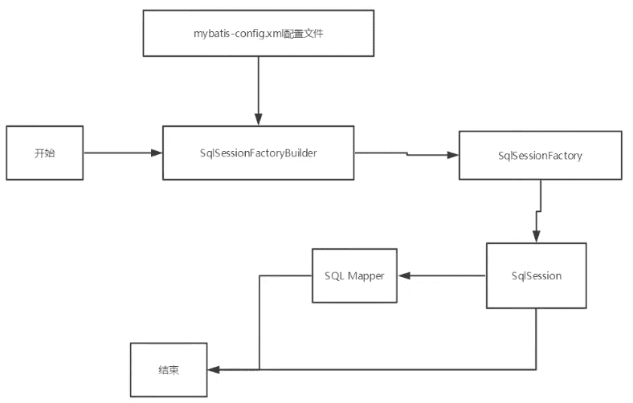
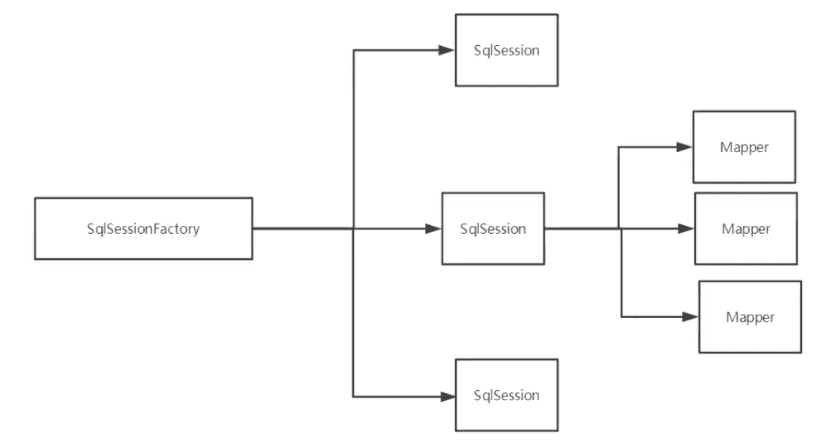
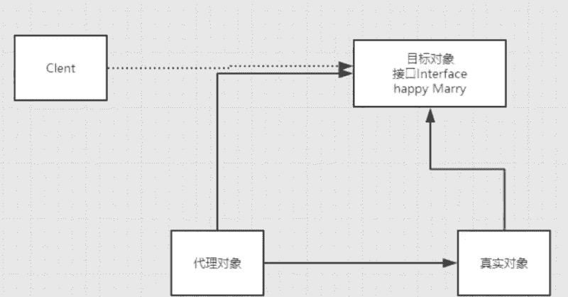
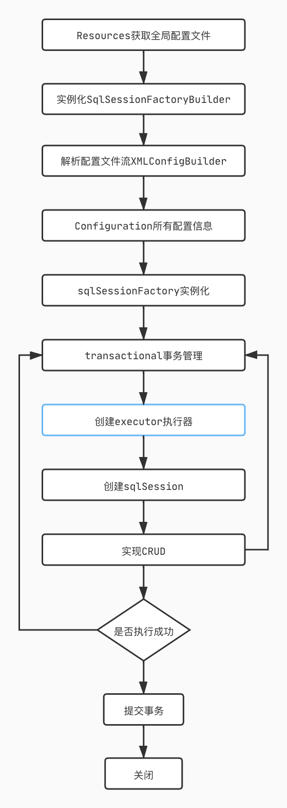

---

---


MyBatis
------------

[【狂神说Java】Mybatis最新完整教程IDEA版通俗易懂](https://www.bilibili.com/video/BV1NE411Q7Nx?spm_id_from=333.999.0.0)

环境：

JDK1.8

MySQL5.7

Maven 3.6.1

IDEA

回顾：

JDBC

mysql

Java基础

Maven

Junit


学习框架最好的方式是看官网

[MyBatis官网](https://mybatis.org/mybatis-3/zh/index.html)

## 1、简介

### 1.1 什么是MyBatis

- MyBatis 是一款优秀的**持久层框架**
- 它支持自定义 SQL、存储过程以及高级映射。
- MyBatis 免除了几乎所有的 JDBC 代码以及设置参数和获取结果集的工作。
- MyBatis 可以通过简单的 XML 或注解来配置和映射原始类型、接口和 Java POJO（Plain Old Java Objects，普通老式 Java 对象，也就是实体类）为数据库中的记录。
- 原来叫iBatis，2013迁移到[Github](https://github.com/mybatis/mybatis-3)

怎么获得MyBatis？

- Maven：

```xml
<!-- https://mvnrepository.com/artifact/org.mybatis/mybatis -->
<dependency>
    <groupId>org.mybatis</groupId>
    <artifactId>mybatis</artifactId>
    <version>3.5.7</version>
</dependency>
```

- Github：https://github.com/mybatis/mybatis-3/release
- 中文文档：https://mybatis.org/mybatis-3/zh/index.html

### 1.2 持久化

数据持久化

- 持久化就是将程序的数据在持久状态和瞬间状态转化的过程
- 内存：断电即失
- 数据库（JDBC），io文件持久化

为什么需要持久化？

- 有些对象，不能让它丢失
- 内存太贵了


### 1.3 持久层

DAO层，Service层，Controller层.....

- 完成持久化工作的代码块
- 层是界限十分明显


### 1.4 为什么需要MyBatis

- 帮助程序员将数据存入到数据库中

- 方便
- 传统的JDBC代码太复杂了，简化，框架，自动化

- 不用MyBatis也可以，更容易上手。**技术没有高低之分**
- 优点
  - 简单易学：本身就很小且简单。没有任何第三方依赖，最简单安装只要两个jar文件+配置几个sql映射文件易于学习，易于使用，通过文档和源代码，可以比较完全的掌握它的设计思路和实现。
  - 灵活：mybatis不会对应用程序或者数据库的现有设计强加任何影响。 sql写在xml里，便于统一管理和优化。通过sql语句可以满足操作数据库的所有需求。
  - 解除sql与程序代码的耦合：通过提供DAO层，将业务逻辑和数据访问逻辑分离，使系统的设计更清晰，更易维护，更易单元测试。sql和代码的分离，提高了可维护性。
  - 提供映射标签，支持对象与数据库的orm字段关系映射
  - 提供对象关系映射标签，支持对象关系组建维护
  - 提供xml标签，支持编写动态sql

## 2、第一个MyBatis程序

学习新东西的思路：搭建环境 --> 导入MyBatis --> 编写代码 --> 测试

### 2.1 搭建环境

数据库

```mysql
CREATE DATABASE `mybatis`;

USE `mybatis`;

CREATE TABLE `user`(
	`id` INT(20) NOT NULL PRIMARY KEY,
	`name` VARCHAR(30) DEFAULT NULL,
	`pwd` VARCHAR(30) DEFAULT NULL
)ENGINE=INNODB DEFAULT CHARSET=utf8;

INSERT INTO `user` (`id`, `name`, `pwd`) VALUES
(1, 'andy', '123456'),
(2, 'tom', '654321'),
(3, '张三', 'qwerq');
```

新建项目

1. 新建一个普通maven项目

2. 删除src目录，把当前项目当成父项目，准备建module

3. 导入maven依赖

   ```
   mysql-connector-java
   mybatis
   junit
   ```

### 2.2 创建一个模块

- 编写MyBatis的核心配置文件mybaits-config.xml：

```xml
<?xml version="1.0" encoding="UTF-8" ?>
<!DOCTYPE configuration
        PUBLIC "-//mybatis.org//DTD Config 3.0//EN"
        "http://mybatis.org/dtd/mybatis-3-config.dtd">
<!-- 核心配置 -->
<configuration>

    <environments default="development">

        <environment id="development">
            <transactionManager type="JDBC"/>
            <dataSource type="POOLED">
                <property name="driver" value="com.mysql.jdbc.Driver"/>
                <property name="url"
                          value="jdbc:mysql://localhost:3306/mybatis?useSSL=true&amp;useUnicode=true&amp;characterEncoding=UTF-8"/>
                <property name="username" value=""/>
                <property name="password" value=""/>
            </dataSource>

        </environment>
    </environments>

</configuration>
```

- 编写MyBatis工具类(读取配置类获取工厂)

```java
public class MybatisUtils {

    public static SqlSessionFactory sqlSessionFactory;
    static {
        try {
            // 使用MyBatis的第一步：获取SqlSessionFactory对象
            String resource = "mybatis-config.xml";
            InputStream inputStream = Resources.getResourceAsStream(resource);
            sqlSessionFactory = new SqlSessionFactoryBuilder().build(inputStream);
        } catch (IOException e) {
            e.printStackTrace();
        }
    }

    /**
     既然有了 SqlSessionFactory，顾名思义，我们可以从中获得 SqlSession 的实例。
     SqlSession 提供了在数据库执行 SQL 命令所需的所有方法。
     */
    public static SqlSession getSqlSession() {
        return sqlSessionFactory.openSession();
    }
```


### 2.3 编写代码

- 实体类

- Dao接口  对应mapper

  ```java
  public interface UserDao {
      List<User> getUserList();
  }
  
  ```

  

- 接口实现类，由原来的UserDaoImpl转变为一个Mapper配置文件(UserMapper.xml)：

  ```xml
  <?xml version="1.0" encoding="UTF-8" ?>
  <!DOCTYPE mapper
          PUBLIC "-//mybatis.org//DTD Mapper 3.0//EN"
          "http://mybatis.org/dtd/mybatis-3-mapper.dtd">
  <!-- namespace:绑定一个Dao/Mapper接口-->
  <mapper namespace="com.andyron.dao.UserDao">
      <select id="getUserList" resultType="com.andyron.pojo.User">
          select * from mybatis.user
      </select>
  </mapper>
  ```

  

### 2.4 测试

测试文件命名空间尽量与所测类对应。

- 注意点：Mapper.xml没有在核心配置文件中注册时的报错：

> org.apache.ibatis.binding.BindingException: Type interface com.andyron.dao.UserDao is not known to the MapperRegistry.

- （资源过滤问题，常见问题）报错：

  ```
  java.io.IOException: Could not find resource com/andyron/dao/UserMapper.xml
  ```

  默认Maven在编译时，只会拷贝src/main/resources里的配置文件，其它地方的就不会，因此target目录中不会有UserMapper.xml文件。

  解决方法就是：配置maven默认的资源目录（父项目和子项目中都可以配置）：

```xml
    <!-- 在build中配置resources，来防止我们资源导出失败的问题（也叫maven静态资源问题）。
    默认Maven在编译时，只会拷贝src/main/resources里的配置文件，其它地方的就不会；我们需要配置src/main/java目录下路的配置文件也被编译
    -->
    <build>
        <resources>
            <resource>
                <directory>src/main/resources</directory>
                <includes>
                    <include>**/*.properties</include>
                    <include>**/*.xml</include>
                </includes>
                <filtering>true</filtering>
            </resource>
            <resource>
                <directory>src/main/java</directory>
                <includes>
                    <include>**/*.properties</include>
                    <include>**/*.xml</include>
                </includes>
                <filtering>true</filtering>
            </resource>
        </resources>
    </build>
```


> 核心配置文件中`jdbc:mysql://127.0.0.1:3306/mybatis?useSSL=false`
>
> useSSL配置成true可能会报错：
>
> ```
> org.apache.ibatis.exceptions.PersistenceException
> ```
>
> 

测试代码：

```java
@Test
public void test() {
  // 第一步：获得SQLSession对象
  SqlSession sqlSession = MybatisUtils.getSqlSession();

  // 执行SQL
  // 方式一：getMapper
  UserDao userDao = sqlSession.getMapper(UserDao.class);
  List<User> userList = userDao.getUserList();

  for (User user : userList) {
    System.out.println(user);
  }

  // 关闭SQLSession
  sqlSession.close();
}
```

可能遇到的问题：

1. 配置文件没有注册
2. 绑定接口错误
3. 方法名不对
4. 返回类型不对
5. Maven导出资源问题


总结：Maven依赖库 -> 工具类MybatisUtils -> 核心配置文件 -> 实体类 -> 接口 -> Mapper ->测试


### 知识点

#### SqlSessionFactoryBuilder

#### SqlSessionFactory

#### SqlSession

每个线程都应该有它自己的 SqlSession 实例。SqlSession 的实例不是线程安全的，因此是不能被共享的，所以它的最佳的作用域是请求或方法作用域。


## 3、CURD

Mapper.xml中的

- namespace中的包名要和Dao/mapper接口的包名一致！

- select是查询语句

​	id：对应namespace中的方法名

​	resultType：Sql语句执行的返回值

​	parameterType：参数类型

- insert
- update
- delete

增删改需要提交事务

分析错误：

> 读报错信息，从下往上看。

- 标签不要匹配错了
- resource绑定Mapper，需要使用路径！
- 程序配置文件必须符合规范
- NullPointException，没有注册到资源
- 输出的xml文件中存在中文乱码问题
- maven资源没有导出问题

### 万能Map

假设，实体类或数据库中的表，字段或参数过多时，考虑使用map。

```java
// 万能map
int addUser2(Map<String, Object> map);
```

```xml
<insert id="addUser2" parameterType="map">
  insert into user (id, pwd) values (#{userid}, #{userpwd});
</insert>
```

```java
@Test
public void addUser2() {
  SqlSession sqlSession = MyBatisUtils.getSqlSession();
  UserMapper mapper = sqlSession.getMapper(UserMapper.class);

  Map<String, Object> map = new HashMap<String, Object>();
  map.put("userid", 7);
  map.put("userpwd", "789665");
  mapper.addUser2(map);

  sqlSession.commit();
  sqlSession.close();
}
```


Map传递参数，直接在sql中取出key即可。【parameterType="map"】

对象传递参数，直接在sql中取对象的属性即可。【parameterType="Object"】

只有一个基本类型参数的情况下，可以直接在SQL中取到。【parameterType可省略】

多个参数用map，或注解。

### 模糊查询怎么写

1. Java代码执行的时候，传通配符%%

```xml
<select id="getUserLike" resultType="com.andyron.pojo.User">  
  select * from mybatis.user where name like #{value}
</select>
```

```java
List<User> userList = mapper.getUserLike("%张%");
```

不要在SQL拼接中使用通配符，有可能被SQL注入：

```xml
<select id="getUserLike" resultType="com.andyron.pojo.User">
  select * from mybatis.user where name like "%"#{value}"%"
</select>
```


## 4、[配置解析](https://mybatis.org/mybatis-3/zh/configuration.html)

> Code:mybatis-02

MyBatis 的配置文件包含了会深深影响 MyBatis 行为的设置和属性信息。

### 4.1 核心配置文件

mybatis-config.xml

```
configuration（配置）
  properties（属性）
  settings（设置）
  typeAliases（类型别名）
  typeHandlers（类型处理器）
  objectFactory（对象工厂）
  plugins（插件）
  environments（环境配置）
    environment（环境变量）
      transactionManager（事务管理器）
      dataSource（数据源）
  databaseIdProvider（数据库厂商标识）
  mappers（映射器）
```

### 4.2 环境配置

MyBatis 可以配置成适应多种环境

但每个 SqlSessionFactory 实例只能选择一种环境

#### 事务管理器（transactionManager）

MyBatis中有两种类型的事务管理器（type="[JDBC|MANAGED]"）

#### 数据源（dataSource）

连接数据库（数据库连接池）：dbcp，c3p0，druid 

> 池：用完可以回收。每次用户都去重新连接数据库是很浪费资源的，池就表示一个用户连接完了，不急忙关掉，让其它用户连。

三种内建的数据源类型（type="[UNPOOLED|POOLED|JNDI]"）。


### 4.3 属性（properties）

可以通过属性（properties）来实现引用配置文件。

这些属性可以在外部进行配置，并可以进行动态替换。你既可以在典型的 Java 属性文件中配置这些属性，也可以在 properties 元素的子元素中设置。

> configuration配置文件中元素时由顺序要求的：
>
> The content of element type "configuration" must match "(properties?,settings?,typeAliases?,typeHandlers?,objectFactory?,objectWrapperFactory?,reflectorFactory?,plugins?,environments?,databaseIdProvider?,mappers?)".


- 可以直接引入外部文件

- 可以在其中增加一些属性设置

- 如果上面两个中有统一字段，优先使用外部配置文件的

### 4.4 类型别名（typeAliases）

- 类型别名可为Java类型设置一个缩写名字。 

- 它仅用于XML配置，意在降低冗余的全限定类名书写。

```xml
<!-- 可以给实体类取别名 -->
<typeAliases>
  <typeAlias type="com.andyron.pojo.User" alias="user"/>
</typeAliases>
```

也可以指定一个包名，MyBatis 会在包名下面搜索需要的 Java Bean

扫描实体类的包，它的默认别名就是这个类的类名（建议首字母小写），如果实体类有注解（@Alias），那别名就是注解的别名：

```xml
<typeAliases>
  <package name="com.andyron.pojo" />
</typeAliases>
```

在实体类比较少的时候，使用第一种方式；如果实体类比较多，建议使用第二种。


### 4.5 设置（settings）

cacheEnabled	
lazyLoadingEnabled

mapUnderscoreToCamelCase   

logImpl


### 4.6 其它配置

- typeHandlers（类型处理器）
- objectFactory（对象工厂）
- plugins（插件）
  - mybatis-generator-core
  - mybatis-plus
  - 通用mapper

### 4.7 映射器（mappers）

方式一：【推荐】

```xml
<mappers>
  <mapper resource="com/andyron/dao/UserMapper.xml"/>
</mappers>
```

方式二：使用class文件绑定注册

```xml
<mappers>
  <mapper class="com.andyron.dao.UserMapper"/>
</mappers>
```

方式三：使用扫描包进行注入绑定

```xml
<mappers>
  <package name="com.andyron.dao"/>
</mappers>
```

方式二和三都需要：

- 接口和它的Mapper配置文件必须同名。
- 接口和它的Mapper配置文件必须在同一包下。


### 4.8 作用域和生命周期

生命周期和作用域是至关重要的，因为错误的使用会导致非常严重的**并发问题**。



**SqlSessionFactoryBuilder**：

- 一旦创建了 SqlSessionFactory，就不再需要它了。

- 一般作为局部变量

**SqlSessionFactory**：

- 可以看作是：数据库连接池
- SqlSessionFactory 一旦被创建就应该在应用的运行期间一直存在，**没有任何理由丢弃它或重新创建另一个实例**
- 因此 SqlSessionFactory 的最佳作用域是应用作用域
- 最简单的就是使用单例模式或者静态单例模式。

**SqlSession**：

- 连接到连接池的一个请求
- SqlSession 的实例不是线程安全的，因此是不能被共享的，所以它的最佳的作用域是请求或方法作用域。

- 用完之后需要赶紧关闭，否则资源被占用！



这里的每个Mapper，就代表一个具体的业务。


## 5、解决属性名和字段名不一致的问题

### 5.1 问题

pwd

password

不好的解决方法：

- 起别名

```xml
<select id="getUserById" resultType="com.andyron.pojo.User">
  select id, name, pwd as password from mybatis.user where id=#{id}
</select>
```

### 5.2 resultMap

结果集映射

```xml
<!-- 结果映射集-->
<resultMap id="UserMap" type="User">
  <!-- column是数据库中的字段，property是实体类中的字段 -->
  <result column="id" property="id"/>
  <result column="name" property="name"/>
  <result column="pwd" property="password"/>
</resultMap>
<select id="getUserById" resultMap="UserMap">
  select * from mybatis.user where id=#{id}
</select>
```

- `resultMap` 元素是 MyBatis 中最重要最强大的元素。
- ResultMap 的设计思想是，对简单的语句做到零配置，对于复杂一点的语句，只需要描述语句之间的关系就行了。


## 6、日志

### 6.1 日志工厂

如果一个数据库操作出现异常，我们需要排错。日志就是最好的助手！

曾经：sout、debug

现在：日志工厂

`logImpl`

- SLF4J
- LOG4J 【重要】
- LOG4J2
- JDK_LOGGING
- COMMONS_LOGGING
- STDOUT_LOGGING 【重要】
- NO_LOGGING


#### STDOUT_LOGGING(标准日志输出)

在核心配置文件配置（注意空格大小写）：

```xml
<settings>
  <setting name="logImpl" value="STDOUT_LOGGING"/>
</settings>
```

日志结果：

```
Opening JDBC Connection
Created connection 1412925683.
Setting autocommit to false on JDBC Connection [com.mysql.jdbc.JDBC4Connection@543788f3]
==>  Preparing: select * from mybatis.user where id=? 
==> Parameters: 3(Integer)
<==    Columns: id, name, pwd
<==        Row: 3, 张三, qwerq
<==      Total: 1
User{id=3, name='张三', password='qwerq'}
Resetting autocommit to true on JDBC Connection [com.mysql.jdbc.JDBC4Connection@543788f3]
Closing JDBC Connection [com.mysql.jdbc.JDBC4Connection@543788f3]
Returned connection 1412925683 to pool.
```

### 6.2 LOG4J

什么是Log4j

- Log4j是[Apache](https://baike.baidu.com/item/Apache/8512995)的一个开源项目，通过使用Log4j，可以控制日志信息输送的目的地是[控制台](https://baike.baidu.com/item/控制台/2438626)、文件、[GUI](https://baike.baidu.com/item/GUI)组件，
- 甚至是套接口服务器、[NT](https://baike.baidu.com/item/NT/3443842)的事件记录器、[UNIX](https://baike.baidu.com/item/UNIX) [Syslog](https://baike.baidu.com/item/Syslog)[守护进程](https://baike.baidu.com/item/守护进程/966835)等；
- 也可以控制每一条日志的输出格式；通过定义每一条日志信息的级别，能够更加细致地控制日志的生成过程。
- 通过一个[配置文件](https://baike.baidu.com/item/配置文件/286550)来灵活地进行配置，而不需要修改应用的代码。


1. 先导入LOG4J的包

```xml
<!-- https://mvnrepository.com/artifact/log4j/log4j -->
<dependency>
    <groupId>log4j</groupId>
    <artifactId>log4j</artifactId>
    <version>1.2.17</version>
</dependency>
```

2. log4j.properties

   ```properties
   log4j.rootLogger=DEBUG,console,file
   
   # 控制台输出相关配置
   log4j.appender.console = org.apache.log4j.ConsoleAppender 
   log4j.appender.console.Target = System.out
   log4j.appender.console.Threshold = DEBUG
   log4j.appender.console.layout = org.apache.log4j.PatternLayout
   log4j.appender.console.layout.ConversionPattern = [%c]-%m%n
   
   # 文件输出相关配置
   log4j.appender.file = org.apache.log4j.RollingFileAppender
   log4j.appender.file.File = ./log/andyron.log
   # log4j.appender.file.MaxFileSize = 10M
   log4j.appender.file.Threshold = DEBUG
   log4j.appender.file.layout = org.apache.log4j.PatternLayout
   log4j.appender.file.layout.ConversionPattern = [%p][%d{yyyy-MM-dd}][%c]%m%n
   
   
   # 日志输出级别
   log4j.logger.org.mybatis=DEBUG
   log4j.logger.java.sql=DEBUG
   log4j.logger.java.sql.Statement=DEBUG
   log4j.logger.java.sql.ResultSet=DEBUG
   log4j.logger.java.sql.PreparedStatement=DEBUG
   ```

   

3. 配置log4j为日志的实现

   ```xml
   <settings>
     <setting name="logImpl" value="LOG4J"/>
   </settings>
   ```

   

4. 测试日志结果


#### 简单使用

1. 要使用log4j的类，先导入包`import org.apache.log4j.Logger;`

2. 获取日志对象

   ```java
   static Logger logger = Logger.getLogger(UserMapperTest.class);
   ```

3. 日志级别

   ```java
   logger.info("info:进入testLog4j方法");
   logger.debug("debug:进入testLog4j方法");
   logger.error("error:进入testLog4j方法");
   ```

   

## 7、分页

### limit分页：

```sql
Select * from user limit startIndex, pageSize;
```

1. 接口：

   ```java
   List<User> getUserByLimit(Map<String, Integer> map);
   
   ```

   

2. Mapper

   ```xml
   <select id="getUserByLimit" resultType="map" resultMap="UserMap">
     select * from mybatis.user limit #{startIndex}, #{pageSize}
   </select>
   ```

3. 测试

   ```java
   SqlSession sqlSession = MyBatisUtils.getSqlSession();
   UserMapper mapper = sqlSession.getMapper(UserMapper.class);
   
   HashMap<String, Integer> map = new HashMap<String, Integer>();
   map.put("startIndex", 0);
   map.put("pageSize", 2);
   
   List<User> userList = mapper.getUserByLimit(map);
   for (User user : userList) {
     System.out.println(user);
   }
   
   sqlSession.close();
   ```

   

### RowBounds分页

不推荐使用了

通过Java代码层面实现分页


### 分页插件

[MyBatis Pagehelper](https://pagehelper.github.io/) 

🔖

分页最终还是用sql的limit


## 8、使用注解开发

除了MyBatis，其它基本都采用注解开发了

### 8.1 面向接口编程

很多时候我们选择面向接口编程，根本原因是：**<font color=#FF8C00>解耦</font>，可拓展，提高复用，分层开发中，上层不用管具体的实现，大家都遵守共同的标准，使得开发变得容易，规范性更好。**

- 接口从更深层次的理解，应是定义（规范，约束）与实现（名实分离的原则）的分离。

- 接口的本身反映了系统设计人员对系统的抽象理解。

- 接口应有两类：

  一是对一个个个体的抽象，它可对应为一个抽象提（abstract class）

  二是对一个个体某一方面的抽象，即形成一个抽象面（interface）；

  一个个体有可能有多个抽象面，抽象体和抽象面是有区别的

#### 三个面向的区别

- 面向对象指考虑问题时，以对象为单位，考虑它的属性及方法。
- 面向过程指考虑问题时，以一个具体的流程（事务过程）为单位，考虑它的实现。
- 接口设计与非接口设计是针对复用技术而言的，与面向对象（过程）不是一个问题，更多的体现在堆系统整体的架构

### 8.2 注解

使用注解来映射简单语句会使代码显得更加简洁，但对于稍微复杂一点的语句，Java 注解不仅力不从心，还会让你本就复杂的 SQL 语句更加混乱不堪。 因此，如果你需要做一些很复杂的操作，最好用 XML 来映射语句。

1. 注解在接口上实现

   ```java
   @Select("select * from user")
   List<User> getUsers();
   ```

2. 需要在核心配置文件中绑定接口。

   ```xml
   <!-- 绑定接口 -->
   <mappers>
     <mapper class="com.andyron.dao.UserMapper"/>
   </mappers>
   ```

3. 测试


断点

本质：反射机制实现

底层：动态代理！




### MyBatis的详细执行流程




### 8.3 CRUD

可以在工具类创建的时候实现自动事务：

```java
sqlSessionFactory.openSession(true);
```

编写接口，增加注解

```java
public interface UserMapper {
    
    @Select("select * from user")
    List<User> getUsers();

    // 方法存在多个参数，所有的参数前面必须加上@Param()注解
    @Select("select * from user where id = #{id}")
    User getUserById(@Param("id") int id2);

    @Insert("insert into user (id, name, pwd) values (#{id}, #{name}, #{password})")
    int addUser(User user);

    @Update("update user set name=#{name}, pwd=#{password} where id = #{id}")
    int updateUser(User user);

    @Delete("delete from user where id = #{uid}")
    int deleteUser(@Param("uid") int id);
}
```


注意：必须要先将接口注册绑定到核心配置文件中。

```xml
<!-- 绑定接口 -->
<mappers>
  <mapper class="com.andyron.dao.UserMapper"/>
</mappers>

```


#### 关于@Param()注解

- 基本类型的参数或者String类型，需要加上
- 引用类型不需要加
- 如果只有一个基本类型参数，可以忽略，建议加上
- 在SQL中引用的就是我们这里的@Param()中设定的属性名！


#### #{}与${}

- 尽量用`#{}`，它存在预编译，能很大程度上防止sql注入
- `${}`会直接进行sql拼接


## 9、Lombok

> [Project Lombok](https://projectlombok.org/) is a java library that automatically plugs into your editor and build tools, spicing up your java.
> Never write another getter or equals method again, with one annotation your class has a fully featured builder, Automate your logging variables, and much more.

- java library
- plugs
- build tools

- 不要再写getter或setter等方法了，使用注解即可

使用步骤：

1. 在IDEA中安装Lombok插件

2. 在项目中导入Lombok的jar包

3. 使用

   ```java
   @Getter and @Setter
   @FieldNameConstants
   @ToString
   @EqualsAndHashCode
   @AllArgsConstructor, @RequiredArgsConstructor and @NoArgsConstructor
   @Log, @Log4j, @Log4j2, @Slf4j, @XSlf4j, @CommonsLog, @JBossLog, @Flogger, @CustomLog
   @Data
   @Builder
   @SuperBuilder
   @Singular
   @Delegate
   @Value
   @Accessors
   @Wither
   @With
   @SneakyThrows
   @val
   @var
   experimental @var
   @UtilityClass
   Lombok config system
   Code inspections
   Refactoring actions (lombok and delombok)
   ```

说明：

```
@Data注解生成：无参构造、get、set、tostring、hashcode、equals
@AllArgsConstructor
@NoArgsConstructor
```

> 如果开发团队中使用Lombok就使用，要不然不要用了

## 10、多对一处理

- 多个学生，对应一个老师
- 对于学生这边而言，**关联**，多个学生关联一个老师【多对一】
- 对于老师而言，**集合**，一个老师有很多学生【一对多】


```mysql
Create Table `teacher` (
	`id` Int(10) Not Null,
  `name` Varchar(30) Default Null,
  Primary Key(`id`)
) Engine=Innodb Default Charset=utf8;

Insert Into teacher(`id`, `name`) Values (1, '张老师');

Create Table `student` (
	`id` Int(10) Not Null,
  `name` Varchar(30) Default Null,
  `tid` Int(10) Default Null,
  Primary Key(`id`),
  Key `fktid` (`tid`),
  Constraint `fktid` Foreign Key (`tid`) References `teacher` (`id`)
) Engine=Innodb Default Charset=utf8;

Insert Into `student` (`id`, `name`, `tid`) Values(1, '小明', '1');
Insert Into `student` (`id`, `name`, `tid`) Values(2, '小红', '1');
Insert Into `student` (`id`, `name`, `tid`) Values(3, '小张', '1');
Insert Into `student` (`id`, `name`, `tid`) Values(4, '小李', '1');
Insert Into `student` (`id`, `name`, `tid`) Values(5, '小王', '1');
```


### 测试环境搭建


### 按照查询嵌套处理

```xml
<!--
    思路：
        1. 查询所有学生信息
        2. 根据学生的tid，查询对应的老是
    -->
<select id="getStudent" resultMap="StudentTeacher">
  select * from student
</select>
<resultMap id="StudentTeacher" type="Student">
  <result property="id" column="id"/>
  <result property="name" column="name"/>
  <!-- 复杂的属性，需要单独处理, 对象：association,集合：collection -->
  <association property="teacher" column="tid" javaType="Teacher" select="getTeacher" />
</resultMap>

<select id="getTeacher" resultType="Teacher">
  select * from teacher where id = #{id}
</select>
```


### 按照结果嵌套处理

```xml
<!-- 按照结果嵌套处理 -->
<select id="getStudent2" resultMap="StudentTeacher2">
  select s.id sid, s.name sname, t.name tname
  from student s, teacher t
  where s.tid = t.id;
</select>
<resultMap id="StudentTeacher2" type="Student">
  <result property="id" column="sid"/>
  <result property="name" column="sname"/>
  <association property="teacher" javaType="Teacher" >
    <result property="name" column="tname"/>
  </association>
</resultMap>
```


回顾MySQL多对一查询方式：

- 子查询（对应按照查询嵌套处理）
- 联表查询（对应按照结果嵌套处理）


## 11、一对多

一个老师拥有多个学生


实体类

```java
@Data
public class Student {
    private int id;
    private String name;
    private int tid;
}

@Data
public class Teacher {
    private int id;
    private String name;

    // 一个老师拥有多个学生
    private List<Student> students;
}
```

按照结果嵌套处理

```xml
<select id="getTeacherPlus" resultMap="TeacherStudent">
  select t.id tid, t.name tname, s.id sid, s.name sname
  from teacher t, student s
  where t.id = s.tid and t.id = #{tid};
</select>
<resultMap id="TeacherStudent" type="Teacher">
  <result property="id" column="tid"/>
  <result property="name" column="tname"/>
  <!-- 复杂的属性，需要单独处理, 对象：association,集合：collection
        javaType指定属性类型
        ofType获取集合中的泛型信息
        -->
  <collection property="students" ofType="Student" >
    <result property="id" column="sid"/>
    <result property="name" column="sname"/>
    <result property="tid" column="tid"/>
  </collection>
</resultMap>
```

按照查询嵌套处理：

```xml
<select id="getTeacherPlus2" resultMap="TeacherStudent2">
  select * from teacher where id = #{tid};
</select>
<resultMap id="TeacherStudent2" type="Teacher">
  <collection property="students" javaType="ArrayList" ofType="Student" select="getStudentByTeacherId" column="id"/>
</resultMap>
<select id="getStudentByTeacherId" resultType="Student">
  select * from student where tid = #{tid};
</select>
```


### 小结

1. 关联，association 【多对一】
2. 集合，collection 【一对多】
3. javaType用于指定实体类中属性的类型
4. ofType用来指定映射到List或集合中的pojo类型，泛型中的约束类型

注意点：

- 保证SQL的可读性，尽量保证通俗易懂
- 注意一对多和多对一中，属性名和字段的问题
- 如果问题不好排查，可以使用日志


## 12、动态SQL

**动态SQL就是根据不同的条件生成不同的SQL语句。**

简化SQL拼接

```
if
choose (when, otherwise)
trim (where, set)
foreach
```

🔖p22-25


动态SQL就是在拼接SQL语句，只要保证SQL的正确性，按照SQL的格式，去排列组合就可以了。

建议：先写出完整的SQL，再对应的去修改成动态SQL的实现。 

## 13、缓存

### 13.1 简介

一次查询的结果，暂时存在一个可以直接取到的地方（内存），这就是缓存。

三高：高并发、高可用、高性能

为什么使用缓存？

减少和数据库的交互，减少系统开销，提高系统效率。

什么样的数据能使用缓存？

经常查询并且不经常改变的数据。


### 13.2 MyBatis缓存

MyBatis默认定义了两级缓存：**一级缓存**和**二级缓存**

- 默认，只有一级缓存开启。（SqlSession级别的缓存，也叫本地缓存，也就是在SQLSession.close()之前都被缓存）
- 二级缓存需要主动开启，它基于namespace级别的缓存。（也就是一个Mapper或接口）
- 为了提高扩展性，MyBatis定义了缓存接口`Cache`，让用户自定义二级缓存。


### 13.3 一级缓存

SqlSession

与数据库同一次会话期间查询到的数据会放在本地缓存中。


测试步骤：

1. 开启日志
2. 测试在一个session中查询两次相同的记录

```java
SqlSession sqlSession = MyBatisUtils.getSqlSession();
UserMapper mapper = sqlSession.getMapper(UserMapper.class);

User user1 = mapper.queryUserById(1);
System.out.println(user1);

System.out.println("==========");

User user2 = mapper.queryUserById(1);
System.out.println(user2);


System.out.println(user1 == user2);
sqlSession.close();
```

结果：

```
Opening JDBC Connection
Created connection 1873859565.
==>Preparing: select * from user where id = ?; 
==> Parameters: 1(Integer)
<==		 Columns:id, name, pwd
<==				 Row: 1,andy, 123456
<==			 Total:1
User(id=1,name=andy, pwd=123456)
=====================
User(id=1, name=andy, pwd=123456)
true
CLosing JDBC Connection [com.mysql.jdbc.JDBC4Connection@6fb0d3ed] 
Returned connection 1873859565 to pool.
```


缓存失效的情况：

- 增删改操作，可能会改变原来的数据，所以必定会刷新缓存
- 手动清理(`sqlSession.clearCache() `)


### 13.4 二级缓存

- 一级缓存作用域太低

- 基于namespace
- 一个会话查询一条数据，保存在当前会话的一级缓存中
- 如果当前会话关闭，对应一级缓存就没了；如果开启二级缓存，会话关闭，一级缓存中数据会被保存到二级缓存中


步骤：

1. 开启全局缓存

   ```xml
   <!-- 显式的开启全局缓存 -->
   <setting name="cacheEnabled" value="true"/>
   ```

   

2. 在要使用二级缓存的Mapper中开启

   ```xml
   <!-- 在当前Mapper.xml中使用二级缓存 -->
   <cache/>
   ```

   也可以自定义参数：

   ```xml
   <cache
     eviction="FIFO"
     flushInterval="60000"
     size="512"
     readOnly="true"/>
   ```

3. 测试

   ```java
   SqlSession sqlSession = MyBatisUtils.getSqlSession();
   SqlSession sqlSession2 = MyBatisUtils.getSqlSession();
   
   UserMapper mapper = sqlSession.getMapper(UserMapper.class);
   User user = mapper.queryUserById(1);
   System.out.println(user);
   sqlSession.close();
   
   System.out.println("================");
   
   UserMapper mapper2 = sqlSession2.getMapper(UserMapper.class);
   User user2 = mapper2.queryUserById(1);
   System.out.println(user2);
   sqlSession2.close();
   
   System.out.println(user == user2);
   ```

   

问题：需要将实体类序列化，否则可能会报错：

```java
java.io.NotSerializableException
```


小结：

- 只要开启了二级缓存，在同一个Mapper下就有效
- 所有数据都会先放在一级缓存中
- 只有当会话提交或关闭的时候，才会提交到二级缓存中

### 13.5 缓存原理

缓存查询顺序：

1. 先看二级缓存中有没有
2. 再看一级缓存
3. 数据库


### 13.6 自定义缓存EhCache

[官方文档](http://www.mybatis.org/ehcache-cache/)

EhCache 是一个纯Java的进程内缓存框架，具有快速、精干等特点。

Ehcache是一种广泛使用的java分布式缓存，用于通用缓存；

要在应用程序中使用Ehcache，需要引入依赖的jar包：

```xml
<!-- https://mvnrepository.com/artifact/org.mybatis.caches/mybatis-ehcache -->
<dependency>
    <groupId>org.mybatis.caches</groupId>
    <artifactId>mybatis-ehcache</artifactId>
    <version>1.1.0</version>
</dependency>
```

在mapper.xml中使用对应的缓存即可：

```xml
<mapper namespace = “org.acme.FooMapper” > 
    <cache type = “org.mybatis.caches.ehcache.EhcacheCache” /> 
</mapper>
```

编写ehcache.xml文件，如果在`加载时`未找到`/ehcache.xml`资源或出现问题，则将使用默认配置。

```xml
<?xml version="1.0" encoding="UTF-8"?>
<ehcache xmlns:xsi="http://www.w3.org/2001/XMLSchema-instance"
         xsi:noNamespaceSchemaLocation="http://ehcache.org/ehcache.xsd"
         updateCheck="false">
    <!--
       diskStore：为缓存路径，ehcache分为内存和磁盘两级，此属性定义磁盘的缓存位置。参数解释如下：
       user.home – 用户主目录
       user.dir  – 用户当前工作目录
       java.io.tmpdir – 默认临时文件路径
     -->
    <diskStore path="./tmpdir/Tmp_EhCache"/>
    <defaultCache
            eternal="false"
            maxElementsInMemory="10000"
            overflowToDisk="false"
            diskPersistent="false"
            timeToIdleSeconds="1800"
            timeToLiveSeconds="259200"
            memoryStoreEvictionPolicy="LRU"/>
    <cache
            name="cloud_user"
            eternal="false"
            maxElementsInMemory="5000"
            overflowToDisk="false"
            diskPersistent="false"
            timeToIdleSeconds="1800"
            timeToLiveSeconds="1800"
            memoryStoreEvictionPolicy="LRU"/>
    <!--
       defaultCache：默认缓存策略，当ehcache找不到定义的缓存时，则使用这个缓存策略。只能定义一个。
     -->
    <!--
      name:缓存名称。
      maxElementsInMemory:缓存最大数目
      maxElementsOnDisk：硬盘最大缓存个数。
      eternal:对象是否永久有效，一但设置了，timeout将不起作用。
      overflowToDisk:是否保存到磁盘，当系统当机时
      timeToIdleSeconds:设置对象在失效前的允许闲置时间（单位：秒）。仅当eternal=false对象不是永久有效时使用，可选属性，默认值是0，也就是可闲置时间无穷大。
      timeToLiveSeconds:设置对象在失效前允许存活时间（单位：秒）。最大时间介于创建时间和失效时间之间。仅当eternal=false对象不是永久有效时使用，默认是0.，也就是对象存活时间无穷大。
      diskPersistent：是否缓存虚拟机重启期数据 Whether the disk store persists between restarts of the Virtual Machine. The default value is false.
      diskSpoolBufferSizeMB：这个参数设置DiskStore（磁盘缓存）的缓存区大小。默认是30MB。每个Cache都应该有自己的一个缓冲区。
      diskExpiryThreadIntervalSeconds：磁盘失效线程运行时间间隔，默认是120秒。
      memoryStoreEvictionPolicy：当达到maxElementsInMemory限制时，Ehcache将会根据指定的策略去清理内存。默认策略是LRU（最近最少使用）。你可以设置为FIFO（先进先出）或是LFU（较少使用）。
      clearOnFlush：内存数量最大时是否清除。
      memoryStoreEvictionPolicy:可选策略有：LRU（最近最少使用，默认策略）、FIFO（先进先出）、LFU（最少访问次数）。
      FIFO，first in first out，这个是大家最熟的，先进先出。
      LFU， Less Frequently Used，就是上面例子中使用的策略，直白一点就是讲一直以来最少被使用的。如上面所讲，缓存的元素有一个hit属性，hit值最小的将会被清出缓存。
      LRU，Least Recently Used，最近最少使用的，缓存的元素有一个时间戳，当缓存容量满了，而又需要腾出地方来缓存新的元素的时候，那么现有缓存元素中时间戳离当前时间最远的元素将被清出缓存。
   -->
</ehcache>
```


## 练习

🔖 把smbms项目中29个sql修改为mybatis


## MyBatis中的设计模式

1、Builder模式，例如SqlSessionFactoryBuilder、XMLConfigBuilder、XMLMapperBuilder、XMLStatementBuilder、CacheBuilder；

2、工厂模式，例如SqlSessionFactory、ObjectFactory、MapperProxyFactory；

3、单例模式，例如ErrorContext和LogFactory；

4、代理模式，Mybatis实现的核心，比如MapperProxy、ConnectionLogger，用的jdk的动态代理；还有executor.loader包使用了cglib或者javassist达到延迟加载的效果；

5、组合模式，例如SqlNode和各个子类ChooseSqlNode等；

6、模板方法模式，例如BaseExecutor和SimpleExecutor，还有BaseTypeHandler和所有的子类例如IntegerTypeHandler；

7、适配器模式，例如Log的Mybatis接口和它对jdbc、log4j等各种日志框架的适配实现；

8、装饰者模式，例如Cache包中的cache.decorators子包中等各个装饰者的实现；

9、迭代器模式，例如迭代器模式PropertyTokenizer；


https://www.cnblogs.com/CQqfjy/p/12302786.html
