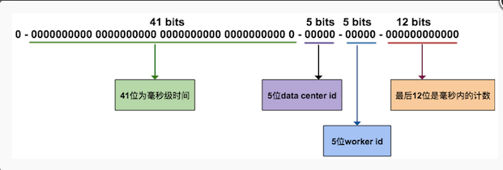
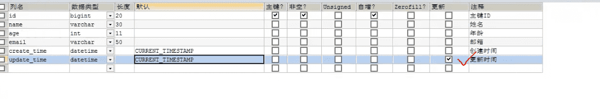
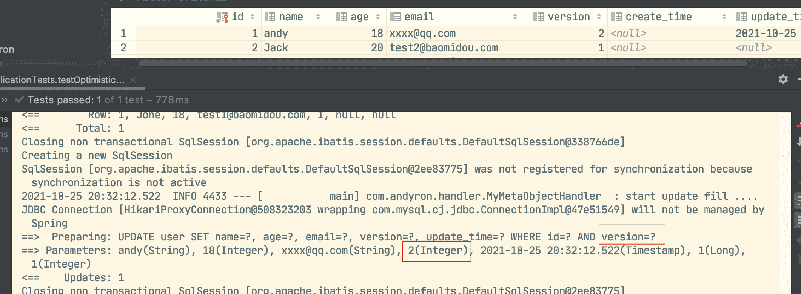
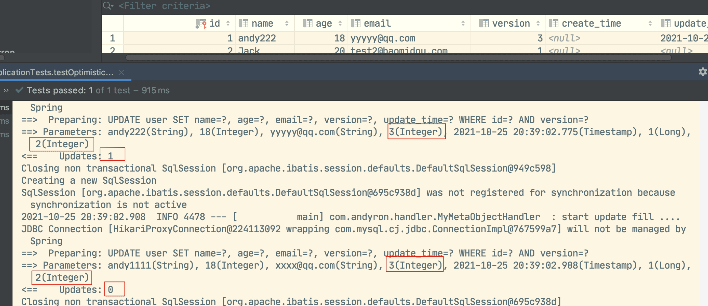

MyBatisPlus
-------------

https://www.bilibili.com/video/BV17E411N7KN


MyBatisPlus可以让所有CRUD代码自动化完成。

JPA、tk-mapper、MyBatisPlus

[MyBatisPlus官网](https://mp.baomidou.com/)

MyBatis是为了简化JDBC操作的。MyBatis-Plus（简称 MP）是一个 MyBatis (opens new window)的增强工具，在 MyBatis 的基础上只做增强不做改变，为简化开发、提高效率而生。

## 简介

### mp特性

- **无侵入**：只做增强不做改变，引入它不会对现有工程产生影响，如丝般顺滑
- **损耗小**：启动即会自动注入基本 CURD，性能基本无损耗，直接面向对象操作
- **强大的 CRUD 操作**：内置通用 Mapper、通用 Service，仅仅通过少量配置即可实现单表大部分 CRUD 操作，更有强大的条件构造器，满足各类使用需求
- **支持 Lambda 形式调用**：通过 Lambda 表达式，方便的编写各类查询条件，无需再担心字段写错
- **支持主键自动生成**：支持多达 4 种主键策略（内含分布式唯一 ID 生成器 - Sequence），可自由配置，完美解决主键问题
- **支持 ActiveRecord 模式**：支持 ActiveRecord 形式调用，实体类只需继承 Model 类即可进行强大的 CRUD 操作
- **支持自定义全局通用操作**：支持全局通用方法注入（ Write once, use anywhere ）
- **内置代码生成器**：采用代码或者 Maven 插件可快速生成 Mapper 、 Model 、 Service 、 Controller 层代码，支持模板引擎，更有超多自定义配置等您来使用
- **内置分页插件**：基于 MyBatis 物理分页，开发者无需关心具体操作，配置好插件之后，写分页等同于普通 List 查询
- **分页插件支持多种数据库**：支持 MySQL、MariaDB、Oracle、DB2、H2、HSQL、SQLite、Postgre、SQLServer 等多种数据库
- **内置性能分析插件**：可输出 SQL 语句以及其执行时间，建议开发测试时启用该功能，能快速揪出慢查询
- **内置全局拦截插件**：提供全表 delete 、 update 操作智能分析阻断，也可自定义拦截规则，预防误操作


### 快速入门

https://mp.baomidou.com/guide/quick-start.html

> 使用第三方组件的一般步骤：
>
> 1. 导入对应的依赖
> 2. 研究依赖如何配置
> 3. 代码如何配置
> 4. 提高扩展技术能力

步骤

1. 数据库`mybatis_plus`  utf8  utf8_general_ci

2. 创建user表

   ```sql
   DROP TABLE IF EXISTS user;
   
   CREATE TABLE user
   (
   	id BIGINT(20) NOT NULL COMMENT '主键ID',
   	name VARCHAR(30) NULL DEFAULT NULL COMMENT '姓名',
   	age INT(11) NULL DEFAULT NULL COMMENT '年龄',
   	email VARCHAR(50) NULL DEFAULT NULL COMMENT '邮箱',
   	PRIMARY KEY (id)
   );
   
   -- 真实开发中，version(乐观锁)、deleted（逻辑删除）、gmt_create、gmt_modified
   ```

   

3. 编写项目
4. 导入依赖

```xml
<!-- 数据库驱动 -->
<dependency>
  <groupId>mysql</groupId>
  <artifactId>mysql-connector-java</artifactId>
</dependency>
<dependency>
  <groupId>org.projectlombok</groupId>
  <artifactId>lombok</artifactId>
</dependency>
<!-- 新版本省略了一些功能，学老版本 -->
<dependency>
  <groupId>com.baomidou</groupId>
  <artifactId>mybatis-plus-boot-starter</artifactId>
  <version>3.0.5</version>
</dependency>
```

> 尽量不要同时导入MyBatis和MyBatis-plus。

5. 链接数据库

```properties
# mysql5 与mysql8有区别，驱动名不同，mysql8要添加配置时区serverTimezone
spring.datasource.username=root
spring.datasource.password=iop654321
spring.datasource.driver-class-name=com.mysql.cj.jdbc.Driver
spring.datasource.url=jdbc:mysql://localhost:3306/mybatis_plus?useSSL=false&useUnicode=true&characterEncoding=utf-8\
  &serverTimezone=GMT%2B8

```

> 6. 传统方式  pojo-dao（链接MyBatis，配置mapper.xml文件）-service-controller

6. 使用MyBatis-plus之后

   - pojo

     ```java
     @Data
     @AllArgsConstructor
     @NoArgsConstructor
     public class User {
     
         private int id;
         private String name;
         private int age;
         private String email;
     }
     
     ```

     

   - mapper接口 

     ```java
     package com.andyron.mapper;
     
     import com.andyron.pojo.User;
     import com.baomidou.mybatisplus.core.mapper.BaseMapper;
     import org.springframework.stereotype.Repository;
     
     /**
      * 在对应的mapper上实现基本BaseMapper，就完成以前所有的curd功能都已经完成
      */
     @Repository // 代表持久层
     public interface UserMapper extends BaseMapper<User> {
     }
     
     ```

     

   - 注意点，需要在主启动类上扫描mapper

     ```java
     @MapperScan("com.andyron.mapper") 
     ```

     

   - 使用

     ```java
     @SpringBootTest
     class MybatisPlusApplicationTests {
     
         /*
         继承了BaseMapper，也可以编写自己的扩展方法
          */
         @Autowired
         UserMapper userMapper;
     
         @Test
         void contextLoads() {
             // 查询全部用户. 参数是一个Wrapper，条件构造器
             List<User> users = userMapper.selectList(null);
             users.forEach(System.out::println);
         }
     }
     ```

     

> 思考问题？
>
> 1. SQL MP都写了
> 2. 方法MP也写了常用的


## 配置日志

```properties
mybatis-plus.configuration.log-impl=org.apache.ibatis.logging.stdout.StdOutImpl
```


## CRUD扩展

### 插入

```java
@Test
void testInsert() {
  User user = new User();
  user.setName("AndyRon");
  user.setAge(5);
  user.setEmail("rongming.2008@163.com");
  int insert = userMapper.insert(user);  // id自动生成了
  System.out.println(insert);     // 受影响的行数
  System.out.println(user);       
}
```

```1
User(id=1452562031445110785, name=AndyRon, age=5, email=rongming.2008@163.com)
```

> 

### 主键生成策略

常用生成策略有：uuid，自增id，雪花算法，redis，zookeeper

雪花算法（snowflake） 是 twitter 开源的分布式ID生成算法，其核心思想为，一个long型的ID：

- 41 bit 作为毫秒数 - **41位的长度可以使用69年**
- 10 bit 作为机器编号 （5个bit是数据中心，5个bit的机器ID） - **10位的长度最多支持部署1024个节点**
- 12 bit 作为毫秒内序列号 - **12位的计数顺序号支持每个节点每毫秒产生4096个ID序号**




> MB默认id生成：
>
> ```
> @TableId(type = IdType.ID_WORKER)
> ```

使用`@TableId(type = IdType.AUTO)`的前提是，数据对应字段也要配置自增。

```java
public enum IdType {
    AUTO(0),
    NONE(1),
    INPUT(2),  // 手动输入
    ID_WORKER(3),
    UUID(4),
    ID_WORKER_STR(5);  // ID_WORKER字符串表示法 
  
}
```


### 更新操作

```java
@Test
void testUpdate() {
  User user = new User();
  user.setId(6L);
  user.setName("Andy");
  user.setAge(3);
  int i = userMapper.updateById(user);
  System.out.println(i);
}
```


### 自动填充

创建时间、修改时间

阿里巴巴开发手册：所有数据库表都要有`gmt_create`，`gmt_modified`，而且需要自动化。

#### 方式一：数据库级别(工作中不建议使用)

1. 在表中新增字段 `creat_time`  `update_time`,设置默认值为`CURRENT_TIMESTAMP`，并把`update_time`设置为根据当前时间戳更新。




2. 实体类同步

```java
    private Date createTime;
    private Date updateTime;
```


#### 方式二：代码级别

1. 删除数据库的默认值、根据当前时间戳更新的操作（方式一的1）


2. 实体类字段加注解

```java
    @TableField(fill = FieldFill.INSERT)
    private Date createTime;

    @TableField(fill = FieldFill.INSERT_UPDATE)
    private Date updateTime;
```

3. 编写处理来处理上面的注解

```java
@Slf4j
@Component // 不要忘记把处理器添加的IOC容器中
public class MyMetaObjectHandler implements MetaObjectHandler {
    // 插入时的填充策略
    @Override
    public void insertFill(MetaObject metaObject) {
        log.info("start insert fill ....");
        this.setFieldValByName("creatTime", new Date(), metaObject);
        this.setFieldValByName("updateTime", new Date(), metaObject);
    }

    // 更新时的填充策略
    @Override
    public void updateFill(MetaObject metaObject) {
        log.info("start update fill ....");
        this.setFieldValByName("updateTime", new Date(), metaObject);
    }
}
```

4. 测试插入、更新


### 乐观锁

> 乐观锁：十分乐观，总是认为不会出现问题，无论干什么不去上锁！如果出现了问题，再次更新值测试。`version` `new version`，就是加个版本号，看看前后有没有变化。
>
> 悲观锁：十分悲观，总是认为会出现问题，无论干什么都会上锁！再去操作


乐观锁实现方式：

- 取出记录时，获取当前version
- 更新时，带上这个version
- 执行更新时， set version = newVersion where version = oldVersion
- 如果version不对，就更新失败

```mysql

-- A线程
update user set name = "andy", version = version + 1
where id = 2 and version = 1

-- B线程如果抢先完成，这个时候version = 2，会导致A修改失败
update user set name = "andy", version = version + 1
where id = 2 and version = 1
```

#### 测试MP的乐观锁插件

1. 给数据库中添加version字段，并设置默认值为1

2. 实体类中添加字段

   ```java
   @Version  // 乐观锁注解
   private Integer version;
   ```

3. 注册组件

   ```java
   @MapperScan("com.andyron.mapper") // 扫描mapper， 也可以放在SprintBoot启动类上，但习惯放在对应的配置类上
   @EnableTransactionManagement  // 默认是开启的
   @Configuration
   public class MybatisPlusConfig {
   
       // 注册乐观锁插件
       @Bean
       public OptimisticLockerInterceptor optimisticLockerInterceptor() {
           return new OptimisticLockerInterceptor();
       }
   }
   ```

4. 测试

测试乐观锁成功的情况:

```
// 测试乐观锁成功的情况
@Test
void testOptimisticLocker() {
    User user = userMapper.selectById(1L);
    user.setName("andy");
    user.setEmail("xxxx@qq.com");
    userMapper.updateById(user);
}
```



测试乐观锁失败的情况，多线程

```java
// 测试乐观锁失败的情况，多线程
    @Test
    void testOptimisticLocker2() {
        // 线程1
        User user = userMapper.selectById(1L);
        user.setName("andy1111");
        user.setEmail("xxxx@qq.com");

        // 模拟另外一个线程执行了插队操作
        User user2 = userMapper.selectById(1L);
        user2.setName("andy222");
        user2.setEmail("yyyyy@qq.com");
        userMapper.updateById(user2);

        // 可通过自旋锁来尝试多次提交（🔖JUC）
        userMapper.updateById(user);  // 如果没有乐观锁，user的值就应该覆盖user2的值
    }
```



两次判断是version都是2，但第一更新后version就变成了3，第二次再更新就不能成功了。


### 查询操作

```java
// 测试查询
@Test
void testSelectById() {
  User user = userMapper.selectById(1L);
  System.out.println(user);
}

// 测试批量查询
@Test
void testSelectBatchIds() {
  List<User> users = userMapper.selectBatchIds(Arrays.asList(1, 2, 3));
  users.forEach(System.out::println);
}

// 按条件查询之一：map
@Test
void testSelectMap() {
  HashMap<String, Object> map = new HashMap<>();
  // 自定义查询
  map.put("name", "AndyRon");
  map.put("age", 3);
  List<User> users = userMapper.selectByMap(map);
  users.forEach(System.out::println);
}
```

### 分页查询


1. 配置拦截器组件

```
// 分页插件
@Bean
public PaginationInterceptor paginationInterceptor() {
return new PaginationInterceptor();
}
```

2. 直接使用Page对象即可：

```java
// 测试分页查询
@Test
void testPage() {
  // 参数：当前页，页面大小
  Page<User> page = new Page<>(2, 5);
  userMapper.selectPage(page, null);

  page.getRecords().forEach(System.out::println);
  System.out.println(page.getTotal());
 }
```


### 删除操作

```java
// 测试删除
@Test
void testDelete() {
  //        userMapper.deleteById(1452569851037016065L);
  //        userMapper.deleteBatchIds(Arrays.asList(1452569851037016067L, 1452562031445110787L));

  HashMap<String, Object> map = new HashMap<>();
  map.put("name", "AndyRon1");
  userMapper.deleteByMap(map);
}
```


### 逻辑删除

> 物理删除：从数据库总直接删除
>
> 逻辑删除：在数据库中没有被删除，而是通过一个变量让他失效！  deleted=0 =》 deleted=1

管理员可以查看被删除的记录！防止数据的丢失，类似于回收站！

1. 在数据表中添加一个字段`deleted`

2. 实体类中增加属性

   ```java
   @TableLogic // 逻辑删除
   private Integer deleted;
   ```

3. 配置

   ```java
   // 逻辑删除组件
   @Bean
   public ISqlInjector sqlInjector() {
     return new LogicSqlInjector();
   }
   ```

   ```properties
   # 配置逻辑删除
   mybatis-plus.global-config.db-config.logic-delete-value=1
   mybatis-plus.global-config.db-config.logic-not-delete-value=0
   ```

4. 测试

```java
userMapper.deleteById(1L);
```

这个操作现在只是更新`deleted`字段的值没有删除具体行。

现在如果使用`userMapper.selectById(1L);`是查询不到结果的。（自动过滤了deleted=1的）

```
==>  Preparing: SELECT id,name,age,email,version,deleted,create_time,update_time FROM user WHERE id=? AND deleted=0 
==> Parameters: 1(Long)
<==      Total: 0
```


> 注意新版本有所不同

## 性能分析插件

> 最新版本叫 执行SQL分析打印，有变化

慢SQL

性能分析插件，用于输出每条SQL语句及其执行时间

1. 导入插件

   ```java
   // sql执行效率插件
   @Bean
   @Profile({"dev", "test"})  // 设置开发环境开启
   public PerformanceInterceptor performanceInterceptor() {
     PerformanceInterceptor p = new PerformanceInterceptor();
     p.setMaxTime(100); // ms  设置SQL执行的最大时间
     p.setFormat(true); // 是否开启格式化
     return p;
   }
   ```

2. 测试使用


## 条件构造器

十分重要： Wrapper

复杂的SQL

```java
@SpringBootTest
public class WrapperTests {
    @Autowired
    UserMapper userMapper;

    @Test
    void test1() {
        // 查询name,email不为空，年龄大于等于14的用户
        QueryWrapper<User> wrapper = new QueryWrapper<>();
        wrapper.isNotNull("name")
                .isNotNull("email")
                .ge("age", 14);
        userMapper.selectList(wrapper).forEach(System.out::println);
    }

    @Test
    void test2() {
        QueryWrapper<User> wrapper = new QueryWrapper<>();
        wrapper.eq("name", "andy");
        System.out.println(userMapper.selectOne(wrapper));
    }

    @Test
    void test3() {
        // 查询年龄在20-30之间的用户数
        QueryWrapper<User> wrapper = new QueryWrapper<>();
        wrapper.between("age", 20, 30);
        System.out.println(userMapper.selectCount(wrapper));
    }

    // 模糊查询
    @Test
    void test4() {
        QueryWrapper<User> wrapper = new QueryWrapper<>();
        // 正常like %e% 左 %e  右 e%
        wrapper.notLike("name", "e")  // 名字中不包括e
                .likeRight("email", "t"); // 邮箱以t开头的
        /*
        AND name NOT LIKE '%e%'
        AND email LIKE 't%'
         */
        userMapper.selectMaps(wrapper).forEach(System.out::println);
    }

    @Test
    void test5() {
        QueryWrapper<User> wrapper = new QueryWrapper<>();
        // id在子查询中查出来
        wrapper.inSql("id", "select id from user where id < 4");
        List<Object> objects = userMapper.selectObjs(wrapper);
        objects.forEach(System.out::println);
    }

    @Test
    void test6() {
        QueryWrapper<User> wrapper = new QueryWrapper<>();
        wrapper.orderByDesc("id");
        userMapper.selectList(wrapper).forEach(System.out::println);
    }
}

```


## 代码自动生成器

AutoGenerator 是 MyBatis-Plus 的代码生成器，通过 AutoGenerator 可以快速生成 Entity、Mapper、Mapper XML、Service、Controller 等各个模块的代码，极大的提升了开发效率。

