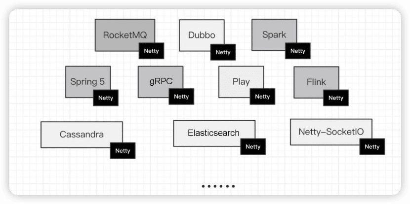
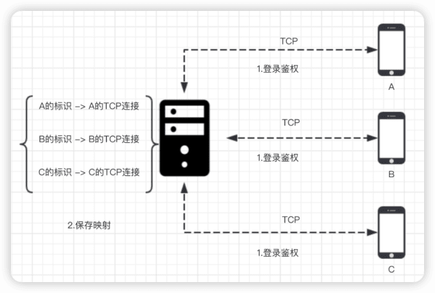
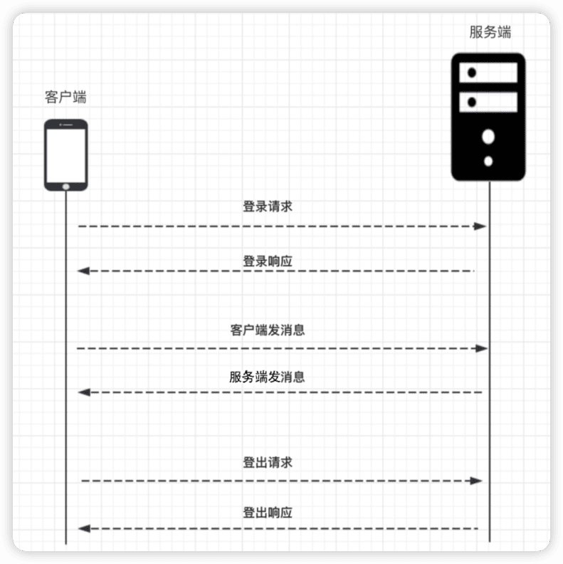
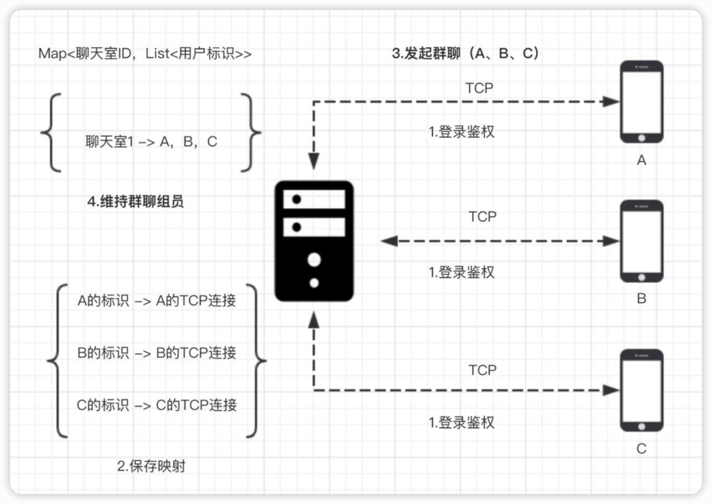
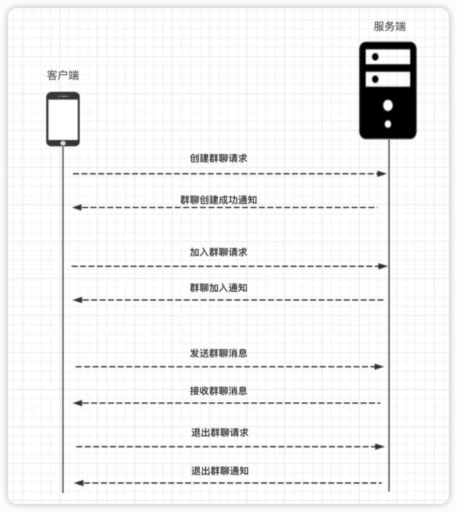
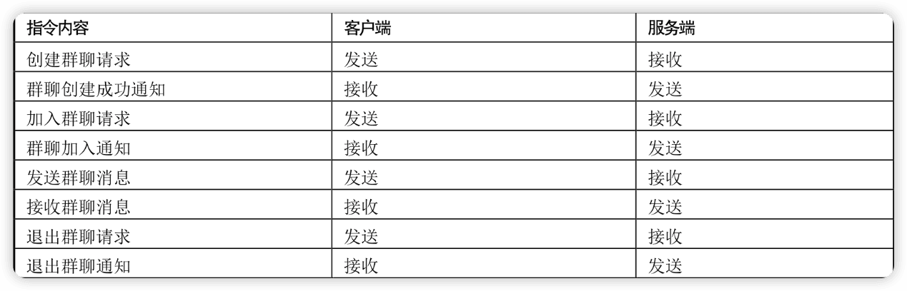
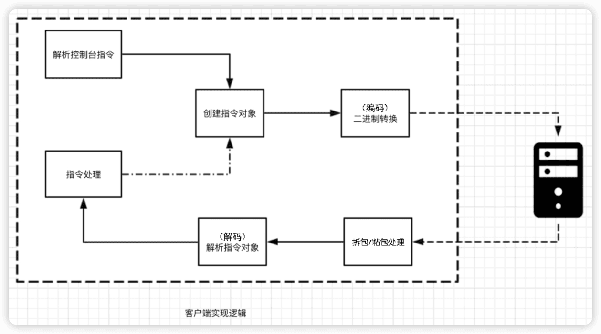
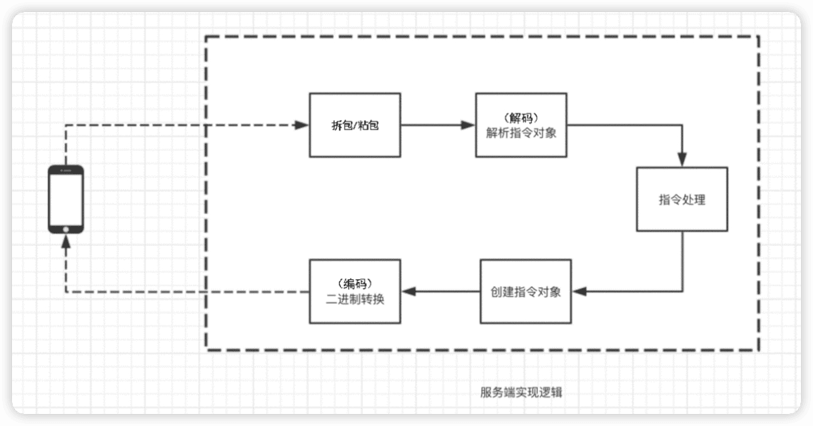
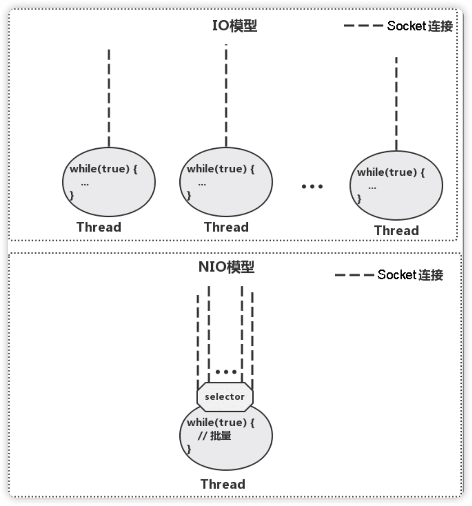

《跟闪电侠学Netty：Netty即时聊天实战与底层原理》笔记
----


> 读源码并不难，难的是迈出这一小步，之后就能通往更广阔的世界。

[netty](https://github.com/netty/netty)

# 前言

Netty是互联网中间件、大数据领域使用最广泛、最核心的网络通信框架。



# 上篇 入门实战

## 1 即时聊天系统简介

Netty是一个异步基于事件驱动的高性能网络通信框架，在互联网中间件领域网络通信层是无可争议的最强王者。

### 1.1 单聊流程

==单聊==指两个用户之间相互聊天。



1. A要和B聊天，首先A和B需要与服务端建立连接，然后进入登录流程，服务端保存用户标识和TCP连接的映射关系。
2. A给B发消息，首先需要将带有B标识的消息数据包发送到服务端，然后服务端从消息数据包中获得B的标识，找到对应B的连接，将消息发送给B。
3. 任意一方发消息给对方，<u>如果对方不在线，则需要将消息缓存，在对方上线之后再发送</u>。

**==指令数据==**包是指客户端与服务端之间相互通信的数据包。指令数据包分为==指令==和==数据==，每一种指令都对应客户端或者服务端的一种**操作**，数据部分对应的是指令处理需要的数据。

### 1.2 单聊的指令

#### 指令图示



#### 指令列表


### 1.3 群聊流程

群聊指一个组内多个用户之间的聊天，一个用户发到群组的消息会被组内任何一个成员接收：



1. A、B、C依然会经历登录流程，服务端保存用户标识对应的TCP连接。
2. A发起群聊的时候，将A、B、C的标识发送至服务端，服务端拿到标识之后建立一个群ID，然后把这个ID与A、B、C的标识绑定。
3. 群聊中任意一方在群里聊天的时候，将群ID发送至服务端，服务端获得群ID之后，取出对应的用户标识，遍历用户标识对应的TCP连接，就可以将消息发送至每一个群聊成员。


### 1.4 群聊要实现的指令集

#### 指令图示



#### 指令列表



### 1.5 Netty

使用Netty统一的IO读写API以及强大的Pipeline来编写业务处理逻辑。

#### 客户端使用Netty的程序逻辑结构



1. 客户端会解析控制台指令，比如发送消息或者建立群聊等指令。
2. 客户端会基于控制台的输入创建一个指令对象，用户告诉服务端具体要干什么事情。
3. TCP通信需要的数据格式为二进制，因此，接下来通过自定义<u>二进制协议</u>将指令对象封装成二进制，这一步被称为**协议的编码**。
4. 对于收到服务端的数据，首先需要截取出一段完整的二进制数据包（拆包/粘包相关的内容）。
5. 将此二进制数据包解析成指令对象，比如收到消息。
6. 将指令对象送到对应的逻辑处理器来处理。


#### 服务端使用Netty的程序逻辑结构




## 2 Netty是什么

### 2.1 IO编程

```java
public class IOServer {
    public static void main(String[] args) throws IOException {
        ServerSocket serverSocket = new ServerSocket(8000);
        //
        new Thread(() -> {
            while (true) {
                try {
                    // 1 阻塞方法获取新连接
                    Socket socket = serverSocket.accept();
                    // 2 为每一个新连接都创建一个新线程，负责读取数据
                    new Thread(() -> {
                        try {
                            int len;
                            byte[] data = new byte[1024];
                            InputStream inputStream = socket.getInputStream();
                            // 3 按字节流方式读取数据
                            while ((len = inputStream.read(data)) != -1) {
                                System.out.println(new String(data, 0, len));
                            }
                        } catch (IOException e) {

                        }
                    }).start();
                } catch (IOException e) {

                }
            }
        }).start();
    }
}
```


```java
public class IOClient {
    public static void main(String[] args) throws IOException {
        new Thread(() -> {
            try {
                Socket socket = new Socket("127.0.0.1", 8000);
                while (true) {
                    try {
                        socket.getOutputStream().write((new Date() + ": hello world").getBytes());
                        Thread.sleep(2000);
                    } catch (Exception e) {

                    }
                }
            } catch (IOException e) {

            }
        }).start();
    }
}
```


### 2.2　NIO编程

#### 线程资源受限



`Selector`

#### 线程切换效率低下

由于NIO模型中线程数量大大降低，因此线程切换效率也大幅度提高。

#### IO读写面向流

IO读写是面向流的，一次性只能从流中读取一字节或者多字节，并且读完之后流无法再读取，需要自己缓存数据。而NIO的读写是面向Buffer的，可以随意读取里面任何字节数据，不需要自己缓存数据，只需要移动读写指针即可。

```java
public class NIOServer {
    public static void main(String[] args) throws IOException {
        Selector serverSelector = Selector.open();
        Selector clientSelector = Selector.open();

        new Thread(() -> {
            try {
                // 对应于IO编程中的服务启动
                ServerSocketChannel listenerChannel = ServerSocketChannel.open();
                listenerChannel.socket().bind(new InetSocketAddress(8000));
                listenerChannel.configureBlocking(false);
                listenerChannel.register(serverSelector, SelectionKey.OP_ACCEPT);

                while (true) {
                    // 监测是否有新连接，1指阻塞的时间为1ms
                    if (serverSelector.select(1) > 0) {
                        Set<SelectionKey> set = serverSelector.selectedKeys();
                        Iterator<SelectionKey> keyIterator = set.iterator();

                        while (keyIterator.hasNext()) {
                            SelectionKey key = keyIterator.next();
                            if (key.isAcceptable()) {
                                try {
                                    // 1）没来一个新连接，不需要创建一个线程，而是直接注册到clientSelector
                                    SocketChannel clientChannel = ((ServerSocketChannel) key.channel()).accept();
                                    clientChannel.configureBlocking(false);
                                    clientChannel.register(clientSelector, SelectionKey.OP_READ);
                                } finally {
                                    keyIterator.remove();
                                }
                            }
                        }
                    }
                }
            } catch (IOException ignored) {
            }
        }).start();

        new Thread(() -> {
            try {
                while (true) {
                    // 2）批量轮询哪些连接有数据可读，1指阻塞的时间为1ms
                    if (clientSelector.select(1) > 0) {
                        Set<SelectionKey> set = clientSelector.selectedKeys();
                        Iterator<SelectionKey> keyIterator = set.iterator();

                        while (keyIterator.hasNext()) {
                            SelectionKey key = keyIterator.next();

                            if (key.isReadable()) {
                                try {
                                    SocketChannel clientChannel = (SocketChannel) key.channel();
                                    ByteBuffer byteBuffer = ByteBuffer.allocate(1024);
                                    // 3）面相Buffer
                                    clientChannel.read(byteBuffer);
                                    byteBuffer.flip();
                                    System.out.println(Charset.defaultCharset().newDecoder().decode(byteBuffer).toString());
                                } finally {
                                    keyIterator.remove();
                                    key.interestOps(SelectionKey.OP_READ);
                                }
                            }
                        }
                    }
                }
            } catch (IOException ignored) {
            }
        }).start();
    }
}
```


1. NIO模型中通常会有两个线程，每个线程都绑定一个==轮询器Selector==。在这个例子中，serverSelector负责轮询是**否有新连接**，clientSelector负责轮询连接是**否有数据可读**。
2. 服务端监测到新连接之后，不再创建一个新线程，而是直接将新连接绑定到clientSelector上，这样就不用IO模型中的1万个while循环死等，参见（1）。
3. clientSelector被一个while死循环包裹着，<u>如果在某一时刻有多个连接有数据可读，那么通过`clientSelector.select(1)`方法可以轮询出来</u>，进而批量处理，参见（2）。
4. 数据的读写面向Buffer，参见（3）。

不建议直接基于JDK原生NIO来进行网络开发：

1. JDK的NIO编程需要了解很多概念，编程复杂，对NIO入门非常不友好，编程模型不友好，ByteBuffer的API简直“反人类”。
2. 对NIO编程来说，一个比较合适的线程模型能充分发挥它的优势，而JDK没有实现，需要自己实现，就连简单的自定义协议拆包都要自己实现。
3. JDK的NIO底层由Epoll实现，该实现饱受诟病的空轮询Bug会导致CPU占用率飙升至100%。
4. 项目庞大之后，自行实现的NIO很容易出现各类Bug，维护成本较高，上面这些代码笔者都不能保证没有Bug。

### 2.3 Netty编程

简单说：Netty封装了JDK的NIO，让你用得更方便，不用再写一大堆复杂的代码了。

官方：Netty是一个异步事件驱动的网络应用框架，用于快速开发可维护的高性能服务端和客户端。


## 3 Netty开发环境配置


## 4 服务端启动流程

### 服务端启动最小化代码

```java
public class NettyServer {
    public static void main(String[] args) {
        // bossGroup表示监听端口，接收新连接的线程组；workerGroup表示处理每一个连接的数据读写的线程组
        NioEventLoopGroup bossGroup = new NioEventLoopGroup();
        NioEventLoopGroup workerGroup = new NioEventLoopGroup();

        // 引导类负责引导服务端的启动工作
        ServerBootstrap serverBootstrap = new ServerBootstrap();
        // 给引导类配置两大线程组
        serverBootstrap.group(bossGroup, workerGroup)
                // 指定IO模型
                .channel(NioServerSocketChannel.class)
                .childHandler(new ChannelInitializer<NioSocketChannel>() {
                    @Override
                    protected void initChannel(NioSocketChannel channel) throws Exception {

                    }
                });
        serverBootstrap.bind(8000);
    }
}
```

- bossGroup表示监听端口，接收新连接的线程组；workerGroup表示处理每一个连接的数据读写的线程组

- 引导类`ServerBootstrap`将引导服务端的启动工作

- 通过`.group(bossGroup,workerGroup)`给引导类配置两大线程组，这个引导类的==线程模型==也就定型了。

- 通过`.channel(NioServerSocketChannel.class)`来指定IO模型

- 调用childHandler()方法，给这个引导类创建一个`ChannelInitializer`，主要是**定义后续每个连接的数据读写，对于业务处理逻辑**。

  `NioSocketChannel`和`NioServerSocketChannel`都是Netty对==NIO类型连接的抽象==，可以与BIO编程模型中的`Socket`和`ServerSocket`两个概念对应。

总结，要启动一个Netty服务端，必须要指定三类属性：==线程模型、IO模型、连接读写处理逻辑==。

### 自动绑定递增端口

serverBootstrap.bind(8000)方法是一个异步方法，调用之后是立即返回的，它的返回值是一个`ChannelFuture`。我们可以给这个ChannelFuture添加一个监听器`GenericFutureListener`，然后在GenericFutureListener的operationComplete方法里，监听端口是否绑定成功。

```java
    private static void bind(final ServerBootstrap serverBootstrap, final int port) {
        serverBootstrap.bind(port).addListener(new GenericFutureListener<Future<? super Void>>() {
            @Override
            public void operationComplete(Future<? super Void> future) throws Exception {
                if (future.isSuccess()) {
                    System.out.println("端口[" + port + "]绑定成功！");
                } else {
                    System.err.println("端口[" + port + "]绑定失败！");
                    bind(serverBootstrap, port + 1);
                }
            }
        });
    }
```


### 服务端启动的其他方法

#### handler()方法

```java
serverBootstrap.handler(new ChannelInitializer<NioServerSocketChannel>() {
  @Override
  protected void initChannel(NioServerSocketChannel ch) throws Exception {
    System.out.println("服务器启动中");
  }
});
```

childHandler()方法用于指定处理新连接数据的读写处理逻辑；handler()方法用于指定在服务端启动过程中的一些逻辑，通常情况下用不到这个方法。

#### attr()方法

```java
serverBootstrap.attr(AttributeKey.newInstance("serverName"), "nettyServer");
```


#### childAttr()方法


#### option()方法


#### childOption()方法


## 5 客户端启动流程

客户端的启动依然需要==线程模型、IO模型，IO业务处理逻辑==。


### 失败重连

指数退避

> 🔖
>
> java: local variables referenced from a lambda expression must be final or effectively final


### 客户端启动的其他方法

#### attr()方法


#### option()方法
