Netty核心技术及源码剖析
---

https://www.bilibili.com/video/BV1DJ411m7NR


## 1 Netty介绍和应用场景

- Netty是一个==异步==的、基于==事件==驱动的网络应用框架，用以快速开发高性能、高可靠性的网络IO程序。

> 同步， 一个请求等待完成才回复。
>
> 异步，一个请求，不想等待回复就可以往下执行；甚至可以在上一个请求没有等到回复情况，再次请求。
>
> 以ajax为例：
>
> 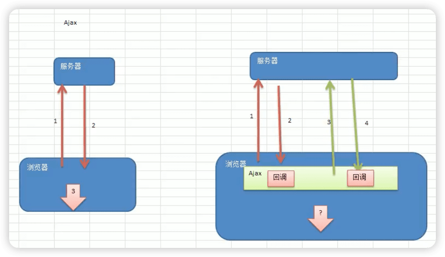

- Netty主要针对在TCP协议下，面向Clients端的高并发应用，或者Peer-to-Peer场景下的大量数据持续传输的应用。

- Netty本质是一个NIO框架，使用于服务器通讯的多种应用场景。NIO是学习基础。

体系：

```
Netty
NIO（io、网络）
原生JDK的IO/网络（Java的IO编程和网络编程）	
TCP/IP
```

### Netty的应用场景

1. 互联网行业

   在分布式系统中，各个节点之间需要远程服务调用，高性能的 RPC框架必不可少，Netty 作为异步高性能的通信框架，往往作为基础通信组件被这些 RPC框架使用。
   
   典型的应用有：阿里分布式服务框架Dubbo的RPC框架使用 Dubbo协议进行节点间通信，Dubbo协议默认使用 Netty 作为基础通信组件，用于实现各进程节点之间的内部通信。
   
2. 游戏行业
   无论是手游服务端还是大型的网络游戏，Java 语言得到了越来越广泛的应用。
   Netty 作为高性能的基础通信组件，提供了 TCP/UDP 和HTTP 协议栈，方便定制和开发私有协议栈，账号登录服务器。
   地图服务器之间可以方便的通过 Netty进行高性能的通信。

3. 大数据领域
   经典的Hadoop的高性能通信和序列化组件([apache/AVRO](https://github.com/apache/avro)， 实现数据文件共享）的RPC框架，默认采用Netty 进行跨界点通信。
   它的 Netty Service 基于Netty框架二次封装实现。

   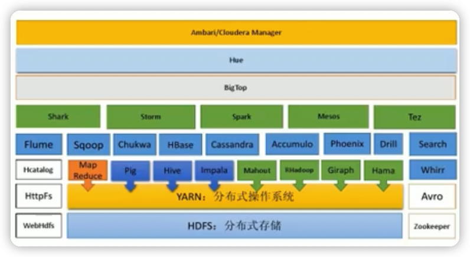

用到netty的开源项目： https://netty.io/wiki/related-projects.html

《Netty in action》，作者是netty主要贡献者，有很多实战例子

《Netty权威指南》，基于Netty5，netty5没有被维护了，主要是netty4

### 学习要求

- 要求已经掌握了Java编程， 主要技术构成： Java OOP编程、Java 多线程编程、Java IO编程、Java 网络编程、常用的Java设计模式（比如观察者模式，命令模式，职责链模式）、常用的数据结构（比如链表）。

- 其中《Netty 核心源码剖析章节》要求最好有项目开发和院读源码的经历。


## 2 BIO

### I/O模型基本说明

- I/O模型简单的理解：就是用什么样的通道进行数据的发送和接收，很大程度决定了程序通信的性能。
- Java共支持3中网络编程模型I/O模式：BIO（java原生IO）、**==NIO==**、AIO
- Java BIO：同步并阻塞（**传统阻塞型**），服务器实现模式为一个连接一个线程，即客户端有连接请求时服务器端就需要启动一个线程进行处理，如果这个连接不做任何事情会造成不必要的线程开销。

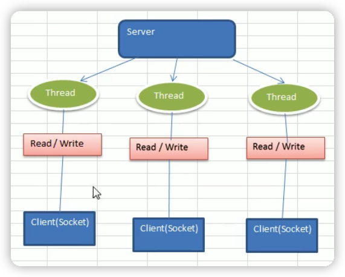

- Java NIO：==同步非阻塞==，服务器实现模式为一个线程处理多个请求（连接），即客服端发送的连接请求都会注册到**多路复用器**（Selector）上，多路复用器轮询到连接有I/O请求就进行处理。

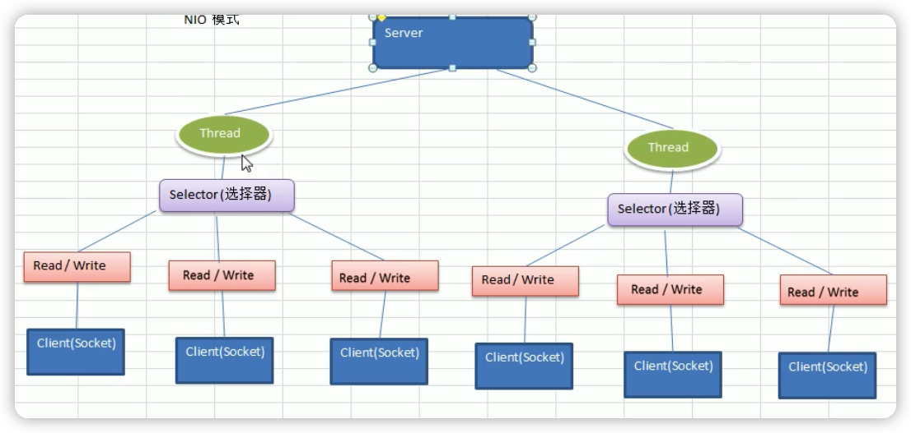

- Java AIO（NIO.2)：异步非阻塞，AIO引入异步通道的概念，采用了 Proactor 模式，简化了程序编写，**有效**的请求才启动线程，它的特点是<u>先由操作系统完成后才通知服务端程序启动线程去处理</u>，一般适用于连接数较多且连接时间较长的应用。

  <u>目前还没有得到广泛使用</u>

### 适用场景 

1. BIO方式适用于**连接数目比较小且固定的架构**，这种方式对服务器资源要求比较高，并发局限于应用中，JDK1.4以前的唯一选择，但程序简单易理解。
2. NIO方式适用于**连接数目多且连接比较短**（轻操作）的架构，比如聊天服务器，弹幕系统，服务器问通讯等。编程比较复杂，JDK1.4开始支持。
3. AIO方式使用于**连接数目多且连接比较长**（重操作）的架构，比如相册服务器，充分调用OS参与并发操作，编程比较复杂，JDK7开始支持。

### BIO基本介绍

BIO（blocking I/O），相关类和接口在`java.io`，同步并阻塞。通过==线程池机制==改善其缺点（实现多个客户连接服务器）。

**BIO编程简单流程：**

1. 服务器端启动一个`ServerSocket`
2. 客户端启动`Socket`对服务器进行通信，默认服务端需要对每个客户建立一个线程与之通信
3. 客户端发出请求后，先**咨询**服务器是否有线程响应，如果没有则会等待，或者被拒绝
4. 如果有响应，客户端线程会等待请求节后，在继续执行

#### Java BIO应用实例

telnet windows和linux、macos不同 🔖

实例说明：

1. 使用BIO模型编写一个服务器端，监听6666端口，当有客户端连接时，就启动一个线程与之通讯。

2. 要求使用线程池机制改善，可以连接多个客户端.

3. 服务器端可以接收客户端发送的数据(telnet方式即可)。

Java BIO问题分析

1. 每个请求都需要创建独立的线程，与对应的客户端进行数据Read业务处理，数据 Write。

2. 当并发数较大时，需要**创建大量线程来处理连接**，系统资源占用较大。

3. 连接建立后，如果当前线程暂时没有数据可读，则线程就阻塞在Read 操作上，造成线程资源浪费。


## 3 NIO

### Java NIO 基本介绍

1. Java NIO 全称 java non-blocking IO，是指JDK 提供的新API。 从JDK1.4 开始，Java提供了一系列改进的输入/输出的新特性，被统称为 NIO(即 New IO)，是==同步非阻塞==的
2. NIO相关类都被放在 `java.nio` 包及子包下，并且对原 `java.io`包中的很多类进行改写。
3. NIO有三大核心部分： **==Channel(通道)，Buffer（缓冲区)，Selector(选择器）==**。

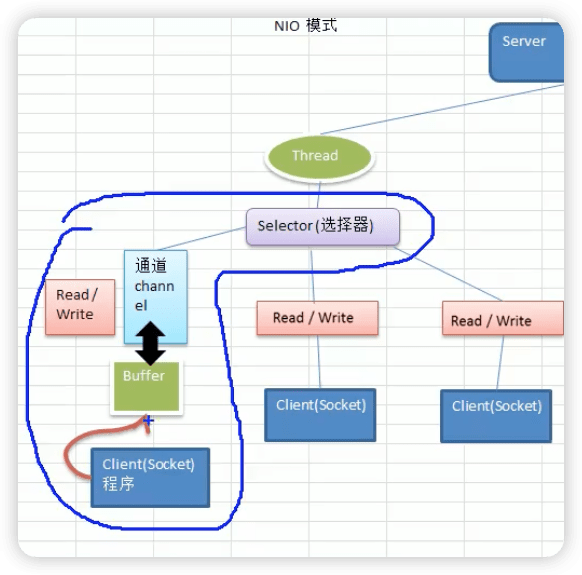

4. NIO是==面向缓冲区==，或者==面向块==编程的。数据读取到一个它稍后处理的缓冲区，需要时可在缓冲区中前后移动，这就增加了处理过程中的灵活性，使用它可以提供非阻塞式的高伸缩性网络。

5. Java NIO的非阻塞模式，使一个线程从某通道发送请求或者读取数据，但是它仅能得到目前可用的数据，如果目前没有数据可用时，就什么都不会获取，而==不是保持线程阻塞==，所以直至数据变的可以读取之前，该线程可以继续做其他的事情。 非阻塞写也是如此，一个线程请求写入一些数据到某通道，但不需要等待它完全写入，这个线程同时可以去做别的事情。

6. 通俗理解：NIO是可以做到用一个线程来处理多个操作的。假设有10000个请求过来，根据实际情況，可以分配50或者100个线程来处理。不像之前的阻塞10那样，非得分配10000个。

7. HTTP2.0使用了多路复用的技术，做到同一个连接并发处理多个请求，而且并发请求的数量比HTTP1.1大了好几个数量级。

#### NIO和BIO的比较

1. BIO以流的方式处理数据,而NIO以块的方式处理数据,块I/O的效率比流I/O高很多。

2. BIO是阻塞的，NIO则是非阻塞的
3. BIO基于字节流和字符流进行操作，而 NIO 基于 Channel(通道)和 Buffer(缓冲区)进行操作，数据总是从通道读取到缓冲区中，或者从缓冲区写入到通道中。Selector(选择器)用于监听多个通道的事件（比如：连接请求，数据到达等），因此使用单个线程就可以监听多个客户端通道。


#### NIO三大核心关系

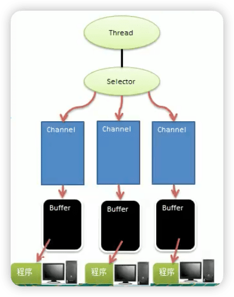

1. 每个channel都会对应一个buffer
2. 一个Selector对应一个线程，一个线程对应多个channel（可以理解为链接）
3. 上图反应了有三个channel注册到该Selector
4. 程序切换到哪个channel是由事件决定的，`Event`就是一个重要概念
5. Selector会根据不同的事件，在各个通道上切换
6. Buffer就是一个内存块，底层是有一个数组
7. 数据的读取写入都是通过Buffer（需要flip方法切换），这和BIO不同，BIO中要么是输入流，要么是输出流，不能双向。
8. channel是双向的，可以返回底层操作系统的情况，比如linux底层的操作系统通道就是双向的。


### 缓冲区(Buffer)

基本介绍

缓冲区（Buffer）：缓冲区本质上是一个可以读写数据的内存块，可以理解成是一个==容器对象(含数组)==，该对象提供了==一组方法==，可以更轻松地使用内存块，，缓冲区对象内置了一些机制，能够跟踪和记录缓冲区的状态变化情况。Channel 提供从文件、网络读取数据的渠道，但是读取或写入的数据都必须经由 Buffer，如图：

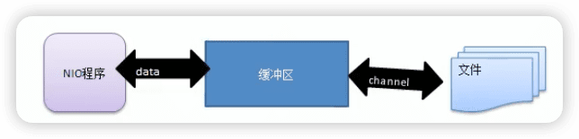

#### Buffer类及其子类

1. 在NIO中，Buffer是一个顶层父类，它是一个抽象类：

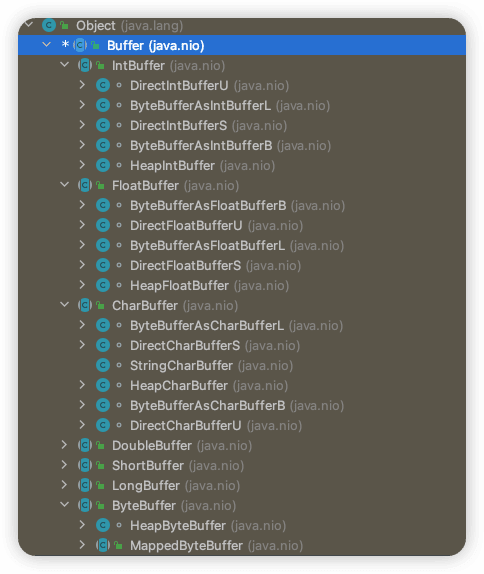

2. Buffer类定义了所有的缓冲区都具有的四个属性

```java
    private int mark = -1;  // 标记
    private int position = 0; // 位置，下一个要被读或写的元素索引，每次读写缓冲区数据时都会改变这个值，为下一次读写做准备
    private int limit;  // 表示缓冲区的当前终点，不能对缓冲区超过极限的位置进行读写操作。可以修改
    private int capacity;  // 容量，即可以容纳的最大数据量；在缓冲区创建时设定并且不能改变
```


```java
    public final Buffer flip() {
        limit = position;
        position = 0;
        mark = -1;
        return this;
    }
```

3. Buffer类相关方法

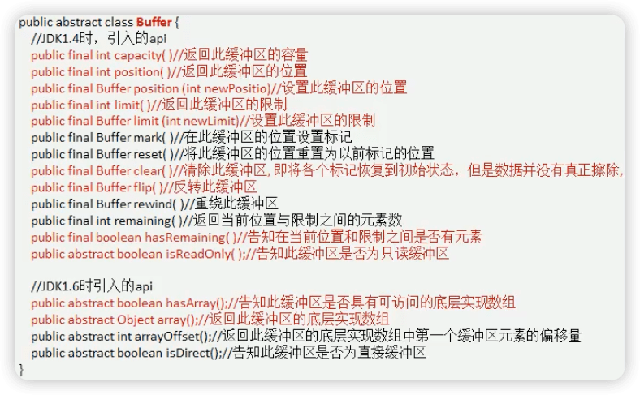


`ByteBuffer`

Java中的基本类型（boolean除外），都有一个Buffer类型与之相对应。最常用的自然是`ByteBuffer`类（二进制数据），主要方法：

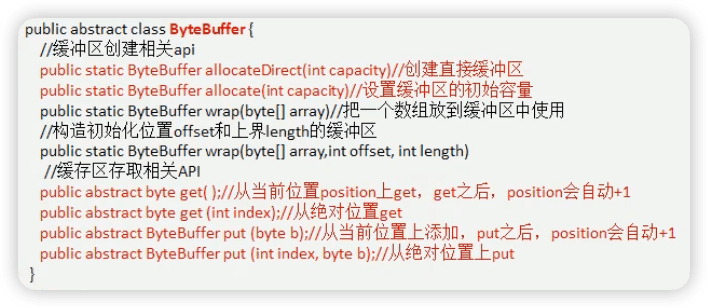

### 通道（Channel）

#### 基本介绍

1. NIO的通道类似于流，但有些区别如下:
   - 通道可以同时进行读写，而流只能读或者只能写 
   - 通道可以实现异步读写数据
   - 通道可以从缓冲读数据，也可以写数据到缓冲

2. BIO 中的 stream 是单向的，例如 `FileInputStream` 对象只能进行读取数据的操作，而 NIO 中的通道 (Channel)是双向的，可以读操作，也可以写操作。

3. Channel在NIO中是一个接口

   ```java
   public interface Channel extends Closeable {
       public boolean isOpen();
   
       public void close() throws IOException;
   }
   ```

   

4. 常用的Channel类有:`FileChannel`、 `DatagramChannel`、`ServerSocketChannel`（类似 ServerSocket） 和 `SocketChannel`（类似Socket）。

```
Server 【ServerSocketChannel】
Thread
Selector
Channel 【SocketChannel】
Buffer
Client
```


5. FileChannel 用于文件的数据读写， DatagramChannel 用于 UDP的数据读ServerSocketChannel 和 SocketChannel 用于 TCP 的数据读写。

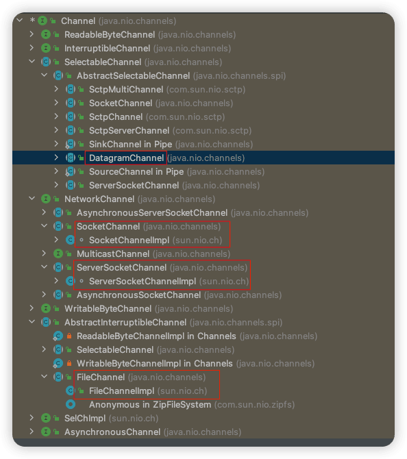

#### FileChannel 

FileChannel主要用来对本地文件进行 IO 操作，常见的方法有

1. `public int read(ByteBuffer dst)` ，从通道读取数据并放到缓冲区中
2. `public int write(ByteBuffer src)` ，把缓冲区的数据写到通道中
3. `public long transferFrom(ReadableByteChannel src, long position, long count)`，从目标通道中复制数据到当前通道
4. `public long transferTo(long position, long count, WritableByteChannel target)`，把数据从当前通道复制给目标通道

#### 案例

##### 1 本地文件写数据

```java
String str = "hello，中国";
// 创建一个输出流，用于之后被Channel包含
FileOutputStream fileOutputStream = new FileOutputStream("file01.txt");

// 通过fileOutputStream获取对应的FileChannel。这个FileChannel真实类型是FileChannelImpl
FileChannel fileChannel = fileOutputStream.getChannel();

// 创建一个缓冲区ByteBuffer
ByteBuffer byteBuffer = ByteBuffer.allocate(1024);

// 将str放入byteBuffer
byteBuffer.put(str.getBytes());

// 对byteBuffer进行flip
byteBuffer.flip();

// 将byteBuffer数据写入到fileChannel
fileChannel.write(byteBuffer);

fileOutputStream.close();
```

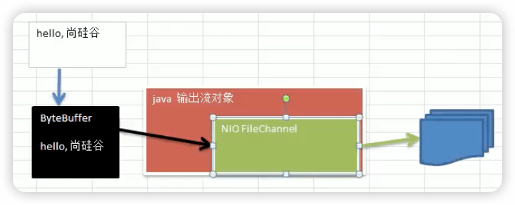

可以理解在原生的输出流中内置了一个通道channel：

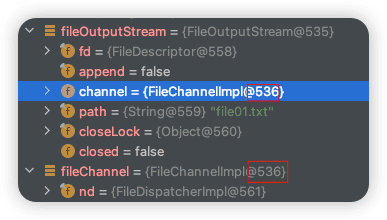

##### 2 本地文件读数据

```java
// 创建文件的输入流
File file = new File("file01.txt");
FileInputStream fileInputStream = new FileInputStream(file);

// 通过FileInputStream获取对应的FileChannel
FileChannel fileChannel = fileInputStream.getChannel();

// 创建缓冲区
ByteBuffer byteBuffer = ByteBuffer.allocate((int) file.length());

// 将通道的数据读入到Buffer
fileChannel.read(byteBuffer);

// 将byteBuffer的字节数据转换为String
System.out.println(new String(byteBuffer.array()));

fileInputStream.close();
```


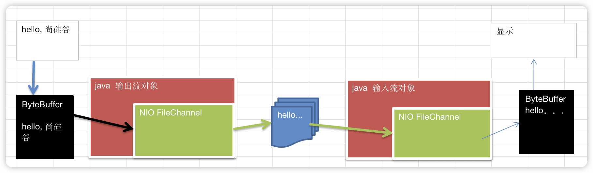


##### 3 使用一个Buffer完成文件读取和写入

使用FileChannel(通道)和方法read,write，完成文件的拷贝

```java
 FileInputStream fileInputStream = new FileInputStream("1.txt");
FileChannel fileChannel01 = fileInputStream.getChannel();

FileOutputStream fileOutputStream = new FileOutputStream("2.txt");
FileChannel fileChannel02 = fileOutputStream.getChannel();

ByteBuffer byteBuffer = ByteBuffer.allocate(512);

while (true) { // 循环读取
  // 清空buffer（重置一些数据）
  // 如果没有这一步，就会出现postion和limit相同的情况，然后read就一直等于0，不会出现-1的情况
  byteBuffer.clear();

  int read = fileChannel01.read(byteBuffer);
  System.out.println("read = " + read);
  if (read == -1) { // 表示读完
    break;
  }
  // 将buffer中数据写入到 fileChannel02  -- 2.txt
  byteBuffer.flip();
  fileChannel02.write(byteBuffer);

}

fileInputStream.close();
fileOutputStream.close();
```


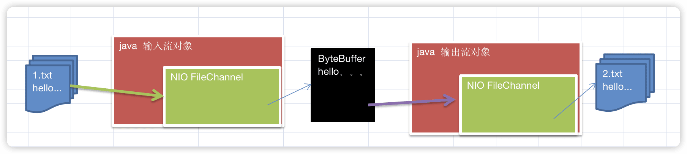

##### 4 拷贝文件**transferFrom** 方法

使用FileChannel(通道)和方法transferFrom，完成文件的拷贝(拷贝一张图片)

```java
FileInputStream fileInputStream = new FileInputStream("andy.png");
FileOutputStream fileOutputStream = new FileOutputStream("andy_copy.png");

FileChannel sourceCh = fileInputStream.getChannel();
FileChannel destCh = fileOutputStream.getChannel();

destCh.transferFrom(sourceCh, 0, sourceCh.size());

// 关闭通道和流
sourceCh.close();
destCh.close();
fileInputStream.close();
fileOutputStream.close();
```

#### 关于**Buffer** 和 **Channel**的注意事项和细节

1. ByteBuffer支持类型化的put和get,put放入的是什么数据类型，get就应该使用 相应的数据类型来取出，否则可能有 `BufferUnderflowException` 异常。

```java
ByteBuffer buffer = ByteBuffer.allocate(64);

// 类型化方式放入数据
buffer.putInt(100);
buffer.putLong(9);
buffer.putChar('上');
buffer.putShort((short) 5);

buffer.flip();

// 这里取出方法和顺序要对应，否则取出结果不对（溢出等问题）或者BufferUnderflowException异常
System.out.println(buffer.getInt());
System.out.println(buffer.getLong());
System.out.println(buffer.getChar());
System.out.println(buffer.getShort());
```

2. 可以将一个普通Buffer 转成只读Buffer（`HeapByteBufferR`）。否则`ReadOnlyBufferException`异常

```java
ByteBuffer buffer = ByteBuffer.allocate(64);

for (int i = 0; i < 64; i++) {
  buffer.put((byte) i);
}
// 转读取
buffer.flip();

// 得到一个只读的buffer
ByteBuffer readOnlyBuffer = buffer.asReadOnlyBuffer();
System.out.println(readOnlyBuffer.getClass());  // HeapByteBufferR

// 读取
while (readOnlyBuffer.hasRemaining()) {
  System.out.println(readOnlyBuffer.get());
}

readOnlyBuffer.put((byte) 100); // ReadOnlyBufferException
```

3. NIO还提供了`MappedByteBuffer`，可以让文件直接在内存(堆外的内存)中进行修改， 而如何同步到文件由NIO 来完成。

```java
RandomAccessFile randomAccessFile = new RandomAccessFile("1.txt", "rw");
FileChannel channel = randomAccessFile.getChannel();

/*
   参数1：使用的读写模式
   参数2：可以直接修改的起始位置
   参数3：映射到内存的大小（即将1.txt中5个字节映射到内存，也就是说可以直接修改的范围是[0-50)）
 */
MappedByteBuffer mappedByteBuffer = channel.map(FileChannel.MapMode.READ_WRITE, 0, 5);

mappedByteBuffer.put(0, (byte) 'W');
mappedByteBuffer.put(3, (byte) '7');

randomAccessFile.close();
```

4. 前面我们讲的读写操作，都是通过一个Buffer完成的，NIO还支持==通过多个Buffer(即 Buffer 数组) 完成读写操作==，即 Scattering（分散） 和 Gathering（聚合） 

Scattering（分散）：将数据写入到buffer时，可以采用buffer数组，依次写入

Gathering（聚合）：从buffer读取数据时，可以采用buffer数组，依次读取


### **Selector(**选择器**)**

#### 基本介绍

1. Java 的 NIO，用非阻塞的IO方式。可以用一个线程，处理多个的客户端连接，就会使用到**Selector(**选择器**)**
2. ==Selector能够检测多个注册的通道上是否有事件发生**(**注意**:**多个**Channel**以事件的方式可以注册到同一个**Selector)**==，如果有事件发生，便获取事件然 后针对每个事件进行相应的处理。这样就可以只用一个单线程去管理多个 通道，也就是管理多个连接和请求。

3. 只有在 **连接/通道** 真正有读写事件发生时，才会进行读写，就大大地减少了系统开销，并且不必为每个连接都创建一个线程，不用去维护多个线程。
4. 避免了多线程之间的上下文切换导致的开销。

特点再说明:

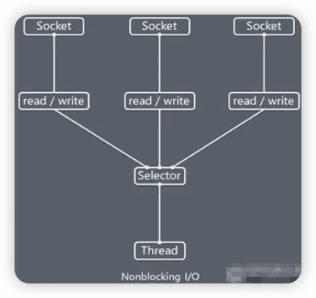

1) Netty 的 IO 线程 `NioEventLoop` 聚合了 Selector(选择器，也叫多路复用器)，可以同时并发处理成百上千个客户端连接。
2) 当线程从某客户端Socket通道进行读写数据时，若没
    有数据可用时，该线程可以进行其他任务。
3) 线程通常将非阻塞IO的空闲时间用于在其他通道上 执行 IO 操作，所以单独的线程可以管理多个输入和
输出通道。
4) 由于读写操作都是非阻塞的，这就可以充分提升IO线程的运行效率，避免由于频繁I/O阻塞导致的线程挂起。
5) 一个I/O线程可以并发处理N个客户端连接和读写操作，这从根本上解决了传统同步阻塞 I/O 一连接一线程模型，架构的性能、弹性伸缩能力和可靠性都得到了极大的提升。


#### **Selector**类相关方法

Selector 类是一个抽象类, 常用方法和说明如下:

```java
public abstract class Selector implements Closeable {
	public static Selector open();  // 得到一个选择器对象
 	public int select(long timeout);  // 监控所有注册的通道，当其中有IO操作可以进行时，将对应的SelectionKey加入到内部集合中并返回，参数用来设置超时时间
 	public Set<SelectionKey> selectedKeys();  // 从内部集合中得到所有的SelectionKey
}
```

🔖 p22

注意事项

- NIO中的ServerSocketChannel功能类似ServerSocket，SocketChannel功能类似Socket

- selector相关方法说明

selector.select()//阻塞 

selector.select(1000);//阻塞1000毫秒，在1000毫秒后返回 

selector.wakeup();//唤醒selector 

selector.selectNow();//不阻塞，立马返还


### **NIO**非阻塞网络编程原理分析图

NIO非阻塞网络编程相关的(Selector、SelectionKey、ServerScoketChannel和SocketChannel)关系梳理图：


图说明：

1. 当客户端连接时，会通过`ServerSocketChannel`得到`SocketChannel`。
2. Selector进行监听select 方法, 返回有事件发生的通道的个数。
3. 将SocketChannel注册到Selector上, `register(Selector sel, **int** ops)`， 一个 selector上可以注册多个SocketChannel。

3. 注册后返回一个`SelectionKey`, 会和该 Selector 关联(集合的方式关联)。
4. 进一步得到各个 SelectionKey (有事件发生)。
5. 再通过SelectionKey 反向获取 SocketChannel，方法 channel()。
6. 可以通过得到的channel，完成业务处理。


**代码案例**：**NIO**非阻塞网络编程快速入门

案例要求：编写一个NIO入门案例，实现服务器端和客户端之间的数据简单通讯(非阻塞) 

目的：理解NIO非阻塞网络编程机制

```java
/**
 * NIO非阻塞网络编程快速入门
 * @author andyron
 **/
public class NIOServer {
    public static void main(String[] args) throws Exception {
        // 创建 ServerSocketChannel
        ServerSocketChannel serverSocketChannel = ServerSocketChannel.open();
        // 得到一个Selector对象
        Selector selector = Selector.open();
        // 绑定一个端口6666，在服务器监听
        serverSocketChannel.socket().bind(new InetSocketAddress(6666));
        // 设置为非阻塞
        serverSocketChannel.configureBlocking(false);

        // 把ServerSocketChannel注册到Selector，关心的事件为OP_ACCEPT
        serverSocketChannel.register(selector, SelectionKey.OP_ACCEPT);

        // 循环等待客户连接
        while (true) {
            // 这里等待1秒，如果没有事件发生，返回
            if (selector.select(1000) == 0) { // 没有事件发生
                System.out.println("服务器等待了1秒，无连接");
                continue;
            }

            // 如果返回>0，表示已经获取到关注的事件
            // selector.selectedKeys()就获取到相关事件selectionKey的集合
            // 通过SelectionKey反向获取通道
            Set<SelectionKey> selectionKeys = selector.selectedKeys();

            Iterator<SelectionKey> keyIterator = selectionKeys.iterator();
            while (keyIterator.hasNext()) {
                SelectionKey key = keyIterator.next();
                // 根据key对应的通道发生的事件做相应处理
                if (key.isAcceptable()) { // 如果是OP_ACCEPT，就是有新的客户端连接
                    // 为该客户端生成一个SocketChannel
                    SocketChannel socketChannel = serverSocketChannel.accept(); // 本身accept方法是阻塞的，但NIO是事件驱动的，到这里已经表示有客户端连接，这个方法会马上执行

                    System.out.println("客户端连接成功，生产了一个socketChannel " + socketChannel.hashCode());

                    // 将socketChannel设置为非阻塞
                    socketChannel.configureBlocking(false);
                    // 将socketChannel注册到selector，关注事件为OP_READ，同时给socketChannel关联一个buffer
                    socketChannel.register(selector, SelectionKey.OP_READ, ByteBuffer.allocate(1024));
                }

                if (key.isReadable()) {  // 如果是OP_READ事件
                    // 通过key反向获取到对应Channel
                    SocketChannel channel = (SocketChannel) key.channel();
                    // 获取到该channel关联的buffer
                    ByteBuffer buffer = (ByteBuffer) key.attachment();
                    channel.read(buffer);
                    System.out.println("from 客户端 " + new String(buffer.array()));
                }

                // 手动从集合中移除当前的selectionKey，防止重复操作
                keyIterator.remove();
            }
        }
    }
}
```

```java
public class NIOClient {
    public static void main(String[] args) throws Exception {
        SocketChannel socketChannel = SocketChannel.open();
        // 设置非阻塞
        socketChannel.configureBlocking(false);
        // 提供服务器端的ip和端口
        InetSocketAddress inetSocketAddress = new InetSocketAddress("127.0.0.1", 6666);
        // 链接服务器
        if (!socketChannel.connect(inetSocketAddress)) {
            while (!socketChannel.finishConnect()) {
                System.out.println("因为链接需要时间，客户端不会阻塞，可以做其它工作...");
            }
        }

        // 如果连接成功，就发送数据
        String str = "hello，中国";
        // wrap方法不必具体指定buffer容量
        ByteBuffer buffer = ByteBuffer.wrap(str.getBytes());
        // 发送数据，将buffer数据写入channel
        socketChannel.write(buffer);

        //
        System.in.read();
    }
}

```


### SelectionKey


### ServerSocketChannel


### SocketChannel


### **NIO**网络编程应用实例**-**群聊系统


### **NIO**与零拷贝


## 4 Netty概述


## 5 Netty高性能架构设计


## 6 Netty核心模块组件


## 7 Google Protobuf


## 8 Netty编解码器和handler的调用机制


## 9 TCP粘包和拆包及解决方案


## 10 Netty核心源码剖析


## 11 用Netty实现doubbo RPC

