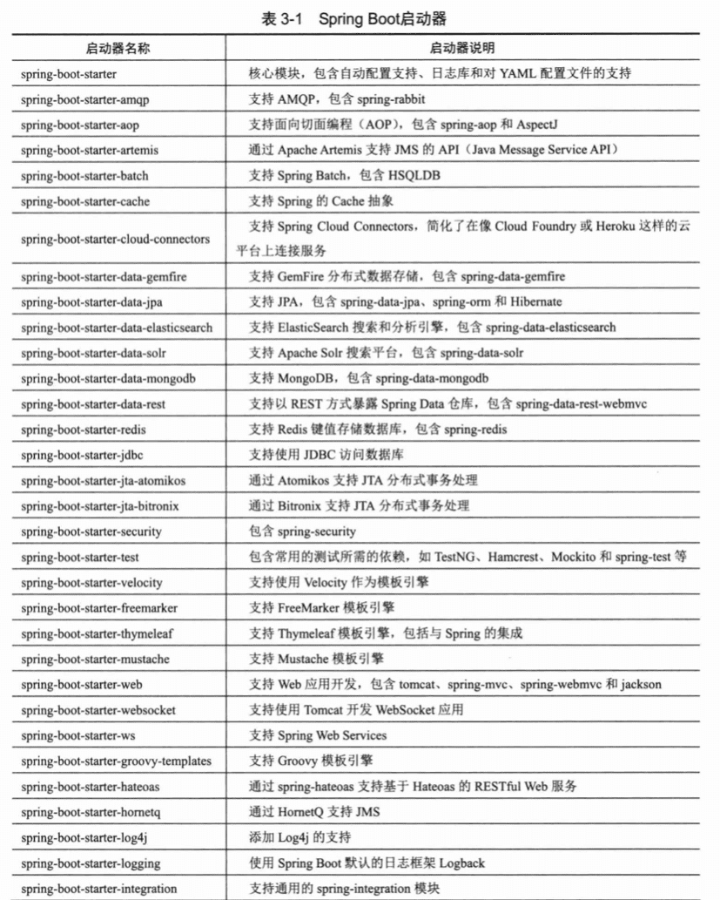
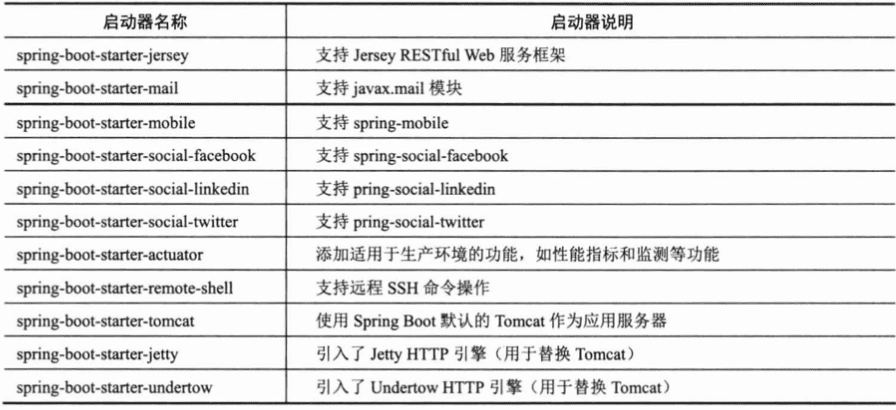

## [《精通Spring 4.x 企业开发应用实战》](https://book.douban.com/subject/26952826/)笔记

http://pan.baidu.com/s/1boC13d1

Java SK 7.0+

Intllij IDEA

Maven

书中源码下载地址：[《spring 4.x 企业应用开发实战》读者问题收集 ](https://my.oschina.net/stamen/blog/860511)


### 1.Spring概述

Rod Johnson

SpringSource公司


#### Spring体系结构

4000+个类，5个模块


### Spring子项目

http://spring.io/projects


### 2-快速入门

#### 2.1 实例概述


#### 2.2 环境准备

##### 构建工具Maven


##### 创建库表

用户表：

```mysql
create table t_user (
       user_id int auto_increment primary key,
       user_name varchar(30),
    	 credits int,
    	 password varchar(32),
       last_visit datetime,
       ast_ip varchar(32)
       )engine=InnoDB;

```

用户登录日志表：

```mysql
Create Table t_login_log (
  login_log_id int auto_increment primary key,
  user_id int,
  ip varchar(23),
  login_datetime datetime
)engine=InnoDB;
```


##### 2.2.4 类包及Spring配置文件规划


#### 2.3 持久层

**DAO**（Data Access Object，数据访问对象）

**DO**（Domain Object，领域对象，即业务实体对象）

**PO**（Persistent Object，持久化对象，表示持久层的数据结构，入数据库表）

**VO**（View Object，视图对象）

**DTO**（Data Transfer Object，数据传输对象）


##### 2.3.4  在Spring中装备DAO

DBCP 数据库连接池


Spring很好地将注解配置和XML配置统一起来。


#### 2.4 业务层

业务类`UserService`负责将持久层的`UserDao`和`LoginLogDao`组织起来，完成用户/密码认证、登录日志记录等操作。

2.4.3 ??


#### 2.5 展示层


POJO（Plain Ordinary Java Object）简单的Java对象，实际就是普通JavaBeans，是为了避免和EJB混淆所创造的简称。


### 3 Spring Boot

Groovy





