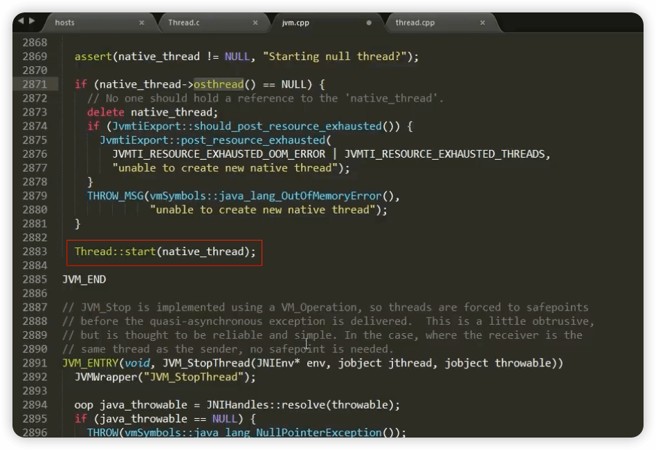
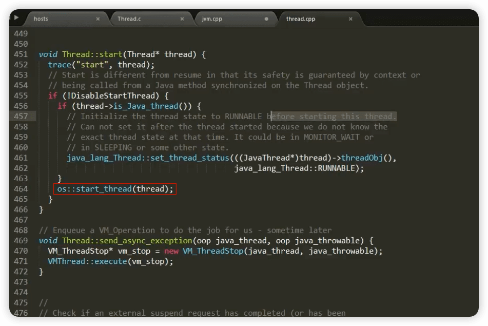
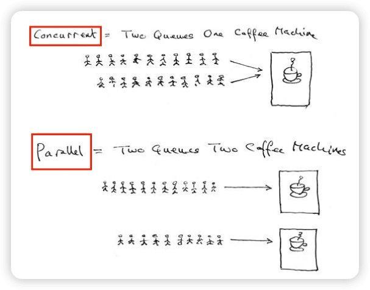
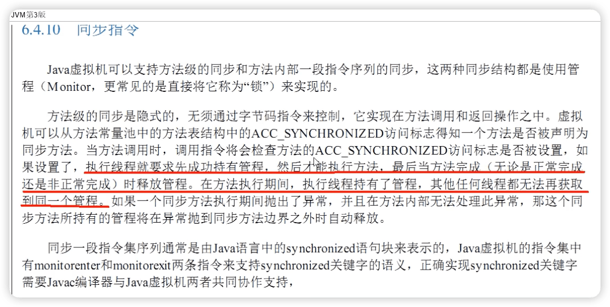
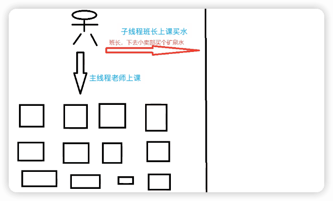
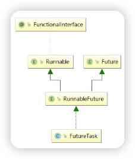

JUC并发编程与源码分析
----
尚硅谷 [JUC并发编程与源码分析](https://www.bilibili.com/video/BV1ar4y1x727)


[脑图](https://www.yuque.com/liuyanntes/vx9leh/fpy93i?inner=lwUQY)

https://tangzhi.blog.csdn.net/article/details/109210095


Doug Lea JUC作者

## 2 线程基础知识复习

### 为什么学习并用好多线程及其重要

#### 硬件方面

摩尔定律失效 

摩尔定律：

它是由英特尔创始人之—Gordon Moore(戈登 •摩尔)提出来的。其内容为：

当价格不变时，集成电路上可容纳的元器件的数目约每隔18-24个月便会增加一倍，性能也将提升一倍。

换言之，每一美元所能买到的电脑性能，将每隔18-24个月翻一倍以上。这一定律揭示了信息技术进步的速度。

可是从2003年开始CPU主顿已经不再翻信，而是采用多核而不是更快的主频。

==摩尔定律失效了==

在主频不再提高且核数在不断增加的情况下，要想让程序更快就要用到**==并行或并发编程==**。

#### 软件方面

- 充分利用多核处理器
- 提高程序性能，高并发系统
- 提高程序吞吐量，异步+回调等生产需求

#### 弊端及问题

- 线程安全性问题

  i++

  集合类安全否

- 线程锁问题

- 线程性能问题


### 从start一个线程说起


#### 涉及OpenJDK源码

[openjdk8/jdk/src/share/native/java/lang/thread.c](https://hg.openjdk.org/jdk8u/jdk8u/jdk/file/7fcf35286d52/src/share/native/java/lang/Thread.c)

[openjdk8/hotspot/src/share/vm/prims/jvm.cpp](https://hg.openjdk.org/jdk8u/jdk8u/hotspot/file/69087d08d473/src/share/vm/prims/jvm.cpp)

[openjdk8/hotspot/src/share/vm/runtime/thread.cpp](https://hg.openjdk.org/jdk8u/jdk8u/hotspot/file/69087d08d473/src/share/vm/runtime/thread.cpp)

java线程是通过start的方法法启动执行的，主要内容在native方法`start0()`，openjdk的与JNI一般是一一对应的，Thread.java对应的就是Thread.c，`start0`其实就是JVM_StartThread。此时查看源代码可以看到在jvm.h中找到了声明，jvm.cpp中有实现。

```C
static JNINativeMethod methods[] = {
    {"start0",           "()V",        (void *)&JVM_StartThread},
    {"stop0",            "(" OBJ ")V", (void *)&JVM_StopThread},
    {"isAlive",          "()Z",        (void *)&JVM_IsThreadAlive},
    {"suspend0",         "()V",        (void *)&JVM_SuspendThread},
    {"resume0",          "()V",        (void *)&JVM_ResumeThread},
    {"setPriority0",     "(I)V",       (void *)&JVM_SetThreadPriority},
    {"yield",            "()V",        (void *)&JVM_Yield},
    {"sleep",            "(J)V",       (void *)&JVM_Sleep},
    {"currentThread",    "()" THD,     (void *)&JVM_CurrentThread},
    {"countStackFrames", "()I",        (void *)&JVM_CountStackFrames},
    {"interrupt0",       "()V",        (void *)&JVM_Interrupt},
    {"isInterrupted",    "(Z)Z",       (void *)&JVM_IsInterrupted},
    {"holdsLock",        "(" OBJ ")Z", (void *)&JVM_HoldsLock},
    {"getThreads",        "()[" THD,   (void *)&JVM_GetAllThreads},
    {"dumpThreads",      "([" THD ")[[" STE, (void *)&JVM_DumpThreads},
    {"setNativeName",    "(" STR ")V", (void *)&JVM_SetNativeThreadName},
};
```





`os::start_thread(thread);`表示多线程是操作系统范畴，与语言无关。

### Java多线程相关概念

#### 1把锁

synchronized

#### 2个并

##### 并发concurrent

抢票、秒杀

- 是在同一实体上的多个事件
- 是在一台处理器上”同时“处理多个任务
- 同一个时刻，其实是只有一个事件在发生

##### 并行parallel

- 是在不同实体上的多个事件
- 是在多台处理器上同时处理多个任务
- 同一个时刻大家真的都在做事情，你做你的，我做我的

泡方便面：撕调料包和烧热水同时在做



#### 3个程

##### 进程

简单的说，在系统中运行的一个应用程序就是一个进程，每一个进程都有它自己的**内存空间和系统资源**。

##### 线程

也被称为==轻量级进程==，在同一个进程内会有1个或多个线程，是大多数操作系统进行时序调度的**基本单元**。

> 进程和线程的概念都是来源于操作系统，和语言关系不大。

##### 管程

Monitor（监视器），也就是我们平时所说的==锁==。

Monitor其实是一种==同步机制==，他的义务是保证（同一时间）只有一个线程可以访问被保护的数据和代码。https://time.geekbang.org/

JVM中同步是基于进入和退出监视器对象(Monitor,==管程对象==)来实现的，每个对象实例都会有一个Monitor对象：

```java
Object o = new Object();
new Thread(() -> {
  synchronized (o) {

  }
}, "t1").start();
```

Monitor对象会和Java对象一同创建并销毁，它底层是由C++语言来实现的。

《深入理解Java虚拟机（第3版）》：



### 用户线程和守护线程

Java中线程分两种：用户线程和守护线程。

一般情况下不做特别说明配置，==默认都是用户线程（User Thread）==（就是用户自己new出的线程，mian主线程也是），它是系统的工作线程，它会完成这个程序需要完成的业务操作。

==守护线程（Daemon Thread）==（用户线程的影子）是一种特殊的线程==为其它线程服务的==，在后台默默地完成一些系统性的服务，比如**垃圾回收线程**就是最典型的例子。

守护线程作为一个服务线程，没有服务对象就没有必要继续运行了，如果用户线程全部结束了，意味着程序需耍完成的业务操作包经结束了，系统可以退出了。所以假如当系统只剩下守护线程的时候，java虚拟机会自动退出。

`setDaemon(true)`必须在`start()`之前设置，否则`IllegalThreadStateException`异常。

`isDaemon()`判断是否是守护线程。

## 3 CompletableFuture

### Future接口理论知识

`Future`接口（俗称异步任务接口）(`FutureTask`实现类)定义了操作==异步任务==执行一些方法，如**获取异步任务的执行结果、取消任务的妆行、判断任务是否被取消、判断任务执行是否完毕**等。

```java
public interface Future<V> {
    boolean cancel(boolean mayInterruptIfRunning);
    boolean isCancelled();
    boolean isDone();
    V get() throws InterruptedException, ExecutionException;
    V get(long timeout, TimeUnit unit) throws InterruptedException, ExecutionException, TimeoutException;
}
```

比如主线程让一个子线程去执行任务，子线程可能比较耗时，启动子线程开始执行任务后，主线程就去做其他事情了，忙其它事情或者先执行完，过了一会才去获取子任务的执行结果或变更的任务状态。

案例说明：上课买水



总结：Future接口可以为主线程开一个分支任务，专门为主线程处理耗时和费力的复杂业务。

### Future接口常用实现类FutureTask异步任务

#### Future接口能干什么

Future是Java5新加的一个接口，它提供了一种==异步并行计算==的功能。

如果主线程需要执行一个很耗时的计算任务，我们就可以通过future把这个任务放到异步线程中执行。

主线程继续处理其他任务或者先行结束，再通过Future获取**计算结果**。


代码说话：

`Runnable`接口

`Callable`接口

`Future`接口和`FutureTask`实现类

目的：异步多线程任务执行且返回有结果，三个特点：==多线程/有返回/异步任务==〔班长为老师去买水作为新启动的异步多线程任务且买到水有结果返回）

> Runnable与Callable区别：是否有返回值，是否抛出异常。
>
> ```java
> class MyThread implements Runnable {
> 
>     @Override
>     public void run() {
> 
>     }
> }
> 
> class MyThread2 implements Callable<String> {
> 
>     @Override
>     public String call() throws Exception {
>         return null;
>     }
> }
> ```

问题：Thread构造方法中只有 `Runnable`（`public Thread(Runnable target, String name)`），不能满足**有返回/异步任务** 的需求。

解决过程：`Runnable`有子接口`RunnableFuture`，其有实现类`FutureTask`，这个实现类又能通过构造器注入`Callable`。

```java
FutureTask(Callable<V> callable)
```



`FutureTask`就解决上面三个需求

```java
public class CompletableFutureDemo {
    public static void main(String[] args) throws ExecutionException, InterruptedException {
        FutureTask<String> futureTask = new FutureTask<>(new MyThread());

        Thread t1 = new Thread(futureTask, "t1");
        t1.start();

        // 获取返回
        System.out.println(futureTask.get());
    }
}
class MyThread implements Callable<String> {

    @Override
    public String call() throws Exception {
        System.out.println("---- come in call()");
        return "hello Callable";
    }
}
```

```
---- come in call()
hello Callable
```


#### Future编码实战和优缺点分析

##### 优点

优点：future+线程池异步多线程任务配合，能显著提高程序的执行效率。

P11 🔖

```java
public class FutureThreadDemo {
    public static void main(String[] args) throws ExecutionException, InterruptedException {
        // 3个任务，目前开启多个异步任务线程来处理，请问耗时多少？ 如果没有需要返回结果约340ms，需要返回结构约840ms+

        // 使用有3个线程的线程池，能够复用。减少使用new来创建
        ExecutorService threadPool = Executors.newFixedThreadPool(3);

        long startTime = System.currentTimeMillis();

        FutureTask<String> futureTask1 = new FutureTask<>(() -> {
            try { TimeUnit.MILLISECONDS.sleep(500); } catch (InterruptedException e) { e.printStackTrace(); }
            return "task1 over";
        });
        threadPool.submit(futureTask1);

        FutureTask<String> futureTask2 = new FutureTask<>(() -> {
            try { TimeUnit.MILLISECONDS.sleep(300); } catch (InterruptedException e) { e.printStackTrace(); }
            return "task2 over";
        });
        threadPool.submit(futureTask2);

        System.out.println(futureTask1.get());
        System.out.println(futureTask2.get());

        // main 线程
        try { TimeUnit.MILLISECONDS.sleep(300); } catch (InterruptedException e) { e.printStackTrace(); }

        long endTime = System.currentTimeMillis();
        System.out.println("----costTime: " + (endTime - startTime) + "毫秒");
        System.out.println(Thread.currentThread().getName() + "\t ----end");

        threadPool.shutdown();
    }

    private static void m1() {
        // 3个任务，目前只有一个线程main来处理，请问耗时多少？ 越1100ms+
        long startTime = System.currentTimeMillis();

        try { TimeUnit.MILLISECONDS.sleep(500); } catch (InterruptedException e) { e.printStackTrace(); }
        try { TimeUnit.MILLISECONDS.sleep(300); } catch (InterruptedException e) { e.printStackTrace(); }
        try { TimeUnit.MILLISECONDS.sleep(300); } catch (InterruptedException e) { e.printStackTrace(); }

        long endTime = System.currentTimeMillis();
        System.out.println("----costTime: " + (endTime - startTime) + "毫秒");

        System.out.println(Thread.currentThread().getName() + "\t ----end");
    }
}
```


##### 缺点

1. get()容易阻塞

一旦调用get方法求结果，如果计算没有完成容易导致程序阻塞。

```java
FutureTask<String> futureTask = new FutureTask<>(() -> {
  System.out.println(Thread.currentThread().getName() + "\t ----come in");
  // 暂停几秒钟线程
  try { TimeUnit.SECONDS.sleep(5); } catch (InterruptedException e) { e.printStackTrace(); }
  return "task over";
});
Thread t1 = new Thread(futureTask, "t1");
t1.start();

// 1 不见不散，get非要等到结构才会离开，不管你是否计算完成，容易引起程序堵塞。一般会将其放到程序最后
//        System.out.println(futureTask.get());

System.out.println(Thread.currentThread().getName() + "\t ----忙其它任务了");

// 2 假如我不愿意等待，可以设置离开时间。会抛出TimeoutException，也不是很优雅
System.out.println(futureTask.get(3, TimeUnit.SECONDS));
```


2. isDonw轮询

轮询的方式会耗费无谓的CPU资源，而且也不见得能及时地得到计算结果。

```java
while (true) {
  if (futureTask.isDone()) {
    System.out.println(futureTask.get());
    break;
  } else {
    // 暂停毫秒
    try { TimeUnit.MILLISECONDS.sleep(500); } catch (InterruptedException e) { e.printStackTrace(); }
    System.out.println("正在处理中，不要再催了，越催越慢，再催熄火");
  }
}
```


结论：**Future对于结果的获取不是很友好，只能通过阻塞或轮询的方式得到任务的结果**。


##### 想完成一些复杂的任务

- 对于简单的业务场景使用Future完全OK

- 回调通知

- 创建异步任务

- 多个任务前后依赖可以组合处理（水煮鱼）

  - 想将多个异步任务的计算结果组合起来，后一个异步任务的计算结果需要前一个异步任务的值
  - 将两个或多个异步计算合成一个异步计算，这几个异步计算互相独立，同时后面这个又依赖前一个处理的结果。

- 对计算速度选最快

  - 当Future集合某个任务最快结束时，返回结果，返回第一名处理结果

  

由于Future的缺点，以及想要更多的复杂任务，催生出了CompletableFuture。


### CompletableFuture对Future的改进

#### CompletableFuture为什么出现

get()方法在Future 计算完成之前会一直处在阻塞状态下，isDone()方法容易耗费CPU资源。

对于真正的异步处理我们希望是可以通过传入回调函数，在Future结束时自动调用该回调两数，这样，我们就不用等待结果。


**阻塞的方式和异步编程的设计理念相违背，而轮询的方式会耗费无调的CPU资源**。因此，JDK8设计出CompletableFuture。

CompletableFuture提供了一种**观察者模式类似的机制**，可以让任务执行完成后通知监听的一方，


```java
public class CompletableFuture<T> implements Future<T>, CompletionStage<T>
```


CompletableFuture

- 在Java8中，CompletableFuture提供了非常强大的Future的扩展功能，可以帮助我们简化异步编程的复杂性，并且提供了函数式编程的能力，可以通过回调的方式处理计算结果，也提供了转换和组合 CompletableFuture 的方法。
- 它可能代表一个明确完成的Future，也有可能代表一个完成阶段( Completionstage），它支持在计算完成以后触发一些函数或执行某些动作。
- 它实现了Future和Completionstage接口


CompletionStage

- `CompletionStage`代表异步计算过程中的某一个阶段，一个阶段完成以后可能会触发另外一个阶段，有些类似Linux系统的管道分隔符传参数。
- 一个阶段的计算执行可以是一个Function, Consumer或者Runnable。比如：`stage.thenApply(x -> square(x)).thenAccept(x -> System.out.print(x)).thenRun(() -> System.out.println())`
- 一个阶段的执行可能是被单个阶段的完成触发，也可能是由多个阶段一起触发


#### 核心的四个静态方法，来创建一个异步任务

不推荐使用new空参构造方法来获取CompletableFuture,推荐使用两组四个静态方法创建：

- runAsync（无返回值）

  ```java
  public static CompletableFuture<Void> runAsync(Runnable runnable)
  public static CompletableFuture<Void> runAsync(Runnable runnable,Executor executor)
  ```

- supplyAsync（有返回值）

  ```java
  public static <U> CompletableFuture<U> supplyAsync(Supplier<U> supplier)
  public static <U> CompletableFuture<U> supplyAsync(Supplier<U> supplier, Executor executor)
  ```

没有指定Executor（线程池）的方法，直接使用默认的`ForkJoinPool.commonPool()`作为它的线程池执行异步代码；如果指定线程池，则使用自定义或者特别指定的线程池执行异步代码。


> Supplier  供给函数式接口🔖

```java
    public static void main(String[] args) throws ExecutionException, InterruptedException {

        ExecutorService threadPool = Executors.newFixedThreadPool(3);

//        CompletableFuture<Void> completableFuture = CompletableFuture.runAsync(() -> {
//            System.out.println(Thread.currentThread().getName());
//            // 暂停几秒钟线程
//            try { TimeUnit.SECONDS.sleep(1); } catch (InterruptedException e) { e.printStackTrace(); }
//        });

//        CompletableFuture<Void> completableFuture = CompletableFuture.runAsync(() -> {
//            System.out.println(Thread.currentThread().getName());
//            try { TimeUnit.SECONDS.sleep(1); } catch (InterruptedException e) { e.printStackTrace(); }
//        }, threadPool);

//        CompletableFuture<String> completableFuture = CompletableFuture.supplyAsync(() -> {
//            System.out.println(Thread.currentThread().getName());
//            try { TimeUnit.SECONDS.sleep(1); } catch (InterruptedException e) { e.printStackTrace(); }
//            return "hello supplyAsync";
//        });

        CompletableFuture<String> completableFuture = CompletableFuture.supplyAsync(() -> {
            System.out.println(Thread.currentThread().getName());
            try { TimeUnit.SECONDS.sleep(1); } catch (InterruptedException e) { e.printStackTrace(); }
            return "hello supplyAsync";
        }, threadPool);

        System.out.println(completableFuture.get());

        threadPool.shutdown();
    }
```

