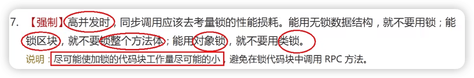
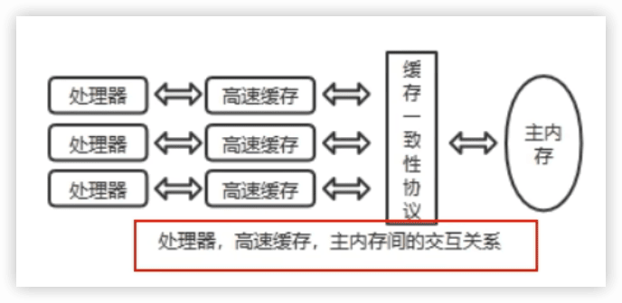

JUC并发编程与源码分析
----
尚硅谷 [JUC并发编程与源码分析](https://www.bilibili.com/video/BV1ar4y1x727)


[脑图](https://www.yuque.com/liuyanntes/vx9leh/fpy93i?inner=lwUQY)

https://tangzhi.blog.csdn.net/article/details/109210095


Doug Lea JUC作者

## 2 线程基础知识复习

### 为什么学习并用好多线程及其重要

#### 硬件方面

摩尔定律失效 

摩尔定律：

它是由英特尔创始人之—Gordon Moore(戈登 •摩尔)提出来的。其内容为：

当价格不变时，集成电路上可容纳的元器件的数目约每隔18-24个月便会增加一倍，性能也将提升一倍。

换言之，每一美元所能买到的电脑性能，将每隔18-24个月翻一倍以上。这一定律揭示了信息技术进步的速度。

可是从2003年开始CPU主顿已经不再翻信，而是采用多核而不是更快的主频。

==摩尔定律失效了==

在主频不再提高且核数在不断增加的情况下，要想让程序更快就要用到**==并行或并发编程==**。

#### 软件方面

- 充分利用多核处理器
- 提高程序性能，高并发系统
- 提高程序吞吐量，异步+回调等生产需求

#### 弊端及问题

- 线程安全性问题

  i++

  集合类安全否

- 线程锁问题

- 线程性能问题


### 从start一个线程说起


#### 涉及OpenJDK源码

[openjdk8/jdk/src/share/native/java/lang/thread.c](https://hg.openjdk.org/jdk8u/jdk8u/jdk/file/7fcf35286d52/src/share/native/java/lang/Thread.c)

[openjdk8/hotspot/src/share/vm/prims/jvm.cpp](https://hg.openjdk.org/jdk8u/jdk8u/hotspot/file/69087d08d473/src/share/vm/prims/jvm.cpp)

[openjdk8/hotspot/src/share/vm/runtime/thread.cpp](https://hg.openjdk.org/jdk8u/jdk8u/hotspot/file/69087d08d473/src/share/vm/runtime/thread.cpp)

java线程是通过start的方法法启动执行的，主要内容在native方法`start0()`，openjdk的与JNI一般是一一对应的，Thread.java对应的就是Thread.c，`start0`其实就是JVM_StartThread。此时查看源代码可以看到在jvm.h中找到了声明，jvm.cpp中有实现。

```C
static JNINativeMethod methods[] = {
    {"start0",           "()V",        (void *)&JVM_StartThread},
    {"stop0",            "(" OBJ ")V", (void *)&JVM_StopThread},
    {"isAlive",          "()Z",        (void *)&JVM_IsThreadAlive},
    {"suspend0",         "()V",        (void *)&JVM_SuspendThread},
    {"resume0",          "()V",        (void *)&JVM_ResumeThread},
    {"setPriority0",     "(I)V",       (void *)&JVM_SetThreadPriority},
    {"yield",            "()V",        (void *)&JVM_Yield},
    {"sleep",            "(J)V",       (void *)&JVM_Sleep},
    {"currentThread",    "()" THD,     (void *)&JVM_CurrentThread},
    {"countStackFrames", "()I",        (void *)&JVM_CountStackFrames},
    {"interrupt0",       "()V",        (void *)&JVM_Interrupt},
    {"isInterrupted",    "(Z)Z",       (void *)&JVM_IsInterrupted},
    {"holdsLock",        "(" OBJ ")Z", (void *)&JVM_HoldsLock},
    {"getThreads",        "()[" THD,   (void *)&JVM_GetAllThreads},
    {"dumpThreads",      "([" THD ")[[" STE, (void *)&JVM_DumpThreads},
    {"setNativeName",    "(" STR ")V", (void *)&JVM_SetNativeThreadName},
};
```


`os::start_thread(thread);`表示多线程是操作系统范畴，与语言无关。

### Java多线程相关概念

#### 1把锁

`synchronized`

#### 2个并

##### 并发concurrent

抢票、秒杀

- 是在同一实体上的多个事件
- 是在一台处理器上”同时“处理多个任务
- 同一个时刻，其实是只有一个事件在发生

##### 并行parallel

- 是在不同实体上的多个事件
- 是在多台处理器上同时处理多个任务
- 同一个时刻大家真的都在做事情，你做你的，我做我的

泡方便面：撕调料包和烧热水同时在做


#### 3个程

##### 进程

简单的说，在系统中运行的一个应用程序就是一个进程，每一个进程都有它自己的**内存空间和系统资源**。

##### 线程

也被称为==轻量级进程==，在同一个进程内会有1个或多个线程，是大多数操作系统进行时序调度的**基本单元**。

> 进程和线程的概念都是来源于操作系统，和语言关系不大。

##### 管程

Monitor（监视器），也就是我们平时所说的==锁==。

Monitor其实是一种==同步机制==，他的义务是保证（同一时间）只有一个线程可以访问被保护的数据和代码。

JVM中同步是基于进入和退出监视器对象(Monitor，==管程对象==)来实现的，每个对象实例都会有一个Monitor对象：

```java
Object o = new Object();
new Thread(() -> {
  synchronized (o) {

  }
}, "t1").start();
```

Monitor对象会和Java对象一同创建并销毁，它底层是由C++语言来实现的。

《深入理解Java虚拟机（第3版）》：


### 用户线程和守护线程

Java中线程分两种：用户线程和守护线程。

一般情况下不做特别说明配置，==默认都是用户线程（User Thread）==（就是用户自己new出的线程，mian主线程也是），它是系统的工作线程，它会完成这个程序需要完成的业务操作。

==守护线程（Daemon Thread）==（用户线程的影子）是一种特殊的线程==为其它线程服务的==，在后台默默地完成一些系统性的服务，比如**垃圾回收线程**就是最典型的例子。

守护线程作为一个服务线程，没有服务对象就没有必要继续运行了，如果用户线程全部结束了，意味着程序需耍完成的业务操作包经结束了，系统可以退出了。所以假如当系统只剩下守护线程的时候，java虚拟机会自动退出。

`setDaemon(true)`必须在`start()`之前设置，否则`IllegalThreadStateException`异常。

`isDaemon()`判断是否是守护线程。

## 3 CompletableFuture

### 3.1 Future

#### Future接口理论知识

`Future`接口（俗称异步任务接口）(`FutureTask`实现类)定义了操作==异步任务==执行一些方法，如**获取异步任务的执行结果、取消任务的妆行、判断任务是否被取消、判断任务执行是否完毕**等。

```java
public interface Future<V> {
    boolean cancel(boolean mayInterruptIfRunning);
    boolean isCancelled();
    boolean isDone();
    V get() throws InterruptedException, ExecutionException;
    V get(long timeout, TimeUnit unit) throws InterruptedException, ExecutionException, TimeoutException;
}
```

比如主线程让一个子线程去执行任务，子线程可能比较耗时，启动子线程开始执行任务后，主线程就去做其他事情了，忙其它事情或者先执行完，过了一会才去获取子任务的执行结果或变更的任务状态。

案例说明：上课买水


总结：Future接口可以为主线程开一个分支任务，专门为主线程处理耗时和费力的复杂业务。


Future接口能干什么？

Future是Java5新加的一个接口，它提供了一种==异步并行计算==的功能。

如果主线程需要执行一个很耗时的计算任务，我们就可以通过future把这个任务放到异步线程中执行。

主线程继续处理其他任务或者先行结束，再通过Future获取**计算结果**。


代码说话：

`Runnable`接口

`Callable`接口

`Future`接口和`FutureTask`实现类

目的：异步多线程任务执行且返回有结果，三个特点：==多线程/有返回/异步任务==〔班长为老师去买水作为新启动的异步多线程任务且买到水有结果返回）

> Runnable与Callable区别：是否有返回值，是否抛出异常。
>
> ```java
> class MyThread implements Runnable {
> 
>     @Override
>     public void run() {
> 
>     }
> }
> 
> class MyThread2 implements Callable<String> {
> 
>     @Override
>     public String call() throws Exception {
>         return null;
>     }
> }
> ```

问题：Thread构造方法中只有 `Runnable`（`public Thread(Runnable target, String name)`），不能满足**有返回/异步任务** 的需求。

解决过程：`Runnable`有子接口`RunnableFuture`，其有实现类`FutureTask`，这个实现类又能通过构造器注入`Callable`。

```java
FutureTask(Callable<V> callable)
```


#### FutureTask

Future接口常用实现类FutureTask


`FutureTask`就解决上面三个需求

```java
public class CompletableFutureDemo {
    public static void main(String[] args) throws ExecutionException, InterruptedException {
        FutureTask<String> futureTask = new FutureTask<>(new MyThread());

        Thread t1 = new Thread(futureTask, "t1");
        t1.start();

        // 获取返回
        System.out.println(futureTask.get());
    }
}
class MyThread implements Callable<String> {

    @Override
    public String call() throws Exception {
        System.out.println("---- come in call()");
        return "hello Callable";
    }
}
```

```
---- come in call()
hello Callable
```


#### Future编码实战和优缺点分析

##### 优点

future+线程池异步多线程任务配合，能显著提高程序的执行效率。

P11 🔖

```java
public class FutureThreadDemo {
    public static void main(String[] args) throws ExecutionException, InterruptedException {
        // 3个任务，目前开启多个异步任务线程来处理，请问耗时多少？ 如果没有需要返回结果约340ms，需要返回结构约840ms+

        // 使用有3个线程的线程池，能够复用。减少使用new来创建
        ExecutorService threadPool = Executors.newFixedThreadPool(3);

        long startTime = System.currentTimeMillis();

        FutureTask<String> futureTask1 = new FutureTask<>(() -> {
            try { TimeUnit.MILLISECONDS.sleep(500); } catch (InterruptedException e) { e.printStackTrace(); }
            return "task1 over";
        });
        threadPool.submit(futureTask1);

        FutureTask<String> futureTask2 = new FutureTask<>(() -> {
            try { TimeUnit.MILLISECONDS.sleep(300); } catch (InterruptedException e) { e.printStackTrace(); }
            return "task2 over";
        });
        threadPool.submit(futureTask2);

        System.out.println(futureTask1.get());
        System.out.println(futureTask2.get());

        // main 线程
        try { TimeUnit.MILLISECONDS.sleep(300); } catch (InterruptedException e) { e.printStackTrace(); }

        long endTime = System.currentTimeMillis();
        System.out.println("----costTime: " + (endTime - startTime) + "毫秒");
        System.out.println(Thread.currentThread().getName() + "\t ----end");

        threadPool.shutdown();
    }

    private static void m1() {
        // 3个任务，目前只有一个线程main来处理，请问耗时多少？ 越1100ms+
        long startTime = System.currentTimeMillis();

        try { TimeUnit.MILLISECONDS.sleep(500); } catch (InterruptedException e) { e.printStackTrace(); }
        try { TimeUnit.MILLISECONDS.sleep(300); } catch (InterruptedException e) { e.printStackTrace(); }
        try { TimeUnit.MILLISECONDS.sleep(300); } catch (InterruptedException e) { e.printStackTrace(); }

        long endTime = System.currentTimeMillis();
        System.out.println("----costTime: " + (endTime - startTime) + "毫秒");

        System.out.println(Thread.currentThread().getName() + "\t ----end");
    }
}
```


##### 缺点

1. get()容易阻塞

一旦调用get方法求结果，如果计算没有完成容易导致程序阻塞。

```java
FutureTask<String> futureTask = new FutureTask<>(() -> {
  System.out.println(Thread.currentThread().getName() + "\t ----come in");
  // 暂停几秒钟线程
  try { TimeUnit.SECONDS.sleep(5); } catch (InterruptedException e) { e.printStackTrace(); }
  return "task over";
});
Thread t1 = new Thread(futureTask, "t1");
t1.start();

// 1 不见不散，get非要等到结构才会离开，不管你是否计算完成，容易引起程序堵塞。一般会将其放到程序最后
//        System.out.println(futureTask.get());

System.out.println(Thread.currentThread().getName() + "\t ----忙其它任务了");

// 2 假如我不愿意等待，可以设置离开时间。会抛出TimeoutException，也不是很优雅
System.out.println(futureTask.get(3, TimeUnit.SECONDS));
```


2. isDonw轮询

轮询的方式会耗费无谓的CPU资源，而且也不见得能及时地得到计算结果。

```java
while (true) {
  if (futureTask.isDone()) {
    System.out.println(futureTask.get());
    break;
  } else {
    // 暂停毫秒
    try { TimeUnit.MILLISECONDS.sleep(500); } catch (InterruptedException e) { e.printStackTrace(); }
    System.out.println("正在处理中，不要再催了，越催越慢，再催熄火");
  }
}
```


结论：**Future对于结果的获取不是很友好，只能通过阻塞或轮询的方式得到任务的结果**。


##### 想完成一些复杂的任务

- 对于简单的业务场景使用Future完全OK

- 回调通知

- 创建异步任务

- 多个任务前后依赖可以组合处理（水煮鱼）

  - 想将多个异步任务的计算结果组合起来，后一个异步任务的计算结果需要前一个异步任务的值
  - 将两个或多个异步计算合成一个异步计算，这几个异步计算互相独立，同时后面这个又依赖前一个处理的结果。

- 对计算速度选最快

  - 当Future集合某个任务最快结束时，返回结果，返回第一名处理结果

  

由于Future的缺点，以及想要更多的复杂任务，催生出了CompletableFuture。


### 3.2 CompletableFuture

CompletableFuture是对Future的改进

#### CompletableFuture为什么出现

get()方法在Future 计算完成之前会一直处在阻塞状态下，isDone()方法容易耗费CPU资源。

对于真正的异步处理我们希望是可以通过传入回调函数，在Future结束时自动调用该回调两数，这样，我们就不用等待结果。


**阻塞的方式和异步编程的设计理念相违背，而轮询的方式会耗费无调的CPU资源**。因此，JDK8设计出CompletableFuture。

CompletableFuture提供了一种**观察者模式类似的机制**，可以让任务执行完成后通知监听的一方，


```java
public class CompletableFuture<T> implements Future<T>, CompletionStage<T>
```


CompletableFuture

- 在Java8中，CompletableFuture提供了非常强大的Future的扩展功能，可以帮助我们简化异步编程的复杂性，并且提供了函数式编程的能力，可以通过回调的方式处理计算结果，也提供了转换和组合 CompletableFuture 的方法。
- 它可能代表一个明确完成的Future，也有可能代表一个完成阶段( Completionstage），它支持在计算完成以后触发一些函数或执行某些动作。
- 它实现了Future和Completionstage接口


CompletionStage

- `CompletionStage`代表异步计算过程中的某一个阶段，一个阶段完成以后可能会触发另外一个阶段，有些类似Linux系统的管道分隔符传参数。
- 一个阶段的计算执行可以是一个Function, Consumer或者Runnable。比如：`stage.thenApply(x -> square(x)).thenAccept(x -> System.out.print(x)).thenRun(() -> System.out.println())`
- 一个阶段的执行可能是被单个阶段的完成触发，也可能是由多个阶段一起触发


#### 核心的四个静态方法，来创建一个异步任务

不推荐使用new空参构造方法来获取CompletableFuture,推荐使用两组四个静态方法创建：

- runAsync（无返回值）

  ```java
  public static CompletableFuture<Void> runAsync(Runnable runnable)
  public static CompletableFuture<Void> runAsync(Runnable runnable,Executor executor)
  ```

- supplyAsync（有返回值）

  ```java
  public static <U> CompletableFuture<U> supplyAsync(Supplier<U> supplier)
  public static <U> CompletableFuture<U> supplyAsync(Supplier<U> supplier, Executor executor)
  ```

没有指定Executor（线程池）的方法，直接使用默认的`ForkJoinPool.commonPool()`作为它的线程池执行异步代码；如果指定线程池，则使用自定义或者特别指定的线程池执行异步代码。


> Supplier  供给函数式接口🔖

```java
    public static void main(String[] args) throws ExecutionException, InterruptedException {

        ExecutorService threadPool = Executors.newFixedThreadPool(3);

//        CompletableFuture<Void> completableFuture = CompletableFuture.runAsync(() -> {
//            System.out.println(Thread.currentThread().getName());
//            // 暂停几秒钟线程
//            try { TimeUnit.SECONDS.sleep(1); } catch (InterruptedException e) { e.printStackTrace(); }
//        });

//        CompletableFuture<Void> completableFuture = CompletableFuture.runAsync(() -> {
//            System.out.println(Thread.currentThread().getName());
//            try { TimeUnit.SECONDS.sleep(1); } catch (InterruptedException e) { e.printStackTrace(); }
//        }, threadPool);

//        CompletableFuture<String> completableFuture = CompletableFuture.supplyAsync(() -> {
//            System.out.println(Thread.currentThread().getName());
//            try { TimeUnit.SECONDS.sleep(1); } catch (InterruptedException e) { e.printStackTrace(); }
//            return "hello supplyAsync";
//        });

        CompletableFuture<String> completableFuture = CompletableFuture.supplyAsync(() -> {
            System.out.println(Thread.currentThread().getName());
            try { TimeUnit.SECONDS.sleep(1); } catch (InterruptedException e) { e.printStackTrace(); }
            return "hello supplyAsync";
        }, threadPool);

        System.out.println(completableFuture.get());

        threadPool.shutdown();
    }
```


##### 通用演示


从Java8开始引入了CompletableFuture，它是==Future的功能增强版，减少阻塞和轮询==，可以传入回调对象，当异步任务完成或者发生异常时，自动调用回调对象的回调方法。

🌰：CompletableFutureUseDemo


#### CompletableFuture的优点

1. 异步任务结束时，会自动回调某个对象的方法
2. 主线程设置好回调后，不再关心异步任务的执行，异步任务之间可以顺序执行
3. 异步任务出错是，会自动回调某个对象的方法


#### 案例-电商网站的比价需求

##### 函数式编程已成主流

Lambda表达式+Stream流式调用+Chain链式调用+Java8函数式编程

1. `Runnable` 没有参数没有返回值


2. `Function` 有一个参数有返回值


3. `Consumer`

`BiConsumer`


4. `Supplier`  供给型函数结构，有参数有返回值


链式写法

```java
@Accessors(chain = true)  // 支持链式写法
class Student {
}
```


##### join和get

区别是：join不会报检查异常

```java
public static void main(String[] args) {
  CompletableFuture<String> completableFuture = CompletableFuture.supplyAsync(() -> {
    return "hello 1";
  });
  //        completableFuture.get();
  completableFuture.join();
}
```


> 切记，功能 -> 性能  （先完成，后完美）


##### 电商网站比价需求分析

1需求说明

- 1.1 同一款产品，同时搜索出同款产品在各大电商平台的售价；
- 1.2 同一款产品，同时搜索出本产品在同一个电商平台下，各个入驻卖家售价是多少

2 输出返回：
 出来结果希望是同款产品的在不同地方的价格清单列表，返回一个`List<String>`

《mysql》 in jd price is 88.05

《mysql》 in dangdang price is 86.11

《mysql》 in taobao price is 90.43

3 解决方案，比对同一个商品在各个平台上的价格，要求获得一个清单列表，

​	1 step by step，按部就班，查完京东查淘宝，查完淘宝查天猫•

​	2 all in ，万箭齐发，一口气多线程异步任务同时查询。。。。。


#### CompletableFuture常用方法

`CompletionStage`方法的实现


##### 1 获得结果和触发计算

获得结果：

```java
get()    不见不散
get(long timeout, TimeUnit unit)   过时不候
join()    不报检查异常
getNow(T valueIfAbsent)     立即获取结果不阻塞，计算完就返回计算完结果，没计算完就返回设定的valueIfAbsent值
```

触发计算：

```java
public boolean complete(T value)     是否打断get/join方法立即返回value
```


```java
// 返结果视情况出现两种情况：
//      true    completValue
//      false   abc
System.out.println(completableFuture.complete("completValue") + "\t" + completableFuture.join());
```


##### 2 对计算结果进行处理

🌰CompletableFutureAPI2Demo

上一步的计算结果可以传递给下一步

- `thenApply`  计算结果存储依赖关系，这连个线程串行化

异常处理：由于存在依赖关系（当前步错，不走下一步），当前步骤有异常的话就叫停

- `handle`

与thenApply功能类似，但对异常处理不同：有异常也可以往下走，根据带的异常参数可以进一步处理

> 总结：exceptionally有点类似try/catch，whenComplete和handle有点类似try/finally


##### 3 对计算结果进行消费

`thenAccept`   接受任务的处理结果，并消费处理，==无返回结果==


> 对比：
>
> - `thenRun(Runnable runnable)`，任务A执行完执行B，并且B不需要A的结果
> - `thenAccept(Consumer action)`，任务A执行完执行B，B需要A的结果，但任务B==无返回值==
> - `thenApply(Function fn)`，任务A执行完执行B，B需要A的结果，同时任务B==有返回值==
>
> ```java
> // 对比三种方式的不同
> System.out.println(CompletableFuture.supplyAsync(() -> "resultA").thenRun(() -> {}).join()); // null
> System.out.println(CompletableFuture.supplyAsync(() -> "resultA").thenAccept(r -> System.out.println(r)).join());
> System.out.println(CompletableFuture.supplyAsync(() -> "resultA").thenApply(r -> r + "resultB").join());
> 
> ```
>
> 


##### CompletableFuture和线程池说明

P26 

CompletableFutureWithThreadPollDemo


以`thenRun`和`thenRunAsync`为例，有什么区别？

1. 没有传入自定义线程池，都用默认线程池ForkJoinPool；

2. 传入了一个自定义线程池，

   如果你执行第一个任务的时候，传入了一个自定义线程池：

   调用thenRun方法执行第二个任务时，则第二个任务和第一个任务是共用同一个线程池。

   调用thenRunAsync执行第二个任务时，则第一个任务使用的是你自己传入的线程池，第二个任务使用的是ForkJoin线程池

3. 备注：有可能处理太快，系统优化切换原则，直接使用main线程处理

其它如：thenAccept和thenAcceptAsync,thenApply和thenApplyAsync等，它们之间的区别也是同理


源码分析

```java
public CompletableFuture<Void> thenRun(Runnable action) {
  return uniRunStage(null, action);
}

public CompletableFuture<Void> thenRunAsync(Runnable action) {
  return uniRunStage(asyncPool, action);
}

private static final Executor asyncPool = useCommonPool ? ForkJoinPool.commonPool() : new ThreadPerTaskExecutor();
```


##### 4 对计算速度进行选用

`applyToEither`  谁快用谁

```java
CompletableFuture<String> playA = CompletableFuture.supplyAsync(() -> {
  System.out.println("A come in");
  try {
    TimeUnit.SECONDS.sleep(2);
  } catch (InterruptedException e) {
    e.printStackTrace();
  }
  return "playA";
});
CompletableFuture<String> playB = CompletableFuture.supplyAsync(() -> {
  System.out.println("B come in");
  try {
    TimeUnit.SECONDS.sleep(10);
  } catch (InterruptedException e) {
    e.printStackTrace();
  }
  return "playB";
});
CompletableFuture<String> result = playA.applyToEither(playB, f -> {
  return f + " is winner";
});

System.out.println(Thread.currentThread().getName() + "\t-----: " + result.join());
```


##### 5 对计算结果进行合并

```java
public <U,V> CompletableFuture<V> thenCombine(
  CompletionStage<? extends U> other,
  BiFunction<? super T,? super U,? extends V> fn)
```


## 4 说说Java“锁”事❤️

> 大厂面试题
> 一、Synchronized相关问题
> 1.Synchronized 用过吗，其原理是什么?
> 2.你刚才提到获取对象的锁，这个“锁”到底是什么?如何确定对象的领?
> 3.什么是可重入性，为什么说Synchronized是可重入锁?
> 4.JVM对Java的原生锁做了哪些优化?
> 5.为什么说Synchronized是非公平锁?
> 6.什么是锁消除和锁粗化?
> 7.为什么说Synchronized是—个悲观领?乐观锁的实现原理又是什么?什么是CAS？
> 8.乐观锁—定就是好的吗?
> 9、synchronized实现原理，monitor对象什么时候生成的?知道monitor的monitorenter和monitorexit这两个是怎么保证同步的吗，或者说，这两个操作计算机底层是如何执行的
> 10.刚刚你提到了synchronized的优化过程，详细说一下吧。偏向锁和轻量级锁有什么区别?
>
> 二、可重入锁ReentrantLock及其他显式锁相关问题
> 1.跟Synchronized相比，可重入锁ReentrantLock 其续现原理有什么不同?
> 2那么请谈谈AQS框架是怎么回事儿?
> 3.请尽可能详尽地对比下Synchronized和 ReentrantLock的异同。
> 4.ReentrantLock是如何实现可重入性的?
>
> 三、其他
> 1.你怎么理解iava多线程的?怎么处理并发?线程池有那几个核心参数?你们项目中如何根据实际场景设置参数的?
> 2.Java加锁有哪几种锁？
> 3.简单说说lock ?
> 4.hashmap的实现原理? hash冲突怎么解决?为什么使用红黑树?
> 5.spring里面都使用了那些设计模式?循环依赖怎么解决?
> 6.项目中那个地方用了countdownlanch，怎么使用的?
> 7、从集合开始吧，介绍一下常用的集合类，哪些是有序的，哪些是无序的
> 8、hashmap是如何寻址的，哈希碰撞后是如何存储数据的，1.8后什么时候变成红黑树,红黑树有什么好处
> 9、concurrrenthashmap怎么实现线程安全，一个里面会有几个段 segment，jdk1.8后有优化concurrenthashmap吗?分段锁有什么坏处

### 4.1 乐观锁和悲观锁

- 悲观锁：
  + 认为自己在使用数据的时候==一定有别的线程来修改数据==，因此在获取数据的时候会先加锁，确保数据不会被别的线程修改。
  + `synchronized`关键字和`Lock`的实现类都是悲观锁。
  + 适合==写操作==多的场景，先加锁可以保证写操作时数据正确。
  + **显式的锁定**之后再操作同步资源
  + “狼性锁”

- 乐观锁：“佛系锁”

  + 认为自己在使用数据时==不会有别的线程修改数据或资源==，所以不会添加锁

  + 在Java中是通过使用**无锁编程**来实现，只是在更新数据的时候去判断，之前有没有别的线程更新了这个数据。

    如果这个数据没有被更新，当前线程将自己修改的数据成功写入。

    如果这个数据已经被其它线程更新，则根据不同的实现方式执行不同的操作，比如放弃修改、重试抢锁等等

    如原子操作类那些底层是CAS算法，也就是乐观锁。

乐观锁判断规则

1. 版本号机制Version
2. 最常采用的是==CAS算法==，Java原子类中的递增操作就通过CAS自旋实现的。🔖

乐观锁使用场景：适合==读操作==多的场景，不加锁的特点能够使其读操作的性能大幅提升。

乐观锁则直接去操作同步资源，是种无锁算法，得之我幸不得我命，再努力就是

伪代码说明：

```java
//  ======悲观锁的调用方式========
public synchronized void m1() {
  // 加锁后的业务逻辑....
}
// 保证多个线程使用的事同一个lock对象的前提下
ReentrantLock lock = new ReentrantLock();
public void m2() {
  lock.lock();
  try {
		// 操作同步资源
  } finally {
    lock.unlock();
  }
}


// =======乐观锁的调用方式
// 保证多个线程使用的是同一个AtomicInteger
private AtomicInteger atomicInteger = new AtomicInteger();
atomicInteger.incrementAndGet();
```


### 案例

```java
// 资源类
class Phone {
    public synchronized void sendEmail() {
        // try { TimeUnit.SECONDS.sleep(3); } catch (InterruptedException e) { e.printStackTrace(); }
        System.out.println("-----sendEmail");
    }
    public synchronized void sendSMS() {
        System.out.println("-----sendSMS");
    }
    public static synchronized void sendEmailStatic() {
        try { TimeUnit.SECONDS.sleep(3); } catch (InterruptedException e) { e.printStackTrace(); }
        System.out.println("-----sendEmail");
    }
    public static synchronized void sendSMSStatic() {
        System.out.println("-----sendSMS");
    }
    public void hello() {
        System.out.println("-----hello");
    }
}
```

> 题目：谈谈你对多线程锁的理解，8锁案例说明
>
> 口诀：线程    操作      资源类
>
> 8锁案例说明
>
> 1. 标准访问有a、b两个线程，请问先打印邮件还是短信？ 先邮件后短信
>
> 2. 在sendEmail方法中加入暂停3秒钟，请问先打印邮件还是短信？先邮件后短信
>
> 3. 添加一个普通的hello方法，在b线程中调用（替换调用短信），请问先打印右键换是hello？ 先hello，3秒后打印邮件
>
> 4. 有两部手机，分别调用邮件和短信，请问先打印邮件还是短信？先短信，暂停3秒后邮件
>
> 5. 有两个静态同步方法，有1部手机，请问先打印邮件还是短信？ 暂停后，先邮件后短信
>
> 6. 有两个静态同步方法，有2部手机，请问先打印邮件还是短信？ 暂停后，先邮件后短信
>
> 7. 一个静态同步方法（邮件），一个普通同步方法（短信），有1部手机，请问先打印邮件还是短信？  先短信，暂停 后邮件
>
> 8. 一个静态同步方法（邮件），一个普通同步方法（短信），有2部手机，请问先打印邮件还是短信？  先短信，暂停 后邮件


`synchronized`是悲观锁。

只要一个方法被`synchronized`锁定，那么如果访问这个资源类的任何一个`synchronized`方法时，整个资源类都会被锁定，也就是这个资源类中所有`synchronized`方法

因此案例2中，在加入了3秒休眠后，结果是暂停3秒后，先邮件后短信

总结：

- 案例1、2总结，一个对象里面如果有多个`synchronized`方法，某一个时刻内，只要一个线程去调用其中的一个`synchronized`方法了，其它的线程都只能等待，换句话说，某一个时刻内，智能有唯一的一个线程访问呢这些`synchronized`方法。锁的当前对象this（”==对象锁==“），被锁定后，其它线程都不能进入到当前对象的其它`synchronized`方法。

- 案例3中，普通hello方法，不需要去申请this对象锁，线程之间不会产生竞争。
- 案例4中，两个对象互不干扰，没有竞争
- 案例5、6中，`static synchronized`是==类锁==，锁的是整个类。三种synchronized锁的差别：
  - ==普通同步方法==，锁的当前实例对象，通常指this。
  - ==静态同步方法==，锁的是当前类的Class对象，如`Phone.class`。
  - ==同步方法块==，锁的是synchronized括号内的对象。
- 案例7、8中，对象锁和类锁互补干扰。也就是说，静态同步方法与普通同步方法之间是不会有静态条件的。

阿里手册：




#### JDK源码说明synchronized

线程的notify方法有一个说明：

> This method should only be called by a thread that is the owner of this object's monitor. A thread becomes the owner of the object's monitor in one of three ways:
>
> - By executing a synchronized instance method of that object.
> - By executing the body of a synchronized statement that synchronizes on the object.
> - For objects of type Class, by executing a synchronized static method of that class.
>
> 此方法只能由作为此对象监视器所有者的线程调用。线程通过以下三种方式之一成为对象监视器的所有者： 
>
> - 通过执行该对象的同步实例方法。 
> - 通过执行在对象上同步的同步语句的正文。 
> - 对于 Class 类型的对象，通过执行该类的同步静态方法。

这里三种方式也就对应之前说的synchronized锁三种使用方式。


> `java -c *.class`  对代码进行反编译查看
>
> `java -v *.class`   更详细的信息（包括行号、本地变量表、反汇编等详细信息）


- `synchronized`同步代码块，实现使用的是`monitorenter`和`monitorexit`指令

```java
public class LockSyncDemo {
    Object object = new Object();

    public void m1() {
        synchronized (object) {
            System.out.println("-----hello synchronized code block");
        }
    }

    public static void main(String[] args) {

    }
}
```

`javap -c LockSyncDemo`


有两个退出指令，第二个退出指令是为了保证，如果同步块里出现异常情况，也能退出。

特殊情况：


- `synchronized`普通同步方法

```java
    public synchronized void m2() {
        System.out.println("-----hello synchronized m2");
    }
```

`javap -v LockSyncDemo`


调用指令将会检查方法的`ACC_SYNCHRONIZED`访问标志是否被设置。如果设置了，执行线程会将先持有monitor锁，然后再执行方法，最后在方法完成（无论是正常完成还是非正常完成）时释放monitor。

- 静态同步方法


`ACC_STATIC`, `ACC_SYNCHRONIZED`两个访问标识区分是否是静态同步方法


==管程==（英语：Monitors，也称为监视器）是一种程序结构，结构内的多个子程序（对象或模块）形成的多个工作线程互斥访问共享资源。这些共享资源一般是硬件设备或一群变量。对共享变量能够进行的所有操作集中在一个模块中。（把信号量及其操作原语“封装”在一个对象内部）

管程实现了在一个时间点，最多只有一个线程在执行管程的某个子程序。管程提供了一种机制，管程可以看做一个软件模块，它是将共享的变量和对于这些共享变量的操作封装起来，形成一个具有一定接口的功能模块，进程可以调甲管程来实现进程级别的并发控制。

**==执行线程就要求先成功持有管程，然后才能执行方法，最后当方法完成（无论是正常完成还是非正常完成）时释放管程。在方法执行期间，执行线程持有了管程，其他任何线程都无法再获取到同一个管程。==**如果一个同步方法执行期间抛出了异常，并且在方法内部无法处理此异常，那这个同步方法所持有的管程将在异常抛出到同步方法边界之外时自动释放。

#### C++代码说明synchronized

> 面试题：为什么任何一个对象都可以成为一个锁？

在HotSpot虚拟机中，monitor采用`ObjectMonitor`实现，`ObjectMonitor.java`  ->  `ObjectMonitor.cpp`  ->  `ObjectMonitor.hpp` （hpp是头文件，会被cpp引入）

https://github.com/openjdk/jdk/blob/6aa197667ad05bd93adf3afc7b06adbfb2b18a22/src/jdk.hotspot.agent/share/classes/sun/jvm/hotspot/runtime/ObjectMonitor.java#L35

https://github.com/openjdk/jdk/blob/6aa197667ad05bd93adf3afc7b06adbfb2b18a22/src/hotspot/share/runtime/objectMonitor.cpp

https://github.com/openjdk/jdk/blob/6aa197667ad05bd93adf3afc7b06adbfb2b18a22/src/hotspot/share/runtime/objectMonitor.hpp#L130


Java中的Object对象的wait、notiy等方法就对应C++中的 `ObjectMonitor::wait`等。


`ObjectMonitor.hpp`文件中就初始化监视器（管程）：


ObjectMonitor中有几个关键属性：

| _owner      | 指向持有ObjectMonitor对象的线程   |
| ----------- | --------------------------------- |
| _WaitSet    | 存放处于wait状态的线程队列        |
| _EntryList  | 存放处于等待锁block状态的线程队列 |
| _recursions | 锁的重入次数                      |
| _count      | 用来记录该线程获取锁的次数        |

因此上面的题目的有答案了：

- 每个对象天生都带着一个对象监视器
- 每一个被锁住的对象都会和Monitor关联起来 


### 4.2 公平锁和非公平锁

#### 什么是公平锁和非公平锁

- 公平锁：是指多个线程按照申请锁的顺序来获取锁。类似排队打饭先来后到。排队买票，先来的人先买后来的人在队尾排着，这是公平的Lock lock = new ReentrantLock（true）；//true ==表示公平锁，先来先得==
- 非公平锁：是指在多线程获取锁的顺序并不是按照申请锁的顺序,有可能后申请的线程比先申请的线程优先获取到锁,在高并发的情况下,有可能造成优先级反转或者饥饿的状态（某个线程一直得不到锁）

注意：`synchronized` 和 `ReentrantLock` 默认是非公平锁


#### 排队抢票案例(公平出现锁饥饿)

锁饥饿:我们使用5个线程买100张票,使用ReentrantLock默认是非公平锁,获取到的结果可能都是A线程在出售这100张票,会导致B、C、D、E线程发生锁饥饿(使用公平锁会有什么问题)


#### 为什么会有公平锁、非公平锁的设计?为什么默认非公平？

面试题

- 恢复挂起的线程到真正锁的获取还是有时间差的,从开发人员来看这个时间微乎其微,但是从CPU的角度来看,这个时间存在的还是很明显的,所以非公平锁能更**充分的利用CPU的时间片,尽量减少CPU空闲状态时间**。
- 使用多线程很重要的考量点是**线程切换的开销**,当采用非公平锁时，当一个线程请求锁获取同步状态,然后释放同步状态,因为不需要考虑是否还有前驱节点,所以刚释放锁的线程在此刻再次获取同步状态的概率就变得非常大了,所以就减少了线程的开销线程的开销

#### 什么时候用公平？什么时候用非公平？

面试题

如果为了更高的吞吐量,很显然非公平锁是比较合适的,因为节省很多线程切换时间,吞吐量自然就上去了；

否则那就用公平锁,大家公平使用，没有效率、性能要求没那么高。

#### 源码解读

- 公平锁:排序排队公平锁,就是判断同步队列是否还有先驱节点的存在(我前面还有人吗?),如果没有先驱节点才能获锁
- 先占先得非公平锁,是不管这个事的,只要能抢获到同步状态就可以
- ReentrantLock默认是非公平锁,公平锁要多一个方法,所以非公平锁的性能更好(aqs源码)


### 4.3 可重入锁(又名递归锁)

#### 什么是可重入锁？

可重入锁又名递归锁,是指在==同一个线程==在外层方法获取锁的时候，再进入该线程的内层方法会==自动获取锁==(前提，锁对象得是同一个对象)，不会因为之前已经获取过还没有释放而阻塞。

如果是1个有`synchronized`修饰得递归调用方法，**程序第2次进入被自己阻塞了岂不是天大的笑话,出现了作茧自缚**。

所以Java中`ReentrantLock`和`synchronized`都是可重入锁，可重入锁的一个优点是**可在一定程度避免死锁**。


#### 可重入锁这四个字分开解释

可: 可以

重: 再次

入: 进入

锁: 同步锁

进入什么：进入同步域(即同步代码块、方法或显示锁锁定的代码)


一个线程中的多个流程可以获取同一把锁，持有这把同步锁可以再次进入。自己可以获取自己的内部锁。


#### 可重入锁的种类

- 隐式锁(即synchronized关键字使用的锁)默认是可重入锁。【在同步块、同步方法都使用】

**在一个synchronized修饰的方法或者代码块的内部调用本类的其他synchronized修饰的方法或代码块时,是永远可以得到锁的**。

同步块：

```java
final Object object = new Object();

new Thread(() -> {
  synchronized (object) {
    System.out.println(Thread.currentThread().getName() + "\t ------外层调用");
    synchronized (object) {
      System.out.println(Thread.currentThread().getName() + "\t ------外层调用");
      synchronized (object) {
        System.out.println(Thread.currentThread().getName() + "\t ------外层调用");
      }
    }
  }
}, "t1").start();
```

同步方法：

```java
    public synchronized void m1() {
        // 在一个synchronized修饰的方法或者代码块的内部调用本类的其他synchronized修饰的方法或代码块时,是永远可以得到锁的
        System.out.println(Thread.currentThread().getName() + "\t ----- come in");
        m2();
        System.out.println(Thread.currentThread().getName() + "\t ------end m1");
    }
    public synchronized void m2() {
        System.out.println(Thread.currentThread().getName() + "\t ----- come in");
        m3();
    }
    public synchronized void m3() {
        System.out.println(Thread.currentThread().getName() + "\t ----- come in");
    }
```

```java
        // 从头到尾只有t2这一个线程持有同一把锁
        ReEntryLockDemo reEntryLockDemo = new ReEntryLockDemo();
        new Thread(() -> {
            reEntryLockDemo.m1();
        }, "t2").start();
```


- 显示锁(即Lock)也有`ReentrantLock`这样的可重入锁

​	lock和unlock一定要一一匹配,如果少了或多了,都会坑到别的线程

```java
    static Lock lock = new ReentrantLock();
    // 显示锁，lock和unlock方法是一一对应的。
    public static void xianshiLock() {

        new Thread(() -> {
            lock.lock();
            try {
                System.out.println(Thread.currentThread().getName() + "\t ----- come in外层调用");
                lock.lock();
                try {
                    System.out.println(Thread.currentThread().getName() + "\t ----- come in内层调用");
                } finally {
                    lock.unlock();
                }
            } finally {
//                lock.unlock();
            }
        }, "t1").start();

        // 如果t1线程中缺少unlock，就会死锁，导致t2线程无法获取到锁，一直在等待
        new Thread(() -> {
            lock.lock();
            try {
                System.out.println(Thread.currentThread().getName() + "\t ----- come in外层调用");
            } finally {
                lock.unlock();
            }
        }, "t2").start();
    }
```

#### Synchronized的重入的实现机理

为什么任何一个对象都可以成为一个锁

`ObjectMonitor.hpp`（`ReentrantLock`也是使用这个。都是使用这个？）


ObjectMonitor中有几个关键属性：

| _owner      | 指向持有ObjectMonitor对象的线程   |
| ----------- | --------------------------------- |
| _WaitSet    | 存放处于wait状态的线程队列        |
| _EntryList  | 存放处于等待锁block状态的线程队列 |
| _recursions | 锁的重入次数                      |
| _count      | 用来记录该线程获取锁的次数        |

- 每个锁对象拥有一个锁计数器（`_recursions`）和一个指向持有该锁的线程的指针（`_owner`）。

- 当执行`monitorenter`时，如果目标锁对象的计数器为零，那么说明它没有被其他线程所持有，Java虚拟机会将该锁对象的持有线程设置为当前线程，并且将计数器加1。

- 在目标锁对象的计数器不为零的情况下，如果锁对象的持有线程时当前线程，那么Java虚拟机可以将其计数器加1，否则需要等待,直到持有线程释放该锁。

- 当执行`monitorexit`，Java虚拟机则需将锁对象的计数器减1。计数器为零代表锁已经释放。
  

### 4.4 死锁及排查

#### 什么是死锁？

死锁是指两个或两个以上的线程在执行过程中,因争夺资源而造成的一种==互相等待==的现象,若无外力干涉那它们都将无法推进下去,如果资源充足,进程的资源请求都能够得到满足,死锁出现的可能性就很低,否则就会因争夺有限的资源而陷入死锁。


#### 产生死锁的原因

- 系统资源不足

- 进程运行推进的顺序不合适

- 资源分配不当

#### 代码展示

```java
public class DeadLockDemo {
    public static void main(String[] args) {
        final Object objectA = new Object();
        final Object objectB = new Object();

        new Thread(() -> {
            synchronized (objectA) {
                System.out.println(Thread.currentThread().getName() + "\t ----- 自己持有A锁，希望获得B锁");
                try { TimeUnit.SECONDS.sleep(1); } catch (InterruptedException e) { e.printStackTrace(); }
                synchronized (objectB) {
                    System.out.println(Thread.currentThread().getName() + "\t ----- 成功获得B锁");
                }
            }
        }, "A").start();

        new Thread(() -> {
            synchronized (objectB) {
                System.out.println(Thread.currentThread().getName() + "\t ----- 自己持有B锁，希望获得A锁");
                try { TimeUnit.SECONDS.sleep(1); } catch (InterruptedException e) { e.printStackTrace(); }
                synchronized (objectA) {
                    System.out.println(Thread.currentThread().getName() + "\t ----- 成功获得A锁");
                }
            }
        }, "B").start();
    }
}
```


#### 如何排除死锁

程序一直运行（灯不灭），怎么证明是死锁了

##### 方式一:纯命令

`jps`（java ps -ef）

```
jps -l
jstack 进程id
```


##### 方式二:jconsole(输入cmd,输入jconsole,点击检测死锁按钮)


> 本章后面部分，学完之后章节，再学
>
> 

### 小总结


#### ObjectMonitor

指针指向monitor对象（也称为管程或监视器锁）的起始地址。每个对象都存在着一个monitor与之关联，当一个 monitor 被某个线程持有后，它便处于**锁定状态**。在Java虚拟机（HotSpot）中，monitor是由ObjectMonitor实现的，其主要数据结构如下（位于HotSpot虚拟机源码ObjectMonitor.hpp文件，C++实现的）


### 4.5 自旋锁

#### 什么是自旋锁？

(是指尝试获取锁的线程不会立即阻塞，而是采用循环的方式去尝试获取锁,当线程发现锁被占用时，会不断循环判断锁的状态，直到获取。这样的好处是减少线程上下文切换的消耗，缺点是循环会消耗CPU)


#### 如何手写一个自选锁


#### CAS缺点

1. 循环时间长开销很大
2. 引出来ABA问题(在CAS篇章将详细说明)


## 5 线程中断与LockSupport❤️ 


### 5.1 线程中断机制

> 阿里面试题：
>
> Thread中三个方法的含义：
>
> - `void interrupt()`  中断此线程
> - `static boolean interrupted() `  测试当前线程是否已被中断
> - `boolean isInterrupted()`  测试线程是否已被中断
>
> 如何**中断**一个运行中的线程？？
>
> 如何停止一个运行中的线程？？


#### 什么是中断

- 一个线程不应该由其他线程来强制中断或停止，而是==应该由线程自己自行停止==，所以，**Thread.stop、Thread.suspend、Thread.resume都已经被废弃了**。

- 在Java中没有办法立即停止一条线程，然而停止线程却显得尤为重要，如取消一个耗时操作。因此，Java提供了一种用于停止线程的机制——==中断==，也即中断标识==协商机制==。

- 中断只是一种协作机制，**Java没有给中断增加任何语法，中断的过程完全需要程序员自己实现**。

- 若要中断一个线程，你需要手动调用该线程的`interrupt`方法，该方法也**仅仅是将线程对象的==中断标识==设为true**；接着你需要自己写代码不断地检测当前线程的标识位，如果为true，表示别的线程请求这条线程中断，此时究竟该做什么需要你自己写代码实现。

  > 服务员有礼貌请求某个客户不要吸烟，然后客户自己停止吸烟，而不是直接上去打断其🚬。

- 每个线程对象中都有一个标识，用于标识线程是否被中断；该标识位为true表示中断，为false表示未中断；通过调用线程对象的interrupt方法将线程的标识位设为true；可以在别的线程中调用，也可以在自己的线程中调用。


#### 中断机制3个中断方法

##### boolean isInterrupted()

实例方法，判断当前线程是否被中断(通过检查中断标识位) 实例方法。

##### void interrupt()

实例方法，仅仅是设置线程的中断状态未true，不会停止线程。

```java
    public void interrupt() {
        if (this != Thread.currentThread())
            checkAccess();

        synchronized (blockerLock) {
            Interruptible b = blocker;
            if (b != null) {
                interrupt0();           // Just to set the interrupt flag  native方法
                b.interrupt(this);
                return;
            }
        }
        interrupt0();
    }
```


具体来说，当对一个线程，调用 interrupt()时：

1. 如果线程处于==正常活动状==态，那么会将该线程的中断标志设置为 true，仅此而已。**被设置中断标志的线程将继续正常运行，不受影啊**。所以，interrupt()并不能真正的中断线程，需要被调用的线程自己进行配合才行。

```java
/**
 * 验证线程的中断标识为true，是不是就立刻停止
 * @author andyron
 **/
public class Interrupt {
    public static void main(String[] args) {
        // 实例方法interrupt()，仅仅是设置线程的中断状态未true，不会停止线程。
        Thread t1 = new Thread(() -> {
            for (int i = 0; i <= 300; i++) {
                System.out.println("-----: " + i);
            }
            System.out.println("t1线程调用interrupt()后的中断标识02： " + Thread.currentThread().isInterrupted());  // ture
        }, "t1");
        t1.start();

        System.out.println("t1线程默认的中断标识： " + t1.isInterrupted());  // false

        try { TimeUnit.MILLISECONDS.sleep(2); } catch (InterruptedException e) { e.printStackTrace(); }
        t1.interrupt();  // true
        System.out.println("t1线程调用interrupt()后的中断标识01： " + t1.isInterrupted());  // true

        try { TimeUnit.MILLISECONDS.sleep(2000); } catch (InterruptedException e) { e.printStackTrace(); }
        System.out.println("t1线程调用interrupt()后的中断标识03： " + t1.isInterrupted());  // false  因为2000ms后线程t1已经运行完了，是不活动线程
    }
}
```


2. 如果线程处于被阻塞状态（例如处于sleep，wait, join等状态），在别的线程中调用当前线程对象的interrupt方法，那么线程将立即退出被阻塞状态，并抛出一个`InterruptedException`异常。

```java
/**
 * 线程处于被阻塞状态时，在别的线程中调用当前线程对象的interrupt方法，那么线程将立即退出被阻塞状态，并抛出一个`InterruptedException`异常。
 * @author andyron
 **/
public class Interrupt2 {
    public static void main(String[] args) {
        Thread t1 = new Thread(() -> {
            while (true) {
                if (Thread.currentThread().isInterrupted()) {
                    System.out.println(Thread.currentThread().getName() + "\t " + "中断标志位： " +
                            Thread.currentThread().isInterrupted() + " 程序停止");
                    break;
                }

                try {
                    Thread.sleep(200);
                } catch (InterruptedException e) {
                    Thread.currentThread().interrupt();   // 为什么要在异常处，再调用一次
                    e.printStackTrace();
                }

                System.out.println("----- hello Interrupt2");
            }
        }, "t1");
        t1.start();

        try { TimeUnit.SECONDS.sleep(1); } catch (InterruptedException e) { e.printStackTrace(); }
        new Thread(() -> t1.interrupt(), "t2").start();
    }
}
/*
    1 中断标志位默认为false；
    2 t2 向 t1发出中断协商（t2调用t1.interrupt()），中断标志位变为true；
    3 中断标识位true，正常情况，程序停止
    4 中断标识位true，异常情况，InterruptedException，将会把中断状态清楚，中断标志位变为false，导致无限循环
    5 在catch块中，需要再次给中断标识位设置为true，
 */

```

sleep方法抛出InterruptedException后，中断标识也被清空置为false，我们在catch没有通过调用th.interrupt( )方法再次将中断标识位设置位true，这就是导致无限循环了

##### static boolean interrupted()

静态方法，判断线程是否被中断，并清除当前中断状态。

这个方法做了两件事：

1. 返回当前线程的中断状态，测试当前线程是否已被中断；
2. 将当前线程的中断状态清零，并重新设为false

```java
        System.out.println(Thread.currentThread().getName() + "\t" + Thread.interrupted());     // false
        System.out.println(Thread.currentThread().getName() + "\t" + Thread.interrupted());     // false
        System.out.println("-----1");
        Thread.currentThread().interrupt();  // 中断标志位设置为true
        System.out.println("-----2");
        System.out.println(Thread.currentThread().getName() + "\t" + Thread.interrupted());     // true  返回当前线程的中断状态并清除
        System.out.println(Thread.currentThread().getName() + "\t" + Thread.interrupted());     // false
```


原理:假设有两个线程A、B，线程B调用了interrupt方法，这个时候我们连接调用两次isInterrupted方法，第一次会返回true，然后这个方法会将中断标识位设置位false，所以第二次调用将返回false

##### 比较静态方法interrupted和实例方法isInterrupted

都调用的`private native boolean isInterrupted(boolean ClearInterrupted);`，不同的是：

1. 静态方法interrupted将会清除中断状态(传入的参数ClearInterrupted位true)
2. 实例方法isInterrupted则不会(传入的参数ClearInterrupted为false)


#### 如何使用中断标识停止线程？


三种中断标识停止线程的方式：

1. 通过一个`volatile`变量实现

`volatile`变量，可见性

```java
/**
 * 通过volatile变量实现停止线程
 * @author andyron
 **/
public class InterruptDemo {
    static volatile boolean isStop = false;

    public static void main(String[] args) {
        new Thread(() -> {
            while (true) {
                if (isStop) {
                    System.out.println(Thread.currentThread().getName() + "\t isStop被修改为ture，程序停止");
                    break;
                }
                System.out.println("t1 -------- hello volatile");
            }
        }, "t1").start();

        // 暂停毫秒
        try { TimeUnit.MILLISECONDS.sleep(20); } catch (InterruptedException e) { e.printStackTrace(); }

        new Thread(() -> {
            isStop = true;
        }, "t2").start();

    }
}
```

2. 通过`AtomicBoolean`

```java
/**
 * 通过AtomicBoolean实现停止线程
 * @author andyron
 **/
public class InterruptDemo2 {
    static AtomicBoolean atomicBoolean = new AtomicBoolean(false);
    public static void main(String[] args) {
        new Thread(() -> {
            while (true) {
                if (atomicBoolean.get()) {
                    System.out.println(Thread.currentThread().getName() + "\t atomicBoolean被修改为ture，程序停止");
                    break;
                }
                System.out.println("t1 -------- hello atomicBoolean");
            }
        }, "t1").start();

        // 暂停毫秒
        try { TimeUnit.MILLISECONDS.sleep(20); } catch (InterruptedException e) { e.printStackTrace(); }

        new Thread(() -> {
            atomicBoolean.set(true);
        }, "t2").start();
    }
}

```

3. 通过Thread类自带的中断API方法实现

在需要中断的线程中==不断监听中断状态==，一旦发生中断，就执行型对于的中断处理业务逻辑。【前面的两种方法也类似，不断监听对应变量】

```java
        Thread t1 = new Thread(() -> {
            while (true) {
                if (Thread.currentThread().isInterrupted()) {
                    System.out.println(Thread.currentThread().getName() + "\t 中端标识被修改为ture，程序停止");
                    break;
                }
                System.out.println("t1 -------- hello 中断 api");
            }
        }, "t1");
        t1.start();

        // 暂停毫秒
        try { TimeUnit.MILLISECONDS.sleep(20); } catch (InterruptedException e) { e.printStackTrace(); }

        new Thread(() -> {
            t1.interrupt();
        }, "t2").start();
```


#### 面试题：当前线程的中断标识为true，是不是就立刻停止？

不会，参考上线interrupt()的代码案例。

### 5.2 LockSupport

`java.util.concurrent.locks.LockSupport`

#### 什么是LockSupport?

LockSupport是用来创建锁和其他同步类的基本线程阻塞原语。

- 通过park()和unpark(thread)方法来实现阻塞和唤醒线程的操作

-  LockSupport是一个线程阻塞工具类，所有的方法都是静态方法，可以让线程在任意位置阻塞，阻塞之后也有对应的唤醒方法。归根结底，LockSupport调用的Unsafe中的native代码。

③. 官网解释:
LockSupport是用来创建锁和其他同步类的基本线程阻塞原语
LockSupport类使用了一种名为Permit(许可)的概念来做到阻塞和唤醒线程的功能，每个线程都有一个许可(permit)，permit只有两个值1和零，默认是零
可以把许可看成是一种(0，1)信号量(Semaphore)，但与Semaphore不同的是，许可的累加上限是1

#### 线程等待唤醒机制

LockSupport就是对==线程等待唤醒机制==的另外一种优化和提升。

##### 3中让线程等待和唤醒的方法

> 技术的发展
>
> 

- 方式1：使用Object中的wait()方法让线程等待，使用Object中的notify()方法唤醒线程。

```java
/**
 * 方式1（wait，notify）正常情况
 * @author andyron
 **/
public class LockSupportDemo {
    public static void main(String[] args) {
        Object objectLock = new Object();
        new Thread(() -> {
            synchronized (objectLock) {
                System.out.println(Thread.currentThread().getName() + "\t -------come in");
                try {
                    objectLock.wait();
                } catch (InterruptedException e) {
                    e.printStackTrace();
                }
                System.out.println(Thread.currentThread().getName() + "\t -------被唤醒");

            }
        }, "t1").start();

        // 暂停几秒钟线程
        try { TimeUnit.SECONDS.sleep(1); } catch (InterruptedException e) { e.printStackTrace(); }

        new Thread(() -> {
            synchronized (objectLock) {
                objectLock.notify();
                System.out.println(Thread.currentThread().getName() + "\t -------发出通知");
            }
        }, "t2").start();
    }
}
```

```java
/**
 * 方式1（wait，notify）异常1：wait方法和notify方法两个方法都去掉同步代码块
 * 结果出现两个异常 
 * @author andyron
 **/
public class LockSupportDemo2 {
    public static void main(String[] args) {
        Object objectLock = new Object();
        new Thread(() -> {
//            synchronized (objectLock) {
                System.out.println(Thread.currentThread().getName() + "\t -------come in");
                try {
                    objectLock.wait();
                } catch (InterruptedException e) {
                    e.printStackTrace();
                }
                System.out.println(Thread.currentThread().getName() + "\t -------被唤醒");

//            }
        }, "t1").start();

        // 暂停几秒钟线程
        try { TimeUnit.SECONDS.sleep(1); } catch (InterruptedException e) { e.printStackTrace(); }

        new Thread(() -> {
//            synchronized (objectLock) {
                objectLock.notify();
                System.out.println(Thread.currentThread().getName() + "\t -------发出通知");
//            }
        }, "t2").start();
    }
}
```

`IllegalMonitorStateException`

```java
/**
 * 方式1（wait，notify）异常2：将notify放在wait方法前面。
 * 程序员无法执行，无法唤醒
 * @author andyron
 **/
public class LockSupportDemo3 {
    public static void main(String[] args) {
        Object objectLock = new Object();
        new Thread(() -> {
            try { TimeUnit.SECONDS.sleep(1); } catch (InterruptedException e) { e.printStackTrace(); }
            synchronized (objectLock) {
                System.out.println(Thread.currentThread().getName() + "\t -------come in");
                try {
                    objectLock.wait();
                } catch (InterruptedException e) {
                    e.printStackTrace();
                }
                System.out.println(Thread.currentThread().getName() + "\t -------被唤醒");

            }
        }, "t1").start();

        new Thread(() -> {
            synchronized (objectLock) {
                objectLock.notify();
                System.out.println(Thread.currentThread().getName() + "\t -------发出通知");
            }
        }, "t2").start();
    }
}

```


小结：wait和notify方法必须要在同步块或者方法里面，且成对出现使用。先wait后notify才行。


- 方式2：使用JUC包中的Condition的await()方法让线程等待，使用signal()方法唤醒线程。

```java
       	Lock lock = new ReentrantLock();
        Condition condition = lock.newCondition();

        new Thread(() -> {
            lock.lock();
            try {
                System.out.println(Thread.currentThread().getName() + "\t ----come in");
                condition.await();
                System.out.println(Thread.currentThread().getName() + "\t ----被唤醒");
            } catch (InterruptedException e) {
                e.printStackTrace();
            } finally {
                lock.unlock();
            }
        }, "t1").start();

        // 暂停几秒钟线程
        try { TimeUnit.SECONDS.sleep(1); } catch (InterruptedException e) { e.printStackTrace(); }

        new Thread(() -> {
            lock.lock();
            try {
                condition.signal();
                System.out.println(Thread.currentThread().getName() + "\t ----发出通知");
            } finally {
                lock.unlock();
            }
        }, "t2").start();
```


小结：Condition中的线程等待和唤醒方法，需要先获取锁；一定要先await后signal，不能反了。


> 上述两个对象Object和Condition使用的限制条件：线程先要获得并持有锁，必须在锁块（synchronized或lock）中；必须要先等待后唤醒，线程才能够被唤醒。

- 方式3：LockSupport类可以阻塞当前线程以及唤醒制定被阻塞的线程。


#### LockSupport

LockSupport类使用了一种名为==Permit（许可）==的概念来做到**阻塞和唤醒线程**的功能，每个线程都有一个许可（permit），但与`Semaphore`不同的是，==许可的累加上限是1==。

##### 阻塞方法

permit默认是0，所以一开始调用park()方法，当前线程就会阻塞，直到别的线程将当前线程的permit设置为1时， park方法会被唤醒，然后会将permit再次设置为0并返回。

```java
public static void park() {
  UNSAFE.park(false, 0L);
}
// UNSAFE
public native void park(boolean isAbsolute, long time);
```

permit许可证默认没有不能放行，所以一开始调park()方法当前线程就会阻塞，直到别的线程给当前线程的发放permit，park方法才会被唤醒。

##### 唤醒方法

调用unpark(thread)方法后，就会将thread线程的许可permit设置成1(注意多次调用unpark方法，不会累加，permit值还是1)会自动唤醒thread线程，即之前阻塞中的LockSupport.park()方法会立即返回。

```java
public static void unpark(Thread thread) {
  if (thread != null)
    UNSAFE.unpark(thread);
}

// UNSAFE
public native void unpark(Object thread);
```

调用unpark(thread)方法后，就会将thread线程的许可证permit发放，会自动唤醒park线程，即之前阻塞中的LockSupport.park()方法会立即返回。


##### 代码案例

```java
    private static void t1() {
        Thread t1 = new Thread(() -> {
            System.out.println(Thread.currentThread().getName() + "\t ----come in");
            LockSupport.park();
            System.out.println(Thread.currentThread().getName() + "\t ----被唤醒");
        }, "t1");
        t1.start();

        // 暂停几秒钟线程
        try { TimeUnit.SECONDS.sleep(1); } catch (InterruptedException e) { e.printStackTrace(); }

        new Thread(() -> {
            LockSupport.unpark(t1);
            System.out.println(Thread.currentThread().getName() + "\t ----发出通知");
        }, "t2").start();
    }

    // 先唤醒后等待也可以
    private static void t2() {
        Thread t1 = new Thread(() -> {
            try { TimeUnit.SECONDS.sleep(3); } catch (InterruptedException e) { e.printStackTrace(); }
            System.out.println(Thread.currentThread().getName() + "\t ----come in "  + System.currentTimeMillis());
            LockSupport.park();
            System.out.println(Thread.currentThread().getName() + "\t ----被唤醒 " + System.currentTimeMillis());
        }, "t1");
        t1.start();


        new Thread(() -> {
            LockSupport.unpark(t1);
            System.out.println(Thread.currentThread().getName() + "\t ----发出通知 "  + System.currentTimeMillis());
        }, "t2").start();
    }
```

t2的结果：

```
t2	 ----发出通知 1711100288326
t1	 ----come in 1711100291328
t1	 ----被唤醒 1711100291328
```

sleep方法3秒后醒来，执行park无效，没有阻塞效果，解释如下:先执行了unpark（t1）导致上面的park方法形同虚设无效，时间一样.

类似高速公路的ETC，提前买好了通行证unpark，到闸机处直医拾起栏杆放位了，没有park拦截了。

##### LockSupport解决的痛点

- 不用持有锁块

- 可以先唤醒后等待

> 注意：park()和unpark()成对使用。


##### 重点说明

LockSupport是用来创建锁和其他同步类的基本线程阻塞原语。

LockSupport是一个线程阻塞工具类，所有的方法都是静态方法，可以让线程在任意位置阻塞，阻塞之后也有对应的唤醒方法。归根结底，LockSupport调用的Unsafe中的native代码。

LockSupport提供park()和unpark()方法实现阻塞线程和解除线程阻塞的过程

LockSupport和每个使用它的线程都有一个许可（permit）关联。

每个线程都有一个相关的permit，permit最多只有一个，重复调用unpark也不会积累凭证。


形象的理解：线程阻塞需要消耗凭证（permit），这个凭证最多只有1个。


当调用park方法时

- 如果有凭证，则会直接消耗掉这个凭证然后正常退出；
- 如果无凭证，就必须阻寨等待凭证可用；

而unpark则相反，它会增加一个凭证，但凭证最多只能有1个，累加无效。


##### 面试题目

为什么可以先唤醒线程后阻塞线程?

因为unpark获得了一个凭证，之后再调用park方法，就可以名正言顺的凭证消费，故不会阻塞。先发放了凭证后续可以畅通无阻。


为什么唤醒两次后阻塞两次，但最终结果还会阻塞线程?

因为凭证的数量最多为1，连续调用两次unpark和调用一次unpark效果一样，只会增加一个凭证;而调用两次park却需要消费两个凭证，证不够，不能放行。


## 6 Java内存模型（JMM）

面试题：

你知道什么是Java内存模型JMM吗？

JMM与volatile它们两个之间的关系？（下一章详细讲解）

JMM有哪些特性or它的三大特性是什么？

为什么要有JMM，它什么出现？作用和功能是什么？

happens-before先行发生原则你有了解过吗？

### 计算机硬件存储体系


#### 推导出我们需要知道JMM

因为有这么多级的缓存（cpu和物理主内存的速度不一致的）。

CPU的运行并**不是直接操作内存而是先把内存里边的数据读到缓存**，而内存的读和写操作的时候就会造成不一致的问题



JVM规范中试图定义一种Java内存模型（java Memory Model，简称JMM）来==屏藏掉各种硬件和操作系统的内存访问差异==，以实现让Java程序在各种平台下都能达到**一致的==内存访问效果==**。

### JMM学术定义

JMM（Java内存模型Java Memory Model，简称JMM）本身是一种**抽象**的概念并不真实存在它仅仅描述的是**一组约定或规范**，通过这组规范定义了程序中（尤其是多线程）各个**变量的读写访问方式**并决定一个线程对共享变量的写入何时以及如何变成对另一个线程可见，关键技术点都是围绕多线程的==原子性、可见性和有序性==展开的。

原则：JMM的关键技术点都是围绕多线程的原子性、可见性和有序性展开的。

能干嘛？

1. 通过JMM来实现**线程和主内存之间的抽象关系**。
2. 屏蔽各个**硬件平台**和**操作系统**的==内存访问差异==以实现让Java程序在各种平台下都能达到一致的内存访问效果。

### JMM规范下的三大特性

#### 可见性

是指当一个线程修改了某一个**共享变量**的值，其他线程是否能够立即知道该变更，JMM规定了所有的变量都存储在**主内存**中。【即时可见，即时通知】


系统主内存共享变量数据修改被写入的时机是不确定的，多线程并发下很可能出现”==脏读==”，所以每个线程都有自己的==工作内存==，线程自己的工作内存中保存了该线程使用到的变量的==主内存副本拷贝==，线程对变量的所有操作（读取，赋值等）都必需在线程自己的工作内存中进行，而不能够直接读写主内存中的变量。不同线程之间也无法直接访问对方工作内存中的变量，线程间变量值的传递均需要通过主内存来完成。

线程脏读的情况：

- 主内存中有变量x，初始值为0

- 线程A 要将x加 1，先将x=0 拷贝到自己的私有内存中，然后更新x的值
- 线程A 将更新后的x值回刷到主内存的时间是不固定的

- 刚好在线程A没有回刷x到主内存时，线程B 同样从主内存中读取x，此时为O，和线程 A一样的操作，最后期盼的x=2就会变成x=1


#### 原子性

指一个操作是不可打断的，即多线程环境下，操作不能被其他线程干扰。


#### 有序性 

指令重排

案例

```java
public void mySort() {
  int x = 11;  //语句1
  int y = 12;  //语句2
  x = x + 5;   //语句3
  y = x * x;   //语句4
}
```

1234

2134

1324

问题：请问语句4可以重排后变成第一个条吗？不可以，数据依赖性


对于一个线程的执行代码而言，我们总是习惯性认为代码的执行总是从上到下，有序执行。但为了提升性能，编译器和处理器通常会对指令序列进行**重新排序**。Java规范规定JVM线程内部维持**顺序化语义**，即只要程序的最终结果与它顺序化执行的结果相等，那么指令的执行顺序可以与代码顺序不一致，此过程叫**==指令的重排序==**。

优点：JVM能根据处理器特性（CPU多级缓存系统、多核处理器等）适当的对机器指令进行重排序，使机器指令能更符合CPU的执行特性，最大限度的发挥机器性能。

缺点：指令重排可以保证**串行语义一致**，但没有义务保证**多线程间的语义**也一致（即可能产生“脏读“），简单说，两行以上不相干的代码在执行的时候有可能先执行的不是第一条，**不见得是从上到下顺序执行，执行顺序会被优化**。

从源码到最终执行示例图：


单线程环境里面确保程序最终执行结果和代码顺序执行的结果一致。

处理器在进行重排序时必须要考虑指令之间的==数据依赖性==。

多线程环境中线程交替执行，由于编译器优化重排的存在，两个线程中使用的变量能否保证一致性是无法确定的，结果无法预测。

### JMM规范下，多线程对变量的读写过程

由于JVM运行程序的实体是线程，而每个线程创建时JVM都会为其创建一个**工作内存**（有些地方称为**栈空间**），工作内存是每个线程的私有数据区域，而Java内存模型中规定所有变量都存储在**主内存**，主内存是共享内存区域，所有线程都可以访问，但**线程对变量的操作（读取赋值等）必须在工作内存中进行，首先要将变量从主内存拷贝到的线程自己的工作内存空间，然后对变量进行操作，操作完成后再将变量写回主内存**，不能直接操作主内存中的变量，各个线程中的工作内存中存储着主内存中的变量副本拷贝，因此不同的线程间无法访问对方的工作内存，**线程问的通信（传值）**必须通过主内存来完成，其简要访问过程如下图：


**JMM定义了线程和主内存之间的抽象关系**：

1. 线程之间的共享变量存储在主内存中（从硬件角度来说就是内存条）

2. 每个线程都有一个私有的本地工作内存，本地工作内逐中存儲了该线程用来读/类型变量的副本（从硬件角度来说就是CPU的缓存，比如寄存器、L1、L2、L3缓存等）


小结：

我们定义的所有共享变量都储存在物理主内存中

每个线程都有自己独立的工作内存，里面保存该线程使用到的变量的副本（主内存中该变量的一份拷贝）

线程对共享变量所有的操作都必须先在线程自己的工作内存中进行后写回主内存，不能直接从主内存中读写（不能越级）

不同线程之间也无法直接访问其他线程的工作内存中的变量，线程间变量值的传递需要通过主内存来进行（同级不能相互访问）


### JMM规范下，多线程先行发生原则（不容易理解）

多线先行发生原则happens-before

在JMM中，如果一个操作==执行的结果==需要对另一个操作可见性或者代码重排序，那么这两个操作之间必须存在happens-before（先行发生）原则。逻辑上的先后关系。

#### x、y案例

| ×=5                | 线程A执行 |
| ------------------ | --------- |
| y=X                | 线程B执行 |
| 上述称之为：写后读 |           |

问题：y是否等于5呢？

如果线程A的操作（x=5）happens-before（先行发生）线程B的操作（y =x），那么可以确定线程B执行后y=5一定成立；

如果他们不存在happens-before原则，那么y=5不一定成立。

这就是happens-before原则的威力。--> **包含可见性和有序性的约束**

#### 先行发生原则说明

如果Java內存模型中所有的有序性都仅靠`volatile`和`synchronized`来完成，那么有很多操作都将会变得非常啰嗦，但是我们在编写Java并发代码的时候并没有察觉到这一点。

我们没有时时、处处、次次，添加`volatile`不`synchronized`来完成程序，这是因为Java语言中JMM原则下有一个“先行发生”（Happens-Before）的原则限制和规矩，给你立好了规！


这个原则非常重要：

它是判断数据是否存在竟争，线程是否安全的非常有用的手段。依赖这个原则，我们可以通过几条简单规则一揽子解决**并发环境下两个操作之间是否可能存在冲突的所有问题**，而不需要陷入Java内存模型苦涩难懂的底层编译原理之中。

#### happens-before总原则

- 如果一个操作happens-before另一个操作，那么第一个操作的执行结果将对第二个操作可见，而且第一个操作的执行顺序排在第二个操作之前。

- 两个操作之间在在happens-before关系，并不意味看一定要按照happens-before原则制定的顺序来执行。如果重排序之后的执行结果与按照happens-before关系来执行的**结果一致**，那么这种重排序**并不非法**。

值日，周一张三周二李四，假如有事情调换班可以的

1+2+3 = 3+2+1

#### happens-before的细分8条 🔖

1. 次序规则：

一个线程内,按照代码顺序,写在前面的操作先行发生于写在后面的操作(强调的是一个线程)；

前一个操作的结果可以被后续的操作获取。讲白点就是前面一个操作把变量X赋值为1,那后面一个操作肯定能知道X已经变成了1。

2. 锁定规则：

一个unlock操作先行发生于后面((这里的"后面"是指时间上的先后))对同一个锁的lock操作(上一个线程unlock了,下一个线程才能获取到锁,进行lock)。

3. volatile变量规则：

对一个volatile变量的写操作先行发生于后面对这个变量的读操作,**前面的写对后面的读是可见的**,这里的"后面"同样是指时间是的先后。

4. 传递规则：

如果操作A先行发生于操作B,而操作B又先行发生于操作C,则可以得出A先行发生于操作C。

5. 线程启动规则（Thread Start Rule）：

Thread对象的start()方法先行发生于线程的每一个动作

6. 线程中断规则（Thread Interruption Rule）：

对线程interrupt()方法的调用先发生于被中断线程的代码检测到中断事件的发生

可以通过Thread.interrupted()检测到是否发生中断

7. 线程终止规则（Thread Termination Rule）：

线程中的所有操作都先行发生于对此线程的终止检测

8. 对象终结规则（Finalizer Rule）：

对象没有完成初始化之前,是不能调用finalized()方法的


#### 小结

在Java语言里面，Happens-Before 的语义本质上是一种可见性。

A Happens-Before B 意味着 A发生过的事情对B来说是可见的，无论A事件和B事件是否发生在同一个线程里。

JMM的设计分为两部分：

- 一部分是面向我们程序员提供的，也就是happens-before规则，它通俗易懂的向我们程序员阐述了一个**强内存模型**，我们只要理解happens-before规则，就可以编写并发安全的程序了。

- 另一部分是针对JVM实现的，为了尽可能少的对编译器和处理器做约束从而提高性能，JMM在不影响程序执行结果的前提下对其不做要求，即允许优化重排序。我们只需要关注前者就好了，也就是理解happens-before规则即可，其它繁杂的内容有JMM规范结合操作系统给我们搞定，我们只写好代码即可。


案例 🔖


## 7 volatile与JMM


## 8 CAS


## 9 原子操作类AtomicLong、LongAdder、LongAccumulator


## 10 ThreadLocal


## 11 Java对象内存布局和对象头


## 12 synchronized与锁升级


## 13 AbstractQueuedSynchronizer之AQS


## 14 ReentrantLock、ReentrantReadWriteLock、StampedLock


