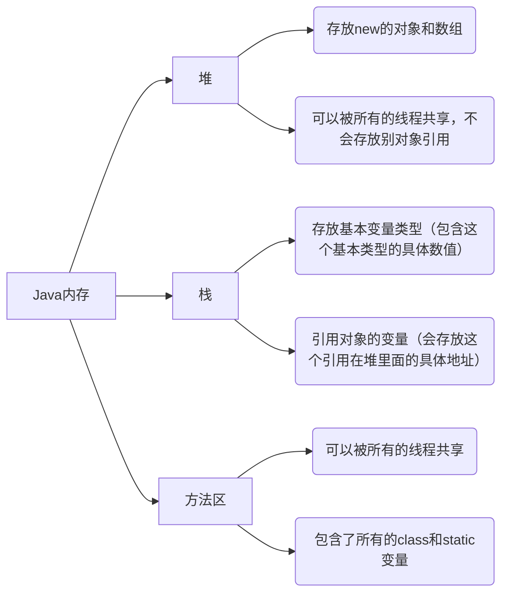
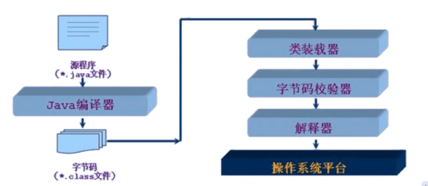
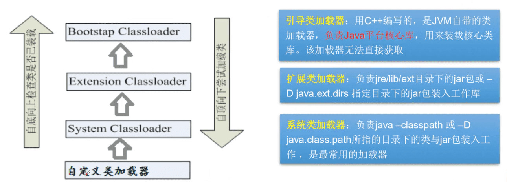

Java注解
-------------

可以把注解（Annotation）理解为**标签**🏷。标签是一张便利纸，标签上的内容可以自由定义。往抽象地说，标签并不一定是一张纸，它可以是对人和事物的属性评价。也就是说，标签具备对于抽象事物的解释。

**标签是对事物行为的某些角度的评价与解释。** **想像代码具有生命，注解就是对于代码中某些鲜活个体的贴上去的一张标签。**


### 注解的定义

注解同 `classs` 和 `interface` 一样，也属于一种类型，通过`@interface`关键字定义。

```java
public @interface TestAnnotation {
}
```

### 注解的使用

```java
@TestAnnotation
public class Test {
}
```

将 TestAnnotation 这张标签(注解)贴到 Test 这个类上面。

要想注解能够正常工作，还需要用到新的概念那就是**元注解**。

### 元注解

元注解是可以**注解到注解上的注解**，或者说元注解是一种基本注解，但是它能够应用到其它的注解上面。

元注解也可以理解为一张标签，但是它是一张特殊的标签，它的作用和目的就是<u>给其他普通的标签进行解释说明的。</u>

元标签有 `@Retention`、`@Documented`、`@Target`、`@Inherited`、`@Repeatable` 5 种。

#### @Retention

为保留期的意思。解释说明了注解的的**存活时间**。它的取值有三种：

- `RetentionPolicy.SOURCE` 	注解只在源码阶段保留，在编译器进行编译时它将被丢弃忽视。
- `RetentionPolicy.CLASS`        注解只被保留到编译进行的时候，它并不会被加载到 JVM 中。
- `RetentionPolicy.RUNTIME`    注解可以保留到程序运行的时候，它会被加载进入到 JVM 中，所以在程序运行时可以获取到它们。

```java
@Retention(RetentionPolicy.RUNTIME)
public @interface TestAnnotation {
}
```

runtime > class > source

#### @Documented

表示是否将注解生成到JavaDoc中


#### @Target

@Target 指定了注解可以使用的地方。 当一个注解被 @Target 注解时，这个注解就被限定了**运用的场景**。

类比到标签，原本标签是你想张贴到哪个地方就到哪个地方，但是因为 @Target 的存在，它张贴的地方就非常具体了。@Target 的取值:

- `ElementType.ANNOTATION_TYPE`   可以给一个注解进行注解
- `ElementType.CONSTRUCTOR`   可以给构造方法进行注解
- `ElementType.FIELD`   可以给属性进行注解
- `ElementType.LOCAL_VARIABLE`   可以给局部变量进行注解
- `ElementType.METHOD`   可以给方法进行注解
- `ElementType.PACKAGE`   可以给一个包进行注解
- `ElementType.PARAMETER`   可以给一个方法内的参数进行注解
- `ElementType.TYPE`   可以给一个类型进行注解，比如类、接口、枚举

```java
@Target(value = {ElementType.METHOD, ElementType.TYPE})
@interface MyAnnotation {
  
}
```


#### @Inherited

如果一个超类被 @Inherited 注解过的注解进行注解的话，那么如果它的子类没有被任何注解应用的话，那么这个子类就继承了超类的注解。

```java
@Inherited
@Retention(RetentionPolicy.RUNTIME)
@interface Test {}

@Test
public class A {}

public class B extends A {}

```

类 B 也拥有 @Test 这个注解。


#### @Repeatable

可重复的意思。通常是注解的值可以同时取多个。

```java
@interface Persons {
    Person[]  value();
}

@Repeatable(Persons.class)
@interface Person{
    String role default "";
}

@Person(role="artist")
@Person(role="coder")
@Person(role="PM")
public class SuperMan{
}
```

@Repeatable 注解了 Person。而 @Repeatable 后面括号中的类相当于一个**容器注解**。容器注解就是用来存放其它注解的地方。

什么是容器注解呢？就是用来存放其它注解的地方。它本身也是一个注解。


### 注解的属性

注解的属性也叫做**成员变量**。注解只有成员变量，没有方法。注解的成员变量在注解的定义中以“<u>无形参的方法</u>”形式来声明，其方法名定义了该成员变量的名字，其返回值定义了该成员变量的类型。

```java
@Target(ElementType.TYPE)
@Retention(RetentionPolicy.RUNTIME)
public @interface TestAnnotation {
    int id();
    String msg();
}

```

定义了 TestAnnotation 这个注解中拥有 id 和 msg 两个属性。在使用的时候，应该给它们进行赋值。

赋值的方式是在注解的括号内以 `value= ` 形式，多个属性之前用`,`隔开:

```java
@TestAnnotation(id=3,msg="hello annotation")
public class Test {
}
```

**注：**在注解中定义属性时它的类型必须是8种基本数据类型外加类、接口、注解及它们的数组。

注解中属性可以有默认值，默认值需要用`default`关键值指定：

```java
@Target(ElementType.TYPE)
@Retention(RetentionPolicy.RUNTIME)
public @interface TestAnnotation {
    public int id() default -1;
    public String msg() default "Hi";
}
```

如果一个注解内仅仅只有一个名字为 value 的属性时，应用这个注解时可以直接接属性值填写到括号内：

```java
public @interface Check {
    String value();
}

@Check("hi")
int a;

```

如果一个注解没有任何属性，那么在应用这个注解的时候，括号都可以省略：

```java
public @interface Perform {}

@Perform
public void testMethod(){}
```


### Java预置的注解

#### @Deprecated

用来标记过时的元素，编译器在编译阶段遇到这个注解时会发出提醒警告，告诉开发者正在调用一个过时的元素比如过时的方法、过时的类、过时的成员变量。


#### @Override

提示子类要重写父类中被`@Override`修饰的方法。


#### @SuppressWarnings

抑制编译时的警告信息。


#### @SafeVarargs

参数安全类型注解。它的目的是提醒开发者不要用参数做一些不安全的操作,它的存在会阻止编译器产生 unchecked 这样的警告。


#### @FunctionalInterface

函数式接口注解。


### 注解的提取

形象的比喻就是把注解标签在合适的时候撕下来，然后检阅上面的内容信息。

注解通过反射获取。

首先通过`Class`对象的`isAnnotationPresent()`方法判断它是否应用了某个注解；

然后通过`getAnnotation()`方法（或者`getAnnotations()`）来获取`Annotation`对象。

```java
import java.lang.annotation.Retention;
import java.lang.annotation.RetentionPolicy;

@TestAnnotation()
public class JavaJustTest {
    public static void main(String[] args) {

        boolean hasAnnotation = JavaJustTest.class.isAnnotationPresent(TestAnnotation.class);
        if (hasAnnotation) {
            TestAnnotation testAnnotation = JavaJustTest.class.getAnnotation(TestAnnotation.class);
            System.out.println("id= " + testAnnotation.id());
            System.out.println("msg= " + testAnnotation.msg());
        }

    }
}

@Retention(RetentionPolicy.RUNTIME)
@interface TestAnnotation {
    int id() default -1;
    String msg() default  "Hi";
}
```

结果：

```
id= -1
msg= Hi
```

上面只获取了注解在类上的注解，其实属性、方法上的注解也是可以获取的。🔖


### 注解的使用场景

官方文档对注解的定义：

> 注解是一系列元数据，它提供数据用来解释程序代码，但是注解并非是所解释的代码本身的一部分。注解对于代码的运行效果没有直接影响。
>
> 注解有许多用处，主要如下：
>
> - 提供信息给编译器： 编译器可以利用注解来探测错误和警告信息
> - 编译阶段时的处理： 软件工具可以用来利用注解信息来生成代码、Html文档或者做其它相应处理。
> - 运行时的处理： 某些注解可以在程序运行的时候接受代码的提取值得注意的是，注解不是代码本身的一部分。

注解主要针对的是编译器和其它工具软件(SoftWare tool)。

当开发者使用了Annotation 修饰了类、方法、Field 等成员之后，这些 Annotation 不会自己生效，必须由开发者提供相应的代码来提取并处理 Annotation 信息。这些处理提取和处理 Annotation 的代码统称为 **APT**（Annotation Processing Tool，注解处理器)。


### 注解应用实例

```java
@Target({ElementType.TYPE, ElementType.METHOD})
@Retention(RetentionPolicy.RUNTIME)
@interface MyAnnotation {
	// 注解的参数：参数类型+参数名();
  String name() default "";
  int age();
  int id default -1;
  
  String[] schools() default {"清华大学", "南京林业大学"};
}
```


### 参考

[java注解-最通俗易懂的讲解](https://blog.csdn.net/qq1404510094/article/details/80577555)

[【狂神说Java】注解和反射](https://www.bilibili.com/video/BV1p4411P7V3)


注解 注释给程序和人看

Annotation的作用：

- 不是程序本身，可以给程序作出解释（这点和注释comment没什么区别）
- 可以被其它程序（如：编译器）读取。

Annotation的格式：

- `@注释名`，还可以添加一些参数值，如：`@SuppressWarnings(value="unchecked")`

Annotation在哪里使用？

可以附加在package，class，method，field等上面，相当于给它们添加了额外的辅助信息。可以通过反射机制编程实现对这些元数据的访问。


## Java反射

### 静态 VS 动态语言

动态语言在运行时代码可以根据某些条件改变自身结构。主要：JavaScript、PHP、Python等。

静态语言在运行时结构不可变。主要Java、C、C++。

Java可通过反射机制，具有一定的动态性。

### Java Reflection

Java反射机制允许程序在执行期借助于ReflectionAPI取得任何类的内部信息，并能直接操作任意对象的内部属性及方法。

```java
Class c = Class.forName("java.lang.String");
```

在加载完类之后，在堆内存的方法区中产生了一个`Class`类型的对象（一个类只有一个Class对象），这个对象就包含了完整的类的结构信息。


### 反射机制提供的功能

- 在运行时判任意一个对象所属的类
- 在运行时构造任意一个类的对象
- 在运行时判断任意一个类所具有的成员变量和方法
- 在运行时获取泛型信息
- 在运行时调用任意一个对象的成员变量和方法
- 在运行时处理注解
- 生成动态代理
- ....


### 反射的优缺点

优点：可以实现动态创建对象和编译，体现出很大的灵活性

缺点：对性能有影响


### 反射相关的主要API

```
java.lang.Class	
java.lang.reflect.Method
java.lang.reflect.Filed
java.lang.reflect.Constructor
....
```


- 一个类在内存中只有一个`Class`对象

- 一个类被加载后，类的整个结构都会被封装在`Class`对象中。


在`Object`类中定义了一下的方法：

```java
public final Class getClass()
```

### Class类

- Class本身也是一个类
- Class对象只能由系统建立对象
- 一个加载的类在JVM中只会有一个Class实例
- 一个Class对象对应的是一个加载到JVM中的一个.class文件
- 每个类的实例都会记得自己是由哪个Class实例所生成
- 通过Class可以完整地得到一个类中的所有被加载的结构
- Class类是Reflection的根源，针对任何你想动态加载、运行的类，唯有先获得相应的Class对象

#### Class类的常用方法

| 方法名                                  | 功能说明                                                     |
| --------------------------------------- | ------------------------------------------------------------ |
| static ClassforName(String name)        | 返回指定类名name的Class对象                                  |
| Object newInstance()                    | 调用缺省构造函数，返回Class对象的一个实例                    |
| getName()                               | 返回此Class对象所表示的实体（类，接口，数组类或void）的名称。 |
| Class getSuperClass()                   | 返回当前Class对象的父类的Class对象                           |
| Class[] getinterfaces()                 | 获取当前Class对象的接口                                      |
| ClassLoader getClassLoader()            | 返回该类的类加载器                                           |
| Constructor[] getConstructors()         | 返回一个包含某些Constructor对象的数组                        |
| Method getMethed（String name，ClassT） | 返回一个Method对象，此对象的形参类型为paramType              |
| Field[] getDeclaredFields()             | 返回Field对象的一个数组                                      |

 

### Class类对象的获得方式

```java
person.getClass();

Class.forName("com.andyron.Person");

Person.class;

//基本类型的包装类都有一个TYPE属性
Integer.TYPE
```


### 哪些类型可以有Class对象？

- class：外部类，成员（成员内部类，静态内部类），局部内部类，匿名内部类
- interface
- 数组
- 枚举
- 注解
- 基本数据类型
- void

```java
Class c1 = Object.class;
Class c2 = Comparable.class;
Class c3 = String[].class;
Class c4 = int[][].class;
Class c5 = Override.class;
Class c6 = ElementType.class;
Class c7 = Integer.class;
Class c8 = void.class;
Class c9 = Class.class;

System.out.println(c1);
System.out.println(c2);
System.out.println(c3);
System.out.println(c4);
System.out.println(c5);
System.out.println(c6);
System.out.println(c7);
System.out.println(c8);
System.out.println(c9);
```

结果：

```
class java.lang.Object
interface java.lang.Comparable
class [Ljava.lang.String;
class [[I
interface java.lang.Override
class java.lang.annotation.ElementType
class java.lang.Integer
void
class java.lang.Class
```

下面结果是相同的：

```java
int[] a = new int[10];
int[] b = new int[100];
        System.out.println(a.getClass().hashCode());
System.out.println(b.getClass().hashCode());
```

### Java内存分析



### 类的加载过程

1. 类的加载（Load）

将类的class文件读入内存，并为之创建一个java.lang.Class对象。此过程由类加载器完成

2. 类的链接（Link）

将类的二进制数据合并java运行环境（JRE）中

- 验证：确保加载的类信息符合JVM规范，没有安全方面的问题
- 准备：正式为类变量（static）分配内存并设置**类变量默认初始值**的阶段，这些内存都将在方法区中进行分配。
- 解析：虚拟机常量池内的符号引用（常量名）替换为直接引用（地址）的过程。

3. 类的初始化（initialize）

JVM负责对类进行初始化

- 执行类构造器<clinit>()方法的过程。类构造器<clinit>()方法是由编译期自动收集类中所有类变量的赋值动作和静态代码块中的语句合并产生的。（**类构造器是构造类信息的，不是构造该类对象的构造器**）。
- 当初始化一个类的时候，如果发现其父类还没有进行初始化，则需要先触发其父类的初始化。
- 虚拟机会保证一个类的<clinit>()方法在多线程环境中被正确加锁和同步。

🔖

### 什么时候会发生类初始化？

- 类的主动引用（一定会发生类的初始化）
  - 当虚拟机启动，先初始化main方法所在的类
  - new一个类的对象
  - 调用类的静态成员（除了final常量）和静态方法
  - 使用java.lang.reflect包的方法对类进行反射调用
  - 当初始化一个类，如果其父类没有被初始化，则**先会初始化它的父类**
- 类的被动引用（不会发生类的初始化）
  - 当访问一个静态域时，只有真正声明这个域的类才会被初始化。如：当通过子类引用父类的静态变量，不会导致子类初始化
  - 通过数组定义 类引用，不会触发此类的初始化
  - 引用常量不会触发此类的初始化（常量在链接阶段就存入调用类的常量池中了）


### 类加载器的作用

- 类加载的作用：将class文件字节码内容加载到内存中，并将这些静态数据转换成方法区的运行时数据结构，然后在堆中生成一个代表这个类的java.lang.Class对象，作为方法区中类数据的访问入口。
- 类缓存：标准的JavaSE类加载器可以按要求查找类，但一旦某个类被加载到类加载器中，它将维持加载（缓存）一段时间。不过JVM垃圾回收机制可以回收这些Class对象




Java核心库（rt.jar）




### 创建运行时类的对象

#### 获取运行时类的完整结构

```java
Class c1 = Class.forName("com.andyron.reflection.User");

// 获得类的名字
System.out.println(c1.getName()); // 包名+类名
System.out.println(c1.getSimpleName()); // 类名

System.out.println("===================");
// 获得类的属性
Field[] fields = c1.getFields(); // 只能获得public属性
for (Field field : fields) {
  System.out.println(field);
}
fields = c1.getDeclaredFields();
for (Field field : fields) {
  System.out.println(field);
}
// 获得指定属性
System.out.println(c1.getDeclaredField("name"));

System.out.println("===================");

// 获得方法
Method[] methods = c1.getMethods();  // 获得本类及其父类的所有public方法
for (Method method : methods) {
  System.out.println("getMethods:" + method);
}
methods = c1.getDeclaredMethods();  // 获得本类的或有方法
for (Method method : methods) {
  System.out.println("getDeclaredMethods" + method);
}
// 获得指定方法
Method getName = c1.getMethod("getName", null);
Method setName = c1.getMethod("setName", String.class);
System.out.println(getName);
System.out.println(setName);

System.out.println("===================");

// 获得构造器方法
Constructor[] constructors = c1.getConstructors();
for (Constructor constructor : constructors) {
  System.out.println(constructor);
}
```

### 动态创建对象

创建类的对象：调用Class对象的newInstance()方法

1. 类必须有一个无参构造器
2. 类的构造器访问权限需要足够


```java
Class c1 = Class.forName("com.andyron.reflection.User");

User user = (User)c1.newInstance(); // 本质是调用无参构造器，如果没有无参构造就会报错
System.out.println(user);

// 通过获取构造器创建对象
Constructor constructor = c1.getDeclaredConstructor(int.class, String.class, int.class);
User user2 = (User)constructor.newInstance(1, "andyorn", 58);
System.out.println(user2);

// 通过反射调用普通方法
User user3 = (User)c1.newInstance();
Method setName = c1.getDeclaredMethod("setName", String.class);
setName.invoke(user3, "小明");  // 激活方法
System.out.println(user3.getName());

// 通过反射操作属性
User user4 = (User)c1.newInstance();
Field name = c1.getDeclaredField("name");
// 不能直接操作private属性，要关闭自动安全监测
name.setAccessible(true);
name.set(user4, "小戎");
System.out.println(user4.getName());
```


#### setAccessible

- Method和Field、 Constructor对象都有setAccessible()方法。
- setAccessible作用是启动和禁用访问安全检查的开关。
- 参数值为true则指示反射的对象在使用时应该取消Java语言访问检查。
  - 提高反射的效率。如果代码中必须用反射，而该句代码需要频繁的被调用，那么请设置为true。 
  - 使得原本无法访问的私有成员也可以访问
- 参数值为false则指示反射的对象应该实施Java语言访问检查

#### 性能对比


### 反射操作泛型

- Java采用泛型擦除的机制来引入泛型，Java中的泛型仅仅是给编译器javac使用的，确保数据的安全性和免去强制类型转换问题，但是，一旦编译完成，所有和泛型有关的类型全部擦除

- 为了通过反射操作这些类型，Java新增了ParameterizedType，GenericArrayType，TypeVariable和WildcardType几种类型来代表不能被归一到Class类中的类型但是又和原始类型齐名的类型，

  

- ParameterizedType：表示一种参数化类型，比如`Collection<String>`

- GenericArrayType：表示一种元素类型是参数化类型或者类型变量的数组类型

- TypeVariable：是各种类型变量的公共父接口

- WildcardType：代表一种通配符类型表达式


### 反射操作注解


