 《深入理解Java虚拟机（第3版）： JVM高级特性与最佳实践》笔记
------------------

[勘误](https://github.com/fenixsoft/jvm_book)

[Java虚拟机规范 和 Java语言规范](https://docs.oracle.com/javase/specs/index.html)

第3版出版于：2019-12

## 前言

Java的技术体系主要由支撑Java程序运行的**虚拟机**、提供各开发领域接口支持的**Java类库**、**Java编程语言**及许许多多的**第三方Java框架**（如Spring、MyBatis等）构成。

虚拟机层面隐藏了底层技术的复杂性以及机器与操作系统的差异性。

程序员可以把主要精力放在具体业务逻辑，而不是放在保障物理硬件的兼容性上。

绝大多数情况下，提升硬件性能无法等比例提升程序的运行性能和并发能力，甚至有可能对程序运行状况没有任何改善。两个原因：

- 一是JVM为了达到“所有硬件提供一致的虚拟平台”的目的，牺牲了一些硬件相关的性能特性。
- 二是人为原因，如果开发人员不了解虚拟机诸多技术特性的运行原理，就无法写出最适合虚拟机运行和自优化的代码。

商用的高性能JVM都提供了相当多的**优化参数和调节手段**，用于满足应用程序在实际生产环境中对性能和稳定性的要求。

# 一、走近Java

## 1 走近Java

> 世界上并没有完美的程序，但我们并不因此而沮丧，因为写程序本来就是一个不断追求完美的过程。

Java不可忽视的优点：

它**摆脱了硬件平台的束缚**，实现了“一次编写，到处运行”的理想；

它提供了一种**相对安全的内存管理和访问机制**，避免了绝大部分**内存泄漏和指针越界**问题；

它实现了**热点代码检测和运行时编译及优化**，这使得Java应用能随着运行时间的增长而获得更高的性能；

它有一套**完善的应用程序接口**，还有无数来自商业机构和开源社区的**第三方类库**来帮助用户实现各种各样的功能……


### Java技术体系

JCP（Java Community Process，也就是“Java社区”) 官方定义的Java技术体系：

- Java程序设计语言
- 各种硬件平台上的**Java虚拟机**实现
- Class文件格式
- Java类库API
- 来自商业机构和开源社区的**第三方Java类库**


**JDK**（Java Development Kit）：Java程序设计语言、Java虚拟机、Java类库。JDK是支持Java程序开发的最小环境，有时JDK就代指Java技术体系。

**JRE**（Java Runtime Environment）：类库API中的**Java SE API**子集和Java虚拟机。JRE是支持Java程序运行的标准环境。

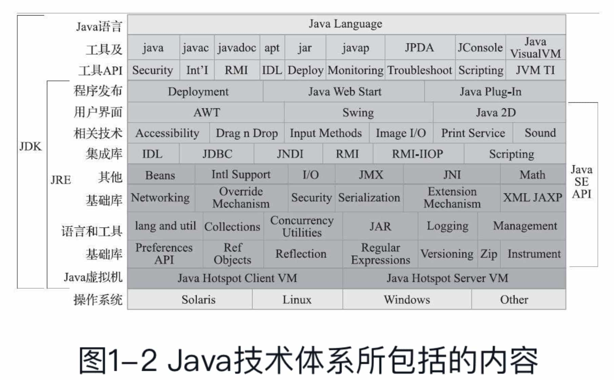

按照技术所服务的领域，Java技术体系可分为四条产品线：

1. Java Card：支持Java小程序（Applets）运行在小内存设备（如智能卡）上的平台。
2. Java ME（Micro Edition）：支持Java程序运行在移动终端（手机、PDA）上的平台，对Java API有所精简，并加入了移动终端的针对性支持，这条产品线在JDK 6以前被称为J2ME。有一点读者请勿混淆，现在在智能手机上非常流行的、主要使用Java语言开发程序的Android并不属于Java ME。
3. Java SE（Standard Edition）：支持面向桌面级应用（如Windows下的应用程序）的Java平台，提供了完整的Java核心API，这条产品线在JDK 6以前被称为J2SE。
4. Java EE（Enterprise Edition）

### Java发展史

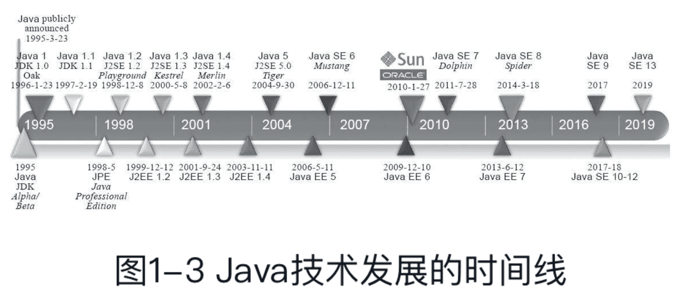

- 1991年4月，Oak。

- 1995年5月23日，Oak语言改名为Java，提出“Write Once，Run Anywhere”。

- 1996年1月23日，JDK 1.0发布，提供了一个纯解释执行的Java虚拟机实现（**Sun Classic VM**）。

- 1997年2月19日，Sun公司发布了JDK 1.1，JAR文件格式、JDBC、JavaBeans、RMI，内部类（Inner Class）和反射（Reflection）等。

- 1998年12月4日，JDK 1.2，拆分为三个方向，内置了**JIT（Just In Time）**即时编译器。

- 1999年4月27日，**HotSpot**虚拟机诞生。

- 2000年5月8日，JDK 1.3，改进Java类库上（如数学运算和新的Timer API等），JNDI。

- 2002年2月13日，JDK 1.4，标志着Java真正**走向成熟**，正则表达式、异常链、NIO、日志类、XML解析器和XSLT转换器等。

- 2004年9月30日，JDK 5，在Java语法易用性上做出了非常大的改进如：自动装箱、泛型、动态注解、枚举、可变长参数、遍历循环（foreach循环）等。

  JDK5改进了Java的内存模型（Java Memory Model，JMM）、提供了java.util.concurrent并发包等。

- 2006年12月11日，JDK 6，启用Java EE 6、Java SE 6、Java ME 6的新命名，提供初步的动态语言支持（通过内置Mozilla JavaScript Rhino引擎实现）、提供编译期注解处理器和微型HTTP服务器API，等。

  对Java虚拟机内部做了大量改进，包括锁与同步、垃圾收集、类加载等方面的实现都有相当多的改动。

- 2006年11月13日，Java开源，建立了OpenJDK组织

- 2009年4月20日，Oracle收购Sun。

  Java商标正式划归Oracle所有（Java语言本身并不属于哪间公司所有，它由**JCP**组织进行管理，尽管在JCP中Sun及后来的Oracle的话语权很大）。

- 2014年3月18日，JDK 8，Oracle启用**JEP（JDK Enhancement Proposals）**来定义和管理纳入新版JDK发布范围的功能特性。

  JEP 126：对Lambda表达式的支持，这让Java语言拥有了流畅的函数式表达能力。

  JEP 104：内置Nashorn JavaScript引擎的支持。

  JEP 150：新的时间、日期API。

  JEP 122：彻底移除HotSpot的永久代。

  ...

- 2017年9月21日，JDK 9，**Jigsaw**模块化功能。

  Java确实有模块化的刚需，不论是JDK自身（例如拆分出Java SE Embedded这样规模较小的产品）抑或是Java应用都需要用到模块化。

  JDK 9发布后，Oracle随即宣布Java将会以持续交付的形式和更加敏捷的研发节奏向前推进，以后JDK将会在每年的3月和9月各发布一个大版本，目的就是为**避免众多功能特性被集中捆绑到一个JDK版本上而引发交付风险**。

- 2018年3月20日，JDK 10，内部重构，诸如统一源仓库、统一垃圾收集器接口、统一即时编译器接口（JVMCI在JDK 9已经有了，这里是引入新的**Graal即时编译器**）等。

- 2018年9月25日，JDK 11，Oracle同时调整了JDK的授权许可证。

  首先，Oracle从JDK 11起把以前的商业特性全部开源给OpenJDK，这样OpenJDK 11和OracleJDK 11的代码和功能，在**本质上就是完全相同的**（官方原文是Essentially Identical）。

  然后，Oracle宣布以后将会同时发行两个JDK：一个是以GPLv2+CE协议下由Oracle发行的OpenJDK（本书后面章节称其为Oracle OpenJDK），另一个是在新的OTN协议下发行的传统的OracleJDK，这两个JDK共享绝大部分源码，在功能上是几乎一样的，核心差异是前者可以免费在开发、测试或生产环境中使用，但是只有半年时间的更新支持；后者个人依然可以免费使用，但若在生产环境中商用就必须付费，可以有三年时间的更新支持。

  如果说由此能得出“Java要收费”的结论，那是纯属标题党，最多只能说Oracle在迫使商业用户要么不断升级JDK的版本，要么就去购买商业支持。

- 2019年3月20日，JDK 12，Switch表达式、Java微测试套件（JMH）等。


在Sun掌舵的前十几年里，Java获得巨大成功，同时也渐渐显露出来语言演进的缓慢与社区决策的老朽；而在Oracle主导Java后，引起竞争的同时也带来新的活力，Java发展的速度要显著高于Sun时代。

### Java虚拟机家族

#### 1 虚拟机始祖：Sun Classic/Exact VM

只能使用纯解释器方式来执行Java代码软件

#### 2 武林盟主：HotSpot VM

热点代码探测技术

#### 3 小家碧玉：Mobile/Embedded VM


#### 4 天下第二：BEA JRockit/IBM J9 VM


#### 5 软硬合璧：BEA Liquid VM/Azul VM


#### 6 挑战者：Apache Harmony/Google Android Dalvik VM


#### 7 没有成功，但并非失败：Microsoft JVM及其他


#### 8 百家争鸣

KVM

Java Card VM

Squawk VM

JavaInJava

...

### 展望Java技术的未来

#### 无语言倾向

Java“天下第一”的底气不在于语法多么先进好用，而是来自它**庞大的用户群和极其成熟的软件生态**，这在朝夕之间难以撼动。

**Graal VM**

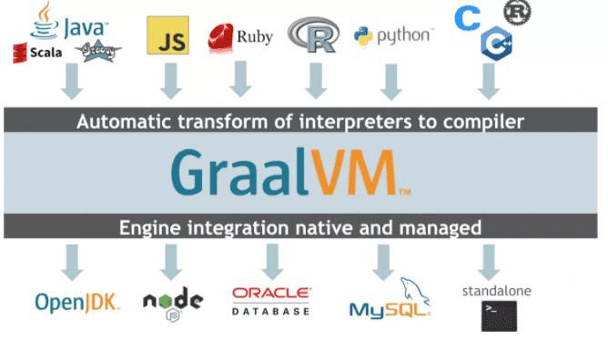

Graal VM被官方称为“Universal VM”和“Polyglot VM”，这是一个在HotSpot虚拟机基础上增强而成的**跨语言全栈虚拟机**，可以作为“任何语言”的运行平台使用，这里“任何语言”包括了Java、Scala、Groovy、Kotlin等基于Java虚拟机之上的语言，还包括了C、C++、Rust等基于LLVM的语言，同时支持其他像JavaScript、Ruby、Python和R语言等。

Graal VM的基本工作原理是将这些语言的源代码（例如JavaScript）或源代码编译后的中间格式（例如LLVM字节码）通过解释器转换为能被Graal VM接受的中间表示（Intermediate Representation，IR），譬如设计一个解释器专门对LLVM输出的字节码进行转换来支持C和C++语言，这个过程称为**程序特化**（Specialized，也常被称为PartialEvaluation）。Graal VM提供了Truffe工具集来快速构建面向一种新语言的解释器，并用它构建了一个称为Sulong的高性能LLVM字节码解释器。

从更严格的角度来看，Graal VM才是**真正意义上与物理计算机相对应的高级语言虚拟机**，理由是它与物理硬件的指令集一样，做到了只与机器特性相关而不与某种高级语言特性相关。

#### 新一代即时编译器

HotSpot虚拟机中含有两个即时编译器，分别是编译耗时短但输出代码优化程度较低的客户端编译器（简称为C1）以及编译耗时长但输出代码优化质量也更高的服务端编译器（简称为C2）。

Graal编译器

#### 向Native迈进

对不需要长时间运行的，或者小型化的应用而言，Java天生就带有一些劣势。Java的启动时间相对较长，需要预热才能达到最高性能。

AWS Lambda

提前编译（Aheadof Time Compilation，AOT）

Substrate VM

#### 灵活的胖子

HotSpot的定位是**面向各种不同应用场景的全功能Java虚拟机**。

近几年，HotSpot开发团队正在持续地重构着HotSpot的架构，让它具有**模块化的能力和足够的开放性**。

#### 语言语法持续增强

语言的功能特性和语法是相对最不重要的改进点，毕竟连JavaScript这种“反人类”的语法都能获得如此巨大的成功，而比Java语法先进优雅得多的挑战者C#现在已经“江湖日下”，成了末路英雄。


### 实战：自己编译JDK🔖

#### 获取源码

[OpenJDK](http://openjdk.java.net/ )

 

[OpenJDK 12](https://hg.openjdk.java.net/jdk/jdk12/)

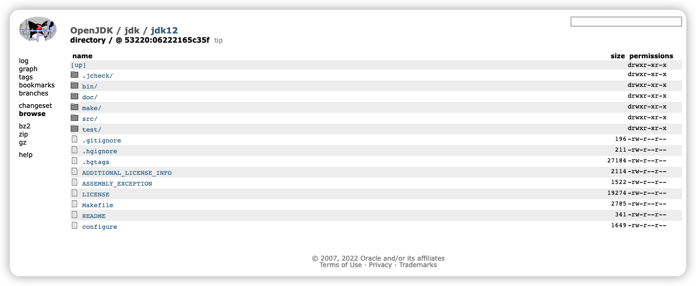

#### 系统需求

认真阅读一遍doc/building.html


#### 构建编译环境


#### 进行编译


#### 在IDE工具中进行源码调试


# 二、自动内存管理

## 2 Java内存区域与内存溢出异常

### 2.2 运行时数据区域

Java虚拟机在执行Java程序的过程中会把它所管理的内存划分为若干个不同的数据区域。

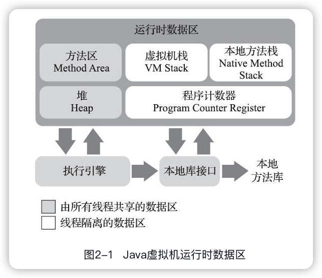

#### 程序计数器（线程私有）

**程序计数器（Program Counter Register）**是一块较小的内存空间，它可以看作是当前线程所执行的**==字节码的行号==**指示器。

字节码解释器工作时就是通过改变这个计数器的值来选取下一条需要执行的字节码指令。

如果线程正在执行的是一个Java方法，这个计数器记录的是正在执行的虚拟机**字节码指令的地址**；如果正在执行的是本地（Native）方法，这个计数器值则应为**空（Undefined）**。


#### Java虚拟机栈（线程私有）

Java虚拟机栈（Java Virtual Machine Stack）的生命周期与线程相同。

虚拟机栈描述的是Java方法执行的线程内存模型：每个方法被执行的时候，Java虚拟机都会同步创建一个==栈帧（Stack Frame）==用于存储**==局部变量表、操作数栈、动态连接、方法出口==**等信息。每一个方法被调用直至执行完毕的过程，就对应着一个栈帧在虚拟机栈中从入栈到出栈的过程。

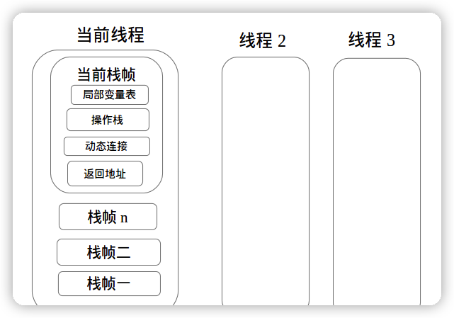

局部变量表存放了编译期可知的各种Java虚拟机**基本数据类型**（boolean、byte、char、short、int、foat、long、double）、**对象引用**（reference类型，它并不等同于对象本身，可能是一个指向对象起始地址的引用指针，也可能是指向一个代表对象的句柄或者其他与此对象相关的位置）和**returnAddress类型**（指向了一条字节码指令的地址）。它们在局部变量表中存储以**==局部变量槽（Slot）==**来表示，64位的long和double占用两个变量槽，其它只占用一个。

一个方法需要在栈帧中分配多大的局部变量空间是完全确定的，在方法运行期间不会改变。（这里的”大小“是指局部变量槽的数量，但一个变量槽分配32个bit或64个或者更多，完全有具体的虚拟机实现决定）

Java虚拟机栈两类异常状况：线程请求的栈深度大于虚拟机所允许的深度，StackOverflowError；如果Java虚拟机栈容量可以动态扩展，当栈扩展时无法申请到足够的内存会抛出OutOfMemoryError异常。


#### 本地方法栈（线程私有）

本地方法栈（Native Method Stacks）与虚拟机栈所发挥的作用是非常相似的，其区别只是虚拟机栈为虚拟机执行Java方法（也就是字节码）服务，而本地方法栈则是为虚拟机使用到的本地（Native）方法服务。


#### Java堆（线程共享）

Java堆（Java Heap）是虚拟机所管理的内存中最大的一块，所有线程共享，虚拟机启动时创建，唯一目的就是**==存放对象实例==**和**==数组==**。

Java堆是垃圾收集器管理的内存区域，有时也被称作“**GC堆**”（Garbage Collected Heap）。

由于现代垃圾收集器大部分都是基于**分代收集理论**设计的，所以Java堆中经常会出现“新生代”“老年代”“永久代”“Eden空间”“From Survivor空间”“ToSurvivor空间”等名词，但这些并非Java虚拟机具体实现的固有内存布局，更不是《Java虚拟机规范》里对Java堆的进一步细致划分。

分配缓冲区（Thread Local Allocation Buffer，TLAB）

将Java堆细分的目的**只是为了更好地回收内存，或者更快地分配内存**。

Java堆可以处于**物理上不连续的内存空间中，但在逻辑上它应该被视为连续的**。

Java堆大小可通过参数`-Xmx`和`-Xms`设定来扩展。

OutOfMemoryError


#### 方法区（线程共享）

方法区用于存储已被虚拟机加载的**==类信息、常量、静态变量、即时编译器编译后的代码缓存==**等数据。

OutOfMemoryError

#### 运行时常量池（方法区的一部分）

Class文件中除了有类的版本、字段、方法、接口等描述信息外，还有一项信息是常量池表（Constant Pool Table），用于存放编译期生成的**各种字面量与符号引用**，这部分内容将在类加载后存放到方法区的运行时常量池（Runtime Constant Pool）中。

Java虚拟机对于Class文件每一部分（自然也包括常量池）的格式都有严格规定。


#### 直接内存

直接内存（Direct Memory）并不是虚拟机运行时数据区的一部分，也不是《Java虚拟机规范》中定义的内存区域。但是这部分内存也被频繁地使用，而且也可能导致OutOfMemoryError异常出现。


### 2.3 HotSpot虚拟机对象探秘

#### 对象的创建


HotSpot虚拟机字节码解释器（bytecodeInterpreter.cpp）中的代码片段：

```c++
// 确保常量池中存放的是已解释的类
if (!constants->tag_at(index).is_unresolved_klass()) {
    // 断言确保是klassOop和instanceKlassOop（这部分下一节介绍）
    oop entry = (klassOop) *constants->obj_at_addr(index);
    assert(entry->is_klass(), "Should be resolved klass");
    klassOop k_entry = (klassOop) entry;
    assert(k_entry->klass_part()->oop_is_instance(), "Should be instanceKlass");
    instanceKlass* ik = (instanceKlass*) k_entry->klass_part();
    // 确保对象所属类型已经经过初始化阶段
    if ( ik->is_initialized() && ik->can_be_fastpath_allocated() ) {
        // 取对象长度
        size_t obj_size = ik->size_helper();
        oop result = NULL;
        // 记录是否需要将对象所有字段置零值
        bool need_zero = !ZeroTLAB;
        // 是否在TLAB中分配对象
        if (UseTLAB) {
            result = (oop) THREAD->tlab().allocate(obj_size);
        }
        if (result == NULL) {
            need_zero = true;
            // 直接在eden中分配对象
retry:
            HeapWord* compare_to = *Universe::heap()->top_addr();
            HeapWord* new_top = compare_to + obj_size;
            // cmpxchg是x86中的CAS指令，这里是一个C++方法，通过CAS方式分配空间，并发失败的
               话，转到retry中重试直至成功分配为止
            if (new_top <= *Universe::heap()->end_addr()) {
                if (Atomic::cmpxchg_ptr(new_top, Universe::heap()->top_addr(), compare_to) != compare_to) {
                    goto retry;
                }
                result = (oop) compare_to;
            }
        }
        if (result != NULL) {
            // 如果需要，为对象初始化零值
            if (need_zero ) {
                HeapWord* to_zero = (HeapWord*) result + sizeof(oopDesc) / oopSize;
                obj_size -= sizeof(oopDesc) / oopSize;
                if (obj_size > 0 ) {
                    memset(to_zero, 0, obj_size * HeapWordSize);
                }
            }
            // 根据是否启用偏向锁，设置对象头信息
            if (UseBiasedLocking) {
                result->set_mark(ik->prototype_header());
            } else {
                result->set_mark(markOopDesc::prototype());
            }
            result->set_klass_gap(0);
            result->set_klass(k_entry);
            // 将对象引用入栈，继续执行下一条指令
            SET_STACK_OBJECT(result, 0);
            UPDATE_PC_AND_TOS_AND_CONTINUE(3, 1);
        }
    }
}
```


#### 对象的内存布局

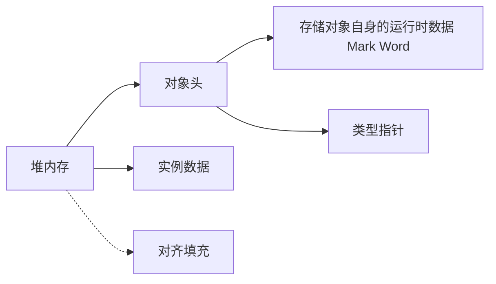
```mermaid
flowchart LR
a[堆内存] --> b[对象头]
a --> 实例数据
a -.-> 对齐填充
b --> d[存储对象自身的运行时数据<span> Mark Word</span>]
b --> 类型指针
```

HotSpot虚拟机对象的**对象头**部分包括两类信息。

1. 用于**存储对象自身的运行时数据**，如哈希码（HashCode）、GC分代年龄、锁状态标志、线程持有的锁、偏向线程ID、偏向时间戳等。

2. **类型指针**，即对象指向它的类型元数据的指针。

**实例数据**，无论是从父类继承下来的，还是在子类中定义的字段都必须记录起来。存储顺序会受到**虚拟机分配策略参数**（-XX：FieldsAllocationStyle参数）和字段在Java源码中**定义顺序**的影响。

HotSpot虚拟机默认的分配顺序为<u>longs/doubles、ints、shorts/chars、bytes/booleans、oops（Ordinary Object Pointers，OOPs）</u>。

**对齐填充**


#### 对象的访问定位

Java程序会通过栈上的**reference**数据来操作堆上的具体对象。由于reference类型在《Java虚拟机规范》里面只规定了它是一个指向对象的引用，并<u>没有定义这个引用应该通过什么方式去定位、访问到堆中对象的具体位置</u>，所以对象访问方式也是由虚拟机实现而定的。

主流的访问方式主要有两种：

1. 句柄。句柄池，reference中存储的就是对象的句柄地址，而句柄中包含了对象实例数据与类型数据各自具体的地址信息。

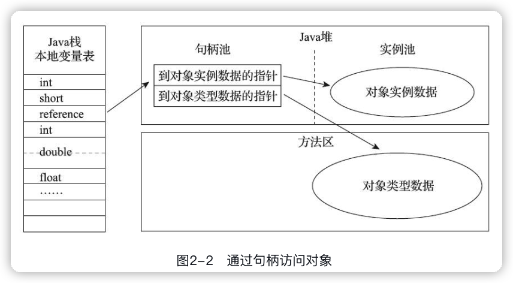

2. 直接指针

速度更快，HotSpot

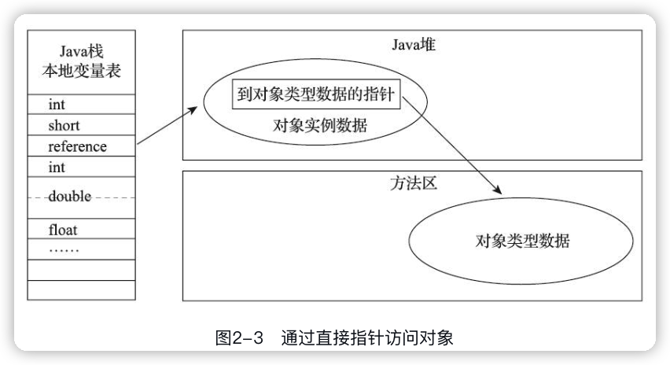


### 2.4 实战：OutOfMemoryError异常🔖

在《Java虚拟机规范》的规定里，除了程序计数器外，虚拟机内存的其他几个运行时区域都有发生OutOfMemoryError（下文称**OOM**）异常的可能。

能根据异常的提示信息迅速得知是哪个区域的内存溢出，知道怎样的代码可能会导致这些区域内存溢出，以及出现这些异常后该如何处理。

[jvm参数官方](https://docs.oracle.com/javase/8/docs/technotes/tools/unix/java.html)

新版的IDEA设置的虚拟机启动参数有点变化：

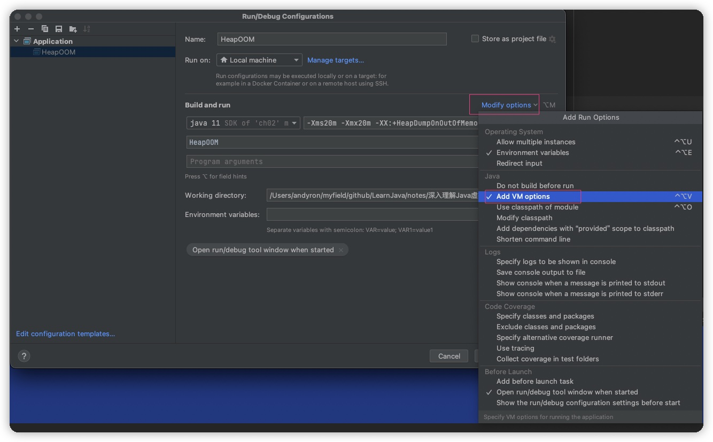

#### Java堆溢出

`-Xms20m -Xmx20m`：将堆的最小值-Xms参数与最大值-Xmx参数设置成一样的20MB，可避免堆自动扩展。

`-XX:+HeapDumpOnOutOfMemoryError`：让虚拟机在出现内存溢出异常的时候Dump出当前的内存堆转储快照以便进行事后分析。

```java
/**
 * VM Args：-Xms20m -Xmx20m -XX:+HeapDumpOnOutOfMemoryError
 */
public class HeapOOM {

    static class OOMObject {
    }

    public static void main(String[] args) {
        List<OOMObject> list = new ArrayList<OOMObject>();

        while (true) {
            list.add(new OOMObject());
        }
    }
}
```

没有设置虚拟机启动参数时异常：

```
Exception in thread "main" java.lang.OutOfMemoryError: Java heap space
	at java.base/java.util.Arrays.copyOf(Arrays.java:3720)
	at java.base/java.util.Arrays.copyOf(Arrays.java:3689)
	at java.base/java.util.ArrayList.grow(ArrayList.java:238)
	at java.base/java.util.ArrayList.grow(ArrayList.java:243)
	at java.base/java.util.ArrayList.add(ArrayList.java:486)
	at java.base/java.util.ArrayList.add(ArrayList.java:499)
	at HeapOOM.main(HeapOOM.java:16)
```

设置后多了：

```
java.lang.OutOfMemoryError: Java heap space
Dumping heap to java_pid52263.hprof ...
Heap dump file created [29082846 bytes in 0.170 secs]
```

生成**java_pid52263.hprof**，IDEA可直接打开查看分析，也可通过专业的分析工具（如JProfiler）查看


#### 虚拟机栈和本地方法栈溢出

HotSpot虚拟机中并不区分虚拟机栈和本地方法栈。`-Xoss`（设置本地方法栈大小）没有效果，栈容量只能由`-Xss`参数来设定。


#### 方法区和运行时常量池溢出

-XX:PermSize

-XX:MaxPermSize

#### 本机直接内存溢出

-XX:MaxDirectMemorySize


## 3 垃圾收集器与内存分配策略

> Java与C++之间有一堵由**内存动态分配和垃圾收集技术**所围成的高墙，墙外面的人想进去，墙里面的人却想出来。

### 3.1　概述

垃圾收集（Garbage Collection，GC）

1960，Lisp，内存动态分配和垃圾收集技术，John McCarthy思考垃圾收集要完成的三件事：

- 哪些内存需要回收？
- 什么时候回收？
- 如何回收？

> 为什么我们还要去了解垃圾收集和内存分配？
>
> 需要排查各种内存溢出、内存泄漏问题时，当垃圾收集成为系统达到更高并发量的==瓶颈==时，我们就必须对这些“自动化”的技术实施必要的==监控和调节==。

Java堆和方法区有着很显著的不确定性：<u>一个接口的多个实现类需要的内存可能会不一样，一个方法所执行的不同条件分支所需要的内存也可能不一样，只有处于运行期间，我们才能知道程序究竟会创建哪些对象，创建多少个对象，这部分内存的分配和回收是动态的。</u>

### 3.2 对象已死？

#### 引用计数（Reference Counting）算法

优点：原理简单，判定效率高

缺点：需要额外的内存空间；有很多例外情况要考虑，必须要配合大量额外处理才能保证正确地工作。

```java
/**
 * testGC()方法执行后，objA和objB会不会被GC呢？
 * @author zzm
 */
public class ReferenceCountingGC {

    public Object instance = null;

    private static final int _1MB = 1024 * 1024;

    /**
     * 这个成员属性的唯一意义就是占点内存，以便能在GC日志中看清楚是否有回收过
     */
    private byte[] bigSize = new byte[2 * _1MB];

    public static void testGC() {
        ReferenceCountingGC objA = new ReferenceCountingGC();
        ReferenceCountingGC objB = new ReferenceCountingGC();
        objA.instance = objB;
        objB.instance = objA;

        objA = null;
        objB = null;

        // 假设在这行发生GC，objA和objB是否能被回收？
        System.gc();
    }
}
```


#### 可达性分析（Reachability Analysis）算法

当前主流的商用程序语言（Java、C#，上溯至前面提到的古老的Lisp）的内存管理子系统，都是通过可达性分析算法来判定对象是否存活的。

基本思路：通过一系列称为“**GC Roots**”的根对象作为起始节点集，从这些节点开始，根据引用关系向下搜索，搜索过程所走过的路径称为“**引用链**”（Reference Chain），如果某个对象到GC Roots间没有任何引用链相连，或者用图论的话来说就是从GC Roots到这个对象不可达时，则证明此对象是不可能再被使用的。

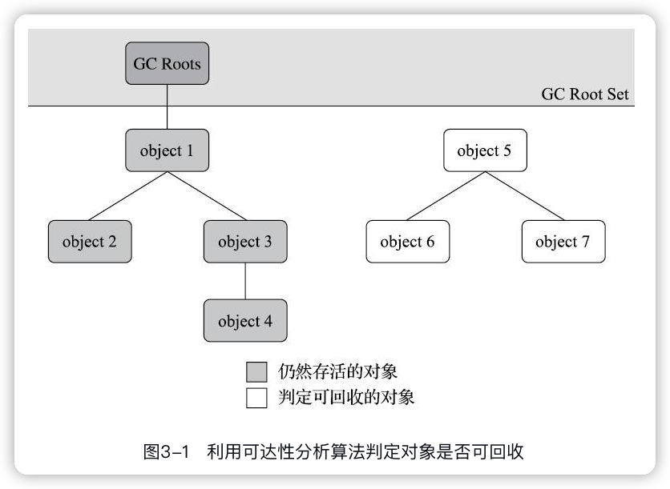

在Java技术体系里面，固定可作为GC Roots的对象包括以下几种：

- 在虚拟机栈（栈帧中的本地变量表）中引用的对象，譬如各个线程被调用的方法堆栈中使用到的参数、局部变量、临时变量等。
- 在方法区中类静态属性引用的对象，譬如Java类的引用类型静态变量。
- 在方法区中常量引用的对象，譬如字符串常量池（String Table）里的引用。
- 在本地方法栈中JNI（即通常所说的Native方法）引用的对象。
- Java虚拟机内部的引用，如基本数据类型对应的Class对象，一些常驻的异常对象（比如NullPointExcepiton、OutOfMemoryError）等，还有系统类加载器。
- 所有被同步锁（synchronized关键字）持有的对象。
- 反映Java虚拟机内部情况的JMXBean、JVMTI中注册的回调、本地代码缓存等。


#### 再谈引用

JDK 1.2版之前，优点狭隘的**引用**的定义：如果reference类型的数据中存储的数值代表的是另外一块内存的起始地址，就称该reference数据是代表某块内存、某个对象的引用。也就是“被引用”或者“未被引用”两种状态。

JDK 1.2版之后，扩充引用的定义，分为**强引用（StronglyRe-ference）、软引用（Soft Reference）、弱引用（Weak Reference）和虚引用（Phantom Reference）**，引用强度依次逐渐减弱。

#### 生存还是死亡？

标记过程

finalize()

F-Queue

#### 回收方法区

🔖

### 3.3 垃圾收集算法

收集理论和几种算法思想及其发展过程

#### 分代收集理论


#### 标记-清除算法


#### 标记-复制算法


#### 标记-整理算法


### 3.4 HotSpot的算法细节实现

#### 根节点枚举


#### 安全点


#### 安全区域


#### 记忆集与卡表


#### 写屏障


#### 并发的可达性分析


### 3.5 经典垃圾收集器

收集算法是内存回收的方法论，垃圾收集器就是内存回收的实践者。

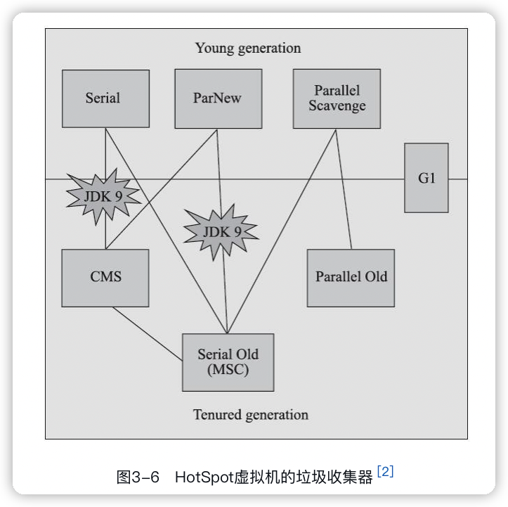

#### Serial收集器


#### ParNew收集器


#### Parallel Scavenge收集器


#### Serial Old收集器


#### Parallel Old收集器


#### CMS收集器


#### Garbage First收集器


### 3.6 低延迟垃圾收集器

#### Shenandoah收集器


#### ZGC收集器


### 3.7 选择合适的垃圾收集器

#### Epsilon收集器


#### 收集器的权衡


#### 虚拟机及垃圾收集器日志


```
-Xlog[:[selector][:[output][:[decorators][:output-options]]]]
```


```
add，age，alloc，annotation，aot，arguments，attach，barrier，biasedlocking，blocks，bot，breakpoint，bytecode，census，class，classhisto，cleanup，compaction，comparator，constraints，constantpool，coops，cpu，cset，data，defaultmethods，dump，ergo，event，exceptions，exit，fingerprint，freelist，gc，hashtables，heap，humongous，ihop，iklass，init，itables，jfr，jni，jvmti，liveness，load，loader，logging，mark，marking，metadata，metaspace，method，mmu，modules，monitorinflation，monitormismatch，nmethod，normalize，objecttagging，obsolete，oopmap，os，pagesize，parser，patch，path，phases，plab，preorder，promotion，protectiondomain，purge，redefine，ref，refine，region，remset，resolve，safepoint，scavenge，scrub，setting，stackmap，stacktrace，stackwalk，start，startuptime，state，stats，stringdedup，stringtable，subclass，survivor，sweep，system，task，thread，time，timer，tlab，unload，update，verification，verify，vmoperation，vtables，workgang
```


#### 垃圾收集器参数总结


### 3.8 实战：内存分配与回收策略

#### 对象优先在Eden分配


#### 大对象直接进入老年代


#### 长期存活的对象将进入老年代


#### 动态对象年龄判定


#### 空间分配担保


## 4 虚拟机性能监控、故障处理工具

### 4.1 概述

==**给一个系统定位问题的时候，知识、经验是关键基础，数据是依据，工具是运用知识处理数据的手段。**==

这里说的数据包括但不限于**异常堆栈、虚拟机运行日志、垃圾收集器日志、线程快照（threaddump/javacore文件）、堆转储快照（heapdump/hprof文件）**等。

### 4.2 基础故障处理工具

- 商业授权工具
- 正式支持工具
- 实验性工具

真正的功能代码是实现在JDK的工具类库中。

#### jps：虚拟机进程状况工具

JDK的很多小工具的名字都参考了UNIX命令的命名方式。

jps（JVM ProcessStatus Tool），列出正在运行的虚拟机进程，并显示虚拟机执行主类（Main Class，main()函数所在的类）名称以及这些进程的**本地虚拟机唯一ID**（LVMID，LocalVirtual Machine Identifier）。

LVMID与操作系统的进程ID（PID，Process Identifier）是一致的。


#### jstat：虚拟机统计信息监视工具

jstat（JVM Statistics Monitoring Tool），用于监视虚拟机各种运行状态信息。可以显示本地或者远程虚拟机进程中的类加载、内存、垃圾收集、即时编译等运行时数据。


#### jinfo：Java配置信息工具

jinfo（Configuration Info for Java）的作用是实时查看和调整虚拟机各项参数。

`-v`参数可以查看虚拟机启动时显式指定的参数列表。


#### jmap：Java内存映像工具

jmap（Memory Map for Java）命令用于生成堆转储快照（一般称为heapdump或dump文件）


#### jhat：虚拟机堆转储快照分析工具

jhat（JVM Heap Analysis Tool），搭配jmap，分析jmap生成的堆转储快照。


#### jstack：Java堆栈跟踪工具

jstack（Stack Trace for Java）命令用于生成虚拟机当前时刻的线程快照（一般称为threaddump或者javacore文件）。


#### 基础工具总结

- 基础工具：用于支持基本的程序创建和运行

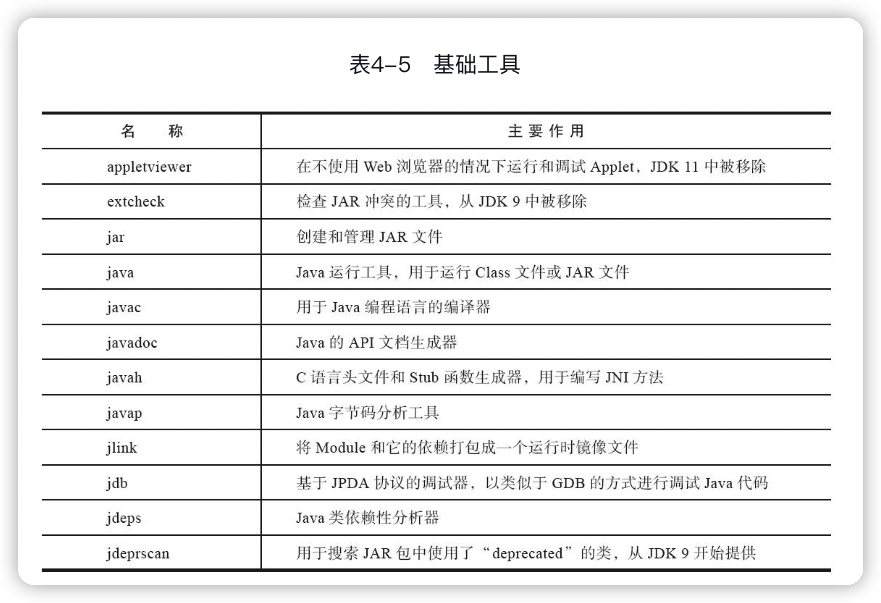

- 安全：用于程序签名、设置安全测试等

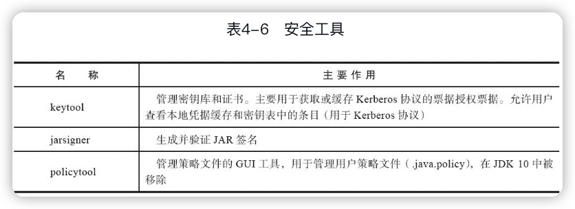

- 国际化：用于创建本地语言文件


- 远程方法调用：用于跨Web或网络的服务交互

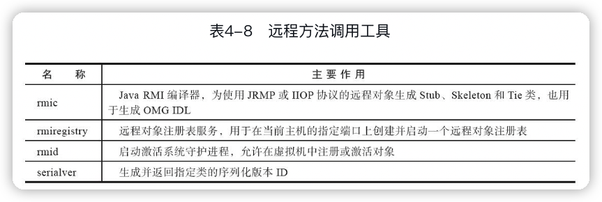

- 部署工具：用于程序打包、发布和部署

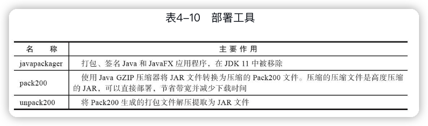

- REPL和脚本工具

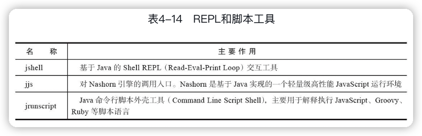

- 性能监控和故障处理：用于监控分析Java虚拟机运行信息，排查问题

### 4.3 可视化故障处理工具

JConsole、JHSDB、VisualVM和JMC

#### JHSDB：基于服务性代理的调试工具


#### JConsole：Java监视与管理控制台

JConsole（Java Monitoring and Management Console）是一款基于JMX（Java Manage-ment Extensions）的可视化监视、管理工具。


#### VisualVM：多合-故障处理工具

VisualVM（All-in-One Java Troubleshooting Tool）是功能最强大的运行监视和故障处理程序之一。


#### Java Mission Control：可持续在线的监控工具


#### 4.4 HotSpot虚拟机插件及工具


## 5 调优案例分析与实战

### 5.2　案例分析

#### 大内存硬件上的程序部署策略


#### 集群间同步导致的内存溢出


#### 堆外内存导致的溢出错误


#### 外部命令导致系统缓慢


#### 服务器虚拟机进程崩溃


#### 不恰当数据结构导致内存占用过大


#### 由Windows虚拟内存导致的长时间停顿


#### 由安全点导致长时间停顿


### 5.3 实战：Eclipse运行速度调优

#### 调优前的程序运行状态


#### 升级JDK版本的性能变化及兼容问题


#### 编译时间和类加载时间的优化


#### 调整内存设置控制垃圾收集频率


# 三、虚拟机执行子系统

## 6 类文件结构

代码编译的结果从本地机器码转变为字节码，是存储格式发展的一小步，却是编程语言发展的一大步。

### 6.1 概述

越来越多的程序语言选择了与操作系统和机器指令集无关的、平台中立的格式作为程序编译后的存储格式。

### 6.2 无关性的基石


### 6.3 Class类文件的结构

Java技术能够一直保持着非常良好的向后兼容性，**Class文件结构的稳定**功不可没。

尽管不同版本的《Java虚拟机规范》对Class文件格式进行了几次更新，但基本上**只是在原有结构基础上新增内容、扩充功能，并未对已定义的内容做出修改**。

任何一个Class文件都对应着唯一的一个类或接口的定义信息，但是反过来说，类或接口并不一定都得定义在文件里（譬如类或接口也可以动态生成，直接送入类加载器）。

Class文件是一组以8个字节为基础单位的二进制流，各个数据项目严格按照顺序紧凑地排列在文件之中，中间没有添加任何分隔符。

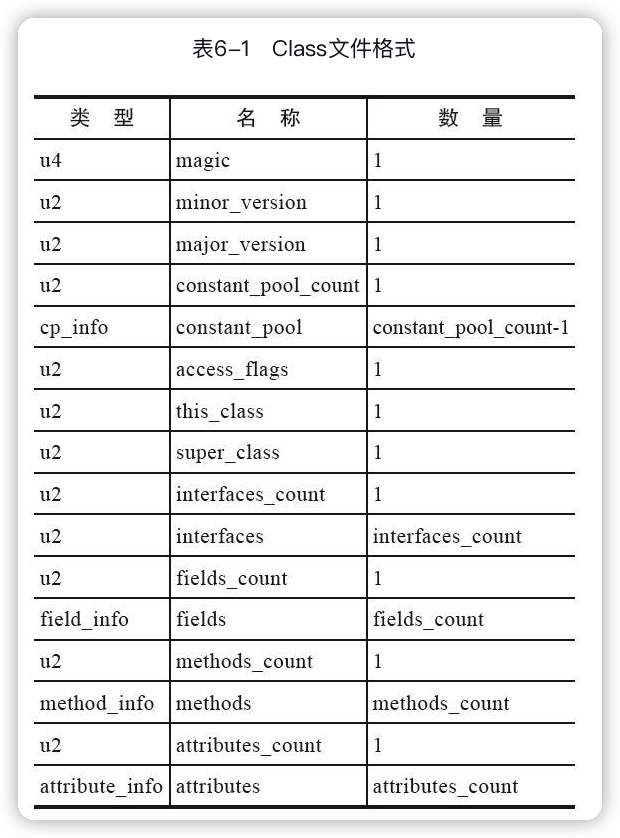

#### 魔数与Class文件的版本

每个Class文件的头4个字节被称为**魔数（Magic Number）**。

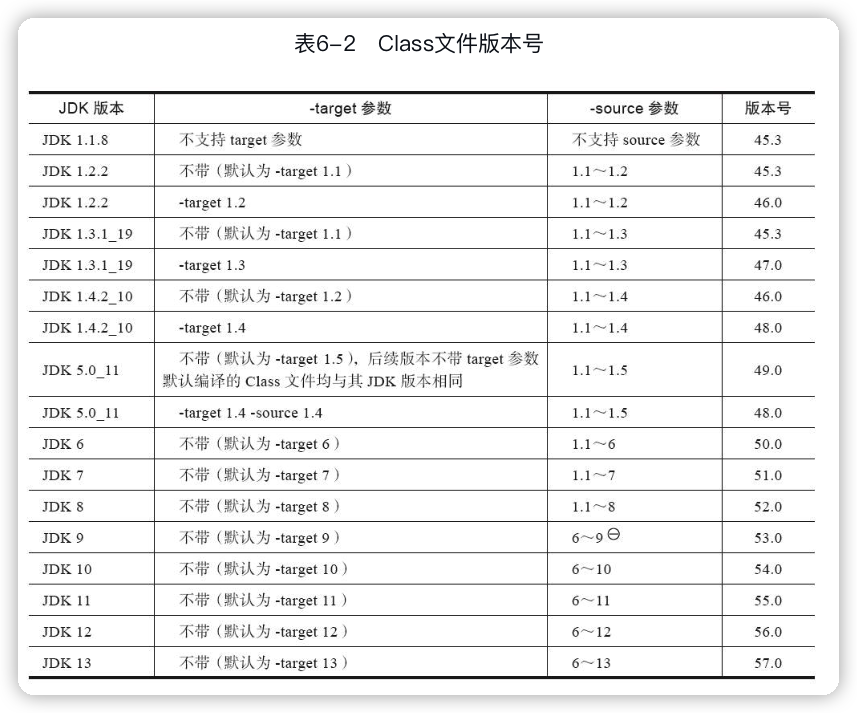

#### 常量池

紧接着主、次版本号之后的是常量池入口，常量池可以比喻为Class文件里的**资源仓库**，它是Class文件结构中与其他项目关联最多的数据，通常也是占用Class文件空间最大的数据项目之一，另外，它还是在Class文件中第一个出现的表类型数据项目。

常量池容量计数值（constant_pool_count）

常量池中主要存放两大类常量：字面量（Literal）和符号引用（SymbolicReferences）。

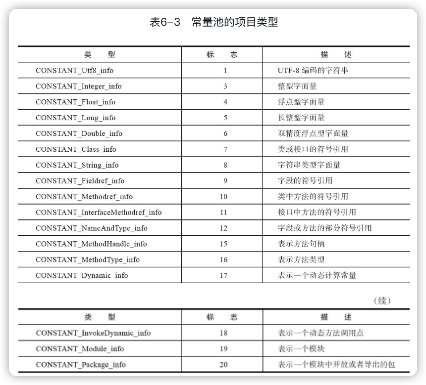


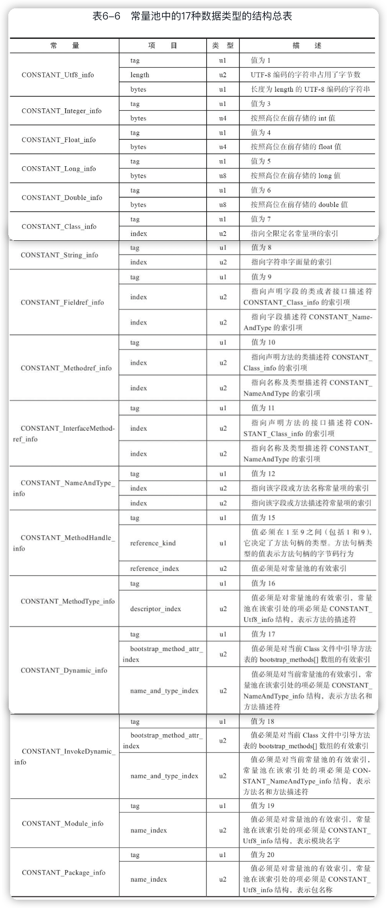

#### 访问标志

2个字节，访问标志（access_flags），这个标志用于**识别一些类或者接口层次的访问信息**，包括：这个Class是类还是接口；是否定义为public类型；是否定义为abstract类型；如果是类的话，是否被声明为final等等。

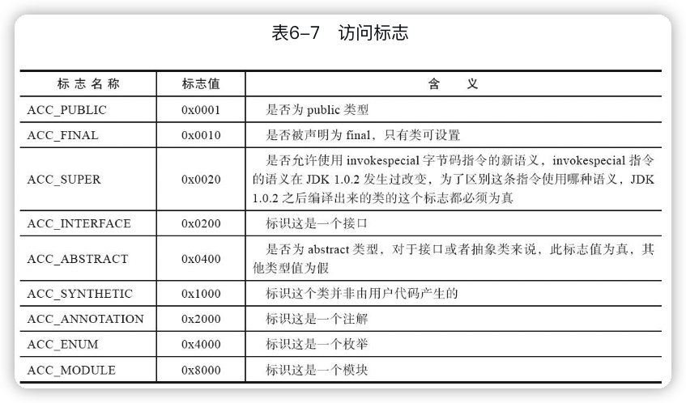

#### 类索引、父类索引与接口索引集合

类索引（this_class）和父类索引（super_class）都是一个u2类型的数据，而接口索引集合（interfaces）是一组u2类型的数据的集合，Class文件中由这三项数据来确定该类型的继承关系。


#### 字段表集合

字段表（field_info）用于描述接口或者类中声明的变量。

Java语言中的“字段”（Field）包括类级变量以及实例级变量，但不包括在方法内部声明的局部变量。

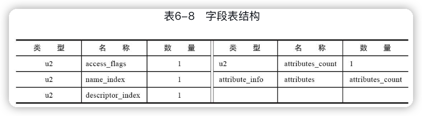

#### 方法表集合

Class文件存储格式中对方法的描述与对字段的描述采用了几乎完全一致的方式，方法表的结构如同字段表一样，依次包括访问标志（access_flags）、名称索引（name_index）、描述符索引（descriptor_index）、属性表集合（attributes）。


#### 属性表集合

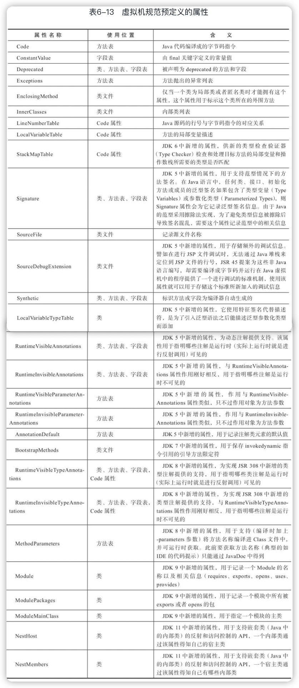

##### 1.Code属性


##### 2.Exceptions属性


##### 3.LineNumberTable属性


##### 4.LocalVariableTable及LocalVariableTypeTable属性


##### 5.SourceFile及SourceDebugExtension属性


##### 6.ConstantValue属性


##### 7.InnerClasses属性


##### 8.Deprecated及Synthetic属性


##### 9.StackMapTable属性


##### 10.Signature属性


##### 11.BootstrapMethods属性


##### 12.MethodParameters属性


##### 13.模块化相关属性


##### 14.运行时注解相关属性


### 6.4 字节码指令简介

Java虚拟机的指令由一个字节长度的、代表着某种特定操作含义的数字（称为**==操作码==**，Opcode）以及跟随其后的零至多个代表此操作所需的参数（称为**==操作数==**，Operand）构成。

#### 字节码与数据类型

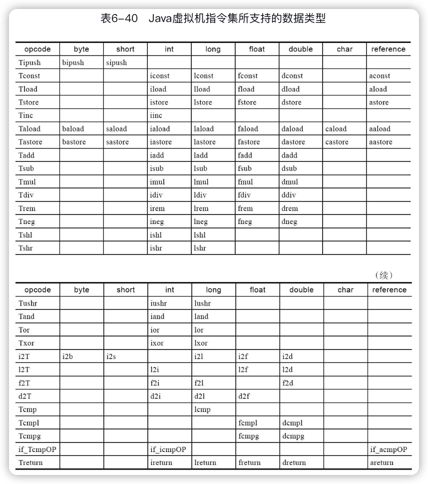

#### 加载和存储指令

加载和存储指令用于将数据在栈帧中的局部变量表和操作数栈之间来回传输，这类指令包括：

- 将一个局部变量加载到操作栈：

  ```
  iload、iload_<n>、lload、lload_<n>、fload、fload_<n>、dload、dload_<n>、aload、aload_<n>
  ```

- 将一个数值从操作数栈存储到局部变量表：

  ```
  istore、istore_<n>、lstore、lstore_<n>、fstore、fstore_<n>、dstore、dstore_<n>、astore、astore_<n>
  ```

- 将一个常量加载到操作数栈：

  ```
  bipush、sipush、ldc、ldc_w、ldc2_w、aconst_null、iconst_m1、iconst_<i>、lconst_<l>、fconst_<f>、dconst_<d>
  ```

- 扩充局部变量表的访问索引的指令：wide


#### 运算指令

运算指令可以分为两种：对整型数据进行运算的指令与对浮点型数据进行运算的指令。

- 加法指令：iadd、ladd、fadd、dadd
- 减法指令：isub、lsub、fsub、dsub
- 乘法指令：imul、lmul、fmul、dmul
- 除法指令：idiv、ldiv、fdiv、ddiv
- 求余指令：irem、lrem、frem、drem
- 取反指令：ineg、lneg、fneg、dneg
- 位移指令：ishl、ishr、iushr、lshl、lshr、lushr
- 按位或指令：ior、lor
- 按位与指令：iand、land
- 按位异或指令：ixor、lxor
- 局部变量自增指令：iinc
- 比较指令：dcmpg、dcmpl、fcmpg、fcmpl、lcmp


#### 类型转换指令


#### 对象创建与访问指令

- 创建类实例的指令：new
- 创建数组的指令：newarray、anewarray、multianewarray
- 访问类字段（static字段，或者称为类变量）和实例字段（非static字段，或者称为实例变量）的指令：getfield、putfield、getstatic、putstatic
- 把一个数组元素加载到操作数栈的指令：baload、caload、saload、iaload、laload、faload、daload、aaload
- 将一个操作数栈的值储存到数组元素中的指令：bastore、castore、sastore、iastore、fastore、dastore、aastore
- 取数组长度的指令：arraylength
- 检查类实例类型的指令：instanceof、checkcast


#### 操作数栈管理指令

- 将操作数栈的栈顶一个或两个元素出栈：pop、pop2
- 复制栈顶一个或两个数值并将复制值或双份的复制值重新压入栈顶：dup、dup2、dup_x1、dup2_x1、dup_x2、dup2_x2
- 将栈最顶端的两个数值互换：swap


#### 控制转移指令

- 条件分支：ifeq、iflt、ifle、ifne、ifgt、ifge、ifnull、ifnonnull、if_icmpeq、if_icmpne、if_icmplt、if_icmpgt、if_icmple、if_icmpge、if_acmpeq和if_acmpne
- 复合条件分支：tableswitch、lookupswitch
- 无条件分支：goto、goto_w、jsr、jsr_w、ret


#### 方法调用和返回指令

- invokevirtual指令：用于调用对象的实例方法，根据对象的实际类型进行分派（虚方法分派），这也是Java语言中最常见的方法分派方式。
- invokeinterface指令：用于调用接口方法，它会在运行时搜索一个实现了这个接口方法的对象，找出适合的方法进行调用。
- invokespecial指令：用于调用一些需要特殊处理的实例方法，包括实例初始化方法、私有方法和父类方法。
- invokestatic指令：用于调用类静态方法（static方法）。
- invokedynamic指令：用于在运行时动态解析出调用点限定符所引用的方法。并执行该方法。前面四条调用指令的分派逻辑都固化在Java虚拟机内部，用户无法改变，而invokedynamic指令的分派逻辑是由用户所设定的引导方法决定的。


#### 异常处理指令


#### 同步指令


### 6.5 公有设计，私有实现


### 6.6 Class文件结构的发展


## 7 虚拟机类加载机制

### 7.1　概述

**Java虚拟机把描述类的数据从Class文件加载到内存，并对数据进行校验、转换解析和初始化，最终形成可以被虚拟机直接使用的Java类型**，这个过程被称作**==虚拟机的类加载机制==**。


### 7.2　类加载的时机

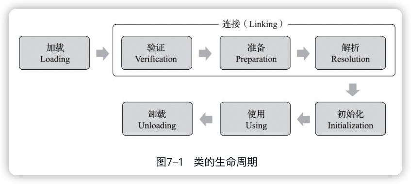

### 7.3　类加载的过程

#### 加载


#### 验证

确保Class文件的字节流中包含的信息符合《Java虚拟机规范》的全部约束要求，保证这些信息被当作代码运行后不会危害虚拟机自身的安全。

##### 1.文件格式验证


##### 2.元数据验证


##### 3.字节码验证


##### 4.符号引用验证


#### 准备


#### 解析


#### 初始化


### 7.4 类加载器

Java虚拟机设计团队有意把类加载阶段中的“通过一个类的全限定名来获取描述该类的二进制字节流”这个动作放到Java虚拟机外部去实现，以便让应用程序自己决定如何去获取所需的类。实现这个动作的代码被称为“类加载器”（ClassLoader）。

#### 类与类加载器


#### 双亲委派模型


#### 破坏双亲委派模型


### 7.5 Java模块化系统

#### 模块的兼容性


#### 模块化下的类加载器


## 8 虚拟机字节码执行引擎

### 8.1 概述

“虚拟机”是一个相对于“物理机”的概念，它们都有**代码执行能力**，它们的区别：

- 物理机的执行引擎是**直接建立在处理器、缓存、指令集和操作系统层面上的**；
- 虚拟机的执行引擎则是**由软件自行实现的**，因此可以**不受物理条件制约**地定制指令集与执行引擎的结构体系，能够执行那些不被硬件直接支持的指令集格式。

### 8.2 运行时栈帧结构

Java虚拟机以**方法**作为最基本的执行单元，**“栈帧”（Stack Frame）**则是用于支持虚拟机进行**方法调用和方法执行**背后的数据结构，它也是虚拟机运行时数据区中的虚拟机栈的栈元素。

每一个方法从调用开始至执行结束的过程，都对应着一个栈帧在虚拟机栈里面从入栈到出栈的过程。

“当前栈帧”（Current Stack Frame）

“当前方法”（Current Method）

#### 局部变量表

局部变量表（Local Variables Table）是一组变量值的存储空间，用于存放方法参数和方法内部定义的局部变量。

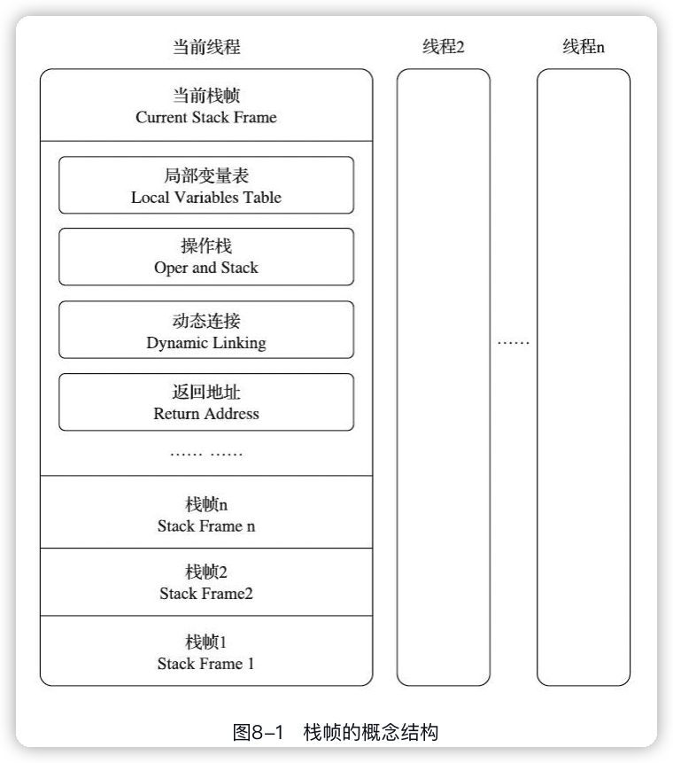

#### 操作数栈

操作数栈（Operand Stack）也常被称为操作栈。

操作数栈的最大深度在编译的时候被写入到Code属性的max_stacks数据项之中。

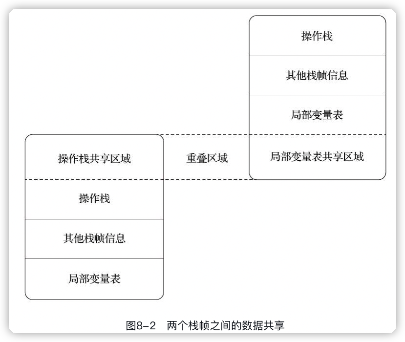

#### 动态连接

每个栈帧都包含一个指向运行时常量池中该栈帧所属方法的引用，持有这个引用是为了支持方法调用过程中的==**动态连接（Dynamic Linking）**==。

#### 方法返回地址

方法开始执行后，只有两种退出方式：

1. 方法返回的字节码指令。“正常调用完成”（Normal Method Invocation Completion）。
2. 异常。“异常调用完成（Abrupt MethodInvocation Completion）”

无论采用何种退出方式，在方法退出之后，都必须返回到==最初方法被调用时的位置==，程序才能继续执行，方法返回时可能需要在栈帧中保存一些信息，用来帮助==恢复它的上层主调方法的执行状态==。

#### 附加信息


### 8.3 方法调用

方法调用并不等同于方法中的代码被执行，方法调用阶段唯一的任务就是确定被调用方法的版本（即调用哪一个方法），暂时还未涉及方法内部的具体运行过程。

#### 解析


#### 分派

##### 1.静态分派


##### 2.动态分派


##### 3.单分派与多分派


##### 4.虚拟机动态分派的实现


### 8.4　动态类型语言支持

#### 动态类型语言

动态类型语言的关键特征是它的**类型检查的主体过程是在运行期而不是编译期进行的**。

#### Java与动态类型


#### java.lang.invoke包


#### invokedynamic指令


#### 实战：掌控方法分派规则


### 8.5　基于栈的字节码解释执行引擎

#### 解释执行

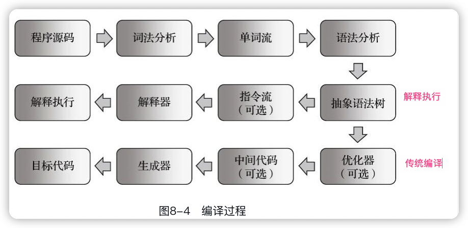

#### 基于栈的指令集与基于寄存器的指令集


#### 基于栈的解释器执行过程


## 9  类加载及执行子系统的案例与实战

### 9.2　案例分析

#### Tomcat：正统的类加载器架构


#### OSGi：灵活的类加载器架构

OSGi（Open Service Gateway Initiative）是OSGi联盟（OSGi Alliance）制订的一个基于Java语言的动态模块化规范。

Java世界中“事实上”的动态模块化标准


#### 字节码生成技术与动态代理的实现


动态代理的优势是可以在原始类和接口还未知的时候，就确定代理类的代理行为，当代理类与原始类脱离直接联系后，就可以很灵活地重用于不同的应用场景之中。


#### Backport工具：Java的时光机器


### 9.3　实战：自己动手实现远程执行功能


# 四、程序编译与代码优化

## 10 前端编译与优化

从计算机程序出现的第一天起，对效率的追逐就是程序员天生的坚定信仰，这个过程犹如一场没有终点、永不停歇的F1方程式竞赛，程序员是车手，技术平台则是在赛道上飞驰的赛车。

### 10.1 概述

前端编译器（叫“编译器的前端”更准确一些）：把`*.java`文件转变成`*.class`文件的过程。

- 前端编译器：JDK的Javac、Eclipse JDT中的增量式编译器（ECJ）。
- 即时编译器：HotSpot虚拟机的C1、C2编译器，Graal编译器。
- 提前编译器：JDK的Jaotc、GNU Compiler for the Java（GCJ）、Excelsior JET。

### 10.2 Javac编译器

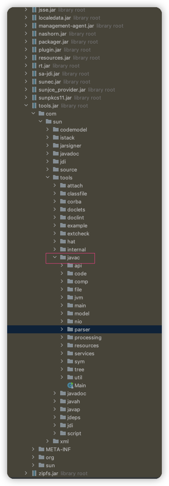

#### Javac的源码与调试


#### Javac的源码与调试

##### 1.词法、语法分析


##### 2.填充符号表


#### 注解处理器

插入式注解处理器可以看作是一组编译器的插件，当这些插件工作时，允许读取、修改、添加抽象语法树中的任意元素。


#### 语义分析与字节码生成

##### 1.标注检查

##### 2.数据及控制流分析

##### 3.解语法糖

##### 4.字节码生成


### 10.3 Java语法糖的味道

虽然不会提供实质性的功能改进，但是它们或能提高效率，或能提升语法的严谨性，或能减少编码出错的机会。

#### 泛型


#### 自动装箱、拆箱与遍历循环


#### 条件编译


### 10.4 实战：插入式注解处理器


## 11 后端编译与优化

### 11.1 概述

如果把字节码看作是程序语言的一种**中间表示形式（Intermediate Representation，IR）**的话，那编译器无论在何时、在何种状态下把Class文件转换成与本地基础设施（硬件指令集、操作系统）相关的二进制机器码，它都可以视为整个**编译过程的后端**。

后端编译器编译性能的好坏、代码优化质量的高低却是衡量一款商用虚拟机优秀与否的关键指标之一。

### 11.2 即时编译器

“热点代码”（Hot Spot Code）

#### 解释器与编译器

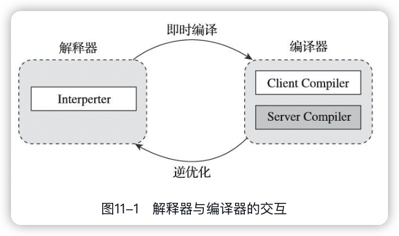

“客户端编译器”（ClientCompiler）和“服务端编译器”（Server Compiler），简称为C1编译器和C2编译器。

Graal编译器

分层编译（Tiered Compilation）

“混合模式”（MixedMode）

“解释模式”（Interpreted Mode）

“编译模式”（Compiled Mode）

```shell
➜ java -version
java version "1.8.0_311"
Java(TM) SE Runtime Environment (build 1.8.0_311-b11)
Java HotSpot(TM) 64-Bit Server VM (build 25.311-b11, mixed mode)
➜ java  -Xint -version
java version "1.8.0_311"
Java(TM) SE Runtime Environment (build 1.8.0_311-b11)
Java HotSpot(TM) 64-Bit Server VM (build 25.311-b11, interpreted mode)
➜ java  -Xcomp -version
java version "1.8.0_311"
Java(TM) SE Runtime Environment (build 1.8.0_311-b11)
Java HotSpot(TM) 64-Bit Server VM (build 25.311-b11, compiled mode)
```


#### 编译对象与触发条件

热点代码：

- 被多次调用的方法。
- 被多次执行的循环体。

#### 编译过程

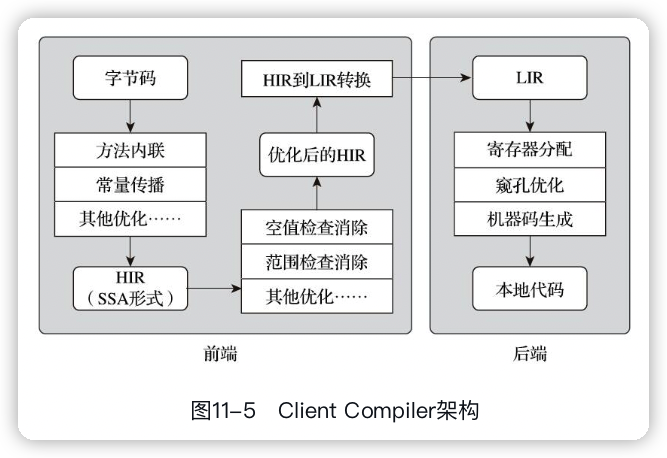

#### 实战：查看及分析即时编译结果


### 11.3 提前编译器

#### 提前编译的优劣得失


#### 实战：Jaotc的提前编译


### 11.4　编译器优化技术

#### 优化技术概览

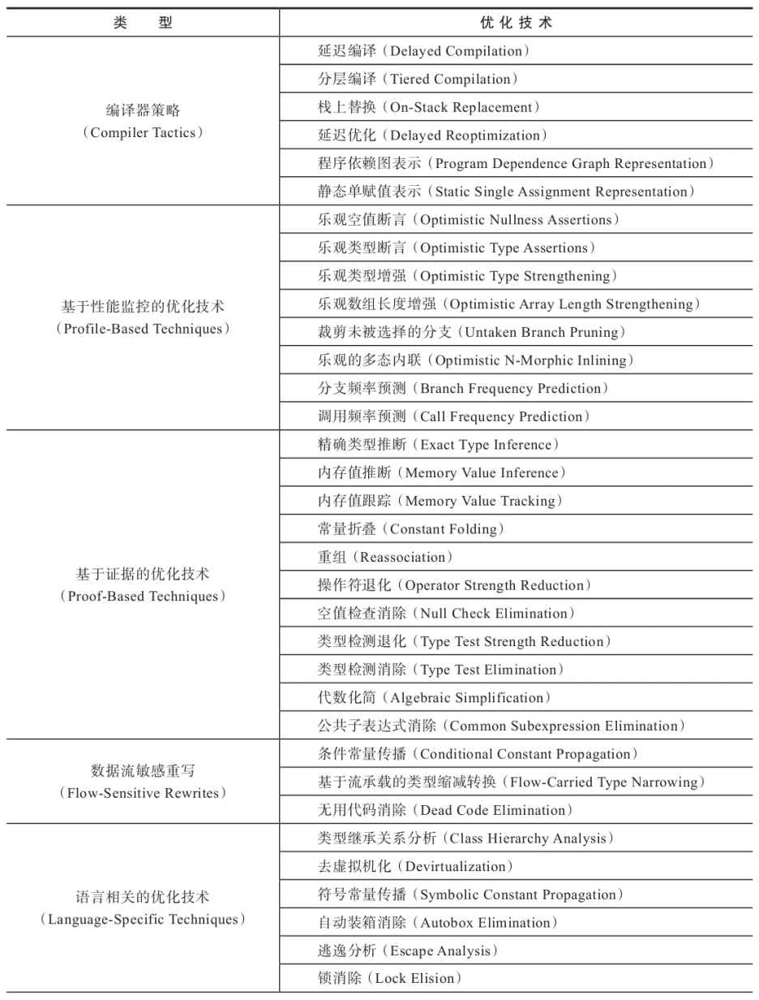

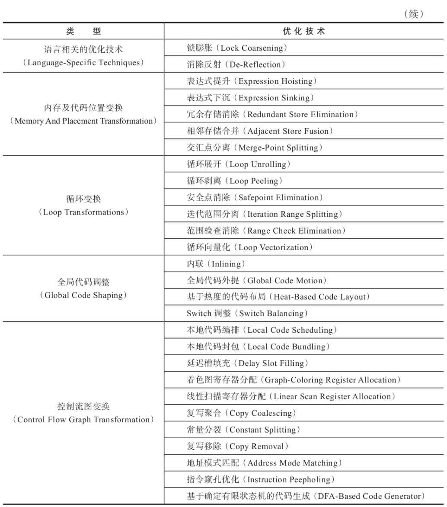

#### 方法内联


#### 逃逸分析


#### 公共子表达式消除


#### 数组边界检查消除


### 11.5 实战：深入理解Graal编译器

#### 历史背景


#### 构建编译调试环境


#### JVMCI编译器接口


#### 代码中间表示


#### 代码优化与生成


# 五、高效并发

## 12 Java内存模型与线程

并发处理的广泛应用是**Amdahl定律**代替摩尔定律成为计算机性能发展源动力的根本原因，也是人类压榨计算机运算能力的最有力武器。

### 12.1 概述

让计算机同时做几件事情的两个原因：

- 计算机的运算能力强大
- 计算机的运算速度与它的存储和通信子系统的速度差距太大，大量的时间都花费在磁盘I/O、网络通信或者数据库访问上

### 12.2 硬件的效率与一致性

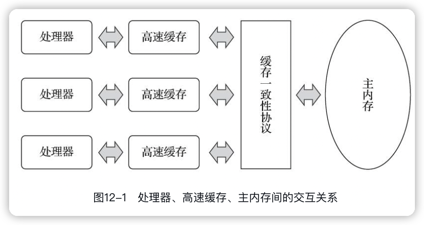

### 12.3 Java内存模型

“Java内存模型”（Java MemoryModel，JMM），来屏蔽各种硬件和操作系统的内存访问差异，以实现让Java程序在各种平台下都能达到一致的内存访问效果。

#### 主内存与工作内存

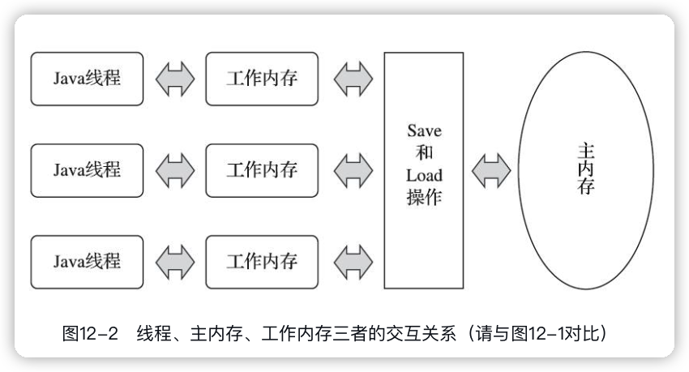

#### 内存间交互操作

主内存与工作内存之间的8种操作：

- lock（锁定）：作用于主内存的变量，它把一个变量标识为一条线程独占的状态。
- unlock（解锁）：作用于主内存的变量，它把一个处于锁定状态的变量释放出来，释放后的变量才可以被其他线程锁定。
- read（读取）：作用于主内存的变量，它把一个变量的值从主内存传输到线程的工作内存中，以便随后的load动作使用。
- load（载入）：作用于工作内存的变量，它把read操作从主内存中得到的变量值放入工作内存的变量副本中。
- use（使用）：作用于工作内存的变量，它把工作内存中一个变量的值传递给执行引擎，每当虚拟机遇到一个需要使用变量的值的字节码指令时将会执行这个操作。
- assign（赋值）：作用于工作内存的变量，它把一个从执行引擎接收的值赋给工作内存的变量，每当虚拟机遇到一个给变量赋值的字节码指令时执行这个操作。
- store（存储）：作用于工作内存的变量，它把工作内存中一个变量的值传送到主内存中，以便随后的write操作使用。
- write（写入）：作用于主内存的变量，它把store操作从工作内存中得到的变量的值放入主内存的变量中。

#### 对于volatile型变量的特殊规则


#### 针对long和double型变量的特殊规则


#### 原子性、可见性与有序性


#### 先行发生原则


### 12.4 Java与线程

#### 线程的实现


##### 1.内核线程实现


##### 2.用户线程实现


##### 3.混合实现


##### 4.Java线程的实现


#### Java线程调度

线程调度是指**系统为线程分配处理器使用权的过程**。两种：

- 协同式（Cooperative Threads-Scheduling）线程调度
- 抢占式（PreemptiveThreads-Scheduling）线程调度


#### 状态转换

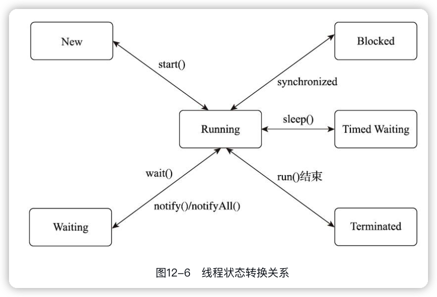

### 12.5 Java与协程

#### 内核线程的局限


#### 协程的复苏


#### Java的解决方案


## 13 线程安全与锁优化

### 13.1 概述

面向过程，站在计算机的角度去抽象问题和解决问题。

面向对象，站在现实世界的角度去抽象和解决问题。

现实世界与计算机世界之间不可避免地存在一些差异


### 13.2 线程安全

> “当多个线程同时访问一个对象时，如果不用考虑这些线程在运行时环境下的调度和交替执行，也不需要进行额外的同步，或者在调用方进行任何其他的协调操作，调用这个对象的行为都可以获得正确的结果，那就称这个对象是线程安全的。”
>
> —— 《Java并发编程实战（Java Concurrency In Practice）》的作者BrianGoetz

#### Java语言中的线程安全


#### 线程安全的实现方法

##### 1.互斥同步


##### 2.非阻塞同步


##### 3.无同步方案


### 13.3 锁优化

#### 自旋锁与自适应自旋


#### 锁消除


#### 锁粗化


#### 轻量级锁


#### 偏向锁
