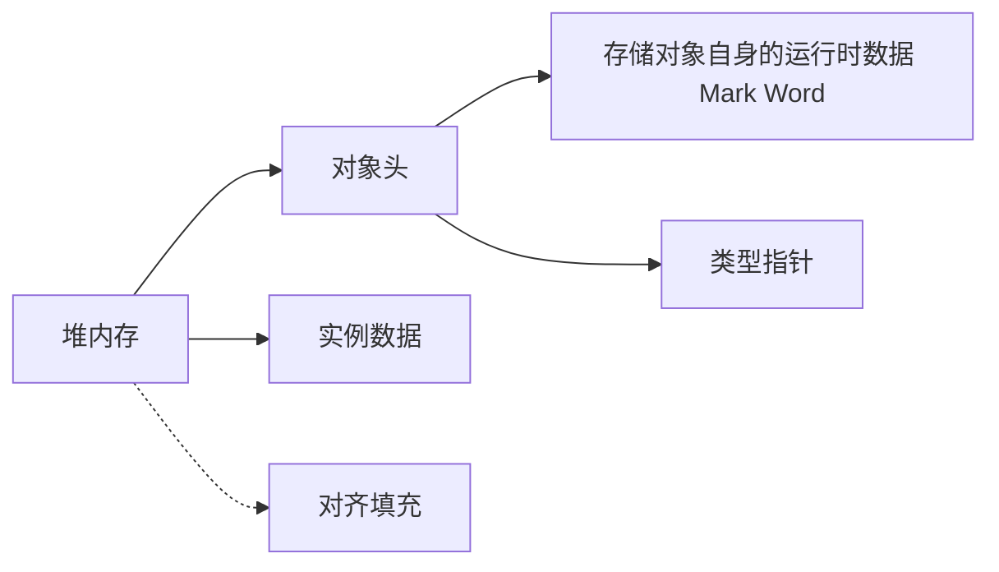

 《深入理解Java虚拟机（第3版）： JVM高级特性与最佳实践》笔记
------------------

[勘误](https://github.com/fenixsoft/jvm_book)

[Java虚拟机规范 和 Java语言规范](https://docs.oracle.com/javase/specs/index.html)

第3版出版于：2019-12

## 前言

Java的技术体系主要由支撑Java程序运行的**虚拟机**、提供各开发领域接口支持的**Java类库**、**Java编程语言**及许许多多的**第三方Java框架**（如Spring、MyBatis等）构成。

虚拟机层面隐藏了底层技术的复杂性以及机器与操作系统的差异性。

程序员可以把主要精力放在具体业务逻辑，而不是放在保障物理硬件的兼容性上。

绝大多数情况下，提升硬件性能无法等比例提升程序的运行性能和并发能力，甚至有可能对程序运行状况没有任何改善。两个原因：

- 一是JVM为了达到“所有硬件提供一致的虚拟平台”的目的，牺牲了一些硬件相关的性能特性。
- 二是人为原因，如果开发人员不了解虚拟机诸多技术特性的运行原理，就无法写出最适合虚拟机运行和自优化的代码。

商用的高性能JVM都提供了相当多的**优化参数和调节手段**，用于满足应用程序在实际生产环境中对性能和稳定性的要求。

# 一、走近Java

## 1 走近Java

> 世界上并没有完美的程序，但我们并不因此而沮丧，因为写程序本来就是一个不断追求完美的过程。

Java不可忽视的优点：

它**摆脱了硬件平台的束缚**，实现了“一次编写，到处运行”的理想；

它提供了一种**相对安全的内存管理和访问机制**，避免了绝大部分**内存泄漏和指针越界**问题；

它实现了**热点代码检测和运行时编译及优化**，这使得Java应用能随着运行时间的增长而获得更高的性能；

它有一套**完善的应用程序接口**，还有无数来自商业机构和开源社区的**第三方类库**来帮助用户实现各种各样的功能……


### Java技术体系

JCP（Java Community Process，也就是“Java社区”) 官方定义的Java技术体系：

- Java程序设计语言
- 各种硬件平台上的**Java虚拟机**实现
- Class文件格式
- Java类库API
- 来自商业机构和开源社区的**第三方Java类库**


**JDK**（Java Development Kit）：Java程序设计语言、Java虚拟机、Java类库。JDK是支持Java程序开发的最小环境，有时JDK就代指Java技术体系。

**JRE**（Java Runtime Environment）：类库API中的**Java SE API**子集和Java虚拟机。JRE是支持Java程序运行的标准环境。


按照技术所服务的领域，Java技术体系可分为四条产品线：

1. Java Card：支持Java小程序（Applets）运行在小内存设备（如智能卡）上的平台。
2. Java ME（Micro Edition）：支持Java程序运行在移动终端（手机、PDA）上的平台，对Java API有所精简，并加入了移动终端的针对性支持，这条产品线在JDK 6以前被称为J2ME。有一点读者请勿混淆，现在在智能手机上非常流行的、主要使用Java语言开发程序的Android并不属于Java ME。
3. Java SE（Standard Edition）：支持面向桌面级应用（如Windows下的应用程序）的Java平台，提供了完整的Java核心API，这条产品线在JDK 6以前被称为J2SE。
4. Java EE（Enterprise Edition）

### Java发展史


- 1991年4月，Oak。

- 1995年5月23日，Oak语言改名为Java，提出“Write Once，Run Anywhere”。

- 1996年1月23日，JDK 1.0发布，提供了一个纯解释执行的Java虚拟机实现（**Sun Classic VM**）。

- 1997年2月19日，Sun公司发布了JDK 1.1，JAR文件格式、JDBC、JavaBeans、RMI，内部类（Inner Class）和反射（Reflection）等。

- 1998年12月4日，JDK 1.2，拆分为三个方向，内置了**JIT（Just In Time）**即时编译器。

- 1999年4月27日，**HotSpot**虚拟机诞生。

- 2000年5月8日，JDK 1.3，改进Java类库上（如数学运算和新的Timer API等），JNDI。

- 2002年2月13日，JDK 1.4，标志着Java真正**走向成熟**，正则表达式、异常链、NIO、日志类、XML解析器和XSLT转换器等。

- 2004年9月30日，JDK 5，在Java语法易用性上做出了非常大的改进如：自动装箱、泛型、动态注解、枚举、可变长参数、遍历循环（foreach循环）等。

  JDK5改进了Java的内存模型（Java Memory Model，JMM）、提供了java.util.concurrent并发包等。

- 2006年12月11日，JDK 6，启用Java EE 6、Java SE 6、Java ME 6的新命名，提供初步的动态语言支持（通过内置Mozilla JavaScript Rhino引擎实现）、提供编译期注解处理器和微型HTTP服务器API，等。

  对Java虚拟机内部做了大量改进，包括锁与同步、垃圾收集、类加载等方面的实现都有相当多的改动。

- 2006年11月13日，Java开源，建立了OpenJDK组织

- 2009年4月20日，Oracle收购Sun。

  Java商标正式划归Oracle所有（Java语言本身并不属于哪间公司所有，它由**JCP**组织进行管理，尽管在JCP中Sun及后来的Oracle的话语权很大）。

- 2014年3月18日，JDK 8，Oracle启用**JEP（JDK Enhancement Proposals）**来定义和管理纳入新版JDK发布范围的功能特性。

  JEP 126：对Lambda表达式的支持，这让Java语言拥有了流畅的函数式表达能力。

  JEP 104：内置Nashorn JavaScript引擎的支持。

  JEP 150：新的时间、日期API。

  JEP 122：彻底移除HotSpot的永久代。

  ...

- 2017年9月21日，JDK 9，**Jigsaw**模块化功能。

  Java确实有模块化的刚需，不论是JDK自身（例如拆分出Java SE Embedded这样规模较小的产品）抑或是Java应用都需要用到模块化。

  JDK 9发布后，Oracle随即宣布Java将会以持续交付的形式和更加敏捷的研发节奏向前推进，以后JDK将会在每年的3月和9月各发布一个大版本，目的就是为**避免众多功能特性被集中捆绑到一个JDK版本上而引发交付风险**。

- 2018年3月20日，JDK 10，内部重构，诸如统一源仓库、统一垃圾收集器接口、统一即时编译器接口（JVMCI在JDK 9已经有了，这里是引入新的**Graal即时编译器**）等。

- 2018年9月25日，JDK 11，Oracle同时调整了JDK的授权许可证。

  首先，Oracle从JDK 11起把以前的商业特性全部开源给OpenJDK，这样OpenJDK 11和OracleJDK 11的代码和功能，在**本质上就是完全相同的**（官方原文是Essentially Identical）。

  然后，Oracle宣布以后将会同时发行两个JDK：一个是以GPLv2+CE协议下由Oracle发行的OpenJDK（本书后面章节称其为Oracle OpenJDK），另一个是在新的OTN协议下发行的传统的OracleJDK，这两个JDK共享绝大部分源码，在功能上是几乎一样的，核心差异是前者可以免费在开发、测试或生产环境中使用，但是只有半年时间的更新支持；后者个人依然可以免费使用，但若在生产环境中商用就必须付费，可以有三年时间的更新支持。

  如果说由此能得出“Java要收费”的结论，那是纯属标题党，最多只能说Oracle在迫使商业用户要么不断升级JDK的版本，要么就去购买商业支持。

- 2019年3月20日，JDK 12，Switch表达式、Java微测试套件（JMH）等。


在Sun掌舵的前十几年里，Java获得巨大成功，同时也渐渐显露出来语言演进的缓慢与社区决策的老朽；而在Oracle主导Java后，引起竞争的同时也带来新的活力，Java发展的速度要显著高于Sun时代。

### Java虚拟机家族

#### 1 虚拟机始祖：Sun Classic/Exact VM

只能使用纯解释器方式来执行Java代码软件

#### 2 武林盟主：HotSpot VM

热点代码探测技术

#### 3 小家碧玉：Mobile/Embedded VM


#### 4 天下第二：BEA JRockit/IBM J9 VM


#### 5 软硬合璧：BEA Liquid VM/Azul VM


#### 6 挑战者：Apache Harmony/Google Android Dalvik VM


#### 7 没有成功，但并非失败：Microsoft JVM及其他


#### 8 百家争鸣

KVM

Java Card VM

Squawk VM

JavaInJava

...

### 展望Java技术的未来

##### 无语言倾向

Java“天下第一”的底气不在于语法多么先进好用，而是来自它**庞大的用户群和极其成熟的软件生态**，这在朝夕之间难以撼动。

**Graal VM**


Graal VM被官方称为“Universal VM”和“Polyglot VM”，这是一个在HotSpot虚拟机基础上增强而成的**跨语言全栈虚拟机**，可以作为“任何语言”的运行平台使用，这里“任何语言”包括了Java、Scala、Groovy、Kotlin等基于Java虚拟机之上的语言，还包括了C、C++、Rust等基于LLVM的语言，同时支持其他像JavaScript、Ruby、Python和R语言等。

Graal VM的基本工作原理是将这些语言的源代码（例如JavaScript）或源代码编译后的中间格式（例如LLVM字节码）通过解释器转换为能被Graal VM接受的中间表示（Intermediate Representation，IR），譬如设计一个解释器专门对LLVM输出的字节码进行转换来支持C和C++语言，这个过程称为**程序特化**（Specialized，也常被称为PartialEvaluation）。Graal VM提供了Truffe工具集来快速构建面向一种新语言的解释器，并用它构建了一个称为Sulong的高性能LLVM字节码解释器。

从更严格的角度来看，Graal VM才是**真正意义上与物理计算机相对应的高级语言虚拟机**，理由是它与物理硬件的指令集一样，做到了只与机器特性相关而不与某种高级语言特性相关。

#### 新一代即时编译器

HotSpot虚拟机中含有两个即时编译器，分别是编译耗时短但输出代码优化程度较低的客户端编译器（简称为C1）以及编译耗时长但输出代码优化质量也更高的服务端编译器（简称为C2）。

Graal编译器

#### 向Native迈进

对不需要长时间运行的，或者小型化的应用而言，Java天生就带有一些劣势。Java的启动时间相对较长，需要预热才能达到最高性能。

AWS Lambda

提前编译（Aheadof Time Compilation，AOT）

Substrate VM

#### 语言语法持续增强

### 实战：自己编译JDK🔖

#### 获取源码

[OpenJDK](http://openjdk.java.net/ )

https://github.com/openjdk/jdk

[OpenJDK 12](https://hg.openjdk.java.net/jdk/jdk12/)


#### 系统需求

认真阅读一遍doc/building.html


#### 构建编译环境


#### 进行编译


#### 在IDE工具中进行源码调试


# 二、自动内存管理

## 2 Java内存区域与内存溢出异常

### 2.2 运行时数据区域

Java虚拟机在执行Java程序的过程中会把它所管理的内存划分为若干个不同的数据区域。


#### 程序计数器（线程私有）

**程序计数器（Program Counter Register）**是一块较小的内存空间，它可以看作是当前线程所执行的**==字节码的行号==**指示器。

字节码解释器工作时就是通过改变这个计数器的值来选取下一条需要执行的字节码指令。

如果线程正在执行的是一个Java方法，这个计数器记录的是正在执行的虚拟机**字节码指令的地址**；如果正在执行的是本地（Native）方法，这个计数器值则应为**空（Undefined）**。


#### Java虚拟机栈（线程私有）

Java虚拟机栈（Java Virtual Machine Stack）的命周期与线程相同。

虚拟机栈描述的是Java方法执行的线程内存模型：每个方法被执行的时候，Java虚拟机都会同步创建一个栈帧（Stack Frame）用于存储**==局部变量表、操作数栈、动态连接、方法出口==**等信息。

局部变量表存放了编译期可知的各种Java虚拟机**基本数据类型**（boolean、byte、char、short、int、foat、long、double）、**对象引用**（reference类型，它并不等同于对象本身，可能是一个指向对象起始地址的引用指针，也可能是指向一个代表对象的句柄或者其他与此对象相关的位置）和**returnAddress类型**（指向了一条字节码指令的地址）。

局部变量槽（Slot）

StackOverflowError

OutOfMemoryError


#### 本地方法栈（线程私有）

本地方法栈（Native Method Stacks）与虚拟机栈所发挥的作用是非常相似的，其区别只是虚拟机栈为虚拟机执行Java方法（也就是字节码）服务，而本地方法栈则是为虚拟机使用到的本地（Native）方法服务。


#### Java堆（线程共享）

Java堆（Java Heap）是虚拟机所管理的内存中最大的一块，所有线程共享，虚拟机启动时创建，唯一目的就是**==存放对象实例==**和**==数组==**。

Java堆是垃圾收集器管理的内存区域，有时也被称作“**GC堆**”（Garbage Collected Heap）。

由于现代垃圾收集器大部分都是基于**分代收集理论**设计的，所以Java堆中经常会出现“新生代”“老年代”“永久代”“Eden空间”“From Survivor空间”“ToSurvivor空间”等名词，但这些并非Java虚拟机具体实现的固有内存布局，更不是《Java虚拟机规范》里对Java堆的进一步细致划分。

分配缓冲区（Thread Local Allocation Buffer，TLAB）

将Java堆细分的目的**只是为了更好地回收内存，或者更快地分配内存**。

Java堆可以处于物理上不连续的内存空间中，但在逻辑上它应该被视为连续的。

Java堆大小可通过参数-Xmx和-Xms设定来扩展。

OutOfMemoryError


#### 方法区（线程共享）

方法区用于存储已被虚拟机加载的**==类信息、常量、静态变量、即时编译器编译后的代码缓存==**等数据。

OutOfMemoryError

#### 运行时常量池（方法区的一部分）

Class文件中除了有类的版本、字段、方法、接口等描述信息外，还有一项信息是常量池表（Constant Pool Table），用于存放编译期生成的**各种字面量与符号引用**，这部分内容将在类加载后存放到方法区的运行时常量池（Runtime Constant Pool）中。

Java虚拟机对于Class文件每一部分（自然也包括常量池）的格式都有严格规定。


#### 直接内存

直接内存（Direct Memory）并不是虚拟机运行时数据区的一部分，也不是《Java虚拟机规范》中定义的内存区域。但是这部分内存也被频繁地使用，而且也可能导致OutOfMemoryError异常出现。


### 2.3 HotSpot虚拟机对象探秘

#### 对象的创建

```c++
// 确保常量池中存放的是已解释的类
if (!constants->tag_at(index).is_unresolved_klass()) {
    // 断言确保是klassOop和instanceKlassOop（这部分下一节介绍）
    oop entry = (klassOop) *constants->obj_at_addr(index);
    assert(entry->is_klass(), "Should be resolved klass");
    klassOop k_entry = (klassOop) entry;
    assert(k_entry->klass_part()->oop_is_instance(), "Should be instanceKlass");
    instanceKlass* ik = (instanceKlass*) k_entry->klass_part();
    // 确保对象所属类型已经经过初始化阶段
    if ( ik->is_initialized() && ik->can_be_fastpath_allocated() ) {
        // 取对象长度
        size_t obj_size = ik->size_helper();
        oop result = NULL;
        // 记录是否需要将对象所有字段置零值
        bool need_zero = !ZeroTLAB;
        // 是否在TLAB中分配对象
        if (UseTLAB) {
            result = (oop) THREAD->tlab().allocate(obj_size);
        }
        if (result == NULL) {
            need_zero = true;
            // 直接在eden中分配对象
retry:
            HeapWord* compare_to = *Universe::heap()->top_addr();
            HeapWord* new_top = compare_to + obj_size;
            // cmpxchg是x86中的CAS指令，这里是一个C++方法，通过CAS方式分配空间，并发失败的
               话，转到retry中重试直至成功分配为止
            if (new_top <= *Universe::heap()->end_addr()) {
                if (Atomic::cmpxchg_ptr(new_top, Universe::heap()->top_addr(), compare_to) != compare_to) {
                    goto retry;
                }
                result = (oop) compare_to;
            }
        }
        if (result != NULL) {
            // 如果需要，为对象初始化零值
            if (need_zero ) {
                HeapWord* to_zero = (HeapWord*) result + sizeof(oopDesc) / oopSize;
                obj_size -= sizeof(oopDesc) / oopSize;
                if (obj_size > 0 ) {
                    memset(to_zero, 0, obj_size * HeapWordSize);
                }
            }
            // 根据是否启用偏向锁，设置对象头信息
            if (UseBiasedLocking) {
                result->set_mark(ik->prototype_header());
            } else {
                result->set_mark(markOopDesc::prototype());
            }
            result->set_klass_gap(0);
            result->set_klass(k_entry);
            // 将对象引用入栈，继续执行下一条指令
            SET_STACK_OBJECT(result, 0);
            UPDATE_PC_AND_TOS_AND_CONTINUE(3, 1);
        }
    }
}
```


#### 对象的内存布局



HotSpot虚拟机对象的**对象头**部分包括两类信息。

1. 用于**存储对象自身的运行时数据**，如哈希码（HashCode）、GC分代年龄、锁状态标志、线程持有的锁、偏向线程ID、偏向时间戳等。

2. **类型指针**，即对象指向它的类型元数据的指针。

**实例数据**，无论是从父类继承下来的，还是在子类中定义的字段都必须记录起来。存储顺序会受到**虚拟机分配策略参数**（-XX：FieldsAllocationStyle参数）和字段在Java源码中**定义顺序**的影响。

HotSpot虚拟机默认的分配顺序为<u>longs/doubles、ints、shorts/chars、bytes/booleans、oops（Ordinary Object Pointers，OOPs）</u>。

**对齐填充**

#### 对象的访问定位

Java程序会通过栈上的**reference**数据来操作堆上的具体对象。由于reference类型在《Java虚拟机规范》里面只规定了它是一个指向对象的引用，并<u>没有定义这个引用应该通过什么方式去定位、访问到堆中对象的具体位置</u>，所以对象访问方式也是由虚拟机实现而定的。

主流的访问方式主要有两种：

1. 句柄


2. 直接指针

速度更快，HotSpot


### 2.4 实战：OutOfMemoryError异常

#### Java堆溢出


#### 虚拟机栈和本地方法栈溢出


#### 方法区和运行时常量池溢出


#### 本机直接内存溢出


## 3 垃圾收集器与内存分配策略

### 3.1　概述

垃圾收集（Garbage Collection，GC）

1960，Lisp，内存动态分配和垃圾收集技术，John McCarthy思考垃圾收集要完成的三件事：

- 哪些内存需要回收？
- 什么时候回收？
- 如何回收？

> 为什么我们还要去了解垃圾收集和内存分配？
>
> 需要排查各种内存溢出、内存泄漏问题时，当垃圾收集成为系统达到更高并发量的==瓶颈==时，我们就必须对这些“自动化”的技术实施必要的==监控和调节==。

Java堆和方法区有着很显著的不确定性：<u>一个接口的多个实现类需要的内存可能会不一样，一个方法所执行的不同条件分支所需要的内存也可能不一样，只有处于运行期间，我们才能知道程序究竟会创建哪些对象，创建多少个对象，这部分内存的分配和回收是动态的。</u>

### 3.2 对象已死？

#### 引用计数算法

```java
/**
 * testGC()方法执行后，objA和objB会不会被GC呢？
 * @author zzm
 */
public class ReferenceCountingGC {

    public Object instance = null;

    private static final int _1MB = 1024 * 1024;

    /**
     * 这个成员属性的唯一意义就是占点内存，以便能在GC日志中看清楚是否有回收过
     */
    private byte[] bigSize = new byte[2 * _1MB];

    public static void testGC() {
        ReferenceCountingGC objA = new ReferenceCountingGC();
        ReferenceCountingGC objB = new ReferenceCountingGC();
        objA.instance = objB;
        objB.instance = objA;

        objA = null;
        objB = null;

        // 假设在这行发生GC，objA和objB是否能被回收？
        System.gc();
    }
}
```


#### 可达性分析算法


#### 再谈引用


#### 生存还是死亡？


#### 回收方法区


### 3.3 垃圾收集算法

收集理论和几种算法思想及其发展过程

#### 分代收集理论


#### 标记-清除算法


#### 标记-复制算法


#### 标记-整理算法


### 3.4 HotSpot的算法细节实现

#### 根节点枚举


#### 安全点


#### 安全区域


#### 记忆集与卡表


#### 写屏障


#### 并发的可达性分析


### 3.5 经典垃圾收集器

收集算法是内存回收的方法论，垃圾收集器就是内存回收的实践者。


#### Serial收集器


#### ParNew收集器


#### Parallel Scavenge收集器


#### Serial Old收集器


#### Parallel Old收集器


#### CMS收集器


#### Garbage First收集器


### 3.6 低延迟垃圾收集器

#### Shenandoah收集器


#### ZGC收集器


### 3.7 选择合适的垃圾收集器

#### Epsilon收集器


#### 收集器的权衡


#### 虚拟机及垃圾收集器日志


#### 垃圾收集器参数总结


### 3.8 实战：内存分配与回收策略

#### 对象优先在Eden分配


#### 大对象直接进入老年代


#### 长期存活的对象将进入老年代


#### 动态对象年龄判定


#### 空间分配担保
